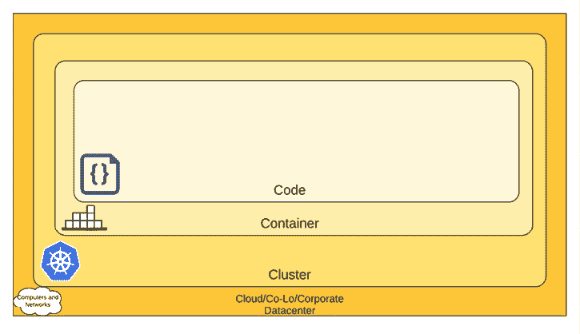
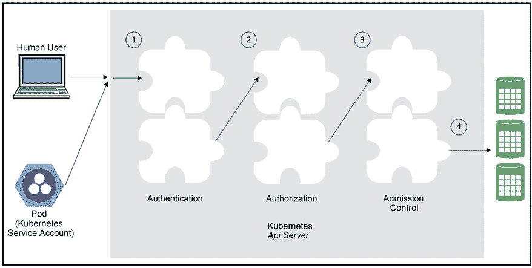
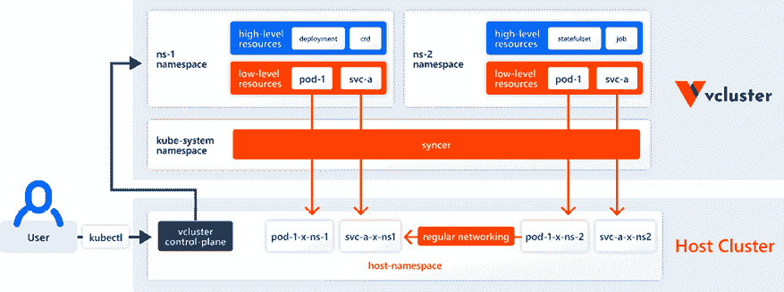

# 第四章：保护 Kubernetes

在*第三章*，*高可用性与可靠性*中，我们探讨了可靠且高可用的 Kubernetes 集群、基本概念、最佳实践，以及与可扩展性、性能和成本相关的许多设计权衡。

在本章中，我们将探讨安全这个重要话题。Kubernetes 集群是由多个交互组件组成的复杂系统。不同层次的隔离和分区在运行关键应用程序时非常重要。为了确保系统的安全并确保对资源、功能和数据的适当访问，我们必须首先了解 Kubernetes 作为一个通用编排平台，面临的独特挑战，它运行的是未知的工作负载。然后，我们可以利用各种安全性、隔离和访问控制机制，确保集群、运行其上的应用程序以及数据的安全。我们将讨论各种最佳实践，并在适当的时候使用每种机制。

本章将探讨以下主要主题：

+   理解 Kubernetes 的安全挑战

+   加固 Kubernetes

+   运行多租户集群

到本章结束时，你将对 Kubernetes 的安全挑战有一个良好的理解。你将获得如何加固 Kubernetes 以防范各种潜在攻击的实用知识，建立纵深防御，并能够安全地运行一个多租户集群，同时为不同用户提供完全的隔离和对其集群部分的完全控制。

# 理解 Kubernetes 的安全挑战

Kubernetes 是一个非常灵活的系统，以通用方式管理非常底层的资源。Kubernetes 本身可以部署在多种操作系统、硬件或虚拟机解决方案上，无论是本地部署还是云环境。Kubernetes 通过与运行时交互的明确定义的运行时接口运行工作负载，但无需理解它们是如何实现的。Kubernetes 代表或服务于其不了解的应用程序，操作着关键资源，如网络、DNS 和资源分配。

这意味着 Kubernetes 面临着一个艰巨的任务：在提供良好的安全机制和能力的同时，确保应用程序开发人员和集群管理员可以使用这些机制，同时保护自己、开发人员和管理员免受常见错误的影响。

在本节中，我们将讨论 Kubernetes 集群中几个层次或组件的安全挑战：节点、网络、镜像、Pods 和容器。纵深防御是一个重要的安全概念，要求系统在每个层级都能够自我保护，既能缓解渗透其他层的攻击，又能限制破坏的范围和程度。认识到每个层次的挑战是实现纵深防御的第一步。

这通常被描述为云原生安全的 4 个 C：



图 4.1：云原生安全的四个关键 C

然而，四个 C 模型是安全性的一种粗粒度方法。另一种方法是基于不同维度的安全挑战建立威胁模型，例如：

+   节点挑战

+   网络挑战

+   图像挑战

+   部署和配置挑战

+   Pod 和容器的挑战

+   组织、文化和流程挑战

让我们检查这些挑战。

## 节点挑战

节点是运行时引擎的主机。如果攻击者访问节点，这是一个严重威胁。他们至少可以控制主机本身和运行在其上的所有工作负载。但情况可能会更糟。

节点上运行一个与 API 服务器通信的 kubelet。一个高级的攻击者可以用修改过的 kubelet 替换它，并通过正常通信与 Kubernetes API 服务器通信，而运行他们自己的工作负载而不是计划的工作负载，收集关于整个集群的信息，并通过发送恶意消息干扰 API 服务器和集群的其余部分。攻击者将访问共享资源和可能允许其更深入渗透的秘密。节点入侵非常严重，因为可能造成的损害和事后检测的困难性。

节点也可以在物理级别上受到损害。这在裸机上更为相关，您可以查看哪些硬件分配给了 Kubernetes 集群。

另一个攻击向量是资源耗尽。想象一下，您的节点成为一个与您的 Kubernetes 集群无关的机器人网络的一部分，只运行自己的工作负载，如加密货币挖矿，耗尽 CPU 和内存。这里的危险在于，您的集群将窒息并耗尽运行工作负载所需的资源，或者您的基础架构可能会自动扩展并分配更多资源。

另一个问题是在自动化部署之外安装调试和故障排除工具或修改配置。这些通常是未经测试的，如果留下并保持活跃状态，至少会导致性能下降，但也可能导致更严重的问题。至少，它会增加攻击面。

在关注安全性时，这是一个数字游戏。您需要了解系统的攻击面和脆弱性所在。让我们列出一些可能的节点挑战：

+   攻击者控制主机

+   攻击者替换 kubelet

+   攻击者控制运行主控组件的节点（例如 API 服务器、调度器或控制器管理器）

+   攻击者获得对节点的物理访问

+   攻击者耗尽与 Kubernetes 集群无关的资源

+   安装调试和故障排除工具或配置更改会造成自我损害

缓解节点挑战需要多层防御，例如控制物理访问、阻止权限升级以及通过控制节点上安装的操作系统和软件来减少攻击面。

## 网络挑战

任何一个非简单的 Kubernetes 集群至少跨越一个网络。与网络相关的挑战很多。你需要非常细致地了解你的系统组件是如何连接的。哪些组件应该互相通信？它们使用哪些网络协议？使用哪些端口？它们交换哪些数据？你的集群如何与外界连接？

曝露端口和能力或服务的过程复杂：

+   容器到主机

+   内部网络中的主机对主机

+   主机对世界

使用覆盖网络（将在*第十章*《探索 Kubernetes 网络》中详细讨论）有助于增强防御深度，即使攻击者获得了对容器的访问权限，他们也被沙箱隔离，无法逃逸到底层网络的基础设施。

发现组件也是一个巨大的挑战。这里有几个选项，例如 DNS、专用发现服务和负载均衡器。每个选项都有一组优缺点，需要仔细的规划和洞察才能根据你的情况正确配置。确保两个容器能够互相发现并交换信息并非易事。

你需要决定哪些资源和端点应该对外部可访问。然后，你需要想出一种合适的方式来验证用户、服务身份，并授权它们操作资源。你可能还需要控制内部服务之间的访问。

敏感数据必须在进出集群的过程中进行加密，有时在静态存储时也需要加密。这意味着密钥管理和安全密钥交换，这是解决安全问题中最困难的问题之一。

如果你的集群与其他 Kubernetes 集群或非 Kubernetes 进程共享网络基础设施，那么你必须小心隔离和分离。

解决方案包括网络策略、防火墙规则和**软件定义网络**（**SDN**）。这套方案通常需要定制化。对于本地部署和裸机集群来说，这尤其具有挑战性。以下是你将面临的一些网络挑战：

+   制定连接计划

+   选择组件、协议和端口

+   确定动态发现

+   公共访问与私有访问

+   身份验证和授权（包括内部服务之间）

+   设计防火墙规则

+   决定网络策略

+   密钥管理和交换

+   加密通信

在网络层面上，容器、用户和服务之间互相发现和通信的便利性与通过网络或对网络本身的攻击进行访问控制之间始终存在着一种紧张关系。

许多这些挑战并非 Kubernetes 特有。然而，Kubernetes 作为一个管理关键基础设施并处理低层次网络的通用平台，使得我们必须考虑动态和灵活的解决方案，这些方案可以将系统特定的需求整合进 Kubernetes 中。这些解决方案通常涉及监控，并根据命名空间和 Pod 标签自动注入防火墙规则或应用网络策略。

## 镜像挑战

Kubernetes 运行符合其某个运行时引擎标准的容器。它并不知道这些容器在做什么（除了收集度量数据）。你可以通过配额对容器设置某些限制。你还可以通过网络策略限制它们对网络其他部分的访问。但最终，容器确实需要访问主机资源、网络中的其他主机、分布式存储和外部服务。镜像决定了容器的行为。臭名昭著的软件供应链问题正是这些容器镜像创建方式的核心。镜像存在两类问题：

+   恶意镜像

+   脆弱的镜像

恶意镜像是指那些包含攻击者设计的代码或配置，目的是造成伤害、收集信息，或者仅仅是利用你的基础设施为其目的服务（例如，进行加密货币挖矿）。恶意代码可能会被注入到你的镜像准备流程中，包括你使用的任何镜像仓库。或者，你可能会安装那些已经被攻击并且现在包含恶意代码的第三方镜像。

脆弱的镜像是你设计的镜像（或你安装的第三方镜像），它恰巧包含了一些漏洞，允许攻击者控制正在运行的容器或造成其他伤害，包括稍后注入他们自己的代码。

很难判断哪种情况更糟。极端情况下，它们是等价的，因为它们都允许完全控制容器。现有的其他防御措施（记得深度防御吗？）以及你对容器设置的限制将决定它能造成多大的损害。最大限度地减少不良镜像的危害非常具有挑战性。快速发展的公司使用微服务可能每天都会生成许多镜像。验证镜像也不是一项简单的任务。此外，一些容器需要广泛的权限来完成其合法工作。如果这样的容器被攻破，它可以造成极大的损害。

包含操作系统的基础镜像可能会在发现新的漏洞时变得脆弱。此外，如果你依赖于他人准备的基础镜像（这非常常见），那么恶意代码可能会进入这些你无法控制的基础镜像，而你却会完全信任它们。

当发现第三方依赖项中的漏洞时，理想情况下已经有了修复版本，你应该尽快进行修补。

我们可以总结出开发者可能面临的镜像挑战如下：

+   Kubernetes 无法了解容器的行为

+   Kubernetes 必须为指定的功能提供对敏感资源的访问

+   很难保护镜像准备和交付管道（包括镜像仓库）

+   新镜像的开发和部署速度与对变更的仔细审查相冲突

+   包含操作系统或其他常见依赖项的基础镜像容易过时并变得脆弱

+   基础镜像通常不在你的控制之下，可能更容易被注入恶意代码

将静态镜像分析器，如 CoreOS Clair 或 Anchore Engine，集成到你的 CI/CD 流水线中可以帮助很多。此外，通过限制容器仅访问执行其工作所需的资源来最小化爆炸范围，可以在容器被攻破时减少对系统的影响。你还必须对已知漏洞的修复保持谨慎。

## 配置和部署挑战

Kubernetes 集群是远程管理的。各种清单和策略决定了集群在每个时刻的状态。如果攻击者获得了对集群的管理权限，他们可以造成严重破坏，例如收集信息、注入恶意镜像、削弱安全性以及篡改日志。像往常一样，漏洞和错误同样具有危害；如果忽视了重要的安全措施，你将使集群暴露于攻击中。现在很常见的是，拥有集群管理权限的员工远程工作，无论是在家还是在咖啡店，他们带着笔记本电脑，其中你只需要执行一个 kubectl 命令，就能打开大门。

让我们重申一下挑战：

+   Kubernetes 是远程管理的

+   拥有远程管理权限的攻击者可以完全控制集群

+   配置和部署通常比代码更难测试

+   远程或离线员工面临长时间暴露的风险，使得攻击者能够获得他们的笔记本电脑或手机的管理访问权限

有一些最佳实践可以最小化这个风险，例如通过跳板机的间接层，开发者从外部连接到集群中的专用机器，严格控制与内部服务的安全交互，要求 VPN 连接（它对所有通信进行身份验证和加密），并使用多因素认证和一次性密码来防止简单的密码破解攻击。

## Pod 和容器挑战

在 Kubernetes 中，pod 是工作单元，包含一个或多个容器。pod 是一个组合和部署结构。但通常，在同一个 pod 中部署的容器会通过直接机制进行交互。这些容器共享相同的 localhost 网络，并且通常共享来自主机的挂载卷。在同一个 pod 中容器之间的这种简单集成可能会导致将主机的部分内容暴露给所有容器。这可能会使一个坏容器（无论是恶意的还是仅仅是脆弱的）为 pod 中其他容器的升级攻击打开道路，最终接管节点本身和整个集群。控制平面插件通常与控制平面组件共同部署，这样的风险尤其明显，特别是因为它们中的许多是实验性的。对于在每个节点上运行 pod 的 DaemonSets 同样适用。Sidecar 容器的做法，指的是与应用程序容器一起部署在 pod 中的附加容器，尤其在服务网格中非常流行。这增加了风险，因为 sidecar 容器通常在你的控制之外，如果被攻破，可能会为你的基础设施提供访问权限。

多容器 pod 的挑战包括以下几个方面：

+   同一 pod 中的容器共享 localhost 网络

+   同一 pod 中的容器有时共享主机文件系统中的挂载卷

+   坏容器可能会对 pod 中的其他容器造成危害

+   如果与访问关键节点资源的其他容器共存，坏容器更容易攻击节点

+   与主控组件共同部署的实验性插件可能不够安全

+   服务网格引入了可能成为攻击向量的 sidecar 容器

仔细考虑在同一 pod 中运行的容器之间的交互。你应该意识到，坏容器可能会把破坏同 pod 中的其他容器作为首要攻击目标。这意味着你应该能够检测到被注入到 pod 中的恶意容器（例如通过恶意的准入控制 webhook 或被攻破的 CI/CD 管道）。你还应该应用最小权限原则，并将恶意容器能够造成的损害降到最低。

## 组织、文化和流程方面的挑战

安全性通常与生产力相对立。这是一个正常的权衡，不必担心。传统上，当开发和运维分开时，这种冲突是在组织层面管理的。开发人员推动更多的生产力，并将安全要求视为做生意的成本。运维控制生产环境，并负责访问和安全流程。DevOps 运动打破了开发和运维之间的壁垒。现在，开发速度通常占据了最前沿的位置。诸如持续部署、每天多次自动部署的概念在大多数组织中都是闻所未闻的。Kubernetes 就是为这种新的云原生应用场景设计的。但它是基于 Google 的经验开发的。

Google 有大量的时间和技术专家来开发适当的流程和工具，以平衡快速部署与安全性。对于小型组织来说，这种平衡可能非常具有挑战性，过于专注于生产力可能会削弱安全性。

采用 Kubernetes 的组织面临的挑战如下：

+   控制 Kubernetes 操作的开发人员可能不那么关注安全性

+   开发速度可能被认为比安全性更重要

+   持续部署可能使得在问题到达生产环境之前难以发现某些安全问题

+   小型组织可能没有足够的知识和专业能力来在 Kubernetes 集群中正确管理安全性

这里没有简单的答案。你应该在安全性和敏捷性之间找到合适的平衡。我建议有一个专门的安全团队（或至少一个专注于安全的人）参与所有的规划会议，并倡导安全。重要的是从一开始就将安全性融入到系统中。

在这一部分，我们回顾了在构建安全的 Kubernetes 集群时你所面临的许多挑战。这些挑战大多数并非 Kubernetes 特有，但使用 Kubernetes 意味着系统的很大一部分是通用的，并且无法知道系统正在做什么。

在尝试锁定系统时，这可能会带来问题。这些挑战分布在不同的层级：

+   Node 挑战

+   网络挑战

+   镜像挑战

+   配置和部署挑战

+   Pod 和容器挑战

+   组织和流程挑战

在下一节中，我们将查看 Kubernetes 提供的设施，解决其中的一些挑战。许多挑战需要在更大的系统范围内找到解决方案。重要的是要意识到，仅仅利用 Kubernetes 所有的安全功能还不够。

# 加固 Kubernetes

前一节列出了部署和维护 Kubernetes 集群时开发人员和管理员面临的各种安全挑战。在本节中，我们将重点介绍 Kubernetes 提供的设计方面、机制和功能，以应对一些挑战。通过明智地使用服务账户、网络策略、身份验证、授权、准入控制、AppArmor 和机密等能力，你可以达到相当不错的安全状态。

记住，Kubernetes 集群是一个更大系统的一部分，包含其他软件系统、人员和流程。Kubernetes 不能解决所有问题。你应该始终牢记一般的安全原则，如深度防御、按需知情和最小权限原则。

此外，记录下你认为在发生攻击时可能有用的所有信息，并设置警报以便在系统偏离其状态时进行早期检测。可能只是一个 bug，也可能是一次攻击。无论哪种情况，你都应该知道并做出响应。

## 理解 Kubernetes 中的服务账户

Kubernetes 有常规用户账户，这些账户在集群外部管理，供人类通过 `kubectl` 命令连接到集群使用，同时也有服务账户。

常规用户账户是全局的，可以访问集群中的多个命名空间。服务账户仅限于一个命名空间。这一点很重要。它确保了命名空间的隔离，因为每当 API 服务器收到来自 Pod 的请求时，其凭证仅适用于其所在的命名空间。

Kubernetes 代表 Pod 管理服务账户。每当 Kubernetes 实例化一个 Pod 时，它会分配一个服务账户，除非服务账户或 Pod 明确通过设置`automountServiceAccountToken`为`False`来选择退出。服务账户在与 API 服务器交互时标识所有 Pod 进程。每个服务账户都有一组凭证，挂载在一个机密卷中。每个命名空间都有一个默认的服务账户，称为 `default`。当你创建一个 Pod 时，它会自动分配默认的服务账户，除非你指定一个不同的服务账户。

如果你希望不同的 Pod 拥有不同的身份和权限，可以创建额外的服务账户。然后，你可以将不同的服务账户绑定到不同的角色。

创建一个名为 `custom-service-account.yaml` 的文件，内容如下：

```
apiVersion: v1
kind: ServiceAccount
metadata:
  name: custom-service-account 
```

现在输入以下命令：

```
$ kubectl create -f custom-service-account.yaml
serviceaccount/custom-service-account created 
```

这是与默认服务账户一起列出的服务账户：

```
$ kubectl get serviceaccounts
NAME                     SECRETS   AGE
custom-service-account   1         6s
default                  1         2m28s 
```

请注意，为你的新服务账户自动创建了一个机密：

```
$ kubectl get secret
NAME                                                    TYPE                                                   DATA   AGE
custom-service-account-token-vbrbm   kubernetes.io/service-account-token   3          62s
default-token-m4nfk                              kubernetes.io/service-account-token   3           3m24s 
```

要获取更多细节，请输入以下命令：

```
$ kubectl get serviceAccounts/custom-service-account -o yaml
apiVersion: v1
kind: ServiceAccount
metadata:
  creationTimestamp: "2022-06-19T18:38:22Z"
  name: custom-service-account
  namespace: default
  resourceVersion: "784"
  uid: f70f70cf-5b42-4a46-a2ff-b07792bf1220
secrets:
- name: custom-service-account-token-vbrbm 
```

你可以通过输入以下命令查看包含`ca.crt`文件和令牌的机密信息：

```
$ kubectl get secret custom-service-account-token-vbrbm -o yaml 
```

### Kubernetes 如何管理服务账户？

API 服务器有一个专用组件称为服务账户准入控制器。它负责在创建 pod 时检查 API 服务器是否具有自定义服务账户，如果有的话，检查该自定义服务账户是否存在。如果未指定服务账户，则分配默认服务账户。

它还确保 pod 具有`ImagePullSecrets`，这在需要从远程镜像注册表拉取镜像时是必需的。如果 pod 规范没有任何 secrets，它将使用服务账户的`ImagePullSecrets`。

最后，它添加了一个包含 API 访问令牌的`volume`和一个`volumeSource`，挂载到`/var/run/secrets/kubernetes.io/serviceaccount`。

每当创建服务账户时，另一个名为**令牌控制器**的组件会创建并添加 API 令牌到密钥中。令牌控制器还监视 secrets，并在将 secrets 添加到或从服务账户中移除时添加或移除令牌。

**服务账户控制器**确保每个命名空间存在默认服务账户。

## 访问 API 服务器

访问 API 服务器需要一系列步骤，包括认证、授权和准入控制。在每个阶段，请求可能会被拒绝。每个阶段由多个插件串联在一起。

以下图表说明了这一过程：



图 4.2：访问 API 服务器

### 用户认证

当您首次创建集群时，会为您创建一些密钥和证书，用于对集群进行身份验证。这些凭据通常存储在文件`~/.kube/config`中，该文件可能包含多个集群的凭据。您也可以拥有多个配置文件，并通过设置`KUBECONFIG`环境变量或向 kubectl 传递`--kubeconfig`标志来控制使用哪个文件。kubectl 使用这些凭据通过 TLS（加密的 HTTPS 连接）与 API 服务器进行双向身份验证。让我们创建一个新的 KinD 集群，并通过设置`KUBECONFIG`环境变量将其凭据存储在专用配置文件中：

```
$ export KUBECONFIG=~/.kube/kind-config
$ kind create cluster
Creating cluster "kind" ...
  Ensuring node image (kindest/node:v1.23.4) 
  Preparing nodes 
  Writing configuration 
  Starting control-plane 
  Installing CNI 
  Installing StorageClass 
Set kubectl context to "kind-kind"
You can now use your cluster with:
kubectl cluster-info --context kind-kind 
```

您可以使用以下命令查看您的配置：

```
$ kubectl config view
apiVersion: v1
clusters:
- cluster:
    certificate-authority-data: DATA+OMITTED
    server: https://127.0.0.1:61022
  name: kind-kind
contexts:
- context:
    cluster: kind-kind
    user: kind-kind
  name: kind-kind
current-context: kind-kind
kind: Config
preferences: {}
users:
- name: kind-kind
  user:
    client-certificate-data: REDACTED
    client-key-data: REDACTED 
```

这是 KinD 集群的配置。其他类型的集群可能看起来不同。

请注意，如果多个用户需要访问集群，则创建者应以安全的方式向其他用户提供必要的客户端证书和密钥。

这只是与 Kubernetes API 服务器本身建立基本信任。你还没有完成身份验证。各种身份验证模块可能会查看请求，并检查是否有附加的客户端证书、密码、承载令牌和 JWT 令牌（用于服务帐户）。大多数请求需要已验证的用户（无论是常规用户还是服务帐户），尽管也有一些匿名请求。如果请求在所有身份验证器中无法进行身份验证，它将被拒绝，并返回 401 HTTP 状态码（未授权，这个名称可能有点误导）。

集群管理员通过向 API 服务器提供各种命令行参数来确定使用哪些身份验证策略：

+   `--client-ca-file=`（用于从文件中指定的 x509 客户端证书）

+   `--token-auth-file=`（用于从文件中指定的承载令牌）

+   `--basic-auth-file=`（用于文件中指定的用户名/密码对）

+   `--enable-bootstrap-token-auth`（用于 kubeadm 使用的引导令牌）

服务帐户使用自动加载的身份验证插件。管理员可以提供两个可选标志：

+   `--service-account-key-file=`（如果未指定，API 服务器将使用其 TLS 私钥作为 PEM 编码的密钥来签名承载令牌。）

+   `--service-account-lookup`（启用时，如果令牌被删除，API 将会撤销这些令牌。）

还有其他几种方法，例如 OpenID Connect、webhooks、Keystone（OpenStack 身份服务）和身份验证代理。主要特点是身份验证阶段是可扩展的，可以支持任何身份验证机制。

各种身份验证插件会检查请求，并根据提供的凭证关联以下属性：

+   **用户名**（用户友好的名称）

+   **UID**（一个唯一标识符，比用户名更稳定）

+   **组**（用户所属的组名称集合）

+   **额外字段**（这些字段将字符串键映射到字符串值）

在 Kubernetes 1.11 中，kubectl 增加了使用凭证插件的功能，可以从提供者（如组织的 LDAP 服务器）获取不透明令牌。kubectl 会将这些凭证发送到 API 服务器，API 服务器通常使用 webhook 令牌验证器来验证凭证并接受请求。

身份验证器根本不知道特定用户被允许做什么。它们只是将一组凭证映射到一组身份。身份验证器按未指定的顺序运行；第一个接受传入凭证的身份验证器将与传入请求关联身份，并且身份验证被视为成功。如果所有身份验证器都拒绝凭证，则身份验证失败。

有趣的是，Kubernetes 完全不知道谁是它的常规用户。etcd 中没有用户列表。任何提供由与集群关联的**证书颁发机构**（**CA**）签名的有效证书的用户都会获得身份验证。

### 冒充

用户可以冒充不同的用户（前提是拥有适当的授权）。例如，管理员可能希望以具有较少权限的其他用户身份进行故障排除。这需要向 API 请求传递冒充头部。头部信息如下：

+   **Impersonate-User**: 指定要代表其执行操作的用户名。

+   **Impersonate-Group**: 指定要代表其执行操作的组名。可以通过多次指定此选项来提供多个组。此选项是可选的，但需要设置 Impersonate-User。

+   **Impersonate-Extra-(extra name)**: 一个动态头部，用于将附加字段与用户关联。此选项是可选的，但需要设置 Impersonate-User。

使用 kubectl 时，可以传递 `--as` 和 `--as-group` 参数。

要冒充服务帐户，请输入以下内容：

```
kubectl --as system:serviceaccount:<namespace>:<service account name> 
```

### 授权请求

用户通过身份验证后，授权开始。Kubernetes 具有通用的授权语义。一组授权模块会接收请求，其中包括已验证的用户名和请求的操作动词（如 list、get、watch、create 等）。与身份验证不同，所有授权插件都会处理每个请求。如果任何一个授权插件拒绝该请求，或者没有插件发表意见，则该请求会被拒绝，并返回 403 HTTP 状态码（禁止访问）。只有当至少一个插件接受请求且没有其他插件拒绝时，请求才会继续。

集群管理员通过指定 `--authorization-mode` 命令行标志来确定使用哪些授权插件，该标志是一个以逗号分隔的插件名称列表。

支持以下模式：

+   `--authorization-mode=AlwaysDeny` 拒绝所有请求。如果不需要授权，可以使用此选项。

+   `--authorization-mode=AlwaysAllow` 允许所有请求。如果不需要授权，可以使用此选项。这在测试期间非常有用。

+   `--authorization-mode=ABAC` 允许基于简单的本地文件、用户配置的授权策略。ABAC 代表基于属性的访问控制。

+   `--authorization-mode=RBAC` 是一种基于角色的机制，授权策略由 Kubernetes API 存储并驱动。RBAC 代表基于角色的访问控制。

+   `--authorization-mode=Node` 是一种特殊模式，旨在授权 kubelet 发出的 API 请求。

+   `--authorization-mode=Webhook` 允许通过远程服务使用 REST 来驱动授权。

你可以通过实现以下简单的 Go 接口，添加自定义授权插件：

```
type Authorizer interface {
    Authorize(ctx context.Context, a Attributes) (authorized Decision, reason string, err error)
} 
```

`Attributes` 输入参数也是一个接口，提供做出授权决策所需的所有信息：

```
type Attributes interface {
  GetUser() user.Info
  GetVerb() string
  IsReadOnly() bool
  GetNamespace() string
  GetResource() string
  GetSubresource() string
  GetName() string
  GetAPIGroup() string
  GetAPIVersion() string
  IsResourceRequest() bool
  GetPath() string
} 
```

你可以在 [`github.com/kubernetes/apiserver/blob/master/pkg/authorization/authorizer/interfaces.go`](https://github.com/kubernetes/apiserver/blob/master/pkg/authorization/authorizer/interfaces.go) 找到源代码。

使用 `kubectl can-i` 命令，你可以检查你可以执行的操作，甚至可以假扮其他用户：

```
$ kubectl auth can-i create deployments
Yes
$ kubectl auth can-i create deployments --as jack
no 
```

kubectl 支持插件。稍后我们将在*第十五章*中深入讨论插件，*扩展 Kubernetes*。同时，我先提一下我最喜欢的插件之一是 rolesum。这个插件为你提供了用户或服务账户所有权限的总结。以下是一个例子：

```
$ kubectl rolesum job-controller -n kube-system
ServiceAccount: kube-system/job-controller
Secrets:
• */job-controller-token-tp72d
Policies:
• [CRB] */system:controller:job-controller   [CR] */system:controller:job-controller
  Resource                 Name  Exclude  Verbs  G L W C U P D DC
  events.[,events.k8s.io]  [*]     [-]     [-]   
  jobs.batch               [*]     [-]     [-]   
  jobs.batch/finalizers    [*]     [-]     [-]   
  jobs.batch/status        [*]     [-]     [-]   
  pods                     [*]     [-]     [-]    
```

在此查看：[`github.com/Ladicle/kubectl-rolesum`](https://github.com/Ladicle/kubectl-rolesum)。

### 使用准入控制插件

好的。请求已通过身份验证和授权，但在执行之前还有一步。请求必须通过一系列准入控制插件的检查。与授权器类似，如果任何一个准入控制器拒绝了请求，则请求会被拒绝。准入控制器是一个很棒的概念。其核心思想是，可能存在一些全局集群问题，可以作为拒绝请求的依据。如果没有准入控制器，所有授权器都必须意识到这些问题并拒绝请求。但有了准入控制器，这些逻辑可以集中执行。此外，准入控制器还可以修改请求。准入控制器可以在验证模式或变更模式下运行。通常，集群管理员通过提供一个名为 `admission-control` 的命令行参数来决定运行哪些准入控制插件。其值是一个以逗号分隔且有序的插件列表。以下是 Kubernetes >= 1.9 推荐的插件列表（顺序很重要）：

```
--admission-control=NamespaceLifecycle,LimitRanger,ServiceAccount,PersistentVolumeLabel,DefaultStorageClass,MutatingAdmissionWebhook,ValidatingAdmissionWebhook,ResourceQuota,DefaultTolerationSeconds 
```

让我们来看一下可用的插件（不断有新的插件加入）：

+   `DefaultStorageClass`：为创建未指定存储类的 `PersistentVolumeClaim` 请求添加默认存储类。

+   `DefaultTolerationSeconds`：设置 Pods 对于污点的默认容忍时间（如果尚未设置）：`notready:NoExecute` 和 `notreachable:NoExecute`。

+   `EventRateLimit`：限制事件泛滥对 API 服务器的影响。

+   `ExtendedResourceToleration`：将节点上带有特殊资源（如 GPU 和 **现场可编程门阵列** (**FPGAs**)）的污点与请求这些资源的 Pods 上的容忍相结合。最终结果是，带有额外资源的节点将专门用于具有正确容忍的 Pods。

+   `ImagePolicyWebhook`：这个复杂的插件连接到一个外部后端，根据镜像决定是否应该拒绝请求。

+   `LimitPodHardAntiAffinity`：在 `requiredDuringSchedulingRequiredDuringExecution` 字段中，任何指定非 `kubernetes.io/hostname` 的 AntiAffinity 拓扑键的 Pod 将被拒绝。

+   `LimitRanger`：拒绝违反资源限制的请求。

+   `MutatingAdmissionWebhook`：调用已注册的变更 Webhook，这些 Webhook 可以修改其目标对象。请注意，由于其他变更 Webhook 的潜在更改，无法保证更改会生效。

+   `NamespaceAutoProvision`：如果请求中的命名空间不存在，则会创建该命名空间。

+   `NamespaceLifecycle`：拒绝在正在终止或不存在的命名空间中创建对象的请求。

+   `ResourceQuota`：拒绝违反命名空间资源配额的请求。

+   `ServiceAccount`：服务账户的自动化。

+   `ValidatingAdmissionWebhook`：准入控制器调用与请求匹配的验证 Webhook。匹配的 Webhook 会并行调用，如果任何一个 Webhook 拒绝请求，则整个请求失败。

正如你所看到的，准入控制插件有非常多样的功能。它们支持命名空间级的策略，并从资源管理和安全角度强制执行请求的有效性。这使得授权插件能够专注于有效的操作。`ImagePolicyWebHook`是验证镜像的门户，这是一个大挑战。`MutatingAdmissionWebhook`和`ValidatingAdmissionWebhook`是动态准入控制的门户，你可以在不将其编译到 Kubernetes 中的情况下部署自己的准入控制器。动态准入控制适用于资源的语义验证等任务（所有 Pod 是否都有标准的标签集合？）。我们将在*第十六章*《Kubernetes 治理》中深入讨论动态准入控制，因为它是 Kubernetes 中策略管理治理的基础。

通过认证、授权和准入等不同阶段的责任划分来验证传入请求，每个阶段都有自己的插件，这使得复杂的过程更容易理解、使用和扩展。

变更型准入控制器提供了大量的灵活性，并能够自动执行某些策略，而不会给用户带来负担（例如，如果命名空间不存在，则自动创建命名空间）。

## 安全保障 Pod

Pod 安全是一个重要问题，因为 Kubernetes 调度 Pod 并让它们运行。为了保护 Pod 和容器，有几种独立的机制。通过这些机制的配合支持深度防御，即使攻击者（或错误）绕过了某个机制，也会被另一个机制阻止。

### 使用私有镜像仓库

这种方法让你对集群的信心大增，确保它只拉取你之前审核过的镜像，同时也能更好地管理升级。考虑到软件供应链攻击的增加，这是一种重要的防御措施。你可以在每个节点上配置`HOME/.docker/config.json`。但是，在许多云服务提供商的环境下，你无法这么做，因为节点是自动为你提供的。

### ImagePullSecrets

这种方法推荐用于云服务提供商上的集群。其理念是，由 Pod 提供注册表凭证，因此无论 Pod 调度在哪个节点上运行都不重要。这解决了节点级别的`.dockercfg`问题。

首先，您需要为凭证创建一个 secret 对象：

```
$ kubectl create secret docker-registry the-registry-secret \
    --docker-server=<docker registry server> \
    --docker-username=<username> \ 
    --docker-password=<password> \
    --docker-email=<email>
secret 'docker-registry-secret' created. 
```

如果需要，您可以为多个注册中心（或相同注册中心的多个用户）创建 secrets。kubelet 将合并所有 `ImagePullSecrets`。

但是，由于 Pod 只能访问自己命名空间中的 secrets，因此必须在每个希望运行 Pod 的命名空间中创建一个 secret。一旦定义了 secret，就可以将其添加到 Pod 规格中，并在集群上运行一些 Pod。Pod 将使用 secret 中的凭证从目标镜像注册中心拉取镜像：

```
apiVersion: v1
kind: Pod
metadata:
  name: cool-pod
  namespace: the-namespace
spec:
  containers:
 - name: cool-container
   image: cool/app:v1
   imagePullSecrets:
   - name: the-registry-secret 
```

### 为 Pod 和容器指定安全上下文

Kubernetes 允许在 Pod 级别设置安全上下文，并在容器级别设置额外的安全上下文。Pod 安全上下文是一组操作系统级的安全设置，例如 UID、GID、能力和 SELinux 角色。Pod 安全上下文还可以将其安全设置（特别是 `fsGroup` 和 `seLinuxOptions`）应用于卷。

这是一个 Pod 安全上下文的示例：

```
apiVersion: v1
kind: Pod
metadata:
name: some-pod
spec:
  securityContext:
    fsGroup: 1234
    supplementalGroups: [5678]
    seLinuxOptions:
      level: 's0:c123,c456'
  containers:
    ... 
```

有关 Pod 安全上下文字段的完整列表，请查看 [`kubernetes.io/docs/reference/generated/kubernetes-api/v1.24/#podsecuritycontext-v1-core`](https://kubernetes.io/docs/reference/generated/kubernetes-api/v1.24/#podsecuritycontext-v1-core)。

容器安全上下文应用于每个容器，并添加容器特定的设置。容器安全上下文中的某些字段与 Pod 安全上下文中的字段重叠。如果容器安全上下文指定了这些字段，它们将覆盖 Pod 安全上下文中的值。容器上下文设置不能应用于卷，卷即使仅挂载到特定容器中，也仍然保持在 Pod 级别。

这是一个包含容器安全上下文的 Pod：

```
apiVersion: v1
kind: Pod
metadata:
  name: some-pod
spec:
  containers:
  - name: some-container
    ...
    securityContext:
      privileged: true
      seLinuxOptions:
        level: 's0:c123,c456' 
```

有关容器安全上下文字段的完整列表，请查看 [`kubernetes.io/docs/reference/generated/kubernetes-api/v1.24/#securitycontext-v1-core`](https://kubernetes.io/docs/reference/generated/kubernetes-api/v1.24/#securitycontext-v1-core)。

### Pod 安全标准

Kubernetes 定义了适用于不同安全需求的安全配置文件，并汇总了推荐的设置。特权配置文件提供所有权限，并且不幸的是，它是默认配置。基础配置文件是一个最小的安全配置文件，只是防止特权提升。受限配置文件遵循强化最佳实践。

在此处查看更多信息：[`kubernetes.io/docs/concepts/security/pod-security-standards/`](https://kubernetes.io/docs/concepts/security/pod-security-standards/)。

### 使用 AppArmor 保护您的集群

AppArmor 是一个 Linux 内核安全模块。通过 AppArmor，您可以将容器中运行的进程限制在一组有限的资源中，例如网络访问、Linux 能力和文件权限。您可以通过配置文件来配置 AppArmor。

#### AppArmor 要求

AppArmor 支持在 Kubernetes 1.4 中作为 Beta 功能加入。它并非在所有操作系统中都可用，因此你必须选择一个支持的操作系统发行版才能使用它。Ubuntu 和 SUSE Linux 支持 AppArmor，并默认启用它。其他发行版则是可选支持。

要检查 AppArmor 是否启用，请连接到节点（例如通过`ssh`）并输入以下命令：

```
$ cat /sys/module/apparmor/parameters/enabled 
Y 
```

如果结果是`Y`，则表示已启用。如果文件不存在或结果不是`Y`，则表示未启用。

该配置文件必须加载到内核中。检查以下文件：

```
/sys/kernel/security/apparmor/profiles 
```

Kubernetes 没有提供内建机制来将配置文件加载到节点中。通常你需要一个具有节点级别权限的 DaemonSet 来将必要的 AppArmor 配置文件加载到节点中。

有关将 AppArmor 配置文件加载到节点中的更多详细信息，请查看以下链接：[`kubernetes.io/docs/tutorials/security/apparmor/#setting-up-nodes-with-profiles`](https://kubernetes.io/docs/tutorials/security/apparmor/#setting-up-nodes-with-profiles)。

#### 使用 AppArmor 保护 Pod

由于 AppArmor 仍处于 Beta 阶段，因此你需要将元数据作为注释而非正式字段来指定。当它脱离 Beta 阶段后，这一点将会改变。

要将配置文件应用到容器，请添加以下注释：

```
container.apparmor.security.beta.kubernetes.io/<container name>: <profile reference> 
```

配置文件的引用可以是`default`配置文件、`runtime/default`或主机/本地主机上的配置文件。

这是一个示例配置文件，防止写入文件：

```
> \#include \<tunables/global\>
>
> profile k8s-apparmor-example-deny-write flags=(attach\\\_disconnected)
> {
>
> \#include \<abstractions/base\>
>
> file,
>
> \# Deny all file writes.
>
> deny /\\\*\\\* w,
>
> } 
```

AppArmor 不是 Kubernetes 资源，因此其格式并不是你熟悉的 YAML 或 JSON 格式。

要验证配置文件是否正确附加，请检查进程 1 的属性：

```
kubectl exec <pod-name> cat /proc/1/attr/current 
```

默认情况下，Pod 可以在集群中的任何节点上调度。这意味着配置文件应加载到每个节点中。这是 DaemonSet 的经典用例。

## 编写 AppArmor 配置文件

手动编写 AppArmor 配置文件并不简单。有一些工具可以提供帮助：`aa-genprof`和`aa-logprof`可以为你生成配置文件，并通过在投诉模式下运行应用程序来协助微调。工具会跟踪应用程序的活动和 AppArmor 警告，并创建相应的配置文件。这种方法有效，但感觉有些笨重。

我最喜欢的工具是 bane，它通过基于 TOML 语法的简化配置语言生成 AppArmor 配置文件。bane 配置文件非常易读，且易于理解。以下是一个示例 bane 配置文件：

```
# name of the profile, we will auto prefix with `docker-`
# so the final profile name will be `docker-nginx-sample`
Name = "nginx-sample"
[Filesystem]
# read only paths for the container
ReadOnlyPaths = [
    "/bin/**",
    "/boot/**",
    "/dev/**",
    "/etc/**",
    "/home/**",
    "/lib/**",
    "/lib64/**",
    "/media/**",
    "/mnt/**",
    "/opt/**",
    "/proc/**",
    "/root/**",
    "/sbin/**",
    "/srv/**",
    "/tmp/**",
    "/sys/**",
    "/usr/**",
]
# paths where you want to log on write
LogOnWritePaths = [
    "/**"
]
# paths where you can write
WritablePaths = [
    "/var/run/nginx.pid"
]
# allowed executable files for the container
AllowExec = [
    "/usr/sbin/nginx"
]
# denied executable files
DenyExec = [
    "/bin/dash",
    "/bin/sh",
    "/usr/bin/top"
]
# allowed capabilities
[Capabilities]
Allow = [
    "chown",
    "dac_override",
    "setuid",
    "setgid",
    "net_bind_service"
]
[Network]
# if you don't need to ping in a container, you can probably
# set Raw to false and deny network raw
Raw = false
Packet = false
Protocols = [
    "tcp",
    "udp",
    "icmp"
] 
```

生成的 AppArmor 配置文件相当复杂（冗长且复杂）。

你可以在这里找到有关 bane 的更多信息：[`github.com/genuinetools/bane`](https://github.com/genuinetools/bane)。

## Pod 安全准入

Pod 安全准入控制是一个负责管理 Pod 安全标准的准入控制器（[`kubernetes.io/docs/concepts/security/pod-security-standards/`](https://kubernetes.io/docs/concepts/security/pod-security-standards/)）。Pod 安全限制应用于命名空间级别。目标命名空间中的所有 Pod 都将根据相同的安全配置文件进行检查（**特权**、**基线**或**限制**）。

请注意，Pod 安全准入控制不会设置相关的安全上下文。它仅验证 Pod 是否符合目标策略。

有三种模式：

+   `enforce`：策略违反将导致 Pod 被拒绝。

+   `audit`：策略违反将导致在审计日志中记录的事件中添加审计注释，但 Pod 仍将被允许。

+   `warn`：策略违反将触发用户警告，但 Pod 仍将被允许。

要在命名空间中启用 Pod 安全准入控制，你只需为目标命名空间添加一个标签：

```
$ MODE=warn # One of enforce, audit, or warn
$ LEVEL=baseline # One of privileged, baseline, or restricted
$ kubectl label namespace/ns-1 pod-security.kubernetes.io/${MODE}: ${LEVEL}
namespace/ns-1 created 
```

## 管理网络策略

节点、Pod 和容器的安全性至关重要，但这还不够。网络分段对于设计安全的 Kubernetes 集群至关重要，它不仅允许多租户的支持，还能最小化安全漏洞的影响。深度防御要求你将系统中不需要相互通信的部分进行隔离，同时仔细管理网络流量的方向、协议和端口。

网络策略允许你对集群进行精细化控制和适当的网络分段。从核心上讲，网络策略是一组应用于通过标签选择的一组命名空间和 Pod 的防火墙规则。这非常灵活，因为标签可以定义虚拟网络段，并且可以在 Kubernetes 资源级别进行管理。

这相比于使用传统方法（如 IP 地址范围和子网掩码）来对网络进行分段是一项巨大的改进，后者常常导致 IP 地址用完或仅仅为了以防万一而分配过多的 IP 地址。

然而，如果你使用服务网格，你可能不需要使用网络策略，因为服务网格可以执行相同的角色。更多关于服务网格的内容，请参见*第十四章*，*使用服务网格*。

### 选择一个支持的网络解决方案

一些网络后端（网络插件）不支持网络策略。例如，流行的 Flannel 无法用来应用策略。这一点至关重要。即使你的网络插件不支持网络策略，你仍然可以定义网络策略。只是这些策略不会产生任何效果，从而给你一种错误的安全感。以下是支持网络策略（包括入站和出站）的一些网络插件列表：

+   Calico

+   WeaveNet

+   Canal

+   Cillium

+   Kube-Router

+   Romana

+   Contiv

如果你在托管 Kubernetes 服务上运行你的集群，那么选择已经为你做出了，尽管在某些托管 Kubernetes 服务上你也可以安装自定义 CNI 插件。

我们将在*第十章*，*探索 Kubernetes 网络* 中深入探讨网络插件的细节。在这里，我们重点关注网络策略。

### 定义网络策略

你可以使用标准的 YAML 清单来定义网络策略。支持的协议包括 TCP、UDP 和 SCTP（自 Kubernetes 1.20 起）。

这里是一个示例策略：

```
apiVersion: networking.k8s.io/v1
kind: NetworkPolicy
metadata:
  name: the-network-policy
  namespace: default
spec:
  podSelector:
    matchLabels:
      role: db
  ingress:
  - from:
    - namespaceSelector:
        matchLabels:
          project: cool-project
    - podSelector:
        matchLabels:
          role: frontend
    ports:
    - protocol: TCP
      port: 6379 
```

`spec` 部分包含两个重要部分，`podSelector` 和 `ingress`。`podSelector` 决定该网络策略适用于哪些 pods，`ingress` 决定哪些命名空间和 pods 可以访问这些 pods，以及它们可以使用哪些协议和端口。

在前面的示例网络策略中，pod 选择器指定了网络策略的目标是所有标记为 `role: db` 的 pods。`ingress` 部分有一个 `from` 子部分，包含命名空间选择器和 pod 选择器。集群中所有标记为 `project: cool-project` 的命名空间，以及这些命名空间中所有标记为 `role: frontend` 的 pods，都可以访问标记为 `role: db` 的目标 pods。`ports` 部分定义了一个协议和端口的配对列表，进一步限制了允许使用的协议和端口。在这种情况下，协议是 `tcp`，端口是 `6379`（标准的 Redis 端口）。如果你想针对一系列端口，可以使用 `endPort`，如下所示：

```
 ports:
  - protocol: TCP
    port: 6379
    endPort: 7000 
```

请注意，网络策略是集群范围的，因此集群中多个命名空间的 pods 可以访问目标命名空间。当前命名空间始终包括在内，即使它没有 `project:cool` 标签，标记为 `role:frontend` 的 pods 仍然可以访问。

重要的是要认识到，网络策略是以白名单方式操作的。默认情况下，所有访问都是禁止的，网络策略可以为匹配标签的某些 pods 打开特定的协议和端口。然而，网络策略的白名单特性仅适用于至少为一个网络策略所选中的 pods。如果一个 pod 没有被选中，它将允许所有访问。始终确保你的所有 pods 都被网络策略覆盖。

白名单特性带来的另一个影响是，如果存在多个网络策略，则所有规则的统一效果将一起生效。如果一个策略允许访问端口 `1234`，而另一个策略允许访问端口 `5678`，那么一个 pod 可以通过 `1234` 或 `5678` 访问。

为了负责任地使用网络策略，可以考虑从 `deny-all` 网络策略开始：

```
apiVersion: networking.k8s.io/v1
kind: NetworkPolicy
metadata:
  name: deny-all
spec:
  podSelector: {}
  policyTypes:
  - Ingress
  - Egress 
```

然后，开始添加网络策略，以明确允许某些 pods 访问。请注意，你必须为每个命名空间应用 `deny-all` 策略：

```
$ k create -n ${NAMESPACE} -f deny-all-network-policy.yaml 
```

### 限制出口流量到外部网络

Kubernetes 1.8 增加了出口网络策略的支持，因此你也可以控制出站流量。以下是一个示例，防止访问外部 IP `1.2.3.4`。`order: 999` 确保在其他策略之前应用该策略：

```
apiVersion: networking.k8s.io/ v1
kind: NetworkPolicy
metadata:
  name: default-deny-egress
spec:
  order: 999
  egress:
  - action: deny
    destination:
      net: 1.2.3.4
    source: {} 
```

### 跨命名空间策略

如果你将集群分为多个命名空间，当 Pod 需要跨命名空间通信时，这有时会派上用场。你可以在网络策略中指定 `ingress.namespaceSelector` 字段，以启用来自多个命名空间的访问。例如，如果你有生产和预发布命名空间，并且定期将生产数据的快照填充到预发布环境中，这会非常有用。

### 网络策略的成本

网络策略并非免费的。你的 CNI 插件可能会在集群中的每个节点上安装额外的组件。这些组件使用宝贵的资源，并且可能会导致你的 Pod 因容量不足而被驱逐。例如，Calico CNI 插件会在`kube-system`命名空间中安装多个部署：

```
$ k get deploy -n kube-system -o name | grep calico 
deployment.apps/calico-node-vertical-autoscaler 
deployment.apps/calico-typha 
deployment.apps/calico-typha-horizontal-autoscaler 
deployment.apps/calico-typha-vertical-autoscaler 
```

它还会配置一个 DaemonSet，在每个节点上运行一个 Pod：

```
$ k get ds -n kube-system -o name | grep calico-node 
daemonset.apps/calico-node 
```

## 使用机密

在安全系统中，机密至关重要。它们可以是凭证，如用户名和密码、访问令牌、API 密钥、证书或加密密钥。机密通常很小。如果你有大量的数据需要保护，你应该加密它，并将加密/解密密钥作为机密保存。

### 在 Kubernetes 中存储机密

Kubernetes 默认会将机密以明文存储在 etcd 中。这意味着应当限制直接访问 etcd，并加以谨慎保护。从 Kubernetes 1.7 开始，你现在可以在静态存储时加密你的机密（当它们被 etcd 存储时）。

机密是在命名空间级别进行管理的。Pod 可以通过机密卷作为文件或作为环境变量挂载机密。从安全角度来看，这意味着任何可以在命名空间中创建 Pod 的用户或服务，都可以访问该命名空间中管理的任何机密。如果你想限制对某个机密的访问，可以将其放在一个只有有限用户或服务可以访问的命名空间中。

当机密挂载到容器中时，它从不写入磁盘。它存储在 `tmpfs` 中。当 kubelet 与 API 服务器通信时，通常使用 TLS，因此机密在传输过程中受到保护。

Kubernetes 的机密限制为 1 MB。

### 配置静态加密

启动 API 服务器时，需要传递此参数：`--encryption-provider-config`。

这是一个示例加密配置：

```
apiVersion: apiserver.config.k8s.io/v1
kind: EncryptionConfiguration
resources:
  - resources:
      - secrets
    providers:
      - identity: {}
      - aesgcm:
          keys:
            - name: key1
              secret: c2VjcmV0IGlzIHNlY3VyZQ==
            - name: key2
              secret: dGhpcyBpcyBwYXNzd29yZA==
      - aescbc:
          keys:
            - name: key1
              secret: c2VjcmV0IGlzIHNlY3VyZQ==
            - name: key2
              secret: dGhpcyBpcyBwYXNzd29yZA==
      - secretbox:
          keys:
            - name: key1
              secret: YWJjZGVmZ2hpamtsbW5vcHFyc3R1dnd4eXoxMjM0NTY= 
```

### 创建机密

在尝试创建需要机密的 Pod 之前，必须先创建机密。机密必须存在，否则 Pod 创建将失败。

你可以使用以下命令创建机密：`kubectl create secret`。

在这里，我创建了一个名为`hush-hush`的通用机密，其中包含两个键，一个用户名和一个密码：

```
$ k create secret generic hush-hush \
    --from-literal=username=tobias  \ 
    --from-literal=password=cutoffs
secret/hush-hush created 
```

生成的机密是不可见的：

```
$ k describe secrets/hush-hush
Name:         hush-hush
Namespace:    default
Labels:       <none>
Annotations:  <none>
Type:  Opaque
Data
====
password:  7 bytes
username:  6 bytes 
```

你可以使用 `--from-file` 而不是 `--from-literal` 从文件创建机密，如果你将机密值编码为 base64，还可以手动创建机密。

机密中的键名必须遵循 DNS 子域的规则（没有前导点）。

### 解码机密

要获取机密的内容，可以使用 `kubectl get secret`：

```
$ k get secrets/hush-hush -o yaml
apiVersion: v1
data:
  password: Y3V0b2Zmcw==
  username: dG9iaWFz
kind: Secret
metadata:
  creationTimestamp: "2022-06-20T19:49:56Z"
  name: hush-hush
  namespace: default
  resourceVersion: "51831"
  uid: 93e8d6d1-4c7f-4868-b146-32d1eb02b0a6
type: Opaque 
```

这些值是 base64 编码的。你需要自行解码：

```
$ k get secrets/hush-hush -o jsonpath='{.data.password}' | base64 --decode
cutoffs 
```

## 在容器中使用秘密

容器可以通过挂载来自 Pod 的卷以文件的形式访问秘密。另一种方法是将秘密作为环境变量访问。最后，如果容器（假设其服务帐户有权限）可以直接访问 Kubernetes API 或使用 `kubectl get secret`。

要使用作为卷挂载的秘密，Pod 清单应声明该卷，并且应在容器的规范中挂载它：

```
apiVersion: v1
kind: Pod
metadata:
  name: pod-with-secret
spec:
  containers:
  - name: container-with-secret
    image: g1g1/py-kube:0.3
    command: ["/bin/bash", "-c", "while true ; do sleep 10 ; done"]
    volumeMounts:
    - name: secret-volume
      mountPath: "/mnt/hush-hush"
      readOnly: true
  volumes:
  - name: secret-volume
    secret:
      secretName: hush-hush 
```

卷名（secret-volume）将 Pod 卷绑定到容器中的挂载点。多个容器可以挂载相同的卷。当此 Pod 正在运行时，用户名和密码作为文件保存在 `/etc/hush-hush` 目录下：

```
$ k create -f pod-with-secret.yaml
pod/pod-with-secret created
$ k exec pod-with-secret -- cat /mnt/hush-hush/username
tobias
$ k exec pod-with-secret -- cat /mnt/hush-hush/password
cutoffs 
```

## 使用 Vault 管理秘密

Kubernetes secrets 是存储和管理 Kubernetes 上敏感数据的良好基础。然而，将加密数据存储在 etcd 中只是工业级秘密管理解决方案的冰山一角。这就是 Vault 发挥作用的地方。

Vault 是一个基于身份的源秘密管理系统，由 HashiCorp 自 2015 年以来开发。Vault 被认为是业内最好的，并且几乎没有什么非专有的竞争对手。它提供了一个 HTTP API、CLI 和 UI 来管理你的秘密。Vault 是一个成熟且经过实战检验的解决方案，已被大量企业组织和较小的公司所使用。Vault 拥有良好的安全性和威胁模型，覆盖了大量的内容。从实际操作角度看，只要你能确保 Vault 部署的物理安全性，Vault 就能保持你的秘密安全，并使其易于管理和审计。

在 Kubernetes 上运行 Vault 时，还需要采取一些其他重要措施，以确保 Vault 安全模型保持完整，例如：

+   多租户集群的注意事项（单一 Vault 将被所有租户共享）

+   端到端 TLS（在某些情况下 Kubernetes 可能跳过 TLS）

+   关闭进程核心转储以避免泄露 Vault 加密密钥

+   确保启用 mlock 以避免将内存交换到磁盘并泄露 Vault 加密密钥

+   容器主管和 Pod 应以非 root 用户身份运行

你可以在这里找到关于 Vault 的大量信息：[`www.vaultproject.io/`](https://www.vaultproject.io/)。

Vault 的部署和配置非常简单。如果你想尝试，跟着这个教程来做：[`learn.hashicorp.com/tutorials/vault/kubernetes-minikube-raft`](https://learn.hashicorp.com/tutorials/vault/kubernetes-minikube-raft)。

# 运行多租户集群

在本节中，我们将简要地看一下使用单个集群托管多个用户或多个用户社区的系统的选项（这也被称为多租户）。其理念是，这些用户是完全隔离的，甚至可能不知道他们与其他用户共享同一个集群。

每个用户社区将拥有自己的资源，并且它们之间不会有任何通信（除了可能通过公共端点）。Kubernetes 命名空间的概念是这一理念的最终体现。但它们并不提供绝对的隔离。另一种解决方案是使用虚拟集群，其中每个命名空间对用户来说看起来像是一个完全独立的集群。

查看[`www.vcluster.com/`](https://www.vcluster.com/)了解有关虚拟集群的更多详细信息。

## 多租户集群的案例

为什么要为多个隔离的用户或部署运行一个集群？直接为每个用户创建一个专用集群不是更简单吗？主要有两个原因：成本和操作复杂性。如果你有许多相对较小的部署，并且想为每个部署创建一个专用集群，那么你将为每个集群配置一个独立的控制平面节点，可能还会有一个三节点的 etcd 集群。成本会逐渐增加。操作复杂性也非常重要。管理数十个、数百个甚至数千个独立集群绝非易事。每次升级和每个补丁都需要应用到每个集群。操作可能会失败，而你还得管理一个集群舰队，其中一些集群可能处于与其他集群略有不同的状态。跨所有集群的元操作可能更为困难。你需要汇总并编写工具来执行操作并收集所有集群的数据。

让我们看看一些多租户隔离社区或部署的使用案例和需求：

+   一个为软件即服务提供平台或服务的提供商

+   管理独立的测试、预发布和生产环境

+   将责任委派给社区/部署管理员

+   强制对每个社区施行资源配额和限制

+   用户只会看到他们社区中的资源

## 使用命名空间实现安全的多租户

Kubernetes 命名空间是安全的多租户集群的良好起点。这并不令人惊讶，因为命名空间的设计目标之一就是如此。

除了内置的`kube-system`和 default 命名空间外，你可以轻松创建新的命名空间。以下是一个 YAML 文件，将创建一个名为`custom-namespace`的新命名空间。它只有一个名为 name 的元数据项。没有比这更简单的了：

```
apiVersion: v1
kind: Namespace
metadata:
  name: custom-namespace 
```

让我们创建命名空间：

```
$ k create -f custom-namespace.yaml
namespace/custom-namespace created
$ k get ns
NAME                 STATUS   AGE
custom-namespace     Active   5s
default              Active   24h
kube-node-lease      Active   24h
kube-public          Active   24h
kube-system          Active   24h 
```

我们可以看到默认命名空间、我们的新`custom-namespace`，以及其他几个以`kube-`为前缀的系统命名空间。

状态字段可以是`Active`或`Terminating`。当你删除一个命名空间时，它将进入`Terminating`状态。当命名空间处于该状态时，你将无法在该命名空间中创建新资源。这简化了命名空间资源的清理，并确保命名空间被真正删除。如果没有这一点，复制控制器在现有 Pod 被删除时可能会创建新的 Pod。

有时，命名空间可能会在终止时挂起。我写了一个名为 k8s-namespace-deleter 的小 Go 工具来删除顽固的命名空间。

在这里查看： [`github.com/the-gigi/k8s-namespace-deleter`](https://github.com/the-gigi/k8s-namespace-deleter)

它也可以作为 kubectl 插件使用。

要操作一个命名空间，你需要在 kubectl 命令中添加 `--namespace`（或简写为 `-n`）参数。以下是在 `custom-namespace` 命名空间中以交互模式运行 Pod 的方法：

```
$ k run trouble -it -n custom-namespace --image=g1g1/py-kube:0.3 bash
If you don't see a command prompt, try pressing enter. 
root@trouble:/# 
```

在 `custom-namespace` 中列出 Pod 只返回我们刚启动的那个 Pod：

```
$ k get po -n custom-namespace
NAME      READY   STATUS    RESTARTS      AGE
trouble   1/1     Running   1 (15s ago)   57s 
```

## 避免命名空间的陷阱

命名空间很好，但有时会带来一些摩擦。当你仅使用默认命名空间时，可以直接省略命名空间。使用多个命名空间时，你必须为每个资源指定命名空间。这可能增加一定的负担，但并不会带来危险。

然而，如果一些用户（例如集群管理员）可以访问多个命名空间，那么你就有可能不小心修改或查询错误的命名空间。避免这种情况的最佳方法是严格封闭命名空间，并要求每个命名空间使用不同的用户和凭证，就像你在本地机器或远程机器上进行大多数操作时应使用普通用户账户，而仅在必要时通过 sudo 使用 root 权限。

此外，你应当使用一些工具来帮助明确你正在操作的命名空间（例如，在命令行中工作时使用 Shell 提示符，或者在 Web 界面中显著显示命名空间）。最受欢迎的工具之一是 kubens（与 kubectx 一起提供），可在 [`github.com/ahmetb/kubectx`](https://github.com/ahmetb/kubectx) 下载。

确保能够操作专用命名空间的用户无法访问默认命名空间。否则，每当他们忘记指定命名空间时，就会默默地操作默认命名空间。

## 使用虚拟集群来实现强多租户

命名空间是可行的，但对于强多租户来说并不完全够用。命名空间隔离显然只适用于命名空间资源。但 Kubernetes 有许多集群级资源（特别是 CRD）。租户将共享这些资源。此外，控制平面的版本、安全性和审计也将被共享。

一个简单的解决方案是不使用多租户。每个租户都使用一个单独的集群。但如果租户数量很多且较小，这样做就不高效了。

Loft.sh 的 vcluster 项目 ([`www.vcluster.com`](https://www.vcluster.com)) 采用了一种创新的方法，在物理 Kubernetes 集群上托管多个虚拟集群，这些虚拟集群对用户而言表现得像常规的 Kubernetes 集群，彼此之间以及与宿主集群完全隔离。这样可以充分利用多租户的所有好处，而无需担心命名空间级别隔离的缺点。

这是 vcluster 的架构：



图 4.3：vcluster 架构

让我们创建几个虚拟集群。首先安装 vcluster CLI：[`www.vcluster.com/docs/getting-started/setup`](https://www.vcluster.com/docs/getting-started/setup)。

确保它已正确安装：

```
$ vcluster version 
vcluster version 0.10.1 
```

现在，我们可以创建一些虚拟集群。你可以使用 vcluster CLI、Helm 或 kubectl 创建虚拟集群。我们选择 vcluster CLI。

```
$ vcluster create tenant-1
info   Creating namespace vcluster-tenant-1
info   Detected local kubernetes cluster kind. Will deploy vcluster with a NodePort
info   Create vcluster tenant-1...
done √ Successfully created virtual cluster tenant-1 in namespace vcluster-tenant-1
info   Waiting for vcluster to come up...
warn   vcluster is waiting, because vcluster pod tenant-1-0 has status: ContainerCreating
info   Starting proxy container...
done √ Switched active kube context to vcluster_tenant-1_vcluster-tenant-1_kind-kind
- Use `vcluster disconnect` to return to your previous kube context
- Use `kubectl get namespaces` to access the vcluster 
```

让我们创建另一个虚拟集群：

```
$ vcluster create tenant-2
? You are creating a vcluster inside another vcluster, is this desired?
  [Use arrows to move, enter to select, type to filter]
> No, switch back to context kind-kind
  Yes 
```

哎呀。在创建`tenant-1`虚拟集群后，Kubernetes 上下文切换到了这个集群。当我尝试创建`tenant-2`时，vcluster CLI 足够聪明地提醒了我。让我们再试一次：

```
$ k config use-context kind-kind
Switched to context "kind-kind".
$ vcluster create tenant-2
info   Creating namespace vcluster-tenant-2
info   Detected local kubernetes cluster kind. Will deploy vcluster with a NodePort
info   Create vcluster tenant-2...
done √ Successfully created virtual cluster tenant-2 in namespace vcluster-tenant-2
info   Waiting for vcluster to come up...
info   Stopping docker proxy...
info   Starting proxy container...
done √ Switched active kube context to vcluster_tenant-2_vcluster-tenant-2_kind-kind
- Use `vcluster disconnect` to return to your previous kube context
- Use `kubectl get namespaces` to access the vcluster 
```

让我们检查一下我们的集群：

```
$ k config get-contexts -o name
kind-kind
vcluster_tenant-1_vcluster-tenant-1_kind-kind
vcluster_tenant-2_vcluster-tenant-2_kind-kind 
```

是的，我们的两个虚拟集群已经可以使用。让我们看看主机`kind`集群中的命名空间：

```
$ k get ns --context kind-kind
NAME                 STATUS   AGE
custom-namespace     Active   3h6m
default              Active   27h
kube-node-lease      Active   27h
kube-public          Active   27h
kube-system          Active   27h
local-path-storage   Active   27h
vcluster-tenant-1    Active   15m
vcluster-tenant-2    Active   3m48s 
```

我们可以看到虚拟集群的两个新命名空间。让我们看看`vcluster-tenant-1`命名空间中运行了什么：

```
$ k get all -n vcluster-tenant-1 --context kind-kind
NAME                                                    READY   STATUS    RESTARTS   AGE
pod/coredns-5df468b6b7-rj4nr-x-kube-system-x-tenant-1   1/1     Running   0          16m
pod/tenant-1-0                                          2/2     Running   0          16m
NAME                                        TYPE        CLUSTER-IP      EXTERNAL-IP   PORT(S)                  AGE
service/kube-dns-x-kube-system-x-tenant-1   ClusterIP   10.96.200.106   <none>        53/UDP,53/TCP,9153/TCP   16m
service/tenant-1                            NodePort    10.96.107.216   <none>        443:32746/TCP            16m
service/tenant-1-headless                   ClusterIP   None            <none>        443/TCP                  16m
service/tenant-1-node-kind-control-plane    ClusterIP   10.96.235.53    <none>        10250/TCP                16m
NAME                        READY   AGE
statefulset.apps/tenant-1   1/1     16m 
```

现在，让我们看看虚拟集群中有哪些命名空间：

```
$ k get ns --context vcluster_tenant-1_vcluster-tenant-1_kind-kind
NAME              STATUS   AGE
kube-system       Active   17m
default           Active   17m
kube-public       Active   17m
kube-node-lease   Active   17m 
```

只是 k3s 集群的默认命名空间（vcluster 基于 k3s）。让我们创建一个新的命名空间并验证它是否仅出现在虚拟集群中：

```
$ k create ns new-ns --context vcluster_tenant-1_vcluster-tenant-1_kind-kind
namespace/new-ns created
$ k get ns new-ns --context vcluster_tenant-1_vcluster-tenant-1_kind-kind
NAME     STATUS   AGE
new-ns   Active   19s
$ k get ns new-ns --context vcluster_tenant-2_vcluster-tenant-2_kind-kind
 Error from server (NotFound): namespaces "new-ns" not found
$ k get ns new-ns --context kind-kind
Error from server (NotFound): namespaces "new-ns" not found 
```

新的命名空间只在它创建的虚拟集群中可见，正如预期的那样。

在本节中，我们介绍了多租户集群，它们的用途，以及不同的租户隔离方法，如命名空间和虚拟集群。

# 总结

在本章中，我们讨论了开发人员和管理员在构建系统和部署应用程序时面临的众多安全挑战。我们还探讨了许多安全特性和灵活的基于插件的安全模型，它提供了多种限制、控制和管理容器、Pod 和节点的方法。Kubernetes 已经提供了针对大多数安全挑战的多种解决方案，随着 AppArmor 和各种插件从 alpha/beta 版本过渡到正式发布，这些解决方案将会变得更好。最后，我们考虑了如何使用命名空间和虚拟集群来支持在同一个 Kubernetes 集群中进行多租户社区或部署。

在下一章，我们将详细研究许多 Kubernetes 资源和概念，以及如何有效地使用和组合它们。Kubernetes 对象模型建立在少数通用概念（如资源、清单和元数据）坚实的基础之上。这使得 Kubernetes 具备了一个可扩展而又出奇一致的对象模型，能够为开发者和管理员提供一系列多样化的能力。

# 加入我们的 Discord！

与其他用户、云计算专家、作者以及志同道合的专业人士一起阅读本书。

提问、为其他读者提供解决方案、通过“问我任何问题”环节与作者交流等等。

扫描二维码或访问链接立即加入社区。

[`packt.link/cloudanddevops`](https://packt.link/cloudanddevops)


