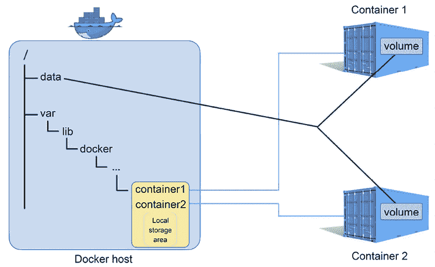
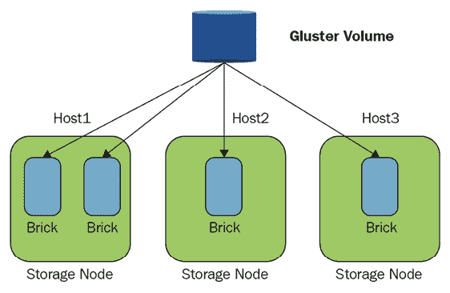
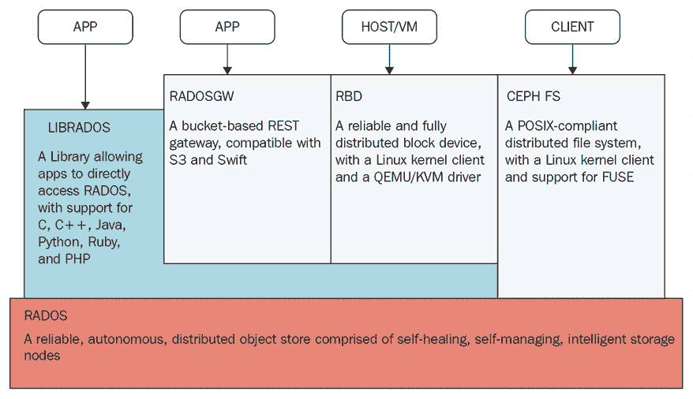
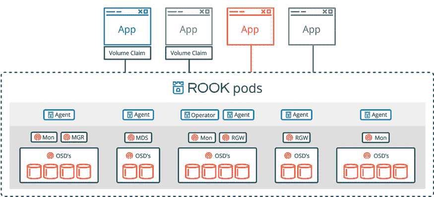
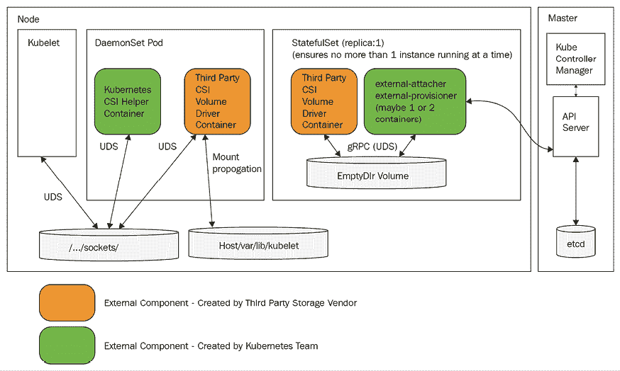

# 第六章：存储管理

在本章中，我们将探讨 Kubernetes 如何管理存储。存储与计算有很大的不同，但从高层次来看，它们都是资源。作为一个通用平台，Kubernetes 采取了将存储抽象为编程模型和一组存储提供商插件的方式。首先，我们将详细了解概念存储模型，以及如何将存储提供给集群中的容器。接着，我们将介绍一些常见的云平台存储提供商，如**亚马逊网络服务**（**AWS**）、**谷歌计算引擎**（**GCE**）和 Azure。然后，我们将介绍一个著名的开源存储提供商，Red Hat 的 GlusterFS，它提供了一个分布式文件系统。我们还将探讨另一个解决方案——Ceph，它通过 Rook 操作符将数据管理到容器中，成为 Kubernetes 集群的一部分。我们还将看到 Kubernetes 如何支持现有企业存储解决方案的集成。最后，我们将深入探讨**容器存储接口**（**CSI**）及其所带来的所有高级功能。

本章将涵盖以下主要内容：

+   持久卷演示

+   演示持久卷存储的端到端实现

+   公有云存储卷类型 – GCE、AWS 和 Azure

+   Kubernetes 中的 GlusterFS 和 Ceph 卷

+   将企业存储集成到 Kubernetes 中

+   容器存储接口

在本章结束时，你将对 Kubernetes 中存储的表示方式、每种部署环境中的各种存储选项（本地测试、公有云和企业存储）有一个清晰的理解，并且能够根据你的使用场景选择最佳的存储选项。

你应该在 minikube 或其他支持存储的集群上尝试本章中的代码示例。KinD 集群在节点标签化方面存在一些问题，而节点标签化是某些存储解决方案所必需的。

# 持久卷演示

在本节中，我们将了解 Kubernetes 存储的概念模型，并了解如何将持久存储映射到容器中，以便它们能够读取和写入数据。让我们先从理解存储问题开始。

容器和 Pod 是短暂的。容器写入其文件系统的任何内容都会在容器停止时被清除。容器还可以挂载主机节点的目录，并读取或写入它们。这些数据在容器重启时会继续存在，但节点本身并不是永生的。此外，如果 Pod 本身被驱逐并调度到不同的节点，Pod 中的容器将无法访问旧节点主机的文件系统。

还有其他问题，例如容器死亡时挂载的主机目录的所有权问题。试想一下，一堆容器将重要数据写入它们主机上的各种数据目录，然后消失，留下所有数据分布在节点上，无法直接知道哪个容器写了哪个数据。你可以尝试记录这些信息，但你会把它记录在哪里呢？很明显，对于一个大规模系统，你需要一个从任何节点都能访问的持久存储来可靠地管理数据。

## 理解卷

基本的 Kubernetes 存储抽象是卷。容器挂载绑定到其 Pod 的卷，并像访问本地文件系统一样访问存储，无论它在哪里。这并不新鲜，而且非常好，因为作为一个开发者，在编写需要访问数据的应用程序时，你不必担心数据存储在哪里以及如何存储。Kubernetes 支持许多类型的卷，它们具有各自独特的特点。让我们回顾一些主要的卷类型。

### 使用 emptyDir 进行 Pod 间通信

在同一 Pod 内使用共享卷在容器之间共享数据非常简单。容器 1 和容器 2 只需挂载相同的卷，并通过读取和写入该共享空间进行通信。最基本的卷是`emptyDir`。`emptyDir`卷是主机上的一个空目录。请注意，它是非持久性的，因为当 Pod 被驱逐或删除时，内容会被清除。如果容器崩溃，Pod 会保留下来，重启的容器可以访问卷中的数据。另一个非常有趣的选项是使用 RAM 磁盘，通过将介质指定为`Memory`。现在，您的容器通过共享内存进行通信，这样的速度更快，但当然更容易丢失。如果节点被重启，`emptyDir`的卷内容会丢失。

这是一个 Pod 配置文件，包含两个挂载相同卷的容器，名为`shared-volume`。容器在不同的路径上挂载它，但当`hue-global-listener`容器将文件写入`/notifications`时，`hue-job-scheduler`会在`/incoming`下看到该文件：

```
apiVersion: v1
kind: Pod
metadata:
  name: hue-scheduler
spec:
  containers:
  - image: g1g1/hue-global-listener:1.0
    name: hue-global-listener
    volumeMounts:
    - mountPath: /notifications
      name: shared-volume
  - image: g1g1/hue-job-scheduler:1.0
    name: hue-job-scheduler
    volumeMounts:
    - mountPath: /incoming
      name: shared-volume
  volumes:
  - name: shared-volume
    emptyDir: {} 
```

要使用共享内存选项，我们只需在`emptyDir`部分添加`medium: Memory`：

```
 volumes:
  - name: shared-volume
    emptyDir:
     medium: Memory 
```

请注意，基于内存的`emptyDir`会计入容器的内存限制。

为了验证是否有效，让我们创建 Pod，然后使用一个容器写入文件，并使用另一个容器读取它：

```
$ k create -f hue-scheduler.yaml
pod/hue-scheduler created 
```

请注意，Pod 有两个容器：

```
$ k get pod hue-scheduler -o json | jq .spec.containers
[
  {
    "image": "g1g1/hue-global-listener:1.0",
    "name": "hue-global-listener",
    "volumeMounts": [
      {
        "mountPath": "/notifications",
        "name": "shared-volume"
      },
      ...
    ]
    ...
  },
  {
    "image": "g1g1/hue-job-scheduler:1.0",
    "name": "hue-job-scheduler",
    "volumeMounts": [
      {
        "mountPath": "/incoming",
        "name": "shared-volume"
      },
      ...  
    ]
    ...
  }
] 
```

现在，我们可以在`hue-global-listener`容器的`/notifications`目录中创建文件，并在`hue-job-scheduler`容器的`/incoming`目录中列出它：

```
$ kubectl exec -it hue-scheduler -c hue-global-listener -- touch /notifications/1.txt
$ kubectl exec -it hue-scheduler -c hue-job-scheduler -- ls /incoming
1.txt 
```

正如你所看到的，我们可以在一个容器的文件系统中看到另一个容器创建的文件；因此，容器可以通过共享的文件系统进行通信。

### 使用 HostPath 进行节点间通信

有时，你希望 Pod 能够访问一些主机信息（例如，Docker 守护进程），或者你希望同一节点上的 Pod 能够相互通信。如果 Pod 知道它们位于同一主机上，这会很有用。由于 Kubernetes 根据可用资源调度 Pod，Pod 通常不知道它们与其他 Pod 共享同一节点。有几种情况，Pod 可以依赖其他 Pod 与它们一起调度到同一节点：

+   在单节点集群中，所有 Pod 显然共享同一个节点

+   `DaemonSet` Pod 总是与任何匹配其选择器的 Pod 共享一个节点

+   具有所需 Pod 亲和性的 Pod 总是一起调度

例如，在*第五章*，*实践中使用 Kubernetes 资源*中，我们讨论了一个`DaemonSet` Pod，它充当聚合代理，连接到其他 Pod。实现这种行为的另一种方式是，Pod 只需将其数据写入一个挂载的卷，该卷绑定到主机目录，`DaemonSet` Pod 可以直接读取并进行操作。

`HostPath`卷是一个挂载到 Pod 中的主机文件或目录。在你决定使用`HostPath`卷之前，确保你理解其后果：

+   这是一种安全风险，因为访问主机文件系统可能暴露敏感数据（例如，kubelet 密钥）

+   如果 Pod 是数据驱动的，并且它们主机上的文件不同，那么具有相同配置的 Pod 的行为可能会有所不同

+   它可能违反基于资源的调度，因为 Kubernetes 无法监控`HostPath`资源

+   访问主机目录的容器必须具有一个安全上下文，且`privileged`设置为`true`，或者在主机端，你需要更改权限以允许写入

+   在同一节点上协调多个 Pod 的磁盘使用是很困难的。

+   你很容易用完磁盘空间

这是一个配置文件，将`/coupons`目录挂载到`hue-coupon-hunter`容器中，该目录映射到主机的`/etc/hue/data/coupons`目录：

```
apiVersion: v1
kind: Pod
metadata:
  name: hue-coupon-hunter
spec:
  containers:
  - image: the_g1g1/hue-coupon-hunter
    name: hue-coupon-hunter
    volumeMounts:
    - mountPath: /coupons
      name: coupons-volume
  volumes:
  - name: coupons-volume
    host-path:
        path: /etc/hue/data/coupons 
```

由于 Pod 没有特权安全上下文，它将无法写入主机目录。让我们通过添加安全上下文来更改容器规格，从而启用它：

```
 - image: the_g1g1/hue-coupon-hunter
    name: hue-coupon-hunter
    volumeMounts:
    - mountPath: /coupons
      name: coupons-volume
    securityContext:
      privileged: true 
```

在下图中，你可以看到每个容器都有自己的本地存储区域，其他容器或 Pod 无法访问，而主机的`/data`目录作为卷挂载到容器 1 和容器 2 中：



图 6.1：容器本地存储

### 使用本地卷进行持久化节点存储

本地卷类似于`HostPath`，但它们在 Pod 重启和节点重启后依然存在。从这个意义上讲，它们被视为持久卷。它们是在 Kubernetes 1.7 中引入的。从 Kubernetes 1.14 开始，它们被认为是稳定的。本地卷的目的是支持有状态集，其中特定的 Pod 需要调度到包含特定存储卷的节点上。当地卷有节点亲和性注解，可以简化 Pod 与它们需要访问的存储之间的绑定。

我们需要为使用本地卷定义一个存储类。我们将在本章稍后详细讨论存储类。简而言之，存储类使用配置器为 Pod 分配存储。让我们在一个名为`local-storage-class.yaml`的文件中定义该存储类并创建它：

```
apiVersion: storage.k8s.io/v1
kind: StorageClass
metadata:
  name: local-storage
provisioner: kubernetes.io/no-provisioner
volumeBindingMode: WaitForFirstConsumer
$ k create -f local-storage-class.yaml
storageclass.storage.k8s.io/local-storage created 
```

现在，我们可以使用存储类创建一个持久化存储卷，即使使用它的 Pod 被终止后，存储卷仍会保持：

```
apiVersion: v1
kind: PersistentVolume
metadata:
  name: local-pv
  labels:
    release: stable
    capacity: 10Gi
spec:
  capacity:
    storage: 10Gi
  volumeMode: Filesystem
  accessModes:
  - ReadWriteOnce
  persistentVolumeReclaimPolicy: Delete
  storageClassName: local-storage
  local:
    path: /mnt/disks/disk-1
  nodeAffinity:
    required:
      nodeSelectorTerms:
      - matchExpressions:
        - key: kubernetes.io/hostname
          operator: In
          values:
          - k3d-k3s-default-agent-1 
```

### 提供持久化存储卷

虽然`emptyDir`卷可以被容器挂载并使用，但它们不是持久的，不需要特殊配置，因为它们使用节点上现有的存储。`HostPath`卷在原节点上持久存在，但如果 Pod 在不同节点上重新启动，它将无法访问先前节点上的`HostPath`卷。本地卷是实际的持久化存储卷，使用管理员预先配置的存储或通过存储类的动态配置来提供存储。它们在节点上持久存在，并且可以在 Pod 重新启动、重新调度甚至节点重新启动时存活。一些持久化存储卷使用提前由管理员配置的外部存储（而非物理附加到节点的磁盘）。在云环境中，配置可能非常简化，但仍然是必需的，作为 Kubernetes 集群管理员，你必须至少确保存储配额充足，并且认真监控配额的使用情况。

记住，持久化存储卷是 Kubernetes 集群正在使用的资源，类似于节点。因此，它们不由 Kubernetes API 服务器管理。

你可以静态或动态配置资源。

#### 静态配置持久化存储卷

静态配置非常简单。集群管理员预先创建由某些存储介质支持的持久化存储卷，这些存储卷可以被容器声明。

#### 动态配置持久化存储卷

当持久化存储卷声明与任何静态配置的持久化存储卷不匹配时，可能会发生动态配置。如果声明指定了存储类，并且管理员已为该存储类配置了动态配置，则可以实时配置持久化存储卷。稍后我们将在讨论持久化存储卷声明和存储类时看到示例。

#### 外部配置持久化存储卷

Kubernetes 最初包含了大量用于存储配置的“内置”代码，作为 Kubernetes 主代码库的一部分。随着 CSI 的引入，存储提供者开始从 Kubernetes 核心迁移到卷插件（即“外部”）。外部存储提供者的工作方式与内置动态存储提供者相同，但可以独立部署和更新。大多数内置存储提供者已迁移到外部。查看这个项目，获取编写外部存储提供者的库和指南：[`github.com/kubernetes-sigs/sig-storage-lib-external-provisioner`](https://github.com/kubernetes-sigs/sig-storage-lib-external-provisioner)。

## 创建持久卷

以下是一个 NFS 持久卷的配置文件：

```
apiVersion: v1
kind: PersistentVolume
metadata:
  name: pv-777
spec:
  capacity:
    storage: 10Gi
  volumeMode: Filesystem
  accessModes:
    - ReadWriteMany
    - ReadOnlyMany
  persistentVolumeReclaimPolicy: Recycle
  storageClassName: slow
  mountOptions:
    - hard
    - nfsvers=4.2
  nfs:
    path: /tmp
    server: nfs-server.default.svc.cluster.local 
```

持久卷有一个规范和元数据，可能包括存储类名称。我们在这里重点关注规范部分。它包含六个部分：容量、卷模式、访问模式、回收策略、存储类和卷类型（示例中为 `nfs`）。

### 容量

每个卷有指定的存储量。存储声明可以由至少具有该存储量的持久卷满足。在这个示例中，持久卷的容量为 10 吉比字节（单个吉比字节是 2 的 30 次方字节）。

```
capacity:
    storage: 10Gi 
```

在分配静态持久卷时，理解存储请求模式非常重要。例如，如果你配置了 20 个 100 GiB 容量的持久卷，并且某个容器声明了一个 150 GiB 的持久卷，则即使集群中总体容量足够，该声明也不会得到满足。

### 卷模式

可选的卷模式是在 Kubernetes 1.9 中作为 Alpha 功能添加的（在 Kubernetes 1.13 中移至 Beta），用于静态配置。它允许你指定是否需要文件系统（`Filesystem`）或原始存储（`Block`）。如果不指定卷模式，则默认使用 `Filesystem`，就像 1.9 之前的版本一样。

### 访问模式

有三种访问模式：

+   `ReadOnlyMany`：可以由多个节点以只读方式挂载

+   `ReadWriteOnce`：只能由单个节点以读写方式挂载

+   `ReadWriteMany`：可以由多个节点以读写方式挂载

存储被挂载到节点上，因此即使是`ReadWriteOnce`，同一节点上的多个容器也可以挂载该卷并写入数据。如果这导致问题，需要通过其他机制来处理（例如，仅在你知道每个节点只有一个的 DaemonSet pod 中声明该卷）。

不同的存储提供商支持这些模式的某些子集。当你配置持久卷时，可以指定它将支持哪些模式。例如，NFS 支持所有模式，但在这个示例中，仅启用了以下这些模式：

```
accessModes:
    - ReadWriteMany
    - ReadOnlyMany 
```

### 回收策略

回收策略决定了当持久卷声明被删除时会发生什么。共有三种不同的策略：

+   `Retain` – 卷需要手动回收

+   `Delete` – 内容、卷和后端存储将被删除

+   `Recycle` – 仅删除内容（`rm -rf /volume/*`）

`Retain` 和 `Delete` 策略意味着持久卷将不再可用于未来的声明。`Recycle` 策略允许卷再次被声明。

目前，NFS 和 `HostPath` 支持回收策略，而 AWS EBS、GCE PD、Azure 磁盘和 Cinder 卷支持删除策略。请注意，动态供应的卷始终会被删除。

### 存储类

你可以通过规格中的可选字段 `storageClassName` 来指定存储类。如果你指定了，那么只有指定相同存储类的持久卷声明才能与持久卷绑定。如果没有指定存储类，则只能绑定那些未指定存储类的 PV 声明。

```
 storageClassName: slow 
```

### 卷类型

卷类型在规格中通过名称指定。规格中没有 `volumeType` 部分。在上面的例子中，`nfs` 是卷类型：

```
nfs:
    path: /tmp
    server: 172.17.0.8 
```

每种卷类型可能有自己的一组参数。在这种情况下，它是路径和服务器。

我们稍后将介绍各种卷类型。

### 挂载选项

一些持久卷类型有额外的挂载选项，你可以指定。挂载选项不会进行验证。如果提供了无效的挂载选项，卷配置将失败。例如，NFS 支持额外的挂载选项：

```
 mountOptions:
    - hard
    - nfsvers=4.1 
```

现在我们已经看过了如何配置单个持久卷，让我们来看看投影卷，它提供了更多灵活性和存储抽象。

## 投影卷

投影卷允许你将多个持久卷挂载到同一目录中。你当然需要小心命名冲突。

以下卷类型支持投影卷：

+   `ConfigMap`

+   `Secret`

+   `SownwardAPI`

+   `ServiceAccountToken`

```
ConfigMap and a Secret into the same directory: 
```

```
apiVersion: v1
kind: Pod
metadata:
  name: projected-volumes-demo
spec:
  containers:
  - name: projected-volumes-demo
    image: busybox:1.28
    volumeMounts:
    - name: projected-volumes-demo
      mountPath: "/projected-volume"
      readOnly: true
  volumes:
  - name: projected-volumes-demo
    projected:
      sources:
      - secret:
          name: the-user
          items:
            - key: username
              path: the-group/the-user
      - configMap:
          name: the-config-map
          items:
            - key: config
              path: the-group/the-config-map 
```

投影卷的参数与常规卷非常相似。例外情况是：

+   为了与 `ConfigMap` 命名保持一致，`secretName` 字段已更新为 `name`，用于存储秘密。

+   `defaultMode` 只能在投影级别设置，不能单独为每个卷源指定（但你可以为每个投影显式指定模式）。

让我们来看一种特殊的投影卷——`serviceAccountToken` 例外。

### serviceAccountToken 投影卷

Kubernetes pods 可以使用与 pod 关联的服务账户的权限访问 Kubernetes API 服务器。`serviceAccountToken` 投影卷从安全角度为你提供更多粒度和控制。该令牌可以有过期时间和特定的受众。

更多详细信息请参见：[`kubernetes.io/docs/concepts/storage/projected-volumes/#serviceaccounttoken`](https://kubernetes.io/docs/concepts/storage/projected-volumes/#serviceaccounttoken)。

## 创建本地卷

本地卷是静态持久磁盘，分配到特定的节点上。它们类似于`HostPath`卷，但 Kubernetes 知道本地卷属于哪个节点，并且会将绑定到该本地卷的 Pod 调度到该节点上。这意味着 Pod 不会被驱逐，也不会调度到另一个数据不可用的节点上。

让我们创建一个本地卷。首先，我们需要创建一个支持目录。对于 KinD 和 k3d 集群，你可以通过 Docker 访问节点：

```
$ docker exec -it k3d-k3s-default-agent-1 mkdir -p /mnt/disks/disk-1
$ docker exec -it k3d-k3s-default-agent-1 ls -la /mnt/disks
total 12
drwxr-xr-x 3 0 0 4096 Jun 29 21:40 .
drwxr-xr-x 3 0 0 4096 Jun 29 21:40 ..
drwxr-xr-x 2 0 0 4096 Jun 29 21:40 disk-1 
```

对于 minikube，你需要使用`minikube ssh`。

现在，我们可以创建一个由`/mnt/disks/disk1`目录支持的本地卷：

```
apiVersion: v1
kind: PersistentVolume
metadata:
  name: local-pv
  labels:
    release: stable
    capacity: 10Gi
spec:
  capacity:
    storage: 10Gi
  volumeMode: Filesystem
  accessModes:
    - ReadWriteOnce
  persistentVolumeReclaimPolicy: Delete
  storageClassName: local-storage
  local:
    path: /mnt/disks/disk-1
  nodeAffinity:
    required:
      nodeSelectorTerms:
        - matchExpressions:
            - key: kubernetes.io/hostname
              operator: In
              values:
                - k3d-k3s-default-agent-1 
```

这里是`create`命令：

```
$ k create -f local-volume.yaml
persistentvolume/local-pv created
$ k get pv
NAME       CAPACITY   ACCESS MODES   RECLAIM POLICY   STATUS   CLAIM                         STORAGECLASS    REASON   AGE
local-pv   10Gi       RWO            Delete           Bound    default/local-storage-claim   local-storage            6m44s 
```

## 创建持久卷声明

当容器需要访问持久存储时，它们会发出声明（或者更确切地说，开发人员和集群管理员协调所需的存储资源来发出声明）。这里是一个匹配前面部分的持久卷的声明示例——*创建本地卷*：

```
kind: PersistentVolumeClaim
apiVersion: v1
metadata:
  name: local-storage-claim
spec:
  accessModes:
    - ReadWriteOnce
  resources:
    requests:
      storage: 8Gi
  storageClassName: local-storage
  selector:
    matchLabels:
      release: "stable"
    matchExpressions:
      - {key: capacity, operator: In, values: [8Gi, 10Gi]} 
```

让我们先创建声明，然后再解释各个部分的作用：

```
$ k create -f local-persistent-volume-claim.yaml
persistentvolumeclaim/local-storage-claim created
$ k get pvc
NAME                  STATUS   VOLUME     CAPACITY   ACCESS MODES   STORAGECLASS    AGE
local-storage-claim    WaitForFirstConsumer    local-pv   10Gi       RWO            local-storage   21m 
```

名称`local-storage-claim`在稍后将会在挂载声明到容器时变得重要。

规格中的访问模式是`ReadWriteOnce`，这意味着如果声明被满足，则不能满足其他任何具有`ReadWriteOnce`访问模式的声明，但可以满足`ReadOnlyMany`的声明。

资源部分请求 8 GiB。这可以由我们容量为 10 Gi 的持久卷满足。但这有些浪费，因为 2 Gi 会被定义为未使用。

存储类名称是`local-storage`。如前所述，它必须与持久卷的存储类名称匹配。然而，对于 PVC，空的类名（`""`）和没有类名完全不同。前者（空类名）匹配没有存储类名称的持久卷。后者（没有类名）仅在启用了`DefaultStorageClass`入站插件并使用默认存储类时，才会绑定到持久卷。

选择器部分允许你进一步筛选可用的卷。例如，这里卷必须匹配标签`release:stable`，并且还必须具有`capacity:8Gi`或`capacity:10Gi`标签。假设我们有一些其他卷，它们的容量分别为 20 Gi 和 50 Gi。我们不希望当只需要 8 Gi 时去声明一个 50 Gi 的卷。

Kubernetes 始终会尝试匹配能够满足声明的最小卷，但如果没有 8 Gi 或 10 Gi 的卷，标签将防止分配 20 Gi 或 50 Gi 的卷，并转而使用动态配置。

重要的是要意识到声明不会通过名称提到卷。你不能声明一个特定的卷。匹配是由 Kubernetes 基于存储类、容量和标签来完成的。

最后，持久卷声明属于一个命名空间。将持久卷绑定到声明是独占的。这意味着持久卷将绑定到一个命名空间。即使访问模式是`ReadOnlyMany`或`ReadWriteMany`，所有挂载该持久卷声明的 Pods 必须来自该声明的命名空间。

## 将声明挂载为卷

好的，我们已经配置了一个卷并声明了它。现在是时候在容器中使用已声明的存储了。这实际上很简单。首先，持久卷声明必须作为 Pod 中的卷使用，然后 Pod 中的容器可以像任何其他卷一样挂载它。以下是一个 Pod 清单，指定了我们之前创建的持久卷声明（绑定到我们提供的本地持久卷）：

```
kind: Pod
apiVersion: v1
metadata:
  name: the-pod
spec:
  containers:
    - name: the-container
      image: g1g1/py-kube:0.3
      volumeMounts:
      - mountPath: "/mnt/data"
        name: persistent-volume
  volumes:
    - name: persistent-volume
      persistentVolumeClaim:
        claimName: local-storage-claim 
```

关键在于`persistentVolumeClaim`部分中的卷。声明名称（此处为`local-storage-claim`）在当前命名空间内唯一标识特定声明，并将其作为卷（此处命名为`persistent-volume`）提供。然后，容器可以通过名称引用它并将其挂载到`"/mnt/data"`。

在我们创建 Pod 之前，重要的是要注意持久卷声明实际上尚未声明任何存储，也未与我们的本地卷绑定。声明处于挂起状态，直到某个容器尝试使用该声明挂载卷：

```
$ k get pvc
NAME                  STATUS    VOLUME   CAPACITY   ACCESS MODES   STORAGECLASS    AGE
local-storage-claim   Pending                                      local-storage   6m14s 
```

现在，在创建 Pod 时，声明将会被绑定：

```
$ k create -f pod-with-local-claim.yaml
pod/the-pod created
$ k get pvc
NAME                  STATUS   VOLUME     CAPACITY   ACCESS MODES   STORAGECLASS    AGE
local-storage-claim   Bound    local-pv   100Gi      RWO            local-storage   20m 
```

## 原始块卷

Kubernetes 1.9 将此功能作为 Alpha 特性加入。Kubernetes 1.13 将其移至 Beta。从 Kubernetes 1.18 开始，它已成为 GA。

原始块卷提供对底层存储的直接访问，绕过了文件系统抽象。这对于需要高性能存储的应用程序（如数据库）非常有用，或者在需要一致的 I/O 性能和低延迟时尤为重要。以下存储提供者支持原始块卷：

+   AWSElasticBlockStore

+   AzureDisk

+   **FC** (**光纤通道**)

+   GCE 持久磁盘

+   iSCSI

+   本地卷

+   OpenStack Cinder

+   RBD（Ceph 块设备）

+   VsphereVolume

此外，许多 CSI 存储提供商也提供原始块卷。完整的列表请查看：[`kubernetes-csi.github.io/docs/drivers.html`](https://kubernetes-csi.github.io/docs/drivers.html)。

以下是如何使用 FireChannel 提供程序定义原始块卷：

```
apiVersion: v1
kind: PersistentVolume
metadata:
  name: block-pv
spec:
  capacity:
    storage: 10Gi
  accessModes:
    - ReadWriteOnce
  volumeMode: Block
  persistentVolumeReclaimPolicy: Retain
  fc:
    targetWWNs: ["50060e801049cfd1"]
    lun: 0
    readOnly: false 
```

匹配的**持久卷声明** (**PVC**) 也必须指定`volumeMode: Block`。以下是其格式：

```
apiVersion: v1
kind: PersistentVolumeClaim
metadata:
  name: block-pvc
spec:
  accessModes:
    - ReadWriteOnce
  volumeMode: Block
  resources:
    requests:
      storage: 10Gi 
```

Pods 将原始块卷作为`/dev`下的设备使用，而不是作为挂载的文件系统。容器可以访问这些设备并进行读写。实际上，这意味着对块存储的 I/O 请求会直接传递到底层的块存储，而不是经过文件系统驱动程序。这理论上更快，但实际上，如果你的应用程序依赖于文件系统缓冲，可能会导致性能下降。

这是一个包含容器的 Pod，它将`block-pvc`与名为`/dev/xdva`的原始块存储绑定：

```
apiVersion: v1
kind: Pod
metadata:
  name: pod-with-block-volume
spec:
  containers:
    - name: fc-container
      image: fedora:26
      command: ["/bin/sh", "-c"]
      args: ["tail -f /dev/null"]
      volumeDevices:
        - name: data
          devicePath: /dev/xvda
  volumes:
    - name: data
      persistentVolumeClaim:
        claimName: block-pvc 
```

## CSI 临时卷

我们将在本章稍后部分的 *容器存储接口* 章节详细介绍**容器存储接口**（**CSI**）。CSI 临时卷由节点上的本地存储提供支持。这些卷的生命周期与 pod 的生命周期相关联。此外，它们只能由该 pod 的容器挂载，这对于直接将秘密和证书填充到 pod 中而无需经过 Kubernetes 秘密对象非常有用。

下面是一个带有 CSI 临时卷的 pod 示例：

```
kind: Pod
apiVersion: v1
metadata:
  name: the-pod
spec:
  containers:
    - name: the-container
      image: g1g1/py-kube:0.3
      volumeMounts:
        - mountPath: "/data"
          name: the-volume
      command: [ "sleep", "1000000" ]
  volumes:
    - name: the-volume
      csi:
        driver: inline.storage.kubernetes.io
        volumeAttributes:
          key: value 
```

自 Kubernetes 1.25 版本以来，CSI 临时卷已经 GA（一般可用）。然而，并不是所有的 CSI 驱动程序都支持它们。如往常一样，请检查列表：[`kubernetes-csi.github.io/docs/drivers.html`](https://kubernetes-csi.github.io/docs/drivers.html)。

## 通用临时卷

通用临时卷是另一种与 pod 生命周期相关联的卷类型。当 pod 被删除时，通用临时卷也会被删除。

这种卷类型实际上会创建一个完整的持久卷声明。这提供了几个功能：

+   卷的存储可以是本地的，也可以是网络附加的。

+   卷可以选择配置为固定大小。

+   根据驱动程序和指定的参数，卷可能包含初始数据。

+   如果驱动程序支持，通常的操作如快照、克隆、调整大小和存储容量跟踪可以对这些卷执行。

下面是一个带有通用临时卷的 pod 示例：

```
kind: Pod
apiVersion: v1
metadata:
  name: the-pod
spec:
  containers:
    - name: the-container
      image: g1g1/py-kube:0.3
      volumeMounts:
        - mountPath: "/data"
          name: the-volume
      command: [ "sleep", "1000000" ]
  volumes:
    - name: the-volume
      ephemeral:
        volumeClaimTemplate:
          metadata:
            labels:
              type: generic-ephemeral-volume
          spec:
            accessModes: [ "ReadWriteOnce" ]
            storageClassName: generic-storage
            resources:
              requests:
                storage: 1Gi 
```

请注意，从安全角度来看，具有创建 pod 权限但没有 PVC 权限的用户，现在可以通过通用临时卷创建 PVC。为了防止这种情况，可以使用准入控制。

## 存储类

我们已经遇到过存储类了。那么，它们到底是什么？存储类允许管理员配置一个带有自定义持久存储的集群（只要有适当的插件来支持它）。存储类在元数据中有一个名称（必须在声明的 `storageClassName` 文件中指定），以及一个提供者、回收策略和参数。

我们之前为本地存储声明了一个存储类。下面是一个使用 AWS EBS 作为提供者的示例存储类（因此它仅适用于 AWS）：

```
apiVersion: storage.k8s.io/v1
kind: StorageClass
metadata:
  name: standard
provisioner: kubernetes.io/aws-ebs
parameters:
  type: gp2
reclaimPolicy: Retain
allowVolumeExpansion: true
mountOptions:
  - debug
volumeBindingMode: Immediate 
```

你可以为相同的提供者创建多个存储类，使用不同的参数。每个提供者都有自己的参数。

当前支持的提供者有：

+   AWSElasticBlockStore

+   AzureFile

+   AzureDisk

+   CephFS

+   Cinder

+   FC

+   FlexVolume

+   Flocker

+   GCE 持久磁盘

+   GlusterFS

+   iSCSI

+   Quobyte

+   NFS

+   RBD

+   VsphereVolume

+   PortworxVolume

+   ScaleIO

+   StorageOS

+   本地

这个列表不包括其他卷类型的提供者，例如 `configMap` 或 `secret`，这些类型不依赖于典型的网络存储。这些卷类型不需要存储类。智能地利用卷类型是设计和管理集群的关键部分。

### 默认存储类

集群管理员还可以分配默认存储类。当分配了默认存储类并且启用了 `DefaultStorageClass` 入场插件时，未指定存储类的声明将使用默认存储类动态配置。如果没有定义默认存储类或未启用入场插件，则未指定存储类的声明只能匹配没有存储类的卷。

我们已经涵盖了很多内容，并探讨了多种配置存储和以不同方式使用存储的选项。现在，我们将把所有内容整合起来，展示从头到尾的整个过程。

# 演示持久卷存储的端到端过程

为了说明所有概念，让我们做一个小型演示，创建一个 `HostPath` 卷，声明它，挂载它，并让容器写入其中。我们将使用 k3d 来完成这部分。

首先，我们通过使用 `dir` 存储类创建一个 `hostPath` 卷。将以下内容保存为 `dir-persistent-volume.yaml`：

```
kind: PersistentVolume
apiVersion: v1
metadata:
  name: dir-pv
spec:
  storageClassName: dir
  capacity:
    storage: 1Gi
  accessModes:
    - ReadWriteMany
  hostPath:
    path: "/tmp/data" 
```

然后，我们来创建它：

```
$ k create -f dir-persistent-volume.yaml
persistentvolume/dir-pv created 
```

要查看可用的卷，可以使用资源类型 `persistentvolumes`，简写为 `pv`：

```
$ k get pv
NAME       CAPACITY   ACCESS MODES   RECLAIM POLICY   STATUS      CLAIM   STORAGECLASS    REASON   AGE
dir-pv     1Gi        RWX            Retain           Available           dir                      22s 
```

容量为请求的 1 GiB。回收策略是 `Retain`，因为主机路径卷会被保留（不会销毁）。状态为 `Available`，因为该卷尚未被声明。访问模式指定为 `RWX`，即 `ReadWriteMany`。所有访问模式都有一个简写版本：

+   `RWO` – `ReadWriteOnce`

+   `ROX` – `ReadOnlyMany`

+   `RWX` – `ReadWriteMany`

我们有一个持久卷。我们来创建一个声明。将以下内容保存为 `dir-persistent-volume-claim.yaml`：

```
kind: PersistentVolumeClaim
apiVersion: v1
metadata:
  name: dir-pvc
spec:
  accessModes:
    - ReadWriteOnce
  resources:
    requests:
      storage: 1Gi 
```

然后，运行以下命令：

```
$ k create -f  dir-persistent-volume-claim.yaml
persistentvolumeclaim/dir-pvc created 
```

我们来检查一下声明和卷：

```
$ k get pvc
NAME                  STATUS   VOLUME     CAPACITY   ACCESS MODES   STORAGECLASS    AGE
dir-pvc               Bound    dir-pv     1Gi        RWX            dir             106s
$ k get pv
NAME       CAPACITY   ACCESS MODES   RECLAIM POLICY   STATUS   CLAIM             STORAGECLASS    REASON   AGE
dir-pv     1Gi        RWX            Retain           Bound    default/dir-pvc   dir                      4m25s 
```

如你所见，声明和卷已经绑定在一起并互相引用。绑定之所以有效，是因为卷和声明使用了相同的存储类。但是，如果它们不匹配会怎样呢？我们来删除持久卷声明中的存储类，看看会发生什么。将以下持久卷声明保存为 `some-persistent-volume-claim.yaml`：

```
kind: PersistentVolumeClaim
apiVersion: v1
metadata:
  name: some-pvc
spec:
  accessModes:
  - ReadWriteMany
  resources:
    requests:
      storage: 1Gi 
```

然后，创建它：

```
$ k create -f some-persistent-volume-claim.yaml
persistentvolumeclaim/some-pvc created 
```

好的，已经创建了。我们来看一下：

```
$ k get pvc some-pvc
NAME       STATUS    VOLUME   CAPACITY   ACCESS MODES   STORAGECLASS   AGE
some-pvc   Pending                                      local-path     3m29s 
```

非常有趣。`some-pvc` 声明与我们从未指定的 `local-path` 存储类关联，但它仍然是待处理状态。我们来了解一下原因。

这是 `local-path` 存储类：

```
$ k get storageclass local-path -o yaml
kind: StorageClass
metadata:
  annotations:
    objectset.rio.cattle.io/applied: H4sIAAAAAAAA/4yRT+vUMBCGv4rMua1bu1tKwIO u7EUEQdDzNJlux6aZkkwry7LfXbIqrIffn2PyZN7hfXIFXPg7xcQSwEBSiXimaupSxfJ2q6GAiYMDA9 /+oKPHlKCAmRQdKoK5AoYgisoSUj5K/5OsJtIqslQWVT3lNM4xUDzJ5VegWJ63CQxMTXogW128+czBvf/gnIQXIwLOBAa8WPTl30qvGkoL2jw5rT2V6ZKUZij+SbG5eZVRDKR0F8SpdDTg6rW8YzCgcSW4FeCxJ/+sjxHTCAbqrhmag20Pw9DbZtfu210z7JuhPnQ719m2w3cOe7fPof81W1DHfLlE2Th/IEUwEDHYkWJe8PCs gJgL8PxVPNsLGPhEnjRr2cSvM33k4Dicv4jLC34g60niiWPSo4S0zhTh9jsAAP//ytgh5S0CAAA
    objectset.rio.cattle.io/id: ""
    objectset.rio.cattle.io/owner-gvk: k3s.cattle.io/v1, Kind=Addon
    objectset.rio.cattle.io/owner-name: local-storage
    objectset.rio.cattle.io/owner-namespace: kube-system
    storageclass.kubernetes.io/is-default-class: "true"
  creationTimestamp: "2022-06-22T18:16:56Z"
  labels:
    objectset.rio.cattle.io/hash: 183f35c65ffbc3064603f43f1580d8c68a2dabd4
  name: local-path
  resourceVersion: "290"
  uid: b51cf456-f87e-48ac-9062-4652bf8f683e
provisioner: rancher.io/local-path
reclaimPolicy: Delete
volumeBindingMode: WaitForFirstConsumer 
```

这是一个附带 k3d（k3s）的存储类。

注意注释：`storageclass.kubernetes.io/is-default-class: "true"`。它告诉 Kubernetes 这是默认的存储类。由于我们的 PVC 没有指定存储类名称，因此它与默认存储类关联。但是，为什么声明仍然是待处理状态？原因是 `volumeBindingMode` 为 `WaitForFirstConsumer`。这意味着只有当容器尝试通过声明挂载卷时，声明的卷才会动态配置。

回到我们的 `dir-pvc`。最后一步是创建一个具有两个容器的 Pod，并将声明作为卷分配给它们两个。将以下内容保存到 `shell-pod.yaml`：

```
kind: Pod
apiVersion: v1
metadata:
  name: just-a-shell
  labels:
    name: just-a-shell
spec:
  containers:
    - name: a-shell
      image: g1g1/py-kube:0.3
      command: ["sleep", "10000"]
      volumeMounts:
        - mountPath: "/data"
          name: pv
    - name: another-shell
      image: g1g1/py-kube:0.3
      command: ["sleep", "10000"]
      volumeMounts:
        - mountPath: "/another-data"
          name: pv
  volumes:
    - name: pv
      persistentVolumeClaim:
        claimName: dir-pvc 
```

这个 Pod 有两个容器，使用 `g1g1/py-kube:0.3` 镜像，两个容器都只是长时间休眠。目的是让容器保持运行状态，这样我们可以稍后连接它们并检查它们的文件系统。该 Pod 挂载了我们的持久卷声明，卷的名称为 `pv`。请注意，卷的规范仅在 Pod 层面定义一次，多个容器可以将其挂载到不同的目录中。

让我们创建 Pod 并验证两个容器是否都在运行：

```
$ k create -f shell-pod.yaml
pod/just-a-shell created
$ k get po just-a-shell -o wide
NAME           READY   STATUS    RESTARTS   AGE   IP            NODE                      NOMINATED NODE   READINESS GATES
just-a-shell   2/2     Running   0          74m   10.42.2.104   k3d-k3s-default-agent-1   <none>           <none> 
```

接下来，连接到节点（`k3d-k3s-default-agent-1`）。这是主机，其 `/tmp/data` 是 Pod 的卷，并挂载为 `/data` 和 `/another-data` 进入每个运行中的容器：

```
$ docker exec -it k3d-k3s-default-agent-1 sh
/ # 
```

接下来，我们在主机的 `/tmp/data` 目录下创建一个文件。该文件应该通过挂载卷在两个容器之间都能看到：

```
/ # echo "yeah, it works" > /tmp/data/cool.txt 
```

让我们从外部验证文件 `cool.txt` 是否确实可用：

```
$ docker exec -it k3d-k3s-default-agent-1 cat /tmp/data/cool.txt
yeah, it works 
```

接下来，让我们验证文件在容器中是否可用（在它们映射的目录中）：

```
$ k exec -it just-a-shell -c a-shell -- cat  /data/cool.txt
yeah, it works
$ k exec -it just-a-shell -c another-shell -- cat  /another-data/cool.txt
yeah, it works 
```

我们甚至可以在其中一个容器中创建一个新文件 `yo.txt`，并看到它在另一个容器或节点本身上也可用：

```
$ k exec -it just-a-shell -c another-shell – bash –c "echo yo  > /another-data/yo.txt"
yo /another-data/yo.txt
$ k exec -it just-a-shell -c a-shell cat /data/yo.txt
yo
$ k exec -it just-a-shell -c another-shell cat /another-data/yo.txt
yo 
```

是的，一切如预期般工作，两个容器共享相同的存储。

# 公有云存储卷类型 – GCE、AWS 和 Azure

在本节中，我们将介绍一些领先公有云平台中常见的卷类型。在大规模管理存储是一个复杂的任务，最终涉及到物理资源，类似于节点。如果您选择在公有云平台上运行 Kubernetes 集群，您可以让云提供商处理所有这些挑战，专注于您的系统。但理解每种卷类型的不同选项、约束和限制是非常重要的。

我们将要讲解的许多卷类型以前是由内置插件（Kubernetes 核心部分）处理的，但现在已经迁移到外部 CSI 插件。

CSI 迁移功能允许将具有相应外部 CSI 插件的内置插件指向外部插件，以作为过渡措施。

我们稍后会讲解 CSI 本身。

## AWS 弹性块存储（EBS）

AWS 提供了 **弹性块存储**（**EBS**）作为 EC2 实例的持久存储。AWS Kubernetes 集群可以使用 AWS EBS 作为持久存储，但有以下限制：

+   Pod 必须在 AWS EC2 实例上运行作为节点

+   Pod 只能访问在其可用区内配置的 EBS 卷

+   一个 EBS 卷可以挂载到单个 EC2 实例上

这些是严重的限制。单一可用区的限制虽然对性能有好处，但却剥夺了在大规模或跨地理分布系统中共享存储的能力，除非进行自定义复制和同步。单个 EBS 卷只能绑定一个 EC2 实例的限制意味着，即使在同一个可用区内，pod 也不能共享存储（即使是只读），除非确保它们运行在同一个节点上。

这是一个内置插件的示例，它也有 CSI 驱动并支持 CSIMigration。这意味着，如果安装了 AWS EBS 的 CSI 驱动（`ebs.csi.aws.com`），则内置插件会将所有插件操作重定向到外部插件。

也可以通过将 `InTreePluginAWSUnregister` 功能开关设置为 `true`（默认为 `false`）来禁用加载内置的 `awsElasticBlockStore` 存储插件。

查看所有功能开关：[`kubernetes.io/docs/reference/command-line-tools-reference/feature-gates/`](https://kubernetes.io/docs/reference/command-line-tools-reference/feature-gates/)。

让我们看看如何定义一个 AWS EBS 持久卷（静态配置）：

```
apiVersion: v1
kind: PersistentVolume
metadata:
  name: test-pv
spec:
  accessModes:
  - ReadWriteOnce
  capacity:
    storage: 5Gi
  csi:
    driver: ebs.csi.aws.com
    volumeHandle: {EBS volume ID}
  nodeAffinity:
    required:
      nodeSelectorTerms:
        - matchExpressions:
            - key: topology.ebs.csi.aws.com/zone
              operator: In
              values:
                - {availability zone} 
```

然后你需要定义一个 PVC：

```
apiVersion: v1
kind: PersistentVolumeClaim
metadata:
  name: ebs-claim
spec:
  accessModes:
    - ReadWriteOnce
  resources:
    requests:
      storage: 5Gi 
```

最后，pod 可以挂载 PVC：

```
apiVersion: v1
kind: Pod
metadata:
  name: some-pod
spec:
  containers:
  - image: some-container
    name: some-container
    volumeMounts:
    - name: persistent-storage
      mountPath: /data
  volumes:
  - name: persistent-storage
    persistentVolumeClaim:
      claimName: ebs-claim 
```

## AWS 弹性文件系统（EFS）

AWS 提供了一项名为 **Elastic File System** (**EFS**) 的服务。这实际上是一个托管的 NFS 服务。它使用 NFS 4.1 协议，并且相较于 EBS 具有许多优点：

+   多个 EC2 实例可以在多个可用区之间访问相同的文件（但必须在同一区域内）

+   容量会根据实际使用情况自动扩展和缩减

+   你只需为你使用的部分付费

+   你可以通过 VPN 将本地服务器连接到 EFS

+   EFS 运行在 SSD 硬盘上，这些硬盘会自动在可用区之间进行复制

也就是说，EFS 比 EBS 更为广泛，即使考虑到自动复制到多个可用区（假设你充分利用了 EBS 卷）。推荐的使用 EFS 的方式是通过它专用的 CSI 驱动：[`github.com/kubernetes-sigs/aws-efs-csi-driver`](https://github.com/kubernetes-sigs/aws-efs-csi-driver)。

这是静态配置的示例。首先，定义持久卷：

```
apiVersion: v1
kind: PersistentVolume
metadata:
  name: efs-pv
spec:
  capacity:
    storage: 1Gi
  volumeMode: Filesystem
  accessModes:
    - ReadWriteOnce
  persistentVolumeReclaimPolicy: Retain
  csi:
    driver: efs.csi.aws.com
    volumeHandle: <Filesystem Id> 
```

你可以使用 AWS CLI 查找 `Filesystem Id`：

```
aws efs describe-file-systems --query "FileSystems[*].FileSystemId" 
```

然后定义一个 PVC：

```
apiVersion: v1
kind: PersistentVolumeClaim
metadata:
  name: efs-claim
spec:
  accessModes:
    - ReadWriteOnce
  storageClassName: ""
  resources:
    requests:
      storage: 1Gi 
```

这里是一个使用 EFS 的 pod：

```
piVersion: v1
kind: Pod
metadata:
  name: efs-app
spec:
  containers:
  - name: app
    image: centos
    command: ["/bin/sh"]
    args: ["-c", "while true; do echo $(date -u) >> /data/out.txt; sleep 5; done"]
    volumeMounts:
    - name: persistent-storage
      mountPath: /data
  volumes:
  - name: persistent-storage
    persistentVolumeClaim:
      claimName: efs-claim 
```

你还可以通过定义一个合适的存储类来进行动态配置，而不是创建静态卷：

```
kind: StorageClass
apiVersion: storage.k8s.io/v1
metadata:
  name: efs-sc
provisioner: efs.csi.aws.com
parameters:
  provisioningMode: efs-ap
  fileSystemId: <Filesystem Id>
  directoryPerms: "700"
  gidRangeStart: "1000" # optional
  gidRangeEnd: "2000" # optional
  basePath: "/dynamic_provisioning" # optional 
```

PVC 类似，但现在使用了存储类名称：

```
apiVersion: v1
kind: PersistentVolumeClaim
metadata:
  name: efs-claim
spec:
  accessModes:
    - ReadWriteMany
  storageClassName: efs-sc
  resources:
    requests:
      storage: 5Gi 
```

pod 像之前一样使用 PVC：

```
apiVersion: v1
kind: Pod
metadata:
  name: efs-app
spec:
  containers:
    - name: app
      image: centos
      command: ["/bin/sh"]
      args: ["-c", "while true; do echo $(date -u) >> /data/out; sleep 5; done"]
      volumeMounts:
        - name: persistent-storage
          mountPath: /data
  volumes:
    - name: persistent-storage
      persistentVolumeClaim:
        claimName: efs-claim 
```

## GCE 持久化磁盘

`gcePersistentDisk` 卷类型与 `awsElasticBlockStore` 非常相似。你必须提前配置磁盘。它只能被同一项目和可用区内的 GCE 实例使用。但同一个磁盘可以在多个实例上作为只读使用。这意味着它支持 `ReadWriteOnce` 和 `ReadOnlyMany`。你可以使用 GCE 持久化磁盘在同一可用区内的多个 pod 之间以只读方式共享数据。

它还具有一个名为 `pd.csi.storage.gke.io` 的 CSI 驱动程序，并支持 CSIMigration。

如果使用 `ReadWriteOnce` 模式的持久磁盘所在的 Pod 由复制控制器、复制集或部署控制，副本数量必须为 0 或 1。尝试扩展到超过 1 将因显而易见的原因而失败。

下面是使用 CSI 驱动程序的 GCE 持久磁盘存储类：

```
apiVersion: storage.k8s.io/v1
kind: StorageClass
metadata:
  name: csi-gce-pd
provisioner: pd.csi.storage.gke.io
parameters:
  labels: key1=value1,key2=value2
volumeBindingMode: WaitForFirstConsumer 
```

下面是 PVC 示例：

```
kind: PersistentVolumeClaim
apiVersion: v1
metadata:
  name: gce-pd-pvc
spec:
  accessModes:
    - ReadWriteOnce
  storageClassName: csi-gce-pd
  resources:
    requests:
      storage: 200Gi 
```

Pod 可以使用它进行动态供给：

```
apiVersion: v1
kind: Pod
metadata:
  name: some-pod
spec:
  containers:
  - image: some-image
    name: some-container
    volumeMounts:
    - mountPath: /pd
      name: some-volume
  volumes:
  - name: some-volume
    persistentVolumeClaim:
       claimName: gce-pd-pvc
       readOnly: false 
```

GCE 持久磁盘自 Kubernetes 1.10（Beta 版本）起支持区域磁盘选项。区域持久磁盘在两个区域之间自动同步。以下是区域持久磁盘的存储类示例：

```
apiVersion: storage.k8s.io/v1
kind: StorageClass
metadata:
  name: csi-gce-pd
provisioner: pd.csi.storage.gke.io
parameters:
  type: pd-standard
  replication-type: regional-pd
volumeBindingMode: WaitForFirstConsumer 
```

## Google Cloud Filestore

Google Cloud Filestore 是 GCP 的托管 NFS 文件服务。Kubernetes 没有内置的插件来支持它，也没有通用的 CSI 驱动程序。

然而，GKE 上使用了一个 CSI 驱动程序，如果你愿意尝试，即使你自己在 GCP 上安装 Kubernetes 并希望将 Google Cloud Storage 作为存储选项，也可以尝试使用它。

请参见：[`github.com/kubernetes-sigs/gcp-filestore-csi-driver`](https://github.com/kubernetes-sigs/gcp-filestore-csi-driver)。

## Azure 数据磁盘

Azure 数据磁盘是存储在 Azure 存储中的虚拟硬盘。它的功能与 AWS EBS 或 GCE 持久磁盘类似。

它还有一个名为 `disk.csi.azure.com` 的 CSI 驱动程序，并支持 CSIMigration。请参见：[`github.com/kubernetes-sigs/azuredisk-csi-driver`](https://github.com/kubernetes-sigs/azuredisk-csi-driver)。

下面是定义 Azure 磁盘持久化卷的示例：

```
apiVersion: v1
kind: PersistentVolume
metadata:
  name: pv-azuredisk
spec:
  capacity:
    storage: 10Gi
  accessModes:
    - ReadWriteOnce
  persistentVolumeReclaimPolicy: Retain
  storageClassName: managed-csi
  csi:
    driver: disk.csi.azure.com
    readOnly: false
    volumeHandle: /subscriptions/{sub-id}/resourcegroups/{group-name}/providers/microsoft.compute/disks/{disk-id}
    volumeAttributes:
      fsType: ext4 
```

除了必需的 `diskName` 和 `diskURI` 参数外，它还具有一些可选参数：

+   `kind`：磁盘存储配置的可用选项有 `Shared`（允许每个存储帐户多个磁盘）、`Dedicated`（每个存储帐户提供一个独立的 Blob 磁盘）或 `Managed`（提供 Azure 管理的数据磁盘）。默认值是 `Shared`。

+   `cachingMode`：磁盘缓存模式。必须是 `None`、`ReadOnly` 或 `ReadWrite` 之一。默认值是 `None`。

+   `fsType`：设置挂载的文件系统类型。默认值是 `ext4`。

+   `readOnly`：文件系统是否作为 `readOnly` 使用。默认值是 `false`。

Azure 数据磁盘的最大容量为 32 GiB。每个 Azure 虚拟机可以有最多 32 个数据磁盘。更大的虚拟机规格可以连接更多的磁盘。你可以将 Azure 数据磁盘附加到单个 Azure 虚拟机上。

通常，你应该创建一个 PVC 并在 Pod（或 Pod 控制器）中使用它。

## Azure 文件

除了数据磁盘外，Azure 还提供了一个类似于 AWS EFS 的共享文件系统。不过，Azure 文件存储使用 SMB/CIFS 协议（它支持 SMB 2.1 和 SMB 3.0）。它基于 Azure 存储平台，并具备与 Azure Blob、Table 或 Queue 存储相同的可用性、耐久性、可扩展性和地理冗余能力。

为了使用 Azure 文件存储，您需要在每个客户端虚拟机上安装`cifs-utils`包。您还需要创建一个机密，这是一个必需的参数：

```
apiVersion: v1
kind: Secret
metadata:
  name: azure-file-secret
type: Opaque
data:
  azurestorageaccountname: <base64 encoded account name>
  azurestorageaccountkey: <base64 encoded account key> 
```

这是一个使用 Azure 文件存储的 Pod：

```
apiVersion: v1
kind: Pod
metadata:
 name: some-pod
spec:
 containers:
  - image: some-container
    name: some-container
    volumeMounts:
      - name: some-volume
        mountPath: /azure
 volumes:
      - name: some-volume
        azureFile:
          secretName: azure-file-secret
         shareName: azure-share
          readOnly: false 
```

Azure 文件存储支持在同一区域内共享，并连接本地客户端。

这部分内容涵盖了公共云存储卷类型。接下来，我们来看一些您可以在集群中自己安装的分布式存储卷。

# Kubernetes 中的 GlusterFS 和 Ceph 卷

GlusterFS 和 Ceph 是两种分布式持久存储系统。GlusterFS 本质上是一个网络文件系统，而 Ceph 本质上是一个对象存储。两者都暴露块、对象和文件系统接口。两者在底层都使用 `xfs` 文件系统来存储数据和元数据作为 `xattr` 属性。您可能希望在 Kubernetes 集群中使用 GlusterFS 或 Ceph 作为持久卷的几个原因包括：

+   您运行的是本地存储，云存储不可用

+   您可能有大量数据和应用程序需要访问 GlusterFS 或 Ceph 中的数据

+   您具备管理 GlusterFS 或 Ceph 的操作经验

+   您运行在云端，但云平台持久存储的限制使其不可行

让我们更详细地了解一下 GlusterFS。

## 使用 GlusterFS

GlusterFS 故意保持简单，将底层目录暴露出来，交由客户端（或中间件）处理高可用性、复制和分发。GlusterFS 将数据组织成逻辑卷，这些逻辑卷涵盖了包含砖块的多个节点（机器），砖块用于存储文件。文件根据 DHT（分布式哈希表）分配到砖块。如果文件被重命名，或者 GlusterFS 集群被扩展或重新平衡，文件可能会在砖块之间移动。以下图展示了 GlusterFS 的构建块：



图 6.2：GlusterFS 构建块

要将 GlusterFS 集群用作 Kubernetes 的持久存储（假设您有一个运行中的 GlusterFS 集群），您需要按照几个步骤进行操作。特别是，GlusterFS 节点由插件作为 Kubernetes 服务管理。

### 创建端点

这是您可以通过 `kubectl create` 创建的端点资源示例，作为普通的 Kubernetes 资源：

```
kind: Endpoints
apiVersion: v1
metadata:
  name: glusterfs-cluster
subsets:
- addresses:
  - ip: 10.240.106.152
  ports:
  - port: 1
- addresses:
  - ip: 10.240.79.157
  ports:
  - port: 1 
```

### 添加一个 GlusterFS Kubernetes 服务

为了使端点保持持久性，您可以使用一个没有选择器的 Kubernetes 服务，表示这些端点是手动管理的：

```
kind: Service
apiVersion: v1
metadata:
  name: glusterfs-cluster
spec:
  ports:
  - port: 1 
```

### 创建 Pods

最后，在 Pod 规格的`volumes`部分，提供以下信息：

```
volumes:
- name: glusterfsvol
  glusterfs:
    endpoints: glusterfs-cluster
    path: kube_vol
    readOnly: true 
```

容器随后可以按名称挂载`glusterfsvol`。

端点告诉 GlusterFS 卷插件如何找到 GlusterFS 集群的存储节点。

曾有尝试为 GlusterFS 创建 CSI 驱动程序，但该项目已被放弃：[`github.com/gluster/gluster-csi-driver`](https://github.com/gluster/gluster-csi-driver)。

在介绍完 GlusterFS 后，我们来看看 CephFS。

## 使用 Ceph

Ceph 的对象存储可以通过多种接口访问。与 GlusterFS 不同，Ceph 会自动完成很多工作。它自行进行分布式存储、复制和自我修复。下图展示了 RADOS——底层对象存储——可以通过多种方式访问。



图 6.3：访问 RADOS

Kubernetes 通过 **Rados Block Device**（**RBD**）接口支持 Ceph。

### 使用 RBD 连接到 Ceph

必须在 Kubernetes 集群的每个节点上安装 `ceph-common`。一旦你的 Ceph 集群启动并运行，你需要在 Pod 配置文件中提供 Ceph RBD 卷插件所需的一些信息：

+   `monitors`: Ceph 监视器。

+   `pool`: RADOS 池的名称。如果未提供，则使用默认的 RBD 池。

+   `image`: RBD 创建的镜像名称。

+   `user`: RADOS 用户名。如果未提供，则使用默认的管理员。

+   `keyring`: 密钥环文件的路径。如果未提供，则使用默认路径 `/etc/ceph/keyring`。

+   `secretName`: 认证秘密的名称。如果提供了，`secretName` 将覆盖 `keyring`。注意：请参见下面关于如何创建秘密的段落。

+   `fsType`: 设备上格式化的文件系统类型（如 `ext4`、`xfs` 等）。

+   `readOnly`: 是否将文件系统用作 `readOnly`。

如果使用 Ceph 认证秘密，则需要创建一个秘密对象：

```
apiVersion: v1
kind: Secret
metadata:
  name: ceph-secret
type: "kubernetes.io/rbd"
data:
  key: QVFCMTZWMVZvRjVtRXhBQTVrQ1FzN2JCajhWVUxSdzI2Qzg0SEE9PQ== 
```

秘密类型为 `kubernetes.io/rbd`。

这是一个示例 Pod，它通过 RBD 使用内置提供程序与 Ceph 进行连接，并使用了一个秘密：

```
apiVersion: v1
kind: Pod
metadata:
  name: rbd2
spec:
  containers:
    - image: kubernetes/pause
      name: rbd-rw
      volumeMounts:
      - name: rbdpd
        mountPath: /mnt/rbd
  volumes:
    - name: rbdpd
      rbd:
        monitors:
        - '10.16.154.78:6789'
        - '10.16.154.82:6789'
        - '10.16.154.83:6789'
        pool: kube
        image: foo
        fsType: ext4
        readOnly: true
        user: admin
        secretRef:
          name: ceph-secret 
```

Ceph RBD 支持 `ReadWriteOnce` 和 `ReadOnlyMany` 访问模式。但如今，最好通过 Rook 来使用 Ceph。

## Rook

Rook 是一个开源的云原生存储编排器。目前它是一个已毕业的 CNCF 项目。以前它提供了一个一致的体验，支持多种存储解决方案，如 Ceph、edgeFS、Cassandra、Minio、NFS、CockroachDB 和 YugabyteDB。但最终，它聚焦于只支持 Ceph。以下是 Rook 提供的功能：

+   自动化部署

+   启动

+   配置

+   配置存储

+   扩展

+   升级

+   迁移

+   调度

+   生命周期管理

+   资源管理

+   监控

+   灾难恢复

Rook 利用现代 Kubernetes 最佳实践，如 CRD 和操作符。

这是 Rook 架构：



图 6.4：Rook 架构

一旦安装了 Rook 操作符，你可以使用 Rook CRD 创建 Ceph 集群，例如：[`github.com/rook/rook/blob/release-1.10/deploy/examples/cluster.yaml`](https://github.com/rook/rook/blob/release-1.10/deploy/examples/cluster.yaml)。

这是一个简化版本（没有注释）：

```
apiVersion: ceph.rook.io/v1
kind: CephCluster
metadata:
  name: rook-ceph
  namespace: rook-ceph # namespace:cluster
spec:
  cephVersion:
    image: quay.io/ceph/ceph:v17.2.5
    allowUnsupported: false
  dataDirHostPath: /var/lib/rook
  skipUpgradeChecks: false
  continueUpgradeAfterChecksEvenIfNotHealthy: false
  waitTimeoutForHealthyOSDInMinutes: 10
  mon:
    count: 3
    allowMultiplePerNode: false
  mgr:
    count: 2
    allowMultiplePerNode: false
    modules:
      - name: pg_autoscaler
        enabled: true
  dashboard:
    enabled: true
    ssl: true
  monitoring:    
   enabled: false
  network:
    connections:
      encryption:
        enabled: false
      compression:
        enabled: false
  crashCollector:
    disable: false
  logCollector:
    enabled: true
    periodicity: daily # one of: hourly, daily, weekly, monthly
    maxLogSize: 500M # SUFFIX may be 'M' or 'G'. Must be at least 1M.
  cleanupPolicy:
    confirmation: ""
    sanitizeDisks:
      method: quick
      dataSource: zero
      iteration: 1
    allowUninstallWithVolumes: false
  annotations:
  labels:
  resources:
  removeOSDsIfOutAndSafeToRemove: false
  priorityClassNames:
    mon: system-node-critical
    osd: system-node-critical
    mgr: system-cluster-critical
  storage: # cluster level storage configuration and selection
    useAllNodes: true
    useAllDevices: true
    config:
    onlyApplyOSDPlacement: false
  disruptionManagement:
    managePodBudgets: true
    osdMaintenanceTimeout: 30
    pgHealthCheckTimeout: 0
    manageMachineDisruptionBudgets: false
    machineDisruptionBudgetNamespace: openshift-machine-api
  healthCheck:
    daemonHealth:
      mon:
        disabled: false
        interval: 45s
      osd:
        disabled: false
        interval: 60s
      status:
        disabled: false
        interval: 60s
    livenessProbe:
      mon:
        disabled: false
      mgr:
        disabled: false
      osd:
        disabled: false
    startupProbe:
      mon:
        disabled: false
      mgr:
        disabled: false
      osd:
        disabled: false 
```

这是 CephFS 的存储类：

```
apiVersion: storage.k8s.io/v1
kind: StorageClass
metadata:
   name: rook-ceph-retain-bucket
provisioner: rook-ceph.ceph.rook.io/bucket # driver:namespace:cluster
# set the reclaim policy to retain the bucket when its OBC is deleted
reclaimPolicy: Retain
parameters:
   objectStoreName: my-store # port 80 assumed
   objectStoreNamespace: rook-ceph # namespace:cluster 
```

完整代码可以在这里找到：[`github.com/rook/rook/blob/release-1.10/deploy/examples/storageclass-bucket-retain.yaml`](https://github.com/rook/rook/blob/release-1.10/deploy/examples/storageclass-bucket-retain.yaml)。

现在我们已经介绍了使用 GlusterFS、Ceph 和 Rook 的分布式存储，让我们来看看企业级存储选项。

# 将企业存储集成到 Kubernetes 中

如果你有一个通过 iSCSI 接口暴露的现有**存储区域网络**（**SAN**），Kubernetes 为你提供了一个卷插件。它遵循与我们之前看到的其他共享持久存储插件相同的模型。它支持以下功能：

+   连接到一个门户

+   直接挂载设备或通过`multipathd`

+   格式化和分区任何新设备

+   通过 CHAP 进行认证

你必须配置 iSCSI 发起程序，但无需提供任何发起程序信息。你只需提供以下内容：

+   iSCSI 目标的 IP 地址和端口（如果不是默认的`3260`）

+   目标的**IQN**（**iSCSI 合格名称**）——通常是反转的域名

+   **LUN**（**逻辑单元号**）

+   文件系统类型

+   `Readonly` 布尔标志

iSCSI 插件支持`ReadWriteOnce`和`ReadonlyMany`。请注意，此时你不能对设备进行分区。下面是一个带有 iSCSI 卷规格的示例 Pod：

```
---
apiVersion: v1
kind: Pod
metadata:
  name: iscsipd
spec:
  containers:
  - name: iscsipd-rw
    image: kubernetes/pause
    volumeMounts:
    - mountPath: "/mnt/iscsipd"
      name: iscsipd-rw
  volumes:
  - name: iscsipd-rw
    iscsi:
      targetPortal: 10.0.2.15:3260
      portals: ['10.0.2.16:3260', '10.0.2.17:3260']
      iqn: iqn.2001-04.com.example:storage.kube.sys1.xyz
      lun: 0
      fsType: ext4
      readOnly: true 
```

## 其他存储提供商

Kubernetes 的存储领域不断创新。许多公司将其产品适配到 Kubernetes，一些公司和组织则构建了专门的 Kubernetes 存储解决方案。以下是一些更受欢迎和成熟的解决方案：

+   OpenEBS

+   Longhorn

+   Portworx

# 容器存储接口

**容器存储接口**（**CSI**）是容器编排器与存储提供商之间交互的标准接口。它由 Kubernetes、Docker、Mesos 和 Cloud Foundry 开发。其目的是让存储提供商只实现一个 CSI 驱动程序，而所有容器编排器只需要支持 CSI。这相当于存储的 CNI。

在 Kubernetes 1.9 中添加了一个 CSI 卷插件作为 Alpha 功能，并自 Kubernetes 1.13 起正式提供。以前的 FlexVolume 方法（你可能遇到过）现在已经被弃用。

下面是一个展示 CSI 如何在 Kubernetes 内工作的示意图：



图 6.5：CSI 架构

将所有内建插件迁移到外部 CSI 驱动程序的工作正在顺利进行。更多详情请参见[`kubernetes-csi.github.io`](https://kubernetes-csi.github.io)。

## 高级存储功能

这些功能仅对 CSI 驱动程序可用。它们代表了一种统一的存储模型的优势，允许通过统一的接口在所有存储提供商中添加可选的高级功能。

### 卷快照

卷快照从 Kubernetes 1.20 开始正式提供。它们就是字面意思——在某个时间点对卷的快照。你可以从快照创建卷，并在之后恢复。值得注意的是，与快照相关的 API 对象是 CRD，而不是 Kubernetes 核心 API 的一部分。这些对象包括：

+   `VolumeSnapshotClass`

+   `VolumeSnapshotContents`

+   `VolumeSnapshot`

卷快照使用一个`external-prosnapshotter`侧车容器，该容器由 Kubernetes 团队开发。它监视快照 CRD 的创建，并与快照控制器交互，后者可以调用实现快照支持的 CSI 驱动程序的`CreateSnapshot`和`DeleteSnapshot`操作。

以下是声明卷快照的方式：

```
apiVersion: snapshot.storage.k8s.io/v1
kind: VolumeSnapshot
metadata:
  name: new-snapshot-test
spec:
  volumeSnapshotClassName: csi-hostpath-snapclass
  source:
    persistentVolumeClaimName: pvc-test 
```

你还可以从快照中提供卷。

这是一个绑定到快照的持久化卷声明：

```
apiVersion: v1
kind: PersistentVolumeClaim
metadata:
  name: restore-pvc
spec:
  storageClassName: csi-hostpath-sc
  dataSource:
    name: new-snapshot-test
    kind: VolumeSnapshot
    apiGroup: snapshot.storage.k8s.io
  accessModes:
    - ReadWriteOnce
  resources:
    requests:
      storage: 10Gi 
```

详情请参见[`github.com/kubernetes-csi/external-snapshotter#design`](https://github.com/kubernetes-csi/external-snapshotter#design)。

### CSI 卷克隆

卷克隆从 Kubernetes 1.18 版本起已进入 GA。卷克隆是新创建的卷，内容来自现有卷。一旦卷克隆完成，原始卷和克隆卷之间没有关联。它们的内容将随着时间的推移而分歧。你可以通过手动创建快照并从该快照创建新卷来执行克隆。但卷克隆更加简化和高效。

它仅适用于动态供应，并且克隆使用源卷的存储类。你可以通过指定一个现有的持久化卷声明作为新持久化卷声明的数据源来启动卷克隆。这将触发动态供应新卷，并克隆源声明的卷：

```
apiVersion: v1
kind: PersistentVolumeClaim
metadata:
    name: clone-of-pvc-1
    namespace: myns
spec:
  accessModes:
  - ReadWriteOnce
  storageClassName: cloning
  resources:
    requests:
      storage: 5Gi
  dataSource:
    kind: PersistentVolumeClaim
    name: pvc-1 
```

详情请参见[`kubernetes.io/docs/concepts/storage/volume-pvc-datasource/`](https://kubernetes.io/docs/concepts/storage/volume-pvc-datasource/)。

### 存储容量跟踪

存储容量跟踪（Kubernetes 1.24 版本起 GA）允许调度器将需要存储的 Pod 调度到能够提供该存储的节点。这需要支持存储容量跟踪的 CSI 驱动程序。

CSI 驱动程序将为每个存储类创建一个`CSIStorageCapacity`对象，并确定哪些节点可以访问该存储。此外，`CSIDriverSpec`字段`StorageCapacity`必须设置为 true。

当 Pod 在`WaitForFirstConsumer`模式下指定存储类名称，并且 CSI 驱动程序将`StorageCapacity`设置为 true 时，Kubernetes 调度器将考虑与存储类关联的 CSIStorageCapacity 对象，并将 Pod 调度到有足够存储的节点。

了解更多信息，请参见：[`kubernetes.io/docs/concepts/storage/storage-capacity`](https://kubernetes.io/docs/concepts/storage/storage-capacity)。

### 卷健康监控

卷健康监控是存储 API 的最近添加功能，自 Kubernetes 1.21 起处于 Alpha 阶段。它涉及两个组件：

+   外部健康监控器

+   kubelet

支持卷健康监控的 CSI 驱动程序将更新 PVC，报告与关联存储卷的异常情况相关的事件。外部健康监控器还会监视节点故障，并将报告与这些节点绑定的 PVC 的事件。

在启用了 CSI 驱动程序的节点端卷健康监控的情况下，任何检测到的异常情况都会导致为每个使用具有相关问题的 PVC 的 pod 报告事件。

还有一个与卷健康相关的新指标：`kubelet_volume_stats_health_status_abnormal`。

它有两个标签：`namespace` 和 `persistentvolumeclaim`。其值为 0 或 1。

更多细节请见这里：[`kubernetes.io/docs/concepts/storage/volume-health-monitoring/`](https://kubernetes.io/docs/concepts/storage/volume-health-monitoring/)。

CSI 是一个令人兴奋的计划，通过外部化存储驱动程序简化了 Kubernetes 代码库本身。它简化了存储解决方案的工作，使其能够开发树外驱动程序，并为 Kubernetes 存储系统增添了许多先进功能。

# 总结

在本章中，我们深入探讨了 Kubernetes 中的存储。我们研究了基于卷、声明和存储类的通用概念模型，以及卷插件的实现。Kubernetes 最终将所有存储系统映射为容器中挂载的文件系统或原始块存储设备。这种简单的模型使管理员能够配置并连接任何存储系统，从本地主机目录到基于云的共享存储，再到企业级存储系统。存储提供者从树内驱动程序转变为基于 CSI 的树外驱动程序，这对存储生态系统来说是个好兆头。你现在应该清楚了解 Kubernetes 中存储的建模和实现方式，并能够在你的 Kubernetes 集群中做出智能的存储实现选择。

在*第七章*，*使用 Kubernetes 运行有状态应用程序*中，我们将看到 Kubernetes 如何提升抽象级别，并在存储之上，帮助开发、部署和运行有状态应用程序，使用像有状态集这样的概念。

# 加入我们在 Discord 的社区！

与其他用户、云专家、作者和志同道合的专业人士一起阅读本书。

提出问题，向其他读者提供解决方案，通过问我任何问题的环节与作者聊天，还有更多内容。

扫描二维码或访问链接立即加入社区。

[`packt.link/cloudanddevops`](https://packt.link/cloudanddevops)


