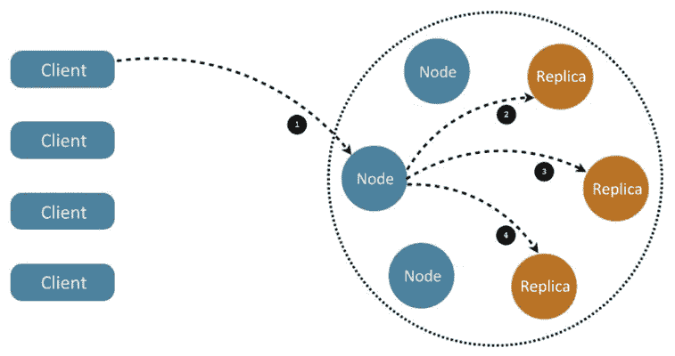

# 7

# 使用 Kubernetes 运行有状态应用

在本章中，我们将学习如何在 Kubernetes 上运行有状态应用。Kubernetes 自动处理许多工作，根据复杂的需求和配置（如命名空间、限制和配额），自动启动和重启集群节点上的 Pod。但是，当 Pods 运行存储感知型软件时，如数据库和队列，移动 Pod 可能会导致系统出现故障。

首先，我们将探讨有状态 Pod 的本质，以及为什么它们在 Kubernetes 中的管理更为复杂。我们将看一下几种管理复杂性的方式，比如共享环境变量和 DNS 记录。在某些情况下，冗余的内存状态、`DaemonSet` 或持久存储声明可以解决问题。Kubernetes 提供的主要有状态 Pod 解决方案是 `StatefulSet`（之前称为 `PetSet`）资源，它允许我们管理具有稳定属性的按索引排列的 Pod 集合。最后，我们将深入探讨在 Kubernetes 上运行 Cassandra 集群的完整示例。

本章将涵盖以下主要内容：

+   Kubernetes 中有状态与无状态应用

+   在 Kubernetes 中运行 Cassandra 集群

在本章结束时，你将理解 Kubernetes 中状态管理的挑战，深入了解在 Kubernetes 上运行 Cassandra 作为数据存储的具体示例，并能够确定适合你工作负载的状态管理策略。

# Kubernetes 中有状态与无状态应用

无状态的 Kubernetes 应用是指该应用不在 Kubernetes 集群中管理其状态。所有状态存储在内存中或集群外部，集群中的容器以某种方式访问它。另一方面，有状态的 Kubernetes 应用有一个持久状态，并在集群中管理。在本节中，我们将学习为什么状态管理对分布式系统设计至关重要，以及在 Kubernetes 集群中管理状态的好处。

## 理解分布式数据密集型应用的本质

让我们从基础开始。分布式应用是运行在多台机器上的一组进程，这些进程处理输入，操作数据，暴露 API，并可能有其他副作用。每个进程都是其程序、运行时环境以及输入输出的组合。

你在学校写的程序接收命令行参数作为输入；也许它们读取一个文件或访问数据库，然后将结果写入屏幕、文件或数据库。一些程序将状态保存在内存中，并能够通过网络处理请求。简单的程序运行在单台机器上，并且可以将所有状态保存在内存中或从文件中读取。它们的运行时环境是操作系统。如果程序崩溃，用户必须手动重启它们。它们与机器绑定。

分布式应用程序是另一种情况。单台机器不足以快速处理所有数据或响应所有请求。单台机器无法容纳所有数据。需要处理的数据量太大，以至于无法以经济的方式下载到每台处理机器中。机器可能会发生故障，需要更换。所有处理机器都需要进行升级。用户可能分布在全球各地。

考虑到所有这些问题，很明显传统方法行不通。限制因素变成了数据。用户/客户端只能接收到汇总或处理过的数据。所有大规模的数据处理必须在离数据本身很近的地方完成，因为数据传输过慢且成本过高。相反，大部分处理代码必须在数据所在的数据中心和网络环境中运行。

## 为什么要在 Kubernetes 中管理状态？

在 Kubernetes 内部管理状态而不是在单独的集群中管理的主要原因是，Kubernetes 已经提供了监控、扩展、分配、安全和运营存储集群所需的许多基础设施。运行一个平行的存储集群将导致大量重复的工作。

## 为什么要在 Kubernetes 外部管理状态？

我们不能排除其他选择。在某些情况下，将状态管理在一个独立的非 Kubernetes 集群中可能更好，只要它共享相同的内部网络（数据的接近性胜过一切）。

一些有效的理由如下：

+   您已经有了一个独立的存储集群，并且不想轻易改变现状

+   您的存储集群被其他非 Kubernetes 应用程序使用

+   Kubernetes 对您的存储集群的支持不稳定或不够成熟

+   您可能希望逐步接近 Kubernetes 中的有状态应用程序，从独立的存储集群开始，随后与 Kubernetes 更紧密地集成

## 共享环境变量与 DNS 记录进行发现

Kubernetes 为跨集群的全局发现提供了多种机制。如果您的存储集群不是由 Kubernetes 管理的，您仍然需要告诉 Kubernetes 的 pod 如何找到它并访问它。

有两种常见方法：

+   DNS

+   环境变量

在某些情况下，您可能希望同时使用这两种方法，因为环境变量可以覆盖 DNS。

### 通过 DNS 访问外部数据存储

DNS 方法简单明了。假设您的外部存储集群是负载均衡的并且可以提供稳定的端点，那么 pod 只需直接访问该端点并连接到外部集群。

### 通过环境变量访问外部数据存储

另一种简单的方法是使用环境变量将连接信息传递给外部存储集群。Kubernetes 提供了 `ConfigMap` 资源，作为将配置与容器镜像分开的方式。配置是一组 `key-value` 对。配置可以通过两种方式暴露。一种方式是作为环境变量，另一种是作为挂载到容器中的配置文件。对于像密码这样的敏感连接信息，你可能更倾向于使用秘密管理工具（secrets）。

#### 创建 ConfigMap

以下文件是一个 `ConfigMap`，它保存了地址列表：

```
apiVersion: v1
kind: ConfigMap 
metadata:
  name: db-config 
data:
  db-ip-addresses: 1.2.3.4,5.6.7.8 
```

将其保存为 `db-config-map.yaml` 并运行：

```
$ k create -f db-config-map.yaml
configmap/db-config created 
```

`data` 部分包含所有的 `key-value` 对，在这个例子中，只有一个键值对，键名为 `db-ip-addresses`。当在 Pod 中使用 `ConfigMap` 时，这一部分将变得很重要。你可以查看内容确认它是否正确：

```
$ k get configmap db-config -o yaml
apiVersion: v1
data:
  db-ip-addresses: 1.2.3.4,5.6.7.8
kind: ConfigMap
metadata:
  creationTimestamp: "2022-07-17T17:39:05Z"
  name: db-config
  namespace: default
  resourceVersion: "504571"
  uid: 11e49df0-ed1e-4bee-9fd7-bf38bb2aa38a 
```

还有其他方法可以创建 `ConfigMap`。你可以直接使用 `--from-value` 或 `--from-file` 命令行参数来创建。

### 作为环境变量使用 ConfigMap

当你创建一个 Pod 时，可以指定一个 `ConfigMap` 并以多种方式使用其值。以下是如何将配置映射作为环境变量使用：

```
apiVersion: v1
kind: Pod
metadata:
  name: some-pod
spec:
  containers:
  - name: some-container
    image: busybox
    command: ["/bin/sh", "-c", "env"]
    env:
    - name: DB_IP_ADDRESSES
      valueFrom:
        configMapKeyRef:
          name: db-config
          key: db-ip-addresses
  restartPolicy: Never 
```

这个 Pod 运行 `busybox` 最小化容器，并执行 `env bash` 命令，随后立即退出。来自 `db-configmap` 的 `db-ip-addresses` 键映射到 `DB_IP_ADDRESSES` 环境变量，并在日志中反映出来：

```
$ k create -f pod-with-db.yaml
pod/some-pod created
$ k logs some-pod | grep DB_IP
DB_IP_ADDRESSES=1.2.3.4,5.6.7.8 
```

### 使用冗余的内存状态

在某些情况下，你可能希望将临时状态保存在内存中。分布式缓存是一个常见的例子。时间敏感的信息也是如此。对于这些用例，通常不需要持久存储，通过服务访问的多个 Pods 可能是一个合适的解决方案。

我们可以使用标准的 Kubernetes 技术，例如标签，来识别属于分布式缓存的 Pods，存储相同状态的冗余副本，并通过服务暴露它们。如果某个 Pod 失效，Kubernetes 会创建一个新的 Pod，直到它赶上进度，其他 Pod 将继续提供该状态。我们甚至可以使用 Pod 的反亲和性特性，确保维护相同状态冗余副本的 Pods 不会被调度到同一节点。

当然，你也可以使用像 Memcached 或 Redis 这样的工具。

### 使用 DaemonSet 实现冗余持久存储

一些有状态应用程序，如分布式数据库或队列，管理其状态冗余并自动同步节点（稍后我们会深入了解 Cassandra）。在这些情况下，确保 Pods 被调度到不同的节点上非常重要。同样，确保 Pods 被调度到具有特定硬件配置的节点上，或者专门分配给有状态应用程序，也是非常重要的。`DaemonSet` 特性非常适合这种用例。我们可以为一组节点打标签，确保有状态的 Pods 被逐一调度到选定的节点组上。

### 应用持久卷声明

如果有状态应用可以有效利用共享的持久存储，那么在每个 pod 中使用持久卷声明是最佳选择，正如我们在*第六章*《存储管理》中展示的那样。有状态应用将看到一个看起来像本地文件系统的挂载卷。

### 使用 StatefulSet

StatefulSets 专门设计用于支持分布式有状态应用程序，其中成员的身份非常重要，并且如果 pod 被重启，它必须在集合中保持其身份。它提供了有序的部署和扩展。与常规 pod 不同，`StatefulSet`的 pod 与持久存储相关联。

#### 何时使用 StatefulSet

`StatefulSets`非常适合需要以下任何功能的应用程序：

+   一致且独特的网络标识符

+   持久且持久的存储

+   有条不紊且有组织的部署与扩展

+   系统化和有序的删除与终止

#### StatefulSet 的组件

有几个元素需要正确配置才能使`StatefulSet`正常工作：

+   一个负责管理 `StatefulSet` pod 网络身份的无头服务

+   `StatefulSet`本身及其副本数

+   节点上的本地存储或由管理员动态或手动配置的持久存储

这里是一个名为`nginx`的无头服务示例，将用于`StatefulSet`：

```
apiVersion: v1
kind: Service 
metadata:
  name: nginx 
  labels:
    app: nginx 
spec:
  selector:
    app: nginx
  ports:
  - port: 80 
    name: web
    clusterIP: None 
```

现在，`StatefulSet`清单文件将引用该服务：

```
apiVersion: apps/v1 
kind: StatefulSet 
metadata:
  name: web
spec:
  serviceName: "nginx" 
  replicas: 3
  template: 
    metadata:
      labels:
        app: nginx 
```

下一部分是 pod 模板，其中包括一个名为`www`的挂载卷：

```
spec:
  terminationGracePeriodSeconds: 10 
  containers:
  - name: nginx
    image: gcr.io/google_containers/nginx-slim:0.8 
    ports:
    - containerPort: 80 
      name: web 
    volumeMounts:
    - name: www
      mountPath: /usr/share/nginx/html 
```

最后但同样重要的是，`volumeClaimTemplates`使用名为`www`的声明来匹配挂载卷。该声明请求 1 Gib 的存储并具有`ReadWriteOnce`访问权限：

```
volumeClaimTemplates:
    - metadata:
      name: www 
      spec:
        accessModes: ["ReadWriteOnce"] 
        resources:
            requests: 
                storage: 1Gib 
```

### 使用 StatefulSets

让我们创建`nginx`无头服务和`statefulset`：

```
k apply -f nginx-headless-service.yaml
service/nginx created
$ k apply -f nginx-stateful-set.yaml
statefulset.apps/nginx created 
```

我们可以使用`kubectl get all`命令查看所有已创建的资源：

```
$ k get all
NAME          READY   STATUS    RESTARTS   AGE
pod/nginx-0   1/1     Running   0          107s
pod/nginx-1   1/1     Running   0          104s
pod/nginx-2   1/1     Running   0          102s
NAME                 TYPE        CLUSTER-IP   EXTERNAL-IP   PORT(S)   AGE
service/nginx        ClusterIP   None         <none>        80/TCP    2m5s
NAME                     READY   AGE
statefulset.apps/nginx   3/3     107s 
```

如预期所示，我们有一个包含三个副本的`statefulset`和无头服务。没有预设的是`ReplicaSet`，你会在创建 Deployment 时看到它。StatefulSets 直接管理它们的 pods。

请注意，`kubectl get all`实际上并不显示所有资源。StatefulSet 还会为每个 pod 创建一个由持久卷支持的持久卷声明。它们是：

```
$ k get pvc
NAME          STATUS   VOLUME                                     CAPACITY   ACCESS MODES   STORAGECLASS   AGE
www-nginx-0   Bound    pvc-40ac1c62-bba0-4e3c-9177-eda7402755b3   10Mi       RWO            standard       1m37s
www-nginx-1   Bound    pvc-94022a60-e4cb-4495-825d-eb744088266f   10Mi       RWO            standard       1m43s
www-nginx-2   Bound    pvc-8c60523f-a3e8-4ae3-a91f-6aaa53b02848   10Mi       RWO            standard       1m52h
$ k get pv
NAME                                       CAPACITY   ACCESS MODES   RECLAIM POLICY   STATUS   CLAIM                 STORAGECLASS   REASON   AGE
pvc-40ac1c62-bba0-4e3c-9177-eda7402755b3   10Mi       RWO            Delete           Bound    default/www-nginx-0   standard                1m59s
pvc-8c60523f-a3e8-4ae3-a91f-6aaa53b02848   10Mi       RWO            Delete           Bound    default/www-nginx-2   standard                2m2s
pvc-94022a60-e4cb-4495-825d-eb744088266f   10Mi       RWO            Delete           Bound    default/www-nginx-1   standard                2m1s 
```

如果我们删除一个 pod，StatefulSet 会创建一个新 pod 并将其绑定到相应的持久卷声明。pod `nginx-1` 被绑定到`www-nginx-1` pvc：

```
$ k get po nginx-1 -o yaml | yq '.spec.volumes[0]'
name: www
persistentVolumeClaim:
  claimName: www-nginx-1 
```

让我们删除`nginx-1` pod 并检查所有剩余的 pod：

```
$ k delete po nginx-1
pod "nginx-1" deleted
$ k get po
NAME      READY   STATUS    RESTARTS   AGE
nginx-0   1/1     Running   0          12m
nginx-1   1/1     Running   0          14s
nginx-2   1/1     Running   0          12m 
```

如你所见，StatefulSet 立即用一个新的`nginx-1` pod（14 秒前创建）替换了它。新 pod 被绑定到相同的持久卷声明：

```
$ k get po nginx-1 -o yaml | yq '.spec.volumes[0]'
name: www
persistentVolumeClaim:
  claimName: www-nginx-1 
```

当旧的`nginx-1` pod 被删除时，持久卷声明及其背后的持久卷并没有被删除，你可以通过它们的创建时间看出这一点：

```
$ k get pvc www-nginx-1
NAME          STATUS   VOLUME                                     CAPACITY   ACCESS MODES   STORAGECLASS   AGE
www-nginx-1   Bound    pvc-94022a60-e4cb-4495-825d-eb744088266f   10Mi       RWO            standard       143s
$ k get pv pvc-94022a60-e4cb-4495-825d-eb744088266f
NAME                                       CAPACITY   ACCESS MODES   RECLAIM POLICY   STATUS   CLAIM                 STORAGECLASS   REASON   AGE
pvc-94022a60-e4cb-4495-825d-eb744088266f   10Mi       RWO            Delete           Bound    default/www-nginx-1   standard                2m1s 
```

这意味着即使 Pods 来来去去，StatefulSet 的状态也会被保持。每个通过其索引标识的 Pod 始终绑定到某个特定的状态分片，并由相应的持久卷声明备份。

到此为止，我们已经理解了 StatefulSets 的概念以及如何使用它们。让我们深入研究如何实现一个工业级数据存储，并看看它如何作为 StatefulSet 部署在 Kubernetes 中。

# 在 Kubernetes 中运行 Cassandra 集群

在本节中，我们将详细探讨如何配置一个非常大的 Cassandra 集群在 Kubernetes 集群中运行。我将分析并为一些有趣的部分提供背景。如果你想进一步探索完整的示例，可以在这里访问：

[`kubernetes.io/docs/tutorials/stateful-application/cassandra`](https://kubernetes.io/docs/tutorials/stateful-application/cassandra)

这里的目标是了解在 Kubernetes 上运行一个真实世界的有状态工作负载需要什么，以及 StatefulSets 如何提供帮助。如果你没有理解每个细节也不用担心。

首先，我们将了解一些关于 Cassandra 的知识及其独特性，然后按照一步一步的流程，使用我们在前一部分中讨论的几种技术和策略将其运行起来。

## Cassandra 简介

Cassandra 是一个分布式列式数据存储系统。它从一开始就为大数据而设计。Cassandra 具有快速、强大（没有单点故障）、高可用和线性可扩展的特点。它还支持多数据中心。它通过专注于特定功能并精心设计支持的特性，以及同样重要的是不支持的特性，来实现这一切。

在前一家公司，我运行了一个 Kubernetes 集群，使用 Cassandra 作为传感器数据的主要数据存储（大约 100 TB）。Cassandra 根据 **分布式哈希表**（**DHT**）算法将数据分配到一组节点（节点环）中。

集群节点通过 gossip 协议相互通信，并快速了解集群的整体状态（哪些节点加入、哪些节点离开或不可用）。Cassandra 会不断压缩数据并平衡集群。数据通常会被多次复制以保证冗余、稳健性和高可用性。

从开发者的角度来看，Cassandra 非常适合时间序列数据，并提供一个灵活的模型，允许在每个查询中指定一致性级别。它还是幂等的（这是分布式数据库中非常重要的特性），这意味着允许重复插入或更新操作。

下面是一个图示，展示了 Cassandra 集群的组织方式，客户端如何访问任意节点，以及请求将如何自动转发到具有请求数据的节点：



图 7.1：请求与 Cassandra 集群的交互

## Cassandra Docker 镜像

在 Kubernetes 上部署 Cassandra 与在独立 Cassandra 集群中部署不同，需要使用特定的 Docker 镜像。这是一个重要的步骤，因为这意味着我们可以使用 Kubernetes 来跟踪我们的 Cassandra pods。镜像的 Dockerfile 可以在这里找到：[`github.com/kubernetes/examples/blob/master/cassandra/image/Dockerfile`](https://github.com/kubernetes/examples/blob/master/cassandra/image/Dockerfile)。

下面是构建 Cassandra 镜像的 Dockerfile。基础镜像是为容器使用设计的 Debian 版本（见 [`github.com/kubernetes/kubernetes/tree/master/build/debian-base`](https://github.com/kubernetes/kubernetes/tree/master/build/debian-base)）。

Cassandra Dockerfile 定义了一些构建参数，这些参数在镜像构建时必须设置，创建了一些标签，定义了许多环境变量，将所有文件添加到容器内的根目录，运行 `build.sh` 脚本，声明 Cassandra 数据卷（数据存储位置），暴露了一些端口，最后使用 `dumb-init` 执行 `run.sh` 脚本：

```
FROM k8s.gcr.io/debian-base-amd64:0.3
ARG BUILD_DATE
ARG VCS_REF
ARG CASSANDRA_VERSION
ARG DEV_CONTAINER
LABEL \
    org.label-schema.build-date=$BUILD_DATE \
    org.label-schema.docker.dockerfile="/Dockerfile" \
    org.label-schema.license="Apache License 2.0" \
    org.label-schema.name="k8s-for-greeks/docker-cassandra-k8s" \
    org.label-schema.url="https://github.com/k8s-for-greeks/" \
    org.label-schema.vcs-ref=$VCS_REF \
    org.label-schema.vcs-type="Git" \
    org.label-schema.vcs-url="https://github.com/k8s-for-greeks/docker-cassandra-k8s"
ENV CASSANDRA_HOME=/usr/local/apache-cassandra-${CASSANDRA_VERSION} \
    CASSANDRA_CONF=/etc/cassandra \
    CASSANDRA_DATA=/cassandra_data \
    CASSANDRA_LOGS=/var/log/cassandra \
    JAVA_HOME=/usr/lib/jvm/java-8-openjdk-amd64 \
    PATH=${PATH}:/usr/lib/jvm/java-8-openjdk-amd64/bin:/usr/local/apache-cassandra-${CASSANDRA_VERSION}/bin
ADD files /
RUN clean-install bash \
    && /build.sh \
    && rm /build.sh
VOLUME ["/$CASSANDRA_DATA"]
# 7000: intra-node communication
# 7001: TLS intra-node communication
# 7199: JMX
# 9042: CQL
# 9160: thrift service
EXPOSE 7000 7001 7199 9042 9160
CMD ["/usr/bin/dumb-init", "/bin/bash", "/run.sh"] 
```

以下是 Dockerfile 使用的所有文件：

```
build.sh
cassandra-seed.h
cassandra.yaml
jvm.options
kubernetes-cassandra.jar
logback.xml
ready-probe.sh
run.sh 
```

我们不会覆盖所有内容，而是专注于几个有趣的脚本：`build.sh` 和 `run.sh` 脚本。

### 探索 `build.sh` 脚本

Cassandra 是一个 Java 程序。构建脚本安装 Java 运行时环境和一些必要的库与工具。然后设置一些稍后将使用的变量，如 `CASSANDRA_PATH`。

它从 Apache 组织下载正确版本的 Cassandra（Cassandra 是一个 Apache 开源项目），创建了 `/cassandra_data/data` 目录以存储 Cassandra 的 `SSTables` 和 `/etc/cassandra` 配置目录，复制文件到配置目录，添加 Cassandra 用户，设置就绪探针，安装 Python，将 Cassandra JAR 文件和种子共享库移动到目标位置，然后清理在此过程中生成的所有中间文件：

```
...
clean-install \
    openjdk-8-jre-headless \
    libjemalloc1 \
    localepurge \
    dumb-init \
    wget
CASSANDRA_PATH="cassandra/${CASSANDRA_VERSION}/apache-cassandra-${CASSANDRA_VERSION}-bin.tar.gz"
CASSANDRA_DOWNLOAD="http://www.apache.org/dyn/closer.cgi?path=/${CASSANDRA_PATH}&as_json=1"
CASSANDRA_MIRROR=`wget -q -O - ${CASSANDRA_DOWNLOAD} | grep -oP "(?<=\"preferred\": \")[^\"]+"`
echo "Downloading Apache Cassandra from $CASSANDRA_MIRROR$CASSANDRA_PATH..."
wget -q -O - $CASSANDRA_MIRROR$CASSANDRA_PATH \
    | tar -xzf - -C /usr/local
mkdir -p /cassandra_data/data
mkdir -p /etc/cassandra
mv /logback.xml /cassandra.yaml /jvm.options /etc/cassandra/
mv /usr/local/apache-cassandra-${CASSANDRA_VERSION}/conf/cassandra-env.sh /etc/cassandra/
adduser --disabled-password --no-create-home --gecos '' --disabled-login cassandra
chmod +x /ready-probe.sh
chown cassandra: /ready-probe.sh
DEV_IMAGE=${DEV_CONTAINER:-}
if [ ! -z "$DEV_IMAGE" ]; then
    clean-install python;
else
    rm -rf  $CASSANDRA_HOME/pylib;
fi
mv /kubernetes-cassandra.jar /usr/local/apache-cassandra-${CASSANDRA_VERSION}/lib
mv /cassandra-seed.so /etc/cassandra/
mv /cassandra-seed.h /usr/local/lib/include
apt-get -y purge localepurge
apt-get -y autoremove
apt-get clean
rm -rf <many files> 
```

### 探索 `run.sh` 脚本

`run.sh` 脚本需要一些 shell 技能和对 Cassandra 的了解才能理解，但这值得付出努力。首先，设置一些本地变量用于 Cassandra 配置文件 `/etc/cassandra/cassandra.yaml`。`CASSANDRA_CFG` 变量将在脚本的其余部分使用：

```
set -e
CASSANDRA_CONF_DIR=/etc/cassandra
CASSANDRA_CFG=$CASSANDRA_CONF_DIR/cassandra.yaml 
```

如果没有指定 `CASSANDRA_SEEDS`，则设置 `HOSTNAME`，稍后 `StatefulSet` 将使用该变量：

```
# we are doing StatefulSet or just setting our seeds
if [ -z "$CASSANDRA_SEEDS" ]; then
  HOSTNAME=$(hostname -f)
  CASSANDRA_SEEDS=$(hostname -f)
fi 
```

然后是一个包含默认值的环境变量长列表。语法 `${VAR_NAME:-}` 使用环境变量 `VAR_NAME`，如果已定义，或者使用默认值。

一个类似的语法 `${VAR_NAME:=}` 做了同样的事情，但如果环境变量未定义，还会给环境变量赋予默认值。这是一个微妙但重要的区别。

这里使用了两种变体：

```
# The following vars relate to their counter parts in $CASSANDRA_CFG
# for instance rpc_address
CASSANDRA_RPC_ADDRESS="${CASSANDRA_RPC_ADDRESS:-0.0.0.0}"
CASSANDRA_NUM_TOKENS="${CASSANDRA_NUM_TOKENS:-32}"
CASSANDRA_CLUSTER_NAME="${CASSANDRA_CLUSTER_NAME:='Test Cluster'}"
CASSANDRA_LISTEN_ADDRESS=${POD_IP:-$HOSTNAME}
CASSANDRA_BROADCAST_ADDRESS=${POD_IP:-$HOSTNAME}
CASSANDRA_BROADCAST_RPC_ADDRESS=${POD_IP:-$HOSTNAME}
CASSANDRA_DISK_OPTIMIZATION_STRATEGY="${CASSANDRA_DISK_OPTIMIZATION_STRATEGY:-ssd}"
CASSANDRA_MIGRATION_WAIT="${CASSANDRA_MIGRATION_WAIT:-1}"
CASSANDRA_ENDPOINT_SNITCH="${CASSANDRA_ENDPOINT_SNITCH:-SimpleSnitch}"
CASSANDRA_DC="${CASSANDRA_DC}"
CASSANDRA_RACK="${CASSANDRA_RACK}"
CASSANDRA_RING_DELAY="${CASSANDRA_RING_DELAY:-30000}"
CASSANDRA_AUTO_BOOTSTRAP="${CASSANDRA_AUTO_BOOTSTRAP:-true}"
CASSANDRA_SEEDS="${CASSANDRA_SEEDS:false}"
CASSANDRA_SEED_PROVIDER="${CASSANDRA_SEED_PROVIDER:-org.apache.cassandra.locator.SimpleSeedProvider}"
CASSANDRA_AUTO_BOOTSTRAP="${CASSANDRA_AUTO_BOOTSTRAP:false}" 
```

顺便说一句，我为 Kubernetes 做出了贡献，通过提交 PR 修复了一个小错误。请参见 [`github.com/kubernetes/examples/pull/348`](https://github.com/kubernetes/examples/pull/348)。

下一部分配置了监控 JMX 并控制垃圾回收输出：

```
# Turn off JMX auth
CASSANDRA_OPEN_JMX="${CASSANDRA_OPEN_JMX:-false}"
# send GC to STDOUT
CASSANDRA_GC_STDOUT="${CASSANDRA_GC_STDOUT:-false}" 
```

接下来是一个部分，所有变量都会在屏幕上打印出来。我们跳过其中的大部分：

```
echo Starting Cassandra on ${CASSANDRA_LISTEN_ADDRESS}
echo CASSANDRA_CONF_DIR ${CASSANDRA_CONF_DIR}
echo CASSANDRA_CFG ${CASSANDRA_CFG}
echo CASSANDRA_AUTO_BOOTSTRAP ${CASSANDRA_AUTO_BOOTSTRAP}
... 
```

下一部分非常重要。默认情况下，Cassandra 使用一个简单的 Snitch，它不了解机架和数据中心。当集群跨多个数据中心和机架时，这种配置并不理想。

Cassandra 支持机架和数据中心的感知，并可以优化冗余和高可用性，同时合理限制跨数据中心的通信：

```
# if DC and RACK are set, use GossipingPropertyFileSnitch
if [[ $CASSANDRA_DC && $CASSANDRA_RACK ]]; then
  echo "dc=$CASSANDRA_DC" > $CASSANDRA_CONF_DIR/cassandra-rackdc.properties
  echo "rack=$CASSANDRA_RACK" >> $CASSANDRA_CONF_DIR/cassandra-rackdc.properties
  CASSANDRA_ENDPOINT_SNITCH="GossipingPropertyFileSnitch"
fi 
```

内存管理也很重要，您可以控制最大堆内存大小，确保 Cassandra 不会开始抖动并将数据交换到磁盘：

```
if [ -n "$CASSANDRA_MAX_HEAP" ]; then
  sed -ri "s/^(#)?-Xmx[0-9]+.*/-Xmx$CASSANDRA_MAX_HEAP/" "$CASSANDRA_CONF_DIR/jvm.options"
  sed -ri "s/^(#)?-Xms[0-9]+.*/-Xms$CASSANDRA_MAX_HEAP/" "$CASSANDRA_CONF_DIR/jvm.options"
fi
if [ -n "$CASSANDRA_REPLACE_NODE" ]; then
   echo "-Dcassandra.replace_address=$CASSANDRA_REPLACE_NODE/" >> "$CASSANDRA_CONF_DIR/jvm.options"
fi 
```

机架和数据中心信息存储在一个简单的 Java `propertiesfile` 中：

```
for rackdc in dc rack; do
  var="CASSANDRA_${rackdc^^}"
  val="${!var}"
  if [ "$val" ]; then
    sed -ri 's/^('"$rackdc"'=).*/\1 '"$val"'/' "$CASSANDRA_CONF_DIR/cassandra-rackdc.properties"
  fi
done 
```

下一部分会遍历之前定义的所有变量，找到对应的 `Cassandra.yaml` 配置文件中的键，并覆盖它们。这确保了每个配置文件在启动 Cassandra 之前会动态定制：

```
for yaml in \
  broadcast_address \
  broadcast_rpc_address \
  cluster_name \
  disk_optimization_strategy \
  endpoint_snitch \
  listen_address \
  num_tokens \
  rpc_address \
  start_rpc \
  key_cache_size_in_mb \
  concurrent_reads \
  concurrent_writes \
  memtable_cleanup_threshold \
  memtable_allocation_type \
  memtable_flush_writers \
  concurrent_compactors \
  compaction_throughput_mb_per_sec \
  counter_cache_size_in_mb \
  internode_compression \
  endpoint_snitch \
  gc_warn_threshold_in_ms \
  listen_interface \
  rpc_interface \
  ; do
  var="CASSANDRA_${yaml^^}"
  val="${!var}"
  if [ "$val" ]; then
    sed -ri 's/^(# )?('"$yaml"':).*/\2 '"$val"'/' "$CASSANDRA_CFG"
  fi
done
echo "auto_bootstrap: ${CASSANDRA_AUTO_BOOTSTRAP}" >> $CASSANDRA_CFG 
```

下一部分主要是设置种子或种子提供者，这取决于部署解决方案（是否使用 `StatefulSet`）。对于第一个 pod 启动为其自身种子有一个小技巧：

```
# set the seed to itself.  This is only for the first pod, otherwise
# it will be able to get seeds from the seed provider
if [[ $CASSANDRA_SEEDS == 'false' ]]; then
  sed -ri 's/- seeds:.*/- seeds: "'"$POD_IP"'"/' $CASSANDRA_CFG
else # if we have seeds set them.  Probably StatefulSet
  sed -ri 's/- seeds:.*/- seeds: "'"$CASSANDRA_SEEDS"'"/' $CASSANDRA_CFG
fi
sed -ri 's/- class_name: SEED_PROVIDER/- class_name: '"$CASSANDRA_SEED_PROVIDER"'/' $CASSANDRA_CFG 
```

以下部分设置了远程管理和 JMX 监控的各种选项。在复杂的分布式系统中，拥有合适的管理工具至关重要。Cassandra 对广泛使用的**JMX**标准有深度支持：

```
# send gc to stdout
if [[ $CASSANDRA_GC_STDOUT == 'true' ]]; then
  sed -ri 's/ -Xloggc:\/var\/log\/cassandra\/gc\.log//' $CASSANDRA_CONF_DIR/cassandra-env.sh
fi
# enable RMI and JMX to work on one port
echo "JVM_OPTS=\"\$JVM_OPTS -Djava.rmi.server.hostname=$POD_IP\"" >> $CASSANDRA_CONF_DIR/cassandra-env.sh
# getting WARNING messages with Migration Service
echo "-Dcassandra.migration_task_wait_in_seconds=${CASSANDRA_MIGRATION_WAIT}" >> $CASSANDRA_CONF_DIR/jvm.options
echo "-Dcassandra.ring_delay_ms=${CASSANDRA_RING_DELAY}" >> $CASSANDRA_CONF_DIR/jvm.options
if [[ $CASSANDRA_OPEN_JMX == 'true' ]]; then
  export LOCAL_JMX=no
  sed -ri 's/ -Dcom\.sun\.management\.jmxremote\.authenticate=true/ -Dcom\.sun\.management\.jmxremote\.authenticate=false/' $CASSANDRA_CONF_DIR/cassandra-env.sh
  sed -ri 's/ -Dcom\.sun\.management\.jmxremote\.password\.file=\/etc\/cassandra\/jmxremote\.password//' $CASSANDRA_CONF_DIR/cassandra-env.sh
fi 
```

最后，它保护数据目录，只有 `cassandra` 用户可以访问，`CLASSPATH` 设置为 Cassandra 的 `JAR` 文件，并且以 `cassandra` 用户的身份在前台启动 Cassandra（而非作为守护进程）：

```
chmod 700 "${CASSANDRA_DATA}"
chown -c -R cassandra "${CASSANDRA_DATA}" "${CASSANDRA_CONF_DIR}"
export CLASSPATH=/kubernetes-cassandra.jar
su cassandra -c "$CASSANDRA_HOME/bin/cassandra -f" 
```

## 连接 Kubernetes 和 Cassandra

连接 Kubernetes 和 Cassandra 需要一些工作，因为 Cassandra 设计为非常自给自足，但我们希望它能在适当的时机接入 Kubernetes，提供诸如自动重启失败节点、监控、分配 Cassandra pod 以及提供 Cassandra pod 与其他 pod 并排显示的统一视图等功能。

Cassandra 是一个复杂的系统，具有许多控制选项。它随附一个 `Cassandra.yaml` 配置文件，您可以通过环境变量覆盖所有选项。

### 深入了解 Cassandra 配置文件

有两个特别相关的设置：种子提供者和 snitch。种子提供者负责发布集群中节点的 IP 地址列表（种子）。每个启动的节点都会连接到这些种子（通常至少有三个），如果成功连接其中一个，它们会立即交换集群中所有节点的信息。随着节点之间的相互传播，这些信息会不断更新。

在`Cassandra.yaml`中配置的默认种子提供者只是一个静态 IP 地址列表，在此情况下，仅为回环接口：

```
# any class that implements the SeedProvider interface and has a
# constructor that takes a Map<String, String> of parameters will do.
seed_provider:
    # Addresses of hosts that are deemed contact points.
    # Cassandra nodes use this list of hosts to find each other and learn
    # the topology of the ring.  You must change this if you are running
    # multiple nodes!
    #- class_name: io.k8s.cassandra.KubernetesSeedProvider
    - class_name: SEED_PROVIDER
      parameters:
          # seeds is actually a comma-delimited list of addresses.
          # Ex: "<ip1>,<ip2>,<ip3>"
          - seeds: "127.0.0.1" 
```

另一个重要的设置是 snitch。它有两个作用：

+   Cassandra 利用 snitch 来深入了解网络拓扑，从而有效地路由请求。

+   Cassandra 利用这些知识来有策略地在集群中分配副本，降低相关故障的风险。为此，Cassandra 将机器组织到数据中心和机架中，确保副本不会集中在同一个机架上，即使这不一定与物理位置相关。

Cassandra 预装了几种 snitch 类，但没有一个是 Kubernetes 感知的。默认是`SimpleSnitch`，但可以被重写：

```
# You can use a custom Snitch by setting this to the full class
# name of the snitch, which will be assumed to be on your classpath. 
endpoint_snitch: SimpleSnitch 
```

其他的 snitch 有：

+   `GossipingPropertyFileSnitch`

+   `PropertyFileSnitch`

+   `Ec2Snitch`

+   `Ec2MultiRegionSnitch`

+   `RackInferringSnitch`

### 自定义种子提供者

当在 Kubernetes 中将 Cassandra 节点作为 Pod 运行时，Kubernetes 可能会移动 Pod，包括种子节点。为此，Cassandra 种子提供者需要与 Kubernetes API 服务器进行交互。

```
KubernetesSeedProvider (a Java class that implements the Cassandra SeedProvider API):
```

```
public class KubernetesSeedProvider implements SeedProvider {
...
    /**
     * Call Kubernetes API to collect a list of seed providers
     *
     * @return list of seed providers
     */
    public List<InetAddress> getSeeds() {
        GoInterface go = (GoInterface) Native.loadLibrary("cassandra-seed.so", GoInterface.class);
        String service = getEnvOrDefault("CASSANDRA_SERVICE", "cassandra");
        String namespace = getEnvOrDefault("POD_NAMESPACE", "default");
        String initialSeeds = getEnvOrDefault("CASSANDRA_SEEDS", "");
        if ("".equals(initialSeeds)) {
            initialSeeds = getEnvOrDefault("POD_IP", "");
        }
        String seedSizeVar = getEnvOrDefault("CASSANDRA_SERVICE_NUM_SEEDS", "8");
        Integer seedSize = Integer.valueOf(seedSizeVar);
        String data = go.GetEndpoints(namespace, service, initialSeeds);
        ObjectMapper mapper = new ObjectMapper();
        try {
            Endpoints endpoints = mapper.readValue(data, Endpoints.class);
            logger.info("cassandra seeds: {}", endpoints.ips.toString());
            return Collections.unmodifiableList(endpoints.ips);
        } catch (IOException e) {
            // This should not happen
            logger.error("unexpected error building cassandra seeds: {}" , e.getMessage());
            return Collections.emptyList();
        }
    } 
```

## 创建 Cassandra 无头服务

无头服务的作用是允许 Kubernetes 集群中的客户端通过标准 Kubernetes 服务连接到 Cassandra 集群，而不必跟踪节点的网络身份或在所有节点前面设置专用负载均衡器。Kubernetes 通过其服务原生提供了这一切。

这是`Service`清单：

```
apiVersion:  v1  
kind: Service 
metadata:
  labels:
    app: cassandra 
    name: cassandra
spec:
  clusterIP: None 
  ports:
    - port: 9042 
  selector:
    app: Cassandra 
```

`app: cassandra`标签将所有参与服务的 Pod 进行分组。Kubernetes 会创建端点记录，DNS 会返回用于发现的记录。`clusterIP`为`None`，这意味着该服务是无头的，Kubernetes 不会进行任何负载均衡或代理。这一点很重要，因为 Cassandra 节点会直接进行通信。

`9042`端口被 Cassandra 用于提供 CQL 请求。这些请求可以是查询、插入/更新（在 Cassandra 中总是 upsert）或删除。

## 使用 StatefulSet 创建 Cassandra 集群

声明一个`StatefulSet`并非易事，它可以说是最复杂的 Kubernetes 资源之一。它包含许多组成部分：标准元数据、StatefulSet 规范、Pod 模板（通常本身也相当复杂）和卷声明模板。

### 解剖 StatefulSet YAML 文件

让我们有条理地回顾一下这个声明了三节点 Cassandra 集群的 StatefulSet YAML 文件示例。

这是基本的元数据。请注意，`apiVersion` 字符串为 `apps/v1`（`StatefulSet` 在 Kubernetes 1.9 中正式发布）：

```
apiVersion: "apps/v1"
kind: StatefulSet
metadata:
  name: cassandra
  labels:
     app: cassandra 
```

StatefulSet 规格定义了无头服务名称、标签选择器（`app: cassandra`）、StatefulSet 中的 Pod 数量以及 Pod 模板（稍后解释）。`replicas` 字段指定了 StatefulSet 中的 Pod 数量：

```
spec:
  serviceName: cassandra
  replicas: 3
  selector:
    matchLabels:
      app: cassandra
  template:      
      ... 
```

Pod 的“replicas”这个术语是一个不太恰当的选择，因为这些 Pod 不是彼此的副本。它们共享相同的 Pod 模板，但每个 Pod 都有一个独特的身份，并且通常负责不同的状态子集。对于 Cassandra 来说，情况更为混淆，因为它使用同样的术语“replicas”来指代那些冗余复制某些状态子集的节点组（但它们并不完全相同，因为每个节点还可以管理额外的状态）。

我在 Kubernetes 项目中开了一个 GitHub 问题，建议将“replicas”一词更改为“members”：

[`github.com/kubernetes/kubernetes.github.io/issues/2103`](https://github.com/kubernetes/kubernetes.github.io/issues/2103)

Pod 模板包含了基于自定义 Cassandra 镜像的单一容器。它还将终止宽限期设置为 30 分钟。这意味着当 Kubernetes 需要终止 Pod 时，它会向容器发送 `SIGTERM` 信号，通知它们应退出，并给予它们优雅退出的机会。任何在宽限期后仍在运行的容器将通过 `SIGKILL` 被强制终止。

这是带有 `app: cassandra` 标签的 Pod 模板：

```
 template:
    metadata:
      labels:
        app: cassandra
    spec:
      terminationGracePeriodSeconds: 1800
      containers:
      ... 
```

`containers` 部分包含多个重要部分。它以名称和我们之前查看的镜像开始：

```
 containers:
      - name: cassandra
        image: gcr.io/google-samples/cassandra:v14
        imagePullPolicy: Always 
```

然后，它定义了 Cassandra 节点所需的多个容器端口，用于外部和内部通信：

```
 ports:
        - containerPort: 7000
          name: intra-node
        - containerPort: 7001
          name: tls-intra-node
        - containerPort: 7199
          name: jmx
        - containerPort: 9042
          name: cql 
```

`resources` 部分指定了容器所需的 CPU 和内存。这一点至关重要，因为存储管理层绝不应该因为 CPU 或内存的原因成为性能瓶颈。请注意，它遵循了请求和限制一致的最佳实践，以确保资源在分配后始终可用：

```
 resources:
          limits:
            cpu: "500m"
            memory: 1Gi
          requests:
           cpu: "500m"
           memory: 1Gi 
```

Cassandra 需要访问**进程间通信**（**IPC**），容器通过安全上下文的能力来请求这一访问权限：

```
 securityContext:
          capabilities:
            add:
              - IPC_LOCK 
```

`lifecycle` 部分运行 Cassandra 的 `nodetool drain` 命令，以确保当容器需要关闭时，节点上的数据会转移到 Cassandra 集群中的其他节点。这也是为什么需要 30 分钟宽限期的原因。节点排空涉及大量数据转移：

```
 lifecycle:
          preStop:
            exec:
              command:
              - /bin/sh
              - -c
              - nodetool drain 
```

`env` 部分指定了容器内可用的环境变量。以下是必要变量的部分列表。`CASSANDRA_SEEDS` 变量设置为无头服务，这样 Cassandra 节点就可以在启动时与种子节点通信并发现整个集群。请注意，在此配置中，我们没有使用特殊的 Kubernetes 种子提供程序。`POD_IP` 很有趣，因为它利用了向下 API，通过字段引用 `status.podIP` 来填充其值：

```
 env:
          - name: MAX_HEAP_SIZE
            value: 512M
          - name: HEAP_NEWSIZE
            value: 100M
          - name: CASSANDRA_SEEDS
            value: "cassandra-0.cassandra.default.svc.cluster.local"
          - name: CASSANDRA_CLUSTER_NAME
            value: "K8Demo"
          - name: CASSANDRA_DC
            value: "DC1-K8Demo"
          - name: CASSANDRA_RACK
            value: "Rack1-K8Demo"
          - name: CASSANDRA_SEED_PROVIDER
            value: io.k8s.cassandra.KubernetesSeedProvider
          - name: POD_IP
            valueFrom:
              fieldRef:
                fieldPath: status.podIP 
```

就绪探针确保在节点实际准备好处理请求之前，不会将请求发送到该节点。`ready-probe.sh` 脚本使用 Cassandra 的 `nodetool status` 命令：

```
 readinessProbe:
          exec:
            command:
            - /bin/bash
            - -c
            - /ready-probe.sh
          initialDelaySeconds: 15
          timeoutSeconds: 5 
```

容器配置的最后一部分是卷挂载，必须与持久化卷声明匹配：

```
 volumeMounts:
        - name: cassandra-data
          mountPath: /var/lib/cassandra 
```

这就是容器配置的全部内容。最后一部分是卷声明模板。在这种情况下，使用的是动态供应。强烈建议为 Cassandra 存储使用 SSD 驱动，特别是其日志。此示例中请求的存储为 1 GiB。我通过实验发现，单个 Cassandra 节点的理想存储大小是 1 到 2 TB。原因是 Cassandra 在后台会做很多数据重排、压缩和重新平衡。如果一个节点离开集群或一个新节点加入集群，你必须等到数据被正确重新平衡后，才能正确地重新分配离开节点的数据，或者新节点会填充数据。

请注意，Cassandra 需要大量的磁盘空间来进行所有这些数据重排。建议保持 50% 的磁盘空间空闲。当你考虑到还需要复制（通常是 3 倍）时，所需的存储空间可能是数据大小的 6 倍。如果你敢于冒险，可能只使用 2 倍的复制，并且保持 30% 空闲空间，具体取决于你的使用情况。但即便是在单节点上，也不要让空闲磁盘空间低于 10%。我通过实际经验了解到，Cassandra 会卡住，无法压缩和重新平衡这种节点，除非采取极端措施。

在这种情况下，必须定义存储类 `fast`。通常对于 Cassandra，你需要一个特殊的存储类，而不能使用 Kubernetes 集群默认的存储类。

访问模式当然是 `ReadWriteOnce`：

```
 volumeClaimTemplates:
  - metadata:
      name: cassandra-data
    spec:
      storageClassName: fast
      accessModes: [ "ReadWriteOnce" ]
      resources:
        requests:
          storage: 1Gi 
```

部署 StatefulSet 时，Kubernetes 按照索引号顺序创建 pod。在扩展或缩减时，也会按照顺序进行。对于 Cassandra 来说，这并不重要，因为它可以处理节点按任意顺序加入或离开集群。当一个 Cassandra pod 被销毁（不优雅地销毁时），持久化卷仍然存在。如果稍后创建具有相同索引的 pod，原始持久化卷将会被挂载到它上面。这种特定 pod 和其存储之间的稳定连接，使得 Cassandra 能够正确管理状态。

# 总结

在本章中，我们讨论了有状态应用程序以及如何将它们与 Kubernetes 集成。我们发现有状态应用程序非常复杂，并考虑了几种发现机制，如 DNS 和环境变量。我们还讨论了几种状态管理解决方案，如内存冗余存储、本地存储和持久化存储。本章的重点围绕着如何通过 StatefulSet 在 Kubernetes 集群中部署 Cassandra 集群。我们深入探讨了低级细节，以便更好地理解将像 Cassandra 这样复杂的第三方分布式系统集成到 Kubernetes 中究竟需要什么。到此为止，您应该对有状态应用程序以及如何在基于 Kubernetes 的系统中应用它们有了透彻的理解。您已经掌握了多种方法，适用于不同的使用场景，也许您还学到了一些关于 Cassandra 的知识。

在下一章中，我们将继续我们的旅程，探索一个重要话题——可扩展性，特别是自动扩展性，以及如何在集群动态增长时进行部署和实时升级更新。这些问题非常复杂，尤其是当集群中运行着有状态应用程序时。
