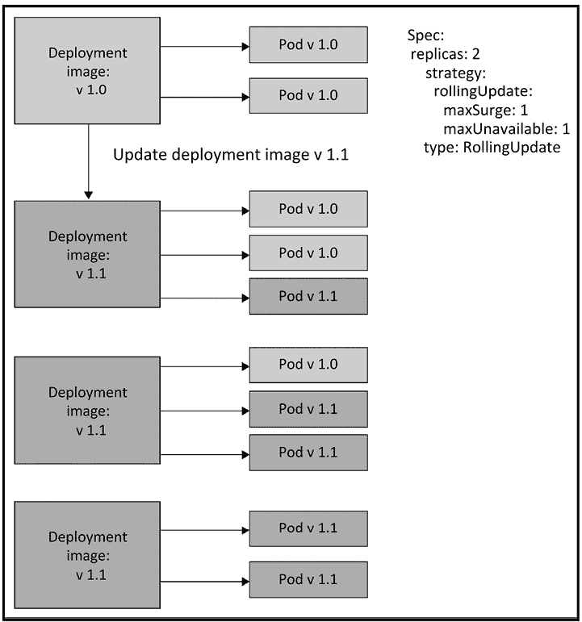
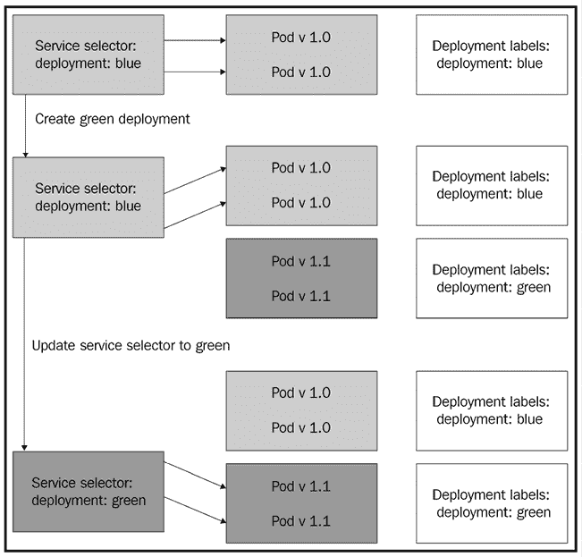
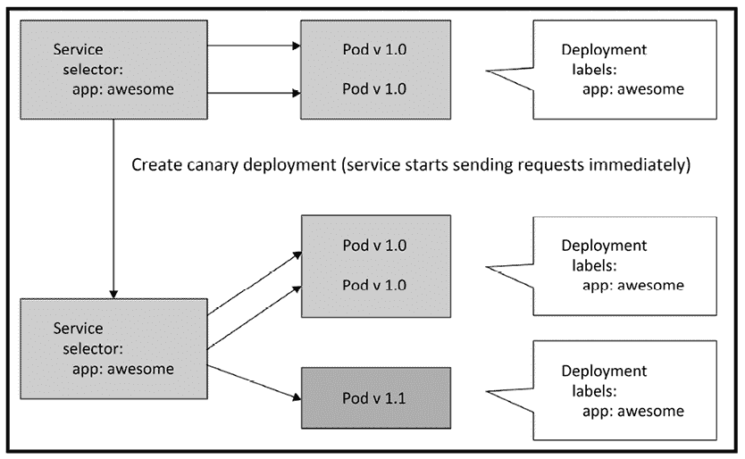
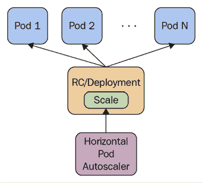
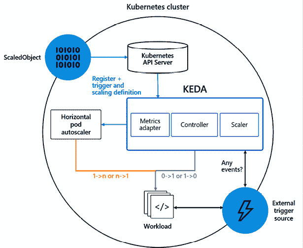
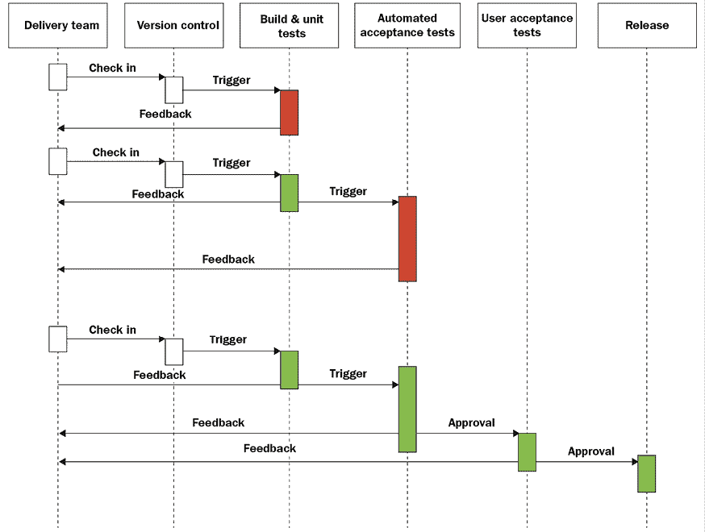
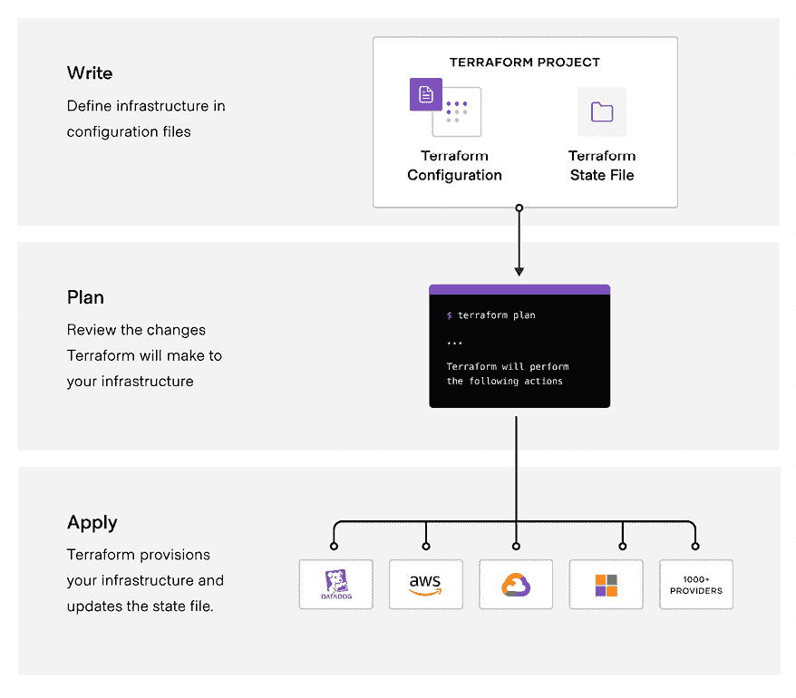
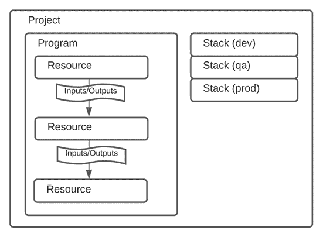

# 8

# 部署与更新应用

在本章中，我们将探讨 Kubernetes 提供的自动化 Pod 可扩展性，了解它如何影响滚动更新，以及如何与配额互动。我们将涉及重要的资源配置话题，讨论如何选择和管理集群的规模。最后，我们将讨论 CI/CD 管道和基础设施配置。以下是我们将要覆盖的主要内容：

+   实时集群更新

+   水平 Pod 自动扩展

+   执行带自动扩展的滚动更新

+   使用配额和限制处理稀缺资源

+   持续集成与部署

+   使用 Terraform、Pulumi、自定义操作符和 Crossplane 配置基础设施

到本章结束时，您将具备规划大规模集群的能力，能够经济地配置集群，并在性能、成本和可用性之间做出明智的取舍决策。您还将了解如何设置水平 Pod 自动扩展，并智能地使用资源配额，让 Kubernetes 自动处理流量波动，同时安全地将软件部署到您的集群中。

# 实时集群更新

运行 Kubernetes 集群时，最复杂和最具风险的任务之一就是实时升级。当系统的不同部分使用不同版本时，它们之间的交互往往很难预测，但在许多情况下这是必需的。对于大型集群和众多用户来说，无法承受因维护而导致的停机时间。应对复杂性的最佳方法是分而治之。微服务架构在这方面非常有帮助。你永远不会升级整个系统，而是不断升级几组相关的微服务。如果 API 发生了变化，那么就需要同时升级它们的客户端。一个合理设计的升级会至少在所有客户端都升级之前保持向后兼容，然后在多个版本发布后弃用旧的 API。

在本节中，我们将讨论如何通过各种策略更新集群，如滚动更新、蓝绿部署和金丝雀部署。我们还将讨论何时适合引入破坏性升级与向后兼容的升级。接着，我们将进入架构和数据迁移这一关键话题。

## 滚动更新

滚动更新是指逐步将组件从当前版本更新到下一个版本。这意味着您的集群将同时运行当前和新版本的组件。这里有两种情况需要考虑：

+   新组件是向后兼容的

+   新组件不是向后兼容的

如果新组件是向后兼容的，那么升级应该非常容易。在 Kubernetes 的早期版本中，您必须非常小心地管理滚动更新，使用标签并逐步更改旧版本和新版本的副本数量（尽管 `kubectl rolling-update` 是复制控制器的便捷快捷方式）。但是，Kubernetes 1.2 中引入的 `Deployment` 资源使这一过程变得更加简单，并且支持副本集。它内置了以下功能：

+   运行在服务器端（即使您的机器断开连接，它也会继续运行）

+   版本控制

+   多个并发的滚动更新

+   更新部署

+   聚合所有 Pod 的状态

+   回滚

+   金丝雀部署

+   多种升级策略（滚动升级是默认的）

这是一个部署清单示例，用于部署三个 Nginx Pod：

```
apiVersion: apps/v1
kind: Deployment
metadata:
  name: nginx-deployment
  labels:
    app: nginx
spec:
  replicas: 3
  selector:
    matchLabels:
      app: nginx
  template:
    metadata:
      labels:
        app: nginx
    spec:
      containers:
      - name: nginx
        image: nginx:1.7.9
        ports:
        - containerPort: 80 
```

资源类型是 `Deployment`，它的名字是 `nginx-deployment`，您可以稍后用它来引用这个部署（例如，用于更新或回滚）。最重要的部分当然是 `spec`，它包含了一个 Pod 模板。副本数决定了集群中将有多少个 Pod，模板规范中包含了每个容器的配置。在此例中，只有一个容器。

要启动滚动更新，请创建部署资源并检查它是否成功推出：

```
$ k create -f nginx-deployment.yaml
deployment.apps/nginx-deployment created
$ k rollout status deployment/nginx-deployment
deployment "nginx-deployment" successfully rolled out
Deployments have an update strategy, which defaults to rollingUpdate:
$ k get deployment nginx-deployment -o yaml | grep strategy -A 4
  strategy:
    rollingUpdate:
      maxSurge: 25%
      maxUnavailable: 25%
    type: RollingUpdate 
```

下图展示了滚动更新的工作原理：



图 8.1：Kubernetes 滚动更新

### 复杂的部署

当你只想升级一个 Pod 时，`Deployment` 资源非常好用，但你可能经常需要升级多个 Pod，而这些 Pod 有时会有版本间的依赖关系。在这种情况下，您有时必须放弃滚动更新或引入一个临时的兼容层。

例如，假设服务 A 依赖于服务 B。服务 B 现在有一个破坏性变更。服务 A 的 v1 Pod 无法与服务 B 的 v2 Pod 互操作。从可靠性和变更管理的角度来看，让服务 B 的 v2 Pod 支持旧的和新的 API 也是不理想的。在这种情况下，解决方案可能是引入一个适配器服务，它实现了服务 B 的 v1 API。这个服务将位于 A 和 B 之间，并在版本之间翻译请求和响应。

这增加了部署过程的复杂性，并需要几个步骤，但好处是 A 和 B 服务本身是简单的。您可以跨不兼容的版本进行滚动更新，并且一旦每个人都升级到 v2（所有 A Pod 和所有 B Pod），所有的间接操作都可以消失。

但是，滚动更新并不总是解决方案。

## 蓝绿部署

滚动更新对可用性非常有利，但有时管理正确的滚动更新可能被认为过于复杂，或者增加了大量工作量，从而推迟了更重要的项目。在这些情况下，蓝绿部署提供了一个很好的替代方案。使用蓝绿发布，您准备一个完整的生产环境副本，其中包含新版本。现在您有两个副本，旧版（蓝色）和新版（绿色）。哪个是蓝色，哪个是绿色并不重要。重要的是您有两个完全独立的生产环境。目前，蓝色是活动状态并处理所有请求。您可以在绿色上运行所有测试。一旦满意，您就可以切换，绿色变为活动状态。如果出现问题，回滚同样简单；只需从绿色切换回蓝色。

下图说明了如何使用两个部署、两个标签和一个单一服务的标签选择器从蓝色部署切换到绿色部署的蓝绿部署的工作方式：



图 8.2：蓝绿部署

我在之前的讨论中完全忽略了存储和内存状态。此即时切换假定蓝色和绿色仅由无状态组件组成，并共享通用持久化层。

如果存储发生变化或外部客户端可访问的 API 发生重大变化，则需要采取额外步骤。例如，如果蓝色和绿色各自拥有自己的存储，则可能需要将所有传入请求发送到蓝色和绿色，并且在切换之前，绿色可能需要从蓝色那里摄取历史数据以保持同步。

## 金丝雀部署

蓝绿部署非常酷。然而，有时需要更加细致的方法。假设您负责一个具有许多用户的大型分布式系统。开发人员计划部署其服务的新版本。他们在测试和暂存环境中测试了服务的新版本。但是，生产环境太复杂，无法一对一复制用于测试目的。这意味着服务在生产环境可能出现异常的风险。这就是金丝雀部署发挥作用的地方。

基本思想是在生产中以有限的容量测试服务。这样，如果新版本出现问题，只会影响到您的一小部分用户或请求。这可以在 Kubernetes 的 Pod 级别非常容易地实现。如果一个服务由 10 个 Pod 支持，并且您将新版本部署到一个 Pod 中，则服务负载均衡器只会将 10% 的请求路由到金丝雀 Pod，而其余 90% 的请求仍由当前版本服务。

下图说明了这种方法：



图 8.3：金丝雀部署

使用服务网格将流量路由到金丝雀部署的方式更为复杂。我们将在*第十四章*，*利用服务网格*中进一步探讨这个问题。

我们已经讨论了执行实时集群更新的不同方法。现在让我们来解决管理数据契约变更的难题。

## 管理数据契约的变更

数据契约描述了数据的组织方式。它是结构化元数据的总称。最常见的例子是关系型数据库的架构。其他例子包括网络有效载荷、文件格式，甚至字符串参数或响应的内容。如果你有一个配置文件，那么这个配置文件既有文件格式（JSON、YAML、TOML、XML、INI 或自定义格式），也有一些描述有效层级、键、值和数据类型的内部结构。有时数据契约是显式的，有时是隐式的。无论是哪种方式，你都需要小心管理它，否则，当读取、解析或验证的代码遇到结构不熟悉的数据时，会导致运行时错误。

## 数据迁移

数据迁移是一项大工程。如今，许多系统管理着以太字节、拍字节甚至更多为单位的惊人数据量。可收集和管理的数据量将在可预见的未来继续增加。数据收集的速度超过了硬件创新的速度。关键点是，如果你有大量数据，并且需要迁移它，这可能需要一段时间。在之前的公司中，我负责一个项目，将近 100TB 的数据从一个遗留系统的 Cassandra 集群迁移到另一个 Cassandra 集群。

第二个 Cassandra 集群有不同的架构，并且由一个 24/7 运行的 Kubernetes 集群进行访问。这个项目非常复杂，因此当出现紧急问题时，它经常被推迟。遗留系统在原定时间表之后很长一段时间仍然与下一代系统并行运行。

有许多机制用于拆分数据并将其发送到两个集群，但随后我们遇到了新系统的可扩展性问题，在继续之前必须解决这些问题。历史数据很重要，但它不需要与最近的热数据以相同的服务级别进行访问。因此，我们开始了另一个项目，将历史数据迁移到更便宜的存储。这意味着，当然，客户端库或前端服务必须知道如何查询这两个存储并合并结果。当你处理大量数据时，不能把任何事情都视为理所当然。你会在工具、基础设施、第三方依赖和流程中遇到可扩展性问题。大规模不仅仅是数量的变化；它通常也是质的变化。不要指望它会顺利进行。它远不只是将一些文件从 A 复制到 B。

## 弃用 API

API 废弃有两种类型：内部和外部。内部 API 是由完全由你和你的团队或组织控制的组件使用的 API。你可以确保所有 API 用户将在短时间内升级到新的 API。外部 API 是由你直接控制范围之外的用户或服务使用的 API。

有一些灰色地带的情况，比如你在一个庞大的组织中工作（比如 Google），甚至内部 API 可能需要像外部 API 一样处理。如果你幸运的话，所有的外部 API 都由自我更新的应用程序或你控制的 Web 界面使用。在这种情况下，API 几乎是隐藏的，你甚至不需要发布它。

如果你的 API 有很多用户（或几个非常重要的用户），你应该非常谨慎地考虑是否废弃 API。废弃 API 意味着你强迫用户改变他们的应用程序以与新 API 兼容，或者继续使用旧版本。

有几种方法可以缓解这些痛点：

+   不要废弃。扩展现有的 API 或保持先前的 API 活跃。虽然这增加了测试负担，但有时是相当简单的。

+   向你的目标用户提供所有相关编程语言的客户端库。这始终是一个好做法。它允许你对底层 API 进行许多更改，而不会打扰用户（只要你保持编程语言接口的稳定）。

+   如果你必须废弃 API，解释原因，给用户足够的时间进行升级，并提供尽可能多的支持（例如，带有示例的升级指南）。你的用户会感激你的。

我们介绍了不同的工作负载部署和升级方式，并讨论了如何管理数据迁移和废弃 API。现在让我们看一下 Kubernetes 的另一个基础功能——水平 Pod 自动扩缩容——它可以让我们的工作负载高效地处理不同数量的请求，并动态调整用于处理这些请求的 Pod 数量。

# 水平 Pod 自动扩缩容

Kubernetes 可以监视你的 Pods，并在 CPU 使用率、内存或其他指标超过阈值时对其进行扩缩容。自动扩缩容资源指定了详细信息（CPU 百分比和检查频率），相应的自动扩缩容控制器会在需要时调整副本数量。

以下图示说明了不同角色及其关系：



图 8.4：水平 Pod 自动扩缩容

如你所见，水平 Pod 自动扩缩容器并不会直接创建或销毁 Pods。它调整的是 `Deployment` 或 `StatefulSet` 资源中的副本数量，相应的控制器负责实际的 Pods 创建和销毁。这非常聪明，因为你无需处理自动扩缩容与控制器正常运行之间的冲突，控制器并未察觉自动扩缩容的操作。

自动扩缩器自动完成了我们之前必须手动执行的操作。如果没有自动扩缩器，假设我们有一个副本数为 3 的部署，但基于平均 CPU 利用率，我们实际需要 4 个副本，那么我们必须手动更新部署将副本数从 3 更新为 4，并继续监控所有 Pod 的 CPU 利用率。然而，自动扩缩器将为我们完成这些工作。

## 创建水平 Pod 自动扩缩器

要声明一个水平 Pod 自动扩缩器，我们需要一个工作负载资源（`Deployment` 或 `StatefulSet`），以及一个 `HorizontalPodAutoscaler` 资源。以下是一个简单的部署配置，旨在保持 3 个 Nginx Pod：

```
apiVersion: apps/v1
kind: Deployment
metadata:
  name: nginx
spec:
  replicas: 3
  selector:
    matchLabels:
      run: nginx
  template:
    metadata:
      labels:
        run: nginx
    spec:
      containers:
      - name: nginx
        image: nginx
        resources:
          requests:
            cpu: 400m
        ports:
        - containerPort: 80 
```

```
$ k apply -f nginx-deployment.yaml
deployment.apps/nginx created 
```

请注意，为了参与自动扩缩，容器必须请求特定数量的 CPU。

水平 Pod 自动扩缩器在 `scaleTargetRef` 中引用 Nginx 部署：

```
apiVersion: autoscaling/v2
kind: HorizontalPodAutoscaler
metadata:
  name: nginx
spec:
  maxReplicas: 4
  minReplicas: 2

  scaleTargetRef:
    apiVersion: apps/v1
    kind: Deployment
    name: nginx
  metrics:
  - type: Resource
    resource:
      name: cpu
      target:
        type: Utilization
        averageUtilization: 90 
```

```
$ k apply -f nginx-hpa.yaml
horizontalpodautoscaler.autoscaling/nginx created 
```

`minReplicas` 和 `maxReplicas` 指定了扩缩容的范围。这样做是为了避免因为某些问题而导致的资源浪费情况。想象一下，如果由于某个 bug，所有 Pod 无论实际负载如何，都立即使用 100% 的 CPU。那么没有 `maxReplicas` 限制的情况下，Kubernetes 会不断创建更多的 Pod，直到所有集群资源被耗尽。如果我们在一个具有虚拟机自动扩展的云环境中运行，可能会导致巨大的成本支出。另一方面，如果没有 `minReplicas` 且活动暂停，那么所有的 Pod 可能会被终止，当新的请求到来时，又需要重新创建并调度 Pod，这可能需要几分钟，尤其是如果需要为新的节点提供资源，并且 Pod 准备时间较长，这些时间会累计。如果有周期性的开关活动，这一过程可能会重复多次。保持最小副本数运行可以平滑这种现象。在上述示例中，`minReplicas` 设置为 2，`maxReplicas` 设置为 4。Kubernetes 将确保始终运行 2 到 4 个 Nginx 实例。

**目标 CPU 利用率百分比**是个较长的术语。我们将其缩写为**TCUP**。你指定一个数字，比如 80%，但是 Kubernetes 在跨越阈值时不会立即开始进行扩缩容。这可能导致不断的震荡，尤其是当平均负载徘徊在 TCUP 附近时。Kubernetes 会在添加副本和移除副本之间频繁切换，这通常不是期望的行为。为了解决这个问题，你可以为扩展或缩减操作指定一个延迟。

`kube-controller-manager` 有两个标志位来支持这一功能：

+   `--horizontal-pod-autoscaler-downscale-delay`：该选项需要一个持续时间值，用于确定在当前缩减操作完成后，自动扩缩容器等待多长时间才开始执行下一个缩减操作。默认持续时间为 5 分钟（5m0s）。

+   `--horizontal-pod-autoscaler-upscale-delay`：此选项需要一个持续时间值，用于确定在当前扩展操作完成后，自动扩展器等待多长时间才能启动另一次扩展操作。默认情况下，持续时间设置为 3 分钟（3m0s）。

让我们检查 HPA：

```
$ k get hpa
NAME    REFERENCE          TARGETS         MINPODS   MAXPODS   REPLICAS   AGE
nginx   Deployment/nginx   <unknown>/90%   2         4         3          70s 
```

如你所见，目标是未知的。HPA（水平 Pod 自动扩展器）需要一个度量服务器来测量 CPU 百分比。安装度量服务器的最简单方法之一是使用 Helm。我们在*第二章*，*创建 Kubernetes 集群*中已经安装了 Helm。以下是将 Kubernetes 度量服务器安装到监控命名空间的命令：

```
$ helm repo add metrics-server https://kubernetes-sigs.github.io/metrics-server/
"metrics-server" has been added to your repositories
$ helm upgrade --install metrics-server metrics-server/metrics-server \
                --namespace monitoring \
                --create-namespace

Release "metrics-server" does not exist. Installing it now.
NAME: metrics-server
LAST DEPLOYED: Sat Jul 30 23:16:09 2022
NAMESPACE: monitoring
STATUS: deployed
REVISION: 1
TEST SUITE: None
NOTES:
***********************************************************************
* Metrics Server                                                      *
***********************************************************************
  Chart version: 3.8.2
  App version:   0.6.1
  Image tag:     k8s.gcr.io/metrics-server/metrics-server:v0.6.1
*********************************************************************** 
```

不幸的是，由于证书问题，`metrics-server`无法在 KinD 集群中直接运行。

你可以通过以下命令轻松修复这个问题：

```
$ k patch -n monitoring deployment metrics-server --type=json \
  -p '[{"op":"add","path":"/spec/template/spec/containers/0/args/-","value":"--kubelet-insecure-tls"}]' 
```

我们可能需要等待度量服务器准备好。一种好的方法是使用`kubectl wait`：

```
kubectl wait deployment metrics-server -n monitoring --for=condition=Available
deployment.apps/metrics-server condition met 
```

既然`kubectl`已经返回，我们也可以利用`kubectl top`命令，它可以显示节点和 Pod 的度量信息：

```
$ k top no
NAME                 CPU(cores)   CPU%   MEMORY(bytes)   MEMORY%
kind-control-plane   213m         5%     15Mi            0%
$ k top po
NAME                     CPU(cores)   MEMORY(bytes)
nginx-64f97b4d86-gqmjj   0m           3Mi
nginx-64f97b4d86-sj8cz   0m           3Mi
nginx-64f97b4d86-xc99j   0m           3Mi 
```

在重新部署 Nginx 和 HPA 后，你可以看到利用率，以及副本数为 3，处于 2-4 的范围内：

```
$ k get hpa
NAME    REFERENCE          TARGETS   MINPODS   MAXPODS   REPLICAS   AGE
nginx   Deployment/nginx   0%/90%    2         4         3          26s 
```

由于 CPU 利用率低于目标利用率，经过几分钟后，HPA 将把 Nginx 扩展到最小的 2 个副本：

```
$ k get hpa
NAME    REFERENCE          TARGETS   MINPODS   MAXPODS   REPLICAS   AGE
nginx   Deployment/nginx   0%/90%    2         4         2          6m57s 
```

## 自定义度量

CPU 利用率是一个重要的度量指标，用来判断如果 Pod 受到过多请求时，是否需要扩展，或者它们大部分时间处于空闲状态，是否可以缩减。但 CPU 并不是唯一的度量，有时甚至不是最好的度量。内存可能是限制因素，甚至可以使用更专业的度量，例如并发线程的数量、Pod 内部磁盘队列的深度、请求的平均延迟或平均服务超时数。

水平 Pod 自定义度量作为 alpha 扩展在 1.2 版本中添加。在 1.6 版本中它们升级为 beta 状态，在 1.23 版本中变为稳定状态。现在，你可以基于多个自定义度量来自动扩展 Pod。

自动扩展器将评估所有度量，并根据所需的最大副本数进行自动扩展，因此所有度量的要求都会被满足。

使用水平 Pod 自动扩展器和自定义度量时，在启动集群时需要进行一些配置。首先，你需要启用 API 聚合层。然后，你需要注册资源度量 API 和自定义度量 API。这并不简单。这就是 Keda 的作用。

### Keda

**Keda**代表**Kubernetes 事件驱动的自动扩展**。这是一个令人印象深刻的项目，它将你实施水平 Pod 自定义度量所需的一切打包在一起。通常，你可能希望扩展 Deployments、StatefulSets 或 Jobs，但 Keda 也可以扩展 CRD，只要它们具有`/scale`子资源。Keda 作为一个操作器进行部署，监控多个自定义资源：

+   `scaledobjects.keda.sh`

+   `scaledjobs.keda.sh`

+   `triggerauthentications.keda.sh`

+   `clustertriggerauthentications.keda.sh`

Keda 还具有一个指标服务器，支持大量事件源和扩展器，并能从所有这些源收集指标来通知扩展过程。事件源包括所有流行的数据库、消息队列、云数据存储和各种监控 API。例如，如果你依赖 Prometheus 获取指标，你可以使用 Keda 根据推送到 Prometheus 的任何指标或指标组合来扩展工作负载。

下图展示了 Keda 的架构：



图 8.5：Keda 架构

查看 [`keda.sh`](https://keda.sh) 获取更多细节。

## 使用 kubectl 进行自动扩展

kubectl 可以使用标准的 `create` 命令创建一个自动扩展资源，接受配置文件。但 kubectl 也有一个特殊命令 `autoscale`，它让你可以在一个命令中轻松设置自动扩展器，而无需特殊的配置文件。

首先，让我们启动一个确保有三个副本的简单 Pod 的部署，并且这个 Pod 只运行一个无限循环的 bash 脚本：

```
apiVersion: apps/v1
kind: Deployment
metadata: 
  name: bash-loop
spec: 
  replicas: 3
  selector:
    matchLabels:
      name: bash-loop
  template: 
    metadata: 
      labels: 
        name: bash-loop
    spec: 
      containers: 
        - name: bash-loop 
          image: g1g1/py-kube:0.3
          resources:
            requests:
              cpu: 100m
          command: ["/bin/bash", "-c", "while true; do sleep 10; done"] 
```

```
$ k apply -f bash-loop-deployment.yaml
deployment.apps/bash-loop created 
```

这是结果中的部署：

```
$ k get deployment
NAME        READY   UP-TO-DATE   AVAILABLE   AGE
bash-loop   3/3     3            3           35s 
```

你可以看到期望数量和当前数量都是 3，意味着正在运行三个 Pod。让我们确认一下：

```
$ k get pods
NAME                         READY   STATUS    RESTARTS   AGE
bash-loop-8496f889f8-9khjs   1/1     Running   0          106s
bash-loop-8496f889f8-frhb7   1/1     Running   0          105s
bash-loop-8496f889f8-hcd2d   1/1     Running   0          105s 
```

现在，让我们创建一个自动扩展器。为了增加趣味性，我们将最小副本数设置为 4，最大副本数设置为 6：

```
$ k autoscale deployment bash-loop --min=4 --max=6 --cpu-percent=50
horizontalpodautoscaler.autoscaling/bash-loop autoscaled 
```

这里是结果中的水平 Pod 自动扩展器（你可以使用 `hpa`）。它显示了引用的部署、目标和当前的 CPU 百分比，以及最小/最大 Pod 数量。名称与引用的部署 `bash-loop` 匹配：

```
$ k get hpa
NAME        REFERENCE              TARGETS   MINPODS   MAXPODS   REPLICAS   AGE
bash-loop   Deployment/bash-loop   2%/50%    4         6         4          36s 
```

最初，部署设置为有三个副本，但自动扩展器的最小副本数为四个。对部署有什么影响？现在期望的副本数是四个。如果平均 CPU 利用率超过 50%，它将增加到五个甚至六个，但永远不会少于四个：

```
$ k get deployment
NAME        READY   UP-TO-DATE   AVAILABLE   AGE
bash-loop   4/4     4            4           4m11s 
```

当我们删除水平 Pod 自动扩展器时，部署会保留最后期望的副本数（在本例中为 4）。没有人记得该部署最初是用三个副本创建的：

```
$ k delete hpa bash-loop
horizontalpodautoscaler.autoscaling "bash-loop" deleted 
```

如你所见，部署并没有重置，仍然保持四个 Pod，即使自动扩展器已经消失：

```
$ k get deployment
NAME        READY   UP-TO-DATE   AVAILABLE   AGE
bash-loop   4/4     4            4           5m17s 
```

这是有道理的，因为水平 Pod 自动扩展器修改了部署的规格，使其拥有 4 个副本：

```
$ k get deploy bash-loop -o jsonpath='{.spec.replicas}'
4 
```

我们试试别的。如果我们创建一个新的水平 Pod 自动扩展器，范围为 2 到 6，且 CPU 目标仍然为 50%，会发生什么？

```
$ k autoscale deployment bash-loop --min=2 --max=6 --cpu-percent=50
horizontalpodautoscaler.autoscaling/bash-loop autoscaled 
```

好吧，部署仍然保持着四个副本，这在范围之内：

```
$ k get deployment
NAME        READY   UP-TO-DATE   AVAILABLE   AGE
bash-loop   4/4     4            4           8m18s 
```

然而，实际的 CPU 利用率仅为 2%。该部署最终会缩减到两个副本，但由于水平 Pod 自动扩展器不会立即缩减，我们需要等待几分钟（默认 5 分钟）：

```
$ k get deployment
NAME        READY   UP-TO-DATE   AVAILABLE   AGE
bash-loop   2/2     2            2           28m 
```

让我们检查一下水平 Pod 自动扩展器本身：

```
$ k get hpa
NAME        REFERENCE              TARGETS   MINPODS   MAXPODS   REPLICAS   AGE
bash-loop   Deployment/bash-loop   2%/50%    2         6         2          21m 
```

现在，你已经理解了水平 Pod 自动扩展的基本概念，让我们来看一下如何使用自动扩展执行滚动更新。

## 执行带有自动扩展的滚动更新

滚动更新是大规模集群中管理工作负载的基石。当你对由 HPA 控制的部署进行滚动更新时，部署将创建一个新的副本集，并开始增加副本数，同时减少旧副本集的副本数。同时，HPA 可能会改变部署的总副本数。这不是问题，所有内容最终会协调一致。

这里是我们在 *第五章*，*实践中使用 Kubernetes 资源*，中用于部署 `hue-reminders` 服务的部署配置文件：

```
apiVersion: apps/v1
kind: Deployment
metadata:
  name: hue-reminders
spec:
  replicas: 2
  selector:
    matchLabels:
      app: hue
      service: reminders
  template:
    metadata:
      name: hue-reminders
      labels:
        app: hue
        service: reminders
    spec:
      containers:
      - name: hue-reminders
        image: g1g1/hue-reminders:2.2
        resources:
          requests:
            cpu: 100m
        ports:
        - containerPort: 80 
```

```
$ k apply -f hue-reminders-deployment.yaml
deployment.apps/hue-reminders created 
```

为了支持自动扩缩并确保我们始终保持 10 到 15 个实例在运行，我们可以创建一个自动扩缩器配置文件：

```
apiVersion: autoscaling/v2
kind: HorizontalPodAutoscaler
metadata:
  name: hue-reminders
spec:
  maxReplicas: 15
  minReplicas: 10
  targetCPUUtilizationPercentage: 90
  scaleTargetRef:
    apiVersion: apps/v1
    kind: Deployment
    name: hue-reminders 
```

或者，我们可以使用 `kubectl autoscale` 命令：

```
$ k autoscale deployment hue-reminders --min=10 --max=15 --cpu-percent=90
horizontalpodautoscaler.autoscaling/hue-reminders autoscaled 
```

让我们执行从版本 2.2 到 3.0 的滚动更新：

```
$ k set image deployment/hue-reminders hue-reminders=g1g1/hue-reminders:3.0 
```

我们可以使用 `rollout status` 来检查状态：

```
$ k rollout status deployment hue-reminders
Waiting for deployment "hue-reminders" rollout to finish: 9 out of 10 new replicas have been updated...
Waiting for deployment "hue-reminders" rollout to finish: 9 out of 10 new replicas have been updated...
Waiting for deployment "hue-reminders" rollout to finish: 9 out of 10 new replicas have been updated...
Waiting for deployment "hue-reminders" rollout to finish: 9 out of 10 new replicas have been updated...
Waiting for deployment "hue-reminders" rollout to finish: 3 old replicas are pending termination...
Waiting for deployment "hue-reminders" rollout to finish: 3 old replicas are pending termination...
Waiting for deployment "hue-reminders" rollout to finish: 2 old replicas are pending termination...
Waiting for deployment "hue-reminders" rollout to finish: 2 old replicas are pending termination...
Waiting for deployment "hue-reminders" rollout to finish: 1 old replicas are pending termination...
Waiting for deployment "hue-reminders" rollout to finish: 1 old replicas are pending termination...
Waiting for deployment "hue-reminders" rollout to finish: 1 old replicas are pending termination...
Waiting for deployment "hue-reminders" rollout to finish: 8 of 10 updated replicas are available...
Waiting for deployment "hue-reminders" rollout to finish: 9 of 10 updated replicas are available...
deployment "hue-reminders" successfully rolled out 
```

最后，我们回顾部署的历史：

```
$ k rollout history deployment hue-reminders
deployment.apps/hue-reminders
REVISION  CHANGE-CAUSE
3         kubectl1.23.4 set image deployment/hue-reminders hue-reminders=g1g1/hue-reminders:3.0 --record=true
4         kubectl1.23.4 set image deployment/hue-reminders hue-reminders=g1g1/hue-reminders:3.0 --record=true 
```

自动扩缩是基于资源使用情况和阈值来工作的。在接下来的部分中，我们将探讨 Kubernetes 如何让我们使用请求和限制来控制和管理每个工作负载的资源。

# 通过限制和配额处理稀缺资源

由于水平 Pod 自动扩缩器会动态创建 Pods，我们需要考虑如何管理资源。调度容易失控，资源使用不当是一个真实的担忧。影响因素有很多，这些因素可能会相互作用，产生微妙的影响：

+   整体集群容量

+   每个节点的资源粒度

+   每个命名空间的工作负载划分

+   守护进程集

+   有状态集

+   亲和性、反亲和性、污点和容忍

首先，让我们理解核心问题。Kubernetes 调度器在调度 Pods 时必须考虑所有这些因素。如果存在冲突或大量重叠的需求，那么 Kubernetes 可能会遇到无法找到空间调度新 Pods 的问题。例如，一个极端而简单的场景是，一个守护进程集在每个节点上运行一个需要 50% 可用内存的 Pod。现在，Kubernetes 就无法调度任何其他需要超过 50% 内存的 Pod，因为守护进程集的 Pod 拥有优先权。即使你新增了节点，守护进程集也会立即占用一半的内存。

有状态集与守护进程集类似，都需要新的节点来扩展。向有状态集添加新成员的触发因素是数据的增长，但其影响是占用了 Kubernetes 用于调度其他工作负载的资源池。在多租户环境下，噪音邻居问题可能会出现在配置或资源分配的过程中。你可能会在命名空间内精心规划不同 Pods 及其资源需求的准确比例，但你与来自其他命名空间的邻居共享实际节点，而这些邻居你可能完全无法察觉。

大多数这些问题可以通过谨慎使用命名空间资源配额和对跨多种资源类型（如 CPU、内存和存储）的集群容量进行仔细管理来缓解。此外，如果您控制节点供应，可以通过对它们进行污点处理来为您的工作负载划分专用节点。

但在大多数情况下，更强大和动态的方法是利用集群自动扩展器，在需要时增加集群的容量（直到配额用尽）。

## 启用资源配额

大多数 Kubernetes 发行版都原生支持 `ResourceQuota`。API 服务器的 `--admission-control` 标志必须将 `ResourceQuota` 作为其参数之一。您还必须创建一个 `ResourceQuota` 对象来执行它。请注意，每个命名空间最多只能有一个 `ResourceQuota` 对象，以防止潜在的冲突。这是 Kubernetes 强制执行的。

## 资源配额类型

我们可以管理和控制不同类型的配额。类别包括计算、存储和对象。

### 计算资源配额

计算资源包括 CPU 和内存。对于每一个，您可以指定一个限制或请求一定数量。以下是与计算相关的字段列表。请注意，`requests.cpu` 可以简单地指定为 `cpu`，`requests.memory` 可以简单地指定为 `memory`：

+   `limits.cpu`：考虑到所有非终端状态的 Pod，总 CPU 限制不得超过此值。

+   `limits.memory`：考虑到所有非终端状态的 Pod，组合内存限制不得超过此值。

+   `requests.cpu`：考虑到所有非终端状态的 Pod，总 CPU 请求不应超过此值。

+   `requests.memory`：考虑到所有非终端状态的 Pod，组合内存请求不应超过此值。

+   `hugepages-`：考虑到所有非终端状态的 Pod，特定大小的巨页请求的最大允许数量不得超过此值。

自 Kubernetes 1.10 开始，您还可以为诸如 GPU 资源之类的扩展资源指定配额。以下是一个例子：

```
requests.nvidia.com/gpu: 10 
```

### 存储资源配额

存储资源配额类型稍微复杂一些。您可以限制每个命名空间的两个实体：存储量和持久卷索赔的数量。但是，除了全局设置总存储或持久卷索赔总数的配额之外，您还可以按存储类进行设置。存储类资源配额的表示法有点冗长，但它完成了工作：

+   `requests.storage`：所有持久卷索赔中请求的存储总量。

+   `persistentvolumeclaims`：命名空间中允许的持久卷索赔的最大数量

+   `.storageclass.storage.k8s.io/requests.storage`：与 `storage-class-name` 关联的所有持久卷索赔的请求存储总量。

+   `.storageclass.storage.k8s.io/persistentvolumeclaims`：命名空间中与 `storage-class-name` 相关联的最大持久卷声明数量

Kubernetes 1.8 还增加了对临时存储配额的 alpha 支持：

+   `requests.ephemeral-storage`：命名空间中所有 Pod 请求的临时存储总量

+   `limits.ephemeral-storage`：命名空间中所有 Pod 的临时存储限制总量

存储配置的一个问题是磁盘容量并不是唯一的因素，磁盘 I/O 也是一个重要资源。例如，考虑一个不断更新同一个小文件的 Pod。它不会使用大量的容量，但会执行很多 I/O 操作。

### 对象计数配额

Kubernetes 还有另一类资源配额，那就是 API 对象。我的猜测是，目标是保护 Kubernetes API 服务器，避免它管理过多的对象。记住，Kubernetes 在后台做了大量工作。它经常需要查询多个对象来进行身份验证、授权，并确保操作不会违反可能存在的任何政策。一个简单的例子是基于复制控制器的 Pod 调度。假设你有一百万个副本集对象，也许你只有三个 Pod，而大多数副本集的副本数为零。尽管如此，Kubernetes 会花费大量时间验证这些副本集确实没有副本，并且不需要终止任何 Pod。虽然这是一个极端的例子，但这一概念适用。过多的 API 对象意味着 Kubernetes 需要花费大量工作来管理。

此外，客户端使用发现缓存（如 kubectl 本身）也是一个问题。请参见此问题：[`github.com/kubernetes/kubectl/issues/1126`](https://github.com/kubernetes/kubectl/issues/1126)。

从 Kubernetes 1.9 起，你可以限制任何命名空间资源的数量（在此之前，可限制的对象范围有些不稳定）。语法很有意思，`count/<resource type>.<group>`。通常在 YAML 文件和 kubectl 中，你首先按组标识对象，如 `<group>/<resource type>`。

下面是一些你可能想要限制的对象（请注意，部署可以针对两个独立的 API 组进行限制）：

+   `count/configmaps`

+   `count/deployments.apps`

+   `count/deployments.extensions`

+   `count/persistentvolumeclaims`

+   `count/replicasets.apps`

+   `count/replicationcontrollers`

+   `count/secrets`

+   `count/services`

+   `count/statefulsets.apps`

+   `count/jobs.batch`

+   `count/cronjobs.batch`

从 Kubernetes 1.5 起，你还可以限制自定义资源的数量。请注意，虽然自定义资源定义是集群范围的，但这允许你限制每个命名空间中实际的自定义资源数量。例如：

```
count/awesome.custom.resource 
```

最显著的遗漏是命名空间。没有限制命名空间的数量。由于所有限制都是按命名空间计算的，你可以通过创建过多命名空间轻松压垮 Kubernetes，每个命名空间只有少量 API 对象。但是，创建命名空间的能力应该仅保留给集群管理员，他们不需要资源配额来约束自己。

## 配额范围

一些资源（如 Pods）可能处于不同的状态，因此为这些不同的状态设置不同的配额是很有用的。例如，如果有许多 Pods 正在终止（这在滚动更新期间经常发生），那么即使总数超过配额，创建更多 Pods 也是可以的。这可以通过仅对非终止 Pods 应用 Pod 对象计数配额来实现。以下是现有的范围：

+   `Terminating`：选择 `activeDeadlineSeconds` 值大于或等于 `0` 的 Pods。

+   `NotTerminating`：选择未指定 `activeDeadlineSeconds`（即为空值）的 Pods。

+   `BestEffort`：选择具有最佳努力服务质量的 Pods，意味着这些 Pods 未指定资源请求和限制。

+   `NotBestEffort`：选择不具有最佳努力服务质量的 Pods，表示这些 Pods 已指定资源请求和限制。

+   `PriorityClass`：选择定义优先级类的 Pods。

+   `CrossNamespacePodAffinity`：选择具有跨命名空间亲和性或反亲和性调度条件的 Pods。

虽然 `BestEffort` 范围仅适用于 Pods，但 `Terminating`、`NotTerminating` 和 `NotBestEffort` 范围也适用于 CPU 和内存。这很有趣，因为资源配额限制可能会阻止 Pod 终止。以下是支持的对象：

+   CPU

+   内存

+   `limits.cpu`

+   `limits.memory`

+   `requests.cpu`

+   `requests.memory`

+   Pods

## 资源配额和优先级类

Kubernetes 1.9 引入了优先级类，作为在资源紧张时优先调度 Pods 的一种方式。在 Kubernetes 1.14 中，优先级类变得稳定。然而，从 Kubernetes 1.12 开始，资源配额支持按优先级类设置单独的资源配额（处于 Beta 阶段）。这意味着通过优先级类，你可以在命名空间内非常精细地调整资源配额。

欲了解更多详情，请查看 [`kubernetes.io/docs/concepts/policy/resource-quotas/#resource-quota-per-priorityclass`](https://kubernetes.io/docs/concepts/policy/resource-quotas/#resource-quota-per-priorityclass)。

## 请求和限制

在资源配额的背景下，请求和限制的含义是要求容器明确指定目标属性。这样，Kubernetes 就可以管理总配额，因为它知道每个容器分配了哪些资源范围。

## 配额管理

这部分是理论内容。现在是时候动手操作了。我们首先创建一个命名空间：

```
$ k create namespace ns
namespace/ns created 
```

### 使用命名空间特定的上下文

当使用非默认命名空间时，我更喜欢设置当前上下文的命名空间，这样我就不必在每个命令中都输入 `--namespace=ns`：

```
$ k config set-context --current --namespace ns
Context "kind-kind" modified. 
```

### 创建配额

这是计算配额：

```
apiVersion: v1 
kind: ResourceQuota 
metadata: 
  name: compute-quota 
spec: 
  hard: 
    pods: 2 
    requests.cpu: 1 
    requests.memory: 200Mi 
    limits.cpu: 2 
    limits.memory: 2Gi 
```

我们通过输入以下命令来创建它：

```
$ k apply -f compute-quota.yaml
resourcequota/compute-quota created 
```

这里是计数配额：

```
apiVersion: v1 
kind: ResourceQuota 
metadata: 
  name: object-counts-quota 
spec: 
  hard: 
    count/configmaps: 10
    count/persistentvolumeclaims: 4
    count/jobs.batch: 20
    count/secrets: 3 
```

我们通过输入以下命令来创建它：

```
$ k apply -f object-count-quota.yaml
resourcequota/object-counts-quota created 
```

我们可以观察所有的配额：

```
$ k get quota
NAME                  AGE   REQUEST                                                                                                 LIMIT
compute-quota         32s   pods: 0/2, requests.cpu: 0/1, requests.memory: 0/200Mi                                                   limits.cpu: 0/2, limits.memory: 0/2Gi
object-counts-quota   13s   count/configmaps: 1/10, count/jobs.batch: 0/20, count/persistentvolumeclaims: 0/4, count/secrets: 1/3 
```

我们可以通过 `kubectl describe` 以更具可视化效果的方式深入查看这两个资源配额的所有信息：

```
$ k describe quota compute-quota
Name:            compute-quota
Namespace:       ns
Resource         Used  Hard
--------         ----  ----
limits.cpu       0     2
limits.memory    0     2Gi
pods             0     2
requests.cpu     0     1
requests.memory  0     200Mi
$ k describe quota object-counts-quota
Name:                         object-counts-quota
Namespace:                    ns
Resource                      Used  Hard
--------                      ----  ----
count/configmaps              1     10
count/jobs.batch              0     20
count/persistentvolumeclaims  0     4
count/secrets                 1     3 
```

如你所见，它完全反映了规格，并且它是在 `ns` 命名空间中定义的。

这个视图可以让我们迅速了解集群中重要资源的全局资源使用情况，而无需深入到太多单独的对象中。

让我们在命名空间中添加一个 Nginx 服务器：

```
$ k create -f nginx-deployment.yaml
deployment.apps/nginx created 
```

让我们检查一下 Pods：

```
$ k get po
No resources found in ns namespace. 
```

哎呀。没有找到资源。但是，在创建部署时没有报错。让我们检查一下部署：

```
$ k describe deployment nginx
Name:                   nginx
Namespace:              ns
CreationTimestamp:      Sun, 31 Jul 2022 13:49:24 -0700
Labels:                 <none>
Annotations:            deployment.kubernetes.io/revision: 1                                                                                                                             kind-kind | ns
Selector:               run=nginx
Replicas:               3 desired | 0 updated | 0 total | 0 available | 3 unavailable
StrategyType:           RollingUpdate
MinReadySeconds:        0
RollingUpdateStrategy:  25% max unavailable, 25% max surge
Pod Template:
  Labels:  run=nginx
  Containers:
   nginx:
    Image:      nginx
    Port:       80/TCP
    Host Port:  0/TCP
    Requests:
      cpu:        400m
    Environment:  <none>
    Mounts:       <none>
  Volumes:        <none>
Conditions:
  Type             Status  Reason
  ----             ------  ------
  Progressing      True    NewReplicaSetCreated
  Available        False   MinimumReplicasUnavailable
  ReplicaFailure   True    FailedCreate
OldReplicaSets:    <none>
NewReplicaSet:     nginx-64f97b4d86 (0/3 replicas created)
Events:
  Type    Reason             Age   From                   Message
  ----    ------             ----  ----                   -------
  Normal  ScalingReplicaSet  65s   deployment-controller  Scaled up replica set nginx-64f97b4d86 to 3 
```

在 `Conditions` 部分可以看到，`ReplicaFailure` 状态为 `True`，原因是 `FailedCreate`。你可以看到部署创建了一个新的副本集，名为 `nginx-64f97b4d86`，但它无法创建预期的 Pod。我们仍然不知道为什么。

让我们查看副本集。我使用 JSON 输出格式（`-o json`），并将其通过管道传递给 `jq`，以便获得更好的布局，这比 `kubectl` 本地支持的 `jsonpath` 输出格式要好得多：

```
$ k get rs nginx-64f97b4d86 -o json | jq .status.conditions
[
  {
    "lastTransitionTime": "2022-07-31T20:49:24Z",
    "message": "pods \"nginx-64f97b4d86-ks7d6\" is forbidden: failed quota: compute-quota: must specify limits.cpu,limits.memory,requests.memory",
    "reason": "FailedCreate",
    "status": "True",
    "type": "ReplicaFailure"
  }
] 
```

信息非常明确。由于命名空间中有计算配额，每个容器都必须指定其 CPU、内存请求和限制。配额控制器必须考虑每个容器的计算资源使用情况，以确保总的命名空间配额得到遵守。

好的，我们理解了问题，但如何解决呢？我们可以为每种我们想使用的 Pod 类型创建一个专门的部署对象，并小心地设置 CPU 和内存请求和限制。

例如，我们可以定义带有资源的 Nginx 部署。由于资源配额指定了一个硬性限制为 2 个 Pods，让我们将副本数量从 3 个减少到 2 个：

```
apiVersion: apps/v1
kind: Deployment
metadata:
  name: nginx
spec:
  replicas: 2
  selector:
    matchLabels:
      run: nginx
  template:
    metadata:
      labels:
        run: nginx
    spec:
      containers:
      - name: nginx
        image: nginx
        resources:
          requests:
            cpu: 400m
            memory: 60Mi
          limits:
            cpu: 400m
            memory: 60Mi
        ports:
        - containerPort: 80 
```

让我们创建它并检查 Pods：

```
$ k apply -f nginx-deployment-with-resources.yaml
deployment.apps/nginx created
$ k get po
NAME                     READY   STATUS    RESTARTS   AGE
nginx-5d68f45c5f-6h9w9   1/1     Running   0          21s
nginx-5d68f45c5f-b8htm   1/1     Running   0          21s 
```

是的，成功了！但是，为每个 Pod 类型指定限制和资源可能非常繁琐。有没有更简单或更好的方法？

### 使用限制范围设置默认计算配额

更好的方法是指定默认计算限制。输入限制范围。这是一个设置容器默认值的配置文件：

```
apiVersion: v1 
kind: LimitRange 
metadata:
  name: limits 
spec:
  limits: 
  - default: 
      cpu: 400m 
      memory: 50Mi 
    defaultRequest: 
      cpu: 400m
      memory: 50Mi
    type: Container 
```

让我们创建它并观察默认的限制：

```
$ k apply -f limits.yaml
limitrange/limits created
$ k describe limits
Name:       limits
Namespace:  ns
Type        Resource  Min  Max  Default Request  Default Limit  Max Limit/Request Ratio
----        --------  ---  ---  ---------------  -------------  -----------------------
Container   cpu       -    -    400m             400m           -
Container   memory    -    -    50Mi             50Mi           - 
```

为了测试它，让我们删除当前的 Nginx 部署并重新部署原始的 Nginx，保持显式的限制：

```
$ k delete deployment nginx
deployment.apps "nginx" deleted
$ k apply -f nginx-deployment.yaml
deployment.apps/nginx created
$ k get deployment
NAME    READY   UP-TO-DATE   AVAILABLE   AGE
nginx   2/3     2            2           16s 
```

如您所见，只有 3 个 Pod 中的 2 个处于就绪状态。发生了什么？默认的限制起作用了，但如果您记得的话，计算配额对于命名空间有 2 个 Pod 的硬性限制。无法通过 `RangeLimit` 对象覆盖它，因此部署只能够创建两个 Nginx Pod。这正是基于当前配置所期望的结果。如果部署确实需要 3 个 Pod，那么应该更新命名空间的计算配额以允许 3 个 Pod。

这部分内容结束了我们关于使用请求、限制和配额进行资源管理的讨论。下一节将探讨如何在 Kubernetes 上自动化大规模部署和配置多个工作负载。

# 持续集成和持续部署

Kubernetes 是运行基于微服务的应用程序的绝佳平台。但归根结底，它只是一个实现细节。用户，通常包括大多数开发人员，可能并不知道系统是部署在 Kubernetes 上的。但 Kubernetes 可以改变游戏规则，使之前过于复杂的事情变得可能。

在本节中，我们将探讨 CI/CD 流水线以及 Kubernetes 带来的优势。在本节结束时，您将能够设计利用 Kubernetes 特性（如轻松扩展和开发与生产一致性）来提高日常开发和部署的生产力和健壮性的 CI/CD 流水线。

## 什么是 CI/CD 流水线？

CI/CD 流水线是一组工具和步骤，旨在处理由开发人员或运维人员提交的一组变更，这些变更可能涉及系统的代码、数据或配置，并对其进行测试，然后将其部署到生产环境（以及其他可能的环境）。一些流水线是完全自动化的，另一些则是半自动化的，需要人工检查。在大型组织中，通常会将变更自动部署到测试和预发布环境中，而生产环境的发布则需要人工干预和批准。以下图示展示了一个典型的遵循这种实践的 CI/CD 流水线：



图 8.6：CI/CD 流水线

可能值得一提的是，开发人员可以完全与生产基础设施隔离。他们的界面只是一个 Git 工作流，其中一个很好的例子是 Deis Workflow（Kubernetes 上的 PaaS，类似于 Heroku）。

## 为 Kubernetes 设计 CI/CD 流水线

当您的部署目标是 Kubernetes 集群时，您应该重新考虑一些传统的做法。首先，打包方式不同。您需要为容器创建镜像。通过使用智能标签，回滚代码变更变得非常简单和即时。这让您非常有信心，如果某个错误的变更 somehow 穿过了测试网，您能够立即回滚到先前的版本。但在这方面您需要小心。模式变更和数据迁移无法在没有协调的情况下自动回滚。

Kubernetes 的另一个独特能力是开发人员可以在本地运行整个集群。 当你设计你的集群时需要一些工作，但由于组成系统的微服务运行在容器中，并且这些容器通过 API 进行交互，这是可能且实际可行的。 像往常一样，如果你的系统非常依赖数据驱动，你将需要适应这一点，并提供数据快照和开发人员可以使用的合成数据。 另外，如果你的服务访问外部系统或云提供商服务，那么完全本地集群可能不是理想的选择。

你的 CI/CD 流水线应该允许集群管理员快速调整配额和限制，以适应扩展和业务增长。 此外，你应该能够轻松地将大多数工作负载部署到不同的环境中。 例如，如果你的预发布环境与生产环境不同，这会减少在预发布环境中运行良好的更改对生产环境造成损害的信心。 通过确保所有环境更改都通过 CI/CD，可以保持不同环境的同步。

有许多商业的 CI/CD 解决方案支持 Kubernetes，但也有几个 Kubernetes 本地解决方案，例如 Tekton、Argo CD、Flux CD 和 Jenkins X。

Kubernetes 本地的 CI/CD 解决方案在你的集群内运行，使用 Kubernetes CRD 指定，并使用容器执行步骤。 通过使用 Kubernetes 本地的 CI/CD 解决方案，你可以享受 Kubernetes 管理和轻松扩展 CI/CD 流水线的好处，这通常是一个非常重要的任务。

# 为你的应用程序提供基础设施

CI/CD 流水线用于在 Kubernetes 上部署工作负载。 但是，这些服务通常要求你对基础设施（如云资源，数据库，甚至 Kubernetes 集群本身）进行操作。 有不同的方法来提供这些基础设施。 让我们审查一些常见的解决方案。

## 云提供商的 API 和工具

如果你完全致力于单一云提供商，并且没有使用多个云提供商或将基于云的集群与本地集群混合的意图，你可能更喜欢使用你的云提供商的 API 工具（例如 AWS CloudFormation）。 这种方法有几个好处：

+   与你的云提供商基础设施的深度集成

+   从你的云提供商获得最佳支持

+   没有间接层

然而，这意味着你对系统的视图将被分割。 一些信息将通过 Kubernetes 可用并存储在 etcd 中。 其他信息将存储并可通过你的云提供商访问。

缺乏 Kubernetes 本地基础设施视图意味着在本地运行集群可能具有挑战性，并且整合其他云提供商或本地环境将肯定需要大量工作。

## Terraform

Terraform ([`terraform.io`](https://terraform.io)) 由 HashiCorp 开发，是一个**基础设施即代码**（**IaC**）工具。它是现有的领导者。你可以使用 Terraform 的 HCL 语言定义基础设施，并可以通过模块组织基础设施配置。最初它专注于 AWS，但随着时间的推移，它成为了一个通用工具，能够在任何云平台上以及通过提供者插件为其他类型的基础设施进行配置。

查看 Terraform 注册表中所有可用的提供者：[`registry.terraform.io/browse/providers`](https://registry.terraform.io/browse/providers)。

由于 Terraform 是声明式地定义基础设施的，因此它自然支持 GitOps 生命周期，在这个生命周期中，基础设施的变更必须提交到代码控制中，并且可以进行审查，历史记录也会被保存。

你通常通过其 CLI 与 Terraform 进行交互。你可以运行 `terraform plan` 命令查看 Terraform 将进行哪些变更，如果你对结果满意，就可以通过 `terraform apply` 命令应用这些变更。

下图展示了 Terraform 的工作流：



图 8.7：Terraform 工作流

我已经广泛使用 Terraform 在 AWS、GCP 和 Azure 上为大规模系统配置基础设施。它确实能完成工作，但它也存在一些问题：

+   它的托管状态可能与现实世界的基础设施不同步

+   它的设计和语言使得在大规模环境中使用时变得困难

+   它无法自动检测并解决基础设施的外部变更

## Pulumi

Pulumi 是一个更现代的 IaC 工具。从概念上讲，它与 Terraform 类似，但你可以使用多种编程语言来定义基础设施，而不是使用自定义的 DSL。这为你提供了一个完整的语言生态系统，如 TypeScript、Python 或 Go，包括测试和打包功能来管理你的基础设施。

Pulumi 还自豪地拥有动态提供者，这些提供者会在同一天更新，以支持云提供商资源。它还可以包装 Terraform 提供者，从而实现对你基础设施需求的完全覆盖。

Pulumi 的编程模型基于堆栈、资源和输入/输出的概念：



图 8.8：Pulumi 编程模型

这里是一个使用 Pulumi 在 Python 中配置 EC2 实例的简单示例：

```
import pulumi
import pulumi_aws as aws
group = aws.ec2.SecurityGroup('web-sg',
    description='Enable HTTP access',
    ingress=[
        { 'protocol': 'tcp', 'from_port': 80, 'to_port': 80, 'cidr_blocks': ['0.0.0.0/0'] }
    ])
server = aws.ec2.Instance('web-server',
    ami='ami-6869aa05',
    instance_type='t2.micro',
    vpc_security_group_ids=[group.name] # reference the security group resource above
)
pulumi.export('public_ip', server.public_ip)
pulumi.export('public_dns', server.public_dns) 
```

## 自定义操作符

Terraform 和 Pulumi 都支持 Kubernetes 并可以配置集群，但它们不是云原生的。它们也不支持动态一致性，这与 Kubernetes 模型的理念相悖。这意味着，如果有人删除或修改了由 Terraform 或 Pulumi 配置的某些基础设施，直到下次运行 Terraform/Pulumi 时才会被检测到。

编写自定义 Kubernetes 操作员让你拥有完全控制权。你可以暴露目标基础设施的配置表面，并且可以强制执行规则和默认配置。例如，在我当前的公司，我们曾经通过 Terraform 管理大量的 Cloudflare DNS 域。这导致了显著的性能问题，因为 Terraform 尝试通过向 Cloudflare 发出 API 请求来刷新所有这些域，任何基础设施的变化（即使与 Cloudflare 无关）。我们决定编写一个自定义 Kubernetes 操作员来管理这些域。该操作员定义了几个 CRD 来表示区域、域和记录，并通过 Cloudflare 的 API 进行交互。

除了完全控制和性能优势外，操作员还会自动协调任何外部变化，避免不小心的手动修改。

## 使用 Crossplane

自定义操作员非常强大，但编写和维护操作员需要大量的工作。Crossplane ([`crossplane.io`](https://crossplane.io)) 将自己定位为你的基础设施控制平面。实际上，这意味着你通过 CRD 配置所有内容（提供程序、证书、资源和组合资源）。像数据库连接信息这样的基础设施凭证会写入 Kubernetes 秘密，这些凭证稍后可以被工作负载使用。Crossplane 操作员监视所有定义基础设施的自定义资源，并与基础设施提供商进行协调。

这里是定义 AWS RDS PostgresSQL 实例的一个示例：

```
apiVersion: database.example.org/v1alpha1
kind: PostgreSQLInstance
metadata:
  name: the-db
  namespace: data
spec:
  parameters:
    storageGB: 20
  compositionSelector:
    matchLabels:
      provider: aws
      vpc: default
  writeConnectionSecretToRef:
    name: db-conn 
```

Crossplane 通过其自己的 CLI 扩展 kubectl，提供支持构建、推送和安装包的功能。

在本节中，我们介绍了 CI/CD 管道背后的概念以及在 Kubernetes 上配置基础设施的不同方法。

# 总结

在本章中，我们讨论了与部署和更新应用程序、扩展 Kubernetes 集群、管理资源、CI/CD 管道和配置基础设施相关的多个主题。我们讨论了实时集群更新、不同的部署模型、水平 Pod 自动扩展如何自动管理运行的 Pod 数量、如何在自动扩展的背景下正确且安全地执行滚动更新，以及如何通过资源配额处理稀缺资源。接着，我们讨论了 CI/CD 管道以及如何使用 Terraform、Pulumi、自定义操作员和 Crossplane 等工具在 Kubernetes 上配置基础设施。

到此为止，你已经很好地理解了 Kubernetes 集群在面对动态和增长的工作负载时的各种影响因素。你有多个工具可以选择，用于规划和设计自己的发布和扩展策略。

在下一章中，我们将学习如何将应用程序打包以便部署到 Kubernetes 上。我们将讨论 Helm、Kustomize 以及其他解决方案。

# 加入我们的 Discord！

与其他用户、云专家、作者以及志同道合的专业人士一起阅读本书。

提问、为其他读者提供解决方案、通过“问我任何问题”环节与作者交流，以及更多。

扫描二维码或访问链接立即加入社区。

[`packt.link/cloudanddevops`](https://packt.link/cloudanddevops)


