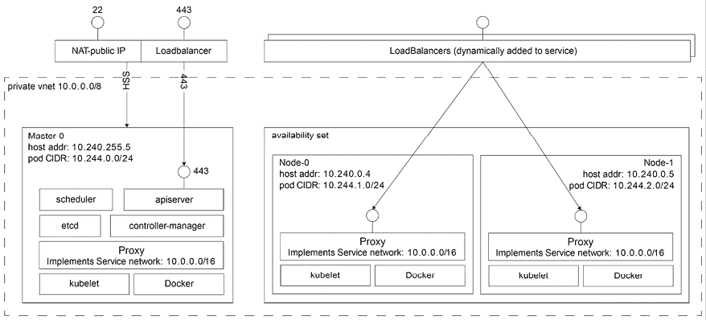
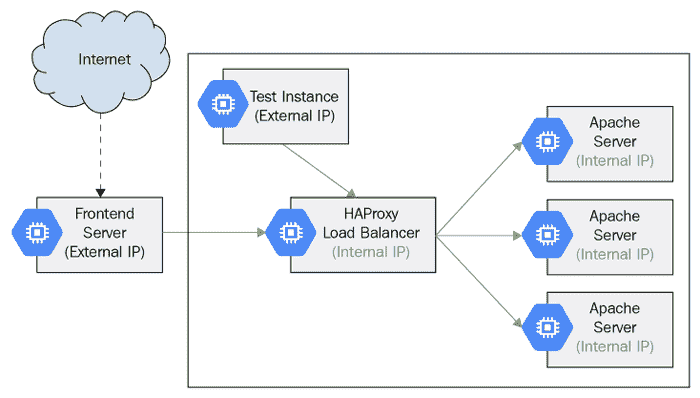

# 第十章：探索 Kubernetes 网络

在本章中，我们将探讨网络的重要话题。Kubernetes 作为一个编排平台，管理运行在不同机器（物理机或虚拟机）上的容器/pod，并要求一个明确的网络模型。我们将讨论以下主题：

+   理解 Kubernetes 网络模型

+   Kubernetes 网络插件

+   Kubernetes 与 eBPF

+   Kubernetes 网络解决方案

+   有效使用网络策略

+   负载均衡选项

到本章结束时，您将理解 Kubernetes 对网络的处理方法，并熟悉诸如标准接口、网络实现和负载均衡等方面的解决方案。您甚至可以在愿意的情况下编写您自己的 **容器网络接口** (**CNI**) 插件。

# 理解 Kubernetes 网络模型

Kubernetes 网络模型基于一个扁平的地址空间。集群中的所有 pod 可以直接互相访问。每个 pod 都有自己的 IP 地址，且无需配置任何 **网络地址转换** (**NAT**) 。此外，同一个 pod 中的容器共享 pod 的 IP 地址，并可以通过 `localhost` 互相通信。这个模型非常具有指导性，但一旦设置好，它能大大简化开发者和管理员的工作。它特别有助于将传统网络应用迁移到 Kubernetes。一个 pod 代表传统的节点，每个容器代表传统的进程。

我们将覆盖以下内容：

+   容器内通信

+   Pod 到服务的通信

+   外部访问

+   查找与发现

+   Kubernetes 中的 DNS

## 容器内通信（容器到容器）

一个运行中的 pod 总是调度在一个（物理或虚拟）节点上。这意味着所有容器都运行在同一个节点上，并可以通过多种方式互相通信，比如通过本地文件系统、任何 IPC 机制，或使用 `localhost` 和常见端口。不同 pod 之间不存在端口冲突的风险，因为每个 pod 都有自己的 IP 地址，而当 pod 中的容器使用 `localhost` 时，仅适用于 pod 的 IP 地址。因此，如果 pod 1 中的容器 1 连接到端口 `1234`，而容器 2 在 pod 1 上监听该端口，它不会与运行在同一节点上并在端口 `1234` 上监听的 pod 2 中的另一个容器冲突。唯一的警告是，如果您将端口暴露给主机，则应注意 pod 到节点的亲和性。这可以通过多种机制来处理，例如 Daemonsets 和 pod 反亲和性。

## 容器间通信（pod 到 pod）

Kubernetes 中的 Pods 被分配了一个网络可见的 IP 地址（与节点私有地址不同）。Pods 可以直接进行通信，无需 NAT、隧道、代理或任何其他遮蔽层的帮助。可以使用知名端口号实现无需配置的通信方案。Pod 的内部 IP 地址与其外部 IP 地址相同，外部 IP 地址是其他 Pods 看到的地址（仅限集群网络内；不向外界暴露）。这意味着像**域名系统**（**DNS**）这样的标准命名和发现机制可以开箱即用。

## Pod 与服务的通信

Pods 可以通过其 IP 地址和知名端口直接相互通信，但这要求 Pods 知道彼此的 IP 地址。在 Kubernetes 集群中，Pods 可能会不断被销毁和创建，也可能会有多个副本，每个副本都有自己的 IP 地址。Kubernetes 服务资源提供了一层间接性，非常有用，因为即使响应请求的实际 Pods 集合发生变化，服务仍然是稳定的。此外，由于每个节点上的 kube-proxy 负责将流量重定向到正确的 Pod，因此你还可以获得自动的、高可用的负载均衡：


图 10.1：使用服务进行的内部负载均衡外部访问

最终，某些容器需要可以从外部访问。Pod 的 IP 地址对外部不可见。服务是合适的载体，但外部访问通常需要两次重定向。例如，云提供商的负载均衡器并不理解 Kubernetes，因此它们不能直接将流量导向运行可以处理请求的 Pod 的节点。相反，公共负载均衡器会将流量导向集群中的任何节点，而该节点上的 kube-proxy 会将流量重定向到适当的 Pod（如果当前节点没有运行所需的 Pod）。

以下图示展示了外部负载均衡器如何将流量发送到任意节点，kube-proxy 在需要时负责进一步的路由：



图 10.2：外部负载均衡器将流量发送到任意节点，并由 kube-proxy 处理

## 查找与发现

为了使 Pods 和容器能够相互通信，它们需要能够找到对方。容器可以通过多种方式定位其他容器或宣布自己的存在，接下来的子章节将讨论这些方式。每种方法都有其优缺点。

### 自我注册

我们已经提到过自注册几次了。让我们准确了解一下它的含义。当一个容器运行时，它知道自己的 pod 的 IP 地址。每个希望被其他集群容器访问的容器，都可以连接到某个注册服务并注册自己的 IP 地址和端口。其他容器可以查询注册服务，获取所有已注册容器的 IP 地址和端口，并与之连接。当一个容器被销毁（优雅地）时，它将注销自己。如果一个容器异常终止，则需要建立某种机制来检测这种情况。例如，注册服务可以定期对所有已注册容器进行 ping 检测，或者要求容器定期向注册服务发送保持活动消息。

自注册的好处在于，一旦通用注册服务到位（无需针对不同目的进行定制），就不需要担心跟踪容器的情况。另一个巨大的好处是，容器可以采用复杂的策略，根据本地条件决定是否暂时注销自己；例如，如果容器忙碌并且此时不希望接收任何请求。这种智能和去中心化的动态负载均衡，如果没有注册服务，全局实现起来可能非常困难。缺点是，注册服务是另一个容器需要了解的非标准组件，以便定位其他容器。

### 服务与端点

Kubernetes 服务可以视为标准注册服务。属于某个服务的 Pods 会根据其标签自动注册。其他 Pods 可以查找端点以找到所有服务 Pods，或直接利用该服务，向其发送消息，该消息将路由到其中一个后端 Pods。尽管如此，大多数时候，Pods 只会将消息发送给服务本身，服务会将其转发到其中一个支持的 Pods。动态成员管理可以通过结合使用部署的副本数、健康检查、就绪检查以及水平 Pod 自动扩展来实现。

### 使用队列实现松耦合连接

如果容器能够相互通信，而无需知道它们的 IP 地址、端口，甚至是服务 IP 地址或网络名称会怎么样？如果大部分通信都可以是异步且解耦的呢？在许多情况下，系统可以由松耦合的组件组成，这些组件不仅不知道其他组件的身份，甚至不知道其他组件的存在。队列促进了这种松耦合的系统。组件（容器）监听队列中的消息，响应消息，执行它们的任务，并将消息发布到队列中，如进度消息、完成状态和错误。队列有很多好处：

+   只需通过添加更多监听队列的容器，便可轻松增加处理能力，无需协调

+   基于队列深度，容易跟踪整体负载

+   通过为消息和/或队列主题进行版本控制，容易使多个版本的组件并行运行

+   通过让多个消费者以不同模式处理请求，轻松实现负载均衡和冗余

+   动态添加或移除其他类型的监听器非常容易

队列的缺点如下：

+   你需要确保队列提供适当的持久性和高可用性，以避免它成为**单点故障**（**SPOF**）

+   容器需要使用异步队列 API（可以抽象出来）

+   实现请求-响应机制需要在响应队列上进行相对繁琐的监听

总的来说，队列是大规模系统的优秀机制，可以在大型 Kubernetes 集群中使用，以简化协调工作。

### 与数据存储的松耦合连接

另一种松耦合的方法是使用数据存储（例如 Redis）来存储消息，然后其他容器可以读取这些消息。虽然这种方法可行，但这并不是数据存储的设计目标，结果往往显得笨重、脆弱，并且性能不佳。数据存储是为数据存储和访问优化的，而不是为通信优化的。话虽如此，数据存储可以与队列结合使用，某个组件将一些数据存储在数据存储中，然后发送一条消息到队列，告知数据已准备好处理。多个组件监听该消息，并且都开始并行处理数据。

### Kubernetes Ingress

Kubernetes 提供了一个 ingress 资源和控制器，旨在将 Kubernetes 服务暴露到外部世界。当然，你也可以自己实现，但定义 ingress 时涉及的许多任务在大多数应用程序中都是常见的，尤其是对于某种类型的 ingress，比如 Web 应用程序、CDN 或 DDoS 防护器。你也可以编写自己的 ingress 对象。

ingress 对象通常用于智能负载均衡和 TLS 终结。你可以利用内建的 ingress 控制器，而无需配置和部署你自己的 Nginx 服务器。如果你需要复习相关内容，可以查看*第五章*，*在实践中使用 Kubernetes 资源*，在其中我们通过示例讨论了 ingress 资源。

## Kubernetes 中的 DNS

DNS 是网络中的一项基础技术。可以通过 IP 网络访问的主机都有 IP 地址。DNS 是一个分层且去中心化的命名系统，它在 IP 地址之上提供了一层间接性。这对于多个使用场景非常重要，例如：

+   负载均衡

+   动态替换具有不同 IP 地址的主机

+   为知名访问点提供人性化名称

DNS 是一个庞大的话题，完整的讨论超出了本书的范围。为了让你有个概念，关于 DNS 有数十种不同的 RFC 标准：[`en.wikipedia.org/wiki/Domain_Name_System#Standards`](https://en.wikipedia.org/wiki/Domain_Name_System#Standards)。

在 Kubernetes 中，主要的可寻址资源是 pod 和服务。每个 pod 和服务在集群内都有一个唯一的内部（私有）IP 地址。kubelet 使用 `resolve.conf` 文件配置 pod，将它们指向内部 DNS 服务器。下面是配置文件的样子：

```
$ k run -it --image g1g1/py-kube:0.3 -- bash
If you don't see a command prompt, try pressing enter.
root@bash:/#
root@bash:/# cat /etc/resolv.conf
search default.svc.cluster.local svc.cluster.local cluster.local
nameserver 10.96.0.10
options ndots:5 
```

名称服务器的 IP 地址 `10.96.0.10` 是 `kube-dns` 服务的地址：

```
$ k get svc -n kube-system
NAME       TYPE        CLUSTER-IP   EXTERNAL-IP   PORT(S)                  AGE
kube-dns   ClusterIP   10.96.0.10   <none>        53/UDP,53/TCP,9153/TCP   19m 
```

默认情况下，pod 的主机名就是其元数据名称。如果你希望 pod 在集群内拥有完全合格的域名（FQDN），可以创建一个无头服务，并显式设置主机名以及服务名称的子域名。下面是如何为两个名为 `py-kube1` 和 `py-kube2` 的 pod 设置 DNS，它们的主机名分别为 `trouble1` 和 `trouble2`，并且有一个名为 `maker` 的子域，该子域与无头服务相匹配：

```
apiVersion: v1
kind: Service
metadata:
  name: maker
spec:
  selector:
    app: py-kube
  clusterIP: None # headless service
---
apiVersion: v1
kind: Pod
metadata:
  name: py-kube1
  labels:
    app: py-kube
spec:
  hostname: trouble
  subdomain: maker
  containers:
  - image: g1g1/py-kube:0.3
    command:
      - sleep
      - "9999"
    name: trouble
---
apiVersion: v1
kind: Pod
metadata:
  name: py-kube2
  labels:
    app: py-kube
spec:
  hostname: trouble2
  subdomain: maker
  containers:
    - image: g1g1/py-kube:0.3
      command:
        - sleep
        - "9999"
      name: trouble 
```

让我们创建 pod 和服务：

```
$ k apply -f pod-with-dns.yaml
service/maker created
pod/py-kube1 created
pod/py-kube2 created 
```

现在，我们可以检查 pod 内的主机名和 DNS 解析情况。首先，我们将连接到 `py-kube2`，并验证其主机名是 `trouble2`，且 **完全合格的域名** (**FQDN**) 为 `trouble2.maker.default.svc.cluster.local`。

然后，我们可以解析 `trouble` 和 `trouble2` 的 FQDN：

```
$ k exec -it py-kube2 -- bash
root@trouble2:/# hostname
trouble2
root@trouble2:/# hostname --fqdn
trouble2.maker.default.svc.cluster.local
root@trouble2:/# dig +short trouble.maker.default.svc.cluster.local
10.244.0.10
root@trouble2:/# dig +short trouble2.maker.default.svc.cluster.local
10.244.0.9 
```

为了闭环，让我们确认 IP 地址 `10.244.0.10` 和 `10.244.0.9` 实际上属于 `py-kube1` 和 `py-kube2` pod：

```
$ k get po -o wide
NAME       READY   STATUS    RESTARTS   AGE   IP            NODE                 NOMINATED NODE   READINESS GATES
py-kube1   1/1     Running   0          10m   10.244.0.10   kind-control-plane   <none>           <none>
py-kube2   1/1     Running   0          18m   10.244.0.9    kind-control-plane   <none>           <none> 
```

你可以应用更多的配置选项和 DNS 策略。请参见 [`kubernetes.io/docs/concepts/services-networking/dns-pod-service`](https://kubernetes.io/docs/concepts/services-networking/dns-pod-service)。

### CoreDNS

之前我们提到，kubelet 使用 `resolve.conf` 文件来配置 pod，将它们指向内部 DNS 服务器，那么这个内部 DNS 服务器到底藏在哪里呢？你可以在 `kube-system` 命名空间找到它。该服务名为 `kube-dns`：

```
$ k describe svc -n kube-system kube-dns
Name:              kube-dns
Namespace:         kube-system
Labels:            k8s-app=kube-dns
                   kubernetes.io/cluster-service=true
                   kubernetes.io/name=CoreDNS
Annotations:       prometheus.io/port: 9153
                   prometheus.io/scrape: true
Selector:          k8s-app=kube-dns
Type:              ClusterIP
IP Family Policy:  SingleStack
IP Families:       IPv4
IP:                10.96.0.10
IPs:               10.96.0.10
Port:              dns  53/UDP
TargetPort:        53/UDP
Endpoints:         10.244.0.2:53,10.244.0.3:53
Port:              dns-tcp  53/TCP
TargetPort:        53/TCP
Endpoints:         10.244.0.2:53,10.244.0.3:53
Port:              metrics  9153/TCP
TargetPort:        9153/TCP
Endpoints:         10.244.0.2:9153,10.244.0.3:9153
Session Affinity:  None
Events:            <none> 
```

请注意选择器：`k8s-app=kube-dns`。让我们找到支撑这个服务的 pod：

```
$ k get po -n kube-system -l k8s-app=kube-dns
NAME                      READY   STATUS    RESTARTS   AGE
coredns-64897985d-n4x5b   1/1     Running   0          97m
coredns-64897985d-nqtwk   1/1     Running   0          97m 
```

该服务被称为 `kube-dns`，但是 pod 有一个 `coredns` 的前缀。很有意思。让我们检查一下部署使用的镜像：

```
$ k get deploy coredns -n kube-system -o jsonpath='{.spec.template.spec.containers[0]}' | jq .image
"k8s.gcr.io/coredns/coredns:v1.8.6" 
```

这种不匹配的原因是，最初默认的 Kubernetes DNS 服务器被称为 `kube-dns`。后来，由于其简化的架构和更好的性能，`CoreDNS` 替代它成为主流 DNS 服务器。

我们已经涵盖了关于 Kubernetes 网络模型及其组件的许多信息。在下一节中，我们将介绍实现该模型的 Kubernetes 网络插件，以及 CNI 和 Kubenet 等标准接口。

# Kubernetes 网络插件

Kubernetes 从一开始就有一个网络插件系统，因为网络非常多样化，不同的人可能希望以不同的方式实现它。Kubernetes 足够灵活，支持任何场景。主要的网络插件是 CNI，我们将深入讨论它。但 Kubernetes 也有一个更简单的网络插件，叫做 Kubenet。在深入细节之前，让我们先了解一下 Linux 网络的基础（这只是冰山一角）。这很重要，因为 Kubernetes 网络是建立在标准的 Linux 网络之上的，理解这一基础知识是理解 Kubernetes 网络工作原理的关键。

## 基本的 Linux 网络

Linux 默认情况下具有一个共享的网络空间。物理网络接口都可以在这个命名空间中访问。但是，物理命名空间可以被划分为多个逻辑命名空间，这对于容器网络非常相关。

### IP 地址和端口

网络实体通过其 IP 地址来标识。服务器可以在多个端口上监听传入连接。客户端可以连接（TCP）或发送/接收数据（UDP）到同一网络中的服务器。

### 网络命名空间

命名空间将一组网络设备进行分组，使它们可以访问同一命名空间中的其他服务器，但不能访问*其他*服务器，即使它们在物理上位于同一网络中。通过桥接、交换机、网关和路由可以将网络或网络段连接起来。

### 子网、子网掩码和 CIDR

网络段的精细划分在设计和维护网络时非常有用。将网络划分为具有共同前缀的小子网是常见做法。这些子网可以通过位掩码来定义，位掩码表示子网的大小（它可以容纳多少主机）。例如，子网掩码 255.255.255.0 意味着前 3 个八位字节用于路由，并且只有 256（实际上是 254）个主机可用。**无类域间路由** (**CIDR**) 符号通常用于此目的，因为它更加简洁，能够编码更多信息，并且允许将来自多个传统类别（A、B、C、D、E）的主机结合在一起。例如，172.27.15.0/24 表示前 24 位（3 个八位字节）用于路由。

### 虚拟以太网设备

**虚拟以太网** (**veth**) 设备代表物理网络设备。当你创建一个与物理设备连接的 veth 时，你可以将该 veth（以及扩展的物理设备）分配到一个命名空间中，在这个命名空间内，其他命名空间的设备无法直接访问它，即使它们在物理上处于同一局域网内。

### 桥接

桥接将多个网络段连接成一个聚合网络，从而使所有节点都可以互相通信。桥接是在 OSI 网络模型的第二层（数据链路层）完成的。

### 路由

路由连接不同的网络，通常是基于路由表，路由表指示网络设备如何将数据包转发到目标地址。路由通过各种网络设备进行，如路由器、网关、交换机、防火墙，包括常规的 Linux 主机。

### 最大传输单元

**最大传输单元**（**MTU**）决定了数据包的最大大小。例如，在以太网网络中，MTU 是 1500 字节。MTU 越大，负载与头部的比例越好，这是有利的。但缺点是，最小延迟会减少，因为必须等待整个数据包到达，而且如果发生失败，必须重新传输整个大数据包。

### Pod 网络

下面是一个描述 pod、主机和通过 `veth0` 与全球互联网之间网络关系的图示：


图 10.3：Pod 网络

## Kubenet

回到 Kubernetes。Kubenet 是一个网络插件，功能非常基础：它建立一个名为 `cbr0` 的 Linux 桥接，并为每个 pod 创建一个 veth 接口。云服务提供商通常使用它来配置节点间通信的路由规则，或在单节点环境中使用。veth 对连接每个 pod 到主机节点，使用主机 IP 地址范围中的一个 IP 地址。

### 要求

Kubenet 插件有以下要求：

+   节点必须分配一个子网，用于为其 pod 分配 IP 地址

+   标准 CNI 桥接、`lo` 和 host-local 插件必须安装版本 0.2.0 或更高版本

+   kubelet 必须使用 `--network-plugin=kubenet` 标志启动

+   kubelet 必须使用 `--non-masquerade-cidr=<clusterCidr>` 标志启动

+   kubelet 必须使用 `--pod-cidr` 启动，或 kube-controller-manager 必须使用 `--allocate-node-cidrs=true --cluster-cidr=<cidr>` 启动

### 设置 MTU

MTU 对网络性能至关重要。Kubernetes 网络插件如 Kubenet 会尽最大努力推测最佳 MTU，但有时它们需要帮助。如果现有的网络接口（例如，`docker0` 桥接）设置了较小的 MTU，则 Kubenet 会复用该设置。另一个例子是 IPsec，它由于 IPsec 封装的额外开销需要降低 MTU，但 Kubenet 网络插件并未考虑这一点。解决方法是避免依赖自动计算 MTU，而是通过 `--network-plugin-mtu` 命令行选项直接告知 kubelet 应使用哪种 MTU 来为网络插件指定值。该选项已提供给所有网络插件，但目前只有 Kubenet 网络插件会考虑这一命令行选项。

Kubenet 网络插件主要是为了向后兼容。CNI 是所有现代网络解决方案提供商实现的主要网络接口，用于与 Kubernetes 集成。我们来看看它的具体内容。

## CNI

CNI 是一个规范以及一套库，用于编写网络插件，以便在 Linux 容器中配置网络接口。该规范实际上源自 rkt 网络提案。如今，CNI 已成为一个成熟的行业标准，甚至超出了 Kubernetes 的范畴。一些使用 CNI 的组织包括：

+   Kubernetes

+   OpenShift

+   Mesos

+   Kurma

+   Cloud Foundry

+   Nuage

+   IBM

+   AWS EKS 和 ECS

+   Lyft

CNI 团队维护一些核心插件，但也有许多第三方插件为 CNI 的成功做出了贡献。以下是一个非详尽的列表：

+   Project Calico：Kubernetes 的第 3 层虚拟网络

+   Weave：一个虚拟网络，用于连接多个主机上的 Docker 容器

+   Contiv 网络：基于策略的网络

+   Cilium：ePBF 用于容器

+   Flannel：Kubernetes 的第 3 层网络架构

+   Infoblox：企业级 IP 地址管理

+   Silk：Cloud Foundry 的 CNI 插件

+   OVN-kubernetes：基于 OVS 和开放虚拟网络（OVN）的 CNI 插件

+   DANM：诺基亚为 Kubernetes 上的电信工作负载提供的解决方案

CNI 插件为任意网络解决方案提供标准的网络接口。

### 容器运行时

CNI 为应用容器定义了插件规范，但插件必须插入到提供某些服务的容器运行时中。在 CNI 的上下文中，应用容器是一个网络可寻址实体（具有自己的 IP 地址）。对于 Docker，每个容器都有自己的 IP 地址。对于 Kubernetes，每个 pod 都有自己的 IP 地址，pod 被视为 CNI 容器，pod 内的容器对 CNI 不可见。

容器运行时的任务是配置网络，然后执行一个或多个 CNI 插件，将网络配置以 JSON 格式传递给它们。

以下图示展示了容器运行时如何使用 CNI 插件接口与多个 CNI 插件进行通信：


图 10.4：容器运行时与 CNI

### CNI 插件

CNI 插件的任务是将网络接口添加到容器的网络命名空间，并通过 veth 对将容器与主机桥接。然后，它应通过 **IP 地址管理**（**IPAM**）插件分配一个 IP 地址，并设置路由。

容器运行时（任何符合 CRI 的运行时）作为可执行文件调用 CNI 插件。插件需要支持以下操作：

+   将容器添加到网络

+   从网络中移除容器

+   报告版本

插件使用简单的命令行接口、标准输入/输出和环境变量。网络配置以 JSON 格式通过标准输入传递给插件。其他参数则定义为环境变量：

+   `CNI_COMMAND`：指定所需的操作，例如 `ADD`、`DEL` 或 `VERSION`。

+   `CNI_CONTAINERID`：表示容器的 ID。

+   `CNI_NETNS`：指向网络命名空间文件的路径。

+   `CNI_IFNAME`：指定要设置的接口名称。CNI 插件应使用此名称，或者返回一个错误。

+   `CNI_ARGS`：包含用户在调用时传递的额外参数。它由以分号分隔的字母数字键值对组成，如 `FOO=BAR;ABC=123`。

+   `CNI_PATH`：表示用于查找 CNI 插件可执行文件的路径列表。路径之间由操作系统特定的分隔符分隔，例如 Linux 上是 "`:`"，Windows 上是 "`;`"。

如果命令成功，插件将返回一个零退出码，并且生成的接口（在 `ADD` 命令的情况下）将以 JSON 格式流式传输到标准输出。这个低技术的接口非常聪明，因为它不需要任何特定的编程语言、组件技术或二进制 API。CNI 插件编写者也可以使用他们喜欢的编程语言。

调用 CNI 插件 `ADD` 命令的结果如下所示：

```
{
  "cniVersion": "0.3.0",
  "interfaces": [              (this key omitted by IPAM plugins)
      {
          "name": "<name>",
          "mac": "<MAC address>", (required if L2 addresses are meaningful)
          "sandbox": "<netns path or hypervisor identifier>" (required for container/hypervisor interfaces, empty/omitted for host interfaces)
      }
  ],
  "ip": [
      {
          "version": "<4-or-6>",
          "address": "<ip-and-prefix-in-CIDR>",
          "gateway": "<ip-address-of-the-gateway>",     (optional)
          "interface": <numeric index into 'interfaces' list>
      },
      ...
  ],
  "routes": [                                           (optional)
      {
          "dst": "<ip-and-prefix-in-cidr>",
          "gw": "<ip-of-next-hop>"                      (optional)
      },
      ...
  ]
  "dns": {
    "nameservers": <list-of-nameservers>                (optional)
    "domain": <name-of-local-domain>                    (optional)
    "search": <list-of-additional-search-domains>       (optional)
    "options": <list-of-options>                        (optional)
  }
} 
```

输入的网络配置包含很多信息：`cniVersion`、`name`、`type`、`args`（可选）、`ipMasq`（可选）、`ipam` 和 `dns`。`ipam` 和 `dns` 参数是包含自己指定键的字典。以下是一个网络配置示例：

```
{
  "cniVersion": "0.3.0",
  "name": "dbnet",
  "type": "bridge",
  // type (plugin) specific
  "bridge": "cni0",
  "ipam": {
    "type": "host-local",
    // ipam specific
    "subnet": "10.1.0.0/16",
    "gateway": "10.1.0.1"
  },
  "dns": {
    "nameservers": ["10.1.0.1"]
  }
} 
```

请注意，可以添加额外的插件特定元素。在这种情况下，`bridge: cni0` 元素是一个特定桥接插件理解的自定义元素。

CNI 规范还支持网络配置列表，可以按顺序调用多个 CNI 插件。

这就结束了对 Kubernetes 网络插件的概念讨论，这些插件建立在基础的 Linux 网络之上，允许多个网络解决方案提供商与 Kubernetes 平滑集成。

本章稍后我们将深入探讨 CNI 插件的完整实现。首先，让我们谈谈 Kubernetes 网络世界中最令人兴奋的前景之一 —— **扩展 Berkeley 数据包过滤器** (**eBPF**)。

# Kubernetes 和 eBPF

如你所知，Kubernetes 是一个非常多功能且灵活的平台。Kubernetes 的开发者凭借其智慧，避免了做出许多可能后来把自己困住的假设和决策。例如，Kubernetes 网络仅在 IP 和 DNS 层面上运作。没有网络或子网的概念。这些都留给了通过非常狭窄和通用的接口（如 CNI）与 Kubernetes 集成的网络解决方案。

这为大量创新开辟了道路，因为 Kubernetes 不限制实现者的选择。

进入 eBPF。它是一种技术，可以在不妥协系统安全性或要求你对内核本身甚至内核模块做出更改的情况下，在 Linux 内核中安全地运行沙箱程序。这些程序响应事件执行。这对于软件定义网络、可观察性和安全性来说是一个重大突破。Brendan Gregg 称其为 Linux 的超能力。

原始的 BPF 技术只能附加到套接字上进行数据包过滤（因此得名 Berkeley Packet Filter）。使用 eBPF，您可以附加到其他对象，如：

+   Kprobes

+   跟踪点

+   网络调度器或 qdiscs 用于分类或操作

+   XDP

传统的 Kubernetes 路由由 kube-proxy 完成。它是一个在每个节点上运行的用户空间进程，负责设置 `iptable` 规则，并进行 UDP、TCP 和 STCP 转发以及负载均衡（基于 Kubernetes 服务）。在大规模集群中，kube-proxy 成为一个负担。`iptable` 规则是顺序处理的，频繁的用户空间到内核空间的切换也带来了不必要的开销。完全可以通过一个基于 eBPF 的方法来替代 kube-proxy，该方法能更高效地完成相同的功能。我们将在下一节讨论其中一种解决方案——Cilium。

这里是 eBPF 的概述：


图 10.5：eBPF 概述

欲了解更多详情，请查看 [`ebpf.io`](https://ebpf.io)。

# Kubernetes 网络解决方案

网络是一个广泛的话题。有很多种方式来设置网络，连接设备、Pod 和容器。Kubernetes 并不会对其做出固定的意见。Kubernetes 规定的高级网络模型是 Pod 的扁平地址空间。在这个空间内，可以实现许多有效的解决方案，适应不同环境的多种能力和策略。在本节中，我们将探讨一些可用的解决方案，并理解它们如何映射到 Kubernetes 网络模型中。

## 在裸机集群上进行桥接

最基本的环境是一个裸机集群，只有一个 L2 物理网络。你可以通过 Linux 桥接设备将容器连接到物理网络。这个过程相当复杂，且需要熟悉一些低级的 Linux 网络命令，如 `brctl`、`ipaddr`、`iproute`、`iplink` 和 `nsenter`。如果你计划实现这个方法，这份指南可以作为一个好的起点（请查找 *With Linux Bridge devices* 部分）：[`blog.oddbit.com/2014/08/11/four-ways-to-connect-a-docker/`](http://blog.oddbit.com/2014/08/11/four-ways-to-connect-a-docker/)。

## Calico 项目

Calico 是一个多功能的虚拟网络和网络安全解决方案，适用于容器。Calico 可以与所有主要的容器编排框架和运行时集成：

+   Kubernetes (CNI 插件)

+   Mesos (CNI 插件)

+   Docker (libnetwork 插件)

+   OpenStack (Neutron 插件)

Calico 也可以在本地部署或公共云上部署，并提供完整的功能集。Calico 的网络策略执行可以针对每个工作负载进行定制，确保流量精确控制，数据包始终从源头流向经过审查的目标。Calico 可以自动将编排平台的网络策略概念映射到其自身的网络策略中。Kubernetes 的网络策略参考实现就是 Calico。Calico 可以与 Flannel 一起部署，利用 Flannel 的网络层和 Calico 的网络策略功能。

## Weave Net

Weave Net 以易用性和零配置为核心。它在底层使用 VXLAN 封装，并在每个节点上运行微型 DNS。作为开发者，你在更高的抽象层次上操作。你为容器命名，Weave Net 让你连接到它们并使用标准端口提供服务。这有助于将现有应用迁移到容器化应用和微服务中。Weave Net 提供了一个 CNI 插件，能够与 Kubernetes（和 Mesos）进行接口集成。在 Kubernetes 1.4 及更高版本中，你可以通过运行一个命令来将 Weave Net 与 Kubernetes 集成，该命令会部署一个 `Daemonset`：

```
kubectl apply -f https://github.com/weaveworks/weave/releases/download/v2.8.1/weave-daemonset-k8s.yaml 
```

每个节点上的 Weave Net Pod 会负责将你创建的任何新 Pod 连接到 Weave 网络。Weave Net 支持网络策略 API，并提供一个完整且易于设置的解决方案。

## Cilium

Cilium 是一个 CNCF 孵化项目，专注于基于 eBPF 的网络、安全和可观察性（通过其 Hubble 项目）。

让我们来看一下 Cilium 提供的功能。

### 高效的 IP 分配与路由

Cilium 允许一个覆盖多个集群的扁平 Layer 3 网络，连接所有应用容器。主机范围的分配器可以在不与其他主机协调的情况下分配 IP 地址。Cilium 支持多种网络模型：

+   **覆盖**：该模型使用基于封装的虚拟网络，跨所有主机进行扩展。它支持如 VXLAN 和 Geneve 等封装格式，以及 Linux 支持的其他格式。覆盖模式适用于几乎所有网络基础设施，只要主机具有 IP 连通性即可。它提供了一个灵活且可扩展的解决方案。

+   **原生路由**：在此模型中，Kubernetes 利用 Linux 主机的常规路由表。网络基础设施必须能够路由应用容器使用的 IP 地址。原生路由模式被认为是更先进的，且需要了解底层网络基础设施。它与原生 IPv6 网络、云网络路由器或使用自定义路由守护进程时表现良好。

### 基于身份的服务间通信

Cilium 提供了一种安全管理功能，将相同安全策略的应用容器分配到安全身份。然后，这个身份与这些应用容器生成的所有网络数据包相关联。通过这种方式，Cilium 使接收节点能够验证身份。安全身份的管理通过一个键值存储来处理，这使得在 Cilium 网络解决方案中能够高效且安全地管理身份。

### 负载均衡

Cilium 为应用容器与外部服务之间的流量提供分布式负载均衡，作为 kube-proxy 的替代方案。该负载均衡功能通过在 eBPF 中使用高效的哈希表实现，相较于传统的 iptables 方法，提供了一种可扩展的方案。使用 Cilium，你可以实现高性能的负载均衡，同时确保网络资源的高效利用。

在东西向负载均衡方面，Cilium 在 Linux 内核的套接字层内直接进行高效的服务到后端转换，表现突出。这种方法消除了每个数据包的 NAT 操作，降低了开销并提升了性能。

对于南北向负载均衡，Cilium 的 eBPF 实现经过高度优化，以获得最佳性能。它可以与 **XDP**（**eXpress Data Path**）无缝集成，并支持 **Direct Server Return**（**DSR**）和 Maglev 一致性哈希等高级负载均衡技术。这使得负载均衡操作可以高效地从源主机卸载，从而进一步提升性能和可扩展性。

### 带宽管理

Cilium 通过基于 **Earliest Departure Time**（**EDT**）的速率限制和 eBPF 实现了带宽管理，用于出口流量。这显著降低了应用程序的传输尾延迟。

### 可观察性

Cilium 提供了全面的事件监控，拥有丰富的元数据。除了捕捉丢包的源 IP 地址和目标 IP 地址外，它还提供了发送者和接收者的详细标签信息。这些元数据增强了可见性和故障排除能力。此外，Cilium 通过 Prometheus 导出度量数据，方便监控和分析网络性能。

为了进一步增强可观察性，Hubble 可观察性平台提供了额外的功能，如服务依赖图、操作监控、警报功能以及对应用程序和安全性的全面可见性。通过利用流日志，Hubble 使管理员能够深入了解网络中服务的行为和交互。

Cilium 是一个庞大的项目，涵盖面广泛。在这里，我们只是略微触及了表面。更多细节请见 [`cilium.io`](https://cilium.io)。

有许多优秀的网络解决方案。那么，哪种网络解决方案最适合你呢？如果你在云中运行，我建议使用云服务提供商的原生 CNI 插件。如果你是独立运行，Calico 是一个可靠的选择。如果你敢于冒险并需要对网络进行深度优化，考虑使用 Cilium。

在下一部分，我们将介绍网络策略，帮助你掌控集群中的流量。

# 有效使用网络策略

Kubernetes 网络策略用于管理网络流量到选定的 Pods 和命名空间。在部署和编排了数百个微服务的 Kubernetes 环境中，管理 Pods 之间的网络连接是至关重要的。需要理解的是，网络策略并非主要的安全机制。如果攻击者能够访问内部网络，他们可能会创建符合网络策略的 Pods，并与其他 Pods 自由通信。在上一节中，我们探讨了不同的 Kubernetes 网络解决方案，并重点介绍了容器网络接口（CNI）。在这一节中，我们将重点讨论网络策略，尽管网络解决方案与网络策略的实现有着密切的关系。

## 理解 Kubernetes 网络策略设计

网络策略定义了 Kubernetes 集群中 Pods 和其他网络端点之间的通信规则。它使用标签选择特定的 Pods，并应用白名单规则来控制流量对选定 Pods 的访问。这些规则通过基于定义的标准允许额外的流量，从而补充了命名空间级别定义的隔离策略。通过配置网络策略，管理员可以精细化并限制 Pods 之间的通信，增强集群内的安全性和网络隔离。

## 网络策略与 CNI 插件

网络策略与 CNI 插件之间存在复杂的关系。一些 CNI 插件实现了网络连接和网络策略，而其他插件则只实现其中一个方面，但它们可以与实现另一个方面的 CNI 插件协作（例如，Calico 和 Flannel）。

## 配置网络策略

网络策略通过`NetworkPolicy`资源进行配置。您可以定义入站和/或出站策略。以下是一个示例网络策略，指定了入站和出站规则：

```
apiVersion: networking.k8s.io/v1
kind: NetworkPolicy
metadata:
  name: test-network-policy
  namespace: awesome-project
spec:
  podSelector:
    matchLabels:
      role: db
  policyTypes:
    - Ingress
    - Egress
  ingress:  
    - from:
        - namespaceSelector:
            matchLabels:
              project: awesome-project
        - podSelector:
            matchLabels:
              role: frontend
      ports:
       - protocol: TCP
         port: 6379
  egress:
    - to:
        - ipBlock:
            cidr: 10.0.0.0/24
      ports:
        - protocol: TCP
          port: 7777 
```

## 实施网络策略

虽然网络策略 API 本身是通用的，并且是 Kubernetes API 的一部分，但其实现与网络解决方案紧密耦合。这意味着在每个节点上，都会有一个特殊的代理或网关（Cilium 通过 eBPF 在内核中实现）来执行以下操作：

+   拦截所有进入节点的流量

+   验证是否符合网络策略

+   转发或拒绝每个请求

Kubernetes 提供了通过 API 定义和存储网络策略的功能。网络策略的强制执行则交由网络解决方案或与特定网络解决方案紧密集成的专用网络策略解决方案来完成。

Calico 就是这种方法的一个很好的例子。Calico 有自己的网络解决方案和网络策略解决方案，它们协同工作。在这两种情况下，两者之间有紧密的集成。下图展示了 Kubernetes 策略控制器如何管理网络策略，以及节点上的代理如何执行这些策略：


图 10.6：Kubernetes 网络策略管理

本节我们介绍了各种网络解决方案以及网络策略，并简要讨论了负载均衡。然而，负载均衡是一个广泛的主题，下一节将深入探讨它。

# 负载均衡选项

负载均衡是动态系统（如 Kubernetes 集群）中的关键能力。节点、虚拟机和 Pod 会不断变化，但客户端通常无法跟踪哪些单个实体可以处理它们的请求。即使它们能做到这一点，也需要复杂的操作来管理集群的动态映射，频繁刷新，并处理断开连接、无响应或仅仅是慢速的节点。这种所谓的客户端负载均衡仅适用于特定情况。服务器端负载均衡是一种经过战斗验证且广泛理解的机制，它增加了一层间接性，将集群内部的混乱隐藏在集群外的客户端或消费者面前。可以选择外部或内部负载均衡器，也可以混合使用两者。混合方法有其特定的优缺点，比如性能与灵活性之间的权衡。我们将介绍以下选项：

+   外部负载均衡器

+   服务负载均衡器

+   Ingress

+   HA Proxy

+   MetalLB

+   Traefik

+   Kubernetes 网关 API

## 外部负载均衡器

外部负载均衡器是运行在 Kubernetes 集群外部的负载均衡器。必须有一个外部负载均衡器提供商，Kubernetes 可以与之交互，以便为外部负载均衡器配置健康检查、防火墙规则，并获取负载均衡器的外部 IP 地址。

下图展示了负载均衡器（在云中）、Kubernetes API 服务器和集群节点之间的连接。外部负载均衡器拥有关于哪些 Pods 运行在哪些节点上的最新信息，它可以将外部服务流量引导到正确的 Pods：


图 10.7：负载均衡器、Kubernetes API 服务器和集群节点之间的连接

### 配置外部负载均衡器

外部负载均衡器通过服务配置文件或直接通过 kubectl 进行配置。我们使用 `LoadBalancer` 类型的服务，而不是使用 `ClusterIP` 类型的服务，后者直接将 Kubernetes 节点暴露为负载均衡器。这依赖于外部负载均衡器提供商在集群中正确安装和配置。

#### 通过清单文件

这是一个服务清单文件示例，完成了这一目标：

```
apiVersion: v1
kind: Service
metadata:
  name: api-gateway
spec:
  type: LoadBalancer
  ports:
  - port:  80
    targetPort: 5000
  selector:
    svc: api-gateway
    app: delinkcious 
```

#### 通过 kubectl

你也可以通过直接使用 `kubectl` 命令实现相同的结果：

```
$ kubectl expose deployment api-gateway --port=80 --target-port=5000 --name=api-gateway --type=LoadBalancer 
```

是否使用服务配置文件或`kubectl`命令，通常取决于你如何设置其余的基础设施并部署系统。清单文件更加声明式，更适合生产环境使用，因为你需要一种具有版本控制、可审计和可重复的方式来管理基础设施。通常，这会成为基于 GitOps 的 CI/CD 管道的一部分。

### 查找负载均衡器 IP 地址

负载均衡器将有两个相关的 IP 地址。内部 IP 地址可以在集群内部用于访问服务。集群外的客户端将使用外部 IP 地址。为外部 IP 地址创建 DNS 条目是一种好习惯。如果你想使用 TLS/SSL，特别重要，因为它需要稳定的主机名。要获取这两个地址，可以使用`kubectl describe service`命令。`IP`字段表示内部 IP 地址，`LoadBalancer Ingress`字段表示外部 IP 地址：

```
$ kubectl describe services example-service
Name: example-service
Selector: app=example
Type: LoadBalancer
IP: 10.67.252.103
LoadBalancer Ingress: 123.45.678.9
Port: <unnamed> 80/TCP
NodePort: <unnamed> 32445/TCP
Endpoints: 10.64.0.4:80,10.64.1.5:80,10.64.2.4:80
Session Affinity: None
No events. 
```

### 保留客户端 IP 地址

有时，服务可能需要知道客户端的源 IP 地址。直到 Kubernetes 1.5 版本，这些信息是不可用的。在 Kubernetes 1.7 中，API 增加了保留原始客户端 IP 的功能。

#### 指定原始客户端 IP 地址的保留

你需要配置`service`规格中的以下两个字段：

+   `service.spec.externalTrafficPolicy`：此字段决定服务是否应该将外部流量路由到节点本地端点或集群范围内的端点（默认值）。`Cluster`选项不会显示客户端源 IP，可能会增加跳转到另一个节点的情况，但能够很好地分配负载。`Local`选项保留客户端源 IP，并且只要服务类型是`LoadBalancer`或`NodePort`，就不会增加额外的跳转。它的缺点是可能不会很好地平衡负载。

+   `service.spec.healthCheckNodePort`：此字段是可选的。如果使用此字段，服务健康检查将使用该端口号。默认值为分配的节点端口。对于`externalTrafficPolicy`设置为`Local`的`LoadBalancer`类型服务，该字段会产生影响。

以下是一个示例：

```
apiVersion: v1
kind: Service
metadata:
  name: api-gateway
spec:
  type: LoadBalancer
  externalTrafficPolicy: Local
  ports:
  - port:  80
    targetPort: 5000
  selector:
    svc: api-gateway
    app: delinkcious 
```

### 理解外部负载均衡

外部负载均衡器在节点级别操作；虽然它们将流量引导到特定的 Pod，但负载分配是在节点级别完成的。这意味着，如果你的服务有四个 Pod，其中三个在节点 A 上，最后一个在节点 B 上，那么外部负载均衡器很可能会将负载均匀地分配到节点 A 和节点 B。

这将使位于节点 A 上的 3 个 Pod 处理一半的负载（每个 Pod 为 1/6），而节点 B 上的单个 Pod 将独自处理另一半负载。未来可能会增加权重来解决这个问题。你可以通过使用 Pod 反亲和性或拓扑分布约束来避免 Pod 在节点间分布不均的问题。

## 服务负载均衡器

服务负载均衡旨在在 Kubernetes 集群内部转发流量，而非外部负载均衡。这是通过使用 `clusterIP` 类型的服务来实现的。也可以通过使用 `NodePort` 类型的服务，直接通过预分配的端口暴露服务负载均衡器，并将其作为外部负载均衡器，但这需要在整个集群中管理所有 Node 端口，以避免冲突，并且可能不适用于生产环境。像 SSL 终止和 HTTP 缓存等期望的功能将不会直接可用。

以下图示展示了服务负载均衡器（黄色云朵）如何将流量路由到它管理的后端 Pod（当然是通过标签）：


图 10.8：服务负载均衡器将流量路由到后端 Pod

## Ingress

Kubernetes 中的 Ingress 本质上是一组规则，允许传入的 HTTP/S 流量到达集群服务。此外，某些 ingress 控制器还支持以下功能：

+   连接算法

+   请求限制

+   URL 重写和重定向

+   TCP/UDP 负载均衡

+   SSL 终止

+   访问控制与授权

Ingress 是通过 `Ingress` 资源进行指定，并由 ingress 控制器服务。在 Kubernetes 1.1 版本中，`Ingress` 资源一直处于测试阶段，直到 Kubernetes 1.19 版本才正式发布。下面是一个 ingress 资源示例，它管理进入两个服务的流量。规则将外部可见的 `http://foo.bar.com/foo` 映射到 `s1` 服务，`http://foo.bar.com/bar` 映射到 `s2` 服务：

```
apiVersion: networking.k8s.io/v1
kind: Ingress
metadata:
  name: test
spec:
  ingressClassName: cool-ingress
  rules:
  - host: foo.bar.com
    http:
      paths:
- path: /foo
  backend: 
    service:
      name: s1 
      port: 80 
- path: /bar 
  backend: 
    service:
      name: s2 
      port: 80 
```

`ingressClassname` 指定一个 `IngressClass` 资源，其中包含有关 ingress 的额外信息。如果省略此项，则必须定义一个默认的 ingress 类。

这是它的样子：

```
apiVersion: networking.k8s.io/v1
kind: IngressClass
metadata:
  labels:
    app.kubernetes.io/component: controller
  name: cool-ingress
  annotations:
    ingressclass.kubernetes.io/is-default-class: "true"
spec:
  controller: k8s.io/ingress-nginx 
```

Ingress 控制器通常需要在 `Ingress` 资源中添加注释，以自定义其行为。

以下图示演示了 `Ingress` 的工作原理：


图 10.9：Ingress 演示

目前在 Kubernetes 官方仓库中有两个官方的 ingress 控制器。一个是仅适用于 GCE 的 L7 ingress 控制器，另一个是更通用的 Nginx ingress 控制器，它允许你通过 `ConfigMap` 配置 Nginx Web 服务器。Nginx ingress 控制器非常复杂，并带来了许多通过 ingress 资源直接无法实现的功能。它使用 Endpoints API 直接将流量转发到 Pod。它支持 Minikube、GCE、AWS、Azure 和裸机集群。欲了解更多详细信息，请访问 [`github.com/kubernetes/ingress-nginx`](https://github.com/kubernetes/ingress-nginx)。

然而，还有许多其他 ingress 控制器，可能更适合你的使用场景，例如：

+   Ambassador

+   Traefik

+   Contour

+   Gloo

欲了解更多 ingress 控制器，请参阅 [`kubernetes.io/docs/concepts/services-networking/ingress-controllers/`](https://kubernetes.io/docs/concepts/services-networking/ingress-controllers/)。

### HAProxy

我们讨论了使用云服务提供商的外部负载均衡器，使用服务类型 `LoadBalancer`，以及使用集群内部的服务负载均衡器 `ClusterIP`。如果我们想要一个自定义的外部负载均衡器，可以创建一个自定义的外部负载均衡器提供程序，并使用 `LoadBalancer` 或者使用第三种服务类型 `NodePort`。**高可用性** (**HA**) **Proxy** 是一个成熟且经过实践验证的负载均衡解决方案。它被认为是在本地集群中实现外部负载均衡的最佳选择之一。这可以通过多种方式实现：

+   使用 `NodePort` 并仔细管理端口分配

+   实现一个自定义的负载均衡器提供程序接口

+   在集群内运行 `HAProxy`，作为前端服务器的唯一目标（无论是否进行负载均衡）

你可以使用所有这些方法与 `HAProxy` 配合使用。无论如何，仍然建议使用 Ingress 对象。`service-loadbalancer` 项目是一个社区项目，它在 `HAProxy` 上实现了负载均衡解决方案。你可以在这里找到它：[`github.com/kubernetes/contrib/tree/master/service-loadbalancer`](https://github.com/kubernetes/contrib/tree/master/service-loadbalancer)。让我们更详细地了解如何使用 `HAProxy`。

#### 使用 NodePort

每个服务将从预定义范围内分配一个专用端口。这个端口通常是较高的范围，如 30,000 以上，以避免与其他使用不常见端口的应用程序冲突。在这种情况下，`HAProxy` 将运行在集群外部，并且会为每个服务配置正确的端口。然后，它可以将任何流量转发到任何节点和 Kubernetes 内部服务，负载均衡器将其路由到适当的 Pod（双重负载均衡）。当然，这是次优的，因为它引入了额外的跳跃。规避这种情况的方法是查询 Endpoints API，并动态管理每个服务的后端 Pod 列表，直接将流量转发到 Pod。

#### 使用 HAProxy 的自定义负载均衡器提供程序

这种方法稍微复杂一些，但它的好处是能更好地与 Kubernetes 集成，并且可以让从本地部署到云端的迁移更加容易。

#### 在 Kubernetes 集群内运行 HAProxy

在这种方法中，我们使用集群内的内部 `HAProxy` 负载均衡器。可能会有多个节点运行 `HAProxy`，它们将共享相同的配置，将传入请求映射并在后端服务器之间进行负载均衡（下图中的 Apache 服务器）：



图 10.10：多个节点运行 HAProxy 来处理传入请求，并对后端服务器进行负载均衡

`HAProxy` 还开发了自己的 Ingress 控制器，它支持 Kubernetes。这无疑是将 `HAProxy` 用于 Kubernetes 集群的最简化方式。使用 `HAProxy` Ingress 控制器时，你可以获得以下一些功能：

+   与 `HAProxy` 负载均衡器的简化集成

+   SSL 终止

+   速率限制

+   IP 白名单

+   多种负载均衡算法：轮询、最少连接数、URL 哈希和随机

+   一个展示 pod 健康状况、当前请求率、响应时间等信息的仪表盘。

+   流量过载保护

### MetalLB

MetalLB 还为裸机集群提供负载均衡解决方案。它高度可配置，支持 L2 和 BGP 等多种模式。我甚至成功地为 minikube 配置了它。欲了解更多详情，请访问 [`metallb.universe.tf`](https://metallb.universe.tf)。

### Traefik

Traefik 是一个现代的 HTTP 反向代理和负载均衡器，旨在支持微服务。它可以与许多后端系统一起工作，包括 Kubernetes，自动动态地管理其配置。这与传统的负载均衡器相比，是一次颠覆性的变化。它具有令人印象深刻的功能列表：

+   它非常快速

+   单一 Go 可执行文件

+   小巧的官方 Docker 镜像：该解决方案提供一个轻量级的官方 Docker 镜像，确保高效的资源利用。

+   Rest API：它提供一个 RESTful API，方便与该解决方案进行集成和交互。

+   配置的热重载：可以动态应用配置更改，无需重启进程，从而确保无缝更新。

+   电路断路器和重试：该解决方案包含电路断路器和重试机制，以处理网络故障并确保稳定的通信。

+   轮询和重新平衡负载均衡器：它支持如轮询和重新平衡等负载均衡算法，以便将流量分配到多个实例。

+   指标支持：该解决方案提供多种指标收集选项，包括 REST、Prometheus、Datadog、statsd 和 InfluxDB。

+   干净的 AngularJS Web UI：它提供一个用户友好的 Web UI，由 AngularJS 驱动，方便配置和监控。

+   Websocket、HTTP/2 和 GRPC 支持：该解决方案能够处理 Websocket、HTTP/2 和 GRPC 协议，实现高效的通信。

+   访问日志：它提供 JSON 和常见日志格式（CLF）的访问日志，便于监控和故障排除。

+   Let’s Encrypt 支持：该解决方案与 Let’s Encrypt 无缝集成，实现自动 HTTPS 证书生成和续期。

+   通过集群模式实现高可用性：它通过运行在集群模式下支持高可用性，确保冗余性和容错性。

总体而言，该解决方案提供了一套全面的功能，用于以可扩展和可靠的方式部署和管理应用程序。

参见 [`traefik.io/traefik/`](https://traefik.io/traefik/) 了解更多关于 Traefik 的信息。

## Kubernetes 网关 API

Kubernetes 网关 API 是一组建模 Kubernetes 服务网络的资源。你可以把它看作是 Ingress API 的进化版。虽然没有计划移除 Ingress API，但由于其局限性，无法通过改进来解决，因此诞生了 Gateway API 项目。

与 Ingress API 由单个`Ingress`资源和可选的`IngressClass`组成不同，网关 API 更为细化，将流量管理和路由的定义分解为不同的资源。网关 API 定义了以下资源：

+   `GatewayClass`

+   `Gateway`

+   `HTTPRoute`

+   `TLSRoute`

+   `TCPRoute`

+   `UDPRoute`

### 网关 API 资源

`GatewayClass`的作用是定义可以被多个类似网关使用的公共配置和行为。

网关的作用是定义一个端点和一组路由，流量可以通过这些路由进入集群并被路由到后端服务。最终，网关会配置一个底层的负载均衡器或代理。

路由的作用是将与路由匹配的特定请求映射到特定的后端服务。

以下图示展示了网关 API 的资源和组织结构：


图 10.11：网关 API 资源

### 将路由附加到网关

网关和路由可以通过不同的方式进行关联：

+   一对一：一个网关可能拥有一个来自单一拥有者的路由，并且该路由未与其他网关关联。

+   一对多：一个网关可能拥有多个来自不同拥有者的路由。

+   多对多：一个路由可能与多个网关关联（每个网关可能有附加的路由）

### 网关 API 在实际中的应用

让我们通过一个简单的示例来看一下网关 API 如何将所有组件组合在一起。这里是一个网关资源：

```
apiVersion: gateway.networking.k8s.io/v1beta1
kind: Gateway
metadata:
  name: cool-gateway
  namespace: ns1
spec:
  gatewayClassName: cool-gateway-class
  listeners:
  - name: cool-service
    port: 80
    protocol: HTTP
    allowedRoutes:
      kinds: 
        - kind: HTTPRoute
      namespaces:
        from: Selector
        selector:
          matchLabels:
            # This label is added automatically as of K8s 1.22
            # to all namespaces
            kubernetes.io/metadata.name: ns2 
```

请注意，网关定义在命名空间`ns1`中，但仅允许定义在命名空间`ns2`中的 HTTP 路由。让我们看一下一个附加到该网关的路由：

```
apiVersion: gateway.networking.k8s.io/v1beta1
kind: HTTPRoute
metadata:
  name: cool-route
  namespace: ns2
spec:
  parentRefs:
  - kind: Gateway
    name: cool-gateway
    namespace: ns1
  rules:
  - backendRefs:
    - name: cool-service
      port: 8080 
```

路由`cool-route`在命名空间`ns2`中正确定义；它是一个 HTTP 路由，因此可以匹配。为了闭合循环，该路由定义了指向命名空间`ns1`中的`cool-gateway`网关的父引用。

参见[`gateway-api.sigs.k8s.io`](https://gateway-api.sigs.k8s.io)以了解更多关于网关 API 的信息。

Kubernetes 上的负载均衡是一个令人兴奋的领域。它为南北向和东西向的负载均衡提供了多种选择。现在我们已经详细讨论了负载均衡，让我们深入研究 CNI 插件及其实现方式。

# 编写自己的 CNI 插件

在本节中，我们将讨论编写自定义 CNI 插件所需要的内容。首先，我们将查看最简单的插件——回环插件。然后，我们将检查实现 CNI 插件的大部分模板代码的插件框架。

最后，我们将回顾桥接插件的实现。在我们深入探讨之前，这里是对 CNI 插件的简要回顾：

+   CNI 插件是一个可执行文件

+   它负责将新容器连接到网络，分配唯一的 IP 地址给 CNI 容器，并处理路由。

+   容器是一个网络命名空间（在 Kubernetes 中，Pod 是 CNI 容器）

+   网络定义作为 JSON 文件进行管理，但通过标准输入流式传输到插件（插件不会读取文件）。

+   辅助信息可以通过环境变量提供

## 首先看一下 Loopback 插件

Loopback 插件仅添加回环接口。它非常简单，甚至不需要任何网络配置信息。大多数 CNI 插件都是用 Golang 实现的，loopback CNI 插件也不例外。完整的源代码可以在这里找到：[`github.com/containernetworking/plugins/blob/master/plugins/main/loopback`](https://github.com/containernetworking/plugins/blob/master/plugins/main/loopback)。

GitHub 上有来自容器网络项目的多个包，这些包提供了实现 CNI 插件所需的许多构建模块，还有用于添加接口、移除接口、设置 IP 地址和设置路由的 netlink 包。首先让我们来看一下 `loopback.go` 文件的导入部分：

```
package main
import (
    "encoding/json"
    "errors"
    "fmt"
    "net"
    "github.com/vishvananda/netlink"
    "github.com/containernetworking/cni/pkg/skel"
    "github.com/containernetworking/cni/pkg/types"
    current "github.com/containernetworking/cni/pkg/types/100"
    "github.com/containernetworking/cni/pkg/version"
    "github.com/containernetworking/plugins/pkg/ns"
    bv "github.com/containernetworking/plugins/pkg/utils/buildversion"
) 
```

然后，插件实现了两个命令，`cmdAdd` 和 `cmdDel`，当容器被添加到或从网络中移除时会调用这两个命令。这里是 `add` 命令，它完成了所有繁重的工作：

```
func cmdAdd(args *skel.CmdArgs) error {
    conf, err := parseNetConf(args.StdinData)
    if err != nil {
        return err
    }
    var v4Addr, v6Addr *net.IPNet
    args.IfName = "lo" // ignore config, this only works for loopback
    err = ns.WithNetNSPath(args.Netns, func(_ ns.NetNS) error {
        link, err := netlink.LinkByName(args.IfName)
        if err != nil {
            return err // not tested
        }
        err = netlink.LinkSetUp(link)
        if err != nil {
            return err // not tested
        }
        v4Addrs, err := netlink.AddrList(link, netlink.FAMILY_V4)
        if err != nil {
            return err // not tested
        }
        if len(v4Addrs) != 0 {
            v4Addr = v4Addrs[0].IPNet
            // sanity check that this is a loopback address
            for _, addr := range v4Addrs {
                if !addr.IP.IsLoopback() {
                    return fmt.Errorf("loopback interface found with non-loopback address %q", addr.IP)
                }
            }
        }
        v6Addrs, err := netlink.AddrList(link, netlink.FAMILY_V6)
        if err != nil {
            return err // not tested
        }
        if len(v6Addrs) != 0 {
            v6Addr = v6Addrs[0].IPNet
            // sanity check that this is a loopback address
            for _, addr := range v6Addrs {
                if !addr.IP.IsLoopback() {
                    return fmt.Errorf("loopback interface found with non-loopback address %q", addr.IP)
                }
            }
        }
        return nil
    })
    if err != nil {
        return err // not tested
    }
    var result types.Result
    if conf.PrevResult != nil {
        // If loopback has previous result which passes from previous CNI plugin,
        // loopback should pass it transparently
        result = conf.PrevResult
    } else {
        r := &current.Result{
            CNIVersion: conf.CNIVersion,
            Interfaces: []*current.Interface{
                &current.Interface{
                    Name:    args.IfName,
                    Mac:     "00:00:00:00:00:00",
                    Sandbox: args.Netns,
                },
            },
        }
        if v4Addr != nil {
            r.IPs = append(r.IPs, &current.IPConfig{
                Interface: current.Int(0),
                Address:   *v4Addr,
            })
        }
        if v6Addr != nil {
            r.IPs = append(r.IPs, &current.IPConfig{
                Interface: current.Int(0),
                Address:   *v6Addr,
            })
        }
        result = r
    }
    return types.PrintResult(result, conf.CNIVersion)
} 
```

该函数的核心是在容器的网络命名空间中设置接口名称为 `lo`（回环接口），并将链接添加到容器的网络命名空间。它支持 IPv4 和 IPv6。

`del` 命令执行相反的操作，且非常简单：

```
func cmdDel(args *skel.CmdArgs) error {
    if args.Netns == "" {
        return nil
    }
    args.IfName = "lo" // ignore config, this only works for loopback
    err := ns.WithNetNSPath(args.Netns, func(ns.NetNS) error {
        link, err := netlink.LinkByName(args.IfName)
        if err != nil {
            return err // not tested
        }
        err = netlink.LinkSetDown(link)
        if err != nil {
            return err // not tested
        }
        return nil
    })
    if err != nil {
        //  if NetNs is passed down by the Cloud Orchestration Engine, or if it called multiple times
        // so don't return an error if the device is already removed.
        // https://github.com/kubernetes/kubernetes/issues/43014#issuecomment-287164444
        _, ok := err.(ns.NSPathNotExistErr)
        if ok {
            return nil
        }
        return err
    }
    return nil
} 
```

`main` 函数简单地调用了 `skel` 包的 `PluginMain()` 函数，并传入了命令函数。`skel` 包会负责运行 CNI 插件可执行文件，并在合适的时机调用 `cmdAdd` 和 `delCmd` 函数：

```
func main() {
    skel.PluginMain(cmdAdd, cmdCheck, cmdDel, version.All, bv.BuildString("loopback"))
} 
```

### 基于 CNI 插件骨架构建

让我们探索一下 `skel` 包，看看它在背后做了什么。`PluginMain()` 入口点负责调用 `PluginMainWithError()`，捕获错误，将错误打印到标准输出，并退出：

```
func PluginMain(cmdAdd, cmdCheck, cmdDel func(_ *CmdArgs) error, versionInfo version.PluginInfo, about string) {
    if e := PluginMainWithError(cmdAdd, cmdCheck, cmdDel, versionInfo, about); e != nil {
        if err := e.Print(); err != nil {
            log.Print("Error writing error JSON to stdout: ", err)
        }
        os.Exit(1)
    }
} 
```

`PluginErrorWithMain()` 函数实例化一个调度器，使用所有的 I/O 流和环境配置它，并调用它的内部 `pluginMain()` 方法：

```
func PluginMainWithError(cmdAdd, cmdCheck, cmdDel func(_ *CmdArgs) error, versionInfo version.PluginInfo, about string) *types.Error {
    return (&dispatcher{
        Getenv: os.Getenv,
        Stdin:  os.Stdin,
        Stdout: os.Stdout,
        Stderr: os.Stderr,
    }).pluginMain(cmdAdd, cmdCheck, cmdDel, versionInfo, about)
} 
```

这里，终于是骨架的主要逻辑。它从环境中获取 `cmd` 参数（包括来自标准输入的配置），检测哪个 `cmd` 被调用，并调用相应的插件函数（`cmdAdd` 或 `cmdDel`）。它还可以返回版本信息：

```
func (t *dispatcher) pluginMain(cmdAdd, cmdCheck, cmdDel func(_ *CmdArgs) error, versionInfo version.PluginInfo, about string) *types.Error {
    cmd, cmdArgs, err := t.getCmdArgsFromEnv()
    if err != nil {
        // Print the about string to stderr when no command is set
        if err.Code == types.ErrInvalidEnvironmentVariables && t.Getenv("CNI_COMMAND") == "" && about != "" {
            _, _ = fmt.Fprintln(t.Stderr, about)
            _, _ = fmt.Fprintf(t.Stderr, "CNI protocol versions supported: %s\n", strings.Join(versionInfo.SupportedVersions(), ", "))
            return nil
        }
        return err
    }
    if cmd != "VERSION" {
        if err = validateConfig(cmdArgs.StdinData); err != nil {
            return err
        }
        if err = utils.ValidateContainerID(cmdArgs.ContainerID); err != nil {
            return err
        }
        if err = utils.ValidateInterfaceName(cmdArgs.IfName); err != nil {
            return err
        }
    }
    switch cmd {
    case "ADD":
        err = t.checkVersionAndCall(cmdArgs, versionInfo, cmdAdd)
    case "CHECK":
        configVersion, err := t.ConfVersionDecoder.Decode(cmdArgs.StdinData)
        if err != nil {
            return types.NewError(types.ErrDecodingFailure, err.Error(), "")
        }
        if gtet, err := version.GreaterThanOrEqualTo(configVersion, "0.4.0"); err != nil {
            return types.NewError(types.ErrDecodingFailure, err.Error(), "")
        } else if !gtet {
            return types.NewError(types.ErrIncompatibleCNIVersion, "config version does not allow CHECK", "")
        }
        for _, pluginVersion := range versionInfo.SupportedVersions() {
            gtet, err := version.GreaterThanOrEqualTo(pluginVersion, configVersion)
            if err != nil {
                return types.NewError(types.ErrDecodingFailure, err.Error(), "")
            } else if gtet {
                if err := t.checkVersionAndCall(cmdArgs, versionInfo, cmdCheck); err != nil {
                    return err
                }
                return nil
            }
        }
        return types.NewError(types.ErrIncompatibleCNIVersion, "plugin version does not allow CHECK", "")
    case "DEL":
        err = t.checkVersionAndCall(cmdArgs, versionInfo, cmdDel)
    case "VERSION":
        if err := versionInfo.Encode(t.Stdout); err != nil {
            return types.NewError(types.ErrIOFailure, err.Error(), "")
        }
    default:
        return types.NewError(types.ErrInvalidEnvironmentVariables, fmt.Sprintf("unknown CNI_COMMAND: %v", cmd), "")
    }
    return err
} 
```

Loopback 插件是最简单的 CNI 插件之一。让我们来看看桥接插件。

### 审查桥接插件

桥接插件更为强大。让我们来看一下它实现中的一些关键部分。完整的源代码可以在这里找到：[`github.com/containernetworking/plugins/tree/main/plugins/main/bridge`](https://github.com/containernetworking/plugins/tree/main/plugins/main/bridge)。

插件在 `bridge.go` 文件中定义了一个网络配置结构体，包含以下字段：

```
type NetConf struct {
    types.NetConf
    BrName       string `json:"bridge"`
    IsGW         bool   `json:"isGateway"`
    IsDefaultGW  bool   `json:"isDefaultGateway"`
    ForceAddress bool   `json:"forceAddress"`
    IPMasq       bool   `json:"ipMasq"`
    MTU          int    `json:"mtu"`
    HairpinMode  bool   `json:"hairpinMode"`
    PromiscMode  bool   `json:"promiscMode"`
    Vlan         int    `json:"vlan"`
    MacSpoofChk  bool   `json:"macspoofchk,omitempty"`
    EnableDad    bool   `json:"enabledad,omitempty"`
    Args struct {
        Cni BridgeArgs `json:"cni,omitempty"`
    } `json:"args,omitempty"`
    RuntimeConfig struct {
        Mac string `json:"mac,omitempty"`
    } `json:"runtimeConfig,omitempty"`
    mac string
} 
```

由于篇幅限制，我们不会详细讲解每个参数的作用及其与其他参数的交互。目标是理解流程，并为实现自己的 CNI 插件提供一个起点。配置通过 `loadNetConf()` 函数从 JSON 加载。该函数在 `cmdAdd()` 和 `cmdDel()` 函数开始时被调用：

```
n, cniVersion, err := loadNetConf(args.StdinData, args.Args) 
```

这是 `cmdAdd()` 的核心部分，它使用来自网络配置的信息，设置桥接并配置 veth：

```
br, brInterface, err := setupBridge(n)
    if err != nil {
        return err
    }
    netns, err := ns.GetNS(args.Netns)
    if err != nil {
        return fmt.Errorf("failed to open netns %q: %v", args.Netns, err)
    }
    defer netns.Close()
    hostInterface, containerInterface, err := setupVeth(netns, br, args.IfName, n.MTU, n.HairpinMode, n.Vlan)
    if err != nil {
        return err
    } 
```

接下来，函数处理 L3 模式及其多个案例：

```
 // Assume L2 interface only
    result := &current.Result{
        CNIVersion: current.ImplementedSpecVersion,
        Interfaces: []*current.Interface{
            brInterface,
            hostInterface,
            containerInterface,
        },
    }
    if n.MacSpoofChk {
        ...
    }

    if isLayer3 {
        // run the IPAM plugin and get back the config to apply
        r, err := ipam.ExecAdd(n.IPAM.Type, args.StdinData)
        if err != nil {
            return err
        }
        // release IP in case of failure
        defer func() {
            if !success {
                ipam.ExecDel(n.IPAM.Type, args.StdinData)
            }
        }()
        // Convert whatever the IPAM result was into the current Result type
        ipamResult, err := current.NewResultFromResult(r)
        if err != nil {
            return err
        }
        result.IPs = ipamResult.IPs
        result.Routes = ipamResult.Routes
        result.DNS = ipamResult.DNS
        if len(result.IPs) == 0 {
            return errors.New("IPAM plugin returned missing IP config")
        }
        // Gather gateway information for each IP family
        gwsV4, gwsV6, err := calcGateways(result, n)
        if err != nil {
            return err
        }
        // Configure the container hardware address and IP address(es)
        if err := netns.Do(func(_ ns.NetNS) error {
            ...
        }
        // check bridge port state
        retries := []int{0, 50, 500, 1000, 1000}
        for idx, sleep := range retries {
            ...
        }

        if n.IsGW {
            ...
        }
        if n.IPMasq {
            ...
        }
    } else {
        ...
    } 
```

最后，它更新了可能已更改的 MAC 地址并返回结果：

```
 // Refetch the bridge since its MAC address may change when the first
    // veth is added or after its IP address is set
    br, err = bridgeByName(n.BrName)
    if err != nil {
        return err
    }
    brInterface.Mac = br.Attrs().HardwareAddr.String()
    // Return an error requested by testcases, if any
    if debugPostIPAMError != nil {
        return debugPostIPAMError
    }
    // Use incoming DNS settings if provided, otherwise use the
    // settings that were already configued by the IPAM plugin
    if dnsConfSet(n.DNS) {
        result.DNS = n.DNS
    }
    success = true
    return types.PrintResult(result, cniVersion) 
```

这只是完整实现的一部分。还有路由设置和硬件 IP 分配。如果你计划编写自己的 CNI 插件，我鼓励你查阅完整的源代码，它相当庞大，以便全面了解：[`github.com/containernetworking/plugins/tree/main/plugins/main/bridge`](https://github.com/containernetworking/plugins/tree/main/plugins/main/bridge)。

让我们总结一下我们所学到的内容。

# 总结

在这一章中，我们涵盖了广泛的内容。网络是一个非常广泛的主题，因为涉及硬件、软件、操作环境和用户技能的组合非常多。制定一个全面的网络解决方案既稳健又安全、性能良好且易于维护，是一项非常复杂的工作。对于 Kubernetes 集群，云服务提供商通常解决这些问题。但如果你运行的是本地集群或需要定制化解决方案，你有很多选择可以挑选。Kubernetes 是一个非常灵活的平台，设计上便于扩展。特别是网络部分是高度可插拔的。

我们讨论的主要主题包括 Kubernetes 网络模型（一个平坦的地址空间，pod 可以相互访问）、查找和发现如何工作、Kubernetes 网络插件、不同抽象层次上的各种网络解决方案（许多有趣的变种）、如何有效使用网络策略来控制集群内部的流量、Ingress 和 Gateway API、负载均衡解决方案的广泛范围，最后，我们还探讨了如何通过分析一个现实世界的实现来编写 CNI 插件。

在这一点上，你可能感到有些不知所措，特别是如果你不是某个领域的专家。然而，你应该已经对 Kubernetes 网络的内部机制有了扎实的理解，了解实现一个完整解决方案所需的所有互联环节，并能够根据适合你的系统和技能水平的权衡来设计自己的解决方案。

在 *第十一章*，*在多个集群上运行 Kubernetes*，我们将进一步扩展，探讨如何通过联邦在多个集群上运行 Kubernetes。这是 Kubernetes 在地理分布式部署和最终可扩展性方面的重要组成部分。联邦的 Kubernetes 集群可以突破本地限制，但也带来了许多挑战。
