# 第十二章：Kubernetes 上的无服务器计算

本章我们将探索云中无服务器计算的迷人世界。术语“无服务器”正在获得大量关注，但它其实是一个误称。一个真正的无服务器应用程序在用户的浏览器或移动应用中运行，并且只与外部服务进行交互。然而，我们在 Kubernetes 上构建的无服务器系统类型是不同的。我们将详细解释在 Kubernetes 中“无服务器”的含义，以及它如何与其他无服务器解决方案相关联。我们将介绍无服务器云解决方案，介绍 Knative——Kubernetes 上的函数即服务基础设施——并深入探讨 Kubernetes 的**函数即服务**（**FaaS**）框架。

本章将涵盖以下主要内容：

+   理解无服务器计算

+   云中的无服务器 Kubernetes

+   Knative

+   Kubernetes FaaS 框架

让我们从澄清无服务器计算的概念开始。

# 理解无服务器计算

好的，先说清楚一点。服务器依然存在。术语“无服务器”意味着你无需自行配置、管理和维护服务器。公共云平台通过消除处理物理硬件、数据中心和网络的需求，真正带来了范式的转变。但即使在云端，创建机器镜像、配置实例、对其进行配置、升级和修补操作系统、定义网络策略、管理证书和访问控制等工作，仍然需要大量的技术和精力。借助无服务器计算，大部分繁琐但重要的工作得以消除。无服务器的吸引力有多方面：

+   与资源配置相关的一整类问题被消除了

+   容量规划不再是问题

+   你只为实际使用的部分付费

你会失去一些控制权，因为你必须接受云服务提供商做出的选择，但你可以在系统的关键部分进行大量的自定义。当然，如果你需要完全的控制权，你仍然可以通过显式地配置虚拟机（VM）并直接部署工作负载来管理自己的基础设施。

归根结底，无服务器方法不仅仅是炒作，它确实带来了实际的好处。让我们来探讨无服务器的两种形式。

## 在“无服务器”基础设施上运行长时间运行的服务

长时间运行的服务是基于微服务的分布式系统的核心。这些服务必须始终在线，等待服务请求，并且可以根据请求量进行扩展或收缩。在传统云中，你必须配置足够的容量以应对流量波动和变化，这通常导致过度配置，或者当请求等待不足配置的服务时，会增加处理延迟。

无服务器服务通过零开发者努力和相对较少的操作员努力解决了这个问题。其思想是，您只需标记您的服务在无服务器基础设施上运行，并配置一些参数，例如期望的 CPU、内存和扩展限制。该服务对其他服务和客户端的表现就像您自己在基础设施上部署的传统服务一样。

属于此类别的服务具有以下特征：

+   始终运行（它们永远不会缩减到零）

+   暴露多个端点（例如 HTTP 和 gRPC）

+   需要您自己实现请求处理和路由

+   可以监听事件，而不是仅仅暴露端点，或者在此基础上再暴露端点

+   服务实例可以维持内存缓存、长期连接和会话

+   在 Kubernetes 中，微服务直接由服务资源表示

现在，让我们来看一下 FaaS。

## 在“无服务器”基础设施上运行函数作为服务

即使在最大的分布式系统中，也不是每个工作负载都能处理每秒多个请求。总是有一些任务需要响应相对不频繁的事件，无论是按计划执行还是临时触发。虽然可以让一个长时间运行的服务就这么静静地等待，偶尔处理一个请求，但这是浪费资源。你可以尝试将这类任务挂接到其他长期运行的服务上，但这会导致非常不希望出现的耦合，违背了微服务的理念。

一种更好的方法是将这些任务单独处理，并提供不同的抽象和工具来解决它们，这就是 FaaS。

FaaS 是一种计算模型，在这种模型中，中央权威机构（例如云服务提供商或 Kubernetes）为用户提供了一种运行代码（本质上是函数）的方法，而无需担心代码运行的位置。

Kubernetes 有`Job`和`CronJob`对象的概念。它们解决了 FaaS 解决方案所处理的一些问题，但并不完全。

与传统服务相比，FaaS 解决方案通常更简单，开发人员可能只需要编写函数的代码；FaaS 解决方案会处理剩下的部分：

+   构建和打包

+   作为端点暴露

+   基于事件的触发器

+   自动化的资源配置和扩展

+   监控并提供日志和指标

以下是 FaaS 解决方案的一些特性：

+   按需运行（可以扩展到零）

+   它暴露一个单一端点（通常是 HTTP）

+   它可以通过事件触发或获得自动端点

+   它通常对资源使用和最大运行时间有严格的限制

+   有时，它可能会有冷启动（即，从零扩展时）

FaaS 确实是一种无服务器计算形式，因为用户无需为运行代码而配置服务器，但它用于运行短期函数。还有另一种形式的无服务器计算，用于运行长期服务。

# 云中的无服务器 Kubernetes

现在所有主要的云服务提供商都支持 Kubernetes 的无服务器长时间运行服务。微软 Azure 是第一个提供此功能的云服务商。Kubernetes 通过 kubelet 与节点交互。无服务器基础设施的基本思想是，不是预配置实际的节点（物理机或虚拟机），而是以某种方式创建一个虚拟节点。不同的云服务提供商使用不同的解决方案来实现这一目标。

**不要忘记集群自动扩展器**

在深入了解特定云服务提供商的解决方案之前，务必先查看集群自动扩展器的 Kubernetes 原生选项。集群自动扩展器会自动调整集群中的节点，并且没有其他一些解决方案的局限性。由于它只是自动化地向集群中添加和移除常规节点，因此所有 Kubernetes 调度和控制机制都可以开箱即用。没有使用任何特定于提供商的特殊功能。

但你可能有充分的理由更倾向于选择一个更集成的解决方案。例如，AWS Fargate 运行在 Firecracker 内（见 [`github.com/firecracker-microvm/firecracker`](https://github.com/firecracker-microvm/firecracker)），它是一个具有强大安全边界的轻量级虚拟机（顺便提一下，Lambda 函数也运行在 Firecracker 上）。同样，Google Cloud Run 运行在 gVisor 上。Azure 提供了几种不同的托管解决方案，如专用虚拟机、Kubernetes 和 Arc。

## Azure AKS 和 Azure 容器实例

Azure 长期支持 **Azure 容器实例**（**ACI**）。ACI 并非 Kubernetes 专用。它允许你在 Azure 上的受管环境中按需运行容器。它在某些方面与 Kubernetes 相似，但仅限于 Azure。它甚至有一个类似于 Pod 的容器组的概念。容器组中的所有容器将被调度到同一主机上运行。

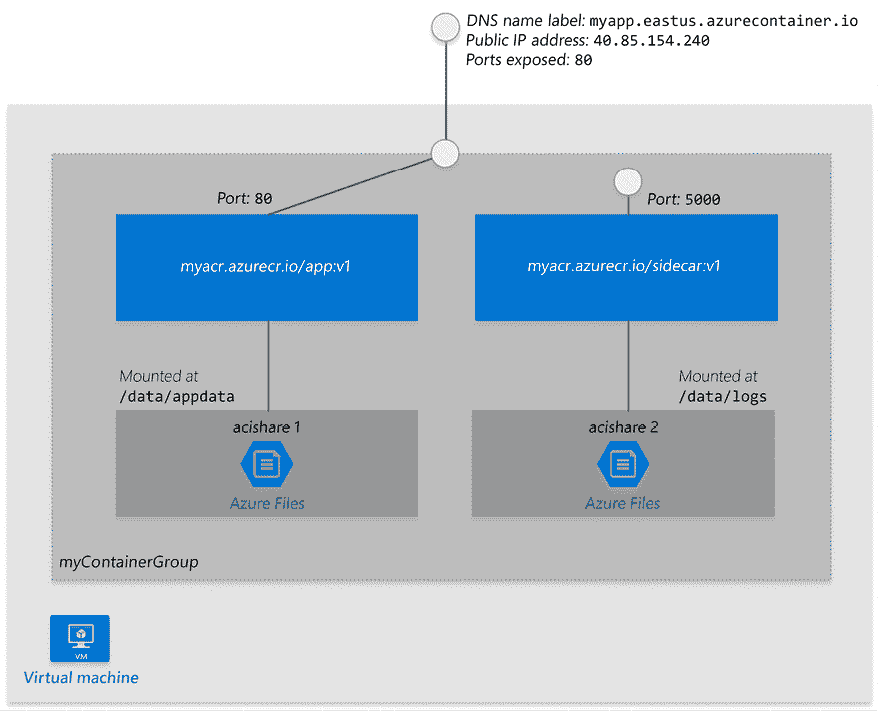

图 12.1：ACI 架构

与 Kubernetes/AKS 的集成被建模为从 AKS 到 ACI 的突发扩展。这里的指导原则是，对于已知的工作负载，你应该预配置自己的节点，但如果出现流量高峰，额外的负载将动态地扩展到 ACI。这种方法被认为更具经济性，因为在 ACI 上运行的成本高于预配置自己的节点。AKS 使用我们在上一章中探讨过的虚拟 kubelet CNCF 项目，将你的 Kubernetes 集群与 ACI 的无限容量进行集成。其工作原理是通过向你的集群中添加一个由 ACI 支持的虚拟节点，该节点在 Kubernetes 端表现为一个具有无限资源的单一节点。

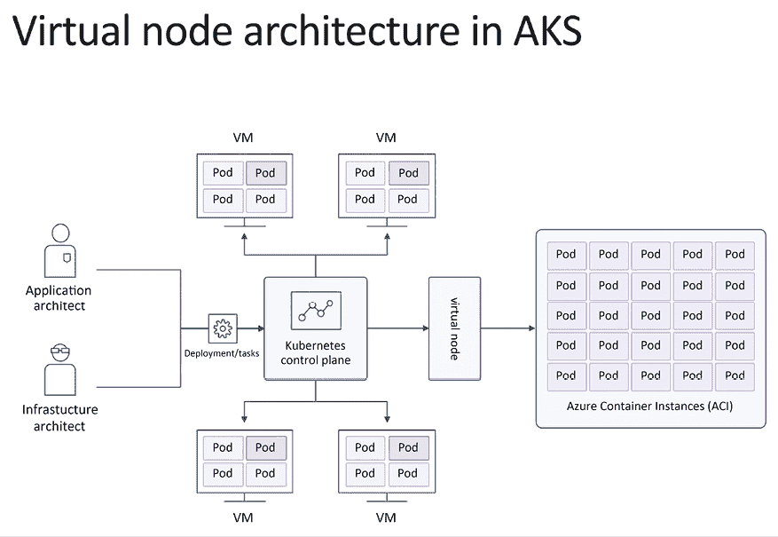

图 12.2：AKS 中的虚拟节点架构

让我们看看 AWS 如何通过 EKS 和 Fargate 实现这一点。

## AWS EKS 和 Fargate

AWS 于 2018 年发布了 Fargate（[`aws.amazon.com/fargate`](https://aws.amazon.com/fargate)），它类似于 Azure ACI，允许你在受管环境中运行容器。最初，你可以在 EC2 或 ECS（AWS 的专有容器编排服务）上使用 Fargate。在 2019 年的 AWS 重大会议 re:Invent 上，Fargate 也开始在 EKS 上普遍可用。这意味着你现在拥有一个真正的无服务器 Kubernetes 解决方案。EKS 负责控制平面，Fargate 为你管理工作节点。

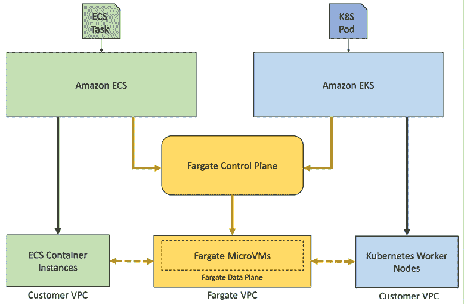

图 12.3：EKS 和 Fargate 架构

EKS 和 Fargate 模拟了 Kubernetes 集群与 Fargate 之间的交互方式，这与 AKS 和 ACI 的方式有所不同。虽然在 AKS 中，一个无限的虚拟节点代表了 ACI 的所有容量，但在 EKS 中，每个 Pod 都会获得自己的虚拟节点。但这些节点当然不是实际的节点。Fargate 拥有自己的控制平面和数据平面，支持 EC2、ECS 以及 EKS。EKS-Fargate 的集成是通过一组自定义的 Kubernetes 控制器完成的，这些控制器会监控需要部署到特定命名空间或具有特定标签的 Pod，并将这些 Pod 转发给 Fargate 安排调度。下图展示了从 EKS 到 Fargate 的工作流。

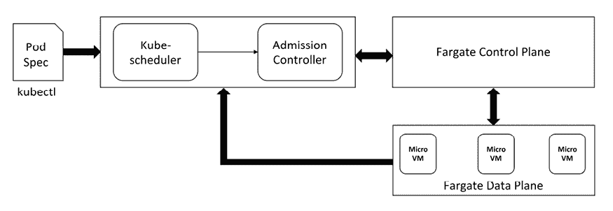

图 12.4：EKS 到 Fargate 工作流

在使用 Fargate 时，有几个限制需要注意：

+   每个 Pod 最多可配置 16 vCPU 和 120 GB 内存

+   20 GiB 容器镜像层存储

+   不支持需要持久卷或文件系统的有状态工作负载

+   不支持 `Daemonsets`、特权 Pod 或使用 `HostNetwork` 或 `HostPort` 的 Pod

+   你可以使用应用程序负载均衡器或网络负载均衡器

如果这些限制对你来说过于严格，你可以尝试一种更直接的方法，利用虚拟 kubelet 项目将 Fargate 集成到你的集群中。

那么，Google——Kubernetes 的父亲呢？

## Google Cloud Run

这可能会让人吃惊，但 Google 其实是无服务器 Kubernetes 的后起之秀。Cloud Run 是 Google 的无服务器服务。它基于 Knative，接下来我们将深入探讨它。基本的前提是，Cloud Run 有两种版本。普通的 Cloud Run 类似于 ACI 和 Fargate，它让你在 Google 完全托管的环境中运行容器。Cloud Run for Anthos 支持 GKE，并且在本地环境中可以让你在 GKE 集群中运行容器化工作负载。

Cloud Run for Anthos 目前是唯一允许你在自定义机器类型（包括 GPU）上运行容器的无服务器平台。Anthos Cloud Run 服务参与 Istio 服务网格，并提供流畅的 Kubernetes 原生体验。更多详情请参见 [`cloud.google.com/anthos/service-mesh`](https://cloud.google.com/anthos/service-mesh)。

请注意，虽然托管的 Cloud Run 使用 gVisor 隔离，Anthos Cloud Run 使用的是标准的 Kubernetes（基于容器）隔离。

下图展示了两种模型以及访问方法和部署选项的层次结构：

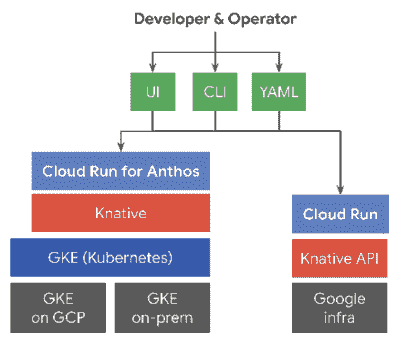

图 12.5：Cloud Run 模型

是时候深入了解 Knative 了。

# Knative

Kubernetes 本身并不内置对 FaaS 的支持。因此，许多解决方案是由社区和生态系统开发的。Knative 的目标是提供多个 FaaS 解决方案可以利用的构建模块，而无需重新发明轮子。

但这还不是全部！Knative 还提供了一个独特的功能，可以将长时间运行的服务缩放到零。这是一个大新闻。有许多用例中，你可能更倾向于使用一个可以处理大量快速连续请求的长时间运行服务。在这些情况下，每个请求启动一个新的函数实例并不是最佳做法。但当没有流量时，将服务缩放到零实例，不支付任何费用，并为可能需要更多资源的其他服务腾出更多容量，是非常棒的。Knative 还支持其他重要的用例，如基于百分比的负载均衡、基于指标的负载均衡、蓝绿部署、金丝雀部署和高级路由。它甚至可以选择性地自动处理 TLS 证书以及 HTTP 监控。最后，Knative 支持 HTTP 和 gRPC。

当前有两个 Knative 组件：Knative Serving 和 Knative Eventing。曾经还有一个 Knative Build 组件，但它被拆分出去，成为 Tekton ([`github.com/tektoncd/pipeline`](https://github.com/tektoncd/pipeline)) 的基础——一个 Kubernetes 原生的 CD 项目。

让我们从 Knative Serving 开始。

## Knative Serving

Knative Serving 的领域是运行版本化的服务并在 Kubernetes 上路由流量到这些服务。这超出了标准 Kubernetes 服务的范围。Knative Serving 定义了几个 CRD 来建模其领域：`Service`、`Route`、`Configuration` 和 `Revision`。`Service` 管理一个 `Route` 和一个 `Configuration`。一个 `Configuration` 可以有多个修订版本。

`Route` 可以将服务流量路由到特定的修订版本。以下是一个图示，展示了不同对象之间的关系：


图 12.6：Knative Serving CRDs

让我们尝试在本地环境中使用 Knative Serving。

### 安装快速入门环境

Knative 提供了一个简便的开发环境。让我们安装 `kn` CLI 和快速入门插件。按照此处的说明进行操作：[`knative.dev/docs/getting-started/quickstart-install`](https://knative.dev/docs/getting-started/quickstart-install)。

现在，我们可以使用 KinD 运行插件，它将提供一个新的 KinD 集群并安装多个组件，如 Knative-service、Kourier 网络层和 Knative 事件处理。

```
$ kn quickstart kind
Running Knative Quickstart using Kind
 Checking dependencies...
    Kind version is: 0.16.0
 Creating Kind cluster...
Creating cluster "knative" ...
  Ensuring node image (kindest/node:v1.24.3) 
  Preparing nodes 
  Writing configuration 
  Starting control-plane 
  Installing CNI 
  Installing StorageClass 
  Waiting ≤ 2m0s for control-plane = Ready  kind-knative | default
 • Ready after 19s 
Set kubectl context to "kind-knative"
You can now use your cluster with:
kubectl cluster-info --context kind-knative
Have a nice day! 
 Installing Knative Serving v1.6.0 ...
    CRDs installed...
    Core installed...
    Finished installing Knative Serving
 Installing Kourier networking layer v1.6.0 ...
    Kourier installed...
    Ingress patched...
    Finished installing Kourier Networking layer
 Configuring Kourier for Kind...
    Kourier service installed...
    Domain DNS set up...
    Finished configuring Kourier
 Installing Knative Eventing v1.6.0 ...
    CRDs installed...
    Core installed...
    In-memory channel installed...
    Mt-channel broker installed...
    Example broker installed...
    Finished installing Knative Eventing
 Knative install took: 2m22s
 Now have some fun with Serverless and Event Driven Apps! 
```

让我们安装示例 `hello` 服务：

```
$ kn service create hello \
--image gcr.io/knative-samples/helloworld-go \
--port 8080 \
--env TARGET=World
Creating service 'hello' in namespace 'default':
  0.080s The Route is still working to reflect the latest desired specification.
  0.115s ...
  0.127s Configuration "hello" is waiting for a Revision to become ready.
 21.229s ...
 21.290s Ingress has not yet been reconciled.
 21.471s Waiting for load balancer to be ready
 21.665s Ready to serve.
Service 'hello' created to latest revision 'hello-00001' is available at URL:
http://hello.default.127.0.0.1.sslip.io 
```

我们可以使用 httpie 调用服务，并获得 `Hello, World!` 的响应：

```
$ http --body http://hello.default.127.0.0.1.sslip.io
Hello World! 
```

让我们看一下 `Service` 对象。

### Knative Service 对象

Knative `Service` 将 Kubernetes 的 `Deployment` 和 `Service` 合并为一个对象。这是有道理的，因为除了无头服务的特殊情况 ([`kubernetes.io/docs/concepts/services-networking/service/#headless-services`](https://kubernetes.io/docs/concepts/services-networking/service/#headless-services))，每个服务背后总会有一个部署。

Knative `Service` 会自动管理其工作负载的整个生命周期。它负责创建路由、配置和每次服务更新时的新版本。这非常方便，因为用户只需要处理 `Service` 对象。

这是 helloworld-go Knative 服务的元数据：

```
$ k get ksvc hello -o json | jq .metadata
{
  "annotations": {
    "serving.knative.dev/creator": "kubernetes-admin",
    "serving.knative.dev/lastModifier": "kubernetes-admin"
  },
  "creationTimestamp": "2022-09-25T21:11:21Z",
  "generation": 1,
  "name": "hello",
  "namespace": "default",
  "resourceVersion": "19380",
  "uid": "03b5c668-3934-4260-bdba-13357a48501e"
} 
```

这是规格说明：

```
$ k get ksvc hello -o json | jq .spec
{
  "template": {
    "metadata": {
      "annotations": {
        "client.knative.dev/updateTimestamp": "2022-09-25T21:11:21Z",
        "client.knative.dev/user-image": "gcr.io/knative-samples/helloworld-go"
      },
      "creationTimestamp": null
    },
    "spec": {
      "containerConcurrency": 0,
      "containers": [
        {
          "env": [
            {
              "name": "TARGET",
              "value": "World"
            }
          ],
          "image": "gcr.io/knative-samples/helloworld-go",
          "name": "user-container",
          "ports": [
            {
              "containerPort": 8080,
              "protocol": "TCP"
            }
          ],
          "readinessProbe": {
            "successThreshold": 1,
            "tcpSocket": {
              "port": 0
            }
          },
          "resources": {}
        }
      ],
      "enableServiceLinks": false,
      "timeoutSeconds": 300
    }
  },
  "traffic": [
    {
      "latestRevision": true,
      "percent": 100
    }
  ]
} 
```

请注意规格中的 `traffic` 部分，它将 100% 的请求引导到最新版本。这决定了 `Route` CRD。

### 创建新版本

让我们创建一个新的 `hello` 服务版本，并设置 `TARGET` 环境变量为 `Knative`：

```
$ kn service update hello --env TARGET=Knative
Updating Service 'hello' in namespace 'default':
  0.097s The Configuration is still working to reflect the latest desired specification.
  3.000s Traffic is not yet migrated to the latest revision.
  3.041s Ingress has not yet been reconciled.
  3.155s Waiting for load balancer to be ready
  3.415s Ready to serve. 
```

现在，我们有两个版本：

```
$ k get revisions
NAME          CONFIG NAME   K8S SERVICE NAME   GENERATION   READY   REASON   ACTUAL REPLICAS   DESIRED REPLICAS
hello-00001   hello                            1            True             0                 0
hello-00002   hello                            2            True             1                 1 
```

`hello-00002` 版本是当前活动版本。让我们确认一下：

```
$ http --body http://hello.default.127.0.0.1.sslip.io
Hello Knative! 
```

### Knative Route 对象

Knative `Route` 对象允许你将一定比例的传入请求引导到特定版本。默认情况下是 100% 的流量指向最新版本，但你可以进行更改。这允许更高级的部署场景，比如蓝绿部署以及金丝雀部署。

这是将 100% 流量引导到最新版本的 `hello` 路由：

```
apiVersion: serving.knative.dev/v1
kind: Route
metadata:
  annotations:
    serving.knative.dev/creator: kubernetes-admin
    serving.knative.dev/lastModifier: kubernetes-admin
  labels:
    serving.knative.dev/service: hello
  name: hello
  namespace: default
spec:
  traffic:
  - configurationName: hello
    latestRevision: true
    percent: 100 
```

让我们将 50% 的流量引导到之前的版本：

```
$ kn service update hello \
--traffic hello-00001=50 \
--traffic @latest=50
Updating Service 'hello' in namespace 'default':
  0.078s The Route is still working to reflect the latest desired specification.
  0.124s Ingress has not yet been reconciled.
  0.192s Waiting for load balancer to be ready
  0.399s Ready to serve.
Service 'hello' with latest revision 'hello-00002' (unchanged) is available at URL:
http://hello.default.127.0.0.1.sslip.io 
```

现在，如果我们反复调用该服务，会看到来自两个版本的混合响应：

```
$ while true; do http --body http://hello.default.127.0.0.1.sslip.io; done
Hello World!
Hello World!
Hello World!
Hello Knative!
Hello Knative!
Hello Knative!
Hello Knative!
Hello World!
Hello Knative!
Hello World! 
```

让我们使用 neat kubectl 插件查看路由 ([`github.com/itaysk/kubectl-neat`](https://github.com/itaysk/kubectl-neat))：

```
$ k get route hello -o yaml | k neat
apiVersion: serving.knative.dev/v1
kind: Route
metadata:
  annotations:
    serving.knative.dev/creator: kubernetes-admin
    serving.knative.dev/lastModifier: kubernetes-admin
  labels:
    serving.knative.dev/service: hello
  name: hello
  namespace: default
spec:
  traffic:
  - configurationName: hello
    latestRevision: true
    percent: 50
  - latestRevision: false
    percent: 50
    revisionName: hello-00001 
```

### Knative 配置对象

`Configuration` CRD 包含服务的最新版本和版本数量。例如，如果我们将服务更新到版本 2：

```
apiVersion: serving.knative.dev/v1 # Current version of Knative
kind: Service
metadata:
  name: helloworld-go # The name of the app
  namespace: default # The namespace the app will use
spec:
  template:
    spec:
      containers:
        - image: gcr.io/knative-samples/helloworld-go # The URL to the image of the app
          env:
            - name: TARGET # The environment variable printed out by the sample app
              value: "Yeah, it still works - version 2 !!!" 
```

Knative 还会生成一个配置对象，该对象现在指向 `hello-00002` 版本：

```
$ k get configuration hello -o yaml
apiVersion: serving.knative.dev/v1
kind: Configuration
metadata:
  annotations:
    serving.knative.dev/creator: kubernetes-admin
    serving.knative.dev/lastModifier: kubernetes-admin
    serving.knative.dev/routes: hello
  creationTimestamp: "2022-09-25T21:11:21Z"
  generation: 2
  labels:
    serving.knative.dev/service: hello
    serving.knative.dev/serviceUID: 03b5c668-3934-4260-bdba-13357a48501e
  name: hello
  namespace: default
  ownerReferences:
  - apiVersion: serving.knative.dev/v1
    blockOwnerDeletion: true
    controller: true
    kind: Service
    name: hello
    uid: 03b5c668-3934-4260-bdba-13357a48501e
  resourceVersion: "22625"
  uid: fabfcb7c-e3bc-454e-a887-9f84057943f7
spec:
  template:
    metadata:
      annotations: kind-knative | default
        client.knative.dev/updateTimestamp: "2022-09-25T21:21:00Z"
        client.knative.dev/user-image: gcr.io/knative-samples/helloworld-go
      creationTimestamp: null
    spec:
      containerConcurrency: 0
      containers:
      - env:
        - name: TARGET
          value: Knative
        image: gcr.io/knative-samples/helloworld-go@sha256:5ea96ba4b872685ff4ddb5cd8d1a97ec18c18fae79ee8df0d29f446c5efe5f50
        name: user-container
        ports:
        - containerPort: 8080
          protocol: TCP
        readinessProbe:
          successThreshold: 1
          tcpSocket:
            port: 0
        resources: {}
      enableServiceLinks: false
      timeoutSeconds: 300
status:
  conditions:
  - lastTransitionTime: "2022-09-25T21:21:03Z"
    status: "True"
    type: Ready
  latestCreatedRevisionName: hello-00002
  latestReadyRevisionName: hello-00002
  observedGeneration: 2 
```

总结一下，Knative serving 为 Kubernetes 提供了更好的部署和网络支持，适用于长时间运行的服务和功能。接下来，让我们看看 Knative 事件驱动带来了什么。

## Knative 事件驱动

Kubernetes 或其他系统上的传统服务暴露 API 端点，消费者可以通过这些端点（通常是 HTTP）发送请求进行处理。请求-响应模式非常有用，因此它非常流行。然而，这并不是调用服务或功能的唯一模式。大多数分布式系统都有某种形式的松耦合交互，其中事件会被发布。通常，当事件发生时，需要调用一些代码。

在 Knative 之前，你需要自己构建这个能力，或者使用一些第三方库将事件与代码绑定。Knative 事件处理旨在提供一种标准的方式来完成这项任务。它兼容 CNCF 的 CloudEvents 规范（[`github.com/cloudevents/spec`](https://github.com/cloudevents/spec)）。

### 熟悉 Knative 事件处理的术语

在深入了解架构之前，让我们先定义一些我们稍后会用到的术语和概念。

#### 事件消费者

有两种类型的事件消费者：可寻址的和可调用的。可寻址的消费者可以通过其 `status.address.url` 字段通过 HTTP 接收事件。Kubernetes 的 `Service` 对象没有这样的字段，但它也被视为一个特殊类型的可寻址消费者。

可调用消费者通过 HTTP 接收事件，并且它们可以在响应中返回另一个事件，该事件会像外部事件一样被消费。可调用消费者提供了一种有效的方式来转换事件。

#### 事件源

事件源是事件的发起者。Knative 支持许多常见的事件源，你也可以编写自己的自定义事件源。以下是一些支持的事件源：

+   AWS SQS

+   Apache Camel

+   Apache CouchDB

+   Apache Kafka

+   Bitbucket

+   ContainerSource

+   Cron 作业

+   GCP PubSub

+   GitHub

+   GitLab

+   Google Cloud Scheduler

+   Kubernetes（Kubernetes 事件）

查看完整的事件源列表：[`knative.dev/docs/eventing/sources`](https://knative.dev/docs/eventing/sources)。

#### 经纪人和触发器

经纪人调解由特定属性标识的事件，并通过触发器将这些事件与消费者匹配。触发器包括事件属性的过滤器和一个可寻址的消费者。当事件到达经纪人时，它会将事件转发给那些触发器过滤器与事件属性匹配的消费者。以下图示说明了这一工作流程：

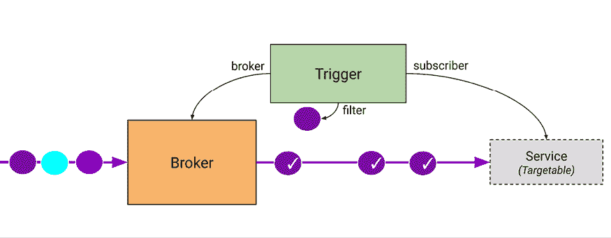

图 12.7：经纪人、触发器和服务的工作流程

#### 事件类型和事件注册

事件可以有一个类型，这个类型被建模为 `EventType` CRD。事件注册存储所有的事件类型。触发器可以使用事件类型作为其筛选标准之一。

#### 渠道和订阅

渠道是一个可选的持久化层。不同的事件类型可以被路由到不同的渠道，并使用不同的存储后端。一些渠道可能将事件存储在内存中，而其他渠道则可能通过 NATS 流式传输、Kafka 或类似技术将事件持久化到磁盘。订阅者（消费者）最终会接收并处理这些事件。

现在我们已经了解了 Knative 事件处理的各个部分，接下来让我们理解它的架构。

### Knative 事件处理的架构

当前架构支持两种事件传递模式：

+   简单传递

+   扩展式传递

简单传递就是 1:1 源 -> 消费者。消费者可以是核心 Kubernetes 服务或 Knative 服务。如果消费者无法访问，源负责处理无法传递事件的情况。源可以重试、记录错误或采取其他适当的行动。

下图展示了这一简单概念：

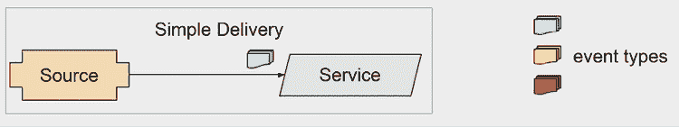

图 12.8：简单传递

分发传递支持任意复杂的处理，其中多个消费者订阅同一个通道上的事件。一旦事件被通道接收，源就不再负责该事件。这允许更动态的消费者订阅，因为源甚至不知道消费者是谁。从本质上讲，生产者和消费者之间是松耦合的。

下图展示了使用通道时可能出现的复杂处理和订阅模式：

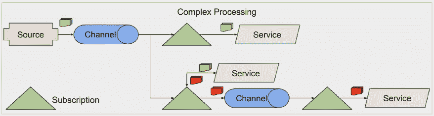

图 12.9：分发传递

到目前为止，你应该对 Knative 的范围以及它如何为 Kubernetes 建立一个稳固的无服务器基础有了相当好的理解。接下来，让我们稍微玩一下 Knative，看看它的感觉如何。

## 检查 Knative 的零扩缩选项

Knative 默认配置为零扩缩，宽限期为 30 秒。这意味着，在 30 秒的非活动期（没有请求进入）后，所有 pod 将被终止，直到有新的请求进入。为了验证这一点，我们可以等待 30 秒并检查默认命名空间中的 pod：

```
$ kubectl get po
No resources found in default namespace. 
```

然后，我们可以调用服务，稍等片刻后，我们就能得到响应：

```
$ http --body http://hello.default.127.0.0.1.sslip.io
Hello World! 
```

让我们通过使用`-w`标志来观察 pod 何时消失：

```
$ k get po -w
NAME                                      READY   STATUS        RESTARTS   AGE
hello-00001-deployment-7c4b6cc4df-4j7bf   2/2     Running       0          46s
hello-00001-deployment-7c4b6cc4df-4j7bf   2/2     Terminating   0          98s
hello-00001-deployment-7c4b6cc4df-4j7bf   1/2     Terminating   0          2m
hello-00001-deployment-7c4b6cc4df-4j7bf   0/2     Terminating   0          2m9s
hello-00001-deployment-7c4b6cc4df-4j7bf   0/2     Terminating   0          2m9s
hello-00001-deployment-7c4b6cc4df-4j7bf   0/2     Terminating   0          2m9s 
```

现在我们已经和 Knative 玩得开心了，可以继续讨论 Kubernetes 上的 FaaS 解决方案。

# Kubernetes 函数即服务框架

让我们正视一个关键问题——FaaS。Kubernetes Job 和 CronJob 非常出色，集群自动扩缩容和云提供商管理基础设施也很棒。Knative 通过其零扩缩和流量路由功能非常酷。但是，实际的 FaaS 呢？别担心，Kubernetes 这里有许多选择——甚至可能有太多选择。Kubernetes 有许多 FaaS 框架：

+   Fission

+   Kubeless

+   OpenFaaS

+   OpenWhisk

+   Riff（基于 Knative 构建）

+   Nuclio

+   BlueNimble

+   Fn

+   Rainbond

这些框架中，有些获得了大量关注，而有些则没有。我在上一版书中讨论的两个最显著的框架，Kubeless 和 Riff，已经被归档（Riff 自称已完成）。

我们将研究一些仍然活跃的更流行的选项，特别是我们将重点关注 OpenFaaS 和 Fission。

## OpenFaaS

OpenFaaS ([`www.openfaas.com`](https://www.openfaas.com)) 是最成熟、最受欢迎且最活跃的 FaaS 项目之一。它于 2016 年创建，写作时在 GitHub 上已有超过 30,000 个 stars。OpenFaaS 拥有社区版以及授权的 Pro 和 Enterprise 版本。许多生产功能（如高级自动扩缩容和零扩缩容）在社区版中不可用。OpenFaaS 还包含两个附加组件——Prometheus（用于指标）和 NATS（异步队列）。让我们看看 OpenFaaS 如何在 Kubernetes 上提供 FaaS 解决方案。

### 交付流水线

OpenFaaS 提供了一个完整的生态系统和交付机制，来打包和运行你的函数在 Kubernetes 上。它也可以在虚拟机上使用 fasstd 运行，但这本书是关于 Kubernetes 的。典型的工作流如下所示：

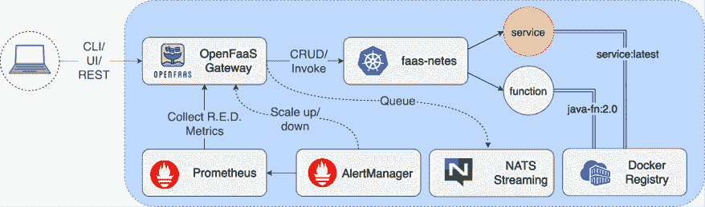

图 12.10：典型的 OpenFaaS 工作流

`faas-cli` 允许你构建、推送并部署你的函数作为 Docker/OCI 镜像。当你构建函数时，可以使用各种模板，也可以添加你自己的模板。这些步骤可以集成到任何 CI/CD 流水线中。

### OpenFaaS 特性

OpenFaaS 通过网关暴露其功能。你可以通过 REST API、CLI 或基于 Web 的 UI 与网关进行交互。网关暴露了不同的端点。

OpenFaaS 的主要特性包括：

+   函数管理

+   函数调用和触发器

+   自动扩缩容

+   指标

+   基于 Web 的 UI

#### 函数管理

你通过创建或构建镜像、推送镜像并部署它们来管理函数。`faas-cli` 可以帮助你完成这些任务。我们将在本章后面看到一个示例。

#### 函数调用和触发器

OpenFaaS 函数可以作为 HTTP 端点被调用，或者通过各种触发器进行调用，如 NATS 事件、其他事件系统，甚至直接通过 CLI 调用。

#### 指标

OpenFaaS 暴露了一个 prometheus/metrics 端点，可用于抓取指标。某些指标仅在 Pro 版本中可用。完整的指标列表请参见：[`docs.openfaas.com/architecture/metrics/`](https://docs.openfaas.com/architecture/metrics/)。

#### 自动扩缩容

OpenFaaS 的一个显著特点是，它根据各种指标进行扩缩容（包括 Pro 版本中的零扩缩容）。它不使用 Kubernetes **水平 Pod 自动扩缩容器** (**HPA**)，而是支持多种扩缩容模式，如 rps、容量和 CPU（与 Kubernetes HPA 相同）。你可以通过像 Keda ([`keda.sh`](https://keda.sh)) 这样的项目实现类似的功能，但那样你得自己构建，而 OpenFaaS 已经为你提供了现成的功能。

#### 基于 Web 的 UI

OpenFaaS 提供一个简单的基于 Web 的 UI，位于 API 网关的 `/ui` 端点。

下面是其架构图：

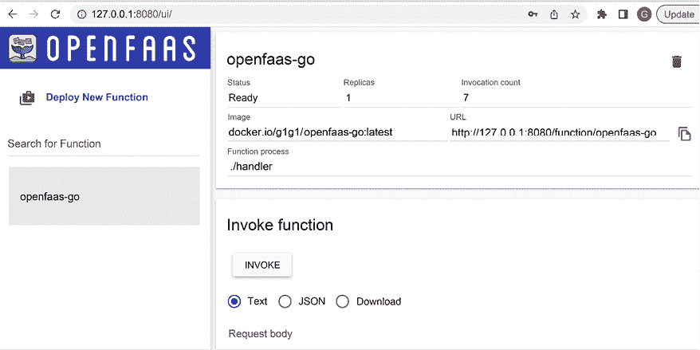

图 12.11：OpenFaaS 基于 Web 的 UI

### OpenFaaS 架构

OpenFaaS 具有多个组件，这些组件相互作用，以可扩展和 Kubernetes 原生的方式提供所有功能。

主要组件包括：

+   OpenFaaS API 网关

+   FaaS 提供商

+   Prometheus 和告警管理器

+   OpenFaaS 操作员

+   API 网关

你的函数作为 CRD 存储。OpenFaaS 操作员会监视这些函数。以下图示说明了各个组件及其关系。

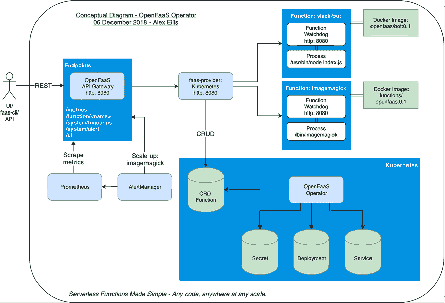

图 12.12：OpenFaaS 架构

让我们玩一下 OpenFaaS，了解从用户角度如何操作。

### 带着 OpenFaaS 去体验

让我们安装 OpenFaaS 和 fass-cli CLI。我们将使用推荐的 arkade 包管理器（[`github.com/alexellis/arkade`](https://github.com/alexellis/arkade)），这是 OpenFaaS 创始人开发的。所以，我们先安装 arkade。Arkade 可以安装 Kubernetes 应用程序和各种命令行工具。

在 Mac 上，你可以使用 homebrew：

```
$ brew install arkade 
```

在 Windows 上，你需要安装 Git Bash（[`git-scm.com/downloads`](https://git-scm.com/downloads)），然后在 Git Bash 提示符下：

```
$ curl -sLS https://get.arkade.dev | sh 
```

让我们验证 arkade 是否可用：

```
$ ark
            _             _
  __ _ _ __| | ____ _  __| | ___
 / _` | '__| |/ / _` |/ _` |/ _ \
| (_| | |  |   < (_| | (_| |  __/
 \__,_|_|  |_|\_\__,_|\__,_|\___|
Open Source Marketplace For Developer Tools
Usage:
  arkade [flags]
  arkade [command]
Available Commands:
  chart       Chart utilities
  completion  Output shell completion for the given shell (bash or zsh)
  get         The get command downloads a tool
  help        Help about any command
  info        Find info about a Kubernetes app
  install     Install Kubernetes apps from helm charts or YAML files
  system      System apps
  uninstall   Uninstall apps installed with arkade
  update      Print update instructions
  version     Print the version
Flags:
  -h, --help   help for arkade
Use "arkade [command] --help" for more information about a command. 
```

如果你不想使用 arkade，还有其他选项可以安装 OpenFaaS。参见 [`docs.openfaas.com/deployment/kubernetes/`](https://docs.openfaas.com/deployment/kubernetes/)。

接下来，让我们在 Kubernetes 集群上安装 OpenFaaS：

```
$ ark install openfaas
Using Kubeconfig: /Users/gigi.sayfan/.kube/config
Client: arm64, Darwin
2022/10/01 11:29:14 User dir established as: /Users/gigi.sayfan/.arkade/
Downloading: https://get.helm.sh/helm-v3.9.3-darwin-amd64.tar.gz
/var/folders/qv/7l781jhs6j19gw3b89f4fcz40000gq/T/helm-v3.9.3-darwin-amd64.tar.gz written.
2022/10/01 11:29:17 Extracted: /var/folders/qv/7l781jhs6j19gw3b89f4fcz40000gq/T/helm
2022/10/01 11:29:17 Copying /var/folders/qv/7l781jhs6j19gw3b89f4fcz40000gq/T/helm to /Users/gigi.sayfan/.arkade/bin/helm
Downloaded to:  /Users/gigi.sayfan/.arkade/bin/helm helm
"openfaas" has been added to your repositories
Hang tight while we grab the latest from your chart repositories...
...Successfully got an update from the "openfaas" chart repository
Update Complete. Happy Helming!
VALUES values-arm64.yaml
Command: /Users/gigi.sayfan/.arkade/bin/helm [upgrade --install openfaas openfaas/openfaas --namespace openfaas --values /var/folders/qv/7l781jhs6j19gw3b89f4fcz40000gq/T/charts/openfaas/values-arm64.yaml --set gateway.directFunctions=false --set openfaasImagePullPolicy=IfNotPresent --set gateway.replicas=1 --set queueWorker.replicas=1 --set dashboard.publicURL=http://127.0.0.1:8080 --set queueWorker.maxInflight=1 --set autoscaler.enabled=false --set basic_auth=true --set faasnetes.imagePullPolicy=Always --set basicAuthPlugin.replicas=1 --set clusterRole=false --set operator.create=false --set ingressOperator.create=false --set dashboard.enabled=false --set serviceType=NodePort]
Release "openfaas" does not exist. Installing it now.
NAME: openfaas
LAST DEPLOYED: Sat Oct  1 11:29:28 2022
NAMESPACE: openfaas
STATUS: deployed
REVISION: 1
TEST SUITE: None
NOTES:
To verify that openfaas has started, run:
  kubectl -n openfaas get deployments -l "release=openfaas, app=openfaas"
=======================================================================
= OpenFaaS has been installed.                                        =
=======================================================================
# Get the faascli
kind-openfass | default
curl -SLsf https://cli.openfaas.com | sudo sh
# Forward the gateway to your machine
kubectl rollout status -n openfaas deploy/gateway
kubectl port-forward -n openfaas svc/gateway 8080:8080 &
# If basic auth is enabled, you can now log into your gateway:
PASSWORD=$(kubectl get secret -n openfaas basic-auth -o jsonpath="{.data.basic-auth-password}" | base64 --decode; echo)
echo -n $PASSWORD | faas-cli login --username admin --password-stdin
faas-cli store deploy figlet
faas-cli list
# For Raspberry Pi
faas-cli store list \
 --platform armhf
faas-cli store deploy figlet \
 --platform armhf
# Find out more at:
# https://github.com/openfaas/faas
 arkade needs your support: https://github.com/sponsors/alexellis 
```

OpenFaaS 创建了两个命名空间：`openfaas` 用于它自己，`openfass-fn` 用于你的函数。在 `openfass` 命名空间中有多个部署：

```
$ k get deploy -n openfaas
NAME                READY   UP-TO-DATE   AVAILABLE   AGE
alertmanager        1/1     1            1           6m2s
basic-auth-plugin   1/1     1            1           6m2s
gateway             1/1     1            1           6m2s
nats                1/1     1            1           6m2s
prometheus          1/1     1            1           6m2s
queue-worker        1/1     1            1           6m2s 
```

`openfass-fn` 命名空间目前为空。

好的，接下来我们安装 OpenFaaS CLI：

```
$ brew install faas-cli
==> Downloading https://ghcr.io/v2/homebrew/core/faas-cli/manifests/0.14.8
######################################################################## 100.0%
==> Downloading https://ghcr.io/v2/homebrew/core/faas-cli/blobs/sha256:cf9460398c45ea401ac688e77a8884cbceaf255064a1d583f8113b6c2bd68450
==> Downloading from https://pkg-containers.githubusercontent.com/ghcr1/blobs/sha256:cf9460398c45ea401ac688e77a8884cbceaf255064a1d583f8113b6c2bd68450?se=2022-10-01T18%3A50%3A00Z&sig=V%
######################################################################## 100.0%
==> Pouring faas-cli--0.14.8.arm64_monterey.bottle.tar.gz
==> Caveats
zsh completions have been installed to:
  /opt/homebrew/share/zsh/site-functions
==> Summary
  /opt/homebrew/Cellar/faas-cli/0.14.8: 9 files, 8.4MB
==> Running `brew cleanup faas-cli`...
Disable this behaviour by setting HOMEBREW_NO_INSTALL_CLEANUP.
Hide these hints with HOMEBREW_NO_ENV_HINTS (see `man brew`). 
```

首先，我们需要端口转发网关服务，以便 faas-cli 可以访问我们的集群：

```
$ kubectl port-forward -n openfaas svc/gateway 8080:8080 &
[3] 76489
$ Forwarding from 127.0.0.1:8080 -> 8080
Forwarding from [::1]:8080 -> 8080 
```

下一步是从名为 `basic-auth` 的秘密中获取管理员密码，并用它作为管理员用户登录：

```
$ PASSWORD=$(kubectl get secret -n openfaas basic-auth -o jsonpath="{.data.basic-auth-password}" | base64 --decode; echo)
echo -n $PASSWORD | faas-cli login --username admin --password-stdin 
```

现在，我们已经准备好在集群上部署和运行函数了。让我们看一下商店中可用的函数模板：

```
$ faas-cli template store list
NAME                     SOURCE             DESCRIPTION
csharp                   openfaas           Classic C# template
dockerfile               openfaas           Classic Dockerfile template
go                       openfaas           Classic Golang template
java11                   openfaas           Java 11 template
java11-vert-x            openfaas           Java 11 Vert.x template
node17                   openfaas           HTTP-based Node 17 template
node16                   openfaas           HTTP-based Node 16 template
node14                   openfaas           HTTP-based Node 14 template
node12                   openfaas           HTTP-based Node 12 template
node                     openfaas           Classic NodeJS 8 template
php7                     openfaas           Classic PHP 7 template
php8                     openfaas           Classic PHP 8 template
python                   openfaas           Classic Python 2.7 template
python3                  openfaas           Classic Python 3.6 template
python3-dlrs             intel              Deep Learning Reference Stack v0.4 for ML workloads
ruby                     openfaas           Classic Ruby 2.5 template
ruby-http                openfaas           Ruby 2.4 HTTP template
python27-flask           openfaas           Python 2.7 Flask template
python3-flask            openfaas           Python 3.7 Flask template
python3-flask-debian     openfaas           Python 3.7 Flask template based on Debian
python3-http             openfaas           Python 3.7 with Flask and HTTP
python3-http-debian      openfaas           Python 3.7 with Flask and HTTP based on Debian
golang-http              openfaas           Golang HTTP template
golang-middleware        openfaas           Golang Middleware template
python3-debian           openfaas           Python 3 Debian template
powershell-template      openfaas-incubator Powershell Core Ubuntu:16.04 template
powershell-http-template openfaas-incubator Powershell Core HTTP Ubuntu:16.04 template
rust                     booyaa             Rust template
crystal                  tpei               Crystal template
csharp-httprequest       distantcam         C# HTTP template
csharp-kestrel           burtonr            C# Kestrel HTTP template
vertx-native             pmlopes            Eclipse Vert.x native image template
swift                    affix              Swift 4.2 Template
lua53                    affix              Lua 5.3 Template
vala                     affix              Vala Template
vala-http                affix              Non-Forking Vala Template
quarkus-native           pmlopes            Quarkus.io native image template
perl-alpine              tmiklas            Perl language template based on Alpine image
crystal-http             koffeinfrei        Crystal HTTP template
rust-http                openfaas-incubator Rust HTTP template
bash-streaming           openfaas-incubator Bash Streaming template
cobol                    devries            COBOL Template 
```

你知道吗！如果你感兴趣的话，还有一个 COBOL 模板。为了我们的目的，我们将使用 Golang。Golang 有多个模板，我们将使用 `golang-http` 模板。我们需要第一次拉取这个模板：

```
$ faas-cli template store pull golang-http
Fetch templates from repository: https://github.com/openfaas/golang-http-template at
2022/10/02 14:48:38 Attempting to expand templates from https://github.com/openfaas/golang-http-template
2022/10/02 14:48:39 Fetched 2 template(s) : [golang-http golang-middleware] from https://github.com/openfaas/golang-http-template 
```

这个模板包含了大量的样板代码，处理了最终生成一个可以在 Kubernetes 上运行的容器所需的所有流程。

```
$ ls -la template/golang-http
total 64
drwxr-xr-x  11 gigi.sayfan  staff   352 Oct  2 14:48 .
drwxr-xr-x   4 gigi.sayfan  staff   128 Oct  2 14:52 ..
-rw-r--r--   1 gigi.sayfan  staff    52 Oct  2 14:48 .dockerignore
-rw-r--r--   1 gigi.sayfan  staff     9 Oct  2 14:48 .gitignore
-rw-r--r--   1 gigi.sayfan  staff  1738 Oct  2 14:48 Dockerfile
drwxr-xr-x   4 gigi.sayfan  staff   128 Oct  2 14:48 function
-rw-r--r--   1 gigi.sayfan  staff   110 Oct  2 14:48 go.mod
-rw-r--r--   1 gigi.sayfan  staff   257 Oct  2 14:48 go.sum
-rw-r--r--   1 gigi.sayfan  staff    32 Oct  2 14:48 go.work
-rw-r--r--   1 gigi.sayfan  staff  3017 Oct  2 14:48 main.go
-rw-r--r--   1 gigi.sayfan  staff   465 Oct  2 14:48 template.yml 
```

让我们创建我们的函数：

```
$ faas-cli new --prefix docker.io/g1g1 --lang golang-http openfaas-go
Folder: openfaas-go created.
kind-openfaas | openfaas
  ___                   _____           ____
 / _ \ _ __   ___ _ __ |  ___|_ _  __ _/ ___|
| | | | '_ \ / _ \ '_ \| |_ / _` |/ _` \___ \
| |_| | |_) |  __/ | | |  _| (_| | (_| |___) |
 \___/| .__/ \___|_| |_|_|  \__,_|\__,_|____/
      |_|
Function created in folder: openfaas-go
Stack file written: openfaas-go.yml
Notes:
You have created a new function which uses Go 1.18 and Alpine
Linux as its base image.
To disable the go module, for private vendor code, please use
"--build-arg GO111MODULE=off" with faas-cli build or configure this
via your stack.yml file.
See more: https://docs.openfaas.com/cli/templates/
For the template's repo and more examples:
https://github.com/openfaas/golang-http-template 
```

这个命令生成了 3 个文件：

+   `openfaas-go.yml`

+   `openfaas-go/go.mod`

+   `openfaas-go/handler.go`

让我们检查这些文件。

`openfaas-go.yml` 是我们的函数清单：

```
$ cat openfaas-go.yml
version: 1.0
provider:
  name: openfaas
  gateway: http://127.0.0.1:8080
functions:
  openfaas-go:
    lang: golang-http
    handler: ./openfaas-go
    image: docker.io/g1g1/openfaas-go:latest 
```

注意，镜像有我的 Docker 注册表用户账户的前缀，以防我想推送镜像。一个清单文件中可以定义多个函数。

`go.mod` 文件非常基础：

```
$ cat openfaas-go/go.mod
module handler/function
go 1.18 
```

`handler.go` 文件是我们编写代码的地方：

```
$ cat openfaas-go/handler.go
package function
import (
    "fmt"
    "net/http"
    handler "github.com/openfaas/templates-sdk/go-http"
)
// Handle a function invocation
func Handle(req handler.Request) (handler.Response, error) {
    var err error
    message := fmt.Sprintf("Body: %s", string(req.Body))
    return handler.Response{
        Body:       []byte(message),
        StatusCode: http.StatusOK,
    }, err
} 
```

默认实现类似一个 HTTP 回显，响应只是返回请求的主体。

让我们开始构建。默认输出非常冗长，显示了大量来自 Docker 的输出，所以我将使用 `--quiet` 标志：

```
$ faas-cli build -f openfaas-go.yml --quiet
[0] > Building openfaas-go.
Clearing temporary build folder: ./build/openfaas-go/
Preparing: ./openfaas-go/ build/openfaas-go/function
Building: docker.io/g1g1/openfaas-go:latest with golang-http template. Please wait..
Image: docker.io/g1g1/openfaas-go:latest built.
[0] < Building openfaas-go done in 0.93s.
[0] Worker done.
Total build time: 0.93s 
```

结果是一个 Docker 镜像：

```
$ docker images | grep openfaas
g1g1/openfaas-go                   latest         215e95884a9b   3 minutes ago   18.3MB 
```

如果你有账户，我们可以将这个镜像推送到 Docker 注册表（或其他注册表）：

```
$ faas-cli push -f openfaas-go.yml
[0] > Pushing openfaas-go [docker.io/g1g1/openfaas-go:latest].
The push refers to repository [docker.io/g1g1/openfaas-go]
668bbc37657f: Pushed
185851557ef2: Pushed
1d14a6a345f2: Pushed
5f70bf18a086: Pushed
ecf2d64591ca: Pushed
f6b0a98cfe18: Pushed
5d3e392a13a0: Mounted from library/golang
latest: digest: sha256:cb2b3051e2cac7c10ce78a844e331a5c55e9a2296c5c3ba9e0e8ee0523ceba84 size: 1780
[0] < Pushing openfaas-go [docker.io/g1g1/openfaas-go:latest] done. 
```

Docker 镜像现在已在 Docker Hub 上可用。

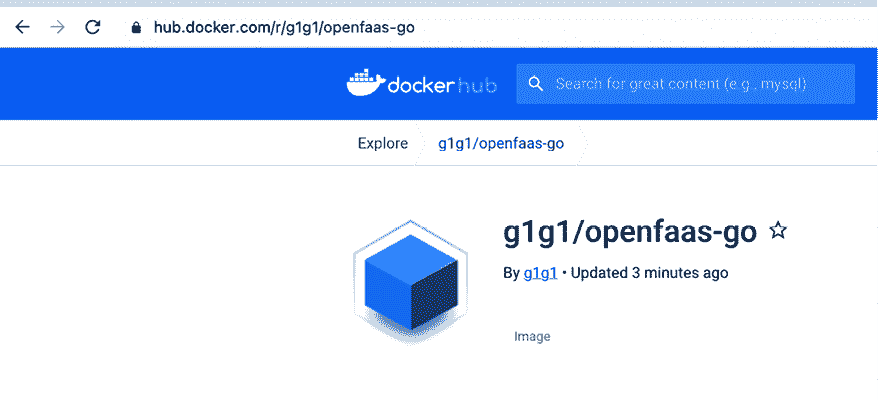

图 12.13：Docker 镜像可在 Docker Hub 上获取

最后一步是将镜像部署到集群中：

```
$ faas-cli deploy -f openfaas-go.yml
Deploying: openfaas-go.
Handling connection for 8080
Deployed. 202 Accepted.
URL: http://127.0.0.1:8080/function/openfaas-go 
```

让我们使用不同的请求体多次调用我们的函数，以验证响应是否准确：

```
$ http POST http://127.0.0.1:8080/function/openfaas-go body='yeah, it works!' -b
Handling connection for 8080
Body: {
    "body": "yeah, it works!"
}
$ http POST http://127.0.0.1:8080/function/openfaas-go body='awesome!' -b
Handling connection for 8080
Body: {
    "body": "awesome!"
} 
```

太棒了，真的有效！

我们可以通过`list`命令查看我们的函数和一些统计信息，例如调用次数和副本数量：

```
$ faas-cli list
Handling connection for 8080
Function                        Invocations     Replicas
openfaas-go                     6               1 
```

总结来说，OpenFaaS 为 Kubernetes 上的函数即服务提供了一个成熟且全面的解决方案。它仍然要求你构建 Docker 镜像、推送并部署到集群中，这些步骤需要使用其 CLI 单独执行。将这些步骤集成到 CI/CD 流水线或简单的脚本中相对简单。

## Fission

Fission ([`fission.io`](https://fission.io)) 是一个成熟且文档齐全的框架。它将 FaaS 世界建模为环境、函数和触发器。环境用于构建和运行特定语言的函数代码。每个语言环境包含一个 HTTP 服务器，并且通常具有一个动态加载器（适用于动态语言）。函数是表示无服务器函数的对象，触发器则是函数在集群中部署后如何被调用的方式。触发器有四种类型：

+   **HTTP 触发器**：通过 HTTP 端点调用函数。

+   **定时器触发器**：在特定时间调用函数。

+   **消息队列触发器**：当从消息队列中提取事件时调用函数（支持 Kafka、NATS 和 Azure 队列）。

+   **Kubernetes watch 触发器**：响应集群中 Kubernetes 事件来调用函数。

很有趣的是，消息队列触发器不仅仅是“触发后忘记”。它们支持可选的响应和错误队列。以下是展示流程的图示：

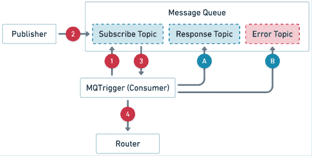

图 12.14：Fission mq 触发器

Fission 为其 100 毫秒的冷启动速度感到自豪。它通过保持一个“温热”的容器池并配有一个小型动态加载器来实现这一点。当第一次调用函数时，已经有一个正在运行的容器准备就绪，代码会发送到该容器中执行。从某种意义上说，Fission 通过从未冷启动来“作弊”。关键点是，Fission 不会扩展到零，但对于首次调用来说非常快速。

### Fission 执行器

Fission 支持两种执行器类型——`NewDeploy` 和 `PoolManager`。NewDeploy 执行器与 OpenFaaS 非常相似，为每个函数创建一个 `Deployment`、`Service` 和 `HPA`。以下是使用 NewDeploy 执行器时的函数调用示例：

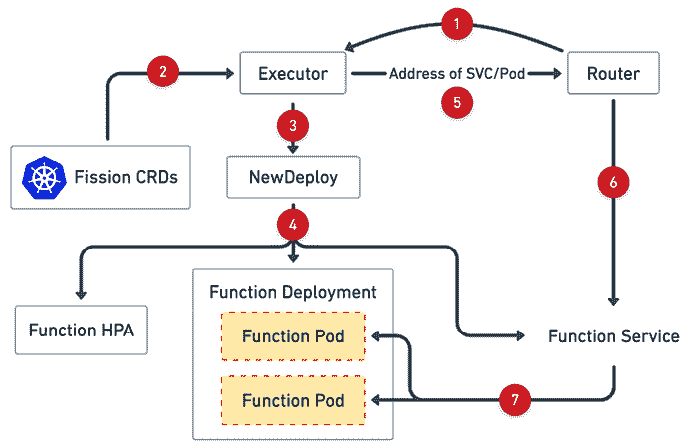

图 12.15：Fission 函数调用

`PoolManager` 执行器管理每个环境的通用 pod 池。当调用特定环境的函数时，`PoolManager` 执行器会在可用的通用池中运行该函数。

`NewDeploy` 执行器允许对运行特定函数所需的资源进行精细控制，并且它还可以扩展到零。其代价是每个函数需要更高的冷启动时间来为每个函数创建新 Pod。需要注意的是，Pod 会保留，因此，如果同一个函数在上次调用后不久再次被调用，就不必再次支付冷启动费用。

`PoolManager` 执行器保持常驻通用 Pod，因此调用函数的速度较快，但当没有新函数需要调用时，池中的 Pod 会闲置不动。此外，函数可以控制它们可用的资源。

根据功能的使用模式，你可以为不同的功能使用不同的执行器。

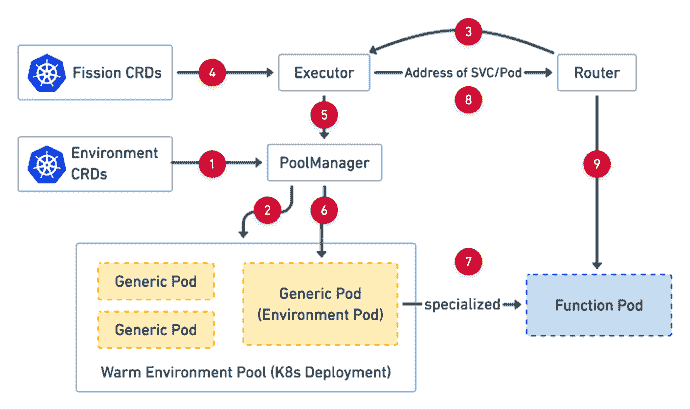

图 12.16：Fission 执行器

### Fission 工作流

Fission 还有另一个特色——Fission 工作流。这是一个基于 Fission 的独立项目，允许你构建由多个 Fission 函数组成的复杂工作流。目前，由于 Fission 核心团队的时间限制，该项目处于维护模式。

请查看项目页面以获取更多详情：[`github.com/fission/fission-workflows`](https://github.com/fission/fission-workflows)。

这是一个描述 Fission 工作流架构的示意图：

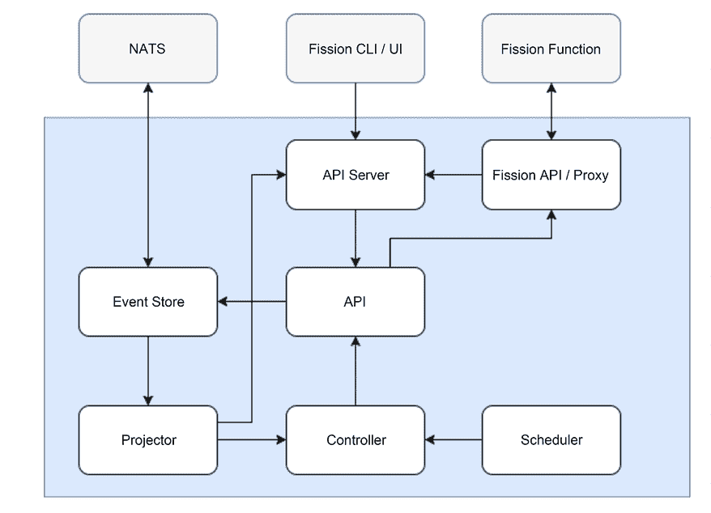

图 12.17：Fission 工作流

你可以在 YAML 文件中定义工作流，指定任务（通常是 Fission 函数）、输入、输出、条件和延迟。例如：

```
apiVersion: 1
description: Send a message to a slack channel when the temperature exceeds a certain threshold
output: CreateResult
# Input: 'San Fransisco, CA'
tasks:
  # Fetch weather for input
  FetchWeather:
    run: wunderground-conditions
    inputs:
      default:
        apiKey: <API_KEY>
        state: "{$.Invocation.Inputs.default.substring($.Invocation.Inputs.default.indexOf(',') + 1).trim()}"
        city: "{$.Invocation.Inputs.default.substring(0, $.Invocation.Inputs.default.indexOf(',')).trim()}"
  ToCelsius:
    run: tempconv
    inputs:
      default:
        temperature: "{$.Tasks.FetchWeather.Output.current_observation.temp_f}"
        format: F
        target: C
    requires:
    - FetchWeather
  # Send a slack message if the temperature threshold has been exceeded
  CheckTemperatureThreshold:
    run: if
    inputs:
      if: "{$.Tasks.ToCelsius.Output.temperature > 25}"
      then:
        run: slack-post-message
        inputs:
          default:
            message: "{'It is ' + $.Tasks.ToCelsius.Output.temperature + 'C in ' + $.Invocation.Inputs.default + ' :fire:'}"
            path: <HOOK_URL>
    requires:
    - ToCelsius
    # Besides the potential Slack message, compose the response of this workflow {location, celsius, fahrenheit}
  CreateResult:
    run: compose
    inputs:
      celsius: "{$.Tasks.ToCelsius.Output.temperature}"
      fahrenheit: "{$.Tasks.FetchWeather.Output.current_observation.temp_f}"
      location: "{$.Invocation.Inputs.default}"
      sentSlackMsg: "{$.Tasks.CheckTemperatureThreshold.Output}"
    requires:
    - ToCelsius
    - CheckTemperatureThreshold 
```

让我们尝试一下 Fission：

### 使用 Fission 进行实验

首先，让我们通过 Helm 安装它：

```
$ k create ns fission
$ k create -k "github.com/fission/fission/crds/v1?ref=v1.17.0"
$ helm repo add fission-charts https://fission.github.io/fission-charts/
$ helm repo update
$ helm install --version v1.17.0 --namespace fission fission \
  --set serviceType=NodePort,routerServiceType=NodePort \
  fission-charts/fission-all 
```

这里是它创建的所有 CRD：

```
$ k get crd -o name | grep fission
customresourcedefinition.apiextensions.k8s.io/canaryconfigs.fission.io
customresourcedefinition.apiextensions.k8s.io/environments.fission.io
customresourcedefinition.apiextensions.k8s.io/functions.fission.io
customresourcedefinition.apiextensions.k8s.io/httptriggers.fission.io
customresourcedefinition.apiextensions.k8s.io/kuberneteswatchtriggers.fission.io
customresourcedefinition.apiextensions.k8s.io/messagequeuetriggers.fission.io
customresourcedefinition.apiextensions.k8s.io/packages.fission.io
customresourcedefinition.apiextensions.k8s.io/timetriggers.fission.io 
```

Fission CLI 也会派上用场：

对于 Mac：

```
$ curl -Lo fission https://github.com/fission/fission/releases/download/v1.17.0/fission-v1.17.0-darwin-amd64 && chmod +x fission && sudo mv fission /usr/local/bin/ 
```

对于 Linux 或 Windows 上的 WSL：

```
$ curl -Lo fission https://github.com/fission/fission/releases/download/v1.17.0/fission-v1.17.0-linux-amd64 && chmod +x fission && sudo mv fission /usr/local/bin/ 
```

我们需要创建一个环境，才能构建我们的函数。我们选择 Python 环境：

```
$ fission environment create --name python --image fission/python-env
poolsize setting default to 3
environment 'python' created 
```

在 Python 环境准备好后，我们可以创建一个无服务器函数。首先，将此代码保存为 `yeah.py`：

```
def main():
    return 'Yeah, it works!!!' 
```

然后，我们创建名为“`yeah`”的 Fission 函数：

```
$ fission function create --name yeah --env python --code yeah.py
Package 'yeah-b9d5d944-9c6e-4e67-81fb-96e047625b74' created
function 'yeah' created 
```

我们可以通过 Fission CLI 测试该函数：

```
$ fission function test --name yeah
Yeah, it works!!! 
```

真正的重点是通过 HTTP 端点调用它。我们需要为此创建一个路由：

```
$ fission route create --method GET --url /yeah --function yeah --name yeah
trigger 'yeah' created 
```

在设置路由后，我们仍然需要通过端口转发将服务 Pod 暴露到本地环境：

```
$ k -n fission port-forward $(k -n fission get pod -l svc=router -o name) 8888:8888 &
$ export FISSION_ROUTER=127.0.0.1:8888 
```

在完成所有前置步骤后，让我们通过 httpie 测试我们的函数：

```
$ http http://${FISSION_ROUTER}/yeah -b
Handling connection for 8888
Yeah, it works!!! 
```

你可以跳过端口转发，直接使用 Fission CLI 进行测试：

```
$ fission function test yeah --name yeah
Yeah, it works!!! 
```

Fission 在功能上类似于 OpenFaaS，但它感觉更加简洁，使用起来更容易。两者都是不错的解决方案，选择哪个取决于你的个人偏好。

# 总结

在本章中，我们讨论了无服务器计算这一热门话题。我们解释了无服务器的两层含义——既是消除了管理服务器的需求，也包括将功能作为服务进行部署和运行。我们深入探讨了云中的无服务器基础设施，特别是在 Kubernetes 环境中的应用。我们将 Kubernetes 原生的集群自动扩展器与其他云服务提供商的解决方案进行了对比，比如 AWS EKS+Fargate、Azure AKS+ACI 和 Google Cloud Run。接着，我们转向了令人兴奋且充满前景的 Knative 项目，重点介绍了其零扩展能力和高级部署选项。然后，我们进入了 Kubernetes 上 FaaS 的精彩世界。

我们讨论了各种可用的解决方案，并对其进行了详细的分析，包括对两种最具代表性且经过实践检验的解决方案的实际操作实验：OpenFaaS 和 Fission。结论是，这两种无服务器计算方式在操作和成本管理方面都带来了真正的好处。未来，观察这些技术在云计算和 Kubernetes 环境中的发展与整合将非常令人兴奋。

在下一章，我们的重点将放在监控与可观察性上。像大型 Kubernetes 集群这样的复杂系统，涵盖了各种不同的工作负载、持续交付管道以及配置变更，必须具备出色的监控系统，以便保持系统的正常运转。Kubernetes 提供了一些非常棒的选项，我们应该加以利用。
