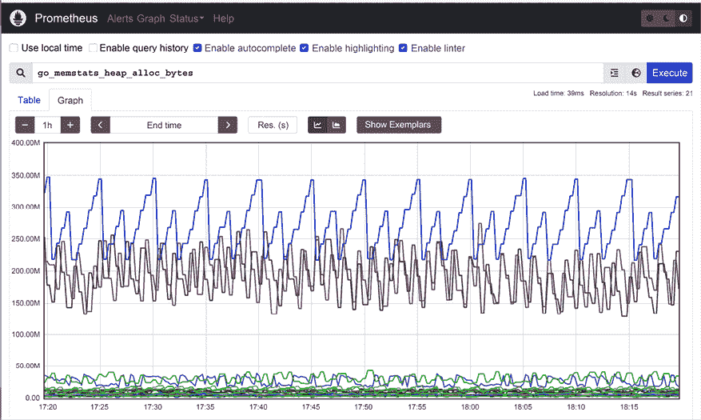

# 第十三章：监控 Kubernetes 集群

在上一章中，我们探讨了无服务器计算及其在 Kubernetes 上的表现。这个领域充满了创新，跟踪其发展既非常有用，又令人着迷。

在本章中，我们将讨论如何确保你的系统正常运行并且表现良好，以及当它们出现问题时该如何响应。在*第三章*，*高可用性和可靠性*中，我们讨论了相关话题。这里的重点是了解你的系统发生了什么，并且可以使用哪些实践和工具。

监控有很多方面，比如日志记录、度量、分布式追踪、错误报告和警报。像自动扩展和自我修复等实践依赖于监控来检测是否需要扩展或修复。

本章我们将讨论的内容包括：

+   理解可观察性

+   使用 Kubernetes 记录日志

+   使用 Kubernetes 记录度量

+   使用 Jaeger 进行分布式追踪

+   排查问题

Kubernetes 社区认识到监控的重要性，并投入了大量精力确保 Kubernetes 拥有一个完善的监控方案。**云原生计算基金会**（**CNCF**）是云原生基础设施项目的事实上的管理机构。到目前为止，它已经毕业了二十个项目。Kubernetes 是第一个毕业的项目，在早期毕业的项目中，另外三个超过两年毕业的项目专注于监控：Prometheus、Fluentd 和 Jaeger。这意味着监控和可观察性是大规模基于 Kubernetes 的系统的基础。在深入探讨 Kubernetes 监控以及具体项目和工具之前，我们应该更好地理解监控的含义。一个好的思考监控的框架是：你的系统有多可观察。

# 理解可观察性

可观察性是一个大词。它在实践中意味着什么？有不同的定义，并且关于监控和可观察性之间的相似性与差异存在广泛的争论。我认为可观察性是系统的一个属性，它定义了我们现在以及历史上能知道系统的状态和行为。特别是，我们关注的是系统及其组件的健康状况。监控是我们用来提高系统可观察性的工具、过程和技术的集合。

我们需要收集、记录和聚合不同方面的信息，以便更好地了解系统的运行情况。这些方面包括日志、度量、分布式追踪和错误。监控或可观察性数据是多维的，跨越多个层次。仅仅收集数据并不能带来太大帮助。我们需要能够查询、可视化这些数据，并在出现问题时向其他系统发出警报。让我们回顾一下可观察性的各个组件。

## 日志记录

日志是一个关键的监控工具。每个自尊的长期运行的软件都必须有日志。日志捕捉带时间戳的事件。它们对许多应用程序至关重要，如商业智能、安全性、合规性、审计、调试和故障排除。重要的是要理解，复杂的分布式系统会为不同组件生成不同的日志，从日志中提取洞察不是一件简单的事。

日志有几个关键属性：格式、存储和聚合。

### 日志格式

日志可能有多种格式。纯文本格式非常常见且人类可读，但需要大量工作来解析和与其他日志合并。结构化日志更适合大规模系统，因为它们可以进行大规模处理。二进制日志适用于生成大量日志的系统，因为它们更节省空间，但需要自定义工具和处理才能提取其信息。

### 日志存储

日志可以存储在内存中、文件系统上、数据库中、云存储中、发送到远程日志服务，或这些方式的任何组合。在云原生环境中，软件运行在容器中，因此需要特别关注日志存储位置以及在必要时如何提取它们。

当容器可能随时消失时，持久性等问题就会浮现。在 Kubernetes 中，容器的标准输出和标准错误流会自动记录并保持可用，即使 pod 终止。但是，像日志空间不足和日志轮换等问题总是值得关注的。

### 日志聚合

最佳实践是将本地日志发送到一个集中式日志服务，这个服务设计用来处理各种日志格式，根据需要持久化它们，并以可查询和可推理的方式聚合多种日志。

## 指标

指标衡量系统随时间变化的某些方面。指标是数值值的时间序列（通常是浮动点数）。每个指标都有一个名称，通常还会有一组标签，方便后续的切片和分解。例如，节点的 CPU 利用率或服务的错误率就是指标。

指标比日志更经济。它们每个时间段需要固定的存储空间，不会像日志那样随着流量的变化而波动。

此外，由于指标本质上是数值型的，因此无需解析或转换。指标可以通过统计方法轻松组合和分析，并作为事件和警报的触发器。

不同层次的许多指标（如节点、容器、进程、网络和磁盘）通常会由操作系统、云服务提供商或 Kubernetes 自动为你收集。

但你也可以创建自定义指标，映射到系统的高层次关注点，并可以与应用程序级别的策略一起配置。

## 分布式追踪

现代分布式系统通常采用基于微服务的架构，其中传入的请求在多个微服务之间传递，等待队列，并触发无服务器函数。当你尝试分析错误、故障、数据完整性问题或性能问题时，能够追踪请求的路径是至关重要的。这就是分布式跟踪的作用。

分布式跟踪是由多个 span 和引用组成的集合。你可以将跟踪看作一个**有向无环图**（**DAG**），它表示一个请求在分布式系统各个组件中的传递过程。每个 span 记录请求在特定组件中花费的时间，而引用则是连接一个 span 与下一个 span 的图边。

这里有一个例子：


图 13.1：一个样本分布式跟踪的路径

分布式跟踪在理解复杂分布式系统中是不可或缺的。

## 应用程序错误报告

错误和异常报告有时是作为日志的一部分进行的。你肯定需要记录错误，查看日志在出现问题时是一项历史悠久的传统。然而，捕获错误信息的层级超出了日志记录。当应用程序发生错误时，捕获错误信息、错误在代码中的位置以及堆栈跟踪非常有用。这是非常标准的，大多数编程语言都可以提供这些信息，尽管堆栈跟踪通常是多行的，不太适合基于行的日志。一个有用的额外信息是捕获堆栈跟踪每一层的本地状态。当问题发生在一个核心位置时，本地状态（比如某些列表中的条目数量和大小）可以帮助识别根本原因。

像 Sentry 或 Rollbar 这样的中央错误报告服务提供了超出日志记录的错误特定价值，比如丰富的错误信息、上下文和用户信息。

## 仪表盘和可视化

好的，你已经成功地收集了日志，定义了指标，跟踪了请求，并报告了丰富的错误信息。现在，你想弄清楚你的系统或其部分正在做什么。基准是什么？流量在一天、一周以及节假日之间是如何波动的？当系统承受压力时，哪些部分最脆弱？

在一个涉及数百个服务和数据存储并与外部系统集成的复杂系统中，你不能仅仅依赖原始日志文件、指标和跟踪。

你需要能够整合大量信息，构建系统健康仪表盘，可视化基础设施，并创建业务级别的报告和图表。

如果你使用的是云平台，你可能会自动获得其中的一部分（尤其是基础设施方面的信息）。但你应该预期需要在可视化和仪表盘方面做一些深入的工作。

## 警报

仪表盘非常适合那些想要从全局角度了解系统并能够深入分析其行为的人。告警则是检测异常情况并触发某些操作。理想情况下，你的系统应该是自愈的，能够从大多数情况中自动恢复。但至少，你应该报告异常，以便人类可以随时查看发生了什么，并决定是否需要进一步的操作。

告警可以与电子邮件、聊天室和值班系统集成。它通常与指标关联，当特定条件满足时，告警就会触发。

现在，我们已经概述了监控复杂系统中涉及的不同元素，让我们看看如何在 Kubernetes 中实现这些操作。

# 使用 Kubernetes 进行日志记录

我们需要仔细考虑在 Kubernetes 中的日志策略。有几种类型的日志与监控相关。我们的工作负载当然运行在容器中，我们关心这些日志，但我们也关心 Kubernetes 组件的日志，如 API 服务器、kubelet 和容器运行时的日志。

此外，跨多个节点和容器追踪日志是不可行的。最佳实践是使用中央日志记录（也称为日志聚合）。这里有几个选项，我们很快会探讨。

## 容器日志

Kubernetes 会存储每个容器的标准输出和标准错误。通过 `kubectl logs` 命令可以访问这些日志。

这是一个打印当前日期和时间的 Pod 清单，每 10 秒钟打印一次：

```
apiVersion: v1
kind: Pod
metadata:
  name: now
spec:
  containers:
    - name: now
      image: g1g1/py-kube:0.3
      command: ["/bin/bash", "-c", "while true; do sleep 10; date; done"] 
```

我们可以将其保存到一个名为 `now-pod.yaml` 的文件中并创建它：

```
$ k apply -f now-pod.yaml
pod/now created 
```

要查看日志，我们使用 `kubectl logs` 命令：

```
$ kubectl logs now
Sat Jan  4 00:32:38 UTC 2020
Sat Jan  4 00:32:48 UTC 2020
Sat Jan  4 00:32:58 UTC 2020
Sat Jan  4 00:33:08 UTC 2020
Sat Jan  4 00:33:18 UTC 2020 
```

关于容器日志的几点说明。`kubectl logs` 命令需要指定 Pod 名称。如果该 Pod 有多个容器，你还需要指定容器名称：

```
$ k logs <pod name> -c <container name> 
```

如果一个部署或副本集创建了多个相同 Pod 的副本，你可以通过使用共享标签，单次查询所有 Pod 的日志：

```
k logs -l <label> 
```

如果某个容器因某种原因崩溃了，你可以使用 `kubectl logs -p` 命令查看崩溃容器的日志。

## Kubernetes 组件日志

如果你在像 GKE、EKS 或 AKS 这样的托管环境中运行 Kubernetes，你将无法直接访问 Kubernetes 组件日志，但这是预期的。你不需要负责 Kubernetes 控制平面。然而，控制平面组件（如 API 服务器和集群自动扩展器）以及节点组件（如 kubelet 和容器运行时）的日志，对于故障排除可能非常重要。云服务提供商通常提供专有的方法来访问这些日志。

如果你自己运行 Kubernetes 控制平面，以下是标准控制平面组件及其日志位置：

+   API 服务器: `/var/log/kube-apiserver.log`

+   调度器: `/var/log/kube-scheduler.log`

+   控制器管理器: `/var/log/kube-controller-manager.log`

工作节点组件及其日志位置如下：

+   Kubelet: `/var/log/kubelet.log`

+   Kube proxy: `/var/log/kube-proxy.log`

请注意，在基于 systemd 的系统中，你需要使用 `journalctl` 来查看工作节点的日志。

## 集中式日志

阅读容器日志对于在单个 Pod 中进行快速且简单的故障排除是可以的。但要诊断和调试系统级别的问题，我们需要集中式日志（即日志聚合）。所有来自我们容器的日志都应该发送到一个中央存储库，并通过过滤器和查询进行切片和切割。

在决定你的中央日志方法时，有几个重要的决策：

+   如何收集日志

+   日志存储的位置

+   如何处理敏感日志信息

我们将在接下来的章节中回答这些问题。

### 选择日志收集策略

日志通常是通过一个运行在接近生成日志的进程旁边的代理收集的，并确保将其发送到中央日志服务。

让我们来看一下常见的方法。

#### 直接将日志记录到远程日志服务

在这种方法中，没有日志代理。每个应用程序容器的责任是将日志发送到远程日志服务。这通常通过客户端库完成。这是一种高接触式方法，应用程序需要知道日志目标，并配置适当的凭证。


图 13.2：直接日志记录

如果你想要更改日志收集策略，将需要对每个应用程序进行修改（至少升级到新版本的库）。

#### 节点代理

节点代理方法在你控制工作节点时最为合适，并且你希望将日志聚合的任务从应用程序中抽象出来。每个应用程序容器可以简单地写入标准输出和标准错误，运行在每个节点上的代理将拦截日志并将其发送到远程日志服务。

通常，你会将节点代理作为 DaemonSet 部署，因此，随着节点的添加或移除，日志代理将始终存在，无需额外操作。


图 13.3：使用节点代理进行日志记录

#### Sidecar 容器

当你无法控制集群节点，或者使用某些无服务器计算基础设施来部署容器但又不想使用直接日志记录方法时，sidecar 容器是最好的选择。如果你无法控制节点且无法安装代理，那么节点代理方法就不适用了，但你可以附加一个 sidecar 容器，它将收集日志并将其发送到中央日志服务。它的效率不如节点代理方法，因为每个容器都需要有自己的日志 sidecar 容器，但可以在部署阶段完成，而无需修改代码和应用程序知识。


图 13.4：使用 sidecar 容器进行日志记录

现在我们已经讨论了日志收集的主题，让我们考虑一下如何集中存储和管理这些日志。

### 集群级别的集中日志

如果您的整个系统运行在一个 Kubernetes 集群中，那么集群级别的日志记录可能是一个很好的选择。您可以在集群中安装一个中央日志服务，如 Grafana Loki、ElasticSearch 或 Graylog，享受一个统一的日志聚合体验，而无需将日志数据发送到其他地方。

### 远程中央日志记录

有些情况下，由于各种原因，集群内的中央日志记录无法满足需求：

+   日志用于审计目的；可能需要将日志记录到一个单独且受控的位置（例如，在 AWS 上，通常将日志记录到一个单独的账户）。

+   您的系统运行在多个集群上，每个集群的日志记录并不真正是中央化的。

+   您运行在云服务提供商上，并且更喜欢将日志记录到云平台的日志服务（例如，GCP 上的 StackDriver 或 AWS 上的 CloudWatch）。

+   您已经在使用像 SumoLogic 或 Splunk 这样的远程中央日志服务，并且希望继续使用它们。

+   您只是希望避免收集和存储日志数据的麻烦。

+   集群范围的问题可能会影响您的日志收集、存储或访问，并妨碍您排查故障。

将日志记录到远程中央位置可以通过所有方法完成：直接日志记录、节点代理日志记录或 Sidecar 日志记录。在所有情况下，都必须提供远程日志服务的端点和凭证，日志记录是针对该端点进行的。在大多数情况下，这将通过客户端库完成，应用程序无需了解其细节。至于系统级日志记录，常见的方法是通过专用的日志代理收集所有必要的日志，并将它们转发到远程日志服务。

### 处理敏感日志信息

好的，我们可以收集日志并将它们发送到中央日志服务。如果中央日志服务是远程的，您可能需要选择性地记录某些信息。

例如，**个人身份信息**（**PII**）和**受保护的健康信息**（**PHI**）是两类您可能不应记录的信息，除非确保访问日志的权限得到妥善控制。

通常会删除或屏蔽如用户名和电子邮件等个人身份信息（PII）日志记录。

## 使用 Fluentd 进行日志收集

Fluentd ([`www.fluentd.org`](https://www.fluentd.org))是一个开源的 CNCF 毕业项目。它被认为是 Kubernetes 中最好的选择，并且几乎可以与任何您想要的日志后端集成。如果您自己搭建集中式日志解决方案，我推荐使用 Fluentd。Fluentd 作为节点代理运行。以下图示展示了 Fluentd 如何作为 DaemonSet 在 Kubernetes 集群中部署：


图 13.5：在 Kubernetes 集群中作为 DaemonSet 部署 Fluentd

最流行的 DIY 集中式日志解决方案之一是 ELK，其中 E 代表 ElasticSearch，L 代表 LogStash，K 代表 Kibana。在 Kubernetes 上，EFK（Fluentd 替代 LogStash）非常常见。

Fluentd 具有基于插件的架构，因此不要觉得只限于 EFK。Fluentd 不需要很多资源，但如果你真的需要一个高性能的解决方案，Fluentbit（[`fluentbit.io/`](http://fluentbit.io/)）是一个纯粹的转发器，只需要不到 450 KB 的内存。

我们已经覆盖了很多关于日志的内容。接下来，我们来看看可观测性故事的下一个部分，即指标。

# 使用 Kubernetes 收集指标

Kubernetes 有一个指标 API，它支持开箱即用的节点和 Pod 指标。你还可以定义自定义指标。

一个指标包含一个时间戳、一个使用字段和收集该指标的时间范围（许多指标是按时间段积累的）。以下是节点指标的 API 定义：

```
type NodeMetrics struct {
    metav1.TypeMeta
    metav1.ObjectMeta
    Timestamp metav1.Time
    Window    metav1.Duration
    Usage corev1.ResourceList
}
// NodeMetricsList is a list of NodeMetrics.
type NodeMetricsList struct {
    metav1.TypeMeta
    // Standard list metadata.
    // More info: https://git.k8s.io/community/contributors/devel/sig-architecture/api-conventions.md#types-kinds
    metav1.ListMeta
    // List of node metrics.
    Items []NodeMetrics
} 
```

使用字段类型是 `ResourceList`，但它实际上是一个资源名称到数量的映射：

```
// ResourceList is a set of (resource name, quantity) pairs.
type ResourceList map[ResourceName]resource.Quantity 
```

`Quantity` 表示一个定点数。它支持 JSON 和 YAML 中的轻松序列化/反序列化，并提供如 `String()` 和 `Int64()` 等访问方法：

```
type Quantity struct {
    // i is the quantity in int64 scaled form, if d.Dec == nil
    i int64Amount

    // d is the quantity in inf.Dec form if d.Dec != nil
    d infDecAmount
    // s is the generated value of this quantity to avoid recalculation
    s string
    // Change Format at will. See the comment for Canonicalize for more details.
    Format
} 
```

## 使用指标服务器进行监控

Kubernetes 指标服务器实现了 Kubernetes 指标 API。

你可以通过 Helm 部署它：

```
$ helm repo add metrics-server https://kubernetes-sigs.github.io/metrics-server/
$ helm upgrade --install metrics-server metrics-server/metrics-server
Release "metrics-server" does not exist. Installing it now.
NAME: metrics-server
LAST DEPLOYED: Sun Oct  9 14:11:54 2022
NAMESPACE: default
STATUS: deployed
REVISION: 1
TEST SUITE: None
NOTES:
***********************************************************************
* Metrics Server                                                      *
***********************************************************************
  Chart version: 3.8.2
  App version:   0.6.1
  Image tag:     k8s.gcr.io/metrics-server/metrics-server:v0.6.1
*********************************************************************** 
```

在 minikube 上，你可以通过启用它作为插件来使用：

```
$ minikube addons enable metrics-server
    ▪ Using image k8s.gcr.io/metrics-server/metrics-server:v0.4.2
  The 'metrics-server' addon is enabled 
```

请注意，在撰写本文时，minikube 上的指标服务器存在一个问题，该问题已在 Kubernetes 1.27 中修复（参见 [`github.com/kubernetes/minikube/issues/13969`](https://github.com/kubernetes/minikube/issues/13969)）。

我们将使用一个 kind 集群来部署 `metrics-server`。

等待几分钟，让指标服务器收集一些数据后，你可以使用以下命令查询节点指标：

```
$ k get --raw "/apis/metrics.k8s.io/v1beta1/nodes" | jq .
{
  "kind": "NodeMetricsList",
  "apiVersion": "metrics.k8s.io/v1beta1",
  "metadata": {},
  "items": [
    {
      "metadata": {
        "name": "kind-control-plane",
        "creationTimestamp": "2022-10-09T21:24:12Z",
        "labels": {
          "beta.kubernetes.io/arch": "arm64",
          "beta.kubernetes.io/os": "linux",
          "kubernetes.io/arch": "arm64",
          "kubernetes.io/hostname": "kind-control-plane",
          "kubernetes.io/os": "linux",
          "node-role.kubernetes.io/control-plane": "",
          "node.kubernetes.io/exclude-from-external-load-balancers": ""
        }
      },
      "timestamp": "2022-10-09T21:24:05Z",
      "window": "20.022s",
      "usage": {
        "cpu": "115537281n",
        "memory": "47344Ki"
      }
    }
  ]
} 
```

此外，`kubectl top` 命令从指标服务器获取信息：

```
$ k top nodes
NAME                 CPU(cores)   CPU%   MEMORY(bytes)   MEMORY%
kind-control-plane   125m         3%     46Mi            1% 
```

我们还可以获取 Pod 的指标：

```
$ k top pods -A
NAMESPACE            NAME                                         CPU(cores)   MEMORY(bytes)
default              metrics-server-554f79c654-hw2c7              4m           18Mi
kube-system          coredns-565d847f94-t8knf                     2m           12Mi
kube-system          coredns-565d847f94-wdqzx                     2m           14Mi
kube-system          etcd-kind-control-plane                      24m          28Mi
kube-system          kindnet-fvfs7                                1m           7Mi
kube-system          kube-apiserver-kind-control-plane            43m          339Mi
kube-system          kube-controller-manager-kind-control-plane   18m          48Mi
kube-system          kube-proxy-svdc6                             1m           11Mi
kube-system          kube-scheduler-kind-control-plane            4m           21Mi
local-path-storage   local-path-provisioner-684f458cdd-24w88      2m           6Mi 
```

指标服务器也是 Kubernetes 仪表盘中的性能信息来源。

## Prometheus 的崛起

Prometheus（[`prometheus.io/`](https://prometheus.io/)）是另一个成熟的 CNCF 开源项目。它专注于指标收集和告警管理。它具有一个简单但强大的数据模型，用于管理时间序列数据，并提供一个复杂的查询语言。它被认为是 Kubernetes 领域的最佳选择。Prometheus 允许你定义在固定间隔触发的记录规则，并从目标收集数据。此外，你可以定义告警规则来评估某个条件，并在满足条件时触发告警。

与其他监控解决方案相比，它具有几个独特的特点：

+   收集系统是通过 HTTP 拉取的。没有人需要将指标推送到 Prometheus（但通过网关支持推送）。

+   一个多维数据模型（每个指标都是一个命名的时间序列，并且每个数据点附有一组键/值对）。

+   PromQL：一种强大而灵活的查询语言，用于切割和分析你的指标。

+   Prometheus 服务器节点是独立的，不依赖于共享存储。

+   目标发现可以是动态的，也可以通过静态配置进行。

+   内建时间序列存储，但如果需要，也支持其他后端。

+   内建告警管理器，并支持定义告警规则。

下图展示了整个系统：


图 13.6：Prometheus 架构

### 安装 Prometheus

Prometheus 是一个复杂的系统，正如你所看到的。安装它的最佳方式是使用 Prometheus 操作员（[`github.com/prometheus-operator/`](https://github.com/prometheus-operator/)）。kube-prometheus（[`github.com/prometheus-operator/kube-prometheus`](https://github.com/prometheus-operator/kube-prometheus)）子项目安装了操作员本身，以及许多附加组件，并以稳健的方式配置它们。

第一步是克隆 Git 仓库：

```
$ git clone https://github.com/prometheus-operator/kube-prometheus.git
Cloning into 'kube-prometheus'...
remote: Enumerating objects: 17062, done.
remote: Counting objects: 100% (185/185), done.
remote: Compressing objects: 100% (63/63), done.
remote: Total 17062 (delta 135), reused 155 (delta 116), pack-reused 16877
Receiving objects: 100% (17062/17062), 8.76 MiB | 11.63 MiB/s, done.
Resolving deltas: 100% (11135/11135), done. 
```

接下来，设置清单安装了几个 CRD，并创建了一个名为 `monitoring` 的命名空间：

```
$ kubectl create -f manifests/setup
customresourcedefinition.apiextensions.k8s.io/alertmanagerconfigs.monitoring.coreos.com created
customresourcedefinition.apiextensions.k8s.io/alertmanagers.monitoring.coreos.com created
customresourcedefinition.apiextensions.k8s.io/podmonitors.monitoring.coreos.com created
customresourcedefinition.apiextensions.k8s.io/probes.monitoring.coreos.com created
customresourcedefinition.apiextensions.k8s.io/prometheuses.monitoring.coreos.com created
customresourcedefinition.apiextensions.k8s.io/prometheusrules.monitoring.coreos.com created
customresourcedefinition.apiextensions.k8s.io/servicemonitors.monitoring.coreos.com created
customresourcedefinition.apiextensions.k8s.io/thanosrulers.monitoring.coreos.com created
namespace/monitoring created 
```

现在，我们可以安装这些清单文件：

```
$ kubectl create -f manifests
... 
```

输出太长无法显示，但让我们来看一下实际上安装了什么。结果发现，它安装了多个部署、StatefulSet、一个 DaemonSet 和许多服务：

```
$ k get deployments -n monitoring
NAME                  READY   UP-TO-DATE   AVAILABLE   AGE
blackbox-exporter     1/1     1            1           3m38s
grafana               1/1     1            1           3m37s
kube-state-metrics    1/1     1            1           3m37s
prometheus-adapter    2/2     2            2           3m37s
prometheus-operator   1/1     1            1           3m37s
$ k get statefulsets -n monitoring
NAME                READY   AGE
alertmanager-main   3/3     2m57s
prometheus-k8s      2/2     2m57s
$ k get daemonsets -n monitoring
NAME            DESIRED   CURRENT   READY   UP-TO-DATE   AVAILABLE   NODE SELECTOR            AGE
node-exporter   1         1         1       1            1           kubernetes.io/os=linux   4m4s
$ k get services -n monitoring
NAME                    TYPE        CLUSTER-IP      EXTERNAL-IP   PORT(S)                      AGE
alertmanager-main       ClusterIP   10.96.231.0     <none>        9093/TCP,8080/TCP            4m25s
alertmanager-operated   ClusterIP   None            <none>        9093/TCP,9094/TCP,9094/UDP   3m35s
blackbox-exporter       ClusterIP   10.96.239.94    <none>        9115/TCP,19115/TCP           4m25s
grafana                 ClusterIP   10.96.80.116    <none>        3000/TCP                     4m24s
kube-state-metrics      ClusterIP   None            <none>        8443/TCP,9443/TCP            4m24s
node-exporter           ClusterIP   None            <none>        9100/TCP                     4m24s
prometheus-adapter      ClusterIP   10.96.139.149   <none>        443/TCP                      4m24s
prometheus-k8s          ClusterIP   10.96.51.85     <none>        9090/TCP,8080/TCP            4m24s
prometheus-operated     ClusterIP   None            <none>        9090/TCP                     3m35s
prometheus-operator     ClusterIP   None            <none>        8443/TCP                     4m24s 
```

这是一个高可用性配置。如你所见，Prometheus 本身作为 StatefulSet 部署，并且有两个副本，而告警管理器则作为 StatefulSet 部署，并有三个副本。

部署包括 `blackbox-exporter`、用于可视化指标的 Grafana、收集 Kubernetes 特定指标的 `kube-state-metrics`、Prometheus 适配器（一个与标准 Kubernetes 指标服务器兼容的替代方案），最后是 Prometheus 操作员。

### 与 Prometheus 交互

Prometheus 有一个基本的 Web 用户界面，你可以用它来探索其指标。让我们进行端口转发到 `localhost`：

```
$ k port-forward -n monitoring statefulset/prometheus-k8s 9090
Forwarding from 127.0.0.1:9090 -> 9090
Forwarding from [::1]:9090 -> 9090 
```

然后，你可以浏览到 `http://localhost:9090`，在这里你可以选择不同的指标，并查看原始数据或图表：



图 13.7：Prometheus 用户界面

Prometheus 记录了大量的指标（在我当前的配置中是 `9090`）。在 Kubernetes 中，最相关的指标是 `kube-state-metrics` 和节点导出器暴露的指标。

### 集成 kube-state-metrics

Prometheus 操作员已经安装了 `kube-state-metrics`。它是一个监听 Kubernetes 事件的服务，并通过 `/metrics` HTTP 端点以 Prometheus 预期的格式暴露这些事件。因此，它是一个 Prometheus 导出器。

这与 Kubernetes 指标服务器非常不同，Kubernetes 指标服务器是 Kubernetes 为节点和 Pod 提供指标的标准方式，并且允许你暴露自定义的指标。Kubernetes 指标服务器是一个服务，它定期查询 Kubernetes 获取数据并将其存储在内存中。它通过 Kubernetes 指标 API 暴露其数据。Prometheus 适配器将 Kubernetes 指标服务器的信息进行适配，并以 Prometheus 格式暴露。

`kube-state-metrics` 暴露的指标非常广泛。以下是这些指标组的列表，单单这一组就已经非常庞大了。每一组对应一个 Kubernetes API 对象，并包含多个指标：

+   `CertificateSigningRequest` 指标

+   `ConfigMap` 指标

+   `CronJob` 指标

+   `DaemonSet` 指标

+   `Deployment` 指标

+   `Endpoint` 指标

+   `HorizontalPodAutoscaler` 指标

+   `Ingress` 指标

+   `Job` 指标

+   `LimitRange` 指标

+   `MutatingWebhookConfiguration` 指标

+   `Namespace` 指标

+   `NetworkPolicy` 指标

+   `Node` 指标

+   `PersistentVolume` 指标

+   `PersistentVolumeClaim` 指标

+   `PodDisruptionBudget` 指标

+   `Pod` 指标

+   `ReplicaSet` 指标

+   `ReplicationController` 指标

+   `ResourceQuota` 指标

+   `Secret` 指标

+   `Service` 指标

+   `StatefulSet` 指标

+   `StorageClass` 指标

+   `ValidatingWebhookConfiguration` 指标

+   `VerticalPodAutoscaler` 指标

+   `VolumeAttachment` 指标

例如，以下是 Kubernetes 服务收集的指标：

+   `kube_service_info`

+   `kube_service_labels`

+   `kube_service_created`

+   `kube_service_spec_type`

### 使用节点导出器

`kube-state-metrics` 从 Kubernetes API 服务器收集节点信息，但这些信息相当有限。Prometheus 自带的节点导出器可以收集大量的节点底层信息。请记住，Prometheus 可能是 Kubernetes 上的事实标准指标平台，但它并非 Kubernetes 专用。对于使用 Prometheus 的其他系统，节点导出器非常重要。在 Kubernetes 上，如果你管理自己的节点，这些信息也非常宝贵。

这里是节点导出器暴露的一小部分指标：


图 13.8：节点导出器指标

### 集成自定义指标

内建指标、节点指标和 Kubernetes 指标很好，但通常情况下，最有趣的指标是特定领域的，需要作为自定义指标来捕获。有两种方式可以做到：

+   编写自己的导出器并告诉 Prometheus 去抓取它

+   使用 Push 网关，将指标推送到 Prometheus

在我的书《*Kubernetes 微服务实战*》([`www.packtpub.com/product/hands-on-microservices-with-kubernetes/9781789805468`](https://www.packtpub.com/product/hands-on-microservices-with-kubernetes/9781789805468))中，我提供了一个完整的示例，展示如何从 Go 服务实现自己的导出器。

如果你已经有了基于推送的指标收集器，并且只想让 Prometheus 记录这些指标，那么 Push 网关更为合适。它提供了一个从其他指标收集系统到 Prometheus 的便捷迁移路径。

### 使用 Alertmanager 进行告警

收集指标很好，但当问题发生时（或者理想情况下，在问题发生之前），你希望收到通知。在 Prometheus 中，这是 `Alertmanager` 的任务。你可以定义基于表达式的指标规则，当这些表达式成立时，它们会触发告警。

警报可以担任多种角色。它们可以由负责缓解特定问题的控制器自动处理，也可以在凌晨 3 点叫醒可怜的值班工程师，还可以触发电子邮件或群聊消息，或者以上述任意组合。

`Alertmanager` 允许您将类似的警报分组为单个通知，抑制正在触发的其他警报的通知，并消除警报。在大规模系统出现问题时，所有这些功能都非常有用。利益相关者了解情况，并且在排除故障和寻找根本原因时，不需要重复警报或同一警报的多个变体不断触发。

Prometheus operator 的一个很酷的功能是它在自定义资源定义 (CRD) 中管理所有内容。这包括所有规则，包括警报规则：

```
$ k get prometheusrules -n monitoring
NAME                              AGE
alertmanager-main-rules           11h
grafana-rules                     11h
kube-prometheus-rules             11h
kube-state-metrics-rules          11h
kubernetes-monitoring-rules       11h
node-exporter-rules               11h
prometheus-k8s-prometheus-rules   11h
prometheus-operator-rules         11h 
```

这里是 `NodeFilesystemAlmostOutOfSpace` 警报，检查节点上文件系统的可用磁盘空间是否低于 30 分钟的阈值。如果注意到，有两个几乎相同的警报。当可用空间低于 5%时，将触发警告警报。但是，如果空间低于 3%，则触发严重警报。请注意 `runbook_url` 字段，它指向一个页面，详细说明了警报的更多信息以及如何解决问题：

```
$ k get prometheusrules node-exporter-rules -n monitoring -o yaml | grep NodeFilesystemAlmostOutOfSpace -A 14
    - alert: NodeFilesystemAlmostOutOfSpace
      annotations:
        description: Filesystem on {{ $labels.device }} at {{ $labels.instance }}
          has only {{ printf "%.2f" $value }}% available space left.
        runbook_url: https://runbooks.prometheus-operator.dev/runbooks/node/nodefilesystemalmostoutofspace
      expr: |
        (
          node_filesystem_avail_bytes{job="node-exporter",fstype!=""} / node_filesystem_size_bytes{job="node-exporter",fstype!=""} * 100 < 5
        and
          node_filesystem_readonly{job="node-exporter",fstype!=""} == 0
        )
      for: 30m
      labels:
        severity: warning
    - alert: NodeFilesystemAlmostOutOfSpace
      annotations:
        description: Filesystem on {{ $labels.device }} at {{ $labels.instance }}
          has only {{ printf "%.2f" $value }}% available space left.
        runbook_url: https://runbooks.prometheus-operator.dev/runbooks/node/nodefilesystemalmostoutofspace
        summary: Filesystem has less than 3% space left.
      expr: |
        (
          node_filesystem_avail_bytes{job="node-exporter",fstype!=""} / node_filesystem_size_bytes{job="node-exporter",fstype!=""} * 100 < 3
        and
          node_filesystem_readonly{job="node-exporter",fstype!=""} == 0
        )
      for: 30m
      labels:
        severity: critical 
```

警报非常重要，但有些情况下，您希望可视化系统的整体状态或深入了解特定方面。这就是可视化发挥作用的地方。

## 使用 Grafana 可视化您的指标

您已经看过 Prometheus 表达式浏览器，它可以将您的指标显示为图形或表格形式。但我们可以做得更好。Grafana ([`grafana.com`](https://grafana.com)) 是一个专注于呈现令人惊叹的美观指标可视化的开源监控系统。它本身不存储指标，但可以与多个数据源一起工作，其中包括 Prometheus。Grafana 也具有警报功能。在使用 Prometheus 时，您可能更倾向于依赖它的 `Alertmanager`。

Prometheus operator 安装 Grafana 并配置了大量有用的 Kubernetes 仪表板。看看这个 Kubernetes 容量的漂亮仪表板：


图 13.9：Grafana 仪表板

要访问 Grafana，请输入以下命令：

```
$ k port-forward -n monitoring deploy/grafana 3000
Forwarding from 127.0.0.1:3000 -> 3000
Forwarding from [::1]:3000 -> 3000 
```

然后您可以浏览 `http://localhost:3000` 并在 Grafana 中玩得开心。Grafana 需要用户名和密码。默认凭据为 *admin* 作为用户名和 *admin* 作为密码。

在通过 kube-prometheus 部署 Grafana 时，这里有一些默认仪表板配置：


图 13.10：默认 Grafana 仪表板

如你所见，列表相当广泛，但如果你愿意，你可以自定义仪表盘。你可以使用 Grafana 创建许多精美的可视化图表。我鼓励你深入探索。Grafana 仪表盘存储为配置映射。如果你想添加自定义仪表盘，只需添加一个包含仪表盘规范的配置映射。会有一个专门的 sidecar 容器监视新配置映射的添加，并确保添加你的自定义仪表盘。

你也可以通过 Grafana UI 添加仪表盘。

### 考虑 Loki

如果你喜欢 Prometheus 和 Grafana，并且还没有决定使用集中式日志解决方案（或者你对当前的日志解决方案不满意），那么你应该考虑使用 Grafana Loki ([`grafana.com/oss/loki/`](https://grafana.com/oss/loki/))。Loki 是一个开源的日志聚合项目，灵感来自 Prometheus。与大多数日志聚合系统不同，它不是对日志内容进行索引，而是对应用于日志的一组标签进行索引。这使得它非常高效。它仍然是相对较新的项目（始于 2018 年），因此在决定是否采用之前，你应该评估它是否符合你的需求。有一点是确定的：Loki 有着出色的 Grafana 支持。

相较于像 EFK 这样的解决方案，Loki 在使用 Prometheus 作为度量平台时有几个优势。特别是，你用于标记度量的标签集同样适用于标记日志。而且，Grafana 作为统一的可视化平台，用于展示日志和度量数据，这一点非常有用。

我们已经花费了大量时间讨论 Kubernetes 上的度量。现在让我们谈谈分布式追踪和 Jaeger 项目。

# 使用 Kubernetes 进行分布式追踪

在一个基于微服务的系统中，每个请求可能会在多个微服务之间传递，彼此调用、等待队列，并触发无服务器函数。要调试和排除这类系统的故障，你需要能够追踪请求并沿着它们的路径跟踪。

分布式追踪提供了几个功能，帮助开发者和运维人员理解他们的分布式系统：

+   分布式事务监控

+   性能和延迟追踪

+   根本原因分析

+   服务依赖关系分析

+   分布式上下文传播

分布式追踪通常需要应用程序和服务参与到端点的仪表化中。由于微服务世界是多语言的，可能会使用多种编程语言。因此，使用一个支持多种编程语言的共享分布式追踪规范和框架是很有意义的。由此出现了 OpenTelemetry。

## 什么是 OpenTelemetry？

OpenTelemetry（[`opentelemetry.io`](https://opentelemetry.io)）是一个 API 规范及一套用于仪表化、收集和导出日志、指标和追踪的框架和库，涵盖不同语言。它诞生于 2019 年 5 月，当时 OpenCensus 和 OpenTracing 项目合并。它也是一个孵化中的 CNCF 项目。OpenTelemetry 得到了多个产品的支持，并成为事实上的标准。它可以从各种开源和商业来源收集数据。查看完整列表：[`github.com/open-telemetry/opentelemetry-collector-contrib/tree/main/receiver`](https://github.com/open-telemetry/opentelemetry-collector-contrib/tree/main/receiver)。

通过使用符合 OpenTelemetry 标准的产品，您不会被锁定，并且您将使用一个可能对您的开发人员来说很熟悉的 API。

针对几乎所有主流编程语言都有仪表化库：

+   C++

+   .NET

+   Erlang/Elixir

+   Go

+   Java

+   JavaScript

+   PHP

+   Python

+   Ruby

+   Rust

+   Swift

### OpenTelemetry 追踪概念

我们在这里将重点讨论 OpenTelemetry 的追踪概念，跳过之前我们涉及的日志记录和指标概念。

这两个主要概念是**Span**和**Trace**。

**Span**是工作或操作的基本单元。它有一个名称、开始时间和持续时间。如果一个操作启动另一个操作，Span 可以嵌套。Span 通过唯一的 ID 和上下文传播。**Trace**是由同一个请求发起的 Spans 构成的非循环图，这些 Spans 共享相同的上下文。**Trace**代表了请求在系统中执行的路径。下图说明了 Trace 与 Spans 之间的关系：


图 13.11：OpenTelemetry 中 Trace 与 Span 的关系

现在我们了解了 OpenTelemetry 的概况，让我们来看看 Jaeger 项目。

## 介绍 Jaeger

Jaeger（[`www.jaegertracing.io/`](https://www.jaegertracing.io/)）是另一个 CNCF 毕业项目，就像 Fluentd 和 Prometheus 一样。它完成了 Kubernetes 的 CNCF 毕业可观察性项目的三位一体。Jaeger 最初由 Uber 开发，并迅速成为 Kubernetes 的领先分布式追踪解决方案。

还有其他开源分布式追踪系统，如 Zipkin（[`zipkin.io`](https://zipkin.io)）和 SigNoz（[`signoz.io`](https://signoz.io)）。这些系统（以及 Jaeger）的灵感来自 Google 的 Dapper（[`research.google.com/pubs/pub36356.html`](https://research.google.com/pubs/pub36356.html)）。云平台提供了自己的追踪器，如 AWS X-Ray。这个领域也有多个商业产品：

+   Aspecto（[`www.aspecto.io`](https://www.aspecto.io)）

+   蜂窝（[`www.honeycomb.io`](https://www.honeycomb.io)）

+   Lightstep（[`lightstep.com`](http://lightstep.com)）

Jaeger 的优点包括：

+   可扩展设计

+   支持多种协议——OpenTelemetry、OpenTracing 和 Zipkin

+   轻量级内存占用

+   代理通过 UDP 收集指标

+   高级采样控制

### Jaeger 架构

Jaeger 是一个可扩展的系统。它可以作为一个包含所有组件的单一二进制文件部署，并将数据存储在内存中；也可以作为一个分布式系统，其中跨度和跟踪信息存储在持久化存储中。

Jaeger 拥有多个组件，它们协同工作，提供世界级的分布式追踪体验。以下图示展示了其架构：


图 13.12：Jaeger 架构

让我们了解每个组件的目的。

#### 客户端库

最初，Jaeger 有自己的客户端库，实施了 OpenTracing API，用于在服务或应用程序中实现分布式追踪。现在，Jaeger 推荐使用 OpenTelemetry 客户端库，Jaeger 客户端库已经被淘汰。

#### Jaeger 代理

代理部署在每个节点本地。它通过 UDP 监听跨度信息——这使得它的性能非常好——将它们批量处理后发送到收集器。这样，服务无需发现收集器或担心与其连接。被仪表化的服务只需将其跨度发送给本地代理。代理还可以通知客户端关于采样策略的信息。

#### Jaeger 收集器

收集器接收来自所有代理的跟踪信息。它负责验证和转换跟踪信息。然后将这些跟踪信息发送到数据存储或 Kafka 实例，从而实现异步处理跟踪。

#### Jaeger ingester

Ingester 为后续的查询对跟踪信息进行索引，以便更高效地查询，并将其存储在数据存储中，数据存储可以是 Cassandra 或 Elasticsearch 集群。

#### Jaeger 查询

Jaeger 查询服务负责呈现一个用户界面，用于查询收集器存储的跟踪和跨度。

这涵盖了 Jaeger 的架构及其组件。接下来，我们来看如何安装并使用它。

## 安装 Jaeger

有 Helm 图表可供安装 Jaeger 和 Jaeger 操作员：

```
$ helm repo add jaegertracing https://jaegertracing.github.io/helm-charts
"jaegertracing" has been added to your repositories
$ helm search repo jaegertracing
NAME                            CHART VERSION   APP VERSION DESCRIPTION
jaegertracing/jaeger            0.62.1          1.37.0      A Jaeger Helm chart for Kubernetes
jaegertracing/jaeger-operator   2.36.0          1.38.0      jaeger-operator Helm chart for Kubernetes 
```

Jaeger 操作员需要 `cert-manager`，但不会自动安装它。让我们先安装它：

```
$ helm repo add jetstack https://charts.jetstack.io
"jetstack" has been added to your repositories
$ helm install \
  cert-manager jetstack/cert-manager \
  --namespace cert-manager \
  --create-namespace \
  --version v1.9.1 \
  --set installCRDs=true
NAME: cert-manager
LAST DEPLOYED: Mon Oct 17 10:28:43 2022
NAMESPACE: cert-manager
STATUS: deployed
REVISION: 1
TEST SUITE: None
NOTES:
cert-manager v1.9.1 has been deployed successfully!
In order to begin issuing certificates, you will need to set up a ClusterIssuer
or Issuer resource (for example, by creating a 'letsencrypt-staging' issuer).
More information on the different types of issuers and how to configure them
can be found in our documentation:
https://cert-manager.io/docs/configuration/
For information on how to configure cert-manager to automatically provision
Certificates for Ingress resources, take a look at the `ingress-shim`
documentation:
https://cert-manager.io/docs/usage/ingress/ 
```

现在，我们可以将 Jaeger 操作员安装到可观察性命名空间：

```
$ helm install jaeger jaegertracing/jaeger-operator \
       -n observability --create-namespace
NAME: jaeger
LAST DEPLOYED: Mon Oct 17 10:30:58 2022
NAMESPACE: observability
STATUS: deployed
REVISION: 1
TEST SUITE: None
NOTES:
jaeger-operator is installed.
Check the jaeger-operator logs
  export POD=$(kubectl get pods -l app.kubernetes.io/instance=jaeger -l app.kubernetes.io/name=jaeger-operator --namespace observability --output name)
  kubectl logs $POD --namespace=observability 
```

部署被称为`jaeger-jaeger-operator`：

```
$ k get deploy -n observability
NAME                     READY   UP-TO-DATE   AVAILABLE   AGE
jaeger-jaeger-operator   1/1     1            1           3m21s 
```

现在，我们可以使用 Jaeger CRD 创建一个 Jaeger 实例。操作员会监控这个自定义资源并创建所有必要的资源。这里是最简单的 Jaeger 配置。它使用默认的 `AllInOne` 策略，部署一个包含所有组件（代理、收集器、查询、Ingester 和 Jaeger UI）的单一 Pod，并使用内存存储。这适用于本地开发和测试：

```
$ cat <<EOF | k apply -f -
apiVersion: jaegertracing.io/v1
kind: Jaeger
metadata:
  name: simplest
  namespace: observability
EOF
jaeger.jaegertracing.io/simplest created
$ k get jaegers -n observability
NAME       STATUS   VERSION   STRATEGY   STORAGE   AGE
simplest                                           5m54s 
```

让我们启动 Jaeger 用户界面：

```
$ k port-forward deploy/simplest 8080:16686 -n observability
Forwarding from 127.0.0.1:8080 -> 16686
Forwarding from [::1]:8080 -> 16686 
```

现在，我们可以浏览到`http://localhost:8080`并查看 Jaeger 用户界面：


图 13.13：Jaeger 用户界面

在下一章，*第十四章*，*利用服务网格*中，我们将更多地了解 Jaeger 以及如何具体使用它来追踪通过网格的请求。现在，让我们将注意力转向使用我们讨论过的所有监控和可观察性机制来进行故障排除。

# 故障排除问题

排查一个复杂的分布式系统问题并非易事。抽象、关注点分离、信息隐藏和封装在开发、测试和系统变更时非常有效。但当问题出现时，你需要跨越所有这些边界和抽象层，从用户在应用中的操作，通过整个技术栈，一直到基础设施，跨越所有业务逻辑、异步处理、遗留系统和第三方集成。这对于大型单体系统来说已经是一个挑战，但对于基于微服务的分布式系统来说更是如此。监控会为你提供帮助，但我们首先需要讨论准备、流程和最佳实践。

## 利用预生产环境

在构建大型系统时，开发人员在本地机器上工作（这里暂时忽略云开发环境），最终，代码会部署到生产环境。但在这两者之间有一些步骤。复杂的系统运行在一个不容易在本地复制的环境中。

你应该在一个与生产环境相似的环境中测试代码或配置的变更。这就是你的预生产环境，在这里你应该能够发现大多数无法通过开发人员在本地开发环境中运行测试捕获到的问题。

软件交付过程应该尽早检测到不良代码和配置。但有时候，不良变更只能在生产环境中被检测到，并导致事故。你应该建立一个事故管理流程，通常包括恢复到引发问题的组件的先前版本，然后通过查看日志、指标和追踪——有时也需要在预生产环境中调试——来寻找根本原因。

但是，有时候问题并不在于你的代码或配置。最终，你的 Kubernetes 集群运行在节点上（即便它是托管的），这些节点可能会遇到许多问题。

## 在节点级别检测问题

在 Kubernetes 的概念模型中，工作单元是 pod。然而，pod 是被调度到节点上的。在基础设施的监控和可靠性方面，节点是最需要关注的部分，因为 Kubernetes 本身（调度器、副本集和水平 pod 自动扩展器）会管理 pod。kubelet 能够识别节点上的许多问题，并会更新 API 服务器。你可以使用以下命令查看节点状态及其是否准备就绪：

```
$ k describe no kind-control-plane | grep Conditions -A 6
Conditions:
  Type             Status  LastHeartbeatTime                 LastTransitionTime                Reason                       Message
  ----             ------  -----------------                 ------------------                ------                       -------
  MemoryPressure   False   Fri, 21 Oct 2022 01:09:33 -0700   Mon, 17 Oct 2022 10:27:24 -0700   KubeletHasSufficientMemory   kubelet has sufficient memory available
  DiskPressure     False   Fri, 21 Oct 2022 01:09:33 -0700   Mon, 17 Oct 2022 10:27:24 -0700   KubeletHasNoDiskPressure     kubelet has no disk pressure
  PIDPressure      False   Fri, 21 Oct 2022 01:09:33 -0700   Mon, 17 Oct 2022 10:27:24 -0700   KubeletHasSufficientPID      kubelet has sufficient PID available
  Ready            True    Fri, 21 Oct 2022 01:09:33 -0700   Mon, 17 Oct 2022 10:27:52 -0700   KubeletReady                 kubelet is posting ready status 
```

注意最后一个条件，`Ready`。这意味着 Kubernetes 可以将待调度的 pod 安排到此节点上。

但是，可能会有一些问题是 kubelet 无法检测到的。以下是一些问题：

+   坏 CPU

+   坏内存

+   坏磁盘

+   内核死锁

+   文件系统损坏

+   容器运行时的问题（例如，Docker 守护进程）

我们需要另一个解决方案。引入节点问题检测器。

节点问题检测器是一个在每个节点上运行的 Pod。它需要解决一个困难的问题。它必须能够在不同的环境、不同的硬件和不同的操作系统中检测各种低级问题。它必须足够可靠，不受自身影响（否则，它无法报告问题），并且需要具有相对较低的开销，以避免对控制平面造成垃圾邮件影响。源代码位于 [`github.com/kubernetes/node-problem-detector`](https://github.com/kubernetes/node-problem-detector)。

最自然的方式是将节点问题检测器部署为 DaemonSet，这样每个节点上总会有一个节点问题检测器在运行。在 Google 的 GKE 集群中，它作为附加组件运行。

### 问题守护进程

节点问题检测器（字面上的双关语）的问题在于，它需要处理的“问题”太多了。试图将所有这些问题塞进一个单一的代码库中可能导致一个复杂、臃肿、永远无法稳定的代码库。节点问题检测器的设计要求将报告节点问题的核心功能与特定问题检测分开。报告 API 基于通用条件和事件。问题检测应该由独立的问题守护进程（每个进程在自己的容器中）来完成。这样，可以在不影响核心节点问题检测器的情况下，添加和发展新的问题检测器。此外，控制平面可能有一个补救控制器，能够自动解决一些节点问题，从而实现自愈。

此时，问题守护进程被嵌入到节点问题检测器的二进制文件中，并以 Goroutine 形式执行，因此你还不能享受到松耦合设计的好处。未来，每个问题守护进程将运行在自己的容器中。

除了节点问题，另一个可能发生故障的领域是网络。我们之前讨论过的各种监控工具可以帮助我们识别基础设施、代码或第三方依赖中的问题。

让我们来谈谈我们工具箱中的各种选项，它们如何比较，并且如何最大化它们的效果。

## 仪表盘 vs. 警报

仪表盘纯粹是为人类设计的。一个好的仪表盘的设计理念是通过一眼就能提供大量关于系统或特定组件状态的有用信息。设计一个好的仪表盘有很多用户体验的元素，和设计任何用户界面一样。监控仪表盘可以覆盖许多组件的数据，跨越长时间段，并且可能支持深入挖掘到更细节的层次。

警报则是定期检查某些条件（通常基于指标），一旦触发，可能会自动解决警报的原因，或者最终通知人类，后者通常会通过查看一些仪表板开始调查。

自愈系统可以自动处理某些警报（或者理想情况下，在警报被触发之前解决问题）。人类通常会参与故障排除。即使系统在某些情况下自动恢复了问题，也会有人类回顾系统所采取的措施，并验证当前行为，包括自动恢复是否足够。

在许多情况下，由人类通过查看仪表板（不可扩展）或通过警报通知发现的严重问题（即事件）将需要一些调查、修复，并在之后进行事后分析。在这些阶段，下一层的监控发挥作用。

## 日志与指标与错误报告

让我们了解每个工具的优势，并如何将它们的优点结合起来以调试难题。假设我们有良好的测试覆盖率，并且我们的业务/领域逻辑代码大体上是正确的。我们遇到的问题发生在生产环境中。可能会有几种只在生产环境中发生的问题：

+   配置错误（生产环境配置错误或过时）

+   基础设施的配置

+   权限不足，无法访问数据、服务或第三方集成

+   环境特定代码

+   生产输入暴露的软件漏洞

+   扩展性和性能问题

这确实是一个长长的清单，而且可能还不完整。通常，当出现问题时，都是响应某些变化。那么我们在说什么样的变化呢？以下是一些例子：

+   部署新版本的代码

+   部署应用程序的动态重新配置

+   新用户或现有用户改变与系统交互的方式

+   底层基础设施的变化（例如，由云服务提供商引起）

+   代码中新路径首次被使用（例如，回退到另一个区域）

由于问题和原因的范围非常广泛，因此很难建议一个线性的解决路径。例如，如果故障导致错误，那么查看错误报告可能是最好的起点。但如果问题是某个本应发生的动作没有发生，那么就没有错误可供查看。在这种情况下，可能需要查看日志并将其与之前成功请求的日志进行比较。在基础设施或扩展性问题的情况下，指标可能为我们提供最初的洞察。

底线是，调试分布式系统需要将多个工具结合使用，以追寻那永远难以捉摸的根本原因。

当然，在拥有大量组件和微服务的分布式系统中，根本不清楚该从哪里入手。这就是分布式追踪的亮点所在，它能帮助我们缩小范围并识别罪魁祸首。

## 使用分布式追踪检测性能和根本原因

一旦启用了分布式追踪，每个请求都会生成一个包含多个跨度的追踪图。Jaeger 默认使用 1/1000 的采样率，因此偶尔可能会漏掉一些问题，但对于持续性的问题，我们仍然能够追踪请求的路径，查看每个跨度的处理时长，如果请求的处理由于某种原因中断，我们也能很容易地发现。此时，你就回到了日志、指标和错误中，去追寻根本原因。

正如你所见，在像 Kubernetes 这样复杂的系统中排查问题远非易事。你需要全面的可观察性，包括日志、指标和分布式追踪。你还需要对你的系统有深入的了解，才能快速、可靠地配置、监控并解决问题。

# 总结

在这一章中，我们介绍了监控、可观察性和故障排查的相关内容。我们从回顾监控的各个方面开始：日志、指标、错误报告和分布式追踪。然后，我们讨论了如何将监控能力集成到 Kubernetes 集群中。我们查看了多个 CNCF 项目，例如用于日志聚合的 Fluentd、用于指标收集和告警管理的 Prometheus、用于可视化的 Grafana，以及用于分布式追踪的 Jaeger。接着，我们探讨了如何排查大型分布式系统中的故障。我们意识到这有多么困难，以及为什么我们需要这么多不同的工具来解决这些问题。

在下一章，我们将把话题提升到一个新的层次，深入探讨服务网格。我对服务网格非常兴奋，因为它们将许多与云原生微服务应用程序相关的复杂性抽象并外部化到微服务之外。这具有很大的现实价值。

# 加入我们的 Discord 群组吧！

与其他用户、云计算专家、作者和志同道合的专业人士一起阅读本书。

提出问题、为其他读者提供解决方案、通过“问我任何事”环节与作者聊天，更多精彩内容等你参与。

扫描二维码或访问链接立即加入社区。

[`packt.link/cloudanddevops`](https://packt.link/cloudanddevops)


