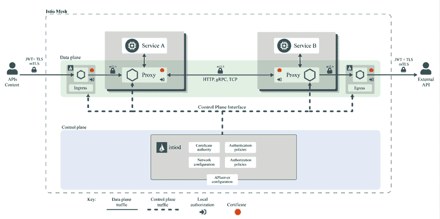

# 14

# 使用服务网格

在上一章中，我们讨论了监控和可观察性。全面监控的一个障碍是它需要对与业务逻辑无关的代码进行大量更改。

在本章中，我们将学习服务网格如何让你将许多横切关注点从应用程序代码中外部化。服务网格是设计、演化和操作 Kubernetes 上的分布式系统的一种真正的范式转变。我喜欢把它看作是云原生分布式系统的面向切面的编程。我们还将深入探讨 Istio 服务网格。我们将涵盖的主题有：

+   什么是服务网格？

+   选择一个服务网格

+   理解 Istio 架构

+   将 Istio 集成到你的 Kubernetes 集群中

+   使用 Istio

让我们直接进入正题。

# 什么是服务网格？

服务网格是一种适用于由多个微服务组成的大规模云原生应用程序的架构模式。当你的应用程序按微服务集合的结构组织时，Kubernetes 集群内的微服务之间的边界会发生许多交互。这与传统的单体应用程序不同，后者大多数工作由单个操作系统进程完成。

以下是与每个微服务或微服务之间的交互相关的一些问题：

+   高级负载均衡

+   服务发现

+   支持金丝雀部署

+   缓存

+   跨多个微服务追踪请求

+   服务之间的身份验证

+   限制服务在给定时间内处理的请求数量

+   自动重试失败的请求

+   当一个组件持续失败时，切换到一个备用组件

+   收集指标

所有这些问题与服务的领域逻辑完全无关，但它们都非常重要。一种天真的做法是直接在每个微服务中编写所有这些问题的代码。这显然无法扩展。因此，一种典型的做法是将所有这些功能打包成一个大型库或一组库，并在每个服务中使用这些库。


图 14.1：典型的基于库的架构

大型库方法存在几个问题：

+   你需要在所有使用的编程语言中实现这个库，并确保它们是兼容的

+   如果你想更新你的库，你必须为所有服务更新版本

+   如果库的新版本不向后兼容，则很难逐步升级服务

与此相比，服务网格不会直接接触到你的应用程序。它会将一个边车代理容器注入到每个 Pod 中，并使用服务网格控制器。代理拦截所有 Pod 之间的通信，并与网格控制器协作，可以处理所有横切关注点。


图 14.2：边车服务网格架构

以下是代理注入方法的一些属性：

+   应用程序对服务网格一无所知

+   你可以为每个 pod 开启或关闭网格，并独立更新网格

+   无需在每个节点上部署代理

+   同一节点上的不同 pod 可以有不同的 sidecar（或版本）

+   每个 pod 都有自己的一份代理

在 Kubernetes 上，它看起来是这样的：


图 14.3：Kubernetes 中的服务网格架构

还有一种方式将服务网格代理实现为节点代理，而不是注入到每个 pod 中。这种方式较为少见，但在某些情况下（特别是在非 Kubernetes 环境中），它是有用的。它可以节省在运行许多小 pod 的节点上的资源，因为所有 sidecar 容器的开销会累计起来。


图 14.4：节点代理服务网格架构

在服务网格的世界中，有一个控制平面，通常是 Kubernetes 上的一组控制器，还有一个数据平面，它由连接网格中所有服务的代理组成。数据平面由所有拦截服务之间通信的 sidecar 容器（或节点代理）组成。控制平面负责管理代理，并配置当任何服务之间的流量或服务与外部世界的流量被拦截时实际发生的情况。

现在，我们已经对服务网格是什么、如何工作以及它为何如此有用有了清晰的了解，让我们回顾一下目前存在的一些服务网格。

# 选择一个服务网格

服务网格的概念相对较新，但目前已有许多选择。我们将在本章后面使用 Istio。不过，你也许更喜欢为你的用例选择其他的服务网格。下面是对当前几种服务网格的简要回顾。

## Envoy

Envoy ([`www.envoyproxy.io`](https://www.envoyproxy.io)) 是另一个 CNCF 毕业的项目。它是一个非常多用途且高性能的 L7 代理。它提供了许多服务网格功能；然而，它被认为是较低级别且配置起来较为困难的。它也不是专门针对 Kubernetes 的。一些 Kubernetes 服务网格使用 Envoy 作为底层数据平面，并提供一个 Kubernetes 原生的控制平面来配置和与其交互。如果你想直接在 Kubernetes 上使用 Envoy，推荐使用其他开源项目，如 Ambassador 和 Gloo，作为入口控制器和/或 API 网关。

## Linkerd 2

Linkerd 2 ([`linkerd.io`](https://linkerd.io)) 是一个专为 Kubernetes 设计的服务，同时也是 CNCF 孵化项目。它由 Buoyant ([`buoyant.io`](https://buoyant.io)) 开发。Buoyant 是“服务网格”这个术语的创始人，并将其引入了全球。他们从一个基于 Scala 的多平台服务网格 Linkerd 开始，其中包括 Kubernetes。但他们决定开发一个更好、更高效的服务网格，专门针对 Kubernetes。这就是 Linkerd 2 的由来，它是专为 Kubernetes 设计的。他们使用 Rust 实现了数据平面（代理层），并使用 Go 实现了控制平面。

## Kuma

Kuma ([`kuma.io/`](https://kuma.io/)) 是一个由 Envoy 提供支持的开源服务网格。它最初由 Kong 开发，Kong 在 Kuma 的基础上提供了一个名为 Kong Mesh 的企业产品。它不仅可以在 Kubernetes 上运行，也可以在其他环境中使用。它的特点是配置非常简单，并且允许在同一个网格中混合使用 Kubernetes 和基于虚拟机的系统。

## AWS App Mesh

当然，AWS 也有自己的专有服务网格——AWS App Mesh ([`aws.amazon.com/app-mesh`](https://aws.amazon.com/app-mesh))。App Mesh 同样使用 Envoy 作为其数据平面。它可以运行在 EC2、Fargate、ECS 和 EKS 以及普通 Kubernetes 上。App Mesh 在服务网格领域稍显迟到，因此还没有其他一些服务网格那么成熟，但它正在赶上。它基于强大的 Envoy，并且由于与 AWS 服务的紧密集成，可能是最佳选择。

## Mæsh

Mæsh ([`mae.sh`](https://mae.sh)) 由 Træfik ([`containo.us/traefik`](https://containo.us/traefik)) 的开发者开发。它的有趣之处在于，它采用了节点代理方式，而不是 Sidecar 容器。它在很大程度上依赖于 Traefik 中间件来实现服务网格功能。你可以通过在服务上使用注解来配置它。如果你在集群边缘使用 Traefik，这可能是尝试服务网格的一种有趣且轻量级的方法。

## Istio

Istio ([`istio.io/`](https://istio.io/)) 是 Kubernetes 上最著名的服务网格。它建立在 Envoy 之上，并允许你通过 YAML 清单以 Kubernetes 原生方式进行配置。Istio 由 Google、IBM 和 Lyft（Envoy 开发者）发起。它在 Google GKE 上可以一键安装，但在 Kubernetes 社区的任何环境中都有广泛应用。它也是 Knative 的默认入口/API 网关解决方案，这进一步促进了它的采用。

## OSM (Open Service Mesh)

OSM ([`openservicemesh.io`](https://openservicemesh.io)) 是另一个基于 Envoy 的服务网格。它可以通过 **SMI** (**Service Mesh Interface** 服务网格接口) 进行配置，SMI 是一个旨在提供与提供者无关的 API 集合的规范，用于配置服务网格。详情请参见 [`smi-spec.io`](https://smi-spec.io)。OSM 和 SMI 都是 CNCF 沙盒项目。

OSM 是由微软开发并贡献给 CNCF 的。

## Cilium 服务网格

Cilium 服务网格 ([`isovalent.com/blog/post/cilium-service-mesh`](https://isovalent.com/blog/post/cilium-service-mesh)) 是服务网格领域的新兴者。它由 Isovalent ([`isovalent.com`](https://isovalent.com)) 开发。它的特点是尝试将 eBPF 的好处引入服务网格，并采用无边车的方式。虽然它仍处于早期阶段，并且不如其他服务网格成熟，但它有一个有趣的概念，即允许你使用自有的控制平面。它可以与 Istio 集成，并与边车进行互操作。值得关注。

在讨论了各种服务网格选择后，让我们来试试 Istio。我们选择 Istio 的原因是它是最成熟的服务网格之一，拥有一个庞大的社区、众多用户，并且得到了行业领导者的支持。

# 了解 Istio 架构

在本节中，我们将更深入地了解 Istio。

首先，让我们认识一下 Istio 的主要组件，了解它们的功能以及它们之间的关系。

Istio 是一个大型框架，提供了很多功能，并且包含多个相互交互的部分，这些部分与 Kubernetes 组件（大多是间接和不显眼地）交互。它被分为控制平面和数据平面。数据平面是一组代理（每个 pod 一个）。它们的控制平面是一组负责配置代理和收集遥测数据的组件。

以下图表展示了 Istio 的不同部分，它们之间的关系以及它们之间交换的信息。


图 14.5：Istio 架构

如你所见，主要有两个组件：Envoy 代理，它是附加到每个服务实例（每个 pod）的边车容器，以及 istiod，它负责服务发现、配置和证书管理。Istiod 是一个单一的二进制文件，实际上包含了多个组件：Pilot、Citadel 和 Galley。这些组件曾经是独立的二进制文件，在 Istio 1.5 中被合并为一个二进制文件，以简化安装、运行和升级 Istio 的体验。

让我们深入了解一下每个组件，从 Envoy 代理开始。

### Envoy

当我们回顾 Kubernetes 的服务网格时，我们简要讨论了 Envoy。在这里，它作为 Istio 的数据平面。Envoy 是用 C++ 实现的，是一个高性能的代理。对于服务网格中的每个 pod，Istio 会注入（通过自动或通过 istioctl CLI）一个 Envoy 边车容器，负责处理繁重的工作。

以下是 Envoy 执行的一些任务：

+   在 pods 之间代理 HTTP、HTTP/2 和 gRPC 流量

+   精密的负载均衡

+   mTLS 终止

+   HTTP/2 和 gRPC 代理

+   提供服务健康状况

+   对于不健康服务的断路器

+   基于百分比的流量整形

+   注入故障以进行测试

+   详细的度量指标

Envoy 代理控制所有进出其 pod 的通信。它是目前 Istio 中最重要的组件。Envoy 的配置并非简单，这也是 Istio 控制平面所处理的主要内容之一。

下一个组件是 Pilot。

### Pilot

Pilot 负责平台无关的服务发现、动态负载均衡和路由。它将高级路由规则转换为 Envoy 配置。这一抽象层使得 Istio 可以在多个编排平台上运行。Pilot 获取所有平台特定的信息，将其转换为 Envoy 数据平面配置格式，并通过 Envoy 数据平面 API 将其传播到每个 Envoy 代理。Pilot 是无状态的；在 Kubernetes 中，所有配置都作为**自定义资源定义**（**CRDs**）存储在 etcd 中。

下一个组件是 Citadel。

### Citadel

Citadel 负责证书和密钥管理，是 Istio 安全的核心部分。Citadel 集成了多个平台，并与它们的身份机制保持一致。例如，在 Kubernetes 中，它使用服务账户；在 AWS 中，它使用 AWS IAM；在 Azure 中，它使用 AAD；在 GCP/GKE 中，它可以使用 GCP IAM。Istio PKI 基于 Citadel，它使用 SPIFEE 格式的 X.509 证书作为服务身份的载体。

这是 Kubernetes 中强身份到 envoy 代理的工作流程：

1.  Citadel 为现有服务账户创建证书和密钥对。

1.  Citadel 监视 Kubernetes API 服务器，查看是否有新的服务账户需要配置证书和密钥对。

1.  Citadel 将证书和密钥作为 Kubernetes 秘密存储。

1.  Kubernetes 将秘密挂载到与服务账户关联的每个新 pod 中（这是标准的 Kubernetes 做法）。

1.  Citadel 在证书过期时自动轮换 Kubernetes 秘密。

1.  Pilot 生成安全的命名信息，将服务账户与 Istio 服务关联。然后，Pilot 将安全的命名信息传递给 Envoy 代理。

我们将介绍的最后一个主要组件是 Galley。

### Galley

Galley 负责抽象不同平台上的用户配置。它将处理过的配置提供给 Pilot。这是一个相当简单的组件。

现在我们已经将 Istio 拆解成其主要组件，让我们动手操作 Istio，并将其集成到 Kubernetes 集群中。

# 将 Istio 集成到你的 Kubernetes 集群中

在本节中，我们将安装 Istio 到一个全新的集群，并探索它提供的所有服务功能。

## 为 Istio 准备 minikube 集群

我们将使用 minikube 集群来检查 Istio。在安装 Istio 之前，我们应该确保我们的集群有足够的容量来处理 Istio 及其示例应用程序 BookInfo。我们将以 16 GB 内存和四个 CPU 启动 minikube，这应该是足够的。确保你正在使用的 Docker 虚拟机（例如，Rancher Desktop）有足够的 CPU 和内存：

```
$ minikube start --memory=16384 --cpus=4 
```

Minikube 可以为 Istio 提供负载均衡器。让我们在一个单独的终端中运行这个命令，因为它会阻塞（在完成之前不要停止隧道）：

```
$ minikube tunnel
  Tunnel successfully started
  NOTE: Please do not close this terminal as this process must stay alive for the tunnel to be accessible ... 
```

有时 Minikube 没有清理隧道网络，所以在停止集群后，建议运行以下命令：

```
minikube tunnel --cleanup 
```

## 安装 Istio

在 Minikube 启动并运行后，我们可以安装 Istio 本身。有多种方式可以安装 Istio：

+   使用 istioctl（Istio CLI）进行自定义安装

+   使用 Istio 运维器通过 Helm 进行自定义安装（支持，但不推荐）

+   多集群安装

+   外部控制平面

+   虚拟机安装

我们将选择推荐的 istioctl 选项。Istio 版本可能高于 1.15：

```
$ curl -L https://istio.io/downloadIstio | sh - 
```

istioctl 工具位于`istio-1.15.2/bin`（下载时版本可能不同）。确保它在你的路径中。Kubernetes 安装清单位于`istio-1.15.2/install/kubernetes`，示例位于`istio-1.15.2/samples`。

让我们先运行一些安装前的检查：

```
$ istioctl x precheck
 No issues found when checking the cluster. Istio is safe to install or upgrade!
  To get started, check out https://istio.io/latest/docs/setup/getting-started/ 
```

我们将安装内置的 demo 配置文件，这对于评估 Istio 非常有用：

```
$ istioctl install --set profile=demo -y
 Istio core installed
 Istiod installed
 Egress gateways installed
 Ingress gateways installed
 Installation complete
Making this installation the default for injection and validation.
Thank you for installing Istio 1.15 
```

让我们还安装一些可观察性插件，如`prometheus`、`grafana`、`jaeger`和`kiali`：

```
$ k apply -f https://raw.githubusercontent.com/istio/istio/release-1.15/samples/addons/prometheus.yaml
serviceaccount/prometheus created
configmap/prometheus created
clusterrole.rbac.authorization.k8s.io/prometheus created
clusterrolebinding.rbac.authorization.k8s.io/prometheus created
service/prometheus created
deployment.apps/prometheus created
$ kapply -f https://raw.githubusercontent.com/istio/istio/release-1.15/samples/addons/grafana.yaml
serviceaccount/grafana created
configmap/grafana created
service/grafana created
deployment.apps/grafana created
configmap/istio-grafana-dashboards created
configmap/istio-services-grafana-dashboards created
$ k apply -f https://raw.githubusercontent.com/istio/istio/release-1.15/samples/addons/jaeger.yaml
deployment.apps/jaeger created
service/tracing created
service/zipkin created
service/jaeger-collector created
$ k apply -f https://raw.githubusercontent.com/istio/istio/release-1.15/samples/addons/kiali.yaml
serviceaccount/kiali created
configmap/kiali created
clusterrole.rbac.authorization.k8s.io/kiali-viewer created
clusterrole.rbac.authorization.k8s.io/kiali created
clusterrolebinding.rbac.authorization.k8s.io/kiali created
role.rbac.authorization.k8s.io/kiali-controlplane created
rolebinding.rbac.authorization.k8s.io/kiali-controlplane created
service/kiali created
deployment.apps/kiali created 
```

让我们检查一下集群，看看实际安装了哪些内容。Istio 将自己安装在`istio-system`命名空间中，这非常方便，因为它安装了很多内容。让我们看看 Istio 安装了哪些服务：

```
$ k get svc -n istio-system -o name
service/grafana
service/istio-egressgateway
service/istio-ingressgateway
service/istiod
service/jaeger-collector
service/kiali
service/prometheus
service/tracing
service/zipkin 
```

有很多以`istio-`为前缀的服务，后面跟着其他一些服务：

+   Prometheus

+   Grafana

+   Jaeger

+   Zipkin

+   跟踪

+   Kiali

好的，我们已经成功安装了 Istio 和各种集成。接下来，让我们在集群中安装 BookInfo 应用程序，这是 Istio 的示例应用程序。

## 安装 BookInfo

BookInfo 是一个简单的基于微服务的应用程序，正如其名字所示，它展示了一本书的基本信息，如名称、描述、ISBN，甚至是评论。BookInfo 的开发者真正拥抱了多语言编程的理念，每个微服务都是用不同的编程语言实现的：

+   用 Python 编写的 ProductPage 服务

+   用 Java 编写的 Reviews 服务

+   用 Ruby 编写的 Details 服务

+   用 JavaScript（Node.js）编写的 Ratings 服务

以下图表描述了 BookInfo 服务之间的关系和信息流动：


图 14.6：BookInfo 服务之间信息流动的示意图

我们将把它安装在自己的`bookinfo`命名空间中。让我们先创建该命名空间，然后通过向命名空间添加标签来启用 Istio 自动注入边车代理：

```
$ k create ns bookinfo
namespace/bookinfo created
$ k label namespace bookinfo istio-injection=enabled
namespace/bookinfo labeled 
```

安装应用程序本身是一个简单的一行命令：

```
$ k apply -f https://raw.githubusercontent.com/istio/istio/release-1.15/samples/bookinfo/platform/kube/bookinfo.yaml -n bookinfo
service/details created
serviceaccount/bookinfo-details created
deployment.apps/details-v1 created
service/ratings created
serviceaccount/bookinfo-ratings created
deployment.apps/ratings-v1 created
service/reviews created
serviceaccount/bookinfo-reviews created
deployment.apps/reviews-v1 created
deployment.apps/reviews-v2 created
deployment.apps/reviews-v3 created
service/productpage created
serviceaccount/bookinfo-productpage created
deployment.apps/productpage-v1 created 
```

好的，应用已经成功部署，包括为每个服务创建了单独的服务账户。正如你所看到的，已经部署了三个版本的 reviews 服务。稍后在我们进行升级、高级路由和部署模式时，这将非常有用。

在继续之前，我们仍然需要等待所有 pod 初始化完成，然后 Istio 将注入它的 sidecar 代理容器。当一切就绪时，你应该看到类似这样的内容：

```
$ k get po -n bookinfo
NAME                             READY   STATUS    RESTARTS   AGE
details-v1-5ffd6b64f7-c62l6      2/2     Running   0          3m48s
productpage-v1-979d4d9fc-7hzkj   2/2     Running   0          3m48s
ratings-v1-5f9699cfdf-mns6n      2/2     Running   0          3m48s
reviews-v1-569db879f5-jmfrj      2/2     Running   0          3m48s
reviews-v2-65c4dc6fdc-cc8nn      2/2     Running   0          3m48s
reviews-v3-c9c4fb987-bpk9f       2/2     Running   0          3m48s 
```

请注意，在 `READY` 列下，每个 pod 显示为 2/2，这意味着每个 pod 中有两个容器。一个是应用程序容器，另一个是注入的代理。

由于我们将在 `bookinfo` 命名空间中操作，让我们定义一个小别名，这样会让我们的操作更简单：

```
$ alias kb='kubectl -n bookinfo' 
```

现在，凭借我们的小`kb`别名，我们可以验证是否可以从评分服务获取产品页面：

```
$ kb exec -it $(kb get pod -l app=ratings -o jsonpath='{.items[0].metadata.name}') -c ratings -- curl productpage:9080/productpage | grep -o "<title>.*</title>"
<title>Simple Bookstore App</title> 
```

但应用程序目前还不能从外部访问。这时，Istio 网关就派上用场了。让我们来部署它：

```
$ kb apply -f https://raw.githubusercontent.com/istio/istio/release-1.15/samples/bookinfo/networking/bookinfo-gateway.yaml
gateway.networking.istio.io/bookinfo-gateway created
virtualservice.networking.istio.io/bookinfo created 
```

让我们获取从外部访问应用程序的 URL：

```
$ export INGRESS_HOST=$(kubectl -n istio-system get service istio-ingressgateway -o jsonpath='{.status.loadBalancer.ingress[0].ip}')
$ export INGRESS_PORT=$(kubectl -n istio-system get service istio-ingressgateway -o jsonpath='{.spec.ports[?(@.name=="http2")].port}')
$ export SECURE_INGRESS_PORT=$(kubectl -n istio-system get service istio-ingressgateway -o jsonpath='{.spec.ports[?(@.name=="https")].port}')
$ export GATEWAY_URL=${INGRESS_HOST}:${INGRESS_PORT} 
```

现在我们可以从外部尝试访问：

```
$ http http://${GATEWAY_URL}/productpage | grep -o "<title>.*</title>"
<title>Simple Bookstore App</title> 
```

你也可以在浏览器中打开 URL，查看一些关于莎士比亚《错误的喜剧》的信息：


图 14.7：BookInfo 评论示例

好的，我们已经准备好开始探索 Istio 带来的功能。

# 与 Istio 配合使用

在本节中，我们将使用 Istio 资源和策略，并利用它们来改善 BookInfo 应用程序的操作。

让我们从流量管理开始。

## 流量管理

Istio 流量管理是根据你定义的目标规则将流量路由到你的服务。Istio 为你的所有服务及其端点保持服务注册表。基本流量管理允许服务之间的流量，并在每个服务实例之间进行简单的轮询负载均衡。但 Istio 能做更多。Istio 的流量管理 API 包含五个资源：

+   虚拟服务

+   目标规则

+   网关

+   服务条目

+   Sidecar 容器

让我们首先为 BookInfo 应用默认的目标规则：

```
$ kb apply -f https://raw.githubusercontent.com/istio/istio/release-1.15/samples/bookinfo/networking/destination-rule-all.yaml
destinationrule.networking.istio.io/productpage created
destinationrule.networking.istio.io/reviews created
destinationrule.networking.istio.io/ratings created
destinationrule.networking.istio.io/details created 
```

然后，让我们创建表示网格中服务的 Istio 虚拟服务：

```
$ kb apply -f https://raw.githubusercontent.com/istio/istio/release-1.15/samples/bookinfo/networking/virtual-service-all-v1.yaml
virtualservice.networking.istio.io/productpage created
virtualservice.networking.istio.io/reviews created
virtualservice.networking.istio.io/ratings created
virtualservice.networking.istio.io/details created 
```

我们需要等一会儿，直到虚拟服务配置传播完成。然后，让我们使用 neat 的 kubectl 插件查看产品页面虚拟服务。如果你还没有安装它，请按照 [`github.com/itaysk/kubectl-neat`](https://github.com/itaysk/kubectl-neat) 上的说明操作。

```
$ kb get virtualservices productpage -o yaml | k neat
apiVersion: networking.istio.io/v1beta1
kind: VirtualService
metadata:
  name: productpage
  namespace: default
spec:
  hosts:
  - productpage
  http:
  - route:
    - destination:
        host: productpage
        subset: v1 
```

这非常简单，指定 HTTP 路径和版本。v1 子集对于评论服务非常重要，因为评论服务有多个版本。产品页面服务将访问其 v1 版本，因为该子集已被配置。

让我们做得更有趣一些，根据登录用户进行路由。Istio 本身没有用户身份的概念，但它是根据请求头来路由流量的。BookInfo 应用程序为所有请求添加了一个最终用户头部。

以下命令将更新路由规则：

```
$ kb apply -f https://raw.githubusercontent.com/istio/istio/release-1.15/samples/bookinfo/networking/virtual-service-reviews-test-v2.yaml
virtualservice.networking.istio.io/reviews configured 
```

让我们检查一下新的规则：

```
$ kb get virtualservice reviews -o yaml | k neat
apiVersion: networking.istio.io/v1beta1
kind: VirtualService
metadata:
  name: reviews
  namespace: default
spec:
  hosts:
  - reviews
  http:
  - match:
    - headers:
        end-user:
          exact: jason
    route:
    - destination:
        host: reviews
        subset: v2
  - route:
    - destination:
        host: reviews
        subset: v1 
```

如你所见，如果 HTTP 头部的 `end-user` 与 `jason` 匹配，则请求将路由到评论服务的子集 2，否则路由到子集 1。评论服务的版本 2 在页面的评论部分添加了星级评分。为了测试它，我们可以以用户 `jason` 登录（密码可以任意），刷新浏览器，并看到评论旁边有星级评分：


图 14.8：带星级评分的示例 BookInfo 评论

Istio 在流量管理领域可以做更多的事情：

+   测试目的的故障注入

+   HTTP 和 TCP 流量转移（逐步将流量从一个版本转移到下一个版本）

+   请求超时

+   电路断路

+   流量镜像

除了内部流量管理，Istio 还支持配置进入集群和从集群退出的流量，包括使用 TLS 和互斥 TLS 的安全选项。

## 安全性

安全性是 Istio 的核心组成部分。它提供身份管理、身份验证和授权、安全策略以及加密。安全支持分布在多个层级，采用多个行业标准协议和最佳实践安全原则，如深度防御、默认安全和零信任。

以下是 Istio 安全架构的全貌：



图 14.9：Istio 安全架构

Istio 通过以下功能实现强大的安全性：

+   Sidecar 和边界代理实现了客户端和服务器之间经过认证和授权的通信

+   控制平面管理密钥和证书

+   控制平面将安全策略和安全命名信息分发给代理

+   控制平面管理审计

让我们逐步解析。

### Istio 身份

Istio 利用安全命名，将通过服务发现机制（例如 DNS）定义的服务名称映射到基于证书的服务器身份。客户端验证服务器身份。服务器可以配置为验证客户端的身份。所有的安全策略都适用于给定的身份。服务器根据客户端的身份决定其访问权限。

Istio 身份模型可以利用其运行平台上现有的身份基础设施。在 Kubernetes 上，当然是使用 Kubernetes 服务账户。

Istio 安全地为每个工作负载分配一个 x.509 证书，代理与 Envoy 代理一起运行。该代理与 istiod 协作，自动配置和轮换证书和私钥。

### Istio 证书管理

以下是证书和密钥配置的工作流程：

1.  istiod 提供一个 gRPC 服务，监听 **证书签名请求** (**CSRs**)。

1.  该过程从 Istio 代理开始，启动时生成一个私钥和一个证书签名请求（CSR）。然后，它将 CSR 与其自身的凭证一起传输给 istiod 的 CSR 服务。

1.  此时，istiod **证书授权机构**（**CA**）检查 CSR 中包含的代理凭据。如果凭据有效，istiod CA 将继续签署 CSR，从而创建证书。

1.  当工作负载启动时，位于同一容器内的 Envoy 代理利用 Envoy **SDS**（**秘密发现服务**）API，从 Istio 代理请求证书和相应的密钥。

1.  Istio 代理会主动监控工作负载证书的过期情况，启动定期刷新证书和密钥的过程，确保它们保持最新。

### Istio 身份验证

安全身份模型是 Istio 身份验证框架的基础。Istio 支持两种身份验证模式：对等身份验证和请求身份验证。

#### 对等身份验证

对等身份验证用于服务间身份验证。它的一个亮点是，Istio 无需修改代码即可提供此功能。它确保只有在您配置了身份验证策略的服务之间，服务间的通信才会发生。

这是对 reviews 服务的身份验证策略，要求使用双向 TLS：

```
apiVersion: security.istio.io/v1beta1
kind: PeerAuthentication
metadata:
  name: "example-peer-policy"
  namespace: "foo"
spec:
  selector:
    matchLabels:
      app: reviews
  mtls:
    mode: STRICT 
```

#### 请求身份验证

请求身份验证用于终端用户的身份验证。Istio 将验证发起请求的终端用户是否被允许进行该请求。这种请求级别的身份验证使用**JWT**（**JSON Web Token**）并支持许多 OpenID Connect 后端。

一旦呼叫者的身份被确定，身份验证框架将其和其他声明传递到链中的下一个环节——授权框架。

### Istio 授权

Istio 可以在多个层级上授权请求：

+   整个网格

+   整个命名空间

+   工作负载级别

这是 Istio 的授权架构：


图 14.10：Istio 授权架构

授权基于授权策略。每个策略都有一个选择器（适用的工作负载）和规则（谁被允许访问某个资源以及在什么条件下）。

如果在工作负载上没有定义策略，则允许所有请求。但是，如果为工作负载定义了策略，则只有符合策略中规则的请求才被允许。您还可以定义排除规则。

这是一个授权策略，允许两个来源（服务账户`cluster.local/ns/default/sa/sleep`和命名空间`dev`）在请求携带有效的 JWT 令牌时，访问具有标签`app: httpbin`和`version: v1`的工作负载，且该请求来自命名空间`foo`。

```
apiVersion: security.istio.io/v1beta1
kind: AuthorizationPolicy
metadata:
 name: httpbin
 namespace: foo
spec:
 selector:
   matchLabels:
     app: httpbin
     version: v1
 action: ALLOW
 rules:
 - from:
   - source:
       principals: ["cluster.local/ns/default/sa/sleep"]
   - source:
       namespaces: ["dev"]
   to:
   - operation:
       methods: ["GET"]
   when:
   - key: request.auth.claims[iss]
     values: ["https://accounts.google.com"] 
```

授权粒度不必限制在工作负载级别。我们也可以限制对特定端点和方法的访问。除了精确匹配外，我们还可以使用前缀匹配、后缀匹配或存在匹配来指定操作。例如，以下策略允许访问所有以`/test/`开头和以`/info`结尾的路径。允许的请求方法只有`GET`和`HEAD`：

```
apiVersion: security.istio.io/v1beta1
kind: AuthorizationPolicy
metadata:
  name: tester
  namespace: default
spec:
  selector:
    matchLabels:
      app: products
  rules:
  - to:
    - operation:
        paths: ["/test/*", "*/info"]
        methods: ["GET", "HEAD"] 
```

如果我们想做得更复杂一点，可以指定条件。例如，我们可以仅允许带有特定头部的请求。这里有一个要求版本头部的策略，值为 v1 或 v2：

```
apiVersion: security.istio.io/v1beta1
kind: AuthorizationPolicy
metadata:
 name: httpbin
 namespace: foo
spec:
 selector:
   matchLabels:
     app: httpbin
     version: v1
 rules:
 - from:
   - source:
       principals: ["cluster.local/ns/default/sa/sleep"]
   to:
   - operation:
       methods: ["GET"]
   when:
   - key: request.headers[version]
     values: ["v1", "v2"] 
```

对于 TCP 服务，操作的 `paths` 和 `methods` 字段不适用。Istio 会忽略它们。但是，我们可以为特定端口指定策略：

```
apiVersion: "security.istio.io/v1beta1"
kind: AuthorizationPolicy
metadata:
  name: mongodb-policy
  namespace: default
spec:
 selector:
   matchLabels:
     app: mongodb
 rules:
 - from:
   - source:
       principals: ["cluster.local/ns/default/sa/bookinfo-ratings-v2"]
   to:
   - operation:
       ports: ["27017"] 
```

让我们看看 Istio 提供巨大价值的一个领域——遥测。

## 监控与可观测性

为应用程序添加遥测监控是一项吃力不讨好的工作。工作量巨大。你需要记录日志、收集指标，并创建用于追踪的跨度。全面的可观测性对于故障排除和缓解事件至关重要，但这远非易事：

+   一开始做这件事需要时间和精力

+   确保它在集群中所有服务间保持一致需要更多的时间和精力

+   你可能会错过一个重要的监控点，或者配置不正确

+   如果你想更换日志提供者或分布式追踪解决方案，可能需要修改所有服务

+   它会使你的代码充满杂乱的内容，从而掩盖业务逻辑

+   你可能需要显式地关闭它用于测试

如果这一切都能自动处理，并且不需要任何代码更改，那会怎么样？这就是服务网格遥测的承诺。当然，你可能需要在应用程序/服务层做一些工作，尤其是当你想捕获自定义指标或进行特定日志记录时。如果你的系统被划分为沿着真正代表你的领域和工作流的边界的连贯微服务，那么 Istio 可以帮助你从一开始就获得不错的监控工具。其核心思想是，Istio 可以跟踪服务间的连接点发生了什么。

### Istio 访问日志

我们可以捕获 Envoy 代理的访问日志，从每个工作负载的角度展示网络流量的情况。

在本节中，我们将使用两个新的工作负载：`sleep` 和 `httpbin`。让我们部署它们：

```
$ kb apply -f https://raw.githubusercontent.com/istio/istio/release-1.15/samples/sleep/sleep.yaml
serviceaccount/sleep created
service/sleep created
deployment.apps/sleep created
$ kb apply -f https://raw.githubusercontent.com/istio/istio/release-1.15/samples/httpbin/httpbin.yaml
serviceaccount/httpbin created
service/httpbin created
deployment.apps/httpbin created 
```

此外，让我们将 `OpenTelemetry` 收集器部署到 `istio-system` 命名空间：

```
$ k apply -f https://raw.githubusercontent.com/istio/istio/release-1.15/samples/open-telemetry/otel.yaml -n istio-system
configmap/opentelemetry-collector-conf created
service/opentelemetry-collector created
deployment.apps/opentelemetry-collector created 
```

Istio 在 Istio ConfigMap 中配置了提供者和更多内容，ConfigMap 中已经包含了 `opentelemetry-collector` 服务的提供者条目。让我们使用 `yq` ([`github.com/mikefarah/yq`](https://github.com/mikefarah/yq)) 来查看 ConfigMap 的数据字段：

```
$ k get cm istio -n istio-system -o yaml | yq .data
mesh: |-
  accessLogFile: /dev/stdout
  defaultConfig:
    discoveryAddress: istiod.istio-system.svc:15012
    proxyMetadata: {}
    tracing:
      zipkin:
        address: zipkin.istio-system:9411
  enablePrometheusMerge: true
  extensionProviders:
  - envoyOtelAls:
      port: 4317
      service: opentelemetry-collector.istio-system.svc.cluster.local
    name: otel
  rootNamespace: istio-system
  trustDomain: cluster.local
meshNetworks: 'networks: {}' 
```

要启用从 `sleep` 工作负载到 `otel` 收集器的日志记录，我们需要配置一个 `Telemetry` 资源：

```
$ cat <<EOF | kb apply -f -
apiVersion: telemetry.istio.io/v1alpha1
kind: Telemetry
metadata:
  name: sleep-logging
spec:
  selector:
    matchLabels:
      app: sleep
  accessLogging:
    - providers:
      - name: otel
EOF
telemetry.telemetry.istio.io/sleep-logging created 
```

默认的访问日志格式是：

```
[%START_TIME%] \"%REQ(:METHOD)% %REQ(X-ENVOY-ORIGINAL-PATH?:PATH)% %PROTOCOL%\" %RESPONSE_CODE% %RESPONSE_FLAGS% %RESPONSE_CODE_DETAILS% %CONNECTION_TERMINATION_DETAILS%
\"%UPSTREAM_TRANSPORT_FAILURE_REASON%\" %BYTES_RECEIVED% %BYTES_SENT% %DURATION% %RESP(X-ENVOY-UPSTREAM-SERVICE-TIME)% \"%REQ(X-FORWARDED-FOR)%\" \"%REQ(USER-AGENT)%\" \"%REQ(X-REQUEST-ID)%\"
\"%REQ(:AUTHORITY)%\" \"%UPSTREAM_HOST%\" %UPSTREAM_CLUSTER% %UPSTREAM_LOCAL_ADDRESS% %DOWNSTREAM_LOCAL_ADDRESS% %DOWNSTREAM_REMOTE_ADDRESS% %REQUESTED_SERVER_NAME% %ROUTE_NAME%\n 
```

这很冗长，但在调试或故障排除时，你希望获得尽可能多的信息。如果你想更改日志格式，它是可配置的。

好的，让我们试试。`sleep`工作负载实际上只是一个 pod，我们可以从中向 httpbin 应用程序发起网络请求。httpbin 服务运行在`8000`端口，并在集群内被称为`httpbin`。我们将从`sleep` pod 查询`httpbin`，了解著名的 418 HTTP 状态码 ([`developer.mozilla.org/en-US/docs/Web/HTTP/Status/418`](https://developer.mozilla.org/en-US/docs/Web/HTTP/Status/418)):

```
$ kb exec deploy/sleep -c sleep -- curl -sS -v httpbin:8000/status/418
*   Trying 10.101.189.162:8000...
* Connected to httpbin (10.101.189.162) port 8000 (#0)
> GET /status/418 HTTP/1.1
> Host: httpbin:8000
> User-Agent: curl/7.86.0-DEV
> Accept: */*
>
    -=[ teapot ]=-
       _...._
     .'  _ _ `.
    | ."` ^ `". _,
    \_;`"---"`|//
      |       ;/
      \_     _/
        `"""`
* Mark bundle as not supporting multiuse
< HTTP/1.1 418 Unknown
< server: envoy
< date: Sat, 29 Oct 2022 04:35:07 GMT
< x-more-info: http://tools.ietf.org/html/rfc2324
< access-control-allow-origin: *
< access-control-allow-credentials: true
< content-length: 135
< x-envoy-upstream-service-time: 61
<
{ [135 bytes data]
* Connection #0 to host httpbin left intact 
```

耶，我们得到了预期的茶壶响应。现在，让我们检查访问日志：

```
$ k logs -l app=opentelemetry-collector -n istio-system
LogRecord #0
ObservedTimestamp: 1970-01-01 00:00:00 +0000 UTC
Timestamp: 2022-10-29 04:35:07.599108 +0000 UTC
Severity:
Body: [2022-10-29T04:35:07.599Z] "GET /status/418 HTTP/1.1" 418 - via_upstream - "-" 0 135 63 61 "-" "curl/7.86.0-DEV" "d36495d6-642a-9790-9b9a-d10b2af096f5" "httpbin:8000" "172.17.0.17:80" outbound|8000||httpbin.bookinfo.svc.cluster.local 172.17.0.16:33876 10.101.189.162:8000 172.17.0.16:45986 - default
Trace ID:
Span ID:
Flags: 0 
```

如你所见，我们根据默认访问日志格式获得了大量信息，包括时间戳、请求 URL、响应状态、用户代理以及源和目标的 IP 地址。

在生产系统中，你可能希望将收集器的日志转发到集中式日志系统。让我们看看 Istio 在度量方面提供了什么。

### 度量

Istio 收集三种类型的度量：

+   代理度量

+   控制面度量

+   服务度量

收集的度量涵盖了所有进出服务网格的流量。作为操作员，我们需要为度量收集配置 Istio。我们之前安装了 Prometheus 和 Grafana 来进行度量收集和可视化后端。Istio 遵循四个黄金信号原则，记录延迟、流量、错误和饱和度。

让我们看一个代理级别（Envoy）度量的示例：

```
envoy_cluster_internal_upstream_rq{response_code_class="2xx",cluster_name="xds-grpc"} 7163
envoy_cluster_upstream_rq_completed{cluster_name="xds-grpc"} 7164
envoy_cluster_ssl_connection_error{cluster_name="xds-grpc"} 0
envoy_cluster_lb_subsets_removed{cluster_name="xds-grpc"} 0
envoy_cluster_internal_upstream_rq{response_code="503",cluster_name="xds-grpc"} 1 
```

这是一个服务级别度量的示例：

```
istio_requests_total{
  connection_security_policy="mutual_tls",
  destination_app="details",
  destination_principal="cluster.local/ns/default/sa/default",
  destination_service="details.default.svc.cluster.local",
  destination_service_name="details",
  destination_service_namespace="default",
  destination_version="v1",
  destination_workload="details-v1",
  destination_workload_namespace="default",
  reporter="destination",
  request_protocol="http",
  response_code="200",
  response_flags="-",
  source_app="productpage",
  source_principal="cluster.local/ns/default/sa/default",
  source_version="v1",
  source_workload="productpage-v1",
  source_workload_namespace="default"
} 214 
```

我们还可以收集 TCP 服务的度量。让我们安装使用 MongoDB（一个 TCP 服务）的 v2 版本的评分服务：

```
$ kb apply -f https://raw.githubusercontent.com/istio/istio/release-1.15/samples/bookinfo/platform/kube/bookinfo-ratings-v2.yaml
serviceaccount/bookinfo-ratings-v2 created
deployment.apps/ratings-v2 created 
```

接下来，我们安装 MongoDB 本身：

```
$ kb apply -f https://raw.githubusercontent.com/istio/istio/release-1.15/samples/bookinfo/platform/kube/bookinfo-db.yaml
service/mongodb created
deployment.apps/mongodb-v1 created 
```

最后，我们需要为评论和评分服务创建虚拟服务：

```
$ kb apply -f https://raw.githubusercontent.com/istio/istio/release-1.15/samples/bookinfo/networking/virtual-service-ratings-db.yaml
virtualservice.networking.istio.io/reviews configured
virtualservice.networking.istio.io/ratings configured 
```

让我们访问产品页面以生成流量：

```
$ http http://${GATEWAY_URL}/productpage | grep -o "<title>.*</title>"
<title>Simple Bookstore App</title> 
```

此时，我们可以直接暴露 Prometheus：

```
$ k -n istio-system port-forward deploy/prometheus 9090:9090
Forwarding from 127.0.0.1:9090 -> 9090
Forwarding from [::1]:9090 -> 9090 
```

或者，你也可以使用`istioctl dashboard prometheus`，它不仅会进行端口转发，还会在转发后的`http://localhost:9090/`网址自动启动浏览器。

我们可以查看从 Istio 服务、Istio 控制面以及特别是 Envoy 提供的大量新度量。这里是一些可用度量的非常小的子集：


图 14.11：可用的 Istio 度量

可观察性的最后一个支柱是分布式追踪。

### 分布式追踪

Istio 配置 Envoy 代理以生成与其相关联服务的追踪跨度。服务本身负责转发请求上下文。Istio 可以与多种追踪后端一起工作，例如：

+   Jaeger

+   Zipkin

+   LightStep

+   DataDog

以下是服务应传播的请求头（根据追踪后端的不同，每个请求可能仅包含其中的一部分）：

```
 x-request-id
    x-b3-traceid
    x-b3-spanid
    x-b3-parentspanid
    x-b3-sampled
    x-b3-flags
    x-ot-span-context 
    x-cloud-trace-context
    traceparent
    grpc-trace-bin 
```

追踪的采样率由网格配置控制。默认值是 1%。让我们将其更改为 100%，用于演示目的：

```
$ cat <<'EOF' > ./tracing.yaml
apiVersion: install.istio.io/v1alpha1
kind: IstioOperator
spec:
  meshConfig:
    enableTracing: true
    defaultConfig:
      tracing:
        sampling: 100
EOF
$ istioctl install -f ./tracing.yaml 
```

让我们验证采样率已更新为`100`：

```
$ k get cm -n istio-system istio -o yaml | yq .data
mesh: |-
  defaultConfig:
    discoveryAddress: istiod.istio-system.svc:15012
    proxyMetadata: {}
    tracing:
      sampling: 100
      zipkin:
        address: zipkin.istio-system:9411
  enablePrometheusMerge: true
  enableTracing: true
  rootNamespace: istio-system
  trustDomain: cluster.local
meshNetworks: 'networks: {}' 
```

让我们多次访问产品页面：

```
$ http http://${GATEWAY_URL}/productpage | grep -o "<title>.*</title>"
<title>Simple Bookstore App</title>
$ http http://${GATEWAY_URL}/productpage | grep -o "<title>.*</title>"
<title>Simple Bookstore App</title>
$ http http://${GATEWAY_URL}/productpage | grep -o "<title>.*</title>"
<title>Simple Bookstore App</title> 
```

现在，我们可以启动 Jaeger UI 并探索追踪：

```
$ istioctl dashboard jaeger
http://localhost:52466
Handling connection for 9090 
```

你的浏览器会自动打开，你应该能看到熟悉的 Jaeger 仪表板，在那里你可以选择一个服务并搜索跟踪记录：


图 14.12：Jaeger 仪表板

你可以点击一个跟踪记录，查看请求在系统中流动的详细视图：


图 14.13：请求在系统中的流动

让我们来看看一个专门的服务网格可视化工具。

### 使用 Kiali 可视化你的服务网格

Kiali 是一个开源项目，它将 Prometheus、Grafana 和 Jaeger 集成在一起，为你的 Istio 服务网格提供一个可观察性控制台。它可以回答以下问题：

+   哪些微服务参与了 Istio 服务网格？

+   这些微服务是如何连接的？

+   这些微服务的表现如何？

它有多种视图，真正允许你通过缩放、过滤和选择显示的各种属性来切分和分析你的服务网格。它有几个视图，你可以在它们之间切换。

你可以像这样启动它：

```
$ istioctl dashboard kiali 
```

这里是**概览**页面：


图 14.14：Kiali 概览页面

但是，最有趣的视图是图形视图，它可以展示你的服务及其相互关系，并完全了解不同工作负载之间流动的版本和请求，包括请求的百分比和延迟。它可以显示 HTTP 和 TCP 服务，并且真正提供了一个关于你的服务网格如何运作的清晰图像。


图 14.15：Kiali 图形视图

我们已经涵盖了 Istio 的监控和可观察性，包括日志、度量和分布式追踪，并展示了如何使用 Kiali 可视化你的服务网格。

# 总结

在本章中，我们对 Kubernetes 上的服务网格进行了非常全面的研究。服务网格将持续存在，它们是操作复杂分布式系统的正确方式。将所有操作关注点从代理中分离出来，并让服务网格来控制它们，这是一种范式转变。当然，Kubernetes 主要是为复杂的分布式系统而设计的，所以服务网格的价值立即显现出来。看到 Kubernetes 上有许多服务网格的选择也令人高兴。尽管大多数服务网格并非特定于 Kubernetes，但它是最重要的部署平台之一。此外，我们还对 Istio 进行了详细的回顾——毫无疑问，它是最具动力的服务网格，并对其进行了全面的演示。我们展示了服务网格的许多好处，以及它们如何与其他系统集成。你应该能够评估服务网格对你的系统有多大用处，以及是否应该部署一个并开始享受其带来的好处。

在下一章中，我们将讨论多种方法来扩展 Kubernetes，并利用其模块化和灵活的设计。这是 Kubernetes 的标志性特点之一，也是它为何能如此迅速被众多社区采纳的原因。
