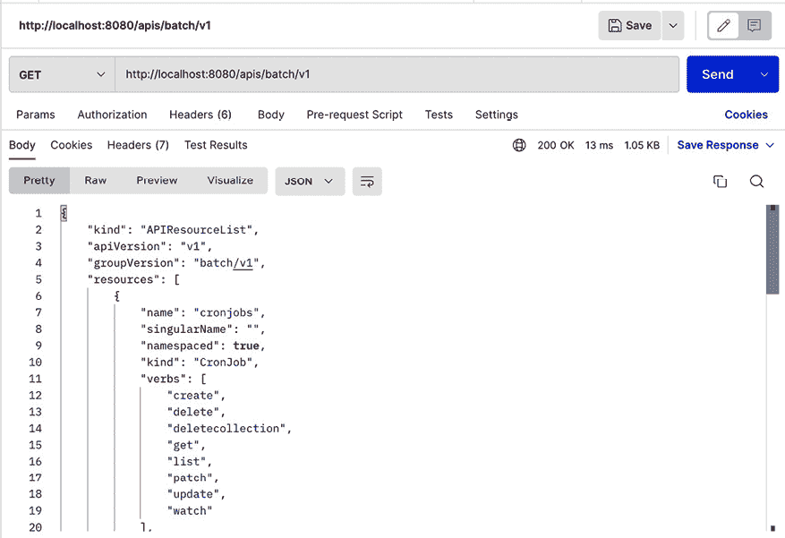
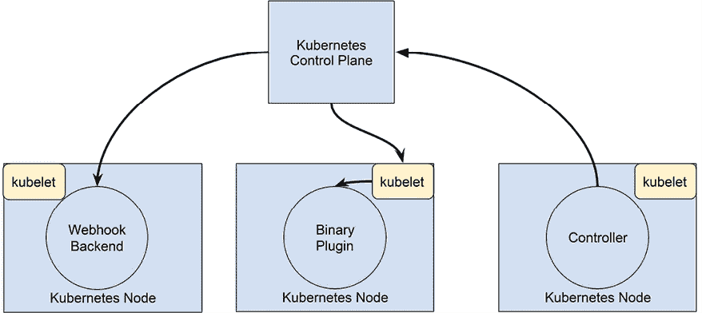
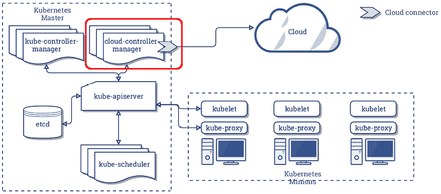
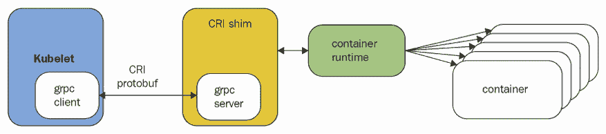
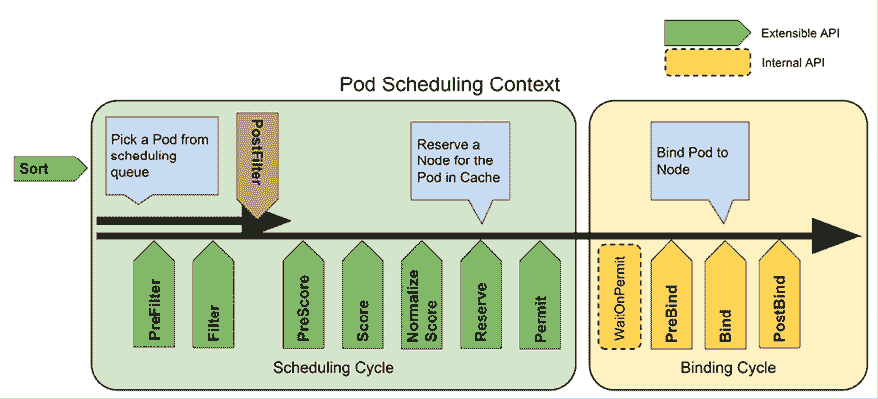
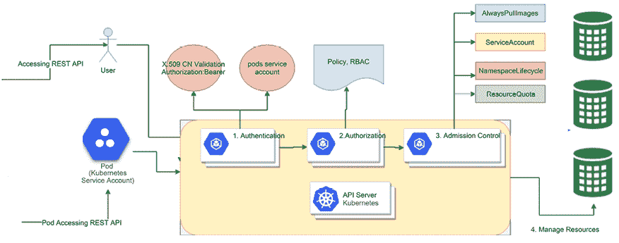

# 第十五章：扩展 Kubernetes

在本章中，我们将深入探索 Kubernetes 的内部。我们将从 Kubernetes API 开始，学习如何通过直接访问 API、使用 controller-runtime Go 库以及自动化 kubectl 来以编程方式操作 Kubernetes。然后，我们将研究如何使用自定义资源扩展 Kubernetes API。最后一部分将介绍 Kubernetes 支持的各种插件。Kubernetes 操作的许多方面都是模块化的，并且设计为可扩展的。我们将研究 API 聚合层以及几种类型的插件，如自定义调度器、授权、准入控制、自定义度量和存储卷。最后，我们将探讨如何扩展 kubectl 并添加自己的命令。

涵盖的主题如下：

+   使用 Kubernetes API

+   扩展 Kubernetes API

+   编写 Kubernetes 和 kubectl 插件

+   编写 Webhook

# 使用 Kubernetes API

Kubernetes API 是全面的，涵盖了 Kubernetes 的所有功能。正如你可能预料的，它非常庞大。但它使用最佳实践设计，非常出色，并且保持一致性。如果你理解了基本原理，你可以发现所有你需要知道的内容。我们在*第一章*《理解 Kubernetes 架构》中已经介绍了 Kubernetes API。如果你需要回顾一下，可以去看看。在本节中，我们将深入探讨，学习如何访问和使用 Kubernetes API。但首先，让我们了解一下 OpenAPI，它是为整个 Kubernetes API 提供结构化的正式基础。

## 理解 OpenAPI

OpenAPI（前身为 Swagger）是一种开放标准，定义了一种与语言和框架无关的方式来描述 RESTful API。它提供了一种标准化、机器可读的格式来描述 API，包括其端点、参数、请求和响应体、身份验证及其他元数据。

在 Kubernetes 的上下文中，OpenAPI 用于定义和文档化 Kubernetes 集群的 API 接口。OpenAPI 被用于 Kubernetes，提供了一种标准化的方式来文档化和定义可以用来配置和管理集群的 API 对象。Kubernetes API 基于声明式模型，用户通过 YAML 或 JSON 清单定义所需资源的状态。这些清单遵循 OpenAPI 架构，定义了每个资源的结构和属性。Kubernetes 使用 OpenAPI 架构来验证清单，在 API 客户端中提供自动补全和文档，并生成 API 参考文档。

在 Kubernetes 中使用 OpenAPI 的一个主要好处是，它支持为客户端库生成代码。这使得开发者可以使用他们选择的编程语言和生成的客户端库与 Kubernetes API 进行交互，提供了一种本地化且类型安全的方式与 API 交互。

此外，OpenAPI 还允许像 kubectl 这样的工具为 Kubernetes 资源提供自动补全和验证功能。

OpenAPI 还支持自动化生成 Kubernetes API 文档。通过 OpenAPI 架构，Kubernetes 可以自动生成 API 参考文档，作为一个全面且最新的资源，帮助理解 Kubernetes API 及其功能。

自 Kubernetes 1.27 起，Kubernetes 就稳定支持 OpenAPI v3。

详情请访问 [`www.openapis.org`](https://www.openapis.org)。

为了在本地使用 Kubernetes API，我们需要设置一个代理。

## 设置代理

为了简化访问，您可以使用 kubectl 设置一个代理：

```
$ k proxy --port 8080 
```

现在，你可以在 `http://localhost:8080` 上访问 API 服务器，它将连接到与 kubectl 配置相同的 Kubernetes API 服务器。

## 直接探索 Kubernetes API

Kubernetes API 是高度可发现的。你只需要浏览到 `http://localhost:8080` 的 API 服务器 URL，就能获取一个描述所有可用操作的 JSON 文档，其中包含在 `paths` 键下的所有操作。

由于空间限制，这里是部分列表：

```
{
    "paths": [
        "/api",
        "/api/v1",
        "/apis",
        "/apis/",
        "/apis/admissionregistration.k8s.io",
        "/apis/admissionregistration.k8s.io/v1",
        "/apis/apiextensions.k8s.io",
        "/livez/poststarthook/storage-object-count-tracker-hook",
        "/logs",
        "/metrics",
        "/openapi/v2",
        "/openapi/v3",
        "/openapi/v3/",
        "/openid/v1/jwks",
        "/readyz/shutdown",
        "/version"
    ]
} 
```

你可以深入查看任意一个路径。例如，要发现 `default` 命名空间的端点，我首先访问了 `/api` 端点，然后发现了 `/api/v1`，它告诉我有 `/api/v1/namespaces`，接着指向了 `/api/v1/namespaces/default`。以下是来自 `/api/v1/namespaces/default` 端点的响应：

```
{
  "kind": "Namespace",
  "apiVersion": "v1",
  "metadata": {
    "name": "default",
    "uid": "7e39c279-949a-4fb6-ae47-796bb797082d",
    "resourceVersion": "192",
    "creationTimestamp": "2022-11-13T04:33:00Z",
    "labels": {
      "kubernetes.io/metadata.name": "default"
    },
    "managedFields": [
      {
        "manager": "kube-apiserver",
        "operation": "Update",
        "apiVersion": "v1",
        "time": "2022-11-13T04:33:00Z",
        "fieldsType": "FieldsV1",
        "fieldsV1": {
          "f:metadata": {
            "f:labels": {
              ".": {},
              "f:kubernetes.io/metadata.name": {}
            }
          }
        }
      }
    ]
  },
  "spec": {
    "finalizers": [
      "kubernetes"
    ]
  },
  "status": {
    "phase": "Active"
  }
} 
```

您可以通过命令行工具，如 cURL 或者 kubectl 本身，来探索 Kubernetes API，但有时使用图形界面应用程序会更加方便。

### 使用 Postman 探索 Kubernetes API

Postman ([`www.getpostman.com`](https://www.getpostman.com)) 是一个非常精致的应用程序，用于操作 RESTful API。如果你更倾向于使用图形界面，可能会发现它非常有用。

以下截图展示了批量 v1 API 组下的可用端点：



图 15.1：批量 v1 API 组下的可用端点

Postman 提供了很多选项，而且它以一种非常舒适的方式组织信息。试试看吧。

### 使用 HTTPie 和 jq 过滤输出

API 的输出有时可能过于冗长。通常，你只对从 JSON 响应中的一部分值感兴趣。例如，如果你想获取所有正在运行的服务的名称，可以访问 `/api/v1/services` 端点。然而，响应中包含了很多无关的信息。以下是输出的一个非常小的子集：

```
$ http http://localhost:8080/api/v1/services
{
  "kind": "ServiceList",
  "apiVersion": "v1",
  "metadata": {
    "resourceVersion": "3237"
  },
  "items": [
    ...
    {
      "metadata": {
        "name": "kube-dns",
        "namespace": "kube-system",
        ...
      },
      "spec": {
        ... 
        "selector": {
          "k8s-app": "kube-dns"
        },
        "clusterIP": "10.96.0.10",
        "type": "ClusterIP",
        "sessionAffinity": "None",
      },
      "status": {
        "loadBalancer": {}
      }
    }
  ]
} 
```

完整的输出共有 193 行！让我们看看如何使用 HTTPie 和 jq 来完全控制输出，并仅显示服务的名称。我更喜欢 HTTPie([`httpie.org/`](https://httpie.org/)) 来与命令行中的 REST API 进行交互，相较于 cURL。jq ([`stedolan.github.io/jq/`](https://stedolan.github.io/jq/)) 是一个非常棒的命令行 JSON 处理工具，适合切割和处理 JSON 数据。

检查完整的输出，你会看到服务名称位于 `items` 数组中每个项的 `metadata` 部分。用于选择名称的 jq 表达式如下：

```
.items[].metadata.name 
```

这是在一个新建的 kind 集群上的完整命令和输出：

```
$ http http://localhost:8080/api/v1/services | jq '.items[].metadata.name'
"kubernetes"
"kube-dns" 
```

## 通过 Python 客户端访问 Kubernetes API

使用 HTTPie 和 jq 交互式地探索 API 很棒，但 API 的真正力量在于它们可以与其他软件进行消费和集成。Kubernetes Incubator 项目提供了一个完整且文档齐全的 Python 客户端库。可以在 [`github.com/kubernetes-incubator/client-python`](https://github.com/kubernetes-incubator/client-python) 获取。

首先，确保你已安装 Python（[`wiki.python.org/moin/BeginnersGuide/Download`](https://wiki.python.org/moin/BeginnersGuide/Download)）。然后安装 Kubernetes 包：

```
$ pip install kubernetes 
```

要开始与 Kubernetes 集群进行交互，你需要连接到它。启动一个交互式 Python 会话：

```
$ python
Python 3.9.12 (main, Aug 25 2022, 11:03:34)
[Clang 13.1.6 (clang-1316.0.21.2.3)] on darwin
Type "help", "copyright", "credits" or "license" for more information.
>>> 
```

Python 客户端可以读取你的 kubectl 配置：

```
>>> from kubernetes import client, config
>>> config.load_kube_config()
>>> v1 = client.CoreV1Api() 
```

或者，它也可以直接连接到已经运行的代理：

```
>>> from kubernetes import client, config
>>> client.Configuration().host = 'http://localhost:8080'
>>> v1 = client.CoreV1Api() 
```

请注意，`client` 模块提供了访问不同组版本的方法，例如 `CoreV1Api`。

### 解构 CoreV1Api 组

让我们深入了解并理解 `CoreV1Api` 组。这个 Python 对象有 407 个公共属性！

```
>>> attributes = [x for x in dir(v1) if not x.startswith('__')]
>>> len(attributes)
407 
```

我们忽略以双下划线开头的属性，因为它们是与 Kubernetes 无关的特殊类/实例方法。

让我们选择十个随机方法，看看它们的样子：

```
>>> import random
>>> from pprint import pprint as pp
>>> pp(random.sample(attributes, 10))
['replace_namespaced_persistent_volume_claim',
 'list_config_map_for_all_namespaces_with_http_info',
 'connect_get_namespaced_pod_attach_with_http_info',
 'create_namespaced_event',
 'connect_head_node_proxy_with_path',
 'create_namespaced_secret_with_http_info',
 'list_namespaced_service_account',
 'connect_post_namespaced_pod_portforward_with_http_info',
 'create_namespaced_service_account_token',
 'create_namespace_with_http_info'] 
```

非常有趣。属性名以动词开头，例如 `replace`、`list` 或 `create`。其中许多属性涉及命名空间，并且许多属性有一个 `with_http_info` 后缀。为了更好地理解这一点，让我们统计一下有多少个动词存在，以及每个动词使用的属性数量（动词是下划线前的第一个标记）：

```
>>> from collections import Counter
>>> verbs = [x.split('_')[0] for x in attributes]
>>> pp(dict(Counter(verbs)))
{'api': 1,
 'connect': 96,
 'create': 38,
 'delete': 58,
 'get': 2,
 'list': 56,
 'patch': 50,
 'read': 54,
 'replace': 52} 
```

我们可以深入查看特定属性的交互式帮助：

```
>>> help(v1.create_node)
Help on method create_node in module kubernetes.client.apis.core_v1_api:
create_node(body, **kwargs) method of kubernetes.client.api.core_v1_api.CoreV1Api instance
    create_node  # noqa: E501
    create a Node  # noqa: E501
    This method makes a synchronous HTTP request by default. To make an
    asynchronous HTTP request, please pass async_req=True
    >>> thread = api.create_node(body, async_req=True)
    >>> result = thread.get()
    :param async_req bool: execute request asynchronously
    :param V1Node body: (required)
    :param str pretty: If 'true', then the output is pretty printed.
    :param str dry_run: When present, indicates that modifications should not be persisted. An invalid or unrecognized dryRun directive will result in an error response and no further processing of the request. Valid values are: - All: all dry run stages will be processed
    :param str field_manager: fieldManager is a name associated with the actor or entity that is making these changes. The value must be less than or 128 characters long, and only contain printable characters, as defined by https://golang.org/pkg/unicode/#IsPrint.
    :param str field_validation: fieldValidation instructs the server on how to handle objects in the request (POST/PUT/PATCH) containing unknown or duplicate fields, provided that the `ServerSideFieldValidation` feature gate is also enabled. Valid values are: - Ignore: This will ignore any unknown fields that are silently dropped from the object, and will ignore all but the last duplicate field that the decoder encounters. This is the default behavior prior to v1.23 and is the default behavior when the `ServerSideFieldValidation` feature gate is disabled. - Warn: This will send a warning via the standard warning response header for each unknown field that is dropped from the object, and for each duplicate field that is encountered. The request will still succeed if there are no other errors, and will only persist the last of any duplicate fields. This is the default when the `ServerSideFieldValidation` feature gate is enabled. - Strict: This will fail the request with a BadRequest error if any unknown fields would be dropped from the object, or if any duplicate fields are present. The error returned from the server will contain all unknown and duplicate fields encountered.
    :param _preload_content: if False, the urllib3.HTTPResponse object will
                             be returned without reading/decoding response
                             data. Default is True.
    :param _request_timeout: timeout setting for this request. If one
                             number provided, it will be total request
                             timeout. It can also be a pair (tuple) of
                             (connection, read) timeouts.
    :return: V1Node
             If the method is called
             returns the request thread. 
```

我们看到 API 非常庞大，这也很合理，因为它代表了整个 Kubernetes API。我们还学习了如何发现相关方法的组，并且如何获取特定方法的详细信息。

你可以自己探索并了解更多关于 API 的内容。让我们看看一些常见的操作，如列出、创建和观察对象。

### 列出对象

你可以列出不同种类的对象。方法名以 `list_` 开头。这里是一个列出所有命名空间的示例：

```
>>> for ns in v1.list_namespace().items:
...     print(ns.metadata.name)
...
default
kube-node-lease
kube-public
kube-system
local-path-storage 
```

### 创建对象

要创建一个对象，你需要将 `body` 参数传递给 `create` 方法。`body` 必须是一个 Python 字典，相当于你使用 kubectl 时的 YAML 配置清单。最简单的方法是直接使用 YAML 清单，然后使用 Python YAML 模块（这不是标准库的一部分，必须单独安装）读取 YAML 文件并将其加载到字典中。例如，要创建一个具有 3 个副本的 `nginx-deployment`，我们可以使用这个 YAML 清单（`nginx-deployment.yaml`）：

```
apiVersion: apps/v1
kind: Deployment
metadata:
  name: nginx-deployment
spec:
  replicas: 3
  selector:
    matchLabels:
      app: nginx  
  template:
    metadata:
      labels:
        app: nginx
    spec:
      containers:
        - name: nginx
          image: nginx
          ports:
            - containerPort: 80 
```

要安装 `yaml` Python 模块，输入以下命令：

```
$ pip install yaml 
```

然后，以下 Python 程序（`create_nginx_deployment.py`）将创建部署：

```
from os import path
import yaml
from kubernetes import client, config
def main():
    # Configs can be set in Configuration class directly or using
    # helper utility. If no argument provided, the config will be
    # loaded from default location.
    config.load_kube_config()
    with open(path.join(path.dirname(__file__),
                        'nginx-deployment.yaml')) as f:
        dep = yaml.safe_load(f)
        k8s = client.AppsV1Api()
        dep = k8s.create_namespaced_deployment(body=dep,
                                               namespace="default")
        print(f"Deployment created. status='{dep.status}'")
if __name__ == '__main__':
    main() 
```

让我们运行它并使用 kubectl 检查部署是否已创建：

```
$ python create_nginx_deployment.py
Deployment created. status='{'available_replicas': None,
 'collision_count': None,
 'conditions': None,
 'observed_generation': None,
 'ready_replicas': None,
 'replicas': None,
 'unavailable_replicas': None,
 'updated_replicas': None}'
$ k get deploy
NAME               READY   UP-TO-DATE   AVAILABLE   AGE
nginx-deployment   3/3     3            3           56s 
```

### 监视对象

监视对象是一项高级功能。它是通过一个单独的 `watch` 模块实现的。以下是监视 10 个命名空间事件并将其打印到屏幕上的示例（`watch_demo.py`）：

```
from kubernetes import client, config, watch
# Configs can be set in Configuration class directly or using helper utility
config.load_kube_config()
v1 = client.CoreV1Api()
count = 10
w = watch.Watch()
for event in w.stream(v1.list_namespace, _request_timeout=60):
    print(f"Event: {event['type']} {event['object'].metadata.name}")
    count -= 1
    if count == 0:
        w.stop()
print('Done.') 
```

这是输出：

```
$ python watch_demo.py
Event: ADDED kube-node-lease
Event: ADDED default
Event: ADDED local-path-storage
Event: ADDED kube-system
Event: ADDED kube-public 
```

请注意，只有 5 个事件被打印出来（每个命名空间一个），程序继续监视更多事件。

我们在一个单独的终端窗口中创建并删除一些命名空间，以便程序能够结束：

```
$ k create ns ns-1
namespace/ns-1 created
$ k delete ns ns-1
namespace "ns-1" deleted
$ k create ns ns-2
namespace/ns-2 created
The final output is:
$ python watch_demo.py
Event: ADDED default
Event: ADDED local-path-storage
Event: ADDED kube-system
Event: ADDED kube-public
Event: ADDED kube-node-lease
Event: ADDED ns-1
Event: MODIFIED ns-1
Event: MODIFIED ns-1
Event: DELETED ns-1
Event: ADDED ns-2
Done. 
```

你当然可以在事件发生时做出反应并执行有用的操作（例如，在每个新命名空间中自动部署工作负载）。

## 通过 Kubernetes API 创建一个 pod

API 也可以用于创建、更新和删除资源。与使用 kubectl 不同，API 需要以 JSON 格式而不是 YAML 语法指定清单（尽管每个 JSON 文档也是有效的 YAML）。以下是一个 JSON 格式的 pod 定义（`nginx-pod.json`）：

```
{
  "kind": "Pod",
  "apiVersion": "v1",
  "metadata":{
    "name": "nginx",
    "namespace": "default",
    "labels": {
      "name": "nginx"
    }
  },
  "spec": {
    "containers": [{
                     "name": "nginx",
                     "image": "nginx",
                     "ports": [{"containerPort": 80}]
                   }]
  }
} 
```

以下命令将通过 API 创建 pod：

```
$ http POST http://localhost:8080/api/v1/namespaces/default/pods @nginx-pod.json 
```

为了验证是否成功，让我们提取当前 pod 的名称和状态。端点是 `/api/v1/namespaces/default/pods`。

jq 表达式是 `items[].metadata.name,.items[].status.phase`。

以下是完整的命令和输出：

```
$ FILTER='.items[].metadata.name,.items[].status.phase'
$ http http://localhost:8080/api/v1/namespaces/default/pods | jq $FILTER
"nginx"
"Running" 
```

## 使用 Go 和 controller-runtime 控制 Kubernetes

Python 很酷且易于使用，但对于生产级工具、控制器和操作器，我更倾向于使用 Go，特别是 controller-runtime 项目。controller-runtime 是用于访问 Kubernetes API 的标准 Go 客户端。

### 通过 go-k8s 使用 controller-runtime

controller-runtime 项目是一组 Go 库，可以非常高效地查询和操作 Kubernetes（例如，使用高级缓存来避免压垮 API 服务器）。

直接使用 controller-runtime 并不容易。它有许多相互关联的部分，并且有不同的方法来完成任务。

查看：[`pkg.go.dev/sigs.k8s.io/controller-runtime`](https://pkg.go.dev/sigs.k8s.io/controller-runtime)。

我创建了一个名为 `go-k8s` 的小型开源项目，它封装了一些复杂性，并帮助以更少的麻烦使用 controller-runtime 功能的子集。

查看详情：[`github.com/the-gigi/go-k8s/tree/main/pkg/client`](https://github.com/the-gigi/go-k8s/tree/main/pkg/client)。

请注意，go-k8s 项目还有其他库，但我们将重点介绍客户端库。

go-k8s 客户端包支持两种类型的客户端：`Clientset` 和 `DynamicClient`。`Clientset` 客户端支持与已知类型的交互，但需要明确指定 API 版本、类型和操作作为方法名称。例如，使用 `Clientset` 列出所有 pods 如下所示：

```
podList, err := clientset.CoreV1().Pods("ns-1").List(context.Background(), metav1.ListOptions{}) 
```

它返回一个 pod 列表和一个错误。如果一切正常，错误为 `nil`。pod 列表是结构体类型 `PodList`，定义见此处：[`github.com/kubernetes/kubernetes/blob/master/pkg/apis/core/types.go#L2514`](https://github.com/kubernetes/kubernetes/blob/master/pkg/apis/core/types.go#L2514)。

方便的是，你可以在同一个文件中找到所有 Kubernetes API 类型。API 结构非常嵌套，例如，`PodList` 如你所料，是 `Pod` 对象的列表。每个 `Pod` 对象都有 `TypeMeta`、`ObjectMeta`、`PodSpec` 和 `PodStatus`：

```
type Pod struct {
    metav1.TypeMeta
    metav1.ObjectMeta
    Spec PodSpec
    Status PodStatus
} 
```

实际上，这意味着当你通过 `Clientset` 发起调用时，你会得到一个强类型的嵌套对象，非常容易操作。例如，如果我们想检查一个 Pod 是否有一个名为 `app` 的标签及其值，我们可以用一行代码完成：

```
app, ok := pods[0].ObjectMeta.Labels["app"] 
```

如果标签不存在，`ok` 将为 `false`。如果存在，则其值将存储在 `app` 变量中。

现在，让我们来看一下 `DynamicClient`。在这里，你获得了终极的灵活性，能够与知名类型以及自定义类型一起工作。特别是，如果你想创建任意资源，动态客户端可以以通用方式操作任何 Kubernetes 类型。

然而，使用动态客户端时，你总是会返回一个通用对象，类型为 `Unstructured`，定义见此处：[`github.com/kubernetes/apimachinery/blob/master/pkg/apis/meta/v1/unstructured/unstructured.go#L41`](https://github.com/kubernetes/apimachinery/blob/master/pkg/apis/meta/v1/unstructured/unstructured.go#L41)。

它实际上只是一个围绕通用 Go 类型 `map[string]interface{}` 的薄包装。它有一个名为 `Object` 的字段，类型是 `map[string]interface{}`。这意味着你返回的对象是一个字段名称到任意其他对象（表示为 `interface{}`）的映射。要深入层次结构，我们必须进行类型转换，这意味着将一个 `interface{}` 值显式转换为其实际类型。下面是一个简单的示例：

```
var i interface{} = 5
x, ok := i.(int) 
```

现在，`x` 是一个类型为 `int` 的变量，值为 5，可以作为整数使用。原始的 `i` 变量不能作为整数使用，因为它的类型是通用的 `interface{}`，即使它包含一个整数值。

对于从动态客户端返回的对象，我们必须不断地将`interface{}`类型转换为`map[string]interface{}`，直到我们找到感兴趣的字段。要获取我们 Pod 的 `app` 标签，我们需要遵循以下路径：

```
 pod := pods[0].Object
    metadata := pod["metadata"].(map[string]interface{})
    labels := metadata["labels"].(map[string]interface{})
    app, ok := labels["app"].(string) 
```

这非常繁琐且容易出错。幸运的是，有一种更好的方法。Kubernetes 的 `apimachinery/runtime` 包提供了一个转换函数，可以将一个非结构化的对象转换为已知类型：

```
 pod := pods[0].Object
    var p corev1.Pod
    err = runtime.DefaultUnstructuredConverter.FromUnstructured(pod, &p)
    if err != nil {
      return err
    }
    app, ok = p.ObjectMeta.Labels["app"] 
```

controller-runtime 非常强大，但处理所有类型时可能会感到乏味。一个“作弊”的方法是使用 kubectl，它实际上是在幕后使用 controller-runtime。这在使用 Python 和其动态类型时尤其容易。

### 从 Python 和 Go 中程序化地调用 kubectl

如果你不想直接处理 REST API 或客户端库，你还有另一种选择。Kubectl 主要作为一个交互式命令行工具使用，但没有什么能阻止你通过脚本和程序来自动化它并调用它。使用 kubectl 作为 Kubernetes API 客户端有一些好处：

+   容易找到任何用法的示例

+   在命令行上很容易进行实验，以找到命令和参数的正确组合

+   kubectl 支持 JSON 或 YAML 格式的输出，便于快速解析

+   通过 kubectl 配置内建了身份验证

### 使用 Python 的 subprocess 来运行 kubectl

首先让我们使用 Python，这样你可以比较使用官方 Python 客户端和自己编写代码的不同。Python 有一个名为`subprocess`的模块，可以运行外部进程，比如 kubectl，并捕获输出。

这是一个 Python 3 示例，运行 kubectl 并显示使用输出的开头：

```
>>> import subprocess
>>> out = subprocess.check_output('kubectl').decode('utf-8')
>>> print(out[:276]) 
```

Kubectl 控制 Kubernetes 集群管理器。

更多信息请访问[`kubernetes.io/docs/reference/kubectl/overview/`](https://kubernetes.io/docs/reference/kubectl/overview/)。

`check_output()`函数将输出捕获为字节数组，需要解码为`utf-8`才能正确显示。我们可以稍微通用化一下，创建一个名为`k()`的便利函数，放在`k.py`文件中。它接受任意数量的参数，传递给 kubectl，然后解码输出并返回：

```
from subprocess import check_output
def k(*args):
    out = check_output(['kubectl'] + list(args))
    return out.decode('utf-8') 
```

让我们用它来列出默认命名空间中所有正在运行的 Pod：

```
>>> from k import k
>>> print(k('get', 'po'))
NAME                                                      READY   STATUS             RESTARTS   AGE
nginx                                                     1/1     Running            0          4h48m
nginx-deployment-679f9c75b-c79mv                          1/1     Running            0          132m
nginx-deployment-679f9c75b-cnmvk                          1/1     Running            0          132m
nginx-deployment-679f9c75b-gzfgk                          1/1     Running            0          132m 
```

这对于显示很不错，但 kubectl 本身就已经实现了这一点。真正的强大之处在于，当你使用带有`-o`标志的结构化输出选项时。然后结果可以自动转换为 Python 对象。以下是修改版的`k()`函数，它接受一个布尔值`use_json`关键字参数（默认为`False`），如果为`True`，则添加`-o json`，然后解析 JSON 输出为 Python 对象（字典）：

```
from subprocess import check_output
import json
def k(*args, use_json=False):
    cmd = ['kubectl'] + list(args)
    if use_json:
        cmd += ['-o', 'json']
    out = check_output(cmd).decode('utf-8')
    if use_json:
        out = json.loads(out)
    return out 
```

这将返回一个完备的 API 对象，可以像访问 REST API 或使用官方 Python 客户端一样进行导航和深入探查：

```
result = k('get', 'po', use_json=True)
>>> for r in result['items']:
...     print(r['metadata']['name'])
...
nginx-deployment-679f9c75b-c79mv
nginx-deployment-679f9c75b-cnmvk
nginx-deployment-679f9c75b-gzfgk 
```

让我们来看看如何删除部署并等待所有 Pod 消失。kubectl 的`delete`命令不支持`-o json`选项（尽管它有`-o name`），因此我们将省略`use_json`：

```
>>> k('delete', 'deployment', 'nginx-deployment')
while len(k('get', 'po', use_json=True)['items']) > 0:
    print('.')
print('Done.')
.
.
.
.
Done. 
```

Python 很棒，但如果你更喜欢用 Go 来自动化 kubectl 呢？别担心，我有适合你的包。`kugo`包提供了一个简单的 Go API 来自动化 kubectl。你可以在这里找到代码：[`github.com/the-gigi/kugo`](https://github.com/the-gigi/kugo)。

它提供了三个功能：`Run()`，`Get()`和`Exec()`。

`Run()`函数是你的瑞士军刀。它可以直接运行任何 kubectl 命令。以下是一个示例：

```
 cmd := fmt.Sprintf("create deployment test-deployment --image nginx --replicas 3 -n ns-1")
    _, err := kugo.Run(cmd) 
```

这非常方便，因为你可以交互式地组合你需要的准确命令和参数，然后，一旦你弄清楚所有内容，你可以直接将相同的命令传递给 Go 程序中的`kuge.Run()`。

`Get()` 函数是围绕 `kubectl get` 的一个智能包装器。它接受一个 `GetRequest` 参数，并提供多种便利功能：支持字段选择器、按标签获取和不同的输出类型。以下是使用自定义 kube 配置文件和自定义 kube 上下文获取所有命名空间名称的示例：

```
 output, err := kugo.Get(kugo.GetRequest{
        BaseRequest: kugo.BaseRequest{
            KubeConfigFile: c.kubeConfigFile,
            KubeContext:    c.GetKubeContext(),
        },
        Kind:   "ns",
        Output: "name",
    }) 
```

最后，`Exec()` 函数是围绕 `kubectl exec` 的一个包装器，允许您在运行的 pod/container 上执行命令。它接受一个看起来像这样的 `ExecRequest`：

```
type GetRequest struct {
    BaseRequest
    Kind           string
    FieldSelectors []string
    Label          string
    Output         string
} 
```

让我们来看看 `Exec()` 函数的代码。它非常简单直接。它进行基本验证，确保提供了像 `Command` 和 `Target` 这样的必需字段，然后构建一个从 `exec` 命令开始的 kubectl 参数列表，最后调用 `Run()` 函数：

```
// Exec executes a command in a pod
//
// The target pod can specified by name or an arbitrary pod
// from a deployment or service.
//
// If the pod has multiple containers you can choose which
// container to run the command in
func Exec(r ExecRequest) (result string, err error) {
    if r.Command == "" {
        err = errors.New("Must specify Command field")
        return
    }
    if r.Target == "" {
        err = errors.New("Must specify Target field")
        return
    }
    args := []string{"exec", r.Target}
    if r.Container != "" {
        args = append(args, "-c", r.Container)
    }
    args = handleCommonArgs(args, r.BaseRequest)
    args = append(args, "--", r.Command)
    return Run(args...)
} 
```

现在，通过其 REST API、客户端库的编程方式访问 Kubernetes，并通过控制 kubectl，是学习如何扩展 Kubernetes 的时候了。

# 扩展 Kubernetes API

Kubernetes 是一个极其灵活的平台。从一开始就设计为可扩展的，并随着演变，越来越多的 Kubernetes 组件被开放，并通过稳健的接口暴露出来，可以被替换为替代实现。我敢说，Kubernetes 在初创公司、大公司、基础设施提供商和云提供商中的指数级采用，直接源于 Kubernetes 提供了大量的开箱即用功能，同时又允许与其他组件轻松集成。在本节中，我们将涵盖许多可用的扩展点，例如：

+   用户定义类型（自定义资源）

+   API 访问扩展

+   基础设施扩展

+   操作者

+   调度程序扩展

让我们了解您可以如何以各种方式扩展 Kubernetes。

## 理解 Kubernetes 的扩展点和模式

Kubernetes 由多个组件组成：API 服务器、etcd 状态存储、控制器管理器、kube-proxy、kubelet 和容器运行时。您可以深入扩展和定制每一个这些组件，还可以添加自己的定制组件，以监视和响应事件，处理新请求，并修改关于传入请求的一切。

下图显示了一些可用的扩展点及其与各种 Kubernetes 组件的连接方式：



图 15.2：可用的扩展点

让我们看看如何使用插件扩展 Kubernetes。

### 使用插件扩展 Kubernetes

Kubernetes 定义了几个接口，允许其与各种基础设施提供商的插件进行交互。我们在前几章节详细讨论了其中一些接口和插件。在这里，我们只列出它们以供完整性考虑：

+   **容器网络接口**（**CNI**）– CNI 支持大量的连接节点和容器的网络解决方案

+   **容器存储接口**（**CSI**）– CSI 支持大量的 Kubernetes 存储选项

+   设备插件——允许节点发现除 CPU 和内存之外的新节点资源（例如，GPU）

### 使用云控制器管理器扩展 Kubernetes

Kubernetes 最终需要部署在一些节点上，并使用一些存储和网络资源。最初，Kubernetes 仅支持 Google Cloud Platform 和 AWS。其他云提供商必须定制多个 Kubernetes 核心组件（如 Kubelet、Kubernetes 控制器管理器和 Kubernetes API 服务器），才能与 Kubernetes 集成。Kubernetes 开发者将其视为采用过程中的问题，并创建了**云控制器管理器**（**CCM**）。CCM 清晰地定义了 Kubernetes 与其部署基础设施层之间的交互。现在，云提供商只需要提供一个适应其基础设施的 CCM 实现，并可以利用上游 Kubernetes，而无需对 Kubernetes 代码进行代价高昂且容易出错的修改。所有 Kubernetes 组件通过预定义接口与 CCM 交互，Kubernetes 则完全不关心它运行在哪个云（或没有云）上。

以下图示演示了 Kubernetes 与云提供商通过 CCM 的交互：



图 15.3：Kubernetes 与云提供商通过 CCM 的交互

如果你想了解更多关于 CCM 的信息，可以查看我几年前写的这篇简明文章：[`medium.com/@the.gigi/kubernetes-and-cloud-providers-b7a6227d3198`](https://medium.com/@the.gigi/kubernetes-and-cloud-providers-b7a6227d3198)。

### 使用 webhook 扩展 Kubernetes

插件在集群中运行，但在某些情况下，更好的扩展性模式是将一些功能委托给集群外部的服务。这在访问控制领域非常常见，因为公司和组织可能已经有一个集中化的身份和访问控制解决方案。在这些情况下，webhook 扩展模式非常有用。其核心思想是，你可以通过配置 Kubernetes 与一个端点（webhook）进行交互。Kubernetes 将调用该端点，你可以在其中实现自己的自定义功能，然后 Kubernetes 会根据响应采取相应的行动。我们在*第四章*《保护 Kubernetes》中讨论身份验证、授权和动态准入控制时，看到过这种模式。

Kubernetes 定义了每个 webhook 的预期有效载荷。Webhook 的实现必须遵循这些定义，才能成功与 Kubernetes 进行交互。

### 使用控制器和操作符扩展 Kubernetes

控制器模式是编写一个可以在集群内或集群外运行的程序，监视事件并响应它们。控制器的概念模型是将集群的当前状态（控制器感兴趣的部分）与期望状态进行协调。控制器的常见做法是读取对象的 `Spec`，采取一些行动，并更新其 `Status`。Kubernetes 的许多核心逻辑是由由控制器管理器管理的大量控制器实现的，但没有任何限制阻止我们将自己的控制器部署到集群中，或者运行访问 API 服务器的远程控制器。

操作员模式是控制器模式的另一种形式。可以将操作员视为一种控制器，它还有自己的一组自定义资源，表示它管理的应用程序。操作员的目标是管理部署在集群内或某些集群外基础设施中的应用程序的生命周期。可以查看 [`operatorhub.io`](https://operatorhub.io) 了解现有操作员的示例。

如果你计划构建自己的控制器，我推荐从 Kubebuilder 开始 ([`github.com/kubernetes-sigs/kubebuilder`](https://github.com/kubernetes-sigs/kubebuilder))。这是一个由 Kubernetes API Machinery SIG 维护的开源项目，支持使用 CRD 定义多个自定义 API，并自动生成控制器代码来监视这些资源。你将在 Go 中实现控制器。

然而，仍然有多个其他框架可以编写控制器和操作员，采用不同的方法，并使用其他编程语言：

+   操作员框架

+   Kopf

+   kube-rs

+   KubeOps

+   KUDO

+   元控制器

在做决定之前，先了解一下它们。

### 扩展 Kubernetes 调度

Kubernetes 的主要工作，简而言之，就是在节点上调度 Pods。调度是 Kubernetes 的核心功能，它做得非常好。Kubernetes 调度器可以通过非常高级的方式进行配置（守护进程集、污点、容忍度等）。但即便如此，Kubernetes 开发人员也认识到，在某些特殊情况下，你可能希望控制核心调度算法。你可以用自己的调度器替换核心 Kubernetes 调度器，或者与内置调度器并行运行另一个调度器，来控制一部分 Pod 的调度。我们将在本章稍后部分看到如何实现这一点。

### 使用自定义容器运行时扩展 Kubernetes

Kubernetes 最初只支持 Docker 作为容器运行时。Docker 的支持被嵌入到 Kubernetes 核心代码中。后来，专门支持 rkt 也被加入。Kubernetes 的开发者意识到这一点，并引入了**容器运行时接口**（**CRI**），这是一个 gRPC 接口，任何实现它的容器运行时都可以与 kubelet 通信。最终，Docker 和 rkt 的硬编码支持被淘汰，现在 kubelet 仅通过 CRI 与容器运行时进行通信：



图 15.4：Kubelet 通过 CRI 与容器运行时通信

自 CRI（容器运行时接口）引入以来，支持 Kubernetes 的容器运行时数量激增。

我们已经讨论了多种扩展 Kubernetes 不同方面的方法。接下来，让我们聚焦于自定义资源的主要概念，它允许你扩展 Kubernetes API 本身。

## 引入自定义资源

扩展 Kubernetes 的主要方式之一是定义新类型的资源，称为自定义资源。你可以用自定义资源做什么？很多。你可以通过 Kubernetes API 管理那些存在于 Kubernetes 集群外，但你的 Pod 与之通信的资源。通过将这些外部资源作为自定义资源，你能更全面地了解你的系统，并能享受到 Kubernetes API 的众多功能，如：

+   自定义 CRUD REST 端点

+   版本控制

+   监听

+   与通用 Kubernetes 工具的自动集成

自定义资源的其他应用场景包括自定义控制器和自动化程序的元数据。

让我们深入了解自定义资源的具体内容。

为了与 Kubernetes API 服务器兼容，自定义资源必须符合一些基本要求。类似于内建的 API 对象，它们必须包含以下字段：

+   `apiVersion`: `apiextensions.k8s.io/v1`

+   `metadata`: 标准 Kubernetes 对象元数据

+   `kind`: `CustomResourceDefinition`

+   `spec`: 描述资源在 API 和工具中的表现方式

+   `status`: 表示 CRD 的当前状态

`spec`包含一个内部结构，其中包括`group`、`names`、`scope`、`validation`和`version`等字段。`status`包括`acceptedNames`和`Conditions`字段。在接下来的章节中，我将展示一个示例，帮助你理解这些字段的含义。

## 开发自定义资源定义

你通过自定义资源定义（也叫 CRD）来开发自定义资源。目的是让 CRD 能够顺利地与 Kubernetes、其 API 和工具集成。这意味着你需要提供大量信息。以下是一个名为 Candy 的自定义资源的示例：

```
apiVersion: apiextensions.k8s.io/v1
kind: CustomResourceDefinition
metadata:
  # name must match the spec fields below, and be in the form: <plural>.<group>
  name: candies.awesome.corp.com
spec:
  # group name to use for REST API: /apis/<group>/<version>
  group: awesome.corp.com
  # version name to use for REST API: /apis/<group>/<version>
  versions:
    - name: v1
      # Each version can be enabled/disabled by Served flag.
      served: true
      # One and only one version must be marked as the storage version.
      storage: true
      schema:
        openAPIV3Schema:
          type: object
          properties:
            spec:
              type: object
              properties:
                flavor:
                  type: string
  # either Namespaced or Cluster
  scope: Namespaced
  names:
    # plural name to be used in the URL: /apis/<group>/<version>/<plural>
    plural: candies
    # singular name to be used as an alias on the CLI and for display
    singular: candy
    # kind is normally the CamelCased singular type. Your resource manifests use this.
    kind: Candy
    # shortNames allow shorter string to match your resource on the CLI
    shortNames:
      - cn 
```

Candy CRD 有几个有趣的部分。metadata 中包含一个完全限定的名称，应该是唯一的，因为 CRD 是集群范围的。spec 中有一个 `versions` 部分，它可以包含多个版本，每个版本都有一个指定自定义资源字段的 schema。该 schema 遵循 OpenAPI v3 规范（[`github.com/OAI/OpenAPI-Specification/blob/master/versions/3.0.0.md#schemaObject`](https://github.com/OAI/OpenAPI-Specification/blob/master/versions/3.0.0.md#schemaObject)）。`scope` 字段可以是 `Namespaced` 或 `Cluster`。如果 scope 是 `Namespaced`，那么从 CRD 创建的自定义资源将仅存在于其创建的命名空间中，而集群范围的自定义资源可以在任何命名空间中使用。最后，`names` 部分指的是自定义资源的名称（而不是来自 `metadata` 部分的 CRD 名称）。`names` 部分有 `plural`、`singular`、`kind` 和 `shortNames` 选项。

让我们来创建 CRD：

```
$ k create -f candy-crd.yaml
customresourcedefinition.apiextensions.k8s.io/candies.awesome.corp.com created 
```

请注意，返回的是 metadata 名称。通常使用复数名称。现在，让我们验证是否可以访问它：

```
$ k get crd
NAME                       CREATED AT
candies.awesome.corp.com   2022-11-24T22:56:27Z 
```

还有一个 API 端点用于管理这个新资源：

```
/apis/awesome.corp.com/v1/namespaces/<namespace>/candies/ 
```

## 集成自定义资源

一旦 `CustomResourceDefinition` 对象创建完成，你可以创建该资源类型的自定义资源——在本例中是 `Candy`（candy 变为 CamelCase 的 Candy）。自定义资源必须遵守 CRD 的 schema。在以下示例中，`flavor` 字段被设置在名为 `chocolate` 的 `Candy` 对象上。`apiVersion` 字段是从 CRD 的 `spec` 中的 `group` 和 `versions` 字段推导出来的：

```
apiVersion: awesome.corp.com/v1
kind: Candy
metadata:
  name: chocolate
spec:
  flavor: sweeeeeeet 
```

让我们创建它：

```
$ k create -f chocolate.yaml
candy.awesome.corp.com/chocolate created 
```

请注意，spec 中必须包含 schema 中的 `flavor` 字段。

此时，kubectl 可以像操作内建对象一样操作 Candy 对象。使用 kubectl 时，资源名称是不区分大小写的：

```
$ k get candies
NAME        AGE
chocolate   34s 
```

我们还可以使用标准的 `-o json` 标志查看原始 JSON 数据。这次我们使用短名称 `cn`：

```
$ k get cn -o json
{
    "apiVersion": "v1",
    "items": [
        {
            "apiVersion": "awesome.corp.com/v1",
            "kind": "Candy",
            "metadata": {
                "creationTimestamp": "2022-11-24T23:11:01Z",
                "generation": 1,
                "name": "chocolate",
                "namespace": "default",
                "resourceVersion": "750357",
                "uid": "49f68d80-e9c0-4c20-a87d-0597a60c4ed8"
            },
            "spec": {
                "flavor": "sweeeeeeet"
            }
        }
    ],
    "kind": "List",
    "metadata": {
        "resourceVersion": ""
    }
} 
```

### 处理未知字段

规范中的 schema 是在 `apiextensions.k8s.io/v1` 版本的 CRD 中引入的，该版本在 Kubernetes 1.17 中变得稳定。使用 `apiextensions.k8s.io/v1beta` 时，不需要 schema，因此可以使用任意字段。如果你只是试图将 CRD 的版本从 v1beta 更改为 v1，你将面临一次痛苦的觉醒。Kubernetes 会允许你更新 CRD，但当你试图使用未知字段创建自定义资源时，它会失败。

你必须为所有的 CRD 定义一个 schema。如果你必须处理可能包含额外未知字段的自定义资源，可以关闭验证，但额外的字段会被剥离。

这是一个 `Candy` 资源，它有一个额外的字段 `texture`，该字段在 schema 中未指定：

```
apiVersion: awesome.corp.com/v1
kind: Candy
metadata:
  name: gummy-bear
spec:
  flavor: delicious
  texture: rubbery 
```

如果我们尝试使用验证来创建，它将失败：

```
$ k create -f gummy-bear.yaml
Error from server (BadRequest): error when creating "gummy-bear.yaml": Candy in version "v1" cannot be handled as a Candy: strict decoding error: unknown field "spec.texture" 
```

但是，如果我们关闭验证，一切都会正常，除了只有 `flavor` 字段会出现，而 `texture` 字段不会：

```
$ k create -f gummy-bear.yaml --validate=false
candy.awesome.corp.com/gummy-bear created
$ k get cn gummy-bear -o yaml
apiVersion: awesome.corp.com/v1
kind: Candy
metadata:
  creationTimestamp: "2022-11-24T23:13:33Z"
  generation: 1
  name: gummy-bear
  namespace: default
  resourceVersion: "750534"
  uid: d77d9bdc-5a53-4f8e-8468-c29e2d46f919
spec:
  flavor: delicious 
```

有时，保留未知字段是有用的。CRDs 可以通过向架构中添加一个特殊字段来支持未知字段。

让我们删除当前的 Candy CRD，并用一个支持未知字段的 CRD 替代它：

```
$ k delete -f candy-crd.yaml
customresourcedefinition.apiextensions.k8s.io "candies.awesome.corp.com" deleted
$ k create -f candy-with-unknown-fields-crd.yaml
customresourcedefinition.apiextensions.k8s.io/candies.awesome.corp.com created 
```

新的 CRD 在 `spec` 属性中将 `x-kubernetes-preserve-unknown-fields` 字段设置为 `true`：

```
 schema:
        openAPIV3Schema:
          type: object
          properties:
            spec:
              type: object
              x-kubernetes-preserve-unknown-fields: true
              properties:
                flavor:
                  type: string 
```

让我们重新创建一个带有验证的糖果，并检查未知的 `texture` 字段是否存在：

```
$ k create -f gummy-bear.yaml
candy.awesome.corp.com/gummy-bear created
$ k get cn gummy-bear -o yaml
apiVersion: awesome.corp.com/v1
kind: Candy
metadata:
  creationTimestamp: "2022-11-24T23:38:01Z"
  generation: 1
  name: gummy-bear
  namespace: default
  resourceVersion: "752234"
  uid: 6863f767-5dc0-43f7-91f3-1c734931b979
spec:
  flavor: delicious
  texture: rubbery 
```

### 完成自定义资源的最终化

自定义资源支持最终化器，就像标准 API 对象一样。最终化器是一种机制，对象不会立即被删除，而是必须等待在后台运行并监视删除请求的特殊控制器。控制器可以执行任何必要的清理操作，然后从目标对象中移除其最终化器。一个对象可能有多个最终化器。Kubernetes 会等待所有最终化器被移除后才会删除对象。元数据中的最终化器只是一些任意字符串，对应的控制器可以识别它们。Kubernetes 并不知道它们的含义。

它只是在删除对象之前耐心等待所有最终化器被移除。以下是一个示例，展示了一个包含两个最终化器（`eat-me` 和 `drink-me`）的 `Candy` 对象：

```
apiVersion: awesome.corp.com/v1
kind: Candy
metadata:
  name: chocolate
  finalizers:
  - eat-me
  - drink-me
spec:
  flavor: sweeeeeeet 
```

### 添加自定义打印列

默认情况下，当你使用 kubectl 列出自定义资源时，只会显示资源的名称和年龄：

```
$ k get cn
NAME         AGE
chocolate    11h
gummy-bear   16m 
```

但是 CRD 架构允许你添加自己的列。让我们将“flavor”和“age”作为可打印列添加到我们的 `Candy` 对象中：

```
apiVersion: apiextensions.k8s.io/v1
kind: CustomResourceDefinition
metadata:
  name: candies.awesome.corp.com
spec:
  group: awesome.corp.com
  versions:
    - name: v1
        ...
      additionalPrinterColumns:
        - name: Flavor
          type: string
          description: The flavor of the candy
          jsonPath: .spec.flavor
        - name: Age
          type: date
          jsonPath: .metadata.creationTimestamp
   ... 
```

然后我们可以应用它，重新添加我们的糖果，并列出它们：

```
$ k apply -f candy-with-flavor-crd.yaml
customresourcedefinition.apiextensions.k8s.io/candies.awesome.corp.com configured
$ k get cn
NAME         FLAVOR       AGE
chocolate    sweeeeeeet   13m
gummy-bear   delicious    18m 
```

## 理解 API 服务器聚合

当你只需要对自己的类型进行一些 CRUD 操作时，CRDs 非常有用。你可以直接依赖 Kubernetes API 服务器，它会存储你的对象，并提供 API 支持及与工具（如 kubectl）的集成。如果你需要更多功能，可以运行控制器，监视你的自定义资源，并在它们被创建、更新或删除时执行某些操作。Kubebuilder ([`github.com/kubernetes-sigs/kubebuilder`](https://github.com/kubernetes-sigs/kubebuilder)) 项目是一个很好的框架，能帮助你在 CRDs 上构建 Kubernetes API，并创建自己的控制器。

但是 CRDs 有一定的限制。如果你需要更高级的功能和自定义，可以使用 API 服务器聚合，并编写你自己的 API 服务器，Kubernetes API 服务器将委托给它。你的 API 服务器将使用与 Kubernetes API 服务器本身相同的 API 机制。一些高级功能仅通过聚合层提供：

+   让你的 API 服务器采用不同的存储 API，而不是 etcd

+   扩展类似 WebSocket 的长期运行子资源/端点，以支持你自己的资源

+   将你的 API 服务器与任何外部系统集成

+   控制对象的存储（自定义资源始终存储在 etcd 中）

+   超出 CRUD 的自定义操作（例如，exec 或 scale）

+   使用协议缓冲区有效负载

编写扩展 API 服务器是一项不容小觑的工作。如果你决定需要所有这些功能，有几个不错的起点。你可以参考示例 API 服务器获取灵感（[`github.com/kubernetes/sample-apiserver`](https://github.com/kubernetes/sample-apiserver)）。你可能还想查看 `apiserver-builder-alpha` 项目（[`github.com/kubernetes-sigs/apiserver-builder-alpha`](https://github.com/kubernetes-sigs/apiserver-builder-alpha)）。它处理了很多必要的样板代码。API 构建器提供以下功能：

+   引导完整的类型定义、控制器、测试以及文档

+   一个可以在本地集群或实际远程集群上运行的扩展控制平面

+   你生成的控制器将能够监视并更新 API 对象

+   添加资源（包括子资源）

+   如果需要，你可以覆盖的默认值

这里也有一个教程：[`kubernetes.io/docs/tasks/extend-kubernetes/setup-extension-api-server/`](https://kubernetes.io/docs/tasks/extend-kubernetes/setup-extension-api-server/)。

## 构建类似 Kubernetes 的控制平面

如果你想使用 Kubernetes 模型来管理其他资源，而不仅仅是 pod，怎么办？事实证明，这是一个非常受欢迎的功能。有一个 momentum 十足的项目提供了这个功能：[`github.com/kcp-dev/kcp`](https://github.com/kcp-dev/kcp)。

kcp 还涉足了多集群管理。

kcp 能带来什么好处？

+   它是一个用于多个概念性集群（称为工作区）的控制平面

+   它使外部 API 服务提供商能够通过多租户操作符与中央控制平面进行集成

+   用户可以轻松地在工作区中使用 API

+   灵活地将工作负载调度到物理集群

+   在兼容的物理集群之间透明地迁移工作负载

+   用户可以在部署工作负载时，利用地理复制和跨云复制等功能。

我们已经介绍了通过添加控制器和聚合 API 服务器来扩展 Kubernetes 的不同方法。现在让我们来看看扩展 Kubernetes 的另一种方式：编写插件。

# 编写 Kubernetes 插件

在这一部分，我们将深入了解 Kubernetes 的内部结构，学习如何利用其著名的灵活性和可扩展性。我们将了解可以通过插件自定义的不同方面，以及如何实现这些插件并将它们与 Kubernetes 集成。

## 编写自定义调度器

Kubernetes 主要负责调度容器化工作负载。最基本的职责是将 pod 调度到集群节点上。在我们编写自己的调度器之前，我们需要理解 Kubernetes 中调度是如何工作的

### 理解 Kubernetes 调度器的设计

Kubernetes 调度器的角色非常简单——当需要创建一个新 Pod 时，将其分配到目标节点。就是这样。目标节点上的 Kubelet 会接管并指示节点上的容器运行时运行 Pod 的容器。

Kubernetes 调度器实现了控制器模式：

+   监控待处理的 Pod

+   为 Pod 选择合适的节点

+   通过设置`nodeName`字段更新节点的规格

唯一复杂的部分是选择目标节点。这个过程涉及多个步骤，分为两个周期：

1.  调度周期

1.  绑定周期

虽然调度周期是顺序执行的，但绑定周期可以并行执行。如果目标 Pod 被认为不可调度或发生内部错误，周期将被终止，Pod 将被放回队列中，稍后重试。

调度器通过可扩展的调度框架实现。该框架定义了多个扩展点，你可以插入这些扩展点来影响调度过程。下图显示了整个过程和扩展点：



图 15.5：Kubernetes 调度器的工作流程

调度器会考虑大量的信息和配置。筛选过程会将不符合硬性约束的节点从候选列表中剔除。排名节点会为剩余的节点分配分数，并选择最佳节点。

以下是调度器在筛选节点时评估的因素：

+   验证 Pod 请求的端口是否在节点上可用，确保所需的网络连接。

+   确保 Pod 调度到主机名与指定节点偏好匹配的节点上。

+   验证节点上请求的资源（CPU 和内存）是否可用，以满足 Pod 的需求。

+   将节点的标签与 Pod 的节点选择器或节点亲和性匹配，以确保正确的调度。

+   确认节点支持请求的卷类型，考虑存储的故障域限制。

+   评估节点是否有能力容纳 Pod 的卷请求，并考虑现有的挂载卷。

+   通过检查内存压力或 PID 压力等指标来确保节点的健康。

+   评估 Pod 的容忍度，以确定与节点的污点兼容性，从而相应地启用或限制调度。

一旦节点被筛选，调度器将根据以下策略对节点进行评分（你可以配置这些策略）：

+   在分配 Pod 时考虑将 Pod 分布在主机之间，同时考虑属于同一服务、StatefulSet 或 ReplicaSet 的 Pod。

+   优先考虑 Pod 间的亲和性，即偏好那些倾向于在同一节点上运行的 Pod。

+   应用“最少请求”优先级，偏向那些请求资源较少的节点。这一策略旨在将 Pod 均匀分布到集群中的所有节点。

+   应用“最请求”优先级，优先选择请求资源最多的节点。这项策略通常会将 Pods 集中到较少的节点上。

+   使用“请求与容量比”优先级，该优先级根据请求资源与节点容量的比例计算优先级。它使用默认的资源评分函数形状。

+   优先选择资源分配均衡的节点，偏向于资源使用均衡的节点。

+   利用“节点偏好避免 Pods”优先级，该优先级根据节点注解 `scheduler.alpha.kubernetes.io/preferAvoidPods` 优先选择节点。此注解用于指示两个不同的 Pods 不应在同一个节点上运行。

+   应用节点亲和性优先级，根据 `PreferredDuringSchedulingIgnoredDuringExecution` 中指定的节点亲和性调度偏好，优先选择节点。

+   考虑污点容忍优先级，根据每个节点上不可容忍污点的数量为所有节点准备优先级列表。这项策略会调整节点的排名，考虑污点因素。

+   使用“镜像本地性”优先级，优先选择那些已经包含 Pod 所需容器镜像的节点。

+   优先选择将支持服务的 Pods 分布在不同节点上的“服务分布”优先级。

+   应用 Pod 反亲和性，这意味着根据反亲和性规则避免在已运行相似 Pod 的节点上调度 Pod。

+   使用“相等优先级映射”，其中所有节点的权重相同，不存在偏爱或偏见。

查看 [`kubernetes.io/docs/concepts/scheduling-eviction/scheduling-framework/`](https://kubernetes.io/docs/concepts/scheduling-eviction/scheduling-framework/) 了解更多详情。

如你所见，默认调度器非常复杂，可以通过精细的配置来满足大多数需求。但是，在某些情况下，它可能不是最佳选择。

特别是在大规模集群中，节点数量众多（数百或数千个）时，每次调度一个 Pod，所有节点都需要经历这个严格且重量级的过滤和评分过程。现在，假设你需要一次性调度大量的 Pods（例如，训练机器学习模型）。这可能会给你的集群带来很大的压力，并导致性能问题。

Kubernetes 通过允许你仅对部分 Pods 进行过滤和评分，可以使过滤和评分过程变得更加轻量，但你仍然可能希望获得更好的控制。

幸运的是，Kubernetes 允许你通过多种方式影响调度过程。这些方式包括：

+   将 Pods 直接调度到节点

+   使用你自己的调度器替代默认调度器

+   扩展调度器并添加额外的过滤器

+   添加一个与默认调度器并行运行的调度器

让我们回顾一下你可以用来影响 Pod 调度的各种方法。

### 手动调度 Pods

猜猜看？我们可以在创建 pod 时直接告诉 Kubernetes 将 pod 放置在哪个节点。只需在 pod 的 spec 中指定节点名称，调度器将忽略它。如果你考虑到控制器模式的松耦合特性，这一切都能理解。调度器会监听那些尚未分配节点名称的待处理 pod。如果你自己传递了节点名称，那么目标节点上的 Kubelet 将会确保创建一个新的 pod。

让我们来看看我们的 k3d 集群的节点：

```
$ k get no
NAME                       STATUS   ROLES                  AGE    VERSION
k3d-k3s-default-agent-1    Ready    <none>                 155d   v1.23.6+k3s1
k3d-k3s-default-server-0   Ready    control-plane,master   155d   v1.23.6+k3s1
k3d-k3s-default-agent-0    Ready    <none>                 155d   v1.23.6+k3s1```

```

Here is a pod with a pre-defined node name, `k3d-k3s-default-agent-1`:

```

apiVersion: v1

kind: Pod

metadata:

    name: some-pod-manual-scheduling

spec:

containers:

    - name: some-container

    image: registry.k8s.io/pause:3.8

nodeName: k3d-k3s-default-agent-1

schedulerName: no-such-scheduler

```

Let’s create the pod and see that it was indeed scheduled to the `k3d-k3s-default-agent-1` node as requested:

```

$ k create -f some-pod-manual-scheduling.yaml

pod/some-pod-manual-scheduling 创建成功

$ k get po some-pod-manual-scheduling -o wide

名称                         准备就绪   状态    重启次数   存活时长   IP 地址         节点                      提名节点   就绪门控

some-pod-manual-scheduling   1/1     正在运行   0          26 秒   10.42.2.213   k3d-k3s-default-agent-1   <none>           <none>

```

Direct scheduling is also useful for troubleshooting when you want to schedule a temporary pod to a tainted node without mucking around with adding tolerations.

Let’s create our own custom scheduler now.

### Preparing our own scheduler

Our scheduler will be super simple. It will just schedule all pending pods that request to be scheduled by the `custom-scheduler` to the node `k3d-k3s-default-agent-0`. Here is a Python implementation that uses the `kubernetes` client package:

```

from kubernetes import client, config, watch

def schedule_pod(cli, name):

    target = client.V1ObjectReference()

    target.kind = 'Node'

    target.apiVersion = 'v1'

    target.name = 'k3d-k3s-default-agent-0'

    meta = client.V1ObjectMeta()

    meta.name = name

    body = client.V1Binding(metadata=meta, target=target)

    return cli.create_namespaced_binding('default', body)

def main():

    config.load_kube_config()

    cli = client.CoreV1Api()

    w = watch.Watch()

    for event in w.stream(cli.list_namespaced_pod, 'default'):

        o = event['object']

        if o.status.phase != 'Pending' or o.spec.scheduler_name != 'custom-scheduler':

            continue

        schedule_pod(cli, o.metadata.name)

if __name__ == '__main__':

    main()

```

If you want to run a custom scheduler long term, then you should deploy it into the cluster just like any other workload as a deployment. But, if you just want to play around with it, or you’re still developing your custom scheduler logic, you can run it locally as long as it has the correct credentials to access the cluster and has permissions to watch for pending pods and update their node name.

Note that I strongly recommend building production custom schedulers on top of the scheduling framework ([`kubernetes.io/docs/concepts/scheduling-eviction/scheduling-framework/`](https://kubernetes.io/docs/concepts/scheduling-eviction/scheduling-framework/)).

### Assigning pods to the custom scheduler

OK. We have a custom scheduler that we can run alongside the default scheduler. But how does Kubernetes choose which scheduler to use to schedule a pod when there are multiple schedulers?

The answer is that Kubernetes doesn’t care. The pod can specify which scheduler it wants to schedule it. The default scheduler will schedule any pod that doesn’t specify the schedule or that specifies explicitly `default-scheduler`. Other custom schedulers should be responsible and only schedule pods that request them. If multiple schedulers try to schedule the same pod, we will probably end up with multiple copies or naming conflicts.

For example, our simple custom scheduler is looking for pending pods that specify a scheduler name of `custom-scheduler`. All other pods will be ignored by it:

```

if o.status.phase != 'Pending' or o.spec.scheduler_name != 'custom-scheduler':

    continue

```

Here is a pod spec that specifies `custom-scheduler`:

```

apiVersion: v1

kind: Pod

metadata:

name: some-pod-with-custom-scheduler

spec:

containers:

    - name: some-container

    image: registry.k8s.io/pause:3.8

schedulerName: custom-scheduler

```

What happens if our custom scheduler is not running and we try to create this pod?

```

$ k create -f some-pod-with-custom-scheduler.yaml

pod/some-pod-with-custom-scheduler 创建成功

$ k get po

名称                             准备就绪   状态    重启次数   存活时长

some-pod-manual-scheduling       1/1     正在运行   0          9 分钟 33 秒

some-pod-with-custom-scheduler   0/1     待处理   0          14 秒

```

The pod is created just fine (meaning the Kubernetes API server stored it in etcd), but it is pending, which means it wasn’t scheduled yet. Since it specified an explicit scheduler, the default scheduler ignores it.

But, if we run our scheduler… it will immediately get scheduled:

```

python custom_scheduler.py

等待待处理的 pod...

正在调度 pod: some-pod-with-custom-scheduler

```

Now, we can see that the pod was assigned to a node, and it is in a running state:

```

$ k get po -o wide

名称                             准备就绪   状态    重启次数   存活时长   IP 地址         节点                      提名节点   就绪门控

some-pod-manual-scheduling       1/1     正在运行   0          4 小时 5 分钟   10.42.2.213   k3d-k3s-default-agent-1   <none>           <none>

some-pod-with-custom-scheduler   1/1     正在运行   0          87 秒   10.42.0.125   k3d-k3s-default-agent-0   <none>           <none>

```

That was a deep dive into scheduling and custom schedulers. Let’s check out kubectl plugins.

## Writing kubectl plugins

Kubectl is the workhorse of the aspiring Kubernetes developer and admin. There are now very good visual tools like k9s ([`github.com/derailed/k9s`](https://github.com/derailed/k9s)), octant ([`github.com/vmware-tanzu/octant`](https://github.com/vmware-tanzu/octant)), and Lens Desktop ([`k8slens.dev`](https://k8slens.dev)). But, for many engineers, kubectl is the most complete way to work interactively with your cluster, as well to participate in automation workflows.

Kubectl encompasses an impressive list of capabilities, but you will often need to string together multiple commands or a long chain of parameters to accomplish some tasks. You may also want to run some additional tools installed in your cluster.

You can package such functionality as scripts or containers, or any other way, but then you’ll run into the issue of where to place them, how to discover them, and how to manage them. Kubectl plugins give you a one-stop shop for those extended capabilities. For example, recently I needed to periodically list and move around files on an SFTP server managed by a containerized application running on a Kubernetes cluster. I quickly wrote a few kubectl plugins that took advantage of my KUBECONFIG credentials to get access to secrets in the cluster that contained the credentials to access the SFTP server and then implemented a lot of application-specific logic for accessing and managing those SFTP directories and files.

### Understanding kubectl plugins

Until Kubernetes 1.12, kubectl plugins required a dedicated YAML file where you specified various metadata and other files that implemented the functionality. In Kubernetes 1.12, kubectl started using the Git extension model where any executable on your path with the prefix `kubectl-` is treated as a plugin.

Kubectl provides the `kubectl plugins list` command to list all your current plugins. This model was very successful with Git and it is extremely simple now to add your own kubectl plugins.

If you add an executable called `kubectl-foo`, then you can run it via `kubectl foo`. You can have nested commands too. Add `kubectl-foo-bar` to your path and run it via `kubectl foo bar`. If you want to use dashes in your commands, then in your executable, use underscores. For example, the executable `kubectl-do_stuff` can be run using `kubectl do-stuff`.

The executable itself can be implemented in any language, have its own command-line arguments and flags, and display its own usage and help information.

### Managing kubectl plugins with Krew

The lightweight plugin model is great for writing your own plugins, but what if you want to share your plugins with the community? Krew ([`github.com/kubernetes-sigs/krew`](https://github.com/kubernetes-sigs/krew)) is a package manager for kubectl plugins that lets you discover, install, and manage curated plugins.

You can install Krew with Brew on Mac or follow the installation instructions for other platforms. Krew is itself a kubectl plugin as its executable is `kubectl-krew`. This means you can either run it directly with `kubectl-krew` or through kubectl `kubectl krew`. If you have a `k` alias for `kubectl`, you would probably prefer the latter:

```

$ k krew

krew 是 kubectl 插件管理器。

你可以通过 kubectl 调用 krew：“kubectl krew [命令]...”

Usage:

kubectl krew [命令]

可用命令：

completion  为指定的 shell 生成自动补全脚本

help        获取关于任何命令的帮助

index       管理自定义插件索引

info        显示可用插件的信息

install     安装 kubectl 插件

list        列出已安装的 kubectl 插件

search      查找 kubectl 插件

uninstall   卸载插件

update      更新插件索引的本地副本

upgrade     升级已安装的插件到更新版本

version     显示 krew 版本和诊断信息

Flags:

-h, --help      获取 krew 帮助

-v, --v Level   日志级别的数字

使用 "kubectl krew [命令] --help" 获取更多关于某个命令的信息。

```

Note that the `krew list` command shows only Krew-managed plugins and not all kubectl plugins. It doesn’t even show itself.

I recommend that you check out the available plugins. Some of them are very useful, and they may inspire you to write your own plugins. Let’s see how easy it is to write our own plugin.

### Creating your own kubectl plugin

Kubectl plugins can range from super simple to very complicated. I work a lot these days with AKS node pools created using the Cluster API and CAPZ (the Cluster API provider for Azure). I’m often interested in viewing all the node pools on a specific cloud provider. All the node pools are defined as custom resources in a namespace called `cluster-registry`. The following kubectl command lists all the node pools:

```

$ k get -n cluster-registry azuremanagedmachinepools.infrastructure.cluster.x-k8s.io

aks-centralus-cluster-001-nodepool001         116d

aks-centralus-cluster-001-nodepool002         116d

aks-centralus-cluster-002-nodepool001         139d

aks-centralus-cluster-002-nodepool002         139d

aks-centralus-cluster-002-nodepool003         139d

...

```

This is not a lot of information. I’m interested in information like the SKU (VM type and size) of each node pool, its Kubernetes version, and the number of nodes in each node pool. The following kubectl command can provide this information:

```

$ k get -n cluster-registry azuremanagedmachinepools.infrastructure.cluster.x-k8s.io -o custom-columns=NAME:.metadata.name,SKU:.spec.sku,VERSION:.status.version,NODES:.status.replicas

NAME                                    SKU                 VERSION   NODES

aks-centralus-cluster-001-nodepool001   Standard_D4s_v4     1.23.8    10

aks-centralus-cluster-001-nodepool002   Standard_D8s_v4     1.23.8    20

aks-centralus-cluster-002-nodepool001   Standard_D16s_v4    1.23.8    30

aks-centralus-cluster-002-nodepool002   Standard_D8ads_v5   1.23.8    40

aks-centralus-cluster-002-nodepool003   Standard_D8ads_v5   1.23.8    50

```

However, this is a lot to type. I simply put this command in a file called `kubectl-npa-get` and stored it in `/usr/local/bin`. Now, I can invoke it just by calling `k npa get`. I could define a little alias or shell function, but a kubectl plugin is more appropriate as it is a central place for all kubectl-related enhancements. It enforces a uniform convention and it is discoverable via `kubectl list plugins`.

This was an example of an almost trivial kubectl plugin. Let’s look at a more complicated example – deleting namespaces. It turns out that reliably deleting namespaces in Kubernetes is far from trivial. Under certain conditions, a namespace can be stuck forever in a terminating state after you try to delete it. I created a little Go program to reliably delete namespaces. You can check it out here: [`github.com/the-gigi/k8s-namespace-deleter`](https://github.com/the-gigi/k8s-namespace-deleter).

This is a perfect use case for a kubectl plugin. The instructions in the README recommend building the executable and then saving it in your path as `kubectl-ns-delete`. Now, when you want to delete a namespace, you can just use `k ns delete <namespace>` to invoke `k8s-namespace-deleter` and reliably get rid of your namespace.

If you want to develop plugins and share them on Krew, there is a more rigorous process there. I highly recommend developing the plugin in Go and taking advantage of projects like `cli-runtime` ([`github.com/kubernetes/cli-runtime/`](https://github.com/kubernetes/cli-runtime/)) and `krew-plugin-template` ([`github.com/replicatedhq/krew-plugin-template`](https://github.com/replicatedhq/krew-plugin-template)).

Kubectl plugins are awesome, but there are some gotchas you should be aware of. I ran into some of these issues when working with kubectl plugins.

#### Don’t forget your shebangs!

If you don’t specify a shebang for your shell-based executables, you will get an obscure error message:

```

$ k npa get

错误：执行格式错误

```

#### Naming your plugin

Choosing a name for your plugin is not easy. Luckily, there are some good guidelines: [`krew.sigs.k8s.io/docs/developer-guide/develop/naming-guide`](https://krew.sigs.k8s.io/docs/developer-guide/develop/naming-guide).

Those naming guidelines are not just for Krew plugins, but make sense for any kubectl plugin.

#### Overriding existing kubectl commands

I originally named the plugin `kubectl-get-npa`. In theory, kubectl should try to match the longest plugin name to resolve ambiguities. But, apparently, it doesn’t work with built-in commands like `kubectl get`. This is the error I got:

```

$ k get npa

error: 服务器没有资源类型 "npa"

```

Renaming the plugin to `kubectl-npa-get` solved the problem.

#### Flat namespace for Krew plugins

The space of kubectl plugins is flat. If you choose a generic plugin name like `kubectl-login`, you’ll have a lot of problems. Even if you qualify it with something like `kubectl-gcp-login`, you might conflict with some other plugin. This is a scalability problem. I think the solution should involve a strong naming scheme for plugins like DNS and the ability to define short names and aliases for convenience.

We have covered kubectl plugins, how to write them, and how to use them. Let’s take a look at extending access control with webhooks.

# Employing access control webhooks

Kubernetes provides several ways for you to customize access control. In Kubernetes, access control can be denoted with triple-A: Authentication, Authorization, and Admission control. In early versions, access control happened through plugins that required Go programming, installing them into your cluster, registration, and other invasive procedures. Now, Kubernetes lets you customize authentication, authorization, and admission control via web hooks. Here is the access control workflow:



Figure 15.6: Access control workflow

## Using an authentication webhook

Kubernetes lets you extend the authentication process by injecting a webhook for bearer tokens. It requires two pieces of information: how to access the remote authentication service and the duration of the authentication decision (it defaults to two minutes).

To provide this information and enable authentication webhooks, start the API server with the following command-line arguments:

```

- --authentication-token-webhook-config-file=<身份验证配置文件>

- --authentication-token-webhook-cache-ttl（缓存身份验证决策的时间，默认 2 分钟）

```

The configuration file uses the kubeconfig file format. Here is an example:

```

# Kubernetes API 版本

apiVersion: v1

# API 对象的类型

kind: Config

# clusters 指的是远程服务。

clusters:

- name: name-of-remote-authn-service

    cluster:

    certificate-authority: /path/to/ca.pem         # 用于验证远程服务的 CA

    server: https://authn.example.com/authenticate # 远程服务查询的 URL。必须使用 'https'。

# users 指的是 API 服务器的 webhook 配置。

users:

- name: name-of-api-server

    user:

    client-certificate: /path/to/cert.pem # 用于 webhook 插件的证书

    client-key: /path/to/key.pem          # 与证书匹配的密钥

# kubeconfig 文件需要一个上下文。为 API 服务器提供一个。

current-context: webhook

contexts:

- context:

    cluster: name-of-remote-authn-service

    user: name-of-api-sever

name: webhook

```

Note that a client certificate and key must be provided to Kubernetes for mutual authentication against the remote authentication service.

The cache TTL is useful because often users will make multiple consecutive requests to Kubernetes. Having the authentication decision cached can save a lot of round trips to the remote authentication service.

When an API HTTP request comes in, Kubernetes extracts the bearer token from its headers and posts a `TokenReview` JSON request to the remote authentication service via the webhook:

```

{

"apiVersion": "authentication.k8s.io/v1",

"kind": "TokenReview",

"spec": {

    "token": "<来自原始请求头的 bearer token>"

}

}

```

The remote authentication service will respond with a decision. The status authentication will either be `true` or `false`. Here is an example of a successful authentication:

```

{

"apiVersion": "authentication.k8s.io/v1",

"kind": "TokenReview",

"status": {

    "authenticated": true,

    "user": {

    "username": "gigi@gg.com",

    "uid": "42",

    "groups": [

        "developers",

    ],

    "extra": {

        "extrafield1": [

        "extravalue1",

        "extravalue2"

        ]

    }

    }

}

}

```

A rejected response is much more concise:

```

{

"apiVersion": "authentication.k8s.io/v1",

"kind": "TokenReview",

"status": {

    "authenticated": false

}

}

```

## Using an authorization webhook

The authorization webhook is very similar to the authentication webhook. It requires just a configuration file, which is in the same format as the authentication webhook configuration file. There is no authorization caching because, unlike authentication, the same user may make lots of requests to different API endpoints with different parameters, and authorization decisions may be different, so caching is not a viable option.

You configure the webhook by passing the following command-line argument to the API server:

```

--authorization-webhook-config-file=<configuration filename>

```

When a request passes authentication, Kubernetes will send a `SubjectAccessReview` JSON object to the remote authorization service. It will contain the requesting user (and any user groups it belongs to) and other attributes such as the requested API group, `namespace`, `resource`, and `verb`:

```

{

"apiVersion": "authorization.k8s.io/v1",

"kind": "SubjectAccessReview",

"spec": {

    "resourceAttributes": {

    "namespace": "awesome-namespace",

    "verb": "get",

    "group": "awesome.example.org",

    "resource": "pods"

    },

    "user": "gigi@gg.com",

    "group": [

    "group1",

    "group2"

    ]

}

}

```

The request will either be allowed:

```

{

"apiVersion": "authorization.k8s.io/v1",

"kind": "SubjectAccessReview",

"status": {

    "allowed": true

}

}

```

Or denied with a reason:

```

{

"apiVersion": "authorization.k8s.io/v1beta1",

"kind": "SubjectAccessReview",

"status": {

    "allowed": false,

    "reason": "user does not have read access to the namespace"

}

}

```

A user may be authorized to access a resource, but not some non-resource attributes, such as `/api`, `/apis`, `/metrics`, `/resetMetrics`, `/logs`, `/debug`, `/healthz`, `/swagger-ui/`, `/swaggerapi/`, `/ui`, and `/version`.

Here is how to request access to the logs:

```

{

"apiVersion": "authorization.k8s.io/v1",

"kind": "SubjectAccessReview",

"spec": {

    "nonResourceAttributes": {

    "path": "/logs",

    "verb": "get"

    },

    "user": "gigi@gg.com",

    "group": [

    "group1",

    "group2"

    ]

}

}

```

We can check, using kubectl, if we are authorized to perform an operation using the `can-i` command. For example, let’s see if we can create deployments:

```

$ k auth can-i create deployments

yes

```

We can also check if other users or service accounts are authorized to do something. The default service account is NOT allowed to create deployments:

```

$ k auth can-i create deployments --as default

no

```

## Using an admission control webhook

Dynamic admission control supports webhooks too. It has been generally available since Kubernetes 1.16\. Depending on your Kubernetes version, you may need to enable the `MutatingAdmissionWebhook` and `ValidatingAdmissionWebhook` admission controllers using `--enable-admission-plugins=Mutating,ValidatingAdmissionWebhook` flags to `kube-apiserver`.

There are several other admission controllers that the Kubernetes developers recommend running (the order matters):

```

--admission-control=NamespaceLifecycle,LimitRanger,ServiceAccount,DefaultStorageClass,DefaultTolerationSeconds,MutatingAdmissionWebhook,ValidatingAdmissionWebhook,ResourceQuota

```

In Kubernetes 1.25, these plugins are enabled by default.

### Configuring a webhook admission controller on the fly

Authentication and authorization webhooks must be configured when you start the API server. Admission control webhooks can be configured dynamically by creating `MutatingWebhookConfiguration` or `ValidatingWebhookConfiguration` API objects. Here is an example:

```

apiVersion: admissionregistration.k8s.io/v1

kind: ValidatingWebhookConfiguration

...

webhooks:

- name: admission-webhook.example.com

rules:

- operations: ["CREATE", "UPDATE"]

    apiGroups: ["apps"]

    apiVersions: ["v1", "v1beta1"]

    resources: ["deployments", "replicasets"]

    scope: "Namespaced"

...

```

An admission server accesses `AdmissionReview` requests such as:

```

{

"apiVersion": "admission.k8s.io/v1",

"kind": "AdmissionReview",

"request": {

    "uid": "705ab4f5-6393-11e8-b7cc-42010a800002",

    "kind": {"group":"autoscaling","version":"v1","kind":"Scale"},

    "resource": {"group":"apps","version":"v1","resource":"deployments"},

    "subResource": "scale",

    "requestKind": {"group":"autoscaling","version":"v1","kind":"Scale"},

    "requestResource": {"group":"apps","version":"v1","resource":"deployments"},

    "requestSubResource": "scale",

    "name": "cool-deployment",

    "namespace": "cool-namespace",

    "operation": "UPDATE",

    "userInfo": {

    "username": "admin",

    "uid": "014fbff9a07c",

    "groups": ["system:authenticated","my-admin-group"],

    "extra": {

        "some-key":["some-value1", "some-value2"]

    }

    },

    "object": {"apiVersion":"autoscaling/v1","kind":"Scale",...},

    "oldObject": {"apiVersion":"autoscaling/v1","kind":"Scale",...},

    "options": {"apiVersion":"meta.k8s.io/v1","kind":"UpdateOptions",...},

    "dryRun": false

}

}

```

If the request is admitted, the response will be:

```

{

"apiVersion": "admission.k8s.io/v1",

"kind": "AdmissionReview",

"response": {

    "uid": "<value from request.uid>",

    "allowed": true

}

}

```

If the request is not admitted, then `allowed` will be `False`. The admission server may provide a `status` section too with an HTTP status code and message:

```

{

"apiVersion": "admission.k8s.io/v1",

"kind": "AdmissionReview",

"response": {

    "uid": "<value from request.uid>",

    "allowed": false,

    "status": {

    "code": 403,

    "message": "You cannot do this because I say so!!!!"

    }

}

}

```

That concludes our discussion of dynamic admission control. Let’s look at some more extension points.

# Additional extension points

There are some additional extension points that don’t fit into the categories we have discussed so far.

### Providing custom metrics for horizontal pod autoscaling

Prior to Kubernetes 1.6, custom metrics were implemented as a Heapster model. In Kubernetes 1.6, new custom metrics APIs landed and matured gradually. As of Kubernetes 1.9, they are enabled by default. As you may recall, Keda ([`keda.sh`](https://keda.sh)) is a project that focuses on custom metrics for autoscaling. However, if for some reason Keda doesn’t meet your needs, you can implement your own custom metrics. Custom metrics rely on API aggregation. The recommended path is to start with the custom metrics API server boilerplate, available here: [`github.com/kubernetes-sigs/custom-metrics-apiserver`](https://github.com/kubernetes-sigs/custom-metrics-apiserver).

Then, you can implement the `CustomMetricsProvider` interface:

```

type CustomMetricsProvider interface {

    // GetRootScopedMetricByName 获取特定根范围对象的特定指标。

    GetRootScopedMetricByName(groupResource schema.GroupResource, name string, metricName string) (*custom_metrics.MetricValue, error)

    // GetRootScopedMetricByName 获取一组根范围对象的特定指标

    // 匹配给定的标签选择器。

    GetRootScopedMetricBySelector(groupResource schema.GroupResource, selector labels.Selector, metricName string) (*custom_metrics.MetricValueList, error)

    // GetNamespacedMetricByName 获取特定命名空间对象的特定指标。

    GetNamespacedMetricByName(groupResource schema.GroupResource, namespace string, name string, metricName string) (*custom_metrics.MetricValue, error)

    // GetNamespacedMetricByName 获取一组命名空间对象的特定指标

    // 匹配给定的标签选择器。

    GetNamespacedMetricBySelector(groupResource schema.GroupResource, namespace string, selector labels.Selector, metricName string) (*custom_metrics.MetricValueList, error)

    // ListAllMetrics 提供所有可用指标的列表

    // 当前时间。请注意，不允许返回此信息

    // 一个错误，因此建议实现者缓存并

    // 定期更新此列表，而不是每次查询。

    ListAllMetrics() []CustomMetricInfo

}

```

## Extending Kubernetes with custom storage

Volume plugins are yet another type of plugin. Prior to Kubernetes 1.8, you had to write a kubelet plugin, which required registration with Kubernetes and linking with the kubelet. Kubernetes 1.8 introduced the FlexVolume, which is much more versatile. Kubernetes 1.9 took it to the next level with the CSI, which we covered in *Chapter 6*, *Managing Storage*. At this point, if you need to write storage plugins, the CSI is the way to go. Since the CSI uses the gRPC protocol, the CSI plugin must implement the following gRPC interface:

```

service Controller {

rpc CreateVolume (CreateVolumeRequest)

    returns (CreateVolumeResponse) {}

rpc DeleteVolume (DeleteVolumeRequest)

    returns (DeleteVolumeResponse) {}

rpc ControllerPublishVolume (ControllerPublishVolumeRequest)

    returns (ControllerPublishVolumeResponse) {}

rpc ControllerUnpublishVolume (ControllerUnpublishVolumeRequest)

    returns (ControllerUnpublishVolumeResponse) {}

rpc ValidateVolumeCapabilities (ValidateVolumeCapabilitiesRequest)

    returns (ValidateVolumeCapabilitiesResponse) {}

rpc ListVolumes (ListVolumesRequest)

    returns (ListVolumesResponse) {}

rpc GetCapacity (GetCapacityRequest)

    returns (GetCapacityResponse) {}

rpc ControllerGetCapabilities (ControllerGetCapabilitiesRequest)

    returns (ControllerGetCapabilitiesResponse) {}

}

```

这不是一项简单的工作，通常只有存储解决方案提供商才应该实现 CSI 插件。

自定义指标和自定义存储解决方案的额外扩展点展示了 Kubernetes 致力于真正可扩展，并允许用户自定义其几乎所有操作方面的承诺。

# Summary

在本章中，我们覆盖了三个主要话题：与 Kubernetes API 的交互、扩展 Kubernetes API 和编写 Kubernetes 插件。Kubernetes API 支持 OpenAPI 规范，是一个很好的 REST API 设计示例，遵循了所有当前的最佳实践。它非常一致，组织良好，文档完善。然而，它是一个庞大的 API，并不容易理解。你可以通过 HTTP 的 REST 接口直接访问 API，使用包括官方 Python 客户端在内的客户端库，甚至通过编程调用 kubectl。

扩展 Kubernetes API 可能涉及定义自定义资源、编写控制器/操作符，并可选择通过 API 聚合来扩展 API 服务器本身。

插件和 webhooks 是 Kubernetes 设计的基础。Kubernetes 一直旨在通过用户扩展以满足各种需求。我们查看了各种插件，如自定义调度器、kubectl 插件和访问控制 webhooks。Kubernetes 提供了一个无缝的体验，支持编写、注册和集成所有这些插件，真是太棒了。

我们还研究了自定义指标，甚至讨论了如何通过自定义存储选项来扩展 Kubernetes。

到这一点，你应该已经清楚了通过 API 访问、自定义资源、控制器、操作符和自定义插件扩展、定制和控制 Kubernetes 的所有主要机制。你已经处于一个非常有利的位置，可以利用这些能力来增强 Kubernetes 的现有功能，并根据你的需求和系统进行调整。

在下一章中，我们将探讨如何通过策略引擎管理 Kubernetes。这将继续扩展 Kubernetes 的主题，因为策略引擎是增强版的动态准入控制器。我们将介绍治理的概念，回顾现有的策略引擎，并深入分析 Kyverno，它是我认为最适合 Kubernetes 的策略引擎。
