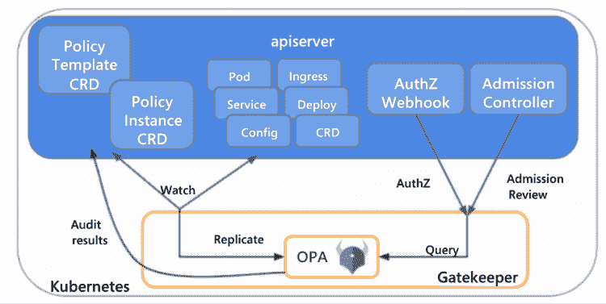
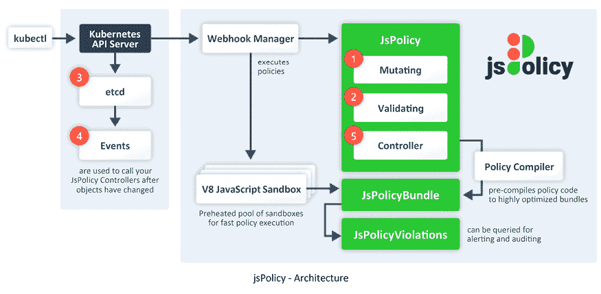
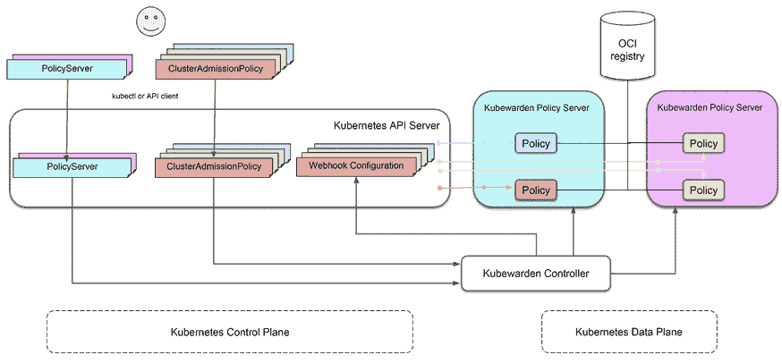
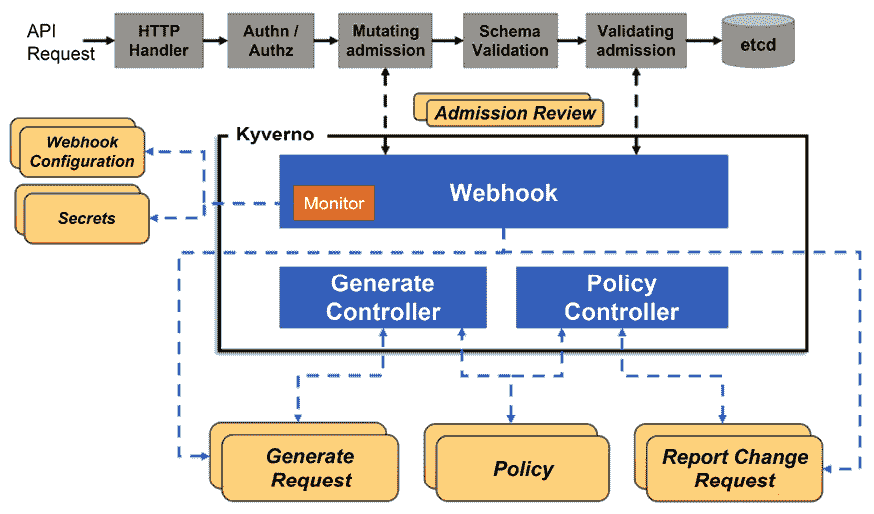
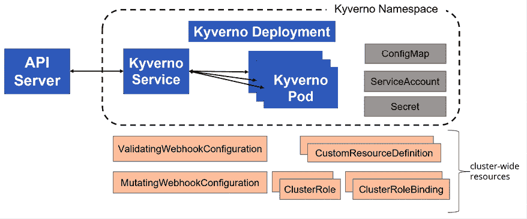
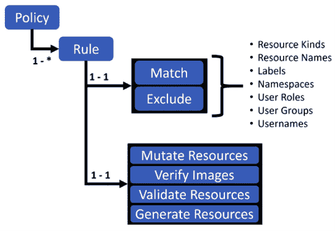
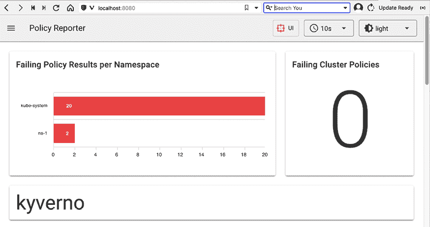
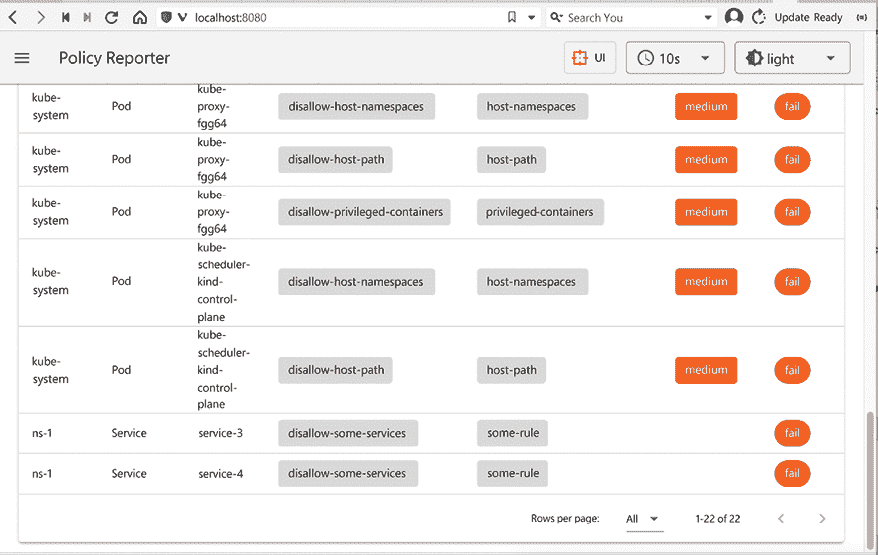
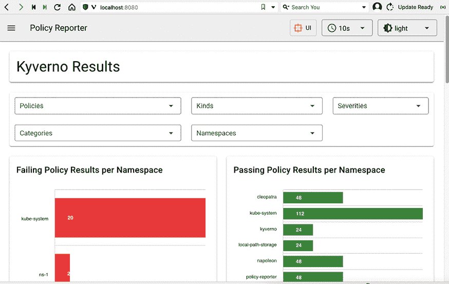

# 第十六章：Kubernetes 治理

在上一章中，我们详细讨论了扩展 Kubernetes 的不同方式，包括在接纳控制阶段验证和变更请求。

在这一章中，我们将学习 Kubernetes 在大型企业组织中日益增长的作用，什么是治理，以及它在 Kubernetes 中的应用。我们将探讨策略引擎，回顾一些流行的引擎，并深入了解 Kyverno。

这与上一章的内容相得益彰，因为策略引擎是建立在 Kubernetes 接纳控制机制之上的。

越来越多的企业组织将更多的资源投入到 Kubernetes 平台。这些大型组织有着严格的安全性、合规性和治理需求。Kubernetes 的策略引擎应运而生，旨在解决这些问题，并确保企业组织能够完全拥抱 Kubernetes。

我们将涵盖以下主题：

+   Kubernetes 在企业中的应用

+   什么是 Kubernetes 治理？

+   策略引擎

+   深入了解 Kyverno

让我们直接进入并了解 Kubernetes 在企业中的日益重要性。

# Kubernetes 在企业中的应用

Kubernetes 平台的推广和采用率是前所未有的。它于 2016 年正式推出，仅仅几年时间，它已经征服了基础设施的世界。在最近的 CNCF 调查中，96%的参与组织正在使用或评估 Kubernetes。Kubernetes 的渗透率跨越了多个维度：组织规模、地理位置，以及生产环境和非生产环境。更令人印象深刻的是，Kubernetes 可以深入底层，成为其他技术和平台的基础。

你可以从所有云服务提供商广泛采用 Kubernetes 平台中看到这一点，许多提供商也推出了各种托管 Kubernetes 平台即服务的产品。请查看 CNCF 认证的 Kubernetes 软件合规性列表：[`www.cncf.io/certification/software-conformance`](https://www.cncf.io/certification/software-conformance)。

拥有多个认证供应商、增值经销商、多个公司的生态系统等，对于企业组织来说极为重要。企业组织不仅仅需要最新的闪亮技术。风险很高，大型基础设施项目的失败率也很高，失败的后果十分严峻。将这些因素结合起来，结果是企业组织在技术方面非常抗拒变革，且回避风险。许多在交通控制、保险、医疗、通信系统和航空等领域的关键软件系统，依然运行在 40 至 50 年前编写的软件上，使用的是 COBOL 和 Fortran 等语言。

## 企业软件的需求

让我们看一下企业软件的一些需求：

+   处理大量数据

+   与其他系统和应用集成

+   提供强大的安全功能

+   可扩展性和可用性

+   灵活且可定制

+   合规性

+   获得受信任供应商的支持

+   拥有强大的治理（稍后将详细讨论）

Kubernetes 如何符合要求？

## Kubernetes 与企业软件

Kubernetes 在企业软件领域的使用增长如此迅猛，原因在于它实际上满足了所有需求并不断改进。

作为容器编排平台的事实标准，它可以作为所有基于容器的部署的基础。它的生态系统满足任何集成需求，因为每个供应商都必须能够在 Kubernetes 上运行。Kubernetes 的长期前景极为广阔，因为它是众多公司和组织的集体努力，并且由一个开放且成功的过程推动，不断地交付成果。Kubernetes 引领着向多云和混合云部署的转变，遵循行业广泛的标准。

Kubernetes 的扩展性和灵活性意味着它可以满足特定企业所需的任何定制需求。

它真的是一个了不起的项目，设计上基于坚实的概念架构，能够在现实世界中始终如一地交付结果。

到此为止，Kubernetes 对于企业组织来说显然是非常合适的，但它如何满足治理的需求呢？

# 什么是 Kubernetes 治理？

治理是企业组织的重要需求之一。简而言之，它意味着控制组织的运作方式。治理的某些要素包括：

+   政策

+   伦理

+   进程

+   风险管理

+   管理

治理包括一种指定政策和机制以执行这些政策的方式，以及报告和审计。让我们来看看 Kubernetes 中治理的各个领域和实践。

## 镜像管理

容器运行的是嵌入在镜像中的软件。管理这些镜像是运行基于 Kubernetes 的系统中的一项关键活动。有几个方面需要考虑：如何构建镜像？如何审核第三方镜像？镜像存储在哪里？在这些决策上做出不当选择可能会影响系统的性能（例如，如果你使用了过大或臃肿的基础镜像），并且至关重要的是影响系统的安全性（例如，如果你使用了被破坏或存在漏洞的基础镜像）。镜像管理政策可以强制进行镜像扫描，或者确保你只能使用来自特定镜像注册表的经过审查的镜像。

## Pod 安全

Kubernetes 的工作单元是 pod。你可以为 pod 及其容器设置许多安全设置。不幸的是，默认的安全设置非常宽松。验证并强制执行 pod 安全策略可以解决这个问题。Kubernetes 对 pod 安全标准有强有力的支持和指导，并且提供了多个内置的安全配置文件。每个 pod 都有一个安全上下文，正如我们在*第四章*《*确保 Kubernetes 安全*》中讨论的那样。

请参阅 [`kubernetes.io/docs/concepts/security/pod-security-standards/`](https://kubernetes.io/docs/concepts/security/pod-security-standards/) 获取更多详细信息。

## 网络策略

Kubernetes 网络策略在 OSI 网络模型的第 3 层和第 4 层（IP 地址和端口）之间控制 pod 和其他网络实体之间的流量。网络实体可以是具有特定标签集的 pod，也可以是某个命名空间中所有具有特定标签集的 pod。最后，网络策略还可以阻止 pod 访问特定的 IP 块。

在治理的背景下，网络策略可以通过控制 pod 与其他资源之间的网络访问和通信来强制执行安全性和合规性要求。

例如，网络策略可以用来防止 pod 与某些外部网络进行通信。网络策略还可以用来强制执行职能分离，并防止未经授权的访问集群中的敏感资源。

请参阅 [`kubernetes.io/docs/concepts/services-networking/network-policies/`](https://kubernetes.io/docs/concepts/services-networking/network-policies/) 获取更多详细信息。

## 配置约束

Kubernetes 非常灵活，提供了许多控制选项，涵盖其操作的各个方面。在基于 Kubernetes 的系统中，DevOps 实践通常允许团队对工作负载的部署方式、扩展方式以及使用的资源拥有大量控制权。Kubernetes 提供了诸如配额和限制之类的配置约束。借助更先进的准入控制器，你可以验证并强制执行控制资源创建任何方面的策略，例如自动扩展部署的最大大小、持久卷声明的总量，并要求内存请求始终等于内存限制（虽然这不一定是个好主意）。

## RBAC 和准入控制

Kubernetes **RBAC**（**基于角色的访问控制**）在资源和操作级别运行。每个 Kubernetes 资源都有可执行的操作（动词）。使用 RBAC，你可以定义角色，这些角色是对资源的权限集合，可以在命名空间级别或集群级别应用。它是一个粗粒度的工具，但非常方便，特别是当你在命名空间级别划分资源，并仅使用集群级别权限来管理跨整个集群运行的工作负载时。

如果你需要更细粒度的控制，依赖于资源的特定属性，那么准入控制器可以处理此类需求。我们将在本章后续部分探讨此选项，讨论策略引擎时会详细说明。

## 策略管理

治理是围绕策略建立的。管理所有这些策略、组织它们，并确保它们满足组织的治理需求需要大量的努力，并且是一个持续的任务。准备好为不断发展和维护你的策略投入资源。

## 策略验证与执行

一旦一组策略确定下来，你需要验证 Kubernetes API 服务器的请求是否符合这些策略，并拒绝违反这些政策的请求。还有一种实施策略的方法是通过修改传入请求，使其符合政策。例如，如果一项政策要求每个 Pod 的内存请求最多为 2 GiB，那么一个变更策略可以将内存请求大于 2 GiB 的 Pod 的内存请求减少到 2 GiB。

政策不必是僵化的。对于特殊情况，可以做出例外和排除。

## 报告

当你管理大量的政策并审核所有请求时，了解你的政策如何帮助治理系统、预防问题并从使用模式中学习是很重要的。报告可以通过捕捉和汇总政策决策的结果来提供洞察。作为人工用户，你可以查看关于政策违规、被拒绝和被修改请求的报告，并检测趋势或异常。在更高层次上，你可以采用自动化分析，包括基于机器学习的模型，从大量详细报告中提取意义。

## 审计

Kubernetes 审计日志提供了每个事件的时间戳详细记录。当你将审计数据与治理报告结合时，可以拼凑出事件的时间线，特别是安全事件，通过结合多个来源的数据，从政策违规开始，最终追溯到根本原因，从而识别罪魁祸首。

到目前为止，我们已经涵盖了治理的基本概念及其与 Kubernetes 的具体关系。我们强调了政策在治理系统中的重要性。接下来，我们将探讨策略引擎以及它们如何实现这些概念。

# 策略引擎

Kubernetes 中的策略引擎提供了全面的治理需求覆盖，并补充了内建机制，如网络策略和 RBAC。策略引擎可以验证并确保系统遵循最佳实践，遵守安全指南，并符合外部政策。在这一部分，我们将介绍准入控制作为策略引擎接入系统的主要机制，策略引擎的职责，以及现有策略引擎的回顾。接下来，我们将深入探讨其中最优秀的策略引擎之一——Kyverno。

## 准入控制作为策略引擎的基础

准入控制是请求进入 Kubernetes API 服务器生命周期的一部分。我们在*第十五章*《扩展 Kubernetes》中进行了深入讨论。如你所记得，动态准入控制器是监听准入审核请求的 Webhook 服务器，能够接受、拒绝或修改请求。策略引擎首先是复杂的准入控制器，它们注册并监听与其策略相关的所有请求。

当请求到来时，策略引擎会应用所有相关的策略来决定请求的处理方式。例如，如果某个策略确定只有在名为`load_balancer`的命名空间中，才可以创建`LoadBalancer`类型的 Kubernetes 服务，那么策略引擎会注册监听所有 Kubernetes 服务创建和更新请求。当服务创建或更新请求到达时，策略引擎会检查服务的类型和命名空间。如果服务类型是`LoadBalancer`且命名空间不是`load_balancer`，则策略引擎会拒绝该请求。请注意，这种操作无法通过 RBAC 完成。因为 RBAC 无法查看服务的类型来确定请求是否有效。

现在我们理解了策略引擎如何利用 Kubernetes 的动态准入控制过程，让我们来看看策略引擎的职责。

## 策略引擎的职责

策略引擎是对 Kubernetes 基础系统执行治理的主要工具。策略引擎应该允许管理员定义超出内建 Kubernetes 策略（如 RBAC 和网络策略）的策略。这通常意味着需要创建一个策略声明语言。该策略声明语言需要足够丰富，能够覆盖 Kubernetes 的所有细节，包括针对不同资源的细粒度应用，以及获取所有相关信息以便对每个资源的接受或拒绝做出决策。

策略引擎还应该提供一种组织、查看和管理策略的方式。理想情况下，策略引擎提供了一种在将策略应用到实际集群之前测试策略的良好方式。

策略引擎必须提供一种将策略部署到集群的方法，并且当然，它需要应用与每个请求相关的策略，决定该请求是否应该按原样接受、拒绝或修改（变异）。策略引擎还可以提供一种在请求到来时生成额外资源的方式。例如，当创建新的 Kubernetes 部署时，策略引擎可能会自动为该部署生成一个水平 Pod 自动扩展器。策略引擎还可以监听集群中发生的事件并采取行动。请注意，这种能力超出了动态准入控制的范围，但它仍然会在集群上执行策略。

让我们回顾一下几个 Kubernetes 的策略引擎，以及它们是如何履行这些责任的。

## 开源策略引擎的快速回顾

在评估解决方案时，提前制定评估标准非常有帮助，因为政策引擎可能会深刻影响 Kubernetes 集群的运行，而集群工作负载的成熟度是一个关键要素。优秀的文档也至关重要，因为政策引擎的范围非常广泛，你需要了解如何与其协作。政策引擎的功能决定了它能处理哪些用例。编写政策是管理员向政策引擎传达治理意图的方式。评估编写和测试政策的用户体验，以及支持这些活动的工具也很重要。将政策部署到集群中是另一个必不可少的元素。最后，查看报告并理解治理状态可能会被忽视。

我们将根据以下维度评估五种政策引擎。

### OPA/Gatekeeper

**开放政策代理** (**OPA**) 是一个通用的政策引擎，超越了 Kubernetes（[`www.openpolicyagent.org`](https://www.openpolicyagent.org)）。它的范围非常广泛，能够处理任何 JSON 值。

Gatekeeper（[`open-policy-agent.github.io/gatekeeper`](https://open-policy-agent.github.io/gatekeeper)）通过将 OPA 政策引擎打包成一个准入控制 webhook，将其引入 Kubernetes。

OPA/Gatekeeper 无疑是最成熟的政策引擎。它创建于 2017 年，是一个已毕业的 CNCF 项目，在撰写本文时，它在 GitHub 上有 2.9k 个星标。它甚至被用作 Azure AKS 上政策的基础。详见 [`learn.microsoft.com/en-us/azure/governance/policy/concepts/policy-for-kubernetes`](https://learn.microsoft.com/en-us/azure/governance/policy/concepts/policy-for-kubernetes)。

OPA 有自己独特的语言，叫做 Rego（[`www.openpolicyagent.org/docs/latest/policy-language/`](https://www.openpolicyagent.org/docs/latest/policy-language/)），用来定义政策。Rego 有强大的理论基础，受到 Datalog 的启发，但它可能不太直观，理解起来也不容易。

下图展示了 OPA/Gatekeeper 的架构：



图 16.1：OPA/Gatekeeper 架构

总体而言，OPA/Gatekeeper 非常强大，但与其他 Kubernetes 政策引擎相比，似乎有些笨重，因为 OPA 政策引擎是通过 Gatekeeper 被附加到 Kubernetes 上的。

OPA/Gatekeeper 的文档较为一般，导航不太方便。不过，它确实有一个可以作为起点使用的政策库。

然而，如果你看重其成熟度，并且不太担心使用 Rego 和一些摩擦，它可能是一个不错的选择。

### Kyverno

Kyverno ([`kyverno.io`](https://kyverno.io)) 是一个成熟且强大的策略引擎，专门为 Kubernetes 从一开始就设计。它创建于 2019 年，并在此之后取得了巨大进展。它是一个 CNCF 孵化项目，在 GitHub 上的受欢迎程度已经超过了 OPA/Gatekeeper，截至写作时有 3.3k 个星标。Kyverno 使用 YAML JMESPath ([`jmespath.org`](https://jmespath.org)) 来定义策略，实际上这些策略只是 Kubernetes 自定义资源。它有优秀的文档支持，并且提供了许多示例来帮助你开始编写自己的策略。

总体而言，Kyverno 功能强大且易于使用。它背后有巨大的支持势头，持续不断地改进和提升其性能与规模化操作。在我看来，它目前是最好的 Kubernetes 策略引擎。我们将在本章后续部分深入探讨 Kyverno。

### jsPolicy

jsPolicy ([`www.jspolicy.com`](https://www.jspolicy.com)) 是 Loft 推出的一个有趣项目，它为 Kubernetes 社区带来了虚拟集群。它的亮点在于，策略在一个安全且高效的浏览器式沙箱中运行，而你可以用 JavaScript 或 TypeScript 来定义策略。这个方法非常新颖，项目也很精致、简洁，且有很好的文档支持。不幸的是，Loft 似乎将精力放在其他项目上，jsPolicy 并没有受到太多关注。在写作时，它在 GitHub 上只有 242 个星标 ([`github.com/loft-sh/jspolicy`](https://github.com/loft-sh/jspolicy))，而且最后一次提交是在 6 个月前。

利用 JavaScript 生态系统来打包和共享策略，并利用其强大的工具来测试和调试策略，这个思路有很多优点。

jsPolicy 提供验证、变异和控制策略。控制策略允许你响应集群中发生的事件，超出了准入控制的范围。

以下图表展示了 jsPolicy 的架构：



图 16.2：jsPolicy 架构

目前，我不会承诺使用 jsPolicy，因为它可能已经被放弃。然而，如果 Loft 或其他人决定投资于它，它可能成为 Kubernetes 策略引擎领域的一个有力竞争者。

### Kubewarden

Kubewarden ([`www.kubewarden.io`](https://www.kubewarden.io)) 是另一个创新的策略引擎。它是一个 CNCF 沙箱项目。Kubewarden 专注于语言无关性，允许你用多种语言编写策略。然后，这些策略会被打包成 WebAssembly 模块，存储在任何 OCI 注册表中。

理论上，你可以使用任何可以编译成 WebAssembly 的语言。实际上，以下语言被支持，但有一些限制：

+   Rust（当然，这是最成熟的）

+   Go（你需要使用一个特殊的编译器 TinyGo，它不支持 Go 的所有功能）

+   Rego（直接使用 OPA 或 Gatekeeper – 缺少变异策略）

+   Swift（使用 SwiftWasm，需进行一些后构建优化）

+   TypeScript（或更准确地说，是一个名为 AssemblyScript 的子集）

Kubewarden 支持验证、变更和上下文感知策略。上下文感知策略是指利用额外信息来判断是否应该允许请求。额外信息可能包括集群中存在的命名空间、服务和入口等列表。

Kubewarden 有一个 CLI 工具叫做 kwctl（[`github.com/kubewarden/kwctl`](https://github.com/kubewarden/kwctl)），用于管理你的策略。

下面是 Kubewarden 架构的示意图：



图 16.3：Kubewarden 架构

Kubewarden 仍在不断发展和成长。它有一些不错的创意和动机，但在这个阶段，如果你是 Rust 语言的支持者并偏爱用 Rust 编写策略，它可能最适合你。

现在我们已经了解了 Kubernetes 开源策略引擎的整体情况，让我们深入探讨并仔细了解 Kyverno。

# Kyverno 深入分析

Kyverno 是 Kubernetes 策略引擎领域的一颗新星。让我们动手实践一下，看看它如何工作，以及为什么它如此受欢迎。在这一节中，我们将介绍 Kyverno，安装它，并学习如何编写、应用和测试策略。

## Kyverno 简介

Kyverno 是一个专门为 Kubernetes 设计的策略引擎。如果你有使用 kubectl、Kubernetes 清单或 YAML 的经验，那么 Kyverno 会让你感觉非常熟悉。你通过 YAML 清单和 JMESPath 语言定义策略和配置，后者与 kubectl 的 JSONPATH 格式非常接近。

以下图示展示了 Kyverno 架构：



图 16.4：Kyverno 架构

Kyverno 覆盖了很多领域并拥有许多功能：

+   使用 GitOps 进行策略管理

+   资源验证（拒绝无效资源）

+   资源变更（修改无效资源）

+   资源生成（自动生成额外的资源）

+   验证容器镜像（对软件供应链安全非常重要）

+   检查镜像元数据

+   使用标签选择器和通配符匹配和排除资源（Kubernetes 原生）

+   使用叠加层验证和变更资源（类似 Kustomize！）

+   在命名空间间同步配置

+   以报告或强制模式运行

+   使用动态准入 Webhook 应用策略

+   在 CI/CD 阶段使用 Kyverno CLI 应用策略

+   使用 Kyverno CLI 进行临时策略测试和资源验证

+   高可用模式

+   失败时开放或关闭（在 Kyverno 准入 Webhook 不可用时，允许或拒绝资源）

+   策略违规报告

+   提供 Web UI，方便可视化

+   可观察性支持

这是一个令人印象深刻的功能和能力列表。Kyverno 的开发者不断发展和改进它。Kyverno 在可扩展性、性能和处理大量策略与资源的能力方面取得了巨大进展。

让我们安装 Kyverno 并进行配置。

## 安装和配置 Kyverno

Kyverno 遵循与 Kubernetes 本身类似的升级策略，其中节点组件版本最多只能比控制平面版本低两个小版本。撰写时，Kyverno 1.8 是最新版本，支持 Kubernetes 版本 1.23–1.25。

我们可以使用 kubectl 或 Helm 安装 Kyverno。我们选择 Helm 选项：

```
$ helm repo add kyverno https://kyverno.github.io/kyverno/
"kyverno" has been added to your repositories
$ helm repo update
Hang tight while we grab the latest from your chart repositories...
...Successfully got an update from the "kyverno" chart repository
Update Complete. Happy Helming! 
```

让我们安装 Kyverno，使用默认的单副本模式，安装到它自己的命名空间中。使用单副本不推荐用于生产环境，但对于实验 Kyverno 来说是可以的。要以高可用模式安装，添加 `--set replicaCount=3` 标志：

```
$ helm install kyverno kyverno/kyverno -n kyverno --create-namespace
NAME: kyverno
LAST DEPLOYED: Sat Dec 31 15:34:11 2022
NAMESPACE: kyverno
STATUS: deployed
REVISION: 1
NOTES:
Chart version: 2.6.5
Kyverno version: v1.8.5
Thank you for installing kyverno! Your release is named kyverno.
 WARNING: Setting replicas count below 3 means Kyverno is not running in high availability mode.
 Note: There is a trade-off when deciding which approach to take regarding Namespace exclusions. Please see the documentation at https://kyverno.io/docs/installation/#security-vs-operability to understand the risks. 
```

让我们使用 ketall kubectl 插件观察一下刚刚安装的内容：([`github.com/corneliusweig/ketall`](https://github.com/corneliusweig/ketall))：

```
$ k get-all -n kyverno
NAME                                                          NAMESPACE  AGE
configmap/kube-root-ca.crt                                    kyverno    2m27s
configmap/kyverno                                             kyverno    2m26s
configmap/kyverno-metrics                                     kyverno    2m26s
endpoints/kyverno-svc                                         kyverno    2m26s
endpoints/kyverno-svc-metrics                                 kyverno    2m26s
pod/kyverno-7c444878f7-gfht8                                  kyverno    2m26s
secret/kyverno-svc.kyverno.svc.kyverno-tls-ca                 kyverno    2m22s
secret/kyverno-svc.kyverno.svc.kyverno-tls-pair               kyverno    2m21s
secret/sh.helm.release.v1.kyverno.v1                          kyverno    2m26s
serviceaccount/default                                        kyverno    2m27s
serviceaccount/kyverno                                        kyverno    2m26s
service/kyverno-svc                                           kyverno    2m26s
service/kyverno-svc-metrics                                   kyverno    2m26s
deployment.apps/kyverno                                       kyverno    2m26s
replicaset.apps/kyverno-7c444878f7                            kyverno    2m26s
lease.coordination.k8s.io/kyverno                             kyverno    2m23s
lease.coordination.k8s.io/kyverno-health                      kyverno    2m13s
lease.coordination.k8s.io/kyvernopre                          kyverno    2m25s
lease.coordination.k8s.io/kyvernopre-lock                     kyverno    2m24s
endpointslice.discovery.k8s.io/kyverno-svc-7ghzl              kyverno    2m26s
endpointslice.discovery.k8s.io/kyverno-svc-metrics-qflr5      kyverno    2m26s
rolebinding.rbac.authorization.k8s.io/kyverno:leaderelection  kyverno    2m26s
role.rbac.authorization.k8s.io/kyverno:leaderelection         kyverno    2m26s 
```

如你所见，Kyverno 安装了所有预期的资源：部署、服务、角色及角色绑定、配置映射和密钥。我们可以看出，Kyverno 还暴露了度量指标并使用了领导者选举。

此外，Kyverno 还安装了许多 CRD（在集群范围内）：

```
$ k get crd
NAME                                      CREATED AT
admissionreports.kyverno.io               2022-12-31T23:34:12Z
backgroundscanreports.kyverno.io          2022-12-31T23:34:12Z
clusteradmissionreports.kyverno.io        2022-12-31T23:34:12Z
clusterbackgroundscanreports.kyverno.io   2022-12-31T23:34:12Z
clusterpolicies.kyverno.io                2022-12-31T23:34:12Z
clusterpolicyreports.wgpolicyk8s.io       2022-12-31T23:34:12Z
generaterequests.kyverno.io               2022-12-31T23:34:12Z
policies.kyverno.io                       2022-12-31T23:34:12Z
policyreports.wgpolicyk8s.io              2022-12-31T23:34:12Z
updaterequests.kyverno.io                 2022-12-31T23:34:12Z 
```

最后，Kyverno 配置了几个准入控制 Webhook：

```
$ k get validatingwebhookconfigurations
NAME                                      WEBHOOKS   AGE
kyverno-policy-validating-webhook-cfg     1          40m
kyverno-resource-validating-webhook-cfg   1          40m
$ k get mutatingwebhookconfigurations
NAME                                    WEBHOOKS   AGE
kyverno-policy-mutating-webhook-cfg     1          40m
kyverno-resource-mutating-webhook-cfg   0          40m
kyverno-verify-mutating-webhook-cfg     1          40m 
```

下图展示了典型的 Kyverno 安装结果：



图 16.5：典型的 Kyverno 安装

### 安装 pod 安全策略

Kyverno 拥有一个庞大的预构建策略库。我们也可以使用 Helm 安装 pod 安全标准策略（见 [`kyverno.io/policies/pod-security/`](https://kyverno.io/policies/pod-security/)）：

```
$ helm install kyverno-policies kyverno/kyverno-policies -n kyverno-policies --create-namespace
NAME: kyverno-policies
LAST DEPLOYED: Sat Dec 31 15:48:26 2022
NAMESPACE: kyverno-policies
STATUS: deployed
REVISION: 1
TEST SUITE: None
NOTES:
Thank you for installing kyverno-policies 2.6.5 
We have installed the "baseline" profile of Pod Security Standards and set them in audit mode.
Visit https://kyverno.io/policies/ to find more sample policies. 
```

注意，策略本身是集群策略，不会在命名空间 `kyverno-policies` 中显示：

```
$ k get clusterpolicies.kyverno.io
NAME                             BACKGROUND   VALIDATE ACTION   READY
disallow-capabilities            true         audit             true
disallow-host-namespaces         true         audit             true
disallow-host-path               true         audit             true
disallow-host-ports              true         audit             true
disallow-host-process            true         audit             true
disallow-privileged-containers   true         audit             true
disallow-proc-mount              true         audit             true
disallow-selinux                 true         audit             true
restrict-apparmor-profiles       true         audit             true
restrict-seccomp                 true         audit             true
restrict-sysctls                 true         audit             true 
```

我们稍后会深入回顾其中的一些策略。首先，让我们看看如何配置 Kyverno。

### 配置 Kyverno

你可以通过编辑 Kyverno 配置映射来配置 Kyverno 的行为：

```
$ k get cm kyverno -o yaml -n kyverno | yq .data
resourceFilters: '[*,kyverno,*][Event,*,*][*,kube-system,*][*,kube-public,*][*,kube-node-lease,*][Node,*,*][APIService,*,*][TokenReview,*,*][SubjectAccessReview,*,*][SelfSubjectAccessReview,*,*][Binding,*,*][ReplicaSet,*,*][AdmissionReport,*,*][ClusterAdmissionReport,*,*][BackgroundScanReport,*,*][ClusterBackgroundScanReport,*,*][ClusterRole,*,kyverno:*][ClusterRoleBinding,*,kyverno:*][ServiceAccount,kyverno,kyverno][ConfigMap,kyverno,kyverno][ConfigMap,kyverno,kyverno-metrics][Deployment,kyverno,kyverno][Job,kyverno,kyverno-hook-pre-delete][NetworkPolicy,kyverno,kyverno][PodDisruptionBudget,kyverno,kyverno][Role,kyverno,kyverno:*][RoleBinding,kyverno,kyverno:*][Secret,kyverno,kyverno-svc.kyverno.svc.*][Service,kyverno,kyverno-svc][Service,kyverno,kyverno-svc-metrics][ServiceMonitor,kyverno,kyverno-svc-service-monitor][Pod,kyverno,kyverno-test]'
webhooks: '[{"namespaceSelector": {"matchExpressions": 
[{"key":"kubernetes.io/metadata.name","operator":"NotIn","values":["kyverno"]}]}}]' 
```

`resourceFilters` 标志是一个格式为 `[kind,namespace,name]` 的列表，其中每个元素也可以是通配符，用于告诉 Kyverno 哪些资源应被忽略。匹配任何过滤器的资源将不受任何 Kyverno 策略的约束。如果你有大量策略，这是个良好的实践，可以节省评估所有策略的工作量。

`webHooks` 标志允许你过滤掉整个命名空间。

`excludeGroupRole` 标志是一个由逗号分隔的角色字符串。它将排除具有指定角色的用户的请求，这些请求将不经过 Kyverno 准入控制。默认列表为 `system:serviceaccounts:kube-system,system:nodes,system:kube-scheduler`。

`excludeUsername` 标志表示一个由逗号分隔的 Kubernetes 用户名字符串。当用户在 `generate policy` 中启用 `Synchronize` 时，Kyverno 成为唯一能够更新或删除生成资源的实体。然而，管理员可以排除特定的用户名，使其无法访问删除/更新生成资源的功能。

`generateSuccessEvents` 标志是一个布尔参数，用于确定是否应生成成功事件。默认情况下，此标志设置为 `false`，表示不会生成成功事件。

此外，Kyverno 容器提供了几个可以配置的容器参数，以自定义其行为和功能。这些参数允许精细调整和定制 Kyverno 在容器内的行为。你可以编辑 Kyverno 部署中的参数列表：

```
$ k get deploy kyverno -n kyverno -o yaml | yq '.spec.template.spec.containers[0].args'
- --autogenInternals=true
- --loggingFormat=text 
```

除了预配置的 `--autogenInternals` 和 `--loggingFormat` 外，还有以下标志可用：

+   `admissionReports`

+   `allowInsecureRegistry`

+   `autoUpdateWebhooks`

+   `backgroundScan`

+   `clientRateLimitBurst`

+   `clientRateLimitQPS`

+   `disableMetrics`

+   `enableTracing`

+   `genWorkers`

+   `imagePullSecrets`

+   `imageSignatureRepository`

+   `kubeconfig`

+   `maxQueuedEvents`

+   `metricsPort`

+   `otelCollector`

+   `otelConfig`

+   `profile`

+   `profilePort`

+   `protectManagedResources`

+   `reportsChunkSize`

+   `serverIP`

+   `splitPolicyReport`（已弃用 – 将在 1.9 版本中移除）

+   `transportCreds`

+   `webhookRegistrationTimeout`

+   `webhookTimeout`

所有标志都有默认值，只有在你想覆盖默认值时才需要指定它们。

查看 [`kyverno.io/docs/installation/#container-flags`](https://kyverno.io/docs/installation/#container-flags) 以获取每个标志的详细信息。

我们安装了 Kyverno，观察了它安装的各种资源，并查看了它的配置。现在是时候查看 Kyverno 的策略和规则了。

## 应用 Kyverno 策略

在用户级别，Kyverno 的工作单位是策略。你可以将策略作为 Kubernetes 资源应用，编写和编辑自己的策略，并使用 Kyverno CLI 测试策略。

应用 Kyverno 策略就像应用其他资源一样简单。让我们看一下我们之前安装的一个策略：

```
$ k get clusterpolicies.kyverno.io disallow-capabilities
NAME                    BACKGROUND   VALIDATE ACTION   READY
disallow-capabilities   true         audit             true 
```

该策略的目的是防止 Pod 请求超出允许列表的额外 Linux 能力（见 [`linux-audit.com/linux-capabilities-101/`](https://linux-audit.com/linux-capabilities-101/)）。不允许的能力之一是 `NET_ADMIN`。让我们创建一个请求该能力的 Pod：

```
$ cat <<EOF | kubectl apply -f -
apiVersion: v1
kind: Pod
metadata:
  name: some-pod
spec:
  containers:
  - name: some-container
    command: [ "sleep", "999999" ]
    image: g1g1/py-kube:0.3
    securityContext:
      capabilities:
        add: ["NET_ADMIN"]
EOF    
pod/some-pod created 
```

Pod 已创建，我们可以验证它是否具有 `NET_ADMIN` 能力。我使用的是 kind 集群，所以集群节点只是一个 Docker 进程，我们可以进入该进程：

```
$ docker exec -it kind-control-plane sh
# 
```

现在我们已经进入节点内部的 shell，我们可以搜索容器的进程，它会休眠 999,999 秒：

```
# ps aux | grep 'PID\|sleep' | grep -v grep
USER         PID %CPU %MEM    VSZ   RSS TTY      STAT START   TIME COMMAND
root        4549  0.0  0.0 148276  6408 ?        Ssl  02:54   0:00 /usr/bin/qemu-x86_64 /bin/sleep 999999 
```

让我们检查一下进程 4549 的能力：

```
# getpcaps 4549
4549: cap_chown,cap_dac_override,cap_fowner,cap_fsetid,cap_kill,cap_setgid,cap_setuid,cap_setpcap,cap_net_bind_service,cap_net_admin,cap_net_raw,cap_sys_chroot,cap_mknod,cap_audit_write,cap_setfcap=ep 
```

如你所见，`cap_net_admin` 已经存在。

Kyverno 没有阻止创建 pod，因为策略仅在审计模式下运行：

```
$ k get clusterpolicies.kyverno.io disallow-capabilities -o yaml | yq .spec.validationFailureAction
audit 
```

让我们删除 pod 并将策略更改为“强制”模式：

```
$ k delete po some-pod
pod "some-pod" deleted
$ k patch clusterpolicies.kyverno.io disallow-capabilities --type merge -p '{"spec": {"validationFailureAction": "enforce"}}'
clusterpolicy.kyverno.io/disallow-capabilities patched 
```

现在，如果我们尝试再次创建 pod，结果会截然不同：

```
$ cat <<EOF | kubectl apply -f -
apiVersion: v1
kind: Pod
metadata:
  name: some-pod
spec:
  containers:
  - name: some-container
    command: [ "sleep", "999999" ]
    image: g1g1/py-kube:0.3
    securityContext:
      capabilities:
        add: ["NET_ADMIN"]
EOF
Error from server: error when creating "STDIN": admission webhook "validate.kyverno.svc-fail" denied the request:
policy Pod/kyverno-policies/some-pod for resource violation:
disallow-capabilities:
  adding-capabilities: Any capabilities added beyond the allowed list (AUDIT_WRITE,
    CHOWN, DAC_OVERRIDE, FOWNER, FSETID, KILL, MKNOD, NET_BIND_SERVICE, SETFCAP, SETGID,
    SETPCAP, SETUID, SYS_CHROOT) are disallowed. 
```

Kyverno 准入 webhook 强制执行策略并拒绝了 pod 的创建。甚至告诉我们是哪个策略负责（`disallow-capabilities`），并显示了一个详细的消息，解释了拒绝的原因，包括允许的能力列表。

应用策略非常简单。编写策略要复杂得多，需要理解资源请求、Kyverno 匹配规则和 JMESPath 语言。在编写策略之前，我们需要了解它们的结构及其不同元素。

## 深入了解 Kyverno 策略

在本节中，我们将学习有关 Kyverno 策略的所有细节。Kyverno 策略包含一组规则，定义策略的实际功能，并具有几个通用设置，定义策略在不同场景下的行为。让我们从策略设置开始，然后深入到规则和不同的使用案例，如验证、变异和生成资源。

### 理解策略设置

Kyverno 策略可以具有以下设置：

+   `applyRules`

+   `validationFailureAction`

+   `validationFailureActionOverrides`

+   `background` 设置确定在后台扫描期间是否应用策略到现有资源。默认为“true”。

+   `schemaValidation`

+   `failurePolicy`

+   `webhookTimeoutSeconds`

`applyRules` 设置确定是否仅适用一个或多个规则于匹配资源。有效值为“One”和“All”（默认）。如果 `applyRules` 设置为“One”，则将评估第一个匹配规则，忽略其他规则。

`validationFailureAction` 设置确定失败的验证策略规则是否应拒绝接受请求或仅报告它。有效值为“audit”（默认 - 始终允许并仅报告违规）和“enforce”（阻止无效请求）。

`validationFailureActionOverrides` 设置是 `ClusterPolicy` 属性，用于为特定命名空间覆盖 `validationFailureAction`。

`background` 设置确定在后台扫描期间是否应用策略到现有资源。默认值为“true”。

`schemaValidation` 设置确定是否应用策略验证检查。默认为“true”。

`failurePolicy` 设置确定 API 服务器在 webhook 未能响应时的行为。有效值为“Ignore”和“Fail”（默认）。如果设置为“Fail”，即使资源请求有效，也将被拒绝，同时 webhook 不可达。

`webhookTimeoutSeconds` 设置确定 webhook 允许评估策略的最长时间（以秒为单位）。有效值为 1 到 30 秒。默认为 10 秒。如果 webhook 未能及时响应，则 `failurePolicy`（见上文）决定请求的结果。

### 理解 Kyverno 策略规则

每个 Kyverno 策略都有一个或多个规则。每个规则都有一个`match`声明，一个可选的`exclude`声明，一个可选的`preconditions`声明，并且有且只有以下声明之一：

+   `validate`

+   `mutate`

+   `generate`

+   `verifyImages`

下图演示了 Kyverno 策略及其规则的结构（省略了策略设置）：



图 16.6：Kyverno 规则结构

让我们回顾一下不同的声明，并探讨一些高级话题。

#### 匹配请求

当资源请求到达时，Kyverno webhook 需要为每个策略确定请求的资源和/或操作是否与当前策略相关。强制性的`match`声明有多个过滤器，用来确定策略是否应该评估当前请求。这些过滤器是：

+   `resources`

+   `subjects`

+   `roles`

+   `clusterRoles`

`match`声明可以有多个过滤器，这些过滤器可以在`any`语句或`all`语句下分组。当过滤器在`any`下分组时，Kyverno 将应用 OR 语义进行匹配，如果任何过滤器匹配请求，则请求被视为匹配。当过滤器在`all`下分组时，Kyverno 将应用 AND 语义，所有过滤器必须匹配才能认为请求是匹配的。

这可能有些让人感到不知所措。让我们来看一个示例。以下策略规范有一个名为`some-rule`的单个规则。该规则有一个`match`声明，包含两个资源过滤器，且它们在`any`语句下分组。第一个资源过滤器匹配类型为`Service`的资源，名称为`service-1`或`service-2`。第二个资源过滤器匹配在`ns-1`命名空间中的类型为`Service`的资源。这个规则将匹配任何名为`service-1`或`service-2`的 Kubernetes 服务，无论它们在哪个命名空间中，以及`ns-1`命名空间中的任何服务。

```
spec:
  rules:
  - name: some-rule
    match:
      any:
      - resources:
          kinds: 
          - Service
          names: 
          - "service-1" 
          - "service-2"
      - resources:
          kinds: 
          - Service
          namespaces:
          - "ns-1" 
```

让我们看一个不同的例子。这次我们添加一个集群角色过滤器。以下规则将匹配类型为名为`service-1`的服务，并且请求用户具有名为`some-cluster-role`的集群角色的请求。

```
 rules:
    - name: some-rule
      match:
        all:
          - resources:
              kinds:
                - Service
              names:
                - "service-1"
            clusterRoles:
              - some-cluster-role 
```

访问审核资源包含所有与请求用户或服务帐户绑定的角色和集群角色。

#### 排除资源

排除资源与匹配非常相似。设置策略以禁止所有请求创建或更新某些资源，除非它们是在特定命名空间中或由具有特定角色的用户发出的，这是一种常见做法。下面是一个示例，匹配所有服务，但排除`ns-1`命名空间：

```
rules:
- name: some-rule
  match:
    any:
      - resources:
          kinds:
            - Service
  exclude:
    any:
      - resources:
          namespaces:
            - "ns-1" 
```

另一个常见的排除是针对特定角色，如`cluster-admin`。

#### 使用前提条件

使用`match`和`exclude`来限制策略的范围是很好的，但在许多情况下，这不足以满足需求。有时，你需要根据细粒度的细节（如内存请求）来选择资源。下面是一个示例，匹配所有请求内存小于 1 GiB 的 pod。

键值语法使用 JMESPath ([`jmespath.org`](https://jmespath.org)) 在内置请求对象上：

```
 rules:
  - name: memory-limit
    match:
      any:
      - resources:
          kinds:
          - Pod
    preconditions:
      any:
      - key: "{{request.object.spec.containers[*].resources.requests.memory}}"
        operator: LessThan
        value: 1Gi 
```

### 验证请求

Kyverno 的主要用例是验证请求。验证规则有一个 `validate` 语句。`validate` 语句包含一个 `message` 字段，当请求验证失败时会显示该消息。验证规则有两种形式，基于模式的验证和基于拒绝的验证。让我们逐一查看它们。正如你可能记得的那样，资源验证失败的结果取决于 `validationFailureAction` 字段，可以是 `audit` 或 `enforce`。

#### 基于模式的验证

一个基于模式的验证规则在 `validate` 语句下有一个 `pattern` 字段。如果资源不匹配该模式，则规则失败。这里是一个基于模式的验证示例，要求资源必须有一个名为 `app` 的标签：

```
 validate:
      message: "The resource must have a label named `app`."
      pattern:
        metadata:
          labels:
            some-label: "app" 
```

验证部分只会应用于符合 `match` 和 `preconditions` 语句的请求，并且如果有 `exclude` 语句，也不会排除这些请求。

你还可以对模式中的值应用运算符——例如，这里有一个验证规则，要求部署的副本数至少为 3：

```
 rules:
    - name: validate-replica-count
      match:
        any:
        - resources:
            kinds:
            - Deployment
      validate:
        message: "Replica count for a Deployment must be at least 3."
        pattern:
          spec:
            replicas: ">=3" 
```

#### 基于拒绝的验证

一个基于拒绝的验证规则在 `validate` 语句下有一个 `deny` 字段。拒绝规则类似于我们之前看到的用于选择资源的前置条件。每个拒绝条件都有一个键、一个运算符和一个值。拒绝条件的常见用途是禁止某个特定操作，如 `DELETE`。以下示例使用基于拒绝的验证来防止删除部署和 StatefulSets。请注意消息和键使用请求变量。对于 `DELETE` 操作，已删除的对象定义为 `request.oldObject`，而不是 `request.object`：

```
rules:
  - name: block-deletes-of-deployments-and-statefulsets
    match:
      any:
      - resources:
          kinds:
            - Deployment
            - Statefulset
    validate:
      message: "Deleting {{request.oldObject.kind}}/{{request.oldObject.metadata.name}} is not allowed"
      deny:
        conditions:
          any:
          - key: "{{request.operation}}"
            operator: Equals
            value: DELETE 
```

还有更多的验证内容，你可以在这里探索：[`kyverno.io/docs/writing-policies/validate/`](https://kyverno.io/docs/writing-policies/validate/)

现在让我们关注变更操作。

### 变更资源

变更听起来可能很可怕，但其实它只是以某种方式修改请求中的资源。请注意，即使变更后的请求符合任何策略，它仍然会通过验证。无法更改请求对象的类型，但可以更改其属性。变更的好处是你可以自动修复无效请求，这通常比阻止无效请求更好的用户体验。缺点是（特别是如果无效资源是作为 CI/CD 流水线的一部分创建的）它会在源代码和集群中的实际资源之间产生不一致。然而，它在某些情况下非常有用，特别是当你希望控制一些用户无需关注的方面，或者在迁移过程中。

足够的理论—让我们来看一下 Kyverno 中的变更。你仍然需要选择要变更的资源，这意味着变更策略仍然需要 `match`、`exclude` 和 `precondition` 语句。

然而，代替 `validate` 语句，你将使用 `mutate` 语句。这里是一个示例，使用 `patchStrategicMerge` 类型来设置使用 `latest` 标签镜像的容器的 `imagePullPolicy`。语法类似于 Kustomize 的覆盖和合并现有资源。`image` 字段用括号括起来是因为 JMESPath 的一个特性叫做锚点（[`kyverno.io/docs/writing-policies/validate/#anchors`](https://kyverno.io/docs/writing-policies/validate/#anchors)），在这种情况下，只有当给定字段匹配时，剩余的子树才会被应用。这意味着 `imagePullPolicy` 只会为符合条件的镜像设置：

```
mutate:
  patchStrategicMerge:
    spec:
      containers:
        # match images which end with :latest
        - (image): "*:latest"
          # set the imagePullPolicy to "IfNotPresent"
          imagePullPolicy: "IfNotPresent"```

```

The other flavor of mutation is JSON Patch ([`jsonpatch.com`](http://jsonpatch.com)), which is specified in RFC 6902 ([`datatracker.ietf.org/doc/html/rfc6902`](https://datatracker.ietf.org/doc/html/rfc6902)). JSON Patch has similar semantics to preconditions and deny rules. The patch has an operation, path, and value. It applies the operation to the patch with the value. The operation can be one of:

*   `add`
*   `remove`
*   `replace`
*   `copy`
*   `move`
*   `test`

Here is an example of adding some data to a config map using JSON Patch. It adds multiple fields to the `/data/properties` path and a single value to the `/data/key` path:

```

规格：

规则：

    - 名称：patch-config-map

    匹配：

        任何：

        - 资源：

            名称：

            - the-config-map

            类型：

            - ConfigMap

    变更：

        patchesJson6902: |-

        - 路径："/data/properties"

            操作：添加

            值：|

            prop-1=value-1

            prop-2=value-2

        - 路径："/data/key"

            操作：添加

            值：some-string

```

### Generating resources

Generating resources is an interesting use case. Whenever a request comes in, Kyverno may create new resources instead of mutating or validating the request (other policies may validate or mutate the original request).

A policy with a `generate` rule has the same `match` and/or `exclude` statements as other policies. This means it can be triggered by any resource request as well as existing resources. However, instead of validating or mutating, it generates a new resource when the origin resource is created. A `generate` rule has an important property called `synchronize`. When `synchronize` is true, the generated resource is always in sync with the origin resource (when the origin resource is deleted, the generated resource is deleted as well). Users can’t modify or delete a generated resource. When `synchronize` is false, Kyverno doesn’t keep track of the generated resource, and users can modify or delete it at will.

Here is a `generate` rule that creates a `NetworkPolicy` that prevents any traffic when a new `Namespace` is created. Note the `data` field, which defines the generated resource:

```

规格：

规则：

- 名称：deny-all-traffic

    匹配：

    任何：

    - 资源：

        类型：

        - 命名空间

    生成：

    类型：NetworkPolicy

    apiVersion: networking.k8s.io/v1

    名称：deny-all-traffic

    命名空间："{{request.object.metadata.name}}"

    数据：

        规格：

        # 选择命名空间中的所有 pods

        podSelector: {}

        策略类型：

        - Ingress

        - Egress

```

When generating resources for an existing origin resource instead of a `data` field, a `clone` field is used. For example, if we have a config map called `config-template` in the `default` namespace, the following `generate` rule will clone that config map into every new namespace:

```

规格：

规则：

- 名称：clone-config-map

    匹配：

    任何：

    - 资源：

        类型：

        - 命名空间

    生成：

    类型：ConfigMap

    apiVersion: v1

    # 生成的资源名称

    名称：default-config

    命名空间："{{request.object.metadata.name}}"

    同步：true

    克隆：

        命名空间：default

        名称：config-template

```

It’s also possible to clone multiple resources by using a `cloneList` field instead of a `clone` field.

### Advanced policy rules

Kyverno has some additional advanced capabilities, such as external data sources and autogen rules for pod controllers.

#### External data sources

So far we’ve seen how Kyverno uses information from an admission review object to perform validation, mutation, and generation. However, sometimes additional data is needed. This is done by defining a context field with variables that can be populated from an external config map, the Kubernetes API server, or an image registry.

Here is an example of defining a variable called `dictionary` and using it to mutate a pod and add a label called `environment`, where the value comes from the config map variable:

```

规则：

    - 名称：configmap-lookup

    上下文：

    - 名称：dictionary

        configMap：

        名称：some-config-map

        命名空间：some-namespace

    匹配：

        任何：

        - 资源：

            类型：

            - Pod

    变更：

        patchStrategicMerge：

        元数据：

            标签：

            环境："{{dictionary.data.env}}"

```

The way it works is that the context named “dictionary” points to a config map. Inside the config map there is a section called “data” with a key called “env”.

#### Autogen rules for pod controllers

Pods are one of the most common resources to apply policies to. However, pods can be created indirectly by many types of resources: Pods (directly), Deployments, StatefulSets, DaemonSets, and Jobs. If we want to verify that every pod has a label called “app” then we will be forced to write complex match rules with an `any` statement that covers all the various resources that create pods. Kyverno provides a very elegant solution in the form of autogen rules for pod controllers.

The auto-generated rules can be observed in the status of the policy object. We will see an example in the next section.

We covered in detail a lot of the powerful capabilities Kyverno brings to the table. Let’s write some policies and see them in action.

## Writing and testing Kyverno policies

In this section, we will actually write some Kyverno policies and see them in action. We will use some of the rules we explored in the previous section and embed them in full-fledged policies, apply the policies, create resources that comply with the policies as well as resources that violate the policies (in the case of validating policies), and see the outcome.

### Writing validating policies

Let’s start with a validating policy that disallows services in the namespace `ns-1` as well as services named `service-1` or `service-2` in any namespace:

```

$ cat <<EOF | k apply -f -

apiVersion: kyverno.io/v1

类型：ClusterPolicy

元数据：

名称：disallow-some-services

规格：

validationFailureAction: Enforce

规则：

    - 名称：some-rule

    匹配：

        任何：

        - 资源：

            类型：

                - 服务

            名称：

                - "service-1"

                - "service-2"

        - 资源：

            类型：

                - 服务

            命名空间：

                - "ns-1"

    验证：

        消息：>-

        服务名为 service-1 和 service-2，以及

        任何在 ns-1 命名空间中的服务不允许

        拒绝：{}

EOF

clusterpolicy.kyverno.io/disallow-some-services 已创建

```

Now that the policy is in place, let’s try to create a service named “service-1” in the default namespace that violates the policy. Note that there is no need to actually create resources to check the outcome of admission control. It is sufficient to run in dry-run mode as long as the dry-run happens on the server side:

```

$ k create service clusterip service-1 -n default --tcp=80 --dry-run=server

错误：创建 ClusterIP 服务失败：admission webhook "validate.kyverno.svc-fail" 拒绝了请求：

策略 Service/default/service-1 对资源违规：

不允许某些服务：

some-rule: 服务名为 service-1 和 service-2，以及命名空间中的任何服务

    ns-1 不允许

exclude-services-namespace：

some-rule: 除了 ns-1 命名空间，其他服务都不允许

```

As you can see, the request was rejected, with a nice message from the policy that explains why.

If we try to do the dry-run on the client side, it succeeds (but doesn’t actually create any service), as the admission control check happens only on the server:

```

$ k create service clusterip service-1 -n default --tcp=80 --dry-run=client

service/service-1 已创建（干运行）

```

Now that we have proved the point, we will use only a server-side dry-run.

Let’s try to create a service called `service-3` in the default namespace, which should be allowed:

```

$ k create service clusterip service-3 -n default --tcp=80 --dry-run=server

service/service-3 已创建（服务器干运行）

```

Let’s try to create `service-3` in the forbidden `ns-1` namespace:

```

$ k create ns ns-1

$ k create service clusterip service-3 -n ns-1 --tcp=80 --dry-run=server

error: 创建 ClusterIP 服务失败：入驻 webhook "validate.kyverno.svc-fail" 拒绝了请求：

policy Service/ns-1/service-3 资源违规：

disallow-some-services:

some-rule: 名为 service-1 和 service-2 的服务，以及命名空间中的任何服务

    ns-1 不允许

```

Yep. That failed as expected. Let’s see what happens if we change the `validationFailureAction` from `Enforce` to `Audit`:

```

$ k patch clusterpolicies.kyverno.io disallow-some-services --type merge -p '{"spec": {"validationFailureAction": "Audit"}}'

clusterpolicy.kyverno.io/disallow-some-services 已修补

$ k create service clusterip service-3 -n ns-1 --tcp=80 --dry-run=server

service/service-3 已创建（服务器干运行）

```

However, it generated a report of validation failure:

```

$ k get policyreports.wgpolicyk8s.io -n ns-1

NAME                          PASS   FAIL   WARN   ERROR   SKIP   AGE

cpol-disallow-some-services   0      1      0      0       0      2m4s

```

Now, the service passes the admission control, but a record of the violation was captured in the policy report. We will look at reports in more detail later in the chapter.

For now, let’s look at mutating policies.

### Writing mutating policies

Mutating policies are a lot of fun. They quietly modify incoming requests to comply with the policy. They don’t cause failures like validating policies in “enforce” mode, and they don’t generate reports you need to scour through like validating policies in “audit” mode. If an invalid or incomplete request comes in, you just change it until it’s valid.

Here is a policy that sets the `imagePullPolicy` to `IfNotPresent` when the tag is `latest` (by default it is `Always`).

```

$ cat <<EOF | k apply -f -

apiVersion: kyverno.io/v1

kind: ClusterPolicy

metadata:

name: set-image-pull-policy

spec:

rules:

    - name: set-image-pull-policy

    match:

        any:

        - 资源:

            kinds:

                - Pod

    mutate:

        patchStrategicMerge:

        spec:

            containers:

            # 匹配以 :latest 结尾的镜像

            - (image): "*:latest"

                # set the imagePullPolicy to "IfNotPresent"

                imagePullPolicy: "IfNotPresent"

EOF

clusterpolicy.kyverno.io/set-image-pull-policy 已创建

```

Let’s see it in action. Note that for a mutating policy, we can’t use dry-run because the whole point is to actually mutate a resource.

The following pod matches our policy and doesn’t have `imagePullPolicy` set:

```

$ cat <<EOF | k apply -f -

apiVersion: v1

kind: Pod

metadata:

name: some-pod

spec:

containers:

    - name: some-container

    image: g1g1/py-kube:latest

    command:

        - sleep

        - "9999"

EOF

pod/some-pod 已创建

```

Let’s verify that the mutation worked and check the container’s `imagePullPolicy`:

```

$ k get po some-pod -o yaml | yq '.spec.containers[0].imagePullPolicy'

IfNotPresent

```

Yes. It was set correctly. Let’s confirm that Kyverno was responsible for setting the `imagePullPolicy` by deleting the policy and then creating another pod:

```

$ k delete clusterpolicy set-image-pull-policy

clusterpolicy.kyverno.io "set-image-pull-policy" 已删除

$ cat <<EOF | k apply -f -

apiVersion: v1

kind: Pod

metadata:

name: another-pod

spec:

containers:

    - name: some-container

    image: g1g1/py-kube:latest

    command:

        - sleep

        - "9999"

EOF

pod/another-pod 已创建

```

The Kyverno policy was deleted, and another pod called `another-pod` with the same image `g1g1/py-kube:latest` was created. Let’s see if its `imagePullPolicy` is the expected `Always` (the default for images with the `latest` image tag):

```

$ k get po another-pod -o yaml | yq '.spec.containers[0].imagePullPolicy'

Always

```

Yes, it works how it should! Let’s move on to another type of exciting Kyverno policy – a generating policy, which can create new resources out of thin air.

### Writing generating policies

Generating policies create new resources in addition to the requested resource when a new resource is created. Let’s take our previous example of creating an automatic network policy for new namespaces that prevents any network traffic from coming in and out. This is a cluster policy that applies to any new namespace except the excluded namespaces:

```

cat <<EOF | k apply -f -

apiVersion: kyverno.io/v1

kind: ClusterPolicy

metadata:

name: deny-all-traffic

spec:

rules:

- name: deny-all-traffic

    match:

    any:

    - 资源:

        kinds:

        - 命名空间

    exclude:

    any:

    - 资源:

        namespaces:

        - kube-system

        - default

        - kube-public

        - kyverno

    generate:

    kind: NetworkPolicy

    apiVersion: networking.k8s.io/v1

    name: deny-all-traffic

    namespace: "{{request.object.metadata.name}}"

    data:

        spec:

        # 选择命名空间中的所有 pods

        podSelector: {}

        policyTypes:

        - Ingress

        - Egress

EOF

clusterpolicy.kyverno.io/deny-all-traffic 已创建

```

The `deny-all-traffic` Kyverno policy was created successfully. Let’s create a new namespace, `ns-2`, and see if the expected NetworkPolicy is generated:

```

$ k create ns ns-2

namespace/ns-2 已创建

$ k get networkpolicy -n ns-2

NAME               POD-SELECTOR   AGE

deny-all-traffic   <none>         15s

```

Yes, it worked! Kyverno lets you easily generate additional resources.

Now that we have some hands-on experience in creating Kyverno policies, let’s learn about how to test them and why.

## Testing policies

Testing Kyverno policies before deploying them to production is very important because Kyverno policies are very powerful, and they could easily cause outages and incidents if misconfigured by blocking valid requests, allowing invalid requests, improperly mutating resources, and generating resources in the wrong namespaces.

Kyverno offers tooling as well as guidance about testing its policies.

### The Kyverno CLI

The Kyverno CLI is a versatile command-line program that lets you apply policies on the client side and see the results, run tests, and evaluate JMESPath expressions.

Follow these instructions to install the Kyverno CLI: [`kyverno.io/docs/kyverno-cli/#building-and-installing-the-cli`](https://kyverno.io/docs/kyverno-cli/#building-and-installing-the-cli).

Verify that it was installed correctly by checking the version:

```

$ kyverno version

Version: 1.8.5

Time: 2022-12-20T08:41:43Z

Git commit ID: c19061758dc4203106ab6d87a245045c20192721

```

Here is the help screen if you just type kyverno with no additional command:

```

$ kyverno

Kubernetes 原生策略管理

Usage:

kyverno [command]

可用命令：

apply       将策略应用于资源

completion  生成指定 Shell 的自动补全脚本

help        获取任何命令的帮助

jp          提供一个命令行界面，用于 JMESPath，并增强了 Kyverno 特定的自定义函数

test        从目录运行测试

version     显示当前版本的 kyverno

Flags:

    --add_dir_header           如果为 true，在日志消息的头部添加文件目录

-h, --help                     kyverno 的帮助信息

    --log_file string          如果不为空，使用此日志文件（当-logtostderr=true 时无效）

    --log_file_max_size uint   定义日志文件最大增长的大小（当-logtostderr=true 时无效）。单位为兆字节。如果值为 0，则最大文件大小无限制。（默认值 1800）

    --one_output               如果为 true，仅将日志写入其本机严重性级别（与将日志写入每个较低严重性级别的效果不同；当-logtostderr=true 时无效）

    --skip_headers             如果为 true，避免在日志消息中使用头部前缀

    --skip_log_headers         如果为 true，打开日志文件时避免显示头部（当-logtostderr=true 时无效）

-v, --v Level                  设置日志级别的详细程度

使用 "kyverno [command] --help" 获取关于命令的更多信息。

```

Earlier in the chapter we saw how to evaluate the results of a validating Kyverno policy without actually creating resources, using a dry-run. This is not possible for mutating or generating policies. With `kyverno apply` we can achieve the same effect for all policy types.

Let’s see how to apply a mutating policy to a resource and examine the results. We will apply the `set-image-pull-policy` to a pod stored in the file `some-pod.yaml`. The policy was defined earlier, and is available in the attached code as the file `mutate-image-pull-policy.yaml`.

First, let’s see what the result would be if we just created the pod without applying the Kyverno policy:

```

$ k apply -f some-pod.yaml -o yaml --dry-run=server | yq '.spec.containers[0].imagePullPolicy'

Always

```

It is `Always`. Now, we will apply the Kyverno policy to this pod resource and check the outcome:

```

$ kyverno apply mutate-image-pull-policy.yaml --resource some-pod.yaml

将 1 个策略规则应用于 1 个资源...

mutate policy set-image-pull-policy 已应用于 default/Pod/some-pod：

apiVersion: v1

kind: Pod

metadata:

name: some-pod

namespace: default

spec:

containers:

- command:

    - sleep

    - "9999"

    image: g1g1/py-kube:latest

    imagePullPolicy: IfNotPresent

    name: some-container

---

pass: 1, fail: 0, warn: 0, error: 0, skip: 2

```

As you can see, after the mutating policy is applied to `some-pod`, the `imagePullPolicy` is `IfNotPresent` as expected.

Let’s play with the `kyverno jp` sub-command. It accepts standard input or can take a file.

Here is an example that checks how many arguments the command of the first container in a pod has. We will use this pod manifest as input:

```

$ cat some-pod.yaml

apiVersion: v1

kind: Pod

metadata:

name: some-pod

spec:

containers:

    - name: some-container

    image: g1g1/py-kube:latest

    command:

        - sleep

        - "9999"

```

Note that it has a command called `sleep` with a single argument, “9999”. We expect the answer to be 1\. The following command does the trick:

```

$ cat some-pod.yaml | kyverno jp 'length(spec.containers[0].command) | subtract(@, `1`)'

1

```

How does it work? First it pipes the content of `some-pod.yaml` to the `kyverno jp` command with the JMESPath expression that takes the length of the command of the first container (an array with two elements, “sleep” and “9000”), and then it pipes it to the `subtract()` function, which subtracts 1 and, hence, ends up with the expected result of 1.

The Kyverno CLI commands `apply` and `jp` are great for ad hoc exploration and the quick prototyping of complex JMESPath expressions. However, if you use Kyverno policies at scale (and you should), then I recommend a more rigorous testing practice. Luckily Kyverno has good support for testing via the `kyverno test` command. Let’s see how to write and run Kyverno tests.

### Understanding Kyverno tests

The `kyverno test` command operates on a set of resources and policies governed by a file called `kyverno-test.yaml`, which defines what policy rules should be applied to which resources and what the expected outcome is. It then returns the results.

The result of applying a policy rule to a resource can be one of the following four:

*   `pass` – the resource matches the policy and doesn’t trigger the `deny` statement (only for validating policies)
*   `fail` – the resource matches the policy and triggers the deny statement (only for validating policies)
*   `skip` – the resource doesn’t match the policy definition and the policy wasn’t applied
*   `warn` – the resource doesn’t comply with the policy but has an annotation: `policies.kyverno.io/scored: "false"`

If the expected outcome of the test doesn’t match the result of applying the policy to the resource, then the test will be considered a failure.

For mutating and generating policies, the test will include `patchedResource` and `generatedResource` respectively.

Let’s see what the `kyverno-test.yaml` file looks like:

```

name: <some name>

policies:

- <path/to/policy.yaml>

- <path/to/policy.yaml>

resources:

- <path/to/resource.yaml>

- <path/to/resource.yaml>

variables: variables.yaml # 可选文件，用于声明变量

userinfo: user_info.yaml # 可选文件，用于声明申请信息（角色、集群角色和主体）

results:

- policy: <name>

rule: <name>

resource: <name>

resources: # 可选，主要用于`validate`规则。必须指定`resource`或`resources[]`中的一个。当多个不同的资源应该共享相同的测试结果时，使用`resources[]`。

- <name_1>

- <name_2>

namespace: <name> # 测试特定命名空间中的资源时使用

patchedResource: <file_name.yaml> # 测试变更规则时此字段是必需的

生成资源: <file_name.yaml> # 在测试生成规则时，此字段是必需的。

类型: <kind>

结果: 通过

```

Many different test cases can be defined in a single `kyverno-test.yaml` file. The file has five sections:

*   `policies`
*   `resources`
*   `variables`
*   `userInfo`
*   `results`

The `policies` and `resources` sections specify paths to all the policies and resources that participate in the tests. The `variables` and `userInfo` optional sections can define additional information that will be used by the test cases.

The `results` section is where the various test cases are specified. Each test case tests the application of a single policy rule to a single resource. If it’s a validating rule, then the `result` field should contain the expected outcome.

If it’s a mutating or generating rule, then the corresponding `patchedResource` or `generatedResource` should contain the expected outcome.

Let’s write some Kyverno tests for our policies.

### Writing Kyverno tests

All the files mentioned here are available in the `tests` sub-directory of the code attached to the chapter.

Let’s start by writing our `kyverno-test.yaml` file:

```

名称: test-some-rule

策略:

- ../disallow-some-services-policy.yaml

资源:

- test-service-ok.yaml

- test-service-bad-name.yaml

- test-service-bad-namespace.yaml

结果:

- 策略: disallow-some-services

    规则: some-rule

    资源:

    - service-ok

    类型: 服务

    结果: 跳过

- 策略: disallow-some-services

    规则: some-rule

    资源:

    - service-1

    类型: 服务

    结果: 失败

- 策略: disallow-some-services

    规则: some-rule

    资源:

    - service-in-ns-1

    类型: 服务

    命名空间: ns-1

    结果: 失败

```

The `policies` section contains the `disallow-some-services-policy.yaml` file. This policy rejects services named `service-1` or `service-2` and any service in the `ns-1` namespace.

The `resources` section contains three different files that all contain a Service resource:

*   `test-service-ok.yaml`
*   `test-service-bad-name.yaml`
*   `test-service-bad-namespace.yaml`

The `test-service-ok.yaml` file contains a service that doesn’t match any of the rules of the policy. The `test-service-bad-name.yaml` file contains a service named `service-1`, which is not allowed. Finally, the `test-service-bad-namespace.yaml` file contains a resource named `service-in-ns-1`, which is allowed. However, it has the `ns-1` namespace, which is not allowed.

Let’s look at the `results` section. There are three different test cases here. They all test the same rule in our policy, but each test case uses a different resource name. This comprehensively covers the behavior of the policy.

The first test case verifies that a service that doesn’t match the rule is skipped. It specifies the policy, the rule name, the resources the test case should be applied to, and most importantly, the expected result, which is `skip` in this case:

```

- 策略: disallow-some-services

    规则: some-rule

    资源:

    - service-ok

    结果: 跳过

```

The second test case is similar except that the resource name is different and the expected result is `fail`:

```

- 策略: disallow-some-services

    规则: some-rule

    资源:

    - service-1

    类型: 服务

    结果: 失败

```

There is one more slight difference. In this test case, the kind of the target resource is explicitly specified (`kind: Service`). This may seem redundant at first glance because the `service-1` resource defined in `test-service-bad-name.yaml` already has the `kind` listed:

```

apiVersion: v1

类型: 服务

元数据:

标签:

    应用: service-1

名称: service-1

命名空间: ns-2

规格:

端口:

    - 名称: https

    端口: 443

    目标端口: https

选择器:

    应用: some-app

```

The reason the `kind` field is needed is to disambiguate which resource is targeted, in case the resource file contains multiple resources with the same name.

The third test case is the same as the second test case, except it targets a different resource and, as a consequence, a different part of the rule (disallowing services in the `ns-1` namespace):

```

- 策略: disallow-some-services

    规则: some-rule

    资源:

    - service-in-ns-1

    类型: 服务

    命名空间: ns-1

    结果: 失败

```

OK. We have our test cases. Let’s see how to run these tests.

### Running Kyverno tests

Running Kyverno tests is very simple. You just type `kyverno test` and the path to the folder containing a `kyverno-test.yaml` file or a Git repository and a branch.

Let’s run our tests:

```

$ kyverno 测试 .

执行 test-some-rule...

应用 1 个策略到 3 个资源...

│───│────────────────────────│───────────│──────────────────────────────│────────│

│ # │ 策略                     │ 规则      │ 资源                         │ 结果 │

│───│────────────────────────│───────────│──────────────────────────────│────────│

│ 1 │ disallow-some-services │ some-rule │ ns-2//service-ok             │ 通过   │

│ 2 │ disallow-some-services │ some-rule │ ns-2/Service/service-1       │ 通过   │

│ 3 │ disallow-some-services │ some-rule │ ns-1/Service/service-in-ns-1 │ 通过   │

│───│────────────────────────│───────────│──────────────────────────────│────────│

测试总结: 3 个测试通过，0 个测试失败

```

We get a nice output that lists each test case and then a one-line summary. All three tests passed, so that’s great.

When you have test files that contain a lot of test cases and you try to tweak one specific rule, you may want to run a specific test case only. Here is the syntax:

```

kyverno 测试 . --test-case-selector "policy=disallow-some-services, rule=some-rule, resource=service-ok"

```

The `kyverno test` command has very good documentation with a lot of examples. Just type `kyverno test -h`.

So far, we have written policies, rules, and policy tests and executed them. The last piece of the puzzle is viewing reports when Kyverno is running.

## Viewing Kyverno reports

Kyverno generates reports for policies with `validate` or `verifyImages` rules. Only policies in `audit` mode or that have `spec.background: true` will generate reports.

As you recall Kyverno can generate two types of reports in the form of custom resources. `PolicyReports` are generated for namespace-scoped resources (like services) in the namespace the resource was applied. `ClusterPolicyReports` are generated for cluster-scoped resources (like namespaces).

Our `disallow-some-services` policy has a `validate` rule and operates in `audit` mode, which means that if we create a service that violates the rule, the service will be created, but a report will be generated. Here we go:

```

$ k 创建 服务 clusterip service-3 -n ns-1 --tcp=80

服务/service-3 创建

```

We created a service in the forbidden `ns-1` namespace. Kyverno didn’t block the creation of the service because of audit mode. Let’s review the report (that `polr` is shorthand for `policyreports`):

```

$ k 获取 polr -n ns-1

名称                          通过   失败   警告   错误   跳过   时长

cpol-disallow-some-services   0      1      0      0       0      1m

```

A report named `cpol-disallow-some-services` was created. We can see that it counted one failure. What happens if we create another service?

```

$ k 创建 服务 clusterip service-4 -n ns-1 --tcp=80

服务/service-4 创建

$ k 获取 polr -n ns-1

名称                          通过   失败   警告   错误   跳过   时长

cpol-disallow-some-services   0      2      0      0       0      2m

```

Yep. Another failure is reported. The meaning of these failures is that the resource failed to pass the `validate` rule. Let’s peek inside. The report has a `metadata` field, which includes an annotation for the policy it represents. Then there is a `results` section where each failed resource is listed. The info for each result includes the resource that caused the failure and the rule it violated. Finally, the `summary` contains aggregate information about the results:

```

$ k 获取 polr cpol-disallow-some-services -n ns-1 -o yaml

apiVersion: wgpolicyk8s.io/v1alpha2

类型: PolicyReport

元数据:

创建时间戳: "2023-01-22T04:01:12Z"

生成: 3

标签:

    app.kubernetes.io/managed-by: kyverno

    cpol.kyverno.io/disallow-some-services: "2472317"

名称: cpol-disallow-some-services

命名空间: ns-1

资源版本: "2475547"

uid: dadcd6ae-a867-4ec8-bf09-3e6ca76da7ba

结果:

- 消息: 服务名为 service-1 和 service-2，以及命名空间 ns-1 中的任何服务

    不允许

策略: disallow-some-services

资源:

- apiVersion: v1

    类型: 服务

    名称: service-4

    命名空间: ns-1

    uid: 4d473ac1-c1b1-4929-a70d-fad98a411428

结果：失败

规则：some-rule

已评分：true

来源：kyverno

时间戳：

    纳秒：0

    秒数：1674361576

- 消息：名为 service-1 和 service-2 的服务，以及命名空间 ns-1 中的任何服务

    不允许

策略：disallow-some-services

资源：

- apiVersion: v1

    类型：Service

    名称：service-3

    命名空间：ns-1

    uid: 62458ac4-fe39-4854-9f5a-18b26109511a

结果：失败

规则：some-rule

已评分：true

来源：kyverno

时间戳：

    纳秒：0

    秒数：1674361426

摘要：

错误：0

失败：2

通过：0

跳过：0

警告：0

```

This is pretty nice, but it might not be the best option to keep track of your cluster if you have a lot of namespaces. It’s considered best practice to collect all the reports and periodically export them to a central location. Check out the Policy reporter project: [`github.com/kyverno/policy-reporter`](https://github.com/kyverno/policy-reporter). It also comes with a web-based policy reporter UI.

Let’s install it:

```

$ helm repo add policy-reporter https://kyverno.github.io/policy-reporter

“policy-reporter”已添加到您的仓库

$ helm repo update

请稍等，我们正在从您的图表仓库中获取最新信息...

...成功从 "policy-reporter" 图表仓库获取更新

...成功从 "kyverno" 图表仓库获取更新

更新完成。 祝您使用 Helm 愉快！！[](img/B18998_09_001.png)

$ helm upgrade --install policy-reporter policy-reporter/policy-reporter --create-namespace -n policy-reporter --set ui.enabled=true

发布的“policy-reporter”不存在。现在正在安装。

名称：policy-reporter

最后部署时间：2023 年 1 月 21 日 20:39:42

命名空间：policy-reporter

状态：已部署

修订版：1

测试套件：无

```

The policy reporter has been installed successfully in the `policy-reporter` namespace, and we enabled the UI.

The next step is to do port-forwarding to access the UI:

```

$ k port-forward service/policy-reporter-ui 8080:8080 -n policy-reporter

正在从 127.0.0.1:8080 转发 -> 8080

正在从 [::1]:8080 转发 -> 8080

```

现在，我们可以浏览 `http://localhost:8080` 并直观地查看策略报告。

仪表板显示失败的策略报告。我们可以看到在 `kube-system` 命名空间中的 20 个失败，以及在 `ns-1` 命名空间中的 2 个失败。



图 16.7：策略报告仪表板 UI

kube-system 中的故障是由于我们与 Kyverno 一起安装的最佳实践安全策略导致的。

我们可以向下滚动并查看有关失败的更多详细信息：



图 16.8：策略报告仪表板 UI – 结果

我们还可以从侧边栏选择“策略报告”选项，然后查看通过的结果。我们还可以通过不同的标准过滤策略报告，例如策略、种类、类别、严重性和命名空间：



图 16.9：策略报告仪表板 UI – 策略报告

总体而言，策略报告 UI 具有流畅的外观，提供了一个很好的选项，用于浏览、筛选和搜索策略报告。

# 摘要

在本章中，我们探讨了 Kubernetes 在大型企业组织中的日益普及以及在管理这些部署中的治理重要性。我们介绍了策略引擎的概念，以及它们是如何建立在 Kubernetes 准入控制机制之上的。我们讨论了策略引擎如何用来解决安全性、合规性和治理方面的问题。我们还回顾了流行的策略引擎。最后，我们深入探讨了 Kyverno，详细解释了它是如何工作的。接着，我们动手编写了一些策略，进行了测试，并回顾了策略报告。如果你在 Kubernetes 上运行一个非平凡的生产系统，你应该非常认真地考虑将 Kyverno（或其他策略引擎）作为核心组件。这为下一章的内容做好了完美的过渡，接下来我们将讨论 Kubernetes 在生产环境中的应用。
