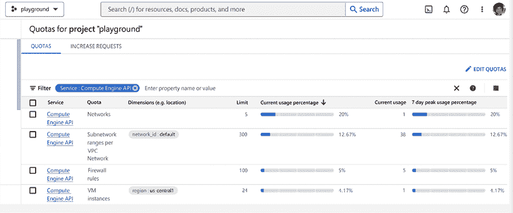

# 17

# 在生产环境中运行 Kubernetes

在上一章中，我们讨论了治理和策略引擎。这是管理大规模基于 Kubernetes 的生产系统的一个重要部分。然而，它只是其中的一部分。在本章中，我们将重点关注 Kubernetes 在生产环境中的整体管理。重点将放在如何在云中运行多个托管 Kubernetes 集群。

我们将涵盖的主题包括：

+   了解云中的托管 Kubernetes

+   管理多个集群

+   为大规模 Kubernetes 部署构建有效的流程

+   处理大规模基础设施

+   管理集群和节点池

+   升级 Kubernetes

+   故障排除

+   成本管理

# 了解云中的托管 Kubernetes

**托管 Kubernetes**是由云服务提供商（如**亚马逊 Web 服务**（**AWS**）、**谷歌云平台**（**GCP**）和**微软 Azure**）提供的服务，简化了在云中部署、管理和扩展容器化应用程序的过程。通过托管 Kubernetes，组织可以专注于开发和部署应用程序，而无需过多担心底层的基础设施。

托管 Kubernetes 提供了一个预配置且优化的环境，用于部署容器，消除了手动设置和维护 Kubernetes 集群的需求。这使得组织能够快速部署和扩展应用程序，减少市场响应时间，并释放宝贵的资源。

此外，托管 Kubernetes 与云服务提供商的其他服务（如数据库、网络、存储解决方案、安全性、身份验证和可观测性功能）集成，使得管理和保护整个应用堆栈变得更加容易。这也使得组织能够利用服务提供商在管理大规模基础设施、确保高可用性和减少停机时间方面的专业知识。

总体而言，托管 Kubernetes 提供了一种简化且高效的方式来部署和管理云中的容器化应用程序，减少了运营开销，并提高了市场响应时间。这使得它成为各类组织的一个有吸引力的选择，帮助他们利用容器和云计算的优势。

## 深度集成

云服务提供商利用 Kubernetes 的扩展性，通过 CNI、CSI 和身份验证/授权插件，提供其托管 Kubernetes 解决方案与云服务的深度集成。云服务提供商还实现了**云控制器接口**（**CCI**），使其计算基础设施能够为 Kubernetes 节点提供服务。

然而，集成更深层次。云服务提供商通常会配置 kubelet，控制每个节点上运行的容器运行时，并在每个节点上部署各种 DaemonSets。

例如，AKS 利用了许多 Azure 服务：

+   **Azure Compute**：AKS 利用 Azure Compute 资源，如 **虚拟机** (**VMs**)、可用性集和扩展集，提供托管的 Kubernetes 体验。

+   **Azure Virtual Network**：AKS 与 Azure Virtual Network 集成，使用户能够创建和管理自己的虚拟网络和子网。这为用户提供了对网络布局的控制，并能够紧密控制网络流量。

+   **Azure Blob Storage**：AKS 与 Azure Blob Storage 集成，使用户能够在云中存储和管理其应用程序数据。这为用户提供了可扩展、安全且高可用的存储解决方案。

+   **Azure Key Vault**：AKS 与 Azure Key Vault 集成，允许用户安全地管理和存储密码、密钥和证书等机密。这为用户提供了安全存储应用程序机密的解决方案。

+   **Azure Monitor**：AKS 与 Azure Monitor 集成，使用户能够收集和分析来自其应用程序的度量、日志和跟踪信息。这为用户提供了监控和故障排除其工作负载的能力。

+   **Azure Active Directory** (**AAD**)：AKS 与 AAD 集成，提供一个安全、可靠且高可用的平台来运行 Kubernetes 集群。AAD 提供了一种高效且安全的方式来验证和授权用户及应用程序访问集群。AAD 还可以与 Kubernetes **RBAC**（**基于角色的访问控制**）集成，为集群资源访问提供细粒度的控制。

接下来，我们将讨论成功管理基于 Kubernetes 的生产系统的关键要素之一。

## 配额和限制

云基础设施彻底改变了组织存储和管理数据及运行工作负载的方式。然而，云服务提供商使用配额和限制是一个需要考虑和注意的重要问题。这些配额和限制虽然对确保云基础设施的稳定性和安全性至关重要，但也可能是用户面临的主要挫折来源，甚至可能导致宕机。

配额和限制是对用户可消耗资源数量的限制。例如，可能会限制在每个区域环境中可以创建的特定类型的虚拟机数量，或对可用的存储空间数量设定配额。这些配额和限制旨在防止单个用户消耗过多资源，从而可能影响云基础设施的整体性能。它们还保护用户避免无意中配置大量不必要的资源，从而产生不必要的费用。

理论上，云是无限可扩展和弹性的。但在实际操作中，这只有在配额和限制范围内才成立。

让我们在接下来的章节中查看一些实际示例。

### 配额和限制的实际示例

在 GCP 上，配额通常可以增加，而限制是固定的。此外，每个服务都有自己独立的配额和限制页面。**虚拟专用云**（**VPC**）页面可以在[`cloud.google.com/vpc/docs/quota`](https://cloud.google.com/vpc/docs/quota)找到。

你可以在 GCP 控制台中查看配额，并请求增加配额：[`console.cloud.google.com/iam-admin/quotas`](https://console.cloud.google.com/iam-admin/quotas)。

当前有 9,441 个配额！

这里是显示 GCP 计算引擎服务一些配额的截图：



图 17.1：GCP 计算引擎配额截图

现在我们了解了配额和限制是什么，让我们来讨论容量规划。

### 容量规划

在过去，容量规划意味着思考你在数据中心需要多少台服务器、硬盘应该多大，以及网络带宽是多少。这些都基于工作负载的使用情况，并确保有足够的冗余空间和增长空间。然后，你需要考虑硬件升级，以及如何逐步淘汰过时的硬件。在云中，你不需要担心硬件。然而，你需要围绕配额和限制进行规划。这意味着你需要监控配额和限制，并且每当接近当前配额时，提出增加请求。对于像某个 VM 系列的虚拟机实例数量这样的配额，我建议尽量保持在 50%-60%以下。这应该为你提供足够的灾难恢复空间和增长空间，同时也适用于蓝绿部署，即同时运行新版本和旧版本一段时间。

## 什么时候不应该使用托管 Kubernetes？

托管 Kubernetes 很好，但它不是万灵药。有几种情况和使用场景，你可能更愿意自行管理 Kubernetes，例如：

+   显而易见的使用场景是，如果你在本地运行 Kubernetes，而托管解决方案根本不可用。然而，你可以通过像 GKE Anthos、AWS Outposts 和 Azure Arc 等平台，运行类似于云托管 Kubernetes 的技术栈。

+   你需要对控制平面、节点组件和运行在每个节点上的守护进程进行极端控制。

+   你已经具备了自己运行 Kubernetes 的内部专业知识，而使用托管 Kubernetes 将需要陡峭的学习曲线，并且可能成本更高。

+   你管理着高度敏感的信息，必须完全控制这些信息，且无法将其交给云服务提供商。

+   你在多个云提供商和/或混合环境中运行 Kubernetes，并且希望在所有环境中以统一的方式管理 Kubernetes。

+   你希望确保不会被锁定到某个特定的云服务提供商。

简而言之，在各种情况下，你可能会选择自行管理 Kubernetes。让我们看看你可能如何在不同环境中部署和管理多个 Kubernetes 集群。

# 管理多个集群

一个 Kubernetes 集群非常强大，可以管理大量的工作负载（成千上万的节点，和数十万个 Pod）。作为初创公司，您可能只需一个集群就能走得很远。然而，在企业级规模下，您将需要不止一个集群。让我们来看看一些用例。

## 地理分布式集群

地理分布式集群是指在不同位置运行的集群。使用地理分布式集群的主要原因有三：

+   将您的数据和工作负载靠近其消费者。

+   合规性和数据隐私法律要求数据必须保留在其原始国家。

+   在地区性停机的情况下实现高可用性和灾难恢复。

## 多云

如果您在多个云平台上运行，那么您自然需要每个云提供商至少一个集群。

在多个云平台上运行可能会很复杂，但在企业级规模下，这可能是不可避免的，有时也是必要的。例如，您的公司可能在云 X 上运行 Kubernetes，而收购的公司在云 Y 上运行 Kubernetes。从 Y 迁移到 X 可能风险太大且费用过高。

另一个有效的在多个云平台上运行的理由是，通过与云提供商的谈判，争取更好的折扣，并确保您不会被完全锁定。最后，这也可能让您在完全云服务提供商停机的情况下，仍能保持容错（这可不是简单的事情）。

## 混合云

混合 Kubernetes 意味着在云中（使用一个或多个云提供商）运行一些 Kubernetes 集群，同时在本地运行一些 Kubernetes 集群。

这种情况可能会像之前一样发生，因为收购，或者即使您正在将本地 Kubernetes 迁移到云端。大型系统的迁移可能需要几年时间，而在迁移过程中，您将不得不运行一个混合环境中的 Kubernetes 集群。

您也可以采用像“突发到云”这样的模式，其中大部分 Kubernetes 集群运行在本地，但您可以灵活地将工作负载部署到云中的 Kubernetes 集群，这样在遇到无法预料的负载时，或者当您的本地基础设施出现问题时，云端的集群可以迅速扩展。

## 边缘上的 Kubernetes

大多数企业数据（约 90%）是在云端和私有数据中心生成的；然而，根据 Gartner 的预测，到 2025 年，这一比例将降至仅 25%。

这简直让人震撼。边缘计算（AKS IoT）将是这种巨大转变的主要推动力。

很多设备分布在各个地方，将会产生不断的数据流。这些数据中的一部分将被送回后端进行处理、聚合和存储。然而，将各种数据处理方式靠近数据本地进行而不是将原始数据直接发送回来，是非常有意义的。在某些情况下，您甚至可以在本地近距离运行工作负载并完全在边缘服务用户。

这就是边缘计算的承诺。在边缘运行 Kubernetes 使组织能够将数据处理更接近数据生成源，从而减少将数据发送到集中数据中心或云的延迟和带宽需求。这将提高响应时间并实现数据的实时处理，使其成为工业物联网、自动驾驶车辆以及其他实时数据处理应用场景的理想解决方案。

然而，在边缘运行 Kubernetes 会带来一系列挑战。边缘设备通常资源受限，因此必须优化 Kubernetes 的部署以适应边缘环境。组织还必须考虑边缘设备的网络连接性和可靠性，以及在边缘部署 Kubernetes 集群的安全性和隐私问题。

像 CNCF KubeEdge ([`kubeedge.io`](https://kubeedge.io)) 这样的项目可以帮助你入门。

然而，本章接下来的部分将专注于云中基于 Kubernetes 的大规模系统。

# 为大规模 Kubernetes 部署构建有效的流程

要在生产环境中运行多集群 Kubernetes 系统，你必须制定一套有效的流程和最佳实践，涵盖操作的各个方面。以下是一些需要解决的关键领域。

## 开发生命周期

在生产环境中，多集群 Kubernetes 系统的开发生命周期可能是一个复杂的过程，但通过正确的方法，可以将其简化。

你应该绝对实施一个 CI/CD 流水线，自动构建、测试和部署代码变更。该流水线应与版本控制系统（如 Git）集成，并且还应包含自动化测试以确保代码质量。

管理不同代码库区域的所有权和审批流程是非常重要的。

Kubernetes 命名空间可以提供一种方便的方式来组织工作负载及其相应的软件资产，并将它们与团队和相关方关联起来。

你应该对每个工作负载的变更、正在进行的构建和部署有完整的跟踪，并能够冻结活动并回滚变更。

同样重要的是控制逐步部署到不同集群和区域，以避免在所有系统中同时部署坏的变更，导致整个系统崩溃。

## 环境

代码审查和小心的增量部署，同时监控结果，是必要的，但对于拥有多个 Kubernetes 集群的大型企业系统来说，这些措施并不足够。某些变更可能只有在运行一段时间后或在特定条件下才会显示出负面影响，这将逃脱我们前面提到的控制机制。最佳实践是拥有多个运行时环境，例如生产环境、预发布环境和开发环境。环境的具体划分可以有所不同，但通常至少需要一个生产环境，这个环境是实际管理所有数据并且用户进行交互的系统，以及一个预发布环境，它模拟生产系统，你可以在其中测试变更和新版本，而不会影响用户并且避免将生产环境置于风险之中。

让我们考虑使用多个环境的一些方面。

### 分离的环境

至关重要的是，预发布环境不能意外污染并影响生产环境。例如，如果你在预发布环境中运行压力测试，而某些工作负载在预发布环境中配置错误并访问生产端点，那么你将会经历一段非常不愉快的时间，试图解开这一混乱。

严格的网络分段使得预发布环境无法访问生产环境，是一个很好的第一步。你仍然需要注意通过公共端点在预发布和生产环境之间的交互。预发布的工作负载不应包含能够访问生产环境的密钥和身份。

### 预发布环境的保真度

预发布环境的主要目的是在将变更部署到生产环境之前，测试与其他子系统的交互及变更。这意味着预发布环境应尽可能地模拟生产环境。然而，运行一个完全与生产环境相同的副本成本极高。

预发布环境应使用相同的自动化 CI/CD 流水线进行配置和设置，该流水线能够部署预发布和生产环境。

预发布基础设施和资源也应使用与生产环境相同的工具进行配置，尽管通常分配给预发布的资源较少。

你可能希望能够暂时缩减，甚至完全关闭预发布环境中的某些部分，并且仅在需要进行大规模测试时再将其重新启动。

### 资源配额

预发布和生产环境中的资源配额可以确保配置错误或甚至攻击不会导致资源使用过度。

### 提升过程

一旦在暂存环境中彻底测试了更改，就应该有一个明确的推广过程将其部署到生产环境中。这个过程可能因更改的范围和影响而异。推广过程可能完全自动化，CI/CD 管道检测到暂存测试成功完成并继续进行生产部署，或者涉及额外的步骤和可能另一个明确的生产部署。

## 权限和访问控制

当您管理运行在云基础设施上的 Kubernetes 集群星座时，需要特别注意权限模型和访问控制。这是在之前开发生命周期和环境的最佳实践基础上构建的。

### 最小权限原则

最小权限原则源自安全领域，但即使超越安全性，也对可靠性、性能和成本有用。人员或工作负载不应该比完成任务所需的权限更多。通过将访问权限降至最低限度，确保不会发生禁止资源的意外或恶意活动。

同时，在调查事故时，它会自动将可能的罪魁祸首缩小到那些具有操作不当配置资源或执行无效操作权限的人员。

如果您遵循 GitOps 模型，可以创建一种工作流程，其中对集群和基础设施的每一次更改都由 CI/CD 和专用工具完成。人类工程师只有只读访问权限。在本章的*打破玻璃*部分可以做一些特殊例外。

### 将权限分配给组

强烈建议将权限分配给组或团队，而不是个人。即使只有一个人当前正在执行需要某些权限集的任务，也应定义一个该人员是唯一成员的组。这将使以后添加其他人员或替换该人员更加容易。

### 优化你的权限模型

然而，有时候过于严格的权限模型可能是有害的。您将不得不对大量资源维护非常细粒度的权限设置。每当发生最轻微的更改以至于需要在某些资源上执行其他操作时，您将不得不修改权限。

找到在授予每个人超级管理员权限和为每个资源创建数百甚至数千个角色之间的黄金平衡点。

特别是考虑在开发环境甚至是暂存环境中放宽权限模型。这是许多实验进行的地方，您可以在这里发现需要执行的操作和实际所需的权限，然后在部署到生产环境之前调整您的权限模型。

### 打破玻璃

有时，CI/CD 流水线本身可能会出现故障，或者由于覆盖不全，一些资源可能是手动配置的。在这些情况下，人工工程师必须介入，可以说是“*打破玻璃*”，直接对 Kubernetes 或云基础设施进行操作。

建议制定正式的流程来获取**紧急访问**权限，明确谁可以获得该权限、权限持续时间以及记录谁曾经拥有该权限。

这引出了我们下一部分的内容——可观察性。

## 可观察性

一个全面的可观察性栈是绝对必不可少的。由多个 Kubernetes 集群组成的复杂系统可以从理论上推理并理解。你必须拥有来自云服务提供商、Kubernetes 本身以及工作负载的完整事件记录。你的 CI/CD 流水线及其他工具也必须具备完全的可观察性。

让我们看看多集群可观察性的一些元素。

### 一站式可观察性

云服务提供商和 Kubernetes 本身提供了大量的日志和度量指标作为开箱即用的可观察性。然而，这些通常是按集群级别组织的。如果你正在处理跨多个集群的广泛问题，那么进入每个集群、提取可观察性数据并尝试理解它将变得非常困难，甚至在某些规模下是不可能的。你必须将所有可观察性数据传输到一个单一的集中系统中，在那里它可以被汇总、总结，并准备好进行多集群分析和响应。

### 排查你的可观察性栈

你的可观察性栈是你系统中不可或缺的组成部分。如果它出现故障或性能下降，你可能会处于“盲飞”状态，无法有效地应对问题。而且，跨集群问题可能会影响你的可观察性栈，进而影响整个系统。非常仔细地考虑这个场景，确保在你的主要可观察性栈暂时无法应对任务时，拥有足够的冗余和可观察性替代方案。例如，如果你的集中式可观察性栈出现问题，你可以依赖集群内部的可观察性解决方案。如果你想要完全冗余，可以在两个云服务提供商上部署并行的可观察性栈。

考虑测试这些严苛场景：CI/CD 流水线和可观察性栈出现故障时，看看你的操作流程如何。

让我们更具体地看看不同类型的基础设施，以及如何在大规模环境中处理它们。

# 大规模处理基础设施

在云端运行大规模多集群 Kubernetes 的任务中，处理云基础设施是最具挑战性的任务之一。从某些方面来说，它比负责底层计算、网络和存储基础设施要好得多。然而，你会失去很多控制权，排查问题变得非常具有挑战性。

在深入每个基础设施类别之前，先来看一些通用的云级别考虑事项。

## 云级别考虑事项

在云中，你会将资源组织为如 AWS 账户、GCP 项目和 Azure 订阅这样的实体。一个组织可能拥有多个这样的组，每个组都有自己的限制和配额。为了简便起见，我们称之为账户。企业组织的基础设施需求将超过单一账户的容量。决定如何将基础设施拆分为不同账户至关重要。一种好的启发式方法是将不同的环境——生产、预发布和开发——拆分到不同的账户中。账户级别的隔离对于这些环境是有益的。然而，这可能还不够，在单一环境中，你可能需要更多的资源，单一账户无法容纳。

拥有一个健全的账户管理策略是关键。账户也可以作为访问控制的边界，因为即使是账户管理员也无法访问其他账户。

请与你的安全团队协商关于基于安全考虑的账户划分。

另一个重要方面是区域划分。如果你在多个区域管理基础设施，并且这些区域中的工作负载需要相互通信，那么这将带来严重的延迟和成本影响。特别是，跨区域出口通常不是免费的。

让我们来看一下每种基础设施类别。

## 计算

管理 Kubernetes 的计算基础设施包括 Kubernetes 集群本身及其工作节点。工作节点通常被分组到节点池中，这不是 Kubernetes 的概念。如何将系统拆分为 Kubernetes 集群以及每个集群中存在的节点池类型，将极大地影响你在规模化管理系统时的能力。

理想情况下，你可以像管理牲畜一样管理集群，配置相同的集群，并且可以轻松地在不同位置添加或移除集群。每个集群将拥有相同的节点池。

这种统一一致的集群组织方式并非总是可能的。有时为了特定目的，可能需要不同的集群。你仍然应该尽量保持少数几种集群类型，以便轻松复制。

### 设计你的集群划分

云中的集群通常从一个区域的虚拟网络中为节点和 Pod 分配私有 IP 地址。是的，跨区域的大型集群是可能的，但这是例外而非常规。强烈建议在可能的情况下将集群作为牲畜来管理，并在所有操作区域自动配置集群。

### 设计你的节点池划分

节点池是具有相同实例类型的节点组。它们通常可以通过集群自动扩展器自动扩展，以满足集群的需求。选择在集群中配置哪些节点池是一个基础性决策，它会影响性能、成本和操作复杂度。

我们将在本章稍后深入讨论这一点。

## 网络

网络是基础设施中一个非常动态的领域。它有许多自由度。延迟与带宽之间的相互作用有其细微之处。工作负载不能请求一定的带宽或保证的延迟。此外，还有许多外部因素会影响网络的连接性、可达性和性能。让我们来看看一些我们必须考虑和规划的重要议题。

### IP 地址空间管理

当你运行一个基于多集群的 Kubernetes 系统时，集群中的每个 pod 都会获得一个唯一的私有 IP 地址。然而，如果你想连接多个集群，并且让一个集群中的工作负载通过私有 IP 地址访问其他集群中的工作负载，那么必须满足以下两个条件：

1.  不同集群的网络必须进行对等连接。

1.  pods 的私有 IP 地址在所有集群中必须唯一。

这需要集中管理私有 IP 地址空间，并且要小心地为不同的集群分配 IP 范围。

云服务提供商在为集群分配 IP 地址范围的方式上有所不同。AKS 要求每个集群都属于一个具有自己 IP 地址范围的 VNet，然后子网被分配给节点和 pods，子网的 IP 地址范围来自 VNet 的 IP 地址范围。GKE 则提供一个没有自己 IP 地址范围的默认网络。集群是通过具有自己 IP 地址范围的子网来配置的。

此外，服务也需要自己的 IP 地址，以及可能的其他组件。

整个私有 IPv4 地址空间由多个块组成：

+   `10.0.0.0/8`（A 类）

+   `172.16.0.0/12`（B 类）

+   `192.168.0.0/8`（C 类）

在大规模部署中，最重要的是`10.0.0.0/8`，它包含了 2²⁴ 个 IP 地址，总数超过 1600 万个地址。这是一个非常庞大的 IP 地址范围，但如果不仔细规划，可能会导致碎片化，即使有很多未使用的 IP 地址，也可能会耗尽大块地址空间。

下面是管理 IP 地址空间的一些最佳实践：

+   为 pods、nodes 和 services 分配足够并且不会浪费过多空间的 CIDR 块。

+   了解 Kubernetes 和云服务提供商在支持的节点和 pods 数量方面的限制。

+   考虑跨集群的网络对等连接和服务网格。

+   确保连接的集群使用不重叠的 CIDR 块。

+   使用适当的工具来管理地址空间。

+   考虑 pod 密度对 IP 地址空间的影响（例如，在 AKS 上，即使没有使用，IP 地址也会预先分配给节点上 pod 的最大数量）。

+   注意一些限制，例如一个区域中可用的最大 IP 地址数量。

### 网络拓扑

所有云提供商都提供虚拟网络或 VPC 概念。所有云提供商也都有地区的概念，地区是云提供商托管资源的地理区域。具体来说，虚拟网络总是局限于一个单一的地区。由于云中的 Kubernetes 集群与虚拟网络相关联，因此一个单一的 Kubernetes 集群不能跨越多个地区。这对可用性和可靠性有影响。如果你想在地区性故障中存活下来，你需要在不同地区的多个集群中运行每个关键工作负载。此外，所有这些集群通常需要相互连接。我们将在接下来的 *跨集群通信* 部分中进一步讨论这个问题。然而，就网络拓扑而言，将同一区域内的多个集群共享同一虚拟网络可能会更好。

### 网络分段

网络分段是将一个网络划分为更小的子网。在 Kubernetes 的上下文中，最重要的子网是节点、Pod 和服务的子网。在某些情况下，节点和 Pod 共享同一子网，而在其他情况下，节点和 Pod 会有单独的子网。无论如何，你需要规划并理解你的集群能够容纳多少个节点和 Pod，并据此调整集群子网的规模。

### 跨集群通信

在运行多个 Kubernetes 集群时，考虑将集群组视为一个单一的概念集群通常是有益的。这意味着，任何集群中的 Pod 都可以通过它们的私有 IP 地址直接访问其他集群中的 Pod。这种扁平化的 IP 地址模型是将标准 Kubernetes 网络模型从单一集群扩展到多个集群。这需要我们之前讨论过的两个要素：

1.  所有连接的集群之间的 Pod 应该使用不冲突的 IP 地址范围。

1.  集群之间的网络对等连接。

网络对等连接要求可能会很繁琐，因为集群会不断地变动。拥有一个单一的区域虚拟网络可以减少开销，并且只需要对区域虚拟网络进行对等连接。然而，如果你在同一地区运行大量共享同一虚拟网络的集群，你可能会遇到云服务商的限制，这会限制你的发展。例如，在 Azure 上，一个虚拟网络最多可以有 64K 个唯一的 IP 地址。

### 跨云通信

如果你的系统跨多个云提供商，你需要考虑如何在不同云提供商之间连接你的 Kubernetes 集群。有几种方法，各有优缺点。

首先，你可能决定避免在不同云提供商上的集群之间进行直接通信。如果部署在不同云上的 Kubernetes 集群需要相互通信，它们可以通过公共 API 实现。这种方法简单，但会排除统一概念集群的想法，即 Pod 可以直接相互通信，无论它们位于何处。

点对点 VPN 是一种通信方法，通过 BGP 连接不同的云提供商系统，并通过位于虚拟网络前面的 VPN 网关与另一云提供商管理的网络建立 VPN 连接。这建立了一个安全通道；然而，设置 VPN 网关并不是件小事，并会产生显著的开销。

直接连接（也称为直接对等连接）是另一种选项，需要在云提供商的点对点位置安装路由器。该方法允许将运行在私有数据中心中的 Kubernetes 集群连接到云中的集群。此外，性能要好得多，因为中间没有 VPN 网关。缺点是设置相当复杂，您可能需要遵守各种要求。对于具有深入低级网络专业知识的组织来说，这是一个不错的选择。

运营商或合作伙伴对等连接类似于直连；但是，您可以利用专业提供此服务的第三方的专业知识，该第三方已经与云提供商建立了关系并获得了认证。当然，您需要为此服务付费。

### 跨集群服务网格

如我们在*第十四章* *利用服务网格*中所讨论的那样，服务网格为 Kubernetes 带来了巨大的价值。在生产环境中运行多个 Kubernetes 集群时，通过服务网格连接所有集群可能更加重要。服务网格的高级功能和策略可以应用于管理所有集群之间的连接和路由。

在此需要考虑两种方法：

1.  单个完全连接的服务网格。

1.  将您的集群划分为多个网格。

单个完全连接的单一网格在概念上与单一概念的 Kubernetes 集群方法一致。一切都很简单。新集群只需加入网格，并配置网格以允许每个 Pod 与其他所有 Pod 通信（只要路由策略允许）。

然而，单个网格可能会遇到可扩展性障碍，因为网格控制平面需要处理所有集群中所有工作负载的策略，并且为所有 Pod 更新 Sidecar 可能会给您的集群带来很大负担。

另一种方法是拥有多个独立的网格。属于特定网格的集群中的 Pod 可以直接与同一服务网格中所有其他集群中的 Pod 通信，但必须通过公共端点访问其他服务网格中的集群。

多网格方法更具可扩展性，但更为复杂。您需要考虑如何将系统划分为不同的服务网格，以及新集群加入或离开系统时对整体架构的影响。

在多服务网格的情况下，私有 IP 地址空间管理可能会更加复杂，因为不同的服务网格可能会有冲突的 IP 地址。这意味着你可以为每个网格单独管理 IP 地址空间。

服务网格提供了另一种有趣的解决方案来处理跨集群的连接问题，那就是东西向网关。通过东西向网关方法，不同集群中的工作负载通过每个集群中的专用网关间接通信。这意味着每个集群的私有 IP 地址是未知的，并且每次跨集群通信都会多出一个跳跃。

### 大规模管理出口流量

一些系统需要积极地访问外部系统。也许你经常从外部系统获取数据，或者你的系统的目的是通过 API 管理一些外部系统。

对于出口流量，可能会有一些特殊问题需要关注。一些第三方组织或甚至某些国家可能会有政策，阻止或限制来自特定地理区域或特定 IP 地址范围（CIDR 块）的流量。例如，中国及其“长城防火墙”因屏蔽和审查大量公司（如谷歌和 Facebook）而闻名。如果你在 GCP 上运行并且需要访问中国，这可能会是一个严重的问题。

除了完全阻止之外，如果你试图大规模访问某些第三方 API，可能还会有流量限制和限速措施。

如果你持续访问这些第三方 API，你甚至可能会被举报，云服务提供商也有可能对你采取各种制裁措施。

让我们考虑一些解决方案来应对这些现实世界中的问题。

如果你当前的云服务提供商无法访问你的目标地址，那么你必须在云服务提供商之外建立一个出口连接。这可以是在另一个云提供商上，或通过一个信誉良好的中介组织。这种代理方法有许多形式，超出了本节的讨论范围。

如果你遇到限流问题，那么可能是因为你从同一个源 IP 地址发送了过多请求。一个有效的解决方案是创建一个具有不同公网 IP 地址的出口节点池，并通过多个不同的 IP 地址分发请求。如果定期轮换公网 IP 地址也会有所帮助，在云平台中通过重新创建实例就可以很容易地获得新的公网 IP 地址。

另一种问题是，如果你与某个第三方公司有协议，并且他们通过白名单允许你提供的某些 IP 地址访问流量，那么你需要管理那些不会变化的静态公网 IP 地址，并确保所有发往该第三方组织的请求都通过这些白名单 IP 地址发送。

最后，为了应对被云服务提供商报告并标记的风险，你可能需要将出口访问隔离到一个单独的账户。大多数云服务提供商的制裁是基于账户级别的。如果你的出口账户被云服务提供商禁用，至少不会影响整个企业。

### 集群级别的 DNS 管理

大规模的集群，包含大量的 pod 和服务，可能会给 CoreDNS（Kubernetes 的内部 DNS 服务器）带来较高的负载。确保足够的 DNS 容量非常重要，因为集群内大多数工作负载之间的内部通信是通过 DNS 名称进行寻址，而不是直接使用 IP 地址。

建议使用 DNS 自动扩展，默认情况下通常不会启用。详情请参见 [`kubernetes.io/docs/tasks/administer-cluster/dns-horizontal-autoscaling/`](https://kubernetes.io/docs/tasks/administer-cluster/dns-horizontal-autoscaling/)。

## 存储

存储可以说是你基础设施中最为关键的元素。这里存储着你的持久化数据，它是组织的长期记忆。

### 选择合适的存储解决方案

云中有许多适用于 Kubernetes 集群的存储解决方案，如云原生对象存储、托管存储服务、托管数据库和托管文件系统。你应该深入了解每种存储解决方案的性能、耐用性和成本，并根据存储使用场景进行匹配。

你的基础设施应该始终以云原生的对象存储（即桶存储），如 AWS S3、GCP Google Cloud Storage 或 Azure Blob Storage 为基础。很难想象一个大型的托管 Kubernetes 企业不使用桶存储。

然后，考虑更为结构化或高层次的存储解决方案。如果你希望保持云中立，你可以忽略基于云的托管存储解决方案，部署你自己的解决方案，就像我们在*第六章*《管理存储》中所看到的那样。

在企业规模下，考虑不同重要性层级的数据存取速度和成本可能是值得的。

### 数据备份与恢复

规划数据备份与恢复。你的数据是非常宝贵的，数据备份与恢复对于生产环境至关重要。考虑实施可靠且可扩展的数据备份与恢复流程，并确保它们定期经过测试与更新。

你还应该考虑数据保留策略，并且不要自动假设所有数据都必须永久保存。

当然，为了遵守数据隐私法和类似 GDPR 的法规，你还需要具备选择性删除数据的能力。

### 存储监控

设置存储监控。仅此而已。监控存储性能、使用情况和容量对于在问题影响应用程序的可用性或性能之前识别并解决问题至关重要。设置监控和警报，以便及时了解存储使用、延迟和吞吐量。这对托管存储非常重要，也适用于节点存储，因为日志容易积累并导致节点无法正常工作。

### 数据安全

实施数据安全措施。保护敏感数据并确保符合数据保护法规对于生产环境至关重要。实施访问控制、加密和数据安全策略以保护数据。

### 优化存储使用

云中的 Kubernetes 集群可能会很昂贵，存储成本也可能迅速累积。通过删除未使用的数据、使用数据压缩或去重，并设置存储分层，优化存储使用。

### 测试并验证存储性能

在生产环境中部署应用程序之前，请测试并验证您的存储解决方案的性能，以确保它满足工作负载的性能要求。

通过考虑这些因素并实施最佳实践来管理云中 Kubernetes 集群的生产环境存储，您可以确保应用程序的存储性能既可靠又可扩展。

现在我们已经涵盖了大规模管理 Kubernetes 云基础设施的许多指南和最佳实践，让我们把重点放在集群和节点池的管理上，这是在生产环境中管理多集群 Kubernetes 的核心。

# 管理集群和节点池

管理您的集群和节点池是大规模 Kubernetes 企业基础设施管理的核心活动。在本节中，我们将讨论几个重要方面，包括配置、资源利用率、升级、故障排除和成本管理。

## 配置托管集群和节点池

配置集群和节点池有不同的方法。您应根据实际情况明智地选择最适合的方法，因为在这一环节的失败可能导致灾难性的停机。让我们来回顾一下几种选项。所有云服务提供商都通过 API、CLI 和 UI 提供集群和节点池的配置。我强烈建议避免直接使用这些方法，而应使用基于 GitOps 的声明式方法。这里有一些值得考虑的可靠选项。

### 集群 API

Cluster API 是来自 Cluster Lifecycle SIG 的开源项目。它的目标是使多个 Kubernetes 集群的配置、升级和操作更加简单。它专注于集群和节点池的生命周期。然而，它最初主要是使用 kubeadm 来配置集群的一种方法。稍后添加了对不同云提供商的托管集群支持，但它仍然很年轻。特别是，GKE 不受支持（尽管您可以作为基础设施层在 GCP 上配置 Kubernetes 集群）。AKS 和 EKS 是支持的。

Cluster API 有很大的动力，如果您不操作 GKE，您应该确实研究一下它。

### Terraform/Pulumi

Terraform 和 Pulumi 在方法上类似。它们可以在所有云提供商上为您配置集群和节点池。然而，这些工具本身无法响应带外变更，并且在配置后不监控基础设施的状态。它们的内部状态可能会偏离真实世界，这可能导致需要小心“手术”的难以恢复的情况。特别是，节点池经常需要配置或更新，而 Terraform 或 Pulumi 可能无法胜任。如果您对这些工具有很多经验，并且了解它们的怪癖和特殊要求，它们仍然可能是一个不错的选择。

### Kubernetes 运算符

另一种选择是使用 Kubernetes 运算符，它们可以将 CRD 与集群和节点池规范与云提供商进行协调。在幕后，运算符将调用云提供商的托管 Kubernetes API。这需要非平凡的工作和编写 Kubernetes 运算符的专业知识，但可以给您带来最终的控制。

您可以尝试使用 Crossplane 而不是编写自己的运算符；然而，目前 Crossplane 的支持似乎相当基础和不完整。扩展范围的一个选择是使用 Upjet 项目（[`github.com/upbound/upjet`](https://github.com/upbound/upjet)）从 Terraform 提供程序生成 Crossplane 控制器。

## 使用托管节点

您也可以尝试使用托管节点，这样您就永远不需要直接处理节点池和节点的配置。所有云提供商都提供某种形式的托管节点，如 GKE AutoPilot、EKS + Fargate 和 AKS + ACI。对于企业使用情况，我认为您可能需要比完全托管的节点池提供更多的控制。这可能是您工作负载的一部分的一个不错选择。然而，在规模化之后，您将希望优化资源使用和性能，而托管节点池的限制可能会过于严格。

一旦您找出如何配置和管理您的集群和节点池，您应该将注意力转向有效地使用您配置的资源。

# 装箱和利用率

云资源是昂贵的。在 Kubernetes 上有效使用资源有两个部分：根据其资源请求有效地调度 pod 到节点，以及实际使用它们请求的资源的 pod。

容器打包（Bin packing）是指确保资源请求的总和尽可能接近目标节点上可分配的资源。一旦工作负载被调度到某个节点，通常情况下，即使该节点的资源使用率很低，工作负载也不会被驱逐，但像集群自动扩展器这样的组件可以在这里提供帮助。

资源利用率衡量的是实际使用的资源占请求资源的百分比。一般来说，资源利用率并不是固定的，因为工作负载的资源使用情况可能会在其生命周期中发生显著变化。

容器打包、资源利用率及它们之间的相互作用有许多细微之处。例如，存在不同类型的资源，如 CPU、内存、磁盘和网络。一个节点可能对 CPU 实现了 100% 的容器打包，但内存的容器打包率可能只有 20%。该节点上的网络和非临时磁盘是共享资源，Pod 可以请求它们以确保始终获得一定的资源量。这增加了操作的复杂性和可靠性问题。我们将讨论一些原则和概念，帮助理解这一复杂话题。

## 理解工作负载形态

工作负载形态是工作负载 CPU 请求与内存请求的比率。在云中，标准的比例是 1 个 CPU 对应 4 GiB 的内存。因此，您可以选择的大多数虚拟机类型都提供此比例的资源容量。有些工作负载需要比这个比例更多的内存或 CPU。所有云服务提供商也提供高内存虚拟机类型，比例为 1 个 CPU 对 8 GiB 内存，以及高 CPU 虚拟机类型，比例为 1 个 CPU 对 2 GiB 内存。

理解工作负载的资源形态对于选择合适的虚拟机类型以优化资源使用至关重要。

例如，如果某个工作负载需要 1 个 CPU 和 8 GiB 的内存，并且你将其调度到一个 CPU 与内存比例为 1:4 的虚拟机类型上，那么你需要将其运行在一个有 2 个 CPU 和 8 GiB 内存的节点上。由于原始工作负载使用了全部的 8 GiB 内存，因此该节点不能运行其他任何 Pod。然而，2 个 CPU 中有 1 个完全没有使用。将该工作负载调度到一个 CPU 与内存比例为 1:8 的节点上会更好，这样可以确保最优的容器打包。

## 设置请求和限制

为工作负载设置请求和限制是实现适当资源利用的关键。正如你在为 Pod 的容器设置请求时会注意到的那样，Pod 会被调度到一个节点，该节点上至少有足够的资源来满足所有容器请求资源的总和。这些请求的资源将被专门分配给每个容器，直到 Pod 在该节点上运行时。容器如果有空闲资源，可能会使用超出请求的资源。如果你为 CPU 设置了限制，并且容器尝试使用超出限制的 CPU，那么该 Pod 可能会被限制使用。如果你为内存设置了限制，并且容器尝试使用超出限制的内存，那么容器将会因为 OOM（内存溢出）被杀死并重启。

最佳实践是为 CPU、内存，甚至是短暂存储（如果容器使用的话）设置资源请求。你如何知道应该请求多少资源？你可以从一个粗略的估算开始，随着时间的推移监控实际的资源使用情况，并在后续进行微调。

但即便是这种直接的方法也有一些微妙之处。假设一个工作负载使用 2 个至 4 个 CPU，平均为 3 个 CPU。你应该请求 4 个 CPU 并确保工作负载永远不会被限速吗？但这样一来，你就浪费了一个 CPU，因为平均使用量只有 3 个 CPU。如果你请求 3 个 CPU，每当工作负载需要超过 3 个 CPU 时，是否会被限速？这取决于 Pod 调度到的节点上的可用 CPU。如果节点上的总体 CPU 已经饱和，因为所有 Pod 都需要大量的 CPU，那么这种情况是可能发生的。

除了普通的资源请求，你还可以为工作负载分配优先级，这样可以控制高优先级工作负载的调度顺序，并确保它们优先于那些没有优先级或低优先级的工作负载。

是的，调度远非简单。如果你需要复习，可以查看*第十五章*中*理解 Kubernetes 调度器的设计*部分，章节来自于*扩展 Kubernetes*。

让我们将注意力转向限制。一个简单的方法是将限制设置为与请求相等。这通常可以确保容器不会使用超过请求的资源，这使得容器打包变得容易。然而，在实际情况中，工作负载的资源使用量是变化的。通常，申请少于最大使用量，或者有时甚至少于平均使用量，是更经济的。在这种情况下，你可以选择不设置限制，或者将限制设置得比请求值更高。例如，如果一个工作负载使用 1 到 4 个 CPU，你可以决定请求 2 个 CPU，并将限制设置为 4 个 CPU。只请求 2 个 CPU 将允许在同一个节点上容纳更多的 Pod，或者将 Pod 调度到较小的节点上。那么，为什么还要设置限制呢？嗯，设置一些限制可以确保 Pods 不会失控，霸占所有 CPU，导致其他 Pods 的请求资源较低但实际上需要更多 CPU 的 Pods 受到资源饥饿。

设置内存高限制更加重要，特别是对于那些更敏感且不应频繁重启的工作负载，因为任何超出分配内存限制的尝试都会导致容器重启。

## 使用初始化容器

一些工作负载在启动时需要做大量工作，然后它们的资源需求较低。例如，一个工作负载需要 10 GiB 的内存和 4 个 CPU 来获取一些数据并在内存中处理它，然后才准备好处理请求。然而，一旦运行，它不需要超过 1 个 CPU 和 4 GiB 内存。如果 Pod 是一个长期运行的工作负载，申请 4 个 CPU 和 10 GiB 会非常浪费。在这种情况下，init 容器非常有用。你可以将工作负载拆分为两个容器。所有需要 4 个 CPU 和 10 GiB 内存的初始化工作可以由 init 容器完成，然后主容器只需要请求 1 个 CPU 和 4 GiB 内存。

## 共享节点与专用节点

在设计节点池时，你需要做出两个基本的选择。共享节点池会调度多个不同的工作负载，并将它们并排运行在同一节点上。专用节点池则会将一个工作负载分配到单一节点（可能是同一工作负载的多个实例）。

共享节点池比较简单。极端情况下，你只有一个节点池，所有 Pod 都调度到该节点池的节点上。如果你有多个共享节点池（例如，一个包含常规节点，另一个包含抢占实例），那么你需要为节点池分配污点，并为工作负载分配容忍度，还需要处理节点和 Pod 的亲和性。

由于你无法确切知道哪一组 Pod 最终会被调度到哪个节点，因此可能会出现装箱效率低下的情况。然而，只要整体的平均工作负载形态与节点的资源比例匹配，大规模的装箱应该接近最优。

工作负载可以请求所需的 CPU、内存和临时存储。然而，节点上存在一些共享资源，如网络和磁盘 I/O，当同一节点上的其他工作负载也可能尝试使用这些资源时，你无法轻松为你的工作负载划分出这些资源。

这就是专用节点池派上用场的地方。像数据库或事件队列这样的关键工作负载需要可预测的网络和磁盘 I/O。将这些工作负载调度到专用节点上，确保它们不必担心其他工作负载争夺共享资源。

在这种情况下，工作负载请求超过 50% 的标准资源（如 CPU 或内存）是合理的，以确保关键工作负载的确切一个 Pod 被调度到节点上。

请记住，系统守护进程也会在节点上运行并具有更高的优先级。如果你的专用工作负载请求了过多的资源，它可能变得无法调度。

在升级后，我遇到过这种问题：节点上的守护进程需要更多资源，导致专用工作负载无法调度，直到它减少了资源请求。

## 大节点与小节点

在云环境中，节点有多种尺寸，从 1 个核心到数十个甚至数百个核心。你是应该使用大量小节点还是使用较少的大节点？

首先，您必须确保有足够的节点可以容纳您最大的工作负载。例如，如果一个工作负载请求 8 个 CPU，那么您必须有一个至少可用 8 个 CPU 的节点。

那么更大的节点呢？对于更大的节点，效率上有优势。在云中，当您配置（例如）一个具有 1 个 CPU 核心和 4 GiB 内存的节点时，您实际上并没有真正获得这些资源。首先，操作系统、容器运行时和 kube-proxy 会占用一些资源，然后是云提供商决定在每个节点上运行的额外进程，再然后是各种系统守护进程和您自己的守护进程。最终，剩下的资源才可供您的工作负载使用。所有这些在每个节点上始终运行的进程和工作负载需要大量资源。然而，它们所需的资源并不与节点的大小成正比。这意味着在小型节点上，您支付的资源中，只有较小一部分会真正分配给您的 pod。我们来看看一个例子。

这是一个在 AKS 生产集群上运行的真实节点的资源明细。它的虚拟机类型为 **Standard_F2s_v2** ([`learn.microsoft.com/en-us/azure/virtual-machines/fsv2-series`](https://learn.microsoft.com/en-us/azure/virtual-machines/fsv2-series))。它有 2 个 CPU 和 4 GiB 内存。然而，可分配的 CPU 和内存为 1.9 个 CPU 和 2.1 GiB。是的，这是正确的。您几乎只能使用节点上 50% 以上的内存：

```
Capacity:
  cpu:                2
  memory:             4019488Ki
Allocatable:
  cpu:                1900m
  memory:             2202912Ki 
```

但故事并未结束。kube-system 中运行着系统守护进程。您可以使用以下命令找到它们：

```
$ k get po --field-selector spec.nodeName=<node-name> -n kube-system 
```

让我们看看这些工作负载在我们节点上请求的资源：

```
 Namespace     Name                                  CPU Requests  Memory Requests 
  ---------     ----                                  ------------  ---------------    
  kube-system   azure-ip-masq-agent-8pkqx             100m (5%)     50Mi (2%)      
  kube-system   azure-npm-twjlx                       250m (13%)    300Mi (13%)      
  kube-system   cloud-node-manager-fv5gs              50m (2%)      50Mi (2%)        
  kube-system   csi-azuredisk-node-kqnn7              30m (1%)      60Mi (2%)        
  kube-system   csi-azurefile-node-h8zpw              30m (1%)      60Mi (2%)        
  kube-system   kube-proxy-lgzcf                      100m (5%)     0 (0%) 
```

这总共需要 0.56 个 CPU 和 520Mi 内存。如果从可分配的 CPU 和内存中减去这些，我们将剩下 1.4 个 CPU 和 1.58 GiB 的内存。

这真是让人眼前一亮。在一个 2 个 CPU 和 4 GiB 内存的小节点上，我们只能使用 70% 的 CPU 和不到 40% 的内存。除了成本影响之外，如果您计算错误并假设您可以在一个 4 GiB 的节点上调度一个请求 2 GiB 内存的 pod，当您的 pod 因为无法在此节点上运行而处于待定状态时，您将会有一个不愉快的惊讶。

让我们看看大节点。一个 **Standard_D64ads_v5** 的 Azure 虚拟机有 64 个核心和 256 GiB 的内存。它无疑是一个庞然大物。让我们看看它的容量和可分配资源：

```
Capacity:
  cpu:                64
  memory:             263932684Ki
Allocatable:
  cpu:                63260m
  memory:             250707724Ki 
```

在这里，我们失去了 740 mcpu（相比之下，小节点上是 100 mcpu）和 17 GiB 的内存。听起来很多，但按比例计算，这要好得多。让我们看看系统工作负载，以便了解整个情况：

```
Namespace     Name                       CPU Requests  Memory Requests  
---------     ----                       ------------  ---------------
kube-system   azure-ip-masq-agent-lgzxq  50m (0%)      50Mi (0%)
kube-system   azure-npm-s5gsd            100m (0%)     300Mi (0%)
kube-system   cloud-node-manager-jntvt   10m (0%)      50Mi (0%)
kube-system   csi-azuredisk-node-srcfg   30m (0%)      60Mi (0%)
kube-system   csi-azurefile-node-gx247   75m (0%)      60Mi (0%)
kube-system   kube-proxy-xgppg           100m (0%)     0 (0%) 
```

这总共需要 0.365 个 CPU 和 520Mi 内存。令人惊讶的是，所请求的 CPU 比小型节点还少，内存请求相同。如果从可分配的 CPU 和内存中减去这些，我们将剩下 62.9 个 CPU 和 238.48 GiB 的内存。

在一个拥有 64 个核心和 256 GiB 内存的大节点上，我们可以使用超过 98% 的 CPU 和超过 93% 的内存。

在资源配置效率方面，大型节点显然在为工作负载提供更多资源方面占据优势。

然而，还有更多的细节和考虑事项需要关注。让我们来看看小型且短暂的工作负载。

## 小型且短暂的工作负载

假设我们使用大型节点，并且我们的集群已经进行了非常高效的二进制打包。一些部署需要扩展并创建一个新的 pod。如果现有的任何节点都没有足够的空间容纳新 pod，那么就必须为其配置一个新节点。然而，如果新 pod 很小，那么我们实际上会浪费大量资源，因为只在一个大节点上运行一个小 pod。在大规模应用中，尤其是当大量 pod 快速进出时，这可能不是一个问题。然而，考虑以下场景——我们的集群通常运行在 100 个大型节点上。在一次短暂的活动峰值期间，我们的集群扩展到 200 个大型节点，然后活动恢复正常。此时我们的资源利用率为 50%（集群需要 100 个节点中的 200 个）。在理想的情况下，集群自动缩放器最终会缩减空闲节点，直到我们有 100 个合适的二进制打包节点。但在现实世界中，尤其是在存在小型短暂生命周期 pod 的情况下，新的 pod 可能会被任意调度到所有 200 个节点，自动缩放器可能很难进行缩减。稍后我们将在自定义调度部分看到一些选项。

短暂工作负载的另一个问题是，即使它们在现有节点上有空间，如果它们准备时间较长，也可能会浪费资源。考虑一个需要 1 分钟才能准备好，并且平均运行 1 分钟的 pod。这个 pod 即便资源得到了最佳利用，仍然无法做到 50% 以上的效率，因为在调度后，它会在节点上保留 2 分钟的资源，但实际上只工作 1 分钟。如果 pod 需要拉取镜像，那么准备过程可能需要几分钟。

Kubernetes 调度器非常复杂，并且也可以扩展，正如我们在 *第十五章*、*扩展 Kubernetes* 中所讨论的那样。我们提到的在不同使用案例中出现的无效 pod 调度问题，可能通过选择不同的评分策略来解决。默认的评分策略 **RequestedToCapacityRatio** 旨在将工作负载均匀分配到所有节点。这对于紧密的二进制打包并不理想。此时，**MostAllocated** 评分策略可能更为适合。

查看 [`kubernetes.io/docs/concepts/scheduling-eviction/resource-bin-packing`](https://kubernetes.io/docs/concepts/scheduling-eviction/resource-bin-packing) 获取更多详细信息。

## Pod 密度

Pod 密度是每个节点的最大 Pod 数量（Kubernetes 默认为 110）。正如前面提到的，某些资源如私有 IP 地址或系统守护程序的 CPU 和内存可能与 Pod 密度相关。如果 Pod 密度过高，则可能浪费预分配给每个节点的资源以支持多个 Pod。但如果将 Pod 密度设置过低，则可能无法在节点上调度足够多的 Pod。让我们考虑一个具有 64 个 CPU 核心和 256 GiB 内存的大节点。如果 Pod 密度为 100，则最多可以在此节点上运行 100 个 Pod。假设我们有很多只使用 10 mcpu 和 100 MiB 内存的小 Pod。100 个 Pod 只需合计 10 CPU 核心和 10 GiB 内存。如果将 100 个这样的 Pod 安排到一个大节点上，该节点将被严重地低效利用。将浪费 54 个 CPU 核心和 246 GiB 内存。

如果选择共享节点池模型，则是各种工作负载形状的任意混合，资源需求可以安排到节点上。

## 备用节点池

云服务提供商偶尔会遇到临时容量问题，因此无法提供新节点。此外，如果普通节点需求量很大，抢占式实例随时可能消失。好消息是，这些故障是区域性的，通常仅限于特定的实例类型或虚拟机家族。

解决这个问题的一个好策略是使用备用节点池。

备用节点池是一个空的节点池，禁用自动扩展，具有与另一个活动节点池相同的标签和污点，但使用不同的 VM 家族或不同的节点类型（例如普通与抢占式）。如果活动节点池无法提供更多节点且有未调度的 Pod，则备用节点池可以调整大小并/或变为自动扩展。这将允许未调度的 Pod 被安排到备用节点池，直到与本地节点池的情况得到解决。

如果选择这条路线，则需要制定适当的流程来激活备用节点池，其中包括检测活动节点池中的问题、备用节点池激活的手动或自动化过程，以及在活动节点池恢复正常时的缩减过程。

确保备用节点池在需要时有足够的配额来替换其活动节点池非常重要。

这是对装箱和资源利用的非常彻底的处理。现在让我们把注意力转向升级。

# 升级 Kubernetes

升级 Kubernetes 可能是一个非常紧张的操作。仓促的升级可能会删除对资源版本的支持，如果部署了不受支持的资源，将会遇到灾难性的故障。使用托管 Kubernetes 有其利弊。在升级方面，任何时候都有一系列支持的版本。

你可以升级到更近期的受支持版本。然而，如果你拖延并忽视升级，云服务提供商将在你落后于支持版本的前沿时自动升级你的集群和节点池。让我们来看看升级 Kubernetes 时你必须掌握的各个要素。

## 了解你的云服务提供商的生命周期

云服务提供商不能支持所有存在的 Kubernetes 版本。了解你的集群和节点池当前版本的淘汰时间是至关重要的。所有云服务提供商都有一套系统化的流程，并广泛分享相关信息。以下是三个主要云服务提供商的相关链接：

+   AWS EKS: [`docs.aws.amazon.com/eks/latest/userguide/kubernetes-versions.html`](https://docs.aws.amazon.com/eks/latest/userguide/kubernetes-versions.html)

+   Azure AKS: [`learn.microsoft.com/en-us/azure/aks/supported-kubernetes-versions`](https://learn.microsoft.com/en-us/azure/aks/supported-kubernetes-versions)

+   Google GKE: [`cloud.google.com/kubernetes-engine/docs/release-schedule`](https://cloud.google.com/kubernetes-engine/docs/release-schedule)

例如，当前在写作时，AKS 支持版本 1.23 至 1.26。此外，每个版本都有一个官方的生命周期结束日期。例如，1.23 的生命周期结束日期是 2023 年 4 月。如果你的集群仍在 1.23 版本上，那么 AKS 可能会自动将你的集群升级到 1.24 版本。云服务提供商的升级过程是渐进的，按区域进行，可能需要几周时间。

所有云服务提供商都提供 API 和 CLI，用于检查每个区域的版本（包括补丁版本）的准确列表。

例如，目前这是支持的在美国中部地区的 AKS 版本：

```
$ az aks get-versions --location centralus --output table
KubernetesVersion    Upgrades
-------------------  -----------------------
1.26.0(preview)      None available
1.25.5               1.26.0(preview)
1.25.4               1.25.5, 1.26.0(preview)
1.24.9               1.25.4, 1.25.5
1.24.6               1.24.9, 1.25.4, 1.25.5
1.23.15              1.24.6, 1.24.9
1.23.12              1.23.15, 1.24.6, 1.24.9 
```

正如你所看到的，对于每个次要版本，都有多个补丁版本。甚至会明确指出你可以自行升级到哪些版本。由于安全原因，云服务提供商可能随时停止对某些补丁版本的支持。

让我们来讨论控制平面升级的过程。

## 升级集群

使用云中的托管 Kubernetes 时，你不需要负责控制平面的操作，但你仍然需要管理升级过程。你有两个选择：

+   自动升级

+   手动升级

在自动升级中，云服务提供商会根据他们的计划更新你的集群，但你仍然需要确保集群中的资源版本与你的新版兼容。手动升级则要求你自己进行升级，但可以让你对升级时机有更多的控制。例如，你可以选择提前更新，以便享受一些新功能的好处。

记住，手动升级并不意味着你可以永远停留在同一个 Kubernetes 版本上。如果你落后于最小支持版本，云服务提供商将强制进行升级。

Kubernetes 每大约三个月发布一个新版本。云服务提供商通常支持大约 4 个版本。这意味着，如果你刚刚升级到最新的支持版本，你可以大约等待一年再进行升级，但那时你将处于最低支持版本，这意味着你将需要每三个月进行一次升级。

请注意，应该一次只升级一个小版本的控制平面。如果你当前使用的是 1.24 版本，并且想要升级到 1.26，你必须先从 1.24 升级到 1.25，然后再从 1.25 升级到 1.26。

最终结论是，升级 Kubernetes 控制平面是一个标准操作，每年会进行多次。你应该为此制定一个简化的流程。

让我们来看看涉及的内容。

### 升级计划

你应该规划你的升级，并与集群用户协调。控制平面升级通常需要 20-45 分钟。这是一个不会干扰工作负载的操作。你的工作负载会继续运行，并且新 pod 会被调度到现有节点。然而，节点池操作在控制平面升级期间可能会被阻塞。

如果你运行多个集群，并采用冗余方案，最好逐步进行升级，并从非关键集群（例如开发或预生产环境）开始。

我建议为每个命名空间指定负责人（工程师或团队）。通知所有负责人有关即将进行的升级，以便他们为转换不兼容资源预留时间。

### 检测不兼容的资源

升级的主要问题是，系统的功能可能会受到影响或完全损坏，因为它使用了不再支持的资源。在大多数情况下，一个特定版本的资源将被移除，并且会提供更新的版本。

但你不必等到最后一刻才去忙着替换已移除的资源或版本。Kubernetes 有一个弃用政策，资源会在完全移除之前被弃用几个版本。我建议在每次升级之前确保所有弃用的资源都已更新或替换。这将确保升级过程不那么紧张，因为即使你没有及时更新所有资源，弃用的资源仍然会被新版本支持，你将有更多时间在它们被完全移除之前更新它们。

Kubernetes 会发布迁移指南，详细说明每个版本中已弃用和移除的 API。请参阅 [`kubernetes.io/docs/reference/using-api/deprecation-guide`](https://kubernetes.io/docs/reference/using-api/deprecation-guide)。

例如，Kubernetes 1.25 停止提供 API 版本为`batch/v1beta1`的`CronJob`资源。从 Kubernetes 1.21 起，`batch/v1`版本的`CronJob`资源已经可用。理想情况下，在你升级到 Kubernetes 1.21 后，你应该已将所有的`CronJob`资源更新为使用`batch/v1`，并且当你升级到 Kubernetes 1.25 时，`batch/v1beta1`被移除就不会成为问题，因为你已经使用了受支持的版本。

有几种方法可以确保你检测到当前使用的所有已弃用和/或已移除的资源。你可以通过手动阅读弃用指南，并扫描你的代码来检测不兼容的资源。大多数发布版本并没有很多弃用或移除的资源。然而，某些版本可能有多达十个不同的资源被弃用或移除。例如，Kubernetes 1.25 停止提供七个不同版本的资源。

更系统的方法是使用像`kube-no-trouble`这样的工具（[`github.com/doitintl/kube-no-trouble`](https://github.com/doitintl/kube-no-trouble)），它扫描你的集群，并能输出一个弃用资源的列表。

这里是如何安装它的方法：

```
$ sh -c "$(curl -sSL 'https://git.io/install-kubent')"
>>> kubent installation script <<<
> Detecting latest version
> Downloading version 0.7.0
  % Total    % Received % Xferd  Average Speed   Time    Time     Time  Current
                                 Dload  Upload   Total   Spent    Left  Speed
  0     0    0     0    0     0      0      0 --:--:-- --:--:-- --:--:--     0
100 11.7M  100 11.7M    0     0  4154k      0  0:00:02  0:00:02 --:--:-- 8738k
> Done. kubent was installed to /usr/local/bin/. 
```

我有一个 1.25 集群，目前没有包含任何已弃用的资源。然而，在 Kubernetes 1.26 中，版本 autoscaling/v2beta2 的**HorizontalPodAutoscaler**将被移除，因为它自 Kubernetes 1.23 起已被弃用。让我们创建这样的资源。集群中有一个`kyverno`部署：

```
$ k get deploy -n kyverno
NAME      READY   UP-TO-DATE   AVAILABLE   AGE
kyverno   1/1     1            1           64d 
```

这是一个将最小副本数设置为 1，最大副本数设置为 3 的 HPA：

```
$ cat <<EOF | k apply -f -
apiVersion: autoscaling/v2beta2
kind: HorizontalPodAutoscaler
metadata:
  name: kyverno
  namespace: kyverno
spec:
  maxReplicas: 3
  metrics:
  - resource:
      name: cpu
      target:
        averageUtilization: 80
        type: Utilization
    type: Resource
  minReplicas: 1
  scaleTargetRef:
    apiVersion: apps/v1
    kind: Deployment
    name: kyverno
EOF
Warning: autoscaling/v2beta2 HorizontalPodAutoscaler is deprecated in v1.23+, unavailable in v1.26+; use autoscaling/v2 HorizontalPodAutoscaler
horizontalpodautoscaler.autoscaling/kyverno created 
```

如你所见，当你创建一个已弃用的资源版本时，kubectl 会给出一个非常好的警告，告诉你该资源何时被弃用（1.23），何时会被移除（1.26），以及用哪个版本来替代它（autoscaling/v2）。

这很好，但还不够。你可能通过 CI/CD 创建资源，这可能不会收到相同的警告，甚至即使收到，可能也不会显示出来，因为这不是一个错误。然而，如果你在集群版本低于 1.23 时创建了 HPA，那么你就不会收到任何警告，因为当时它并未被弃用。

让我们看看 kubent 是否能检测到已弃用的 HPA：

```
$ kubent
6:27AM INF >>> Kube No Trouble `kubent` <<<
6:27AM INF version 0.7.0 (git sha d1bb4e5fd6550b533b2013671aa8419d923ee042)
6:27AM INF Initializing collectors and retrieving data
6:27AM INF Target K8s version is 1.25.3
6:28AM INF Retrieved 7 resources from collector name=Cluster
6:28AM INF Retrieved 109 resources from collector name="Helm v3"
6:28AM INF Loaded ruleset name=custom.rego.tmpl
6:28AM INF Loaded ruleset name=deprecated-1-16.rego
6:28AM INF Loaded ruleset name=deprecated-1-22.rego
6:28AM INF Loaded ruleset name=deprecated-1-25.rego
6:28AM INF Loaded ruleset name=deprecated-1-26.rego
6:28AM INF Loaded ruleset name=deprecated-future.rego
__________________________________________________________________________________________
>>> Deprecated APIs removed in 1.26 <<<
------------------------------------------------------------------------------------------
KIND                      NAMESPACE   NAME      API_VERSION           REPLACE_WITH (SINCE)
HorizontalPodAutoscaler   kyverno     kyverno   autoscaling/v2beta2   autoscaling/v2 (1.23.0) 
```

是的，它能。你会得到相同的信息：什么时候会被移除，什么时候被弃用，以及该用什么替代它。

### 更新不兼容的资源

更新不兼容的资源可能需要对你的清单文件进行一些更改。如果 API 的更改只是增加了新的字段，那么你只需要更改 API 版本就可以了。然而，有时可能需要额外的更改。

好的，我们即将升级我们的集群，并且检测到了一些不兼容的资源。Kubectl 和 kubectl-convert 插件可以帮助我们。按照此处的说明安装插件：[`kubernetes.io/docs/tasks/tools/#kubectl`](https://kubernetes.io/docs/tasks/tools/#kubectl)。让我们转换我们的 HPA 清单并看看它的样子：

```
$ k convert -f hpa.yaml
apiVersion: autoscaling/v1
kind: HorizontalPodAutoscaler
metadata:
  creationTimestamp: null
  name: kyverno
  namespace: kyverno
spec:
  maxReplicas: 3
  minReplicas: 1
  scaleTargetRef:
    apiVersion: apps/v1
    kind: Deployment
    name: kyverno
  targetCPUUtilizationPercentage: 80
status:
  currentReplicas: 0
  desiredReplicas: 0 
```

转换成功，但创建了一些不必要的字段。`creationTimestamp: null` 是无用的，因为它会在资源实时更新时被更新。另外，状态也是无用的，因为这只是一个清单文件，状态会在运行时更新。

然而，主要的区别在于 `apiVersion` 已更改为 `apiVersion: autoscaling/v1`，并且目标 CPU 百分比现在作为单一字段指定：

```
targetCPUUtilizationPercentage: 80
in autoscaling/v1beta1 it was specified as:
  metrics:
  - resource:
      name: cpu
      target:
        averageUtilization: 80
        type: Utilization 
```

使用 `kubectl-convert` 可以节省时间，并且它是一个经过充分测试的工具。

### 处理移除的功能

还有一种情况需要处理，那就是完全移除一个没有升级路径的功能。Kubernetes 1.25 完全移除了对 **Pod 安全策略**（**PSP**）的支持。PSP 应用于 Pod 的做法曾让许多用户感到困惑。请查看此链接了解更多详情：[`kubernetes.io/blog/2021/04/06/podsecuritypolicy-deprecation-past-present-and-future/`](https://kubernetes.io/blog/2021/04/06/podsecuritypolicy-deprecation-past-present-and-future/)。

如果你使用了 PSP，那么当升级到 Kubernetes 1.25 时，你的 PSP 将不再有效。Kubernetes 开发者并非直接移除该功能而没有替代方案。实际上，PSP 有两个替代方案：

+   Pod 安全准入

+   第三方准入控制器

Pod 安全管理员是一个简化的解决方案，可能是 PSP（Pod 安全策略）的完整替代品，也可能不是。Kubernetes 开发者发布了一个详细的迁移指南。请查看：[`kubernetes.io/docs/tasks/configure-pod-container/migrate-from-psp/`](https://kubernetes.io/docs/tasks/configure-pod-container/migrate-from-psp/)。

如果选择第三方（例如 Kyverno），则应查看其文档。Kyverno 提供了许多用于 Pod 安全的示例策略，迁移过程相当简单直接。

## 升级节点池

升级多个集群的节点池可能是一项重大任务。如果你有几十到几百个集群，并且每个集群都有多个节点池（5-20 个节点池并不少见），那么你得准备好进行一场大冒险。控制平面升级（在确保工作负载与新版本兼容后）通常是快速且无痛的。节点池升级则非常困难。实际上，升级一个大型基于 Kubernetes 的系统，涉及数十到数百个节点池、成千上万个节点，可能需要几周的时间才能完成。

### 与控制平面升级同步

Kubernetes 对控制平面和工作节点的版本施加了限制。Kubernetes 节点组件的版本可能比控制平面落后两个小版本。如果控制平面处于版本 N，那么节点池可能处于版本 N-2。由于节点池的升级比控制平面的升级更具破坏性且劳动强度更大，我建议只将节点池升级到每个 Kubernetes 的偶数版本。例如，假设我们从一个 Kubernetes 集群开始，控制平面和节点的版本都是 1.24。当我们升级到 1.25 时，我们只升级控制平面到 1.25，并将节点池保持在兼容的 1.24 版本。然后，当需要升级到 1.26 时，我们首先将控制平面从 1.25 升级到 1.26，接着开始将所有节点池从 1.24 直接升级到 1.26。让我们看看如何进行节点池的升级。

### 如何执行节点池升级

节点池的升级需要创建一个新的节点池。无法在现有节点池中升级节点，也不能将新版本的节点添加到现有节点池中。节点版本是节点池的基本属性之一。这意味着你实际上并不是在升级现有的节点池，而是在替换你的节点池。首先，你创建一个新的节点池，扩展它，并开始从旧节点池排空节点，直到所有的 pods 都运行在新的节点池中，然后你就可以删除旧的（现在空的）节点池。

如果你原先的节点池是一个自动扩展节点池，那么在开始升级过程之前，必须关闭自动扩展；否则，你从旧节点池中驱逐的 pods 可能会重新调度到旧节点池。以下是升级节点池时你需要采取的确切步骤：

+   创建一个新的节点池，确保其规格（实例类型、标签、容忍度）与现有节点池完全相同，并使用新的版本。

+   你可以提前为新节点池分配一些实例，以便它们准备好调度来自旧节点池的 pods。

+   在旧节点池中关闭自动扩展。

+   将旧节点池中的所有节点设置为隔离状态，以防新 pods 被调度到旧池。

+   排空旧节点池的节点。

+   观察并处理问题。

+   等待集群自动扩展器删除空的旧池节点，或者你自己删除它们以加速过程。

让我们来看看一些可能会延迟甚至阻碍升级过程的问题。

### 并行排空

如果你需要升级多个节点池，每个节点池中有大量节点，你可能会决定配置新的节点池，并开始同时或大批量地排空所有的节点池。这可能会导致你超出配额或遇到云提供商的容量问题。

你应该关注配额，并确保在升级时你的配额充足。如果你接近配额上限，建议在进行复杂操作（如节点池升级）之前先提高配额。你最不希望发生的情况是，在进行升级过程中，由于业务需求需要扩展容量时，才发现已经达到了配额上限。

处理容量问题并加速云服务提供商为新节点分配实例的速度的一个好策略是预先分配这些实例。同样，这要求你同时为旧节点池和新节点池拥有足够的配额。

让我们来了解一下如果你没有预先分配新节点池中的节点会发生什么。当你从旧节点池中清理一个节点时，所有的 Pod 会被驱逐出该节点并变为待处理 Pod。Kubernetes 会尝试将这些 Pod 调度到现有的节点上，如果有可用的节点。旧节点池会被标记为不可用，因此 Kubernetes 要么可以在其他现有节点池中找到合适的节点（这是一件提高箱子装载效率的好事），要么集群自动扩展器需要为新节点池配置一个新的节点。这需要几分钟的时间。如果你同时清理多个节点，那么这些节点上的所有 Pod 都会在几分钟内处于待处理状态，直到可以为其配置新的节点，这时你的系统容量会下降。另外，如果云服务提供商的容量出现问题，可能它无法为新节点分配资源，你的 Pod 会一直处于待处理状态，直到资源能够提供。

预先分配节点意味着新节点池中的节点已经准备就绪。只要一个 Pod 从旧节点池中被驱逐，它就会立即被调度到新节点池中的可用节点上。

### 处理没有 PDB 的工作负载

当清理节点时，Kubernetes 会考虑 **Pod 中断预算** (**PDBs**) 的情况。如果某个部署的 PDB 设置为只能有一个 Pod 不可用，而该节点上有两个此部署的 Pod，那么 Kubernetes 会只驱逐一个 Pod，并等待它被调度完成后再驱逐另一个 Pod。然而，如果你的工作负载没有 PDB，这意味着 Kubernetes 可以同时驱逐这些工作负载的所有 Pod。对于大多数工作负载来说，这是不可接受的。你应该识别出这些工作负载，并与其所有者协作为其添加 PDB。需要注意的是，在一次清理所有节点的场景下，即使工作负载在不同节点上运行了多个 Pod，没有 PDB 的工作负载仍然非常脆弱。

### 处理 PDB 为零的工作负载

然而，无法驱逐的 Pod 是节点池升级中的另一大问题。如果一个节点上有无法驱逐的 Pod，那么该节点就无法被清理，Kubernetes 会无限期地等待（或者直到该 Pod 被手动删除）才能完成节点的清理过程。这可能会无限期地阻碍升级进程，通常需要与工作负载所有者协作来解决这一问题。

如果某个工作负载有一个 PDB，且其 `minUnavailable: 0`，则意味着 Kubernetes 不允许驱逐任何一个 Pod，无论该工作负载有多少副本。

一些工作负载（通常是有状态的）比其他工作负载更为敏感，更不希望被打扰。当然，这是不现实的期望，因为节点本身可能出现故障，或者底层虚拟机由于云服务提供商问题可能消失，导致调度到该节点上的 Pod 必须被驱逐。最好与工作负载的拥有者合作，提出一个最小化干扰的解决方案，同时仍能让升级过程继续进行。这些工作需要在升级过程开始之前就做好准备。你不希望遇到某个工作负载让整个节点池升级过程停滞不前的情况，并且还不得不请求工作负载的拥有者允许你驱逐一个 Pod。

但是，除了严格的 PDB-zero 工作负载之外，你还可能遇到有效的 PDB-zero 情况。考虑一个 PDB 为 `minUnavailable: 1` 的工作负载。这种情况比较常见，意味着工作负载允许一次一个 Pod 不可用。在对该工作负载的 Pod 进行驱逐时，Kubernetes 允许驱逐一个 Pod，只要所有其他 Pod 都在正常运行。然而，如果该工作负载的任何一个 Pod 因为某种原因处于待处理状态或无法准备就绪，那么实际上该工作负载已经有一个 Pod 不可用了，从而导致升级过程再次被暂停。

这里的最佳实践是，在升级过程开始之前识别这些工作负载，并确保所有工作负载都处于健康状态，并能够参与节点池的升级过程。

然而，即使你提前做好了所有准备工作，在升级过程中一些工作负载可能会进入不健康状态（记住，我们讨论的是一个可能持续数周的过程）。

我建议对升级过程的进度进行强有力的监控，及时发现卡住的 Pod，并与相关人员协作解决问题。如果某些 Pod 被调度到旧的节点池且无法准备就绪，那么简单的解决方案是删除这些 Pod，确保它们被调度到新的节点池，然后让工作负载的拥有者在新节点池上解决问题。

其他情况可能需要更具创造性的解决方案。

让我们将注意力转向集群中可能出现的各种问题，以及如何处理它们，特别是在大规模情况下。

# 故障排除

在本节中，我们将介绍生产集群中的故障排除过程以及采取的逻辑步骤。Pod 生命周期涉及多个阶段，且每个阶段都有可能发生故障。此外，Pod 容器经历自己的小生命周期，其中初始化容器运行完成后，主容器才会开始运行。让我们看看在这一过程中可能出现的问题以及如何处理它们。

首先，我们来看待处理待处理的 Pod。

## 处理待处理的 Pod

当一个新 Pod 被创建时，Kubernetes 过去会将其置于待处理状态，并尝试找到一个节点来调度它。然而，从 Kubernetes 1.26 开始，Pod 可以进入一个更早的状态，此时 Pod 无法被调度。

让我们创建一个新的 1.26 版本的 kind 集群，命名为“`trouble`”，并启用 Pod 调度就绪功能。这里是配置文件（`cluster-config.yaml`）：

```
kind: Cluster
apiVersion: kind.x-k8s.io/v1alpha4
name: trouble
nodes:
  - role: control-plane
featureGates:
  "PodSchedulingReadiness": true 
```

这是创建 kind 集群的方法：

```
$ kind create cluster -n trouble --config cluster-config.yaml --image kindest/node:v1.26.0
Creating cluster "trouble" ...
  Ensuring node image (kindest/node:v1.26.0) 
  Preparing nodes 
  Writing configuration 
  Starting control-plane 
  Installing CNI 
  Installing StorageClass 
Set kubectl context to "kind-trouble"
You can now use your cluster with:
kubectl cluster-info --context kind-trouble 
```

接下来，我们将创建一个新的命名空间，名为 `trouble`，然后从那里开始。

```
$ k create ns trouble
namespace/trouble created 
```

让我们创建一个带有调度门控的 Pod，名为 `no-scheduling-yet`：

```
$ cat <<EOF | k apply -f -
apiVersion: v1
kind: Pod
metadata:
  name: some-pod
  namespace: trouble
  labels:
    app: the-app
spec:
  schedulingGates:
    - name: no-schedule-yet
  containers:
    - name: pause
      image: registry.k8s.io/pause:3.8
EOF
pod/some-pod created
$ k get po -n trouble
NAME       READY   STATUS            RESTARTS   AGE
some-pod   0/1     SchedulingGated   0          10s 
```

如你所见，该 Pod 的状态为 `SchedulingGated`。

调度门控的好处在于，如果 Pod 因为配额等问题无法调度，而这些问题需要外部解决，那么处于这种状态的 Pod 不会对 Kubernetes 调度器产生太多的干扰，调度器会忽略它。外部问题解决后，你（或更可能是运维人员）可以移除该功能门控，Pod 将变为待处理状态，准备被调度。

现在，让我们把注意力转向待处理的 Pods。Pod 处于待处理状态是正常的；然而，如果一个 Pod 已经待处理超过几分钟，说明有问题，我们需要进行调查。我建议为待处理超过 X 分钟的 Pods 设置一个警报（X 的合理范围通常是 10 到 60 分钟）。

待处理的 Pods 有两种类型：暂时待处理的 Pods 和永久待处理的 Pods。暂时待处理的 Pods 可能会被调度到现有的某个节点池；然而，当前没有任何节点有足够的空间。如果节点池启用了自动扩容，集群自动扩容器将尝试创建新节点。如果节点池没有启用自动扩容，那么该 Pod 将保持待处理状态，直到其他 Pods 完成或被驱逐以腾出空间。另一类暂时不可调度的 Pods 是当目标命名空间的资源配额已达到上限时。例如，命名空间的资源配额为 1 CPU，并创建了一个包含 3 个副本的部署，其中每个 Pod 请求 0.5 CPU。此时，只有 2 个 Pods 能符合命名空间配额，第三个 Pod 会处于待处理状态：

```
cat <<EOF | k apply -f -
apiVersion: v1
kind: ResourceQuota
metadata:
  name: cpu-requests
  namespace: trouble
spec:
  hard:
    requests.cpu: "1"
EOF
resourcequota/cpu-requests created 
```

现在，让我们创建部署并看看会发生什么：

```
cat <<EOF | k apply -f -
apiVersion: apps/v1
kind: Deployment
metadata:
  name: some-deployment
  namespace: trouble
  labels:
    app: the-app
spec:
  replicas: 3
  selector:
    matchLabels:
      app: the-app
  template:
    metadata:
      namespace: trouble
      labels:
        app: the-app
    spec:
      containers:
        - name: pause
          image: registry.k8s.io/pause:3.8
          resources:
            requests:
              cpu: "0.5"
EOF
deployment.apps/some-deployment created 
```

最终我们只会得到两个正在运行的 Pods，正如预期的那样：

```
$ k get deploy -n trouble
NAME              READY   UP-TO-DATE   AVAILABLE   AGE
some-deployment   2/3     2            2           5m3s
$ k get po -n trouble
NAME                               READY   STATUS    RESTARTS   AGE
some-deployment-7f876df998-fc7kq   1/1     Running   0          4m34s
some-deployment-7f876df998-htdsn   1/1     Running   0          4m34s 
```

注意，在这种情况下并没有第三个待处理的 Pod。Kubernetes 足够智能，能够在这种情况下只创建两个 Pods。

原因是命名空间配额：

```
$ k get deploy some-deployment -o yaml  -n trouble | grep forbidden -A 2
    message: 'pods "some-deployment-7f876df998-84z9s" is forbidden: exceeded quota:
      cpu-requests, requested: requests.cpu=500m, used: requests.cpu=1, limited: requests.cpu=1'
    reason: FailedCreate 
```

永久待处理的 Pods 是指无法在任何可用的节点池上调度的 Pods，因此，创建一个新节点也无法解决问题。这类永久不可调度的 Pods 分为几类：

+   所有节点池都有污点，而该 Pod 没有适当的容忍度。

+   Pod 请求的资源超过了任何节点池上的可用资源。

+   该 Pod 正在等待持久卷。

+   Pod 的 `nodeSelector` 或 `nodeAffinity` 设置不正确。

让我们删除之前的部署和资源配额，并查看一个请求了过多资源（666 个 CPU 核心）的 Pod 示例：

```
$ k delete resourcequota cpu-requests -n trouble
resourcequota "cpu-requests" deleted
$ k delete deploy some-deployment –n troublet
deployment.apps "some-deployment" deleted
$ cat <<EOF | k apply -f -
apiVersion: apps/v1
kind: Deployment
metadata:
  name: some-deployment
  namespace: trouble
  labels:
    app: the-app
spec:
  replicas: 1
  selector:
    matchLabels:
      app: the-app
  template:
    metadata:
      labels:
        app: the-app
    spec:
      containers:
        - name: pause
          image: registry.k8s.io/pause:3.8
          resources:
            requests:
              cpu: "666"
              memory: 1Gi
EOF
deployment.apps/some-deployment created 
```

如果我们查看当前创建的 Pod，能够看到它确实处于等待状态：

```
$ k get po -n trouble
NAME                              READY   STATUS    RESTARTS   AGE
some-deployment-bbf88d559-pdf8p   0/1     Pending   0          2m37s 
```

要理解为什么它处于待处理状态，我们可以查看 Pod 的状态：

```
$ k get po some-deployment-bbf88d559-pdf8p -o yaml -n trouble | yq .status
conditions:
  - lastProbeTime: null
    lastTransitionTime: "2023-03-26T05:35:30Z"
    message: '0/1 nodes are available: 1 Insufficient cpu. preemption: 0/1 nodes are available: 1 No preemption victims found for incoming pod..'
    reason: Unschedulable
    status: "False"
    type: PodScheduled
phase: Pending
qosClass: Burstable 
```

信息非常明确，说明 1 个节点中有 0 个可用于调度。它甚至指出 1 个节点的 CPU 不足。如果集群中有其他节点存在其他原因，信息中也会列出。

待处理的 Pod 不占用资源，也不占用节点空间；然而，它们会给 API 服务器带来一定压力，同时这意味着一些工作负载无法完成任务，它们在等待节点的调度，这在生产环境中可能非常严重。请留意你的待处理 Pod，确保快速解决任何问题。

下一类问题是关于已调度到节点但无法运行的 Pod。

## 处理调度到节点但未运行的 Pod

有多种原因可能导致调度的 Pod 无法运行。其中一个最常见的原因是无法拉取 Pod 容器所需的镜像。kubelet 会不断尝试，而 Pod 的状态将显示为 `ErrImagePull`：

```
cat <<EOF | k apply -f -
apiVersion: apps/v1
kind: Deployment
metadata:
  name: no-such-image
  namespace: trouble
  labels:
    app: no-such-image
spec:
  replicas: 1
  selector:
    matchLabels:
      app: no-such-image
  template:
    metadata:
      labels:
        app: no-such-image
    spec:
      containers:
        - name: no-such-image
          image: no-such-image:6.6.6
EOF
deployment.apps/no-such-image created 
```

让我们检查一下 Pod：

```
$ k get po -l app=no-such-image -n trouble
NAME                             READY   STATUS         RESTARTS   AGE
no-such-image-77585fd5b4-tqpv2   0/1     ErrImagePull   0          27s 
```

要查看更详细的消息，我们可以检查状态中的 `containerStatuses` 字段：

```
$ k get po no-such-image-77585fd5b4-tqpv2 -n trouble -o yaml | yq '.status.containerStatuses[0].state'
waiting:
  message: Back-off pulling image "no-such-image:6.6.6"
  reason: ImagePullBackOff 
```

镜像拉取错误可能与镜像配置错误有关。镜像名称或标签可能错误。然而，镜像本身可能正确，但可能已被意外删除。如果尝试从私有注册表拉取镜像，可能是因为没有正确的权限。最后，镜像注册表可能不可用。例如，Docker Hub 经常会有速率限制。

你可能更倾向于从一个你控制的单一来源拉取所有镜像，在那里你可以扫描和管理镜像，并确保镜像不会从你这里消失。如果你使用的是云服务，每个云提供商都会提供自己的镜像注册表。在大多数情况下，这应该是首选选项。使用私有注册表可能能节省一些费用，且在混合云场景下，你可能更倾向于使用不同的解决方案。

另一个导致 Pod 无法启动的原因是 init 容器没有完成：

```
cat <<EOF | k apply -f -
apiVersion: apps/v1
kind: Deployment
metadata:
  name: infinite-init
  namespace: trouble
  labels:
    app: infinite-init
spec:
  replicas: 1
  selector:
    matchLabels:
      app: infinite-init
  template:
    metadata:
      name: infinite-init
      labels:
        app: infinite-init
    spec:
      initContainers:
        - name: init-pause
          image: registry.k8s.io/pause:3.8      
      containers:
        - name: main-pause
          image: registry.k8s.io/pause:3.8
EOF
deployment.apps/infinite-init created 
```

检查 Pod 状态时，我们可以看到它卡在 init 阶段，因为我们的 init 容器处于暂停状态，这个状态永远不会完成：

```
$ k get po -l app=infinite-init -n trouble
NAME                            READY   STATUS     RESTARTS   AGE
infinite-init-d555945fb-dccbk   0/1     Init:0/1   0          46s 
```

有时 Pod 启动了，但容器不断失败。在这种情况下，你需要检查 Pod 的日志或 Dockerfile 以查明原因。下面是一个因为 Dockerfile 命令以退出代码 1 退出而不断崩溃的 Pod：

```
cat <<EOF | k apply -f -
apiVersion: v1
kind: Pod
metadata:
  name: run-container-error
  namespace: trouble
spec:
  containers:
    - name: run-container-error
      image: bash
      command:
        - exit
        - "1"
EOF
pod/run-container-error created 
```

结果是 Pod 会有 `RunContainerError` 状态。Kubernetes 会继续重启 Pod（假设默认的重启策略是一直重启）：

```
$ k get po run-container-error -n trouble
NAME                  READY   STATUS              RESTARTS     AGE
run-container-error   0/1     RunContainerError   4 (8s ago)   100s 
```

让你的 Pods 和容器处于运行状态是一个好的开始，但这还不够。为了让 Kubernetes 向你的 Pods 发送请求，所有容器必须处于就绪状态。让我们看看你可能会遇到哪些问题。

## 处理未就绪的运行中 Pods

如果所有初始化容器都已完成，且所有主容器都在没有错误的情况下运行，那么探针将发挥作用。如果没有定义任何探针，或者所有容器的所有探针都成功，Kubernetes 会认为具有运行容器的 Pod 准备好接收请求。启动探针最初会检查，直到它成功。如果失败，Pod 将不被认为是就绪的。如果容器的启动挂起，Pod 将永远不会就绪。

Kubernetes 最终会杀死并重启你的容器，启动探针将有另一次机会。

这是一个部署示例，其中主容器有一个总是失败的启动探针（暂停容器甚至不在端口 80 上监听）。Pod 永远不会进入就绪状态。经过启动探针定义的几次重试和延迟后，Kubernetes 会重启容器，循环将继续：

```
Cat <<EOF | k apply -f -
apiVersion: apps/v1
kind: Deployment
metadata:
  name: bad-startup-probe
  namespace: trouble
  labels:
    app: bad-startup-probe
spec:
  replicas: 1
  selector:
    matchLabels:
      app: bad-startup-probe
  template:
    metadata:
      name: bad-startup-probe
      labels:
        app: bad-startup-probe
    spec:
      containers:
        - name: pause
          image: registry.k8s.io/pause:3.8
          startupProbe:
            httpGet:
              path: /
              port: 80
            failureThreshold: 3
            periodSeconds: 10
            initialDelaySeconds: 5
            timeoutSeconds: 2
EOF
deployment/bad-startup-probe created 
```

检查 Pod 显示 Pod 处于 `CrashloopBackoff` 状态，Kubernetes 一直在重启容器：

```
$ k get po -l app=bad-startup-probe –n trouble
NAME                                 READY   STATUS             RESTARTS          AGE
bad-startup-probe-66fb7cf4fd-qw8kp   0/1     CrashLoopBackOff   160 (3m56s ago)   8h 
```

注意，重启之间的延迟会呈指数增长，以避免一个坏容器给 API 服务器带来很大的压力，并且 kubelet 需要频繁重启容器。

如果没有启动探针或启动探针成功，接下来的障碍就是就绪探针。它的工作方式与启动探针非常相似，但 Kubernetes 不会重启容器。它只会继续检查就绪探针。当就绪探针失败时，Pod 将从任何匹配其标签的服务的端点列表中移除，因此它不会处理任何请求。然而，Pod 会保持存活并消耗节点上的资源。

让我们来看实际操作：

```
cat <<EOF | k apply -f -
apiVersion: apps/v1
kind: Deployment
metadata:
  name: bad-readiness-probe
  namespace: trouble
  labels:
    app: bad-readiness-probe
spec:
  replicas: 1
  selector:
    matchLabels:
      app: bad-readiness-probe
  template:
    metadata:
      name: bad-readiness-probe
      labels:
        app: bad-readiness-probe
    spec:
      containers:
        - name: pause
          image: registry.k8s.io/pause:3.8
          readinessProbe:
            httpGet:
              path: /
              port: 80
            failureThreshold: 3
            periodSeconds: 10
            initialDelaySeconds: 5
            timeoutSeconds: 2
EOF
deployment.apps/bad-readiness-probe created 
```

如你所见，Pod 已运行了一小时，但从未处于就绪状态，并且没有被重启：

```
$ k get po -l app=bad-readiness-probe –n trouble
NAME                                   READY   STATUS    RESTARTS   AGE
bad-readiness-probe-7458b65d98-5jrjq   0/1     Running   0          60m 
```

最后一种探针是存活探针。它的工作方式与启动探针类似（容器将被重启，Pod 将进入 `CrashloopBackoff`），不同之处在于它会定期检查，即使启动探针只会检查一次，一旦成功，就不会再进行检查。

启动探针和存活探针都需要的原因是，有些容器需要更长的启动时间，但一旦初始化完成，存活检查的周期应该较短。

这涵盖了故障排除 Pod 生命周期的问题。当 Pods 被调度但没有运行或未就绪时，会带来成本影响。让我们继续讨论成本管理。

# 成本管理

在云中大规模运行 Kubernetes 时，一个主要的关注点是基础设施的成本。云提供商为你的 Kubernetes 集群提供了各种基础设施选项和服务，这些服务非常昂贵。为了控制成本，确保你遵循最佳实践，如：

+   拥有成本意识

+   成本可观察性

+   智能资源选择

+   高效使用资源

+   折扣、预留实例和抢占实例

+   投资本地环境

让我们逐一回顾它们。

## 成本思维

工程师通常忽视成本或将其排在优先级列表的后面。我通常按以下顺序思考：让它工作，确保它快速，让它持久，确保它安全，最后才考虑让它便宜。这不一定是坏事，特别是对于初创公司或新项目来说。增长和速度通常是最优先的。毕竟，如果你没有一个好的产品，也没有客户，那么即使成本为零，业务也会失败。

此外，当系统规模较小时，即使存在大量浪费，绝对成本可能相对较小。再加上云提供商通过慷慨的积分吸引公司。

然而，如果你是一个大型企业的一部分，或者你的创业公司成功并发展壮大，那么在某个时刻，成本将成为一个重要的关注点。到那时，你需要转变思维，把成本作为你所做一切事情的首要考虑。成本可能与其他计划不一致。例如，每个人都喜欢帕累托改善。如果你通过使用少 20%的虚拟机来完成同样的任务，那么你将自动节省大量资金，而不会对其他方面产生负面影响。

但那些轻松的胜利和低挂的果实最终会枯竭。然后，你将面临更困难的决策。例如，将过去一周的数据缓存到内存中将提供非常好的响应时间，但代价很大。如果你只缓存一天呢？

可用性和冗余通常与成本相冲突。你是否真的需要在多个可用区、区域和云提供商之间设置一个完整的零停机时间的主动-主动架构，还是在发生灾难性故障时，可以接受一些停机并从备份中恢复？

你可能最终会选择更昂贵的选项，但你应该明确了解你为此支付了多少，并确保你获得的价值大于成本。

这引出了下一个话题：成本可观察性。

## 成本可观察性

要在 Kubernetes 和云环境中管理你的基础设施成本，你必须拥有强大的成本导向可观察性。让我们来看看一些实现这一目标的方法。

### 标签

标签是将每个资源与一组标签或标识相关联。从成本的角度来看，标签应该使你能够将任何基础设施资源的成本归因于相关的利益相关者。例如，你可能有团队标签或所有者标签。如果某个特定团队所配置的资源突然快速增长，你就可以更快地缩小问题范围。具体标签由你决定。常见的标签可能包括环境（生产、预发布和开发）、发布版本和 git sha。许多云资源附带云提供商标签，你可以利用这些标签。

### 政策和预算

策略和预算让你能够控制基础设施上的过度支出。一些策略是隐性的，例如命名空间资源配额，它会阻止超额资源的配置。然而，其他策略可能更具成本针对性，并通过成本追踪来提供信息。预算让你在不同的范围内设置硬性支出上限。所有云服务提供商都将预算作为其成本管理解决方案的一部分：

1.  教程：创建和管理 Azure 预算：[`learn.microsoft.com/en-us/azure/cost-management-billing/costs/tutorial-acm-create-budgets`](https://learn.microsoft.com/en-us/azure/cost-management-billing/costs/tutorial-acm-create-budgets)

1.  使用 AWS Budgets 管理成本：[`docs.aws.amazon.com/cost-management/latest/userguide/budgets-managing-costs.html`](https://docs.aws.amazon.com/cost-management/latest/userguide/budgets-managing-costs.html)

1.  在 GCP 中创建、编辑或删除预算和预算警报：[`cloud.google.com/billing/docs/how-to/budgets`](https://cloud.google.com/billing/docs/how-to/budgets)

策略和预算很重要，但有时它们不足以应对所有情况，或者你没有时间去指定和更新它们。这时，警报功能就发挥作用了。

### 警报

预算通常是应对不当基础设施配置或意外超支配置的最后一道防线。例如，你可能会为几个总体类别设置宽泛的预算，如计算支出不超过 500,000 美元。这些预算当然需要与业务增长保持一致，并确保在你临时需要配置更多基础设施以应对需求短期激增时，不会引发任何事故。预算通常只在高层管理审批后才会设定或修改。

精细化的、日常的成本管理警报更加灵活和实用。如果你超过或接近某个成本限制，可以设置警报来提醒你，并在必要时进行升级。警报依赖于适当的标签，这样你就可以获得有意义的信息来评估成本增加的原因和负责方。

如你所见，成本管理是一个动态且复杂的活动。你需要好的工具来帮助你。

### 工具

所有云服务提供商都拥有强大的成本管理工具。了解更多：

1.  AWS 成本探查器：[`aws.amazon.com/aws-cost-management/aws-cost-explorer/`](https://aws.amazon.com/aws-cost-management/aws-cost-explorer/)

1.  Azure 成本分析器：[`www.serverless360.com/azure-cost-analysis`](https://www.serverless360.com/azure-cost-analysis)

1.  GCP 成本管理：[`cloud.google.com/cost-management/`](https://cloud.google.com/cost-management/)

此外，你可以选择使用像 kubecost ([`www.kubecost.com`](https://www.kubecost.com)) 这样的多云开源工具，或者像 cast.ai ([`cast.ai`](https://cast.ai)) 这样的付费产品。当然，你也可以自己做这一切，从云服务提供商获取成本指标到 Prometheus，然后在其上构建 Grafana 仪表盘和警报。

记住，选择合适的工具组合可以迅速为你带来收益。

## 智能选择资源

云服务提供了丰富的资源选择和组合，如虚拟机、网络和磁盘等。我们在本章前面的 *Bin packing 和利用率* 部分已经覆盖了所有相关的考虑因素。然而，在关注成本的同时，你应该确保自己理解，可能会有更便宜的替代方案能够完成工作，并大幅降低成本。熟悉资源清单，并保持更新，因为云服务商会不断更新其产品并可能调整价格。

## 资源的高效使用

在削减成本时，任何未使用的资源都应该引起警惕。你正在浪费金钱。通常有必要增加灵活性。例如，行业平均的 CPU 利用率在 40%-60%之间。这看起来可能比较低，但在一个非常动态的环境中，要在高可用性、快速恢复和快速扩展等限制下提升这一点并不容易。

## 折扣、预留实例和竞价实例

降低成本的最佳方法之一就是为相同的资源支付更少的钱。常见的实现方式包括折扣、预留实例和竞价实例。

### 折扣和积分

折扣是最好的选择。它们只有好处。你只需支付低于标价的费用。就是这么简单。嗯，事情并非那么简单。你需要通过谈判获得最优惠的价格，并且通常需要展示出增长潜力和承诺，表示你会长期使用该平台。

积分是另一种抵消初期云开支的好方法。所有主要的云服务商都提供各种积分计划，你也许还可以协商获得更多的积分。

AWS 有 Activate 计划，主要面向初创公司，在该计划下，你可以获得最多 $100,000 的 AWS 积分。详情请见 [`aws.amazon.com/activate/`](https://aws.amazon.com/activate/)。

Azure 有 Microsoft for Startups 计划，提供最多$150,000 的 Azure 积分。详情请见 [`www.microsoft.com/en-us/startups`](https://www.microsoft.com/en-us/startups)。

GCP 有 Google for Startups 云计划，提供（与 AWS 类似）最多 $100,000 的 GCP 积分。详情请见 [`cloud.google.com/startup`](https://cloud.google.com/startup)。

这些程序旨在帮助年轻的初创公司，在收入不多的情况下推动其发展。接下来我们来看看一些适用于已经成立的企业组织的选项，这些组织仍然希望减少云开支。

### 预留实例

预留实例是降低成本的一个非常好的方法。它们要求你批量购买容量，并承诺长期使用（一年或三年）。承诺更长时间将带来更好的折扣。总体而言，折扣非常可观，与按需价格相比，折扣可以从 30%到 75%不等。

除了价格外，预留实例相比按需实例还能确保容量，后者在特定的可用区内可能会暂时无法提供某些实例类型。

预留实例的缺点是你通常需要预付费，而且承诺通常与特定的实例类型和区域挂钩。你可能可以交换等效的预留实例，但你需要查看云提供商的条款和条件。此外，如果你未能使用完所有的预留容量，你仍然需要为其支付费用（尽管价格大幅折扣）。

如果你考虑使用预留实例（RIs），你可以选择一个有限容量的预留实例，这样你就可以保证始终能够使用它们，然后使用按需实例和抢占式实例来处理流量高峰并利用云的弹性。如果后来发现你在按需实例上的支出过多，你总是可以预留更多实例，并制定一个三年期、1 年期预留实例、按需实例和抢占式实例的组合。这也是引入下一个话题的好时机——抢占式实例。

### 抢占式实例

云服务提供商喜欢预留实例。他们销售这些实例、提供这些实例、从中获利，并可以忘记它们（除了确保它们正常运行）。按需服务则完全不同。云服务提供商必须确保，当客户需要时，他们能够合理地提供更多的容量。特别是，云服务提供商应该大致有足够的容量来处理每个客户的配额，即使客户的配额使用量非常低。这意味着在实际操作中，通常情况下，云服务提供商有大量的闲置或未充分利用的容量。这就是抢占式实例的作用。云服务提供商可以销售这些多余的容量，这些容量理论上是为按需使用分配的。如果需要，云服务提供商就可以收回抢占式实例，并将其提供给按需客户。

为什么要使用抢占式实例？因为它们便宜得多。由于它们可能是临时性的，因此提供了高达 90% 的显著折扣。记住，从云服务提供商的角度来看，这其实是免费的收入。这些实例已经通过按需实例的加价和每个客户的配额比例计算和支付过了。

在实践中，抢占式实例不会很快从你下面消失。Kubernetes 的方式提倡工作负载不应过于关心特定节点。如果你在抢占式实例上运行并且它消失了，所有你的 Pod 都会被驱逐并调度到其他节点。如果你有敏感的工作负载，无法很好地处理从节点上的驱逐，那么这些工作负载本身就不是好的 Kubernetes 公民。节点时常变得不健康，无论如何，你的工作负载应该能够处理驱逐。

然而，有一种情况需要特别关注，尤其是在你使用抢占实例运行关键工作负载时。如果某个实例类型所在的可用区发生故障，可能会有许多抢占实例被云服务提供商回收。我建议你配置空的后备按需节点池，使用相同或类似的实例类型，并且设置相同的标签和污点。如果使用抢占实例的节点池突然失去大量节点，且无法扩展（因为抢占实例不可用），你就可以扩展空的按需节点池，直到抢占实例重新可用，这时你的 Pod 会被调度到空的节点池中。

确保你为后备节点池预留足够的配额，以便在相应的抢占实例不可用时能够顶上。

接下来，让我们讨论本地环境以及它们如何帮助我们节省成本。

## 投资本地环境

各个组织采用不同的开发和测试协议。有些组织在云环境中进行大量的测试，尤其是在预发布和开发环境中。有时，工程师会为各种实验和测试配置基础设施。这类开发和测试环境通常很难有效管理，因为基础设施往往是临时配置的。像一次性 Kubernetes 集群和虚拟集群这样的解决方案已经出现。另一种方向是投资本地开发环境，工程师可以在本地机器上运行这些环境。它们的优点是，这些环境通常非常快速地搭建和销毁，而且不会产生高昂的云费用。缺点是，这些环境可能无法完全代表预发布或生产环境。我建议考虑本地环境，并寻找可以节省云费用的使用场景，同时不影响系统的其他关键方面。

# 总结

在这一章中，我们深入探讨了运行大规模托管 Kubernetes 系统所需的各项要求。我们讨论了如何管理多个集群、建立有效的流程、处理大规模的基础设施、管理集群和节点池、二进制打包和资源利用、升级 Kubernetes、故障排除以及成本管理。这些内容涵盖了很多，但即便如此，也只是冰山一角。对于你的用例和特殊问题，深入的了解是不可替代的。最终结论是，大规模的企业系统管理起来非常复杂，但 Kubernetes 为你提供了大量工业级的工具来完成这项工作。

下一章将总结本书的内容。我们将展望 Kubernetes 的未来及其前景。剧透警告：未来非常光明。Kubernetes 已经确立了自己在云原生计算领域的黄金标准地位。它正在各个领域广泛使用，并且不断负责任地发展。围绕 Kubernetes，已经建立了完整的支持体系，包括培训、开源项目、工具和产品。社区非常强大，发展势头十足。

# 加入我们的 Discord！

与其他用户、云计算专家、作者及志同道合的专业人士一起阅读这本书。

提问、为其他读者提供解决方案、通过问我任何问题的环节与作者互动，还有更多。

扫描二维码或访问链接立即加入社区。

[`packt.link/cloudanddevops`](https://packt.link/cloudanddevops)


