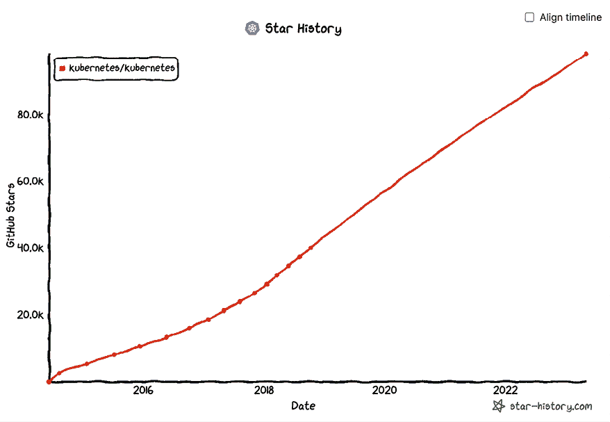
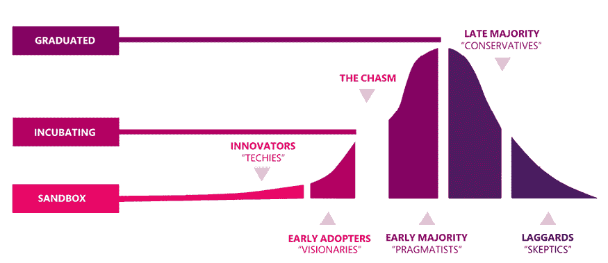
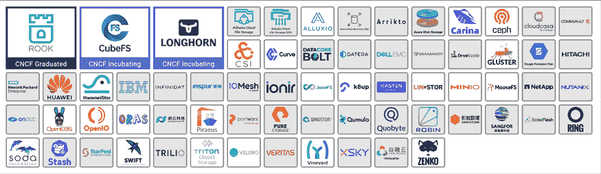

# 18

# Kubernetes 的未来

在本章中，我们将从多个角度审视 Kubernetes 的未来。我们将从 Kubernetes 自诞生以来在社区、生态系统和思维领导力等多个维度的势头开始。剧透一下——Kubernetes 在容器编排战争中以压倒性优势获胜。随着 Kubernetes 的发展和成熟，竞争对手的较量逐渐转变为与自身复杂性作斗争。可用性、工具链和教育将发挥重要作用，因为容器编排仍然是一个全新的、快速发展的领域，而且尚未被充分理解。接下来，我们将看看一些非常有趣的模式和趋势，最后，我们将回顾我在第二版中的预测，并做出一些新的预测。

涵盖的主题如下：

+   Kubernetes 的势头

+   CNCF 的重要性

+   Kubernetes 的可扩展性

+   服务网格集成

+   在 Kubernetes 上实现无服务器计算

+   Kubernetes 与虚拟机（VM）

+   集群自动扩展

+   无处不在的操作员

+   Kubernetes 与人工智能

+   Kubernetes 的挑战

# Kubernetes 的势头

Kubernetes 无可否认地是一个巨头。Kubernetes 不仅打败了所有其他容器编排工具，而且它还是公共云上的事实标准，许多私有云也在使用它，甚至虚拟机公司 VMware 也专注于 Kubernetes 解决方案并将其产品与 Kubernetes 集成。

由于其可扩展的设计，Kubernetes 在多云和混合云场景中表现非常出色。

此外，Kubernetes 还在边缘计算方面取得了进展，通过定制发行版进一步扩大了其广泛适用性。

Kubernetes 项目每三个月就会发布一个新版本，几乎像时钟一样精准。社区也在不断壮大。

Kubernetes 的 GitHub 仓库几乎有 100,000 颗星。推动这一惊人增长的主要因素之一是**CNCF**（**云原生计算基金会**）。

图 18.1：明星历史图表

## CNCF 的重要性

CNCF 已成为云计算领域一个非常重要的组织。尽管它并非专门针对 Kubernetes，Kubernetes 的主导地位却是不可否认的。Kubernetes 是第一个毕业的项目，其他大多数项目也都在很大程度上依赖 Kubernetes。特别是，CNCF 仅为 Kubernetes 提供认证和培训。CNCF 除了其他角色之外，还确保云技术不会遭受厂商锁定。查看这张展示整个 CNCF 生态的疯狂图表：[`landscape.cncf.io`](https://landscape.cncf.io)。

### 项目策划

CNCF 为项目分配成熟度级别：**已毕业**、**孵化中**和**沙箱**：

图 18.2：CNCF 成熟度级别

项目从某个级别开始——沙箱或孵化阶段——并随着时间的推移，逐步毕业。这并不意味着只有毕业的项目才能安全使用。许多孵化阶段甚至沙箱阶段的项目在生产环境中被大量使用。例如，etcd 是 Kubernetes 本身的持久状态存储，它只是一个孵化项目，但显然是一个高度可信赖的组件。虚拟 Kubelet 是一个沙箱项目，它支持 AWS Fargate 和 Microsoft ACI。显然，这是一个企业级软件。

CNCF 对项目的策划和管理的主要好处是帮助人们导航 Kubernetes 周围庞大的生态系统。当你想通过额外的技术和工具扩展你的 Kubernetes 解决方案时，CNCF 项目是一个很好的起点。

### 认证

当技术开始提供认证项目时，可以看出它们会长期存在。CNCF 提供几种类型的认证：

+   认证 Kubernetes，适用于符合标准的 Kubernetes 发行版和安装程序（大约 90 个）。

+   **Kubernetes 认证服务提供商**（**KCSP**），适用于具有深厚 Kubernetes 经验的经过验证的服务提供商（134 个提供商）。

+   **Kubernetes 认证管理员**（**CKA**），适用于管理员。

+   **Kubernetes 认证应用开发者**（**CKAD**），适用于开发者。

+   **Kubernetes 认证安全专家**（**CKS**），适用于安全专家。

### 培训

CNCF 也提供培训。它提供免费的 Kubernetes 入门课程，以及与 CKA 和 CKAD 认证考试对接的多个付费课程。此外，CNCF 维护了一份 Kubernetes 培训伙伴名单（[`landscape.cncf.io/card-mode?category=kubernetes-training-partner&grouping=category`](https://landscape.cncf.io/card-mode?category=kubernetes-training-partner&grouping=category)）。

如果你在寻找免费的 Kubernetes 培训，以下是一些选择：

+   VMware Kubernetes 学院

+   Coursera 上的 Google Kubernetes Engine

### 社区与教育

CNCF 还组织诸如 KubeCon、CloudNativeCon 等会议和聚会，并维护多个通信渠道，如 Slack 频道和邮件列表。它还发布调查和报告。

参会者和参与者的数量每年都在不断增长。

## 工具

管理容器和集群的工具、各种附加组件、扩展和插件不断增加。以下是 Kubernetes 生态系统中一些参与的工具、项目和公司：

图 18.3：Kubernetes 工具

# 托管 Kubernetes 平台的崛起

几乎每个云服务提供商现在都有强大的托管 Kubernetes 服务。有时，在某些云服务提供商上，运行 Kubernetes 的方式和版本也会有所不同。

## 公共云 Kubernetes 平台

以下是一些著名的托管平台：

+   Google GKE

+   Microsoft AKS

+   Amazon EKS

+   Digital Ocean

+   Oracle Cloud

+   IBM Cloud Kubernetes 服务

+   Alibaba ACK

+   腾讯 TKE

当然，您总是可以自己构建并将公共云服务提供商作为基础设施提供商使用。这是 Kubernetes 中非常常见的用例。

## 裸金属、私有云和边缘计算上的 Kubernetes

在这里，您可以找到为在特定环境中运行而设计或配置的 Kubernetes 发行版，通常是在您的数据中心作为私有云，或者在边缘计算等更受限的环境中运行，例如在小型设备上：

+   Google Anthos for GKE

+   OpenStack

+   Rancher k3S

+   Raspberry PI 上的 Kubernetes

+   KubeEdge

## Kubernetes PaaS（平台即服务）

这一类产品旨在抽象出 Kubernetes 的一些复杂性，并为其提供一个更简单的外壳。这里有许多种类。其中一些迎合了多云和混合云的场景，一些提供了功能即服务的接口，另一些则专注于更好的安装和支持体验：

+   Google Cloud Run

+   VMware PKS

+   Platform 9 PMK

+   Giant Swarm

+   OpenShift

+   Rancher RKE

# 即将到来的趋势

让我们谈谈一些 Kubernetes 世界中即将到来的技术趋势，这些趋势将在不久的将来变得重要。

## 安全性

安全性当然是大规模系统中的首要问题。Kubernetes 主要是一个用于管理容器化工作负载的平台。这些容器化的工作负载通常运行在一个多租户环境中。租户之间的隔离非常重要。容器轻量高效，因为它们共享一个操作系统，并通过各种机制（如命名空间隔离、文件系统隔离和 cgroup 资源隔离）来保持它们的隔离。理论上，这应该足够了。但在实践中，表面面积很大，容器隔离出现了多个突破。

为了应对这一风险，设计了多个轻量级虚拟机，加入了一个超监视器（机器级虚拟化），作为容器和操作系统内核之间的额外隔离层。大型云服务提供商已经支持这些技术，而 Kubernetes CRI 接口提供了一种简化的方式来利用这些更安全的运行时。

例如，FireCracker 通过 firecracker-containerd 与 containerd 集成。Google gVisor 是另一种沙盒技术，它是一个用户空间内核，实施大多数 Linux 系统调用，并在应用程序和宿主操作系统之间提供缓冲区。它也可以通过 gvisor-containerd-shim 通过 containerd 使用。

## 网络

网络是另一个持续创新的领域。Kubernetes CNI 允许在一个简单的接口后面使用各种创新的网络解决方案。一个主要的主题是将 eBPF（一种相对较新的 Linux 内核技术）整合到 Kubernetes 中。

**eBPF**代表**扩展伯克利数据包过滤器**。eBPF 的核心是 Linux 内核中的一个迷你虚拟机，它在发生特定事件（如数据包传输或接收）时执行附加到内核对象的特殊程序。最初，只支持套接字，这项技术当时称为 BPF。后来，更多的对象被添加到这个技术中，这就是为什么会有*e*代表*扩展*。eBPF 的著名之处在于其性能，因为它在内核中运行经过高度优化的编译 BPF 程序，并且无需通过内核模块扩展内核。

eBPF 有很多应用场景：

+   **动态网络控制**：基于 iptables 的方法在像 Kubernetes 集群这样的动态环境中不太适用，因为 Kubernetes 集群中有不断变化的 Pods 和服务。用 BPF 程序替代 iptables 不仅更高效，而且更易管理。Cilium 专注于使用 eBPF 进行流量路由和过滤。

+   **监控连接**：通过附加一个跟踪套接字级事件的 BPF 程序 kprobes，可以创建一个容器之间 TCP 连接的最新映射。WeaveScope 通过在每个节点上运行一个代理来收集这些信息，并将其发送到一个服务器，通过流畅的 UI 提供可视化展示。

+   **限制系统调用**：Linux 内核提供了 300 多个系统调用。在一个对安全要求较高的容器环境中，限制这些系统调用是非常有益的。原始的 seccomp 功能相对基础。在 Linux 3.5 中，seccomp 被扩展以支持 BPF 进行高级自定义过滤。

+   **原始性能**：eBPF 提供了显著的性能优势，像 Calico 这样的项目利用这一点实现了一个更快的数据平面，且使用了更少的资源。

## 定制硬件和设备

Kubernetes 在较高层次上管理节点、网络和存储。但将特定硬件集成到更细粒度的层次上有很多好处。例如，GPU、高性能网卡、FPGA、InfiniBand 适配器以及其他计算、网络和存储资源。这时，设备插件框架就派上用场了，可以在这里找到：[`kubernetes.io/docs/concepts/extend-kubernetes/compute-storage-net/device-plugins`](https://kubernetes.io/docs/concepts/extend-kubernetes/compute-storage-net/device-plugins)。自 Kubernetes 1.26 以来，它已进入 GA 阶段，并且这一领域的创新仍在持续。例如，自 Kubernetes 1.15 起，设备插件资源的监控也处于 beta 阶段。非常有趣的是，看到哪些设备将被集成到 Kubernetes 中。该框架本身通过使用 gRPC 遵循现代 Kubernetes 的可扩展性实践。

## 服务网格

服务网格可以说是过去几年中网络领域最重要的趋势。我们在*第十四章*《利用服务网格》中深入探讨了服务网格的内容。服务网格的采用令人印象深刻，我预测大多数 Kubernetes 发行版将提供默认的服务网格，并允许与其他服务网格进行轻松集成。服务网格带来的好处是无价的。因此，提供一个包含集成服务网格的默认平台是合情合理的。然而，Kubernetes 本身不会吸收某些服务网格并通过其 API 进行暴露。这与保持 Kubernetes 核心简洁的理念背道而驰。

Google Anthos 是一个很好的例子，它将 Kubernetes + Knative + Istio 结合在一起，提供了一个统一的平台，提供了一套有指导性的最佳实践组合，而这些组合如果由组织自行构建，将需要花费大量时间和资源，且必须基于原生 Kubernetes。

另一个推动这一方向的举措是边车容器的 KEP，相关信息可以在这里找到：[`github.com/kubernetes/enhancements/blob/master/keps/sig-node/753-sidecar-containers/README.md`](https://github.com/kubernetes/enhancements/blob/master/keps/sig-node/753-sidecar-containers/README.md)。

边车容器模式从一开始就是 Kubernetes 的一个重要组成部分。毕竟，Pod 可以包含多个容器。但在早期并没有明确区分主容器和边车容器，Pod 中的所有容器地位是平等的。大多数服务网格使用边车容器来拦截流量并执行其任务。规范化边车容器将有助于这些工作，并进一步推动服务网格的发展。

当前尚不清楚 Kubernetes 和服务网格是否会在大多数平台上隐藏在更简化的抽象层后面，或者它们是否会被直接暴露。

## 无服务器计算

无服务器计算是另一个注定会持续的趋势。我们在*第十二章*《Kubernetes 上的无服务器计算》中进行了详细讨论。Kubernetes 和无服务器计算可以在多个层次上结合使用。Kubernetes 可以利用像 AWS Fargate 和**AKS Azure 容器实例**（**ACI**）这样的无服务器云解决方案，减轻集群管理员管理节点的负担。该方法还可支持与 Kubernetes 的轻量级虚拟机透明集成，因为云平台并没有使用裸 Linux 容器作为其容器即服务平台的基础。

另一种途径是反转角色，将容器作为由 Kubernetes 提供支持的服务进行暴露。这正是 Google Cloud Run 所做的。在这里，界限变得模糊，因为 Google 提供了多个产品来管理容器和/或 Kubernetes，从仅仅是 GKE，到 Anthos GKE（将自己的集群带入 GKE 环境，供私有数据中心使用），Anthos（托管 Kubernetes + 服务网格），以及 Anthos Cloud Run。

最后，有一些功能即服务和按需扩展的项目正在你的 Kubernetes 集群中运行。Knative 可能会成为这方面的领导者，因为它已经被许多框架使用，并且通过各种 Google 产品进行广泛部署。

## 边缘上的 Kubernetes

Kubernetes 是云原生计算的代表，但随着**物联网**（**IoT**）的革命，越来越需要在网络边缘执行计算。将所有数据发送到后台进行处理存在几个缺点：

+   延迟

+   足够带宽的需求

+   成本

随着边缘位置通过传感器、视频摄像头等收集大量数据，边缘数据量不断增长，进行越来越复杂的处理在边缘端变得更加合理。Kubernetes 源自 Google 的 Borg，后者显然并非为了在网络边缘运行而设计。但 Kubernetes 的设计证明其足够灵活，可以适应这一需求。我预计，我们将看到越来越多的 Kubernetes 部署在网络边缘，这将催生出由多个 Kubernetes 集群组成的非常有趣的系统，这些集群需要进行集中管理。

KubeEdge 是一个开源框架，建立在 Kubernetes 和 Mosquito（一个开源的 MQTT 消息代理实现）之上，提供一个用于云端和边缘之间的网络、应用部署以及元数据同步的基础。

## 原生 CI/CD

对开发者而言，最重要的问题之一是构建 CI/CD 管道。市场上有很多选择，做出选择可能非常困难。CD 基金会是一个开源基金会，旨在标准化管道和工作流等概念，并定义行业规范，使不同的工具和社区能够更好地互操作。

当前的项目有：

+   Jenkins

+   Tekton

+   Spinnaker

+   Jenkins X

+   Screwdriver.cd

+   Ortelius

+   CDEvents

+   Pyrsia

+   Shipwright

请注意，只有 Jenkins 和 Tekton 被视为毕业项目，其它项目（甚至 Spinnaker）仍处于孵化阶段。

我最喜欢的原生 CD 项目之一，Argo CD，并未成为 CD 基金会的一部分。事实上，我曾在 GitHub 上开设了一个 issue，要求将 Argo CD 提交给 CDF，但 Argo 团队决定 CNCF 更适合他们的项目。

另一个值得关注的项目是 CNB——云原生构建包。该项目接受源代码并创建 OCI（类似 Docker）镜像。对于 FaaS 框架和集群内原生 CI 至关重要。它也是一个 CNCF 沙箱项目。

## 操作员

**Operator** 模式源于 2016 年的 CoreOS（被 RedHat 收购，后又被 IBM 收购），并在社区中获得了广泛的成功。Operator 是自定义资源和控制器的结合，用于管理应用程序。在我目前的工作中，我编写 Operator 来管理基础设施的各个方面，这是一项令人愉快的工作。它已经成为向 Kubernetes 集群分发复杂应用程序的成熟方式。请查看 [`operatorhub.io/`](https://operatorhub.io/) 获取大量现有的 Operator 列表。我预计这一趋势将继续并加剧。

# Kubernetes 和 AI

AI 是目前最热门的趋势。**大型语言模型**（**LLMs**）和**生成式预训练变换器**（**GPT**）凭借其强大的能力让大多数专业人士感到惊讶。OpenAI 发布的 ChatGPT 3.5 版是一个分水岭时刻。AI 突然在曾被视为人类智慧堡垒的领域，如创意写作、绘画、理解、回答复杂问题以及当然还有编程方面表现出色。我的观点是，先进的 AI 是解决大数据问题的答案。我们学会了收集大量数据，但从中分析和提取洞察是一个困难且劳动密集的过程。AI 似乎是消化所有数据并自动理解、总结、整理成对人类和其他系统（很可能是 AI 系统）有用形式的正确技术。

让我们来看一下，为什么 Kubernetes 非常适合 AI 工作负载。

## Kubernetes 和 AI 协同效应

现代 AI 的核心是深度学习网络和具有数十亿参数的大型模型，这些模型在庞大的数据集上进行训练，通常需要专用硬件。Kubernetes 非常适合处理这种工作负载，因为它能够快速适应工作负载的需求，充分利用新的硬件，并提供强大的可观察性。

最有力的证据来自实践。Kubernetes 是 OpenAI 流水线的核心，越来越多的公司正在开发和部署庞大的 AI 应用程序。请阅读这篇文章，了解 OpenAI 如何使用 Kubernetes 推动技术进步，并运行一个包含 7,500 个节点的大型集群：[`openai.com/research/scaling-kubernetes-to-7500-nodes`](https://openai.com/research/scaling-kubernetes-to-7500-nodes)。

让我们考虑一下在 Kubernetes 上训练 AI 模型。

## 在 Kubernetes 上训练 AI 模型

训练大型 AI 模型可能既慢又昂贵。参与在 Kubernetes 上训练 AI 模型的组织从其许多特性中受益：

+   **可扩展性**：Kubernetes 提供了一个高度可扩展的基础设施，用于部署和管理 AI 工作负载。借助 Kubernetes，可以根据需求快速扩展或缩减资源，使组织能够快速高效地训练 AI 模型。

+   **资源利用**：Kubernetes 允许高效的资源利用，使得组织能够使用最具成本效益的基础设施训练 AI 模型。通过 Kubernetes，可以自动分配和管理资源，确保工作负载所需的资源得到有效配置。

+   **灵活性**：Kubernetes 提供了高度的灵活性，可以使用不同的基础设施来训练 AI 模型。Kubernetes 支持包括 GPU、FPGA 和 TPU 在内的多种硬件，使得可以根据工作负载选择最合适的硬件。

+   **可移植性**：Kubernetes 提供了高度可移植的基础设施，用于部署和管理 AI 工作负载。Kubernetes 支持多种云服务提供商和本地基础设施，使得可以在任何环境中训练 AI 模型。

+   **生态系统**：Kubernetes 拥有一个充满活力的开源工具和框架生态系统，可以用于训练 AI 模型。例如，Kubeflow 是一个流行的开源框架，用于在 Kubernetes 上构建和部署机器学习工作流。

## 在 Kubernetes 上运行基于 AI 的系统

一旦你训练好了模型并在其上构建了应用程序，就需要部署并运行它。Kubernetes 当然是一个优秀的工作负载部署平台。基于 AI 的工作负载通常被设计为快速响应超人类水平的需求。Kubernetes 提供的高可用性以及根据需求快速扩展和缩减的能力，能够满足这些要求。

此外，如果系统被设计为持续学习（而不是像 GPT 这样固定的预训练系统），那么 Kubernetes 提供了强大的安全性和控制，支持安全运行。

让我们来看看新兴的 AIOps 领域。

## Kubernetes 和 AIOps

AIOps 是一种利用 AI 和机器学习自动化和优化基础设施管理的范式。AIOps 可以帮助组织提高 IT 基础设施的可靠性、性能和安全性，同时减轻人类工程师的负担。

Kubernetes 是实践 AIOps 的理想平台。它可以完全通过编程访问，且通常会与深度可观察性一起部署。这两个条件是使 AI 能够审视系统状态并在必要时采取行动的必要且充分条件。

Kubernetes 的未来看起来很光明，但它也面临一些挑战。

# Kubernetes 的挑战

Kubernetes 是解决与基础设施相关的所有问题的答案吗？当然不是。让我们来看一下 Kubernetes 的一些挑战，比如它的复杂性，以及一些针对开发、部署和管理大规模系统的替代解决方案。

## Kubernetes 的复杂性

Kubernetes 是一个庞大、强大且可扩展的平台。它大多是非意见化的，且非常灵活。它有一个巨大的表面面积，包含许多资源和 API。此外，Kubernetes 拥有庞大的生态系统。这意味着它是一个极其难以学习和掌握的系统。这对 Kubernetes 的未来有什么影响？一个可能的情景是，大多数开发者将不会直接与 Kubernetes 互动。建立在 Kubernetes 上的简化解决方案将成为大多数开发者的主要接入点。

如果 Kubernetes 完全抽象化，那么它可能会对未来构成威胁，因为作为底层实现的 Kubernetes 可能会被解决方案提供商替代。最终用户可能根本不需要对他们的代码或配置做任何改变。

另一个场景是，越来越多的组织开始对在 Kubernetes 上构建的成本持负面看法，相比之下，轻量级的容器编排平台如 Nomad 可能更具吸引力。这可能会导致从 Kubernetes 的流失。

让我们来看一些可能在不同领域与 Kubernetes 竞争的技术。

## 无服务器函数平台

无服务器函数平台为组织和开发者提供了类似 Kubernetes 的好处，但采用了一个更简单（尽管不那么强大）的范式。你不需要将系统建模为一组长期运行的应用程序和服务，而是只需要实现一组可以按需触发的函数。你不需要管理集群、节点池和服务器。一些解决方案也提供长期运行的服务，可能是预打包成容器或直接从源代码运行。我们在*第十二章*中详细讲解了这个内容，*在 Kubernetes 上的无服务器计算*。随着无服务器平台的不断改进，以及 Kubernetes 变得越来越复杂，更多组织可能会倾向于至少开始使用无服务器解决方案，之后可能会迁移到 Kubernetes。

首先，所有云服务提供商都提供各种无服务器解决方案。纯粹的云函数模型有：

+   AWS Lambda

+   Google Cloud Functions

+   Azure Functions

还有许多强大且易于使用的解决方案并未与大型云服务提供商相关联：

+   Cloudflare Workers

+   Fly.io

+   渲染

+   Vercel

这就是我们对 Kubernetes 挑战的总结。让我们总结一下本章的内容。

# 总结

在本章中，我们探讨了 Kubernetes 的未来，看起来非常光明！其技术基础、社区支持、广泛的支持以及势头都非常令人印象深刻。Kubernetes 仍然年轻，但创新和稳定的步伐非常鼓舞人心。Kubernetes 的模块化和可扩展性原则使其成为现代云原生应用程序的通用基础。尽管如此，Kubernetes 也面临一些挑战，并且可能并不会主导每个场景。这是一件好事。多样性、竞争以及其他解决方案的启发会让 Kubernetes 变得更好。

到目前为止，你应该清楚 Kubernetes 目前的状态以及它未来的发展方向。你应该有信心，Kubernetes 不仅会长期存在，而且将成为未来多年主导的容器编排平台，能够与各种大型平台和环境集成——从全球规模的公有云平台、私有云、数据中心、边缘计算位置，一直到你的开发笔记本电脑和树莓派。

就这样！这本书已经结束了。

现在，轮到你运用所学的知识，使用 Kubernetes 构建令人惊叹的项目了！

# 加入我们的 Discord 社区！

与其他用户、云计算专家、作者以及志同道合的专业人士一起阅读本书。

提出问题，为其他读者提供解决方案，参加作者的“问我任何问题”环节，等等。

扫描二维码或访问链接，即可立即加入社区。

[`packt.link/cloudanddevops`](https://packt.link/cloudanddevops)

