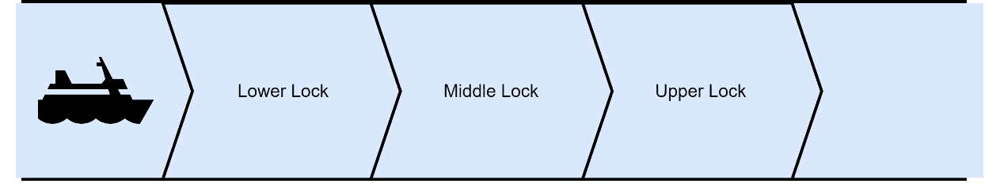
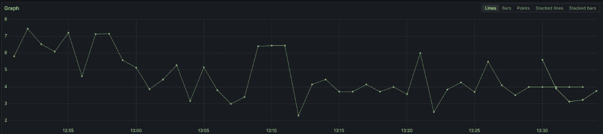
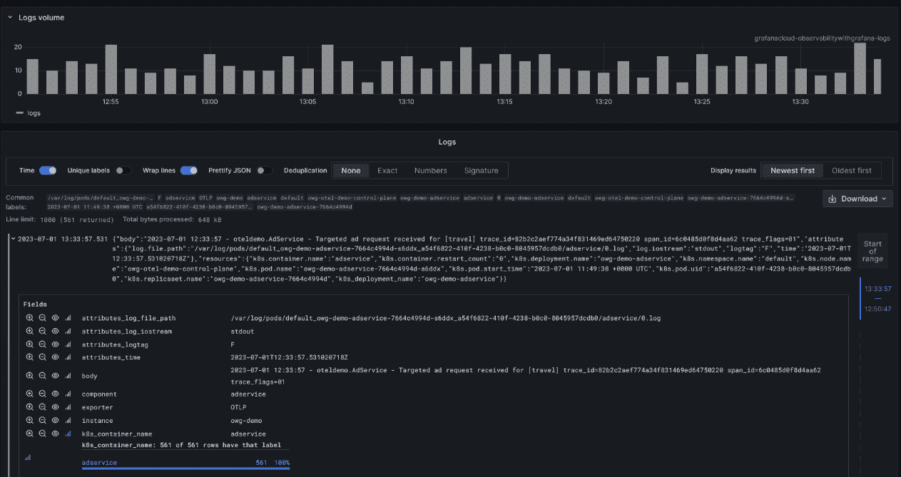
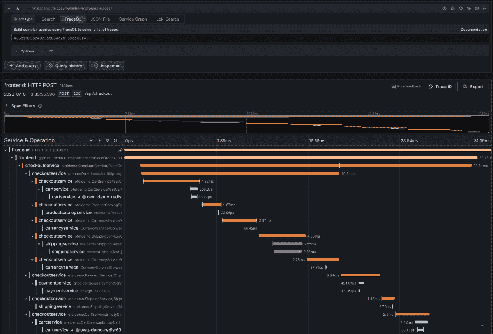

# 第一章：介绍观察性与 Grafana 技术栈

我们当前使用的现代计算机系统已经从“复杂”领域转向“复杂性”领域，在这些系统中，相互作用的变量数目使其最终变得无法预测和无法控制。我们使用“复杂”和“复杂性”这两个术语是根据系统理论的定义。一个复杂的系统，如引擎，具有组件之间明确的因果关系。而一个复杂系统，如城市交通的流动，则通过组件之间的相互作用展现出涌现行为。

根据 Ponemon Institute 2016 年的估算，每分钟停机的平均成本为 9000 美元，若组织未采取措施管理这一风险，复杂性可能会导致重大的财务损失。**观察性**提供了一种减轻这些风险的方式，但如果实施不当或没有明确的商业目标，使系统具备观察性也会带来财务风险。

本书将帮助你深入理解观察性是什么，以及可能使用它的客户是谁。我们将探索如何使用来自 Grafana Labs 的工具来获取组织的可见性。这些工具包括 Loki、Prometheus、Mimir、Tempo、Frontend Observability、Pyroscope 和 k6。你将学习如何使用**服务水平指标**（**SLIs**）和**服务水平目标**（**SLOs**）来获得清晰透明的信号，判断服务是否正常运行，并学习如何使用 Grafana 的**事件响应工具**来处理事件。最后，你将了解如何使用**自动化工具**如 Ansible、Terraform 和 Helm 来管理观察性平台。

本章旨在通过计算机领域之外的例子向所有受众介绍观察性。我们将介绍观察性工具使用的**遥测**类型，这将为你提供如何利用这些工具快速了解服务状态的概览。我们还将概述可能使用观察性系统的各种**角色**，这样你在后续的学习中可以在明确受益者的基础上探讨更复杂的概念。最后，我们将研究 Grafana 的**Loki、Grafana、Tempo、Mimir**（**LGTM**）技术栈，如何部署它，以及有哪些替代方案。

本章我们将涵盖以下主要内容：

+   观察性概述

+   遥测类型与技术

+   理解观察性的客户群

+   介绍 Grafana 技术栈

+   Grafana 技术栈的替代方案

+   部署 Grafana 技术栈

# 观察性概述

**观察性**这个术语借鉴自控制理论。在 IT 系统中，**监控**和**观察性**通常可以互换使用，因为这两个概念密切相关。监控是当系统出现问题时发出警报的能力，而观察性则是理解系统并确定是否存在问题及其原因的能力。

控制理论在 19 世纪末就蒸汽机中的离心调速器进行了形式化。此图显示了该系统的简化视图：

）](img/B18277_01_1.jpg)

图 1.1 – 詹姆斯·瓦特的蒸汽机飞重调速器（来源：[`www.mpoweruk.com`](https://www.mpoweruk.com)）

蒸汽机使用锅炉将水加热至压力容器中的蒸汽。蒸汽推动活塞前后运动，从而将热能转化为往复能量。在使用离心调速器的蒸汽机中，这种往复能量通过连接到活塞的轮子转化为旋转能量。离心调速器通过物理链接将系统向后连接到节气门。这意味着旋转速度控制节气门，而节气门又控制旋转速度。从物理上讲，这是通过调速器上的小球向外飞出并下落向内直到系统达到平衡来观察的。

监控定义了事先感兴趣的指标或事件。例如，调速器测量预定义的驱动轴转数。然后，节气门的可控性通过枢轴和执行杆组件提供。假设执行杆正确调整，调速器应控制节气门从完全打开到完全关闭。

相反，可观察性通过允许从系统的外部输出推断出其内部状态来实现。如果操作点调整设置不正确，调速器可能转得太快或太慢，从而使节气门控制失效。调速器转得过快或过慢也可能表明滑环卡住了，需要加油。重要的是，这些洞察可以在没有预先定义“过快”或“过慢”的情况下获得。得出调速器转速过快或过慢的结论，几乎不需要了解整个蒸汽机的详细信息。

从根本上讲，监控和可观察性都用于提高所讨论系统的可靠性和性能。

现在我们已经介绍了高层次的概念，接下来让我们探讨一个来自软件服务领域之外的实际例子。

## 案例研究 – 一艘船通过巴拿马运河

让我们想象一艘船通过巴拿马运河的阿瓜克拉水闸。这个过程可以通过以下图示来说明：



图 1.2 – 巴拿马运河的阿瓜克拉水闸

这些水闸中有一些方面我们可能需要监控：

+   每个闸门成功打开和关闭

+   每个水闸内的水位

+   一艘船通过水闸所需的时间

监控这些方面可能会突出我们需要注意的情况：

+   由于机械故障，闸门卡住无法关闭

+   由于泄漏，水位迅速下降

+   一艘船因卡住而需要花费更多时间才能通过闸门：

可能会出现这种情况：我们监控的数据处于可接受的范围内，但我们仍然可以观察到与*正常*情况的偏差，这应该促使进一步的行动：

+   锁墙顶部附近出现了一个小漏水点：

    +   我们会看到水位下降，但只有当水位高于漏点时才会发生。

    +   这可能会促使对锁墙进行维护工作。

+   一扇锁门打开得更慢，因为它需要维护：

    +   我们会看到开关门之间的时间延长。

    +   这可能会促使对锁门进行维护。

+   当风从某个特定方向吹来时，船只通过闸门的时间会更长：

    +   我们可以比较每小时的平均通行速率。

    +   这可能促使减少来自某个方向风力影响的工作。

现在我们已经看到了一个测量现实世界系统的例子，我们可以将这些类型的测量分为不同的数据类型，以便最适合应用。现在让我们介绍这些数据类型。

# 遥测类型和技术

可观测工具中无聊但重要的一部分是**遥测**——捕获有用数据，跨地点传输数据，并生成为组织提供价值的可视化、警报和报告。

用于构建监控和可观测系统的三种主要遥测类型是——指标、日志和分布式追踪。其他遥测类型可能会被一些供应商和在特定情况下使用。我们将在这里简要介绍这些内容，但它们将在本书的*第十二章*和*第十三章*中更详细地探讨。

## 指标

**指标**可以被视为在某一时刻记录的数值数据，并通过标签或维度加以丰富，以便进行分析。指标通常是频繁生成的，并且易于搜索，非常适合用来判断某些事情是否异常或不对劲。让我们来看一个显示时间变化的指标示例：



图 1.3 – 显示时间变化的指标

以巴拿马运河为例，我们可以将*每个闸门的水位*作为一个指标，在定期的时间间隔进行测量。为了有效使用这些数据，我们可能会添加一些标签：

+   **锁名**：阿瓜·克拉拉

+   **锁室**：下游闸室

+   **运河**：巴拿马运河

## 日志

**日志**被视为非结构化的字符串数据类型。它们在某一时刻被记录，通常包含大量关于正在发生的事情的信息。虽然日志可以是结构化的，但无法保证该结构会持续存在，因为日志的生产者掌握着日志结构的控制权。让我们来看一个例子：

```
Jun 26 2016 20:31:01 pc-ac-g1 gate-events no obstructions seen
Jun 26 2016 20:32:01 pc-ac-g1 gate-events starting motors
Jun 26 2016 20:32:30 pc-ac-g1 gate-events motors engaged successfully
Jun 26 2016 20:35:30 pc-ac-g1 gate-events stopping motors
Jun 26 2016 20:35:30 pc-ac-g1 gate-events gate open complete
```

在我们的例子中，开关锁门时的各种操作可以作为日志来表示。

几乎每个系统都会生成日志，而且它们通常提供非常详细的信息。这对于理解发生了什么非常有帮助。然而，数据量带来了两个问题：

+   搜索可能效率低下且缓慢。

+   由于数据是文本格式，知道应该搜索什么可能会很困难。例如，`error occurred`、`process failed` 和 `action did not complete successfully` 都可以用来描述故障，但没有共享的字符串可以用于搜索。

让我们看一个来自计算机系统的真实日志条目，看看日志数据通常是如何表示的：



图 1.4 – 显示时间上离散事件的日志

我们可以清楚地看到，系统已从日志条目中提取出多个字段。这些字段详细说明了日志条目的来源、发生时间以及其他各种信息。

## 分布式踪迹

**分布式踪迹** 显示了一个动作的端到端过程。它们从完成该动作的每一步骤中捕获信息。假设有一个涉及船只通过闸门系统的踪迹，我们将关注船只进出每个闸门的时间，并且希望能够比较不同的船只使用该系统的情况。整个过程可以赋予一个标识符，通常称为 **trace ID**。踪迹由多个 **spans** 组成。在我们的示例中，一个 span 将覆盖每个独立闸门的进出。这些 spans 会被赋予第二个标识符，称为 **span ID**。为了将这两者关联起来，每个踪迹中的 span 都会引用整个踪迹的 trace ID。以下截图展示了分布式踪迹如何在计算机应用中表示：



图 1.5 – 显示动作随时间关系的踪迹

现在我们已经引入了度量、日志和踪迹，让我们考虑一个更详细的示例，关于船只通过闸门的过程，以及在此过程中如何生成每种遥测类型：

1.  船只进入第一道锁：

    +   Span ID 创建完成

    +   Trace ID 创建完成

    +   上下文信息被添加到 Span 中，例如，船只标识

    +   关键事件以时间戳形式记录在 Span 中，例如，闸门的开启和关闭

1.  船只通过第一道锁：

    +   Span 已关闭并提交给记录系统

    +   第二道锁通知踪迹 ID 和 Span ID

1.  船只通过第二道锁：

    +   Span ID 创建完成

    +   Trace ID 被添加到 Span 中

    +   上下文信息被添加到 Span 中

    +   在 Span 中记录关键事件及其时间戳

1.  船只通过第二道锁：

    +   Span 已关闭并提交给记录系统

    +   第三道锁通知踪迹 ID 和 Span ID

1.  船只通过第三道锁：

    +   重复 *步骤 3*

1.  船只通过第三道锁：

    +   Span 已关闭并提交给记录系统

现在让我们看一些其他的遥测类型。

## 其他遥测类型

指标、日志和追踪通常被称为*三大支柱*或*黄金三角*，是可观测性的核心组成部分。正如我们前面所概述的，可观测性是理解一个系统的能力。虽然指标、日志和追踪为我们提供了非常好的理解系统的能力，但它们并不是我们可能需要的唯一信号，这取决于我们需要在哪个抽象层次上观察系统。例如，当我们查看非常详细的层次时，可能会对应用程序在 CPU 和 RAM 层面的活动堆栈跟踪非常感兴趣。相反，如果我们关心的是 CI/CD 管道的执行，我们可能仅仅关心是否发生了部署，其他的就不再关注。

**分析数据**（**堆栈跟踪**）可以为我们提供系统使用资源（如 CPU 周期或内存）的非常详细的技术视图。由于云服务通常按小时收费，因此这种详细的分析可以轻松实现成本节约。

同样，**事件**可以从平台（如 CI/CD）中获取。这些事件可以提供大量的洞察，有助于缩短**平均恢复时间**（**MTTR**）。想象一下，当你在非工作时间响应警报时，发现服务的一个新版本刚在问题发生前就部署了。更棒的是，想象一下你不需要醒来，因为部署过程可以自动检查失败并回滚。事件与日志的区别仅在于事件代表了一个完整的动作。在我们之前在*日志*部分的例子中，我们创建了五条日志，但这些日志都指向同一事件（打开锁门）的不同阶段。作为一个相对通用的术语，*事件*有时会有其他含义。

现在我们已经介绍了技术的基本概念，接下来我们来谈谈将使用可观测性数据的客户。

# 介绍观察者的用户角色

可观测性涉及理解一个系统、识别系统是否存在问题以及理解问题的原因。那么，*理解一个系统*是什么意思呢？简单的回答是*了解单个应用程序或* *基础设施组件*的状态。

在本节中，我们将介绍本书中将使用的用户角色。这些角色将帮助区分人们使用可观测性系统来回答的不同类型问题。

让我们快速看一下本书中将用作示例的用户角色及其角色：

|  | **名称** **和角色** | **描述** |
| --- | --- | --- |
|  | Diego 开发者 | 前端、后端、全栈等 |
|  | Ophelia 操作员 | SRE、DevOps、DevSecOps、客户成功等 |
|  | Steven 服务 | 服务经理及其他任务 |
|  | Pelé产品 | 产品经理、产品负责人等 |

|  | Masha 经理 | 经理，高层领导等 |

表 1.1 – 用户角色介绍

现在，让我们更详细地了解这些用户。

## Diego 开发人员


*Diego 开发人员* 工作在许多类型的系统上，从客户直接交互的前端应用程序，到让组织能够以令人满意的方式存储数据的后端系统。你甚至可能会发现他在为其他开发人员工作的平台上工作，这些平台帮助他们的应用程序安全、快速地集成、构建、交付和部署。

### 目标

他编写出色的软件，经过充分测试，且解决了客户的实际需求。

### 互动

当他不在编写代码时，他会与 *Ophelia 操作员* 一起处理出现的任何问题和疑问。

*Pelé 产品* 在他的团队中工作，提供客户需求的洞察。他们紧密合作，将这些需求转化为详细的计划，制定如何交付解决这些需求的软件。

*Steven 服务* 非常关注 Diego 所做的更改是否会影响客户的承诺。如果发生需要关注的事故，他也会是第一个叫醒 Diego 的人。提供给 *Masha 经理* 的数据帮助她了解成本分解。当 Diego 在开发平台上工作时，他还收集数据，帮助她获得来自业务的投资，用于那些表现不如预期的团队。

### 需求

Diego 真的需要一些易于使用的库来支持他编写的代码。他没有时间成为专家，他希望能够添加几行代码并迅速获得结果。

拥有明确的标准来衡量可接受的性能，使他能够轻松获得正确的结果。

### 痛点

当 Diego 的系统产生过多数据时，他发现很难从噪声中提取有用的信息。他也会因为上游决定更改工具而不得不修改代码，这让他感到沮丧。

## Ophelia 操作员


*Ophelia 操作员* 工作在一个以运营为重点的环境中。你可能会看到她在客户服务角色中，或者作为开发团队的一员担任 DevOps 工程师。她可能是一个专注于组织系统可靠性的团队成员，或者她也可能在安全或金融领域工作，以确保业务安全平稳地运行。

### 目标

Ophelia 希望确保产品按预期运行。她也喜欢在没有被早晨的事故叫醒时，能保持安稳的工作。

### 互动

Ophelia 将与 *Diego 开发人员* 密切合作；有时是当她无法获得数据来理解问题时，需要提升客户的工单；有时是开发运行手册，以确保系统持续运行。有时，她还需要向 Diego 提供有关可接受性能指标的明确指导，以便她的团队能够确保系统对客户表现良好。

*Steven Service* 与 Ophelia 紧密合作。他们一起工作，确保事件尽量少发生，并且能够快速解决。Steven 确保跟踪业务数据中的变更和事件，并在事情不顺时调整流程。

*Pelé Product* 喜欢拥有显示其产品问题领域的数据。

### 需求

有效的工作需要良好的数据。能够看到客户遇到错误，可能决定了是立即解决问题，还是让客户等待几周才能得到回应。

在一次事故中，看到在问题开始时部署了新版本的服务，可以将一个持续数小时的事件转变为短暂的波动，从而让客户保持满意。

### 痛点

持续收到警报但无法解决根本问题是一个大问题。Ophelia 曾看到同事们因过度工作而精疲力尽，每当这种情况发生时，她也会想离开组织。

## Steven Service


*Steven Service* 从事服务交付工作。他关心的是确保组织的服务能够顺利交付。在关键事件中介入并协调行动，确保尽快解决问题，是工作的一部分。同样，确保通过帮助他人以最安全的方式进行变更的流程也是他的责任。Steven 还与为组织运行提供关键服务的第三方供应商合作。

### 目标

他希望服务能够尽可能顺利运行，这样组织可以更多地专注于客户。

### 互动

*Diego Developer* 和 *Ophelia Operator* 经常与 *Steven* 创建的变更管理流程以及他管理的支持流程一起工作。在变更管理过程中，拥有准确的数据非常有帮助，可以确保流程尽可能顺畅。

Steven 与 *Masha Manager* 紧密合作，确保她能够访问展示哪些流程运作顺畅、哪些流程需要花时间改进的数据。

### 需求

他需要能够比较不同产品的交付情况，并将这些数据提供给 *Masha* 和业务部门。

在事故中，他需要尽可能快速地把合适的人找来开会，并且为事后分析保存记录。

### 痛点

在事故中，能够识别出合适的人来参加电话会议是他面临的常见问题。看到不同系统之间的对比，且谁能解决问题的问题一直争论不休，也让他非常担忧。

## Pelé 产品


*Pelé Product* 在产品团队工作。你会看到他与客户一起工作，了解他们的需求，保持产品路线图有序，并将需求传达给开发人员，例如 *Diego Developer*，以便他们进行开发。你还可能看到他在理解并制定产品待办事项，以支持组织内开发人员使用的内部平台。

### 目标

Pelé 想要了解客户，给他们提供令人愉悦的产品，并让他们不断回归。

### 互动

他花了很多时间与*Diego*一起工作，他们可以查看相同的信息，真正理解客户在做什么，以及如何帮助他们做得更好。

*Ophelia Operator* 和 *Steven Service* 帮助 *Pelé* 保持产品的进度。如果发生了太多的事件，他们会要求大家重新集中精力确保稳定性。向客户提供大量特性却没有信任保障是没有意义的。

*Pelé* 与 *Masha Manager* 紧密合作，确保组织中拥有构建产品所需的合适技能团队。商业依赖她的领导力，确保这些开发人员拥有最佳的工具，帮助他们将代码推送到客户面前，使其能够使用。

### 需求

*Pelé* 需要能够理解客户的痛点，即使他们在用户研究中未能清楚表达这些问题。

他需要能够为自己和 *Diego*、*Ophelia* 提供共同语言的数据。有时候，他们可能会过于关注一些具体数字，例如减少请求的毫秒数，而实际上，改善一个糟糕的工作流程对客户体验的提升会更为显著。

### 痛点

*Pelé* 讨厌无法高层次地看到客户的行为。了解应用程序中最常使用的部分以及完全不被使用的部分，能让他知道应该在哪些方面集中时间和资源。

尽管客户从不直接告诉他他们需要稳定性，但如果缺乏这一点，他们会迅速失去信任，并开始寻找替代方案。

## Masha 经理


*Masha* 从事管理工作。你可能会看到她领导一个团队并与他们日常密切合作。她还代表中层管理，负责制定战略和做出战术选择，并在一定程度上参与高级领导工作。她的大部分工作涉及管理预算和人员。如果有什么能够简化这个过程，她通常会很感兴趣。*Masha* 不希望浪费组织的资金，因为那可能直接影响到员工的工作。

### 目标

她的主要目标是确保组织顺利运行，并确保预算保持平衡。

### 互动

作为领导者，*Masha* 需要准确的数据，并且需要能够信任那些提供数据的团队。这些数据可以是从 *Pelé Product* 提供的特性概念到交付的端到端周期时间，*Diego Developer* 提供的变更前置时间，或者 *Steven Service* 提供的平均修复时间（MTTR）。拥有这些数据有助于她理解在哪些方面集中精力和资源能带来最大的影响。

*Masha* 定期与财务运营人员合作，确保他们了解组织的支出和这些支出所带来的价值。

### 需求

她需要在一个可以查看并做出良好决策的地方获取准确数据。这通常意味着她会从商业智能系统中获取信息。为了有效使用这些工具，她需要明确组织的目标，以便收集正确的数据，帮助她了解团队在实现这些目标的进展情况。

她还需要确保她所负责的团队拥有正确的数据和工具，以便在各自的领域中表现出色。

### 痛点

高故障率和长时间的恢复通常导致她不得不与客户沟通并道歉。*玛莎*非常讨厌这些电话！

云系统的可视化不足是一个特别的担忧。*玛莎*有太多由于缺乏监控而导致巨大超支的恐怖故事；她宁愿把这些预算花在更有用的地方。

你现在了解了使用可观察性数据的客户，以及你将使用的数据类型以满足他们的需求。由于本书的主要焦点是 Grafana 作为底层技术，让我们现在来介绍构成 Grafana 技术栈的工具。

# 介绍 Grafana 技术栈

Grafana 诞生于 2013 年，当时一位开发者正在寻找一种新的用户界面来显示 Graphite 的度量数据。最初从 Kibana 分支出来，Grafana 项目的开发旨在让用户能够快速构建对组织有价值的互动式仪表板。2014 年，**Grafana Labs**成立，核心价值是通过对开源项目的强力承诺建立可持续的商业模式。基于这个基础，Grafana 已经成长为一家强大的公司，支持超过 100 万个活跃安装。Grafana Labs 是开源项目的重要贡献者，从他们自己的工具到广泛采用的技术如 Prometheus，近期还积极参与如 OpenTelemetry 等热门项目。

Grafana 提供了许多工具，我们将其分为以下几类：

+   核心 Grafana 技术栈：**LGTM**和**Grafana Agent**

+   Grafana 企业插件

+   事件响应工具

+   其他 Grafana 工具

让我们在接下来的章节中探索这些工具。

## 核心的 Grafana 技术栈

核心 Grafana 技术栈由 Mimir、Loki、Tempo 和 Grafana 组成；常用缩写 LGTM 来指代这个技术栈。

### Mimir

**Mimir**是一个**时间序列数据库**（**TSDB**），用于存储度量数据。它使用低成本的对象存储，例如 S3、GCS 或 Azure Blob Storage。Mimir 于 2022 年 3 月首次宣布公开发布，是我们在这里讨论的四个产品中最年轻的，值得一提的是，Mimir 最初是从另一个项目 Cortex 分叉出来的，Cortex 始于 2016 年。Cortex 的部分功能也构成了 Loki 和 Tempo 的核心。

Mimir 是一个完全兼容 Prometheus 的解决方案，旨在解决存储和搜索大量度量数据时遇到的常见扩展性问题。在 2021 年，Mimir 在负载测试中达到了 10 亿个活跃时间序列。活跃时间序列是指在过去 20 分钟内报告了样本的度量，并且具有值和唯一标签的度量数据。我们将在*第五章*中更详细地探讨 Mimir 和 Prometheus。

### Loki

**Loki** 是一套完整功能的日志堆栈组件。Loki 使用低成本的对象存储，如 S3 或 GCS，并且仅索引标签元数据。Loki 于 2019 年 11 月进入正式发布阶段。

日志聚合工具通常使用两种数据结构来存储日志数据。一种是包含原始数据位置引用的索引，并配有可搜索的元数据，另一种是将原始数据以压缩形式存储。Loki 与许多其他日志聚合工具不同，它保持索引数据相对较小，并通过水平扩展查询组件来扩展搜索功能。选择最佳索引字段的过程将在*第四章*中讨论。

### Tempo

**Tempo** 是一个高扩展性分布式追踪遥测的存储后端，旨在对读取路径的 100% 进行采样。像 Loki 和 Mimir 一样，它利用低成本的对象存储，如 S3、GCS 或 Azure Blob 存储。Tempo 于 2021 年 6 月进入正式发布阶段。

当 Tempo 发布 1.0 版本时，它在持续处理超过 200 万个跨度每秒（大约每秒 350 MB）的负载下进行了测试。Tempo 还提供了在数据跨度被摄取时生成度量指标的功能；这些指标可以写入任何支持 Prometheus 远程写入的后端。Tempo 在*第六章*中有详细介绍。

### Grafana

**Grafana** 自 2014 年以来一直是数据可视化的基础工具。它支持连接各种数据源，从时间序列数据库（TSDB）到关系型数据库，甚至其他可观察性工具。Grafana 提供了超过 150 个数据源插件。Grafana 拥有一个庞大的社区，用户使用它进行各种不同的目的。该社区支持超过 6,000 个仪表板，意味着大多数现有技术都有一个起点，且可以在最短时间内实现价值。

### Grafana Agent

从许多地方收集遥测数据是可观察性的基本方面之一。**Grafana Agent**是一组用于收集日志、指标和追踪的工具。Grafana 与许多其他收集工具有很好的集成。不同的收集工具有不同的优缺点，这不是我们在本书中讨论的话题。我们将在本章后面以及在*第二章*中介绍该领域的其他工具，以帮助你开始了解这个话题。我们还将在*第十一章*中简要讨论如何构建收集基础设施。

Grafana 堆栈是一个出色的开源软件集合，专为可观察性设计。Grafana Labs 对开源的承诺得到了优秀企业插件的支持。现在，让我们来探索这些插件。

## Grafana 企业插件

作为 Cloud Pro、Cloud Advanced 和 Enterprise 许可套餐的一部分，Grafana 提供企业插件。这些插件是任何 Grafana 付费订阅的一部分。

企业数据源插件允许组织从他们可能使用的许多其他存储工具中读取数据，包括软件开发工具如**GitLab**和**Azure DevOps**，以及商业智能工具如**Snowflake**、**Databricks**和**Looker**。Grafana 还提供了从许多其他可观察性工具中读取数据的工具，这使得组织能够建立全面的运营覆盖，同时为各个团队提供他们所使用工具的选择。

除了数据源插件外，Grafana 还提供了日志、指标和追踪的高级工具。这些工具包括日志数据的访问策略和令牌，以保护敏感信息，深入的健康监控用于云堆栈的摄取和存储，以及租户管理。

## Grafana 事件响应与管理

Grafana 在**事件响应与管理**（**IRM**）领域提供了三款产品：

+   IRM 的基础是**警报规则**，可以通过消息应用、电子邮件或 Grafana OnCall 进行通知。

+   **Grafana OnCall**提供了一种值班排班管理系统，将警报分组和升级路由集中管理。

+   最后，**Grafana Incident**提供了聊天机器人功能，可以设置必要的事件空间，收集事件后评审过程的时间线，甚至可以直接通过消息服务管理事件。

这些工具将在*第九章*中更详细地介绍。现在让我们来看看其他一些重要的 Grafana 工具。

## 其他 Grafana 工具

Grafana Labs 继续在可观察性领域保持领先地位，并收购了多家公司，以发布补充我们已经讨论过的工具的新产品。现在，让我们来讨论一些这些工具。

### Faro

**Grafana Faro** 是一款可以添加到前端 web 应用程序中的 JavaScript 代理。该项目通过收集浏览器的遥测数据来实现**真实用户监控**（**RUM**）。通过将 RUM 集成到后端应用程序和基础设施已被监控的环境中，观察者能够跨越整个应用栈的数据。Faro 默认支持收集五个核心网页性能指标，以及其他几个重要信号。Faro 于 2022 年 11 月开始广泛发布。我们在 *第十二章* 中更详细地介绍了 Faro。

### k6

**k6** 是一款负载测试工具，提供了一个可以在自有基础设施中运行的打包工具以及一个云端 **软件即服务**（**SaaS**）解决方案。负载测试，尤其是在 CI/CD 流水线中的测试，能够帮助团队了解应用在负载下的表现，并评估优化和重构的效果。与其他详细分析工具（如 Pyroscope）配合使用，可以大大提升团队中非技术成员的可见性和可访问性。该项目始于 2016 年，并于 2021 年 6 月被 Grafana Labs 收购。k6 的目标是让性能测试变得简单且可重复。我们将在 *第十三章* 中更深入探讨 k6。

### Pyroscope

**Pyroscope** 是 Grafana Labs 最近收购的一个项目，于 2023 年 3 月加入。Pyroscope 是一款能够让团队进行持续性能分析的工具，能够监控应用程序对系统资源（如 CPU、内存等）的使用情况。Pyroscope 宣称，通过大约 2-5% 的性能开销，它能够每 10 秒就收集一次样本。**Phlare** 是 Grafana Labs 于 2022 年启动的项目，这两个项目现已合并。我们在 *第十三章* 中会更详细地讨论 Pyroscope。

现在，了解了 Grafana Labs 提供的不同工具后，让我们来看一些其他可用的替代方案。

# Grafana 堆栈的替代方案

监控和可观察性领域充满了各种开源和闭源解决方案，像 `ps` 和 `top` 这样的工具可以追溯到 70 和 80 年代。我们不会试图列出所有工具；我们的目标是为那些好奇、想要探索，或者需要快速参考可用工具的人提供灵感（正如作者曾多次做过的那样）。

## 数据收集

这些是可以用来从源头收集遥测数据的代理工具：

| **工具名称** | **遥测类型** |
| --- | --- |
| OpenTelemetry Collector | 指标、日志、追踪 |
| FluentBit | 指标、日志、追踪 |
| Vector | 指标、日志、追踪 |
| 特定厂商代理（详见 *数据存储、处理和可视化* 部分，获取扩展列表） | 指标、日志、追踪 |
| Beats family | 指标、日志 |
| Prometheus | 指标 |
| Telegraf | 指标 |
| StatsD | 指标 |
| Collectd | 指标 |
| Carbon | 指标 |
| Syslog-ng | 日志 |
| Rsyslog | 日志 |
| Fluentd | 日志 |
| Flume | Logs |
| Zipkin Collector | Traces |

表 1.2 – 数据采集工具

数据采集只是可观察性数据的提取、转换和加载过程中的一部分。接下来的部分将介绍转换和加载数据的工具。

## 数据存储、处理和可视化

我们将数据处理、存储和可视化归为一类，因为它们之间经常有很多交集。某些工具还提供**安全监控**，与之密切相关。然而，由于这一主题超出了本书的范围，我们选择不包含仅涉及安全领域的工具。

| **工具名称** | **工具名称** | **工具名称** |
| --- | --- | --- |
| AppDynamics | InfluxDB | Sematext |
| Aspecto | Instana | Sensu |
| AWS CloudWatch & CloudTrail | Jaeger | Sentry |
| Azure Application insights | Kibana | Serverless360 |
| Centreon | Lightstep | SigNoz |
| ClickHouse | Loggly | SkyWalking |
| Coralogix | LogicMonitor | Solarwinds |
| Cortex | Logtail | Sonic |
| Cyclotron | Logz.io | Splunk |
| Datadog | Mezmo | Sumo Logic |
| Dynatrace | Nagios | TelemetryHub |
| Elastic | NetData | Teletrace |
| GCP Cloud Operations Suite | New Relic | Thanos |
| Grafana Labs | OpenSearch | Uptrace |
| Graphite | OpenTSDB | VictoriaMetrics |
| Graylog | Prometheus | Zabbix |
| Honeycomb | Scalyr | Zipkin |

表 1.3 – 数据存储、处理和可视化工具

在充分理解了该领域内可用的工具后，我们现在来看看如何部署 Grafana 提供的工具。

# 部署 Grafana 栈

Grafana Labs 完全拥抱其作为开源软件提供商的历史。LGTM 栈及大多数其他组件都是开源的。有一些增值组件是企业订阅的一部分。

作为 SaaS 服务，Grafana Labs 提供 Loki、Mimir 和 Tempo 的存储访问，并且支持 Grafana 的 100 多个外部数据源集成。作为 SaaS 客户，您还可以轻松访问可能使用的其他各种工具，并可以在一个统一的界面中展示它们。SaaS 服务使组织能够利用一个功能全面的可观察性平台，而无需承担运行该平台和获取服务级别协议的运营负担。

除了为您管理平台，您还可以在组织的基础设施上运行 Grafana。Grafana 提供了几种格式的软件包，适用于 Linux 和 Windows 部署，并且还提供容器化版本。Grafana 还为每个工具提供了 Helm 和 Tanka 配置封装。由于 SaaS 版本容易开始并且有免费的层级，本书将主要集中在 SaaS 服务上。我们将在*第十一章*和*第十四章*中探讨一些本地安装的领域，这两章分别涉及 DevOps 流程的架构和支持。

# 总结

在本章中，你了解了监控和可观察性，它们的相似之处以及不同之处。巴拿马运河的 Agua Clara 闸门作为可观察性概念在实践中的简化示例。关键要点是要明白，即使系统为重大问题产生了警报，使用相同的数据仍然可以观察并调查其他潜在问题。

我们还讨论了可能使用可观察性系统的客户。当我们探讨一个概念以及如何实施它时，这些客户将在本书中被多次提及。

最后，我们介绍了完整的 Grafana Labs 堆栈，现在你应该对每个产品的不同用途有了较好的理解。

在下一章中，我们将介绍如何为类似 Diego 和 Ophelia 角色的读者添加应用程序或基础设施组件的监控基础知识。
