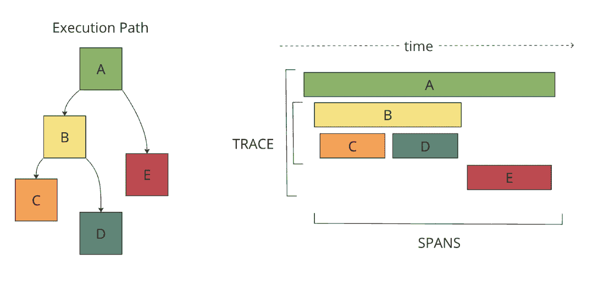

# 第二章：工具化应用程序和基础设施

上一章介绍了可观察性，并通过计算机领域外的示例帮助你对该主题有了一个通用的理解。在本章中，我们将在这些示例的基础上，提供应用程序和基础设施工具化的高级概述。我们将查看系统生成的数据，并了解这些数据如何与不同的遥测类型和常用协议相适应。我们还将探索用于流行编程语言的广泛使用的库，这些库简化了应用程序的工具化过程。最后，我们将涵盖来自基础设施组件、操作系统和网络设备的更传统的遥测收集。这将使你了解今天仍在运行的应用程序和 Kubernetes 工作负载的组成部分。本章面向各类技术能力的读者，且不需要特定的技术背景。了解可观察性术语（例如：日志、指标、跟踪和工具化）将有所帮助。其目的是提供技术领域的概述，并作为一个有价值的资源，当你在使用可观察性解决方案时，可以快速查阅。

在本章中，我们将探讨以下介绍性内容：

+   常见日志格式

+   指标协议和最佳实践

+   跟踪协议和最佳实践

+   使用库进行高效的工具化

+   基础设施数据技术

# 常见日志格式

日志文件是计算机系统的标准组件，是软件开发人员和运维人员（在我们的例子中分别是 Diego 和 Ophelia）必不可少的工具。日志支持基础设施的性能和容量监控、软件中的错误检测、根本原因分析、用户行为追踪等功能。没有完美的日志格式，因此日志的外观并不重要，但遵循某些指南会在你需要分析日志时为未来的自己带来帮助。在本节中，我们将了解不同的日志格式以及如何使用数据。日志格式定义了日志文件的外观，并应解释如何解读数据。

日志格式通常会标明它们是结构化还是非结构化，所使用的数据类型，以及是否使用了任何编码或分隔符。我们将首先探索结构化日志格式，然后在接下来的章节中更详细地查看示例日志格式。

## 结构化、半结构化和非结构化日志

如前所述，日志的格式并不重要，您可以使用结构化、半结构化或非结构化的格式。但是，在设计和构建可观察性解决方案时，理解您正在使用的日志格式非常重要。这确保了您可以有效地导入、解析和存储数据。如果您已经熟悉*第一章*中的角色，您会知道这些日志将由谁使用以及用途是什么。

### 结构化日志

`name=Diego` 或 `city=Berlin`。

下面是结构化日志格式的一个示例：

```
{
"timestamp": "2023-04-25T12:15:03.006Z",
"message": "User Diego.Developer has logged in",
"log": {
"level": "info",
"file": "auth.py",
"line": 77
},
"user": {
"name": "diego.developer",
"id": 123
},
"event": {
"success": true
}
}
```

结构化日志的一个额外好处是，您可以使用诸如 JSON schema 等工具验证数据与架构的一致性。这为对架构进行版本控制更改提供了可能性，而这正是日志和事件总线技术交集的地方。

### 半结构化日志

**半结构化日志**旨在弥合非结构化和结构化之间的差距，因此可能会相当复杂。它们设计上易于人类阅读，同时也有架构使机器能够处理它们。它们具有复杂的字段和事件分隔符，并且通常带有定义的模式以帮助导入和解析。解析通常使用正则表达式或其他代码完成。

### 非结构化日志

**非结构化日志**通常指的是以文本格式呈现的日志条目，这种格式易于人类阅读，但对机器处理来说较为困难。它们通常通过颜色编码和空格来改善展示和可读性。正是这种展示方式使得机器难以处理这些日志。正确解析和拆分数据会导致事件与其标识元数据之间的断裂。非结构化日志需要一些定制的解析，这通常需要对数据有深入的了解，并且在导入数据时常常会给工程师（*Ophelia*）带来额外的工作。这也带来了技术上的责任；对日志保持一致性的依赖限制了开发者对日志的修改，或者有可能导致解析和报告非结构化日志时容易出现故障。

为了帮助机器处理非结构化日志，封装防止像堆栈跟踪这样的条目在不适当的位置被拆分。

以下是一个多行日志的示例，采用了寻找换行符的简单封装；这将在日志系统中显示为四个独立的事件：

```
2023-04-25 12:15:03,006 INFO [SVR042] UserMembershipsIterable Found 4 children for 4 groups in 3 ms
Begin Transaction update record.
Process started.
Process completed.
```

基于事件开始时时间戳的封装，将确保日志正确存储以便检索。

在接下来的部分，我们将探讨今天系统中常见的日志格式。

## 示例日志格式

许多日志格式已在计算机系统中使用。所有这些格式的共同目标是呈现一个标准结构或字段集，用于记录计算机系统活动的关键信息。下表旨在提供一些更为显著的日志格式的简便参考：

| **格式** | **概述** |
| --- | --- |
| **通用事件** **格式**（**CEF**） | CEF 是 ArcSight 提供的一种开放式日志和审计格式，旨在提供一个简单的接口来记录与安全相关的事件。 |
| **NCSA** **通用日志** **格式**（**CLF**） | NCSA CLF 历史上用于 Web 服务器记录对服务器的请求信息。该格式通过 CLF 扩展，包含有关浏览器（用户代理）和来源的额外信息。 |
| **W3C 扩展日志** **文件格式** | W3C 扩展日志文件格式是 Windows Internet Information Services 服务器（Web 服务器）常用的日志格式。 |
| **Windows** **事件日志** | Windows 事件日志是 Windows 操作系统使用的标准日志格式。这些日志记录系统上发生的事件，并按系统、应用程序、安全、设置和转发事件进行分类。 |
| **JavaScript 对象** **表示法**（**JSON**） | JSON 是一种开放标准文件格式，非常适合轻松解析结构化日志事件。 |
| **Syslog** | Syslog 是一种标准，广泛用于许多硬件设备，如网络、计算和存储设备，也被 Linux 内核用于日志记录。 |
| **Logfmt** | Logfmt 没有定义的标准，但它是一种广泛使用的易于阅读的结构化日志格式。 |

表 2.1 – 日志格式概述

让我们更详细地了解这些格式。

### CEF

由 ArcSight 开发，旨在满足 **安全信息和事件管理**（**SIEM**）用例，CEF 是一种结构化的基于文本的日志格式。使用 UTF-8 编码，该格式包含前缀、CEF 头部以及包含额外丰富数据的正文。

下表展示了 CEF 格式的日志部分：

| **日志部分** | **描述** |
| --- | --- |
| 前缀 | 它结合了事件时间戳和源主机名。 |

| CEF 头部 | 它结合了以下几项元数据：  

+   软件版本

+   厂商名称

+   产品名称

+   产品版本

+   产品事件类别标识码

+   事件名称

+   事件严重性

|

| 正文 | 它包含一个键值对列表 |
| --- | --- |

表 2.2 – CEF 格式

这是一个 CEF 日志事件的示例：

```
CEF:0|Security Provider|Security Product|Version|123|User Authenticated|3|src=10.51.113.149 suser=diego target=diego msg=User authenticated from 1001:db7::5
```

### NCSA CLF

作为 Web 服务器使用的最古老的日志格式之一，NCSA CLF 长期以来一直是最常见和最知名的日志格式。它具有固定格式的文本结构，因此无法定制。

这是 NCSA CLF 字段列表：

+   远程主机地址

+   远程日志名称

+   用户名

+   时间戳

+   请求和协议版本

+   HTTP 状态码

+   发送的字节数

在日志中缺失数据时，连字符充当占位符。无法支持的字符会被 `+` 符号替代。

这是一个 NCSA CLF 日志的示例：

```
127.0.0.1 user-identifier diego [25/Apr/2023:12:15:03 -0000] "GET /apache_pb.gif HTTP/1.1" 200 2326
```

### W3C 扩展日志文件格式

微软的互联网信息服务器日志格式 W3C 是一种结构化但可配置的格式。完全控制包含的字段，确保日志文件包含最相关的数据。信息或流向的标识通过字符串前缀表示：服务器（*S*）、客户端（*C*）、服务器到客户端（*SC*）和客户端到服务器（*CS*）。

以下是 W3C 扩展日志文件格式字段列表：

+   时间戳

+   客户端 IP

+   服务器 IP

+   URI 主体

+   HTTP 状态码

+   发送的字节数

+   接收的字节数

+   耗时

+   版本

以下是一个 W3C 日志示例：

```
#Software: Internet Information Services 10.0
#Version: 1.0
#Date: 2023-04-25 12:15:03
#Fields: time c-ip cs-method cs-uri-stem sc-status cs-version
12:15:03 10.51.113.149 GET /home.htm 200 HTTP/1.0
```

### 微软 Windows 事件日志

微软 Windows 操作系统自带一个复杂的结构化日志系统，用于捕获与操作系统中特定事件相关的数据。Windows 事件日志有四个常见的类别——系统、应用程序、安全性和设置——以及一个用于转发事件的特殊类别。

每个事件日志也有五种不同的类型：信息、警告、错误、成功审计和失败审计。Windows 事件日志是使用中最详细的日志格式之一。它通常包括时间戳、事件 ID、用户名、主机名、消息和类别等详细信息，这些信息在诊断问题时非常有价值。Windows 事件 ID 有文档记录并可搜索，因此你可以轻松获取关于日志事件的详细信息；它们被分为不同的类别，缩小了事件发生的范围，这使得调试非常精确。

以下是一个修剪过的微软 Windows 事件日志示例：

```
An account was successfully logged on.
Subject:
Security ID: SYSTEM
Account Name: DESKTOP-TMC369$
Account Domain: WORKGROUP
Logon ID: 0xE37
Logon Information:
New Logon:
Security ID: AD\DiegoDeveloper
Account Name: diego.developer@themelt.cafe
Account Domain: AD
Logon ID: 0xEC4093F
Network Information:
Workstation Name: DESKTOP-TMC369
```

### JSON

作为今天新兴但最常用的日志格式之一，JSON 是一种由多个键值对构成的结构化格式。使用 JSON，数据可以嵌套成不同的层次，同时保持格式易于阅读。此外，JSON 可以表示不同的数据类型，如字符串、数字、布尔值、空值、对象和数组。

以下是一个 JSON 日志文件示例：

```
{
"timestamp": "2023-04-25T12:15:03.006Z",
"message": "User Diego.Developer has logged in",
"log": {
"level": "info",
"file": "auth.py",
"line": 77
},
"user": {
"name": "diego.developer",
"id": 123
},
"event": {
"success": true
}
}
```

### Syslog

Syslog 作为许多年来的标准日志格式，并且至今仍被广泛使用，是一种定义好的标准，用于创建和传输日志。`514`和`6514`是常见的端口，后者用于加密。

Syslog 消息格式结合了标准化的头部和包含日志正文的消息。

以下是一个 Syslog 日志示例：

```
Apr 25 12:15:03 server1 sshd[41458] : Failed password for  diego from 10.51.113.149 port 22 ssh2
```

### Logfmt

Logfmt 是一种广泛使用的日志格式，既适合人类阅读又具有结构化，计算机和人类都能读取。Logfmt 格式的日志行由任意数量的键值对组成，便于解析。由于没有标准，它很容易扩展，开发人员可以简单地向输出中添加更多键值对。

以下是一个 Logfmt 日志示例：

```
level=info method=GET path=/ host=myserver.me fwd="10.51.113.149" service=4ms status=200
```

# 探索度量类型和最佳实践

指标和日志是软件开发人员（*Diego*）和运维人员（*Ophelia*）的基本工具，为他们提供应用程序和系统状态的指示器。资源使用数据非常适合监控捕捉数值数据的指标。资源类型有很多种，但一些好的例子包括 CPU 或 RAM 使用率、队列中消息的数量以及接收到的 HTTP 请求数量。指标通常会生成，并且可以轻松地通过标签、属性或维度进行增强，使它们在搜索时非常高效，并且在判断某些情况是否异常或不同于平时时非常理想。

一个指标通常具有以下字段：

+   **名称**：唯一标识该指标

+   **数据点值**：存储的数据根据指标类型有所不同

+   **维度**：支持分析的附加增强标签或属性

指标捕捉它们所代表的数据的行为。例如，CPU 使用率将在 0% 到 100% 之间波动，而接收到的 HTTP 请求的数量可能会无限增加。在接下来的部分，我们将查看指标类型，它们允许我们捕捉收集到的指标的行为。

## 指标类型

指标在特性和结构上有所不同。常见的四种指标类型从简单的单值到更复杂的值：

+   **计数器**：该指标表示上次增量值。它可能是上次记录的增量变化，也可能是自记录开始以来的总增量。

    以下是该指标的一些示例：

    +   提供的请求数量

    +   完成的任务

    +   报告的错误

    如何将值重置为零取决于用于收集它们的协议，因此在你的用例中考虑这一点非常重要。StatsD 实现会在每次刷新值时重置计数器，而 Prometheus 会在应用进程重启时重置计数器。

+   **仪表**：仪表指标是状态的快照，可以用来测量某些持续报告的事物。因此，它通常通过在一定时间段内汇总求和、平均值、最小值或最大值来变得更有用。

    以下是该指标的一些示例：

    +   温度

    +   队列中的项目

    +   磁盘空间使用情况

    +   并发请求数量

    和计数器一样，仪表的定义在实现上有所不同，因此请确保验证你选择的协议将如何报告仪表指标。

+   `_count`（表示所有测量值的总和）、`_sum`（表示所有值的总和），以及几个桶，它们记录的事件数小于或等于（`le`）定义值。

    定义可能在实现上有所不同——例如，Prometheus 有一个 `histogram_quantile` 函数，可以用来从直方图指标计算百分位数。

+   `_count` 和 `_sum` 度量以及几个分组。与直方图不同，这些分组是分位数，值表示在该时间点上该分位数的值。例如，0.99 的分位数和 3.2148 的值表示 99% 的采样数据小于 3.2148。

再次强调，定义可能因实现而有所不同，因此从度量中明确你的目标，以确保所选择的协议支持这些功能。值得注意的是，在 Prometheus 中，总结性度量在现代系统中有一个显著的缺点，即不能跨多个来源进行聚合。

这些度量类型之间有一些明显的区别，正如我们将在接下来的章节中讨论的那样。

## 比较度量类型

以下表格一般性地描述了每种类型。在查询时，当你接近度量标准的采纳时，这提供了一个有用的参考：

| **考虑因素** | **计数器** | **仪表** | **直方图** | **总结** |
| --- | --- | --- | --- | --- |
| 结构 | 简单 | 简单 | 复杂 | 复杂 |
| 可以增加和减少 | 否 | 是 | 否 | 否 |
| 是近似值 | 否 | 否 | 是 | 是 |
| 可以计算分位数 | 否 | 否 | 是 | 是 |
| 可以使用速率函数 | 是 | 否 | 否 | 否 |
| 可以使用 `prometheus` `histogram_quantile` 函数查询 | 否 | 否 | 是 | 否 |
| 可以跨多个系列进行聚合 | 是 | 是 | 是 | 否 |

表 2.3 – 度量类型比较

以下表格提供了一些参考示例，列出了预期的类型和值：

| **度量类型** | **数据字段** | **值** |
| --- | --- | --- |
| **计数器** | 最后增量 | 15 |
| **仪表** | 最后值 | 25.4 |
| **直方图** | 最小值 | 0 |
| 最大值 | 100 |
| 计数 | 10 |
| **间隔** | 20 |
| 0-20 | 1 |
| 20-40 | 2 |
| 40-60 | 4 |
| 60-80 | 2 |
| 80-100 | 1 |
| **总结** | 最小值 | 1.2ms |
|  | 最大值 | 4.23ms |
|  | 计数 | 10 |
|  | 总和 |  |
|  | **百分位数/分位数** |  |
|  | P90 | 2.98ms |
|  | P95 | 3.76ms |
|  | P99 | 4.23ms |

表 2.4 – 度量类型示例数据

现在我们已经了解了不同类型的度量标准，让我们来看一下用于传输度量标准的不同技术。

## 度量协议

**度量协议** 是一组用于对应用程序进行仪表化的工具和库，数据格式用于传输，客户端用于收集数据，通常还包括存储和可视化工具。以下表格描述了一些当前使用的常见协议：

| **度量协议** | **特性** |
| --- | --- |

| **StatsD** | 它支持以下内容：

+   计数器

+   仪表

+   定时器

+   直方图

+   米

|

| **DogStatsD** | DogStatsD 实现了 StatsD 协议，并添加了几个 Datadog 特有的扩展：

+   直方图度量类型

+   服务检查

+   事件

+   标签

|

| **OpenTelemetry** **协议** (**OTLP**) | 它支持以下内容：

+   计数器

+   仪表

+   直方图

+   总结（遗留支持）

|

| **Prometheus** | 它支持以下内容：

+   计数器

+   仪表

+   累积直方图

+   总结

|

表 2.5 – 常见度量协议及其特性

指标非常强大，但一些陷阱可能会让人掉进误区。其中一些可能导致昂贵的错误。为了避免这些陷阱，让我们讨论一些最佳实践。

## 实施指标的最佳实践

将指标引入你的服务是获取它们在实际情况下行为的大量可见性的一个非常好的方法。以下最佳实践来自我们在指标方面的经验，将帮助你管理范围膨胀、成本以及将指标与追踪连接起来：

+   **设定目标**：明确从指标中得到什么样的目标。我们已经讨论过指标协议之间的实现差异——如果你期望以某种方式使用指标，但没有考虑到细微差别，这会产生很大的影响。

    这也将帮助你定义**服务级指标**（**SLIs**）和**服务级目标**（**SLOs**），它们将在*第九章*中派上用场，*事件管理* *通过警报管理*。

+   **管理基数**：基数通常被定义为集合中唯一元素的数量。高基数可能提供更丰富、更有用的数据，但也会带来对监控性能的影响或增加存储成本。例如，如果你按服务器名称来划分你的指标，样本可能很小，也许只有几百个指标。如果与按用户来划分进行比较，可能会达到数百万个，生产的指标数量呈指数增长。这种增加直接影响负载和存储。

    花时间了解可观测性后端的能力——如计费框架、限制、存储和性能等方面。

+   **添加上下文**：最近，Grafana 和 Open Telemetry 引入了通过示例来关联（建立共同标识符）指标与追踪的能力。它们能够快速可视化并将指标数据点与特定的追踪跨度关联，从而为你的数据提供更丰富的上下文和细节。

正如我们刚才讨论的那样，指标捕获来自单一服务的数值数据；然而，今天运作的系统可能由多个服务组成。分布式追踪是获取服务之间通信可见性的一种方式。让我们来看看追踪协议以及一些相关的最佳实践。

# 追踪协议和最佳实践

**追踪**，或更常见的术语**分布式追踪**，跟踪应用程序请求在系统各服务之间的传递。它允许你跟踪单个请求穿越整个系统，或查看跨请求的聚合数据，从而更好地理解分布式行为。

该功能为软件开发人员（*Diego*）、运维人员（*Ophelia*）和服务经理（*Steven*）提供了宝贵的工具，帮助理解对于故障排除至关重要的逻辑流。通过在代码中添加追踪来进行仪器化，能帮助你轻松定位几乎所有问题，或者至少能明确指出问题可能所在的位置。**分布式追踪**使用 spans 和追踪的概念来捕获这些数据。让我们更详细地研究这些概念。

## Spans 和追踪

**追踪记录**是表示通过被观察系统的数据流或执行路径的父对象。每个**追踪**将包含一个或多个**span**记录，代表逻辑操作。追踪和 span 之间的关系如下图所示，可以将其视为 span 的有向无环图：



图 2.1 – 追踪与 span

一个追踪是由多个 span 拼接而成，通常会报告以下信息：

+   **标识符**：唯一标识追踪

+   **名称**：描述记录的总体工作

+   **时间详细信息**：提供完整追踪的开始和结束时间戳

一个 span 通常包含以下字段：

+   **追踪标识符**：建立追踪关系

+   **标识符**：唯一标识 span

+   **父 span 标识符**：建立父关系

+   **名称**：描述正在记录的工作

+   **时间详细信息**：提供开始和结束时间戳

如果调用操作未接收到追踪标识符，则将自动生成一个追踪标识符；每个应用程序将把追踪 ID 传递给下一个操作。

操作的开始和结束时间戳有助于识别哪个阶段消耗了最多的时间。您可以深入分析，识别对其他服务的依赖关系，以及它们如何影响整体追踪时间。

Span 通常可以有一些特定于实现协议的附加字段。根据您的使用案例进行调查，有助于为您的系统提供正确的诊断。

## 追踪协议

与所有技术一样，追踪的标准化花了一些时间，目前已经实现了几种协议。当前使用的一些常见协议如下表所示：

| **协议名称** | **特性** |
| --- | --- |

| OTLP | 它支持以下内容：

+   额外字段

+   Span 属性（关于操作的元数据）

+   上下文传播

+   Span 事件（有意义的时间点注释）

+   Span 链接（表示 span 之间的因果关系）

+   Span 类型（支持构建追踪的附加详细信息）

|

| Zipkin | 它支持以下内容：

+   额外字段

+   Span 标签（关于操作的元数据）

+   上下文传播

+   Span 注释（例如 OTLP 事件和有意义的时间点注释）

+   Span 类型（支持构建追踪的附加详细信息）

|

| Jaeger | 它支持两种格式 —— Jaeger Thrift 和 Jaeger Proto —— 特性相似。Jaeger Proto 已被弃用，转而支持 OTLP。它支持以下内容：

+   额外字段

+   Span 标签（关于操作的元数据）

+   上下文传播（仅 Thrift 支持；Proto 不支持）

+   Span 日志（有意义的时间点注解）

+   Span 引用（表示 span 之间的因果关系）

+   Span 类型（类似于 OTLP，这作为一种特殊类型的 span 标签存储）

|

表 2.6 – 分布式追踪协议和特性

实施分布式追踪可能是一项艰巨的任务，接下来我们将讨论一些最佳实践，帮助你避免常见的错误和问题。

## 设置分布式追踪的最佳实践

到目前为止，我们已经描述了追踪如何帮助你解决问题。然而，在生成追踪时，值得考虑额外的系统可见性与成本和性能影响之间的平衡。接下来让我们讨论一些在实施追踪时应考虑的最佳实践。

### 性能

生成追踪信息的过程可能会在应用层面产生性能开销。结合自动仪器监控减少的控制力，这个问题可能会加剧。

这里有一些需要考虑的可能影响：

+   增加的延迟

+   内存开销

+   启动时间较慢

一些较新的可观察性代理解决了许多问题，提供了可配置选项。例如，OpenTelemetry Collector 提供了一种采样配置，允许提交 0% 到 100% 的 span 到收集工具。此采样实现还会通知任何下游服务，父级采样了它的 span，从而确保收集到完整的追踪。

### 成本

增加的网络和存储成本可能成为一个因素，在设计你的可观察性解决方案时需要考虑作为限制条件。然而，这取决于你的可观察性后端以及你是否在数据传输过程中进行额外的处理或过滤。

缓解措施如下：

+   **采样**：仅发送一定比例的追踪

+   **过滤**：限制哪些追踪被传输和存储

+   **保留**：设置最佳的数据存储时长

### 准确性

为了确保追踪的一个主要好处得以实现，必须确保上下文传播正常工作。如果操作之间没有建立关系，span 将会在多个追踪中断开。验证并解决这个问题将提高追踪的可用性和采用率，从而加速问题解决。

对于大多数代码，使用库是为了让开发人员能够专注于编写为组织创造价值的代码。现代库的使用将帮助你快速进行仪器监控，从而能够开始使用从应用程序收集的数据。接下来我们将探讨这一点。

# 使用库来高效地进行仪器监控

将你的应用程序代码进行仪器化，以发出日志、度量和追踪的遥测数据可能会很复杂、耗时，并且难以维护。解决这个问题的主要方法有两种——自动化仪器化和手动仪器化——并且有许多 SDK 和库可供支持。以下是它们的简要概述：

+   **自动化仪器化**：自动化仪器化是最简单实现的方式，但在构建可观察性平台时，往往缺乏所需的控制级别。在非常短的时间内，它将为你的应用程序提供可视化，并帮助你开始回答可观察性相关的问题。如果没有仔细的配置和设计，这可能会导致性能和成本等问题，最坏的情况是让可观察性平台变得无用。

    该方法取决于编程语言；例如，Java 通常使用代码操作（在编译或运行时），而 Python 和 JavaScript 则通常使用猴子补丁（在运行时动态更新行为）。

+   **手动仪器化**：手动仪器化可能相当复杂，具体取决于被仪器化的系统。它需要对应用程序代码有深入的了解，优点是能够精确指定你需要的遥测数据。此外，你还需要了解你正在使用的可观察性 API。尽管 SDK 和库简化了这一过程，但仍然需要做大量的工作来理解其实现。

如果你有兴趣进一步阅读应用程序仪器化的内容，Alex Boten 的《Cloud-Native Observability with OpenTelemetry》一书中有一个关于该主题的精彩章节，出版商为 Packt Publishing。

现在我们已经了解了各种库如何进行仪器化，接下来我们来看一下在不同语言中常用的一些库。

## 不同编程语言的流行库

多年来已经有很多遥测解决方案、SDK 和库；然而，近年来，大家共同努力致力于支持 OpenTelemetry 标准。其目标是提供一套标准化的供应商中立的 SDK、API 和工具，用于接收、转换和传输数据到可观察性后端平台，这带来了明显的好处。在本节中，我们将关注 OpenTelemetry 库，重点是目前的改进之处。然而，研究哪些适合你的用例是很重要的。这个集中的开发努力的一个缺点是它创造了一个快速变化的环境，因此你需要关注发布的稳定性并监控变化和改进。

以下是一些可用的仪器化库：

| **语言** | **SDK 和库** | **备注** |
| --- | --- | --- |
| JavaScript | OpenTelemetry JavaScript SDK | 提供了多个资源和示例，涵盖了 Node.js 和浏览器实现。 |
| JavaScript | OpenTelemetry JavaScript Contrib | 这是一个额外的 OpenTelemetry JavaScript 存储库，用于存放那些不属于核心存储库和核心 API、SDK 分发包的贡献。 |
| Python | OpenTelemetry Python SDK | 写作时，追踪和指标已经稳定，日志处于实验状态。 |
| Python | OpenTelemetry Python Contrib | 这是一个额外的 OpenTelemetry Python 存储库。写作时，Contrib 库处于 beta 阶段，并且在积极开发中。 |
| Java | OpenTelemetry Java SDK | 有一长串支持的库和框架，且提供了良好的文档，帮助你入门。 |
| Java | Spring Boot/Micrometer | 从 Spring Boot 3 开始，Micrometer 的默认导出器是 OTLP。 |

表 2.7 – 常见的遥测库和 SDK

应用程序只是我们今天使用的计算机系统的一部分。我们的基础设施组件，例如交换机、服务器、Kubernetes 集群等，同样需要被观察。我们将在下一节讨论如何进行这些观察。

# 基础设施数据技术

到目前为止，我们集中讨论了适用于云技术和容器化平台的实现。所有这些抽象背后是物理组件，包括运行工作负载的服务器、处理通信的网络和安全设备、以及保持系统运行的电力和冷却组件。这些内容随着时间的推移并没有发生剧烈变化，日志和指标所报告的遥测数据也是如此。接下来我们将看看这一领域常见的基础设施组件和标准。

## 常见的基础设施组件

基础设施可以大致分为几个广泛的类别，正如我们将在接下来的章节中讨论的那样。你可以收集的数据类型会根据组件类别的不同而有所变化。

### 计算或裸金属

服务器通常被称为 **裸金属** 或计算设备；它们是用于计算的物理设备。这些系统通常运行虚拟化的操作系统，这些操作系统可以收集服务器遥测数据。通常，你会在操作系统上运行一个代理，抓取指标或读取日志文件，然后将数据传输到接收器。通过服务器设备获得的数据不仅有助于诊断和响应问题，还能帮助预测可能出现的容量问题。这些设备通常也可以将数据发送到任何虚拟操作系统外部。

例如，以下是一些可以表明系统是否接近任何领域容量限制的遥测示例：

+   系统温度

+   CPU 利用率百分比

+   总体磁盘空间使用和剩余空间

+   内存使用和剩余内存

### 网络设备

网络和安全设备，如交换机和防火墙，通常具有通过 SNMP 向接收器发送监控信息的能力。防火墙通常可以将 Syslog 格式的日志发送到接收器。提供的遥测数据有助于诊断连接问题——例如，没有硬件提供的信息，延迟和吞吐量是很难调查的。

以下是一些遥测示例：

+   延迟

+   吞吐量

+   丢包

+   带宽

### 电源组件

提供电力或冷却功能的组件通常具有通过 SNMP 向接收器发送遥测数据的能力。一些较旧的组件会实现 Modbus 协议，并公开可以读取的寄存器，以获取度量信息。这个层级报告的遥测数据虽然简化，但在操作数据中心时是至关重要的。例如，如果你正在使用备用电源，你需要迅速做出反应，保护系统或触发其他缓解活动。

以下是一些遥测示例：

+   电源状态

+   备用电源状态

+   电压

+   功率

+   电流

由于基础设施组件已经使用多年，因此对数据结构和传输存在一些公认的标准。现在让我们来看看这些原始标准。

## 基础设施组件的常见标准

有一些已经确立的标准被基础设施组件使用，这些组件可能是你需要监控的。包括以下内容：

+   **Syslog**：Syslog 自 1980 年代以来就存在，并在基础设施组件中非常常见。它由 Eric Allman 作为 **Sendmail 项目**的一部分创建，很快就被采用并成为类 Unix 平台的标准日志记录解决方案。它因易于使用而广受欢迎。要使用 Syslog，您需要一个可接收数据的客户端，并且每个设备需要配置为将数据发送到该客户端。常见的客户端包括 RSyslog 和 Syslog-ng，OpenTelemetry Collector 也支持该协议。

    Syslog 消息格式提供了一个结构化框架，允许组织提供供应商特定的扩展。作为其成功和长期存在的贡献，大多数现代可观测性工具提供商仍然提供接收 Syslog 消息的接口。然后，可以访问这些日志并与其他系统和应用程序的遥测数据一起分析。

+   **简单网络管理协议**（**SNMP**）：作为 **互联网工程任务组**（**IETF**）定义的原始互联网协议族的一部分，SNMP 通常用于网络基础设施。该协议的很多部分与可观测性无关，但 **SNMP Trap** 允许设备将重要事件通知管理者。

    SNMP 为网络设备提供了一种通用机制，以便在单一和多厂商的局域网或广域网环境中传递管理和特别是在本章背景下的监控信息。它与其他遥测接收器不同，因为它需要更多关于网络上设备的具体知识，并且需要针对指标收集进行特定的配置。以下是一些可以通过 SNMP 收集的数据示例：

    | **数据类型** | **示例** **收集的指标** |
    | --- | --- |
    | 网络数据 | 进程运行时间吞吐量 |
    | 设备数据 | 内存使用率 CPU 使用率温度 |

表 2.8 – 示例 SNMP Trap 信息

你可能会在广泛的工程领域中遇到其他格式。我们在这里已经覆盖了许多常见的格式，并且希望能够为你提供有关在 Grafana 中使用遥测所需信息的指示。Grafana 几乎可以处理你能提供的任何内容。了解什么是重要的并为此做好准备，将帮助你在构建数据的可视化和告警时更加得心应手。现在，让我们快速回顾一下本章的内容。

# 总结

在本章中，我们探索了现代可观测性构建的基础。这将作为本书后续章节和你自己项目的简便参考和支持。首先，我们查看了常见的日志格式及其示例，这将帮助我们在*第四章*中进一步学习，*使用 Grafana Loki 查看日志*。接着，我们深入探讨了指标、它们的不同类型、一些示例协议，以及在设计基于指标的可观测性时需要考虑的最佳实践。本章所涵盖的内容将对*第五章*，*使用 Grafana Mimir 和 Prometheus 进行指标监控*有所帮助。然后，我们转向了跟踪和跨度，研究了当前的协议以及在构建高效、有效的基于跟踪的可观测性平台时需要考虑的一些最佳实践。本节为*第六章*，*使用 Grafana Tempo 进行跟踪技术探讨*奠定了基础。了解了可观测性的遥测后，我们学习了应用程序仪表化的内容，我们将在*第三章*中更深入了解，*通过示例应用程序设置学习环境*，以及后续章节中关于日志、指标和跟踪的具体内容。最后，我们还考虑了一些更传统的基础设施遥测。

在完成了应用程序和基础设施仪表化的概述后，我们现在可以开始玩转日志、指标和跟踪了。在下一章中，我们将启动并运行我们的学习环境。
