# 3

# 使用演示应用程序设置学习环境

本章将指导你设置一个 **学习环境**，用于本书中的实际示例以及独立实验。由于 Grafana Labs 提供了免费层云服务，我们将使用该服务进行数据存储和搜索。为了生成丰富有用的数据，我们将使用 **OpenTelemetry** 演示应用程序。该演示应用程序部署了运行 OpenTelemetry Astronomy Shop 所需的服务。这些应用程序采用多种编程语言编写，并已进行仪器化以生成指标、日志和分布式追踪数据。此应用程序将帮助你直接与真实应用程序进行交互（包括通过负载生成器），并实时在 Grafana Labs 实例中查看观察性遥测数据。

在本章中，我们将涵盖以下主要主题：

+   介绍 Grafana Cloud

+   安装必备工具

+   安装 OpenTelemetry 演示应用程序

+   探索来自演示应用程序的遥测数据

+   故障排除 OpenTelemetry 演示应用程序

# 技术要求

我们假设你正在使用至少 Windows 10 版本 2004、macOS 版本 11 或相对较新的 Linux 安装（例如，Ubuntu 20.10 或更高版本）；早期版本不受支持。我们将使用 OpenTelemetry Collector 版本 0.73.1 和 OpenTelemetry 演示版本 0.26.0。本章提供了这些组件的完整安装说明。

完成这些步骤所需的所有命令和配置文件都包含在 GitHub 仓库中，地址为 [`github.com/PacktPublishing/Observability-with-Grafana/tree/main/chapter3`](https://github.com/PacktPublishing/Observability-with-Grafana/tree/main/chapter3)。你可以在 [`packt.link/GNFyp`](https://packt.link/GNFyp) 查看本章的 *代码实践* 视频。

# 介绍 Grafana Cloud

Grafana Cloud 是一个托管的基础设施即服务观察性工具平台。它提供了快速创建基础设施的能力，用于接收和存储日志、度量和追踪数据，并且提供可视化数据的工具。我们使用 Grafana Cloud 来降低与本书内容互动所需的技术技能，尽管我们将介绍的所有 Grafana 开源组件也可以本地部署。

Grafana Cloud 提供免费访问。在本章中，我们将首先设置一个云账户，并熟悉工具的管理和使用。

重要提示

Grafana Labs 会定期推出更新。本章中的信息和截图基于 2023 年 10 月发布的 Grafana 版本 10.2。

## 设置账户

创建免费 Grafana Cloud 账户很简单。请按照以下步骤操作：

1.  访问 [`www.grafana.com`](https://www.grafana.com)，然后点击 **创建** **免费账户**。

1.  使用以下任一方式注册

    1.  一个 Google 账户

    1.  一个 GitHub 账户

    1.  一个 Microsoft 账户

    1.  一个 Amazon 账户

    1.  一个电子邮件地址

1.  选择一个团队 URL。这是用来访问您的 Grafana 实例的 URL。在我们的示例设置中，我们选择了 `observabilitywithgrafana`：

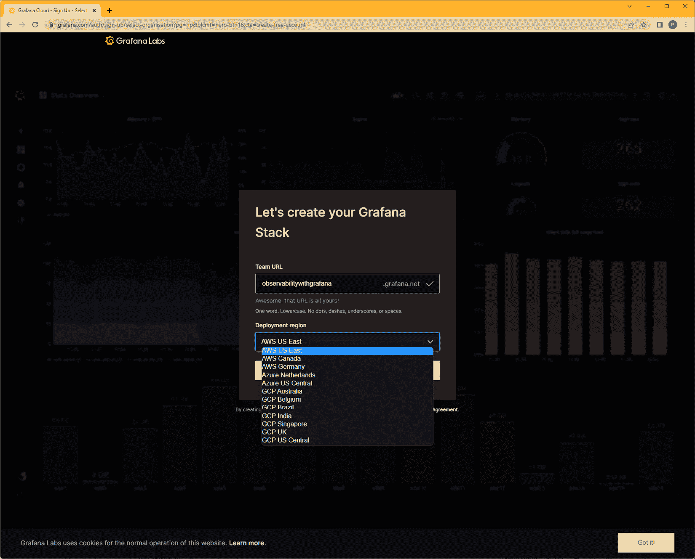

图 3.1 – 创建 Grafana stack

1.  从可用列表中选择一个部署区域，然后等待几分钟以完成您的 Grafana 账户创建。

1.  当账户创建完成后，您将看到一个名为 **GET STARTED** 的屏幕，如下图所示。我们鼓励您探索 Grafana 的各个屏幕，但在这次介绍中，您可以直接点击 **I’m already familiar** **with Grafana**：

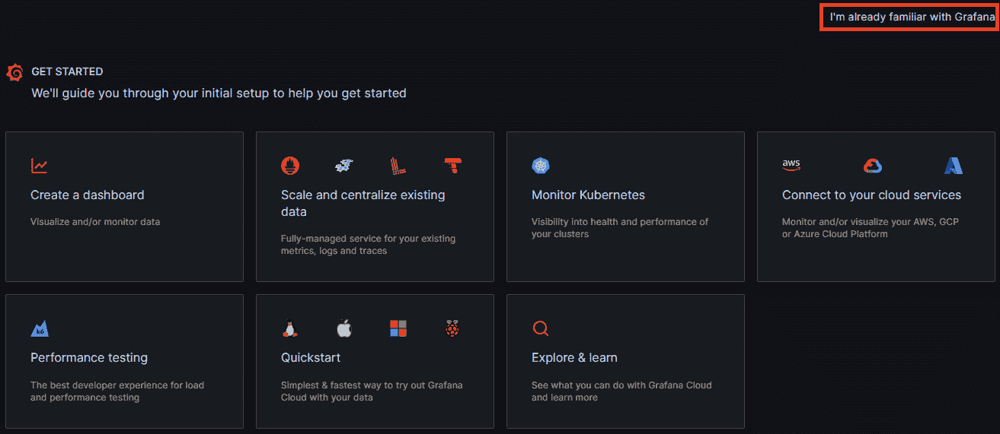

图 3.2 – 开始使用 Grafana

然后点击左上角的 Grafana 图标返回到主屏幕，最后点击 **Stacks**，它位于欢迎信息的下方：

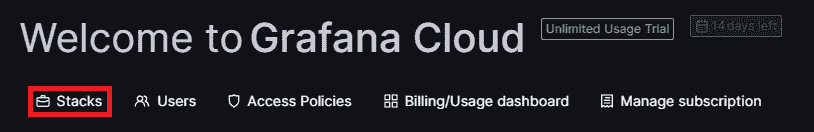

图 3.3 – 欢迎来到 Grafana Cloud

1.  这将带您进入 Grafana Cloud 门户，界面如下所示。

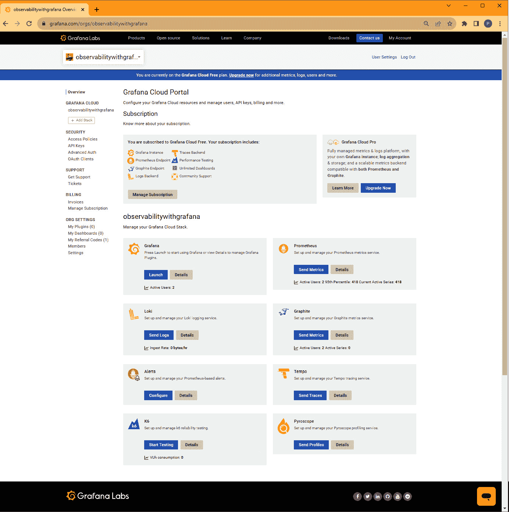

图 3.4 – Grafana Cloud 门户

在我们设置本地数据生成环境之前，先花点时间探索一下 Grafana Cloud 门户和您的新 Grafana Stack 的基础内容。

## 探索 Grafana Cloud 门户

门户网站的首页展示了您的订阅和账单信息，以及有关您的单一 Grafana Stack 的详细信息。当您首次注册 **Cloud Free** 订阅时，您将获得 14 天的 Cloud Pro 试用访问权限。要访问您的 Grafana 实例，您需要点击 **Grafana** 部分中的 **Launch** 按钮。这将使您能够查看发送到 Grafana Cloud 的数据。

完整的 Grafana **Stack** 包括以下安装：

+   **可视化**：

    +   一个 Grafana 实例

+   **指标**：

    +   一个 Prometheus 远程写入端点

    +   一个 Graphite 端点

    +   一个 Mimir 后端存储实例

+   **日志**：

    +   一个 Loki 端点

    +   一个 Loki 后端存储实例

+   **追踪**：

    +   一个 Tempo 端点

    +   一个 Tempo 后端存储实例

+   **告警**：

    +   一个用于管理基于 Prometheus 的告警的告警实例

+   **负载测试**：

    +   一个 k6 云端运行器

+   **性能分析**：

    +   一个 Pyroscope 端点

    +   一个 Pyroscope 后端存储实例

让我们来看一下您可以在门户中访问的一些部分：

+   **安全性**：在此部分，您可以管理 **访问策略** 和 **访问令牌**、**开放授权**（**OAuth**）、**安全声明标记语言**（**SAML**）和 **轻量级目录访问协议**（**LDAP**）。

    访问策略的范围是一个 **领域**；一个领域可以覆盖特定的 Stack，也可以覆盖整个组织。

+   **支持**：此部分通过 **社区论坛** 提供社区支持，并通过 **支持票** 和 **与支持人员聊天** 提供来自 Grafana Labs 的支持。

+   **账单**：**账单**部分是用于管理发票和订阅的地方。Cloud Free 订阅提供每月 10,000 个度量标准、50 GB 日志、50 GB 跟踪、50 GB 配置文件、三个 **事件响应与管理** (**IRM**) 用户和 500 个 k6 **虚拟用户小时** (**VUh**) 的配额。这个订阅对于我们在本书中使用的示例应用程序以及类似的小型演示和个人用途安装非常充足。对于更大的安装，Grafana Cloud 还提供了两个额外的套餐，Cloud Pro 和 Cloud Advanced。这些套餐提供对不同关键功能的访问，其中 Cloud Advanced 主要面向企业级安装。Grafana 根据不同领域的摄取量和活跃用户进行计费。Grafana 提供了一个非常易于使用的月度费用估算工具：

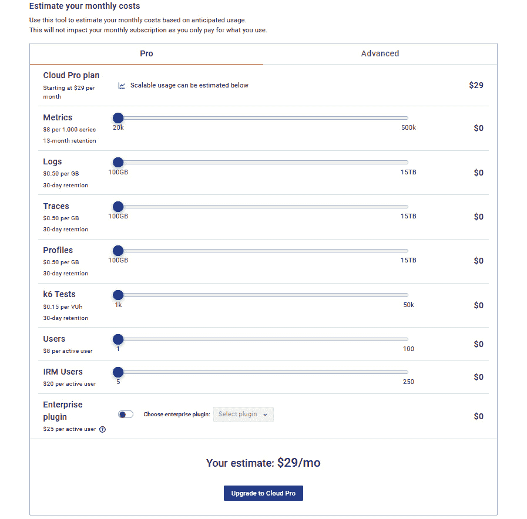

图 3.5 – Grafana 成本估算器

使用 Cloud Free 订阅，你将只能访问一个堆栈。如果你订阅了 **Cloud Pro** 或 **Cloud Advanced**，你将能够在你的账户中创建多个堆栈。这些堆栈可以位于不同的区域。

+   **组织设置**：在这里，你可以管理可以访问 Grafana Cloud 的用户。你还可以更新你的头像、组织名称以及你与社区共享的插件或仪表板。

现在你已经探索了 Grafana Cloud 门户，并且了解了如何管理 Grafana Cloud 账户，接下来让我们探索你云堆栈中的 Grafana 实例。

## 探索 Grafana 实例

与 Grafana Stack 提供的工具互动的主要方式是访问 **Grafana 实例**。该实例提供可视化工具，用于查看由其他 Grafana 堆栈或其他连接工具收集的数据。要访问你的 Grafana 实例，你可以点击 Cloud Portal 中的 **启动** 按钮：

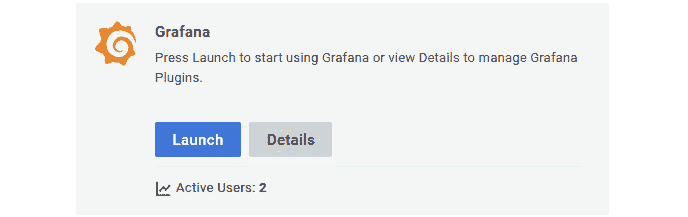

图 3.6 – 启动 Grafana

为了更直接地访问，你可以使用基于帐户创建时选择的团队名称的直接 URL。例如，我们的示例账户的 URL 是 `https://observabilitywithgraf``ana.grafana.net`。

一旦你访问了 Grafana，你将看到一个主页，显示你当前的使用情况。导航是通过页面左上角的菜单进行的：

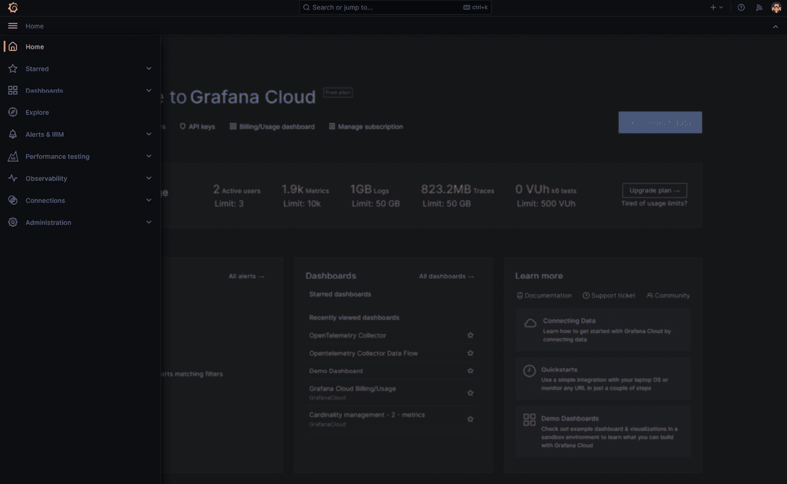

图 3.7 – Grafana 中的主要导航面板

让我们逐一讲解前面图中显示的菜单中不同的部分。

### 仪表板与收藏的仪表板

**仪表板**部分允许你在 Grafana 安装中创建、导入、组织和标记仪表板。在 **仪表板**下，你还可以访问 **播放列表**、**快照**、**库面板** 和 **报告**：

+   **播放列表**子部分让你管理按顺序显示的仪表板组，例如，在办公室的电视上。

+   **快照**标签让你能够拍摄一个仪表盘的快照并分享数据。这将使接收者能够比共享简单的屏幕截图更好地探索数据。

+   **库面板**提供了可重复使用的面板，可以在多个仪表盘中使用，以帮助提供标准化的 UI。

+   最后，**报告**功能允许你从任何仪表盘自动生成 PDF 并按预定计划发送给相关方。

**星标**仪表盘部分允许你通过将常用的仪表盘保存到菜单顶部来自定义界面。我们将在*第八章*中更全面地探讨如何使用仪表盘。

### 探索

**探索**是直接访问连接到 Grafana 实例的数据的方式。这是构建自定义仪表盘并探索数据以理解系统当前状态的基础。我们将在本章后面标题为*从示例应用程序探索遥测数据*的部分简要讨论这一点，之后将在*第四章*、*第五章*和*第六章*中详细介绍。

### 警报与 IRM

**警报与 IRM**部分包含了 Grafana 的**警报管理**、**值班**和**事件**系统用于 IRM，还包括机器学习能力和 SLO 服务。这些功能可以帮助识别系统中的异常（有关详细信息，请参见*第九章*）：

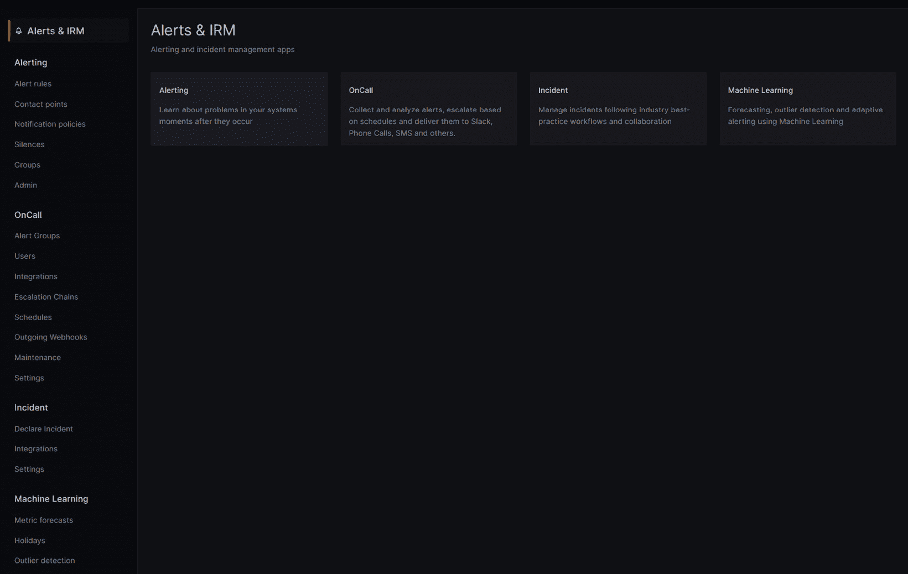

图 3.8 – 警报与 IRM

**警报管理**（Alertmanager）允许团队管理触发警报的规则。它还允许团队控制警报通知的方式，并决定是否有任何预定的警报时间表。Grafana 的**警报管理**旨在通知特定团队其系统中的警报，并且已经通过许多组织的实际使用进行了验证。

**值班**和**事件**构成了 Grafana 的 IRM 工具包。它使组织能够接收来自多个监控系统的通知，管理排班和升级链，并提供关于已发送、已确认、已解决和已静默的警报的高级可视化。**事件**部分使组织能够启动事件处理。这些事件遵循预定义的流程，涉及正确的人员并与利益相关者进行沟通。一旦事件启动，Grafana 可以记录事件过程中关键时刻的内容，以便后续的事件后处理。**值班**和**事件**旨在帮助需要集中管理技术方面的问题和事件管理的组织。*第九章*将更详细地探讨这些工具并展示如何配置它们。

### 性能测试

**性能测试**区域是 k6 性能测试工具与 Grafana UI 集成的地方，允许团队管理测试和项目。k6 使团队能够在 CI/CD 流水线中使用与生产环境测试相同的性能测试工具。k6 将在 *第十三章*中详细介绍。

### 可观察性

**可观察性**部分将 Kubernetes 基础设施和应用监控整合在一起，并通过合成测试模拟应用中的关键用户旅程，同时结合前端 **真实用户监控** (**RUM**) 和 Pyroscope 的 **性能配置文件**。通过结合这些数据源，您可以获得对产品当前性能的端到端视图。

### 连接

**连接**部分是一个管理区域，用于设置和管理 Grafana 与 160 多个数据源及基础设施组件之间的连接，这些数据源和组件可以连接并显示数据。一些可用连接的示例包括 Elasticsearch、Datadog、Splunk、AWS、Azure、cert-manager、GitHub、Ethereum 和 Snowflake。配置这些连接的页面如下图所示：

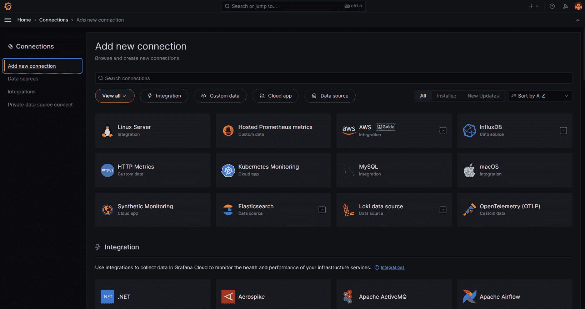

图 3.9 – 连接屏幕

### 管理

**管理**面板允许管理 Grafana 的许多方面，从插件和已记录查询到用户、身份验证、团队和服务帐户：

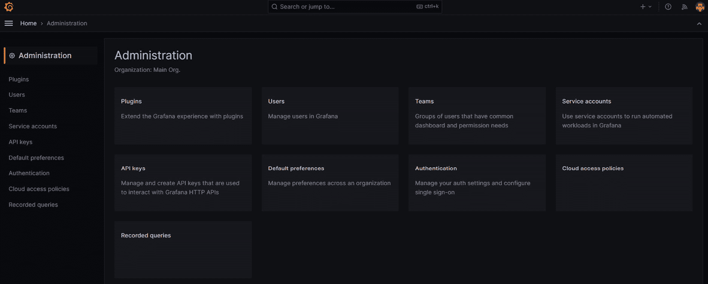

图 3.10 – 管理面板

现在我们已经探索了 Grafana Cloud 门户，接下来让我们准备本地环境以发送数据。

# 安装前提工具

Grafana 与数据结合时更加精彩！为了构建一个真实的 Grafana 工作原理视图，并帮助您的组织，我们选择安装 OpenTelemetry 演示应用程序。这是一个销售望远镜和其他观测设备的演示网店。我们将带您完成安装过程，帮助您在本地计算机上运行该应用程序。

但首先，您的本地环境需要具备一些前提条件，这些条件取决于您使用的操作系统。

在本节中，我们将解释如何安装以下内容：

+   基于您的操作系统的工具：

    +   **Windows 子系统 Linux 版本** **2** (**WSL2**)

    +   macOS Homebrew

+   Docker 或 Podman

+   单节点 Kubernetes 集群

+   Helm

## 安装 WSL2

WSL 是一种直接在 Windows 上运行 Linux 文件系统和工具的方式。它用于在不同操作系统之间提供一套标准的命令和工具。虽然也可以在 WSL 外运行这些系统，但使用 WSL 会简化许多流程。请按照以下步骤设置 WSL2：

1.  以管理员身份打开 PowerShell 终端或 Windows 命令提示符。

1.  运行以下命令以安装 WSL2：

    ```
    C:\Users\OwG> wsl --install
    ```

    这将安装 Ubuntu 版本的 Linux。

    你应该看到一个信息，表示 Ubuntu 正在安装，随后会提示输入新的 UNIX 用户名。如果看到任何其他信息，可能你已经安装了某个版本的 WSL；请参考微软官网解决这个问题。

1.  为你的 Ubuntu 安装创建一个新的用户，输入用户名和密码。这个用户名和密码无需与 Windows 的用户名和密码相匹配。

1.  通过运行以下命令来升级软件包：

    ```
    sudo apt update && sudo apt upgrade
    ```

    推荐安装 Windows Terminal 来使用 WSL。你可以从微软商店下载： https://learn[.microsoft.com/en-us/windows/terminal/install](http://.microsoft.com/en-us/windows/terminal/install)。

更详细的安装说明以及如何解决可能出现的任何问题，请参考 [`learn.microsoft.com/en-us/windows/wsl/install`](https://learn.microsoft.com/en-us/windows/wsl/install)。

## 安装 Homebrew

**Homebrew** 是 macOS 的一个包管理工具。要在系统上安装它，请按照以下步骤操作：

1.  打开终端窗口。

1.  运行以下命令安装 Homebrew：

    ```
    wget (used later in the setup process):

    ```

    $ brew install wget

    ```

    ```

该安装的详细说明可以在 [`brew.sh/`](https://brew.sh/) 找到。

## 安装容器编排工具

**Docker** 和 **Podman** 都是 **容器编排工具**。Docker 已经是事实上的标准约十年。Podman 是一个较新的工具，首次发布于 2018 年。Docker 的主要功能也在 Podman 中提供，但支持和信息可能更难找到。

在 2021 年，Docker 做出了许可更改，这些更改在 2023 年 1 月正式生效。这些许可更改可能会影响使用企业设备的读者。我们将只提供 Docker 的安装说明，但我们会指出潜在的问题，以便你了解。提供容器编排工具的目的是在该工具上运行单节点 Kubernetes 集群。

### 安装 Docker Desktop

以下部分简要描述了如何在 Windows、macOS 和 Linux 上安装 **Docker Desktop**。我们首先来看一下 Windows 安装过程。

#### Windows 安装

要在 Windows 上安装 Docker Desktop，请执行以下操作：

1.  访问 [`docs.docker.com/desktop/install/windows-install/`](https://docs.docker.com/desktop/install/windows-install/) 并下载最新的 Docker 安装程序 `.``exe` 文件。

1.  运行安装包。系统会提示你启用 WSL2，选择 **是**。

1.  安装完成后，启动 Docker Desktop。

1.  导航到 **设置** | **常规**。勾选 **使用基于 WSL2 的** **引擎** 复选框。

1.  选择 **应用并** **重启**。

1.  在你的 WSL 终端中，通过运行以下命令验证 Docker 安装：

    ```
    $ docker --version
    Docker version 20.10.24, build 297e128
    ```

#### macOS 安装

对于 macOS 上的 Docker Desktop 安装，请执行以下操作：

1.  访问 [`docs.docker.com/desktop/install/mac-install/`](https://docs.docker.com/desktop/install/mac-install/) 并下载适用于你 Mac 的最新 Docker 安装程序。

1.  运行安装包。

1.  在你的终端中，通过运行以下命令验证 Docker 安装：

    ```
    $ docker --version
    Docker version 20.10.24, build 297e128
    ```

#### Linux 安装

Linux 用户可以考虑使用 Podman Desktop，因为它对 Linux 环境有更好的原生支持。安装说明可以在 [`podman-desktop.io/docs/Installation/linux-install`](https://podman-desktop.io/docs/Installation/linux-install) 找到。

然而，如果你确实希望使用 Docker，请按照提供的安装指南操作，因为安装过程会因发行版而有所不同：https://docs.docker.com/desktop/install/linux-install/。

完整的文档可以在 https://docs.docker.com/desktop/ 找到。

在一个支持容器化的基础系统上，让我们设置一个单节点 Kubernetes 集群。这将用于轻松且可重复地安装 OpenTelemetry 示例应用程序。

## 安装单节点 Kubernetes 集群

有几种不同的工具可以运行本地 Kubernetes 集群，包括**Kubernetes in Docker**（**KinD**）、**Minikube**和**MicroK8s**。然而，我们选择使用**k3d**，因为它在不同操作系统上的安装非常简便。请按照以下步骤操作：

1.  使用以下命令安装 k3d：

    ```
    $ wget -q -O - https://raw.githubusercontent.com/k3d-io/k3d/main/install.sh | bash
    ```

    完整的详情请参见[`k3d.io/stable/`](https://k3d.io/stable/)。

1.  创建一个 k3d 集群：

    ```
    $ k3d cluster create owg-otel-demo
    ```

1.  验证集群状态：

    ```
    $ kubectl get nodes
    NAME             STATUS   ROLES                  AGE   VERSION
    k3d-owg-otel-demo-server-0   Ready    control-plane,master   13d   v1.25.7+k3s1
    ```

安装了 Kubernetes 集群后，我们现在需要一种便捷的方式来安装应用程序。OpenTelemetry 提供了 Helm 图表，允许我们将应用程序部署到 Kubernetes 上；我们将安装 Helm 来使用这些图表。

## 安装 Helm

**Helm** 是 Kubernetes 集群的包管理器。许多基础设施级别的组件都以 Helm 图表形式提供以供安装，OpenTelemetry 也不例外。要安装 Helm，请按照以下步骤操作：

1.  使用以下命令安装 Helm（详细信息请参见[`helm.sh/docs/intro/install/`](https://helm.sh/docs/intro/install/)）：

    ```
    $ wget –q –O - https://raw.githubusercontent.com/helm/helm/main/scripts/get-helm-3 | bash
    ```

1.  验证 Helm 安装：

    ```
    $ helm version
    version.BuildInfo{Version:"v3.11.3", GitCommit:"323249351482b3bbfc9f5004f65d400aa70f9ae7", GitTreeState:"clean", GoVersion:"go1.20.3"}
    ```

当我们的本地系统已经准备好运行应用程序时，我们可以安装 OpenTelemetry 提供的示例应用程序。

# 安装 OpenTelemetry 示例应用程序

由于我们需要将数据从本地机器发送到 Grafana Cloud 实例，我们需要提供一些凭据，并告诉本地机器将数据发送到哪里。在安装示例应用程序之前，我们需要设置访问令牌，以便将数据发送到我们的 Grafana Cloud 堆栈。

## 设置访问凭据

访问令牌允许 OpenTelemetry 应用程序将数据安全地发送到你的 Grafana Cloud 堆栈。要设置访问令牌，我们需要执行以下步骤：

1.  在 Grafana Cloud 门户中，选择**Security**部分中的**Access Policies**。

1.  点击**Create** **access policy**。

1.  选择一个名称和显示名称，并将**Realm**设置为**All Stacks**。

1.  设置**Write**范围，用于指标、日志和跟踪，然后点击**Create**。

1.  在新的访问策略中，点击**Add token**。

1.  给令牌命名并设置过期日期。点击**Create**。

1.  最后，复制令牌并安全保存。

现在我们已经创建了令牌，接下来让我们下载本书的 GitHub 仓库并进行设置。

## 下载仓库并添加凭证和端点。

Git 仓库包含每一章节使用实时数据的配置文件。下载这个仓库很简单。访问 Git 仓库：[`github.com/PacktPublishing/Observability-with-Grafana`](https://github.com/PacktPublishing/Observability-with-Grafana)。点击绿色的 **代码** 按钮，并按照提示克隆仓库。下载后，仓库应该像这样：

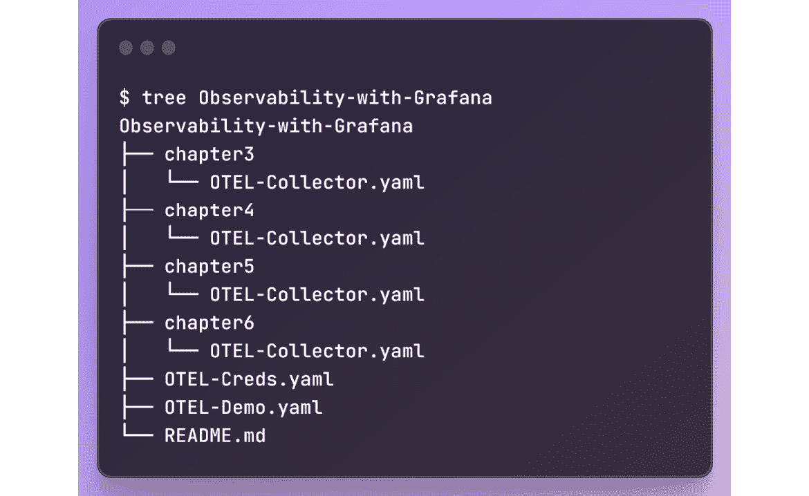

图 3.11 – 使用 Grafana 的可观测性仓库

为了设置演示应用，我们需要将之前保存的令牌和正确的端点添加到 `OTEL-Creds.yaml` 文件中。你需要的信息如下：

+   **密码**：这是你之前保存的令牌，每种遥测类型共享此令牌。

+   **用户名**：这对于每种遥测类型是特定的。

+   **端点**：这对于每种遥测类型是特定的。

以 Loki 为例，以下是在 Grafana Cloud Portal 中获取正确信息的步骤：

1.  点击 Loki 框中的 **发送日志** 按钮。页面顶部有一个信息框，样式如下：

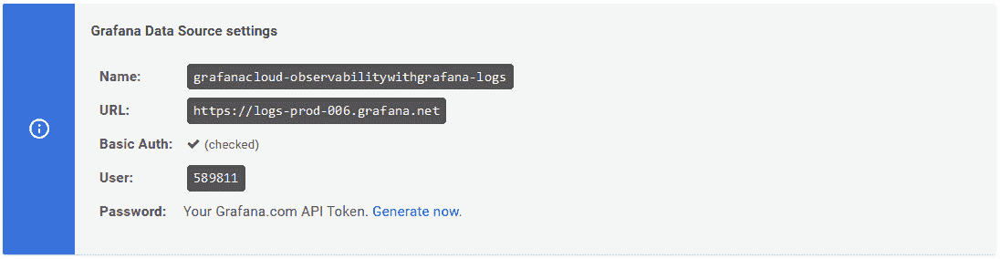

图 3.12 – Grafana 数据源设置

1.  **用户** 字段用于输入用户名。

1.  将 `/loki/api/v1/push` 添加到 URL 的末尾。

1.  对于指标，在 URL 末尾添加 `/api/prom/push`。

1.  对于追踪信息，去掉 `https://` 并在 URL 末尾添加 `:443`。

1.  将这些信息添加到 `OTEL-Creds.yaml` 文件中相应的字段。

Loki 配置完成后，我们可以按照相同的过程配置 Prometheus（点击 **发送指标**）和 Tempo（点击 **发送追踪**）。

这些步骤在仓库中的 `README.md` 文件中有重复并扩展。凭证保存后，我们现在准备部署 OpenTelemetry。

## 安装 OpenTelemetry 收集器。

更新凭证文件后，我们可以安装 OpenTelemetry 收集器的 Helm 图表。这是收集和传输演示应用产生的数据的组件。继续安装的步骤如下：

1.  添加 OpenTelemetry 仓库：

    ```
    $ helm repo add open-telemetry https://open-telemetry.github.io/opentelemetry-helm-charts
    ```

1.  使用 Helm 安装收集器：

    ```
    $ helm install --version '0.73.1' --values chapter3/OTEL-Collector.yaml --values OTEL-Creds.yaml owg open-telemetry/opentelemetry-collector
    NAME: owg-otel-collector
    LAST DEPLOYED: Sun May 14 13:53:16 2023
    NAMESPACE: default
    STATUS: deployed
    REVISION: 1
    …
    ```

1.  验证安装是否成功：

    ```
    $ kubectl get pods
    NAME                         READY   STATUS    RESTARTS   AGE
    owg-otel-collector-opentelemetry-collector-6b8fdddc9d-4tsj5   1/1     Running   0          2s
    ```

我们现在准备安装 OpenTelemetry 演示应用。

## 安装 OpenTelemetry 演示应用。

OpenTelemetry 演示应用是一个示例网店，出售望远镜及其他观测宇宙的工具。要安装此演示应用，按照以下步骤操作：

1.  使用 Helm 安装演示应用：

    ```
    $ helm install --version '0.26.0' --values owg-demo open-telemetry/opentelemetry-demo
    NAME: owg-otel-demo
    LAST DEPLOYED: Mon May 15 21:58:37 2023
    NAMESPACE: default
    STATUS: deployed
    REVISION: 1
    …
    ```

1.  验证安装是否成功。首次安装此过程可能需要几分钟：

    ```
    frontendproxy access:

    ```

    $ kubectl port-forward svc/owg-demo-frontendproxy 8080:8080 &

    ```

    ```

1.  为浏览器跨度打开端口：

    ```
    $ kubectl port-forward svc/owg-opentelemetry-collector 4318:4318 &
    ```

1.  请检查是否可以访问 OpenTelemetry 演示应用程序：http://localhost:8080：

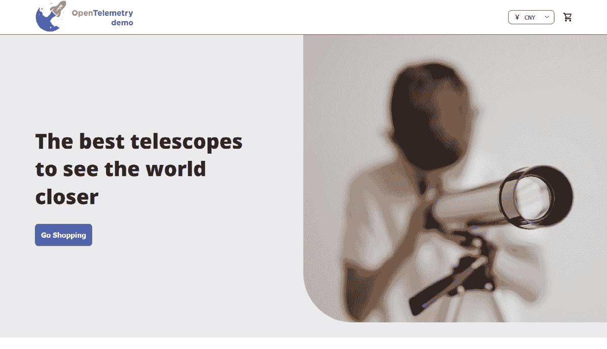

图 3.13 – OpenTelemetry 演示应用程序

1.  探索 OpenTelemetry 演示应用程序以生成一些数据。花些时间将物品添加到购物车并进行购买。虽然负载生成器是安装的一部分，但熟悉该应用程序还是很有价值，因为它有助于将生成的遥测数据放在上下文中进行分析。

现在你有了一个能生成数据的应用程序，让我们开始探索这些数据。

# 探索来自演示应用程序的遥测数据

假设安装成功，你的数据将流入你的 Grafana 实例。要查看这些数据，请前往你的 Grafana 实例，无论是通过你的团队 URL 还是点击 Cloud Portal 中的**启动**按钮。

在首页，你应该看到详细的关于当前或可计费使用情况的日志、指标和追踪信息。如果一切正常，这些值应该都大于 0。可能需要几分钟时间才能完全显示出来，有时可能需要一个小时：

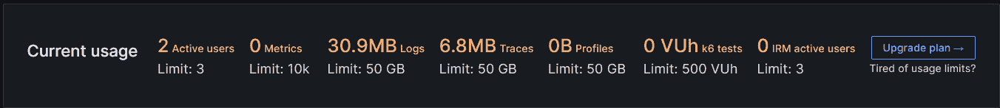

图 3.14 – Grafana Cloud 使用情况

重要说明

如果你没有看到指标、日志和追踪的使用情况，可能需要进行故障排除。我们在本章末尾提供了一些提示。

点击菜单并选择**探索**。这将带你进入一个页面，在那里你可以对来自演示应用程序的遥测数据进行查询。在 Grafana 中，最高级别的概念是**数据源**。这些可以在主菜单下方选择。每个数据源都是 Grafana 实例与 Grafana Stack 中的一个组件或其他工具之间的连接。每个数据源都是自包含的。数据源菜单可以在下图中看到：

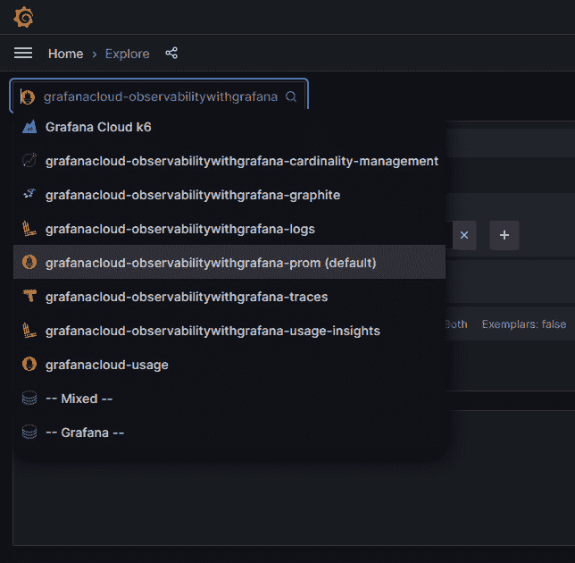

图 3.15 – 数据源菜单

你将看到有数据源用于**日志**、**prom**（Prometheus 指标）和**追踪**。还有其他数据源，但本章我们只关注这三种，因为它们是与我们已配置的 Grafana Stack 相关的数据源。

这些数据源与我们的 Loki、Mimir 和 Tempo 组件相关，分别用于收集日志、指标和追踪。我们接下来会讨论这些内容。

## Loki 中的日志

Loki 存储了演示应用程序生成的日志数据。让我们快速看一下 Loki 数据源的界面，看看演示应用程序生成的一些日志数据。

选择 `grafanacloud-<team name>-logs` 数据源。在**标签过滤器**中，添加 **exporter = OTLP** 并点击 **运行查询**。现在你应该看到一个类似这样的界面：

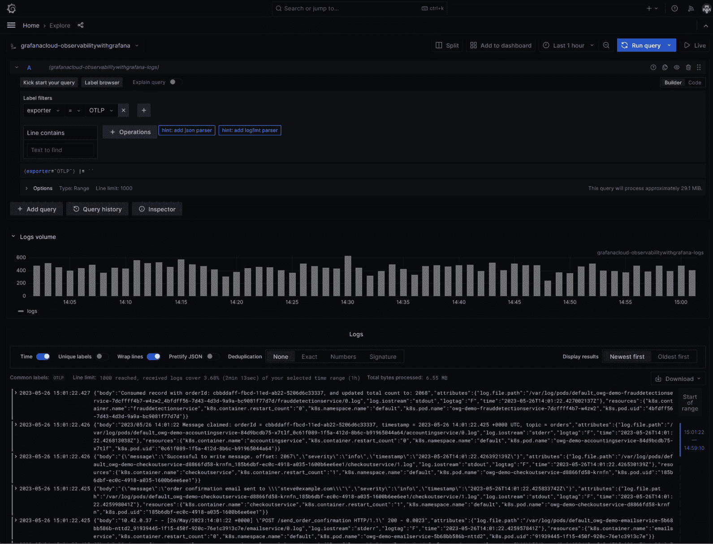

图 3.16 – 审查日志

屏幕的上方区域是您输入和修改查询的地方。在屏幕中间，您将看到通过搜索返回的日志量随时间的变化。这可以一眼提供大量上下文信息。屏幕的下部显示您的查询结果：

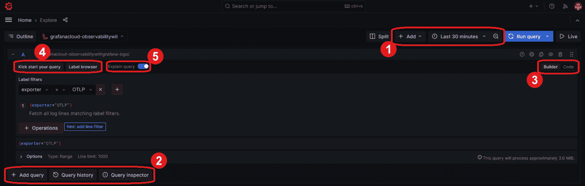

图 3.17 查询面板详情

让我们将前面的截图分解成各个组件：

1.  您可以选择时间范围并通过点击**添加**将查询添加到各种工具中。

1.  使用本节底部的按钮，您可以通过**添加查询**进行更复杂的数据分析。**查询历史**让您查看查询历史。**查询检查器**帮助您了解查询的执行情况。

1.  **构建器**或**代码**选择器允许您在默认显示的以 UI 为中心的查询构建器和查询语言输入框之间切换，这对于直接输入查询非常有用。

1.  **启动您的查询**按钮将为您提供一些初始查询，**标签浏览器**按钮将让您浏览当前在收集的日志数据中可用的标签。

1.  最后，**解释查询**滑块将为您提供有关当前查询每个步骤的详细解释。

让我们来看看查询结果面板中的组件：

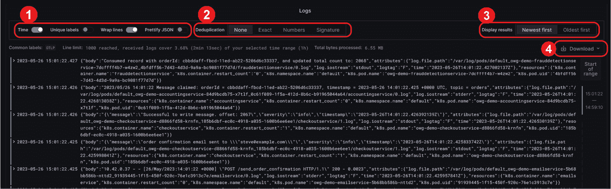

图 3.18 – 查询结果面板详情

这些组件可以按如下方式使用：

1.  您可以自定义数据显示时间戳，突出显示任何独特的标签，换行或美化 JSON。

1.  您还可以应用去重。

1.  您可以选择先查看最旧或最新的日志事件。

1.  最后，您可以将数据下载为`.txt`或`.json`格式。

我们将在*第四章*中更深入地探讨这些功能，并介绍 LogQL 查询语言。

现在您已经熟悉了 Loki 数据源中的日志查询面板，让我们看看从 Mimir 数据源查询度量数据是如何相似的。

## Prometheus/Mimir 中的度量数据

Grafana 使用类似的重复块来查询数据。在本节中，我们将探讨如何查询度量数据。

选择**grafanacloud-<团队名称>-prom**数据源。在**度量**下拉框中选择**kafka_consumer_commit_rate**，并将**标签过滤器**留空。点击**运行查询**，您应该会看到像这样的屏幕：

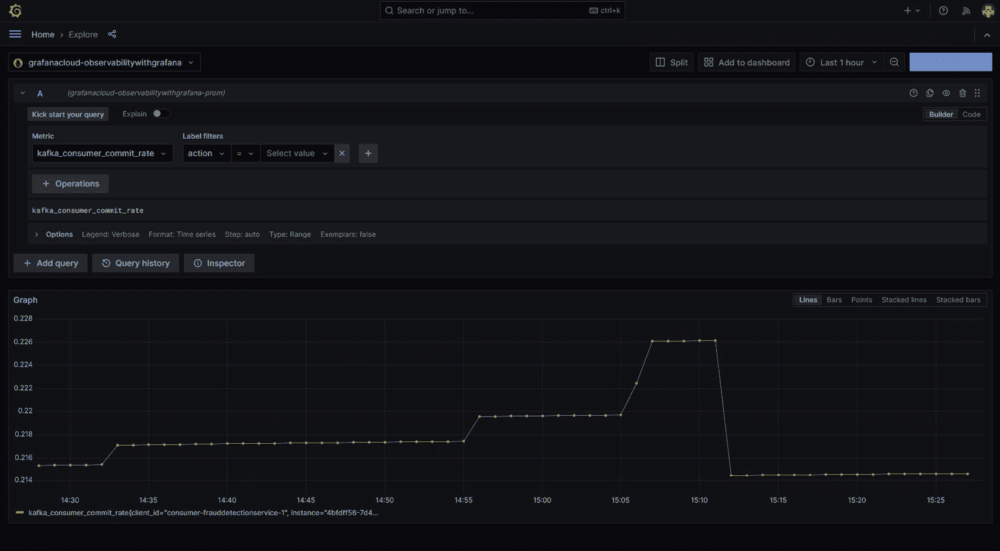

图 3.19 – Kafka 消费者提交速率

类似于 Loki，我们在顶部有一个查询部分，尽管结构略有不同。主要的区别在于 **选项** 部分，它控制数据的展示方式。**图例** 管理图表的图例显示。**格式** 选项允许你选择 **时间序列** 表示（如前面截图中显示的图表）；**表格** 表示，显示每个时间序列的每个值；以及 **热图** 表示。**类型** 选择器允许你选择时间范围、每个时间序列的最新时刻或两者。**示例** 滑块将显示与每个度量相关联的追踪数据。

底部部分显示了数据，并提供了以不同方式展示数据的选项。

要查看 Grafana 如何表示多个图表，从 **Metric** 下拉菜单中选择 **process_runtime_jvm_cpu_utilization_ratio**，然后点击 **运行查询**。你应该会看到一个像这样的图表：

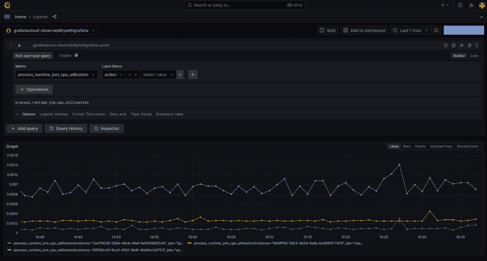

图 3.20 – JVM CPU 使用率

前面截图中绘制的每一条线都代表了演示应用中不同服务的 CPU 使用率。我们将在*第五章*中更深入地探讨这些功能，并介绍 PromQL 查询语言。

Tempo 追踪数据源非常类似于 Loki 日志数据源和 Mimir 度量数据源。现在让我们来看一下。

## Tempo 中的追踪

追踪需要更多的查询操作，因为我们必须找到并选择一个单独的追踪记录，然后详细展示该追踪中的跨度。

选择 **grafanacloud-<team name>-traces** 数据源。对于 **查询类型**，选择 **搜索**，对于 **服务名称**，选择 **checkoutservice**，然后点击 **运行查询**。你应该看到像这样的屏幕：

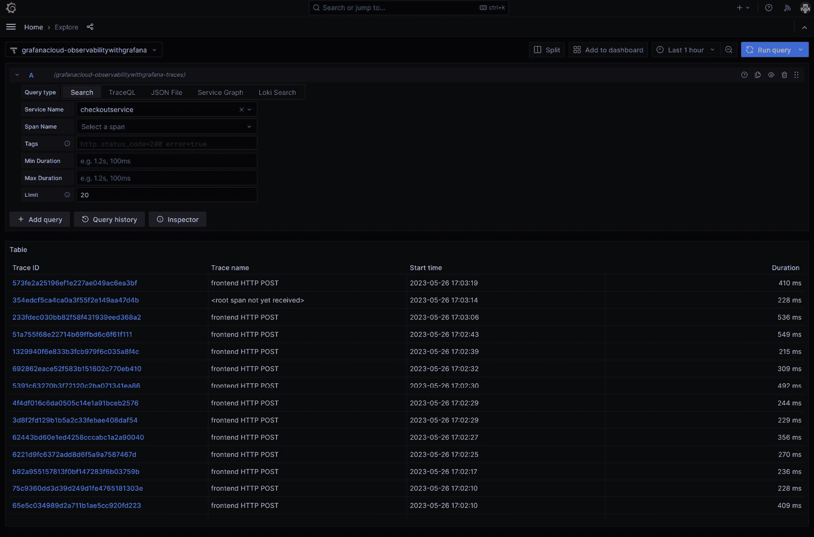

图 3.21 – 选择一个追踪

点击一个 **Trace ID** 链接，你会看到像这样的屏幕：

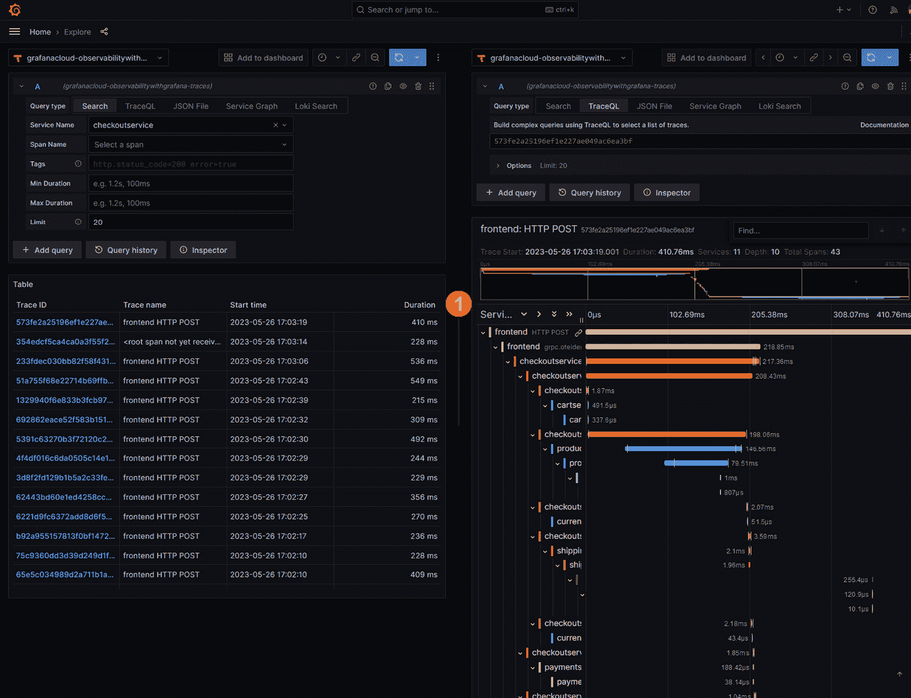

图 3.22 – 追踪视图

这个视图展示了 Grafana 提供的分屏视图。可以从任何数据源访问此视图，并提供通过链接的数据点在日志、度量和追踪之间切换的能力，以便查看每种遥测类型中相同时间点或事件。如果你选择面板之间的条形，如前面截图中所示的数字 **1**，可以通过点击并拖动来放大追踪视图。

查看追踪记录时，每一行代表一个跨度，显示了涉及的服务以及该服务的具体信息。例如，**checkoutservice** 会显示购物车中的商品数量和运费。每个跨度上的条形显示了该跨度所用的总时间，并以堆叠的方式表示跨度的相对开始和结束时间。你可能会看到 **productcatalogueservice** 在交易中占用了大量时间，如*图 3.21*所示。

## 添加你自己的应用程序

你可以将自己的应用程序添加到此演示安装中。OpenTelemetry Collector 已经部署，接收器可用于 OTLP 格式的数据，gRPC 数据使用端口`4317`，HTTP(s)数据使用端口`4318`。要部署你的应用程序，需要将其打包为容器，并按照 Kubernetes 的标准部署机制进行部署。请注意，k3d 有自己的约定，默认使用 Flannel 进行网络配置，使用 Traefik 进行入口控制。

现在我们已经了解了这个演示应用程序，让我们来看一些排查问题的技巧，这些技巧会帮助你在设置或使用时遇到问题时解决它们。

# 排查你的 OpenTelemetry 演示安装问题

在使用此应用程序时可能会发生各种问题，因此本节内容未必涵盖所有情况。我们假设所有先决条件工具已正确安装。

让我们首先看看 Grafana 凭证的正确格式。

## 检查 Grafana 凭证

如果 OpenTelemetry Collector 出现身份验证错误，或者未收到数据，可能是凭证格式不正确。这些详细信息需要从本书的 Git 仓库中的`OTEL-Creds.yaml`文件中输入。

Grafana 凭证应按照以下格式：

+   **用户名**：数字，通常为六位数字。

+   **密码**：API 令牌，这是一个由字母和数字组成的长字符串。在排查令牌问题时有一些重要的注意事项：

    +   相同的令牌可以被所有导出器共享。

    +   与 API 令牌关联的**访问策略**需要具备写入日志、指标和追踪的权限。可以在 Grafana Cloud 门户中检查这一点。

+   `loki`：`https://logs-prod-006.grafana.net/loki/api/v1/push`

+   `prometheusremotewrite`：`https://prometheus-prod-13-prod-us-east-0.grafana.net/api/prom/push`

+   `otlp`（`tempo`）：`tempo-prod-04-prod-us-east-0.grafana.net:443`

重要提示

Tempo 的 OTLP 端点与其他端点不同。

如果你发现自己犯了错误，需要使用`helm upgrade`将对`OTEL-Creds.yaml`文件所做的更改部署到系统中：

```
helm uninstall and then use the original instructions to reinstall.
			The most common problem is with the access credentials, but sometimes you will need to look at the collector logs to understand what is happening. Let’s see how to do this now.
			Reading logs from the OpenTelemetry Collector
			The next place to investigate is the logs from the OpenTelemetry Collector.
			Kubernetes allows you to directly read the logs from a Pod. To do this, you need the full Pod name, which you can get using the following command:

```

$ kubectl get pods --selector=app.kubernetes.io/instance=owg

名称                              就绪   状态    重启次数   运行时间

owg-opentelemetry-collector-567579558c-std2x   1/1     正在运行   0          6 小时 26 分钟

```

			In this case, the full Pod name is `owg-opentelemetry-collector-567579558c-std2x`.
			To read the logs, run the following command:

```

$ kubectl logs owg-opentelemetry-collector-567579558c-std2x

```

			Look for any warning or error-level events, which should give an indication of the issue that is occurring.
			Sometimes, the default logging does not give enough information. Let’s see how we can increase the logging level.
			Debugging logs from the OpenTelemetry Collector
			If the standard logs are not enough to resolve the problem, the OpenTelemetry Collector allows you to switch on **debug logging**. This is typically verbose, but it is very helpful in understanding the problem.
			At the end of `OTEL-Creds.yaml`, we have included a section to manage the debug exporter. The verbosity can be set to `detailed`, `normal`, or `basic`.
			For most use cases, switching to `normal` will offer enough information, but if this does not help you to address the problem, switch to `detailed`. Once this option is changed, you will need to redeploy the Helm chart:

```

$ helm upgrade owg open-telemetry/opentelemetry-collector -f OTEL-Collector.yaml

```

			This will restart the Pod, so you will need to get the new Pod ID. With that new ID, you can look at the logs; as we saw in the previous section, you should have a lot more detail.
			Summary
			In this chapter, we have seen how to set up a Grafana Cloud account and the main screens available in the portal. We set up our local machine to run the OpenTelemetry demo application and installed the components for this. Finally, we looked a the data produced by the demo application in our Grafana Cloud account. This chapter has helped you set up an application that will produce data that is visible in your Grafana Cloud instance, so you can explore the more detailed concepts introduced later with real examples.
			In the next chapter, we will begin to look in depth at logs and Loki, explaining how best to categorize data to give you great insights.

```

# 第二部分：在 Grafana 中实现遥测

本部分将带你了解不同的遥测来源，解释它们是什么、何时使用它们，以及需要注意的问题。你将查看与主要云服务提供商的集成：AWS、Azure 和 Google。本部分还将探讨使用 Faro 进行的真实用户监控、使用 Pyroscope 进行的性能分析，以及使用 k6 进行的性能测试。

本部分包含以下章节：

+   *第四章*，*使用 Grafana Loki 查看日志*

+   *第五章*，*使用 Grafana Mimir 和 Prometheus 进行指标监控*

+   *第六章*，*使用 Grafana Tempo 跟踪技术细节*

+   *第七章*，*使用 Kubernetes、AWS、GCP 和 Azure 进行基础设施查询*
