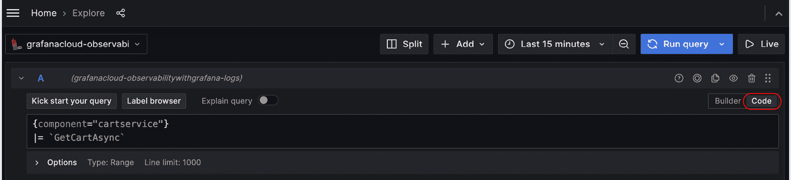

# 第四章：使用 Grafana Loki 查看日志

在本章中，我们将亲身体验 **Grafana Loki**。我们将学习如何使用 **LogQL**，这是用于查询 Loki 的语言，如何选择和过滤日志流，以及如何使用可用的操作符和聚合。这将为你提供适当提取数据以用于仪表板可视化和警报的工具。我们还将回顾日志格式的优缺点以及它如何影响你对 Loki 的使用。为了充分探索 Loki 的优势，我们将探索其架构及其在性能上的扩展性。最后，我们将探讨 LogQL 的高级内容，例如标签和转换，以及其他技巧和窍门，以扩展你对 Loki 的使用。

本章将涵盖以下主要内容：

+   介绍 Loki

+   理解 LogQL

+   探索 Loki 的架构

+   提示、技巧和最佳实践

# 技术要求

在本章中，你将使用 Grafana Cloud 实例以及你在 *第三章* 中设置的演示来操作 LogQL。LogQL 的完整语言文档可以在 Grafana 网站的 [`grafana.com/docs/loki/latest/logql/`](https://grafana.com/docs/loki/latest/logql/) 上找到。Loki 正在积极开发中，因此值得频繁检查新功能。

你可以在 GitHub 仓库的 [`github.com/PacktPublishing/Observability-with-Grafana/tree/main/chapter4`](https://github.com/PacktPublishing/Observability-with-Grafana/tree/main/chapter4) 找到本章的代码。在 [`packt.link/aB4mP`](https://packt.link/aB4mP) 上，你可以找到本章的 *Code in Action* 视频。

# 更新 OpenTelemetry 演示应用程序

首先，让我们改进我们演示应用程序的日志记录。对于本章，我们在 GitHub 仓库的 `chapter4` 文件夹中提供了更新版的 `OTEL-Collector.yaml` 文件，其中包含了额外的 Loki 日志标签。这些说明假设你已经完成了 *第三章* 的演示项目设置。关于此过程的完整细节可以在 GitHub 仓库的 `README.md` 文件的 *第四章* 部分找到。

要升级 OpenTelemetry Collector，请按照以下步骤操作：

1.  使用 Helm 升级采集器：

    ```
    $ helm upgrade --version '0.73.1' --values chapter4/OTEL-Collector.yaml --values OTEL-Creds.yaml owg open-telemetry/opentelemetry-collector
    NAME: owg-otel-collector
    LAST DEPLOYED: Sun Apr 25 12:15:03 2023
    NAMESPACE: default
    STATUS: deployed
    REVISION: 2
    …
    ```

1.  你可以通过以下命令验证升级是否成功：

    ```
    $ kubectl get pods --selector=app.kubernetes.io/instance=owg
    NAME  READY   STATUS    RESTARTS   AGE
    owg-opentelemetry-collector-594fddd656-tfstk   1/1     Terminating   1 (70s ago)   2m8s
    owg-opentelemetry-collector-7955d689c4-gsvqm   1/1     Running       0             3s
    ```

现在，你将可以为 Loki 日志数据提供更多标签。接下来让我们探索一下这意味着什么。

# 介绍 Loki

**Grafana Loki** 从一开始就被设计为一个高度可扩展的多租户日志解决方案。它的设计深受 Prometheus 的影响，具有以下几个主要目标：

+   它是为开发者和运维人员设计的（例如在 *第一章* 中介绍的 *Diego* 和 *Ophelia*）

+   它具有简单的摄取过程；不需要预处理

+   它仅索引关于日志的元数据

+   它将所有内容存储在对象存储中

让我们来看一下 Loki 如何获取数据并使用标签，因为这将为你提供宝贵的见解，帮助你理解查询如何获取和处理数据以进行展示：

+   **日志获取**：Loki 接受来自所有来源的日志，提供了多种代理选项，简化了这一过程。你甚至可以直接将日志数据发送到 Loki API。这使得它成为复杂环境中包含众多系统和硬件组件的理想选择。

    Loki 将其日志存储为日志流，每个条目都有以下内容：

    +   **时间戳**：它具有纳秒级精度，确保准确性。

    +   **标签**：这些是用于识别和检索数据的键值对；它们构成了 Loki 的索引。

    +   **内容**：指的是原始日志行。它没有被索引，而是以压缩块的形式存储。

    以下图示展示了一个日志流及其日志行和相关元数据：


图 4.1 – Loki 日志结构

+   **日志标签**：Loki 日志标签提供日志行的元数据，不仅有助于识别数据，还用于创建日志流的索引并构建日志存储结构。它们具有以下特点：

    +   每一组唯一的标签和值都会创建一个日志流

    +   流中的日志被批量处理、压缩并存储为块

    +   标签是 Loki 日志流的索引

    +   标签用于搜索日志

以下图示展示了两个日志流。正如你所见，在一个日志流中，每条日志都有相同的唯一标签集。在这个例子中，`k8s_node_name`有两个值：


图 4.2 – Loki 日志流

现在我们已经了解了 Loki 日志的结构，接下来让我们介绍**LogQL**，这是用于从日志中提取价值的查询语言。

# 理解 LogQL

Grafana 开发了 LogQL 作为 Loki 的查询语言，并以**Prometheus 查询语言**（**PromQL**）为灵感。它的设计考虑了开发人员（*Diego*）和运维人员（*Ophelia*）（你可以参考*第一章*了解这些人物角色），提供了熟悉的过滤和聚合机制。Loki 不会对日志内容进行索引。日志事件被分组为日志流，并通过标签（日志元数据）进行索引。在 Loki 中执行 LogQL 查询时，会对日志流进行一种分布式过滤，以聚合日志数据。

让我们探索用于 LogQL 的**Grafana Explorer UI**，你将在这里执行大多数 LogQL 查询。

## LogQL 查询构建器

我们在*第三章*的*图 3.16*中简要查看了 Grafana Explorer UI。对于我们的示例，我们将主要在**代码**编辑器中使用原始的 LogQL。以下截图显示了直接在查询构建器代码编辑器中输入的 LogQL：



图 4.3 – LogQL 查询构建器代码编辑器

如果你在 LogQL 使用过程中遇到困难，可以依赖 **日志查询起始点** 和 **解释查询** 工具来帮助你入门，理解每个管道步骤的作用。

**日志查询起始点**提供了一些快速示例，帮助你轻松开始过滤和格式化数据：


图 4.4 – 日志查询起始点

同样，**度量查询起始点**提供了一些快速示例，帮助你与数据进行交互，并生成可在仪表板和警报中使用的度量值：


图 4.5 – 度量查询起始点

可在 LogQL 查询构建器和仪表板面板编辑器中使用，**解释查询**功能在启用时提供 LogQL 管道各阶段的详细分解。这个工具在分析现有查询或调试自己设计的查询时非常有用：


图 4.6 – 解释查询

现在让我们来探索 LogQL 中可用于选择、过滤和解析日志数据的功能。

## LogQL 功能概述

一个基本的 LogQL 查询由一个或多个日志流选择器组成，用于检索原始日志块进行处理，还可以选择使用日志管道过滤和解析日志数据。以下图展示了一个基本的 LogQL 查询，使用了 `component="cartservice"` 选择器和管道过滤器，`` |= `GetCartAsync` ``, 这将返回来自 *图 4.2* 中日志流示例的两行：


图 4.7 – 一个基本的 LogQL 查询

下表展示了在构建 LogQL 查询时可用的不同功能，帮助你熟悉使用 Loki 查询日志：

| **LogQL 部分** | **语法** | **运算符** | **范围** |
| --- | --- | --- | --- |
| **流选择器** | `{``label="value", foo!="bar"}` | `=`,`!=`,`=~`,`!~` | 选择要检索的日志流；必须始终至少有一个选择器 |
| **行过滤器** | `` &#124;= ` ```` error` `` | `&#124;=`,`!=`,`&#124;~`,`!~` | Filter to matching log lines |
| **Parser** | `&#124;` `json` | `json`, `logfmt`, `pattern`, `regexp`, `unpack` | Parse and extract labels from the log content, with parses for structured and unstructured logs |
| **Label filter** | `&#124;` `label="value"` | `=`,`!=`,`=~`,`!~`,`<`,`<=`,`>`,`>=` | Filter log lines using original and newly extracted labels |
| **Line format** | `&#124;` `line_format "{{.label}}"` |  | Rewrite the log line content for presentation purposes |
| **Label format** | `&#124;` `new_label="{{.label}}"` |  | Rename, modify, or add labels |

Table 4.1 – LogQL feature overview

Let’s start by looking at the log stream selector in detail.

## Log stream selector

Selecting log streams to include in your query results requires filtering based on the Loki labels using simple operators. By improving the granularity of your log stream selector, you can reduce the number of streams searched and improve query performance. We will discuss this in more detail later in this chapter when we look at the Loki architecture. There must always be at least one stream selector, but it must be written in a way that will not match empty values; for example, the `{label=~".*"}` will fail as a 0 or more quantifier and `{label=~".+"}` will pass as a 1 or more quantifier. Multiple stream selectors can be used and are separated using commas. The log stream selector must be the first item in your LogQL query and identified with curly braces. For example, the following LogQL query will select log streams where the `component` label ends with `service` and the `name` label equals `owg-demo-checkoutservice`:

```
 {component=~".+service", name="owg-demo-checkoutservice"}
```

As mentioned at the beginning of this section, LogQL was inspired by PromQL and as such, the Prometheus label selector rules have been adopted by LogQL for log stream selectors:

| **Operator** | **Meaning** |
| = | Exactly equal |
| != | Not equal |
| =~ | Regex matches |
| !~ | Regex does not match |

Table 4.2 – Log stream selector operators

Grafana has implemented the **Golang RE2 syntax** for log streams, which means you will have to match against entire strings. This includes newlines, so it’s worth checking this if your regex filters are failing. Syntax documentation can be found here: [`github.com/google/re2/wiki/Syntax`](https://github.com/google/re2/wiki/Syntax).

Once you have your log streams selected, the **log pipeline** can then be used to filter and process them. Let’s discuss this next.

## Log pipeline

As we presented in *Table 4.1*, the expressions available are line and label filters, parsers, and formatters. Expressions are executed in sequence for each line of the log stream, dropping anything filtered out and moving on to the next line.

Expressions allow you to transform or mutate the log data to then use it for additional filtering/processing. Let’s look at the following example (this is the pipeline section only; you would need the `{component=~".+service"}` selector to make it work in Grafana):

```
  |= `emailservice`
  | json
  | resources_k8s_container_restart_count > 0
  | line_format `{{.body}}`
  | __error__=``
```

Here, we’re doing the following tasks:

1.  We start by matching the logs containing `emailservice`.
2.  We then use the `json` parser to extract additional labels that are filtered where `resources_k8s_container_restart_count` is greater than 0.
3.  We then rewrite the log line to only contain the contents of `body`.
4.  Finally, we strip all formatting and parsing errors.

Let’s now look at each of the log pipeline expressions and how to use them.

### Line filters

Grafana describes `grep` over the aggregated logs from the matching log streams. We will understand this statement better in the *Loki’s architecture* section. For now, it’s fine to just understand line filters as case-sensitive searches through log line contents dropping lines that do not match. Filter expressions are made up of a filter operator followed by text or regex. The following table shows the meaning of each expression with examples:

| **Operator** | **Meaning** | **Example** |
| `&#124;=` | Log line contains a string | `` &#124;= ` ```` emailservice` `` |
| `!=` | 日志行不包含某个字符串 | `` != ` ```` emailservice` `` |
| `&#124;~` | Log line contains a match to the regex | `` &#124;~ ` ```` email\w+` `` |

| `!~` | 日志行不包含与正则表达式匹配的内容 | `` !~ ` ```` email\w+` `` |

Table 4.3 – Line filters

It is best practice to start log pipelines with line filter expressions to reduce the result set for subsequent expressions and improve the performance of the query.

### IP address matching

LogQL provides a useful function to aid `ip("<pattern>")` syntax, it supports both IPv4 and IPv6 addresses, address ranges, and CIDR patterns. This function works for both line and label filters with a slight caveat in implementation; only `|=` and `!=` are allowed for line filter expressions. We’ll look at this in the context of label filters later in this section.

The following examples show various patterns (`ip(<pattern>)`) along with an explanation of what each will do, for both IPv4 and IPv6:

*   `ip("192.168.0.22")` and `ip("::1")`
*   `ip("192.168.0.1-192.189.10.12")` and `ip("2001:db8::1-2001:db8::8")`
*   `ip("192.52.100.0/24")` and `ip("2001:db8::/32")`

### Decolorize

In *Chapter 2*, we mentioned unstructured logging is often color-coded to improve readability on the computer terminal. However, in a log aggregation system, such as Loki, those color codes are displayed in full. For example, the color red would be displayed as `\u001b31m`.

Loki has a simple line filter expression that removes these ANSI sequences for color codes so that you can clean the log to make it more readable in Grafana:

```
{name="emailservice"} | decolorize
```

### Parsers

We have said this before: Loki accepts logs from all sources. It does not really matter what your logs look like; they can come in structured, semi-structured, or unstructured formats. It is, however, important when designing and building observability solutions to understand the log formats you are working with. This ensures that you can ingest, store, and parse log data in a way it can be used effectively. The personas in [*Chapter 1* give you an idea of who these will be used by and for what purpose.

Having a good understanding of your source log format is important to instruct you on what to use and help with your overall observability design. The following LogQL parsers can be used to parse and extract labels from your log content:

*   `json`: If your log content is structured or semi-structured JSON and has embedded JSON (which can be isolated using the `line_format` expression), the `| json` on its own will extract all of the JSON properties as labels. Any nested properties will be represented as a single label separated with `_`. Arrays are skipped completely when extracting all of the properties. Additionally, expressions can be passed into the JSON parser as quoted strings to restrict the output to only the labels required, for example, `| json label1="expression", label2="expression"`, where the expression identifies a key or nested key. Arrays are returned where identified by expressions and they are assigned to the label formatted as JSON.
*   `logfmt`: If your log content is structured, single-level key-value pairs, it can be parsed with the `| logfmt` on its own will extract all of the key-value pairs. Similar to the JSON parser, expressions can be passed into the `logfmt` parser as quoted strings to restrict the output to only the labels required, for example, `| logfmt label1="expression", label2="expression"`, where `expression` identifies a key.
*   `pattern`: For unstructured log content, the `| pattern "<expression>"`, where `expression` matches the structure of a log line. The pattern parser expression is made up of captures delimited by the `<` and `>` characters and literals, which can be any sequence of UTF-8 characters.
*   `regexp`: Unstructured log content can also be extracted using the `| regexp "<expression>"`, where `expression` is a regex pattern that complies with the Golang RE2 syntax. A valid expression must contain at least one sub-match, with each sub-match extracting a different label.
*   `unpack`: If you are using a compatible logging agent, such as Grafana Agent or Promtail, you can take advantage of the `unpack` parser to unpack embedded labels created by Promtail’s `pack` feature. With Promtail’s `pack` feature, the original log line is stored in the `_entry` key. This value will be used to replace the log line.

### Label filters

We discussed log labels at the beginning of this section with regard to log ingestion and retrieval. Additionally, labels can be extracted as part of the log pipeline using parser and formatter expressions. The **label filter** expression can then be used to filter your log line with either of these labels.

The statement part of the filter is referred to as the *predicate*, and in the case of label filters, it contains the following:

*   The label identifier
*   The operation
*   A value

For example, in `name="emailservice"`, the `name` label is compared, using the `=` operator, with the value `"emailservice"`. It is processed from left to right, so the label identifier must start the predicate.

**Value types** are inferred from your query input. In the following table, you will find an overview of these types as a useful reference for building your label filters:

| **Value Type** | **Description** |
| String | Can be surrounded with double quotes or backticks, for example, `"emailservice"` or `` `emailservice` ``. |
| Duration | Structured as a sequence of decimal numbers. They can optionally contain fractions and the unit can be declared as a suffix, for example, `"280ms"`, `"1.3h"`, or `"2h30m"`. Units of time that can be used are `"ns"`, `"us"` (or `"µs"`), `"ms"`, `"s"`, `"m"`, and `"h"`, and as the examples show, you can use multiple units: `"2h30m"`. |
| Number | Standard floating-point numbers, for example, `357` or `98.421`. |
| Bytes | Structured as a sequence of decimal numbers. They can optionally contain fractions and the unit can be declared as a suffix, for example, `"36MB"`, `"2.4Kib"`, or `"18b"`. Units for bytes that can be used are `"b"`, `"kib"`, `"kb"`, `"mib"`, `"mb"`, `"gib"`, `"gb"`, `"tib"`, `"tb"`, `"pib"`, `"pb"`, `"eib"`, and `"eb"`. |

Table 4.4 – Value types

Let’s now look at these value types in more detail:

*   `=`, `!=`, `=~`, and `!~` operations can be used. The `string` type is used to filter the built in label `__error__`, which is often used to strip formatting and parsing errors from results; for example, `|` ``` __error__=`` ```.
*   `=` or `==`

    Equals

    `!=`

    Does not equal

    `>` and `>=`

    Is greater than or greater than and equal to

    `<` and `<=`

    Is less than or less than and equal to

Table 4.5 – Type operators

Take the example `| resources_k8s_container_restart_count > 0`. Loki attempts to convert the value for use with the operator if it needs to. If there are any errors with the conversion, the `__error__` label will be added to the log line, which as we demonstrated earlier, can be filtered out using `|` ``` __error__=`` ```.

Grafana LogQL also allows for multiple predicates to be *chained* together using `and` and `or` . `and` can alternatively be expressed using `,` or `|` or `<space>`.

For example, all of the following produce the same output:

```
  | quantity >= 2 and productId!~"OLJ.*"
  | quantity >= 2 | productId!~"OLJ.*"
  | quantity >= 2 , productId!~"OLJ.*"
  | quantity >= 2 productId!~"OLJ.*"
```

We described `=` and `!=` label matchers are allowed. Once you have filtered and parsed your logs as required, you can begin to transform the data, whether that is for presentation or further pipeline processing. We will discuss the two ways of doing this in detail next. But first, let’s explore **template functions**, which are implemented by both line and label filters.

### Template functions

The Golang text/template format has a large set of available template functions, all of which are available for use in LogQL queries. Full documentation can be found on the Grafana website. The **templating engine** has access to your data in various ways:

*   It can treat labels as variables, referencing them using `.`, for example, `{{ .``component }}`
*   It can access the log line itself using `__line__`, for example, `` `{{ __line__ | `` `` lower }}` ``
*   It can access the log timestamp using `__timestamp__`, for example, `` `{{ __timestamp__ | date " ```` 2023-04-25T12:15:03.00Z+01:00" }}` `` |

模板函数可以分为以下几个不同的领域：

+   正则表达式模式

+   字符串函数

+   数学函数

+   JSON 函数

+   日期和时间函数

此外，还有一些不一定适合归类的其他函数，但它们同样非常有用。包括编码和解码函数、字节和持续时间转换、计数以及默认值。

### 行和标签格式

有两个功能可用于转换日志：

+   `| line_format "{{ .label }}"` 用于重写日志行内容。此表达式用于使用前面提到的模板函数修改日志行。LogQL 将所有标签作为变量注入到模板中，使它们可供使用，例如，`| line_format "{{.label_one}} {{.label_two}}"`。格式可以使用双引号或反引号，反引号可以避免转义字符。

    例如，如果我们有以下标签，`method=sent`、`status=200` 和 `duration=15ms`，那么以下 LogQL 查询将返回 `sent` `200 15ms`：

    ```
    {instance="owg-demo", component="featureflagservice"} |= `Sent`
    | json
    | regexp "(?P<method>Sent) (?P<status>\\d+?) in\\s(?P<duration>.*?ms)"
    |label_format new_label="{{ .label }}" is used to rename, modify, or even create new labels. It accepts a comma-separated list of equality operations, allowing multiple operations to be carried out simultaneously.To rename a label with another label, the label identifiers must be on both sides of the operator; for example, `target=source` will put the contents of the `source` label into the `target` label and drop the `source` label.A label can be populated using the Golang text/template format and functions detailed previously (double quotes or backticks). For example, if we have the `user=diego` and `status=200` labels, the `|label_format target="{{.status}} {{.user}}"` pipeline would define the `target` label as `200 diego`.Templating can be used if you wish to preserve the original `source` label. In the example, `target=source` removed the `source` label. We can write this as `target="{{.source}}"`, which will put the contents of the `source` label into the `target` label while preserving the `source` label. If the target label does not already exist, a new label is created.
    ```

重要提示

每个表达式中只能使用一个标签名称；例如，`| label_format foo=bar,foo="new"` 会失败。所需的结果可以通过两个表达式实现，依次执行，如下所示：`| label_format foo=bar |` `label_format foo="new"`。

我们已经了解了标签格式如何为你提供创建、修改和重命名标签的选项。此外，我们还有 `drop labels` 命令来完全删除标签。现在让我们来探讨这个表达式。

#### 删除标签

`drop labels` 表达式用于从管道中删除标签。例如，如果我们有 `user=diego`、`status=200` 和 `duration=1000(ms)` 标签，则 `|drop user` 管道将删除 `user` 标签，只留下 `status` 和 `duration`。

我们现在将进一步了解 LogQL 的更多功能，探索格式化器、度量查询以及执行 LogQL 的 UI —— **Grafana Explorer**，在这里可以为所有数据源构建查询。

## 探索 LogQL 度量查询

Loki 和 LogQL 最强大的功能之一是能够从日志中创建度量指标。通过 **度量查询**，你可以，例如，计算错误率或过去一小时内日志量最大的前 10 个日志来源。这使得它非常适合创建可视化或触发警报。

如果我们将度量查询与本节前面查看的解析器和格式化器结合使用，它们可以用来从日志行中的示例数据计算指标。例如，延迟或请求大小可以从日志数据中提取并用作指标。然后，这些指标将可用于聚合和生成新系列。

现在让我们来看一下可用的聚合操作，即 **范围向量聚合** 和 **内建的** **聚合操作符**。

### 范围向量聚合

Prometheus 中的 **范围向量** 概念在 LogQL 中得以共享，其中样本的范围是日志或标签值的范围。我们将在 *第五章* 中更详细地讨论范围向量的概念。所选聚合应用于一个时间区间，该区间以数字后跟单位的形式指定。可以使用以下时间区间单位：

+   `ms`: 毫秒

+   `s`: 秒

+   `m`: 分钟

+   `h`: 小时

+   `d`: 天

+   `w`: 周

+   `y`: 年

示例包括 `6h`、`1h30m`、`10m` 和 `20s`。

Loki 和 LogQL 支持两种类型的范围向量聚合：**日志范围聚合** 和 **解包范围聚合**。我们来详细探讨一下这两者。

#### 日志范围聚合

一个 `[10ms]`，应用于该函数以在持续时间内聚合查询。持续时间可以放置在日志流选择器后面或日志管道的末尾。

这里是聚合函数：

| **聚合** | **描述** |
| --- | --- |
| `rate(range)` | 将计算每秒的条目数。 |
| `count_over_time(range)` | 将计算给定范围内每个日志流的条目数。 |
| `bytes_rate(range)` | 用于检测日志数据量的变化。它会计算每个日志流每秒的字节数。 |
| `bytes_over_time(range)` | 用于计算日志数据量。它会计算给定区间内每个日志流使用的字节数。 |
| `absent_over_time(range)` | 用于在一段时间内没有时间序列和日志流时触发警报。如果传递的区间中有元素，它会返回一个空向量；如果区间中没有元素，它会返回一个包含值 `1` 的单一元素向量。 |

表 4.6 – 日志范围聚合函数

这里是一些日志范围聚合的示例：

+   要计算过去 10 分钟内 `currencyservice` 组件的所有日志行数：

    ```
    count_over_time({component="currencyservice"}[10m])
    ```

+   在过去一分钟内按组件汇总每秒错误率：

    ```
    sum by (component) (rate({component=~".+service"}
    |= "error" [1m]))
    ```

#### 解包区间聚合

`unwrap` 函数用于提取值以便在聚合中使用。它们支持使用 `by` 或 `without` 子句进行分组，以便根据不同的标签进行聚合。`without` 聚合会从结果向量中删除标识的标签，同时保留所有其他标签。`by` 聚合会删除 `by` 子句中未标识的标签。

这里是聚合函数：

| **聚合** | **描述** |
| --- | --- |
| `rate(unwrapped-range)` | 将计算区间内所有值的每秒总和的速率。 |
| `rate_counter( unwrapped-range)` | 将计算区间内所有值的每秒速率，将它们视为计数器度量。 |
| `sum_over_time( unwrapped-range)` | 将返回区间内所有值的总和。 |
| `avg_over_time( unwrapped-range)` | 将返回区间内所有点的平均值。 |
| `max_over_time(range)` | 将返回区间内所有点的最大值。 |
| `min_over_time( unwrapped-range)` | 将返回区间内所有点的最小值。 |
| `first_over_time( unwrapped-range):` | 将返回区间内所有点的第一个值。 |
| `last_over_time( unwrapped-range)` | 将返回区间内所有点的最后一个值。 |
| `stdvar_over_time( unwrapped-range)` | 将返回区间内值的总体标准差。 |
| `stddev_over_time( unwrapped-range)` | 将返回区间内值的总体标准差。 |
| `quantile_over_time(scalar, unwrapped-range)` | 将返回区间内指定分位数的值。 |
| `absent_over_time( unwrapped-range)` | 当标签组合在一段时间内没有时间序列和日志流时，适用于告警。若传入的范围包含元素，则返回一个空向量；若传入的范围没有元素，则返回一个单元素向量，值为 `1`。 |

表 4.7 – 未封装范围聚合函数

`sum_over_time`、`absent_over_time`、`rate` 和 `rate_counter` 函数不参与分组。

这里是一些未封装范围聚合的示例：

+   计算 `webserver` 容器中 `request_time` 的 99 百分位数，排除按 `path` 分类的 JSON 格式错误，并限制在过去的一分钟内：

    ```
    quantile_over_time(0.99,
      {container="webserver"}
        | json
        | __error__ = ""
        | unwrap duration_seconds(request_time) [1m]) by (path)
    ```

+   计算过去一分钟内，`org_id` 处理的字节数，并筛选出日志中包含 `metrics` 字符串的记录：

    ```
     sum by (org_id) (
      sum_over_time(
      {container="webserver"}
          |= "metrics"
          | logfmt
          | unwrap bytes(bytes_processed) [1m])
      )
    ```

### 内置聚合运算符

LogQL 支持 PromQL 所支持的**内置聚合运算符**的子集。可以使用这些运算符对单一向量的元素进行聚合，得到一个新向量，包含更少的元素但具有聚合值。

下表展示了一些内置范围聚合运算符：

| **聚合** | **描述** |
| --- | --- |
| `sum` | 将根据指定的标签计算总和 |
| `avg` | 将根据指定的标签计算平均值 |
| `min` | 将根据指定的标签选择最小值 |
| `max` | 将根据指定的标签选择最大值 |
| `stddev` | 将根据指定的标签计算总体标准差 |
| `stdvar` | 将根据指定的标签计算总体标准方差 |
| `count` | 将计算向量中元素的数量 |
| `topk` | 将按样本值选择最大的 `k` 个元素 |
| `bottomk` | 将按样本值选择最小的 `k` 个元素 |
| `sort` | 将按样本值的升序返回向量元素 |
| `sort_desc` | 将按样本值的降序返回向量元素 |

表 4.8 – 内置范围聚合函数

这里是一些内置范围聚合运算符的示例：

+   返回过去 10 分钟内按 `name` 排名的前 10 个日志吞吐量最高的应用程序：

    ```
    topk(10, sum(rate({region="us-west1"}[10m])) by (name))
    ```

+   计算过去 10 秒内，各区域 Web 服务器日志中 `/hello` 端点的 `GET` 请求的平均速率：

    ```
    avg(rate(({container="webserver"} |= "GET" | json | path="/hello")[10s])) by (region)
    ```

我们已经了解了 LogQL 如何解析不同的日志格式。现在让我们来看看 Loki 的架构，以及 Loki 如何存储和查询你发送的日志数据。

# 探索 Loki 的架构

Grafana Loki 具有完整的 **微服务架构**，可以作为一个单一二进制文件运行，并且可以简单地扩展部署为完整的微服务架构，将所有组件作为独立的进程运行。从高层次来看，它由实现写入、读取和存储功能的特性组成，如下图所示：


图 4.8 – Loki 架构的高级概览

*写入* 和 *读取* 功能可以独立扩展，以适应您的特定需求和使用案例。

在幕后，Loki 有以下核心组件：

+   分发器

+   Ingester

+   查询前端

+   查询器

+   后端服务：

    +   规则引擎

    +   压缩器

    +   查询调度器

现在让我们更详细地了解一下功能和核心组件：

+   **写入**：接收日志数据的写入请求会先到达分发器，分发器负责数据分片和分区，并将其发送到 ingester。分发器验证每个流集，检查标签、时间戳和日志行大小，然后将日志流块批量发送到多个 ingester。

    Ingester 写入 **写前日志**（**WALs**）以确保数据的可靠性，并最终写入对象存储后端。

    查询器和规则引擎都会读取 ingester，以访问最新数据。查询器还可以访问对象存储中的数据。

+   **读取**：查询前端负责加速查询执行，将大型查询分发到多个查询器，并在失败时确保重试。

    查询器解析 LogQL 并查询底层系统：ingester 获取最新数据，对象存储获取较旧数据。查询器通过去重相同纳秒时间戳、标签和日志内容的数据。

+   **存储**：对象存储是批量日志存储的地方。压缩器负责维护数据。它监控对象存储，进行数据去重并移除旧的日志。

+   **后端服务**：规则引擎评估查询并根据结果执行操作。操作可以是记录规则（为 LogQL 查询生成新指标）或系统事件的告警。

    告警管理器负责系统中通知和告警的触发和发送，但这不包括在 Loki 中。

+   **Loki 索引**：在本章到目前为止，我们已经介绍了 Loki 日志标签和 LogQL 日志流选择器。底层架构完成了这幅图，解释了分发器如何对数据进行分片。正是这种分片和随后使用基于标签的 Loki 索引进行存储，使得 Loki 既快速又廉价。它还验证了良好的标签策略对于提升存储、检索和查询性能的重要性。

现在我们已经对 Loki 有了很好的理解，接下来让我们看看一些最佳实践和使用 Loki 日志数据的一些技巧。

# 提示、技巧和最佳实践

在本节中，我们将讨论一些过滤和基数的最佳实践。然后，我们将介绍 LogQL 分析器和 LogCLI，这些工具可以在你处理 Grafana Loki 日志数据时提供帮助。

以下是一些需要记住的最佳实践：

+   **首先过滤**：Loki 将原始日志以压缩块的形式存储在对象存储中。因此，从速度的角度来看，早期进行过滤是非常重要的。在较小的数据集上处理复杂的解析将增加响应时间。

+   `namespace`

+   `cluster`

+   `job`

+   `app`

+   `instance`

+   `filename`

以下是一些不好的标签示例（通常含糊不清，且值的范围没有限制）：

+   `userid`

+   `traceid`

+   `path`

+   `status code`

+   `date`

现在，让我们仔细看看使用 LogQL 分析器和 LogCLI 的优势：

+   **LogQL 分析器**：LogQL 分析器提供了一个在 Grafana 网站上使用的界面，供你练习 LogQL 查询。你可以查看你的查询在一个示例日志条目上所执行操作的详细解释。请访问[`grafana.com/docs/loki/latest/query/analyzer/`](https://grafana.com/docs/loki/latest/query/analyzer/)进行尝试。让我们来看看 Loki LogQL 分析器：


图 4.9 – Loki LogQL 分析器

LogQL 分析器提供的解释比查询构建器中的**Explain 查询**功能更为详细，因此在学习 LogQL 时，值得一试。

+   **使用 LogCLI**：对于喜爱命令行的用户来说，Grafana Loki 提供了一个命令行接口 LogCLI，允许你在终端中执行以下操作：

    +   查询你的日志

    +   评估单一时间点的度量查询

    +   识别 Loki 标签并获取其值的统计信息

    +   返回带有标签匹配器的时间窗口日志流

如果你希望在不离开控制台的情况下访问 LogQL 的强大功能，这将是非常方便的。

完整的设置文档和命令参考可以在这里找到：[`grafana.com/docs/loki/latest/query/`](https://grafana.com/docs/loki/latest/query/)。你可以从 Loki 的 GitHub 发布页面下载二进制文件。

我们现在将总结本章内容，回顾你所学到的知识。

# 总结

在本章中，我们介绍了 Loki，探讨了日志摄取格式和日志标签的重要性。接着，我们开始研究 Loki 的查询语言 LogQL 的全面功能，以及如何选择日志流，然后过滤、解析、格式化和转换日志行。当你使用 Loki 构建仪表板时，这些技巧在*第八章*中将非常宝贵。然后，我们了解了 Loki 的架构，以便了解幕后发生的事情。我们还解释了数据是如何存储的，以及 Loki 如何通过扩展来提高性能。最后，我们回顾了一些可以帮助你提升 Loki 使用体验的技巧和最佳实践。

在下一章，我们将从日志转向探索**度量**和**Prometheus**，Loki 就是从这些地方汲取了最初的灵感。
