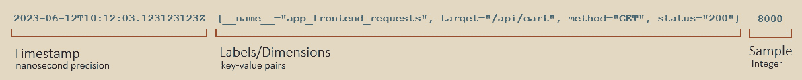

# 5

# 使用 Grafana Mimir 和 Prometheus 进行指标监控

本章将介绍 **Prometheus 查询语言**（**PromQL**）。与 LogQL 类似，PromQL 可以用来选择和筛选指标流，并使用运算符和函数处理数值数据，使您能够构建快速高效的查询，从而支持建立可观察系统。我们还将探索并比较用于输出系统指标的各种协议。最后，我们将探索 **Prometheus** 和 **Mimir** 的架构，以了解 Mimir 如何满足高可扩展系统的需求。

本章将覆盖以下主要内容：

+   更新 OpenTelemetry 采集器以收集指标

+   介绍 PromQL

+   探索数据收集和指标协议

+   了解数据存储架构

+   在 Grafana 中使用示例数据

# 技术要求

本章中，您将需要以下内容：

+   在 *第三章* 中设置的 OpenTelemetry 演示应用程序

+   在 *第三章* 中设置的 Grafana Cloud 实例

+   Docker 和 Kubernetes

您可以在 GitHub 仓库中的 [`github.com/PacktPublishing/Observability-with-Grafana/tree/main/chapter5`](https://github.com/PacktPublishing/Observability-with-Grafana/tree/main/chapter5) 找到本章的代码。您可以在 [`packt.link/A2g91`](https://packt.link/A2g91) 找到本章的 *Code in Action* 视频。

# 更新 OpenTelemetry 演示应用程序

对于本章，我们已经准备了更新版本的 `OTEL-Collector.yaml` 文件，该文件将为您添加更多的标签，以便您进一步探索。有关此过程的详细信息，请参阅 Git 仓库中的 `README.md` 文件。此过程将把新的采集器配置应用于您的演示应用程序：

1.  使用 Helm，我们将更新的配置文件应用于我们的 Kubernetes 集群：

    ```
    $ helm upgrade --version '0.73.1' --values chapter5/OTEL-Collector.yaml --values OTEL-Creds.yaml owg open-telemetry/opentelemetry-collector
    NAME: owg-otel-collector
    LAST DEPLOYED: Sun Mon 19 12:42:36 2023
    NAMESPACE: default
    STATUS: deployed
    REVISION: 2
    …
    ```

1.  验证升级是否成功：

    ```
    $ kubectl get pods --selector=component=standalone-collector
    NAME  READY   STATUS    RESTARTS   AGE
    owg-otel-collector-594fddd656-tfstk   1/1     Terminating   1 (70s ago)   2m8s
    owg-otel-collector-7b7fb876bd-vxgwg   1/1     Running       0             3s
    ```

这个新配置增加了从 Kubernetes 集群和 OpenTelemetry 采集器收集指标的功能。该配置还做了一些必要的重新标记。

现在我们从本地演示应用程序收集更多的数据，让我们介绍用于查询这些数据的语言。

# 介绍 PromQL

**Prometheus** 最初由 SoundCloud 于 2012 年开发；该项目于 2016 年被 *Cloud Native Computing Foundation* 接受成为第二个孵化项目（继 Kubernetes 之后），并且很快发布了 1.0 版本。PromQL 是 Prometheus 的一个重要组成部分，用于查询存储的数据并生成仪表盘和警报。

在我们深入探讨语言的细节之前，让我们简要地看一下 Prometheus 兼容系统与指标数据交互的几种方式：

+   **摄取度量**：与 Prometheus 兼容的系统接受时间戳、键值标签和样本值。由于 **Prometheus 时间序列数据库**（**TSDB**）的细节相当复杂，下面的图示展示了度量的单个样本在摄取后如何存储的简化示例：



图 5.1 – 存储在 TSDB 中的度量数据简化视图

+   `__name__` 值会创建一个 `app_frontend_requests`。

+   每一组唯一的标签都会创建一个**时间序列**。在前面的图示中，所有标签的集合即为时间序列。

+   一个时间序列将包含多个**样本**，每个样本都有一个唯一的时间戳。前面的图示展示了一个单一的样本，但随着时间的推移，每个时间序列将会收集多个样本。

+   度量标签的唯一值数量被称为标签的**基数**。应避免使用基数较高的标签，因为它们会显著增加度量的存储成本。

下图展示了一个包含两个时间序列和五个样本的单一度量：


图 5.2 – 多个时间序列的样本示例

在 Grafana 中，我们可以查看度量的时间序列和样本的表现。为此，请按照以下步骤操作：

1.  在你的 Grafana 实例中，选择菜单中的 **Explore**。

1.  选择你的 Prometheus 数据源，标签为 `grafanacloud-<team>-prom (default)`。

1.  在 **Metric** 下拉菜单中，选择 **app_frontend_requests_total**，在 **Options** 下，将 **Format** 设置为 **Table**，然后点击 **Run query**。这将显示选定时间范围内度量中的所有样本和时间序列。你应该看到如下数据：


图 5.3 – 可视化构成度量的样本和时间序列

现在我们已经了解了数据结构，接下来让我们探索 PromQL。

## PromQL 功能概述

在本节中，我们将向你介绍 PromQL 的功能。我们将从数据类型的解释开始，然后我们将讨论如何选择数据、如何处理多个数据集以及如何使用函数。由于 PromQL 是一种查询语言，了解如何操作数据以生成警报和仪表板非常重要。

### 数据类型

PromQL 提供了三种数据类型，这些数据类型非常重要，因为 PromQL 中的函数和运算符会根据所呈现的数据类型有所不同：

+   **瞬时向量**是一种数据类型，用来存储包含单个样本的时间序列集合，这些样本共享相同的时间戳——也就是说，它表示在某一特定时刻的值：


图 5.4 – 一个瞬时向量

+   **范围向量**存储一组时间序列，每个时间序列包含具有不同时间戳的样本范围：


图 5.5 – 范围向量

+   **标量**是简单的数值，没有涉及标签或时间戳。

### 选择数据

PromQL 提供了多种工具，用于选择要在仪表盘或告警中显示的数据，或仅用于了解系统的状态。以下表格描述了其中的一些：

| **名称** | **语法** | **运算符** | **作用范围** |
| --- | --- | --- | --- |
| 度量选择器 | `metric_name` |  | 选择一个度量 |
| 范围选择器 | `[``5m]` | `ms`、`s`、`m`、`h`、`d`、`w` 和 `y` | 选择样本 |
| 标签选择器 | `{``label="value", foo!="bar"}` | `=`、`!=`、`=~` 和 `!~` | 使用标签选择和过滤时间序列 |
| 偏移修饰符 | `offset 5m` | `ms`、`s`、`m`、`h`、`d`、`w` 和 `y` | 将评估时间从当前时间点偏移指定的时间 |
| `@` 修饰符 | `@` `1686561123` | `@` | 将评估时间设置为特定时间，适用于瞬时或范围向量。该修饰符使用纪元时间戳 |

表 5.1 – PromQL 中可用的选择运算符

除了允许我们选择数据的运算符外，PromQL 还提供了一些运算符，用于比较多个数据集。

### 两个数据集之间的运算符

有些数据由单一度量轻松提供，而其他有用的信息则需要从多个度量中创建。以下运算符允许你将数据集进行组合。

| **名称** | **语法** | **运算符** | **作用范围** |
| --- | --- | --- | --- |
| 算术运算符 | `a + b` | `+`、`-`、`*`、`/`、`%` 和 `^` | 对瞬时向量和标量进行算术运算；作用范围取决于 `a` 和 `b` 的数据类型。需要注意的是，向量会在*所有*标签上进行匹配。 |
| 比较运算符 | `a == b` | `==`、`!=`、`>`、`<`、`>=` 和 `<=` | 基于比较过滤瞬时向量和标量；作用范围取决于 `a` 和 `b` 的数据类型。 |
| 聚合运算符 | `sum by (``label) (a)` | `sum()`、`min()`、`max()`、`avg()`、`group()`、`stddev()`、`stdvar()`、`count()`、`count_values()`、`bottomk()`、`topk()` 和 `quantile()` | 对单一瞬时向量进行聚合操作。 这些运算符提供了 `without` 和 `by` 子句，以修改结果按标签分组的方式。 |
| 一对一向量匹配 | `a +` `on b` | `on()` 和 `ignoring()` | 将向量匹配修改为特定标签（`on`）或忽略某标签（`ignoring`） |
| 使用组修饰符进行一对多/多对一向量匹配 | `a +` `group_left b` | `group_left()` 和 `group_right()` | 在多对一或一对多匹配的情况下，修改向量匹配。分组可以使用标签列表来包含标签在结果中 |
| 使用逻辑运算符进行多对多向量匹配 | `a` `and b` | `and`、`or` 和 `unless` | 在多对多匹配的情况下，基于标签和 `a`、`b` 的值之间的逻辑运算修改向量匹配 |

表 5.2 – PromQL 中可用的比较运算符

向量匹配是一个最初会让人感到困惑的话题；为了澄清这一点，我们来考虑向量匹配的三种情况 —— *一对一*、*一对多*/*多对一* 和 *多对多*。

默认情况下，当组合向量时，所有标签名称和值都会被匹配。这意味着对于每个向量元素，运算符会尝试从第二个向量中找到一个匹配的元素。让我们来看一个简单的例子：

+   `10{color=blue,smell=ocean}`

+   `31{color=red,smell=cinnamon}`

+   `27{color=green,smell=grass}`

+   `19{color=blue,smell=ocean}`*   `8{color=red,smell=cinnamon}`*   `14{color=green,smell=jungle}`*   `29{color=blue,smell=ocean}`*   `39 {color=red,smell=cinnamon}`*   `29{color=blue}`*   `39{color=red}`*   `41{color=green}`

当`color=blue`和`smell=ocean`时，`A{} + B{}`的结果是`10 + 19 = 29`，而当`color=red`和`smell=cinnamon`时，`A{} + B{}`的结果是`31 + 8 = 29`。其他元素与这两个向量不匹配，因此会被忽略。

当我们使用`on (color)`进行向量求和时，我们只会根据`color`标签进行匹配；因此，现在这两个绿色元素会匹配并被求和。

当向量**A**和向量**B**之间存在*一对一*关系时，这个例子是有效的。然而，有时也可能存在*多对一*或*一对多*的关系 —— 也就是说，向量 A 或向量 B 中可能有多个元素与另一个向量的元素匹配。在这些情况下，Prometheus 会报错，并且必须使用分组语法。让我们看另一个例子来说明这一点：

+   `7{color=blue,smell=ocean}`

+   `5{color=red,smell=cinamon}`

+   `2{color=blue,smell=powder}`

+   `20{color=blue,smell=ocean}`*   `8{color=red,smell=cinamon}`*   `14{color=green,smell=jungle}`*   `27{color=blue,smell=ocean}`*   `13{color=red,smell=cinamon}`*   `22{color=blue,smell=powder}`

现在，我们在向量`color=blue`中有两个不同的元素。`group_left`命令将使用向量`22`中的标签，当在`group_right`操作符中进行匹配时，行为将朝着相反的方向进行。

最后的选项是*多对多*的向量匹配。这些匹配使用逻辑运算符`and`、`unless`和`or`来组合向量**A**和**B**的部分元素。让我们看一些例子：

+   `10{color=blue,smell=ocean}`

+   `31{color=red,smell=cinamon}`

+   `27{color=green,smell=grass}`

+   `19{color=blue,smell=ocean}`*   `8{color=red,smell=cinamon}`*   `14{color=green,smell=jungle}`*   `10{color=blue,smell=ocean}`*   `31{color=red,smell=cinamon}`*   `27{color=green,smell=grass}`*   `10{color=blue,smell=ocean}`*   `31{color=red,smell=cinamon}`*   `27{color=green,smell=grass}`*   `14{color=green,smell=jungle}`

与前面的示例不同，这里没有使用数学运算符，因此元素的值来自向量**A**，但只有与向量**B**中的逻辑条件匹配的**A**元素会被返回。

现在我们了解了运算符，让我们在看一个实际的 PromQL 写作示例之前，快速介绍一下 PromQL 函数。我们将在 *Writing* *PromQL* 部分探讨它们的实际用法。

### 函数

PromQL 提供约 60 种不同的函数。可以在 Prometheus 网站上找到完整的函数列表：[`prometheus.io/docs/prometheus/latest/querying/functions`](https://prometheus.io/docs/prometheus/latest/querying/functions)。

现在我们已经看过 PromQL 中可用的函数，让我们探索编写一个 PromQL 查询。

## 编写 PromQL

尽管语言的技术描述对于参考是有用的，但本节将遵循构建查询的过程，以便可以在上下文中看到语言。在接下来的几节中，我们将使用在前一节中介绍的选择器、运算符和修饰符编写实际的示例。

### 指标选择

当我们查看指标标签时，我们看到您可以使用 `metric_name{}` 语法在 PromQL 中选择指标。这可以直接键入查询中的 `app_frontend_requests_total`。如果没有，请使用 **Metric** 下拉菜单选择此指标。您应该看到类似于 *Figure 5.3* 中的结果。这种选择方法返回一个瞬时向量，如 *Figure 5.4* 中所述。

返回范围向量的语法与 *Figure 5.5* 中描述的类似。我们只需要添加我们感兴趣的范围 - `metric_name[range]`。范围必须包括时间单位，可以从毫秒（ms）到年（y）。重要的是要注意，使用范围向量的查询需要以 **Instant** 查询类型运行。如果选择了 **Range** 或 **Both**（默认），那么您将收到错误。以下是您将看到的错误示例：


图 5.6 – 在范围查询中使用范围向量时出错

### 时间序列选择和运算符

由于时间序列由一组唯一的标签组成，我们可以扩展我们的查询，仅查看特定数据 - 例如，仅请求目标为 OpenTelemetry 演示应用程序的购物车 API。以下步骤将过滤我们的查询，仅显示目标为 `/api/cart` 终端的请求：

1.  切换到 **Results** 面板右上角的 **Table** 视图：


图 5.7 – 在 PromQL 结果中使用表视图

1.  将鼠标悬停在目标值上，您应该看到这个图标：


图 5.8 – 值的过滤器

1.  单击加号图标，您将看到我们有一个新的标签过滤器，我们的 PromQL 现在如下所示：`app_frontend_requests_total{target="/api/cart"}`。

1.  让我们只显示 `GET` 方法的请求；你可以使用 `=` 来实现：检查字符串的精确匹配。例如，`target="/api/cart"` 只会在 `target` 标签为 `/api/cart/` 时匹配。

1.  `!=`：检查是否与精确匹配不同。`target!="/api/cart"` 会匹配所有情况，除了 `target` 标签为 `/api/cart/` 的情况。

1.  `=~`：检查是否与正则表达式匹配。例如，`target=~"/api/.*"` 会在 `target` 标签以 `/api/` 开头时匹配。这包括 `/api/cart/`、`/api/horse/` 和 `/api/cart/foo/bar/`。

1.  `!~`：检查是否与正则表达式不匹配。`target!~"/api/.+"` 会在 `target` 标签为 `/api/` 或 `/checkout/` 时匹配，但不会匹配 `/api/cart/`、`/api/horse/` 和 `/api/cart/foo/bar/`。

当我们查看表格时，应该还会看到一个名为 `metric_name{}` 的列，它等同于 `{__name__="metric_name"}`。

我们已经选择了数据并将其筛选到感兴趣的端点，但对请求进行的原始计数难以解读。让我们看看如何使用函数将这个计数转换为更有用的信息。

### 函数、聚合和运算符

PromQL 是一种嵌套语言，因此要对选定的数据集应用函数，只需将数据选择放入函数中。到目前为止，我们的查询如下所示：

```
app_frontend_requests_total{target="/api/cart",method="GET"}
```

这个查询返回每个采样点的请求计数。对于大多数目的，我们更关心的是命中该端点的请求的速率。这将使我们能够回答诸如峰值速率是多少，或者现在的速率是否比某个时间点的速率高或低等问题。获取这些信息的函数是 `rate()` 函数。我们可以将当前查询插入到该函数中，如下所示：

```
rate(app_frontend_requests_total{target="/api/cart",method="GET"}[$__rate_interval])
```

`rate` 函数接受一个范围向量作为输入，因此我们添加了特殊的 `[$__rate_interval]` 时间变量。这是 Grafana 的一个功能，指示 Grafana 根据我们选择的数据源的抓取间隔来选择一个合适的间隔。这个功能简化了选择正确速率间隔的技术性操作。聚合和其他运算符也使用类似的过程。

现在我们知道如何获取 `/api/cart` 端点的请求速率，让我们看一个另一个示例查询。

### HTTP 成功率

一个常见的 **服务水平指标** (**SLI**) 用于 Web 应用程序，是 HTTP 请求的 **成功率**。用简单的语言来说，这就是成功的 HTTP 请求数与总 HTTP 请求数的比率。我们将在*第九章*中讨论选择良好 SLI 的过程。

像下面这样的 PromQL 查询将为 `app_frontend_requests_total` 指标生成成功率 SLI：

```
sum by (instance) (rate(
   app_frontend_requests_total{status=~"2[0-9]{2}"}[5m]))
/
sum by (instance) (rate(app_frontend_requests[5m]))
```

我们可以将这段代码拆解如下：

+   使用 `app_frontend_requests_total{status=~"2[0-9]{2}"}[5m]`，我们选择具有 `status` 标签且值在 `200` 到 `299` 之间的 `app_frontend_requests` 指标样本。这使用正则表达式来选择标签范围，并且它是一个五分钟范围的区间向量。对于熟悉正则表达式的用户，Grafana 需要对反斜杠进行转义。

+   `rate()` 函数计算成功请求的每秒平均速率。该函数返回一个瞬时向量。

+   之前的函数将所有数据分组到初始时间序列中。然而，对于这个查询，我们不关心方法、目标或任何其他标签。相反，我们关心的是某个特定实例的应用程序是否出现故障，因为一个故障实例可能会被许多正常实例掩盖。为此，我们使用 `sum by (instance) ()` 聚合函数。

+   查询的最后一行与第一行相同，但去除了标签选择器，因此我们得到的是 *总* 请求。

+   最后，我们使用算术运算符 (`/`) 将成功请求除以总请求数。此查询的输出将是一个数字，当大多数请求成功时，它接近 1；当出现故障时，随着每个请求的失败，值将趋向于 0。

另一个常见的衡量项目是对服务请求的 **持续时间**。持续时间通常表示为直方图数据，PromQL 提供了许多统计工具，帮助我们理解用户的体验。让我们看一下以下查询：

```
histogram_quantile(
    0.95, sum(
        rate(
            http_server_duration_milliseconds_bucket{}[$__rate_interval])
        ) by (le)
    )
```

`http_server_duration_milliseconds_bucket` 指标是一个直方图，其命名约定中包含 `_bucket`。`histogram_quantile()` 函数接受该直方图数据，并为我们提供第 95 百分位的持续时间。这是通过直方图数据中的 `le`（小于或等于）标签计算得出的。虽然使用平均值进行此类计算可能很诱人，但百分位数能为我们提供更细致的数据理解。第 95 百分位意味着 95% 的样本持续时间小于或等于返回的值。

Grafana 提供了若干有用的函数，帮助理解查询：

+   在查询组件上方有一个标题为 **Explain** 的滑块。打开此滑块将逐步展示查询的执行过程。

+   此外，在查询组件上方有一个名为 **Kick start your query** 的按钮。点击它将提供一些初始查询。

+   在 **选项** 部分下方是查询 **检查器**。它将提供有关查询的详细信息，例如总请求时间和返回的数据。

这里是一张截图，显示了这些选项的位置：


图 5.9 – 查询的有用函数

希望你现在对 PromQL 的基础知识有了很好的掌握，并且知道有哪些资源可以用来进一步学习。虽然查询数据是 Grafana 日常工作的一个重要部分，但了解度量数据是如何收集的也是很有帮助的。

已设置的 OpenTelemetry 演示还会从单节点 Kubernetes 集群、节点上的 kubelet 实例和底层主机生成度量数据。我们鼓励你探索这些度量数据，看看你能发现什么。

我们已经了解了如何查询存储在 Prometheus 兼容系统中的数据。现在，让我们看看如何从你的服务中收集数据。

# 探索数据收集和度量协议

在*第二章*中，我们介绍了四种当前用于从现代软件中收集数据的常用协议——**StatsD**和**DogStatsD**，**OpenTelemetry 协议**（**OTLP**），以及**Prometheus**。我们还介绍了**简单网络管理协议**（**SNMP**），它广泛用于网络和计算领域。在本节中，我们将探讨这些协议的一些特点。

度量数据的收集有两种方法，推送和拉取。在**推送协议**中，应用程序或基础设施必须配置一个目标地址来发送度量数据。在**拉取协议**中，应用程序或基础设施配置为暴露度量数据，供其他服务请求。两种方法各有优缺点，同时也需要意识到潜在的安全隐患。在接下来的子节中，我们将深入探讨每种协议。

## StatsD 和 DogStatsD

我们将 StatsD 和 DogStatsD 放在一起讨论，因为它们在本章所讨论的内容上是相同的。

`8125`是其默认设置。这些是使用 StatsD 时需要考虑的事项：

+   StatsD 使用 UDP 进行传输。这更倾向于优先考虑传输速度，而非确保交付的可靠性。

+   该协议不支持应用程序与接收服务之间的身份验证。根据环境的不同，这可能成为一个安全隐患。

值得注意的是，尤其是在 Kubernetes 中，常见的做法是将 StatsD 接收器暴露在`localhost:8125`上，从而限制暴露范围并为应用程序提供一个标准。

StatsD 在数据收集代理中有广泛的支持，通常通过贡献的接收器实现。OpenTelemetry 收集器、FluentBit、Vector、Beats、Telegraf 和 StatsD 守护进程都支持该协议。Prometheus 提供了一个导出器，将 StatsD 格式的度量数据转换为 Prometheus 抓取端点；这是一个建议的中间步骤，用于完整的 Prometheus 迁移。

**DogStatsD** 的支持不如其衍生自的 StatsD 格式；它为 StatsD 提供了一组扩展的指标。原生支持 DogStatsD 数据采集的代理包括 **Vector** 和 Datadog 自家的代理。OpenTelemetry 采集器目前不支持此功能，但正在讨论将其加入，Datadog 也是 OpenTelemetry 项目的积极参与者，因此这一点可能会发生变化。

## OTLP

OTLP 也是一个 *推送协议*，因此需要知道目标位置。像 StatsD 一样，OTLP 通常通过标准接收端点 `localhost:4317`（`localhost:4318`（HTTP））来实现。OTLP 支持 gRPC 和 HTTP，并且支持客户端与服务器之间的认证和确认。OTLP 还提供了多个提升使用体验的功能，例如 **服务器控制的限流** 和 **GZIP 压缩**。

OpenTelemetry 正在积极开发中，因此这些信息可能会发生变化。由于该项目是多个主要厂商的合作，来自这些厂商的代理程序正在越来越多地支持 OTLP 指标。尽管其他采集工具不支持 OTLP 输入，但 OpenTelemetry 采集器支持来自多种来源的输入。这意味着 OTEL 采集器非常适合支持混合环境。Vector 采集代理也提供了这种多功能性，大多数关于 OTEL 采集器的说法同样适用于它。

## Prometheus

与 StatsD 和 OTLP 不同，Prometheus 是一个 *拉取协议*。客户端应用程序需要配置一个端点来提供指标，然后配置一个与 Prometheus 兼容的抓取器，在特定的时间间隔内收集这些指标。这些指标通常暴露在 `/metrics` 端点上，尽管一些框架会以不同方式实现（例如 Spring Boot 的 `/actuator/Prometheus`）。

可能看起来使用拉取配置会增加所需的配置步骤。然而，使用拉取方法确实减少了应用程序对其运行环境所需的配置信息。例如，如果有 0 或 10 个客户端读取其指标，应用程序的配置保持不变。这个拉取模式也与 Kubernetes 中应用程序的存活和就绪端点模式非常契合。

为了帮助服务器配置，Prometheus 提供了广泛的服务发现选项，涵盖多个不同平台，包括 Kubernetes、DNS 和 Consul。这些发现选项包括匹配特定名称并在存在标签时收集数据，这一范围的选项使得在需要时能够实现相当复杂的架构。

Prometheus 格式具有良好的采集器支持；Prometheus、OTEL Collector、Grafana Agent、Vector、Beats 和 Telegraf 都支持采集这些指标。

## SNMP

SNMP 比我们在这里讨论的其他协议更为复杂，因为它包含了许多用于管理和监控网络连接设备的功能，例如交换机和物理服务器。SNMP 的*监控*方面是一个*拉取协议*，即管理实例连接到设备上的代理软件并拉取数据。**SNMP traps** 还有额外的功能，允许设备以数据推送的方式向管理者报告事件。这些 traps 经常被用于追踪度量数据。值得注意的是，使用 SNMP 时，安全性可能会成为一个问题，具体取决于配置方式。如果配置不当，SNMP 会提供显著的攻击面。

SNMP 得到了很好的支持，因为该协议自 1988 年以来一直在使用，并且得到了硬件供应商的良好支持。

我们现在已经讨论了如何使用 PromQL 查询数据，以及数据是如何生成和收集的，现在让我们来探讨 Grafana 如何存储度量数据。

# 理解数据存储架构

**时间序列数据库** (**TSDBs**) 理想地用于处理度量数据，因为度量需要在特定时间点记录数据，而 TSDB 被结构化为便于记录和查询这些数据。有多种 TSDB 可供选择，但由于本书专注于 Grafana，因此我们将在本节中仅讨论 **Graphite**、**Prometheus** 和 **Mimir**。本节的目的是让你理解数据的存储结构，并概述 Mimir 如何帮助组织将数据扩展到超越 Graphite 和 Prometheus 能力的水平。

## Graphite 架构

Graphite 有多个组件；我们将在此讨论存储组件 **Whisper**。Whisper TSDB 使用扁平文件结构，其中每个唯一的时间序列都是一个固定大小的文件。这个大小由在 Whisper 中配置的分辨率和保留策略来决定。为了进行搜索，必须读取这些文件中的每一个，这会迅速变得昂贵，特别是在磁盘 I/O 上。由于没有内建的管理数据冗余的项目，Graphite 也无法保证写入的数据会免于丢失或损坏。

然而，Graphite 引入的写入数据的协议尽管已显老化，但仍然相关，因此 Grafana Cloud 为已经使用该技术的团队提供了一个 Graphite 数据接收端点和查询端点。

Graphite 是一个早期的度量标准，于 2008 年引入；先前提到的查询速度和数据完整性的限制导致了 Prometheus 的诞生，接下来我们将讨论 Prometheus。

## Prometheus 架构

Prometheus 将数据存储在不可变的 `block` 中，`block` 覆盖一个固定的时间范围（默认是两小时）。在一个 `block` 中包含若干个 `chunks`，这些 `chunks` 的大小上限为 512 MB；这些文件包含了采样的值。与这些 `chunks` 一起的是元数据文件——`index` 和 `meta.json`。`index` 文件包含一个表格，记录了 `block` 中的标签以及指向所有样本在相关 `chunks` 中位置的引用。高基数的度量标签会导致 `index` 文件大小的巨大增加，并降低读取性能。`meta.json` 文件包含如 `block` 中的最小和最大时间戳，以及包含的样本、序列和 `chunks` 的统计信息，以及所使用的版本。

为了处理接收到的数据，Prometheus 还使用了一个 `head block`，它类似于用于存储的 `block`，但它允许写入。这使得可以收集完整的两小时数据块，等到数据块完成时，再创建 `index` 和元数据。这个过程包括将数据持久化到磁盘上的功能，以防止数据丢失。`head block` 包含一个 `meta.json` 文件，记录了已接收的数据。当两小时时间块结束时，会创建一个新的 `head block`，旧的 `head block` 会转变为一个标准的 `block`，并创建 `index` 和 `chunks`。

下图展示了一个虚构的 Prometheus TSDB 的结构，其中突出了 `blocks`、`chunks`、`index` 和元数据文件以及 WAL：


图 5.10 – Prometheus TSDB

Prometheus 中的 Prometheus TSDB 实现有限，因为它使用本地存储，本地存储没有原生的集群或复制功能。虽然可以改善这些方面，但其根本限制在于只有一个节点执行读写操作。在适当的情况下，这些限制是完全可以接受的。然而，当 TSDB 扩展以接受多个活跃的时间序列时，需要做出更改。处理这些情况正是 Mimir 设计的初衷。

## Mimir 架构

Mimir 使用相同的基础 TSDB 存储结构。然而，与 Prometheus 不同，Mimir 原生支持对象存储来存储块文件。支持的存储包括 Amazon S3、Google Cloud Storage、Microsoft Azure Storage 和 OpenStack Swift。

通过利用**对象存储**，Mimir 能够解决 Prometheus 所遇到的扩展问题，通过增加新的数据摄取服务实例来实现。Mimir 将传入的数据流分配到特定的每租户 TSDB，并将每个数据流分配给一个摄取服务实例。像 Prometheus 一样，数据通过摄取器写入内存和 WAL，当块完成时，它被写入对象存储。为了提供弹性，Mimir 会将这些数据流写入多个摄取器，并且一个压缩服务将处理合并对象存储中冗余块的过程，并删除重复样本。

类似于写路径的水平可扩展性，Mimir 也扩展了读路径。它通过将传入的查询拆分成更短的时间范围来实现这一点。然后，它将这些更小的查询单元分发给多个查询实例。通过这样做，Mimir 再次利用底层对象存储的优势，实现数据的快速返回。

下图显示了 Mimir 的读写路径：


图 5.11 – Mimir 架构

指标显示的是聚合数据，如请求的总次数。当探索一个*异常*的指标值时，查看一个示例会很有帮助。在那些通过追踪和指标进行仪表化的应用中，示例允许我们在指标数据中记录一个样本追踪。让我们来看看这个功能的实际应用。

# 在 Grafana 中使用示例

**示例**是 Grafana 中的功能，允许我们从系统的聚合视图（通过指标提供）切换到单个请求的详细视图（通过追踪提供）。示例需要在*采集层*进行配置，然后发送到*存储层*。

当示例可用时，你可以通过以下步骤查看示例：

1.  在查询下打开**选项**，并切换**示例**滑块：


图 5.12 – 示例切换按钮

1.  示例将作为星星出现在指标图表上：


图 5.13 – 指标中的示例

将鼠标悬停在单个示例上时，将通过在指标视图中显示来自示例追踪的信息来扩展指标数据。我们将在*第六章*中更详细地解释这些字段，但一些显著的字段包括进程运行时的名称和版本以及`span_id`，这些在纯粹的指标视图中通常无法获取：


图 5.14 – 示例信息

1.  通过示例，你还可以从查看指标数据切换到查看相关追踪，方法是点击**与 Tempo 查询（****Tempo）**按钮：


图 5.15 – 在 Tempo 中打开示例

我们将在*第六章*中详细讨论跟踪的具体内容，但这应当为你提供一个良好的介绍，帮助你在度量标准中使用这种数据。

# 总结

在本章中，我们详细探讨了度量标准。我们了解了在 PromQL 中可用的所有操作符，并使用该语言编写了两个查询。在掌握了查询知识的基础上，我们查看了收集数据的工具以及应用程序共享数据的各种协议。接着，我们了解了 Prometheus 的架构，并看到 Mimir 如何将 Prometheus 的概念转化为一个高度可扩展的数据处理工具，能够满足任何规模组织的需求。我们最后探讨了 Exemplars，为聚合数据提供了一个具体的数据示例，帮助我们更好地理解度量标准中的数据。

下一章将探讨 Grafana Tempo 中的跟踪工作原理，展示如何利用 Exemplars 以及日志追踪和跨度信息来为组织的客户创建一个真正可观察的系统。
