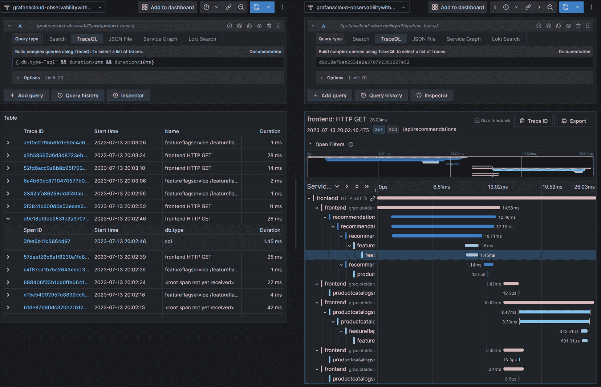
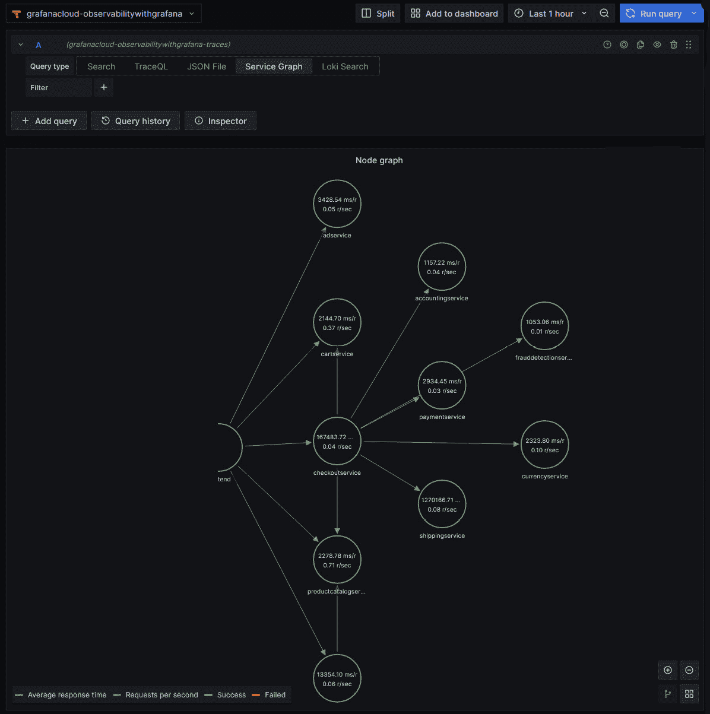

# 6

# 使用 Grafana Tempo 进行追踪技术细节

**Grafana Tempo** 是 Grafana 提供的第三款遥测存储工具；它提供了存储和查询追踪数据的能力。本章将介绍 **Tempo 查询语言**（**TraceQL**）。TraceQL 可用于选择和过滤由应用程序生成的追踪数据，从而收集跨追踪的见解；该语言与 LogQL 和 PromQL 非常相似，但针对追踪数据进行了定制。在本章中，我们将探索主要的追踪协议以及如何使用它们输出应用程序的追踪数据；这将帮助你在应用程序中做出明智的选择，选择合适的协议或在收集数据时支持哪些协议。接下来，我们将探索 Tempo 的架构，以了解它如何满足可扩展的追踪平台需求。

本章将涵盖以下主要主题：

+   介绍 Tempo 和 TraceQL 查询语言

+   探索追踪协议

+   理解 Tempo 架构

# 技术要求

在本章中，你将使用演示应用和 Grafana Cloud 实例（在 *第三章* 中设置）。你可以在 GitHub 仓库中的 [`github.com/PacktPublishing/Observability-with-Grafana/tree/main/chapter6`](https://github.com/PacktPublishing/Observability-with-Grafana/tree/main/chapter6) 找到本章的代码。你还可以在 [`packt.link/fJVXi`](https://packt.link/fJVXi) 找到 *Code in Action* 视频。

# 更新 OpenTelemetry 演示应用

对于本章，我们提供了一个更新的 `OTEL-Collector.yaml`，其中包含额外的追踪配置。这个更新的配置位于 GitHub 仓库的 `chapter6` 目录中。更新过程的完整细节可以在 GitHub 仓库中的 `README.md` 文件中找到。

要将此更新的配置应用到 OpenTelemetry Collector，请按照以下步骤操作：

1.  使用 Helm 升级 Collector：

    ```
    $ helm upgrade --version '0.73.1' --values chapter6/OTEL-Collector.yaml --values OTEL-Creds.yaml owg open-telemetry/opentelemetry-collector
    NAME: owg-otel-collector
    LAST DEPLOYED: Sat Aug 19 12:42:36 2023
    NAMESPACE: default
    STATUS: deployed
    REVISION: 4
    …
    ```

1.  验证升级是否成功：

    ```
    $ kubectl get pods --selector=component=standalone-collector
    NAME  READY   STATUS    RESTARTS   AGE
    owg-otel-collector-594fddd656-tfstk   1/1     Terminating   1 (70s ago)   2m8s
    owg-otel-collector-7b7fb876bd-vxgwg   1/1     Running       0             3s
    ```

    你的追踪数据现在将拥有更多标签，并且还将生成服务图和跨度指标。

现在我们的本地安装已更新，让我们从探索第三种查询语言 TraceQL 开始。

# 介绍 Tempo 和 TraceQL 查询语言

Tempo 和 TraceQL 是我们将在本书中深入探索的最新工具和查询语言。像 LogQL 一样，TraceQL 是以 PromQL 为灵感构建的，为开发者和运维人员提供了一套熟悉的过滤、聚合和数学工具，帮助在指标、日志和追踪数据之间实现可观察性流。

让我们快速了解 Tempo 如何查看追踪数据：

+   **Trace 收集**：在*第二章*中介绍了，trace（或分布式 trace）是一组数据，表示一个请求在系统中的传播。traces 通常从多个应用程序收集。每个应用程序将 spans 发送到某种收集架构，最终发送到 Tempo 进行存储和查询。

+   **Trace 字段**：以下图表介绍了 trace 的简化结构，类似于在*第四章*中看到的日志的简化结构，以及在*第五章*中看到的 traces：


图 6.1 – 包含四个 span 的 trace 简化视图

在*第二章*中，我们介绍了一个 trace 的常见字段。在前面的图示中，我们可以看到四个 span 都具有相同的 `trace_id`，它是整个 trace 的唯一标识符。每个 span 都有一个唯一的标识符，即 `span_id`。每个 span 还记录了它的来源，通过 `parent_id` 字段来表示。最后，记录了开始和结束时间。这个简化的视图排除了 **OpenTelemetry 协议** (**OTLP**)、**Zipkin** 和 **Jaeger** 中的一些字段，这些字段用于捕捉大量的上下文信息。我们将在本章后面讨论这些内容。

现在我们已经看过 trace 数据的结构，接下来我们来探索 Tempo 接口，以及如何查询数据。

## 探索 Tempo 特性

在本节中，我们将介绍 Tempo 的主要功能，它是 Grafana 中的追踪平台，以及它的查询语言 TraceQL。在*第四章*和*第五章*中，我们介绍了 LogQL 和 PromQL 语言，它们专注于选择日志或度量数据，并提供详细功能来对选定的数据进行强大的分析。目前，PromQL 仅提供选择 trace 数据的功能。尽管有强大的工具可以选择这些数据，但目前没有工具进行分析。这种功能是产品的最终目标，但我们想要强调的是 Tempo 在 `v2.3.x` 版本中的当前状态。

让我们从探索 Tempo 的用户界面开始，看看它如何呈现 trace 数据。

### Tempo 接口

用于探索 Tempo 数据的主要视图分为两部分，**查询编辑器**和**trace 视图**。在下图中，查询编辑器位于左侧，trace 视图位于右侧。当你首次进入视图时，你只会看到查询编辑器。点击 trace ID 或 span ID 时，trace 视图会被打开：



图 6.2 – 查询编辑器（左）和 trace 视图（右）

结果面板是上下文相关的。如果我们使用 TraceQL 进行搜索，它将返回一个匹配的追踪和跨度列表；这在前面的截图的左侧显示。然而，如果我们搜索特定的追踪 ID，我们将在右侧显示追踪视图，在那里我们可以探索该追踪中的跨度。

在查看查询面板时，让我们来看一下我们可以使用的两种不同的搜索模式，如下所示：


图 6.3 – 搜索模式

前面的截图中显示的两种搜索模式如下：

+   **基本搜索模式**：在这个模式下，系统会提供下拉菜单，供你选择感兴趣的追踪。对于初次使用 Tempo 并且希望快速获取数据的人来说，这非常有用，但我们在本书中不会探讨这个搜索模式。请注意，此模式将在 Grafana 10.3 中被弃用。

+   **TraceQL 模式**：这个模式允许你使用 TraceQL 以非常精细的方式搜索你需要的数据。这是默认的搜索模式。

除了这些，还有三种搜索模式可用：

+   **Loki 搜索模式**：你应该对这个模式感到熟悉，它在*第四章*中有所介绍；它可以在 Tempo 中使用，因此你可以非常快速地在包含追踪和跨度 ID 的日志与完整追踪视图之间切换。

+   **JSON 文件模式**：这个模式允许直接导入并查看以 JSON 格式保存的追踪。结合导出功能，它使得有趣的追踪可以简单地保存和共享。在导出的 JSON 文件中探索数据是理解追踪中使用的底层数据结构的一个很好的练习。

+   **服务图模式**：收集分布式追踪的最强大功能之一就是能够可视化这些服务之间的连接。这个工具为任何人提供了一个清晰的图形表示，展示系统中应用程序之间是如何相互通信的。该功能结合了指标和追踪来表示系统的当前状态。工具还会用红色标示出出错的请求，用绿色标示出成功的请求。

    下方截图显示了服务图的默认视图：



图 6.4 – 服务图

除了表示服务之间的连接，前面的截图还显示了请求率和响应的平均延迟。在服务图上方，显示了**请求、错误和持续时间**（**RED**）指标。我们将在*第九章*中详细讨论这些指标。

在撰写时，OpenTelemetry 和 Tempo 的这一部分正在积极开发中，作者期待即将推出的功能。

现在我们已经看过 Tempo 的界面，接下来让我们了解如何使用 TraceQL 查询追踪数据。

## 探索 Tempo 查询语言

像 Prometheus 和 Loki 一样，Tempo 提供了一种查询语言，**TraceQL**。现在你已经熟悉了 Tempo 的界面和跟踪结构，让我们来探索 TraceQL 的功能。

### 字段类型

TraceQL 使用两种字段类型，**内在字段** 和 **属性字段**。让我们详细了解这些字段：

+   `status`: 该值可以是 `error`、`ok` 或未设置（`null`）

+   `statusMessage`: 可选的文本，用于阐明状态

+   `duration`: 跨度的开始和结束之间的时间

+   `name`: 操作或跨度的名称

+   `kind`: 该值可以是 `server`、`client`、`producer`、`consumer`、`internal` 或 `unspecified`，其中 `unspecified` 是回退值

+   `traceDuration`: 跟踪中所有跨度的开始和结束之间的毫秒数

+   `rootName`: 跟踪中第一个跨度的名称

+   `rootServiceName`: 跟踪中第一个服务的名称

+   `span.http.method` 和 `span.app.ads.ad_response_type`。* `resource.container.id` 和 `resource.k8s.node.name`。

为了提高查询效率，最佳实践是始终在属性查询中包含 `span.` 和 `resource.`。然而，当你不确定某个字段是跨度还是资源时，可以使用前缀 `.` 来进行查询，例如 `.http.method` 或 `.k8s.node.name`。

查看单个跨度时，你可以看到在 **跨度属性** 和 **资源属性** 下可用的字段。这个展开视图显示了包含在跨度中的字段：


图 6.5 – 跨度的属性

现在你已经很好地掌握了在 Tempo 中搜索跟踪时可用的字段，让我们来看一下如何搜索跟踪和跨度。

### 选择跟踪和跨度

TraceQL 提供了工具来选择在仪表盘中显示的数据，或仅仅探索系统的当前状态。以下表格描述了这些工具：

| **名称** | **语法** | **操作符** | **范围** |
| --- | --- | --- | --- |
| 字段选择器 | `{field = "` `value"}` | `=`, `!=`, `>`, `>=`, `<`, `<=`, `=~`, `!~` | 选择特定字段值的跨度 |
| 字段表达式 | `{field1="value1" &&` `field2="value2"}` | `&&`，`&#124;&#124;` | 选择多个字段值匹配的跨度 |
| 逻辑操作符 | `{field1="value1} && {``field1="value2}` | `&&`，`&#124;&#124;` | 选择逻辑检查为 `true` 的跨度，这可以检查多个字段。 |
| 结构操作符 | `{field1="value1"} > {``field2="value2}` | `>`，`>>`，`~` | 在第二个过滤器中搜索跨度，检查它们与第一个过滤器的关系。后续将更详细解释这些操作符。 |

表 6.1 – TraceQL 中可用的选择操作符

结构操作符提供了执行查询的能力，考虑到条件是否在跟踪中的上游（父级）或下游（子级）满足。让我们看一些示例：

+   `>` 或 **子操作符** 表示直接子跨度，如下所示：

    ```
    {.service.name="frontend"} > {.service.name="productcatalogservice"}
    ```

    上述行将搜索来自产品目录服务的所有跨度，其中前端服务是直接父节点。

+   `>>` 或 **后代运算符** 表示任何后代，例如以下内容：

    ```
    {.service.name="frontend"} >> {.service.name="cartservice"}
    ```

    这将搜索来自购物车服务的所有跨度，其中前端服务是追踪中的父节点，但它可能首先经过其他服务，例如结账服务。

+   `~` 或 **兄弟运算符** 表示共享相同父节点的任何跨度，例如以下内容：

    ```
    {.service.name="frontend"} ~ {.service.name="frontend"}
    ```

    这将搜索任何多次访问前端的跨度。在演示应用中，前端服务将是父节点。

这些运算符允许我们选择数据。TraceQL 还允许工具对追踪数据执行聚合和数学函数操作。

### 聚合器和算术

聚合器和数学函数允许进行更复杂的查询。它们可以显示跨所有追踪信息的聚合数据。以下表格中描述了一些聚合器：

| **名称** | **语法** | **运算符** | **作用域** |
| --- | --- | --- | --- |
| 计数聚合器 | `&#124; count()` `>` `10` | `count()` | 按跨度集中的跨度总数对返回的跨度进行精炼 |
| 数值聚合器 | `&#124;` `avg(duration) >` `20ms` | `avg()`、`max()`、`min()` 和 `sum()` | 按字段对跨度集中的返回跨度进行精炼 |
| 算术运算符 | `{field1 < field2 *` `10}` | `+`、`-`、`*`、`/` 和 `^` | 对数字字段执行算术运算 |

表 6.2 – TraceQL 中的聚合和数学运算符

值得注意的是，TraceQL 在编写时处于积极开发阶段，因此此运算符列表预计会不断增长。

现在你已经了解了如何搜索追踪数据，让我们讨论如何无缝地在数据类型之间切换，以便获得完整的视图。

## 数据类型之间的转换

当正确地进行仪表化时，应用程序将生成数据，可用于在追踪、日志和指标之间切换，从而真正理解发生了什么。

让我们考虑以下跨度，其中在`checkoutservice`中发现了一个错误。这可能是实际商店中的一个问题，因为它表明客户到达了结账页面，却因某种原因无法完成销售：


图 6.6 – 查找错误的日志

Tempo 的查询界面提供了一个有用的链接，`service_name` 和 `service_namespace` 字段可用于查询 Loki。以类似的方式，服务可以将追踪上下文（`traceId` 和 `spanId`）注入到其日志输出中（如果可用）。然后，可以配置 Loki 提供上下文链接到 Tempo，以查看追踪视图。最后，正如在 *第五章* 中提到的，指标可以呈现示例，这使得用户能够查看来自指标图表的样本追踪。

我们已经探索了查看应用程序生成数据的方法。在下一节中，我们将了解用于生成 Grafana Tempo 跟踪数据的不同协议。

# 探索跟踪协议

在*第二章*中，我们介绍了三种主要的**跟踪协议**，OTLP、Zipkin 和 Jaeger。在本节中，我们将探讨这些协议的一些特点、它们的支持情况，以及如何在你编写的软件服务中使用它们。我们还将讨论这些协议用于将上下文传递给其他服务的不同**头部**。一个跟踪协议由一组头部组成，这些头部会添加到由仪表化应用程序发出的 HTTP 请求中。这些头部传递每个 span 的信息到下游服务。一旦所有这些 spans 被收集，它们就形成了一个完整的分布式跟踪。

## 主要的跟踪协议有哪些？

首先，让我们看看主要跟踪协议的特点和支持情况——OTLP、Zipkin 和 Jaeger。

### OTLP

OTLP 跟踪支持 C++、.NET、Erlang、Go、Java、JavaScript、PHP、Python、Ruby、Rust 和 Swift。在流行的开发框架中，如 Spring、Django、ASP.NET 和 Gin，都有很好的 OTLP 支持。由于支持范围广泛，最佳实践是查阅你选择的框架文档，了解如何对应用程序进行仪表化；在大多数情况下，仪表化操作可能仅仅是添加几行依赖项。

跟踪本质上是一个分布式过程，已经有几个标准用于传播跟踪字段。这意味着应用程序在处理跟踪时可能需要使用不同的 HTTP 或 gRPC 头部，这取决于它们操作环境中的其他应用程序。OTLP 原生支持 W3C TraceContext、B3 和 Jaeger 传播头部，并且支持用于传播其他上下文信息的 W3C 行李头部。B3 和 Jaeger 头部的支持意味着使用 Zipkin 和 Jaeger 库仪表化的应用程序得到原生支持。然而，其他跟踪头部，如 AWS 的 X-Ray 协议，并未作为主流分发的一部分进行维护。如果使用这些协议，建议使用相关厂商的 OpenTelemetry 分发版本——例如，当 X-Ray 在监控环境中使用时，可以使用 *AWS Distro for OpenTelemetry*（[`aws.amazon.com/otel/`](https://aws.amazon.com/otel/)）。

在数据收集领域，OTLP 跟踪数据得到了 OpenTelemetry Collector、Grafana Agent、通过插件支持的 FluentBit 和通过插件支持的 Telegraf 的良好支持。

### Zipkin

Zipkin 支持 C#、Go、Java、JavaScript、Ruby、Scalar 和 PHP，通过支持的库；以及 C++、C、Clojure、Elixir、Lua 和 Scala，通过社区支持的库。与 OTLP 一样，Zipkin 在流行的开发框架中也有很好的支持，因此在进行应用程序仪表化时，最好查阅框架文档。

Zipkin 仅原生支持 B3 传播头。然而，由于框架提供了对不同追踪协议的可插拔支持，因此在应用程序中实现对其他传播头的支持可能相对容易。

在数据收集方面，Zipkin 被 OpenTelemetry Collector、Grafana Agent 以及 Zipkin 本身的原生工具支持。

### Jaeger

我们在这里包括 Jaeger 是出于历史原因，但不推荐采用它。Jaeger 最初由*Uber*开发。在 2022 年 1 月之前，Jaeger 为 Java、Python、Node.js、Go、C#和 C++提供了 SDK，这些 SDK 支持 OpenTracing API。OpenTelemetry 是由 OpenTracing 和 OpenCensus 项目合并而成。Jaeger 现在推荐使用 OpenTelemetry SDK 来为应用程序提供监控。对于已经使用 Jaeger 客户端库的应用程序，OpenTelemetry 提供了迁移指南：[`opentelemetry.io/docs/migration/opentracing/`](https://opentelemetry.io/docs/migration/opentracing/)。

Jaeger 库支持 Jaeger、Zipkin 和 W3C TraceContext 头，但不支持任何其他的传播格式。

在 Jaeger 得到积极支持期间，数据收集器对 Jaeger 的支持并不广泛；该协议的预期使用方式是在本地环境中将数据收集到 Jaeger 后端。OpenTelemetry Collector 和 Grafana Agent 确实提供了对 Jaeger 追踪的接收器，并允许您在应用程序迁移到 OpenTelemetry 协议时收集这些追踪数据。

现在你已经熟悉了追踪协议，我们来看看用于在使用分布式追踪的服务之间传播信息的头部。

## 上下文传播

**分布式追踪**在 Web 技术中相对较新，**万维网联盟**（**W3C**）在 2021 年 11 月将**Trace Context**作为推荐标准，而**Baggage**格式目前仍处于工作草案阶段。追踪以两种不同的方式记录信息：

+   每个应用程序将追踪和跨度信息发送到收集代理

+   应用程序还使用 HTTP 或 gRPC 头共享数据，这些数据会被接收方应用程序获取

由于追踪技术是一项新技术，在官方的 W3C Trace Context 头标准确定之前，曾使用过一些非正式的标准格式。为了提供一些追踪技术的历史背景，我们将探讨以下格式：

+   Jaeger/Uber 头

+   Zipkin B3 头

+   W3C Trace Context 头

+   W3C 行李头

### Jaeger/Uber 头

Jaeger 库历史上使用了以下头格式；我们为历史参考包括了这些内容，因为这些格式应该被视为已弃用，推荐使用 W3C Trace Context。

Jaeger 中使用的两个 HTTP 头是`uber-trace-id`和`uberctx`，它们的格式如下：

```
uber-trace-id: {trace-id}:{span-id}:{parent-span-id}:{flags}
uberctx-{baggage-key}: {baggage-value}
```

`uber-trace-id`头的示例如下：

```
uber-trace-id: 269daf90c4589ce1:5c44cd976d8f8cd9:39e8e549de678267:0x01
```

让我们拆解一下`uber-trace-id`头中的各个字段：

+   `trace-id`：此字段是 64 位或 128 位的随机数，且为十六进制编码。在示例中，这是 `269daf90c4589ce1`。

+   `span-id` 和 `parent-span-id`：这是 64 位的随机数，并且是十六进制编码的。分别为 `5c44cd976d8f8cd9` 和 `39e8e549de678267`。

+   `flags`：此字段用于传递附加信息，例如是否对跟踪进行采样。在此示例中，其值为 `0x01`。

在 `uberctx` 行李头部中，字段如下：

+   `baggage-key`：这是一个唯一的字符串，用于命名头部。

+   `baggage-value`：这是一个将被百分比编码的字符串。作为一个概念，行李将在 *W3C* *baggage* 部分进一步探讨。

### Zipkin B3 头部

Zipkin 库使用 `B3` 头部；与 Uber 头部不同，Zipkin 历史上将每个字段分离到自己的头部中，如以下代码片段所示：

```
X-B3-TraceId: {TraceId}
X-B3-ParentSpanId: {ParentSpanId}
X-B3-SpanId: {SpanId}
X-B3-Sampled: {bool}
X-B3-Flags: 1 OR header absent
b3: {TraceId}-{SpanId}-{SamplingState}-{ParentSpanId}
```

让我们分解这些头部：

+   `X-B3-TraceId`：与 Jaeger 格式类似，`TraceId` 是 64 位或 128 位的十六进制编码。以下是此头部的一个示例，显示其发送方式：

    ```
    X-B3-TraceId: 68720d6346a16000531430804ce28f9c
    ```

+   `X-B3-ParentSpanId` 和 `X-B3-SpanId`：这些是 64 位并且是十六进制编码的。

+   `X-B3-Sampled`：其值为 `1` 或 `0`，尽管早期实现可能使用 `true` 或 `false`。

+   `X-B3-Flags`：此头部用于传播调试决策。

+   `b3`：Zipkin 在 W3C Trace Context 标准引入之前就已存在。为了帮助过渡到新标准，Zipkin 引入了 `b3` 头部。Zipkin 的后续版本可以使用这两个头部和 W3C Trace Context 头部来实现互操作性。`b3` 头部完全匹配 *W3C Trace Context* 中使用的 `tracestate` 头部，表示将其他头部合并为一个映射。

### W3C Trace Context

W3C 指定了一对标准头部，如下所示：

```
traceparent: {version}-{trace-id}-{parent-id}-{trace-flags}
tracestate: vendor specific trace information
```

让我们将这些头部分解成它们的组成部分：

+   `traceparent` 中的各个字段如下：

    +   `trace-id` 是一个十六进制编码的 16 字节数组（128 位）。

    +   `parent-id` 是一个十六进制编码的 8 字节数组（64 位）；此字段等同于 Jaeger 和 B3 中的 `span-id` 或 `SpanId`，表示生成该头部的服务所使用的跨度 ID。它与 B3 的 `ParentSpanId` 不同，因为它可用于表示发起被跟踪过程的上游服务。

    +   `version` 字段是另一个十六进制编码的 8 位字段；它表示所使用的标准版本。目前仅存在版本 00。

    +   `trace-flags` 是另一个十六进制编码的 8 位字段。在 W3C 标准的版本 00 中，唯一可用的标志是表示是否正在进行采样。

+   `tracestate` 用于编码特定于供应商的信息。虽然 `traceparent` 是一个固定格式，任何采用该标准的供应商都必须使用它，`tracestate` 则为供应商提供了一个空间，以确保追踪数据能够传播，并允许他们根据需要使用和编码这些数据。关于这个头部字段的唯一要求是，内容将是一个以逗号分隔的键值对列表。

### W3C 行李箱

`tenantId`，但是当一个应用程序向下游应用程序发起请求时，那个应用程序可能并不需要了解`tenantId`，就能够处理该请求。一个行李箱头部允许我们将`tenantId`字段传播到下游应用程序。下游应用程序可以在其可观察性工具中使用这个字段，同时又不会污染其数据模型，避免引入与业务无关的字段。这有效地将*可观察性*问题与*应用程序*问题分开。需要注意的是，行李箱头部中包含的数据可以被任何检查网络流量的人查看，因此不应使用它来共享敏感信息。

W3C `baggage` 头部看起来像这样：

```
baggage: key1=value1,key2=value2;property1;propertyKey=propertyValue,…
```

所有字段必须进行百分号编码；整个头部最多包含 64 个成员，且最大大小为 8,192 字节。使用行李箱头部为系统提供了一种标准化的方式来传播上下文信息。

我们现在已经讨论了应用程序如何产生追踪数据，以及如何将其共享，包括与收集代理和其他应用程序共享。接下来，让我们花些时间看看 Tempo 如何处理和存储数据。

# 理解 Tempo 架构

像 Loki 和 Mimir 一样，Tempo 利用对象存储，如 Amazon S3、Google Cloud Storage 和 Microsoft Azure Blob Storage。随着组件在读写路径上的水平扩展，Tempo 在数据量增加时具备了极好的扩展能力。

以下图表展示了 Tempo 使用的架构：


图 6.7 – Tempo 架构

Tempo 的*写入*路径包括以下几个部分：

+   **分发器**：分发器负责接收跨度，并根据跨度的追踪 ID 将其路由到正确的 ingester 服务实例。

+   **Ingester**：Ingester 负责将跨度组合成追踪，批量处理多个追踪并将其打包成块，同时为查询编写布隆过滤器和索引。一旦一个块完成，Ingester 还会将数据刷新到后端。

+   **度量生成器**：度量生成器是一个可选组件；它接收来自分发器的跨度，并利用这些跨度生成服务图和跨度度量（例如，速率和错误时长）。这些数据随后会被写入度量后端。

Tempo 的*读取*路径包括以下组件：

+   **查询前端**：前端负责接收查询并将其拆分为更小的分片，基于将被读取的数据块（由 ingester 创建）来返回请求的数据。然后，这些分片会被排队等待查询器处理。

+   **查询器**：该组件负责查找请求的数据，若数据块已经被刷新，则从后端获取数据，若数据块仍在收集，则直接从 ingester 获取数据。

**压缩器**，作为一个独立组件，负责优化后端存储的使用。

现在我们已经完成了对 Tempo 系统架构的探索，你已经看到了工具的所有主要组件，以及如何通过 Tempo 进行分布式追踪，从而帮助你清晰地了解你运行的系统组件。

# 总结

在本章中，你学习了如何使用 TraceQL 查询存储在 Tempo 中的追踪数据，这将帮助你为仪表板构建查询，利用这一丰富的数据源。你已经探索了 Tempo 的用户界面，因此你将能自信地在界面中操作。结合*第四章*和*第五章*中学到的技能，你将能够在 Grafana 中自信地在日志、度量和追踪数据之间切换，从而观察你所工作的系统。

我们详细了解了在为应用程序添加监控时，可以使用的不同协议和库，看到这些工具在不同编程语言中的支持程度。我们还探讨了用于在应用程序之间传播追踪数据的 HTTP 头信息。这将帮助你选择最佳的方式来为应用程序添加监控，并了解如何与已经启用了追踪的应用程序进行协作。

最后，我们看了 Tempo 的架构，以及它如何横向扩展以支持你的组织处理所需的任何数量的追踪数据。通过这些知识，你将理解如何操作 Tempo 的安装，并监控其各个组件。

在下一章中，我们将通过展示如何从你的基础设施层收集数据来结束*第二部分*的内容，无论是来自 AWS、Azure 或 GCP 等云服务提供商，还是来自 Kubernetes 集群。
