# 第七章：使用 Kubernetes、AWS、GCP 和 Azure 查询基础设施

本章将介绍捕获来自各大常见云基础设施提供商的**遥测**所需的设置和配置。你将了解 Kubernetes 的不同选项。此外，你将探讨使 Grafana 能够查询来自云服务商（如**Amazon Web Services**（**AWS**）、**Google Cloud Platform**（**GCP**）和 Azure）的数据的主要插件。你还将研究如何处理大量遥测数据的解决方案，尤其是在直接连接不可扩展的情况下。本章还将介绍在遥测数据到达 Grafana 之前进行过滤和选择的选项，以实现**安全性**和**成本优化**。

本章将涵盖以下主要主题：

+   使用 Grafana 监控 Kubernetes

+   使用 Grafana Cloud 可视化 AWS 遥测

+   使用 Grafana 监控 GCP

+   使用 Grafana 监控 Azure

+   最佳实践与方法

# 技术要求

在本章中，你将使用 Grafana Cloud 实例与多个云提供商进行协作。你将需要以下内容：

+   一个 Grafana Cloud 实例（在*第三章*中设置）

+   Kubernetes 和 Helm（在*第三章*中设置）

+   拥有 AWS、GCP 和 Azure 云提供商管理员权限的账户

# 使用 Grafana 监控 Kubernetes

Kubernetes 设计时就考虑到了监控，因此它为任何希望使用 Grafana 监控其本身或运行在其上的工作负载的人提供了多种选项。本节将重点介绍 Kubernetes 的监控，因为我们在前几章中已经使用 OpenTelemetry 演示应用程序处理了 Kubernetes 工作负载。

在*第三章*中介绍的 OpenTelemetry Collector 提供了接收器、处理器和出口程序，用于实现 Kubernetes 监控和数据收集与增强。下表列出了这些组件，并对每个组件做了简要说明：

| **OpenTelemetry 组件** | **描述** |
| --- | --- |
| Kubernetes 属性处理器 | Kubernetes 属性处理器将 Kubernetes 元数据附加到遥测数据，为关联提供必要的上下文。 |
| Kubeletstats 接收器 | Kubeletstats 接收器通过拉取机制从 kubelet API 获取 Pod 指标。它收集安装在每个节点上的节点和工作负载指标。 |
| Filelog 接收器 | Filelog 接收器收集写入 `stdout` 和 `stderr` 的 Kubernetes 和工作负载日志。 |
| Kubernetes 集群接收器 | Kubernetes 集群接收器通过 Kubernetes API 收集集群级别的指标和实体事件。 |
| Kubernetes 对象接收器 | Kubernetes 对象接收器收集来自 Kubernetes API 的对象，例如事件。 |
| Prometheus 接收器 | Prometheus 接收器使用 Prometheus `scrape_config` 设置抓取指标。 |
| 主机度量接收器 | 主机度量接收器从 Kubernetes 节点抓取度量数据。 |

表 7.1 – Kubernetes 接收器

现在让我们探讨每个组件及其实现方式。

## Kubernetes 属性处理器

OpenTelemetry **Kubernetes 属性处理器**可以自动发现 Pods，提取其元数据，并将提取的元数据添加到跨度、度量和日志中，作为额外的资源属性。它为你的遥测提供了必要的上下文，能够将你的应用程序的度量、事件、日志、跟踪和信号与 Kubernetes 的遥测数据进行关联，如 Pod 的度量和跟踪。

通过处理器传递的数据默认通过传入请求的 IP 地址与 Pod 关联，但可以配置不同的规则。

OpenTelemetry Collector Helm chart 配置有多个预设。例如，启用 `kubernetesAttributes` 预设时，它会将必要的 RBAC 角色添加到 ClusterRole，并会在每个启用的管道中添加一个 `k8sattributesprocessor`：

```
presets:
  kubernetesAttributes:
    enabled: true
```

Kubernetes 自带元数据用于文档化其组件。当使用 `kubernetesAttributes` 预设时，默认情况下会添加以下属性：

+   `k8s.namespace.name`：Pod 部署的命名空间。

+   `k8s.pod.name`：Pod 的名称。

+   `k8s.pod.uid`：Pod 的唯一标识符。

+   `k8s.pod.start_time`：Pod 创建的时间戳，在理解 Pod 重启时非常有用。

+   `k8s.deployment.name`：应用程序的 Kubernetes 部署名称。

+   `k8s.node.name`：Pod 所运行节点的名称。由于 Kubernetes 会将 Pods 分布到所有节点上，了解是否有节点出现特定问题非常重要。

此外，Kubernetes 属性处理器还会使用 Pod 和命名空间的标签与注释，为你的遥测创建自定义资源属性。

有两种方法可用于获取和关联数据，即 `extract` 和 `pod_association`。你可以在 Helm chart 中启用它们，如以下代码所示：

```
k8sattributes:
  auth_type: 'serviceAccount'
  extract:
  pod_association:
```

让我们更详细地了解这些方法：

+   `extract`：该方法允许使用元数据、注释和标签作为遥测的资源属性。它有以下选项：

    +   `metadata`：用于从 Pod 和命名空间提取值，如 `k8s.namespace.name` 和 `k8s.pod.name`

    +   `annotations`：用于提取 Pod 或命名空间注释中指定键的值，并将其作为资源属性插入：

        ```
              - tag_name: attribute-name
                key: annotation-name
                from: pod
        ```

    +   `labels`：用于提取 Pod 或命名空间标签中指定键的值，并将其作为资源属性插入：

        ```
              - tag_name: attribute-name
                key: label-name
                from: pod
        ```

    `annotations` 和 `labels` 也可以与正则表达式一起使用，从值中提取部分内容作为新的资源属性。

+   `pod_association`：此方法将数据与相关的 Pod 关联。您可以配置多个源，代理会按顺序尝试这些源，直到找到匹配的为止。`pod_association` 有一个 `sources` 选项，用于标识要用于关联的资源属性，或者它会使用连接上下文中的 IP 属性：

    ```
      pod_association:
        - sources:
            - from: resource_attribute
              name: k8s.pod.ip
        - sources:
            - from: resource_attribute
              name: k8s.pod.uid
        - sources:
            - from: connection
    ```

权限

如果您没有使用 `kubernetesAttributes` 预设，则需要提供必要的权限，以允许访问 Kubernetes API。通常，能够访问 Pod、命名空间和 ReplicaSet 资源就足够了，但这取决于您的集群配置。

## Kubeletstats 接收器

**Kubeletstats 接收器**连接到 kubelet API，以收集关于节点和在节点上运行的工作负载的度量，因此推荐的部署模式是 DaemonSet。默认情况下，度量会收集 Pod 和节点的指标，但也可以额外配置以收集来自容器和卷的指标。

以下代码显示了 Kubeletstats 接收器的配置：

```
receivers:
  kubeletstats:
    collection_interval: 60s
    auth_type: 'serviceAccount'
    endpoint: '${env:K8S_NODE_NAME}:10250'
    insecure_skip_verify: true
    metric_groups:
      - node
      - pod
      - container
```

## 文件日志接收器

尽管不是 Kubernetes 特定的接收器，**文件日志接收器**是 Kubernetes 中最受欢迎的日志收集机制。它通过操作符链式处理日志数据，从文件中获取并解析日志。

OpenTelemetry Collector Helm 图表具有 `logsCollection` 预设，用于将必要的 RBAC 角色添加到 ClusterRole 中，并且它会将 `filelogreceiver` 实例添加到每个启用的管道中（我们将在*第十章*中解释 `includeCollectorLogs`）：

```
presets:
  logsCollection:
    enabled: true
    includeCollectorLogs: false
```

如果自己配置，您需要手动将角色和`filelogreceiver`添加到管道中。一个基本的文件日志接收器显示了要包括和排除的内容，以及其他处理选项：

```
filelog:
  include:
    - /var/log/pods/*/*/*.log
  exclude:
    - /var/log/pods/*/otel-collector/*.log
  start_at: beginning
  include_file_path: true
  include_file_name: false
```

此外，还可以应用操作符进行日志处理、过滤和解析。

以下是文件日志接收器解析器的列表：

+   `json_parser`：用于解析 JSON

+   `regex_parser`：用于执行正则表达式解析

+   `csv_parser`：用于解析以逗号分隔的值

+   `key_value_parser`：用于处理结构化的键值对

+   `uri_parser`：用于处理结构化的 web 路径

+   `syslog_parser`：用于处理标准的 syslog 日志格式

## Kubernetes 集群接收器

**Kubernetes 集群接收器**顾名思义，使用 Kubernetes API 服务器收集集群的度量和事件。该接收器用于获取关于 Pod 阶段、节点状态和其他集群级操作的信息。接收器必须作为单个实例部署，否则数据会重复。

以下是一个集群接收器配置示例：

```
k8s_cluster:
  auth_type: serviceAccount
  node_conditions_to_report:
    - Ready
    - MemoryPressure
  allocatable_types_to_report:
    - cpu
    - memory
  metrics:
    k8s.container.cpu_limit:
      enabled: false
  resource_attributes:
    container.id:
      enabled: false
```

## Kubernetes 对象接收器

**Kubernetes 对象接收器**可用于从 Kubernetes API 服务器收集任何类型的对象。与 Kubernetes 集群接收器一样，它必须作为单个实例部署，以防止数据重复。

该接收器可以通过使用 `pull` 或 `watch` 来拉取或监视对象：

+   当实现`pull`时，接收器定期轮询 Kubernetes API 并列出集群中的所有对象。每个对象将被转换为其自己的日志。

+   当配置`watch`时，接收器会创建一个与 Kubernetes API 的流，以便在对象更改时接收更新；这是最常见的用例。

让我们看一个 Kubernetes 对象接收器配置的示例：

```
  k8sobjects:
    auth_type: serviceAccount
    objects:
      - name: pods
        mode: pull
        label_selector: environment in (prod)
        field_selector: status.phase=Running
        interval: 15m
      - name: events
        mode: watch
        group: events.k8s.io
        namespaces: [default]
```

## Prometheus 接收器

`scrape_config`选项由接收器支持。此实现和`scrape_configs`的示例可以在*第五章*演示项目代码中看到。以下是 Prometheus 接收器配置示例：

```
    prometheus:
      config:
        scrape_configs:
          - job_name: 'opentelemetry-collector'
            tls_config:
              insecure_skip_verify: true
            scrape_interval: 60s
            scrape_timeout: 5s
            kubernetes_sd_configs:
              - role: pod
```

Prometheus 接收器是有状态的，因此在使用时需要考虑以下几点：

+   接收器无法通过多个副本自动扩展抓取过程

+   使用相同配置运行多个副本将会多次抓取目标

+   要手动扩展抓取过程，每个副本需要配置不同的抓取配置

## 主机度量接收器

**主机度量接收器**使用多种抓取器从主机收集度量指标；接收器需要访问主机文件系统卷才能正常工作。

*表 7.2*显示了可供抓取的度量指标。OpenTelemetry Collector Helm 图表有`hostMetrics`预设来添加必要的配置：

```
mode: daemonset
presets:
  hostMetrics:
    enabled: true
```

默认情况下，预设将每 10 秒抓取一次数据，这可能会为你的后端系统生成过多的度量指标。请注意这一点，并考虑将抓取间隔重写为 60 秒。下表还显示了使用预设时默认会抓取的度量指标：

| **度量抓取器** | **描述** | **使用 hostMetrics 预设时包含** |
| --- | --- | --- |
| CPU | 抓取 CPU 利用率度量指标 | 是 |
| 磁盘 | 抓取磁盘 I/O 度量指标 | 是 |
| 负载 | 抓取 CPU 负载度量指标 | 是 |
| 文件系统 | 抓取文件系统利用率度量指标 | 是 |
| 内存 | 抓取内存利用率度量指标 | 是 |
| 网络 | 抓取网络接口 I/O 度量指标和 TCP 连接度量指标 | 是 |
| 分页 | 抓取分页和交换空间利用率以及 I/O 度量指标 | 否 |
| 进程 | 抓取进程计数度量指标 | 否 |
| 进程 | 抓取每个进程的 CPU、内存和磁盘 I/O 度量指标 | 否 |

表 7.2 – 主机度量接收器抓取器

现在让我们来看看我们的第一个云服务提供商 AWS 以及可用的连接选项。

# 使用 Grafana Cloud 可视化 AWS 遥测数据

有两种主要方式可以使用 Grafana Cloud 可视化你的 AWS 遥测数据：

+   **Amazon CloudWatch 数据源**：Amazon CloudWatch 遥测数据保留在 AWS 中，Grafana 被配置为在查询时远程读取数据

+   **AWS 集成**：AWS CloudWatch 遥测数据要么发送到 Grafana Cloud，要么被抓取并存储在 Grafana Cloud 中（Loki 中的日志和 Mimir 中的度量数据）。

让我们来看一下这两种选项的区别，以便了解集成选项或数据源选项哪个最适合你的使用场景。

## 亚马逊 CloudWatch 数据源

Grafana Cloud 支持**亚马逊 CloudWatch**，允许你在 Grafana 仪表板中查询、触发警报和可视化数据。要读取 CloudWatch 遥测数据，你需要配置 AWS **身份与访问管理**（**IAM**）权限，并在数据源配置页面提供必要的认证信息。这不会将任何遥测数据存储在 Grafana 中；它仅在查询时获取数据。

现在让我们看看不同的配置步骤。

### 配置数据源

数据源可以通过`CloudWatch`菜单访问。对于现有数据源，可以在**数据源**搜索框中搜索`CloudWatch`。你将看到类似下图的界面。点击**CloudWatch**以打开**设置**页面：

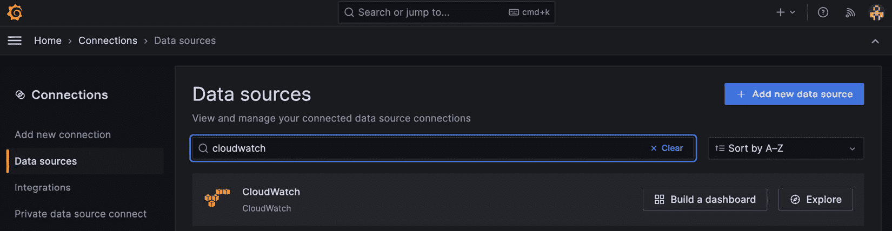

图 7.1 – Grafana 连接数据源页面

**设置**页面需要提供建立连接所需的 AWS 配置详情，如下图所示。在这里，你还可以配置自定义指标的命名空间详情、日志查询超时以及 X-Ray 跟踪链接：

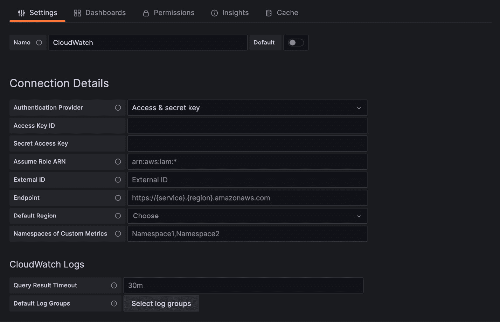

图 7.2 – 亚马逊 CloudWatch 数据源设置

### 使用亚马逊 CloudWatch 查询编辑器

CloudWatch 数据源配备了专门的查询编辑器，可以查询来自 CloudWatch 指标和日志的数据。

在数据浏览器中，你可以选择**CloudWatch 指标**或**CloudWatch 日志**作为源数据，如下图所示：

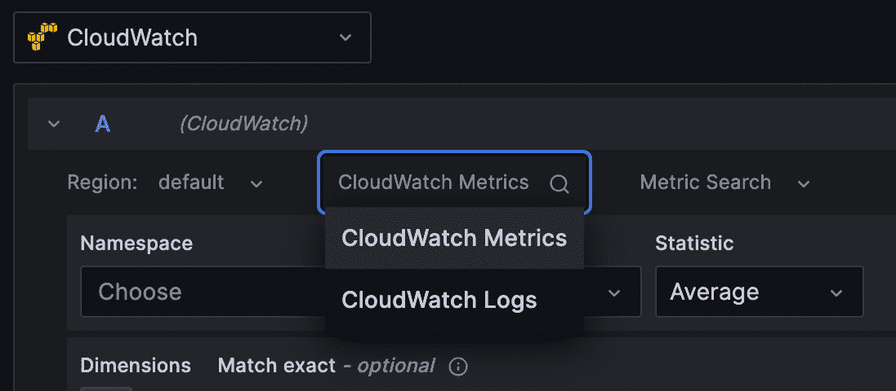

图 7.3 – 亚马逊 CloudWatch 查询编辑器

在**构建器**模式下使用指标编辑器，你可以通过指定命名空间、指标名称和至少一个统计数据来创建有效的指标查询。

日志编辑器提供了一个**日志组**选择器，允许你指定目标日志组，然后在查询编辑器中使用 AWS CloudWatch Logs 查询语言 [`docs.aws.amazon.com/AmazonCloudWatch/latest/logs/CWL_QuerySyntax.html`](https://docs.aws.amazon.com/AmazonCloudWatch/latest/logs/CWL_QuerySyntax.html)。

### 使用亚马逊 CloudWatch 仪表板

在数据源**设置**页面上，有一个**仪表板**标签，提供了一些预配置的仪表板，帮助你快速入门。

下图显示了可用仪表板的列表及导入详情（如果已经导入了仪表板，你将看到删除或重新导入的选项）：

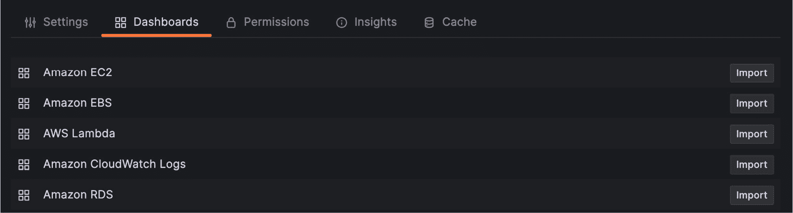

图 7.4 – 亚马逊 CloudWatch 预配置仪表板

现在让我们来看一下 AWS 集成选项。

## 探索 AWS 集成

AWS 集成选项可以添加到你的账户中。添加并配置后，它将作为连接可用。配置后，你将能够直接将指标和日志数据导入到 Grafana，因为数据保存在你的 Grafana Cloud 堆栈中，这为查询提供了时间优势。然后可以使用 LogQL 或 PromQL 查询这些指标和日志；有关详细信息，请参见 *第四章* 和 *第五章*。

现在让我们来看看不同的配置步骤。

### 配置集成

可以从 **添加新连接** 屏幕中的 `aws` 菜单访问 AWS 连接；你将看到类似以下的屏幕。你会看到这是一个 **基础设施** 连接，并标记为 **指南**。这意味着将提供全面的说明，帮助你连接账户并引导你完成过程：

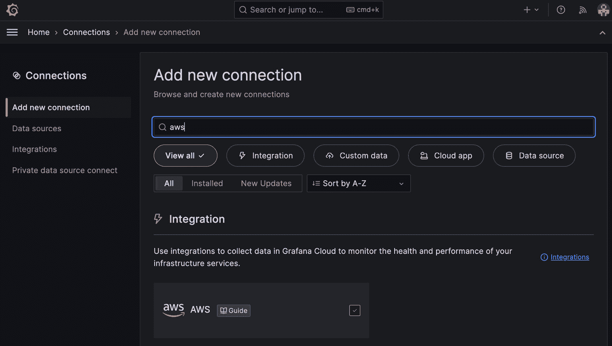

图 7.5 – Grafana 添加新连接屏幕

选择 AWS 集成选项后，会向你展示几个集成选项 —— **CloudWatch 指标**、**带 Lambda 的日志** 和 **带 Firehose 的日志** —— 如下图所示：

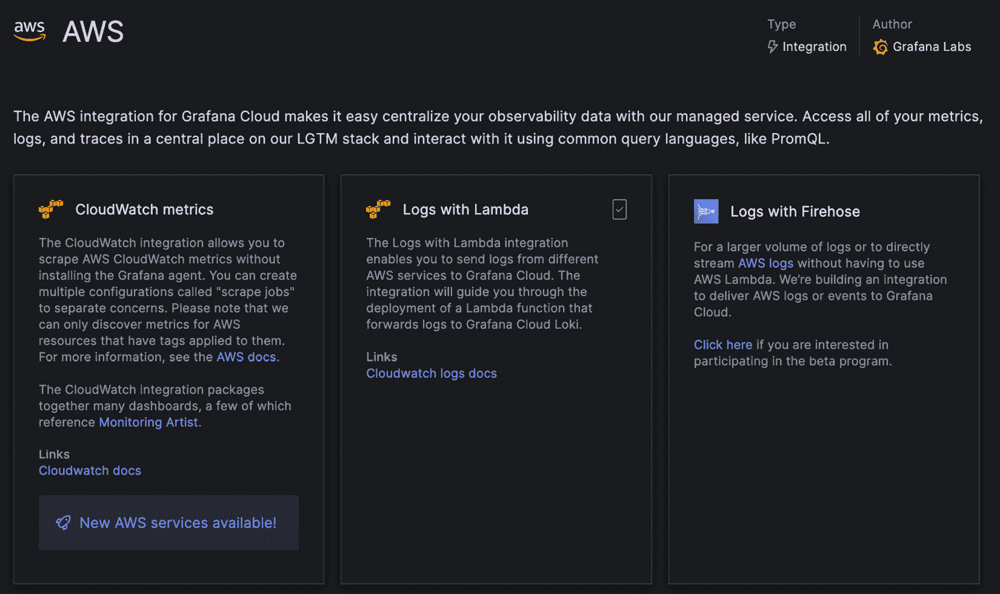

图 7.6 – AWS 集成屏幕

接下来，我们将讨论带有 Lambda 的 CloudWatch 指标和日志。

### CloudWatch 指标

CloudWatch 集成功能允许你在不安装任何收集器或代理基础设施的情况下抓取 Amazon CloudWatch 指标。可以创建多个抓取作业来分离不同的关注点，但只能为带标签的 AWS 资源发现指标。

如前所述，此集成是引导式的，提供了所有必要的细节，可以通过使用基础设施即代码或手动连接并配置抓取作业来开始。以下截图展示了 CloudWatch 指标 **配置** **详情** 屏幕：

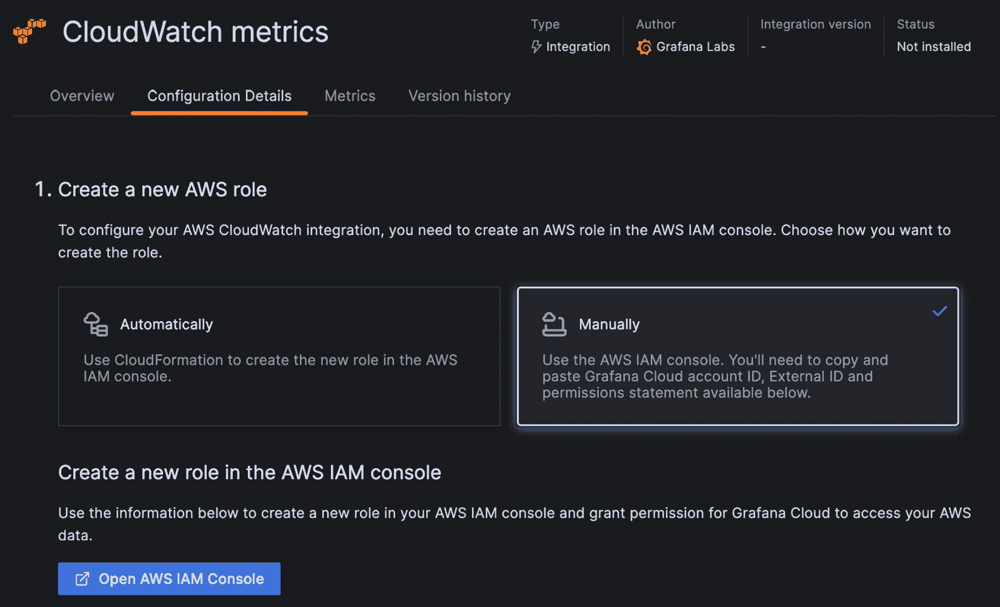

图 7.7 – CloudWatch 配置详情屏幕

此外，还有一些预构建的仪表板可以直接使用。以下图示展示了在撰写本文时与集成选项一起提供的预构建仪表板列表：

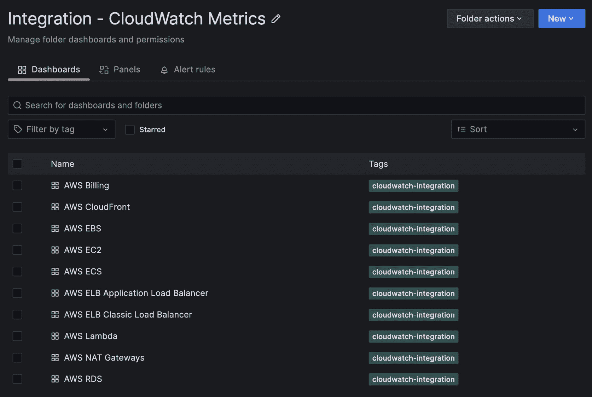

图 7.8 – 示例 CloudWatch 指标仪表板

### 带 Lambda 的日志

启用 Lambda 集成的日志功能使你能够将 CloudWatch 日志发送到 Grafana Cloud。此集成将引导你部署一个 AWS Lambda 函数，该函数将 CloudWatch 日志转发到 Grafana Cloud Loki，在那里可以使用 LogQL 进行查询。*第四章*详细解释了 Loki 和 LogQL。

以下截图展示了 **带 Lambda 的日志** 配置屏幕，在这里你可以选择部署方式：

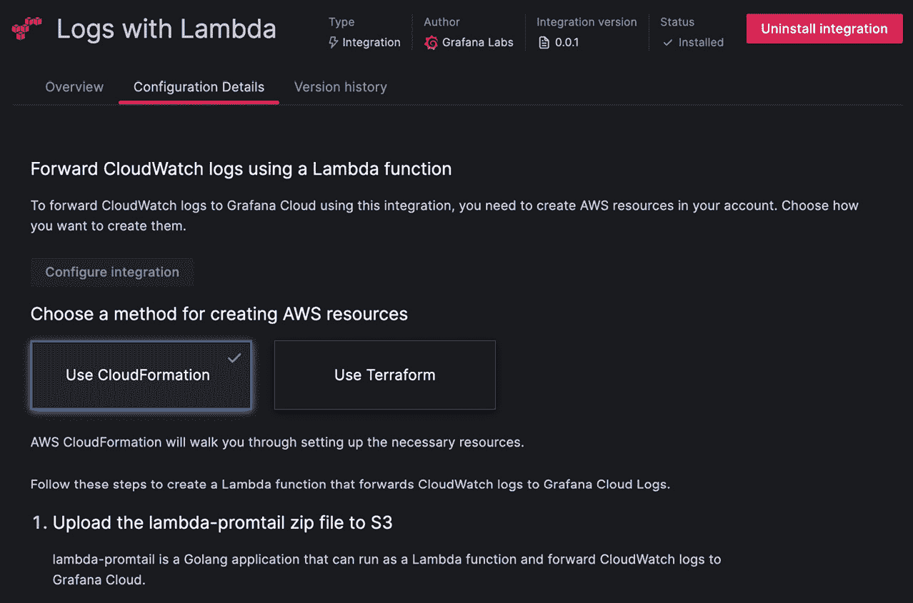

图 7.9 – 带有 Lambda 配置详情的日志

下图展示了配置步骤，屏幕上的指南会引导你完成日志集成的连接和配置：

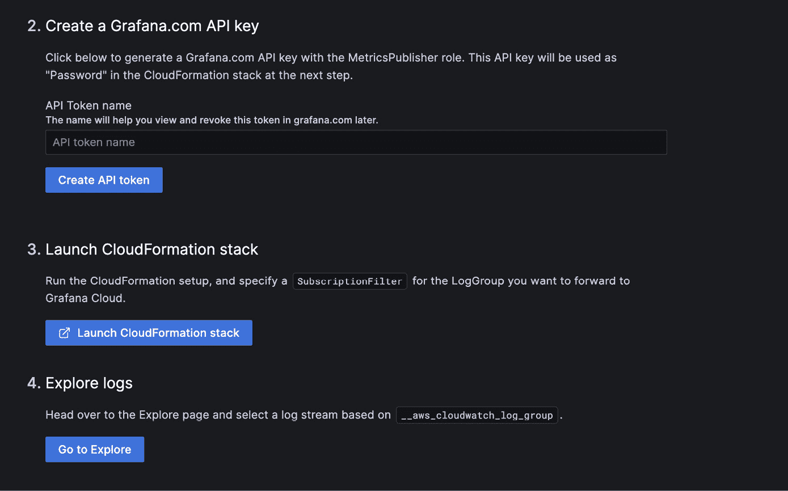

图 7.10 – 带有 Lambda CloudFormation 配置的日志

现在让我们来看一下我们的第二个云服务提供商——GCP。

# 使用 Grafana 监控 GCP

Grafana Cloud 支持**Google Cloud Monitoring**，允许你在 Grafana 仪表盘中查询、触发警报和可视化数据。它不会在 Grafana 中存储任何遥测数据；它仅在查询时提取数据。

现在让我们来看一下配置数据源的步骤。

## 配置数据源

可以通过**数据源**搜索框中的`Google Cloud Monitoring`菜单访问数据源；你将看到类似于*图 7.11*所示的屏幕。点击**Google Cloud Monitoring**以打开设置页面。设置屏幕会提示你进行 Google 配置，以建立和测试连接。下面显示的是**连接**搜索结果屏幕：

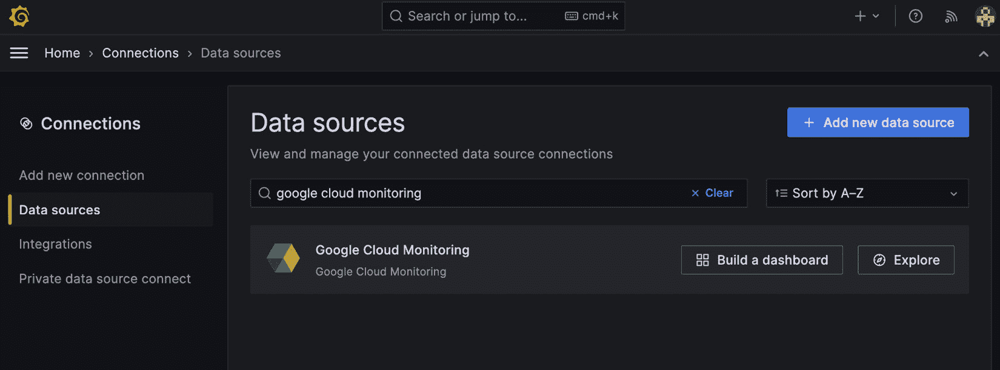

图 7.11 – 连接搜索结果屏幕

下图中的**Google Cloud Monitoring**配置设置将引导你完成配置，帮助你选择身份验证方式，可以选择**JSON Web Token**（**JWT**）或**GCE 默认** **服务帐户**：

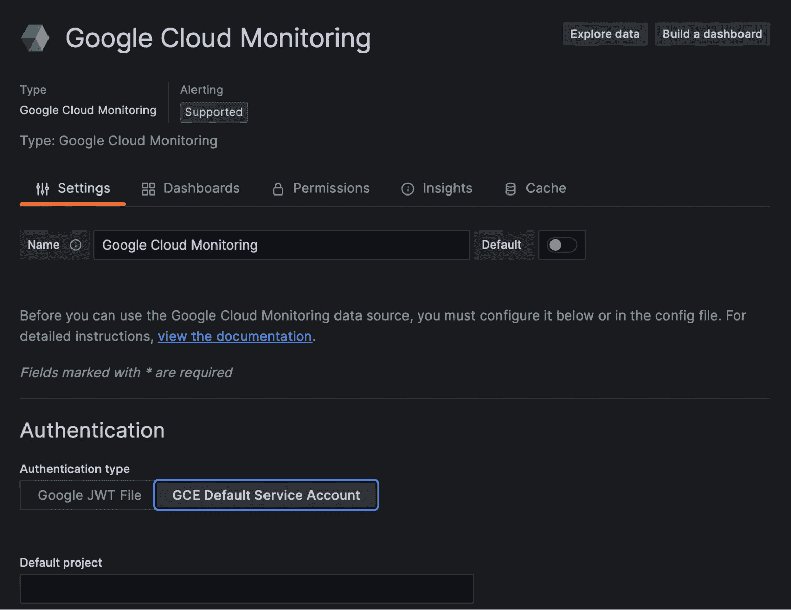

图 7.12 – Google Cloud Monitoring 配置设置

根据你的 GCP 部署规模，你可能需要在设计时考虑任何关于令牌或服务帐户的限制。

## Google Cloud Monitoring 查询编辑器

Google Cloud Monitoring 数据源自带有一个专用的查询编辑器，可以帮助你构建用于度量和 GCP **服务水平目标**（**SLOs**）的查询，二者都返回时序数据（你将在*第八章*中了解更多关于时序数据的可视化）。可以使用**构建器**界面或 GCP 的**监控查询语言**（**MQL**）来查询度量数据。SLO 查询构建器帮助你以时序格式可视化 SLO 数据。要了解 GCP 服务监控的基本概念，请参阅 GCP 文档，网址为 https://cloud.google.com/stackdriver/docs/solutions/slo-monitoring。

下图中的**Google Cloud Monitoring**查询编辑器显示了三个可用选项：

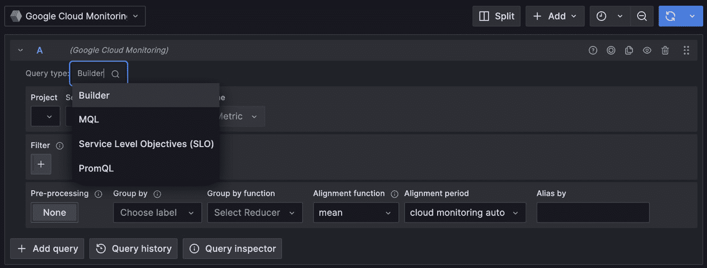

图 7.13 – Google Cloud Monitoring 查询编辑器选择

让我们来看一下不同的 Explorer 查询类型：

+   **指标查询**：指标查询编辑器构建器帮助您选择指标，通过标签和时间进行分组和聚合，并为您要查询的时间序列数据指定时间过滤器：

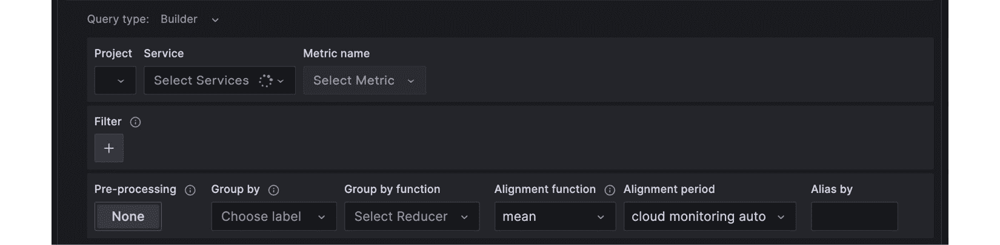

图 7.14 – Google Cloud Monitoring 查询编辑器指标构建器

以下截图展示了 MQL 查询编辑器，它提供了一个接口，用于创建和执行您的 MQL 查询：

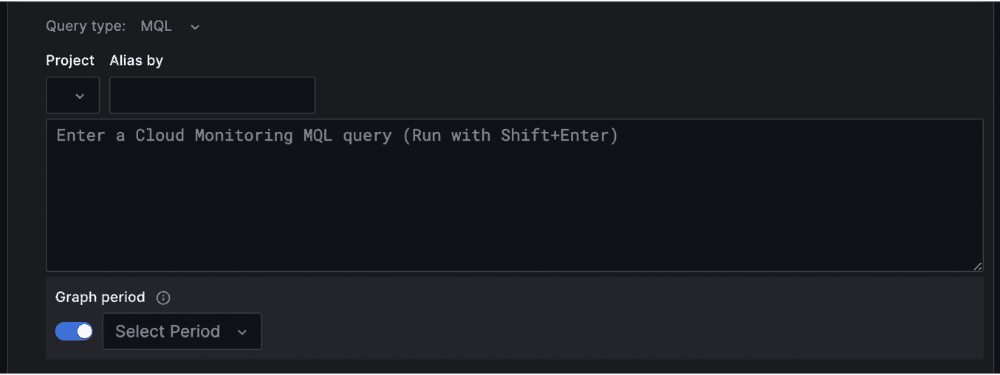

图 7.15 – Google Cloud Monitoring 查询编辑器指标 MQL 接口

MQL 语言规范的完整文档可以在 Google Cloud 网站上找到，网址为 [`cloud.google.com/monitoring/mql`](https://cloud.google.com/monitoring/mql)。

+   **SLO 查询**：SLO 查询构建器帮助您以时间序列格式可视化 SLO 数据。有关服务监控基本概念的文档，可以在 Google Cloud 网站上找到，网址为 [`cloud.google.com/stackdriver/docs/solutions/slo-monitoring`](https://cloud.google.com/stackdriver/docs/solutions/slo-monitoring)。

    以下截图展示了 Google Cloud Monitoring 的 SLO 查询编辑器：

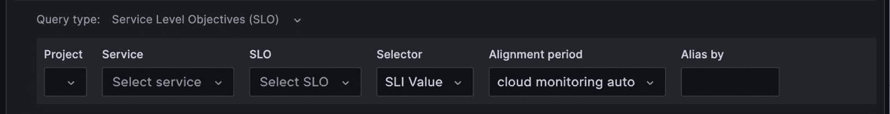

图 7.16 – Google Cloud Monitoring 查询编辑器指标 SLO 构建器

## Google Cloud Monitoring 仪表板

在 **数据源** | **设置** 屏幕中，**仪表板** 选项卡列出了帮助您入门的一组预配置仪表板。以下截图展示了撰写时可用的仪表板列表以及导入详情（如果仪表板已经导入，可以选择删除或重新导入）。从列表中，您可以看到涵盖的各种 GCP 组件，包括防火墙、数据处理、SQL 等等：

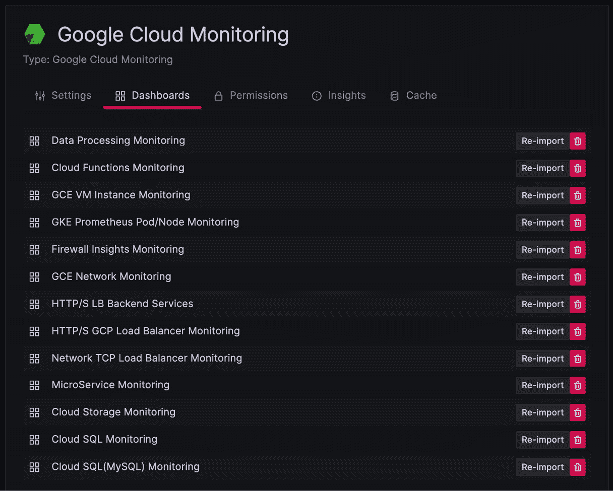

图 7.17 – Google Cloud Monitoring 预构建仪表板

现在让我们来看一下第三个云服务提供商，Azure。

# 使用 Grafana 监控 Azure

Grafana Cloud 支持 Azure，可以在 Grafana 仪表板中查询、触发警报并可视化您的数据。这被称为 **Azure Monitor** 数据源。与其他云数据源一样，它不会在 Grafana 中存储任何遥测数据；它只会在查询时检索数据。

现在让我们一步步进行配置。

## 配置数据源

可以通过 **数据源** 搜索框中的 `Azure Monitor` 菜单访问数据源；您将看到类似以下的屏幕：

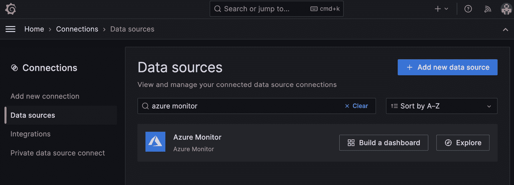

图 7.18 – Azure Monitor 的连接搜索结果屏幕

点击 **Azure Monitor** 打开设置页面。下图显示的 **Azure Monitor** 配置设置将引导您完成配置过程，帮助您通过 Azure **Client Secret** 配置设置身份验证，并测试连接：

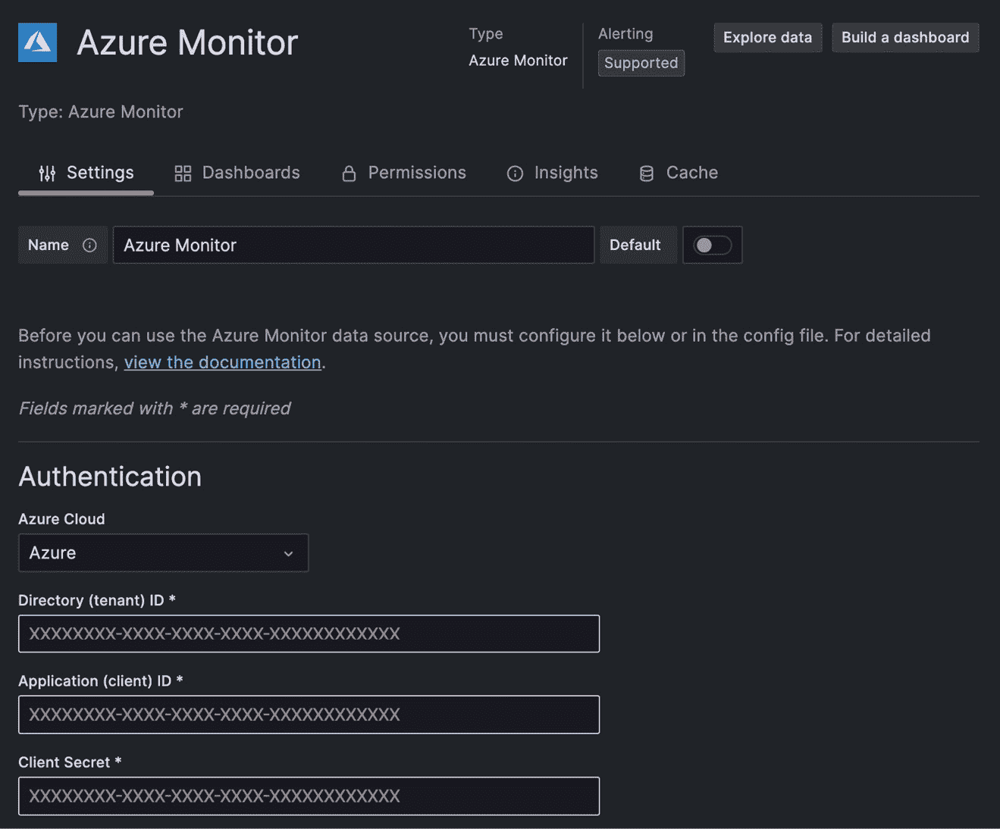

图 7.19 – Azure Monitor 数据源设置屏幕

## 使用 Azure Monitor 查询编辑器

Azure Monitor 数据源配备了专门的查询编辑器，帮助您构建针对度量、日志、Azure 资源图和应用程序洞察跟踪的查询。

以下是 Azure Monitor 查询编辑器的截图，展示了四个选择：

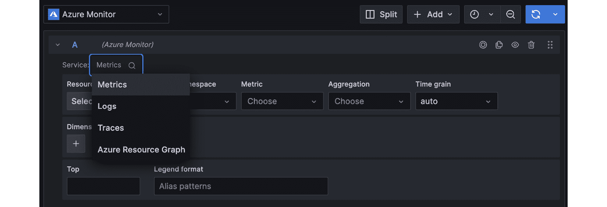

图 7.20 – Azure Monitor 查询编辑器选择器

让我们详细看看这些选项：

+   **度量查询**：Azure Monitor 度量查询从 Azure 支持的资源中收集数字数据，这些资源可在 Microsoft Azure 网站上找到：[`learn.microsoft.com/en-us/azure/azure-monitor/monitor-reference`](https://learn.microsoft.com/en-us/azure/azure-monitor/monitor-reference)。

    度量只存储数字数据，并以特定的结构存储，这使得近实时检测平台健康状况、性能和使用情况成为可能。Azure Monitor 度量查询构建器如下所示：

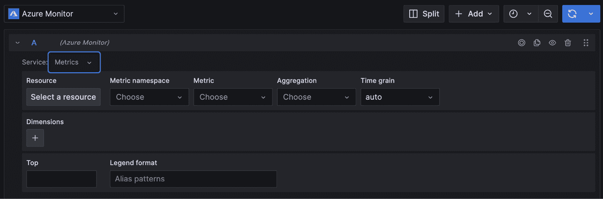

图 7.21 – Azure Monitor 度量查询构建器

+   **日志查询**：Azure Monitor 日志查询从 Azure 支持的资源中收集和整理日志数据。可以访问各种数据类型，每种类型都有其定义的结构，并且可以使用 **Kusto 查询语言**（**KQL**）进行访问。KQL 的概述可以在 Microsoft Azure 网站上找到：[`learn.microsoft.com/en-us/azure/data-explorer/kusto/query/`](https://learn.microsoft.com/en-us/azure/data-explorer/kusto/query/)。下图显示了 Azure Monitor 日志查询编辑器：

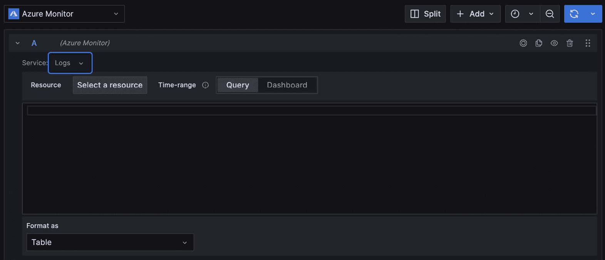

图 7.22 – Azure Monitor 日志查询编辑器

Azure Monitor 日志可以存储多种数据类型，每种类型都有自己的结构。更多详细信息，请参考 [`learn.microsoft.com/en-us/azure/azure-monitor/monitor-reference`](https://learn.microsoft.com/en-us/azure/azure-monitor/monitor-reference)。

+   **跟踪查询**：Azure Monitor 跟踪查询可以看作是 Azure 应用程序洞察的底层实现。Azure 应用程序洞察服务为其工作负载提供**应用程序性能监控**（**APM**）功能。Azure Monitor 跟踪可以用来查询和可视化各种度量和跟踪数据。查询编辑器的界面如下所示：

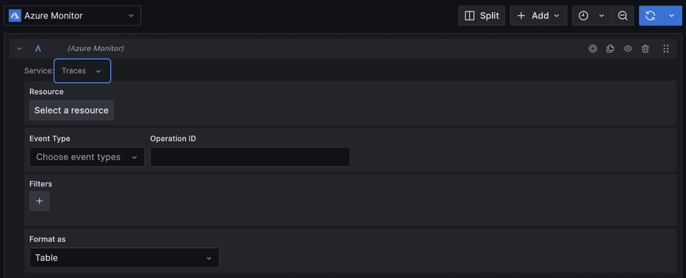

图 7.23 – Azure Monitor 跟踪查询编辑器

+   **Azure 资源图**（**ARG**）：ARG 服务通过提供跨多个 Azure 订阅进行可扩展查询的功能，扩展了 Azure 资源管理器的功能。这使得使用资源图查询语言查询 Azure 资源成为可能，非常适合查询和分析较大的 Azure 云基础设施部署。有关资源图查询语言的完整文档，请访问 [`learn.microsoft.com/en-us/azure/governance/resource-graph/samples/starter?tabs=azure-cli`](https://learn.microsoft.com/en-us/azure/governance/resource-graph/samples/starter?tabs=azure-cli)。

    以下示例查询显示按名称列出的所有资源：

    ```
    Resources | project name, type, location | order by name asc
    ```

    下面是 ARG 查询编辑器的界面：

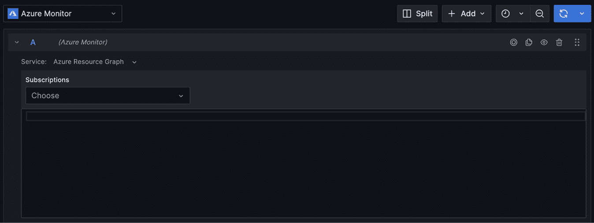

图 7.24 – Azure Resource Graph 查询编辑器

## 使用 Azure Monitor 仪表板

在 **数据源** | **设置** 屏幕中，**仪表板** 选项卡显示了一组预配置的仪表板，帮助你快速开始使用 Azure Monitor。在以下截图中，列出了为其设计了仪表板的各种 Azure 组件，包括应用程序、SQL 服务器和存储帐户：

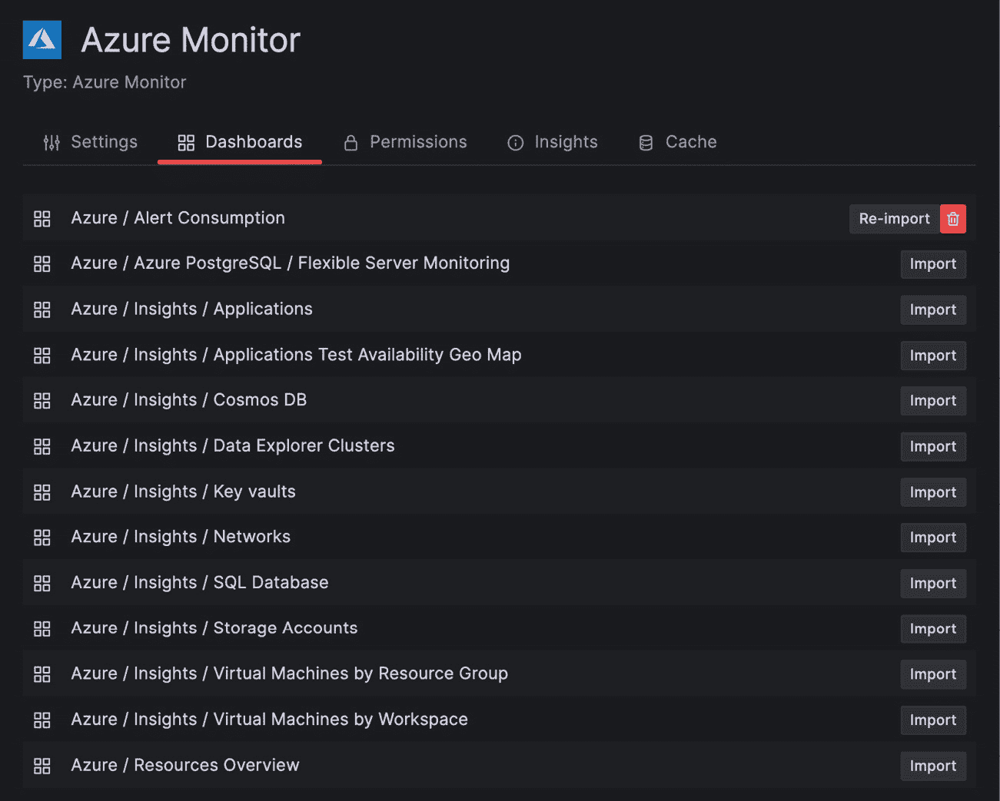

图 7.25 – Azure Monitor 预构建仪表板

现在，让我们回顾一下本章中我们为每个云基础设施提供商介绍的最佳实践。

# 最佳实践和方法

本章提供了几种流行的云基础设施的概述。接下来，我们将讨论在任何应用程序或系统中实施可观察性时应考虑的一些最佳实践：

+   **性能**：检索遥测数据的过程可能会带来性能开销。例如，使用远程 Grafana 数据源时，遥测数据会在查询时通过较远的距离进行获取。与使用诸如 Loki、Mimir 和 Tempo 等 Grafana Cloud 数据源，在距离 Grafana 查询引擎较近的地方存储数据相比，这可能会引入延迟。如果性能至关重要，并且有选项将遥测数据传输到 Grafana，那么这可能是最佳选择。或者，许多数据源都提供缓存选项来提高查询速度；通过特定配置也可以改进查询速度。花时间理解你的数据，并确保以最佳方式使用它。

+   **成本**：除了将数据传输到 Grafana Cloud 增加的网络和存储成本外，在查询云提供商 API 时也可能产生费用。了解费用产生的地方非常重要，这可以确保在为你的系统设计可观察性解决方案时考虑到这些费用。

+   **限制**：通常，基础设施平台会配置一些限制以保护系统。这些有时是可以在谨慎考虑后放宽的软限制，但也可能是硬限制。在为特定平台选择解决方案之前，了解你的需求以及预期的数据量或查询事务量。你可以将这些与任何文档中列出的限制、API 密钥的使用情况或网络出站流量进行比较，从而验证系统是否能满足你的需求。

+   **安全性**：在本章中讨论的大多数配置选项，我们已识别出它们如何设置以实现关注点分离。通过拥有独立的数据源或对查询或摄取的数据进行其他控制，可以基于底层数据和用例提升安全防护水平。

重要提示

当本书即将出版时，Grafana Labs 发布了**私有数据源连接**（**PDC**），使管理员能够连接到任何网络安全的数据源，无论其托管在哪里。我们未在本书中涵盖这一主题，但它可能会引起读者的兴趣。

我们现在将通过总结来结束本章，并为下一章做好铺垫。

# 总结

在本章中，我们查看了各种常见的云基础设施提供商，从 Kubernetes 开始，并展示了可以与本书附带的示例项目一起使用的示例。接着，我们介绍了三大云提供商：AWS、GCP 和 Azure。我们提供了连接选项的概述，并展示了如何使用预构建的仪表板和数据探索器入门。最后，我们介绍了一些在所有可观测性集成中需要考虑的最佳实践。

在下一章中，我们将从将遥测数据导入 Grafana 转到使用仪表板可视化数据。这才是有趣的开始！

# 第三部分：Grafana 实践

在实践中，Grafana 被用于了解当前系统状态，并采取适当的行动为客户提供最佳结果。本部分将涵盖为实现这一目标可能需要的各种活动，并且在过程中应考虑的事项。你将学习如何展示数据，同时考虑受众的需求。你将探索如何建立一流的事件管理流程。你还将了解自动化和构建可观测性平台的策略。

本部分包含以下章节：

+   *第八章**，使用仪表板展示数据*

+   *第九章**，使用警报管理事件*

+   *第十章**，使用基础设施即代码进行自动化*

+   *第十一章**，构建可观测性平台架构*
