# 第八章：使用仪表板显示数据

现在，我们已经一起探索了前几章所涉及的主题，并且对如何从 Grafana 中获取可访问的数据有了很好的理解。接下来，我们将一起创建我们的第一个**仪表板**，并查看可视化数据的不同方式。然后，我们将探索一些帮助你有效与仪表板沟通的概念和技巧，减少观众的认知负担。我们还将浏览一些社区资源，为你的仪表板提供灵感。最后，我们将分享一些管理仪表板制品的指导，帮助你在仪表板发展壮大的过程中保持组织性。

本章将涵盖以下主要内容：

+   创建你的第一个仪表板

+   进一步开发你的仪表板

+   在 Grafana 中使用可视化

+   定义仪表板的目的

+   高级仪表板技巧

+   管理和组织仪表板

+   案例研究 – 整体系统视图

# 技术要求

在本章中，你将使用 Grafana Cloud 实例的 Grafana 用户界面，并使用在*第三章*中设置的演示。此外，为确保你拥有所有数据源和设置，请确保已经在*第六章*中对你的堆栈进行了更新。让我们开始创建第一个仪表板吧。

# 创建你的第一个仪表板

仪表板是向用户传达重要且有时紧急信息的一种方式。在我们深入讨论设计技巧和最佳实践之前，让我们先熟悉一下 Grafana 的用户界面，开始创建一个简单的仪表板。我们在本书中使用的示例应用程序有一个前端商店；让我们来看一下我们从购物车 API 获取的请求数据。

要创建你的第一个面板和仪表板，请按照以下步骤操作：

1.  在你的 Grafana 实例中，选择菜单中的**Explore**。

1.  选择你的 Prometheus 数据源，这将标记为**grafanacloud-<team>-prom（默认）**。

1.  在**Metric**下拉菜单中，选择**app_frontend_requests_total**（前端应用程序的请求计数），在**Label filters**下拉菜单中，选择**target = /api/cart**作为过滤器（以限制结果仅显示购物车 API 的请求），然后点击**运行查询**。你应该会看到类似的数据：

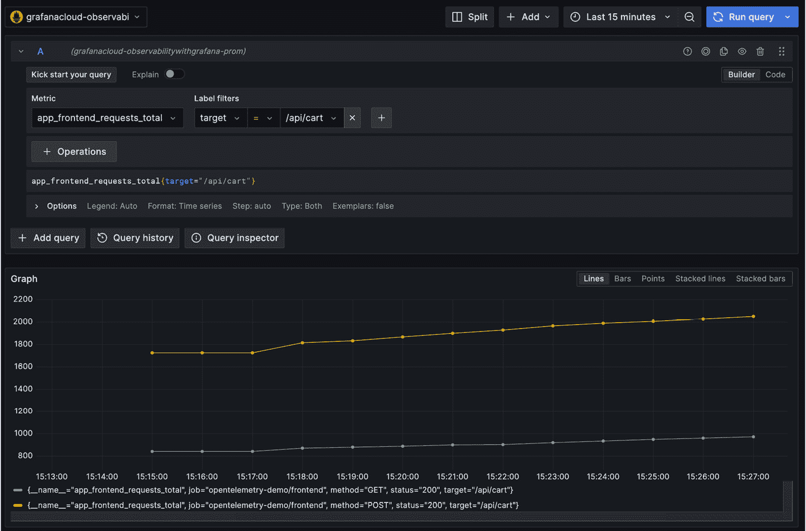

图 8.1 – 应用前端请求

我们现在已经将时间序列数据呈现为图表。

1.  要将此内容添加到仪表板中，在**Explore**窗口顶部选择**添加**下拉菜单按钮。

1.  选择**添加** **到仪表板**：

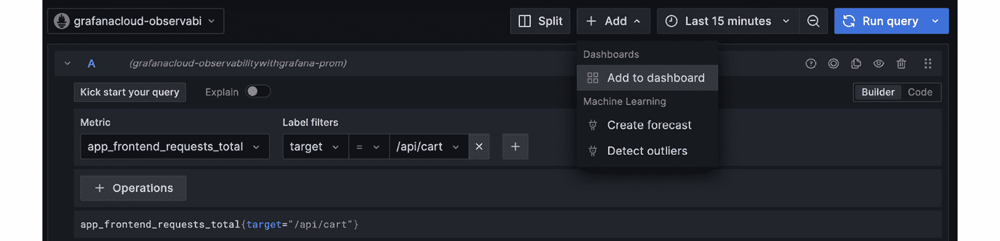

图 8.2 – 添加到仪表板菜单

1.  在弹出窗口中，确保选择了**新建仪表板**，然后点击**打开仪表板**：

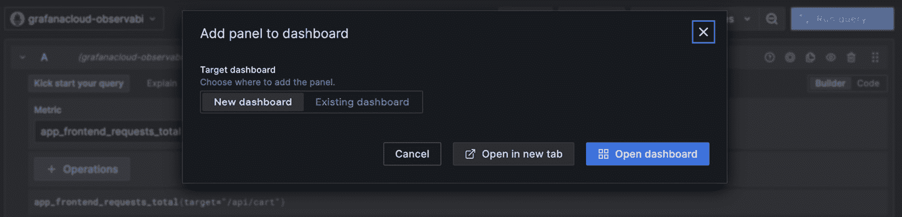

图 8.3 – 添加面板到仪表板

你现在将在屏幕上看到新的仪表盘及其第一个面板。正如你所见，这里有一些问题——图例难以阅读，数据没有太大意义，而且面板标题与数据无关：

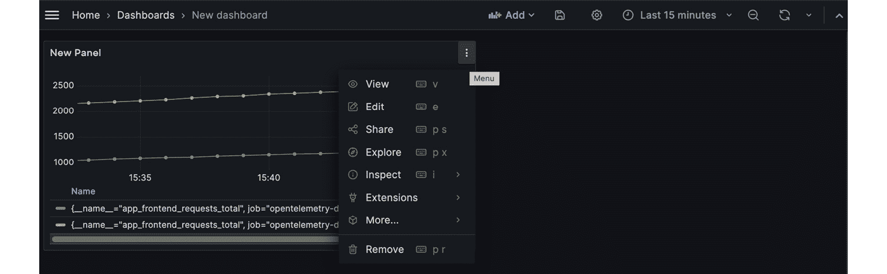

图 8.4 – 新仪表盘视图

1.  让我们进行一些小改动，稍微改进一下。从三点下拉菜单中选择**编辑**。面板编辑器将出现；你应该会看到如下内容：

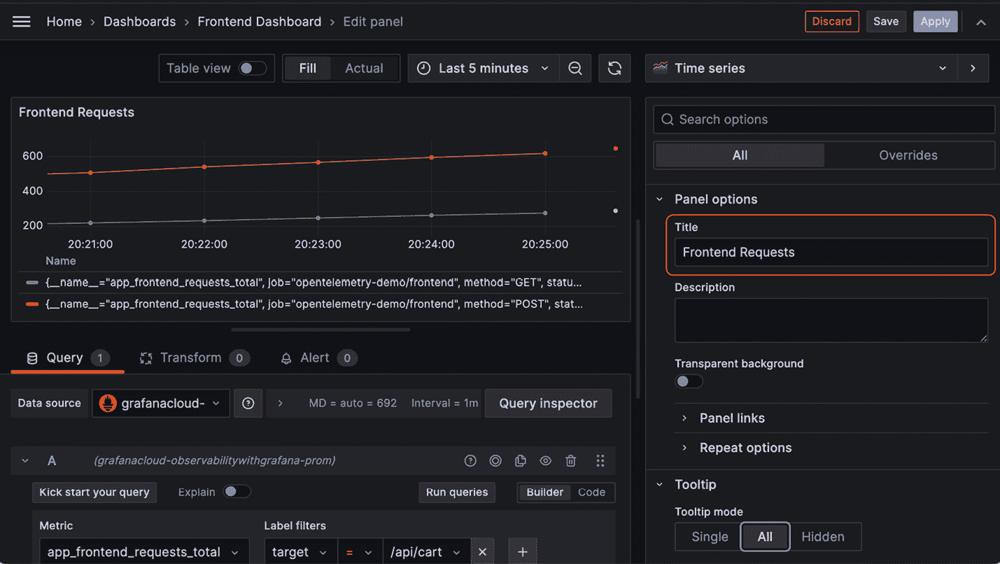

图 8.5 – 面板编辑器

1.  给面板起一个有意义的名称。我们在**标题**字段中输入了`前端请求`：

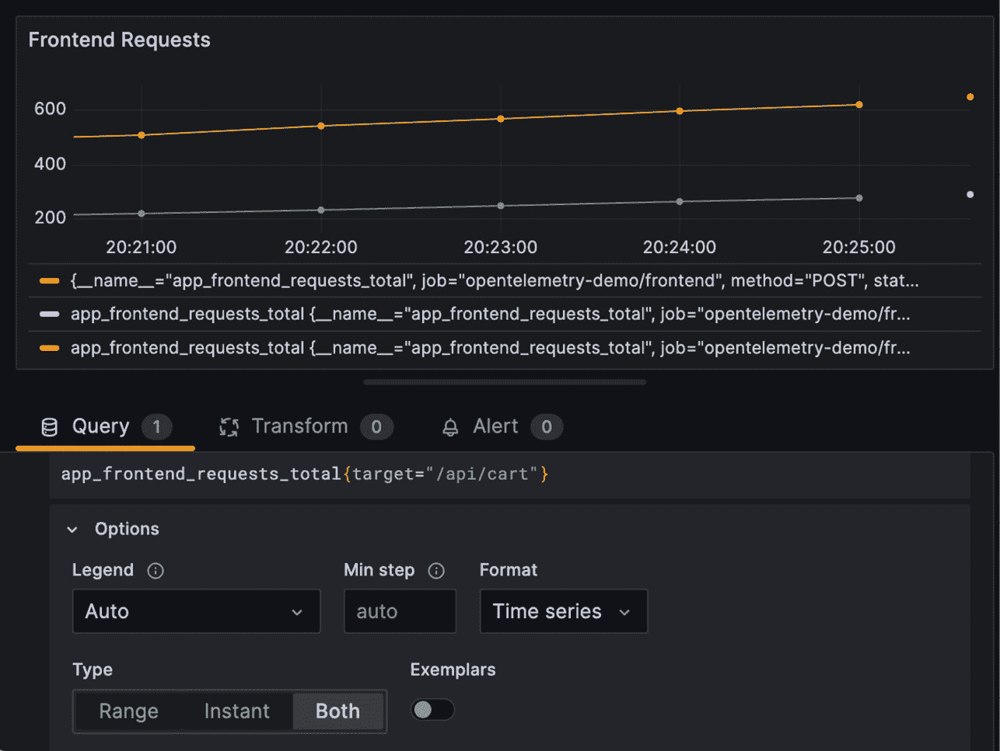

图 8.6 – 查询选项

1.  默认情况下，图表将显示来自**范围**和**即时**查询的数据，这在时间序列可视化中可能看起来很奇怪，因为你会看到时间线和单独的单值。将**类型**更改为仅**范围**。

1.  点击**应用**按钮更新面板并返回仪表盘：

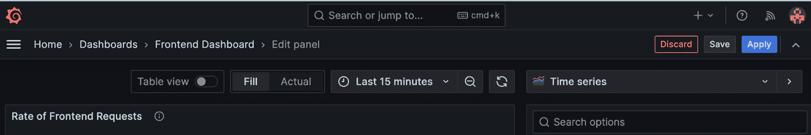

图 8.7 – 面板应用按钮

1.  你现在将看到仪表盘面板名称应用于所显示的指标。点击仪表盘菜单栏上的保存图标：

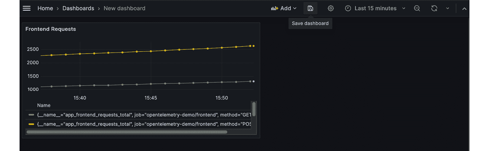

图 8.8 – 保存仪表盘

1.  给你的新仪表盘起一个有意义的名称，能够反映它的目的；我们这里有一个`前端仪表盘`。

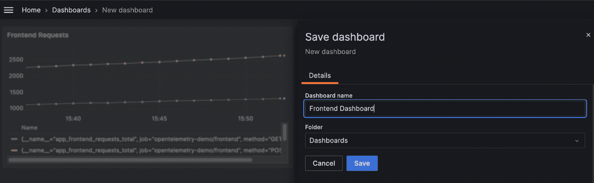

图 8.9 – 保存仪表盘面板

现在我们有了第一个仪表盘，但它非常简单，只有一个面板。它并没有有效传达太多信息，仅凭前端请求数量并不能显示我们在线商店的状况。让我们探索一下还能做些什么来改进它。

# 进一步开发你的仪表盘

现在让我们进一步开发仪表盘，并改进我们共享的信息。将仪表盘视为一个可以反复迭代的工作进展，并随着信息传达的完善而不断优化，这是确保准确传达信息的关键。在本节中，我们将使用一个示例，其中前端应用程序的请求数量不断增加，但这并不能告诉我们太多信息。显示这些请求的速率更加合理，因为我们将能够看到它们在应用程序中的到达速度。现在让我们进行这个修改：

1.  从面板的三点下拉菜单中选择**编辑**，你将看到如下界面：

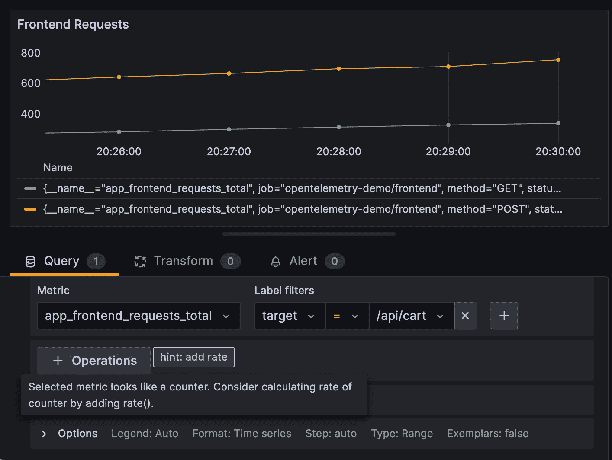

图 8.10 – 面板编辑器

1.  在面板编辑器中，我们可以看到查询构建提示我们添加速率；它被蓝色框高亮显示。点击此提示，将建议的聚合添加到现有查询中（如果提示未出现，请点击**操作**按钮，选择**速率**，并设置**$__rate_interval**的范围）：

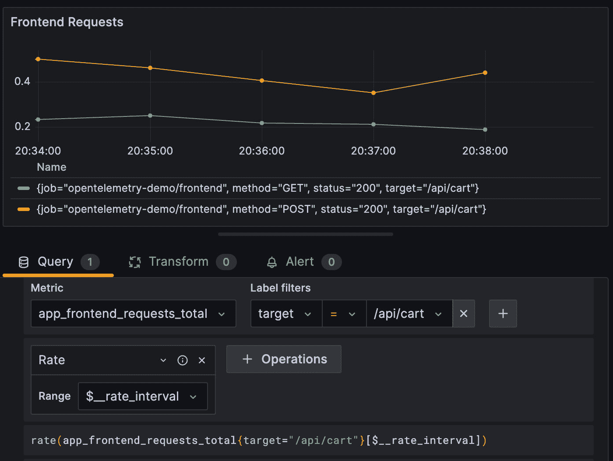

图 8.11 – 速率查询

如你所见，图表现在显示了每秒进入我们商店的前端**GET**和**POST**请求的数量。这比之前更有用，但图例有些混乱，所以我们来清理一下。

1.  展开位于 PromQL 查询预览下方的**选项**部分。

1.  替换`{{method}}`的内容，如*图 8.12*所示；这将从方法标签中提取值，作为图表图例的值。

1.  在此期间，我们还可以将标题更改为反映我们现在显示的是速率，而不是计数，并添加一个有意义的描述，如下图所示：

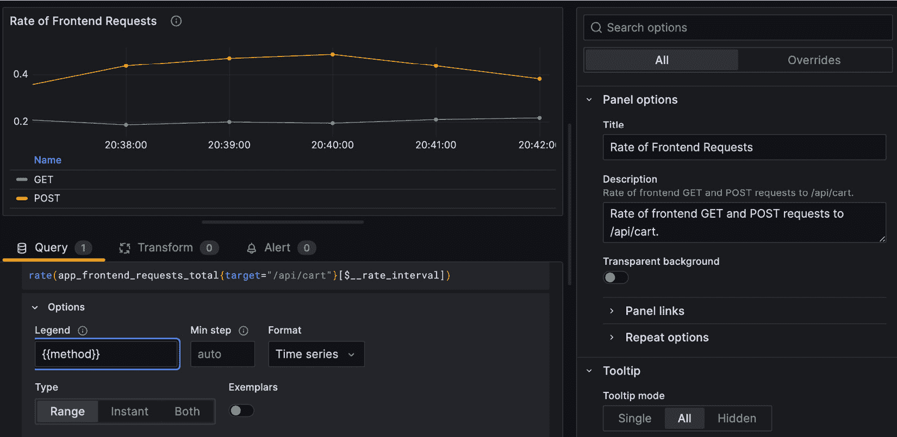

图 8.12 – 面板更新

1.  再次点击**应用**按钮更新面板并返回仪表盘。你应该会看到像下面这样的仪表盘：

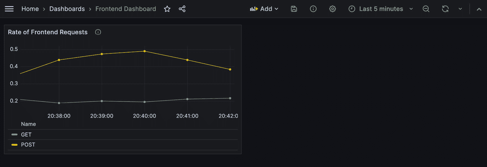

图 8.13 – 我们的第一个仪表盘

如我们在前面的截图中所见，现在我们已经有了一个有意义的展示，展示了进入前端 API 的**GET**和**POST**请求的速率。仪表盘和面板的名称很好地反映了它们的目的，并且面板旁边还有一个新的**i**图标，当你将鼠标悬停在上面时，会显示你添加的描述。

现在，让我们看看 Grafana 中可用的可视化以及如何使用它们。

# 在 Grafana 中使用可视化

Grafana 提供了多种可视化选项，以支持你的各种使用场景和数据格式。例如，对于计数器和仪表量度类型，你可以使用**Stat**或**Gauge**可视化，直方图可以使用**条形图**或**仪表图**。日志可以使用表格可视化呈现，或者通过在时间序列图中生成来自日志的指标。你可以在 Grafana 网站上找到最新的插件可搜索列表：[`grafana.com/grafana/plugins/panel-plugins/`](https://grafana.com/grafana/plugins/panel-plugins/)。一个很好的地方是 [`play.grafana.org`](https://play.grafana.org)，你可以在这里尝试它们并获取可以在你自己仪表盘中使用的创意，网站上有所有面板可视化的仪表盘示例，以及各种数据类型。

要在面板编辑器中更改面板的可视化，你可以使用可视化选择器，位于右上角。选择它将显示一个可搜索的列表，并附带可视化的图形表示。你可以在以下截图中看到这一点：

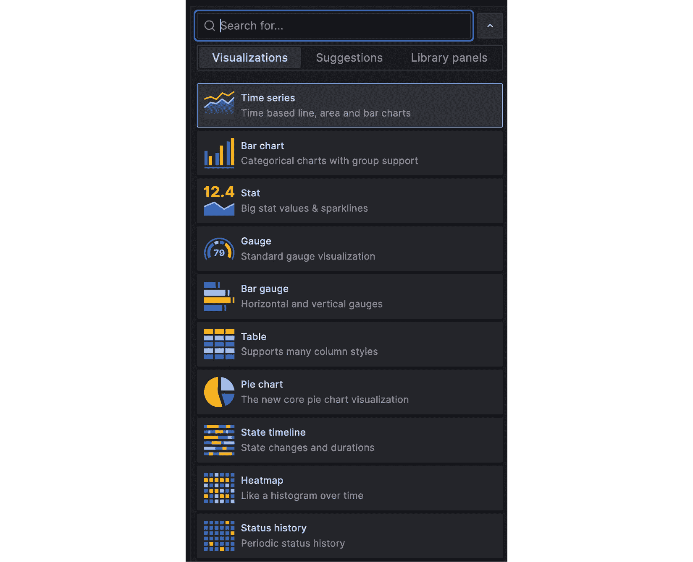

图 8.14 – Grafana 可视化

让我们在我们的第一个仪表盘上尝试这个：

1.  从面板的三点下拉菜单中，选择**编辑**。

1.  从面板可视化列表中选择**Stat**。你应该会看到仪表盘面板变化，类似于以下样子：

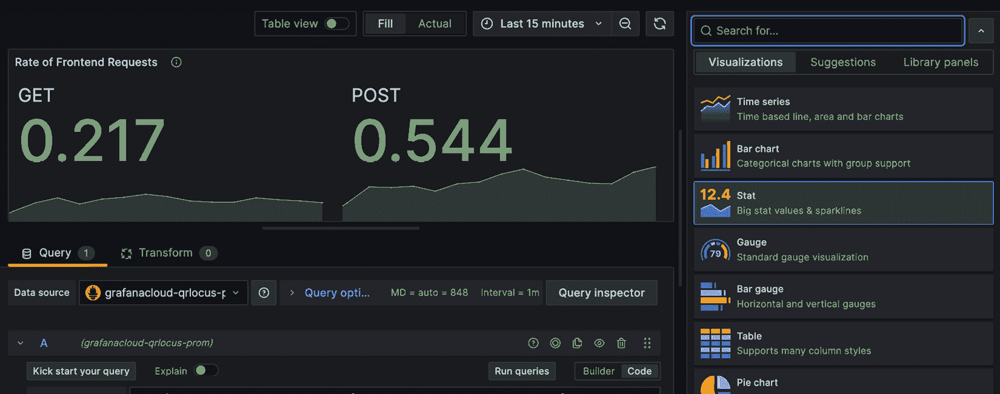

图 8.15 – 状态可视化

为了更好地理解可用的选项，花点时间尝试不同的可视化效果，或花时间在 Grafana Play 上浏览那里的示例。一旦你了解了可用的可视化效果以及每个面板的不同配置，设计自己的仪表盘将变得更加轻松。

一个典型的面板配置通常包含以下项：

+   **标题和描述**：标题应帮助人们理解展示的数据，而描述则应补充或美化标题。

+   **图例配置**：图例应帮助解释展示的数据，并提供上下文和清晰度。它可以格式化以支持视觉处理数据，并且能够与视图互动，过滤数据以显示选中的项。

+   **标准选项设置**：用于控制单位、最大值和最小值、小数位数、显示名称以及配色方案的选项。

+   **面板特定选项设置**：每个可视化面板都可以有自己的面板配置。

+   **阈值**：这些用于控制显示的颜色、背景或数值，依据是否达到或超过数据阈值。

+   **覆盖项**：可以对数据应用自定义可视化设置，格式化并改变展示方式——例如，移除小数并显示单位标识符。

+   **值映射**：这些类似于覆盖项，用来改变数据的视觉表现。它们可以用来将返回的数值替换为基于数据匹配（包括范围和正则表达式）的颜色或数值，从而改变视觉呈现。

花时间熟悉一些主要可视化面板的配置，会增强你为用户构建和展示数据的信心。

现在让我们看一下几个设计概念，帮助你更有效地展示数据。

# 开发仪表盘的目的

在创建仪表盘时，非常重要的一点是它必须有一个明确的目标。你可以问自己三个关键问题，帮助你识别这些目标并得到答案：

+   目标用户是谁？

+   他们的需求是什么？

+   仪表盘将在哪里查看（大屏幕还是手机）？

一个仪表盘必须讲述一个故事或回答一个问题，但在回答这些问题之前，我们不能做任何事情。让我们参考*第一章*中介绍的角色，思考需要仪表盘的人群、他们的需求以及他们将在哪里查看仪表盘：

|  | **角色** | **需求** |
| --- | --- | --- |

|  | Diego 开发者 | 获取我开发的系统中流量的洞察。这将帮助我了解客户如何使用我们的产品，并帮助我改进产品。通常，我需要调查错误，并深入挖掘错误的更多细节。 |

|  | Ophelia 操作员 | 事件发生时的问题可见性，系统状态通过清晰的指示器和颜色表示。信息需要简单易懂，一目了然。仪表板通常会显示在大屏幕上，但如果我正在调查一个问题，它也需要在我的电脑上显示。 |

|  | Steven 服务经理 | 总体而言，这是一个系统视图，帮助我看到更广泛的全貌。如果出现问题，我需要信息来识别谁能解决它。我将在电脑上查看这些信息。 |

|  | Pelé 产品经理 | 清晰而全面的度量标准，展示了我们的产品如何使用以及使用了哪些设备。我将在电脑上查看这些数据，通常我还想将其导出为电子表格以便进一步分析。 |

|  | Masha 经理 | 聚合数据对我很有用，展示了恢复率和容量的趋势，帮助我提前做好计划。我将在电脑上查看这些数据，但通过电子邮件接收定期的 PDF 报告也很有帮助。 |

表 8.1 – 仪表板用户与需求

捕捉最终用户需求并通过你创建的仪表板提供这些需求，将确保从你的可观察性平台中获取价值并提高用户采纳率。一旦你拥有了用户需求并分析了数据（以便了解哪些信息是重要的），你就可以开始整理你的仪表板。我们说是“整理”而不是“创建”，因为你要记住，你是在创建一个用来回答问题的工具，这个过程需要时间。在制作每个仪表板的过程中，不要害怕尝试不同的风格、布局和可视化效果。确保在不同的展示需求下进行测试；无论是大型墙面屏幕显示，还是电子邮件中的 PDF 文件，你都需要确认它的显示效果正确。

让我们来看看一些有助于展示的技巧。

# 高级仪表板技巧

为了有效地与我们的仪表板进行沟通，我们可以使用布局和一些技术特性来提升我们的表现。让我们开始详细了解其中的一些技巧：

+   **布局技巧**：为了有效地传达信息，你需要考虑一些布局技巧，这些技巧能真正让你的信息脱颖而出。包括以下几点：

    +   在**概览**面板中使用简短的标题，以使其更加清晰易读。

    +   添加描述，说明如何使用这些信息以及它的目标用户是谁，以便为用户提供最佳的理解数据的机会。

    +   使用**Stat**带有小趋势图的可视化来突出显示关键指标，并将它们放在仪表板的顶部。

    +   将面板以网格形式呈现，视觉上引导观众浏览你的仪表盘并控制他们的焦点。

    +   不要将太多面板塞入一个仪表盘中，这样会让内容难以消化。相反，使用数据链接到其他仪表盘，并将数据分隔开。

    +   使用透明面板在仪表盘上引入视觉间距，帮助突出关键信息。

    +   使用行将相关面板和数据分组在一起，创建数据的上下文。

    +   使用行的折叠功能来隐藏仪表盘加载时的某些数据；这也有助于性能，因为在行展开之前不会运行那些查询。

    +   将相似的可视化项分组，使仪表盘更容易阅读，这样有助于处理所呈现的数据。

+   `now-15m` 显示过去 15 分钟的数据。

+   使用转换来将数据以更易消化的格式呈现。**转换** 标签和可用的转换方法在下图中显示：

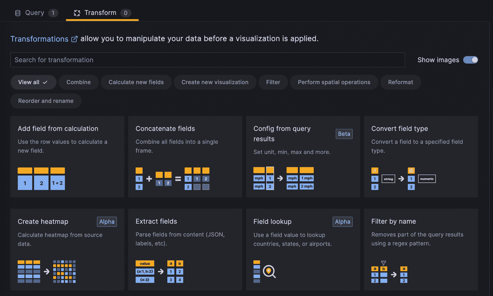

图 8.16 – 转换选择屏幕

+   使用注释；用来自其他数据源的丰富事件或甚至手动注释标记图表上的关键点，以传达重要事件：

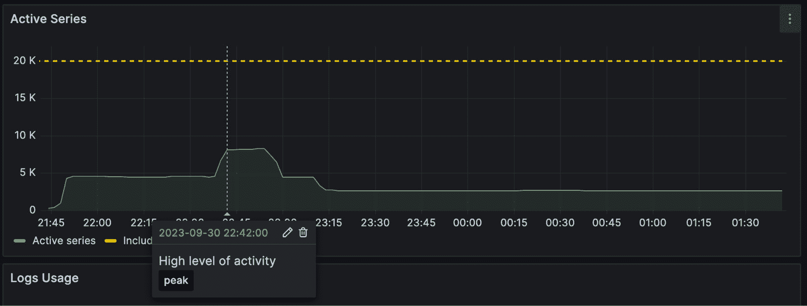

图 8.17 – 注释

现在让我们来看一下如何开发一些良好的实践，来保持对仪表盘的控制。

# 管理和组织仪表盘

随着仪表盘和使用它们的团队数量增加，你将需要一种更轻松的管理方式。Grafana 提供了文件夹、标签和权限，使我们能够更好地组织。你可以从主 **仪表盘** 屏幕创建文件夹、移动和删除仪表盘，并对它们进行加星标记，正如下图所示：

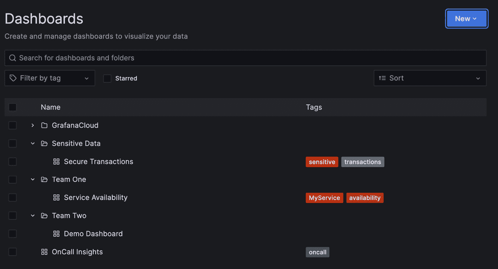

图 8.18 – 仪表盘屏幕

从仪表盘 **设置** 屏幕，你可以为单个仪表盘添加或移除标签，如下图所示：

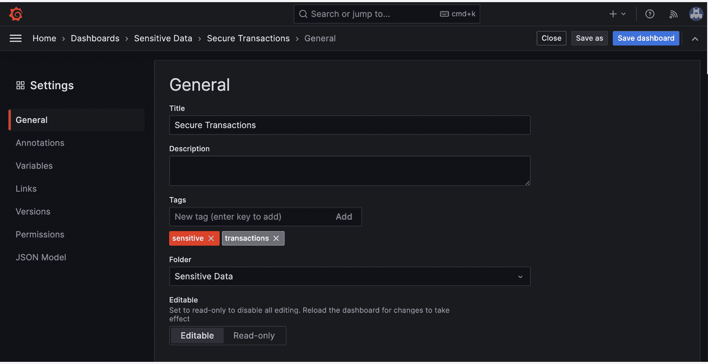

图 8.19 – 仪表盘设置

让我们看看可用的文件夹、标签和权限设置：

+   **文件夹**：

    +   提供简便的组织和分组方式

    +   通过在文件夹级别划分权限来增强安全性

+   **标签**：

    +   在搜索相关仪表盘时非常有用

    +   使用颜色编码便于视觉识别

+   **权限**：

    +   控制对文件夹及其仪表盘的访问

    +   仅为不需要编辑的用户提供查看权限

    +   根据需要隐藏文件夹

    +   可供个人用户和团队使用

现在你已经理解了相关概念，接下来我们来看一个案例研究，帮助我们为其中一个人物角色开发仪表盘。

# 案例研究 – 整体系统视图

现在我们将一起走过开发 *Steven* 服务经理仪表盘的过程。如果你还记得在 *第一章* 中提到的，他从事服务交付工作。他希望组织的服务能尽可能平稳运行。

我们将从一个用例开始；在本章的前一个部分，*开发仪表板目的*，我们记录了 Steven 提出的以下需求：

“总体来说，这是一个能帮助我看到更大局面的系统视图。如果有问题，我需要相关信息来识别谁能解决它。我将通过电脑查看这个信息。”

这可以细分为以下几个方面：

+   顶层系统视图

+   问题指标（用于突出问题）

+   需要时提供更多细节

+   协助识别谁能提供帮助

然后我们需要通过文档和与人交谈来收集信息。

我们在整本书中都使用了 OpenTelemetry 演示应用程序；幸运的是，架构图可以在 https://opentelemetry.io/docs/demo/architecture/ 上找到，这将帮助我们更好地理解系统。

让我们来看一下 OpenTelemetry 演示系统的架构图：

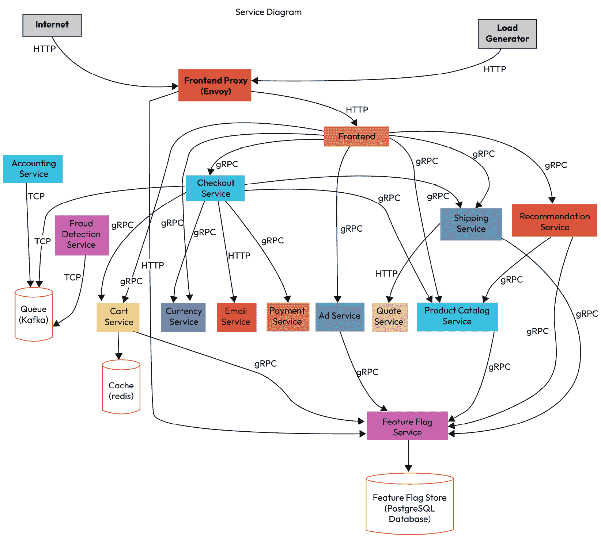

图 8.20 – OpenTelemetry 演示系统架构

我们还将查看这些应用程序正在收集的遥测数据。这可以通过自己探索 Grafana 来完成；现在我们有了系统名称和应用流。或者，我们可以与开发者 *Diego* 交流，获取他对系统的见解。

如果你是自己探索，这是建立研究仪表板的好时机。这里你可以在探索和发现有趣数据时添加面板。我们在本章早些时候通过第一个仪表板做了这个，先是前端请求，然后改进它以显示前端请求的速率。否则，你可以开始建立一个数据备忘录仪表板，收集你可能想要使用的数据；现在不用担心布局或可视化。

为了帮助我们选择有用的度量指标，我们可以使用一种方法论，比如 Google 的 *Site Reliability Engineering* 手册中提出的 **四大黄金信号**（https://sre.google/sre-book/monitoring-distributed-systems/#xref_monitoring_golden-signals）。还有其他流行的方法，比如 **利用率、饱和度、错误**（**USE**）方法和 **速率、错误、时长**（**RED**）方法，我们将在下一章讨论这些方法。

让我们快速看一下四大黄金信号：

+   **延迟**：处理请求的时间

+   **流量**：系统承受的需求量

+   **错误**：请求失败的比率

+   **饱和度**：系统服务的负载程度

当你有一些关键的度量数据可以使用时，你可以开始构建你的仪表板。记住，仪表板应该讲述一个故事或回答一个问题；*Steven* 说他希望有一个顶层系统视图，能够突出显示问题，并在需要时访问更详细的信息。我们可以按照以下步骤进行：

1.  让我们从仪表盘的第一行开始，创建第一视图区域。通过选择详细描述流量通过我们系统的指标，我们可以使用如**统计信息**（带时间轴）的可视化来突出显示。引导观众，*Steven*，从左到右展示最重要的信息。

    这是一个包含时间轴可视化的**统计信息**示例，用于第一视图区域：

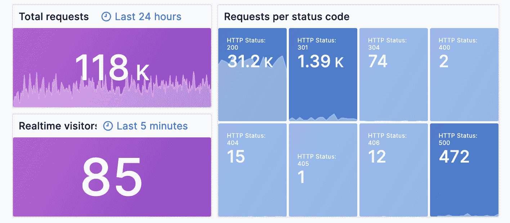

图 8.21 – 系统概览

其他可视化方式，如**仪表盘**，适合表示系统的饱和度。

为了确保*Steven*首先关注最重要的信息，我们可以通过阈值、覆盖和数值映射来增强我们的面板。在某些面板中，我们甚至可以将更多的上下文作为注释覆盖在上面。

1.  然后，我们需要找到一种方式来传达更详细的信息，并根据需要展示的信息量来决定这一点。我们需要问两个问题：

    +   我们能否在这个仪表盘上展示详细信息（这里有足够的空间吗）？

    +   我们是否需要深入其他更专注的仪表盘？

    对于我们的用例，我们将在*相同*的仪表盘上进行工作。为了支持*Steven*识别在事件发生时他需要支持的人，我们可以做如下操作：

    +   我们可以在行中逻辑地分组我们的可视化。每一行可以代表一个团队，第一个面板可以是一个文本面板，用于共享联系信息并提供如何与团队互动的详细信息。这意味着使用仪表盘时认知负担大大减少，帮助*Steven*更快地解决问题。

    +   我们还可以使用面板描述来共享有助于观众，包括*Steven*，理解数据的有用信息，仪表盘链接到支持页面的提示也会有所帮助。

    +   为了更好地展示更详细的信息，我们可以使用诸如表格面板这样的可视化，并结合颜色编码来提供视觉辅助，帮助更快地处理信息。

这里是一个包含顶级洞察以及更详细和有方向性的（即识别负责或支持的团队）面板和行的示例：

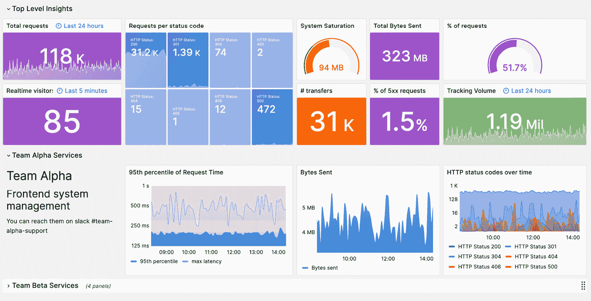

图 8.22 – 详细的仪表盘

从这个虚构的例子中可以看出，构建一个有用的仪表盘需要多次迭代。这个过程不仅仅涉及遥测数据，还需要更多的元素，但最终的结果意味着*Steven*能够完成他的工作，并有最大的机会提供客户满意度。

现在让我们通过几句话来结束这一章，讨论如何通过仪表盘支持你的开发工作。

# 总结

在本章中，我们探讨了仪表板的不同组件，并查看了我们需要考虑的各种细节。这些技巧需要时间来建立，所以请以同样的方式来开发你的仪表板，尽早构建一些简单的东西，然后在此基础上不断迭代。我们讨论了面板可用的可视化效果，以及来自像[play.grafana.org](http://play.grafana.org)等网站的灵感。玩得开心，尝试不同的方式展示你的数据，找到你喜欢的风格。最后，我们介绍了一些技巧和窍门，以帮助你改进仪表板的制作，最后总结了一些简单的想法，帮助你管理你的仪表板。

在下一章，我们将学习**事件管理**以及来自 Grafana 的强大工具，这些工具可以支持事件管理。
