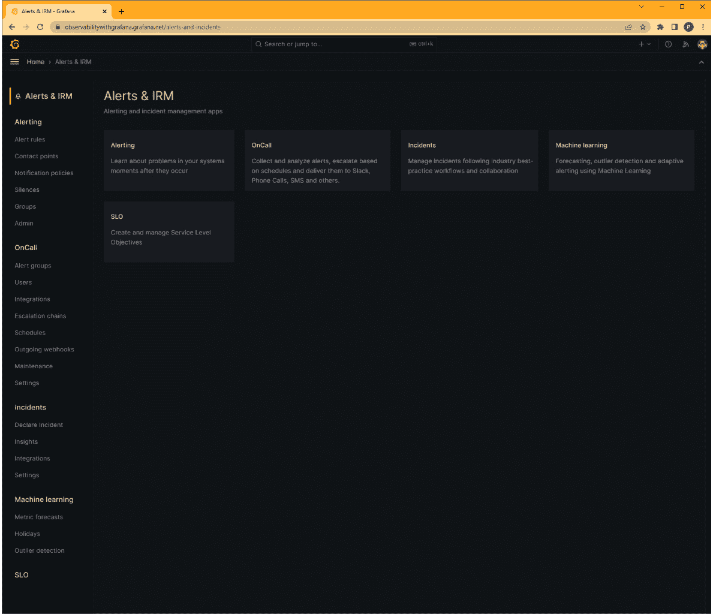
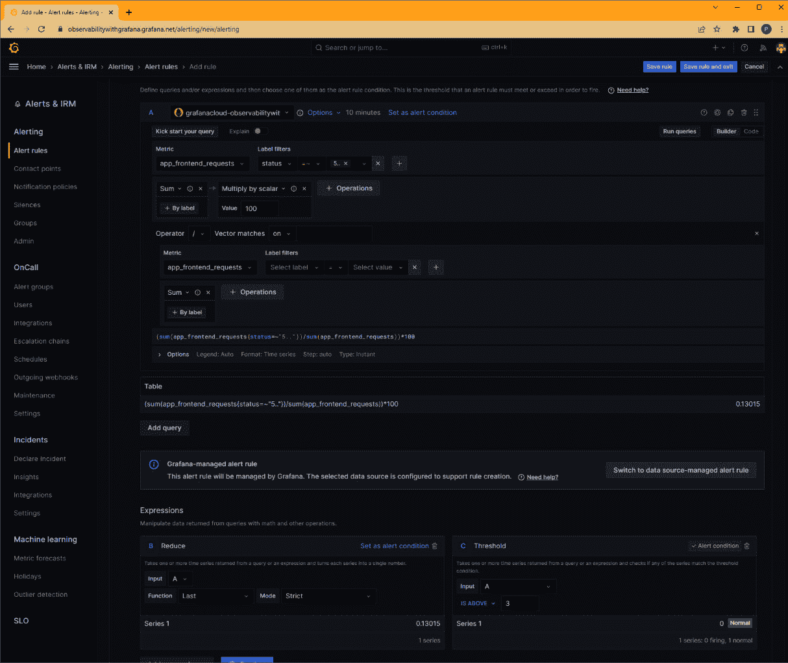
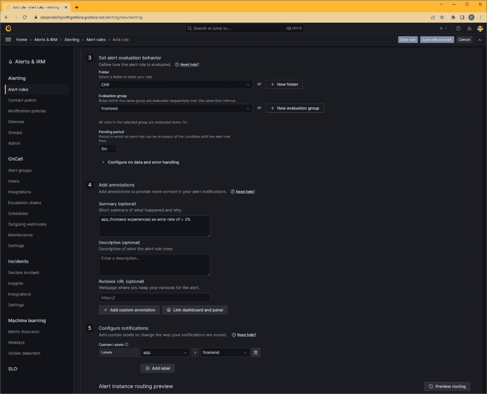
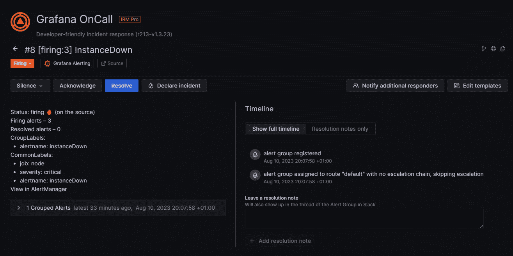
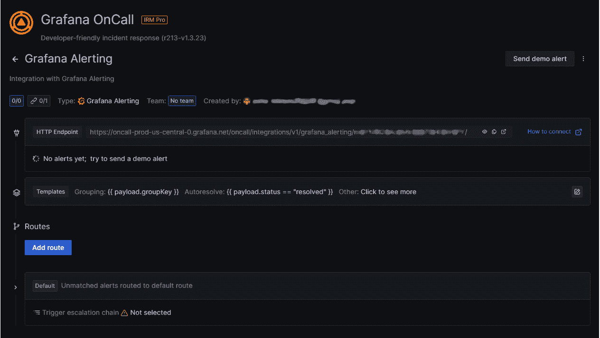
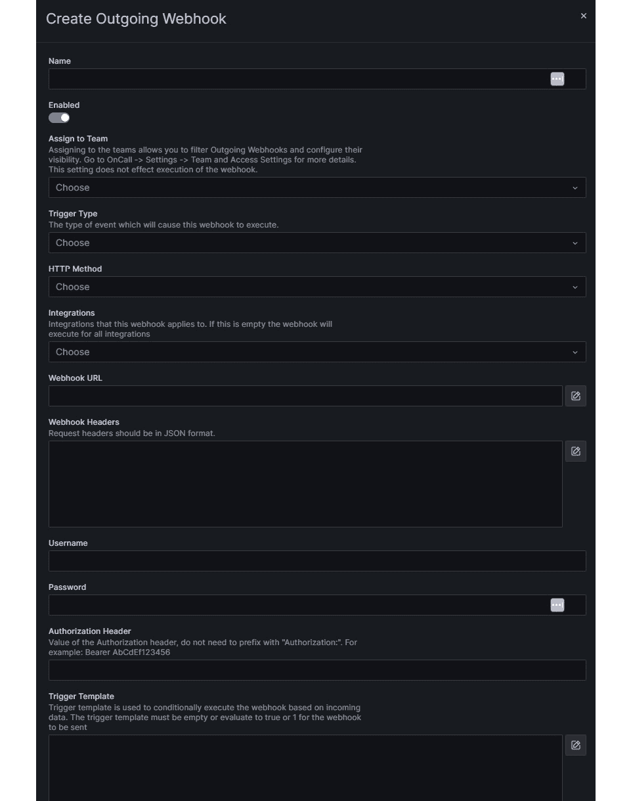
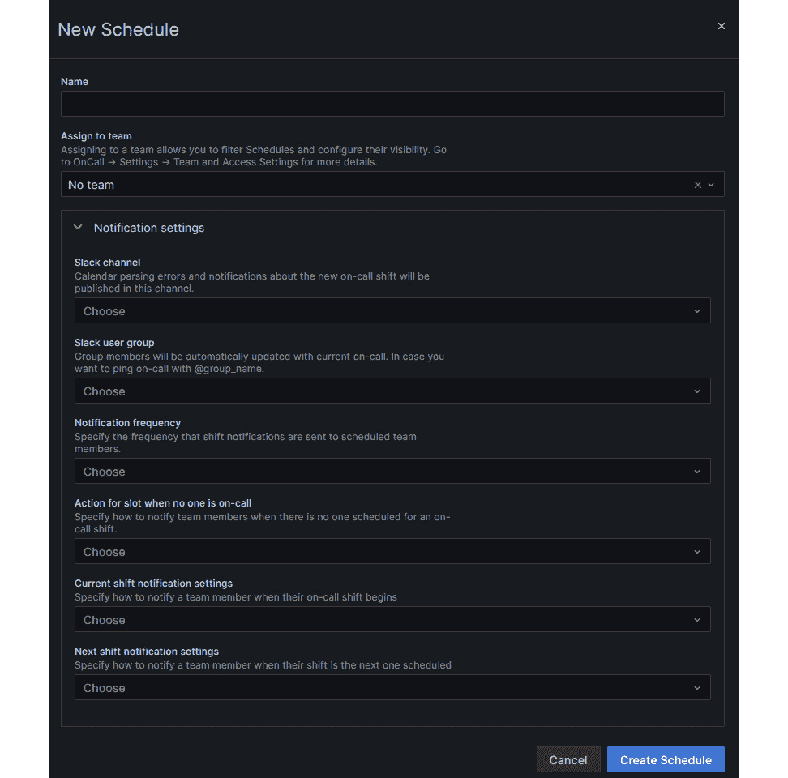

# 第九章：使用警报管理事件

本章将探讨**事件管理**的概念。我们将讨论如何建立一个世界级的事件管理流程，这个流程既能人性化地对待事件响应人员，又能避免他们的过度疲劳。章节将明确这一责任，从高级领导团队到响应呼叫的工程师。它还将介绍建立一个能够处理事件并为客户提供稳定体验的组织的重要概念。在流程建立之后，我们将解释如何考虑服务并挑选关键指标，以便查看当前的服务水平，而不会被噪音所干扰。

本章还将探讨 Grafana 提供的三个用于事件管理的工具。首先是**Grafana Alerting**，用于监控指标和日志中的故障，并触发通知给响应团队。然后是**Grafana OnCall**，它在 Alerting 的基础上扩展了功能，提供了一个专门的移动应用，用于处理警报、团队排班，并且可以接收任何第三方应用通过 Webhook 发送的警报。OnCall 让你能够集中所有警报，方便查看并将其路由到正确的响应团队。最后是**Grafana Incident**，提供了一个易于使用的事件跟踪工具，帮助你准备好所有关键的信息，便于事后活动，帮助组织专注于防止事件发生的改进。

本章将涵盖以下主要内容：

+   警觉与惊慌——如何建立优秀的事件管理

+   使用**服务级指标**（**SLI**）和**服务级目标**（**SLO**）编写优秀的警报

+   Grafana Alerting

+   Grafana OnCall

+   Grafana Incident

# 技术要求

在本章中，我们将深入探讨技术细节，面向如*Ophelia Operator*、*Diego Developer*和*Steven Service*（他们代表了运营人员、开发人员和服务交付专业人员，如在*第一章*中介绍的），并且可能对*玛莎经理*（领导层）等读者有所帮助，帮助他们了解 Grafana 的工具能做什么，以及它们如何支持已建立的事件管理。

# 警觉与惊慌

事故管理是许多领域中常用的过程，从火灾和医疗紧急情况等物理事故到计算机安全或服务故障。尽管在计算机领域我们可能不会处理危及生命的事故，但糟糕的事故管理流程所带来的压力是非常显著的，从焦虑和抑郁到彻底的精疲力竭，甚至可能增加心脏病和中风的风险。本节的目的是解释可观测性和 Grafana 工具如何融入事故管理策略，以及如何利用它们减少对团队的影响、缩短事故持续时间并降低事故发生的频率。在本章中，我们将进一步探讨这些概念的细节以及 Grafana 提供的支持工具。

事故管理这一主题有许多很好的公共资源可供利用；如果你愿意，可以探索以下资源：

+   *紧急响应与恢复* ([`www.gov.uk/government/publications/emergency-response-and-recovery`](https://www.gov.uk/government/publications/emergency-response-and-recovery)): 这是英国对紧急服务提供的指南。虽然你们大多数人不会处理涉及生命或财产风险的事故，但这份文件是任何希望了解如何尽可能轻松应对事故的人的绝佳读物。

+   *Atlassian 事故手册* ([`www.atlassian.com/incident-management/handbook`](https://www.atlassian.com/incident-management/handbook)): *Atlassian 事故手册*是编写或审查事故管理流程时的一个极好的起点。

+   *什么是事故管理？* ([`www.servicenow.com/uk/products/itsm/what-is-incident-management.html`](https://www.servicenow.com/uk/products/itsm/what-is-incident-management.html)): 类似于*Atlassian 事故手册*，ServiceNow 的事故管理指南也是编写或审查事故管理流程时的一个极好的起点。

+   *Google 网站可靠性工程* ([`sre.google/sre-book/managing-incidents/`](https://sre.google/sre-book/managing-incidents/) 和 [`sre.google/workbook/incident-response/`](https://sre.google/workbook/incident-response/)): Google 的*网站可靠性工程*书籍充满了有用的信息。大多数组织不会像 Google 那样以同样的规模运营服务，但这些书籍清晰地展示了如何创建一个高度可扩展的事故管理流程。

这可能看起来是对事故管理的过于简化，但我们将这些概念分为*事故前*、*事故中*和*事故后*。

## 事故前

正如口号所说，“*期望最好的结果，准备最坏的情况*”。在事故发生之前，知道你将如何响应事故，对于在事故发生时有效地做出反应至关重要。在本节中，我们将讨论事故发生前需要落实的各个方面。

### 角色和职责

事件是混乱且迅速发展的情况，不适合在此时分辨谁在做什么。你组织的事件响应角色和责任必须被清晰文档化，并且所有可能被要求响应事件的人都应理解这些责任。在事件管理方面，重新发明轮子并不可取；有几种框架可供参考，包括以下几种：

+   **信息技术基础设施库**（**ITIL**）事件管理

+   **站点可靠性工程**（**SRE**）事件管理

+   **国家标准与技术研究院**（**NIST**）事件响应框架

+   **系统管理员、审计、网络和安全**（**SANS**）事件响应框架

这些框架中有一些关键角色是共同出现的：

+   **指挥官**：这是有权做出决策的人员。此角色的一些关键特点如下：

    +   每个事件的决策范围会有所不同，但指挥官需要能够召集正确的人，批准与客户的沟通，并处理与高级领导的内部沟通

    +   这个人还掌控着整个事件的管理

    +   所有其他角色都向此人汇报

+   **沟通**：这是负责内部和外部沟通的人员。以下是沟通角色的一些关键特点：

    +   在事件中有效沟通对成功至关重要，这个人负责管理这一点

    +   内部和第三方沟通是他们的责任

    +   面向客户的沟通也是他们的责任

+   **技术领导者**：此人对于指导可能涉及到事件的许多技术人员至关重要。事件中的技术领导力的一些关键特点如下：

    +   当多个团队的多人在调查一个问题时，一个人负责做出技术决策是非常重要的

    +   技术领导者需要知道技术团队中的每个人在做什么，以及何时能获得最新的发现更新

这些框架中列出的角色非常侧重于**操作**（*铜*）层级。英国紧急服务已文档化了一种非常有效的指挥结构，**金银铜**，该结构概述了**战术**（*银*）和**战略**（*金*）层级的职责。在处理任何事件之前，明确高层或高级领导以及下属的责任是很有价值的。这能确保在实际事件中，所有相关人员都知道如何在需要时调动正确的领导者。我们的意思是，最好有一个可以应对造成严重损害的重大事件的计划，而不是在事件发生时才意识到需要一个。我们将更详细地探讨这些层级：

+   **金色团队 – 战略职责**：金色团队由高级经理或高层管理团队（C-suite）组成。金色团队的成员应始终保持关注战略层面，而不是被引入战术决策。金色团队的主要职责如下：

    +   设置、审查并沟通事件管理战略

    +   定义是否需要任何资源或专业技能

    +   处理媒体策略

    +   考虑事件可能引发的法律问题

    +   在适当的情况下向股东报告

    +   在银色团队的战术计划使用之前进行审批

    +   事件后进行总结或事后检讨

+   **银色团队 – 战术职责**：银色团队由不同部门的经理组成。他们为铜色团队提供战术领导，做出如何执行金色团队设定的战略愿景的决策，并且在事件发生时，作为信息流动的中介，连接金色团队和铜色团队。银色团队的职责包括：

    +   设置、审查并沟通事件的战术计划，上下指挥链之间

    +   记录事件管理程序

    +   捕捉与客户沟通应如何处理

    +   选择合适的工具来管理事件

    +   了解哪些团队将实现哪些战略目标

    +   解决关键团队中的任何资源需求

    +   在事件发生期间，向金色团队更新任何相关信息

+   **铜色团队 – 操作职责**：铜色团队负责响应事件，从初始警报到事件后的过程结束。铜色团队的职责包括以下内容：

    +   承担事件的操作控制

    +   当事件被声明时，通知银色团队

    +   理解事件的根本原因

    +   做出解决事件的决策

    +   在战术计划中进行内部和外部沟通

    +   完成事件后的报告和会议，处理任何持续的问题

### 在事件中减少噪音，以提高信号

无法预测事件将如何发生以及其根本原因是什么。当事件发生时，快速获取正确信息并有效沟通是两个非常重要的因素，有助于尽快从事件中恢复。

减少噪音的第一步是在**可观察性系统**中，这可以帮助更容易地识别重要信号。做到这一点需要了解服务，因此最好在事件发生之前就进行这一操作。以下做法可以帮助像*Diego*这样的工程师与像*Ophelia*和*Steven*这样的系统工程师共享其应用程序的详细领域知识：

+   确定并记录关键的 SLI（服务级指标）

+   使用分布式跟踪，这样所有调用都可以在服务图中看到

+   编写易于理解的日志消息

+   编写能够处理故障的日志，而不会产生大量信息

很多可观察性工具提供某种形式的**AIOps**；这些工具实际上是监控数据标准流并突出显示偏离先前数据的时间点。这不应被视为不识别关键信号的理由，因为这些工具在我们的经验中并不能替代特定领域的知识。

可能发生的第二种噪声是**通信渠道**的不当使用。我们当中很多人可能曾在 Slack 或 Teams 频道中看到类似*现在网站宕机了吗？*的消息，这些频道本应专门用于通知我们当用户计算机上发生问题时的事故。噪声和缺乏信号同样会影响客户，可能会反复通知客户每一个小的波动，或者更常见的是，在事故发生时未能通知客户。正确的沟通是事件管理策略的核心部分。常见的做法包括：

+   赋予专门的团队宣告事故及其严重性的权限。

+   在事件被宣告时自动化沟通响应——例如，更新客户可见的状态页面并在专用的内部沟通渠道中发布。

+   为事件团队建立受保护的内部沟通渠道（*铜级*）。

+   在事件团队与高级领导之间建立受保护的沟通渠道（*铜级*到*银级*，*银级*到*金级*）。

+   预写状态消息，以便事件团队可以为大多数消费者选择最合适的消息。

### 支持工具。

“工人总是把坏工作归咎于工具”这一格言在这里非常适用；没有*完美*的工具，一个组织有效的工具可能对另一个组织无效，市场上有许多工具。这是我们认为所有组织在其事件管理策略中应考虑的一些功能：

+   警报通知——向值班人员发送通知页面。同时，考虑使用移动应用进行非工作时间的通知。

+   流程自动化。

+   值班排班管理。

+   与其他系统的集成。

+   自动捕捉事件期间的内部沟通。

+   进行演练或模拟事故。

+   升级流程。

+   事件发生期间与客户的沟通。

现在你已经掌握了准备应对最坏情况的知识，让我们在事件发生时实际应用这些计划。

## 事件发生期间。

事故是不可避免的，尽管我们更希望它们不发生。在本节中，我们将讨论一些关键任务，帮助尽可能无痛地解决事件。

### 识别事件。

计算机系统中可以观察到许多故障模式，从即时停机故障到级联故障，再到间歇性故障。拥有清晰的信息来说明服务是否按预期*正常运行*，对于识别问题至关重要。这是像*Diego*或*Ophelia*这样的领域专家的责任，他们需要将这些信息写入软件服务中，或确保它们由第三方系统提供，例如计算、存储或网络服务。捕获这些信息有一些常见的方式，包括**白盒监控技术**和**黑盒** **监控技术**。

白盒监控是指监控你有权限访问的系统。这种做法有助于识别服务是否健康，并提供有关服务状态的详细信息。以下是常用的几种呈现指标的方式：

+   **速率、错误、持续时间（RED）**：这是衡量由请求驱动的服务的一种方式。*速率*是服务在一段时间内处理的请求量。*错误*是遇到错误的请求数量。*持续时间*是请求持续时间的分布，通常将其表示为一组百分位数或直方图。

    通过这三个信号，我们可以快速将当前状态与“正常”状态进行比较，检查是否有服务接收到更多或更少的请求，是否有比平常更多的错误，或者请求的持续时间是否更长或更短。有了这些知识，事故响应团队可以识别出需要进一步调查的服务。

    RED 是一个非常适合用于任何响应请求的服务系统，比如 web 服务器。

+   **利用率、饱和度、错误（USE）**：USE 和 RED 是相辅相成的；RED 关注服务的请求，而 USE 关注服务的内部状态。*利用率*衡量服务处理工作所使用的资源数量（稍后我们会讨论资源）。*饱和度*是服务因资源不足而无法处理的工作量。*错误*是产生的错误数量。我们在这里使用了“资源”这个术语；不同的服务会有不同的资源，识别这些资源是领域专家的工作。常见的资源包括 CPU 和内存的可用性、网络或磁盘 I/O，甚至应用程序中可用的线程数量。

    USE 最适合用于建模提供资源的服务，如存储系统或 Kubernetes 集群。

+   **黄金信号**：黄金信号在 Google 的 SRE 书中被引入，并且与 RED 和 USE 有很强的重叠。黄金信号包括**延迟**、**流量**、**错误**和**饱和度**。

    *错误*和*饱和度*与 RED 和 USE 中描述的一样。*流量*是每秒请求的度量，相当于 RED 中的速率。*延迟*是处理请求所需的时间；这类似于 RED 中的持续时间。然而，延迟还捕捉到请求是否成功。这一信号可以区分以下两种情况：一种是持续时间较短，因为错误被迅速返回；另一种是服务需要很长时间才返回错误的更具挑战性的情况。

+   **核心网页重要指标**：以前对服务的视图是由后端系统驱动的。核心网页重要指标是一组从终端用户的浏览器收集的度量，通常使用**真实用户监控**（**RUM**）代理，如 Grafana Faro，它嵌入到 Web 应用程序中以收集数据。这组指标非常关注 Web 应用程序的终端用户体验。

    当前的核心网页重要指标包括以下内容：

    +   **最大内容绘制（LCP）**：LCP 衡量网页的加载性能；它是衡量页面上最大元素被渲染的时间。历史上，类似的度量指标如首个内容绘制、首次有意义绘制、加载、DOMContentLoaded 和 SpeedIndex 也曾被使用；LCP 是谷歌 web.dev 团队当前的推荐指标。

    +   **首次输入延迟（FID）**：FID 衡量页面的交互性；它是从用户首次与页面互动到浏览器能够处理事件处理程序响应的时间。

    +   **累积布局偏移（CLS）**：CLS 衡量页面上渲染的内容因另一个元素被渲染而改变位置的频率。

与白盒监控相对，黑盒监控将服务视为一个未知的实体，并检查它是否按照终端用户所看到的行为。黑盒监控大致分为两类：

+   `ping`）和**谷歌远程过程调用**（**gRPC**）。市场上的其他服务也可以模拟关键用户旅程，如果需要更精细的外部监控。这种情况下，如果**服务级别协议**（**SLA**）的遵守是组织的合同义务，使用第三方合成工具是一种非常简单的方式来证明 SLA 是否被遵守。这个工具作为**合成监控**，是 Grafana Cloud 的一项托管服务提供的。除了 gRPC 调用，所有功能均受支持。

+   **RUM**使用嵌入在前端代码中的代理来收集实际终端用户使用服务的数据。虽然 RUM 提供的功能比单纯的黑盒监控更广泛，但它也可以用于根据终端用户的实际体验提供初步的警报。

黑盒监控确实存在误报的风险。虽然白盒监控仅覆盖组织控制范围内的项目，如内部网络、云服务等，黑盒监控则需要涵盖控制范围外的领域，如外部互联网提供商的网络或 DNS 服务。

通过使用常见的信号群组，并为每个服务明确这些关键的 SLI，组织可以有效地将服务健康状况的知识从领域专家传递给组织中的其他人员。详细的操作手册（通常被称为**运行手册**），详细说明了应对各种情况的方式，也起到了知识传递的作用。最后，一个健全的事件后处理流程有效地帮助组织摆脱了*英雄文化*。英雄文化是指一小部分人通过响应每一个事件来维持运转，往往以牺牲健康为代价。一个成熟的组织应从频繁的事件混乱中走向一个能够为高度积极的个体及整个组织提供成长空间的阶段。

一旦我们的监控系统通知我们出现问题，接下来的问题是*谁*应该参与事件处理，以及*何时*参与。

### 事件升级

如果一个事件仅需值班人员参与就能快速解决，那是理想的。遗憾的是，有些事件需要升级处理，无论是因为需要更专业的知识，还是事件的规模超出了一个人能处理的范围。每个组织都有不同的情况，因此明确的事件升级政策必须是应急计划的一部分。升级政策应提供清晰的指导，并回答以下问题：

+   当自动化系统识别到问题时，应该通知谁？

    +   在工作时间和非工作时间，这个决定是否会有所不同？

    +   事件的严重程度是否会影响此决定？

+   如果第一响应者不可用，应该通知谁？

+   如果第一响应者无法单独解决问题，应该由谁接手？

+   做出该决定时使用了哪些标准？

    +   事件的持续时间？

    +   事件的严重程度？

    +   事件发生的时间？

+   事件的交接应该如何进行？

+   如果同时发生多个事件，会发生什么？

有了这些指导方针，确保所有值班人员了解政策是领导层（*玛莎*）的责任。特别是对于那些可能觉得需要避免打扰资深同事的初级工程师来说，这一点尤其重要。此外，还需要定期审核值班时间表，确保值班工程师不会因工作安排而过度疲劳或精疲力尽。

### 通信

在事件处理中，沟通至关重要。我们可以将沟通分为三个大类：

+   **事件团队沟通**：大多数组织使用面对面或视频会议室和聊天工具的组合。在发生事件时，有几个考虑因素需要纳入，以确保沟通顺畅：

    +   通知某人加入事件的主要沟通渠道是什么？

        +   聊天频道、电话/SMS 或移动应用（例如 Grafana OnCall 或 PagerDuty）

    +   是否有主要的会议桥接视频会议？

        +   确保在主要沟通渠道发送的任何警报中都包含详细信息

    +   召集人员进入事件的预期响应时间是多少？

        +   这会影响恢复时间

        +   这同样会影响经常被召集参与事件的人员的健康和福祉，需要进行监控

    +   团队沟通如何记录以便事后回顾？

        +   随着事件与事后回顾之间的时间增加，人们的记忆会变得模糊。记录沟通内容是管理这一点的好方法，确保事后回顾尽可能准确。在事件发生期间使用能够简化这一过程的工具对整个事件管理过程非常有价值。

        +   这里有工具和流程可以帮助。Grafana Incident 会跟踪来自 Slack 等工具的事件时间线。事件的沟通和技术负责人还应负责定期更新状态，这些更新应考虑到事后回顾。

+   **内部沟通**：重大事件的沟通负责人负责内部沟通。对于大多数渠道，事件的战术计划应指定更新的频率。这类沟通通常不需要详细说明；即使仅仅说“*我们仍在调查问题并努力解决它*”，也比保持沉默要好。内部工具发生事件时，这种沟通同样重要。

    沟通负责人应向高级利益相关者（如金银团队）详细通报当前状况。由于银团队通常包括可能是事件原因的产品的技术和管理领导，这个渠道对于在需要时升级并引入专家尤为重要。遵循相同的主要沟通渠道进行事件通知是最佳实践——也就是说，如果升级是通知正确的值班人员，那么事件可以更快速地解决。然而，这也意味着需要更多工程师值班。

+   **客户沟通**：这可能是最重要的，因为当事件影响外部客户时，迅速发出信息向客户保证组织正在积极处理问题并恢复服务至关重要。与客户沟通的方式有很多种：

    +   状态页面，可以是独立的，与组织的服务分开，也可以嵌入其中

    +   邮件通知

    +   社交媒体

    +   短信通知

    +   客户工单管理门户上的消息

    在事件发生期间，通讯负责人应准备一系列预生成并已批准的客户消息，几乎不需要修改。这有助于保持信息的语气和风格正确，即使通讯负责人是在凌晨 3 点刚被叫醒的情况。也应该准备一条告知客户可能存在问题但正在调查中的消息；这种情况适用于你已经被警告有问题，但不确定是否会对客户造成实际影响。

在这些准备工作完成后，你将能让你的组织处于一个良好的位置，以便快速解决事件并让团队回去休息。事件发生后，可能更具挑战性的工作将开始，比如理解事件发生的原因，并沟通组织将如何解决任何潜在的根本原因。让我们探讨如何处理这一过程。

## 事件发生后

事件发生在大公司和小公司中；即使是那些在避免事件上非常谨慎的公司，也会经历事件。从任何事件中最重要的事情是，整个组织要了解系统中的漏洞或导致事件发生的流程缺口。

当事件发生时，寻找一个人或一个部门来归咎可能是自然的，但这种人类倾向与组织的最佳利益是直接冲突的。责备会导致繁琐的程序，缺乏创新，并最终导致组织停滞不前，因为员工停止诚实交流，转而确保自己不会被责备、降职或甚至解雇。

**无责事后检讨**是一个诚实且客观地审视发生了什么的空间，目的是理解事件的真正根本原因。必须假设所有员工和部门的出发点是良好的。理解无责事后检讨的目标不是消除个人或团队的责任，而是确保责任不伴随惩罚、失业或公开羞辱的恐惧。无责事后检讨的关键要素包括：

+   开放的沟通氛围，接受错误作为生活的一部分

+   鼓励诚实和接受失败

+   分享关于事件时间轴的详细信息，应该有事件期间内部沟通和系统日志的支持。

+   做出决策并寻求改进的批准

有许多指南详细介绍了这些过程，比我们在这里所讲的更为深入；我们的目标是将那些符合角色的人员引入到广泛的事件响应话题中。接下来，我们将更详细地讨论可观察性实践以及 Grafana 工具如何帮助构建一个优秀的事件响应计划的一部分。我们将从更深入地探讨 SLI 和 SLO 开始。

# 使用 SLI 和 SLO 编写优秀警报

**SLI**是用来表示当前服务水平的度量指标。一个例子可能是 15 分钟内的错误数量。

最佳实践是保持 SLI 的数量尽可能少；每个服务有三到五个 SLI 是一个不错的经验法则。这可以减少混淆，并帮助团队专注于服务的关键点。SLI 也可以被看作是一个**分形**概念；虽然一个服务团队可以有一个较大系统组件的指标，但整个系统也可以通过少数几个 SLI 来跟踪——例如，失败其 SLO 的服务数量。通过将跟踪的 SLI 数量保持相对较小，可以减少虚假的警报，且持续监控服务的影响保持较小。这意味着可以监控更多的服务，而无需扩展使用的工具或增加运营成本。

我们之前讨论的 RED、USE、黄金信号和核心网页重要指标模式是决定要跟踪的 SLI 时很好的参考。这些不是唯一可以作为 SLI 使用的度量标准，但它们在行业中有很好的采用率，并且被广泛理解。团队应该认真考虑是否需要使用其他的度量标准。

通过达成对 SLI 和目标的共识，编写优秀警报的过程变得更加简单，因为实施警报的人只需要考虑如何将 SLI 的业务描述（例如 15 分钟内的错误数量）转化为查询，使用 LogQL 或 PromQL，然后根据设定的目标创建阈值。以这种方式编写的警报也将容易理解。

另一个重要概念是 SLO，它指的是一个内部达成的目标，认为这是 SLI 可以接受的标准。例如，可能是 10 分钟内错误请求的比例不超过 3%。

尽管与事件警报直接无关，但有一个概念叫做**错误预算**，它与良好的 SLO 设置密切相关。错误预算是一个衡量其他 SLO 实现情况的 SLO。当错误预算被超过时，通常表明服务存在某种不稳定性，这应该作为一个触发器，促使团队集中精力进行修复。相反，如果错误预算较高，则可以给团队提供实验的空间，甚至有计划地停机。这也是暴露潜在问题的一个好机会，因为这些问题在未计划的故障中可能会带来灾难性的后果。这个话题在讨论 SRE 的出版物中有更详细的探讨。

SLA 是与客户或用户达成的关于服务可接受标准的协议，这些协议可能是法律协议，通常由多个 SLI 和 SLO 组成。例如，99.9% 的正常运行时间就是一个例子。通过设置 SLO 的目标，组织可以轻松地保持在合法协议的 SLA 范围内，这是确保 SLA 很少被违反并让客户信任组织的好方法。

我们已经探讨了一个良好事件响应策略的理论以及支持该策略的选择，从团队层面到组织层面。现在，让我们来看一下 Grafana 提供的三个工具来支持事件响应：Grafana 警报系统、OnCall 和 Incident。

# Grafana 警报系统

**Grafana 警报系统**是 Grafana 的**事件响应与管理**（**IRM**）工具集中的三个主要组件之一。Grafana 警报系统本身不需要额外的授权费用，适合较小的组织使用，同时也构成了大型组织 IRM 工具的基础。

IRM 功能可以通过主 Grafana 菜单中的**警报 & IRM**标签访问：



图 9.1 – Grafana 警报与 IRM 主界面

Grafana 警报系统持续评估用户创建的**警报规则**，以判断是否存在需要警报的状态，并按照预定义的步骤将消息发送到选定的通知通道。

接下来，我们将看到如何设置警报规则，正确配置联系点和通知策略，在需要时静默警报，以及如何设置团队和团队成员。

## 警报规则

Grafana 警报系统的主要配置界面是**警报规则**界面。这个界面允许你设置新规则并查看现有规则的当前状态。学习了*第四章*和*第五章*中的 LogQL 和 PromQL 后，设置规则应该会感觉非常熟悉。

设置警报规则需要配置多个项目；让我们现在逐一讲解这些内容：

1.  **设置警报规则名称并定义查询和警报条件**：首先，创建并命名一个查询；在我们的示例中，我们使用了以下查询，持续时间为 10 分钟：

    ```
    (sum(app_frontend_requests_total{status=~ " 5.. "})/sum(app_frontend_requests_total))*100
    ```

    这将计算在该时间段内所有请求中已完成的百分比，状态码为`5xx`，即 SLI。在`3`中，即 SLO。以下截图显示了可以填写这些项目的界面：



图 9.2 – 创建告警规则

1.  **设置告警评估行为**：在设置好 SLI 和 SLO 后，我们现在需要决定如何让 Grafana 评估其下一步操作。Grafana 中告警规则可以处于三种状态：**正常**、**待定**和**触发**。**告警评估行为**管理告警规则组在各个状态之间的转换。一个评估组将按顺序评估组内每个规则，且使用相同的评估周期。在我们的例子中，我们创建了一个前端组，其中包含来自前端服务的 RED 指标。由于前端服务对业务至关重要，评估周期设置为 1 分钟，待定周期设置为 5 分钟。通过这些设置，如果我们的错误百分比超过 3，我们的规则将在 1 分钟内进入待定状态，并且如果状态持续，告警将在 5 分钟内触发。这个过程可以从下一个截图中看到。

    虽然将这些值设置得尽可能低（如 10 秒）非常诱人，但这可能会带来意想不到的后果。每分钟运行查询将导致每天执行 1,440 次查询，而每 10 秒一次则会有 8,640 次查询。虽然计算能力相对便宜，但这仍然会使 Grafana 所需的资源增加六倍，并且可能带来很小的优势。另一个考虑因素是查询频率与查询周期的相互作用。如果我们每 5 分钟评估一次，但查询只看最后一分钟的数据，那么就会有未被评估的分钟，这可能会掩盖合法的间歇性错误。让我们看一下屏幕的下半部分，以管理告警规则：



图 9.3 – 管理告警规则

1.  **添加注解**：注解用于在告警触发时将信息发送到联系人。良好的实践是包括易于阅读的摘要，捕捉关键信息，如涉及哪个服务以及问题是什么。描述应提供更多细节（如有需要），并且最佳实践是包含运行手册 URL 和仪表板链接。这些应该帮助响应者快速了解问题，并提供可跟随的补救步骤，以便他们能够迅速恢复服务。

1.  **配置通知**：**配置通知**部分提供了添加标签的空间。标签可用于管理告警路由，我们将在讨论通知策略时详细介绍。点击**预览路由**按钮可以获取有关告警如何在当前配置下进行路由的信息。

**警报**菜单中的接下来的几个标签允许我们配置 Grafana 警报的其他方面。这些比主要的警报规则要小一些。让我们现在来看一看。

## 联系点、通知策略和静默

**联系点**由 Grafana 管理员配置。它们由一个名称和一个或多个集成组成。通常，联系点是负责处理问题的团队。通过一些可用的集成（例如 Webhook 和 Kafka 消息队列），建立超出简单警报的复杂联系点相对容易。在更复杂的环境中，Grafana 提供了在**联系点**页面上创建通知模板的选项。这些模板可以用于标准化多个联系点和集成之间的消息结构。Grafana 提供了一个很好的指南，帮助设置自定义通知：[`grafana.com/docs/grafana/latest/alerting/manage-notifications/template-notifications/`](https://grafana.com/docs/grafana/latest/alerting/manage-notifications/template-notifications/)。

来自 OpenTelemetry 演示中服务的`service_name`标签。相同嵌套级别的规则也可以继续匹配，这意味着服务团队和中央运维团队都可以收到通知。

**静默**是指在定义的时间段内不创建任何通知。它们可以用于管理使用 Grafana 警报时的维护周期。

## 分组和管理员

**分组**部分显示已分组的警报。如果数据源定义了警报但没有发送数据，Grafana 也会在这里显示警报。

管理页面以 JSON 格式提供 Alertmanager 配置；这允许管理员保存配置并将其传输到其他实例，或将其用作配置备份。

# Grafana OnCall

**Grafana OnCall**是 IRM 的第二个主要组件，扩展了 Grafana 警报功能，新增了以下功能：

+   从多个外部监控系统接收警报通知

+   指定警报分组以减少事件中的噪声

+   指定警报组何时发送通知

+   定义值班轮换和升级路径

+   扩展通知渠道，超出 Grafana 警报中提供的内容：

    +   在 ServiceNow、Jira 和 Zendesk 中创建和更新工单

    +   直接通知当前值班人员

+   提供移动应用程序供工程师处理值班责任

Grafana OnCall 的所有功能都包含在 IRM 用户许可证中。Cloud Free 订阅包括三名用户的访问权限。Pro 和 Advanced 账户包括 5 名用户的访问权限；额外的用户在写作时按每月 $20 收费。

在接下来的部分中，我们将查看警报组以及如何设置入站和出站数据流的集成。我们还将探讨在 Grafana OnCall 中使用的模板语言以及如何管理升级链。

## 警报组

所有流入 Grafana OnCall 的告警都被分组到**告警组**中。这些组可以包含一个或多个单独的告警，分组行为由正在应用的集成模板进行管理。我们将在查看集成后讨论模板化。告警组随时可以处于以下状态之一——**触发**、**已确认**、**静音**或**已解决**。值班工程师或升级链采取的行动可以转换告警组的状态。一个告警组看起来像这样：



图 9.4 – 告警组的结构

此网页视图反映了通过集成通信渠道、移动应用、电话和短信，值班工程师可以使用的功能。告警组可以轻松地被确认、取消确认、静音或解决。如果需要召集其他团队，工程师还可以通知额外的响应者，声明事件以触发 Grafana Incident 中的流程（本章后面会讨论），或者如果它们相关，可以将告警组合并，这意味着事后清理将变得更加容易。

## 入站集成

用于设置**入站集成**或**告警源**的工具位于**集成**选项下。这些交互用于将来自外部源的告警信息发送到 Grafana OnCall。目前有超过 20 个集成，且可以使用入站 Webhook 与任何可以发送它们的系统集成。点击**新建集成**将开始连接到新的告警源的过程；我们将使用 Grafana 告警作为我们的源，因为我们刚刚已经了解过它。首先，为集成命名并描述，然后选择告警管理器和联系点。Grafana OnCall 能与任何兼容 Prometheus 的告警管理器集成；Grafana Cloud 中配置了一个默认告警管理器，名为*Grafana*。最后，点击**创建集成**，您将看到以下界面：



图 9.5 – Grafana 告警集成

**HTTP 端点**用于配置告警源以发送告警。如果您在配置特定集成时需要帮助，**如何连接**链接提供了更多信息。要测试集成，**发送演示**告警将创建一个测试告警。

`分组 ID`字段来自`payload.groupKey`字段的值。同样，如果`payload.status`为`resolved`，告警组将被解决。这意味着告警源也可以发送解决更新。

接下来的部分，**Web**、**电话**、**Slack**、**Telegram**、**电子邮件**和**MS Teams**，包含了如何将告警组的通知发送到这些 ChatOps 集成的模板。

添加路由允许你根据每个警报组的 Jinja 路由模板选择一个升级链，这些警报组源自集成。这是通过点击 **添加路由** 按钮实现的。路由还包括将消息发布到任何已配置的 ChatOps 集成的选项。

另一个在集成页面上的三点菜单中提供的重要功能是启动维护期。维护可以是调试模式，这会静音所有升级，或者是标准维护模式，将所有警报收集到一个警报组中。

接下来我们来讲解模板和升级链。

## 模板

**Jinja** 是一种模板语言，具有许多有用的功能，可以解析警报组中的多个警报，使得值班人员能快速看到发送给他们的信息中的重要内容。以下是该语言的一些特性和语法：

+   **循环**: 循环的语法如下：

    ```
    
    Do something with item from seq
    
    Do something else if there are no items in seq
    
    {"results": [{"metric": "bigbadwolf", "value": 1},{"metric": "littlepiggies", "value": 3},{"metric": "houses", "value": 1}]}
    ```

    然后我们可以使用以下 Jinja 模板：

    ```
    *Values:*
    
    {{ item['metric'] }}: '{{ item['value'] -}}'{{ "\n" }}
    
    ```

    这将产生以下输出：

    ```
    *Values:*
    bigbadwolf: '1'
    littlepiggies: '3'
    houses: '1'
    ```

+   **条件**: 条件可以使用此语法构建：

    ```
    
    Do something
    
    Do something different
    
    Do something else if condition 1 and 2 didn't match
    
    ```

+   `时间`: 当前时间

+   `tojson_pretty`: 美化的 JSON

+   `iso8601_to_time`: 将时间从 `iso8601` 格式（`2015-02-17T18:30:20.000Z`）转换为日期时间格式

+   `日期时间格式`: 将时间从日期时间格式转换为给定的格式（默认 `%H:%M`/`%d-%m-%Y`）

+   `regex_replace`: 执行正则查找和替换

+   `regex_match`: 执行正则匹配，并返回 `True` 或 `False`

+   `b64decode`: 执行 Base64 字符串解码

+   `-`) 添加到块的开始或结束，以去除其前后的所有空白字符。如果 `seq = [1,2,3,4,5,6,7,8,9]`，我们可以按如下方式书写：

    ```
    
        {{ item }}
    
    123456789
    ```

    如果没有这个空白字符管理，它将呈现如下：

    ```
        1
        2 …
    ```

    Jinja 还提供了修剪功能，可以去除空白字符。如果你想保持空白字符，可以添加加号 (`+`)，表示应保留空白。

有关 Jinja 的更多信息，请访问网站： https://jinja.palletsprojects.com。

现在我们了解了如何使用模板来格式化负载和消息，让我们来看看升级链。

## 升级链

**升级链** 允许我们为警报组设置标准工作流。这对于根据警报的严重性或内容、时间或其他因素来路由警报非常有用。可以设置多个步骤：

+   `等待`: 等待指定的时间后，继续到下一步。

+   `通知用户`: 向一个用户或一组用户发送通知。

+   `通知值班表上的用户`: 向值班表中的某个用户或用户组发送通知。

+   `自动解决事件`: 立即以状态 `自动解决` 解决警报组。

+   `通知整个 Slack 频道`: 向整个 Slack 频道发送通知。

+   `通知 Slack 用户组`: 向 Slack 用户组发送通知。

+   `触发外发 webhook`: 触发一个外发的 webhook。

+   `逐个通知用户（轮询）`：每条通知将按照顺序依次发送给一组用户，采用轮询的方式。

+   `如果当前时间在范围内，则继续升级`：只有当前时间处于指定范围内时，才会继续升级。这可以用于在非工作时间暂停升级。

+   `如果每 Y 分钟 >X 个警报，则继续升级`（测试版）：仅在超过某个阈值时继续升级。

+   `从头开始重复升级`（`最多 5 次`）：循环升级链。

当通知通过值班排班或轮询直接发送给用户时，将遵循用户的个人通知步骤。这些可以由用户进行管理。用户页面会突出显示所有用户的通知步骤状态；任何没有配置通知的用户将标记为警告。

## 外发集成

Grafana OnCall 提供了几种执行**外部集成**的方法，这些方法涉及集成外部工具，以便可以发送外发消息，无论是发送到消息工具还是任何可以接收 webhook 的系统。这些集成有两种类型：

+   **ChatOps**，它是包括 Slack、Telegram 和 MS Teams 在内的集成。这些可以通过**设置** | **ChatOps**进行配置。

+   **Webhooks**：这些外发 Webhooks 提供与任何可以接收它们的系统集成的能力，并且它们是由 OnCall 中的事件触发的。

以下截图展示了如何在 Grafana OnCall 中设置 webhook：



图 9.6 – 配置外发 webhook

Webhooks 可以通过升级步骤触发，或者当警报组被创建或过渡到特定状态时触发。

## 排班

**排班**是 Grafana OnCall 管理各团队值班人员的方式。这些非常容易设置，并且可以为你提供标准轮班排班的能力，同时还可以设置任何覆盖规则。排班还会通知 Slack 频道当前的值班班次以及任何未分配的班次。**新排班**屏幕在以下截图中展示：



图 9.7 – 设置新排班

现在，让我们来看一下 Grafana 事件。

# Grafana 事件

Grafana IRM 提供的最后一个重要组件是**事件**。该工具帮助简化和自动化事件管理战术计划的许多方面。该工具与组织的聊天工具（如 Slack）集成，提供团队成员在该工具中声明事件的能力。

一旦事件被声明，Grafana Incident 可以自动启动视频会议、更新状态页面工具、从 GitHub 向事件时间轴添加上下文等，具体取决于已配置的集成。事件的团队成员可以指定每个人在事件中的角色，并在事件期间指定和分配任务。随着事件的发展，Grafana Incident 将记录重要信息到时间轴中，这些信息可以发布，并在定期的事件后回顾中轻松审查。

要开始在 Grafana Cloud 中使用 Grafana Incident，管理员需要首先同意进行一些集成的设置。同时，最好与消息工具（如 Slack）和视频会议工具（如 Zoom）进行集成，因为 Grafana Incident 在事件声明时会使用这些工具。在视频会议中会创建一个新的事件桥接，工具还可以在指示时记录聊天消息，以便在事件后进行回顾。如果适用，还应配置与 Statuspage、GitHub 和 Jira 的集成；这些集成分别可以更新 Statuspage、记录拉取请求和问题的状态，以及管理 bug 工单。随着工具的成熟，我们预计可用的集成列表将会扩展。

让我们来看看 Grafana Incident 在事件发生时如何使用：

+   **事件发生期间**：在事件发生期间，可以指定一名指挥官和多名调查员。可以将预定义的标签与事件关联，并设置事件的严重性。调查员随后可以在事件时间轴中记录文本更新，以及相关的查询、警报和访问的面板。工具将收集所有相关的聊天记录、文本更新、执行的查询、触发的警报和使用的面板。调查员还可以触发已配置的外部 Webhook。事件界面包括任务列表，还可以附加指向相关资源的链接。

+   **事件发生后**：在事件发生后，收集到的信息会被整理成事件的时间轴。该事件的时间轴可以被进一步审查。Grafana Incident 还会整理标准指标，这些指标可以在 **Insights** 页面上以更高的层级查看。

    **Insights** 页面默认显示过去 90 天内所有事件的高层次指标。最佳实践是组织中的银级领导团队应定期审查此页面，并作为正式过程的一部分向金级团队汇报。这有助于确保事件得到妥善处理，团队安排了修复工作，从而减少事件对组织的频率和影响。

Grafana 提供了多个 AI 和 **机器学习**（**ML**）工具来帮助事件管理：

+   **Suggestbot**：此工具使用 **自然语言处理**（**NLP**）分析事件期间的对话，并建议与正在讨论的主题相关的仪表盘。

+   **OpenAI 集成**：这是目前正在公开预览的工具。其目的是加速编写事件后总结的繁琐过程。该工具使用 OpenAI 的 ChatGPT 将事件时间线提炼成一个摘要，并可以进一步微调。使用此集成需要 OpenAI 账户。此集成可以生成以下内容：

    +   事件的简要描述

    +   事件发生前的时间线

    +   解决事件所采取的措施的详细信息

+   **ML 预测**：这个工具将基于过去状态的学习模型预测度量指标的未来状态。此功能仅适用于度量数据（来自 Prometheus、Graphite 或 Loki 的度量查询）。这些预测可以用于仪表板或驱动警报。

+   **ML 异常检测**：这个工具为度量数据构建了一个“正常”状态的模型，当度量数据超出正常范围时，会突出显示这些异常值。这些异常值可以用于警报触发。

+   **ML Sift**：Sift 也是一款公开预览工具。这是一款强大的事件管理工具，它将从基础设施的遥测数据中提取信息，帮助识别那些可能被事件的噪声掩盖的关键细节。Sift 将查找以下内容：

    +   错误日志中的模式

    +   Kubernetes 集群中的崩溃

    +   噪声较大的 Kubernetes 节点，负载较高

    +   有资源限制的容器

    +   最近发生的部署

    +   Tempo 中看到的慢请求

现在，你应该已经有信心使用 Grafana 提供的工具为事件做好准备并做出响应。

# 总结

在这一章中，我们已经了解了如何建立一个优秀的事件管理流程，这将帮助你评估并改进你组织中的相关流程。我们还探讨了 SLI、SLO 和 SLA 及其使用方法，通过这些工具，你可以迅速判断服务是否响应成功。你已经掌握了选择合适 SLI 的技巧，这使你能够透明地与组织中的其他成员分享你负责的服务是否按预期运行。反过来，这种透明度帮助组织快速识别问题所在，并将资源集中用于解决问题。

最后，我们查看了 Grafana 提供的事件管理工具，了解了如何配置和使用它们来支持优秀的事件管理流程。

下一章将探讨我们如何使用 Grafana 和 OpenTelemetry 提供的工具，自动化收集、存储和可视化数据的过程，以便在可观察性平台中使用。
