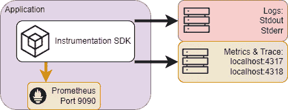
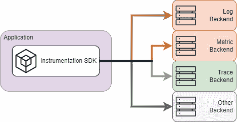
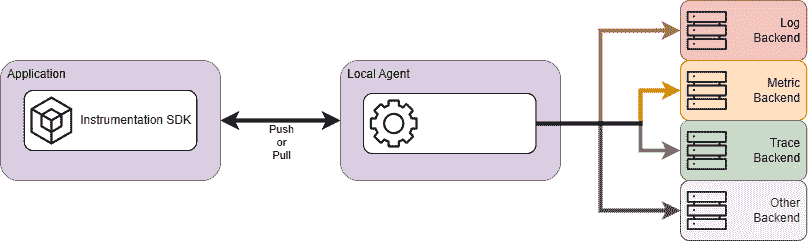
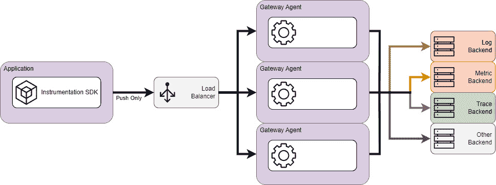
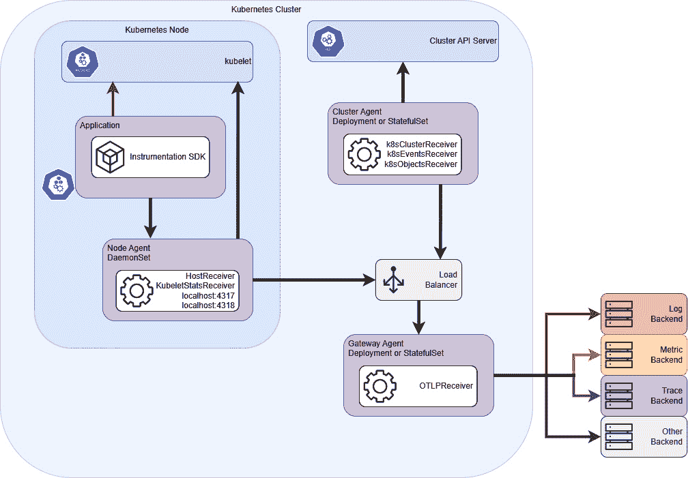

# 11

# 架构化一个可观察性平台

本章涉及几个与**架构化**组织中团队可使用的优秀可观察性平台相关的主题。我们将讨论如何将数据结构化为**领域**，以帮助即使在最大型的组织中也能快速找到相关数据，以及这如何与其他业务方面（如财务报告和**商业智能**（**BI**））相关。接下来，我们将讨论架构化可观察性平台的四个主要系统组件：**数据生产**、**数据收集**、**数据存储**以及数据使用，如**可视化**和**警报**。我们还将讨论如何将架构与*第十章*中讨论的 IaC 工具相连接。之后，我们将讨论如何使用各种易得的工具通过本地测试验证设计。这些工具还可以在 CI/CD 管道中使用，以在实施更改后验证平台。我们将讨论在 Grafana 中实现的**基于角色的访问控制**（**RBAC**），以及如何设置它们以提供最小权限访问。最后，我们将简要讨论如何架构与其他系统的连接，这些系统利用相同的遥测数据，如**安全信息和事件管理**（**SIEM**）或 BI 系统。本章面向有平台和系统架构经验的高级技术读者。

在本章中，我们将讨论以下几个主要主题：

+   架构化你的可观察性平台

+   证明理论设计（概念验证）

+   设置正确的访问级别

+   向其他消费者发送遥测数据

# 架构化你的可观察性平台

理解并阐明组织所面临的问题是构建一个良好架构的可观察性平台中最关键且被低估的方面。虽然组织通常试图通过可观察性解决一些常见问题，但每个组织都是不同的，与像*玛莎*（如*第一章*中介绍的高级领导）这样的人合作，理解业务需求是一个常常被忽视的步骤，忽视这一点可能会导致未来出现复杂问题。

以下是一些组织常见的问题，可以通过可观察性平台来解决：

+   **影响客户的事件**：这类事件可能包括停机或数据泄露等。这些事件对组织构成合规性、操作性和声誉风险。客户可以是组织内部或外部的人员。

+   **理解组织的关键绩效指标（KPI）**：组织通常希望清晰了解其 KPI 的当前状态。这些 KPI 阐明了组织的表现是否良好，或者是否存在需要解决的问题。

+   **理解客户如何使用产品**：理解客户如何与组织的产品互动可以识别痛点，并帮助引导更好的用户体验。提供优秀的产品能为组织带来竞争优势。

+   **理解为客户提供服务的财务成本**：这通常被称为**销售成本**（**COGS**）和**运营** **费用**（**OPEX**）。

在本节中，我们将考虑如何构建可观察性平台中使用的数据结构，以支持组织的目标。我们将讨论设计系统架构的过程，以及在支持组织运营需求时需要考虑的因素。最后，我们将思考如何设计管理和自动化流程，使得按照最佳实践操作成为团队最容易采用的路径。

## 定义数据架构

数据架构定义了一个组织的数据资产，并映射数据在组织系统中的流动方式。大多数组织已经有了数据架构，因此值得与负责的团队进行讨论。在本节中，我们将讨论可观察性平台中的字段名称和数据类型如何与组织中的通用字段匹配或能够转换。

可观察性系统本质上是数据系统。它们收集、处理、传输、存储并使用数据。当可观察性系统中的数据与其他数据系统兼容时，对整个组织来说，它才最有价值，这样组织可以合并数据集。关键在于，在开始这项工作时，要与组织内部的人沟通，找出谁负责整个组织的数据架构。如果没有这样的人，可以向高层领导提出，将其视为解决问题的障碍。例如，当我还是一名初级工程师时，我记得参加过很多次会议，讨论`tenantID`和`customerID`是否是不同的字段，因为有两个系统使用了不同的名称。最终决定它们是不同的概念，以便业务能够捕捉到作为公司客户的母公司和子公司这一想法。然而，随后两个系统都需要数个月的工作来实现这一更广泛的概念。日志平台也需要大量的数据模型重建来捕捉这一新概念。如果有一个人负责数据模型并提前定义需求，这项工作本可以完全避免。

在实施可观测性平台时，通常会使用来自组织其他领域的数据模型。架构师应该完成一个步骤，将外部需求转化为需求文档，详细说明应在哪里记录字段。例如，财务数据模型可能要求记录成本中心。实现这一点有多种方法，例如：

+   要求每个日志行、每个度量和每个跟踪都包含这些信息

+   要求每个服务都必须加上 `organization.costcenter` 标签

+   维护服务名称 ↔ 成本中心的查找表

要求指南应明确说明如何为将要满足这些要求的团队实现这一点。我们推荐使用如 **MoSCoW** 的文档结构，其中 **MoSCoW** 代表 **必须有（Must have）、应该有（Should have）、可以有（Could have）、不会有（Won’t have）**。

不同的遥测类型最适合不同的数据类型。可观测性系统还具备从其他系统收集数据的功能，例如 Kubernetes 对象标签和云标签。这些应构成数据架构的一部分。以下是一些遥测类型及其最适用的场景：

+   **Loki 中的日志字段**：日志字段最适合用于字符串数据，例如以下内容：

    +   字符串格式的应用程序状态字段，例如 *error* 或 *warn* 状态，例如，如果一个应用程序查询数据并且无法连接到另一个服务

    +   组织或业务数据字段，如服务名称、客户 ID、用户 ID 等

    +   低到中等基数的索引字段

    +   高基数的未索引字段

    +   在跟踪中将应用程序状态链接到系统状态

+   **Prometheus 或 Mimir 中的度量字段**：度量字段最适合用于数值数据，例如以下内容：

    +   数字格式的应用程序状态字段，例如自启动以来处理的记录数

    +   组织或业务数据字段，包括包含服务名称、主机名等的标签

    +   低到中等基数的字段，例如 HTTP 方法（GET、POST、PUT 等）

+   **Tempo 中的跟踪字段**：跟踪字段是一种复杂的数据类型，可以处理以下数据：

    +   系统状态字段

    +   高基数字段

    +   作为属性添加的组织或业务数据字段，例如客户 ID 和用户 ID

    +   跨系统字段

    +   使用跟踪度量将应用程序状态链接到系统状态

+   **Kubernetes 标签**：这些是 Kubernetes 键值对数据对象。它们用于记录以下信息：

    +   核心组织字段，如所有权和成本分配

    +   将应用程序与基础设施连接

    +   这些标签可以在收集日志、度量和跟踪数据时添加

+   **云供应商标签**：这些是应用于云供应商系统基础设施的标签。它们可以用来记录以下信息：

    +   核心组织字段，如所有权和成本分配

    +   在收集日志、指标和跟踪数据时，这些标签可以被添加到数据中。

这些数据在许多组织和行业中是标准化的，生成这些数据的库也经过了充分的测试。然而，有一个数据生成领域，这些工具并未进行测试，那就是组织特定的字段。这些字段总是与组织相关的，但一些常见的例子包括用户 ID 或客户 ID。当这些字段被组织使用时，它们可能非常重要，甚至会被高层领导定期审查。测试这些字段非常重要，因为错误的数据可能导致错误的决策。任何数据架构文档都应强调这一需求。实现这一目标需要大量的技术细节，我们在本书中不会深入探讨，但我们推荐 Martin Fowler 的这篇文章，其中清楚地说明了如何以可测试的方式生成组织数据：[`martinfowler.com/articles/domain-oriented-observability.html`](https://martinfowler.com/articles/domain-oriented-observability.html)。

我们现在已经看到如何在组织内部工作，确保数据架构与基础设施层、应用层、可观察性层和业务层协同工作。现在让我们考虑如何为组织的可观察性平台构建一个优秀的系统架构。

## 建立系统架构

在本节中，我们将考虑构建一个出色的可观察性系统的各个方面。我们将探讨如何帮助软件工程师生成数据。接下来，我们将考虑如何收集这些数据，同时为工程师提供一个稳定的 API。最后，我们将讨论数据的存储和可视化。以下是与这些主题相关的一些需要考虑的问题：

+   数据将如何生成？

    +   使用了哪些遥测类型（日志、指标、跟踪或其他）？

    +   开发者，例如*Diego*，是否会获得库的标准？

    +   是否应该将*系统*数据与*业务*数据分开？

+   数据将如何收集？

    +   需要从哪些系统收集数据？

    +   如果更改了工具，是否需要更新每个应用程序？

    +   将收集多少数据？

+   数据将如何存储？

    +   是否会提供任何本地存储？如果提供，如何管理其规模和成本？

    +   存储是按集群或环境管理，还是作为一个集中式系统管理？

    +   是否会使用第三方解决方案，如 Grafana Cloud？如果使用，如何分配成本？

+   可视化将如何管理？

    +   系统是否完全开放，允许任何人提交任何仪表板的更改？

    +   每个团队是否负责他们自己的仪表板？

    +   是否提供 IaC 工具来帮助团队管理他们的仪表板？

+   这些问题的一个额外考虑因素是，所采用的系统如何处理故障

让我们更详细地讨论这些考虑因素，从架构化应用程序生成数据开始。

### 数据生成

数据生产说明了应用程序和服务如何生成数据。负责可观测性平台的团队应协助生成数据的团队，确保他们按照正确的字段、实践和标准进行数据生成。常见的讨论主题包括以下内容：

+   必须生成哪些遥测类型，哪些是应该生成的，哪些可以生成？

+   是否从可观测性系统中收集了组织或业务数据？如果收集了，字段是什么？是否使用了数据领域（例如，`acme.cost_center` 或 `acme.department`）？

+   开发人员是否需要使用预批准列表中的库？

+   应用程序用来呈现数据的标准是什么？

OpenTelemetry 虽然相对年轻，但正在成为可观测性的标准，并且在大多数供应商和系统中得到广泛采用。对应用程序的建议最佳实践是使用相关的 OpenTelemetry SDK 添加仪器化，具体请参见下图：

图 11.1 – 提议的应用程序数据生产标准

在这里，日志通过 `stdout` 和 `stderr` 输出。度量数据同时发布到 Prometheus 的抓取端点和通过 gRPC（端口 `4317`）或 HTTP（端口 `4318`）的 OpenTelemetry 接收器。追踪数据也会通过相同的端口推送到 OpenTelemetry 接收器。

生成数据只是构建良好架构系统的一部分。接下来，我们来看看如何设计一个系统来收集所有这些数据，使其对组织有用。

### 数据收集

我们在之前章节中讨论过的数据收集代理可以以多种格式收集数据。管理收集各种格式数据的基础设施是一项繁琐的挑战，容易出错且容易失败。系统架构需要详细说明哪些协议是首选的，哪些协议是可以接受的。对于成熟的组织，应该从当前正在使用的协议开始，并为任何计划移除的协议设定生命周期终止日期。强烈建议在存在默认端口时遵循默认端口，并在适用的环境中使用。

另一个考虑因素是数据是否将存储在本地、远程或两者兼有。本地存储增加了管理开销和成本，但在某些环境中可能是必需的。使用远程存储可以减少管理成本，但可能无法使用应用程序中的度量数据来做出环境选择。例如，Prometheus **HorizontalPodAutoscaler**（**HPA**）就是一个这样的例子。我们将在稍后的*管理与自动化*部分中详细讨论这个问题。作者过去在这类考虑中曾使用过短生命周期的易失性本地存储，同时使用远程的第三方提供的基础设施进行长期存储，这种配置效果良好。

OpenTelemetry 提供了几种配置。以下参考架构旨在为需要构建系统的读者提供一个起点。

例如，架构数据收集的最简单方式是每个应用程序将数据*直接*发送到后端，像这样：

图 11.2 – 无代理配置

对于演示或小型安装，这种架构是完全合适的。然而，每个应用程序都需要知道每个后端服务，这意味着这种安装类型的扩展性较差。

向应用程序添加**本地代理**增加了一些复杂性，但为管理应用程序的团队消除了大量的开销。这样的安装看起来像这样：

图 11.3 – 仅本地代理

运行本地代理是一种非常常见的模式，这种模式适用于许多环境。随着代理实例数量的增长，代理配置应使用某种形式的代码配置管理工具进行部署，如 Ansible、Salt 或 Kubernetes 环境中的 Helm。

添加**网关服务**是另一种常见架构。这种类型的安装看起来像这样：

图 11.4 – 仅网关代理

**网关架构**在几种情况下非常合适：

+   当本地实例的数量很高时，通过大量的打开连接可能会给后端系统带来压力。网关架构通过将负载分散到多个代理实例来解决这个问题。

+   网关架构非常适合那些目标是从 SNMP 或类似系统收集数据的安装。

最佳实践是将某种形式的负载均衡器放置在网关架构前面，并且在可能的情况下实现自动扩展。

Kubernetes 为数据收集架构引入了自己的挑战；下图尝试捕捉跨集群和节点收集数据所需的最常见工具：

图 11.5 – 更复杂的 Kubernetes 架构

思考这种配置的一种简单方式是将其分为三部分：

+   每个节点上都有一个**本地代理**配置。该代理配置为接收通过 gRPC 或 HTTP 传输的 OTLP 度量数据。该本地代理还配置为查询 kubelet 以获取与 Kubernetes 节点相关的统计信息。它还配置了一个主机接收器来收集度量数据；这在物理安装中是必需的。

+   **网关代理**也已配置。它从每个节点和集群代理收集数据。在这里使用网关代理也允许在网关中进行处理。

+   最终组件是**集群代理**。这是一个独立的代理实例，配置为从 Kubernetes API 服务收集数据。如果将此任务委派给所有节点或网关代理，则每个实例都会收集数据，从而在后端重复数据。通过使用独立实例，我们只获得一个数据流，并且该实例可以像节点代理一样利用网关。

还有许多其他配置可以使用，我们没有讨论使用多个不同代理的话题。然而，这应该为我们提供了一个基础，以便进行进一步工作。

我们现在已经了解了数据的生成和收集。这些系统对于所有组织来说都是相似的。接下来，让我们来看一下如何架构数据存储系统。

### 数据存储和数据可视化

关于可观察性平台的数据存储或可视化层，有一个关键问题需要问：谁负责？使用 Grafana 工具，可以轻松实现部署本地存储解决方案。这样，维护该平台的责任就由内部团队承担。另一种选择是使用与你的组织有合同关系的第三方。当出现问题时，这种关系非常有帮助。

我们在*第四章*、*第五章*和*第六章*中已经考虑了 Loki、Mimir 和 Tempo 的架构，因此我们不会展示每个工具的具体架构。接下来，让我们考虑一下，如果你有理由管理自己的存储，如何部署这些工具。

Grafana Mimir、Loki 和 Tempo 提供了多种部署模式：

+   **单体模式**：在单体模式下，所有微服务作为一个单一实例部署，并连接到对象存储。单体模式可以通过部署更多实例进行水平扩展。这种扩展方法可以提供高可用的平台，且复杂度较低，但缺点是不允许独立扩展读写路径。这个部署模式也不推荐用于生产环境。

+   **微服务模式**：此模式独立部署和扩展系统的每个组件。这增加了复杂性，但也使系统能够应对实际的负载。此模式是 Mimir 和 Tempo 生产环境使用的推荐部署模式。

+   **简单可扩展模式（仅在 Loki 中可用）**：该模式在单体模式和微服务模式之间取得了平衡，允许独立部署和扩展写目标、读目标和后端目标。这些目标包含了执行其角色所需的所有服务。此模式是 Loki 生产环境使用的推荐部署模式。

对于这三种存储平台，部署是通过使用 Helm chart 进行 Kubernetes 部署的。此外，还提供了适用于 Linux 操作系统的部署包。通过提供的 Puppet 或 Tanka 包，可以实现自动化部署。

当您希望管理自己的数据可视化层时，需要安装 Grafana 应用程序。该应用程序可作为适用于 Linux、macOS 或 Windows 操作系统的包提供。Grafana 还提供 Docker 镜像，并提供详细的指导，帮助通过 Helm 部署到 Kubernetes。

### 处理系统故障

数据收集架构的一个重要考虑因素是如何处理故障。对于代理失败，唯一的实际选项是重启代理。然而，当收集管道失败时，可以通过在内存或磁盘中缓冲来处理。系统中的每个收集器都可以通过配置内存的批处理处理器和磁盘存储扩展来进行缓冲。设计缓冲解决方案时需要考虑的主要事项是系统需要容忍故障的时间。这个时间以及数据的吞吐量决定了实例必须具有多少内存或磁盘空间。将这个计算作为**服务级指标**（**SLI**）报告给数据收集层是一种良好的做法，因为它使系统的韧性公开可见。

我们现在已经了解了如何构建可观察性系统将要收集的数据架构，并且已经研究了如何构建收集该数据的系统。接下来，我们将考虑如何设计系统来考虑管理工具和自动化工具。

## 管理与自动化

我们在*第十章*中讨论了使用 IaC；在设计系统架构时，IaC 的使用应将四个系统（生产、采集、存储和可视化）作为独立的关注点来管理：

+   **数据** **生产系统**：

    +   这应该由各应用独立管理

    +   应提供指导

+   **数据** **收集系统**：

    +   这通常由基础设施、平台、可观察性或类似团队进行管理

    +   这应该像其他组件一样，公开发布 SLI 和 SLO

+   **数据** **存储系统**：

    +   这通常由基础设施、平台、可观察性或类似团队进行管理

    +   通常使用第三方工具（如 Grafana Cloud）

    +   Grafana Cloud 堆栈是一个很好的工具，可在必要时分离存储，例如，针对 CI/CD 平台或性能测试

+   **数据** **可视化系统**：

    +   该系统通常由基础设施、平台、可观察性或类似团队进行管理

    +   与应用程序相关的仪表盘和其他工件应该由各应用团队独立管理

    +   可以向团队提供 IaC 来管理部署

自动化架构设计不仅仅停留在可观察性平台上。部署到 Kubernetes 的应用程序应该能够根据需要自动扩展。当在*数据生产*部分建议理想的应用模式时，细心的读者可能已经注意到，我们建议通过 Prometheus 端点以及 OTLP 导出发布指标。这个建议是为了实现自动扩展。虽然本书关注的是 Grafana 中的可观察性，但一个真正可观察的系统可以自我修正，就像*第一章*中展示的蒸汽机调节器一样。Kubernetes HPA 允许根据 CPU 和内存使用情况对 Pods 进行扩展。这对于某些情况是可以的，但应用团队通常希望根据请求速率或会话数等指标进行扩展。Prometheus 社区为 Kubernetes Metrics API 提供了适配器，允许通过查询 Prometheus 端点来启用这些类型的扩展操作。一个重要的问题是，组织的架构应该由中央团队管理这种类型的监控，还是由每个应用团队管理，也许为团队提供一个默认配置供其使用。

我们已经了解了如何创建架构设计。有很多工具可以用来实践测试这些设计，证明它们可行。让我们来看一下如何验证架构。

# 开发概念验证

证明一个理论设计的最佳地方是一个实际有客户在交互的环境，也就是**生产环境**。这是因为其他任何环境都只是模拟环境，可能会忽略客户交互的一些细节。这个建议是尽早创建通向生产的路径，并定期使用它。提出这个建议之后，仍然非常重要的是为测试设计提供空间。

我们将讨论计算容器化和虚拟化工具，以及模拟数据生产工具，这些工具可以用来快速验证设计。

## 容器化和虚拟化

在本地使用容器化和虚拟化，并将其作为部署流水线的一部分，可以大大加速对集合或存储架构是否可行的反馈。让我们来看一些在这个领域有帮助的工具：

+   **容器化**：**k3d**、**KinD**、**MicroK8s** 和 **minikube** 等工具可以用于容器化，原因如下：

    +   这四种工具都提供在本地运行 Kubernetes 集群的能力

    +   KinD、k3d 和 minikube 可以使用 Docker 或 Podman 驱动程序运行

    +   minikube 还提供了一个虚拟机驱动程序，对于某些本地安装非常有用

    +   对于数据收集架构和流水线，作者使用 KinD 得到了非常好的结果

+   **虚拟化**：**Vagrant** 可以与多个虚拟化工具一起使用，包括 **Hyper-V**、**VMware**、**VirtualBox**、**Xen**、**QEMU** 和 **libvirt**。原因如下：

    +   Vagrant 提供了定义虚拟机和虚拟网络的功能，并使用提供程序将这些定义部署到不同的虚拟化工具上

    +   这是为实验和管道使用提供参考虚拟基础设施的一个宝贵特性

这些工具提供了构建参考基础设施的能力，可以在其上部署数据收集器。它们还提供了使用实际本地部署的设置来文档化架构需求和图表的功能。

部署基础设施和数据收集器是验证设计过程的一部分。拥有生成测试数据的工具同样至关重要，能够确保设计的正确性。现在让我们来看看这些工具。

## 数据生产工具

测试数据生成有几种方式——使用样例应用程序（如 OpenTelemetry 演示应用程序）或回放预录制的数据集：

+   **演示应用程序**：这些应用程序可用于生成实际的可观测性数据，以测试可观测性系统。以下是几个例子：

    +   **OpenTelemetry 演示应用程序**：这是一个完整的零售应用程序，我们在本书中多次使用它来提供演示数据。

    +   **一个可观测性工作坊应用程序**：这些应用程序由 AWS 提供，演示如何将数据推送到 AWS 可观测性工具中。

    +   **mythical-creatures 应用程序**：这是 Heds Simons 为了与 Grafana 面试时编写的应用程序（他获得了这份工作）。该应用程序输出指标、日志和追踪。它比 OTEL 演示应用程序更简单，这也是一个优势。

+   **预录制的数据集**：这些应用程序可以用来生成预定义的数据集，用于测试可观测性系统。回放预录数据集的过程与负载测试和数据包捕获工具有很大的重叠。像 **k6**、**Locust**、**Postman**、**Insomnia** 和 **GHZ** 等工具可以用来向数据收集工具的收集端点发送预定义的数据块并验证输出。由于可观测性工具使用特定协议，因此需要查找与组织数据生产相匹配的特性。以下是一些例子：

    +   发送 gRPC 数据的能力，因为这是 OpenTelemetry 中常见的格式

    +   发送其他协议（如 SNMP）的能力，如果这些协议被使用的话

    像 **Fiddler** 和 **Wireshark** 这样的工具，以及其他网络分析器或 HTTP(S) 调试器，可以用来记录网络数据，建立参考数据的库。

我们将在 *第十四章* 中详细讨论这些工具如何集成到 CI/CD 管道中。

我们现在已经了解了如何架构可观察平台的不同组件以及如何验证这些设计。另一个重要的架构考虑因素是如何正确设置访问级别。现在让我们来看一下这个问题。

# 设置正确的访问级别

我们已经讨论了可观察系统中的数据，以及如何架构实际的系统来生成、收集、存储和可视化数据。我们尚未讨论的一个重要架构元素是 RBAC（基于角色的访问控制）。

RBAC 可以应用的地方有两个：

+   **Grafana Cloud**：管理已部署的 Grafana 堆栈和账单。

+   **Grafana 实例**：访问数据和可视化内容。这些实例可以部署到 Grafana Cloud 或本地。

让我们先来看看目前在 Grafana Cloud 中可用的权限：

| **权限/角色** | **管理员** | **编辑者** | **查看者** |
| --- | --- | --- | --- |
| 查看 API 密钥 | ✓ | × | × |
| 管理 API 密钥 | ✓ | × | × |
| 查看组织账单信息 | ✓ | ✓ | ✓ |
| 管理组织账单信息 | ✓ | × | × |
| 管理 Grafana Cloud 订阅 | ✓ | × | × |
| 查看 Grafana 实例插件 | ✓ | ✓ | ✓ |
| 管理 Grafana 实例插件 | ✓ | × | × |
| 查看堆栈 | ✓ | ✓ | ✓ |
| 管理堆栈 | ✓ | ✓ | × |
| 管理组织成员 | ✓ | × | × |
| 查看发票 | ✓ | ✓ | ✓ |
| 支付发票 | ✓ | × | × |
| 查看企业许可证 | ✓ | ✓ | ✓ |
| 查看 OAuth 客户端 | ✓ | ✓ | ✓ |
| 管理 OAuth 客户端 | ✓ | × | × |
| 查看支持工单 | ✓ | ✓ | ✓ |
| 开放支持工单 | ✓ | ✓ | × |

表 11.1 – Grafana Cloud RBAC

这些 Grafana Cloud 角色专注于管理 Grafana Cloud 实例。对于大多数用户来说，使用和编辑一个或多个 Grafana 实例中的项目更适用于他们的日常工作。Grafana 提供了丰富的权限设置，具体分为以下几类：

+   **基础角色**：基础角色拥有非常广泛的权限。这对于小型组织以及便捷地访问新安装非常有用。将基本角色分配给用户，并且尽量采用最小权限原则是一个良好的做法。基础角色是一组默认的固定角色定义，我们将在下一个点中讨论。基础角色包括以下内容：

    +   **管理员**：Grafana 组织的管理员。

    +   **编辑者**：具有编辑组织中对象权限的用户。

    +   **查看者**：具有查看对象权限的用户。

    +   **无**：具有最小权限，通常用于服务账户。

    +   **Grafana 管理员**：一个特殊的管理员账户，适用于所有本地实例中的 Grafana 组织。由于我们主要讨论的是 Grafana Cloud，下面来澄清一下什么是 Grafana 组织：

        +   组织是一种方法，用于在单一实例中分隔 Grafana 资源。

        +   在 Grafana Cloud 中，组织不可用。堆栈是更好的方法来分隔组织的部分，因为每个堆栈将使用专用的 Grafana 实例。

+   **固定角色定义**：固定角色可以用于扩展通过基本角色分配的权限。固定角色包含特定的权限分配，可以添加到主体上。

+   **自定义角色**：自定义角色允许创建具有特定权限、操作和作用域的角色。自定义角色只能通过 API 创建，但可以使用 Terraform 管理这些角色，作为基础设施即代码（IaC）的一部分。

权限还可以在数据源、团队、仪表板和文件夹级别分配。这可以实现一些结构，例如将所有文件夹中分配给特定团队的仪表板的管理权限授予该团队，但不授予其他团队文件夹的管理权限。所有的权限结构也可以使用 IaC 管理，我们在 *第十章* 中讨论了这一点。Grafana 提供了一份有关规划 RBAC 部署策略的有用指南，详情请见：[`grafana.com/docs/grafana/latest/administration/roles-and-permissions/access-control/plan-rbac-rollout-strategy/`](https://grafana.com/docs/grafana/latest/administration/roles-and-permissions/access-control/plan-rbac-rollout-strategy/)。

让我们考虑如何为我们的一些人物配置角色——*Diego 开发者*，*Steven 服务*，和 *Pelé 产品*：

+   作为负责某个服务的团队成员，*Diego* 需要能够读取仪表板，以了解其他服务的运行情况。他还需要对仪表板和警报具有写访问权限，但仅限于包含他负责的应用程序的文件夹。

+   *Steven* 需要能够查看仪表板，但不能编辑它们。然而，他确实需要能够查看和管理值班安排，并静音警报。

+   *Pelé* 有一些独特的需求。对于大多数日常流程，他需要能够查看仪表板、事件历史，并查询关于他负责的产品应用程序的数据。然而，他还需要一个服务账户，以便运行特定的查询，获取业务指标并将数据加载到与 *Masha 经理* 一起使用的 BI 平台中，用于分析团队是否需要任何帮助来交付出色的产品。他与 *Ophelia*（Grafana 系统的管理员）一起工作，设置了这个具有有限权限的服务账户。

对于大多数用户，一旦角色创建完成，接下来就是将角色分配给单个用户的过程。对于服务账户应特别考虑。一些服务账户，例如由管理 Grafana 工具提供的团队使用的账户，将需要较大的访问权限，并应进行彻底审计。其他账户，例如由单个应用程序团队管理仪表板时使用的账户，应具有有限的权限。对于这种第二种类型的账户，建议将管理服务账户的有限权限授予团队中的高级成员，因为这能让团队独立工作。

现在我们理解了 Grafana 中的 RBAC，让我们看看 Grafana 收集的数据如何在其他系统中使用。

# 将遥测数据发送给其他消费者

可观测性系统收集的数据通常在其他系统中使用。日志通常在 SIEM 系统中使用，聚合指标在 BI 系统中很有用。有两种不同的策略可以用来与其他消费者共享遥测数据：

+   **在收集管道中共享数据**：在收集管道中共享数据取决于正在使用的数据收集管道。我们已经讨论了 OpenTelemetry 收集器，它提供了过滤和将数据发送到多个后端系统的功能。同样，AWS、GCP 和 Azure 提供了将遥测数据写入多个后端系统的选项。需要考虑的是，这种类型的解决方案会通过存储相同数据的多个副本来增加成本。建议与其他消费者共同花时间了解其需求，以最小化这种成本。

+   **直接从 Grafana 查询数据**：通过定期运行直接针对 Grafana 的查询来查询数据。这些通常是自定义连接器，将读取数据并将其写入 BI 平台。Grafana 提供了记录规则功能，可以帮助进行数据收集。此功能允许预计算查询，并将其存储为单独的时间序列。例如，如果业务关心每天登录的唯一用户数，则记录规则可以查询此数据并将其存储为新的指标。当 BI 平台收集这些数据时，不需要等待潜在的缓慢查询完成，而是可以轻松获取数据。

现在，您应该对设计符合组织需求的全面可观测平台并向组织内其他系统提供有价值信息感到自信了。

# 总结

在本章中，我们探讨了设计数据字段的过程，这些字段将被收集起来。您可以利用这些知识，在 Grafana 平台上结构化数据，使其在整个组织中易于使用。我们讨论了通过应用程序进行数据生产的过程，并提供了关于最佳应用程序结构的标准指导。这将满足组织中开发人员的大部分需求。我们分享了数据收集架构的几个复杂级别。您可以将它们用作构建自己系统的起点。我们讨论了用于验证架构设计的各种工具：既有用于运行本地基础设施的工具，也有用于模拟正在收集的数据的工具。这将有助于生成可靠的可观察性平台基础设施交付管道。最后，我们简要讨论了如何与其他消费者共享数据，无论是在数据收集管道中还是通过直接查询 Grafana。您可以利用这些知识将可观察性数据链接回组织的其余部分。

在下一章中，我们将探讨使用**真实用户监控**（**RUM**）直接从浏览器收集数据。这提供了在用户活跃系统中运行代码的可见性。

# 第四部分：Grafana 的高级应用和最佳实践

有许多与可观察性相关的主题，包括前端可观察性、应用程序性能、负载测试、DevOps 流水线和监视安全应用程序。本部分将讨论这些主题，并额外关注可能的未来趋势。最后，我们将总结一些最佳实践和故障排除方法。

本部分包括以下章节：

+   *第十二章**，通过 Grafana 进行真实用户监控*

+   *第十三章**，使用 Grafana Pyroscope 和 k6 进行应用程序性能*

+   *第十四章**，支持 DevOps 流程的可观察性*

+   *第十五章**，故障排除、实施最佳实践及其他 Grafana 功能*
