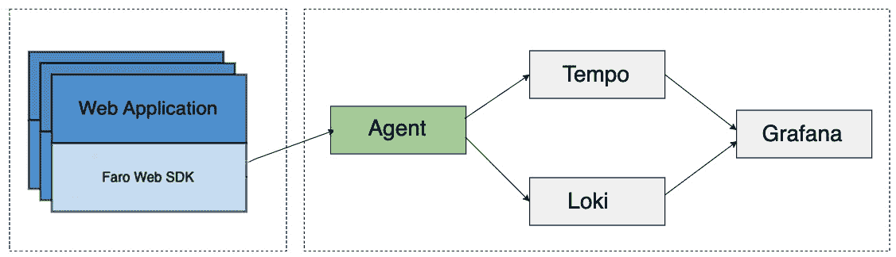
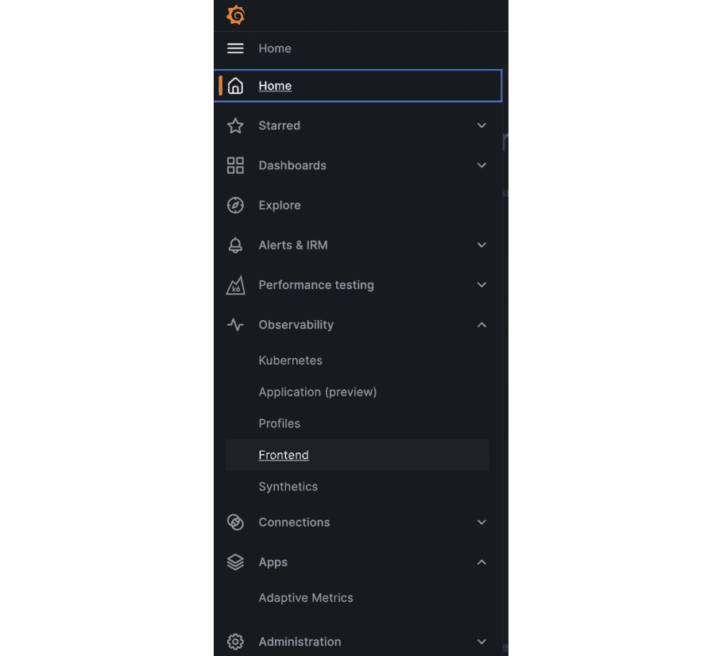
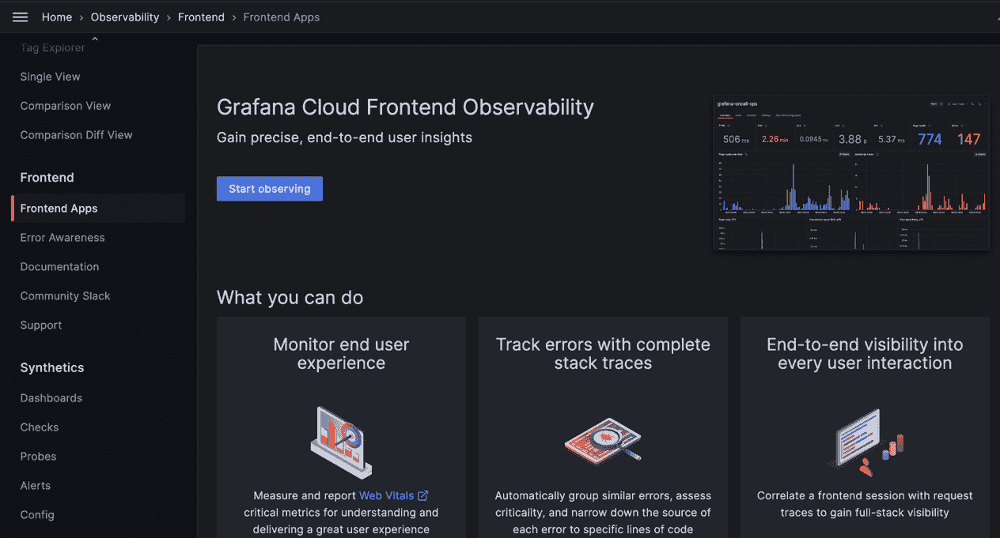
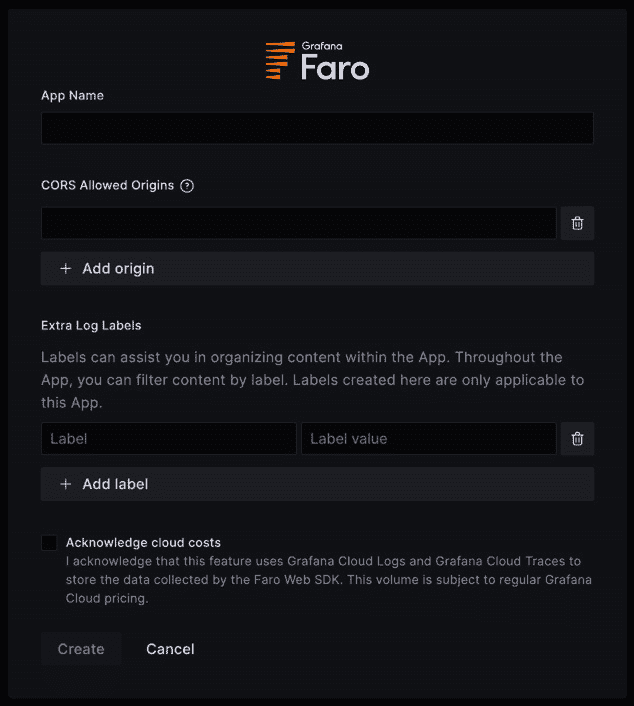
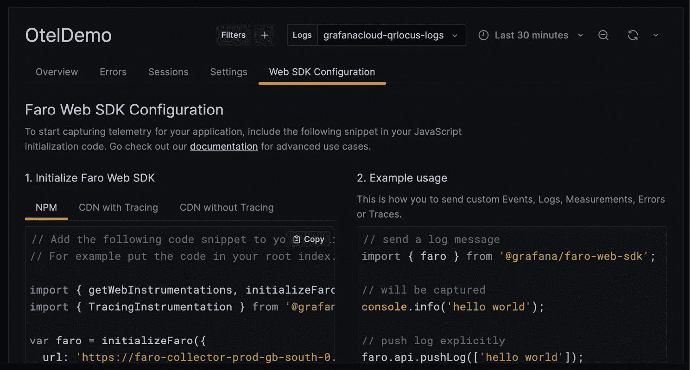
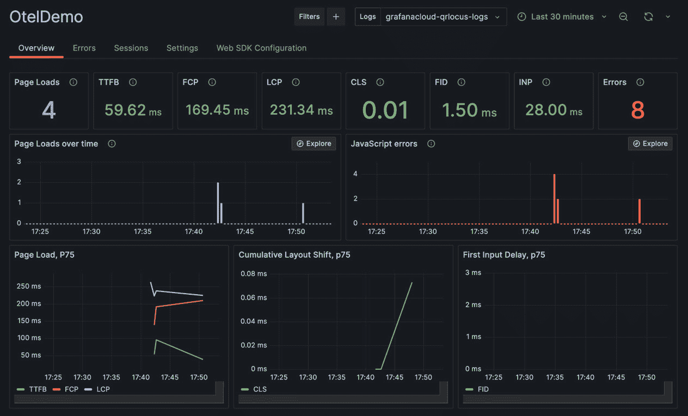
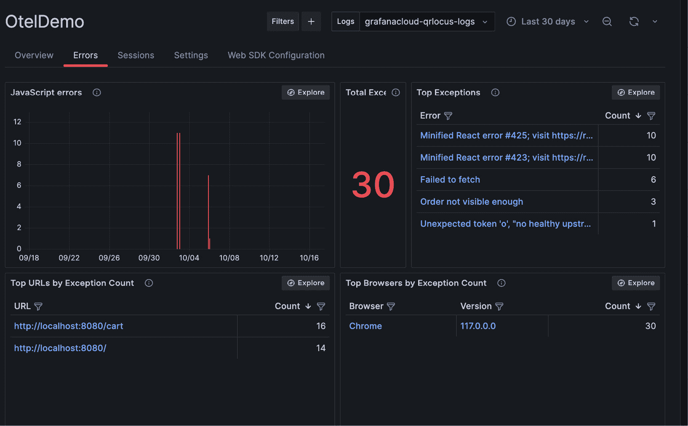
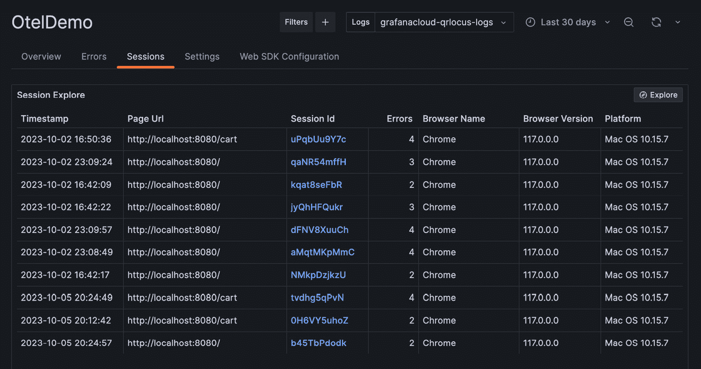
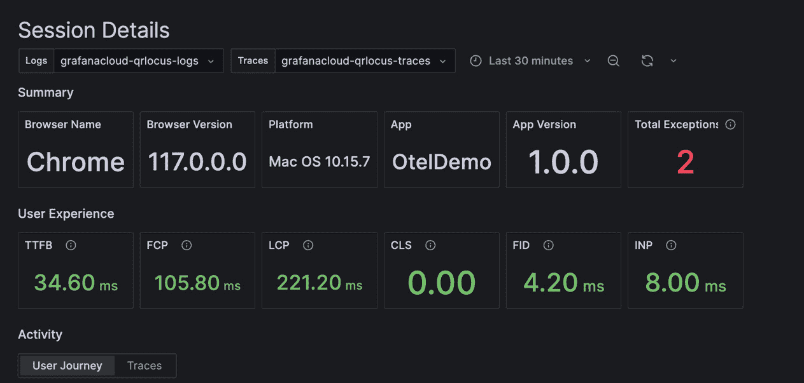
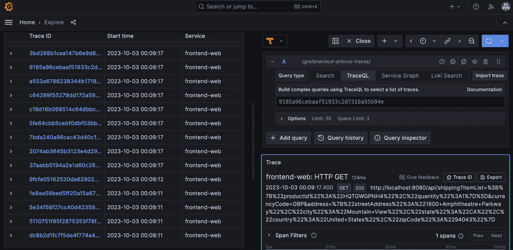

# 第十二章：使用 Grafana 进行真实用户监控

在本章中，我们将探讨使用 **Grafana Cloud 前端可观察性** 和 **Faro Web SDK** 进行 **真实用户监控**（**RUM**）。我们将了解什么是 RUM，如何利用它解决实际用户问题，以及一些需要关注的重要指标。接着，我们将介绍如何在 Grafana Cloud 实例中设置前端可观察性，以及其中包含的预构建仪表盘。我们还将探讨如何将前端可观察性数据与后端遥测数据关联，形成更完整的视图。最后，我们将讨论收集前端数据的最佳实践。

在本章中，我们将涵盖以下主要内容：

+   引入 RUM

+   设置 Grafana 前端可观察性

+   探索 Web Vitals

+   从前端到后端数据的转换

+   增强和自定义配置

# 引入 RUM

**RUM** 是描述收集和处理浏览器遥测数据的术语，用于描述你 web 应用前端的健康状况。它让我们从用户浏览器到后端系统，实时地鸟瞰用户交易的全过程。这种遥测数据的好处在于，它为我们提供了用户实际体验的洞察，尤其是应用的性能表现。

Grafana 通过以下组合实现 RUM：

+   Grafana Faro Web SDK，当嵌入到你的 web 应用中时，默认收集以下遥测数据：

    +   Web Vitals 性能指标

    +   未处理的异常

    +   浏览器环境信息

    +   页面 URL 变化

    +   会话标识（用于数据关联）

    +   活动轨迹

    除了默认设置外，SDK 还可以配置为将自定义元数据、度量和指标发送到 Grafana，以增强前端可观察性。Faro Web SDK 集成了 opentelemetry-js，提供基于 Open Telemetry 的应用程序追踪。此 SDK 是开源的，仓库地址为 [`github.com/grafana/faro-web-sdk`](https://github.com/grafana/faro-web-sdk)，并附有详细文档和示范代码。

+   一个云托管的浏览器遥测接收器（你也可以选择在自己的基础设施上部署 Grafana Agent）。云托管接收器会在你启用 Grafana Cloud 的应用可观察性时创建并配置（我们将在下一节带你完成设置步骤）。

+   每个你创建的前端可观察性应用，都有一个专用的 Grafana 应用界面，其中包含作为标签的仪表盘（我们将在本章稍后部分讨论这些仪表盘标签）。

下图展示了左侧框中安装了 Faro Web SDK 的 *前端应用* 和右侧框中用于摄取、存储和展示遥测数据的 *Grafana Cloud 组件* 之间的关系：

图 12.1 – 前端关系图

Grafana Faro Web SDK 收集遥测并将其转发到 Grafana Cloud 中的收集器端点，然后处理并发送到适当的后端 – Loki 用于日志和 Tempo 用于跟踪。通过 Loki 的 LogQL 度量查询生成指标，我们在*第四章* 中讨论过。生成的指标在 Grafana Cloud 前端可观测性应用程序仪表板中显示。

现在让我们看一下设置 Grafana 前端可观测性的步骤。

# 设置 Grafana 前端可观测性

要开始监视您的应用程序前端并配置 Grafana Cloud 前端可观测性，请按照以下步骤操作：

1.  在您的 Grafana 实例中，从菜单中选择 **可观测性** | **前端**：

图 12.2 – Grafana 可观测菜单

1.  **前端应用程序** 登录页面将显示。如果这是您第一次来到这里，您将看到一个 **开始观察** 按钮 – 请点击它。

图 12.3 – Grafana 云前端可观测屏幕

如果您已经设置了前端应用程序，它们将在此列出，并且会有一个 **创建新** 按钮，而不是 **开始观察** 按钮。单击任一按钮都会显示 **创建新应用** 弹出窗口。

1.  在 *图 12**.4* 中显示的 **创建新应用** 弹出窗口需要一个应用程序名称，**跨域资源共享** (**CORS**) 地址和额外的标签详细信息（这些是要添加到 Loki 日志中的标签，当它们进入 Grafana Cloud 时）。此外，您还将被要求确认与此功能的额外遥测相关的云成本：

图 12.4 – 创建新应用屏幕

1.  完成表单后，将为您提供几种选项，以便使用 **NPM**、**带有跟踪的 CDN** 或 **不带跟踪的 CDN** 将 Faro Web SDK 集成到您的前端应用程序中。您需要决定哪种最适合您的应用程序开发要求：

图 12\. 5 – Web SDK 配置

当您在应用程序中连接 Faro Web SDK 到 Grafana 时，我们在本节开头确认的默认遥测将开始发送。

您的可观测性前端应用程序的 **概述** 标签将类似于以下截图，并包含在 Grafana 前端可观测性中显示的关键指标的主要仪表板：

图 12.6 – 前端可观测性概述标签

在 **概述** 标签旁边是 **错误** 和 **会话** 标签，帮助您调查您的应用。让我们更详细地看看这些标签：

+   仪表板顶部行的 **概览** 标签显示了重要的 **Web 重要指标**，包括 **核心 Web 重要指标**。Web 重要指标是谷歌发起的一项计划，旨在为报告网页用户体验所需的关键指标提供统一的指导。

+   **错误** 标签详细列出了任何前端异常、异常发生的位置以及受影响的浏览器：

图 12.7 – 前端可观察性错误标签

+   **会话** 标签展示了可供分析的用户会话列表。我们将在 *从前端到后端的转变* *数据* 部分详细探讨这一点。

**设置** 和 **Web SDK 配置** 标签帮助你配置连接（**设置** 允许你修改本节第 *3* 步中输入的值，**Web SDK 配置** 提供了第 *4* 步中看到的配置）。

在接下来的部分，我们将更详细地查看 Web 重要指标，以了解我们为前端应用程序捕获和报告的信息。

# 探索 Web 重要指标

为了说明提供给用户的体验质量，Web 重要指标报告了用户交互的多个方面。Web 重要指标是谷歌的一项计划，旨在为提供出色的网页用户体验所必需的质量信号提供统一的指导。你可以在 [`web.dev/articles/vitals`](https://web.dev/articles/vitals) 上阅读有关 Web 重要指标项目的详细信息，特别是有关核心 Web 重要指标的信息，详见 [`web.dev/vitals/#core-web-vitals`](https://web.dev/vitals/#core-web-vitals)。

在 **概览** 标签中使用的重要 Web 重要指标如下：

| **指标** | **描述** |
| --- | --- |
| **核心** **Web 重要指标** |
| **最大内容绘制** (**LCP**) | LCP 指标衡量的是相对于页面开始加载时，最大可见部分的显示时间。这可能是完全加载的文本或图像，显示在访客的屏幕上。目标 LCP 应 <= 2.5 秒。更多详情，请参考 [`web.dev/articles/lcp`](https://web.dev/articles/lcp)。 |
| **首次输入** **延迟** (**FID**) | FID 指标衡量的是访客点击链接到浏览器开始处理该事件之间的时间。目标 FID 应 <= 100 毫秒。更多详情，请参考 [`web.dev/articles/fid`](https://web.dev/articles/fid)。计划在 2024 年 3 月将 FID 替换为 **与下一次绘制的交互** (**INP**) 作为核心 Web 重要指标。 |
| **累计布局** **偏移** (**CLS**) | CLS 指标衡量的是任何可见元素位置发生变化的情况。当访客体验布局变化时，持续时间会被捕获，累计得分会被报告。目标 CLS 应 <= 0.1。更多详情，请参考 [`web.dev/articles/cls`](https://web.dev/articles/cls)。 |
| **其他** **Web 重要指标** |
| **首次字节时间** (**TTFB**) | TTFB 指标衡量的是从请求网页资源到响应的第一个字节开始到达之间的时间。访问者通常无法察觉到这一点，但它是衡量响应性、内容传递到访客的一个良好指标。目标 TTFB 应小于等于 0.8 秒。更多详细信息，请参考[`web.dev/articles/ttfb`](https://web.dev/articles/ttfb)。 |
| **首次内容绘制** (**FCP**) | FCP 指标衡量的是从页面开始加载到页面任何部分显示在屏幕上的时间——本质上，就是当你的访客实际看到他们请求的网站内容时的时间。目标 FCP 应小于等于 1.8 秒。更多详细信息，请参考[`web.dev/articles/fcp`](https://web.dev/articles/fcp)。 |
| **交互到下一页** **绘制** (**INP**) | INP 指标衡量的是页面在访问者会话期间的响应速度。它通过观察每一次点击、触摸和键盘交互的延迟来实现这一点，并取最长的延迟（忽略异常值）。INP 的目标值应小于等于 200 毫秒。更多详细信息，请参考[`web.dev/articles/inp`](https://web.dev/articles/inp)。 |

表 12.1 – 重要的 Web Vitals 指标

现在我们已经了解了一些需要考虑的重要前端指标，让我们来看看在调查问题时，如何将注意力转向后端遥测数据。

# 从前端数据转向后端数据

一旦你开始收集前端可观察性数据，你将能够将其与后端和基础设施的遥测数据进行关联。当你使用 Loki 来处理日志、Tempo 来处理跟踪、以及 Mimir 来处理指标时，Grafana 为你提供了简单的接口来实现这一目标。

在 Grafana Cloud 前端可观察性应用中，有现成的仪表板使得导航和调查变得简单。正如在*设置 Grafana 前端可观察性*部分中讨论的那样，应用菜单有三个主要部分，分别是**概览**、**错误**和**会话**。**会话**选项卡允许我们进入系统生成并发送到 Grafana 的其他遥测数据。你可以在下面的截图中看到多个请求指向不同的页面 URL，以及相关的会话 ID：

图 12.8 – 会话选项卡

点击**会话 ID**条目将带你进入详细视图，在那里你可以看到该特定访问者会话的 Web Vitals，相关的异常，以及如果你对系统的其他部分进行了监控，还可以看到**跟踪**链接：

图 12.9 – 会话详情屏幕

选择**追踪**将带您进入**探索**视图，查看完整的系统追踪，您可以轻松导航到来自后端的关联 Loki 日志，提供了浏览系统的能力。这展示了通过全链路可观测性仪表盘所能带来的额外价值：

图 12.10 – 系统追踪的探索视图

默认会话的定义如下：

+   **会话开始**：访问者进入网页，初始化 Faro，开始一个新的会话

+   **会话结束**：访问者离开页面，会话被销毁（默认情况下，不会发送会话结束事件）

然而，您可以根据自己的使用案例定义会话逻辑。Faro 的会话仪表化文档可以参考[`grafana.com/docs/grafana-cloud/monitor-applications/frontend-observability/faro-web-sdk/components/provided-instrumentations/#session-tracking`](https://grafana.com/docs/grafana-cloud/monitor-applications/frontend-observability/faro-web-sdk/components/provided-instrumentations/#session-tracking)中的可用配置。

现在让我们来看看考虑前端可观测性时的一些最佳实践。

# 增强功能和自定义配置

在所有可观测性中，您需要考虑您的使用案例。这在考虑前端可观测性时尤为重要，因为您将在访问者的浏览器中操作。有几个增强功能可以在默认实现的基础上改进前端可观测性。然而，这些增强功能需要额外的配置、更多的开发工作，并且可能对访问者的浏览器产生更大的影响。不过，它们可以显著提高前端可观测性仪表盘所提供的价值。

让我们探讨一下前端可观测性的增强功能：

+   **前端追踪**：提供了更好的关联性，能够将真实用户交互与后端事件联系起来。它需要额外的 OpenTelemetry SDK 配置，并且会增加一定的浏览器负载，因此需要仔细考虑其影响并进行测试。

+   **自定义错误**：为具有错误处理的系统提供了改进的可观测性。需要额外配置，手动将 Faro Web SDK 添加到错误处理管道中，以将错误推送到 Grafana。

+   **自定义度量**：提供了增强的遥测功能，包含应用特定的数据。需要额外配置，手动将 Faro Web SDK 添加到管道中，以将额外的度量数据推送到 Grafana。

+   **自定义日志**：提供了发送支持元数据的能力，帮助您了解访问者的体验。需要额外配置和开发工作来进行仪表化。

+   `kind=event`。我们在*第四章*中学习了有关 Loki 标签的所有内容。

如果你没有准备好前端应用程序进行仪表化，可以使用 Faro Web SDK 提供的演示项目进行实验。这将帮助你更详细地了解发生了什么以及它是如何工作的：[`github.com/grafana/faro-web-sdk/blob/main/demo/README.md`](https://github.com/grafana/faro-web-sdk/blob/main/demo/README.md)。

现在让我们总结本章内容，并展望下一章。

# 总结

在本章中，我们探讨了用户监控以及通过全面的端到端可观察性仪表化所获得的额外价值。我们了解了 Grafana 如何通过 Grafana 前端可观察性和 Faro Web SDK 提供这一能力。接着，我们看到了 Web Vitals 指标，这对于解读访客体验非常重要。我们还研究了内置仪表板，它们帮助你在 Grafana 中导航到后端遥测数据，赋予你完全诊断问题的能力。最后，我们探讨了一些前端可观察性的最佳实践和自定义配置。

在下一章，我们将学习如何使用**Pyroscope**和**k6**从 Grafana 监测应用程序性能的不同方面。
