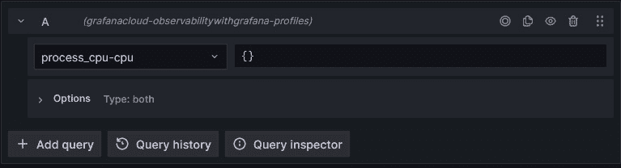
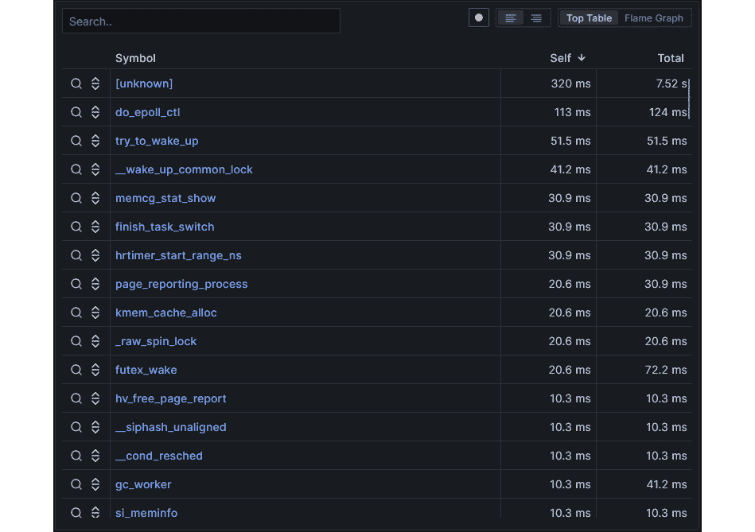
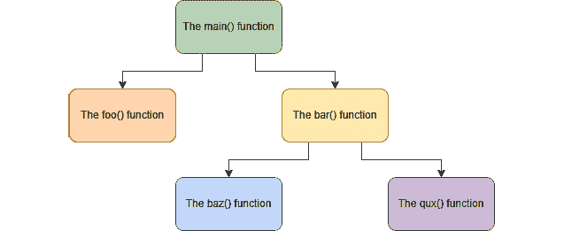
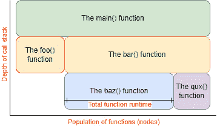
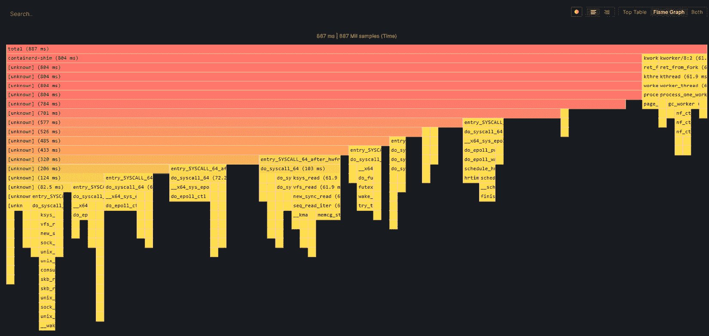
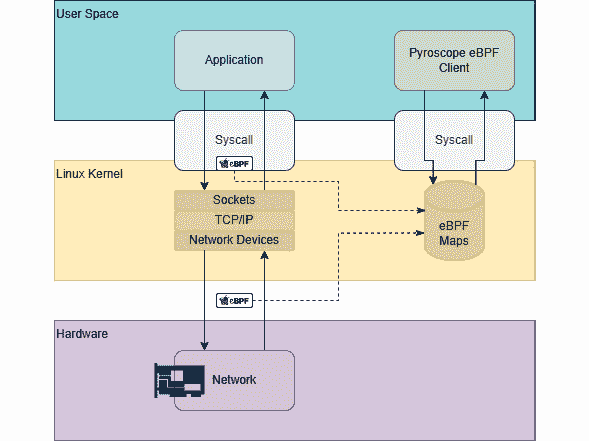
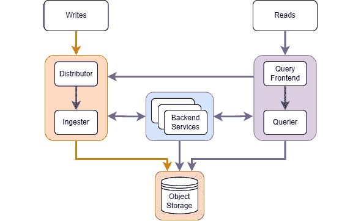
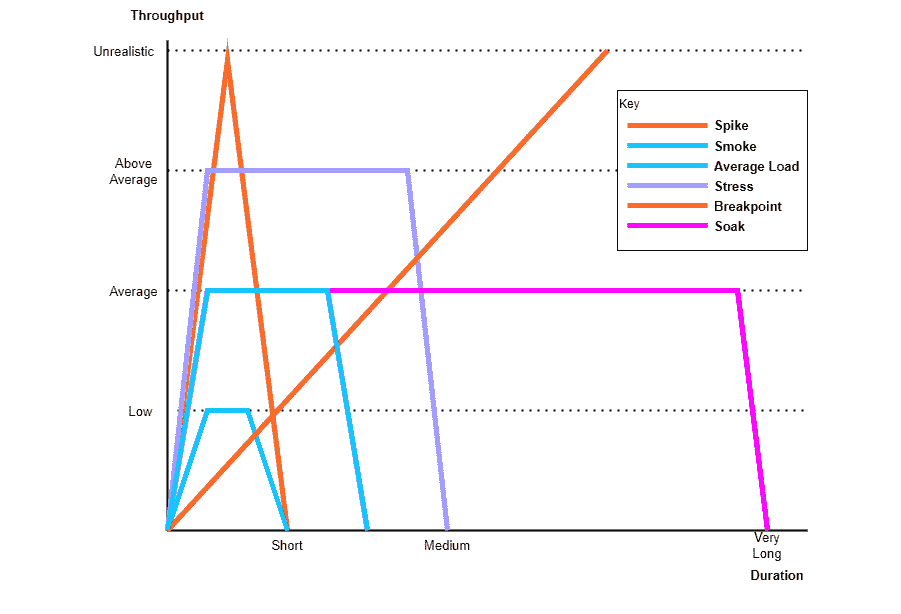

# 13

# 使用 Grafana Pyroscope 和 k6 进行应用性能分析

本章将探讨两个工具，**Pyroscope** 和 **k6**。Pyroscope 是一个 **持续性能分析** 工具，允许用户收集关于系统资源使用的非常详细的信息，比如 CPU 和内存。k6 是一个 **负载测试** 工具，可以通过端点与应用程序交互，或通过脚本方式在浏览器会话中使用。

在 Pyroscope 中，我们将学习如何搜索数据，这将帮助您更好地理解如何利用可用数据。接着，我们将展示如何通过安装客户端或向应用代码中添加原生语言 SDK 来加入插桩以收集这些数据。最后，我们将看到 Pyroscope 新版本的架构如何利用 Grafana 在高可扩展存储平台方面的知识，使用廉价的块存储将 Pyroscope 带入为开发者提供真正持续性能分析的路径。这项功能将帮助那些需要查看代码执行情况的人，改善运营成本或最终用户性能。

k6 将稍微偏离可观察性，进入与之紧密相关的负载或性能测试领域。我们将讨论负载测试的一般原则，并查看您可能需要的不同类别的负载测试。接着，您将学习 k6 使用的脚本语言，方便编写测试来验证应用程序是否按预期运行。我们将了解 k6 如何使用 **虚拟用户**（**VUs**）来扩展测试并为应用程序创造显著负载，您可以利用它证明您的应用程序按预期运行。最后，我们将看到如何安装 k6，以及它如何足够灵活，甚至可以作为 CI 流水线的一部分运行，确保您的应用程序持续接受负载测试。

本章我们将涵盖以下主要内容：

+   使用 Pyroscope 进行持续性能分析

+   使用 k6 进行负载测试

# 使用 Pyroscope 进行持续性能分析

首先，让我们解决一个问题，那就是**连续剖析**是什么。如同本书开头所提到的，当系统的内部状态可以从其外部输出中推测出来时，系统是可观察的。我们已经看到了三种输出遥测：日志、指标和追踪。剖析数据是另一种遥测形式。剖析数据是与工作负载资源使用相关的低级数据，如 CPU 或内存的使用情况。由于剖析工具分析的是非常底层的系统数据，它们捕获的信息包括特定应用函数的运行时间或内存中的对象数量。这对于领域专家检查应用程序行为非常有力，这种能力能够带来显著的性能和成本改进。剖析技术已经存在很长时间了，任何生成过堆栈跟踪的人都会知道这一点。Pyroscope 提供了连续捕获这种剖析数据的能力，默认间隔为 15 秒。能够在应用程序的生命周期内持续收集这些遥测数据，可以深入了解应用程序随时间的运行情况，这能够将代码库的内部工作与日志、指标和追踪中看到的特定用户行为联系起来。

在本节中，我们将简要介绍 Pyroscope。你将学习如何搜索 Pyroscope 收集的数据。我们将讨论如何配置客户端以收集剖析数据，并将研究 Pyroscope 服务器的架构。

## Pyroscope 简介

Pyroscope，也被称为 Grafana Cloud Profiles，成立于 2020 年，并在 2023 年被 Grafana Labs 收购。Pyroscope 团队从 Grafana Labs 的一个实验性产品 Phlare 中加入，该产品现在成为了 Grafana Cloud 的标准产品之一。Pyroscope 的一些关键特性如下：

+   使用与 Loki、Mimir 和 Tempo 相同架构的优秀水平扩展性

+   剖析数据的廉价存储

+   可以将数据存储在本地或使用 Grafana Cloud

+   高频率采样，产生非常细粒度的数据

现在，让我们来探讨如何检查 Pyroscope 收集的数据。

## 搜索 Pyroscope 数据

可以通过在 Grafana UI 中选择 Pyroscope 数据源，使用**Explore**视图查看剖析遥测数据。虽然该视图与 Loki、Mimir 和 Tempo 类似，但查询语言受到遥测类型的限制；实际上，只能使用选择功能，通过标签选择来自应用程序或应用程序组的信号。你将在此视图中看到用于选择 Pyroscope 数据源数据的界面：



图 13.1 – Pyroscope 查询面板

第一个需要查看的视图是`top`命令，这个视图应该是熟悉的。该视图列出了每个函数及其所花费的时间。**Self**列显示该函数所花费的时间。**Total**列显示每个函数运行的总时间。这可以帮助用户查看运行时间较长的函数。较长的运行时间可能表明一个低效的函数，但也可能意味着这个函数对应用程序至关重要。需要领域知识才能理解在哪些地方可以进行改进。以下截图显示了**Top** **Table**视图：



图 13.2 – Pyroscope 顶部表格视图

第二个视图是**火焰图**视图。这个图表专门设计用来可视化分析数据。**火焰图**的发明是为了能够可视化应用程序的堆栈跟踪输出，从而简化调试工作。在我们查看 Pyroscope 中的视图之前，先来看一个示例应用程序的堆栈跟踪：



图 13.3 – 示例应用程序堆栈跟踪

我们可以看到有一个`main()`函数，它在应用程序启动时被调用。这个函数依次调用子函数`foo()`和`bar()`，而`bar()`也会调用`baz()`和`qux()`函数。火焰图通过将子函数分组在其父函数下，捕捉了这些堆栈调用的层次结构。这让我们能够通过查看*y*轴来了解调用堆栈的深度。函数的总数量显示在*x*轴上；重要的是，这不代表时间，而是每个在采样期间出现在调用堆栈中的函数。火焰图中每个函数的框宽度表示该函数在采样期间花费的总时间，进而可视化了每个函数的持续时间。我们来看看这个实际的例子：



图 13.4 – 来自堆栈跟踪的示例火焰图

在这个示例火焰图中，我们可以看到`baz()`函数占用了大量的操作时间。在某些应用程序中，这是完全预期的行为；而在其他应用程序中，这可能表明需要优化的函数。

很少有应用程序像这个示例一样简单。接下来，我们看看 OpenTelemetry 演示应用程序中的真实火焰图：



图 13.5 – 一个真实的火焰图

我们已经看到像 Pyroscope 这样的连续分析工具在编写高效代码和调试问题中非常有价值。接下来，我们来看看如何收集分析数据。

## 连续分析客户端配置

目前有三种独立的方式收集 Pyroscope 的数据，尽管我们预期随着 Pyroscope 技术的不断发展，这些方式将会演变。对于那些希望了解此项激动人心技术最新进展的朋友，我们建议参考 Grafana Labs 的博客（https://grafana.com/blog/）。接下来，让我们探讨如何设置每一种方法：

+   **扩展伯克利数据包过滤器（eBPF）客户端**：收集 Pyroscope 配置数据的第一种方法是利用 Linux 内核级工具 eBPF。这个工具允许配置客户端查看服务器或节点上运行的所有应用程序的跟踪信息。eBPF 客户端将这些数据与数据源的元数据（例如 Kubernetes Pod 或命名空间）结合，然后将这些配置信息发送到 Pyroscope 后端。下图显示了 eBPF 如何为 Pyroscope 客户端收集数据的简化视图：



图 13.6 – eBPF 客户端进程

使用 eBPF 时，内核收集配置数据以及其他几种类型的数据，并将其存储在 eBPF 映射中。Pyroscope 将数据链接到 eBPF 映射中，打包数据，然后将其发送到配置的后端进行存储。

+   **本地语言仪器**：收集配置数据的第二种方法是使用特定语言的 Pyroscope SDK 向应用程序添加仪器。目前，Go、Java、.NET、Python、Ruby、Rust 和 Node.js 都提供 SDK。除了 Go SDK 之外，所有这些库仅支持*推送*模式操作。Go 支持*推送*和*拉取*模式操作；拉取模式允许 Grafana 代理从应用程序发布的抓取端点收集配置数据。在推送模式下，目前需要在应用程序级别添加 Pyroscope 服务器地址、基本身份验证用户名和密码，尽管随着该工具的成熟，我们相信这将在操作环境中变得更易于管理。

+   **仪器化 Lambda 函数**：Pyroscope 还为 AWS Lambda 函数提供工具。这包括一个 Lambda 扩展，当函数被触发时，作为一个层加载。这样，配置工具可以异步收集所需的配置遥测数据，而不影响 Lambda 函数的操作。与本地语言仪器一样，必须提供环境变量，其中包括 Pyroscope 后端的远程地址和相关的身份验证令牌。

    对于运行无服务器函数的团队，这为查看 Lambda 函数的“黑匣子”提供了能力，并允许团队回答以下问题：*为什么我的 Lambda 费用这么高？*，*为什么我的延迟这么高？*，以及*为什么我的函数* *这么频繁失败？*

eBPF 客户端、SDK 和 Lambda 方法各有利弊：它们的使用取决于使用场景。以下是每种方法的一些优缺点：

| **工具化方法** | **优点** | **缺点** |
| --- | --- | --- |
| eBPF | 可以轻松收集全系统的系统级配置文件。基础设施元数据易于添加（例如，Kubernetes Pod 或命名空间）。易于管理多语言或大型系统。可以与本地语言工具化结合使用。 | Linux 内核限制。标记用户级代码的能力有限。一些配置文件类型的收集性能差（例如，内存使用）。本地开发环境更为复杂。 |
| 本地语言 | 灵活标记代码。对代码特定部分进行详细分析。能够分析其他类型的数据（例如，内存使用）。在本地开发环境中使用简单。 | 管理多语言或大型系统比较困难。难以自动标记基础设施元数据（例如，Kubernetes Pod 或命名空间）。 |
| Lambda 函数 | 允许从无服务器函数收集追踪数据。与本地语言支持相连接以对函数进行工具化。 | 当前仅适用于 AWS Lambda。 |

表 13.1 – Pyroscope 工具化方法的优缺点

我们已经看过了不同的应用程序和客户端设置方式来收集配置数据。接下来，让我们考虑 Pyroscope 的存储和查询架构。

## 理解 Pyroscope 架构

Pyroscope 1.0 引入了对 Pyroscope 架构的重大变化。该变化利用了 Grafana 对 Cortex 架构的知识，使架构具备水平扩展能力。这是与之前版本的断裂性变化，因此我们将仅考虑从这个变化开始的架构。

类似于 Loki、Mimir 和 Tempo，Pyroscope 使用低成本、高可用的块存储，如 Amazon S3、Google Cloud Storage 或 Microsoft Azure Storage，以提供大规模扩展能力。以下是 Pyroscope 架构的示意图：



图 13.7 – Pyroscope 架构

当数据被写入时，它会被发送到 **Ingester**，该组件将数据持久化到 **对象存储**。在 **读取** 方面，查询被拆分并分片到 **Querier** 实例，后者从 **Ingester** 和/或长期存储中获取所需的数据。

市场上有几个替代 Pyroscope 的工具可能会引起你的兴趣。开源工具包括 OpenTelemetry eBPF、Parca 和 profefe，还有几个观察性供应商也提供类似的分析工具。这些工具可以在 [`github.com/open-telemetry/opentelemetry-ebpf`](https://github.com/open-telemetry/opentelemetry-ebpf)、[`www.parca.dev/`](https://www.parca.dev/) 和 https://github.com/profefe/profefe 找到。我们现在已经看过了 Pyroscope 的功能。另一个对开发人员和测试人员有帮助的工具是 k6 负载测试。接下来让我们看一下这个工具。

# 使用 k6 进行负载测试

负载测试是将已知的人工负载施加到应用程序上，以观察其行为的实践。这个术语通常与性能测试交替使用，我们将遵循 k6 文档，使用*平均负载*来区分特定类型的测试。

可以应用几种不同类型的负载测试；它们在两个维度上有所不同——负载吞吐量和持续时间。它们在执行的测试内容上也可能不同。下表展示了一些常见的测试类型：

| **测试** | **描述** | **目的** | **运行时长** **与流量** |
| --- | --- | --- | --- |
| **冒烟测试** | 这些测试旨在验证系统是否正常工作。它们也可以称为健全性测试或信心测试。冒烟测试这个名称源自测试设备时，通过开启设备并检查是否冒烟。 | 这些测试旨在快速验证系统是否符合预期，或者是否存在问题。 | 这些测试应该快速进行，通常是几分钟而非几小时。它们应为低流量。 |
| **平均** **负载测试** | 这些测试展示了系统在大多数条件下的使用情况。 | 这些测试旨在模拟系统上最常见的负载水平。 | 这些测试应该相对快速地进行，但比冒烟测试慢。它们应模拟平均流量。 |
| **压力测试** | 这些测试通过高于平均水平的峰值流量来测试系统。 | 这些测试旨在模拟如果在较长时间内经历峰值流量时系统会发生什么。 | 这些测试应该在一天之内完成。它们应模拟大量流量。 |
| **峰值测试** | 这些测试应该展示系统在短时间内经历突如其来的、大量的流量激增时的表现，就像在**拒绝服务**（**DoS**）攻击中看到的那样。 | 这些测试旨在测试系统如何应对突如其来的、极大的流量激增，如 DoS 攻击。 | 这些测试应该快速进行。它们应模拟不现实的大量流量。 |
| **突破点测试** | 这些测试逐渐增加流量，直到系统崩溃。 | 这些测试旨在了解在负载增加时系统何时会失败。 | 这些测试可以运行较长时间。它们应模拟稳定增长的流量速率。 |
| **浸泡测试** | 这些测试评估系统在长时间运行下的性能。它们类似于在显著更长时间内进行的平均负载测试。 | 这些测试旨在展示系统在实际操作中长时间运行时的表现。它们适用于发现诸如内存泄漏等问题。 | 这些测试将运行较长时间，如 48 小时。它们应模拟平均流量。 |

表 13.2 – 负载测试类型

下图展示了不同的测试，供参考：



图 13.8 – 不同负载测试类型的视觉表示

在前面的图中，我们可以看到通过测试吞吐量和测试持续时间来绘制的不同类型的测试。尝试将你在图表中看到的内容与在*表 13.2*中学到的这些测试相对应。

你可以看到，负载测试和可观察性紧密相关。从实时系统收集的数据将展示出什么是平均负载和不现实的负载。通过冒烟测试注入的数据可以显示系统是否按预期工作，例如在新版本部署后。负载测试环境中收集的数据可以提供关于系统在负载下运行的关键见解。

将从负载测试中收集到的可观察性数据与其他数据分开是一个良好的实践。由于所尝试的测试的性质，可能会生成大量数据，这可能会是一个非常昂贵的收集过程。像 Grafana 这样的开源系统的一个巨大优势是能够将数据存储系统作为负载测试环境的一部分运行，并使用与生产环境中相同的可视化方式。

市场上有几种负载测试工具，既有开源的也有商业的。开源工具包括 JMeter、k6、Gatling、Locust、Artillery、Tsung、Vegeta、Hey 和 Siege。由于本书关注 Grafana 工具，我们这里只讨论 k6。让我们来看看 k6 的一些特点。

## k6 简介

k6 是由 Grafana Labs 在收购 LoadImpact 后开发的负载测试工具。k6 提供了几个关键特性：

+   一个**命令行接口**（**CLI**），可以用于运行、暂停、恢复或扩展测试。

+   能够在本地、Kubernetes 集群或通过 CLI 在云端启动测试。k6 支持通过 Kubernetes 操作员进行分布式运行。

+   使用 JavaScript 的脚本支持。

+   将额外的模块加载到脚本中的能力，尽管这不包括对 Node.js 模块的支持。

+   一个浏览器模块，添加浏览器级别的 API，用于完整的前端测试。

+   支持使用检查和阈值进行目标导向的负载测试。

+   很好的支持工具，如下所示：

    +   参考项目

    +   将其他工具的脚本转换为 k6 的工具

    +   将 k6 输出转换为其他常见格式的工具

    +   一个图形界面用于测试构建

现在让我们看一下编写简单测试的过程。

重要提示

由于 k6 需要测试文件才能运行，我们在这些编写测试的说明后面加入了安装和使用说明。

## 使用检查编写测试

测试是使用 JavaScript 在 k6 中编写的。一个非常简单的测试示例，向 `acme` 网站提交一个 `GET` 请求，可能是这样的：

```
import http from 'k6/http';
export default function () {
  http.get('http://www.acme.com');
}
```

这个脚本仅仅会向网页提交请求，但不会验证请求是否成功。`check` 功能用于确认请求是否成功，如下所示：

```
import { check } from 'k6';
import http from 'k6/http';
export default function () {
  const res = http.get('http://www.acme.com');
  check(res, {
    'is status 200': (r) => r.status === 200,
  },
  { company: 'Acme' }
  );
}
```

`check()`函数接受一个值，一个包含要针对该值运行的检查的对象，以及一个包含任何标签的对象。如果所有检查通过，则该函数返回`true`；否则，它返回`false`。`check`功能使得在脚本中检查简单条件变得非常容易。通常需要检查一个端点是否符合特定的期望，而 k6 为此提供了阈值。

## 使用阈值编写测试

阈值会检查脚本中所有发出的请求，使用团队设定的**服务级别目标**（**SLOs**）作为测试的起点是一个好习惯。以下是一个阈值测试的例子：

```
import http from 'k6/http';
export const options = {
  thresholds: {
    http_req_failed: ['rate<0.01'], // http errors should be less than 1%
    http_req_duration: ['p(95)<200'], // 95% of requests should be below 200ms
  },
};
export default function () {
  http.get('http://www.acme.com');
}
```

这个测试会调用`acme`网站，并检查内置的`http_req_failed`和`http_req_duration`HTTP 指标是否满足指定的阈值表达式。这些指标是从脚本中所有发出的请求收集的；在这个例子中，只有一个请求。如果需要，可以使用**groups**和**tags**来独立评估 HTTP 请求。

现在我们知道如何编写基本的脚本化测试，让我们看看如何使用`options`进行扩展。

## 向测试中添加场景以进行大规模运行

在上一节中，我们提到测试只会发出一个 HTTP 请求。通过使用`options`，可以以复杂的方式管理默认函数的行为。让我们考虑一个简单的例子，我们创建 100 个 VU，每个 VU 将重复执行默认函数 30 分钟：

```
import http from 'k6/http';
export const options = {
  vus: 100,
  duration: '30m'
};
export default function () {
  http.get('http://www.acme.com');
}
```

你可能会注意到，我们使用的是与前一节中创建测试阈值时相同的`options`常量。`options`配置选项提供了很多灵活性，用于定义测试的行为。通常需要与每个将运行测试的虚拟用户（VU）共享数据。让我们看看测试生命周期如何管理这些需求。

## 测试生命周期

k6 测试生命周期分为四个阶段。这些阶段在测试文件的顺序中被明确设置：

1.  **初始化代码**：这是出现在测试脚本顶部、设置代码之前的任何代码。它每个虚拟用户（VU）运行一次，用于加载文件、导入模块、配置测试中使用的选项，以及进行类似操作。

1.  `export function setup() { }`

1.  `export default function (data) { }`

1.  `export function teardown (data) { }`

现在我们已经很好地理解了如何使用 k6 运行测试，我们需要考虑不同的方式来安装和运行 k6。

## 安装和运行 k6

k6 以几种包格式提供：

+   Linux（`.rpm`和`.deb`）

+   macOS

+   Windows

+   容器化镜像

+   所有平台的独立二进制文件

在所有平台上的安装都非常简单，完整的安装说明可以在 k6 官网找到：[`k6.io/docs/get-started/installation/`](https://k6.io/docs/get-started/installation/)。

运行 k6 也非常简单，因为所有过程都可以通过 CLI 启动。这一点通过 `--help` 标志得到了很好的文档说明：

```
$ k6 --help
          /\      |‾‾| /‾‾/   /‾‾/
     /\  /  \     |  |/  /   /  /
    /  \/    \    |     (   /   ‾‾\
   /          \   |  |\  \ |  (‾)  |
  / __________ \  |__| \__\ \_____/ .io
Usage:
  k6 [command]
Available Commands:
  archive     Create an archive
  cloud       Run a test on the cloud
  completion  Generate the autocompletion script for the specified shell
  help        Help about any command
  inspect     Inspect a script or archive
  login       Authenticate with a service
  pause       Pause a running test
  resume      Resume a paused test
  run         Start a test
  scale       Scale a running test
  stats       Show test metrics
  status      Show test status
  version     Show application version
```

`k6 run` 和 `k6 cloud` 操作分别用于本地运行测试或通过 k6 云运行测试。以下是使用名为 `test.js` 的测试文件的一些示例命令：

+   运行单个虚拟用户一次：

    `k6` `run test.js`

+   运行 10 个虚拟用户，并在这些虚拟用户中运行 20 次测试：

    `k6 run -u 10 -i` `20 test.js`

+   在 20 秒内将虚拟用户数（VU）从 `0` 增加到 `50`，保持 `50` VU 数量持续 60 秒，然后在 10 秒内将虚拟用户数降回 `0`：

    `k6 run -u 0 -s 20s:50 -s 60s:50 -s` `10s:0 test.js`

这些命令中的 `k6 run` 都可以用 `k6 cloud` 替换，以使用 k6 云运行器，而不是从本地机器运行测试。

现在我们已经了解了如何使用 k6 执行负载测试，让我们总结一下。

# 总结

在本章中，我们探讨了 Grafana 作为其可观察性平台的一部分提供的两个工具：Pyroscope 和 k6。我们学习了如何搜索 Pyroscope 收集的配置文件数据，以及如何配置客户端以收集这些配置文件数据。我们还学习了如何使用原生语言 SDK 和 Lambda 层为无服务器应用程序对应用程序进行监控。最后，我们探索了新的 Pyroscope 架构，并看到它与 Loki、Mimir 和 Tempo 非常相似。这种新的可扩展性应该为 Pyroscope 提供空间，发展成一个重要的第四种遥测类型，使系统更具可观察性。

使用 k6，我们了解了各种类型的负载或性能测试。我们看到如何使用 JavaScript 语言编写测试，使用检查和阈值来表达应用程序的重要度量。我们了解了如何使用 `options` 来管理 k6 运行测试的方式，以及如何在脚本中添加正确的数据和功能，以最好地利用测试生命周期。最后，我们了解了安装和运行 k6 的过程，以及简单的操作如何使我们能够将该工具作为 CI/CD 流水线的一部分来连续进行负载测试，验证应用程序的性能是否符合 SLO。

在下一章中，我们将汇集所有工具、API 和知识，理解如何使用 Grafana 最好地支持 DevOps 原则。
