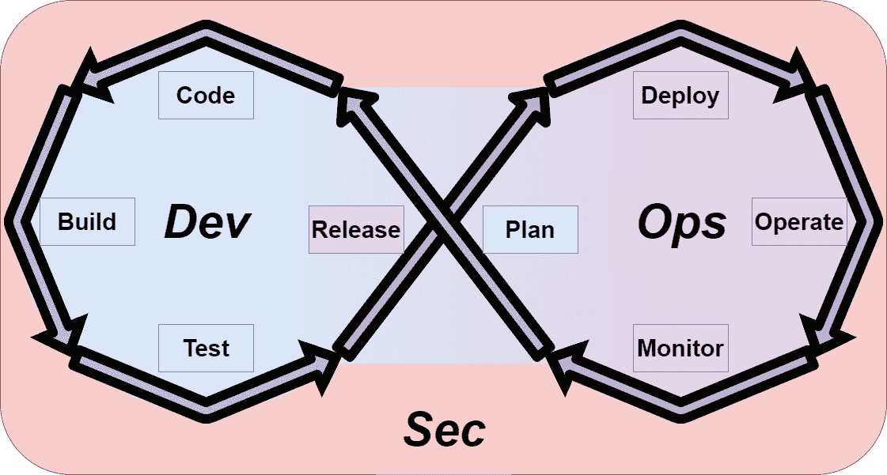
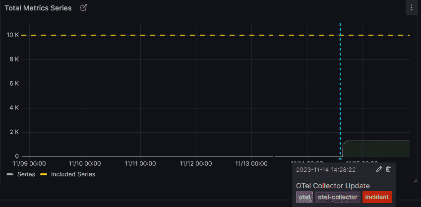

# 14

# 使用可观察性支持 DevOps 流程

本章将讨论 Grafana 在技术行业的两个不同方面的应用——**软件交付**和**平台操作**。

我们将简要介绍**DevOps 生命周期**，作为宝贵的基础知识。使用这一框架，我们将引导你了解 Grafana 在每个阶段的价值，从而丰富你组织中的软件开发过程。我们鼓励你花时间理解在这个过程中瓶颈所在，并将资源集中在最适合你团队或组织的阶段。

平台操作的典型特点是使用第三方应用程序。这去除了约一半的 DevOps 生命周期，因为这些阶段是由第三方完成的。我们将介绍在部署和操作几种平台时，使用 Grafana 时应考虑的事项。我们将探讨如何从可观察性平台中的数据采集工具收集数据，并考虑在这一业务关键系统发生故障时的灾难规划最佳实践。我们还将关注那些为组织提供**持续集成**（**CI**）或**持续交付/部署**（**CD**）能力的平台的运营者和用户的特殊需求，因为监控这些平台可能具有挑战性。我们将讨论用于监控数据库、内存数据存储、消息总线和 Web 服务器的资源，涵盖如何高效安装这些工具，以及这些常见工具如何在 Grafana 中提供公开可用的仪表盘供使用。最后，我们将简要介绍这种监控平台模式如何适用于某些安全工具。

本章将涉及技术概念，但并不要求具备单一工具的使用经验，本章应当对任何人都易于理解，无论其背景如何。

在本章中，我们将讨论以下主要主题：

+   介绍 DevOps 生命周期

+   在开发生命周期中使用 Grafana 进行快速反馈

+   使用 Grafana 监控基础设施和平台

# 介绍 DevOps 生命周期

在我们解释什么是 DevOps 生命周期之前，先来了解一下敏捷、DevOps、DevSecOps 和平台工程的历史。

迭代开发实践早在 1950 年代末期就已使用，但在 1990 年代，几种开发方法应运而生，作为对那些被视为繁重、微观管理、高度规范化且具有较高项目失败风险的开发实践的反应。这些新方法包括**快速应用程序开发**（**RAD**）、**Scrum**、**极限编程**和**特征驱动设计**（**FDD**）。这些方法都出现在敏捷宣言之前，但现在被视为敏捷实践。根据 2001 年发布的《敏捷宣言》，我们更倾向于以下做法：

+   个人与互动优于流程与工具

+   工作软件重于全面文档

+   客户协作重于合同谈判

+   响应变化重于遵循计划

这意味着，虽然右侧的内容有其价值，但我们更看重左侧的内容。

敏捷实践源于开发实践，虽然它们主要聚焦于开发团队，但与运营实践也有很多交集。这些宣言理念激发了对测试驱动开发、持续集成（CI）、持续交付（CD）等实践的浓厚兴趣。

在 2000 年代初，开发实践与运营实践分离的问题受到关注（尽管这些问题在 1980 年代和 1990 年代也曾提出）。这些关注点在 2009 年通过第一次*DevOps Days*大会得到了汇聚。DevOps 并没有像敏捷一样提出一个中央哲学，但它提出了旨在加速工作软件交付给客户的实践和措施。许多这些实践围绕着让开发人员、测试人员和运营人员更紧密地合作，通常通过将他们聚集在同一个团队中来实现。类似地，采用开发实践，比如使用版本控制系统（例如 Git），使得系统配置等运营问题能够成为整个软件系统共同理解的一部分。

DevOps 有多个分支、扩展和概念。对于那些有兴趣进一步阅读的人，以下是其中的一些：**ArchOps**、**站点可靠性工程**（**SRE**）、**DevSecOps**、**DataOps**、**12 因子应用**或**15 因子应用**、**基础设施即代码**（**IaC**）、**配置即代码**（**CaC**）以及**GitOps**。

亚马逊首席技术官 Werner Vogels 在 2006 年的一句话成为 DevOps 运动的口号：“*你构建它，你就运行它*。”这句话非常有道理。让设计和开发产品的团队也负责其运维，意味着事件能够更快得到解决，客户反馈能够被及时听取并回应。团队能够更加敏捷！当管理得当并且组织结构合适时，这是一种非常有效的运作方式。然而，正如 Matthew Skelton 和 Manuel Pais 在《团队拓扑学》一书中的分析所示（[`web.devopstopologies.com/index.html#anti-types`](https://web.devopstopologies.com/index.html#anti-types)），许多反模式可能会出现，并导致组织内的功能失调。这种方法也可能会给开发团队带来巨大的认知负担，使得组织更难应对变化。

你可能会问，为什么我们在解释 DevOps 生命周期是什么时，还要包括这段历史。原因是要提醒你，DevOps 生命周期是一个工具，在大多数组织中，它是多个流程的集合；虽然它们有价值，但不应该比个体和互动更有价值。负责管理面向客户的软件系统的团队，与负责管理平台以支持组织目标的团队，在与可观测性平台的互动方式上会有显著差异。考虑到这一点，让我们看一下 DevOps 生命周期，它为我们提供了一个很好的框架，通过这个框架，我们可以讨论在生命周期中使用可观测性平台的许多方面：

图 14.1 – DevOps 生命周期

重要提示

DevOps 或 DevSecOps 没有明确的定义。DevOps 生命周期本身涵盖了开发和运维，而安全性则包裹在所有这些过程之中（以及更多），如 *图 14.1* 所示。

让我们逐个了解这个生命周期的每个阶段：

+   **代码**：这是根据规划阶段提供的规范编写新代码的地方。

+   **构建**：这一阶段是新代码的构建阶段。

+   **测试**：在这一阶段，新代码会以各种方式进行测试。

+   **发布**：在此阶段，代码会被验证为可以部署到生产环境；任何最终的检查或确认都会在这里进行。

+   **部署**：代码被部署到生产环境。

+   **运行**：这一阶段是一个持续的阶段；最新发布的版本会在生产环境中运行。

+   **监控**：从当前在生产环境中运行的发布版本中收集的所有数据，以及任何反馈或用户研究，都被收集并汇总，以便在下一阶段的规划中使用。

+   **规划**：在此阶段，团队规划产品未来的迭代将包含哪些内容。

+   **安全**：这是 DevSecOps 方法中团队的持续关注点，所有团队成员都要对其负责。

现在我们已经了解了 DevOps 生命周期，让我们考虑如何在这个生命周期的每个阶段使用 Grafana 工具。

# 在开发生命周期中使用 Grafana 快速反馈

在本节中，我们将考虑如何在 DevOps 生命周期的每个阶段使用 Grafana 工具。软件开发可能是有风险和昂贵的，可观测性平台也可能很昂贵。因此，利用可观测性平台的数据来降低软件开发的风险和成本，是一项很好的投资。我们将从生命周期的 *代码* 阶段开始。

## 代码

要在 DevOps 生命周期中使用 Grafana，系统必须产生有用的数据，这些数据可以帮助理解系统的状态。为此，生命周期中的第一个动作是在 *代码* 阶段对系统进行 *监控*。根据我们所处理的系统类型，生成数据的方法可能会有所不同：

+   **软件应用程序**通过添加库或 SDK 来进行仪器化，这些库或 SDK 会产生与收集数据的团队商定格式的数据。在某些情况下，这甚至可以通过在应用程序中注入仪器化代码来实现，这可能发生在生命周期的*部署*阶段。组织需要明确这种责任归属。

+   **云基础设施**或**云平台**组件将通过收集来自供应商的数据来进行仪器化。

+   **本地基础设施**或**本地平台**组件将通过收集由组件供应商支持的格式的数据来进行仪器化。

对于许多系统来说，这可能是所需的一切。然而，也有时组织需要来自系统的自定义数据。添加这样的仪器化操作恰恰属于生命周期中的*编码*阶段。然而，在考虑此类活动时，重要的是要确保同时考虑*规划*和*测试*阶段。这可以通过一些活动来实现，例如达成数据格式和字段定义的一致，并以一种可以在产品未来版本中进行测试的方式实现代码（例如，面向领域的可观察性）。

Grafana 在编码过程中提供的最终帮助是通过直接在开发中的代码上运行。大多数开发者（如果不是所有开发者）会在提交到版本控制仓库之前先在本地运行代码。由于 Grafana 是开源的，非常容易实现一个本地开发环境，该环境可以生成和收集可观察性遥测数据；我们在*第三章*、*第四章*、*第五章*和*第六章*中探讨实时数据时提供了这种环境的示例。这些丰富的信息可以直接反馈到正在进行的编码过程中。

生命周期的下一个阶段是*构建*阶段。我们将在接下来的章节中详细讨论如何监控构建，因此这里跳过这一部分。接下来让我们讨论*测试*阶段。

## 测试

*测试*阶段可以涵盖许多不同类型的测试。虽然测试通常由 CI/CD 平台管理，例如使用测试框架或静态分析工具，但 Grafana 中最常见的反馈形式是监控 CI/CD 平台本身。对于那些希望追踪更多信息的组织或团队，另一种方法是将 CI/CD 平台的时间序列数据输出到**时间序列数据库**（**TSDB**）中。这些自定义方法往往像复杂的鲁布·戈德堡机器，因此我们提醒您要非常谨慎地评估它对组织的价值，并建议您研究市场，以便了解是否有更合适的产品。

随着*测试*阶段进入端到端测试，像 k6 这样的工具开始发挥重要作用（我们在*第十三章*中讨论了这一点）。为这一领域的工具编写出色的可重复测试，亦可为在生命周期的*部署*阶段运行这些测试提供极具价值的能力，以确认新代码已成功部署。

*发布*阶段涵盖了从完成测试到将代码发布给客户之间的所有内容。通常，这个阶段包括如获得来自利益相关者或保障团队的部署批准等活动。让我们看看 Grafana 如何提供帮助。

## 发布

在讨论使用 Grafana 进行*发布*阶段之前，我们先做一个简短的警告：市场上的许多工具可能更适合某些组织和团队，因此我们建议组织在遇到发布流程问题时，进行一些研究。

Grafana 的最大特点之一，是能够显示产品的新迭代是否符合**服务水平目标**（**SLOs**）和**服务水平协议**（**SLAs**）。展示这些来自新迭代的指标，尤其是当产品通过如 k6 之类的工具进行负载测试时，是证明新迭代按预期运行的非常有效方式。

另一个可能对某些团队有用的特性，是自动构建包含 HTML 小部件的仪表盘。这可以用于自动生成一个发布仪表盘，并链接到各种工件，例如测试报告、包含功能的工单等。

生命周期的操作阶段与 Grafana 最为相关。我们首先来看一下*部署*阶段，在此阶段，代码被部署到生产环境中，供客户访问。

## 部署

*部署*阶段会发生许多变化，具体使用 Grafana 的方式将取决于系统的部署方式：

+   当应用程序部署到 Kubernetes 集群时，Pods 将被安排终止，同时将启动使用新版本的 Pods。我们可能会看到负责数据库更新的 Pods 被安排终止，以及其他各种方面。当 Grafana 作为 Kubernetes 集群所有遥测数据的存储库时，它可以用于以适合部署团队的方式可视化部署过程，从预建仪表盘到专门为某个应用部署量身定制的仪表盘。

+   当应用程序直接部署到操作系统而非容器化环境时，Grafana 仍提供详细的监控，具有预建的操作系统仪表盘，涵盖常见语言、Web 服务器、数据库、内存数据存储及许多其他工具。

这些方法提供了**白盒监控**的部署；许多组织还会在部署期间实施**黑盒监控**。Grafana 在这里也能提供帮助。通过使用**Grafana OnCall**接收来自可用性监控工具（如 Prometheus 黑盒出口、k6 或 Pingdom）的消息，在部署期间也可以监控这条数据流。

最好的做法是在部署发生时生成注释，这可以通过 API 完成。以下是添加到 OpenTelemetry Collector 部署中并导致事故的注释示例：

图 14.2 – 注释的实际应用

如截图所示，Grafana 将在任何启用了此选项的可视化图表上显示有关部署的上下文信息。注释以线条的形式出现在图表上，当鼠标悬停时会显示信息；这些上下文信息可以被标记。

本质上，CD 平台是代码执行平台，这意味着任何可以编写的操作都可以由 CD 平台执行。我们刚刚讨论了使用仪表盘可视化监控部署。这种方法在部署发生不频繁时效果很好。但当部署变得更为频繁时，投入时间编写部署的各个阶段，监控正在部署的应用程序状态会非常有价值。Loki、Mimir 和 Tempo 都提供查询端点，可以在脚本化的 CD 任务中运行查询。实际上，这将监控仪表盘的工作交给了 CD 管道，如果部署失败，还可以定义回滚步骤。一些常见的使用示例如下：

+   监控应用程序日志中看到的错误率。

+   检查登录操作是否成功。这通常会与冒烟测试相关联，以确保登录事件的发生。

+   检查是否与下游服务的通信受到影响。

如果这些检查失败，可以通过自动化流程快速回滚部署。这种方法大大减少了**平均恢复时间**（**MTTR**），确保工程师能够在部署期间专注于更有价值的任务。

利用 Grafana 提供的工具的黄金标准是，在与代码部署相同的部署窗口内，通过 Terraform 部署用于服务的仪表盘的任何更新。采用这种做法可以实现一个容易重复的过程，从本地开发工作通过测试再到生产环境。

虽然令人兴奋，*部署*阶段并不是代码处于*正常*运行状态的阶段；那个阶段是*运行*阶段。我们接下来来看看这个阶段。

## 运行

*操作*阶段是产品在客户面前上线的阶段。这个阶段最重要的方面是确保客户得到优质的服务。通过监控 SLO 和 SLA，检查可能发生的错误，响应事件，并帮助客户使用产品，可以实现这一目标。Grafana 主要是一个在*操作*阶段使用的工具，因此 Grafana 中的大多数工具都面向这个阶段。所有使用 Grafana 的团队都会使用一些关键组件，如**仪表盘**和**警报**。能够看到用户如何与产品互动对运营团队（如客户体验或客户支持团队）也是非常有价值的。

我们在*第九章*中讨论了如何通过**Grafana 告警**和**Grafana 事件**与许多系统集成。这一功能在创建详细的事件响应系统时非常有帮助——例如，通过将 Grafana 与 ServiceNow 集成，可以部分或完全自动化事件工单的创建、更新和关闭，甚至可以收集聊天通信，以减少在事件报告中撰写发生情况所需的时间。

我们在*第十二章*中讨论了如何使用**Grafana 前端可观察性**；当与分布式追踪正确实现时，该工具可以让面向客户的团队重建单个用户的会话。这使得这些团队能够快速与客户合作，了解他们遇到的前端问题，并将其转化为系统中的追踪路径，以便快速找到问题的根源并将其传递给正确的团队，同时提供易于理解的事件发生信息。

让我们考虑如何使用 Grafana 来监控系统。

## 监控

和*操作*阶段一样，*监控*阶段是使用 Grafana 真正展现其优势的阶段。最大的两个挑战是知道应该使用哪些遥测数据来回答关于产品的问题，以及是否有提供这些遥测数据。虽然列出所有潜在的问题是不可能的，但以下是一些常见的问题，并与最适合回答这些问题的遥测类型进行了关联：

+   我的客户如何与我的产品互动？

    最好的回答方式是使用真实用户监控，我们在*第十二章*中讨论过。这个问题可以涵盖许多类似的问题，比如新功能的采用情况，或者系统中是否有未访问的页面或功能。

+   是否有特定功能比较慢？

    这个问题可以通过结合来自度量的请求时间信息与日志中生成的详细应用信息来回答。我们在*第四章*和*第五章*中讨论了这些内容。对于有下游依赖关系的应用，这些信息还可以通过追踪数据来补充，正如在*第六章*中讨论的那样。

+   为什么某个特定功能变慢了？

    这个问题通常会通过本地测试来回答，但使用对系统进行持续分析的方式，结合实际或重播的请求，可以显著帮助这一过程。*第十三章*详细讨论了持续分析。

+   我的应用程序是否按预期运行？

    最好的解决方法是为应用建立明确的**服务级指标**（**SLIs**）和 SLOs；我们在*第九章*中概述了如何进行此操作。

+   服务是否符合 SLOs/SLAs？

    通常，通过使用度量数据来回答这个问题。然而，一些指标可能是从日志或追踪数据派生的度量——例如，通过日志中看到的错误数量创建一个度量。

+   我的基础设施是否正确扩展？

    这个问题将通过从基础设施收集数据来回答。收集方式可能会根据基础设施的类型而有所不同：

    +   对于云基础设施，这是通过提供日志、度量，有时还提供追踪数据的集成来完成的。

    +   对于本地基础设施，收集方法会有所不同。

    我们在*第七章*中更详细地讨论了这个话题。

+   某件事的长期趋势如何？

    长期趋势分析的最佳遥测类型是度量，因为它们提供了默认的 13 个月保留期。这意味着此类分析的最佳实践是从你希望跟踪的数据中生成一个度量。

    另一种方法是将数据从 Grafana 加载到某种形式的数据仓库中，但这超出了本书的范围。

*操作*阶段和*监控*阶段之间的真正区别在于使用 Grafana 的目标。在*操作*阶段，目标是确保系统对客户正常运行。在*监控*阶段，目标是了解并记录系统的运行情况，以便为*计划*阶段提供输入，从而改进系统。让我们以*计划*阶段来结束对 DevOps 生命周期的讨论。

## 计划

*计划*阶段从多个来源获取输入，以帮助团队决定下一个工作的优先级。在*监控*阶段提出的问题，以及*操作*阶段中的任何事件或 SLO 违约，都是这些来源的一部分。为了帮助优先排序，通常会考虑以下内容：

+   一个特定事件或潜在改进会影响多少客户？

    Grafana 中的日志、度量和追踪可以收集回答此问题所需的数据。这对于那些来自其他地方（如用户反馈）的变更也是适用的。

+   系统中某个组件的容量接近极限时，或者在瓶颈开始引发故障或性能下降之前，还有多少时间可以解决这个问题？

通过使用 k6 进行负载测试，可以在瓶颈变得关键之前，通过突发测试、压力测试，甚至是测试到断点，来识别瓶颈。

DevOps 生命周期非常专注于开发软件的团队。组织通常会使用第三方提供的软件来提供内部平台。这与*部署*、*运营*和*监控*阶段有很多重叠，但让我们更详细地看一下在这些平台中使用可观察性。

# 使用 Grafana 监控基础设施和平台

与第三方基础设施和平台合作的团队得到 Grafana 和 OpenTelemetry 工具的良好支持。我们将考虑几种主要类型的平台：可观察性、CI、CD、基础设施与资源，以及最后的安全平台。这些平台的*部署*、*运营*、*监控*和*计划*阶段应该被理解，前一部分提到的这些阶段的要点也适用于这些平台产品。让我们从考虑可观察性平台开始。

## 可观察性平台

管理可观察性平台的团队有责任提供一个能够展示最佳实践的平台，包括有良好文档的 SLI 和 SLO，易于查找的仪表板，以及可靠的事件管理过程。

有帮助的是，Grafana Dashboards 社区门户提供了许多仪表板，这些仪表板可以非常详细地展示 OpenTelemetry Collector 以及数据如何通过 Collector 流动。决定哪些 Collector 的方面对你的组织最重要，并将其发布，是任何管理可观察性收集的团队都应该采取的步骤。

管理可观察性平台时，一个重要的考虑因素是平台丧失时的灾难管理过程。虽然这种情况不太可能发生，但拥有经过测试的计划总比在平台出现故障时临时想出一个方案要好——这是经过一次非常痛苦的经历后得到的建议。通常，灾难恢复计划可以很简单——例如，在每个集群中创建一个 Prometheus 实例，甚至一个完整的 Grafana 堆栈，将使组织在他们使用的**软件即服务**（**SaaS**）平台出现故障时，仍然能够继续运营。

相关的计划应该包括如何控制嘈杂的数据源。将生产数据与其他数据源隔离是最佳实践。有时，嘈杂的数据源的财务或容量成本可能会导致业务中断。这些风险可以通过几种方式来管理，例如撤销 API 密钥、为收集器添加过滤器，甚至采取更极端的措施，如关闭数据源。

接下来，让我们考虑 CI 平台。

## CI 平台

CI 平台涉及许多不同的工具，例如 Github Actions、GitLab CI/CD、Jenkins、Azure DevOps、Google Cloud Build 等等。我们认为，CI 平台上最常见的问题是“*为什么我的构建失败了？*”。为工程师提供调试构建的工具对于这样的平台至关重要。通常，CI 平台本身可以看到这些反馈。然而，对于某些类型的失败，这些反馈可能并不明显，例如一个失败的运行者、一个“吵闹的邻居”或其他问题。在这些情况下，从 CI 平台本身收集的数据非常有用。

由于 CI 平台的性质，数据收集通常需要针对平台进行定制：

+   云供应商提供的平台通常会通过收集来自平台的日志和指标，并使用供应商自己提供的工具（例如，AWS CloudWatch、GCP Operations Suite 或 Azure Monitor）进行处理，然后在适当的情况下将它们发送到 Grafana 实例。

+   其他平台可能需要安装代理。我们在*第十三章*中讨论了这一过程。作为参考，OpenTelemetry Collector 提供了多种格式，包括 Docker 镜像、Alpine 镜像（APK）、Debian 镜像（`.deb`）、Enterprise Linux 镜像（`.rpm`）以及通用镜像（`.tar.gz`），这些都包括适用于 macOS（Intel 和 ARM）和 Windows 的可执行文件。Grafana Agent 提供了 Docker 镜像、Debian 镜像（`.deb`）、Enterprise Linux 镜像（`.rpm`）、SUSE 镜像、macOS 镜像（通过 Homebrew 支持 Intel 和 ARM）、以及 Windows 安装程序（`.exe`）。

安装代理后，应该管理配置，以便为平台上进行的集成工作提供最佳支持。我们建议使用在*第十章*中讨论的自动化工具之一来管理此配置。

日志和指标是主要需要捕获的数据组件，因为 CI 平台通常不需要分布式追踪。团队在向 CI 平台添加可观察性时需要考虑的一件事是，领导团队是否希望跟踪更高层次的业务指标——例如，变更的提前期、缺陷数或类似指标。对于那些想要深入了解这些理念的人，我们建议查看谷歌的**DevOps 研究与评估**（**DORA**）团队报告（[`cloud.google.com/devops/state-of-devops/`](https://cloud.google.com/devops/state-of-devops/)）。这类考虑通常需要跨多个团队达成一致，因此清晰记录它们的计算和收集方式至关重要。这类数据收集可能会在可观察性工具中进行，也可能不会。最佳实践是将 CI 平台的数据与业务关键工作负载分开。这可以通过专门为 CI 工作负载配置一个独立的 Grafana 堆栈来轻松实现。对于这些系统，也有公开的仪表板可供使用。

现在我们已经看到如何监控 CI 平台，接下来让我们考虑部署平台。

## CD 平台

CD 平台通常与 CI 平台有交集；我们将它们视为独立的，因为它们是整体系统的不同方面。这些平台使用像 Jenkins、GitLab CI/CD、AWS CodeDeploy、ArgoCD、FluxCD 等类似的工具进行操作。对于基础设施部署，它们可能还包括 Terraform Cloud、Atlantis 或 Spacelift 等工具。有两类主要的 CD 工具：**推送系统**和**拉取系统**。我们将分别讨论它们，因为数据收集过程有所不同。无论使用哪种部署方法，良好集成 Grafana 的一个非常重要的方面是记录 Grafana 中的注释。我们在讨论 DevOps 生命周期的*部署*阶段时曾详细探讨过这个问题，但这些上下文信息在故障排除时可以节省大量时间，并最终提供更好的客户体验。

Kubernetes 中的拉取系统也使用*GitOps*这一术语；这类系统通常使用 **ArgoCD** 或 **FluxCD** 等工具。由于这些工具被部署到现有的 Kubernetes 集群中，因此可观察性姿态非常简单，因为服务将由集群中现有的收集基础设施进行数据收集。ArgoCD 提供 Prometheus 格式的度量指标，并且有几个公开的仪表板可供使用。还可以通过 Argo 工具组中的其他工具扩展数据收集。FluxCD 也提供 Prometheus 度量指标，并且可以与 kube-state-metrics 一起扩展。该工具还提供日志并生成 Kubernetes 事件。除了 Kubernetes 外，还有其他拉取系统，如 **Chef** 和 **ansible-pull**，但由于这些工具的普及度较低，我们在此不讨论它们。

基于推送的 CD 平台有一个或多个中央系统连接到部署目标并运行部署过程。Jenkins 可能是这里的经典例子，但像 GitHub Actions 和 GitLab CI/CD 这样的系统也属于这一类。你可能会注意到，这些工具在我们考虑 CI 平台时也曾提到过。毫不奇怪，这些工具的监控方式是一样的，无论它们是用于集成任务还是交付/部署任务。当这些工具的使用既包括集成任务又包括交付/部署任务时，从安全角度监控平台的行为非常重要，因为这些系统在集成阶段通常会使用第三方库，从而使系统暴露于供应链攻击的风险中。将这种攻击与对生产环境的高级访问结合在一起，可能对组织构成非常真实的威胁。

现在我们已经考虑了如何监控构建和部署软件的平台。接下来让我们考虑一个更广泛的系统群体。我们将在下一部分中讨论数据存储和消息队列系统。

## 资源平台

我们使用*资源平台*这个术语来描述一个应用程序可能依赖的后端系统类型。这些可能包括数据库、内存数据存储、消息总线、Web 服务器或类似的系统。这些平台是一个特殊的案例，因为系统的责任可能分布在组织的不同领域。通常，由软件交付团队负责，或者有时由一个集中式团队负责。我们将尽量通过一般性讨论这些工具如何确保可观察性来忽略这种复杂性。

有一些地方可以开始查看如何监控这些系统：

+   **OpenTelemetry Collector 贡献的接收器**：有很多为各种资源平台提供的贡献接收器模块。部署这些接收器非常简单：

    +   在 Kubernetes 中，收集器可以作为服务的旁车部署，或者作为集群或命名空间中的专用代理，负责将遥测数据转发到网关。*图 11.5* 中展示了一个专用代理的示例，位于 *第十一章*，该代理用于从 Kubernetes 集群收集指标。

    +   在虚拟化或裸金属安装中，需要部署专用的 OpenTelemetry Collector，尽管通常可以在被监控的实例上完成这项部署，并且不会造成性能下降。

+   **Prometheus 模块**：这些是允许 Prometheus 从许多资源平台抓取数据的模块。只需将它们部署到 Prometheus 实例，并配置连接到需要监控的平台即可。

一旦从这些系统收集了指标，Grafana 提供了广泛的预构建公共仪表板。这些仪表板的广泛可用性意味着它的价值实现时间非常好。

需要特别强调的是，为了避免混淆，这种类型的数据收集与将系统用作 Grafana 数据源是不同的。许多这些系统，特别是像 MySQL、PostgreSQL 和 MongoDB 这样的数据库，可以作为 Grafana 的数据源。数据源连接到系统并允许用户查询系统中的数据。而我们在这里讨论的工具连接到系统并从中查询操作性指标。这些指标可以用来提供服务水平目标（SLO）并向其他团队展示系统的运行情况。

## 安全平台

我们不会深入探讨**安全平台**，因为它们本身就足以写成一本书。然而，值得注意的是，一些工具，如**Falco**、**Open Policy Agent**、**kube-bench**、**Trivy** 等，提供了暴露与其操作相关的指标的方法，这些指标可以以某种方式被 Grafana 消耗。

可观测平台和网络安全平台存在非常大的交叉关注点。这两个平台都使用日志数据，这可能导致运行多个代理以收集这些数据。更具成本效益的解决方案可能是这些团队共同开发支持双方操作的数据管道。这样的管道应该被密切监控，因为它可能对组织构成重大风险。

我们现在考虑在软件应用程序生命周期和基础设施及平台管理中使用 Grafana。

# 概要

在本章中，我们考虑了如何在 DevOps 生命周期中使用 Grafana。您了解了如何在本地环境中部署 Grafana，以加快开发时间，通过即时反馈了解代码性能。我们讨论了测试阶段，您了解了如何使用 k6 等工具提供可重复的优秀测试，甚至可以在应用程序部署时使用。在发布阶段，可以使用 Grafana 向批准您的发布的利益相关者展示应用程序的各个方面。我们看到如何通过利用 SLO 和黑盒监控来降低部署风险。我们还看到了如何使用 Grafana 注释来改善部署的可见性。*操作*和*监控*阶段在本书中使用 Grafana 的方式非常相似。您了解了这两个阶段目标的不同之处，*操作*阶段关注正确的功能，而*监控*阶段关注如何改善客户体验。最后，我们讨论了如何在软件工具规划阶段使用 Grafana 进行基于数据的讨论。

然后我们考虑了 Grafana 如何与各种类型的平台一起使用。我们向您介绍了如何使用 Grafana 监控您的可观测性平台，有效地演示使用自己的产品或“*dogfooding*”原则，并作为组织最佳实践的示例。您了解了如何将 Grafana 与 CI/CD 平台配合使用，以便组织中的工程师了解其构建和部署的大量数据。然后，我们讨论了如何从行业中使用的许多系统中获取操作数据，例如数据库、内存数据存储、消息总线和 Web 服务器。您了解到最佳方法是寻找可用的数据收集工具和公开可用的仪表板。我们还看了安全平台，您了解到一些工具还以 Prometheus 或 OpenTelemetry 格式呈现数据，这些数据可以被 Grafana 消费。在这种情况下，还提供预构建的 Grafana 仪表板，大大缩短了使用这些工具的价值时间。

我们已经接近本书的尾声。下一章将介绍最佳实践和故障排除技巧。你将了解数据收集和 Grafana 技术栈的一些具体内容，以及关于可观察性中常见陷阱的通用指导。我们还将讨论一些有趣的未来趋势。
