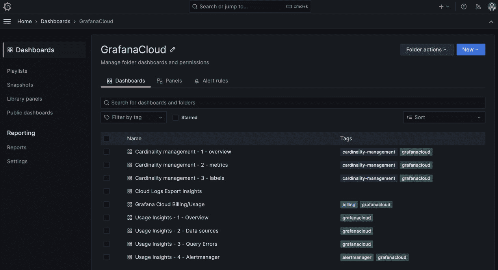

# 第十五章：故障排除、实施最佳实践及更多 Grafana 操作

我们即将结束《*Grafana 可观察性*》之旅，因此这是一个很好的时机，回顾一下我们所学到的一些内容。在本章中，我们将回顾数据收集的最佳实践，并探讨故障排除技巧，这些技巧有助于将你的遥测数据导入 Grafana。然后，我们将继续介绍 Grafana 堆栈中的更多最佳实践与故障排除，涵盖遥测后端、警报和仪表盘。我们还将识别可观察性中的一些陷阱并教你如何避免它们。最后，在总结之前，我们将展望未来，探索潜在的趋势。

在本章中，我们将涵盖以下主要主题：

+   数据收集的最佳实践与故障排除

+   Grafana 堆栈的最佳实践与故障排除

+   避免可观察性中的陷阱

+   应用监控的未来趋势

# 数据收集的最佳实践与故障排除

在本书中，我们反复强调了准备、设定目标和定义需求的重要性。事先进行思考工作是不可低估的，但遗憾的是，它经常被完全忽视。太多次我调查一个公司的可观察性平台时，发现收集代理被随意部署，导致后端接收了所有数据流。这种做法的代价是产生了大量未定义的遥测数据，使得你的工作变得更加困难，并且导致昂贵的运营和存储成本。

在本节中，我们将分享一些数据收集的最佳实践，并提供一些有用的故障排除技巧。让我们首先看看数据收集的准备工作。

## 数据收集准备

可观察性始于监控和观察系统的需求或愿望，而实现这一点需要数据。然而，过多的数据（以及为了数据而收集数据）可能会破坏系统的可观察性，这也是为什么准备工作如此重要。设定目标时要考虑你想从平台中获得什么，以及它是为谁服务的。与其为*假设情况*做计划，不如为*现实情况*做规划。你总是可以以后再做调整，这比事后删减要容易得多。

在*第一章*中，我们介绍了可观察性角色。你可以利用这些角色来收集平台需求。理想情况下，你应该能够回答以下问题：

+   我的可观察性用户是谁？

+   我希望或已有的日志格式是什么？

+   数据的来源是什么？

+   我们的**服务级别****目标**（**SLOs**）需要关注哪些指标？

+   跟踪仪器化能帮助解决可观察性问题吗？

+   我需要哪些数据来构建仪表盘？

这些答案将帮助你确定哪种代理技术最适合你的用例，使用哪些日志格式，以及其他重要决策。

让我们看看我们在数据收集时需要做出的一些决策。

## 数据收集决策

必须尽早做出几个关键决策，这些决策可能会影响整个可观测性过程。重要的是在开始时花时间做出这些决策，因为以后更改它们会变得更加困难和昂贵。在大多数情况下，你的选择已经有限，只能使用现有数据。不过，这并不妨碍你识别并传达一个新的标准来追求。跨整个组织标准化数据收集提供了一个框架，支持工程师遵守规范。在这里，我们将其中一些因素归类在一起，帮助你处理它们：

+   **日志**：

    +   选择一种可以扩展的日志格式，以便能够快速交付并在以后进行增强。

    +   仔细选择标签，考虑 Loki 的性能和基数。在查询时，您始终可以将额外的字段提取为标签。

    +   考虑是否可以从日志中创建有价值的度量标准（以最大化价值）。

+   **度量标准**：

    +   确定重要的度量标准，丢弃不需要的内容。这也有助于度量基数的管理。如果不能丢弃整个度量标准，至少丢弃一些基数最高的标签会有很大帮助。

    +   选择能提供所需数据的协议（请记住，协议之间存在差异，因此要仔细阅读每种协议的文档）。

    +   如果使用冗长的度量协议，确保采取保护措施（例如，直方图分桶）以限制对系统的洪水攻击。

    +   添加上下文，以便能够将度量标准与追踪信息关联。

+   **追踪**：

    +   确保实现并验证跨度和追踪信息的准确性

    +   通过缓解策略（采样、过滤和保留）平衡性能和成本的影响。

+   **仪器化库**：

    +   充分研究它们。如果你使用的是一个库，确保它能够得到持续维护和支持。

+   **遥测采集器**：

    +   进行概念验证，以验证与您的技术兼容的内容。你不希望由于权限限制而无法选择合适的采集器来进入生产环境。

    +   考虑采集技术所提供的支持模型（如果有的话）。

    +   从采集器中获取哪些业务需求？

现在所有决策都已做出，接下来看看如果你的遥测数据没有显示出来应该怎么做。

## 调试采集器

在可观测性平台中，可能很难隔离后台接收到的遥测数据的问题，尤其是在通过不同的连接和组件发送数据时。

以下是一些有助于诊断问题的步骤：

+   检查采集器日志中的错误消息

+   寻找 Grafana 拒绝的数据，例如以下内容：

    +   样本过旧

    +   追踪信息过大

    +   数据摄取速率限制

+   验证认证凭证（令牌过期和权限）

+   验证遥测数据是如何被摄取的（端口和协议）

+   分析遥测数据是否经过采样或修订

+   确定哪些导出器正在被用来将遥测数据发送到下一阶段

+   验证遥测格式。

+   确认下一个跳跃点并验证其配置。

+   测试简单的网络连接性，并确认防火墙规则或网络策略是否限制了数据流动。

我们现在应该已经在后台获得数据，让我们看看一些使用 Grafana 的最佳实践。

# Grafana 技术栈的最佳实践与故障排除

与前一部分一样，准备工作的重要性适用于 Grafana 技术栈，就像适用于任何良好的系统设计一样。你正在做出影响用户、数据和成本的决定。在这一部分中，我们将分享一些为 Grafana 做准备的最佳实践，并提供一些有用的调试技巧。让我们首先看看为你的 Grafana 技术栈做准备的活动。

## 准备 Grafana 技术栈

在设计你的平台时，考虑你要发送的内容和用户是谁。考虑到你的技术栈，重要的是要关注更广泛的主题，如企业身份验证集成，以及尽力调整你的技术栈规模，并实施监控使用情况的流程。

理想情况下，你希望能够回答以下问题：

+   谁需要使用该平台？

+   他们在哪里使用该平台？

+   是否存在数据保留要求（如果有的话）？

## Grafana 技术栈决策

在全面采用 Grafana 技术栈之前，必须做出一些重要决定。并非所有的决定都与可观察性有关；其中一些受地区治理的影响，另一些则是公司政策的要求。越早着手并优先处理这些决定，有助于平台的顺利运行。

在这里，我们将一些因素归类在一起，以帮助你处理它们：

+   **架构**：

    +   你的用例是否需要单一或多个技术栈——例如，数据驻留或开发与生产系统的分离？

    +   是否有任何数据受到限制，需要特定权限才能访问，例如**个人身份信息**（**PII**）和**通用数据保护条例**（**GDPR**）？

    +   是否存在需要考虑的全局延迟问题？

    +   是否有用户审计要求？

+   **管理**：

    +   后台是否可以外包，以减轻管理工作量？

    +   在发生事件时，你是否具备及时解决问题的能力？

    +   使用基础设施即代码（IaC）是否能提供平台控制？

+   **身份验证**：

    +   该平台能否与身份验证提供商集成，从而简化用户管理？

    +   你是否有特定团队的权限，可能会与身份提供商产生冲突？

+   **数据保留**：

    +   你需要创建数据保留策略，了解为什么需要遥测数据以及保留多长时间。

    +   存储指标通常较便宜——你可以通过记录规则从日志中生成这些指标，而不是长期存储更昂贵的日志。

## 调试 Grafana

在你的 Grafana 后台，可能会出现一些问题区域或接触点。以下技术应帮助你重新回到正轨，或者至少提供一个参考点，帮助你进一步调试：

+   `curl`。

+   `group by` 函数用于减少结果集

如果你正在尝试不同版本的查询，**查询历史**按钮将为你记住这些查询。

+   **问题发现**：问题所在并不总是显而易见——除非，当然，有人报告了这些问题。Grafana 提供了一套仪表板来支持你在 Grafana Cloud 上的成功。下面是 Grafana Cloud **仪表板** 列表的截图：

图 15.1 – Grafana Cloud 仪表板

在诊断 Grafana 数据和仪表板中的问题时，**Usage Insights** 仪表板可以提供帮助。导航到 **Usage Insights – 1 – Overview** 仪表板并向下滚动，你将看到三个面板：

+   **出现错误的前 10 个仪表板**：这个功能会告诉你哪些仪表板遇到了一些形式的错误。

+   **出现错误的前 10 个数据源**：此功能报告存在问题的 Grafana 数据源。这对诊断查询错误或与后端数据源的通信问题非常有用。

+   **出现错误的前 10 名用户**：这可以识别在 Grafana 内遇到问题的平台用户。在调查平台稳定性时，这非常有帮助。

这些面板指导你了解遇到的问题，并提供深入其他仪表板的链接，以展示具体错误，帮助诊断。

特别是，**Grafana Cloud Billing/Usage** 仪表板在展示因达到账户限制而导致样本被拒绝时非常重要。此外，**Cardinality management** 仪表板有助于突出由于标签值导致问题的地方。

现在让我们来看看在更广泛的可观察性领域中可能遇到的问题。

# 避免可观察性的陷阱

本书中已经确定了几个你需要坐下来思考的方法。这些考虑因素都有助于你在可观察性平台上的持续成功。现在我们将列出其中的一些，并提供一些需要遵循的指南：

+   将你的平台视为一个不断发展的过程；从基础开始，并在此基础上不断构建，持续回顾你的现状。减少价值实现的时间将确保投资回报得以实现。

+   收集多个客户的需求，然后规划一条能为更多用户提供更多价值的路线图，以确保平台的采用和支持。

+   监控成本，特别关注数据收集阶段，因为这个阶段修复成本较低。利用你的可观察性工具来帮助你。

+   尽早修复基数问题，并制定团队可遵循的标准，以控制问题。此外，你可以应用治理措施，限制不符合标准的数据进入平台。

+   隔离高负载、低价值的环境（特别是性能测试环境），以保护业务关键系统的可观察性。你可以为这些环境构建更便宜、短期的可观察性系统，以控制成本。

+   定义一个 6 个月和 12 个月的路线图。这将帮助你规划并适应行业变化。可观察性发展迅速，新的进展不断涌现；灵活应变将帮助你应对这些变化。

+   监控平台使用情况。Grafana 提供了一些优秀的仪表板，如*图 15.1*所示，帮助你了解使用情况以及使用方式。此外，你还可以通过改善对收集器环境的监控，提升对整个遥测管道的可视化。

现在让我们展望未来，思考可观察性可能会走向何方。

# 应用监控的未来趋势

很难不带有个人观点地呈现未来趋势，因此以下观点反映了我对行业发展方向的看法：

+   **成本削减**：在写作时，许多公司都在积极寻找减少运营支出的途径。在可观察性系统中有很多减少成本的空间，Grafana 正处于这一领域的前沿。请查看以下内容：

    +   **Grafana Cloud 计费/使用**仪表板，用于了解 Grafana Cloud 的开支情况。该仪表板是*图 15.1*中显示的列表的一部分。

    +   **自适应指标**（[`grafana.com/docs/grafana-cloud/cost-management-and-billing/reduce-costs/metrics-costs/control-metrics-usage-via-adaptive-metrics/`](https://grafana.com/docs/grafana-cloud/cost-management-and-billing/reduce-costs/metrics-costs/control-metrics-usage-via-adaptive-metrics/)）用于减少成本的解决方案。

    +   **日志量探索器**（[`grafana.com/docs/grafana-cloud/cost-management-and-billing/analyze-costs/logs-costs/analyze-log-ingestion-log-volume-explorer/`](https://grafana.com/docs/grafana-cloud/cost-management-and-billing/analyze-costs/logs-costs/analyze-log-ingestion-log-volume-explorer/)）用于发现过度日志收集的来源。

+   **人工智能**（**AI**）：人工智能最近已经发展到一个成熟的阶段，很快将成为可观察性平台的关键组成部分。Grafana 最近发布了生成式 AI 功能，用于**仪表板**面板标题和描述文本，以及事件响应自动摘要。你可以在这里查看和阅读更多内容：[`grafana.com/blog/2023/08/28/generative-ai-at-grafana-labs-whats-new-whats-next-and-our-vision-for-the-open-source-community/`](https://grafana.com/blog/2023/08/28/generative-ai-at-grafana-labs-whats-new-whats-next-and-our-vision-for-the-open-source-community/)。就在我们这本书即将出版之际，Grafana 宣布收购了**Asserts.ai**，将根因分析解决方案引入 Grafana；你可以在这里了解更多：[`grafana.com/blog/2023/11/14/grafana-labs-acquires-asserts/`](https://grafana.com/blog/2023/11/14/grafana-labs-acquires-asserts/)。

+   **工具增强**：改进开发者与可观察性之间关系的能力，帮助在开发生命周期早期更轻松地采纳可观察性。Grafana 最近发布了与 VS Code 集成的实时仪表板开发工具：[`marketplace.visualstudio.com/items?itemName=Grafana.grafana-vscode`](https://marketplace.visualstudio.com/items?itemName=Grafana.grafana-vscode)。

+   **OpenTelemetry 标准成熟度**：随着标准达成共识，第三方开发对 OpenTelemetry 的支持增加。供应商中立的解决方案越来越受欢迎，帮助降低总体成本（运营和管理）。

+   **收集器管理**：以下是一些用于代理技术的配置和控制工具：

    +   **开放代理管理协议** ([`opentelemetry.io/docs/specs/opamp/`](https://opentelemetry.io/docs/specs/opamp/)) 用于远程管理大规模数据收集代理的技术。无需重新部署来阻止度量指标或添加新的接收器。

    +   **Grafana 代理流程** 为 Grafana 代理构建复杂遥测管道提供了新方法。它包括代理管道的可视化，非常适合理解复杂配置。

+   **平台工程**：平台工程的进展将有助于提高可观察性采纳和开发，因为对遥测的依赖不断增加。

现在我们将结束本章及全书。你应该已经具备了实施、排除故障并管理 Grafana 以支持你的可观察性之旅的知识。

# 总结

在本章中，我们讨论了数据收集和 Grafana 堆栈的最佳实践和故障排除技术。我们还探讨了如何避免可观察性的一些陷阱，并以应用程序监控的未来趋势作为总结。这些章节应该为你提供了能够支持你成功构建可观察性平台的见解，并帮助你更快速、更高效地为用户提供平台价值。现在我们已经完成了《与 Grafana 一起实现可观察性》之旅的最后一章，让我们花点时间回顾一下我们的关键学习成果。

在本书的第一部分，我们介绍了可观察性和 Grafana，并探讨了应用程序和基础设施的仪表化。我们通过在你自己的 Kubernetes 环境中设置 OpenTelemetry 演示应用程序来结束这一部分。

在第二部分，我们介绍了你将遇到的不同遥测类型与 Grafana 的结合——Loki 用于日志，Prometheus（Mimir）用于度量，Tempo 用于跟踪——它们共同构成了**LGTM**（**Loki, Grafana, Tempo, Mimir**），你会在 Grafana 网站上随处可见。然后我们探讨了与 Kubernetes（在全书的演示应用中使用的环境）、AWS、GCP 和 Azure 的集成。

在第三部分，我们更多地使用了 Grafana，通过仪表盘展示数据，并建立了一个带警报的事件管理流程。接着，我们探索了用于配置 Grafana 的基础设施即代码（IaC），然后查看了 Grafana 堆栈的架构。

在最后一部分，我们讨论了使用 Grafana 前端观察性进行真实用户监控，使用 Grafana Pyroscope 进行应用程序分析，以及使用 Grafana K6 进行性能测试。我们通过探讨如何通过观察性支持 DevOps 来结束本书，并在本章中分享了一些最佳实践和故障排除技巧。

观察性领域的技术，尤其是与 Grafana 相关的技术发展迅速。希望我们为您提供了一些永恒的方法和技巧，您可以发展这些技能来支持您的观察性工作。当您需要帮助时，您的新朋友——观察性角色，将会随时伸出援手。感谢您让我们成为您旅程的一部分。祝您好运！
