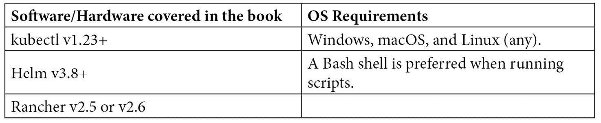

# 前言

Rancher 和 Kubernetes 在推动 DevOps 采用浪潮方面发挥了重要作用，涵盖了本地和云端工作负载。本书将引导您了解 Rancher 和 Kubernetes 的历史及其如何诞生。我们将深入讨论如何设计、构建和管理您的 Rancher 环境。接着，我们将在 Rancher 的基础上，部署多种集群类型，包括 RKE、RKE2、k3s、EKS 和 GKE。对于这些集群类型，我们将讲解它们的工作原理，围绕它们设计解决方案，最后使用 Rancher 部署它们。

接下来，我们将着手让您的集群具备生产环境的准备。包括如何备份和恢复不同类型的集群，如何监控集群和其中托管的应用程序的健康状态。然后，我们将深入讨论如何提供核心 Kubernetes 服务之外的额外服务，包括通过 Longhorn 实现持久存储，通过 OPA Gatekeeper 实现安全性/合规性，以及如何为我们的集群带来动态扩展。

接下来，我们将通过介绍如何在 Rancher/Kubernetes 生态系统中构建和部署应用程序来结束本书，使用诸如 Drone CI 等工具来实现 CI/CD 流水线，并使用 Harbor 来托管构建工件。然后，我们将深入探讨 Helm charts 的深层次话题，以及它们如何为我们的集群带来包管理。最后，我们将通过讨论资源管理和成本报告来结束，以实现将 IT 从一个金钱黑洞转变为一个盈利中心的目标。

# 本书适用对象

本书主要面向希望使用 Rancher 部署 Kubernetes 的 DevOps 工程师，包括如何使用 RKE（Rancher Kubernetes Engine）和 RKE2/k3s 改变集群的构建与管理方式。它也适合那些希望了解 Kubernetes 和 Rancher 生态系统中 Day 2 任务的人。

# 本书内容

*第一章*，*Rancher 和 Kubernetes 简介*，探讨了 Rancher 的历史及其早期产品，以及 Kubernetes 如何改变了整个局面。

*第二章*，*Rancher 和 Kubernetes 高级架构*，讨论了构成 Rancher 生态系统的不同产品，包括 Rancher 服务器、RKE1/2 和 k3s。

*第三章*，*创建单节点 Rancher*，深入探讨单节点 Rancher 安装的相关内容，包括使用它的限制以及如何迁移到高可用（HA）架构。

*第四章*，*创建 RKE 和 RKE2 集群*，讲解了 RKE1 和 RKE2 的工作原理，以及使用它们架构解决方案的规则。

*第五章*，*在托管 Kubernetes 集群上部署 Rancher*，介绍了如何在托管的 Kubernetes 集群上安装 Rancher，如 **Google Kubernetes Engine**（**GKE**）、亚马逊 **弹性容器服务**（**EKS**） for Kubernetes、**Azure Kubernetes Service**（**AKS**）或 **Digital Ocean 的 Kubernetes 服务**（**DOKS**）。

*第六章*，*使用 Rancher 创建 RKE 集群*，演示了如何使用 Rancher 部署下游 RKE 集群，并讲解此类集群架构的规则。

*第七章*，*使用 Rancher 部署托管集群*，介绍了如何利用云提供商通过 Rancher 部署托管 Kubernetes 集群，并通过 Rancher 管理集群的生命周期。

*第八章*，*将外部管理的集群导入 Rancher*，展示了如何将任何类型的 Kubernetes 集群导入 Rancher，并展示 Rancher 如何访问导入的集群。

*第九章*，*集群配置备份与恢复*，描述了如何使用 etcd 备份来备份 RKE1/2 集群，以及如何从备份中恢复集群。

*第十章*，*监控与日志记录*，解释了如何使用 Rancher 监控来部署 Prometheus、Grafana 和告警管理器，以监控集群的健康状况，并介绍了如何使用 Banzai Cloud Logging 来捕获 Pod 日志。

*第十一章*，*使用 Longhorn 将存储引入 Kubernetes*，探讨了为何需要在 Kubernetes 集群中使用持久化存储，以及 Longhorn 如何解决这个问题，包括 Longhorn 的工作原理和如何使用 Longhorn 架构解决方案。

*第十二章*，*使用 OPA Gatekeeper 实现安全与合规性*，讨论了如何使用 OPA Gatekeeper 和 NeuVector 等工具在 Kubernetes 集群中强制执行标准和安全策略。

*第十三章*，*在 Kubernetes 中进行扩展*，深入探讨了如何使用 **水平 Pod 自动扩展器**（**HPA**）、**垂直 Pod 自动扩展器**（**VPA**）和集群自动扩展器来动态扩展环境。

*第十四章*，*负载均衡器配置与 SSL 证书*，解释了如何使用入口和负载均衡器将托管在 Kubernetes 中的应用发布到外部世界。

*第十五章*，*Rancher 和 Kubernetes 故障排除*，解释了如何从一些最常见的故障和问题中恢复，包括如何检测并防止它们的发生，以及如何在实验环境中重现这些问题。

*第十六章*，*设置 CI/CD 管道和镜像注册中心*，解释了什么是 CI/CD 管道，以及如何使用它来以标准化和受控的流程部署应用程序，并部署 Drone CI 和 Harbor 以支持你的应用程序。

*第十七章*，*创建和使用 Helm Charts*，描述了 Helm Charts，以及如何使用 Helm 将应用程序从公共和私有仓库打包并发布到 Kubernetes 集群中。

*第十八章*，*资源管理*，解释了如何在 Kubernetes 集群中管理资源，并监控和控制托管在 Kubernetes 中的应用程序成本。

# 充分利用本书

本书假设你对 Linux 服务器管理有基本了解，包括基本的 Bash 脚本编写、安装软件包以及在大规模环境下自动化任务。此外，我们假设你对大多数云平台，如 AWS、GCP、vSphere 或 Azure，也有基本的了解。



同时，建议有一个实验环境来部署 Rancher 和 RKE1/2 集群。一个重要的提示：大多数云服务提供商提供的试用信用应该足够用来创建小型实验集群。

最后，Kubernetes 和 Rancher 是不断变化的，因此需要记住，随着时间的推移，版本号也需要相应调整。因此，强烈建议在选择版本之前查看每个产品和软件的发布说明。

# 下载彩色图像

我们还提供了一个 PDF 文件，包含本书中使用的截图/图表的彩色图像。你可以在这里下载：[`static.packt-cdn.com/downloads/9781803246093_ColorImages.pdf`](https://static.packt-cdn.com/downloads/9781803246093_ColorImages.pdf)。

# 下载示例代码文件

你可以从 GitHub 下载本书的示例代码文件，链接为[`github.com/PacktPublishing/Rancher-Deep-Dive`](https://github.com/PacktPublishing/Rancher-Deep-Dive)。如果代码有更新，更新内容将同步到现有的 GitHub 仓库。

我们还有其他代码包，来自我们丰富的图书和视频目录，均可在[`github.com/PacktPublishing/`](https://github.com/PacktPublishing/)上获取。快来看看吧！

# 使用的约定

本书中使用了一些文本约定。

`文本中的代码`：表示文本中的代码词汇、数据库表名、文件夹名称、文件名、文件扩展名、路径名、虚拟 URL、用户输入和 Twitter 用户名。例如："将本地集群重命名为更有帮助的名称，如`rancher-prod`或`rancher-west`"是非常常见的。

一段代码的展示方式如下：

```
helm repo add prometheus-community https://prometheus-community.github.io/helm-charts
```

```
helm repo update
```

```
helm upgrade –install -n monitoring monitoring prometheus-community/kube-prometheus-stack
```

**粗体**：表示新术语、重要词汇或您在屏幕上看到的词语。例如，菜单或对话框中的词汇会以这种方式出现在文本中。示例如下：“使用 Rancher 日志记录时，建议通过 Rancher UI 中的应用市场进行部署，进入**Cluster Tools**并点击**Logging**应用。”

提示或重要说明

以这种方式出现。

# 联系我们

我们欢迎读者的反馈。

**一般反馈**：如果您对本书的任何方面有疑问，请在邮件主题中注明书名，并通过 customercare@packtpub.com 联系我们。

**勘误**：尽管我们已尽力确保内容的准确性，但错误有时仍会发生。如果您在本书中发现任何错误，我们将非常感谢您向我们报告。请访问 [www.packtpub.com/support/errata](http://www.packtpub.com/support/errata)，选择您的书籍，点击“勘误提交表格”链接，并填写相关细节。

**盗版**：如果您在互联网上发现我们的作品的任何非法版本，我们将非常感谢您提供该地址或网站名称。请通过版权@packt.com 与我们联系，并提供该材料的链接。

**如果您有兴趣成为作者**：如果您在某个领域有专业知识并有兴趣撰写或贡献书籍，请访问 [authors.packtpub.com](http://authors.packtpub.com)。

# 分享您的想法

阅读完*Rancher Deep Dive*后，我们很希望听到您的想法！请[点击此处直接进入 Amazon 的评论页面](https://packt.link/r/180324609X)并分享您的反馈。

您的评价对我们和技术社区都很重要，它将帮助我们确保提供优质的内容。
