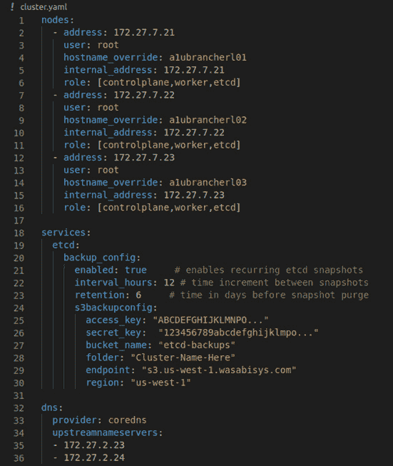

# *第二章*：Rancher 和 Kubernetes 高级架构

本章将介绍**Rancher**、**Rancher Kubernetes Engine**（**RKE**）、**RKE2**（也称为**RKE 政府版**）、**K3s**和**RancherD**的高级过程。我们将讨论这些产品的核心设计理念，并探讨它们的不同之处。我们将深入了解 Rancher 的高级架构，并查看 Rancher 服务器的 Pod 如何使用 Cattle 代理（包括 Cattle-cluster-agent 和 Cattle-node-agent）与下游集群进行通信。我们还将探讨 Rancher 服务器如何使用 RKE，以及 Rancher-machine 如何为下游节点和 Kubernetes（**K8s**）集群提供资源。接下来，我们将介绍 K8s 的高级架构，包括**kube-api-server**、**kube-controller-manager**和**kube-scheduler**。我们还将讨论这些组件如何保持集群的状态。最后，我们将检查最终用户如何更改期望状态，以及控制器如何更新当前状态。

本章我们将覆盖以下主要内容：

+   Rancher 服务器是什么？

+   什么是 RKE 和 RKE2？

+   什么是 K3s（比 K8s 少五个）？

+   什么是 RancherD？

+   Rancher 服务器的 Pod 中运行了哪些控制器？

+   Cattle 代理做什么？

+   Rancher 如何提供节点和集群？

+   什么是 kube-apiserver、kube-controller-manager、kube-scheduler、etcd 和 kubelet？

+   当前状态和期望状态是如何工作的？

# Rancher 服务器是什么？

**Rancher 服务器**构成了 Rancher 生态系统的核心，它包含了任何其他组件、产品或工具所需的几乎所有内容，这些组件、产品或工具依赖于或通过 Rancher API 连接到 Rancher 服务器。*Rancher 服务器*通常简称为*Rancher*，在本节中，当我说到*Rancher*时，我指的就是*Rancher 服务器*。

Rancher 的核心是其 API。**Rancher API**建立在一个名为**Norman**的自定义 API 框架之上，Norman 充当 Rancher API 和 K8s API 之间的翻译层。Rancher 中的一切都通过 Rancher 或 K8s API 进行通信，包括 100% 由 API 驱动的 Rancher **用户界面**（**UI**）。

那么，如何连接到 Rancher API？Rancher API 是一个标准的 `CustomResource` 对象。当然，因为所有内容都存储在 K8s 的 `CustomResource` 对象中，所以 Rancher 请求流程是无状态的，不需要会话持久性。最后，一旦 `CustomResource` 对象被创建、修改或删除，该对象类型的控制器将接管并处理该请求。我们将在本章后面深入探讨不同的控制器。

# 什么是 RKE 和 RKE2？

我需要什么，是 RKE 还是 RKE2？传统上，在构建 K8s 集群时，您需要执行几个步骤。首先，您需要生成根**CA 密钥**以及各个 K8s 组件的证书，并将它们推送到集群中每台服务器上。其次，您需要安装/配置**etcd**，这包括在管理节点上设置**systemd**服务。接下来，您需要启动 etcd 集群，并验证所有 etcd 节点是否正确地进行通信和复制。此时，您将安装 kube-apiserver 并将其连接回 etcd 集群。最后，您需要安装 kube-controller-manager 和 kube-scheduler，并将它们连接回 kube-apiserver 对象。如果您想要启动集群的控制平面，您还需要更多步骤将工作节点加入集群。

这个过程被称为*K8s the hard way*，之所以叫这个名字，是因为这个过程非常复杂，并且随着时间的推移可能会发生变化。在 K8s 的早期，这是创建 K8s 集群的唯一方式。正因为如此，用户需要编写大型脚本或**Ansible Playbooks**来创建 K8s 集群。这些脚本需要大量的关注和维护才能顺利启动，并且随着 K8s 不断变化，还需要更多的工作来保持其正常运行。

Rancher 看到了这个问题，并意识到为了让 K8s 成为主流，构建集群需要对最终用户和 Rancher 服务器来说是*极其简单*的。最初，在 Rancher v1.6 时代，Rancher 会使用它的容器集群软件**Cattle**来构建 K8s 集群。因此，所需的一切都必须作为容器运行，这也是 RKE 的起点。

## 那么，什么是 RKE 呢？

RKE 是 Rancher 的集群编排工具，用于在各种操作系统上创建和管理**云原生计算基金会**（**CNCF**）认证的 K8s 集群，并支持多种配置。RKE 的核心概念是，构成 K8s 集群的所有组件都应该完全在**Docker**容器中运行。因此，RKE 不关心它部署在哪个操作系统上，只要它运行在 Docker 容器中即可。这是因为 RKE 并不会在主机上安装二进制文件、配置服务或类似的操作。

### RKE 是如何工作的？

RKE 是一个`cluster.yml`（见*图 2.1*）。RKE 随后使用该配置文件来创建启动集群所需的所有容器，即 etcd、kube-apiserver、kube-controller-manager、kube-scheduler 和 kubelet。有关节点和集群的更多详细信息，请参阅本章中的*Rancher 如何配置节点和集群？*部分。



图 2.1 – cluster.yaml 文件中的代码片段

## 什么是 RKE2？

RKE2 是 Rancher 的下一代 K8s 解决方案，也被称为 RKE Government。RKE2 的设计旨在更新和解决 RKE 的一些不足，并且它还引入了 K3s 的*超简单*安装方法来提高功能性。RKE2 也是一个完全 CNCF 认证的 K8s 发行版。不过，RKE2 是专为 Rancher 的美国联邦政府及其客户创建的，因为他们对 K8s 的使用有若干特别要求——第一个要求是默认情况下它必须具有高度安全性。

在设置 RKE 时，你必须遵循加固指南，并采取若干手动步骤以符合**CIS 基准**。而 RKE2 则设计成在几乎不需要集群管理员采取任何行动的情况下就能确保安全。美国联邦客户需要他们的 K8s 集群是**启用 FIPS**的（**FIPS**代表美国**联邦信息处理标准**）。此外，由于 RKE2 是基于 K3s 构建的，它继承了 K3s 的多个特性——其中第一个是支持**ARM64**架构的系统。所以，如果你愿意，可以在**Raspberry Pi**上设置 RKE2。这为用户提供了在同一个集群中混合使用 ARM64 和**AMD64**节点的灵活性，这意味着客户可以在集群内运行如**Drone 持续集成（CI）**平台等多架构构建的工作负载。它还为低功耗和成本效益高的 ARM64 节点提供支持。

从 K3s 继承的第二个特性是**自引导**。在 RKE 中，你需要定义集群的 YAML 文件，然后使用 RKE 二进制文件来尝试创建和管理集群。但在 RKE2 中，一旦创建了第一个节点，所有其他节点只需通过在主节点上运行的注册端点加入集群。需要注意的是，这确实需要一个外部负载均衡器或轮询 DNS 记录才能成功。因为 RKE2 可以自我管理，所以它允许你执行非常酷的任务，例如使用 kubectl 定义 K8s 升级，并让集群自行处理。

RKE2 从 K3s 继承的第三个特性是内置的`kubectl -n kube-system get pods`，你可以查看你的 etcd 容器，甚至可以像操作其他 Pod 一样，打开一个 shell 或者捕获日志。

最后但同样重要的是，RKE2 的最关键特性是它是完全开源的，没有付费墙——就像 Rancher 的其他所有产品一样。

# K3s 是什么（比 K8s 少五个版本）？

K3s 是一个完全通过 CNCF 认证的 K8s 发行版。这意味着在 K3s 中，你部署的 YAML 文件就是一个标准的 K8s 集群，只不过它被部署在 K3s 集群中。K3s 的诞生是因为传统的 K8s 集群——甚至是 RKE 集群——是为大规模运行而设计的，意味着它们需要三个 etcd 节点、两个控制平面节点以及三个或更多的工作节点，才能配置一个标准的集群。在这种情况下，节点的最小配置大约是四个核心，etcd 对象和控制平面节点需要 8 GB 的内存，而工作节点需要两个核心和 4 GB 的内存。这些仅仅是在谈论像 IE 50 节点集群这样规模的 K8s 集群时的背景要求，工作节点的配置可能为 64 个核心和 512 GB 的内存。但当你开始考虑在边缘部署 K8s 时，考虑到物理空间、电力和计算资源都很紧张，标准的 K8s 和 RKE 就显得过于庞大。所以，问题是：*我们如何缩小 K8s 的规模？*

K3s 基于以下核心原则：没有遗留代码、重复代码或多余的内容。对于 RKE 和其他标准的 K8s 发行版，每个组件都是独立的代码，并有各自的运行时。在 Rancher，他们问了自己一个问题：

*嘿，这里有很多重复的代码在运行。如果我们将 kube-apiserver、kube-controller-manager、kube-scheduler 和 kubelet 合并成一个单一的二进制文件会怎么样？*

于是，K3s 就这样诞生了。K3s 只有 *master* 节点和 *worker* 节点，主节点运行所有的核心组件。下一个重大的突破是他们对 etcd 的处理。etcd 对象并不小，它吃内存的速度快得像要过时一样，而且在单节点集群中它并不好用。这时，**kind** 就进入了画面。

这种数据库适配器使得标准**SQL**数据库如**SQLite3**、**MySQL**或**Postgres**看起来像是一个 etcd 数据库。因此，从 kube-apiserver 的角度来看，它是在与 etcd 集群通信。CPU 和内存占用的足迹要小得多，因为你可以运行像 SQLite3 这样的数据库代替 etcd。值得注意的是，Rancher 并未定制任何核心组件中的标准 K8s 库，这使得 K3s 可以与上游 K8s 保持同步。K3s 下一个重大节省领域是树内存储驱动程序和云提供商。上游 K8s 在核心组件中内置了多个存储驱动程序。例如，RKE 有存储驱动程序，允许 K8s 连接到**AWS** API，并直接为 Pod 提供**Amazon EBS**卷存储。如果在 AWS 上运行，这非常棒，但如果在**VMware**上运行，这段代码将浪费资源。同样的情况也适用于 VMware 的**vSphere**，它有一个存储提供程序将**虚拟机磁盘 (VMDKs)**挂载到节点上。这个想法是大多数这些存储和云提供商是不被使用的。例如，如果我在 Amazon 上运行集群，为什么我需要 Azure 的库和工具？此外，有替代方案可以作为 Pod 部署，而不是作为内置功能。此外，大多数主要的存储提供商正在转向树外的供应方式。因此，K3s 将它们移除了。这消除了显著的开销。由于所有这些优化，K3s 集群可以放在一个 40 MB 的二进制文件中，并在只有 512 MB RAM 的节点上运行。

K3s 对 K8s 的另一个重要改变是，它应该*非常简单*地启动一个 K3s 集群。例如，创建一个单节点的 K3s 集群只需要运行`curl -sfL https://get.k3s.io | sh -`命令，唯一的依赖是它在安装了`curl`的 Linux ARM64 或 AMD64 操作系统上。由于这种易用性，K3s 经常被部署在单节点集群中，用户希望使用 K8s 提供的所有管理工具，但规模不大。例如，开发人员可能会在他们的笔记本上通过**虚拟机**（**VM**）快速部署一个 K3s 集群，以部署他们的应用程序，就像在生产 K8s 集群中一样。

K3s 的另一个优秀用例是在零售环境中部署，可能在全国甚至全球各地都有数百甚至数千个位置，每个位置上都运行着一个小型 PC 上的单个 K3s 节点。K3s 在这种情况下非常有帮助，因为它体积很小，因此常见的问题如慢速互联网连接并不是大问题，此外，即使失去与企业数据中心的连接，K3s 仍然可以继续运行。对于 K3s 更加特别的部署是在偏远地区的风力发电机上，仅有一个**长期演进**（**LTE**）连接用于互联网访问。这些是 K3s 设计的部署类型。

# RancherD 是什么？

在 Linux AMD64 或 ARM64 服务器上执行 `curl -sfL https://get.rancher.io | sh –` 命令。这个二进制文件类似于 RKE2，但经过优化以托管 Rancher 服务器。RancherD 还包括额外的工具来支持 Rancher 服务器应用程序。例如，`rancherd reset-admin` 命令将重置 Rancher 服务器的管理员密码。

若要在常规的 RKE 或 RKE2 集群中更改此密码，你需要找到 Rancher 服务器 pod 并进入容器的 shell。然后你可以运行 `reset-admin` 命令。RancherD 背后的主要理念是让管理 Rancher 变得非常简单。它通过使用 RKE2 Helm 操作符来处理 Rancher 服务器 pod 的部署实现这一点。而且因为它使用的是你在 RKE 集群中也会使用的相同 Helm chart，所有定制化选项仍然可用（最棒的功能是 SSL 证书的管理便利性）。在标准的 Rancher 服务器部署中，你必须配置并管理支持 Rancher API 的 SSL 证书。当使用内部签名证书时，这可能会很麻烦，因为你需要编辑集群内的一个 secret，这对新手 K8s 用户来说可能很困难。RancherD 通过简单地让用户将证书文件放入 `/etc/rancher/ssl/` 目录中的一个 RancherD 节点来解决这个问题，此时它会接管该过程并为你处理更新。大多数时候，当你不想管理托管 Rancher 的 K8s 集群，但又不能使用诸如 **AWS** **EKS**、**Azure** **AKS** 或 **Google** **GKE** 等托管 K8s 选项，或者如果你需要管理大量不同的 Rancher 安装时，你将使用 RancherD。例如，如果你在托管环境中提供 *Rancher 作为服务*，你可能会使用 RancherD 来简化大规模管理这些集群。

# Rancher 服务器的 pod 内运行了哪些控制器？

Rancher 由一组 pod 组成——默认情况下是三个 pod——它们在 K8s 集群中运行。这些 pod 可以通过默认的 **ingress-nginx** 入口控制器处理请求，并使用 Norman 将 Rancher API 请求转换为 K8s API 请求，以访问 Rancher 使用的自定义资源对象。但是，Rancher 服务器的 pod 还托管多个控制器，主要控制器如下：

+   `TokenReview` 请求来自 K8s。该服务会调用 LDAP 服务器，验证用户名和密码。如果验证通过，服务将以 `200 OK` 响应返回，所有其他响应码表示身份验证失败。由于这一点，设置过程可能非常复杂且不可靠。因此，Rancher 选择了构建其控制器的方法，通过外部身份验证提供者（如 LDAP、AD、GitHub、Okta 等）验证用户名和密码。一旦用户验证通过，Rancher 将为用户提供一个承载令牌，用户可以直接用它向 K8s API 进行身份验证。控制器通过提前在下游集群中创建匹配的服务帐户、角色和角色绑定来实现这一点。控制器还通过 Rancher 的 *项目* 概念提供一些更高层次的控制。你可以定义一组命名空间作为一个 *项目*，并在项目级别管理权限，而不是仅在集群或命名空间级别管理权限。

+   **Rancher 目录控制器**：该控制器负责管理 Rancher 内部的目录。那么什么是 *目录* 呢？Rancher 使用 *目录* 的概念作为 Helm 图表的存储库。Rancher 称它们为目录，因为它们为用户提供了一个可以部署到集群中的应用程序目录。默认目录包含一些很棒的应用程序，包括 **WordPress**、**MySQL**、**Rancher**、**Longhorn**、**Datadog** **Cluster Agent** 等等。所有这些目录都汇集在 Rancher 中，组成了所谓的 **应用和市场** 功能，允许用户将基于 Helm 的应用程序部署到集群中。你还可以将自己的存储库添加为目录，这对于希望为其应用程序团队提供标准化工具集的 DevOps 团队来说非常有用。例如，如果应用程序团队希望拥有自己的监控系统，他们可以根据自己的偏好修改和调整系统。你可能会创建一个 **Prometheus** Helm 图表，提供基本配置，应用程序团队只需点击就可以在其集群上部署。

使用 Helm 图表的另一个很好的例子是在可能有一个主应用程序的环境中——例如，业务核心应用程序，其他团队必须编写应用程序以连接并与其一起工作。你可以为这个单体应用程序创建一个 Helm 图表，应用程序团队可以快速启动进行集成测试，然后关闭以节省成本。在这种情况下，所有这些操作将由 Rancher 目录控制器管理，该控制器负责缓存目录（出于速度考虑），以及对于传统应用程序，部署该应用程序，即在 Rancher 服务器 pod 内运行 `helm install` 命令。

但是，在 Rancher v2.6 中，这个过程已转移到 Fleet 来处理部署过程，Fleet 将在下游集群上启动一个 Helm 操作员 Pod 并运行 Helm 命令。请注意，这对速度、可扩展性和灵活性非常有利，因为 Fleet 为您提供了许多自定义 Helm 图表的选项，是 Rancher 大规模 DevOps 的一部分。Fleet 的设计能够一次管理最多百万个集群。需要注意的是，Rancher 目录控制器仅在 Rancher 领导者 Pod 上运行。如果该 Pod 被删除或丢失，则需要重新构建缓存，但这个过程通常只需要几分钟。此控制器还会按照计划（默认每 6 小时）同步缓存，但同步过程可以被强制更新，执行`helm repo update…`命令，但以 Go 代码的形式运行。

+   `cluster.yaml`和`cluster.rkestate`文件由您处理，并在 Rancher 领导者 Pod 内部运行`rke up`。请注意，在故障排除集群时，如果在更新状态问题时卡住，这是我们最常查看的控制器。更多关于该控制器如何工作的细节，请参见本章稍后的*Rancher 如何配置节点和集群？*部分。

+   **Rancher 节点控制器**：该控制器负责管理 Rancher 配置的节点。该控制器仅用于 Rancher 配置的集群，在虚拟化平台上，如**Amazon** **EC2**、**Google** **GCP**、VMware vSphere 等。该控制器构建在 Rancher 机器的 Go 代码之上，而 Rancher 机器本身是基于**Docker Machine**构建的。该控制器的主要功能是处理节点池中虚拟机的创建和删除。更多关于此过程的细节，请参见本章稍后的*Rancher 如何配置节点和集群？*部分。注意，在故障排除节点配置错误时，如 SSH 超时或配置验证错误时，这是我们最常查看的控制器。

+   `rancher-pipelines.yml`文件用于配置管道。

    注意

    从 Rancher v2.5 开始，推荐使用基于 Git 的部署管道来处理 Rancher 持续交付，该功能由 Fleet 提供支持。因此，这个控制器在 Rancher v2.6 中被移除了。

+   `vanilla`上游 Prometheus 监控栈部署，而不是 Rancher 定制的 Prometheus 部署。

+   **Rancher 日志控制器**：这个控制器管理 Rancher UI 中日志系统与 **Banzai Cloud** **Logging** 操作员之间的集成。这个控制器是一个翻译层，允许用户通过 Rancher UI 定义日志流和集群日志流（ClusterFlows），并将其转换为 **自定义资源定义**（**CRD**）对象，这些对象被 Banzai Cloud Logging 操作员用于配置应用程序和集群级别的日志记录。在 Rancher v2.5 之前，Rancher 使用多个不同的日志提供者，包括 **Syslog**、**Splunk**、**Apache** **Kafka** 和 **Fluentd**。然而，这是一种定制的 Rancher 解决方案，灵活性较差。因此，作为日志 v2 迁移的一部分，一切都转移到了 Banzai，以更好地与行业的发展趋势对接。

+   `istioctl` 二进制文件或 Istio 操作员。这个控制器还负责部署**Kiali**，用于在服务网格中绘制流量图。这使得用户可以看到哪些应用程序连接到其他应用程序，包括 pod 之间的流量速率和延迟。这对应用程序所有者和团队来说非常有价值。

+   `--insecure-bind-address` 标志设置为除 `localhost` 以外的其他值，在 kube-apiserver 上。请注意，这个设置允许请求绕过身份验证和授权模块，且不能暴露到节点外部。在这种情况下，Sonobuoy 将收集这个设置，然后 kube-bench 会将该值标记为检查失败。最后，**rancher-cis-benchmark** 工具会将所有检查汇总成一个优秀的报告，并通过电子邮件发送给安全团队。

# Cattle 代理做什么？

Rancher 在下游集群（即 Rancher 正在管理的集群）上部署的 Cattle 代理为 Rancher 提供了访问该集群及其节点的权限。此操作通过两组不同的 Pod 完成：

+   `localhost`。这个隧道将允许 Rancher 服务器 Pod 与下游集群建立连接。因此，Rancher 无需在 Rancher 服务器和下游集群之间打开防火墙规则，也无需端口转发，这通常会带来安全问题。这个 WebSocket 连接由 Rancher 和 Cattle-cluster-agent 保持打开，因为如果连接中断，Rancher 将失去对集群的访问权限，直到连接恢复。

+   **Cattle-node-agent**：这个代理作为 **DaemonSet** 在所有节点上运行，并具有忽略几乎所有内容的容忍性。这个 Pod 使用与前面示例相同的 WebSocket 连接方式，并通过 TCP 隧道连接回 Rancher。不过，RKE 在 Rancher 服务器 Pod 内部使用此连接，以提供与节点上运行的 Docker 引擎的套接字连接。这是 RKE 启动非 K8s 容器以构成 RKE 集群所需的。

    注意

    Cattle-node-agent 仅在 Rancher 管理的集群中使用，也就是说，当 Rancher 使用 RKE 构建集群时需要使用该工具。对于导入的集群，如 Amazon EKS 集群，则不需要 Cattle-node-agent。

两个代理都使用 HTTPS 连接到 Rancher API。它们通过将一些环境变量传递到 pod 中来实现。第一个变量是 `CATTLE_SERVER`；该变量是 Rancher API 的主机名。例如，主机名可以是 `rancher.example.com`。请注意，此变量中不包含 HTTP 或 HTTPS，因为代理需要通过 HTTPS 连接到 Rancher。第二个变量是 `CATTLE_CA_CHECKSUM`，只要它们匹配，代理将信任该 HTTPS 连接。需要注意的是，如果您在不更改链的情况下更新证书，也就是说，只更换证书的颁发机构，`CATTLE_CA_CHECKSUM` 变量不会改变—例如，如果您从自签名证书切换到一个像 `CATTLE_CA_CHECKSUM` 这样的公共签名证书，则需要手动更新代理，因为它们会匹配更长时间。该过程可以参考文档 [`github.com/rancherlabs/support-tools/tree/master/cluster-agent-tool`](https://github.com/rancherlabs/support-tools/tree/master/cluster-agent-tool)。

# Rancher 如何配置节点和集群？

Rancher 可以使用以下方法配置不同的节点和集群。Rancher 中有三种主要类型的集群。*使用 RKE 创建的 Rancher 集群*、*使用托管提供商创建的 Rancher 集群* 和 *导入的集群*。每种类型都有子类型，以下是详细说明。

使用 RKE 构建的 Rancher 创建的集群如下：

+   **Rancher 创建的节点**：Rancher 的一大优点是，如果您选择 Rancher，它可以为您构建集群，并且它们可以自己管理虚拟机。这是通过使用一个名为 **Rancher-machine** 的工具来实现的。该工具基于 Docker Machine，允许您创建虚拟机并安装 Docker。Docker Machine 通过使用驱动程序插件来实现这一点。这些驱动程序插件充当 Docker Machine 和虚拟化提供商之间的翻译层—例如，**Amazon AWS**、**Linode**、**OVHcloud** 或 VMware vSphere。

Docker Machine 的工作方式是，您向它提供虚拟化提供商的凭据，并定义虚拟机的规格，例如 CPU 核心数、内存等。然后，驱动程序插件接管并调用云提供商的 API 端点来配置虚拟机。接着，Docker Machine 为每个虚拟机创建一对 SSH 密钥，并使用驱动程序插件将 SSH 密钥推送到虚拟机。它随后等待 SSH 连接可用。

一旦 SSH 连接建立，Docker Machine 就会安装 Docker。这时，Rancher-machine 便发挥作用。Rancher-machine 是在 Docker Machine 的基础上，通过添加额外的驱动插件，如**DigitalOcean**和**Rackspace**，来扩展功能。它还提供了更多功能，如实现 cloud-init。在节点配置过程中，你可以执行其他步骤，比如为 Docker 创建文件系统或对 Docker 引擎应用自定义设置。Rancher 提供了更高层次的功能，如定义节点模板，以便在可重复的过程中部署节点，并通过定义节点池（使用节点模板的节点组）进一步扩展这一过程。节点池使 Rancher 能够随时向组中添加或移除节点。例如，如果池中的某个节点崩溃并且在默认的 15 分钟超时（可定制）内没有恢复，Rancher 可以创建一个新的虚拟机替代节点并销毁崩溃的节点。这个过程还可以用于执行节点的滚动替换，适用于你不希望*就地修补*而是希望更新基础镜像并以滚动方式重建所有节点的使用场景。

+   **自带节点**：这些节点适用于你希望或需要自己创建虚拟机或使用物理服务器的场景。在这种情况下，你将会在 Rancher 中定义集群配置。然后，Rancher 会为你生成一个命令，你只需运行这个命令，如下所示：

    ```
    docker run -d --privileged --restart=unless-stopped --net=host -v /etc/kubernetes:/etc/kubernetes -v /var/run:/var/run  rancher/rancher-agent:v2.6.0 --server https://rancher-lab.support.tools --token abcdefghijkmn123456789 --etcd --controlplane --worker.
    ```

让我们来分解这个命令。首先，这是一个可以在任何已安装 Docker 的 Linux 主机上运行的 Docker 命令。接下来是`run`，它表示创建一个新的容器，紧接着的标志是`-d`，表示以*分离模式*运行。这将启动容器并将其放在后台。`–privileged`标志告诉 Docker 这是一个特权容器——意味着该容器可以访问主机上的所有设备。可以把它理解为直接在主机操作系统上运行进程，几乎没有任何限制。`--restart=unless-stopped`标志仅表示 Docker 会不断重启这个容器，直到我们告诉它停止。接下来是`--net=host`标志，它为容器分配与主机相同的网络。因此，容器的 IP 将是主机的 IP。接下来的两个标志将`/etc/kubernetes`和`//var/run`目录挂载到容器内。`/etc/kubernetes`目录用于存储节点级的配置文件，最重要的是存储 K8s 组件所使用的 SSL 证书。

以下部分是容器镜像和标签。该镜像将与 Rancher 版本相匹配，并且该镜像包含启动此节点所需的所有二进制文件。`--server` 标志是 Rancher API 服务器路径。这将被传递到容器中，并返回连接到 Rancher 领导者 Pod（有关更多详细信息，请参阅本章前面的*Cattle 代理做了什么？*部分）。接下来，我们有 `–token` 标志。它用于将代理认证到 Rancher 服务器并将该代理与集群绑定。每个集群都有一个唯一的令牌，但集群中的所有代理将共享相同的令牌。最后，我们有 `role` 标志。该标志用于为节点分配 RKE 集群的不同角色。请注意，节点可以拥有多个角色，但集群至少需要每个角色有一个节点：一个 etcd 节点，一个控制平面节点和一个工作节点。您可以根据需要混合和匹配角色，但有一些最佳实践应遵循。

在 Rancher 创建的节点和 *自带节点* 中，一旦引导代理成功启动，代理将回传到 Rancher 主节点，并在 Rancher RKE 中注册新节点。然后，它使用已注册的节点动态创建 `cluster.yaml` 文件，利用已注册或正在注册的节点将其加入集群。如果该集群之前已经成功启动过一次，Rancher 还会从 CRD `clusters.management.cattle.io` 对象中拉取 `cluster.rkestate` 文件。此文件包含集群的当前状态、根证书和服务器证书，以及 RKE 用于与集群通信的身份验证令牌。然后，集群控制器将使用 Rancher 主节点上的端口绑定连接节点上的 Docker 引擎。在此过程中，RKE 将创建证书和配置文件，部署到节点，并开始创建/更新 etcd 集群。RKE 会按顺序执行此过程，每次只处理一个节点，如果遇到问题，它将抛出错误并退出功能。同时，在对现有集群进行任何更改之前，RKE 会在每个 etcd 节点上执行备份。等到 etcd 平面成功启动后，RKE 将开始处理控制平面，此时 RKE 会启动 kube-apiserver 对象、kube-controller-manager 和 kube-scheduler，依然按顺序操作，每次运行一个节点，并在执行过程中进行健康检查。同样，如果过程中任何步骤失败，RKE 也会失败。最后，RKE 将进入工作节点平面。这个过程有所不同，因为它旨在并行处理多个工作节点，即使发生故障，也会继续进行，只要没有违反 `零停机` 配置中定义的设置。默认设置为在任何给定时间最多允许一个 etcd 或控制平面节点宕机，最多 10% 的工作节点宕机。请注意，该数字会向下取整至最近的节点，且每批次至少有一个节点。

+   **使用托管提供商创建的 Rancher 集群**：Rancher 的一个优点是，如果你不想处理虚拟机，只想让云提供商管理虚拟机，你可以使用托管的 K8s 集群，如 AWS EKS、Google GKE 或 Azure AKS。Rancher 可以通过使用云提供商的**软件开发工具包**（**SDK**）为你提供集群。这主要是出于便捷性和一致性的考虑，因为 Rancher 没有独特或隐藏的选项是你自己无法完成的。作为 v2 版本中新托管集群选项的一部分，Rancher 还允许 Rancher、云提供商和最终用户之间的三方配置同步。值得注意的是，如果你想更改 AWS EKS 集群的一些设置，你可以直接在 AWS 控制台管理，它的更改会在 Rancher 中反映出来。请注意，RKE 集群也可以这样做，但需要额外的步骤。

+   **导入的 K8s 集群**：最后，如果你不希望 Rancher 管理你的集群，但又希望 Rancher 作为你集群的友好 Web UI，你可以利用 Rancher 的优秀*便捷功能*，例如**Active Directory**（**AD**）身份验证、Web kube-proxy 访问等。你可以导入集群，Rancher 会在集群上部署 cluster-Cattle-agent，但不会访问诸如 etcd、kubelet、Docker CLI 等项。在这种情况下，Rancher 只能访问 kube-apiserver 端点。请注意，Rancher 支持任何已认证的 K8s 发行版作为导入集群选项，这包括*K8s the hard way*、EKS、自管理 RKE 集群，甚至是 K3s/RKE2 集群。自 Rancher v2.6.0 起，K3s 和 RKE2 集群有其独特之处，它们可以被导入到 Rancher 中，Rancher 随后可以接管集群的管理。请注意，这仍然是一个新过程，存在一些限制和 bug。

# 什么是 kube-apiserver、kube-controller-manager、kube-scheduler、etcd 和 kubelet？

etcd 对象是一个分布式且一致的键值对数据库。**CoreOS** 最初在 2013 年开发 etcd，用于处理集群管理系统中的操作系统升级并存储配置文件。因此，etcd 需要具备高可用性和一致性。etcd 对象目前隶属于 CNCF，并已在业界广泛采用。etcd 集群基于在节点之间保持一致性的理念——大多数集群包含三个或五个节点，并且有一个要求，即节点数必须为奇数。这是由于 Raft 共识算法的要求。该算法选择一个主节点，etcd 称之为 *leader*。该节点负责在节点之间同步数据。如果主节点失败，将会进行另一次选举，另一个节点将接管这个角色。这里的理念是，etcd 构建在 *法定人数*（quorum）的概念上。这意味着集群中超过一半的节点必须达成一致。在一个标准的三节点集群中，如果单个节点失败，etcd 集群将继续接受写入操作，但如果有两个节点失败，幸存的 etcd 节点将采取最安全的选项，进入只读模式，直到集群能够恢复法定人数。五节点集群也是如此，但需要三个节点失败才会失去服务。所有写入操作都由 etcd leader 节点处理，这些写入会记录到 Raft 日志中，并在操作过程中广播到所有集群节点。一旦大多数节点成功确认写入（即三节点集群中两个节点，五节点集群中三个节点），Raft 日志条目就会被提交，写入操作会反馈给客户端。如果大多数节点没有确认写入，则写入会失败，且不会被提交。由于 Raft，向集群中添加更多节点会增加容错能力，但这也会增加 leader 节点的负载，而不会改善性能。

目前，etcd 存储数据是因为 etcd 基于 **BoltDB** 构建，BoltDB 将数据写入一个单一的内存映射文件。这意味着操作系统负责处理数据缓存，并尽可能将数据保留在内存中——这就是为什么 etcd 可能会成为 *内存消耗大户* 并且需要高速磁盘，最好是 **SSD** 或 **NVME**。对于数据，etcd 使用 **多版本并发控制**（**MVCC**）来安全地处理并发写操作。MVCC 与 Raft 协作，每次写操作都会通过修订版本进行跟踪。通过保留修订历史，etcd 可以提供所有键的版本历史。这会影响读取性能，因为键值对是按事务日志中的创建顺序写入磁盘，而不是按索引（如传统数据库中）。这意味着同时写入的键值对比不同时间写入的键值对更快读取。然而，随着 etcd 随时间保留修订，磁盘和内存的使用可能会变得非常大。即使从 etcd 删除大量键，空间也会继续增长，因为这些键的历史仍然会被保留。这就是 etcd 压缩和碎片整理的作用，etcd 会删除被替代的修订，即已被 *覆盖* 的旧数据，内存映射文件会出现多个空洞，etcd 会运行碎片整理以将空闲页面释放回操作系统。然而，必须注意的是，在碎片整理过程中，所有传入的读取和写入都会被阻塞。

kube-apiserver 是 K8s 集群中的关键组件，因为它是为整个集群提供 REST API 端点的服务器。kube-apiserver 是唯一与 etcd 集群连接的 K8s 组件，并充当所有其他 K8s 组件的访问点。目前，kube-apiserver 旨在保持相对简单，大部分业务逻辑由其他控制器和插件完成。但它的主要责任之一是身份验证和 **RBAC**（**基于角色的访问控制**）。默认的访问控制行为是，所有客户端都必须通过身份验证才能与 kube-apiserver 交互。

kube-apiserver 的另一个核心功能是管理秘密的加密。默认情况下，K8s 将秘密以明文存储在 etcd 数据库中。这可能会带来安全问题，因为秘密存储了像密码、数据库连接字符串等信息。为了保护秘密，kube-apiserver 支持加密提供者。具体来说，每当创建或更新一个秘密时，kube-apiserver 会调用加密提供者来访问加密算法和密钥以加密数据，然后将数据发送到 etcd 集群。然后每当从 etcd 集群读取秘密时，kube-apiserver 会使用反向过程解密数据，再将响应发送回客户端。因此，客户端无法察觉秘密已被加密，唯一的影响是性能。Rancher 的标准是使用 `aescbc` 作为其加密算法，因为它在性能和强度之间提供了良好的平衡，而且大多数现代 CPU 都支持硬件加速 AES CBC 模式。因此，加密和解密性能通常不是问题。

关于 kube-apiserver 需要记住的另一个关键点是它是无状态的；除了某些内存缓存外，kube-apiserver 不存储任何数据。这意味着 kube-apiserver 非常适合水平扩展。它也没有领导者选举过程，因为没有领导者节点。因此，通常情况下，集群至少会有两个节点运行 kube-apiserver，但在更大的集群中，你可以有更多的节点。你也不需要像 etcd 那样面临老旧节点数量的限制。kube-apiserver 还是许多核心集群配置操作发生的地方。例如，当使用 AWS 或 VMware vSphere 等云提供商时，你需要创建一个配置文件，并将该文件路径作为命令行标志传递给 kube-apiserver 组件。请注意，kube-apiserver 不支持热更改设置，修改其配置需要重启。

K8s 控制器管理器 kube-controller-manager 是 K8s 的核心控制器，通常被称为 *控制器的控制器*，因为它的主要任务是处于一个非终止循环中，调节集群的状态。它连接到 kube-apiserver 组件，并创建多个监视句柄，监控当前集群的状态，并将其与期望的状态进行比较。kube-controller-manager 组件通过拥有多个较小的控制器来实现这一点。

第一个较小的控制器是*副本控制器*。该控制器确保在任何给定时间，**ReplicaSet**中指定数量的 pods 都在运行。例如，如果一个 ReplicaSet 期望有五个 pod 处于所需状态，但当前只有四个 pod，副本控制器将创建一个新的 pod 对象，处于未调度状态，从而使 ReplicaSet 恢复到所需的五个 pod。另一个例子是当一个节点发生故障时——在这种情况下，副本控制器会发现 pod 已被禁用、删除或终止，然后它会再次创建一个新的 pod 对象。副本控制器还负责在当前状态大于所需状态时终止 pods。在终止过程中有一些业务逻辑。这里的主要规则是，当前不处于就绪状态的 pods（即挂起或失败的 pods）会首先被设置为终止，接下来是最旧的 pods。需要注意的是，副本控制器不会直接删除 pods 或调用节点，也不会与其他控制器进行连接。所有通信都是在控制器和 kube-apiserver 之间进行的。

第二个控制器是*端点控制器*，负责维护连接服务的端点及其分配的 pods，其中端点和服务记录是集群 DNS 系统的一部分。K8s 需要跟踪在集群中创建和删除的 pods，以便用正确的 IP 地址更新这些记录。

第三个控制器是*服务账户和令牌控制器*。该控制器负责在集群中创建和管理服务账户，并为服务账户创建令牌，以便用于身份验证 kube-apiserver 组件。需要注意的是，令牌作为机密存储在服务账户所在的命名空间中。

第四个控制器是*节点控制器*。这个控制器负责通过监视 kubelet 定期更新的节点租约来观察集群中节点的状态。假设一个节点租约违反了默认的五分钟节点超时时间，节点控制器将决定该节点必须处于宕机状态，并启动 Pod 驱逐过程，其中控制器会将该节点上运行的 Pod 的状态更新为`Unknown`，并会将`unschedulable`的污点标记到节点对象上。这将触发副本控制器开始删除无法容忍该污点的 Pod。记住以下几点是非常重要的。首先，K8s 无法知道一个节点是否真的宕机，还是仅仅与 kube-apiserver 通信出现了问题，这意味着如果节点上的 kubelet 崩溃或卡住，那么该节点上运行的 Pod 将继续运行，不会有问题，即使节点控制器已经标记它们，并且副本控制器已经删除了它们。此外，因为 K8s 没有办法阻止集群对失败节点的 I/O 操作，可能会遇到“脑裂”问题，即相同的 Pod/应用程序在两个位置同时运行。还需要记住，具有`unschedulable`污点容忍的 Pod 将不会被重新调度。

一个例子是一个能够容忍节点上任何污点的 canal Pod，这意味着无论如何这个 Pod 都会被调度到节点上。接下来需要记住的是，驱逐过程是有限速的，默认情况下，Pod 驱逐速率为每秒十个 Pod。这是为了防止在集群中重新调度大量 Pod。最后，任何时候只允许一个 kube-controller-manager 处于活动状态。它通过使用领导选举过程来实现这一点。所有 kube-controller-manager 进程都会尝试在 kube-apiserver 中抢占租约。一个进程成为领导者，允许其他控制器开始在集群中采取行动。领导者将继续刷新此租约，而其他节点则继续监视租约，将最后的续约时间戳与到期时间戳进行比较。如果租约允许过期，备用的 kube-controller-manager 将争夺成为新的领导者。综上所述，水平扩展 kube-controller-manager 仅提高了容错性，并不会提高性能。

kube-scheduler 是处理将 pods 分配到节点的控制器。它通过监控未调度的 pods 来执行此操作，此时 kube-scheduler 正在评估节点。kube-scheduler 首先构建一个满足所有要求的节点列表。例如，如果一个 pod 需要节点选择器规则，则只有具有该标签的节点才会被添加到节点候选列表中。接下来，kube-scheduler 会评估节点和 pods 的污点和容忍度。例如，默认情况下，pod 不会容忍污点调度已禁用的节点。该污点通常应用于 master、etcd 或控制平面节点。在这种情况下，该节点不会被添加到节点候选列表中。接下来，kube-scheduler 会创建它所称的节点 *评分*。这个评分是基于节点上可用资源的可用性，比如 CPU、内存、磁盘、网络等。例如，一个未充分利用的节点，即有大量可用的 CPU 和内存，其评分会高于一个高度利用的节点，即几乎没有可用的 CPU 或内存。一旦所有的评分都计算完成，kube-scheduler 会按从高到低的顺序进行排序。如果只有一个节点拥有最高的评分，那么该节点会被选中。如果存在平局，kube-scheduler 会从平局的节点中随机选择一个胜者。最后，kube-scheduler 会在 kube-apiserver 中更新 pod 对象的节点分配。一个重要的要点是，kube-scheduler 可以进行调优，甚至可以用其他第三方调度器来替代它。这主要是在处理突发工作负载的环境中进行的，这些环境中会同时创建多个 pods。因为 kube-scheduler 并不知道资源的利用情况以及它的 pods 随时间的变化。它只会获取调度时的当前值。因此，可能会发生一个节点被新的 pods 填满并崩溃。然后这些 pods 会被重新调度到一个新的节点，而这个节点也会崩溃。但在此事件期间，第一个节点会恢复，所以现在所有新的 pods 都会去这个节点，因为它已经空了，而这个过程会反复循环。还有一个必须理解的重要概念是，kube-scheduler 只会在 pod 创建时接触该 pod。一旦 pod 被调度到一个节点上，事情就结束了。kube-scheduler 组件不会重新平衡或移动 pods。还有像 kube-descheduler 这样的工具可以填补这一空白，帮助你平衡集群。

简单来说，kubelet 是 K8s 中的节点代理（node agent）。kubelet 在每个工作节点上运行，在 RKE 的情况下，所有节点上都有 kubelet。kubelet 承担了多个不同的角色和职责。首先，它获取在 kube-apiserver 中的 Pod 规范，这些规范包含了 kubelet 正在运行的节点的节点分配信息。然后，kubelet 将这些 Pod 规范与节点的当前状态进行比较。kubelet 通过连接到 Docker 或 containerd 来收集当前在节点上运行的容器信息。如果存在差异，kubelet 将创建或销毁容器以使其匹配。kubelet 组件的第二个职责是*Pod 健康*。

Pods 可以在其规范中定义*探针*（probes）。这些探针包括*存活探针*（liveness probes），用于检查 Pod 内部的应用程序是否健康。这些检查是每 5 秒发送一次简单的 `HTTP GET` 请求到 `/`，以确认 NGINX 是否正常运行并响应请求。

注意

`kubelet` 组件只接受 `200 OK` 响应作为健康请求的证据。所有其他响应代码都会返回失败。另一种类型的探针称为*启动探针*（startup probe）。这种探针类似于存活探针，但主要告诉 `kubelet` Pod 已成功启动。

一个例子可能是一个位于 Pod 内的数据库，其中数据库可能需要几分钟才能完全启动。如果你只使用了存活探针（liveness probes），你需要将时间安排间隔开来，以便在 kubelet 完全杀死 Pod 之前允许数据库启动。因此，你可能需要使用一个*启动探针*（startup probe），并设置一到两分钟的延迟，之后一旦启动探针成功，存活探针可以接管，并每隔几秒钟运行一次。最后，*就绪探针*（readiness probe）与启动探针非常相似，但它用于控制 K8s 何时可以开始向 Pod 发送流量。一个例子可能是一个已经启动且健康的 Web 服务器，但无法连接到后台数据库。在这种情况下，你不希望 kubelet 杀死 Pod，因为它是健康的，但你也不希望在它能够连接到数据库之前开始向 Pod 发送流量。

# 当前状态与期望状态是如何工作的？

**期望状态** 是 Rancher 和 K8s 的核心概念之一。其理念是，你应该声明对象的状态（例如，Pod、部署或存储卷）应当是什么样子。然后，集群应报告该对象的当前状态，在此时，控制器（对于大多数 K8s 核心对象而言，通常是 kube-controller-manager 组件）的角色是比较这两种状态。如果没有发现差异，则不做任何操作；但如果发现不一致，控制器的工作是制定一个*计划*，使当前状态与期望状态一致。

例如，如果你在集群中部署了一个包含三个副本的部署，ReplicaSet 控制器将看到副本数设置为三个（期望状态），并且镜像标签是*v2*。然后，控制器会调用 kube-apiserver 组件，拉取当前状态和期望状态的副本，在这个过程中，控制器将开始比较设置。在此示例中，当前状态将有三个使用*v1*镜像标签的健康 Pod，因为 Pod 在创建后无法修改。控制器需要创建新的替代 Pod，并销毁旧的 Pod。它通过创建一个带有更新镜像标签的新 Pod 对象来完成这一点。这个 Pod 对象的状态将是*等待调度*。此时，kube-scheduler 接管，负责将该 Pod 分配到一个节点。接着，kubelet 接管，创建所需的容器、IP 地址、挂载卷等。然后，一旦所有内容启动完成并且探针成功，kubelet 会更新 Pod 对象为 `Ready` 状态。接着，这将回到 ReplicaSet 控制器，后者将检测到某个 Pod 已成功启动。如果是，它会选择一个不符合规格的最旧 Pod，并通过将状态设置为 terminating 来终止该 Pod。这将触发 kubelet 销毁该 Pod 及其资源。然后，一旦所有资源清理完毕，kube-controller-manager 会在 kube-apiserver 中删除已终止的 Pod 对象。该过程将重新开始，并且会一直重复，直到 ReplicaSet 中的所有 Pod 都与期望状态匹配。

控制器的设计目标始终是确保当前状态与期望状态保持一致。如果控制器遇到问题，例如新创建的 Pod 不断崩溃、无法拉取镜像或缺少 `configmap` 对象，经过几次失败的尝试后，控制器将继续尝试，但会将该对象置于**CrashLooping**状态。这会告诉控制器在设定的时间内停止修复该状态（默认是 5 分钟）。控制器这样做是为了防止不断向集群发送请求以修复失败的资源（例如，如果你在镜像标签中输入了错别字）。我们不希望控制器一直以最快的速度创建和删除相同的 Pod，因为这会给 kube-apiserver、etcd、kube-scheduler 等带来负担，可能会导致大量 Pod 同时进入崩溃循环状态，从而使集群崩溃。

# 总结

在本章中，我们学习了 Rancher、RKE、RKE2、K3s 和 RancherD。我们讨论了每个产品的一些优缺点。接着，我们了解了它们的设计方式及工作原理。然后，我们介绍了构成 Rancher 的所有控制器，并探讨了它们在后台的工作机制。之后，我们深入了解了 Rancher 如何使用其 Cattle 代理与集群和节点进行通信。最后，我们详细讲解了 K8s 的不同核心组件，包括 kube-apiserver、kube-controller-manager 和 kube-scheduler。

在下一章中，我们将学习如何在单节点环境中安装 Rancher。
