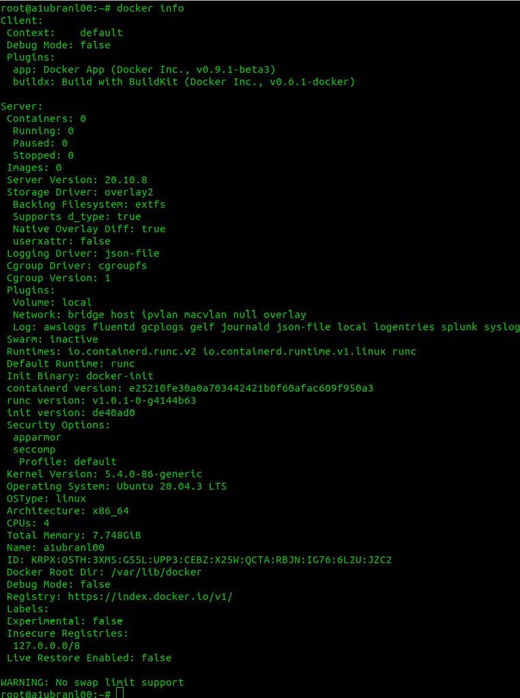
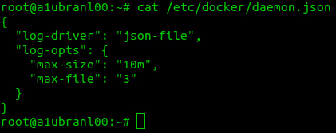
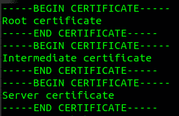
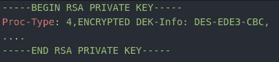
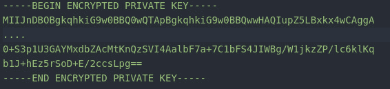
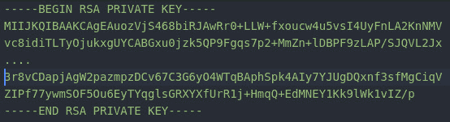
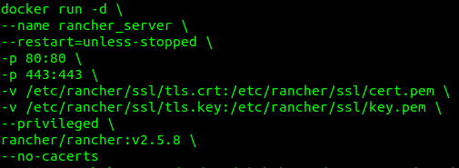
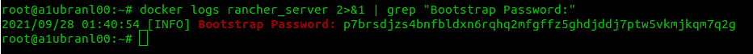
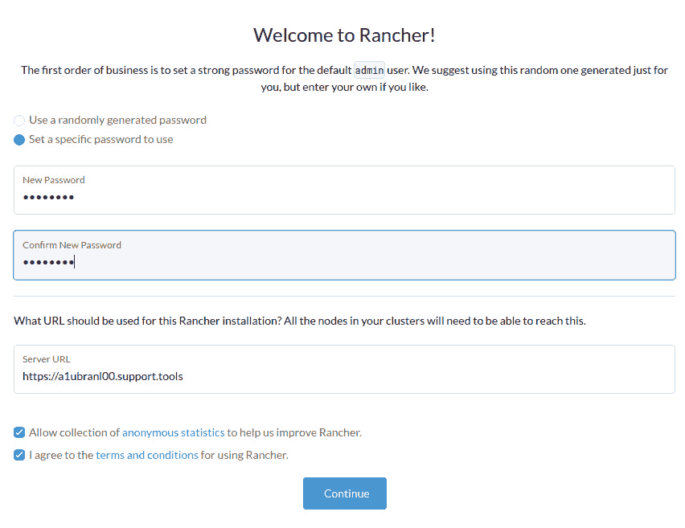

# *第三章*：创建单节点 Rancher

本章将涵盖将 Rancher 安装为单个 Docker 容器的过程。这是一个非常适合概念验证、开发或测试目的的选项。本章将介绍单节点 Rancher 的要求与限制，以及构建一个合适的企业解决方案所需的核心架构规则。最后，本章将讲解如何迁移到 **高可用性**（**HA**）集群。

本章将涵盖以下主要内容：

+   什么是单节点 Rancher 安装？

+   要求与限制

+   架构解决方案的规则

+   安装步骤

+   迁移到 HA 配置

# 什么是单节点 Rancher 安装？

Rancher 可以通过运行一个 Docker 容器进行安装。这个过程可以追溯到 Rancher v1.6 版本，当时 Rancher 服务器是一个基于 Java 的应用程序，通过 Docker 容器运行，并使用外部 MySQL 数据库，或者在单节点模式下使用运行在 Rancher 服务器容器内的 MySQL 服务器。随着 Rancher v2.x 的发布，Rancher 中的一切都转向使用 Kube-apiserver，并且设置了 `KUBECONFIG`。Kubernetes 默认在所有 Pod 中设置这个变量，因此如果缺少它，Rancher 就知道它必须在单节点模式下运行。此时，Rancher 服务器进程将开始检查 Kubernetes 组件是否有 SSL 证书，如果证书缺失或已过期，Rancher 将负责创建它们。接下来，Rancher 会启动一个单节点的 etcd 集群，并启动 Kube-apiserver 和所需的控制器。这里需要注意的是，这个集群是非常精简的。例如，这个集群没有 CoreDNS、ingress-controller，甚至没有一个 `true` 集群，且没有任何标准配置。早期版本中出现了几个问题。例如，在 Rancher v2.3.x 之前，无法在 Rancher 服务器容器内旋转证书，最初，Rancher 会创建一个有效期为 1 年的证书。这意味着一年后，Rancher 服务器会崩溃并无法启动，因为 Kubernetes 组件与过期证书无法正常工作，这是一种 Go 库中的安全措施，不允许任何没有验证证书的 HTTPS 连接。而且，过期的证书显然不是有效的证书。在 Rancher v2.3.x 版本中，Rancher 添加了一个过程，用于查找过期或即将过期的证书并旋转它们。这是通过在 Docker 容器内启动一个独特的 K3s 集群并将 Rancher 服务器作为 Pod 部署来实现的。

# 要求与限制

以下是单节点 Rancher 的 **要求**：

+   运行 Docker 18.06.3、18.09.x、19.03.x、20.10.x 的 Linux 主机

+   至少需要两个核心，但强烈推荐四个核心

+   8 GB RAM

+   10 GB 的 SSD 存储，延迟不超过 10 毫秒

+   在终端用户和管理的集群之间，`80` 和 `443` 端口需要开放

以下项不是必须的，但**强烈推荐**：

+   使用服务器主机名时，可以使用像 `rancher.example.com` 这样的 DNS 记录

+   由受认可的证书颁发机构（CA）签名的证书，如 DigiCert 和 GoDaddy

+   在 Rancher 服务器前面放置一个 HTTP 或 TCP 负载均衡器

+   服务器备份，可以是文件或快照级别的备份

+   为 Docker 文件系统 `/var/lib/docker` 提供专用的文件系统/磁盘

+   为 Rancher 持久数据 `/var/lib/rancher` 提供专用的文件系统/磁盘

+   Linux 主机应为**虚拟机**（**VM**），其中虚拟化管理程序或云提供商会提供冗余，以防硬件故障。

以下是单节点 Rancher 的已知**限制**：

+   单节点 Rancher 仅建议用于开发和测试目的，不应用于生产环境。

+   此主机上应仅安装 Rancher 服务器。该服务器不应托管任何其他应用程序。

+   单节点 Rancher 并非为**高可用（HA）**设计。

+   从单节点迁移到高可用（HA）并未正式支持，也不能保证能够成功。

+   单节点 Rancher 功能将被移除，并且不再提供。

+   Rancher v2.5.x 及更高版本需要特权选项，因此不能以无根模式运行 Docker。

+   单节点 Rancher 可以安装在台式机/笔记本电脑上，但当主机的 IP 地址发生变化时，会遇到问题，并且需要创建 DNS 记录。

# 架构解决方案的规则

**优点**如下：

+   单节点 Rancher 设置非常简单，只需部署一个容器即可。

+   启动非常快。与 RKE 需要 10-15 分钟才能启动相比，单节点 Rancher 只需几分钟即可启动。

+   与 RancherD 和完整的 RKE 集群相比，它的资源利用率较低。单节点 Rancher 使用的 CPU、内存和存储都要少得多。

+   如果只需要服务器主机名或 IP 地址，则无需负载均衡器或 DNS。

+   单节点 Rancher 可以在笔记本电脑上运行。（注意：Rancher Desktop 是更适合此方案的产品。）

**缺点**如下：

+   单节点 Rancher 并非为生产环境设计。

+   Rancher 官方和社区支持非常有限。

+   由于 K3s 设置已经嵌入代码中，且无法在不构建新版本的情况下更改，因此故障排除选项非常有限。

+   单节点 Rancher 的长期前景不确定，未来的版本中将被移除。

+   如果主机下线，则没有扩展性或冗余。Rancher 会宕机。

+   默认情况下，单节点 Rancher 将其数据存储在容器内部，如果容器丢失，数据也会丢失。

+   没有内置的备份解决方案；RKE、RKE2、K3s 和 RancherD 可以备份到本地磁盘或 S3。

**架构规则**如下：

+   你应该规划从单节点 Rancher 迁移到 HA 的方案。

+   Rancher 需要一个 SSL 证书，没有证书将无法工作。

+   使用公开签名的证书可以使脚本和工具更方便，因为 Rancher URL 默认会被信任。

+   Rancher 将管理的所有集群/节点需要通过 SSL 连接到 Rancher URL。

+   Rancher 确实支持隔离环境，但需要额外的步骤来提供代理访问互联网，或者你需要通过内部托管服务提供 Docker 镜像和目录。

# 安装步骤

我们假设以下情况：

+   确保你已经创建并更新了一个 Linux 虚拟机（在本示例中，我们将使用运行 Ubuntu 20.04 的 VMware 虚拟机）。

+   确保 Linux 虚拟机可以访问互联网，并且不需要 HTTP 代理进行访问。注意，如果你没有互联网访问权限，请参考位于 [`rancher.com/docs/rancher/v2.5/en/installation/other-installation-methods/air-gap/`](https://rancher.com/docs/rancher/v2.5/en/installation/other-installation-methods/air-gap/) 的隔离步骤。

+   你拥有对 Linux 虚拟机的 SSH 和 root 访问权限。

+   你正在使用默认配置和存储位置安装 Docker。

+   确保文件系统 `/var/lib/docker` 和 `/var/lib/rancher` 已经创建并挂载。

+   你已经为 Rancher 创建了 DNS 记录。在本示例中，我们将使用 `rancher.support.tools` 和一个由受信任的 CA 签发的 SSL 证书。

## 安装 Docker

在本节中，我们将安装并配置 Docker：

1.  通过 SSH 进入 Linux 虚拟机，并使用 `sudo su -` 命令切换为 root 用户。

1.  运行 `curl https://releases.rancher.com/install-docker/20.10.sh | bash` 命令来安装 Docker。

1.  通过运行 `systemctl enable docker` 命令设置 Docker 在系统启动时启动。

1.  通过运行 `docker info` 来验证 Docker 是否正在运行。输出应如下所示：

图 3.1 – Docker 信息输出

文本输出：[`raw.githubusercontent.com/PacktPublishing/Rancher-Deep-Dive/main/ch03/install_steps/01_installing_docker/example_output.txt`](https://raw.githubusercontent.com/PacktPublishing/Rancher-Deep-Dive/main/ch03/install_steps/01_installing_docker/example_output.txt)

1.  配置日志轮转 – 我们需要启用 Docker 日志的轮转。创建/编辑 `/etc/docker/daemon.json` 文件，使其包含以下内容：

图 3.2 – 启用 Docker 日志轮转

测试版本：[`raw.githubusercontent.com/PacktPublishing/Rancher-Deep-Dive/main/ch03/install_steps/02_configure-log-rotation/daemon.json`](https://raw.githubusercontent.com/PacktPublishing/Rancher-Deep-Dive/main/ch03/install_steps/02_configure-log-rotation/daemon.json)

1.  使用 `systemctl restart docker` 命令重启 Docker 以应用更改。

## 准备 SSL 证书

在本节中，我们将准备用于 Rancher 服务器的 SSL 证书和密钥。这些文件将被称为 `tls.crt` 和 `tls.key`。步骤如下：

1.  要创建 `tls.crt`，我们需要完整的证书链。这包括根证书和中间证书。大多数公共根证书机构会在其网站上发布这些证书。

1.  我们希望所有证书文件都是**隐私增强邮件**（**PEM**）格式的。请注意，有时这也称为**Base64**。如果你的证书是其他格式，应该访问[`knowledge.digicert.com/solution/SO26449.html`](https://knowledge.digicert.com/solution/SO26449.html)获取关于格式转换的更多信息。

1.  一旦所有文件都为 PEM 格式，我们需要创建一个文件，其中包含每个证书的内容，按以下顺序排列。请注意，有些证书可能包含多个中间证书。如果你有任何问题，请联系你的证书颁发机构（CA）。此外，如果你使用的是内部 CA，可能没有中间证书，你可能只拥有根证书和服务器证书。

图 3.3 – 创建存储证书的文件

文本示例：[`raw.githubusercontent.com/PacktPublishing/Rancher-Deep-Dive/main/ch03/install_steps/03_prepping_ssl_certs/example_certs/tls.pem`](https://raw.githubusercontent.com/PacktPublishing/Rancher-Deep-Dive/main/ch03/install_steps/03_prepping_ssl_certs/example_certs/tls.pem)

1.  对于私钥，我们需要确保它没有密码短语。我们通过检查文件的顶部来做到这一点；请参见以下示例了解详细信息。

这些是有密码短语的密钥示例：

图 3.4 – 密码短语示例 1

图 3.5 – 密码短语示例 2

这是一个没有密码短语的密钥示例：

图 3.6 – 没有密码短语的密钥示例

1.  如果你的密钥有密码短语，你需要使用 `openssl rsa -in original.key -out tls.key` 命令来移除它，并在提示时输入密码短语。

1.  一旦此过程完成，你应该会有两个文件，`tls.crt` 和 `tls.key`。

1.  你需要使用 `mkdir -p /etc/rancher/ssl/` 命令创建 `/etc/rancher/ssl/` 目录，并将这两个文件放入该目录中。请注意，这些文件应由 root 用户拥有。

## 启动 Rancher 服务器

在本节中，我们将创建 `docker run` 命令并启动 Rancher 服务器。

以下是一个示例命令：

图 3.7 – docker run 命令示例

文本版本：[`raw.githubusercontent.com/PacktPublishing/Rancher-Deep-Dive/main/ch03/install_steps/04_rancher_run_command/example01.txt`](https://raw.githubusercontent.com/PacktPublishing/Rancher-Deep-Dive/main/ch03/install_steps/04_rancher_run_command/example01.txt)

现在，我们来逐步解析这个命令：

1.  `docker run -d` 将创建一个新的容器，并以分离模式启动它。

1.  `--name rancher_server` 将容器的名称设置为 `rancher_server`。这样会使未来的命令更加简洁，因为没有这个名称时，Docker 会生成一个随机名称。

1.  `--restart=unless-stopped` 将告诉 Docker 确保该容器一直运行，除非你手动停止它。

1.  `-p 80:80` 将主机上的端口 `80`（HTTP）映射到容器内的端口 `80`。

1.  `-p 443:443` 将主机上的端口 `443`（HTTPS）映射到容器内的端口 `443`。请注意，如果你在负载均衡器上进行 SSL 卸载，则不需要此操作。

1.  `v /etc/rancher/ssl/tls.crt:/etc/rancher/ssl/cert.pem` 和 `-v /etc/rancher/ssl/tls.key:/etc/rancher/ssl/key.pem` 标志将把我们之前创建的证书文件传递到 Rancher 服务器。

1.  `-v /var/lib/rancher:/var/lib/rancher` 标志将把 Rancher 的数据目录绑定到主机的文件系统上。

1.  `--privileged` 将赋予 Rancher 服务器容器在主机上的 root 权限。这是必要的，因为我们将在容器内部运行 K3s，且该容器会有额外的容器。

1.  `rancher/rancher:v2.5.8` 将设置 Rancher 镜像，并指定 Rancher 服务器的版本。

1.  `--no-cacerts` 将禁用 Rancher 服务器的证书生成过程，因为我们将使用我们自己的证书。

1.  最后，一旦我们启动 Rancher 服务器，我们需要等几分钟，直到 Rancher 完全启动。

1.  你可以通过运行 `docker logs -f rancher_server` 命令来观看服务器启动过程。

1.  然后，你需要在浏览器中打开 Rancher URL。请注意，如果你打算使用 CNAME 或负载均衡器，应该使用该 URL，而不是使用主机的 IP/主机名。

1.  要获取管理员密码，你需要运行以下命令：`docker logs rancher_server 2>&1 | grep “Bootstrap Password:”`

图 3.8 – 第 14 步的代码片段

1.  登录到 Rancher 后，你需要设置密码和 URL：

图 3.9 – Rancher 登录页面

设置 URL 时要特别注意，确保选择一个你希望长期使用的 URL，因为更改 URL 是非常困难且耗时的。密码是本地管理员的密码，这是一个具有完全访问权限的 root 级帐户。此密码应该是安全的。

# 迁移到 HA 设置

从单节点 Rancher 迁移到 HA 安装时，我们需要以下内容：

+   你应该运行 Rancher 和 RKE 的最新版本。

+   你已经有了三个新的 Linux 虚拟机（在本示例中，我们将使用一台运行 Ubuntu 20.04 的 VM）。请注意，在此过程结束时，原始的虚拟机可以被回收。

+   我们假设 Linux 虚拟机可以访问互联网，并且不需要 HTTP 代理。如果没有互联网访问，请参见位于[`rancher.com/docs/rancher/v2.5/en/installation/other-installation-methods/air-gap/`](https://rancher.com/docs/rancher/v2.5/en/installation/other-installation-methods/air-gap/)的隔离环境步骤。

+   通过 SSH 连接并获取 Linux 虚拟机的 root 权限。

+   在三台新虚拟机上安装 Docker。

+   Rancher 的 DNS 记录不是服务器主机名/IP 地址。

+   你将需要 30 到 60 分钟的维护窗口。在此期间，Rancher 及其 API 将不可用。这可能导致 CICD 管道无法工作，应用程序团队可能无法管理其应用程序。请注意，这不会影响下游应用程序，唯一的影响是管理方面。

+   在接下来的步骤中，我们假设单节点 Rancher 服务器容器被称为`rancher_server`。如果名称不同，请更新接下来的命令。

+   本节假设你了解什么是 RKE 以及如何使用它。请注意，我们将在下一章中详细讨论 RKE。

## 备份当前的 Rancher 服务器

在本节中，我们将备份当前的 Rancher 单节点服务器，包括 Kubernetes 证书、`etcd`和 Rancher URL 的 SSL 证书。步骤如下：

1.  通过 SSH 连接到当前的 Rancher 服务器节点。

1.  使用`sudo su –`命令切换为 root 用户。

1.  使用`docker stop rancher_server`命令停止当前的 Rancher 服务器。

1.  使用`docker create --volumes-from rancher_server --name rancher-data-<DATE> rancher/rancher:<RANCHER_CONTAINER_TAG>`命令从当前服务器创建一个卷。请替换日期和标签占位符。

1.  使用`docker run --volumes-from rancher-data-<DATE> -v $PWD:/backup:z busybox tar pzcvf /backup/rancher-data-backup-<RANCHER_VERSION>-<DATE>.tar.gz /var/lib/rancher`命令创建一个`tar.gz`文件备份。请替换日期和标签占位符。

1.  使用`ls -lh`命令验证备份文件是否已经创建。备份文件将在当前目录中创建。

1.  使用`docker start rancher_server`命令重启 Rancher 服务器备份。

1.  使用`docker exec -it rancher_server /bin/bash`命令进入 Rancher 服务器容器的 shell。

1.  使用`tar -zcvf pki.bundle.tar.gz /etc/kubernetes/ssl`命令备份当前的证书。

1.  使用`exit`命令退出 shell。

1.  使用`docker cp rancher_server:/var/lib/rancher/pki.bundle.tar.gz`命令将备份文件从 Rancher 服务器中复制出来。

1.  使用`docker run --net=container:rancher_server -it -v $(pwd):/cwd --name etcd-utility rancher/rke-tools:v0.1.20`命令创建一个临时容器。

1.  使用`mkdir ssl; cd ssl; cp /cwd/pki.bundle.tar.gz .; tar -zxvf pki.bundle.tar.gz --strip-components 3`命令为`etcd`设置证书。

1.  使用`cd /; ETCDCTL_API=3 etcdctl snapshot save --cacert=/ssl/kube-ca.pem --cert=/ssl/kube-etcd-127-0-0-1.pem --key=/ssl/kube-etcd-127-0-0-1-key.pem single-node-etcd-snapshot`命令进行`etcd`备份。

1.  使用`exit`命令退出 shell。

1.  使用`docker cp etcd-utility:/single-node-etcd-snapshot`命令从临时容器中复制`etcd`备份。

1.  使用`docker stop rancher_server`命令停止当前的 Rancher 服务器。

1.  将`pki.bundle.tar.gz`和`single-node-etcd-snapshot`文件复制到你将使用`rke`命令的任何服务器/工作站上。有些人会使用集群中的第一个节点来执行此任务。

## 开始切换到新集群

此时，我们将开始将备份恢复到新集群并迁移 Rancher URL：

1.  你应该更新 DNS 或负载均衡器，将流量从旧的单节点 Rancher 服务器重定向到新集群。注意，DNS 可能需要一些时间才能完全传播，因此我们现在要进行这个操作。

1.  我们确实只想修改`cluster.yaml`文件，以包括第一个节点。接下来的步骤中，我们假设主机名是`node01`。你可以使用位于[`raw.githubusercontent.com/PacktPublishing/Rancher-Deep-Dive/main/ch03/migrating_from_single_to_ha/cluster.yml`](https://raw.githubusercontent.com/PacktPublishing/Rancher-Deep-Dive/main/ch03/migrating_from_single_to_ha/cluster.yml)的示例文件。

1.  将`single-node-etcd-snapshot`和`pki.bundle.tar.gz`文件通过 SCP 传输到`node01`。

1.  使用`sudo su -`命令 SSH 进入 node01 主机并以 root 身份登录。

1.  使用`mkdir -p /opt/rke/etcd-snapshots`命令创建目录快照目录。

1.  将这两个备份文件移动到`/opt/rke/etcd-snapshots`目录。这些文件应该由 root 用户拥有。

1.  现在你可以退出`node01`上的 SSH 终端。

1.  使用`rke etcd snapshot-restore --name single-node-etcd-snapshot --config cluster.yaml`命令开始恢复。

此过程可能需要 5 到 10 分钟才能完成。示例命令输出位于[`raw.githubusercontent.com/PacktPublishing/Rancher-Deep-Dive/main/ch03/migrating_from_single_to_ha/restore_command_output.txt`](https://raw.githubusercontent.com/PacktPublishing/Rancher-Deep-Dive/main/ch03/migrating_from_single_to_ha/restore_command_output.txt)。

1.  此时，你可以使用`rke up --config cluster.yaml`命令启动集群。

1.  如果遇到任何错误，尝试第二次运行`rke up`命令。

1.  一旦成功完成，你可以编辑`cluster.yaml`文件，添加`node02`和`node03`。

1.  再次运行`rke up`命令以添加额外的节点。

1.  此时，您可以登录到 Rancher 并验证一切是否可访问且健康。请注意，可能需要几分钟时间，直到下游集群重新连接并在 UI 中显示为*活动*状态。

1.  需要注意的是，在确保不会回滚到旧服务器之前，应避免进行任何集群级别的更改，例如创建新集群、编辑现有集群或删除集群。

## 清理/回滚

如果迁移不成功，请按照以下步骤操作：

1.  将 Rancher URL 的 DNS 记录更改回原始服务器。

1.  使用`docker start rancher_server`命令启动 Rancher 单节点容器。

1.  需要注意的是，目前无法将 HA 中所做的更改迁移回单节点。因此，在回滚时，自关闭单个 Rancher 节点以来的所有更改将会丢失。

1.  经过几天的*烧机*后，您可以删除旧的虚拟机或使用[`raw.githubusercontent.com/rancherlabs/support-tools/master/extended-rancher-2-cleanup/extended-cleanup-rancher2.sh`](https://raw.githubusercontent.com/rancherlabs/support-tools/master/extended-rancher-2-cleanup/extended-cleanup-rancher2.sh)脚本清理旧服务器。

# 总结

本章中，我们了解了单节点 Rancher 的工作原理及其优缺点。接着，我们讲解了在单节点模式下安装 Rancher 所需的步骤和命令。最后，我们详细讨论了迁移到 HA 设置的过程，包括备份当前数据并进行恢复。

在下一章中，我们将介绍 RKE 和 RKE2，包括它们的起源、工作原理以及如何使用它们设计解决方案。
