# *第四章*：创建 RKE 和 RKE2 集群

部署 Rancher 的标准方式是创建一个**Rancher Kubernetes Engine (RKE)**集群，然后使用 Helm 在集群上安装 Rancher。使用 RKE2 部署 Kubernetes 集群的新方式建立在 K3s 和新的内部集群管理模型之上。通过这种方式，Rancher 可以直接管理其所在的集群，而无需像 RKE 这样的外部工具。本章将讨论何时使用 RKE2 而非 RKE 是合理的，以及如何引导第一个节点并将其他节点加入集群。此时，我们将使用**Helm**工具在集群上安装 Rancher，这将把 Rancher 服务器工作负载安装到集群中。最后，我们将介绍如何配置负载均衡器以支持 Rancher URL。

在本章中，我们将覆盖以下主要主题：

+   什么是 RKE 集群？

+   什么是 RKE2 集群？

+   什么是 RancherD？

+   要求和限制

+   解决方案架构规则

+   安装步骤（RKE）

+   安装步骤（RKE2）

+   配置外部负载均衡器（HAProxy）

+   配置 MetalLB

开始吧！

# 什么是 RKE 集群？

RKE 是 Rancher 的 Kubernetes 发行版，完全运行在 Docker 容器内。当然，RKE 是 CNCF 认证的发行版，因此所有标准的 Kubernetes 组件和 API 资源都可以使用。了解 RKE 集群的最简单方法是知道它的起源以及它是如何工作的。

## RKE 的来源是什么？

最初，当 Rancher 开始创建 Kubernetes 集群时，Rancher 使用其名为**Cattle**的集群软件，目的是将 Kubernetes 视为集群中的另一个应用程序。这导致了一些问题，从 kubelet 与 Cattle 争夺控制容器，到需要基于 HAProxy 构建自定义负载均衡器解决方案。对于大多数组件来说，最主要的问题是 Rancher 服务器管理集群中的 Cattle 部分，而 Kubernetes 管理 pod 部分。这意味着集群依赖于 Rancher 来获取 pod 的 IP，并且在 pod 变化时需要 Rancher 来更新负载均衡器。随着 Rancher v2.x 和 RKE 的出现，这一切发生了变化，RKE 的理念是它将独立于 Rancher 服务器创建和管理集群。当然，Cattle 的一些核心思想被带入了 RKE，主要的理念是，如果一切都只是容器，那么 Rancher 就不需要关心操作系统。RKE 不需要任何库或软件包。RKE 的核心是管理独立的 Docker 容器来提供核心的 Kubernetes 服务。这些服务包括 etcd、kube-apiserver、kube-scheduler、kube-controller-manager、kubelet 和 kube-proxy。

## RKE 是如何工作的？

RKE 的核心设计原则之一是具有所需的状态配置，形式是一个名为 `cluster.yaml` 的配置文件。通过这个文件，RKE 知道您希望构建什么样的集群，使用哪些节点，以及每个 Kubernetes 组件如何配置。这个文件是 YAML 格式的，因此在创建或编辑时，您需要遵循 YAML 标准。一个常见的陷阱是制表符（Tab）。YAML 使用空格而非制表符，虽然它们看起来一样。如果开始遇到语法错误，可能是因为制表符。接下来是一个 `cluster.yaml` 示例，以及接下来的部分。我们将逐步分析配置文件的不同部分。

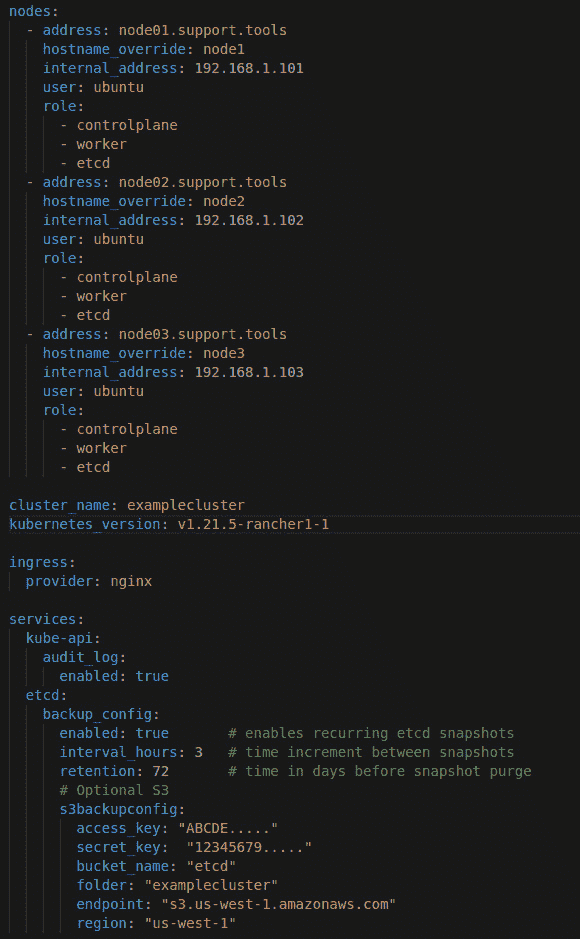

](img/B18053_04_001.jpg)

图 4.1 – 示例 cluster.yml

完整配置：[`raw.githubusercontent.com/PacktPublishing/Rancher-Deep-Dive/main/ch04/example_configs/simple_3_node_cluster.yml`](https://raw.githubusercontent.com/PacktPublishing/Rancher-Deep-Dive/main/ch04/example_configs/simple_3_node_cluster.yml)

第一部分是 `nodes`。在此部分中，您将定义用于创建集群的节点。如果我们拆解节点定义，会看到第一行是 `address`。这是 RKE 用于连接节点的主机名或 IP 地址。通常情况下，使用服务器的 **FQDN**（**完全合格的域名**）是标准做法。

重要提示

运行 RKE 的服务器必须能够解析主机名。

在没有先从集群中移除节点并将其作为新节点重新加入之前，不应更改此地址。定义节点时，`address` 字段是必需的。

以下部分是 `hostname_override`，用于在 Kubernetes 中设置节点名称。大多数人会将其设置为短主机名。此名称不需要在 DNS 中注册，因为它只是 Kubernetes 中的一个标签。例如，AWS 使用的命名约定是 `ip-12-34-56-78.us-west-2.compute.internal`，但您可能想将其重写为更有帮助的名称，例如 `etcd01` 或 `prod-worker01`。

注意

与 `address` 字段一样，节点配置后，主机名字段不应更改。

如果您想更改主机名、IP 地址或角色，您应当先移除、清理节点，然后重新加入。如果此字段未设置，RKE 将默认使用 `address` 字段。

以下字段是 `user`。此字段在 RKE 创建 SSH 隧道到节点时使用。该账户应具有在不使用 `sudo` 的情况下运行 `docker` 命令的权限。此用户必须是 Docker 组的成员或是 root 用户。如果节点级别未定义用户，RKE 将默认为当前运行的用户。标准做法是使用 root 用户或服务账户。Rancher 推荐通常不要使用个人账户，因为您需要设置 SSH 密钥。

这引出了下一个字段：`ssh_key_path`。这个字段应该是用于连接节点的 SSH 私钥的路径。RKE 要求在运行 RKE 二进制文件的服务器与所有节点之间设置 SSH 密钥。当你 SSH 连接到节点时，如果没有设置`ssh_key_path`，或者提示输入密码时，它会默认使用集群的默认选项，默认情况下`ssh_key_path`未设置时，RKE 会默认为`~/.ssh/id_rsa`。

这与下一个部分`port`相关，`port`是 RKE 用于连接 SSH 服务器的端口。RKE 默认使用端口`22`。通常情况下，这个端口不会更改，但在少数情况下，当使用端口转发时，多个服务器可以共享同一个公共 IP 地址，而不需要 RKE 直接访问节点的 IP。接下来的字段是`docker_socket`，这是 Docker 套接字的文件路径。这个文件是一个 Unix 域套接字，有时也称为 IPC 套接字。这个文件提供了访问 dockerd 的 API。

请注意，这个 API 没有认证或加密，并且具有对 Docker 及其容器的完全控制权。这个文件必须得到保护，因此默认情况下，文件的拥有者是 root 用户和 Docker 组。RKE 使用这个文件连接到 Docker 引擎以执行命令、创建容器等操作。

最后，我们进入`role`字段。这些字段定义了分配给节点的角色（`etcd`、`controlplane`或`worker`）。你可以根据需要混合和匹配这些角色分配。例如，标准的三节点集群将所有三个节点分配有这三种角色。我们将在*架构解决方案的规则*部分详细介绍。

以下部分是我所说的全局设置部分。在这一部分，你可以定义集群级别的设置。我们将涵盖最常见的设置，完整的集群设置列表可以在[`rancher.com/docs/rke/latest/en/config-options/`](https://rancher.com/docs/rke/latest/en/config-options/)找到。第一个字段是`cluster_name`，用于设置集群的名称。此设置不会影响集群，唯一的实际变化是 RKE 生成的`kubeconfig`文件中会包含集群名称，这样将`kubeconfig`映射到集群时会更加直观。默认情况下，RKE 会将此设置为 local，并且可以随时更改。

下一个最常见的设置是`ignore_docker_version`。此设置告知 RKE 是否应该忽略节点上不支持的 Docker 版本。RKE 具有一个内置的元数据文件，映射了所有经过 Rancher 测试并批准的支持版本。通常，Docker 会随着操作系统的标准修补程序进行升级，这可能会导致如果 RKE 发布版本不够新，RKE 无法升级集群。将此设置为`true`是很常见的，这样 RKE 仍然会在日志中抛出警告信息，但会继续构建集群。

下一个字段可能是你可以设置的最重要的设置，那就是 `kubernetes_version`。默认情况下，当创建 RKE 时，它会设置一个默认的 Kubernetes 版本。这通常是构建时官方支持的最高版本。例如，RKE v1.2.3 会默认使用 Kubernetes 版本 `v1.19.4-rancher1-1`，在创建集群时是可以的。但是，如果后来有人将 RKE 升级到 v1.3.1，而这个版本的新默认 Kubernetes 版本是 `v1.21.5-rancher1-1`，假设你没有在 `cluster.yaml` 文件中设置 Kubernetes 版本。下一个 RKE 升级事件将导致我所称的意外升级。这可能没问题，但已知会引发一些问题。我们不想在没有测试和规划的情况下升级集群。因此，Rancher 通常建议在 `cluster.yaml` 中设置 `kubernetes_version`，作为一种安全措施。

注意

此设置还会设置所有 Kubernetes 组件的镜像版本标签，例如 etcd、kube-apiserver、canal、ingress-nginx-controller 等等。

这引出了下一个字段，`system_images`。该部分列出了所有不同组件的所有 Docker 镜像及其标签。例如，`etcd: rancher/coreos-etcd:v3.1.12` 设置了用于 etcd 的 Docker 镜像。请注意，默认情况下，Docker 会从 Docker Hub 拉取没有注册表名称的镜像。你可以使用 `--registry-mirror` 标志来改变这种行为，强制 Docker 使用私有注册表。这通常用于与外网隔离的环境，在这些环境中，服务器无法从 Docker Hub 拉取镜像。如果你想了解更多关于如何设置，请参见 Rancher 的文档：[`rancher.com/docs/rke/latest/en/config-options/system-images/#air-gapped-setups`](https://rancher.com/docs/rke/latest/en/config-options/system-images/#air-gapped-setups)。

最后，我们来到了 `services` 部分。在该部分，我们将定义每个 Kubernetes 组件的设置，例如，如果你想配置 etcd 备份。请注意，你应该启用 etcd 备份，并且较新的 RKE 版本默认开启本地备份。你可以进入服务、etcd 和 `backup_config`，在那里你可以通过将 `enabled` 设置为 `true` 来启用定期的 etcd 快照。你还可以使用 `interval_hours` 设置备份的时间间隔。RKE 并不像 cron 那样使用计划任务来安排备份时间。其备份计划是基于 `etcd-tools` 容器启动的时间。基本过程是，`etcd-tools` 会在容器启动后立即进行一次备份，然后按照 `interval_hours` 中定义的小时数休眠，直到进行下一次备份并重复此过程。目前，RKE 没有办法让你在预定时间进行备份。

下一个设置是`retention`，它设置了`etcd-tools`在清除快照之前将保留多少小时。当前默认值是 6 小时。但通常会将此设置增加到 72 小时左右。这样做的主要目的是防止备份过快地滚动。例如，如果某个更改在周五晚间进行，你可能要等到周一才能发现。使用默认设置时，你会丢失那个恢复点。但如果你将其设置为 72 小时，你仍然有机会恢复。需要注意的是，etcd 快照是数据库的完整副本，因此，如果你的 etcd 数据库大小为 1 GB，那么备份在压缩之前将是 1 GB，压缩后的备份大多数在 100~200 MB 范围内。默认情况下，RKE 会将备份保存在 etcd 节点的本地目录`/opt/rke/etcd-snapshots`中，每个 etcd 节点都会有一个完整的备份副本。这对于易用性非常好，但也带来了一个问题：你将备份存储在同一个备份服务器上。当然，你可以设置`rsync`脚本，将这些数据复制到另一台服务器，或者使用备份工具如 TSM 来备份该目录，甚至可以使用 Veeam 等工具对整个服务器进行镜像备份。但我通常推荐使用 S3 备份选项。

这将引导我们进入下一个部分，即`s3backupconfig`。这些设置允许你配置`etcd-tools`将 etcd 快照发送到 S3 存储桶，而不是本地存储。这对于灾难恢复情况非常有帮助，例如丢失数据中心或有人误删了 vCenter 中的所有 etcd 节点，因为通过`cluster.yaml`、`cluster.rkestate`和 etcd 备份，我们可以从零重建一个集群。有关此过程的更多详细信息，请查看我的 Kubernetes 灾难恢复大师课程，位于[`github.com/mattmattox/Kubernetes-Master-Class/tree/main/disaster-recovery`](https://github.com/mattmattox/Kubernetes-Master-Class/tree/main/disaster-recovery)。同样重要的是要注意，尽管这是 S3，但这并不意味着你必须使用 AWS 的 S3 服务。任何符合 S3 标准的 S3 提供商都可以使用。

# 什么是 RKE2 集群？

RKE2，也称为 RKE Government，是 Rancher 的新 Kubernetes 发行版。RKE2 与 RKE 有几个不同之处，第一个就是它更注重安全性。

注意

为了简化本节内容，我们将原始的 RKE 发行版称为**RKE1**，新的发行版称为**RKE2**。

在 RKE1 集群中，集群默认并不完全安全，这意味着你需要采取一些步骤（《Rancher 硬化指南》: https://rancher.com/docs/rancher/v2.6/en/security/#rancher-hardening-guide）才能通过 CIS Kubernetes 基准测试。由于这个过程的复杂性以及一些人甚至不知道这件事，导致许多 RKE1 集群没有得到充分保护。RKE2 改变了这一模型，它默认是安全的，要求你通过多个复杂步骤来降低安全性。RKE2 还像 RKE1 一样通过了 CIS Kubernetes 基准测试 v1.5 和 v1.6，并符合 FIPS 140-2 标准。最后，在安全方面，RKE2 过程从一开始就构建了 CVE 扫描，作为构建流水线的一部分，这使得在产品中包含已知的 CVE 问题变得非常困难。

第二个重大区别是从 Docker 转向 containerd。在 RKE1 中，一切都是围绕 Docker 和基于 Docker 的命令/APIs 构建的。而随着 Kubernetes v1.22 宣布不再支持 Docker 运行时，这一迁移对于 Kubernetes 的长期支持是必须的。我需要指出的是，Dockershim 是 Kubernetes **CRI**（**容器运行时接口**）和 Docker 之间的适配器，它允许人们在可预见的未来继续在 Kubernetes 中使用 Docker。Rancher 也将维护 cri-dockerd 的一个分支。有关更多细节和官方声明，请参见 [`github.com/rancher/rancher/issues/30307`](https://github.com/rancher/rancher/issues/30307)。话虽如此，RKE2 和 K3s 之所以转向 containerd，是因为它在速度和管理开销方面的优势。Docker 带来了许多 Kubernetes 主机并不需要的工具和库，浪费了资源。因为 Docker 本身就在底层运行 containerd，那么为何不去掉这层，并直接让 kubelet 管理 containerd 呢？

第三个重要变化是从将所有内容运行在容器中，转变为允许一些低级组件（如 kubelet）作为二进制文件直接在主机上运行。由于 kubelet 等项目不在 containerd 中运行，它可以执行如升级 containerd 这样的任务，而不会遇到 RKE1 中的“先有鸡还是先有蛋”的问题。Kubelet 不能升级 Docker，因为第一步是停止 Docker，这会停止 kubelet，进而停止升级。正如下图所示，RKE2 有**管理的进程**，这些进程直接运行在操作系统上，而不是作为容器运行。

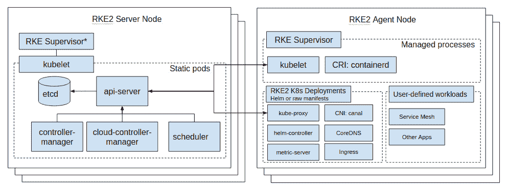

图 4.2 – RKE2 服务器和代理的高级架构图

第四个重大变化是不再使用非 Pod 容器。在 RKE1 中，许多核心组件，如 kubelet、etcd、kube-apiserver、kube-controller-manager 和 kube-scheduler，都是 Docker 容器，但不是 Kubernetes Pod。这是因为这些容器是由 RKE 二进制文件创建和管理的，而不是由 kubelet 管理的。随着 RKE2 的出现，kubelet 成为主机操作系统上的一个二进制文件，kubelet 可以使用静态 Pod。这些 Pod 很特别，因为它们可以在没有 etcd、kube-apiserver 等的情况下创建和启动。这个过程是通过预先创建包含通常由集群提供的所有项的清单文件来完成的，例如 Pod 名称、IP、MAC 地址、机密、卷等，在此时，kubelet 可以像管理任何其他 Pod 一样启动并管理该 Pod。一旦 kubelet 能够连接到集群，该 Pod 就可以被发现并添加到 etcd 中。

这引出了 RKE2 相对于 RKE1 的最重要变化：从集中式控制转向分布式控制模型。在 RKE1 中，所有核心的集群管理任务都是由 RKE1 二进制文件本身管理的。即使 Rancher 管理集群，它也会在 Rancher 服务器内部创建 `cluster.yml` 文件并运行 RKE1 二进制文件。因此，在 RKE1 中，您必须更新 `cluster.yaml` 并运行 `rke up` 命令。这个过程会导致 RKE1 二进制文件进行集群的协调。RKE2 将这一过程转移到集群内部，这意味着 RKE2 集群能够自我管理。RKE2 使用的方法是先引导集群中的第一个主节点，然后将其他主节点和工作节点加入集群。

在 RKE1 迁移到分布式模型的过程中，您可以选择将简单的 YAML 文件部署为附加作业。RKE2 在此基础上进行扩展，允许您在部署过程中部署 YAML 文件和 Helm 图表。这使得您能够将多个任务迁移到集群创建过程中。例如，您在部署 Rancher 的 Longhorn 产品时，它作为集群创建的一部分提供分布式存储服务。这一点非常重要，因为许多环境在开始部署像 Prometheus 这样的服务时需要存储。RKE2 集成了 K3s 的 Helm 控制器，允许您通过 YAML 定义 Helm 图表的安装。然后，Helm 控制器将启动一个 Pod 来处理该图表的部署和升级，最终目标是将大多数集群任务（例如将节点添加到集群或从集群中移除节点）从 Rancher 服务器内的过程转移到下游集群本身的过程。这帮助 Rancher 支持大规模集群管理（单个 Rancher 部署可支持 100 万+ 集群），并通过降低 Rancher 服务器与边缘集群之间的流量来改善边缘集群的数据处理。

最后，将节点加入现有 RKE2 集群的过程与加入 RKE1 集群的过程有很大不同。在 RKE1 中，二进制文件负责将容器部署到新节点上。而在 RKE2 中，存在一个简单的过程，首先启动第一个节点时使用特殊标志 `cluster-init`，该标志告诉 RKE2 创建一个新集群。这包括创建一个新的 etcd 集群并创建一个新的根 CA（kube-ca）。如果没有设置，RKE2 会为集群生成一个令牌。一旦第一个节点创建完成，Kubernetes API 应该就可以使用，其他节点可以用它来加入集群。因此，你需要为 Kubernetes API 端点设置一个轮询 DNS 记录或负载均衡器。接下来，你需要在集群中的每个新节点上设置 RKE2 集群令牌以及服务器端点。为了使 RKE2 启动，这两个设置都是必需的。这些设置定义在文件 `/etc/rancher/rke2/config.yaml` 中。请注意，在 RKE2 中，这个文件用于总体配置 RKE2。所以如果你想定义 kubelet 设置、节点标签/污点等，必须保护该文件，因为文件中存储的令牌用于多个安全相关任务，如 Kube-API 访问和 etcd 加密。因此，令牌应视为密码，即它应是唯一的、随机的且足够长。默认长度为 32 个字符。你还应避免使用特殊控制字符，如美元符号、反斜杠、引号等。

# 什么是 RancherD？

RancherD 是一个特殊的二进制文件，旨在引导 Kubernetes 集群（K3s/RKE2）和 Rancher。其目的是简化创建直接支持 Rancher 服务器应用及其组件的 K3s/RKE2 集群的过程。RancherD 设计为仅在节点上运行一次，运行时，它负责设置 K3s/RKE2 以及为 Rancher 所需的清单文件。当你希望在大规模部署 Rancher 时，这个过程非常有用。例如，如果你希望每个 Kubernetes 集群都有自己的 Rancher 仪表板，而不同的环境不共享同一个 Rancher 部署。很多提供 Rancher 服务的托管公司都会使用这种方式。

需要注意的是，RancherD 在后台使用 RKE2，因此相同的要求和限制适用。我们将在下一节中介绍这些要求和限制。

# 要求和限制

在这一节中，我们将讨论 RKE 和 RKE2 集群的基本要求及其限制。

## 基本要求

让我们先来看一下 **RKE** 的基本要求：

+   在 RKE 将主机加入集群之前，必须先在主机上安装 Docker。

+   RKE 可以在几乎任何 Linux 操作系统上运行，但你应该参考位于 [`rancher.com/support-maintenance-terms/`](https://rancher.com/support-maintenance-terms/) 的 Rancher 支持矩阵。

+   RKE 需要使用 SSH 密钥访问集群中的所有节点。

+   RKE 需要权限以在不使用 sudo 或密码的情况下运行 Docker 命令。

+   集群中的所有节点必须能够相互路由，这意味着你可以将节点放在直接子网中，但必须能够在节点之间直接连接，而无需使用 NAT。

+   RKE 需要根据节点角色在节点之间开放防火墙规则。有关更多详情，请参见 [`rancher.com/docs/rke/latest/en/os/#ports`](https://rancher.com/docs/rke/latest/en/os/#ports)。

+   一个 RKE 集群至少需要一个节点来承担每个角色，包括 etcd、controlplane 和 worker。集群在满足这一要求之前不会上线。请注意，一个节点可以承担多个角色，包括同时拥有这三个角色。

+   RKE 只需要至少一个核心，具体取决于集群大小和节点角色选择。建议至少使用两个核心，标准配置为四个核心。

+   内存要求取决于节点的角色，其中 etcd 角色需要大约 4 GB，kube-apiserver 需要 4 GB，工作节点角色需要大约 2 GB。

+   对于存储，你需要大约 10 GB 的一级/二级存储（推荐 SSD，但不是必需的）。

+   对于文件系统，RKE 依赖 Docker 存储驱动程序，因此请查看 Docker 的文档：[`docs.docker.com/storage/storagedriver/`](https://docs.docker.com/storage/storagedriver/)。

+   RKE 不需要自己的文件系统，但建议将 `/var/lib/docker` 存放在独立的文件系统/磁盘上，以防止 Docker 填满根文件系统。

+   在 etcd 节点上，数据库存储在位于 `/var/lib/etcd` 的绑定挂载中，不需要放在专用磁盘上。此外，在更大的集群中，建议将这些数据存储在一级存储上，因为 etcd 对存储延迟较为敏感。

+   如果你使用 RKE 的本地备份选项，`/opt/rke/etcd-snapshots` 目录应使用独立的文件系统或 NFS 共享，以确保安全。

以下是 **RKE2** 的要求：

+   RKE2 可以运行在几乎所有的 Linux 操作系统上，但你应参考位于 [`rancher.com/support-maintenance-terms/`](https://rancher.com/support-maintenance-terms/) 的 Rancher 支持矩阵。

+   安装和配置 RKE2 需要主机上的 root 权限。

+   集群中的所有节点必须能够相互路由，这意味着你可以将节点放在直接子网中，但必须能够在节点之间直接连接，而无需使用 NAT。

+   RKE2 需要根据节点角色在节点之间开放防火墙规则。有关更多详情，请参见 [`rancher.com/docs/rancher/v2.5/en/installation/requirements/ports/`](https://rancher.com/docs/rancher/v2.5/en/installation/requirements/ports/)。

+   RKE2 需要集群中的主节点和工作节点。请注意，这两个角色可以在同一个节点上。

+   RKE2 只需要至少一个核心，具体取决于集群大小和节点角色选择。建议至少使用两个核心，标准配置为四个核心。

+   内存需求取决于节点的角色，主节点需要 4 GB，而工作节点/代理节点大约需要 2 GB。

+   RKE2 将其数据存储在挂载点 `/var/lib/rancher` 下，包括 containerd 数据、镜像、etcd 等。

+   对于主节点，etcd 存储在 `/var/lib/rancher/rke2/server/db/etcd` 下；建议将此数据存储在一级存储上，因为 etcd 对存储延迟较为敏感。

+   RKE2 默认启用 etcd 备份，并将备份存储在 `/var/lib/rancher/rke2/server/db/snapshots` 下，建议将其存储在独立的文件系统中，或者出于安全原因，使用 NFS 共享。

## 设计限制和考虑事项

现在，让我们讨论一下两个集群的设计限制。

以下列出了 RKE 的设计考虑事项：

+   创建集群后，无法更改网络提供者（CNI），在 RKE 文档中称为网络插件，相关文档位于 [`rancher.com/docs/rancher/v2.5/en/faq/networking/cni-providers/`](https://rancher.com/docs/rancher/v2.5/en/faq/networking/cni-providers/)。

+   默认情况下，RKE 将使用子网 `10.42.0.0/16` 和 `10.43.0.0/16` 作为 Pod 覆盖和服务网络。集群创建后无法更改此设置，因此，如果这些网络与您的当前网络重叠，您需要为集群选择不同的子网。

+   对 Windows 工作节点的支持目前仅限于 Rancher 管理的 RKE 集群。您无法直接使用 RKE 将 Windows 节点加入集群。

+   RKE 目前不支持 ARM64 操作系统。

+   RKE 支持空网环境，但需要执行一些额外步骤，相关步骤可参见 https://rancher.com/docs/rke/latest/en/config-options/system-images/#air-gapped-setups。

+   将 RKE 切换到空网环境可以通过重新配置集群、部署和应用程序来完成。

+   只要数据中心数量为奇数，并且每个数据中心中都有 etcd 和控制平面节点，RKE 集群可以跨数据中心构建。

+   etcd 节点之间的网络延迟应小于 10 毫秒。

以下是 RKE2 的设计考虑事项：

+   创建集群后，无法更改网络提供者（CNI），在 RKE2 文档中称为网络插件，相关文档位于 [`docs.rke2.io/install/network_options/`](https://docs.rke2.io/install/network_options/)。

+   默认情况下，RKE2 将使用子网 `10.42.0.0/16` 和 `10.43.0.0/16` 作为 Pod 覆盖和服务网络。集群创建后无法更改此设置，因此，如果您当前的网络使用了这些子网之一，您应该更改此设置。

+   截至目前，RKE2 提供对 Windows 节点的实验性支持，但您仍然需要在集群中提供 Linux 节点。

+   截至目前，RKE2 不支持 ARM64 操作系统，尽管 K3s 支持。

    注意

    有一个公开的功能请求（[`github.com/rancher/rke2/issues/1946`](https://github.com/rancher/rke2/issues/1946)），要求提供对 ARM64 的支持。

+   RKE2 支持气隙环境，但您需要执行一些额外的步骤，这些步骤位于[`docs.rke2.io/install/airgap/`](https://docs.rke2.io/install/airgap/)。

+   RKE2 在气隙环境中可以通过私有注册表模式和 tarball 模式工作，相关步骤位于[`docs.rke2.io/install/airgap/`](https://docs.rke2.io/install/airgap/)。

+   只要数据中心数量为奇数，并且每个数据中心都有一个主节点，RKE2 集群可以跨数据中心构建。

+   etcd 节点之间的网络延迟应该小于 10 毫秒。

现在我们已经了解了 RKE1 和 RKE2 的限制，我们将利用这些信息以及一系列规则和示例，帮助我们使用 RKE1 和 RKE2 设计解决方案。

# 解决方案架构规则

本节将介绍一些标准设计及其优缺点。需要注意的是，每个环境都是独特的，需要进行调整，以实现最佳的性能和体验。同时，所有的 CPU、内存和存储大小是推荐的起始值，可能需要根据工作负载和部署过程的需求进行增加或减少。

在设计解决方案之前，您应该能够回答以下问题：

+   是否有多个环境共享同一集群？

+   生产环境和非生产环境的工作负载是否会共享同一个集群？

+   该集群需要什么级别的可用性？

+   该集群是否将在多个数据中心之间跨越多个数据中心的环境中运行？

+   集群中节点之间的延迟是多少？

+   集群中将托管多少个 Pod？

+   您将部署到集群中的 Pod 的平均大小和最大大小是多少？

+   您是否需要为某些应用程序提供 GPU 支持？

+   您是否需要为应用程序提供存储？

+   如果需要存储，您只需要**RWO**（**一次读写**），还是需要**RWX**（**多次读写**）？

## RKE 集群

以下是 RKE 集群的设计方案。

### 单节点集群

在此设计中，我们将在单个节点上部署一个包含所有角色的 RKE 集群。

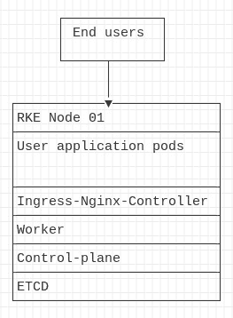

](img/B18053_04_003.jpg)

图 4.3 – RKE 单节点集群

示例配置：[`github.com/PacktPublishing/Rancher-Deep-Dive/blob/main/ch04/standard_designs/rke/00_single_node_cluster/cluster.yaml`](https://github.com/PacktPublishing/Rancher-Deep-Dive/blob/main/ch04/standard_designs/rke/00_single_node_cluster/cluster.yaml)

单节点集群的**优点**如下所示：

+   设置简单。

+   创建速度快且容易。

+   不需要外部负载均衡器。

+   这是一个适合 CI/CD 管道的优秀集群，适用于需要 Kubernetes 集群进行测试且之后可以销毁的场景。

+   适用于不需要高可用性和扩展的沙箱测试。

+   可以安装在资源有限的开发者笔记本电脑上。

+   单节点 RKE 集群可以后续转换为高可用集群（HA 集群）。

**缺点**如下所示：

+   无高可用性（HA）。

+   在打补丁和升级过程中需要停机。

+   使用服务器的 IP 地址或主机名作为应用程序端点，而不是 VIP 或 CNAME，可能会导致不良的应用程序行为。

+   许多 Kubernetes 组件通过集群本身获得其高可用性功能，因此许多组件无法像在 HA 集群中那样干净地处理故障。

+   用户应用程序与管理服务共享相同的节点，这意味着一个失控的应用程序可能会导致集群崩溃。

以下是**硬件要求**：

+   服务器：1 台物理/虚拟服务器

+   CPU：4 核

+   内存：4-8GB

### 小型三节点集群

在此设计中，我们将部署最小的 RKE 集群，具有完整的高可用性（HA），一个三节点集群，所有节点都具有所有角色。

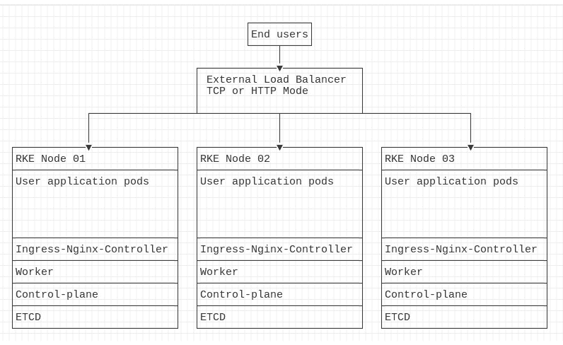

图 4.4 – 标准三节点 RKE 集群

示例配置：[`github.com/PacktPublishing/Rancher-Deep-Dive/blob/main/ch04/standard_designs/rke/01_small_cluster/cluster.yaml`](https://github.com/PacktPublishing/Rancher-Deep-Dive/blob/main/ch04/standard_designs/rke/01_small_cluster/cluster.yaml)

小型三节点集群的**优点**如下所示：

+   完整的高可用性 – 您可以丢失集群中的任何节点，仍然可以保持集群和应用程序的可用性。

+   管理简单，因为所有节点具有相同的角色，所以所有节点都是一样的。

+   在打补丁和升级过程中不需要停机。有关更多详细信息，请参阅 Rancher 的零停机文档：[`rancher.com/docs/rke/latest/en/upgrades/maintaining-availability/`](https://rancher.com/docs/rke/latest/en/upgrades/maintaining-availability/).

**缺点**如下所示：

+   需要外部负载均衡器或轮询 DNS 记录来访问外部应用程序。

+   用户应用程序与管理服务共享相同的节点，这意味着一个失控的应用程序可能会导致集群崩溃。

+   只有 `N+1` 的可用性，因此在维护任务期间，如果失去一个节点，服务也会中断。

以下是**硬件要求**：

+   服务器：3 台物理/虚拟服务器

+   CPU：每台服务器 4 核

+   内存：每台服务器 4-8GB

### 中型集群

在这个设计中，我们将部署标准的 RKE 集群，其中我们已将 Kubernetes 的核心管理服务迁移到它们的节点上。这样做的原因是，随着集群规模的扩大，保护 Kubernetes 的管理服务变得更加关键。此设计尝试在高可用性（HA）和成本之间取得平衡。通过将 etcd 和控制平面共享相同的节点，同时将工作节点角色移到专用节点上来实现。这种设计适用于 2 到 10 个工作节点的集群。

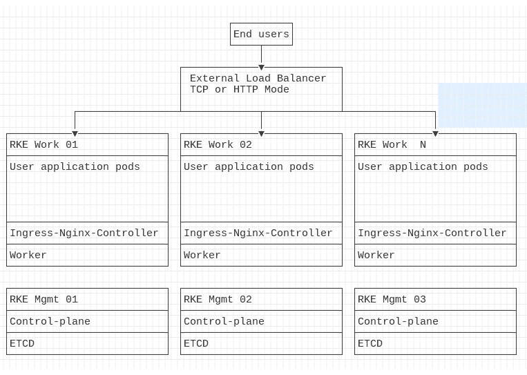

图 4.5 – 具有独立节点的 RKE 集群用于管理服务

图示：[`github.com/PacktPublishing/Rancher-Deep-Dive/blob/main/ch04/standard_designs/rke/02_medium_cluster/README.md`](https://github.com/PacktPublishing/Rancher-Deep-Dive/blob/main/ch04/standard_designs/rke/02_medium_cluster/README.md)

示例配置：[`github.com/PacktPublishing/Rancher-Deep-Dive/blob/main/ch04/standard_designs/rke/02_medium_cluster/cluster.yaml`](https://github.com/PacktPublishing/Rancher-Deep-Dive/blob/main/ch04/standard_designs/rke/02_medium_cluster/cluster.yaml)

中型集群的**优点**如下：

+   完全高可用 – 你可以丢失集群中的任何一个管理节点（etcd 和控制平面），仍然能够保持完整的集群管理。

+   用户工作负载和管理服务运行在不同的节点上，防止失控的应用程序导致集群崩溃。

+   由于 etcd 的可扩展性限制，etcd 节点超过五个时，性能会下降。因此，通常建议采用纵向扩展设计，而非横向扩展。

+   如果剩余的工作节点有足够的 CPU 和内存，多个工作节点可以故障而不丧失服务。

+   在修补和升级过程中无需停机。详细信息请参阅 Rancher 的零停机文档：[`rancher.com/docs/rke/latest/en/upgrades/maintaining-availability/`](https://rancher.com/docs/rke/latest/en/upgrades/maintaining-availability/)。

**缺点**如下：

+   外部应用访问需要外部负载均衡器或轮询 DNS 记录。

+   仅有`N+1`的可用性，因此在维护任务期间，管理平面（etcd 和控制平面）的节点发生故障时，无法保证服务不中断。

+   创建节点时的额外复杂性，因为你可能需要根据管理节点和工作节点的不同需求来调整节点大小。

以下是 etcd 和控制平面的**硬件要求**：

+   服务器：3 台物理/虚拟服务器

+   CPU：每台服务器 8 核

+   内存：8-16 GB

    注意

    工作节点的大小应该根据你的工作负载及其要求来确定。

### 大型集群

在此设计中，我们扩展了中型集群的设计，但将 etcd 和控制平面分开，并调整了节点的大小和数量。

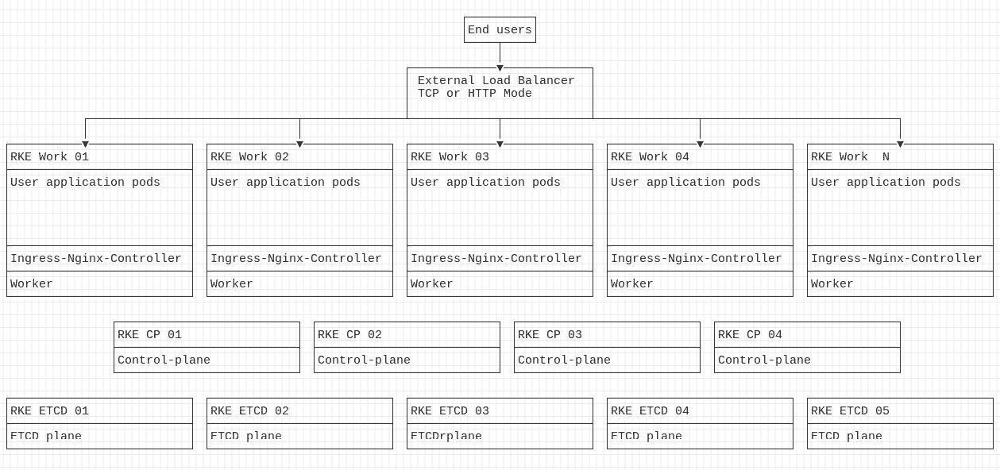

图 4.6 – RKE 集群，etcd 和控制平面使用独立节点

图示：[`github.com/PacktPublishing/Rancher-Deep-Dive/raw/main/ch04/standard_designs/rke/03_large_cluster/README.md`](https://github.com/PacktPublishing/Rancher-Deep-Dive/raw/main/ch04/standard_designs/rke/03_large_cluster/README.md)

示例配置：[`github.com/PacktPublishing/Rancher-Deep-Dive/raw/main/ch04/standard_designs/rke/03_large_cluster/cluster.yaml`](https://github.com/PacktPublishing/Rancher-Deep-Dive/raw/main/ch04/standard_designs/rke/03_large_cluster/cluster.yaml)

大型集群的**优点**如下：

+   完整的高可用性 – 集群中可以丢失任意两个管理节点（etcd 和控制平面），仍然可以完全管理集群。

+   用户工作负载和管理服务在不同节点上运行，防止失控的应用程序使集群崩溃。

+   由于 etcd 的扩展性限制，超过五个 etcd 节点会导致性能下降。因此，通常建议将 etcd 设计为垂直扩展，而非横向扩展。

+   控制平面并不设计为通过增加更多节点来扩展，因为 kube-apiserver 在所有节点上都是活动的，但每个节点都有缓存层以提高性能，因此水平扩展会导致缓存效率降低。

+   `N+2` 可用性，因此在进行维护任务时，如果一个节点发生故障，管理平面（etcd 和控制平面）不会丢失服务。

+   如果剩余工作节点的 CPU 和内存资源足够，多个工作节点可以失败而不丧失服务。

+   补丁和升级期间无需停机。有关更多详细信息，请参见 Rancher 的零停机文档，网址为 [`rancher.com/docs/rke/latest/en/upgrades/maintaining-availability/`](https://rancher.com/docs/rke/latest/en/upgrades/maintaining-availability/)。

**缺点**如下所示：

+   需要外部负载均衡器或轮询 DNS 记录来访问外部应用程序。

+   控制平面中的控制器不可扩展，每次只有一个控制器是领导者。

+   创建节点时需要更多的复杂性，因为您可能需要根据工作节点与管理节点的不同需求来调整节点大小。

以下是 **硬件要求**：

+   **etcd 平面**：

    +   服务器：5 台物理/虚拟服务器。

    +   CPU：每台服务器 8-16 核心。

    +   内存：每台服务器为管理平面配置 32-64 GB 内存。

    +   存储：推荐使用 NVME 存储。

+   **控制平面**：

    +   服务器：4 台物理/虚拟服务器。

    +   CPU：每台服务器 8-16 核心。

    +   内存：每台服务器为管理平面配置 32-64 GB 内存。注意：建议控制平面节点的内存配置与 etcd 节点相匹配作为起始点。

        注意

        工作节点的规格应根据您的工作负载及其要求来确定。

## RKE2 集群

以下是 RKE2 集群的设计建议。

### 单节点集群

在这种设计中，我们将在单个节点上部署一个包含所有角色的 RKE2 集群。

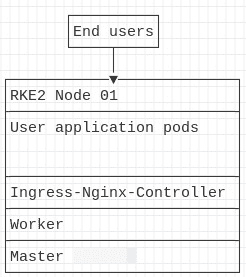

图 4.7 – 单节点 RKE2

图示：[`github.com/PacktPublishing/Rancher-Deep-Dive/raw/main/ch04/standard_designs/rke2/00_single_node_cluster/README.md`](https://github.com/PacktPublishing/Rancher-Deep-Dive/raw/main/ch04/standard_designs/rke2/00_single_node_cluster/README.md)

**优点**如下：

+   简单易于设置。

+   快速且容易创建。

+   无需外部负载均衡器。

+   非常适合 CI/CD 管道任务，需要一个 Kubernetes 集群来测试其部署，测试完成后集群将被销毁。

+   非常适合沙箱测试，在这种测试中不需要高可用性和扩展性。

+   可以安装在资源有限的开发者笔记本环境中。

+   一个单节点的 RKE2 集群可以在以后转换为高可用集群。

**缺点**如下：

+   无高可用性。

+   在修补和升级过程中需要停机。

+   使用服务器的 IP 或主机名作为应用程序端点，而不是 VIP 或 CNAME，可能会促使应用程序出现不良行为。

+   许多 Kubernetes 组件通过集群本身获得其高可用性特性，因此，许多组件在处理故障时不会像高可用集群那样顺利。

+   用户应用与管理服务共享相同的节点，意味着一个失控的应用可能会导致整个集群崩溃。

以下是**硬件要求**：

+   服务器：1 台物理/虚拟服务器

+   CPU：2 核

+   内存：4 GB

### 小型三节点集群

在此设计中，我们将部署一个最小的 RKE2 集群，具备完全的高可用性，一个三节点集群，所有节点都承担所有角色。

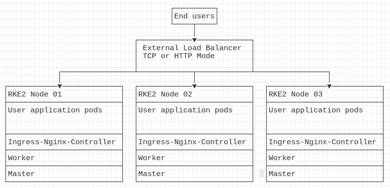

图 4.8 – 带有高可用性的三节点 RKE2 集群

图示： [`github.com/PacktPublishing/Rancher-Deep-Dive/blob/main/ch04/standard_designs/rke2/01_small_cluster/README.md`](https://github.com/PacktPublishing/Rancher-Deep-Dive/blob/main/ch04/standard_designs/rke2/01_small_cluster/README.md)

示例命令：[`github.com/PacktPublishing/Rancher-Deep-Dive/blob/main/ch04/standard_designs/rke2/01_small_cluster/commands.md`](https://github.com/PacktPublishing/Rancher-Deep-Dive/blob/main/ch04/standard_designs/rke2/01_small_cluster/commands.md)

**优点**如下：

+   完全高可用性 – 你可以失去集群中的任何节点，仍然保持集群和应用的完全可用性。

+   管理简单，因为所有节点具有相同的角色，因此所有节点都相同。

+   在修补和升级过程中无需停机。详情请参考 Rancher 的零停机文档：[`rancher.com/docs/rke/latest/en/upgrades/maintaining-availability/`](https://rancher.com/docs/rke/latest/en/upgrades/maintaining-availability/).

**缺点**如下：

+   需要外部负载均衡器或轮询 DNS 记录来实现外部应用访问和 RKE2 管理。

+   用户应用与管理服务共享相同的节点，意味着一个失控的应用可能会导致整个集群崩溃。

+   仅有 `N+1` 的可用性，因此在进行维护任务时，若节点发生故障，服务不会中断。

以下是**硬件要求**：

+   服务器：3 台物理/虚拟服务器

+   CPU：每台服务器 2-4 核

+   内存：每台服务器 4-8 GB

### 中型集群

在此设计中，我们将部署标准的 RKE2 集群，其中我们已将 Kubernetes 的核心管理服务迁移到专用节点。这是因为随着集群规模的增长，保护 Kubernetes 的管理服务变得愈加关键。此设计旨在在高可用性（HA）与成本之间取得平衡。通过将主节点和工作节点分别部署在独立的节点上来实现。这种设计适用于 2 到 10 个工作节点的集群。

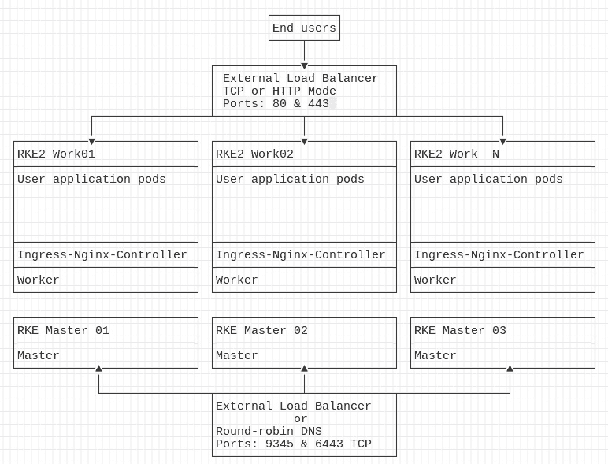

图 4.9 – RKE2 集群，其中管理服务使用独立节点

图表：[`github.com/PacktPublishing/Rancher-Deep-Dive/raw/main/ch04/standard_designs/rke2/02_medium_cluster/README.md`](https://github.com/PacktPublishing/Rancher-Deep-Dive/raw/main/ch04/standard_designs/rke2/02_medium_cluster/README.md)

示例命令：[`github.com/PacktPublishing/Rancher-Deep-Dive/blob/main/ch04/standard_designs/rke2/02_medium_cluster/commands.md`](https://github.com/PacktPublishing/Rancher-Deep-Dive/blob/main/ch04/standard_designs/rke2/02_medium_cluster/commands.md)

**优点**如下：

+   完全高可用性 – 即使集群中的任何一个主节点发生故障，仍然可以保持完整的集群管理。

+   用户工作负载和管理服务运行在不同的节点上，防止失控的应用程序使集群崩溃。

+   由于 etcd 的可扩展性限制，超过五个 etcd 节点会导致性能下降。因此，通常建议垂直扩展设计，而不是水平扩展。

+   即使多个工作节点发生故障，只要剩余工作节点上有足够的 CPU 和内存可用，服务也不会中断。

+   在修补和升级期间无需停机。请参见 Rancher 的零停机文档，了解更多详情：[`rancher.com/docs/rke/latest/en/upgrades/maintaining-availability/`](https://rancher.com/docs/rke/latest/en/upgrades/maintaining-availability/)。

**缺点**如下：

+   需要外部负载均衡器或轮询 DNS 记录来访问外部应用程序和 RKE2 管理。

+   仅具有 `N+1` 的可用性，因此在进行维护任务时，无法在不损失管理平面（etcd 和控制平面）服务的情况下承受节点故障。

+   创建节点时的额外复杂性，因为您可能需要根据管理节点与工作节点的不同需求进行不同的节点规模配置。

以下是**硬件要求**：

+   主节点：

    +   服务器：3 台物理/虚拟服务器

    +   CPU：每台服务器 4 核

    +   内存：8 GB

        注

        工作节点的大小应根据工作负载及其要求进行调整。

### 大型集群

对于较大的 RKE2 集群，设计上有一定的限制，因为在 RKE2 集群中，etcd 和控制平面服务是绑定在一起的，无法分离到不同的平面。唯一可以做的真正变化是将主节点数量从 3 增加到 5，然后开始增加节点的规模。

# 安装步骤（RKE）

一旦你创建了`cluster.yaml`文件，你可以通过让 RKE 为你创建一个集群。方法是运行`rke up --config cluster.yaml`命令。RKE 会寻找`cluster.rkestate`文件。如果找不到该文件，RKE 将假定你正在创建一个新的集群，这会导致 RKE 创建一个新的根 CA 证书，存放在`/etc/kubernetes/ssl`目录下。

然后，RKE 会检查集群中是否有 etcd 节点正在添加或移除。如果 RKE 检测到 etcd 的停机设置当前被违反，默认情况下，RKE 只允许一个 etcd 节点处于离线状态。RKE 将处理移除 etcd 节点的过程，包括停止 etcd 容器并将 etcd 成员从 etcd 领导者中移除。接下来，RKE 将处理将任何新的 etcd 节点添加到集群的过程。需要注意的是，这个过程被设计得既缓慢又安全——RKE 一次只处理一个 etcd 节点，并在更改每个节点之前进行 etcd 快照。

一旦 etcd 平面成功完成，RKE 将负责启动控制平面。此过程包括 kube-apiserver、kube-controller-manager 和 kube-scheduler。RKE 将依次在每个控制平面节点上启动各个组件。RKE 将检查每个组件的健康检查端点是否可用，对于大多数组件来说，端点是`/healthz`。值得注意的是，RKE 遵循与 etcd 平面相同的过程，验证最大不可用设置当前没有被违反。如果在此过程中设置被违反，RKE 将停止并报告错误。

接下来，RKE 将处理创建工作平面。与 etcd 平面和控制平面不同，这一过程是并行进行的。这样做主要是为了处理较大的集群，在这些集群中，可能会有数百个工作节点。因此，默认情况下，RKE 会一次处理 10%的工作节点。对于现有节点，RKE 会将该节点标记为不可用，以防止对节点进行更改。需要注意的是，在此过程中，应用程序的 Pods 会继续运行，唯一的影响是 CNI 提供程序可能需要重新启动。这个过程的影响类似于暂时拔掉节点的网卡几秒钟后再插回去。这可能会影响使用长期连接的应用程序，这些连接需要保持打开状态。通常，这些应用程序会使用数据库连接池，应用程序会创建多个数据库连接并保持它们处于打开状态。根据应用程序的不同，这些连接可能不会自动重新连接，可能需要重新启动。

# 安装步骤（RKE2）

与 RKE1 不同，RKE2 在集群创建过程中采用了非常不同的处理方式。在 RKE2 中，集群中的第一个主节点是独一无二的，因为它负责集群的引导过程。引导过程会创建一个根 CA 证书，如果集群令牌尚未设置，RKE2 会处理创建一个令牌。接着，RKE2 会初始化 etcd 集群。最后，RKE2 会基于集群令牌创建 etcd 加密密钥。RKE2 然后会将集群状态存储在 etcd 中一个名为 `bootstrap` 的唯一引导密钥对中。这些引导数据包括 Kubernetes 证书、私钥以及 etcd 加密密钥。一旦集群完成引导，其他主节点就可以使用 Kubernetes API 端点连接到集群中的第一个节点。RKE2 将使用集群令牌进行身份验证并解密引导数据。最后，一旦所有主节点都创建完成，工作节点的设置过程也会按照相同的步骤进行，唯一的区别是 `INSTALL_RKE2_TYPE="agent"` 安装选项，这告诉 RKE2 将该节点配置为工作节点。

以下是一些示例命令，用于创建一个标准的三主节点集群以及工作节点。关于这些命令的更多细节可以参考 [`docs.rke2.io/install/ha/`](https://docs.rke2.io/install/ha/)。

```
# 1st master node
```

```
curl -sfL https://get.rke2.io | sh -
```

```
mkdir -p /etc/rancher/rke2/
```

```
cat << EOF > /etc/rancher/rke2/config.yaml
```

```
kube-apiserver-arg: "kubelet-preferred-address-types=InternalIP,ExternalIP,Hostname"
```

```
tls-san:
```

```
 - mgmt01.support.tools
```

```
 - mgmt02.support.tools
```

```
 - mgmt03.support.tools
```

```
 - rke2-vip.support.tools
```

```
node-taint:
```

```
 - "CriticalAddonsOnly=true:NoExecute"
```

```
EOF
```

```
systemctl enable rke2-server.service
```

```
systemctl start rke2-server.service
```

这段前置代码处理了集群中第一个节点的引导工作，并设置了 Kubernetes API 端点的 SAN 证书以及节点污点，以防止用户的工作负载在该服务器上运行。

```
# Capture the node token from the first node
```

```
cat /var/lib/rancher/rke2/server/node-token`
```

我们需要在前面的代码块中使用这个令牌，以便其他节点能够加入集群。

```
# 2nd, 3rd master nodes
```

```
curl -sfL https://get.rke2.io | sh -
```

```
mkdir -p /etc/rancher/rke2/
```

```
cat << EOF > /etc/rancher/rke2/config.yaml
```

```
kube-apiserver-arg: "kubelet-preferred-address-types=InternalIP,ExternalIP,Hostname"
```

```
tls-san:
```

```
 - mgmt01.support.tools
```

```
 - mgmt02.support.tools
```

```
 - mgmt03.support.tools
```

```
 - rke2-vip.support.tools
```

```
node-taint:
```

```
 - "CriticalAddonsOnly=true:NoExecute"
```

```
server: https://<<Cluster DNS record>>:9345
```

```
token: <<Node Token goes here>>
```

```
EOF
```

```
systemctl enable rke2-server.service
```

```
systemctl start rke2-server.service
```

这段前置代码处理了将额外的主节点加入到现有集群中的过程。

```
# Worker nodes
```

```
curl -sfL https://get.rke2.io | INSTALL_RKE2_TYPE="agent" sh -
```

```
mkdir -p /etc/rancher/rke2/
```

```
cat << EOF > /etc/rancher/rke2/config.yaml
```

```
server: https://<<Cluster DNS record>>:9345
```

```
token: <<Node Token goes here>>
```

```
EOF
```

```
systemctl enable rke2-agent.service
```

```
systemctl start rke2-agent.service
```

这段前置代码接着处理了将工作节点加入到我们刚刚创建的集群中的过程。

示例命令：[`github.com/PacktPublishing/Rancher-Deep-Dive/blob/main/ch04/standard_designs/rke2/02_medium_cluster/commands.md`](https://github.com/PacktPublishing/Rancher-Deep-Dive/blob/main/ch04/standard_designs/rke2/02_medium_cluster/commands.md)

现在我们已经成功创建了集群，下一步将是准备一个外部负载均衡器，作为集群的前端端点。在接下来的部分中，我们将配置 HAProxy 的 HTTP 和 TCP 模式。这些设置非常标准，你应该可以将它们作为其他负载均衡技术的模板，例如 F5 或 A10。

# 配置外部负载均衡器（HAProxy）

使用 RKE/RKE2 集群，您将得到一个 ingress-nginx-controller。这是一个守护进程集，默认情况下会在所有工作节点上运行。默认情况下，nginx 将监听端口 `80` 和 `443`。然后，nginx 将充当第 7 层（HTTP/HTTPS 模式）负载均衡器，用于集群内托管的应用程序。这对于集群内应用的负载均衡非常有用，但您会遇到如何在节点之间提供冗余的问题。最简单的方法是为集群中的所有工作节点的 IP 地址创建一个 **DNS A** 记录，并使用轮询 DNS 在节点之间进行负载均衡并处理故障容忍。缺点是轮询 DNS 更新速度可能非常慢，且您必须依赖客户端来操作故障转移。在现实世界中，这个过程可能非常不可靠。为了解决这个问题，我们将在集群前放置一个 HAProxy 服务器。对于其他负载均衡器，如 A10、F5、nginx 等，过程是非常相似的。接下来，我们将介绍配置 HAProxy 的两种不同方式。

## TCP 模式

这种模式仅负责在传输协议层转发数据，在此情况下，我们只关注 TCP/80 和 TCP/443。HAProxy 不终止连接，因此诸如基于主机的路由和 SSL 等功能不可用。因此，TCP 模式有时被称为 *第四层* 负载均衡，因为它只是转发流量。所以，在这种情况下，我们将有一个前端 **虚拟 IP 地址（VIP）**，它会对 TCP 端口进行一对一映射。需要注意的是，默认情况下，TCP 模式没有启用任何会话管理。使用源 IP 匹配来允许 TCP 模式中的粘性会话是正常的。这对于使用基于服务器的会话管理的应用程序来说是必要的。


图 4.10 – HAProxy 示例设计

图示：[`github.com/PacktPublishing/Rancher-Deep-Dive/blob/main/ch04/haproxy/diagrams/tcp_mode.md`](https://github.com/PacktPublishing/Rancher-Deep-Dive/blob/main/ch04/haproxy/diagrams/tcp_mode.md)

这是一个示例配置：

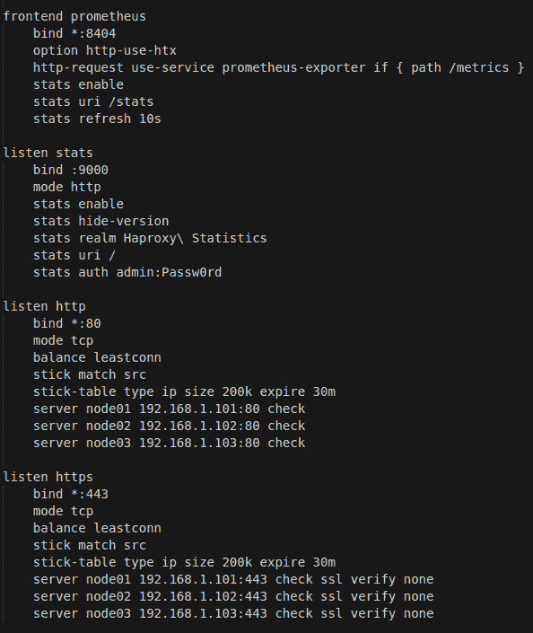

图 4.11 – 在 TCP 模式下的 HAProxy 配置示例

完整配置：[`github.com/PacktPublishing/Rancher-Deep-Dive/blob/main/ch04/haproxy/config/tcp.cfg`](https://github.com/PacktPublishing/Rancher-Deep-Dive/blob/main/ch04/haproxy/config/tcp.cfg)

请注意，在这个示例配置中，我在 HAProxy 中暴露了两个额外的端点，第一个是 Prometheus 指标端点，它允许 Prometheus 服务器抓取 HAProxy 的指标。更多细节请参见 [`www.haproxy.com/blog/haproxy-exposes-a-prometheus-metrics-endpoint/`](https://www.haproxy.com/blog/haproxy-exposes-a-prometheus-metrics-endpoint/)。

第二个是 `stats` 端点，它允许你查看前端和后端部分的当前状态。在故障排除时，这非常有帮助。请参阅 [`www.haproxy.com/blog/exploring-the-haproxy-stats-page/`](https://www.haproxy.com/blog/exploring-the-haproxy-stats-page/) 获取更多详细信息。需要注意的是，这些端点应该通过基本用户登录页面和防火墙规则进行保护。

## HTTP/HTTPS 模式

此模式负责终止 HTTP 和 SSL 连接。因此，HAProxy 可以修改请求或做出路由决策。例如，`dev.example.com` 可以被路由到 dev RKE 集群，而 `prod.example.com` 被路由到生产 RKE 集群，尽管它们共享相同的 VIP。

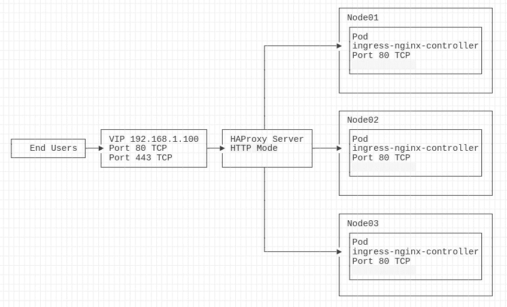

](img/B18053_04_012.jpg)

图 4.12 – HTTP 模式下的 HAProxy 配置示例

图表：[`github.com/PacktPublishing/Rancher-Deep-Dive/blob/main/ch04/haproxy/diagrams/http_mode.md`](https://github.com/PacktPublishing/Rancher-Deep-Dive/blob/main/ch04/haproxy/diagrams/http_mode.md)

对于不希望使用外部负载均衡器的环境，MetalLB 是一种替代选项，接下来我们将介绍在最简单的形式下安装和配置 MetalLB，即 Layer2 模式。

# 配置 MetalLB

MetalLB 替代了外部负载均衡器的需求。它通过使用 **VIP** 或 **边界网关协议（BGP）** 宣布外部 IP 地址，然后使用端口映射将流量转发到 Kubernetes 服务。每个由 MetalLB 暴露的服务都有其自己的 IP 地址，该地址从在 ConfigMap 中定义的 IP 地址池中提取。MetalLB 使用名为 **speaker** 的 daemonset 来处理节点上 IP 地址的分配，而控制器则处理协调。有关此过程如何工作的更多详细信息，请参见 MetalLB 文档 [`metallb.universe.tf/concepts/`](https://metallb.universe.tf/concepts/)。

## 安装

以下步骤将安装 MetalLB 的控制器及其 speaker。关于此过程的更多详细信息，请参见 [`metallb.universe.tf/installation/`](https://metallb.universe.tf/installation/)：

```
kubectl apply -f https://raw.githubusercontent.com/metallb/metallb/v0.10.3/manifests/namespace.yaml
kubectl apply -f https://raw.githubusercontent.com/metallb/metallb/v0.10.3/manifests/metallb.yaml
```

## 配置

在此步骤中，我们将定义 IP 地址池。关于此过程的更多详细信息，请参见 [`metallb.universe.tf/configuration/`](https://metallb.universe.tf/configuration/)。

使用以下值创建一个 configmap：

```
apiVersion: v1
kind: ConfigMap
metadata:
  namespace: metallb-system
  name: config
data:
  config: |
    address-pools:
    - name: default
      protocol: layer2
      addresses:
      - 192.168.1.240-192.168.1.250
```

最后，要将 MetalLB IP 添加到集群服务中，只需在服务定义中添加以下注释。关于此过程的更多详细信息，请参见 [`metallb.universe.tf/usage/`](https://metallb.universe.tf/usage/)：

```
  annotations:
    metallb.universe.tf/address-pool: default
```

# 总结

本章中，我们学习了 RKE、RKE2 和 RancherD，包括这些工具的工作原理。然后，我们讨论了每个工具的要求和限制。我们还讲解了架构 RKE 和 RKE2 集群的规则，包括一些示例配置以及每种解决方案的优缺点。最后，我们详细介绍了使用我们之前创建的配置文件创建集群的步骤。随后，我们结束本章内容，讲解了如何安装和配置 HAProxy 和 MetalLB 作为 RKE 和 RKE2 集群的负载均衡器。完成本章后，你应该能够设计一个符合环境需求的解决方案，并部署集群类型。此外，通过了解每个集群的工作方式，你应该能够排除大多数基本问题。

在下一章中，我们将介绍如何在托管集群上部署 Rancher，以及需要遵循的一些限制和规则。
