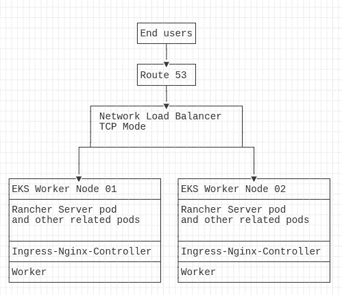

# *第五章*：在托管 Kubernetes 集群上部署 Rancher

Rancher 的一个优点是可以部署在任何认证的 Kubernetes 集群上。这意味着 Rancher 可以安装在托管的 Kubernetes 集群上，比如**Google Kubernetes Engine**（**GKE**）、亚马逊的**Elastic Container Service**（**EKS**） for Kubernetes、**Azure Kubernetes Service**（**AKS**）或**Digital Ocean's Kubernetes Service**（**DOKS**）。这可以简化 Rancher 的管理，但托管的 Kubernetes 解决方案存在一些限制。接下来，我们将介绍托管 Kubernetes 集群的设计规则以及一些标准设计。到那时，我们将使用**Helm**工具在集群上安装 Rancher，从而在集群上安装 Rancher 服务器工作负载。最后，我们将介绍如何在托管的 Kubernetes 集群上备份 Rancher。

在本章中，我们将涵盖以下主要主题：

+   了解托管的 Kubernetes 集群

+   要求与限制

+   架构解决方案的规则

+   创建托管的 Kubernetes 集群

+   安装和升级 Rancher

+   Rancher 备份操作员

让我们深入了解吧！

# 了解托管的 Kubernetes 集群

在云中部署 Kubernetes 集群时，常见的问题之一不仅仅是使用托管的 Kubernetes 集群，而是托管的 Kubernetes 集群是什么。简而言之，它是一个由外部方部署和管理的集群。通常，这种集群由云服务提供商提供，诸如亚马逊的 AWS、谷歌的 GCP、微软的 Azure 等。这种服务有时被称为**Kubernetes as a Service**（**KaaS**），因为这些类型的集群作为服务提供。作为消费者，托管的 Kubernetes 集群相比自己构建的集群有一些限制：

+   **控制**：使用托管的 Kubernetes 集群时，你是最终用户。你无法完全控制集群。像将 Kubernetes 升级到更高版本这样的任务通常由你的提供商为你处理。通常情况下，这是通过你进入云服务提供商的仪表板并选择一个更新的 Kubernetes 版本来触发的。然而，大多数云服务提供商有强制升级的选项，可能没有你的参与。例如，在 2020 年初，EKS 开始逐步淘汰 Kubernetes v1.14，并在 2020 年 11 月停止官方支持。一旦支持结束，亚马逊开始自动升级集群，你几乎无法阻止该升级。如果升级破坏了你的应用程序，就无法回退或降级。你唯一的选择就是修复你的应用程序。谷歌和 Azure 也有类似的流程，他们的理由是集群端点通常位于公共互联网（在大多数情况下），因此保持安全补丁更新是必须的。

+   **访问权限**：通过托管的 Kubernetes 集群，你将能够访问 Kube API 端点，用于 kubectl、Helm 甚至 Rancher 等工具。但在大多数情况下，你无法访问 Kubernetes 节点本身。因此，你不能直接 SSH 进入节点并安装如监控代理和备份软件等软件。而且，即使云提供商为你提供了对节点的 SSH 访问权限，通常也仅限于对工作节点进行故障排除。他们的支持团队不会支持你对节点所做的任何自定义操作。此外，你根本不应该进行任何更改，因为云提供商可以根据需要更换节点，且通常不会提前通知。

    注意

    所有主要云提供商都允许你设置首选的维护窗口，但如果需要，他们可以在该窗口之外进行紧急维护。

这通常用于替换故障节点或应用关键的安全修复。

+   **自定义**：对于大多数托管的 Kubernetes 集群，云提供商定义了如 **etcd**、**kube-apiserver** 和 **kubelet** 等项目。例如，如果你的应用程序正在访问 Kube API 端点并创建大量请求，在自托管的 Kubernetes 集群中，你可以简单地增加 kube-apiserver 可用的 CPU 和内存。而在托管的 Kubernetes 集群中，由于该服务由云提供商拥有，你无法进行这样的更改。定制安全设置（如 etcd 加密）也一样。在自托管的 Kubernetes 集群中，你可以根据需要设置加密。而在托管的 Kubernetes 集群中，你只能使用他们提供的服务。例如，EKS 支持使用 AWS **密钥管理服务 (KMS)** 进行 etcd 加密。但在 AKS 中，Azure 默认启用加密，但不允许你更改或强制轮换密钥。对于其他云提供商（如 DigitalOcean），他们根本没有提供 etcd 加密。

    注意

    前述陈述在撰写时有效，但 Azure 已表示这是其未来计划的一部分，因此未来可能会发生变化。

+   `tarball` 文件，然后将其推送到备份位置。

现在我们了解了托管的 Kubernetes 集群是什么，接下来我们将探讨一些最受欢迎的云提供商的要求和限制。

# 要求和限制

本节将讨论 Rancher 在各种集群上的基本要求，以及它们的限制和设计考虑因素。

## Amazon EKS

Amazon EKS 的 **基本要求**如下：

+   Rancher 至少需要两个工作节点，但强烈建议使用三个节点。

+   每个工作节点应该至少有两个核心和 4 GB 内存。

+   Rancher 需要一个网络负载均衡器来访问 Rancher 控制台。

+   一旦 EKS 集群创建完成，你需要按照[`docs.aws.amazon.com/eks/latest/userguide/create-kubeconfig.html`](https://docs.aws.amazon.com/eks/latest/userguide/create-kubeconfig.html)上的步骤生成一个 kubeconfig 文件，用于访问集群。

+   Rancher 要求 EKS 集群中安装 nginx-ingress-controller。有关详细信息，请按照[`rancher.com/docs/rancher/v2.5/en/installation/install-rancher-on-k8s/amazon-eks/#5-install-an-ingress`](https://rancher.com/docs/rancher/v2.5/en/installation/install-rancher-on-k8s/amazon-eks/#5-install-an-ingress)上的步骤进行操作。

+   `443/TCP` 端口应该对所有需要 Rancher UI/API 访问的下游节点、集群和最终用户开放。

    注意

    `80` 端口将把最终用户重定向到 HTTPS URL。因此，虽然 `80` 端口不是必需的，但为了最终用户的方便，建议使用。

**设计限制和注意事项**如下：

+   集群应该跨越三个可用区。

+   默认情况下，EKS 使用在 VPC 中定义的 DNS 服务器。如果你需要通过 DNS 访问本地资源，应该按照[`docs.aws.amazon.com/vpc/latest/userguide/vpc-dns.html`](https://docs.aws.amazon.com/vpc/latest/userguide/vpc-dns.html)上的步骤进行操作。

+   假设你正在为集群阻止外部互联网访问，在这种情况下，如果你计划使用 Amazon **弹性容器注册表**（**ECR**）来完成此角色，你将需要提供一个私有注册表。你需要按照[`docs.aws.amazon.com/AmazonECR/latest/userguide/ECR_on_EKS.html`](https://docs.aws.amazon.com/AmazonECR/latest/userguide/ECR_on_EKS.html)上的步骤配置集群的 IAM 权限。

+   你可以使用节点自动扩展组，但集群的上下扩展可能会导致 Rancher UI 中断，并且集群操作会在短时间内失败，包括通过 Rancher API 访问下游集群的丧失。

+   如果你使用 AWS 证书管理器，应该选择一个会自动续期并具有相同根 CA 的证书。这是因为 Rancher 需要根 CA 的校验和用于代理。因此，更改根 CA 会涉及大量工作，我们将在后续章节中详细介绍。

+   Rancher 服务器确实提供基于 ARM64 的镜像。因此，你可以在集群中使用 ARM64 节点，但你可能仍然需要一个 AMD64 节点来运行其他服务和容器，如 Prometheus，目前它不支持 ARM64。

+   EKS 不会自动从 kubelet 故障中恢复，可能需要用户干预。

+   EKS 根据节点的大小限制每个节点的 Pod 数量。有关详细信息，请参见 Amazon 的文档，位于[`github.com/awslabs/amazon-eks-ami/blob/master/files/eni-max-pods.txt`](https://github.com/awslabs/amazon-eks-ami/blob/master/files/eni-max-pods.txt)。

## 谷歌的 GKE

GKE 的**基本要求**如下：

+   Rancher 要求集群中至少有两个工作节点，但强烈推荐使用三个节点。

+   每个工作节点应至少有两个核心和 4GB 内存。

+   Rancher 要求使用网络负载均衡器来访问 Rancher 控制台。

+   创建 GKE 集群后，您需要按照[`cloud.google.com/kubernetes-engine/docs/how-to/cluster-access-for-kubectl`](https://cloud.google.com/kubernetes-engine/docs/how-to/cluster-access-for-kubectl)上的步骤生成一个 kubeconfig 文件来访问集群。

+   Rancher 要求 GKE 集群上安装 nginx-ingress-controller。详细步骤请参见[`rancher.com/docs/rancher/v2.5/en/installation/install-rancher-on-k8s/gke/#5-install-an-ingress`](https://rancher.com/docs/rancher/v2.5/en/installation/install-rancher-on-k8s/gke/#5-install-an-ingress)。

+   入站端口`443`/TCP 应为所有下游节点、集群和需要访问 Rancher UI/API 的终端用户打开。注意：端口`80`会将终端用户重定向到 HTTPS URL，因此虽然不是必需的，但为了方便起见，建议开启。

**设计限制和考虑因素**如下：

+   集群应跨三个可用区。

+   您不能自定义服务器配置。必须使用他们提供的两种服务器类型之一：Container OS 或 Ubuntu。您不能选择 Kubernetes 版本或内核版本。

+   集群附加服务，如 Kube-DNS 和 ip-masq-agent，在可配置性方面非常有限。

+   GKE 目前不支持 ARM64 架构。

## Azure 的 AKS

AKS 的**基本要求**如下：

+   Rancher 要求集群中至少有两个工作节点，但强烈推荐使用三个节点。

+   每个工作节点应至少有两个核心和 4GB 内存。

+   Rancher 要求使用网络负载均衡器来访问 Rancher 控制台。

+   创建 AKS 集群后，您需要按照[`cloud.google.com/kubernetes-engine/docs/how-to/cluster-access-for-kubectl`](https://cloud.google.com/kubernetes-engine/docs/how-to/cluster-access-for-kubectl)上的步骤生成一个 kubeconfig 文件来访问集群。

+   Rancher 要求 AKS 集群上安装 nginx-ingress-controller。详细步骤请参见[`rancher.com/docs/rancher/v2.5/en/installation/install-rancher-on-k8s/gke/#5-install-an-ingress`](https://rancher.com/docs/rancher/v2.5/en/installation/install-rancher-on-k8s/gke/#5-install-an-ingress)。

+   入站端口`443`/TCP 应为所有下游节点、集群和需要访问 Rancher UI/API 的终端用户打开。注意：端口`80`会将终端用户重定向到 HTTPS URL，因此虽然不是必需的，但为了方便起见，建议开启。

**设计限制和考虑因素**如下：

+   集群应跨三个可用区。

+   相比于 EKS 和 GKE，AKS 相对较新，因此许多功能仍然没有**正式发布**（**GA**）。

+   操作系统的选择仅限于 Ubuntu 和 Windows Server。

    注意

    Rancher 服务器无法在 Windows 节点上运行。

+   节点升级不像 GKE 那样自动化，需要手动进行操作。

+   AKS 不会自动从 kubelet 故障中恢复，可能需要用户干预。

+   AKS 目前不支持 ARM64 架构。

我们现在了解了在托管 Kubernetes 集群上运行 Rancher 的限制。接下来，我们将利用这些限制和一套规则及示例，帮助我们设计使用主要云提供商的解决方案。

# 解决方案架构设计的规则

在本节中，我们将介绍一些标准设计以及每种设计的优缺点。需要注意的是，每个环境都是独特的，需要进行调整以获得最佳的性能和体验。还需要注意的是，所有的 CPU、内存和存储大小都是推荐的起始点，可能需要根据 Rancher 管理的节点和集群数量进行调整。

在设计解决方案之前，你应该能够回答以下问题：

+   你是否会将非生产集群和生产集群分隔到各自的 Rancher 环境中？

+   对于混合云环境，你是否会按提供商将集群分开？例如，你是否会为所有 AWS 集群部署一个 Rancher 服务器实例，为所有本地集群部署另一个 Rancher 服务器实例？

+   你是否需要为 Kubernetes 节点配置公有和私有 IP 地址？

+   你是否会在 Rancher 集群上托管任何额外的应用程序？如果是，CPU、内存和存储的要求是什么？

+   你需要在不同区域之间进行站点到站点的复制吗？

+   你计划支持多少节点和集群？

    注意

    Rancher 的官方服务器尺寸指南可以在[`rancher.com/docs/rancher/v2.5/en/installation/requirements/#rke-and-hosted-kubernetes`](https://rancher.com/docs/rancher/v2.5/en/installation/requirements/#rke-and-hosted-kubernetes)找到。

## 亚马逊 EKS

在本节中，我们将讨论一些主要的 EKS 集群设计方案。

### EKS 小型集群

在这个设计中，我们将部署能够运行 Rancher 的最小 EKS 集群。请注意，这个设计仅适用于测试或实验环境，不建议用于生产部署，且只能处理几个集群，每个集群最多包含十几个节点。



](img/B18053_05_001.jpg)

图 5.1 – 带有两个工作节点的 EKS 小型集群

**优点**如下：

+   节点级冗余；你可以失去一个工作节点而不会导致 Rancher 宕机。

+   在 EKS 补丁和升级过程中无需停机。更多细节请参见[`docs.aws.amazon.com/eks/latest/userguide/update-managed-node-group.html`](https://docs.aws.amazon.com/eks/latest/userguide/update-managed-node-group.html)。

**缺点**如下：

+   如果你运行像 Prometheus 或 Grafana 这样的额外应用程序，节点可能会资源不足。

+   只有 `N+1` 的资源可用性，因此在维护任务期间，你不能承受一个节点的故障而不会中断服务。

    注意

    在节点组升级期间，Amazon 会在删除旧节点之前先添加一个新节点。

+   你需要定制 Rancher 安装，只使用一个副本，而不是默认的三个副本。

**节点规模**要求如下：

+   一个节点组，组内有两个节点

+   CPU：每个节点 2 核

+   内存：每个节点 4 GB

### EKS 使用典型的集群大小和可用区冗余

在这个设计中，我们将通过增加一个工作节点来扩展 EKS 小型设计，使我们拥有三个工作节点。我们还将利用 AWS 的 **可用区** (**AZ**) 冗余，在三个 AZ 中之一部署一个工作节点。通过这样做，集群能够处理一个 AZ 的故障而不影响 Rancher。我们还将增加工作节点的大小，以管理最多 300 个集群和 3000 个节点。


图 5.2 – EKS 标准设计，包含三个工作节点和 AZ 冗余

**优点**如下：

+   节点级冗余：你可以失去一个工作节点，而不会导致 Rancher 中断。

+   可用区冗余：你可以在 Rancher 中丧失一个完整的可用区而不会导致中断；这也包括在负载均衡器级别。

+   在 EKS 修补和升级期间无需停机。详情请参见 [`docs.aws.amazon.com/eks/latest/userguide/update-managed-node-group.html`](https://docs.aws.amazon.com/eks/latest/userguide/update-managed-node-group.html)。

+   `N+2` 可用性：在维护任务期间，你可以承受一个节点的故障而不会中断服务。

**缺点**如下：

+   额外的工作节点成本。

+   设置期间的额外复杂性，因为每个可用区都有自己的节点组。

+   NLB 的额外复杂性，因为它必须在每个可用区中都有一个接口。

+   升级期间的额外复杂性，因为每个节点组需要独立升级。

**节点规模**要求如下：

+   三个节点组，每个组中有一个节点

+   CPU：每个节点 8 核

+   内存：每个节点 16 GB

## Google 的 GKE

本节将介绍一些 GKE 集群的主要设计方案。

### GKE 小型集群

在此设计中，我们将部署最小的 GKE 集群，它仍然可以运行 Rancher。请注意，该设计仅适用于测试或实验环境，不建议用于生产部署，且只能处理几个集群，每个集群约有十几个节点。


图 5.3 – GKE 小型集群，包含两个工作节点

**优点**如下：

+   节点级冗余：你可以失去一个工作节点，而不会导致 Rancher 中断。

+   GKE 修补和升级期间无需停机。更多详细信息请参见[`cloud.google.com/kubernetes-engine/docs/concepts/cluster-upgrades`](https://cloud.google.com/kubernetes-engine/docs/concepts/cluster-upgrades)。

**缺点**如下：

+   如果您运行额外的应用程序，如 Prometheus 或 Grafana，节点可能会耗尽资源。

+   只有`N+1`的可用性，因此在进行维护任务时，您不能在没有服务中断的情况下丧失一个节点。

    注意

    在集群升级期间，Google 会在移除旧节点之前添加新节点。

+   使用 GCP 的集群升级自动驾驶时，可能会卡住，无法终止 Rancher 服务器 Pods。如果维护窗口过小，升级将被暂停，导致集群处于部分升级状态。我建议维护窗口至少为 4 小时。

+   您确实需要自定义 Rancher 安装，只使用一个副本，而不是默认的三个副本。

**节点配置**要求如下：

+   一个节点池，池内有两个节点

+   CPU：每个节点 2 个核心

+   内存：每个节点 4 GB

### GKE 使用典型的集群大小，并具备区域冗余

在这种设计中，我们将通过增加一个工作节点来扩展 GKE 的小型设计，使我们拥有三个工作节点。我们还将通过在三个可用区之一中放置一个工作节点，利用 GCP 的区域冗余。这样，集群可以在不影响 Rancher 的情况下处理一个可用区的故障。我们还将增加工作节点的大小，以支持最多 300 个集群，3,000 个节点。


图 5.4 – GKE 标准配置，包含三个工作节点和区域冗余

**优点**如下：

+   节点级冗余：您可以在 Rancher 中失去一个工作节点而不会发生故障。

+   区域冗余：您可以在 Rancher 中失去整个可用区（AZ），而不会发生故障；这也包括负载均衡器层面。

+   GKE 修补和升级期间无需停机。更多详细信息请参见[`cloud.google.com/kubernetes-engine/docs/concepts/cluster-upgrades`](https://cloud.google.com/kubernetes-engine/docs/concepts/cluster-upgrades)。

+   `N+2`的可用性：在进行维护任务时，您可以在不影响服务的情况下丧失一个节点。

+   升级时无需额外复杂操作，因为自动驾驶功能会为您处理所有升级。

**缺点**如下：

+   增加额外的费用以支持额外的工作节点。

+   设置时增加复杂性，因为每个可用区都有自己的节点池。

**节点配置**要求如下：

+   三个节点池，每个池中有一个节点

+   CPU：每个节点 8 个核心

+   内存：每个节点 16 GB

## Azure 的 AKS

在本节中，我们将讨论一些主要的 AKS 集群设计。

### AKS 小型集群

在这个设计中，我们将部署一个最小的 AKE 集群，该集群仍然可以运行 Rancher。AKS 的一个特殊之处在于它支持只有一个节点的集群。正如前面提到的，这个设计仅适用于测试或实验室环境，不建议用于生产部署，且只能处理几个集群，每个集群大约有十几个节点。需要注意的是，AKS 确实支持 Windows 节点池，但 Rancher 必须运行在 Linux 节点上。


图 5.5 – AKS 单节点集群

**优点**如下：

+   由于只需支付单个节点的费用，因此成本较低。

+   Azure 确实支持在升级过程中增加节点，这意味着在隔离和排空旧节点之前，Azure 会先为集群提供一个新节点。

**缺点**如下：

+   节点出现故障时，您不能失去服务。

    注意

    在集群升级过程中，Azure 会先添加一个新节点，然后再移除旧节点。

+   如果您运行如 Prometheus 或 Grafana 等额外应用程序，节点可能会耗尽资源。

+   如果节点故障，Azure 将停止升级而不回滚。

+   您确实需要自定义 Rancher 安装，仅使用一个副本而不是默认的三个副本。

**节点大小**要求如下：

+   一个节点池中只有一个节点

+   CPU：每个节点 2 核

+   内存：每个节点 4 GB

### AKS 使用典型集群大小并支持区域冗余

在这个设计中，我们将通过增加两个工作节点来扩展 AKS 单节点设计，最终形成三个工作节点。我们还将通过将一个工作节点放在三个可用区中的一个来利用 Azure 的区域冗余。通过这样做，集群可以在不影响 Rancher 的情况下处理一个 AZ 的故障。我们还将增加工作节点的大小，以支持最多 300 个集群和 3000 个节点。


图 5.6 – AKS 标准集群，包含三个节点

**优点**如下：

+   节点级冗余：您可以失去一个工作节点而不会导致 Rancher 中断。

+   区域冗余：您可以失去整个区域而不会导致 Rancher 中断；这也包括负载均衡器级别。

+   在 AKS 修补和升级期间无需停机。有关更多细节，请参阅 [`docs.microsoft.com/en-us/azure/aks/upgrade-cluster`](https://docs.microsoft.com/en-us/azure/aks/upgrade-cluster)。

+   `N+2` 的可用性：在维护任务期间，您可以承受一个节点的故障，而不会导致服务中断。

**缺点**如下：

+   为额外的工作节点增加额外的成本。

+   由于每个区域都有其节点池，因此在设置过程中会增加额外的复杂性。

+   区域可用性支持仅限于某些区域。有关更多详情，请参阅 [`docs.microsoft.com/en-us/azure/aks/availability-zones#limitations-and-region-availability`](https://docs.microsoft.com/en-us/azure/aks/availability-zones#limitations-and-region-availability)。

+   如果你使用的是 Azure 磁盘存储，卷不能跨可用区进行附加。请参见[`docs.microsoft.com/en-us/azure/aks/availability-zones#azure-disks-limitations`](https://docs.microsoft.com/en-us/azure/aks/availability-zones#azure-disks-limitations)获取更多详细信息。

**节点大小**要求如下：

+   三个节点池，每个池中有一个节点

+   CPU：每个节点 8 核

+   内存：每个节点 16 GB

现在我们有了集群的设计，接下来的部分将介绍创建每种主要集群类型的步骤。

# 创建托管的 Kubernetes 集群

本节将介绍创建每个托管 Kubernetes 集群的命令。

## Amazon EKS

本节将介绍如何使用命令行工具创建带有入口的 EKS 集群。

注意

以下步骤是一般指南。请参考[`aws-quickstart.github.io/quickstart-eks-rancher/`](https://aws-quickstart.github.io/quickstart-eks-rancher/)获取更多详细信息。

### 前提条件

你应该已经拥有一个具有管理员权限的 AWS 账户，并且已创建 VPC 和子网。

你应该在工作站上安装以下工具：

+   **AWS CLI v2**: 请参考[`docs.aws.amazon.com/cli/latest/userguide/install-cliv2.html`](https://docs.aws.amazon.com/cli/latest/userguide/install-cliv2.html)获取更多详细信息。

+   **eksctl**: 请参考[`docs.aws.amazon.com/eks/latest/userguide/eksctl.html`](https://docs.aws.amazon.com/eks/latest/userguide/eksctl.html)获取更多信息。

+   **kubectl**: 请参考[`docs.aws.amazon.com/eks/latest/userguide/install-kubectl.html`](https://docs.aws.amazon.com/eks/latest/userguide/install-kubectl.html)获取更多信息。

+   **Helm**: 请参考[`helm.sh/docs/intro/install/`](https://helm.sh/docs/intro/install/)获取更多信息。

### 创建集群

接下来我们来看一下步骤：

1.  运行`aws configure`命令并输入你的访问密钥和秘密密钥，这将为你提供访问 AWS 账户的权限。

1.  运行以下命令来创建 EKS 集群：

    ```
    eksctl create cluster  --name rancher-server  --version 1.21  --without-nodegroup
    ```

    注意

    在这个示例中，我们将创建一个标准的三节点集群，每个可用区（AZ）有一个节点。

1.  运行以下命令将第一个节点池添加到集群：

    ```
    eksctl create nodegroup --cluster=rancher-server --name=rancher-us-west-2a --region=us-west-2 --zones=us-west-2a --nodes 1 --nodes-min 1 --nodes-max 2 
    ```

这将创建`us-west-2a`中的节点池。

1.  运行以下命令将第二个节点池添加到集群：

    ```
    eksctl create nodegroup --cluster=rancher-server --name=rancher-us-west-2b --region=us-west-2 --zones=us-west-2b --nodes 1 --nodes-min 1 --nodes-max 2
    ```

这将创建`us-west-2b`中的节点池。

1.  运行以下命令将第三个节点池添加到集群：

    ```
    eksctl create nodegroup --cluster=rancher-server --name=rancher-us-west-2c --region=us-west-2 --zones=us-west-2c --nodes 1 --nodes-min 1 --nodes-max 2
    ```

这将创建`us-west-2c`中的节点池。

1.  要验证集群，运行以下命令：

    ```
    eksctl get cluster
    ```

    注意

    集群上线可能需要 5 到 10 分钟。

1.  接下来，使用以下命令安装`nginx-ingress-controller`：

    ```
    helm repo add ingress-nginx https://kubernetes.github.io/ingress-nginx
    helm repo update
    helm upgrade --install \
      ingress-nginx ingress-nginx/ingress-nginx \
      --namespace ingress-nginx \
      --set controller.service.type=LoadBalancer \
      --version 3.12.0 \
      --create-namespace
    ```

### 创建负载均衡器

如果你只是测试，可以运行`kubectl get service ingress-nginx-controller -n ingress-nginx`命令来捕获外部 DNS 记录。然后你可以创建一个`CNAME` DNS 记录指向此记录。

注意

不应在生产环境中使用此方法。

要创建前端负载均衡器，请参考 [`docs.aws.amazon.com/Route53/latest/DeveloperGuide/routing-to-elb-load-balancer.html`](https://docs.aws.amazon.com/Route53/latest/DeveloperGuide/routing-to-elb-load-balancer.html) 以获取更多信息。

此时，集群已准备好安装 Rancher。我们将在下一节中介绍此步骤。

## Google 的 GKE

本节将介绍如何通过命令行工具创建一个带有 ingress 的 GKE 集群。

注意

以下步骤为一般指南。更多详细信息，请参考 [`cloud.google.com/kubernetes-engine/docs/quickstart`](https://cloud.google.com/kubernetes-engine/docs/quickstart)。

### 先决条件

你应该已经拥有一个具有管理员权限的 GCP 账户。本节将使用 Cloud Shell，其中大部分工具已安装。

### 设置 Cloud Shell

1.  前往 GCP 控制台右上角并点击 **Terminal** 按钮。

1.  运行 `gcloud components install kubectl` 命令以在 GCP 终端中安装 kubectl 客户端。

1.  运行 `gcloud init` 命令以配置权限。

### 创建集群

1.  要在每个可用区创建一个节点，请运行以下命令：

    ```
    gcloud container clusters create rancher-server --zone us-central1-a --node-locations us-central1-a,us-central1-b,us-central1-c --num-nodes=3
    ```

1.  使用以下命令获取 `kubeconfig` 文件：

    ```
    gcloud container clusters get-credentials rancher-server
    ```

集群上线可能需要 5 到 10 分钟。

1.  使用以下命令安装 `nginx-ingress-controller`：

    ```
    helm repo add ingress-nginx https://kubernetes.github.io/ingress-nginx
    helm repo update
    helm upgrade --install \
      ingress-nginx ingress-nginx/ingress-nginx \
      --namespace ingress-nginx \
      --set controller.service.type=LoadBalancer \
      --version 3.12.0 \
      --create-namespace
    ```

### 创建负载均衡器

如果你只是进行测试，可以运行 `kubectl get service ingress-nginx-controller -n ingress-nginx` 命令以获取外部 IP。然后，你可以创建 DNS 记录并指向该 IP。

注意

不应在生产环境中使用此方法。

要创建前端负载均衡器，请参考 [`cloud.google.com/kubernetes-engine/docs/concepts/ingress`](https://cloud.google.com/kubernetes-engine/docs/concepts/ingress) 以获取更多信息。

此时，集群已准备好安装 Rancher。我们将在下一节中介绍此步骤。

## Azure 的 AKS

本节将介绍如何通过命令行工具创建一个带有 ingress 的 AKS 集群。

注意

以下步骤为一般指南。更多详细信息，请参考 [`docs.microsoft.com/en-us/azure/aks/kubernetes-walkthrough-portal`](https://docs.microsoft.com/en-us/azure/aks/kubernetes-walkthrough-portal)。

### 先决条件

你应该已经拥有一个具有管理员权限的 Azure 账户。

你的工作站上应安装以下工具：

+   Azure CLI：更多详细信息，请参考 [`docs.microsoft.com/en-us/cli/azure/`](https://docs.microsoft.com/en-us/cli/azure/)。

+   kubectl：有关更多信息，请参考 [`kubernetes.io/docs/tasks/tools/#kubectl`](https://kubernetes.io/docs/tasks/tools/#kubectl)。

+   Helm：有关更多信息，请参考 [`helm.sh/docs/intro/install/`](https://helm.sh/docs/intro/install/)。

### 登录到 Azure

运行 `az login` 命令。此命令用于登录到 Azure。

注意

如果您使用的是**双因素认证（2FA）**，可能需要登录到网页浏览器。

### 创建集群

1.  运行以下命令创建资源组：

    ```
    az group create --name rancher-server --location eastus
    ```

1.  接下来，运行以下命令创建集群：

    ```
    az aks create  --resource-group rancher-server  --name rancher-server  --kubernetes-version 1.22.0  --node-count 3  --node-vm-size Standard_D2_v3
    ```

1.  使用以下命令获取`kubeconfig`文件：

    ```
    az aks get-credentials --resource-group rancher-server --name rancher-server
    ```

集群可能需要 5 到 10 分钟才能上线。

1.  使用以下命令安装`nginx-ingress-controller`：

    ```
    helm repo add ingress-nginx https://kubernetes.github.io/ingress-nginx
    helm repo update
    helm upgrade --install \
      ingress-nginx ingress-nginx/ingress-nginx \
      --namespace ingress-nginx \
      --set controller.service.type=LoadBalancer \
      --version 3.12.0 \
      --create-namespace
    ```

### 创建负载均衡器

如果您只是进行测试，可以运行`kubectl get service ingress-nginx-controller -n ingress-nginx`命令来捕获外部 IP。然后，您可以创建 DNS 记录指向该 IP。

注意

这不应在生产环境中使用。

要创建前端负载均衡器，请参见[`docs.microsoft.com/en-us/azure/aks/load-balancer-standard`](https://docs.microsoft.com/en-us/azure/aks/load-balancer-standard)了解更多详细信息。

此时，集群已准备好安装 Rancher。我们将在下一节中覆盖此步骤。

# 安装和升级 Rancher

在本节中，我们将介绍如何在托管集群上安装和升级 Rancher。这个过程与在 RKE 集群上安装 Rancher 非常相似，唯一的区别是需要 Rancher Backup Operator，我们将在下一节中讲解。

## 安装 Rancher

1.  运行以下命令添加 Helm Chart 仓库：

    ```
    helm repo add rancher-latest https://releases.rancher.com/server-charts/latest 
    ```

1.  运行`kubectl create namespace cattle-system`命令为 Rancher 创建命名空间。

    注意

    命名空间名称应始终为`cattle-system`，并且无法更改，否则会破坏 Rancher。

1.  现在我们将安装 Rancher。在这种情况下，我们将部署带有三个 pod 的 Rancher，并使用负载均衡器来处理 SSL 证书：

    ```
    helm upgrade --install rancher rancher-latest/rancher \
      --namespace cattle-system \
      --set hostname=rancher.example.com \
      --set ingress.tls.source=external \
      --set replicas=3 \
     --version 2.6.2
    ```

有关安装 Rancher 的更多细节和选项，请参见[`rancher.com/docs/rancher/v2.5/en/installation/install-rancher-on-k8s/#install-the-rancher-helm-chart`](https://rancher.com/docs/rancher/v2.5/en/installation/install-rancher-on-k8s/#install-the-rancher-helm-chart)。

## 升级 Rancher

在开始升级之前，您应该使用下一节中提到的备份步骤进行备份：

1.  运行`helm repo update`命令以拉取最新的 Helm Charts。

1.  要获取当前的值，请运行以下命令：

    ```
    helm get values rancher -n cattle-system
    ```

    注意

    如果您保存了`install`命令，可以重新使用它，因为该命令带有`upgrade --install`标志，告诉 Helm CLI 如果部署已存在则升级它。如果部署不存在，则安装它。唯一需要更改的是版本标志。

有关升级 Rancher 的更多细节和选项，请参见[`rancher.com/docs/rancher/v2.5/en/installation/install-rancher-on-k8s/upgrades/`](https://rancher.com/docs/rancher/v2.5/en/installation/install-rancher-on-k8s/upgrades/)。

此时，Rancher 已启动并运行。下一节中，我们将介绍一些常见任务，如使用 Rancher Backup Operator 备份 Rancher。

# Rancher-Backup-Operator

由于托管的 Kubernetes 集群无法访问 etcd 数据库，因此我们需要以不同的方式备份 Rancher 数据。这时，Rancher-Backup-Operator 工具发挥了作用。这个工具能够在任何 Kubernetes 集群上备份和恢复 Rancher 数据。它接受一个资源列表，指定某个应用需要备份的资源。然后，它通过查询 Kubernetes API 服务器来收集这些资源，将其打包为一个 `tarball` 文件，并将其推送到配置的备份存储位置。由于它通过查询 API 服务器来收集资源，因此可以备份来自任何类型 Kubernetes 集群的应用。

## 安装

让我们来看一下安装这个工具的步骤：

1.  运行以下命令以添加 Helm Chart 仓库：

    ```
    helm repo add rancher-charts https://raw.githubusercontent.com/rancher/charts/release-v2.5/
    ```

1.  运行 `helm repo update` 命令以获取最新的 chart。

1.  要安装 Rancher-Backup-Operator 所需的 CRDs，请运行以下命令：

    ```
    helm install --wait --create-namespace -n cattle-resources-system rancher-backup-crd rancher-charts/rancher-backup-crd 
    ```

1.  最后，使用以下命令安装应用程序：

    ```
    helm install --wait -n cattle-resources-system rancher-backup rancher-charts/rancher-backup
    ```

## 创建备份

要配置备份计划、加密和存储位置，请参阅 [`rancher.com/docs/rancher/v2.5/en/backups/configuration/backup-config/`](https://rancher.com/docs/rancher/v2.5/en/backups/configuration/backup-config/) 中的文档。

做一次性备份——在执行维护任务（例如升级 Rancher）之前，你应该进行备份：

1.  创建一个名为 `backup.yaml` 的文件，内容如下：

    ```
    apiVersion: resources.cattle.io/v1
    kind: Backup
    metadata:
      name: pre-rancher-upgrade
    spec:
      resourceSetName: rancher-resource-set
    ```

1.  运行 `kubectl apply -f backup.yaml` 命令以备份 Rancher 数据。

你可以在 [`github.com/rancher/backup-restore-operator/tree/master/examples`](https://github.com/rancher/backup-restore-operator/tree/master/examples) 找到更多示例。

# 总结

在本章中，我们学习了托管 Kubernetes 集群，如 EKS、GKE 和 AKS，包括每种集群的要求和限制。接着，我们讨论了架构每种类型集群的规则，包括一些示例设计以及每种解决方案的优缺点。最后，我们详细讲解了使用之前设计的方案创建每种类型集群的步骤。本章的结尾，我们安装并配置了 Rancher 服务器和 Rancher 备份操作员。此时，你应该已经能够启动 Rancher 并准备好为应用工作负载部署下游集群。

下一章将讲解如何使用 Rancher IE 创建一个托管的 RKE 集群，即下游集群。我们将介绍 Rancher 如何创建这些集群以及它们的限制。
