# 第六章：*第六章*：使用 Rancher 创建 RKE 集群

安装 Rancher 后，你首先要做的事情之一就是开始构建下游集群。Rancher 中有三种主要类型的集群：Rancher 管理的 **Rancher Kubernetes Engine** (**RKE**) 集群、Rancher 管理的托管集群和导入的集群。

在本章中，我们将讨论如何部署一个下游集群，使用现有运行 Docker 的服务器。我们将看到 Rancher 如何使用一组代理为 Rancher 提供对这些服务器的访问，以便创建一个 RKE 集群。接下来，我们将讨论这种类型集群的要求和限制。然后，我们将讨论设计 Rancher 管理的 RKE 集群的规则，届时我们将通过在 Rancher 中注册节点的过程。最后，我们将讨论持续的集群管理所需的维护任务。

本章将涵盖以下主要内容：

+   什么是 Rancher 管理的集群？

+   要求和限制

+   解决方案架构设计规则

+   准备节点加入 Rancher

+   准备基础设施提供商

+   使用 Rancher 创建 RKE 集群的步骤

+   使用节点池部署集群

+   持续的维护任务

# 什么是 Rancher 管理的集群？

Rancher 可以代表最终用户管理集群。这可以通过使用现有节点或 Rancher 创建的节点来完成。需要注意的是，在写作时，Rancher v2.6 将 RKE2 支持作为技术预览功能。但在本章中，我们将讨论使用 RKE 的 Rancher 管理集群。

## Rancher 管理的集群来自哪里？

自 Rancher 起步以来，它始终采用在 Rancher 内定义集群的技术，然后使用 Rancher 代理提供对下游节点的访问以创建集群。在 Rancher v1.6 中，这用于部署 `Cattle` 集群，而在 Rancher v2.x 中，采用相同的理念来部署 RKE 集群。

## Rancher 如何管理节点？

在某些环境中，你可能不想管理 **虚拟机** (**VMs**) 。为了解决这个问题，Rancher 提供了所谓的 **节点驱动程序**。这些驱动程序允许 Rancher 启动和管理 Rancher 用来创建集群的虚拟机。Rancher 使用的一个节点驱动程序称为 Rancher 机器，它基于 Docker Machine。其主要思想是，Docker Machine 为大多数主要基础设施提供商（如 **Amazon Web Services** (**AWS**)、Azure、DigitalOcean 和 vSphere）提供几个不同的 **软件开发工具包** (**SDKs**)。

基本过程是集群控制器创建一个机器对象，用来定义正在创建的服务器。然后，机器控制器接管并调用 Rancher 机器，开始使用 Rancher 中定义的节点模板，通过基础设施提供者发起 API 调用。作为节点创建过程的一部分，Rancher 会创建一个`cloud-init`来定制基础镜像，并将 SSH 密钥推送到服务器。需要注意的是，基础镜像默认使用 Ubuntu，但可以更换为任何在[`www.suse.com/suse-rancher/support-matrix/all-supported-versions/`](https://www.suse.com/suse-rancher/support-matrix/all-supported-versions/)上支持的操作系统。主要要求是支持`cloud-init`和 Docker。一旦`cloud-init`成功完成，Rancher 将通过 SSH 连接到节点，并运行`docker run`命令来处理将 Rancher 代理推送到节点的操作。

## Rancher 如何管理集群？

在 Rancher v2.x 中，一旦你定义了集群（我们将在本章后面详细讲解），Rancher 将创建一个`docker run`命令。请参见下图中的示例。现在我们将逐部分解析这个命令：

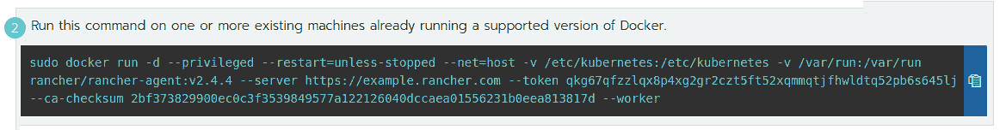

图 6.1 – 用于将节点加入集群的 docker run 命令

首先，`docker run`命令会创建一个新的容器。通常这被称为`-d`标志，它告诉 Docker 在后台启动该容器，下一个标志是`--privileged`。这个标志非常重要，因为 Rancher 代理需要访问主机及其资源，以便启动 Rancher 和 RKE 所需的附加工具和容器。`--restart=unless-stopped`标志用来确保容器即使崩溃也能继续运行。接下来，`--net=host`标志告诉 Docker 使用主机网络。这样做是为了能够获取主机的 IP 地址和主机名等信息。

我们接着来看`-v /etc/kubernetes:/etc/kubernetes`和`-v /var/run:/var/run`这两个标志。这两个标志会在引导容器中为主机文件系统创建一个绑定挂载。第一个目录用于存储 RKE 组件使用的 SSL 证书和一些`config`文件。第二个目录则用于提供对多个主机级命令的访问，包括 Docker **命令行界面（CLI）**访问，Rancher 用来创建额外容器。

下一部分是`image`标签。这个标签当然会与 Rancher 的版本匹配。接下来是传递给 Rancher 代理二进制文件的命令行选项。第一个选项是`-server`，它是 Rancher 的 API 端点，应该在连接回 Rancher 时使用。需要注意的是，这必须是一个`HTTPS` URL。下一个选项是`--token`，它是 Rancher 用来认证代理并将其与集群绑定的特殊令牌。需要注意的是，这个令牌在集群中的所有节点之间是相同的。同时，应该像对待密码一样对待这个令牌。

下一个选项是`--ca-checksum`，它是 Rancher API 端点根证书的 SHA256 校验和。之所以使用这个选项，是因为用户通常会为他们的 Rancher 服务器使用自签名或私签名证书，并且容器内的根证书可能不是最新的。Rancher 代理会从 Rancher URL 请求根证书，并将该证书的校验和与`--ca-checksum`进行比较，假设它们匹配。代理将假设根证书可以被信任。需要注意的是，这些只处理信任根证书的问题。证书的其余部分仍然必须有效——即证书没有过期且具有正确的主机名。这也是为什么不应更改 Rancher API 端点的根 CA 的原因。官方上并不支持更改 Rancher API 端点或根 CA，但 Rancher 支持提供了一些工具，例如**集群代理**工具，可以帮助你处理这些问题。该工具位于[`github.com/rancherlabs/support-tools/tree/master/cluster-agent-tool`](https://github.com/rancherlabs/support-tools/tree/master/cluster-agent-tool)。

最后，在命令的末尾，我们到达了需要根据节点的角色和设置进行自定义的部分。在*图 6.2*中所示的示例中，我们有一些用户常用的标准代理选项，第一个是`--node-name`，这是一个允许你覆盖节点主机名的选项。之所以使用这个选项，是因为默认情况下，Rancher 代理会将服务器的短主机名作为节点名，在 Rancher 和 Kubernetes 中都使用它。对于某些环境来说，这样是可以的，且该选项可以跳过，但在像 AWS 这样的云环境中，服务器主机名如`ip-10-23-24-15`可能很难阅读，并且与控制台中的服务器名称不匹配，这时候设置一个更易读的节点名就变得很有帮助。

需要注意的是，Rancher 和 RKE 不使用此主机名进行网络通信，因此节点名称不需要是有效的 DNS 记录，但建议它是有效的，以便帮助未来的故障排除。此外，必须记住，节点在注册到 Rancher 后不应更改主机名，因为主机名作为一个关键字，如果更改主机名，Rancher 会将其视为新节点进行注册。这可能会破坏集群，因为它处于未知状态，因此如果你想更改节点名称，建议先将其从集群中移除，使用 [`github.com/rancherlabs/support-tools/blob/master/extended-rancher-2-cleanup/extended-cleanup-rancher2.sh`](https://github.com/rancherlabs/support-tools/blob/master/extended-rancher-2-cleanup/extended-cleanup-rancher2.sh) 清理节点，然后将其作为新节点重新加入集群。

下一个选项是 `--address`，用于设置节点的外部 IP 地址。通常，只有当节点位于 `--internal-address` 后面时才需要此选项，该选项用于设置 Kubernetes 用于主机间通信的 IP 地址。如果一个节点有多个 **网络接口卡（NIC）**，则必须使用此设置，以避免网络被错误路由。

例如，假设你有一个用于管理的 1 GB 网络接口卡（NIC）和一个用于数据的 10 GB 网络接口卡。我们希望 RKE/Kubernetes 使用 10 GB 网络接口卡的 IP 地址来提高速度。如果未设置此选项，kubelet 将尝试通过使用默认网关和节点主机名的 DNS 记录来自动检测节点的正确 IP。建议如果一个节点有多个 IP 地址时，手动设置这些选项。

还有一些可以在代理级别设置的额外标志。例如，`--labels` 将设置节点的标签，`–taints` 将在节点创建时设置节点的污点，但需要注意的是，这些选项在此时已被锁定，如果需要在稍后更改，可能会引发问题。其他代理选项可以在 [`rancher.com/docs/rancher/v2.5/en/cluster-provisioning/rke-clusters/custom-nodes/agent-options/`](https://rancher.com/docs/rancher/v2.5/en/cluster-provisioning/rke-clusters/custom-nodes/agent-options/) 找到。

在命令的最后，我们有 `role` 选项。这些标志告诉 Rancher/RKE 此节点被分配了什么角色，例如 `--etcd`、`--controlplane` 和 `--worker`。当节点第一次向 Rancher 注册时，`role` 选项会被发送给 Rancher，并在生成集群配置时被使用。需要注意的是，这些角色在节点注册到 Rancher 后不应更改。如果需要更改节点的角色，建议将节点移除，进行清理，并重新加入：

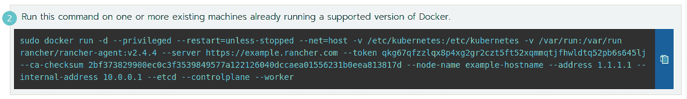

图 6.2 – 带有节点自定义的 Docker 运行命令

节点注册后会发生什么？一旦 Rancher 代理成功启动，它将注册该节点到 Rancher，节点将进入 `等待与 Kubernetes 注册` 状态。此时，代理将创建一个 WebSocket 连接并等待。这会触发 Rancher 内部的集群控制器更新集群配置。该对象相当于 RKE 使用的 `cluster.yaml` 和 `cluster.rkestate` 文件，但它是在 Rancher 容器内使用的。这是因为集群控制器使用与 RKE 相同的代码，差异主要较小，最大的不同是添加了一个拨号器来处理通过 WebSocket 隧道传输 Docker 套接字连接。集群控制器将遵循与 RKE 命令相同的过程。

现在我们了解了什么是 Rancher 托管的集群，让我们来看看这些类型集群的要求和限制。

# 要求和限制

在本节中，我们将讨论 Rancher 在各种节点上的基本要求以及其限制和设计注意事项。

## Rancher 创建的托管节点

这些是**基本要求**：

+   支持的操作系统。官方支持的操作系统可以在[`www.suse.com/suse-rancher/support-matrix/all-supported-versions/`](https://www.suse.com/suse-rancher/support-matrix/all-supported-versions/)找到。

+   Rancher 创建的节点有一个特殊要求，即 Rancher 服务器必须能够通过 SSH 连接到该节点。

+   所需的防火墙规则和端口可以在 https://rancher.com/docs/rancher/v2.5/en/installation/requirements/ports/#ports-for-rancher-launched-kubernetes-clusters-using-node-pools 找到。

+   Docker 不需要预先安装。

这些是**设计限制和注意事项**：

+   用于创建节点的基础镜像应该尽可能小，并且启动时间应少于 10 分钟。

+   Rancher 没有 IP 地址池，也没有与任何**IP 地址管理**（**IPAM**）解决方案的集成。Rancher 依赖基础设施提供商来分配 IP 地址给节点。如果你使用的是**动态主机配置协议**（**DHCP**），则分配给这些节点的 IP 地址应具有非常长的租期，并且实际上是静态的——即这些 IP 地址不应发生变化。

+   节点的主机名在节点池级别定义，节点名称通过在模板名称末尾添加一个数字并在每次创建节点时递增来依次生成。

    重要提示

    Rancher 将重用已成功回收的旧主机名。

+   如果节点部署在隔离网络环境中，Rancher 将要求在 `cloud-init` 中配置代理服务器，或者包管理器应该能够从其仓库中拉取如 curl 和 Docker 等软件包。即使这些软件包已经安装，Rancher 仍会运行 `yum install curl` 或 `apt install curl` 命令。

+   对于包含 etcd 和 controlplane 节点的节点池，Auto 应设置为`0`。

## 现有节点

这些是**基本要求**：

+   一个受支持的操作系统。官方支持的操作系统可以在[`www.suse.com/suse-rancher/support-matrix/all-supported-versions/`](https://www.suse.com/suse-rancher/support-matrix/all-supported-versions/)找到。

+   所需的防火墙规则和端口可以在[`rancher.com/docs/rancher/v2.5/en/installation/requirements/ports/#ports-for-rancher-launched-kubernetes-clusters-using-custom-nodes`](https://rancher.com/docs/rancher/v2.5/en/installation/requirements/ports/#ports-for-rancher-launched-kubernetes-clusters-using-custom-nodes)找到。

+   节点上应已安装 Docker，建议使用位于[`github.com/rancher/install-Docker`](https://github.com/rancher/install-Docker)的安装脚本。

+   如果您使用自动扩展组，必须确保每次只有一个 etcd 节点或 controlplane 节点下线。您需要确保不会丢失 etcd 的法定人数，或者在多个 controlplane 节点宕机时，集群更新不会卡住。

这些是**设计限制和考虑事项**：

+   在注册新集群的节点时，Rancher 要求每个角色（如 etcd、controlplane 和 worker）至少有一个节点。可以是单个节点，也可以是为每个角色单独设置节点，或者混合使用不同角色的节点。

+   在向集群中添加节点时，至关重要的是确保每次只添加一个新的 etcd 和 controlplane 节点。技术上可以一次性添加所有节点，但这样可能会导致新集群出现稳定性问题。

+   如果您使用私有注册表托管 Rancher 使用的 Docker 镜像，您应该按照[`rancher.com/docs/rke/latest/en/config-options/private-registries/`](https://rancher.com/docs/rke/latest/en/config-options/private-registries/)中的步骤配置集群中的注册表设置。

现在我们已经了解了要求和限制。在下一部分，我们将结合这些知识以及额外的规则和示例设计，帮助我们架构出满足需求的解决方案。

# 架构解决方案的规则

在本节中，我们将介绍一些标准设计及其优缺点。需要注意的是，每个环境都是独特的，需要调整以获得最佳性能和体验。还需要注意的是，所有的 CPU、内存和存储大小都是推荐的起始点，可能需要根据工作负载和部署过程进行调整。此外，我们将介绍适用于主要基础设施提供商（AWS 和**谷歌云平台**（**GCP**））的设计，但您应该能够将核心概念转化为其他基础设施提供商的设计。

在设计解决方案之前，您应该能够回答以下问题：

+   是否有多个环境共享同一个集群？

+   生产和非生产工作负载是否会在同一个集群中运行？

+   这个集群需要什么级别的可用性？

+   这个集群是否会跨多个数据中心，在一个城域集群环境中运行？

+   集群中节点之间的延迟是多少？

+   集群中将托管多少个 Pods？

+   集群中部署的 Pods 的平均大小和最大大小是多少？

+   你是否需要为某些应用程序提供 GPU 支持？

+   你需要为应用程序提供存储吗？

+   如果你需要存储，你是只需要 **一次读写**（**RWO**），还是需要 **多次读写**（**RWX**）？

    注意

    Rancher 官方的服务器规格指南可以在 [`rancher.com/docs/rancher/v2.5/en/installation/requirements/#rke-and-hosted-kubernetes`](https://rancher.com/docs/rancher/v2.5/en/installation/requirements/#rke-and-hosted-kubernetes) 找到。

## AWS

在这个设计中，我们将使用 Rancher EC2 节点驱动程序在 AWS 上部署一个标准大小的集群，设计与我们在*第四章*中为中型 RKE 集群创建的设计非常相似，*创建 RKE 和 RKE2 集群*。基本思路是尝试在 **高可用性**（**HA**）和成本之间进行平衡，并利用 AWS 的内网区域网络速度和延迟非常优秀这一事实，来将其视为单个数据中心。

注意

这需要进行测试，因为某些区域的速度比其他区域慢，一些用户报告了更高的延迟。

这个设计适用于集群中的 2 到 50 个工作节点。这比中型 RKE 集群要大，因为 AWS 中的 **非易失性存储**（**NVM**）能够处理比大多数本地存储更多的吞吐量。

注意

根据环境的不同，你可能需要扩展管理节点。

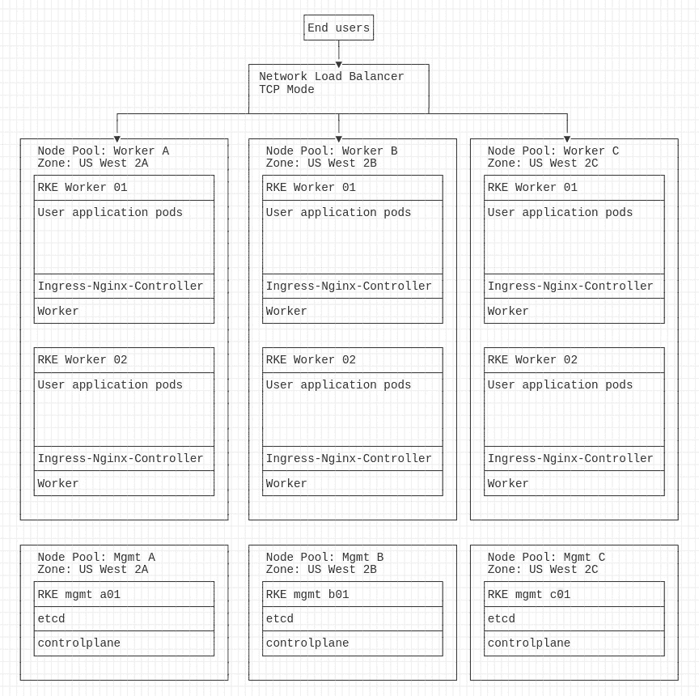

图示

图 6.3 – 一个跨区域的 Rancher 管理的 AWS 集群

图示： [`github.com/PacktPublishing/Rancher-Deep-Dive/blob/main/ch06/standard_designs/AWS/README.md`](https://github.com/PacktPublishing/Rancher-Deep-Dive/blob/main/ch06/standard_designs/AWS/README.md)

**优点**如下：

+   节点级冗余 – 你可以失去一个工作节点而不发生应用程序宕机。

+   完整的 HA – 你可以失去集群中的任何一个管理节点（etcd 和控制平面），仍然能够进行完整的集群管理。

+   用户工作负载和管理服务运行在不同的节点上，从而防止失控的应用程序导致集群宕机。

+   可用区冗余 – 你可以失去整个可用区而不发生宕机。

+   更安全的主节点修补和升级，因为节点池跨区域部署。因此，我们可以简单地将三个节点池中的每一个从一个节点扩展到两个节点并行运行，然后逐个缩减每个池。

+   使用区域反亲和规则，确保通过 Pod 拓扑分布约束将应用程序分布在不同的可用区，您可以在此了解更多：[`kubernetes.io/docs/concepts/workloads/pods/pod-topology-spread-constraints/`](https://kubernetes.io/docs/concepts/workloads/pods/pod-topology-spread-constraints/)。

**缺点**如下：

+   额外的工作节点成本。

+   设置过程中由于每个可用区都有自己的节点组而增加了额外的复杂性。

+   由于 NLB 必须在每个可用区都有一个接口，因此增加了额外的复杂性。

+   升级过程中每个可用节点组需要单独升级，增加了额外的复杂性。

+   AWS 不支持跨可用区的**弹性块存储**（**EBS**）卷，因此如果计划使用 AWS 的存储类，您需要确保应用数据在可用区之间冗余存储。您可以使用 AWS 的 EFS，但成本可能非常高昂。

**节点大小**要求如下：

+   服务器：三台 EC2 实例

+   CPU：每个服务器八个核心

+   内存：8-16 GB

+   存储：**固态硬盘**（**SSD**）或**非易失性内存快速接口**（**NVMe**）10-15 GB

    重要提示

    延迟是我们在监控 etcd 时最重要的指标。

    工作节点大小应基于您的工作负载及其要求。

## GCP

在本设计中，我们将像在 AWS 上一样，在 GCP 上部署一个标准大小的集群：

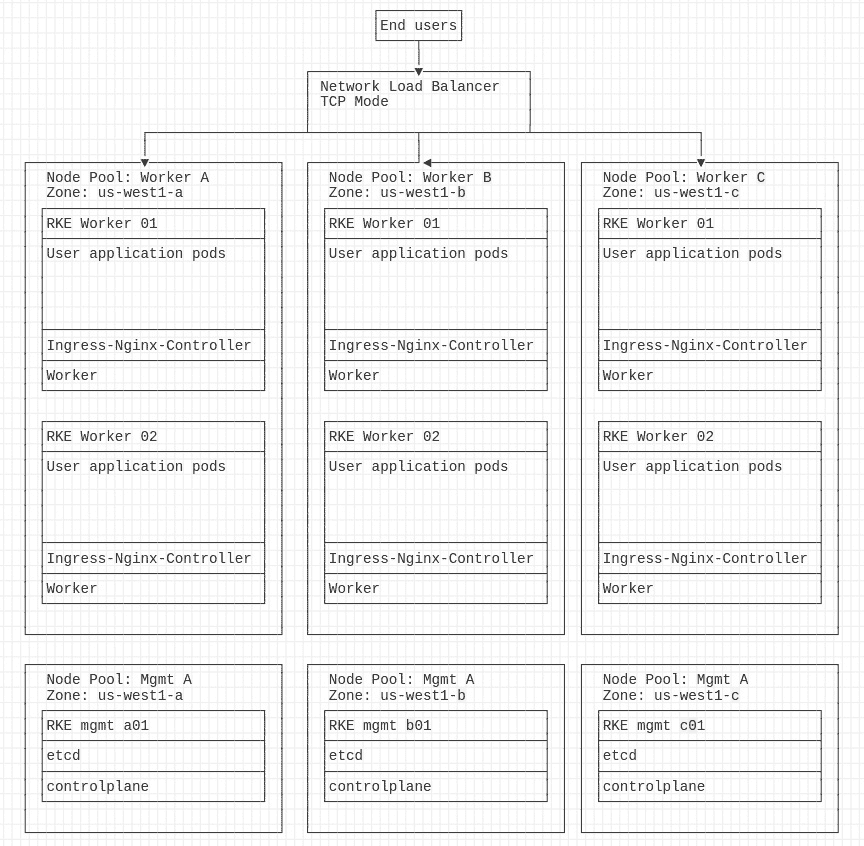

图 6.4 – 跨可用区的 Rancher 管理 AWS 集群

图表：[`github.com/PacktPublishing/Rancher-Deep-Dive/blob/main/ch06/standard_designs/GCP/README.md`](https://github.com/PacktPublishing/Rancher-Deep-Dive/blob/main/ch06/standard_designs/GCP/README.md)

注意

GCP 的优缺点和节点大小要求与 AWS 完全相同。您可以参考*Amazon 的 AWS*部分以获取更多详情。

现在我们已经创建了集群设计。接下来的部分，我们将开始创建集群的过程，第一步是准备节点。

# 准备节点加入 Rancher

在创建集群之前，我们需要准备将用于创建集群的节点/镜像。本节假设您使用的是基于 Ubuntu 或 Red Hat/CentOS 的镜像/节点，因为这两者是最常用的。

对于 Rancher 管理的节点，我们需要创建一个基础镜像，并在环境中进行克隆和部署。创建此镜像有两种主要方式：

+   首先，从一个公有镜像开始，比如可以在 [`cloud-images.ubuntu.com/focal/current/`](https://cloud-images.ubuntu.com/focal/current/) 找到的 Ubuntu ServerW 云镜像。请注意，此镜像必须来自一个受信任的源，直接来自 Ubuntu 网站或您的基础设施提供商的官方镜像。这些镜像设计为小巧轻量，因为它们只包含必要的工具和预安装的包。对于大多数人来说，这就是整个过程的结束，因为大多数您想要进行的定制都可以通过 `cloud-init` 工具来完成。如果您需要安装任何额外的工具或更改设置，应参考您的基础设施提供商的文档，以打开该镜像并进行定制。

我们通常建议尽量减少更改，不安装像 Puppet、Chef 或备份客户端这样的工具，因为这些服务器设计为可丢弃并容易替换。此外，我们通常建议对基础镜像进行补丁更新，以便进行小规模更新。然而，对于重大升级，我们更推荐返回官方镜像源并拉取新版本。最后，我们建议不要在 `cloud-init` 文件中更新/升级节点，因为我们希望从该镜像部署的所有节点都保持一致。此外，Rancher 在节点创建过程中有 10 分钟的超时时间，更新/修补可能导致节点超过此时间限制。

+   第二种方式是从一个黄金镜像开始，该镜像是您或您的团队已经在环境中用于其他应用程序的镜像。例如，如果您的 Linux 团队已经有一个基于 Red Hat 的镜像，并且已经针对您的环境做了所有定制，那么没有必要重新发明轮子，您可以直接使用该现有镜像。请注意，您可能需要对该镜像进行额外的测试和调整，以确保它完全受支持。

    注意

    就 `cloud-init` 设置而言，您仍然应该遵循公有镜像选项下列出的相同建议。

此外，我们还应确保任何自动化修补工具都被禁用，因为我们不希望节点在创建后发生变化。

对于自定义节点，过程与公有节点大不相同，因为 Rancher 与节点创建过程或操作系统无关。在这种情况下，您或您的 Linux 团队需要负责创建服务器、配置服务器、安装 Docker，并将其注册到 Rancher 中。这一方式的优点是您可以对服务器拥有更大的控制权。您仍然应该遵循公有镜像选项下列出的相同建议。不同之处在于，由于 Rancher 不管理操作系统，像 Puppet 或 Chef 这样的工具是被支持的。

此时，如果您计划将自有节点带入 Rancher，您应该已经构建并准备好节点。在下一节中，我们将介绍如果希望 Rancher 为我们构建节点时的步骤。

# 准备基础设施提供商

现在我们已经创建了节点镜像，接下来需要在 Rancher 中配置该镜像。

注意

这仅适用于 Rancher 管理的集群。如果您正在使用现有节点，则可以跳过此部分。

第一步是在基础设施提供商中创建一个服务账户，该账户需要具备 Rancher 用来创建、管理和删除节点的权限。出于安全考虑，我们建议此账户应为专用账户，不与其他应用程序或用户共享，并且该账户的权限应仅限于所需的权限。有关不同基础设施提供商的权限详情，可以参考[`rancher.com/docs/rancher/v2.5/en/cluster-provisioning/rke-clusters/cloud-providers/`](https://rancher.com/docs/rancher/v2.5/en/cluster-provisioning/rke-clusters/cloud-providers/)。

需要记住的是，Rancher 和基础设施提供商仍在不断发展，因此这些权限可能会随时间变化。一旦创建了该账户，您需要登录 Rancher v2.6.x UI，进入**集群管理**页面并选择**云凭证**页面。这将弹出一个设置向导，如*图 6.5*所示。

注意

Rancher UI 会测试凭证是否正确，但不会验证该账户是否具备 Rancher 所需的所有权限。

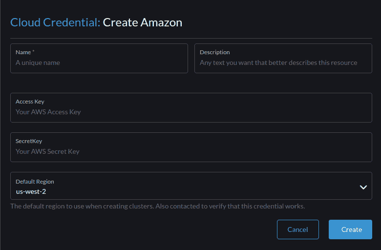

图 6.5 – 亚马逊云凭证设置向导

有关云凭证的更多详细信息，请访问[`rancher.com/docs/rancher/v2.5/en/user-settings/cloud-credentials/`](https://rancher.com/docs/rancher/v2.5/en/user-settings/cloud-credentials/)。

下一步是创建节点模板。这是我们定义节点配置的方式。包括选择镜像、位置以及其他任何基础设施设置。我们通过进入**集群管理**页面，展开**RKE1 配置**，然后选择**节点模板**来完成。这将会弹出一个设置向导，如下图所示。

注意

Rancher UI 将在您点击不同页面时动态查询基础设施提供商。

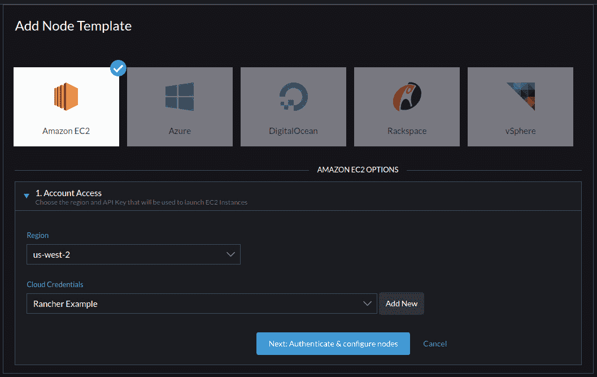

图 6.6 – 亚马逊节点模板向导 – 步骤一

以下两页根据基础设施提供商有所不同。

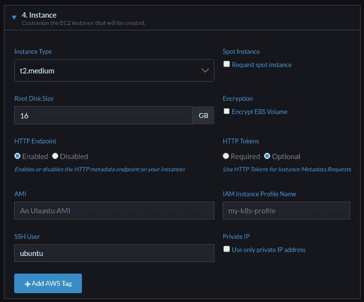

图 6.7 – 亚马逊节点模板向导 – 实例设置

设置向导的最后一页是你进行大部分节点自定义的地方——例如，设置服务器大小、根磁盘大小和标签。大部分这些设置可以保留默认值；我通常推荐更改的唯一设置是**根磁盘大小**，默认值为 16 GB。这对于实验室/沙盒环境来说足够了，但对于实际的生产节点，我建议设置为 30-40 GB。另外，**名称**字段通常不会更改，所以我建议使用一个非常具描述性的名称。还有一个**描述**字段可以用于输入备注。最后，**标签**字段可能有些让人困惑（参见*图 6.8*）。页面的底部部分是用于设置 Docker/Kubernetes 标签、污点和引擎选项：

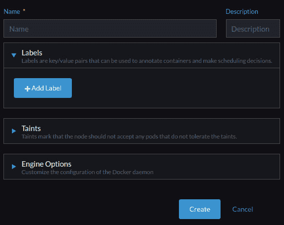

图 6.8 – 亚马逊的节点模板向导 – 节点设置

有关节点模板的更多详细信息，请访问[`rancher.com/docs/rancher/v2.5/en/user-settings/node-templates/`](https://rancher.com/docs/rancher/v2.5/en/user-settings/node-templates/)。

到此为止，我们已经完成了 Rancher 为我们创建和管理节点所需的所有准备工作。在下一部分，我们将开始在 Rancher 中实际创建集群的过程。

# 使用 Rancher 创建 RKE 集群的步骤

在这一部分，我们将使用默认设置创建一个自定义集群。在下一部分，我们将介绍如何使用基础设施提供商创建 RKE 集群。

第一步是进入 Rancher 用户界面（UI）并访问**集群管理**页面。在此页面中，进入**集群**页面，并点击页面右上角的**创建**按钮。这样会带你到一个展示所有主要集群类型的页面。请参见下面的示例图。我们将在此页面中点击**自定义**按钮：

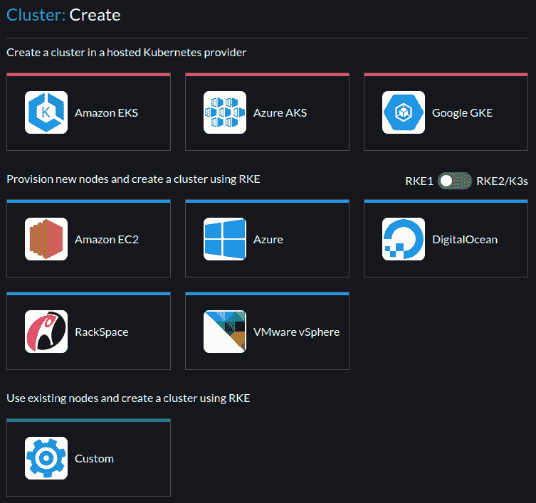

图 6.9 – 集群创建页面

下一页是你可以定义集群的地方。你需要填写的第一个字段是**集群名称**。集群名称最多限制为 253 个字符，且必须是全小写字母、数字，支持点号和破折号。关于此页面上其他设置的详细信息，请参考[`rancher.com/docs/rancher/v2.5/en/cluster-provisioning/rke-clusters/custom-nodes/`](https://rancher.com/docs/rancher/v2.5/en/cluster-provisioning/rke-clusters/custom-nodes/):

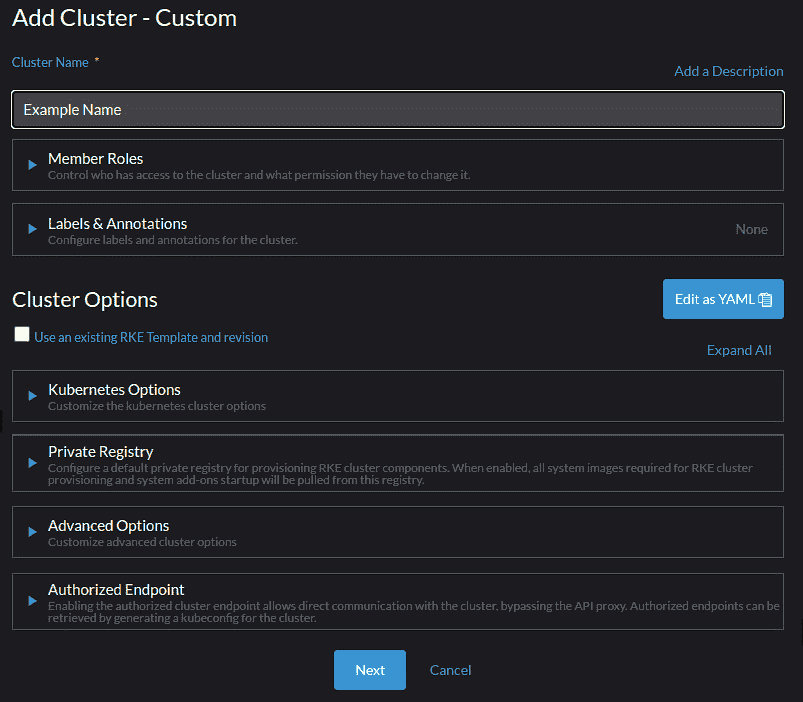

图 6.10 – 集群设置页面

现在我们已经有了一个集群，接下来需要为集群添加节点。由于我们正在创建一个自定义集群，下一页将显示我们需要用来加入不同类型节点的`docker run`命令。稍后你可以通过进入**集群管理**页面并从列表中选择**集群**来检索此页面：

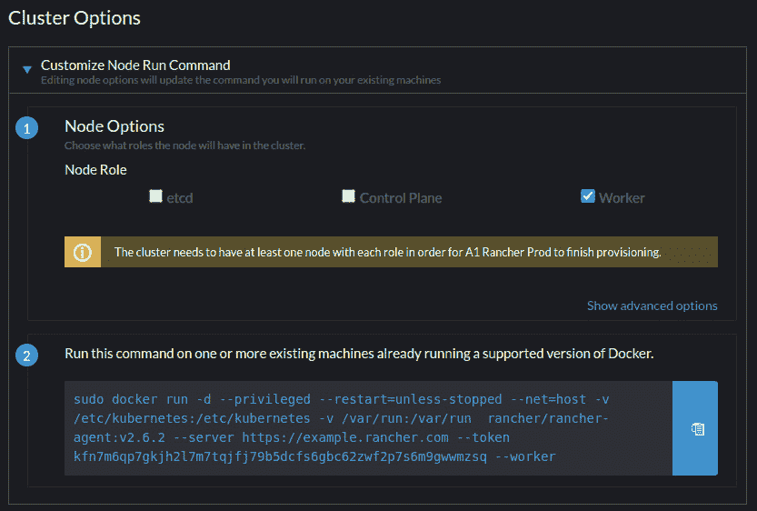

图 6.11 – 自定义节点运行命令向导

此时，Rancher 应该正在创建我们的新集群。你可以通过点击集群仪表板或**节点**标签来通过 Rancher UI 监控该过程。在此过程结束时，你将拥有一个 Kubernetes 集群。在下一节中，我们将介绍如何使用节点池创建集群。

# 使用节点池部署集群

现在我们有了一个自定义集群，我们将按照相同的步骤创建一个包含节点池的集群。首先，选择 `docker run` 命令向导，而不是选择其他选项。

使用这个向导，你可以为每种不同类型的节点添加一个节点池，关键字段是**名称前缀**，用于设置该池中节点的主机名。确保这些名称具有意义且不会重复非常重要。其他主要字段是角色的复选框。UI 会提醒你每种节点类型所需的最小节点数量。如果未满足要求，Rancher 将不允许你创建集群：

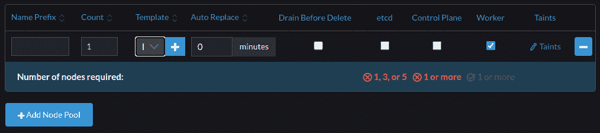

图 6.12 – 节点池创建向导

此时，Rancher 将接管，开始创建服务器并在其上部署 RKE。你可以通过进入**节点**标签来监控节点的创建，并查看每个节点的状态消息。集群的整体状态也会显示在页面顶部。在此过程结束时，你将拥有一个可以开始部署应用程序的 Kubernetes 集群。在下一节中，我们将介绍一些需要执行的任务，以保持集群的健康。

# 持续维护任务

创建集群后，需要进行一些持续的维护任务，以保持集群处于健康状态。

我推荐的第一个任务是设置定期的 etcd 备份，在 Rancher v2.4 及更高版本中，该功能默认启用。默认行为是每个 etcd 节点会拍摄一个 etcd 快照，并将其存储在 `/opt/rke/etcd-snapshots` 本地。etcd 备份是一个时点快照，存储了集群的配置。在发生故障时，这个备份非常重要，因此，通常会将备份配置为 S3 选项，因为我们不希望将备份存储在与被备份的服务器相同的位置。你可以在 [`rancher.com/docs/rke/latest/en/etcd-snapshots/recurring-snapshots/#options-for-the-etcd-snapshot-service`](https://rancher.com/docs/rke/latest/en/etcd-snapshots/recurring-snapshots/#options-for-the-etcd-snapshot-service) 找到详细的 S3 设置列表。

注意

Rancher/RKE 支持任何与 S3 兼容的存储。因此，对于本地环境，您可以使用诸如 MinIO 之类的工具。如果您已经拥有企业存储解决方案，可能需要审查一下，看看它是否支持 S3，因为一些较新的企业存储子系统提供了开箱即用的 S3 支持。

我建议测试和记录的第二项任务是如何对集群中的节点进行补丁/升级。主要的两种方式是在原地进行补丁或替换节点。自定义集群的最常见方式是在原地进行补丁，具体过程是创建一个脚本，逐个浏览集群中的所有节点，并使用以下步骤：

1.  排空并隔离节点。

1.  然后，在节点上应用任何所需的补丁/升级/重启。

1.  一旦所有任务完成，节点就会取消隔离，并处理下一个节点。可以在[`github.com/PacktPublishing/Rancher-Deep-Dive/blob/main/ch06/cluster_patching/rolling_reboot.sh`](https://github.com/PacktPublishing/Rancher-Deep-Dive/blob/main/ch06/cluster_patching/rolling_reboot.sh)找到示例脚本。

    注意

    该脚本设计为具有大量的休眠周期，因为它旨在无人参与模式下运行。对于具有节点池的集群，通常会替换节点而不是更改现有节点。这通过扩展节点池，然后逐个删除旧节点并替换它们来完成。

我建议测试和记录的第三项任务是如何升级 Kubernetes。基本过程是查看新版本的发布说明。然后，在升级集群时，您需要进行 etcd 快照，因为这是回滚升级的唯一方式。有关此升级的规则和过程，可以在 https://github.com/mattmattox/Kubernetes-Master-Class/tree/main/rancher-k8s-upgrades#rke-upgrade--prep-work 找到，以及进行深入研究的大师课程。

# 摘要

在本章中，我们了解了 Rancher 管理的不同类型的集群，包括每种类型的要求和限制。然后，我们讨论了为每种类型的集群架构规则，包括一些示例设计以及每种解决方案的优缺点。最后，我们详细介绍了使用我们早期制定的设计创建每种类型集群的步骤。我们通过讨论主要的维护任务结束了本章。

下一章将介绍如何在 Rancher 中创建托管集群，即下游集群。我们将讨论 Rancher 如何创建这些集群以及其限制。
