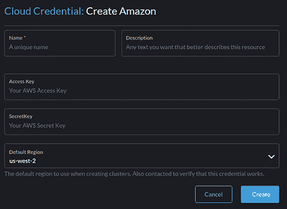
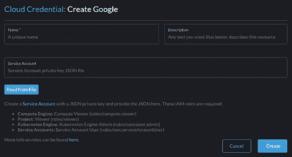
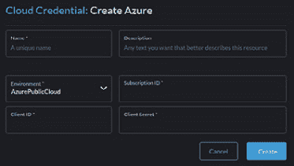

# 第七章：*第七章*：使用 Rancher 部署托管集群

对于不想管理任何服务器的团队，Rancher 提供了部署和管理托管 Kubernetes 服务的能力，如 **Google Kubernetes Engine**（**GKE**）、**Amazon Elastic Container Service for Kubernetes**（**Amazon EKS**）或 **Azure Kubernetes Service**（**AKS**）。本章将讨论使用托管集群与 RKE 集群的优缺点。然后，我们将介绍此类集群的要求和限制。接下来，我们将讲解如何准备云服务提供商。然后，我们将介绍如何使用 Rancher 设置 EKS、GKE 和 AKS 集群。最后，我们将讨论集群管理所需的维护任务。

在本章中，我们将涵盖以下主要内容：

+   Rancher 如何管理托管集群？

+   要求和限制

+   架构解决方案的规则

+   准备云服务提供商

+   安装步骤

+   持续的维护任务

# Rancher 如何管理托管集群？

我经常收到的第一个问题是，*什么是托管集群？* 简单来说，它是一个由云服务提供商（如 Google、Amazon 或 Azure）创建和管理的 Kubernetes 集群，但由 Rancher 管理集群的配置。Rancher 使用云服务提供商的 API 和 SDK 来创建集群，就像你作为终端用户通过它们的 Web 控制台或命令行工具创建集群一样。自 Rancher v2.6 以来，当前支持的云服务提供商如下：

+   **GKE**

+   **Amazom EKS**

+   **AKS**

+   **阿里云容器服务 for Kubernetes**（**Alibaba ACK**）

+   **腾讯 Kubernetes 引擎**（**Tencent TKE**）

+   **华为云容器引擎**（**Huawei CCE**）

Rancher 通过在 Rancher 主控 pod 中设置一组控制器来实现这一点。每个云服务提供商都有自己的控制器，每个控制器使用 Go 库与云服务提供商进行通信。Rancher 采用一种流程，其中 Rancher 将集群的配置存储为集群对象中的规范。例如，EKS 配置存储在 `Spec.EKSConfig` 下。对于本节内容，我们将首先讲解 v1 控制器，然后讲解新的 v2 控制器。

使用最初的 v1 控制器（在 Rancher v2.0–2.4 版本中）时，集群配置存储在此对象中，只有在 Rancher 或用户进行更改时才会更新。如果你在 Rancher 中创建了一个 EKS 集群，然后在 AWS 控制台中进行更改，那么这些更改不会反映在 Rancher 中，Rancher 会在下一次更新时覆盖这些更改。这意味着，对于这些类型的集群，Rancher 是唯一的真实来源，而在撰写本文时，这些集群无法从 Rancher 中分离并进行外部管理。

新的 v2 控制器仅适用于 EKS 和 GKE，已添加到 Rancher v2.5.8 及以后的版本中。配置同步的概念被引入，以允许在 Rancher 外部所做的更改同步到 Rancher 中。这是通过两个操作器来完成的，分别是 eks-operator 和 gke-operator。操作器将云提供商的配置存储为`Spec.EKSStatus`和`Spec.GKEStatus`。这些对象每 5 分钟从云提供商处刷新一次。集群的本地配置存储为`Spec.EKSConfig`和`Spec.GKEConfig`，它们表示集群的期望状态，其中大多数字段在`config section`中为`NULL`。Rancher 会保持这些值为`NULL`，直到它们在 Rancher 中被设置。一旦在 Rancher 中设置了该值，操作器就会使用云提供商的 SDK 来更新集群。一旦云端被更新，`Status`规格将会被更新。如果你在 Rancher 外部更改了集群，这些更改会被 Rancher 捕获，如果`managed`字段不同，它将被覆盖。

一个经常被问到的问题是，*在 Rancher 中构建托管集群和在 Rancher 外部构建集群再导入之间有什么区别？* 这个问题的答案取决于集群的类型。如果是 EKS 或 GKE 集群，你将导入该集群，Rancher 会自动检测集群类型。然后，假设 Rancher 具有正确的权限，Rancher 将*转换*该集群为托管集群。此时，该集群可以像 Rancher 创建的集群一样进行管理。我们将在下一章中详细讨论如何将集群导入 Rancher。

# 要求和限制

现在我们了解了什么是托管集群以及它在 Rancher 中的工作原理，接下来我们将讨论托管集群在 Rancher 中的要求和限制，以及选择托管集群时的设计限制和约束。

## 基本要求

Rancher 需要来自云提供商的权限，才能创建集群及其相关服务。所需的权限会根据云提供商的不同而有所不同。每种云提供商类型的官方 Rancher 文档链接如下所示：

+   Google Kubernetes Engine: [`rancher.com/docs/rancher/v2.6/en/cluster-provisioning/hosted-kubernetes-clusters/gke/`](https://rancher.com/docs/rancher/v2.6/en/cluster-provisioning/hosted-kubernetes-clusters/gke/)。

+   Amazon EKS: [`rancher.com/docs/rancher/v2.6/en/cluster-provisioning/hosted-kubernetes-clusters/eks/`](https://rancher.com/docs/rancher/v2.6/en/cluster-provisioning/hosted-kubernetes-clusters/eks/)。

+   AKS: [`rancher.com/docs/rancher/v2.6/en/cluster-provisioning/hosted-kubernetes-clusters/aks/`](https://rancher.com/docs/rancher/v2.6/en/cluster-provisioning/hosted-kubernetes-clusters/aks/)。

+   其他云提供商的信息可以在 [`rancher.com/docs/rancher/v2.6/zh/cluster-provisioning/hosted-kubernetes-clusters/`](https://rancher.com/docs/rancher/v2.6/zh/cluster-provisioning/hosted-kubernetes-clusters/) 找到。

建议使用最少权限的专用服务账户配置 Rancher。

Rancher 需要访问云提供商的 API 端点，这意味着 Rancher 需要直接或通过 HTTP(S) 代理访问互联网。如果您使用像 AWS 的 API 网关这样的私有 API，那么需要在 Rancher 中进行配置。

Rancher 需要从 Rancher 服务器访问集群的 Kubernetes API 端点。

建议在 Rancher 中配置云服务账户，使用专用的服务账户如本地管理员，并且此账户应该在 Rancher 中拥有管理员权限。

## 设计限制和考虑

一些设置，如可用区域，在 Rancher 中是硬编码的，这意味着如果云提供商添加了新的区域，可能在您升级 Rancher 之前在 Rancher UI 中不可用。

重要提示

对于 v2 控制器，您可以通过在 Rancher 外部创建集群，然后导入来绕过 Rancher UI 中的限制。

在 Rancher UI 中可用的 Kubernetes 版本可能与云提供商允许的版本不匹配。例如，如果您运行较旧版本的 Rancher，您可能在下拉菜单中看到 v1.13，但因为 Amazon 不再支持此版本，您将在 Rancher 中收到集群创建失败的错误。

更多的云提供商将假定正在构建的集群具有公共互联网访问和为节点、负载均衡器分配公共 IP 地址，以及 Kube-API 端点，如果要设置无网络访问或仅私有 IP 的集群。您需要与云提供商合作配置额外的防火墙规则、路由和其他必需的设置。以下是在 Rancher 中使用私有端点的文档：

+   对于仅限私有的 EKS 端点，Rancher 提供了所需的额外步骤的文档，位于 https://rancher.com/docs/rancher/v2.5/zh/cluster-admin/editing-clusters/eks-config-reference/#private-only-api-endpoints。

+   有关 GKE 私有端点的文档可以在 https://rancher.com/docs/rancher/v2.5/zh/cluster-admin/editing-clusters/gke-config-reference/#private-cluster 找到。

    注意

    在撰写时，此类配置并不十分成熟，并且存在一些 bug。

快照和备份并不存在。与 RKE/2 集群不同，大多数托管集群不会提供访问 etcd 备份，也没有 etcd 备份选项。如果集群丢失或用户犯了错误（例如，删除了错误的命名空间），你唯一的选择就是重新部署。有一些第三方工具，例如 Velero，可以解决这个不足，我们将在本章稍后介绍。

Rancher 所需的权限可能对一些安全团队来说太大，难以批准。Rancher 提供了最小 EKS 权限的列表，位于[`rancher.com/docs/rancher/v2.5/en/cluster-provisioning/hosted-kubernetes-clusters/eks/permissions/`](https://rancher.com/docs/rancher/v2.5/en/cluster-provisioning/hosted-kubernetes-clusters/eks/permissions/)。需要注意的是，某些功能可能无法在较低权限设置下正常工作，可能需要进行调优。

托管集群的负载均衡器成本可能比 RKE/2 集群更高。这是因为大多数云提供商会部署外部负载均衡器，而不是 RKE/2 使用的共享负载均衡器——Ingress NGINX Controller。需要注意的是，你可以通过在其前面部署 nginx-ingress 和外部负载均衡器来绕过这一限制。

在本节中，我们已经讨论了需求和限制。在下一节中，我们将结合这些知识以及额外的规则和示例设计，帮助我们构建一个满足你需求的解决方案。

# 架构解决方案的规则

在本节中，我们将介绍一些标准设计及其优缺点。需要注意的是，每个环境都是独特的，需要进行调优以达到最佳性能和体验。同样需要注意的是，所有的 CPU、内存和存储大小都只是建议的起始点，可能需要根据你的工作负载和部署过程进行增加或减少。此外，我们还将介绍主要基础设施提供商的设计（Amazon EKS 和 GKE），但你应该能够将核心概念迁移到其他基础设施提供商。

在设计解决方案之前，你应该能够回答以下问题：

+   多个环境是否会共享同一个集群？

+   生产工作负载和非生产工作负载是否会在同一个集群中？

+   这个集群需要什么级别的可用性？

+   这个集群是否会跨多个数据中心部署在城市集群环境中？

+   集群中节点之间的延迟有多大？

+   集群中将托管多少个 Pod？

+   集群中部署的 Pod 的平均大小和最大大小是多少？

+   你是否需要为某些应用程序提供 GPU 支持？

+   你是否需要为你的应用程序提供存储？

+   如果你需要存储，你只需要`ReadWriteOnce` (RWO) 还是需要`ReadWriteMany` (RWX)？

让我们从 Amazon EKS 开始。

## Amazon EKS

EKS 是最成熟的云服务提供商，特别是在**Kubernetes 即服务**（**KaaS**）方面。因此，EKS 是最灵活的解决方案之一，但在 Rancher 中创建 EKS 集群时需要遵守一些限制和规则。

亚马逊 EKS 的**优点**如下：

+   EKS 支持巨大的集群，当前的限制为每个集群 3,000 个节点，每个节点 737 个 Pods（具体取决于节点大小）。

+   EKS 支持第三方**容器网络接口**（**CNI**）提供商，如 Calico。

+   EKS 本地支持`ReadWriteOnce`存储。该存储类的提供者已预安装。你可以在[`docs.aws.amazon.com/eks/latest/userguide/ebs-csi.html`](https://docs.aws.amazon.com/eks/latest/userguide/ebs-csi.html)找到关于此存储类的更多细节。

+   对于需要`ReadWriteMany`的工作负载，EKS 支持**弹性文件系统**（**EFS**），该系统由亚马逊的 NFS 共享进行管理。你可以在[`docs.aws.amazon.com/eks/latest/userguide/efs-csi.html`](https://docs.aws.amazon.com/eks/latest/userguide/efs-csi.html)找到更多细节。

+   由于亚马逊同时控制了云网络和集群覆盖网络，你可以直接将**虚拟私有云**（**VPC**）中的 IP 地址分配给集群内的 Pods。这允许其他亚马逊服务直接与 Pods 通信。你可以在[`docs.aws.amazon.com/eks/latest/userguide/pod-networking.html`](https://docs.aws.amazon.com/eks/latest/userguide/pod-networking.html)找到更多细节。

+   EKS 与 AWS 负载均衡器之间有直接的集成。这使得你可以部署**应用负载均衡器**（**ALB**）作为第 7 层/HTTP(S)负载均衡器，以及**网络负载均衡器**（**NLB**）作为第 4 层/TCP 负载均衡器。

亚马逊 EKS 的**缺点**如下：

+   EKS 根据节点大小限制每个节点的 Pods 数量。例如，`t2.nano`每个节点仅支持四个 Pods。在这种可用 Pods 数量极少的情况下，大多数服务（如 CNI、节点监控程序和日志收集器）将在任何应用 Pods 启动之前占满节点的所有可用插槽。通常建议使用`t2.large`或更大的节点。你可以在[`github.com/awslabs/amazon-eks-ami/blob/master/files/eni-max-pods.txt`](https://github.com/awslabs/amazon-eks-ami/blob/master/files/eni-max-pods.txt)找到所有节点大小与最大 Pods 数量的对照列表。

+   在撰写本文时，EKS 没有自动节点修复过程，因此如果节点崩溃并且无法恢复，该节点不会被替换，直到你强制替换它。你可以在[`aws.amazon.com/premiumsupport/knowledge-center/eks-node-status-ready/`](https://aws.amazon.com/premiumsupport/knowledge-center/eks-node-status-ready/)找到有关此限制的更多细节。

+   升级过程中需要一些手动步骤。亚马逊已在[`docs.aws.amazon.com/eks/latest/userguide/update-cluster.html`](https://docs.aws.amazon.com/eks/latest/userguide/update-cluster.html)文档中列出了这些步骤。

现在，让我们来讨论 GKE。

## GKE

GKE 是 KaaS 领域中第二成熟的云服务提供商。这是因为 Kubernetes 由谷歌创建，并且谷歌仍然推动 Kubernetes 核心的集成和开发工作。

GKE 的**优点**如下：

+   GKE 支持最广泛的 Kubernetes 版本（三个主要版本），并且通常非常及时地推出新版本。你可以在[`cloud.google.com/kubernetes-engine/docs/release-notes#latest_versions`](https://cloud.google.com/kubernetes-engine/docs/release-notes#latest_versions)查看有关发布计划和版本的更多详细信息。

+   使用 GKE，你可以在集群中启用自动驾驶功能，并且可以完全自动化集群的升级过程，包括控制平面和工作节点的升级。你可以在[`cloud.google.com/kubernetes-engine/docs/concepts/autopilot-overview`](https://cloud.google.com/kubernetes-engine/docs/concepts/autopilot-overview)查看自动驾驶功能的文档。

+   你可以将集群的发布通道设置为快速发布通道，这样你每隔几周就会收到常规通道的更新（这是默认选项），并且每 2 到 3 个月提供一次更新。最后，你可以选择稳定通道，这与常规通道非常相似，不同之处在于它是最后一个获得更新的通道。这为准确的用户测试提供了更多时间。你可以在[`cloud.google.com/kubernetes-engine/docs/concepts/release-channels`](https://cloud.google.com/kubernetes-engine/docs/concepts/release-channels)查看更多详细信息。

+   GKE 提供自动节点修复功能；如果某个节点出现故障，GKE 会自动替换它。它通过节点状态来实现这一点，当 kubelet 崩溃而操作系统继续运行时，帮助处理节点在集群中的“死亡”状态。你可以在[`cloud.google.com/kubernetes-engine/docs/how-to/node-auto-repair`](https://cloud.google.com/kubernetes-engine/docs/how-to/node-auto-repair)了解更多关于此过程的信息。

+   GKE 的独特之处在于，你可以选择谷歌的容器优化操作系统，这是一种为安全性和稳定性设计的精简版操作系统。或者，你也可以选择基于 Ubuntu 的镜像。你还可以在一个集群中混合使用不同的镜像。完整的节点镜像列表可以在[`cloud.google.com/kubernetes-engine/docs/concepts/node-images`](https://cloud.google.com/kubernetes-engine/docs/concepts/node-images)找到。

+   GKE 支持 Windows Server 容器。这是通过将 Windows 工作节点添加到你的 GKE 集群中实现的。GKE 中 Windows 节点的限制可以在 [`cloud.google.com/kubernetes-engine/docs/concepts/windows-server-gke`](https://cloud.google.com/kubernetes-engine/docs/concepts/windows-server-gke) 找到。

+   GKE 允许你使用 SSH 客户端远程访问工作节点，这对于排查节点和应用程序问题非常有帮助。

GKE 的 **缺点** 如下：

+   GKE 仅在使用区域集群时提供 99.95% 的 **服务级别协议**（**SLA**），而使用区域集群需要额外付费。关于这个费用的详细信息可以在 https://cloud.google.com/kubernetes-engine/pricing#cluster_management_fee_and_free_tier 找到。

+   截至撰写时，GKE 没有政府云选项。所有当前支持的区域可以在 [`cloud.google.com/compute/docs/regions-zones`](https://cloud.google.com/compute/docs/regions-zones) 找到。

最后，我们将讨论 AKS。

## Microsoft Azure Kubernetes 服务（AKS）

AKS 是在 KaaS 领域中的新秀，但 Microsoft 已经为 AKS 投入了大量资源，并且快速缩小了功能差距。

AKS 的 **优点** 如下：

+   AKS 遵循 Microsoft 的标准月度补丁计划，就像他们对待操作系统一样。他们还会在其 GitHub 页面上发布版本，页面地址为 [`github.com/Azure/AKS/releases`](https://github.com/Azure/AKS/releases)。

+   AKS 具有自动节点修复功能，而 Microsoft Azure 则通过节点代理和集群中的节点状态来触发修复。Azure 的恢复过程不如其他云服务提供商先进，因为它会尝试先重启节点，若无效则重新镜像，最后如果还失败，Azure 工程师会调查问题。你可以在 [`docs.microsoft.com/en-us/azure/aks/node-auto-repair`](https://docs.microsoft.com/en-us/azure/aks/node-auto-repair) 阅读更多关于此过程的内容。

+   AKS 完全支持与 **Azure Active Directory**（**Azure AD**）的集成。这允许你使用 Azure AD 用户和组在集群内分配权限。更多细节，请访问 [`docs.microsoft.com/en-us/azure/aks/managed-aad`](https://docs.microsoft.com/en-us/azure/aks/managed-aad)。

+   AKS 具有 Visual Studio Code 扩展，允许开发人员像在 AKS 集群中一样，在笔记本电脑上直接运行和调试代码。Bridge to Kubernetes 基本上就像是在你的集群中创建一个 VPN 连接，使得在你的电脑上运行的 Pod 可以直接与集群及集群中其他 Pod 通信。你可以在 [`docs.microsoft.com/en-us/visualstudio/bridge/overview-bridge-to-kubernetes?view=vs-2019`](https://docs.microsoft.com/en-us/visualstudio/bridge/overview-bridge-to-kubernetes?view=vs-2019) 了解更多关于如何工作的内容。

AKS 的 **缺点** 如下：

+   AKS 的升级过程包含一些手动步骤。

    注意

    自动集群升级目前处于公开预览阶段。你可以在 [`azure.microsoft.com/en-us/updates/public-preview-automatic-cluster-upgrades-in-aks/`](https://azure.microsoft.com/en-us/updates/public-preview-automatic-cluster-upgrades-in-aks/) 查看当前状态。

+   一些设置，如网络策略，只能在创建集群时设置，之后无法启用。你可以在 https://docs.microsoft.com/en-us/azure/aks/use-network-policies#create-an-aks-cluster-and-enable-network-policy 中找到更多详细信息。

+   如果你使用的是区域集群，AKS 仅提供 99.95% 的 SLA，这会增加集群的成本。关于该成本的详细信息，可以在 [`azure.microsoft.com/en-us/pricing/details/bandwidth/`](https://azure.microsoft.com/en-us/pricing/details/bandwidth/) 找到。

现在我们已经了解了每个主要托管提供商的优缺点，我们将深入探讨如何在云服务提供商和 Rancher 中设置一切，以便开始创建集群。

# 准备云服务提供商

在 Rancher 中创建托管集群之前，我们需要为 Rancher 准备云服务提供商。在本节中，我们将涵盖如何在三个主要的托管 Kubernetes 集群中设置权限，分别是 EKS、GKE 和 AKS。

我们将从 Amazon EKS 开始。

## Amazon EKS

前提条件如下：

+   你应该已经创建并可以使用 AWS 订阅。

+   你需要在 AWS 中拥有权限，以便能够创建 **身份和访问管理** (**IAM**) 策略。

+   你的 Rancher 服务器应该能够访问 AWS API 的公共或私有端点。你可以在 [`aws.amazon.com/blogs/compute/introducing-amazon-api-gateway-private-endpoints/`](https://aws.amazon.com/blogs/compute/introducing-amazon-api-gateway-private-endpoints/) 阅读更多关于 Amazon API Gateway 私有端点的信息。

+   EKS 需要创建一个 VPC，你应该与网络团队合作来完成这项工作。亚马逊提供了一个教程，位于 [`docs.aws.amazon.com/eks/latest/userguide/create-public-private-vpc.html`](https://docs.aws.amazon.com/eks/latest/userguide/create-public-private-vpc.html)，内容涵盖如何创建 VPC。

+   你应该在 AWS 中为 Rancher 创建一个专用的服务账户。

+   你应该在 Rancher 中拥有一个专用的服务账户，并且该账户应该具备管理员级别的权限。你可以使用本地管理员账户来执行此角色。在本节中，我们假设你将使用本地管理员账户。

### 设置权限

以下是 Rancher 的设置权限：

1.  如果你还没有在 AWS 中创建专用服务账户，你应该按照 [`docs.aws.amazon.com/IAM/latest/UserGuide/id_users_create.html.`](https://docs.aws.amazon.com/IAM/latest/UserGuide/id_users_create.html.) 上的步骤创建。在本节中，我们将使用 `rancher` 作为此服务账户的名称。

1.  现在我们已经拥有了服务账户，我们将为该账户分配一个 IAM 策略。此策略赋予 Rancher 创建 EKS 集群所需的权限。最小所需权限可以在 https://rancher.com/docs/rancher/v2.6/en/cluster-provisioning/hosted-kubernetes-clusters/eks/#minimum-eks-permissions 找到，创建 IAM 策略并将其附加到服务账户的步骤可以在[`docs.aws.amazon.com/eks/latest/userguide/EKS_IAM_user_policies.html`](https://docs.aws.amazon.com/eks/latest/userguide/EKS_IAM_user_policies.html)找到。

1.  现在我们需要创建访问密钥和秘密密钥对，操作步骤可以在 https://docs.aws.amazon.com/IAM/latest/UserGuide/id_credentials_access-keys.html#Using_CreateAccessKey 找到。需要注意的是，根据 Amazon 的访问密钥最佳实践指南，你应该为访问密钥设置过期时间。这样，你将需要定期更换密钥。最佳实践指南可以在[`docs.aws.amazon.com/general/latest/gr/aws-access-keys-best-practices.html`](https://docs.aws.amazon.com/general/latest/gr/aws-access-keys-best-practices.html)找到，而旋转访问密钥的文档可以在[`docs.aws.amazon.com/IAM/latest/UserGuide/id_credentials_access-keys.html#rotating_access_keys_console`](https://docs.aws.amazon.com/IAM/latest/UserGuide/id_credentials_access-keys.html#rotating_access_keys_console)找到。如果将来需要使用该密钥，建议将其存储在安全的位置。

1.  此时，你应该以本地管理员或专用服务账户身份登录到 Rancher Web UI。

1.  对于 Web UI，导航到**集群管理**，然后转到**云凭证**。

1.  然后，点击**创建**按钮，并从列表中选择**Amazon**。

1.  填写以下表格。你应该为该凭证命名，使其能够标识这是针对 Amazon 的，并且是哪个订阅的一部分——例如，你可以将其命名为`AWS-Prod`。Rancher UI 将测试凭证是否正确，但不会验证该账户是否具备 Rancher 所需的所有权限。另外，默认区域无关紧要，可以随时更改。还需要注意的是，访问密钥将会显示，但秘密密钥是加密的，无法从 Rancher 快速恢复：



图 7.1 – Amazon 云凭证设置向导

有关云凭证的更多详情，请访问[`rancher.com/docs/rancher/v2.5/en/user-settings/cloud-credentials/`](https://rancher.com/docs/rancher/v2.5/en/user-settings/cloud-credentials/)。

现在，让我们继续处理 GKE。

## GKE

前提条件如下：

+   你应该已经创建并准备好使用 Google 云项目。

+   你需要在 GCP 中具有创建和分配角色的权限。

+   你的 Rancher 服务器应该能够访问 GCP API 的公共或私有端点。你可以在[`cloud.google.com/vpc/docs/private-access-options`](https://cloud.google.com/vpc/docs/private-access-options)阅读更多关于私有访问选项的信息。

+   与 AWS 一样，你应该在 GCP 和 Rancher 中都拥有专用的服务账户。

+   如果你想使用私有的 GKE 集群，应该查看 Rancher 的文档，[`rancher.com/docs/rancher/v2.6/en/cluster-admin/editing-clusters/gke-config-reference/private-clusters/`](https://rancher.com/docs/rancher/v2.6/en/cluster-admin/editing-clusters/gke-config-reference/private-clusters/)，了解这种类型的集群所需的额外步骤和费用。

### 设置权限

以下是 Rancher 的设置权限：

1.  如果你还没有在 GCP 中创建专用服务账户，应该按照[`cloud.google.com/compute/docs/access/create-enable-service-accounts-for-instances`](https://cloud.google.com/compute/docs/access/create-enable-service-accounts-for-instances)中的步骤操作。在这一部分，我们将使用 `rancher` 作为该服务账户的名称。

1.  现在我们已经有了服务账户，我们将为 Rancher 服务账户分配以下默认角色：`compute.viewer`、`viewer`、`container.admin` 和 `iam.serviceAccountUser`。

1.  与 API 密钥对不同，GCP 使用服务账户的私钥。你需要将该密钥以 JSON 格式保存。你可以在 https://cloud.google.com/iam/docs/creating-managing-service-account-keys#creating_service_account_keys 找到详细的操作指南。你必须保留此密钥以备将来使用。

1.  此时，你应该以本地管理员身份或专用服务账户登录到 Rancher Web UI。

1.  导航到 **集群管理** 的 Web UI，然后选择 **云凭证**。

1.  然后，点击 **创建** 按钮，并从列表中选择 **Google**。

1.  填写以下表单。你应该为这个凭证起个名字，能够让你知道它是用于 Google 的，并且属于哪个项目——例如，你可以称之为`GCP-Prod`。Rancher UI 会测试凭证是否正确，但不会验证该账户是否拥有 Rancher 所需的所有权限：



图 7.2 – Google 的云凭证设置向导

最后，让我们深入了解 AKS。

## AKS

先决条件如下：

+   你应该已经创建并可以使用 Azure 订阅。

+   你需要在 Azure AD 中拥有权限，才能创建应用程序注册。

+   你的 Rancher 服务器应该能够访问 Azure API 的公共或私有端点。你可以在[`docs.microsoft.com/en-us/azure/api-management/api-management-using-with-internal-vnet?tabs=stv2`](https://docs.microsoft.com/en-us/azure/api-management/api-management-using-with-internal-vnet?tabs=stv2)阅读更多关于私有访问选项的信息。

+   Azure 不需要专用服务账户，但像 AWS 和 GCP 一样，Rancher 应该有一个。

+   你应该已经安装了 Azure 命令行工具。

+   你应该为 AKS 集群和相关服务创建一个资源组。

### 设置权限

下面是 Rancher 的设置权限：

+   运行以下命令。你需要记录输出内容，因为稍后我们会用到：

    ```
    az ad sp create-for-rbac --skip-assignment
    ```

+   现在，我们想要使用以下命令为服务主体分配贡献者角色。请注意，你需要从之前的命令中获取应用程序和订阅 ID：

    ```
    az role assignment create --assignee $appId --scope /subscriptions/$<SUBSCRIPTION-ID>/resourceGroups/$<GROUP> --role Contributor
    ```

+   此时，你应该以本地管理员或专用服务账户登录到 Rancher Web UI。

+   在 Web UI 中导航到**集群管理**，然后进入**云凭证**。

+   然后，点击**创建**按钮，从列表中选择**Azure**。

+   填写以下表单。你应该给这个凭证起一个名称，以便你知道它是针对 Azure 的，以及它属于哪个项目——例如，你可以把它命名为`AZ-Prod`。Rancher UI 会测试凭证是否正确，但不会验证该账户是否具有 Rancher 所需的所有权限。对于**环境**字段，**AzurePublicCloud**是最常见的选项，除非你正在使用政府订阅：



图 7.3 – Azure 的云凭证设置向导

对于其他云提供商，你可以在[`rancher.com/docs/rancher/v2.6/en/cluster-provisioning/hosted-kubernetes-clusters/`](https://rancher.com/docs/rancher/v2.6/en/cluster-provisioning/hosted-kubernetes-clusters/)找到步骤。此时，Rancher 应该已经能够访问云提供商。接下来的部分我们将介绍如何创建一些托管集群。

# 安装步骤

在本节中，我们将创建一个托管集群，主要使用默认设置。示例中，我们将继续使用 EKS、GKE 和 AKS。这些设置大部分可以应用于其他云提供商。需要注意的是，你必须已经为每个提供商和环境配置了云凭证。还建议你保持 Rancher 的最新版本，因为云提供商不断变化，你可能会遇到一些 bug，原因仅仅是你使用的是旧版本的 Rancher。最新的稳定版本可以在[`github.com/rancher/rancher#latest-release`](https://github.com/rancher/rancher#latest-release)找到。

我们将从 Amazon EKS 开始。

## Amazon EKS

以下步骤展示了如何通过 Rancher 设置 EKS：

1.  使用我们在创建云凭证步骤中使用的服务账户登录到 Rancher。

1.  浏览**集群管理**页面，点击**集群**，然后点击**创建**按钮。

1.  然后，从列表中选择**Amazon EKS**，此时应该会弹出一个集群设置向导。

1.  你需要为集群指定一个名称。这个名称可以以后更改，但建议不要更改，因为这样可能导致名称不匹配，从而导致用户删除错误的资源。此外，描述字段是一个自由格式字段，可以提供额外的信息，例如谁拥有此集群或应该联系谁；一些用户会在此字段中发布维护信息，例如`每周五晚上 7 点 CDT 定期维护`。这个字段可以随时更改。底部部分将该云凭证分配给此集群：

![图 7.4 – Amazon EKS 集群创建向导]

](img/B18053_07_004.jpg)

图 7.4 – Amazon EKS 集群创建向导

1.  向导的其余部分将填写默认值。你可以根据需要进行更改，但你应该知道自己在更改什么。

1.  最后一步是定义节点组。这包括节点的大小、**Amazon 机器镜像**（**AMI**）镜像和池大小等设置。定义完集群后，你应该点击**创建**按钮，此时 Rancher 将开始集群创建过程。

1.  所有不同设置的详细信息可以在[`rancher.com/docs/rancher/v2.6/en/cluster-admin/editing-clusters/eks-config-reference/`](https://rancher.com/docs/rancher/v2.6/en/cluster-admin/editing-clusters/eks-config-reference/)找到。

1.  集群将进入**更新中**状态，具体取决于集群的大小和 Amazon 的请求队列。这个过程可能需要 2 到 60 分钟不等。请注意，等待时间主要取决于 Amazon 及其繁忙程度。

接下来我们来看一下 GKE。

## GKE

现在，我们来看看 GKE 的安装步骤：

1.  按照你为 EKS 所做的相同步骤进行操作，但这次从选项菜单中选择**Google GKE**。

1.  主要的区别在于**账户访问**部分，因为它可能会要求你重新输入云凭证和 Google 项目 ID。

1.  所有不同设置的详细信息可以在[`rancher.com/docs/rancher/v2.6/en/cluster-admin/editing-clusters/gke-config-reference/`](https://rancher.com/docs/rancher/v2.6/en/cluster-admin/editing-clusters/gke-config-reference/)找到。

1.  再次，点击**创建**按钮的最后一步将导致 Rancher 开始集群创建过程。

1.  集群将进入**更新中**状态，具体取决于集群的大小和 Google 的请求队列。这个过程通常需要大约 15 分钟。

最后，我们来看一下 AKS。

## AKS

最后，AKS 的安装过程如下：

1.  按照相同的步骤进行 EKS 和 GKE 的操作，但这次从选项菜单中选择**Azure AKS**。

1.  所有不同设置的详细信息可以在[`rancher.com/docs/rancher/v2.6/en/cluster-admin/editing-clusters/aks-config-reference/`](https://rancher.com/docs/rancher/v2.6/en/cluster-admin/editing-clusters/aks-config-reference/)找到。

1.  需要注意的是，网络策略是只能在创建集群时启用的设置。你可以在 [此链接](https://docs.microsoft.com/en-us/azure/aks/use-network-policies#differences-between-azure-and-calico-policies-and-their-capabilities) 查找有关不同选项的详细信息。

1.  同样，点击**创建**按钮的最后一步将导致 Rancher 启动集群创建过程。

1.  集群将进入**更新**状态，具体取决于集群的大小和微软的请求队列。此过程通常需要约 60 分钟。从经验来看，订阅中的第一个集群需要的时间最长，后续集群会更快。

到此为止，我们应该已经拥有一个来自一个或多个云服务提供商的 Kubernetes 集群，并且能够轻松地为需要的不同集群重复此过程。这将引导我们进入最后一部分，讨论集群启动并运行后应该做什么。

# 持续维护任务

在创建集群后，需要进行一些持续的维护任务，以保持集群的健康状态。

第一个推荐任务是设置备份。但由于这是托管集群，我们不能像在 RKE1/2 集群中那样进行 etcd 备份。因此，我们需要使用第三方工具，如对备份文件执行 `kubectl apply`。我们将在后续章节中介绍这些工具。

第二个推荐任务是测试和记录升级如何影响你的应用程序。由于大多数云服务提供商在计划升级期间会强制驱逐节点，你需要测试你的应用程序如何处理这种类型的驱逐。例如，如果你使用的是像 MariaDB Galera Cluster 这样的多主数据库，你的数据库 pod 重建速度是否比工作节点的驱逐速度更快？测试这一点的典型方法是通过更改节点镜像来模拟 Kubernetes 升级的影响。这是因为大多数提供商不允许你降级集群。因此，无法反复进行此测试。

# 概述

在本章中，我们了解了 Rancher 可以部署的不同类型的托管集群，包括每种类型的要求和限制。接着我们讨论了架构每种类型集群的规则，包括每种解决方案的一些优缺点。最后，我们详细介绍了创建每种类型集群的步骤。本章结束时，我们回顾了主要的持续维护任务。

下一章将介绍如何将外部管理的集群导入到 Rancher。
