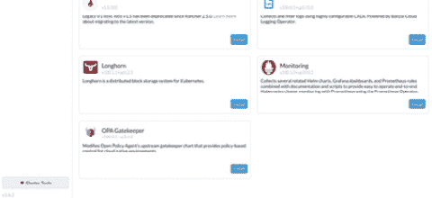
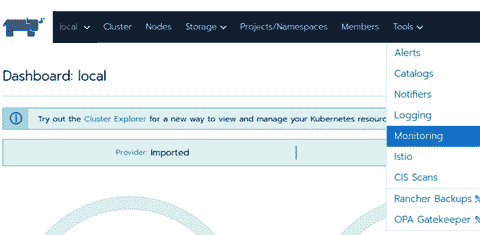

# 第十章：*第十章*：监控与日志

前面的章节介绍了集群配置、备份和恢复。本章将介绍 Rancher 监控，以及 Rancher 如何使用 Prometheus 和 Grafana 来收集集群的指标并进行展示。接下来，我们将讨论 Rancher 日志，以及 Rancher 如何使用 Banzai Cloud Logging 操作符和 Fluent Bit 来收集 Kubernetes 组件的日志和应用日志，包括日志过滤。

在本章中，我们将涵盖以下主要内容：

+   什么是 Prometheus 和 Grafana？

+   部署 Rancher 的监控栈

+   向 Prometheus 添加自定义应用指标

+   在 Prometheus 中创建告警规则

+   创建一个 Grafana 仪表盘

+   什么是 Banzai Cloud Logging 操作符？

+   什么是 Fluent Bit？

+   部署 Rancher 日志

+   过滤应用日志

+   将日志写入多个日志服务器

# 什么是 Prometheus 和 Grafana？

在本节中，我们将介绍 Kubernetes 集群最流行的监控解决方案。

**Prometheus** 是一个开源的监控和告警框架，Kubernetes 社区广泛采用它。Prometheus 最初由 SoundCloud 于 2012 年创建，后来被 **云原生计算基金会**（**CNCF**）接受，成为继 Kubernetes 之后的第二个孵化项目。Prometheus 从零开始构建，旨在与 Kubernetes 一起使用，核心思想是所有内容都应该通过 Kubernetes API 可发现。此时，Prometheus 会拉取指标并将它们存储为时间序列键值对。

当然，首先总是会有一个问题，*什么是指标？* 简单来说，指标是对某个资源的数值度量。例如，它可以是某个 Pod 当前的内存使用量，或者是当前数据库服务器的连接数。需要注意的是，Prometheus 只支持整数或浮点数作为指标的值。你不能将值设置为像 *up* 或 *down* 这样的词语。例如，如果你想检查某个任务是否成功或失败，你可能会将成功的状态输出为 `0`，将失败的状态输出为 `1`。

与度量指标相关的另一个核心问题是，它们应该是某一时刻的值。例如，你可能希望知道某一时刻的平均连接数。因此，你需要在 Pod 级别定义一个度量指标端点。新手常见的陷阱之一是将度量指标端点添加到服务记录中。这可能会更容易，但从长远来看并不推荐这样做，因为将来你可能会希望有不同的规则。例如，你一开始只想知道过去 5 分钟内的平均连接数，之后又想把时间范围改为 15 分钟。那么，你是改变当前度量指标的值，这可能会影响历史报告，还是添加一个新的度量指标，这样就意味着你在收集重复的数据呢？最佳的方法是将原始数据输出为度量指标，然后在 Prometheus 和 Grafana 中处理这些数据。

接下来的问题是，*Prometheus 是如何获取数据的？* 由于 Prometheus 使用的是`pull`模型而不是`push`模型，这通过运行一个 Web 服务器来实现，该服务器将度量指标作为简单的键值对文本输出。这通常在 Prometheus 中被称为导出器（exporter）。这些导出器可以直接嵌入到应用程序中，就像 Kubernetes 的核心组件大多数情况一样。例如，etcd 有一个内置的度量指标导出器，运行在不同的端口`2379`上。将度量指标运行在与主应用程序不同的端口上是常见的做法，因为 Prometheus 默认会尝试发起没有认证的`GET`请求。Prometheus 可以查询需要认证的端点，但设置令牌或凭证需要额外的工作和维护。因此，大多数用户会避免这种情况，并利用度量指标仅对集群内部公开而不对外部开放的事实，认为这就足够了的安全性。

当然，Prometheus 使用导出器来收集度量指标，因此就会出现关于有哪些导出器可用的问题。幸运的是，得益于开源社区，几乎所有标准应用程序都有相当多的第三方导出器。例如，几乎所有主要的开源数据库都有对应的导出器，如 MySQL、CouchDB、MongoDB、MSSQL、Oracle DB 和 PostgreSQL。你可以在 https://prometheus.io/docs/instrumenting/exporters/#databases 找到官方列表。标准的 Web 服务器，如 Apache 和 NGINX 也是如此，完整的列表可以在 https://prometheus.io/docs/instrumenting/exporters/#http 找到。当然，几乎所有 Kubernetes 原生应用程序，如 CoreDNS、Longhorn、Linkerd 和 OPA Gatekeeper，也都将 Prometheus 导出器直接嵌入到应用程序中。

对于应用开发人员，Go、Java/JVM、Python 和 Node.js 等语言有多个库可供使用，即使是自定义应用程序也可以内置支持 Prometheus。当然，如果您找不到适用于您的应用程序的现成导出程序，Prometheus 上游提供了出色的资源，帮助您编写导出程序，包括命名标准、示例代码以及处理用例的不同技术方面。所有这些内容都可以在 [`prometheus.io/docs/instrumenting/writing_exporters/`](https://prometheus.io/docs/instrumenting/writing_exporters/) 找到。

最后，Prometheus 新增的一个功能是告警。由于 Prometheus 已经在收集您的环境和应用数据，因此通过使用 AlertManager 将告警集成到 Prometheus 中是合乎逻辑的。其核心概念是，您定义一组查询，这些查询将在 Prometheus 服务器内部运行，如果条件被触发，将激活一个告警，并将告警发送到 AlertManager，后者会将告警转发到多个外部服务，如电子邮件、Slack 和 PagerDuty。在本章稍后的内容中，我们将介绍如何在 Prometheus 中创建告警，并提供一些示例。

Prometheus 缺少的一个主要功能是可视化数据的方法。这正是 Grafana 发挥作用的地方。Grafana 允许您可视化存储在 Prometheus 及其他数据源（如 MySQL、Loki 和 InfluxDB）中的数据。Grafana 的主要思想是，您创建一个仪表盘，它会查询一个数据源（在本例中为 Prometheus），然后使用这些数据来开发各种图表、图形、仪表等。需要注意的是，Grafana 不会存储任何数据，除了缓存查询结果外。Grafana 还支持从 Loki 和 Elasticsearch 等来源中探索日志。它还具有通知系统，可以基于查询触发告警，正如 Prometheus 所做的那样。这对于应用程序团队创建自定义告警非常有帮助。

# 部署 Rancher 的监控栈

使用 Rancher，监控有两个主要版本，v1 和 v2。最初的 v1 监控版本是与 Rancher 2.0 到 2.4 一起发布的，基于 Prometheus 和 Grafana。但由于 Rancher 服务器和 UI 管理监控栈的部署和配置，基本思路是将 Prometheus 部署到集群级别，并为每个 Rancher 项目额外部署 Prometheus 服务器。如果您的项目数量较少，并且不需要通过自动化进行控制，这种方法是可行的。最初，所有 Prometheus 服务器的配置都是通过更改 configmap 完成的。随着集群和应用的规模和复杂性增长，这种方法需要大量工作来管理监控设置。

随着 Prometheus 操作符的创建，一切发生了变化。核心思想是，Prometheus 操作符监控一组 **自定义资源定义** (**CRDs**)。这包括 Prometheus 服务器及其相关服务（如 node-exporter 和 Alertmanager）的描述。需要注意的是，v1 和 v2 监控都有内置的规则和仪表板，但最重要的是，探针、警报和其他相关的 Prometheus 设置的配置由 Prometheus 操作符处理，操作符会创建并更新 Prometheus 使用的配置文件。

在 2020 年 10 月，Rancher 2.5 从 v1 监控迁移到 v2，v2 是基于操作符模型构建的。需要注意的是，Prometheus 和 Grafana 都迁移到了这个新模型。这也包括 Rancher 使用标准的上游 Prometheus 和 Grafana 镜像，而非 Rancher 自定义的镜像。

如果你当前正在使用旧的 v1 监控，建议迁移到新的 v2 监控。官方过程可以在 [`rancher.com/docs/rancher/v2.5/en/monitoring-alerting/guides/migrating/`](https://rancher.com/docs/rancher/v2.5/en/monitoring-alerting/guides/migrating/) 中找到，但过程可以总结如下：

1.  你需要删除所有当前的设置和配置。

1.  然后，卸载旧的 Prometheus 服务器及其组件。

1.  此时，你可以安装 v2 监控并重新配置所有设置。

在安装 v2 之前，你必须确保 v1 监控的所有内容都已删除。幸运的是，Rancher 的一位工程师 Bastian Hofmann 创建了一个脚本，处理收集所有警报和仪表板并将它们迁移到 v2 的过程（[`github.com/bashofmann/rancher-monitoring-v1-to-v2`](https://github.com/bashofmann/rancher-monitoring-v1-to-v2)）。需要注意的是，这不是一个官方脚本，在开始此过程之前，你应该先备份 etcd。

要部署 v1 监控，请登录到 Rancher UI，进入 **工具** | **监控**，并点击 **启用** 按钮。此时，Rancher 服务器将负责部署 Prometheus 服务器和节点出口程序。然后，所有监控配置将通过 Rancher UI 完成。例如，如果你想查看某个 Pod 的 CPU 使用情况，你可以在 Rancher UI 中浏览到该 Pod，并且 Grafana 图表将直接显示在 UI 中。有关可以收集的工作负载指标的更多详细信息，请参见官方 Rancher 文档：[`rancher.com/docs/rancher/v2.0-v2.4/en/cluster-admin/tools/cluster-monitoring/cluster-metrics/`](https://rancher.com/docs/rancher/v2.0-v2.4/en/cluster-admin/tools/cluster-monitoring/cluster-metrics/)。

需要注意的是，集群监控仅供具有集群完全查看权限的用户使用。如果你希望将监控范围限定为单个项目，你需要启用项目监控，方法是进入项目并从 **工具** 菜单中选择 **监控**。这将导致 Rancher 服务器在项目内部署一个具有自己命名空间的 Prometheus 服务器。这个 Prometheus 服务器的作用范围仅限于该项目及其命名空间：



](img/B18053_10_01.jpg)

图 10.1 – Rancher 监控 v1

要部署监控 v2，你有几种不同的选择。第一种是进入 **集群资源管理器** | **集群工具**，然后点击 **监控** 旁边的 **安装**：



](img/B18053_10_02.jpg)

图 10.2 – Rancher 监控 v2

这将通过应用目录部署 Rancher 的监控 chart。这个 chart 只是对上游镜像的重新打包，没有代码更改。唯一的真正区别是使用 Rancher 的 Docker Hub 仓库来替代上游的镜像。同时，默认命名空间被设置为 `cattle-monitoring-system`，但如果需要，可以自定义该命名空间。由于监控 v2 是一个 Helm chart，你可以选择直接通过 `helm` 命令进行部署，这对于使用像 Rancher 的 Fleet 这样的工具来管理大规模集群非常有用。以下是一个示例命令：

```
helm repo add rancher-charts https://git.rancher.io/charts
```

```
helm repo update
```

```
helm upgrade –install -n cattle-monitoring-system rancher-monitoring rancher-charts/rancher-monitoring
```

你可以通过 `helm` 命令在 [`github.com/PacktPublishing/Rancher-Deep-Dive/tree/main/ch10/rancher-monitoring-v2`](https://github.com/PacktPublishing/Rancher-Deep-Dive/tree/main/ch10/rancher-monitoring-v2) 找到安装 Rancher 监控的完整命令和 `values.yaml` 文件。

第二种选择是部署上游的 Helm chart，通常称为`kube-prometheus-stack`：

```
helm repo add prometheus-community https://prometheus-community.github.io/helm-charts
```

```
helm repo update
```

```
helm upgrade –install -n monitoring monitoring prometheus-community/kube-prometheus-stack
```

需要注意的是，在写作时，这个 chart 仍处于测试阶段，并且可能会有所更改，并且 Rancher 并不支持上游 chart 中的所有版本。因此，建议查看 Rancher 的支持矩阵，网址为 [`www.suse.com/suse-rancher/support-matrix/all-supported-versions/`](https://www.suse.com/suse-rancher/support-matrix/all-supported-versions/)。你还可以通过查看 chart 值来找到完整的配置选项，网址为 https://github.com/prometheus-community/helm-charts/tree/main/charts/kube-prometheus-stack#configuration。

此时，你应该已经在集群上安装了 Prometheus 和 Grafana。需要注意的是，Prometheus 启动所需的所有 pod 和服务大约需要 5–10 分钟才能完全启动。还需要注意的是，在写本文时，Rancher 并不完全支持 Prometheus 联邦——也就是你可以拥有一个中央 Prometheus 服务器，扫描你其他集群中的所有 Prometheus 服务器。如果你想了解更多信息，我推荐查看官方文档[`prometheus.io/docs/prometheus/latest/federation/`](https://prometheus.io/docs/prometheus/latest/federation/)，但需要注意的是，这仍然是一个新特性，仍在发展中。

# 将自定义应用程序指标添加到 Prometheus

当然，现在你已经安装并使 Prometheus 和 Grafana 正常工作，接下来问题就变成了，*我们如何将应用程序的指标导入 Prometheus？* 在这一部分，我们将介绍两种主要的做法。

最简单的方法是使用社区创建的图表，比如 Bitnami 的 MariaDB 图表，并包含`metrics.enabled=true`选项。这个选项启用一个 sidecar，它将`mysqld-exporter`添加到部署中，许多社区创建的图表使用这种将导出器作为 sidecar 容器与主容器一起使用的模型。需要注意的是，你应该阅读 Helm 图表的文档，以查看启用指标时是否需要采取任何额外步骤，因为有些应用程序需要为导出器设置服务帐户或权限才能正常工作。

除了启用指标外，你还会看到一个带有`prometheus.io/scrape=true`和`prometheus.io/port=9000`键值对的注释部分。端口可能不同，但通常设置为这个范围内的某个值是标准做法。这两个注释非常重要，因为它们是 Prometheus 在发现所有应该被抓取的不同 pod 时使用的。

假设你正在使用一个定制的应用程序，并希望从这个应用程序捕获指标。以下是安装了指标导出器的不同应用程序的几个示例。

使用 GoLang 时，Prometheus 提供了一个官方库，位于[`github.com/prometheus/client_golang/`](https://github.com/prometheus/client_golang/)。这个库处理了生成度量输出时的大部分繁重工作。你可以在[`github.com/PacktPublishing/Rancher-Deep-Dive/tree/main/ch10/examples/go`](https://github.com/PacktPublishing/Rancher-Deep-Dive/tree/main/ch10/examples/go)找到示例 Go 应用程序和部署文件。你需要运行 `kubectl apply -f deploy.yaml` 命令来部署示例应用程序。如果你使用 curl 命令访问 pod 的 IP 地址并附带路径 `/metrics`，你会发现应用程序返回了不同度量的列表（例如，curl `10.42.7.23:8080/metrics`）。一旦应用程序启动并运行，你可以发送一个 `GET` 请求到 `/ping`，它将返回 `pong` 字样。然后，应用程序内部会增加一个名为 `ping_request_count` 的计数器，这是一个正在暴露的自定义度量。

这是度量输出的一个示例：

```
# HELP ping_request_count No of request handled by Ping handler
```

```
# TYPE ping_request_count counter
```

```
ping_request_count 4
```

```
….
```

```
# HELP promhttp_metric_handler_requests_in_flight Current number of scrapes being served.
```

```
# TYPE promhttp_metric_handler_requests_in_flight gauge
```

```
promhttp_metric_handler_requests_in_flight 1
```

```
# HELP promhttp_metric_handler_requests_total Total number of scrapes by HTTP status code.
```

```
# TYPE promhttp_metric_handler_requests_total counter
```

```
promhttp_metric_handler_requests_total{code="200"} 2
```

```
promhttp_metric_handler_requests_total{code="500"} 0
```

```
promhttp_metric_handler_requests_total{code="503"} 0
```

完整的输出可以在[`github.com/PacktPublishing/Rancher-Deep-Dive/blob/main/ch10/examples/go/output.txt`](https://github.com/PacktPublishing/Rancher-Deep-Dive/blob/main/ch10/examples/go/output.txt)找到。

使用 Apache2 时，我们需要使用 sidecar 选项将导出器添加到部署中。在我们的示例中，我们将使用一个流行的第三方导出器，叫做`apache_exporter`。你可以在[`github.com/Lusitaniae/apache_exporter`](https://github.com/Lusitaniae/apache_exporter)了解更多关于这个项目的信息。这个项目的基本思路是充当 Apache `mod_status` 模块与 Prometheus 之间的翻译层。我们需要在示例部署中的主 Web 服务器容器上安装/启用 `mod_status` 模块。然后，我们需要将 `server-status` 页面暴露给托管导出器的 sidecar 容器。你可以在[`github.com/PacktPublishing/Rancher-Deep-Dive/tree/main/ch10/examples/apache`](https://github.com/PacktPublishing/Rancher-Deep-Dive/tree/main/ch10/examples/apache)找到示例和部署文件。你需要运行 `kubectl apply -f deploy.yaml` 命令来部署示例应用程序。

这是度量输出的一个示例：

```
# HELP apache_accesses_total Current total apache accesses (*)
```

```
# TYPE apache_accesses_total counter
```

```
apache_accesses_total 6
```

```
# HELP apache_connections Apache connection statuses
```

```
# TYPE apache_connections gauge
```

```
apache_connections{state="closing"} 0
```

```
apache_connections{state="keepalive"} 0
```

```
apache_connections{state="total"} 1
```

```
apache_connections{state="writing"} 0
```

```
# HELP apache_cpu_time_ms_total Apache CPU time
```

```
# TYPE apache_cpu_time_ms_total counter
```

```
apache_cpu_time_ms_total{type="system"} 30
```

```
apache_cpu_time_ms_total{type="user"} 0
```

```
# HELP apache_cpuload The current percentage CPU used by each worker and in total by all workers combined (*)
```

```
# TYPE apache_cpuload gauge
```

```
apache_cpuload
```

完整的输出可以在[`github.com/PacktPublishing/Rancher-Deep-Dive/blob/main/ch10/examples/apache/output.txt`](https://github.com/PacktPublishing/Rancher-Deep-Dive/blob/main/ch10/examples/apache/output.txt)找到。

使用 NGINX 时，我们将采用与使用 Apache 时类似的过程，但这次我们将使用 NGINX 提供的导出器。你可以在[`github.com/PacktPublishing/Rancher-Deep-Dive/tree/main/ch10/examples/nginx`](https://github.com/PacktPublishing/Rancher-Deep-Dive/tree/main/ch10/examples/nginx)找到示例和部署文件。你只需运行 `kubectl apply -f deploy.yaml` 命令。

这是度量输出的一个示例：

```
# HELP nginx_connections_accepted Accepted client connections
```

```
# TYPE nginx_connections_accepted counter
```

```
nginx_connections_accepted 1
```

```
# HELP nginx_connections_active Active client connections
```

```
# TYPE nginx_connections_active gauge
```

```
nginx_connections_active 1
```

```
# HELP nginx_connections_handled Handled client connections
```

```
# TYPE nginx_connections_handled counter
```

```
nginx_connections_handled 1
```

```
# HELP nginx_connections_reading Connections where NGINX is reading the request header
```

```
# TYPE nginx_connections_reading gauge
```

```
nginx_connections_reading 0
```

```
# HELP nginx_connections_waiting Idle client connections
```

```
# TYPE nginx_connections_waiting gauge
```

```
nginx_connections_waiting 0
```

```
# HELP nginx_connections_writing Connections where NGINX is writing the response back to the client
```

```
# TYPE nginx_connections_writing gauge
```

```
nginx_connections_writing 1
```

```
# HELP nginx_http_requests_total Total http requests
```

```
# TYPE nginx_http_requests_total counter
```

```
nginx_http_requests_total 9
```

```
# HELP nginx_up Status of the last metric scrape
```

```
# TYPE nginx_up gauge
```

```
nginx_up 1
```

完整的输出可以在 [`github.com/PacktPublishing/Rancher-Deep-Dive/blob/main/ch10/examples/nginx/output.txt.`](https://github.com/PacktPublishing/Rancher-Deep-Dive/blob/main/ch10/examples/nginx/output.txt.) 找到。

到目前为止，我们可以监控不同应用程序的指标，但我们还缺少根据这些指标创建告警的能力。在接下来的部分，我们将深入探讨 Prometheus 的告警规则。

# 在 Prometheus 中创建告警规则

Prometheus 运算符通过 CRD PrometheusRule 定义告警规则。从本质上讲，告警只是一个带有触发器的表达式。让我们看一下下面的示例告警。这个告警来自 Longhorn，我们将在下一章中讨论。正如你所看到的，表达式由 `expr` 字段表示，它包含一个公式，将卷的实际大小除以容量并转换为百分比。然后，如果该值大于 90%，表达式为 `true`，就会触发告警。`description` 部分主要是面向最终用户的。值得注意的是，你可以在描述中使用变量，因为告警将包含与摘要相同的解释，通常用于主题行。例如，当发送邮件告警时，邮件的主题将设置为告警的主题，而邮件正文则是描述内容。

这是一个告警的示例：

```
apiVersion: monitoring.coreos.com/v1
```

```
kind: PrometheusRule
```

```
metadata:
```

```
  labels:
```

```
    prometheus: longhorn
```

```
    role: alert-rules
```

```
  name: prometheus-longhorn-rules
```

```
  namespace: monitoring
```

```
spec:
```

```
  groups:
```

```
  - name: longhorn.rules
```

```
    rules:
```

```
    - alert: LonghornVolumeActualSpaceUsedWarning
```

```
      annotations:
```

```
        description: The actual space used by Longhorn volume {{$labels.volume}} on {{$labels.node}} is at {{$value}}% capacity for
```

```
          more than 5 minutes.
```

```
        summary: The actual used space of Longhorn volume is over 90% of the capacity.
```

```
      expr: (longhorn_volume_actual_size_bytes / longhorn_volume_capacity_bytes) * 100 > 90
```

```
      for: 5m
```

```
      labels:
```

```
        issue: The actual used space of Longhorn volume {{$labels.volume}} on {{$labels.node}} is high.
```

```
        severity: warning
```

需要注意的是，默认情况下 Prometheus 只会查找与服务器位于同一命名空间中的规则。这可能会导致问题，因为应用团队可能需要访问该命名空间以添加/编辑/删除他们的告警。为了解决这个问题，你需要在 `values.yaml` 文件中添加以下设置。

这是 `values.yaml` 的示例：

```
  prometheusSpec:
```

```
    podMonitorNamespaceSelector: {}
```

```
    serviceMonitorNamespaceSelector: {}
```

```
    ruleNamespaceSelector: {}
```

到目前为止，我们已经启动了 Prometheus，并且它正在收集集群的所有数据，但内置的 UI 并没有提供一个有用的方式来可视化这些数据。在接下来的部分，我们将深入探讨 Grafana，以便为我们的数据创建仪表板。

# 创建 Grafana 仪表板

到目前为止，我们应该已经启动了 Prometheus 和 Grafana，服务器正在收集有关集群的所有数据。然而，除非你使用 Rancher 的监控图表，否则大部分数据是不可见的，这些图表包括一些预构建的仪表板，主要与集群及其核心服务（如 etcd、kube-apiserver 和 CoreDNS）相关。当然，问题也随之而来：*我如何创建自己的仪表板？*

最直接的答案是找到预制仪表板，并让其他人为您完成所有繁重的工作。Grafana Labs 仪表板存储库是最全面的资源，位于[`grafana.com/grafana/dashboards/`](https://grafana.com/grafana/dashboards/)。它们的搜索工具允许您按应用程序、数据源等筛选结果。但最酷的部分是它们的仪表板 ID 系统。官方网站上的所有仪表板都有一个 ID 号码，例如 NGINX Ingress 控制器仪表板的 ID 是`9614`，要使用此仪表板，您只需复制该 ID 号码并转到 Grafana UI。浏览到`admin/prom-operator`，然后粘贴 ID 号码，完成。

当然，Rancher 监控提供了一些示例仪表板，捆绑在 rancher-monitoring 图表中。您可以在[`github.com/rancher/system-charts/tree/dev-v2.6/charts/rancher-monitoring/v0.3.1/charts/grafana/dashboards`](https://github.com/rancher/system-charts/tree/dev-v2.6/charts/rancher-monitoring/v0.3.1/charts/grafana/dashboards)找到原始 JSON 文件。此外，您还可以通过 ID 添加基础仪表板，其中一些最重要的仪表板包括组件和 etcd 仪表板，可用于深入了解集群性能问题。

但假设您要部署的应用程序是社区创建的，而官方网站上没有仪表板。大多数存储库将仪表板定义为 JSON 文件。您可以将其复制并粘贴到 UI 中，并使用此文件导入它。但是假设您要部署的是自定义内部应用程序，并希望从零开始。我建议观看[`grafana.com/go/webinar/guide-to-dashboard-design/`](https://grafana.com/go/webinar/guide-to-dashboard-design/)的《Getting started with Grafana dashboard design》视频。我使用了很多社区创建的仪表板，并根据需要进行调整。您可以在顶部单击共享按钮，并将仪表板导出为 JSON 文件，然后复制和粘贴您喜欢的部分。在更改仪表板时，通过单击右上角的保存图标保存您的工作非常重要。如果关闭页面而未单击该图标，则所有更改将丢失。

到目前为止，在本章中，我们一直在讨论监控和警报。在接下来的部分中，我们将转变关注点，专注于等式的另一半，即日志记录。

# 什么是 Banzai Cloud Logging 操作员？

随着 Rancher 2.5 迁移到监控 v2，Rancher 也因大致相同的原因迁移到了日志记录 v2。在 v1 中，日志记录是基于 Fluentd 构建的，并使用插件将日志发送到不同的日志服务，如 Elasticsearch、Splunk、Kafka 和 Syslog。在 v1 中，Rancher 服务器完全控制日志部署，这使得定制和调整日志解决方案变得复杂。大多数设置是硬编码在 Rancher 中的。这就是 Banzai 的 Logging 操作符进入的地方。

Logging 操作符使用与 Prometheus 操作符相同的 CRD 模型，在该模型中，你通过 CRD 定义 Fluent Bit 的部署及其设置。操作符会接管推送你的更改。因为一切都是 CRD，包括设置，你可以让应用程序团队定义他们的日志设置。例如，一个团队可能希望将他们的日志发送到云日志服务，如 Splunk，而另一个团队可能有法律要求必须保持所有日志在 RKE 或其他托管在本地的 K8s 集群上运行，你可以通过 Logging 操作符做到这一点。其理念是，你有一组应用程序 Pod 流，它们将日志发送到一个输出，输出可以是任何数量的日志服务器/服务。

# 什么是 Fluent Bit 和 Fluentd？

在谈到日志记录时，两个问题是，*什么是 Fluent Bit？* 和 *什么是 Fluentd？*

在深入 Fluent Bit 之前，我们先来谈谈先出现的 Fluentd。Fluentd 是一个开源项目，由 Treasure Data 团队于 2011 年使用 Ruby 编写。它的核心思想是所有日志都应该是 JSON 对象。使用 Fluentd 和 Docker 时，收集容器日志的基本过程是使用默认的 Docker 日志驱动程序，将容器日志写入磁盘上的文件。然后，Fluentd 将读取整个日志文件并将事件转发到服务器，此时 Fluentd 将打开一个尾文件处理程序，保持日志文件打开并读取所有写入的内容。

需要注意的是，Fluentd 有一个处理日志轮换的流程，因此建议在 Docker Engine 中启用日志轮换。以下是一个配置示例。你可以在[`docs.docker.com/config/containers/logging/configure/`](https://docs.docker.com/config/containers/logging/configure/)找到完整的文档。Docker 会等到`logs`文件达到 100 MB 后再进行轮换，如以下示例所示。这么做是为了防止丢失生成大量事件的应用程序的事件。Fluentd 需要在轮换前读取所有事件并将其转发到日志服务器。

在以下示例中，我们正在定义`json-file`日志驱动程序的日志选项，该驱动程序是 Docker Engine 默认内置的。

这里是`/etc/docker/daemon.json`的一个示例：

```
{
```

```
  "log-driver": "json-file",
```

```
  "log-opts": {
```

```
    "max-size": "100m",
```

```
    "max-file": "3"
```

```
  }
```

```
}
```

在这种情况下，我们允许所有容器的日志文件在达到最大 100 MB 大小时才开始轮换文件。然后，我们将只保留最后三个轮换的文件。

现在，让我们来了解 Fluent Bit。Fluentd 本质上是一个设计简洁、快速且轻量级的工具，而 Fluent Bit 是建立在 Fluentd 基础之上的，旨在提供 Banzai 日志所需的额外过滤和路由功能。你可以在 [`docs.fluentbit.io/manual/about/fluentd-and-fluent-bit`](https://docs.fluentbit.io/manual/about/fluentd-and-fluent-bit) 了解更多关于两者之间差异的信息。

# 部署 Rancher 日志

使用 Rancher 日志时，建议通过 Rancher UI 中的“应用程序和市场”进行部署，方法是进入 `cattle-logging-system` 命名空间。需要注意的是，安装完成后，你将在**已安装**部分看到两个应用程序，分别是 `rancher-logging` 和 `rancher-logging-crd`。另外，根据集群的大小，所有 pod 启动并进入*准备就绪*状态可能需要 5 到 15 分钟。一旦 Rancher 日志安装完成，我们将能够配置过滤和日志流，接下来的两节内容将详细介绍这一点。

由于日志 v2 是一个 Helm 图表，你可以选择通过 `helm` 命令直接部署它，这在使用 Rancher 的 Fleet 等工具管理大规模集群时非常有用。以下是一个示例命令：

```
helm repo add rancher-charts https://git.rancher.io/charts
```

```
helm repo update
```

```
helm upgrade –install -n cattle-logging-system rancher-logging rancher-charts/rancher-logging
```

你可以在 [`github.com/PacktPublishing/Rancher-Deep-Dive/tree/main/ch10/rancher-logging-v2`](https://github.com/PacktPublishing/Rancher-Deep-Dive/tree/main/ch10/rancher-logging-v2) 找到通过 `helm` 命令安装 Rancher 监控所需的完整命令和 `values.yaml` 文件。

# 过滤应用程序日志

大多数人配置 Rancher 日志时的第一个设置是 **ClusterFlows** 和 **ClusterOutput**。ClusterFlow 设计为作用于所有命名空间，并可以为整个集群设置默认日志策略。要配置此设置，您需要进入 Rancher UI，浏览到**日志**，然后选择**ClusterFlows**。接下来，您需要填写表单。完成后，您将定义 ClusterOutput，在这里定义日志的目标位置，如 ElasticSearch、Splunk、Syslog 等。关于不同日志提供程序的示例，请参见 Rancher 官方文档：[`rancher.com/docs/rancher/v2.5/en/logging/custom-resource-config/outputs/`](https://rancher.com/docs/rancher/v2.5/en/logging/custom-resource-config/outputs/)。

一旦你配置了 ClusterFlows 和 ClusterOutput，就可以认为设置完成了。但是，如果你想为一个应用程序定制日志记录，你需要重复这个过程。不过这一次，你将配置 Flows 和 Outputs，主要的区别是设置选择器规则，或者文档中所称的 `include` 或 `exclude` 标签，你可以使用这些标签来限制 Flows 和 Outputs 的范围。以下是一个 NGINX 应用程序在默认命名空间中的 YAML 示例。需要注意的是，Flows 是命名空间范围的：

这是一个 Flow 示例：

```
apiVersion: logging.banzaicloud.io/v1beta1
```

```
kind: Flow
```

```
metadata:
```

```
  name: flow-sample
```

```
  namespace: default
```

```
spec:
```

```
  filters:
```

```
    - parser:
```

```
        remove_key_name_field: true
```

```
        parse:
```

```
          type: nginx
```

```
    - tag_normaliser:
```

```
        format: ${namespace_name}.${pod_name}.${container_name}
```

```
  localOutputRefs:
```

```
    - s3-output
```

```
  match:
```

```
    - select:
```

```
        labels:
```

```
          app: nginx
```

到目前为止，我们应该已经在集群中配置了日志记录并将日志转发到日志服务器。在下一节中，我们将介绍一些更高级的设置，许多用户在他们的环境中使用这种设置来将日志记录到多个服务器。

# 向多个日志服务器写入日志

因为你可以定义任意数量的输出，比如如果你想将日志发送到多个日志服务器，例如发送到本地的 Syslog 和 Splunk 服务器。需要特别注意的是，这会导致日志重复，因此不推荐这样做，因为 `failed to send` 的日志可能会导致内存压力问题，尤其是在日志服务器配置错误或日志服务器长时间离线的情况下。

你可以在 Rancher 官方文档中找到 YAML 示例，文档地址为 [`rancher.com/docs/rancher/v2.6/en/logging/custom-resource-config/outputs/`](https://rancher.com/docs/rancher/v2.6/en/logging/custom-resource-config/outputs/)。需要注意的是，截至 Rancher 2.6.3，Rancher UI 中的日志设置仍然存在一些问题（例如，[`github.com/rancher/rancher/issues/36516`](https://github.com/rancher/rancher/issues/36516)，其中 **ClusterOutput** 字段未能在 UI 中更新），因此建议尽可能使用 YAML 文件。

# 总结

在本章中，我们了解了 Rancher 的监控和日志记录。这包括了 Prometheus、Grafana、Fluentd 和 Fluent Bit 的工作原理。我们学习了如何安装 Rancher 监控和日志记录。最后，我们详细介绍了一些示例仪表板，并通过讨论定制应用程序日志记录及其流结束了本章内容。

下一章将介绍 Rancher 的存储项目，以为 Kubernetes 集群提供存储。
