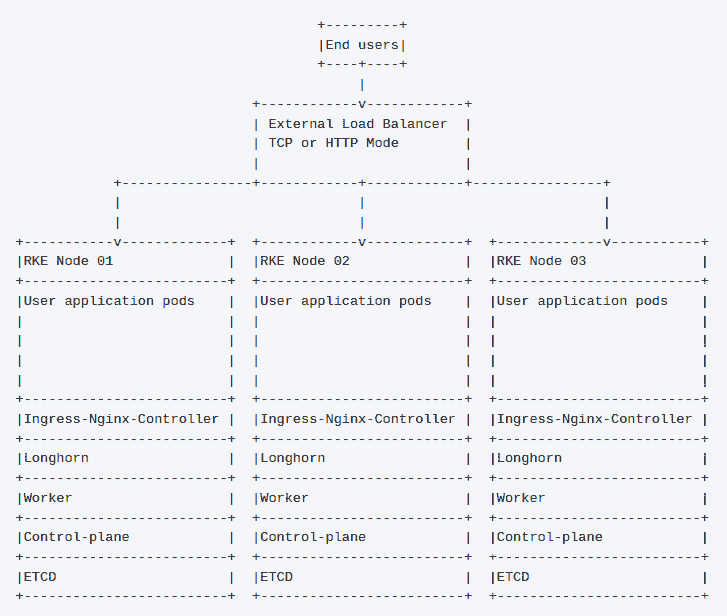
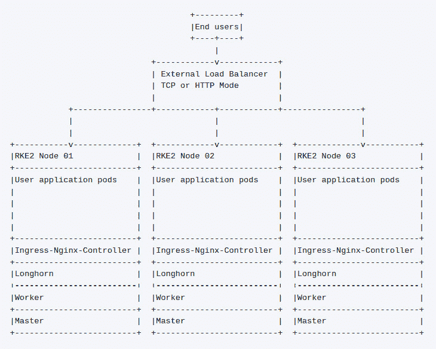
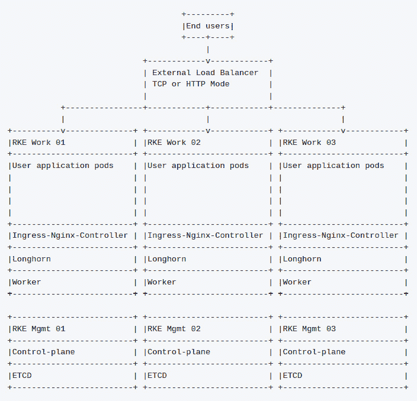
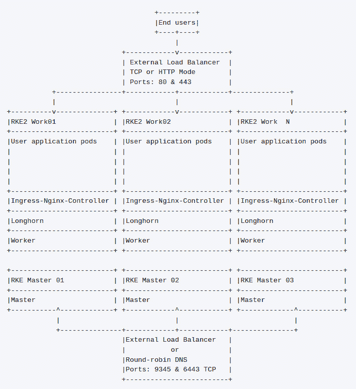
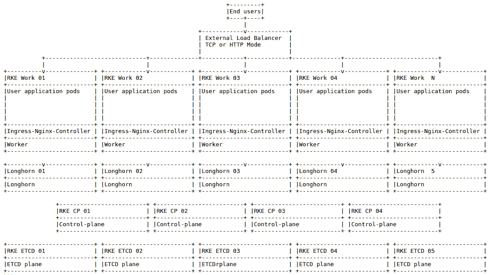
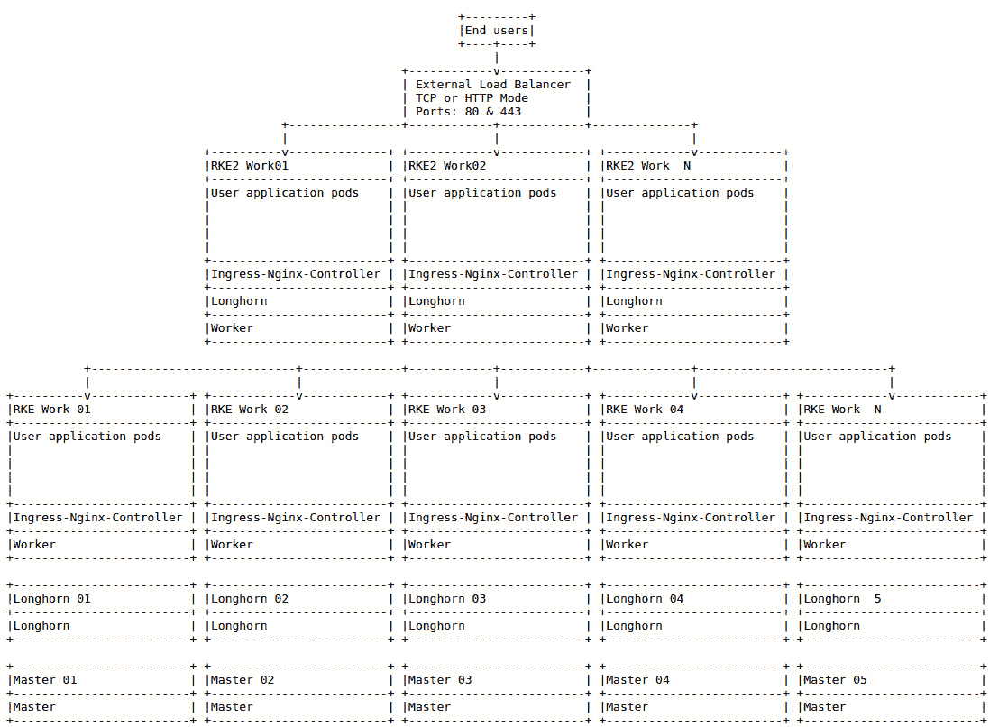

# *第十一章*：使用 Longhorn 将存储引入 Kubernetes

之前的章节已经涵盖了监控和日志记录。本章将介绍 Rancher 的分布式块存储解决方案 **Longhorn**，包括其优缺点，以及如何使用 Longhorn 架构存储解决方案。接着，我们将深入探讨 RKE 和 RKE2 集群的标准设计。然后，我们将介绍安装 Longhorn 的不同方法以及如何进行升级。最后，我们将总结一些维护任务和常见问题的故障排除步骤。

本章将涵盖以下主要内容：

+   什么是持久存储，我们为什么需要它在 Kubernetes 中？

+   什么是 Longhorn？

+   Longhorn 是如何工作的？

+   Longhorn 的优缺点

+   架构 Longhorn 解决方案的规则

+   安装 Longhorn

+   Longhorn 升级是如何工作的？

+   保持 Longhorn 100% 的关键维护任务

+   常见 Longhorn 问题的故障排除

# 什么是持久存储，我们为什么需要它在 Kubernetes 中？

在创建 Kubernetes 集群后，用户将开始向集群中部署应用程序，但总是会出现这样的问题，*我的数据在哪里？* 或者 *我该把数据存储在哪里？* 哲学性的回答是，*你不应该存储任何数据；所有容器都应该是无状态的，*但这毕竟是现实世界。一些应用程序需要存储持久化的数据；也就是说，当 Pod 被终止时，数据将可供替换 Pod 使用。例如，假设你部署了一个 MySQL 数据库作为 Pod。你很可能希望该数据是持久化的，这样当节点重启或者部署更新时，你就不会丢失所有的数据。

自从容器被创建以来，持久数据的问题就一直存在。Docker 解决这个问题的第一个*方法*是通过添加来自早期操作系统级虚拟化软件的绑定挂载，例如 2000 年时 FreeBSD 中的 jail。绑定挂载作为目录树的替代视图，挂载会在根目录树中创建一个存储设备的视图作为目录对象。而绑定挂载则是将现有的目录树复制到另一个位置。对于容器来说，你有一个根文件系统，该文件系统是为了与主机文件系统隔离而创建的。例如，在容器内，你会看到文件系统看起来像正常的 Linux 服务器，包含二进制文件和库文件等，但你会注意到根文件系统并不是与主机文件的根文件系统相同的目录。

假设你在主机上有一个目录 `/mnt/data`（例如），你想将其作为 `/data` 传递到容器中。在 Linux 上，Docker 提供绑定挂载作为内核特性。因此，你可以运行类似 `docker run -v /mnt/data:/data Image:Tag` 的命令，关键标志是 `-v`，这在容器创建过程中告诉 Docker 进行等效的系统调用，就像 `mount –bind /mnt/data /var/lib/docker/…/data` 命令一样。重要的是要注意，在旧版本的 *3.x* 内核中，绑定挂载是无法区分的。这意味着诸如 **df**（磁盘空间使用情况查询）之类的工具将看到与原始设备细节相同的内容。

例如，如果你从 `nfs.example.com` 服务器上绑定挂载 `/mnt/nfs` 到 `/data`，当你在容器内运行 `df` 命令时，你会看到 `nfs.example.com` 服务器上的 NFS 文件系统被挂载到 `/data`。

在本节中，我们已经了解了持久化存储是什么，以及在 Kubernetes 中为什么需要它。接下来，我们将深入了解 Longhorn，它的工作原理以及如何满足我们的存储需求。

# 什么是 Longhorn？

Longhorn 是一个为 Kubernetes 集群提供分布式块存储系统的解决方案。Longhorn 就像 Rancher 一样，因为它是免费的、开源的，甚至作为一个孵化项目开发，支持 `ReadWriteOnce` 和 `ReadWriteMany` 卷。Longhorn 为其卷提供了备份解决方案，并提供跨集群卷的灾难恢复功能。

但是，关于 Longhorn 最显著的一点是它简化了分布式块存储。Longhorn 通过构建为微服务应用程序来实现这一点。传统的大型存储子系统是大块存储，带有少量控制器，应用数据从共享磁盘池进行配置。Longhorn 扭转了这一过程的思路，每个卷都有专用的存储控制器，形成其微服务。这就是所谓的 **Longhorn Engine**，将在 *Longhorn 如何工作？* 部分介绍。

另一个人们喜欢 Longhorn 的主要原因是它将存储集成到 Kubernetes 中。大多数其他外部存储提供商，如 NFS 或云提供的存储，都需要存储团队进行大量的配置和管理工作。而这也引出了 Longhorn 的另一个重要卖点：你不再依赖云提供商的块存储。例如，在 **亚马逊 Web 服务** (**AWS**) 中，你可能会使用亚马逊的 **弹性块存储** (**EBS**) 或 **弹性文件系统** (**EFS**) 存储提供程序，它们通过 AWS 的 API 连接，创建 EBS 卷并将其附加到节点上，这很棒，直到你遇到 **小型计算机系统接口** (**SCSI**) 设备限制，或者在将 EBS 卷迁移到不同区域时遇到限制。当然，既然是亚马逊，你还需要提供备份解决方案。Longhorn 解决了所有这些限制，因为它不在乎你是否在数据中心的物理服务器上运行 Longhorn，或者在云端的虚拟机上运行。

当然，由于 Longhorn 是一种分布式块存储解决方案，它的一个重要优势是可以在磁盘和主机之间复制数据。对于传统的大型存储子系统，你需要定义 **独立磁盘冗余阵列** (**RAID**) 组，规划 **逻辑单元号** (**LUN**) 并提前做出这些需要锁定的决策。相比之下，Longhorn 可以在每个磁盘上呈现为单一文件系统，不需要 RAID，并且通过基于节点的复制来保护你的数据。同时，你可以随时更改存储布局，轻松地调整数据，而应用程序无需知道或关心这些变化。

这将引出 Longhorn 的 **高可用性** (**HA**) 有何不同。对于传统的大型存储子系统，你通常会有一对存储控制器，它们以主动/待机或非活动状态运行，直到发生控制器故障，或者你需要将一个控制器下线进行维护。此时，如果另一个控制器出现问题或无法承载负载，你就没有冗余了。一个简单的软件升级就可能导致整个环境崩溃。作为一名曾经做过企业存储管理员的人，存储升级总是需要提前安排，获得所有批准，然后在周六晚上人少的时段才能进行升级。Longhorn 让这些日子成为过去，因为升级只需推出一个新的容器镜像，并缓慢地滚动到环境中。我们将在 *Longhorn 升级是如何工作的？* 章节中详细介绍这一点。

现在我们已经了解了 Longhorn 的概念，在接下来的部分，我们将深入探讨 Longhorn 的工作原理，包括其中的各个组件。

# Longhorn 是如何工作的？

Longhorn 可以分为两个层次：**控制平面**和**数据平面**，其中 Longhorn 管理器位于控制平面，存储引擎位于数据平面。

控制面是由一组称为 **Longhorn Manager** 的 pod 构建的。这是一个 DaemonSet，运行在集群中的所有节点上。它的主要任务是处理集群中卷的创建和管理。这些 pod 还会接收来自 Longhorn UI 和卷插件的 API 调用。当然，Longhorn 遵循与 Rancher 相同的操作员模型，使用由 Longhorn Manager 部署的 **CustomResourceDefinitions** (**CRDs**)。然后，Longhorn Manager 连接到 Kubernetes API 服务器并监视卷任务，例如创建新卷。需要记住的是，Kubernetes 并不会主动访问 Longhorn 的 API，而是等待 Longhorn 控制器检测 CRD 对象规范的变化。

除了监视 Kubernetes API，Longhorn 管理器还负责处理 Longhorn pod 上的调度工作。这包括运行在集群中每个节点上的 Longhorn Engine pod。Engine pod 将控制面与数据面连接在一起，负责创建副本并将存储呈现给 pod。

如果我们跟踪一个卷的创建过程，首先，用户在集群中创建了一个 `node01`。当 engine 获取到一个卷后，它会创建一组副本，每个副本会被分配到一个节点及该节点上的一个磁盘/文件系统。默认情况下有三个副本，但你可以选择将副本数量设置为任何你喜欢的数字，甚至只设置一个副本。需要特别注意的是，副本只是文件系统上的一个磁盘映像文件。然而，当 Longhorn engine 创建该文件时，它使用了名为 **fallocate** 的 Linux 系统命令，该命令创建了一个与卷大小相同的空文件，但并没有实际分配文件系统中的空间。这意味着你可以在一个节点上创建一个 1TB 的副本，但除了少量元数据外，节点上并没有使用任何空间，直到你开始写入数据为止；也就是说，如果你向一个 1TB 的卷写入了 500 GB 数据，你只会在节点上使用 500 GB 的空间。

你必须理解，一旦分配了一个块，它将在整个卷的生命周期内被消耗。如果你将一个 500 GB 的文件写入卷并删除它，你仍然会在文件系统中消耗 500 GB。现在有一个开放的功能请求，旨在支持所谓的**修剪**或打孔功能，以便能够回收已删除的空间。在写这本书时，这个功能还没有分配到任何发布版本，并且仍在规划阶段。你可以在 [`github.com/longhorn/longhorn/issues/836`](https://github.com/longhorn/longhorn/issues/836) 找到这个功能请求。还需要注意的是，Longhorn 需要存储磁盘上的 Fallocate，而目前只有**第四扩展文件系统**（**Ext4**）和**扩展文件系统**（**XFS**）提供此功能。其他文件系统，如**Zettabyte 文件系统**（**ZFS**），正在添加 Fallocate 支持，但仍缺少文件映射（filemap），这是 Longhorn 用来检测文件中孔洞的功能。如果你想了解更多有关此问题的信息，请参阅*OpenZFS* GitHub 问题 [`github.com/openzfs/zfs/pull/10408`](https://github.com/openzfs/zfs/pull/10408)，了解该功能的当前状态，因为它仍在积极开发中。

当然，副本的创建默认发生在总共三个节点上，每个副本都是数据的完整副本。需要注意的是，每个副本在 Longhorn 引擎内都有自己的 Linux 进程。此外，没有副本是唯一的，因为所有的读取和写入都可以发送到任何副本。这是因为 Longhorn 使用一种过程，所有的写入都会发送到所有副本，且在所有副本确认写入之前，客户端（在此情况下是 pod）不会收到写入确认。如果某个副本在写入过程中超时，Longhorn 会假设卷丢失并丢弃该副本，这将触发重建。这是因为 Longhorn 没有事务日志，所以 Longhorn 引擎无法知道哪个副本缺失了写入数据。

有一种特殊情况，如果 pod 位于与其副本相同的节点上，那么该副本将优先处理所有读取请求。这是通过设置数据本地化来实现的，它会尽量保持本地副本与 pod 位于同一节点上。需要注意的是，Longhorn 调度默认采用最佳努力原则，这意味着如果可能，它会将副本放置在同一节点上，但这并非总是可行。这通常是因为 pod 被分配到一个没有足够空间、磁盘标签不兼容，或者该节点没有被分配为存储节点的节点上。

现在我们为卷创建了所有副本，需要将其暴露给 pod 以供使用。这是通过 Longhorn 引擎创建一个`open-iscsi`包来作为 iSCSI 发起器来完成的，然后将 iSCSI 设备作为设备附加到`/dev/longhorn/pvc-###`下。然后，Longhorn 使用 CSI 插件获取块设备，格式化并将其挂载到节点上，kubelet 将在 pod 内执行绑定挂载。

除块存储外，自 Longhorn v1.1.0（于 2021 年 1 月发布）起，Longhorn 还支持导出**ReadWriteMany**（RWX）卷。这些卷建立在块存储之上，Longhorn 创建一个共享管理器 pod，挂载块设备并作为 pod 内运行的 NFS 服务器。然后，此 pod 将卷导出为 NFS 到集群。最后，Longhorn 使用其 CSI 插件将 NFS 共享挂载并绑定挂载到 pod 中。

现在我们了解了 Longhorn 的工作原理，我们将在下一节中涵盖其优缺点，包括与其他存储提供商的比较，我们将在本章后面讨论。

# Longhorn 的优缺点

现在让我们看看现在的优缺点。

**优点**如下：

+   内置备份解决方案。Longhorn 支持为运行备份和外部备份到 S3 或 NFS 目标的快照。

+   支持跨集群灾难恢复卷，可以在一个集群上备份并在另一个集群上恢复。

+   随着 v1.1.1 的发布，Longhorn 现在支持使用系统快照从现有数据重建副本。您可以在[`github.com/longhorn/longhorn/issues/1304`](https://github.com/longhorn/longhorn/issues/1304)了解更多信息。

+   可扩展性。由于 Longhorn 是一个微服务应用程序，可以从三个节点扩展到数万个节点。

+   使用相同存储类支持 RWO 和 RWX 卷；唯一需要更改的是为卷设置访问模式。

+   基础设施/云提供商无关，这意味着您可以在物理服务器、VMware、AWS 和 GCP 上部署 Longhorn，所有这些都使用标准化的存储平台，使您可以根据需要移动卷。

+   默认情况下是薄配置的。与大多数云提供商（如 AWS EBS 和 GCP 卷）不同，即使从未向其写入数据块，您也需要支付卷的大小。使用 Longhorn，您可以超额配置您的云存储并节省一些成本。

+   Longhorn 调度具有区域/区域感知性，这意味着您可以定义容错域，例如跨 AWS 可用性区域（例如，us-west-2a、us-west-2b 和 us-west-2c），使用 Longhorn 复制卷，以便在 AWS 中丢失整个区域而不会丢失任何数据。您可以在 https://longhorn.io/docs/1.2.3/volumes-and-nodes/scheduling/#scheduling-policy 了解更多信息。

**缺点**如下：

+   在创建或删除新 pod 时，卷卡在附加和分离状态的情况是 Longhorn 中非常常见的问题，因为它无法确定卷是否已经正确挂载到节点上。

+   Longhorn 对大容量卷的官方支持，因为 Longhorn 具有硬编码的重建限制，最长为 24 小时。虽然没有硬编码的大小限制，但一般来说，卷的最大大小是 1~2 TB。

+   网络使用量较大，因为所有数据都需要写入所有副本。假设你从一个 pod 向 Longhorn 卷写入 50 MBps 数据，那么你可能会在节点之间产生高达 150 MBps 的网络流量。因此，建议节点之间使用 10 GB 的网络连接。

+   磁盘延迟可能会导致卷/副本超时，因为 Longhorn 使用远程确认。卷的写入速度仅能达到最慢副本的速度。因此，强烈建议使用 SSD 或一级存储来部署 Longhorn。

+   如果你在 VMware 上使用共享存储子系统或 vSAN 部署 Longhorn，嵌套存储虚拟化可能会导致浪费。Longhorn 会在你的数据存储上存储三份数据，因此 1 TB 的数据将变为 3 TB。

    注意

    如果你的存储子系统支持数据去重，建议启用该功能，以便 Longhorn 存储节点能够绕过此问题。

此时，你应该已经了解了 Longhorn 的优缺点。我们将在下一节中利用这些优缺点来设计我们的 Longhorn 解决方案。

# 架构 Longhorn 解决方案的规则

在本节中，我们将介绍一些标准设计及其优缺点。需要注意的是，每个环境都是独特的，可能需要根据最佳性能和体验进行调优。同时还需要注意，所有的 CPU、内存和存储大小都是推荐的起始点，具体大小可能需要根据你的工作负载和部署过程进行调整。

在设计解决方案之前，你应该能够回答以下问题：

+   这个集群及其应用程序将需要什么级别的可用性？

+   这个集群是否会跨多个数据中心部署在 MetroCluster 环境中？

+   集群中节点之间的延迟是多少？

+   如果你需要存储，你只需要 RWO 吗，还是需要 RWX？

+   你是否有应用程序提供自己的应用数据复制/冗余功能？

    注意

    Longhorn 发布了一份官方的性能可扩展性报告，地址是 [`longhorn.io/blog/performance-scalability-report-aug-2020/`](https://longhorn.io/blog/performance-scalability-report-aug-2020/)，该报告稍显过时，但仍然提供了不同规模集群的硬数据。

接下来，我们将介绍三种标准设计（最小、中等和大型设计），你可以将它们作为设计 Kubernetes 集群与 Longhorn 配合使用的起点。

## 最小

在此设计中，我们将部署最小配置的 Longhorn，但仍保持完全的**高可用性**（**HA**）。该集群基于我们在*第四章*中介绍的 RKE 小型设计，*创建 RKE 和 RKE2 集群*，可在[`github.com/PacktPublishing/Rancher-Deep-Dive/blob/main/ch04/standard_designs/rke/01_small_cluster/README.md`](https://github.com/PacktPublishing/Rancher-Deep-Dive/blob/main/ch04/standard_designs/rke/01_small_cluster/README.md)中找到。

**优点**如下：

+   完全高可用，因此你可以失去集群中的任何一个节点，但仍然能保证所有存储的完全可用性。

+   管理简单，因为所有节点都将是存储节点，并同等支持 Longhorn。

**缺点**如下：

+   所有三个节点都需要部署 Longhorn 文件系统。

+   只有*N+1*的可用性/冗余（你只有一个备用副本），因此在进行操作系统打补丁等维护任务时，如果节点发生故障，无法保证服务不中断。因为你已经将备用节点下线进行维护。

+   任何节点维护，如操作系统打补丁和重启，都需要重建所有卷，因为每个节点将存储每个卷的第三个副本。

**硬件要求**如下：

+   **服务器**：三台物理/虚拟服务器。

+   **CPU**：每台服务器六核（其中两个核心将专用于 Longhorn）。

+   **内存**：每台服务器 4~8 GB。

+   **磁盘**：推荐使用 SSD。

+   **网络**：节点之间推荐使用 10 GB 网络。

对于 RKE 集群，请参见以下设计。基本思路是这是一个三节点集群，所有节点共享所有角色。任何小于此设计的配置都无法实现高可用性。



图 11.1 – RKE 三节点集群，所有节点，所有角色

更多关于 RKE 的信息请见： https://github.com/PacktPublishing/Rancher-Deep-Dive/tree/ch10/ch11/standard_designs/rke/01_small_clusterFor RKE2 集群。

在 RKE2 中，基本思路与 RKE 集群相同，但主节点也分配了`Worker`角色。



图 11.2 – RKE2 三节点集群，所有节点为主节点或工作节点

更多关于 RKE2 的信息请见： [`github.com/PacktPublishing/Rancher-Deep-Dive/tree/ch10/ch11/standard_designs/rke2/01_small_cluster`](https://github.com/PacktPublishing/Rancher-Deep-Dive/tree/ch10/ch11/standard_designs/rke2/01_small_cluster)。

## 共享节点的中型配置

在此设计中，我们将部署一个 RKE 中型集群，主服务迁移到其专用节点上，基于此，我们需要使用节点选择器强制 Longhorn 只使用工作节点。这样做是因为我们不希望 Longhorn 影响核心 Kubernetes 服务。我们通过参考[`longhorn.io/docs/1.2.3/advanced-resources/deploy/node-selector/`](https://longhorn.io/docs/1.2.3/advanced-resources/deploy/node-selector/)文档，配置每个 Longhorn 组件的`nodeSelector`规则来实现这一点。

**优点**如下：

+   完整的高可用性，因此即使丧失集群中的任何节点，所有存储仍然具有完全可用性。

+   Longhorn 的额外负载不能影响 RKE 的管理服务。

**缺点**如下：

+   工作节点和管理节点之间的文件系统配置不同，因为只有工作节点需要使用 Longhorn 存储文件系统。

+   只有*N+1*的可用性，因此在维护任务期间，不能承受节点故障而不丧失服务。

+   任何节点维护任务，如操作系统补丁安装和重启，都需要重建所有卷，因为每个节点将在工作节点层存储每个卷的第三个副本。

**硬件要求**如下：

+   **节点角色**：Etcd/控制平面

+   **服务器**：三台物理/虚拟服务器

+   **CPU**：每台服务器八个核心

+   **内存**：8~16 GB

    注意

    工作节点的规模应基于工作负载和要求。你需要为每个工作节点增加两个核心来支持 Longhorn。

对于 RKE 集群，请参见以下设计。基本思路是该集群有三个管理节点，并将`ETCD`和`Control-plane`角色分配给它们。对于工作节点，它们也将作为 Longhorn 存储节点。此设计的主要目的是将管理服务分配到其节点上，以防止应用程序影响集群的管理服务。



图 11.3 – RKE 三管理节点，工作节点为 Longhorn 存储节点

更多关于 RKE 的信息，请见此链接：[`github.com/PacktPublishing/Rancher-Deep-Dive/tree/ch10/standard_designs/rke/02_medium_cluster`](https://github.com/PacktPublishing/Rancher-Deep-Dive/tree/ch10/standard_designs/rke/02_medium_cluster)。

对于 RKE2 集群，请参见以下设计。基本思路与 RKE 集群相同，只不过主节点有自己的负载均衡器来支持后端服务。



图 11.4 – RKE 三主节点，工作节点为 Longhorn 存储节点

关于 RKE2 的更多信息，请访问：[`github.com/PacktPublishing/Rancher-Deep-Dive/tree/ch10/ch11/standard_designs/rke2/02_medium_cluster`](https://github.com/PacktPublishing/Rancher-Deep-Dive/tree/ch10/ch11/standard_designs/rke2/02_medium_cluster)。

## 大型集群与专用节点

在此设计中，我们扩展了中型集群的设计，但将 Longhorn 独立出来，分配给专用节点集。我们还将 Longhorn 节点的数量从三个增加到五个，以允许 Longhorn 卷的*N+2*配置。您可以在维护时停用任何 Longhorn 节点，并且依然可以再丢失一个节点，而不会影响 Longhorn 的服务或冗余。我们将使用中型设计中的节点选择规则，但会添加更多的节点污点和容忍设置。有关这些步骤的详细信息，请参见[`longhorn.io/docs/1.2.3/advanced-resources/deploy/taint-toleration/#setting-up-taints-and-tolerations`](https://longhorn.io/docs/1.2.3/advanced-resources/deploy/taint-toleration/#setting-up-taints-and-tolerations)。

**优点**如下：

+   完全高可用，因此可以丢失集群中的任何两个 Longhorn 节点，依然能保证所有存储的完全可用性。

+   通过使用专用的 Longhorn 节点，用户应用程序无法影响 Longhorn。

**缺点**如下：

+   通过使用专用节点，您可以将它们配置为相对静态。例如，您可能会为工作平面使用自动伸缩组，但对于 Longhorn 平面，建议这些节点在添加/删除时，确保所有卷在继续到下一个节点之前已重新构建。

+   需要额外的步骤来强制工作负载（例如日志收集器和监视器）处理 Longhorn 节点上的节点污点，以适应 Longhorn。

对于 RKE 集群，您可以在下图之后找到一个示例集群配置文件的链接：



图 11.5 – RKE 五个 ETCD 节点，四个控制平面节点，Longhorn 拥有专用存储节点

([`github.com/PacktPublishing/Rancher-Deep-Dive/tree/main/ch11/standard_designs/rke/03_large_cluster`](https://github.com/PacktPublishing/Rancher-Deep-Dive/tree/main/ch11/standard_designs/rke/03_large_cluster).)

注意

该配置旨在通用，应该根据您的需求和环境进行定制。

对于 RKE2 集群，您可以在下一个图形后找到一组示例命令。需要注意的是，由于 RKE2 主服务器既是控制平面节点又是 ETCD 节点，因此该设计与 RKE 设计不同。



图 11.6 – RKE2 三主节点与 Longhorn 专用存储节点

([`github.com/PacktPublishing/Rancher-Deep-Dive/tree/main/ch11/standard_designs/rke2/03_large_cluster`](https://github.com/PacktPublishing/Rancher-Deep-Dive/tree/main/ch11/standard_designs/rke2/03_large_cluster).)

此时，你应该完成所有创建 Longhorn 设计所需的操作。我们将在下一节中使用此设计来部署 Longhorn。

# 安装 Longhorn

在 Kubernetes 集群上部署 Longhorn 有三种方式。首先，我们来介绍一些基本要求，每个节点都需要满足以下标准：

+   一个兼容的运行时，即 Docker v1.13 或更高版本。

+   集群必须至少运行 Kubernetes v1.18 或更高版本。

要通过 Rancher 目录安装 Longhorn，请按照以下步骤操作：

1.  导航到你将安装 Longhorn 的集群。

1.  导航到`Longhorn`，然后点击**安装**按钮。

1.  此时，你可以使用默认设置。如果你希望自定义值，请参见[`longhorn.io/docs/1.2.3/deploy/install/install-with-rancher/`](https://longhorn.io/docs/1.2.3/deploy/install/install-with-rancher/)。

Longhorn 完全启动需要 5 到 10 分钟。

1.  你可以通过点击侧边菜单中的**Longhorn**来访问 Longhorn UI。

要通过 kubectl 安装 Longhorn，请按照以下步骤操作：

1.  运行命令`kubectl apply -f https://raw.githubusercontent.com/longhorn/longhorn/v1.2.3/deploy/longhorn.yaml`。

1.  使用命令`kubectl get pods -n longhorn-system -w`等待 pod 启动。

1.  然后，你可以按照[`longhorn.io/docs/1.2.3/deploy/accessing-the-ui`](https://longhorn.io/docs/1.2.3/deploy/accessing-the-ui)上的步骤，通过创建负载均衡器或从本地工作站进行端口转发来访问 Longhorn UI。

要通过 Helm 安装 Longhorn，请按照以下步骤操作：

1.  使用命令`helm repo add longhorn https://charts.longhorn.io`添加 Helm 仓库。

1.  使用命令`helm repo update`更新你的 Helm 图表。

1.  使用命令`helm install longhorn longhorn/longhorn --namespace longhorn-system --create-namespace`安装 Longhorn。

你可以在[`github.com/longhorn/longhorn/blob/master/chart/values.yaml`](https://github.com/longhorn/longhorn/blob/master/chart/values.yaml)找到完整的 Helm 值列表。

1.  一旦 Longhorn 启动，你可以按照[`longhorn.io/docs/1.2.3/deploy/accessing-the-ui/longhorn-ingress`](https://longhorn.io/docs/1.2.3/deploy/accessing-the-ui/longhorn-ingress)上的步骤，配置带有身份验证的 ingress。

此时，你应该已经拥有一个启动的 Longhorn 集群，准备被应用程序使用。在下一节中，我们将讨论如何升级 Longhorn。

# Longhorn 的升级是如何工作的？

升级 Longhorn 类似于升级大多数 Kubernetes 应用程序，但请理解 Longhorn 被故意设计为不可降级。一旦开始升级，必须完成升级。因此，您应查看[`github.com/longhorn/longhorn/releases`](https://github.com/longhorn/longhorn/releases)上的发布说明；在升级生产/关键业务环境之前，您还应在低环境中测试所有升级。最后，必须使用您用于安装 Longhorn 的任何方法（如 Rancher 目录、kubectl 或 Helm）来执行任何未来的升级。

一旦开始升级过程，Longhorn 将升级管理器 Pod，但不会升级引擎。引擎的升级由 Longhorn 管理器处理，默认可以手动执行，具体步骤可以参见[`longhorn.io/docs/1.2.3/deploy/upgrade/upgrade-engine`](https://longhorn.io/docs/1.2.3/deploy/upgrade/upgrade-engine)，或者使用位于[`longhorn.io/docs/1.2.3/deploy/upgrade/auto-upgrade-engine`](https://longhorn.io/docs/1.2.3/deploy/upgrade/auto-upgrade-engine)的自动化过程。对于引擎升级，可以选择离线或在线升级。离线升级时，卷将从工作负载中分离并重新附加，通常是更快的选择，但需要一些停机时间。另一种选择是在线升级，这会将副本数量加倍，例如，在升级过程中，三个副本将变成六个副本。因此，您需要在存储节点上具备额外的容量，并且该升级需要重建所有卷，这将需要额外的空间和 I/O。

# 保持 Longhorn 100% 健康状态的关键维护任务

在运行 Longhorn 时，您必须完成一些额外的维护任务，以保持 Longhorn 运行在健康状态。

首先，在升级/修补存储节点时，您必须按照以下步骤执行作为升级的一部分。在开始任何操作系统级别的工作之前，以下步骤应逐个节点执行：

1.  使用以下命令将节点设置为禁用状态：

    ```
    kubectl cordon NodeName
    ```

1.  使用以下命令排空节点：

    ```
    kubectl drain NodeName –ignore-daemonsets --pod-selector='app!=csi-attacher,app!=csi-provisioner' 
    ```

此命令将导致 Longhorn 在集群中的新节点上重建副本。

注意

排空过程将等待副本重建。

默认情况下，如果节点上某个卷有最后一个健康副本，Longhorn 会阻止该节点完成排空操作，以保护最后一个副本并防止工作负载中断。您可以在设置中覆盖此行为，或在排空之前将副本驱逐到其他节点。

1.  此时，您可以执行任何节点维护操作，包括修补和重启。

1.  一旦完成所有节点维护，您需要使用以下命令取消节点的“禁用”状态：

    ```
    kubectl uncordon NodeName
    ```

其次，Longhorn 依赖于底层文件系统来检测损坏。您可以使用以下步骤检测损坏的副本，详见 [`longhorn.io/docs/1.2.3/advanced-resources/data-recovery/corrupted-replica/`](https://longhorn.io/docs/1.2.3/advanced-resources/data-recovery/corrupted-replica/)。该过程会断开卷连接，计算每个副本的校验和并进行比较。如果发现单个损坏的副本，您应该通过 Longhorn UI 删除它并重建。如果发现多个损坏的副本，您可以从备份恢复该卷，或者使用以下步骤挂载副本并手动查看数据：

1.  首先，您需要通过 SSH 登录到节点并使用命令 `sudo su -` 以 root 用户身份执行，然后运行以下列出的命令：

    ```
    cd into /var/lib/longhorn/replicas/pvc-...
    ```

1.  运行以下命令：

    ```
    docker run -it -v /dev:/host/dev -v /proc:/host/proc -v <The replica data path on host>:/volume --privileged longhornio/longhorn-engine:v1.2.3 launch-simple-longhorn <volume name> <volume size> &
    mkdir /mnt/recovery
    mount -o ro /dev/longhorn/pvc-... /mnt/recovery
    ```

到此为止，我们已经涵盖了保持 Longhorn 健康运行的步骤，但正如我们所知，任何应用程序都不可能完美，因此在接下来的章节中，我们将讨论一些常见的问题以及如何解决它们。

# 排查常见的 Longhorn 问题

在 Longhorn 中，最常见的两个问题是运行节点直到磁盘满了，以及恢复卡住的卷。

首先，节点会变满，因为 Longhorn 使用的是共享文件系统，如 `root` 或 `/var`，而其他应用或 Pod 会填满这些空间。鉴于此，建议将 Longhorn 部署在独立的文件系统上。要从这个故障中恢复，您需要使用以下步骤：

1.  禁用磁盘满时的调度。

1.  扩展当前的文件系统，使已使用的容量低于 80%。

1.  如果无法增加存储空间，您需要删除副本直到节点不再处于错误状态。

第二个常见问题是卷卡住，因为如果 Longhorn 卷在 `mount` 命令时超时，Pod 无法启动。要从这个问题中恢复，您将使用以下步骤：

1.  首先，将工作负载扩展为零并删除 Pod。

1.  如果卷进入分离状态，请重试扩展操作。

1.  如果卷仍然卡在附加状态，您可以尝试通过 Longhorn UI 使用维护标志手动将卷附加到主机：

    1.  如果卷成功附加，尝试再次分离它并重新扩展。

    1.  如果卷无法附加，那么节点上存在故障；通常，重启节点可以解决该问题，或者您可以强制将 Pod 重新调度到另一个节点上。

此时，您应该能够解决 Longhorn 的大多数问题，并且拥有保护数据所需的工具。

# 总结

在本章中，我们学习了 Longhorn，包括它是如何工作的。接着，我们在 *架构设计* 部分讨论了要求和限制。我们还介绍了一些常见的按规模划分的集群设计。然后，我们深入探讨了安装、升级和自定义 Longhorn 的不同方式。

在下一章中，我们将讨论如何使用 OPA Gatekeeper 将安全性和合规性引入到您的 Rancher 集群中。
