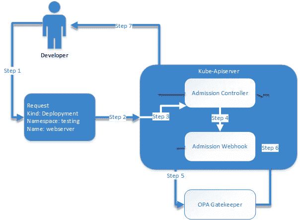
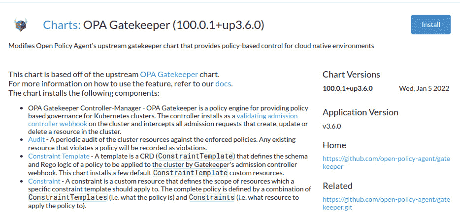
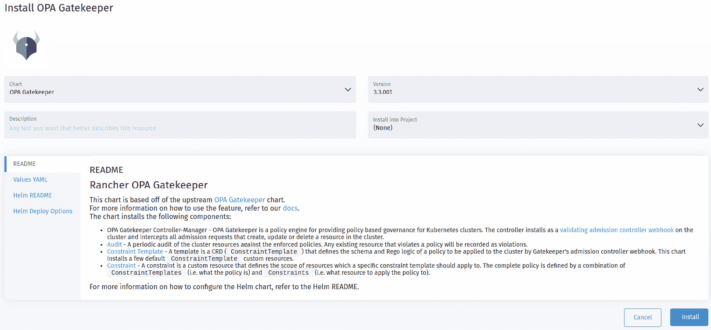
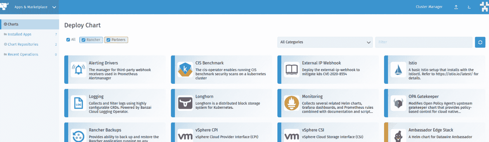
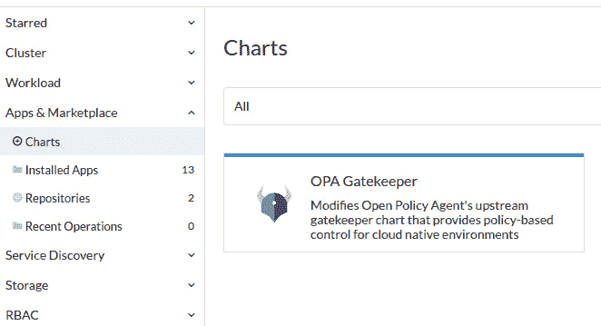
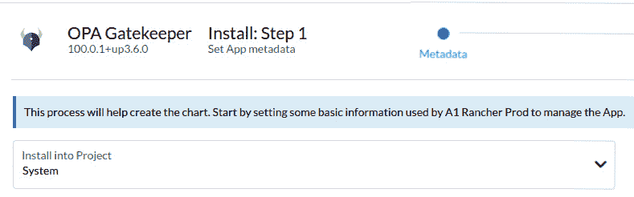

# 第十二章：*第十二章*：使用 OPA Gatekeeper 进行安全性和合规性管理

在本章中，我们将介绍如何使用**OPA Gatekeeper**将安全性和合规性引入我们的 Kubernetes 集群，并探讨它为何在大规模管理集群时至关重要。（OPA 代表**开放策略代理**。）由于有这么多不同的团队在你的集群上部署应用程序，在你的环境中强制执行标准（例如，阻止公共镜像仓库、阻止不符合规则的部署，例如设置 Pod 的 CPU 和内存限制）变得极其困难。我们还将讨论 Rancher 的**互联网安全中心**（**CIS**）扫描工具，该工具用于扫描 Kubernetes 集群中的已知漏洞，以及 Rancher 的硬化指南，帮助应用对 RKE 和 RKE2 集群的更改，以执行 CIS 基准中定义的额外安全标准。我们还将探讨如何持续维护集群，以及像 NeuVector 这样的企业级解决方案。

在本章中，我们将涵盖以下主要主题：

+   为什么我需要关注 Kubernetes 中的安全问题？

+   我如何在 Kubernetes 中强制执行标准和安全策略？

+   什么是 OPA Gatekeeper？

+   我如何从市场中安装 OPA Gatekeeper？

+   最佳实践和标准政策。

+   我如何扫描我的集群以检查安全问题？

+   我如何锁定我的集群？

+   部署 Rancher CIS 扫描。

+   用于保护集群的额外安全工具。

# 为什么我需要关注 Kubernetes 中的安全问题？

我经常被问到一个问题：*为什么我需要关注安全问题？容器化不是已经解决了这个问题吗？* 简短的回答是，不是的。容器化并不能解决所有 IT 安全问题，但如果回顾我们传统上如何处理服务器安全问题，它确实改变了游戏规则。

首先，我们将在所有服务器上部署**杀毒软件**（**AV**），以检测和阻止恶意软件、蠕虫和特洛伊木马等攻击我们的服务器并窃取数据。现在，容器化给这一过程带来了很大挑战，因为我们在另一个服务器中虚拟化了应用程序，而大多数杀毒软件无法理解或支持在 Docker 环境中运行。官方的 Docker 文档中也讨论了这一点，指出推荐将 Docker 进程及其目录排除在扫描之外，网址是[`docs.docker.com/engine/security/antivirus/`](https://docs.docker.com/engine/security/antivirus/)。此外，大多数流行的杀毒软件供应商，例如赛门铁克（Symantec Endpoint Protection），会完全阻止 Docker 的运行。值得注意的是，像 Aqua 这样的安全软件支持在主机级别运行 AV 扫描。我们将在本章后续部分深入讨论这一话题。

其次，我们会在服务器之间创建防火墙规则，只提供最基本的访问权限。例如，你可能只允许从有限数量的跳板服务器访问**安全外壳**（**SSH**）协议，这样，如果某人攻破了一个面向公众的 Web 服务器并获得了远程访问权限，他们将无法通过 SSH 进入其他服务器，比如数据库服务器。Kubernetes 改变了这一点，因为大多数**容器网络接口**（**CNI**）提供商，如 Canal、Calico 和 Weave，默认是开放的，这意味着集群中的任何 Pod 都可以直接连接到集群中的任何其他 Pod。这意味着，如果某人攻破了运行 Web 服务器的 Pod，他们现在可以直接攻击同一集群中的其他 Pod。需要注意的是，Kubernetes 有网络策略（NetworkPolicies），允许你将类似防火墙的规则引入集群。然而，并不是所有的 CNI 提供商都支持网络策略。你可以在 https://rancher.com/docs/rancher/v2.6/en/faq/networking/cni-providers/#cni-features-by-provider 查找 Rancher 支持的不同 CNI 提供商的列表。此表格包括支持 NetworkPolicies 资源类型的提供商，因为并非所有 CNI 提供商都支持此功能。

第三是对环境中允许安装的软件的控制。大多数企业环境不允许应用团队直接访问生产服务器。他们要求应用团队记录如何安装他们的应用程序，以及这一过程如何经过外部团队（如安全和合规团队）的审查。这主要是为了防止应用团队对服务器进行可能引发安全问题的更改。例如，如果没有控制措施，应用团队可能会直接禁用防病毒软件，而不是通过将他们的进程列入白名单并解决应用程序的安全问题来解决。除此之外，某些团队可能会使用过时的软件，例如有已知漏洞的 Java，且大多数安全团队会对此进行拦截。容器化改变了这种情况，因为应用团队自己构建镜像；也就是说，如果需要，他们可以安装自己想要的软件和库，包括过时和有漏洞的软件。

第四，我们来谈谈补丁管理。大多数企业服务器环境都有定期的补丁计划，例如每月应用操作系统补丁。因此，已知的漏洞会定期从你的环境中移除。而容器化默认情况下使得像每月打补丁这样的任务不再是必要的。容器的一个核心概念是，你的镜像应该是静态的，只有在重新部署时才能更改。

例如，一个应用团队部署了一个运行当前补丁的基于 Ubuntu 的镜像的 pod。然后他们将其保持不变长达六个月。现在，基于 Ubuntu 的镜像已过时，需要更新。当然，你可以连接到 pod 并运行 `apt upgrade` 来应用补丁，但只要该 pod 被重新调度，你的更改就会被清除。你需要依赖应用团队通过按计划重新部署应用来保持镜像的更新，我们都知道这将如何进行，因为如果一切正常，他们不愿意更改任何内容。重要的是要注意，通过将图像扫描添加到您的流水线中，可以解决这个问题，我们将在本章后面讨论这个主题。

最后但并非最不重要的是，在传统企业环境中限制访问。生产服务器的访问受到限制，应用团队不被允许访问。但是，对于 Kubernetes 来说，组织通常会开始其 Kubernetes 之旅，以便为开发人员提供对生产集群的访问权限，以提高速度和效率。

在接下来的部分，我们将深入探讨如何开始解决这些问题，主要集中在 OPA Gatekeeper 和 Rancher CIS 扫描上。

# 我如何在 Kubernetes 中强制执行标准和安全策略？

当然，既然我们现在知道所有这些安全问题和限制，我们需要问的是我们能做什么？

首先是 AV 软件问题，问题是，为什么我们首先需要 AV 软件？我们需要它是因为我们需要检测恶意软件在我们的环境中运行的情况。例如，黑客通过找到一个漏洞来获取远程代码执行（**RCE**，也称为**ACE**），然后黑客将开始安装远程访问工具（**RAT**）以开始横向移动到其他服务器，试图获取更多访问权限。容器化通过缩小攻击面来解决这个问题。例如，如果服务器没有 shell，那么很难在其上获取远程 shell。这就是为什么大多数容器镜像只包含绝对必要的软件包和库。Kubernetes 也通过以非特权帐户运行容器来解决此问题。例如，我们可能将 Apache 作为非 root 用户运行。因此，即使有人获取了对 pod 的访问权限，他们也没有权限安装额外的软件和库。这也包括如果他们找到一种方法来打破容器的限制，他们仍然将作为几乎没有权限的帐户运行。

第二个问题是防火墙规则，正如前一节所讨论的。Kubernetes 默认情况下在 Pod 之间是开放的，但因为你需要显式地将端口和服务暴露给外部，所以你默认能够获得对外部世界的安全保护。例如，如果我们在集群中以 Pod 的形式运行一个 Apache 服务器，默认情况下我们并没有直接将该 Pod 暴露给外部世界。但仍然，通过 Ingress 控制器，你可以启用安全设置，比如**ModSecurity**，这是一种**Web 应用防火墙**（**WAF**），可以保护你免受跨站脚本、SQL 注入和会话攻击等威胁。你可以通过访问[`github.com/SpiderLabs/ModSecurity`](https://github.com/SpiderLabs/ModSecurity)了解更多关于 ModSecurity 的信息，关于如何在 Ingress NGINX 中启用 ModSecurity 的详细信息，请访问 https://kubernetes.github.io/ingress-nginx/user-guide/nginx-configuration/annotations/#modsecurity。

第三个问题是已部署软件的控制。我们将管理端点或服务器上的软件，特别是在过渡环境中。容器化将这个过程从端点转移到了构建管道中。这是通过将诸如 Clair 之类的软件集成到构建脚本中实现的。Clair 的想法是，在你运行`docker build`命令后，将镜像传递给 Clair，Clair 会下载并扫描镜像中的已知漏洞。Clair 会生成一份报告，列出漏洞、**CVE**（**公共漏洞和暴露**）编号以及严重性等级。根据你的**持续集成/持续部署**（**CI/CD**）软件，你可以选择在镜像有过多漏洞时阻止构建。

第四个问题是应用程序的补丁更新。不幸的是，这个问题没有简单的解决办法；正确的方法是定期更新你的容器，作为持续开发过程的一部分。但正如我们所知，定期修补镜像可能会滞后。因此，一些人做法是设置定期构建任务。例如，你可以创建一个定期任务，每月重新构建你的应用镜像，使用当前的代码版本并自动在你的环境中部署和测试。通过这种方式，你每个月都会对容器进行*补丁*更新，就像我们对服务器进行更新一样。

最后，我们面临访问问题。最简单的方式是给每个人访问权限，让他们可以部署到生产环境并随意修改。但这种做法会带来不必要的问题和安全隐患，因为当保护措施挡在路上时，人们通常更容易选择关掉保护，而不是解决被阻挡的原因。为了防止这种行为，建议强制通过 CI/CD 管道进行所有更改，并使用如 GitHub/GitLab **拉取请求**（**PR**）审批来跟踪和控制，且不允许非集群管理员访问生产环境。Rancher 可以通过其 Fleet 产品解决此问题，您可以通过访问 [`fleet.rancher.io`](https://fleet.rancher.io) 了解更多信息。此外，从 Rancher v2.6 起，Fleet 已集成到 Rancher 本身中。

到目前为止，我们应该了解如何将传统 IT 安全需求转化为 Kubernetes 对应项的基本概念。在下一部分，我们将深入了解 OPA Gatekeeper，以强制执行我们集群的安全标准。

# 什么是 OPA Gatekeeper？

OPA 是一个为云环境构建的开源策略引擎。此外，OPA 是一个 **云原生计算基金会**（**CNCF**）毕业项目，就像我们讨论过的其他工具一样。OPA 使用声明式语言在环境中强制执行策略。基本思路是，所有内容都应调用 OPA 并询问，*嘿，我能做 XYZ 吗？* 这时，OPA 会根据其策略评估请求，决定是否批准或拒绝该请求。值得注意的是，OPA 设计上是通用的，旨在与 Kubernetes 和其他系统（如 Terraform、Docker 和 SSH）集成。

当然，问题接踵而至，那么 Gatekeeper 是什么呢？简而言之，OPA Gatekeeper 是一个 Kubernetes 控制器，它允许你将 OPA 策略定义为 Kubernetes 对象。这主要包括约束和约束模板。通过这种方式，用户可以将其策略定义为 YAML，并像其他 Kubernetes 部署一样将其应用于集群。接下来，我们将重点讨论 OPA Gatekeeper。

现在我们知道了什么是 OPA Gatekeeper，接下来的问题是*它是如何工作的？* 最好的回答方式是通过一个请求流程来进行讲解。请参阅下图来理解这一过程。



图 12.1 – OPA Gatekeeper 请求流程图

接下来，我们详细看看这些步骤：

+   **第 1 步**：开发者创建请求，在这个例子中，请求是针对 **testing** 命名空间中的新部署 **webserver**。

+   **第 2 步**：开发者将请求以 YAML 或 JSON 文件的形式提交给 **Kube-Apiserver**。

+   **第 3 步**：**Kube-Apiserver** 接收请求并开始处理，验证用户是否具有有效凭据、请求语法是否有效，并且用户是否有权限访问请求的资源。在这一点上，通常 **Kube-Apiserver** 会响应开发者，接受或拒绝请求。但由于我们已将 OPA Gatekeeper 部署到该集群，请求将走不同的路径。

+   `ValidatingAdmissionWebhook` 用于将某些请求路由到定义好的 webhook。需要注意的是，并不是所有请求都会被转发到 webhook。例如，`kubectl get pods` 请求是只读请求，因此不会被转发到 webhook。但创建 pod 的请求会被转发，因为它是对环境的更改。在这种情况下，OPA Gatekeeper 已将 `ValidatingAdmissionWebhook` 添加到 **Kube-Apiserver** 中。

+   `billing-code`，您可以用它向您的应用程序团队进行费用分摊。

+   `billing-code` 标签，创建将被阻止，拒绝将被转发到下一步骤。但假设请求已被批准，OPA Gatekeeper 将响应一个 HTTP 成功代码 `200`。

+   默认情况下，`fail close by default`。这意味着如果请求的响应不是 `200`，则假定为拒绝，请求将被拒绝。即使是有效的部署，如果 OPA Gatekeeper pod 宕机或不可用，也会被拒绝。这意味着您的集群被阻塞，无法启动任何 pod。所以，Rancher 的 OPA Gatekeeper 部署将默认策略切换为 `failurePolicy: Ignore`，表示如果 webhook 请求收到错误（如超时），Admission Controller 将无法打开，这意味着控制器会假设请求在 OPA Gatekeeper 离线时已被批准。您应该与您的安全团队一起审查此设置，并确认在故障期间是否更重要的是可用性，而不是可能允许不符合标准的部署。

最后，此时，最终用户将收到其请求的响应。由于前面列出的步骤，用户在部署过程中可能会看到额外的延迟。但通常这非常快速，以至于大多数环境中它成为了背景噪音。还需要注意的是，这个过程适用于终端用户以及来自集群内部其他控制器的内部请求，例如 kube-scheduler。

在这一点上，您应该理解请求是如何通过 kube-apiserver 流向 Admission Controller，然后转发到 OPA Gatekeeper，最后通过 kube-apiserver 返回给开发者的。在下一节中，我们将深入探讨在集群中安装 OPA Gatekeeper 的过程。

# 如何从市场安装 OPA Gatekeeper

使用 Rancher 有两种主要方式可以部署 OPA Gatekeeper，分别是通过 Rancher 中的应用市场和通过 Rancher Helm Chart。当然，你也可以在没有 Rancher 的情况下直接部署上游的 OPA Gatekeeper。通常建议通过应用市场来部署 OPA Gatekeeper，主要是为了方便。安装 OPA Gatekeeper 的步骤在本节中针对每个主要的 Rancher 版本进行列出。

在讨论安装步骤之前，先列出一些安装所需的先决条件：

+   你应该具有全局角色管理员或集群所有者权限。

+   OPA Gatekeeper 需要 Kubernetes v1.16 或更高版本。

+   你应该查看官方支持矩阵，网址是[`www.suse.com/suse-rancher/support-matrix/all-supported-versions/`](https://www.suse.com/suse-rancher/support-matrix/all-supported-versions/)，以确认你部署的是完全兼容且验证过的系统解决方案。

在 Rancher v2.4 中安装 OPA Gatekeeper，请按照以下步骤操作：

1.  在 Rancher UI 中，进入**Cluster**仪表盘。

1.  进入**Tools**菜单，并从下拉菜单中选择**OPA Gatekeeper**；参见*图 12.2*：



](img/B18053_12_02.jpg)

图 12.2 – Rancher v2.4 从工具菜单安装 OPA Gatekeeper

1.  通常建议使用默认设置，相关设置可以在[`rancher.com/docs/rancher/v2.0-v2.4/en/cluster-admin/tools/opa-gatekeeper/`](https://rancher.com/docs/rancher/v2.0-v2.4/en/cluster-admin/tools/opa-gatekeeper/)找到。



](img/B18053_12_03.jpg)

图 12.3 – Rancher v2.4 OPA Gatekeeper 安装向导

接下来，我们来看看 Rancher v2.5 的安装步骤：

1.  在 Rancher UI 中，进入**Cluster Explorer**。

1.  点击**Apps & Marketplace**选项。

1.  选择**OPA Gatekeeper**图表。



](img/B18053_12_04.jpg)

图 12.4 – Rancher v2.5 从应用市场安装 OPA Gatekeeper

通常建议使用默认设置，相关设置可以在[`rancher.com/docs/rancher/v2.5/en/opa-gatekeper/`](https://rancher.com/docs/rancher/v2.5/en/opa-gatekeper/)找到。

现在，我们将讨论 Rancher v2.6 的安装：

1.  在 Rancher UI 中，进入**Cluster Management**。

1.  在**Clusters**页面，进入你希望启用 OPA Gatekeeper 的集群，并点击**Explore**。

1.  在左侧导航栏中，点击**Apps & Marketplace**。



](img/B18053_12_05.jpg)

图 12.5 – Rancher v2.6 从应用市场安装 OPA Gatekeeper

1.  点击**Charts**，然后点击**OPA Gatekeeper**，再点击**Install**。


](img/B18053_12_06.jpg)

图 12.6 – OPA Gatekeeper 安装页面

1.  通常建议使用默认设置，可以在 [`rancher.com/docs/rancher/v2.6/en/opa-gatekeper/`](https://rancher.com/docs/rancher/v2.6/en/opa-gatekeper/) 找到。



图 12.7 – Rancher v2.6 OPA Gatekeeper 安装选项

此时，我们应该已经在环境中安装了 OPA Gatekeeper，但没有约束，它并不会发挥太大作用。在接下来的部分，我们将介绍一些你可以用来入门的标准约束模板。

# 最佳实践和标准策略

现在我们已经安装了 OPA Gatekeeper，是时候开始创建模板并将其应用到你的集群中了。在本节中，我们将讨论一些最受欢迎的模板。需要注意的是，这些模板大多数来自上游的 OPA Gatekeeper。

我喜欢部署第一个叫做`containerlimits`的模板规则，它确保所有的 pod 都设置了 CPU 和内存限制。你可以在 [`github.com/open-policy-agent/gatekeeper-library/tree/master/library/general/containerlimits`](https://github.com/open-policy-agent/gatekeeper-library/tree/master/library/general/containerlimits) 找到该模板。这里的主要思想是，默认情况下，所有 pod 都没有 CPU 和内存限制，这意味着单个 pod 可以占用节点上所有的资源，强行将其他 pod 挤出，甚至导致节点卡死然后崩溃。这就造成了我所说的 *失控应用*，它会消耗一个节点，导致该节点崩溃，然后转移到另一个节点，重复这个过程，直到节点用尽。你可以在 [`github.com/mattmattox/Kubernetes-Master-Class/tree/main/disaster-recovery/run-away-app`](https://github.com/mattmattox/Kubernetes-Master-Class/tree/main/disaster-recovery/run-away-app) 找到这种应用的示例。

该链接还包括如何解决“失控应用”问题。这个模板确保它被设置为一个有效的值。它可能是 1 MB 的内存，意味着 pod 永远不会被调度，或者它可能是 100 TB，意味着 pod 永远无法被调度，因为没有足够大的节点可以启动它。这个方法还有一个好处，就是能够让你洞察集群所需的容量，因为如果你看到集群报告了 100% 的资源分配，意味着两种情况中的一种：

+   你的限制设置得太高，浪费了资源。

+   你需要开始添加节点，因为你将用完资源。

OPA Gatekeeper 可以通过阻止缺少 CPU 和内存限制的 pod/deployment 来保护我们免受失控应用的影响，这意味着失控应用根本无法进入集群。

注意

我们将在下一章讨论扩展问题。

要应用这个模板，只需运行以下命令：

```
kubectl apply -f https://raw.githubusercontent.com/open-policy-agent/gatekeeper-library/master/library/general/containerlimits/template.yaml 
```

但是，请确保首先在非生产集群中进行测试。

另一个我喜欢使用的模板叫做`requiredlabels`，它是一个强制所有命名空间都有标签的模板。例如，你可能希望将所有命名空间都设置一个账单代码，以便进行展现费用和收费回退。或者，也许你希望强制命名空间中列出技术联系人，以便在部署出现问题时，方便联系应用团队。

要应用这个模板，只需运行以下命令：

```
kubectl apply -f https://raw.githubusercontent.com/open-policy-agent/gatekeeper-library/master/library/general/requiredlabels/template.yaml
```

注意

这只会应用于新创建的命名空间，因此你需要回去为现有命名空间设置标签。

有关此模板的完整详细信息，请访问[`github.com/open-policy-agent/gatekeeper-library/tree/master/library/general/requiredlabels`](https://github.com/open-policy-agent/gatekeeper-library/tree/master/library/general/requiredlabels)。

最后，我看到许多安全团队要求使用的模板是`httpsonly`，它强制所有 ingress 必须具有`kubernetes.io/ingress.allow-http = false`注解，这意味着所有 ingress 必须在 ingress 配置中的**TLS**（**传输层安全性**）部分定义 SSL 证书。许多安全团队要求所有流量，包括后端服务，必须仅支持 HTTPS。

要应用这个模板，只需运行以下命令：

```
kubectl apply -f https://raw.githubusercontent.com/open-policy-agent/gatekeeper-library/master/library/general/httpsonly/template.yaml
```

有关此模板的完整详细信息，请访问[`github.com/open-policy-agent/gatekeeper-library/tree/master/library/general/httpsonly`](https://github.com/open-policy-agent/gatekeeper-library/tree/master/library/general/httpsonly)。需要注意的是，默认情况下，Rancher 集群会为 ingress 配置自签名证书，作为在未定义其他证书时的默认证书。

当然，开源社区还创建了更多模板，可以在[`github.com/open-policy-agent/gatekeeper-library`](https://github.com/open-policy-agent/gatekeeper-library)找到。我还建议使用这些模板作为创建自定义模板的基础。

到此为止，你应该已经在集群中安装了 OPA Gatekeeper，并定义了一些规则，允许你执行标准。在接下来的部分，我们将深入探讨如何采取下一步措施，通过锁定集群来防止与安全相关的问题。

# 我如何扫描集群中的安全问题？

Rancher 有一个基于 kube-bench 的 Rancher CIS 扫描或 Rancher-cis-benchmark 工具，kube-bench 是 Aqua Security 提供的开源软件。kube-bench 旨在扫描 Kubernetes 集群，并检查 Kubernetes 组件（如 kube-apiserver、etcd 和 kubelet）的设置。kube-bench 使用非营利组织 CIS 的 CIS 基准报告，CIS 创建了一份最佳实践设置的标准列表，用于保护你的 Kubernetes 集群。这些报告是在 Kubernetes 进行重大更改后发布的，旨在尽可能保持厂商中立。你可以通过访问[`learn.cisecurity.org`](https://learn.cisecurity.org)来了解更多关于 CIS 及其报告的信息。但是，由于该报告旨在保持厂商中立，某些设置不适用于 Rancher 及其集群。因此，Rancher 发布了一份自我评估和加固指南，解决报告中的所有项目。此评估设计为可以交给你的安全团队/审计员，当他们开始提问时使用。

但是，重要的是要注意，默认情况下，Rancher 及其集群将无法通过 CIS 报告，除非对你的环境和节点进行更改，其中一些步骤需要手动操作。在下一节中，我们将深入探讨如何使 Rancher 通过报告。

你可以在[`rancher.com/docs/rancher/v2.5/en/security/rancher-2.5/`](https://rancher.com/docs/rancher/v2.5/en/security/rancher-2.5/)找到 Rancher 的报告和评估。需要注意的是，随着 Kubernetes 和 Rancher 的升级，以及发现安全问题，这些指南会不断变化，因此建议定期审查这些评估。

# 如何锁定我的集群？

在上一节中，我们讨论了 CIS 扫描和 Rancher 的自我评估，但当然，*我可以做些什么来处理这个报告？*这个问题会随之而来，Rancher 对此问题的回答就是 Rancher 所称的**加固指南**。这些指南涵盖了 Rancher 拥有的三种 Kubernetes 发行版：RKE、RKE2 和 k3s。我们在本节中不会深入细节，因为 Rancher 已经有了相关文档。在这里，我们将提供每种集群类型的指南链接。

对于 RKE 集群，加固指南与 Rancher 服务器和 Kubernetes 版本相关联。以下是高层次的步骤：

1.  配置 Linux 内核以安全处理**内存不足**（**OOM**）和内核崩溃。

1.  创建一个本地用户和组供 etcd 使用，以将数据库与其他进程隔离，从而保护数据。

1.  禁用默认的服务帐户挂载到每个 pod 上。

1.  启用`NetworkPolicy`默认限制所有 pod 之间的流量，要求你根据需要打开规则。

1.  开启秘密加密功能，默认情况下，秘密以明文存储在 etcd 中，但启用 etcd 加密后，秘密将被加密存储。

1.  最后，通过启用`PodSecurityPolicy`来限制 Pod 的安全设置，例如禁止 Pod 以 root 身份运行。

完整的指南可以在[`rancher.com/docs/rancher/v2.5/en/security/rancher-2.5/1.6-hardening-2.5/`](https://rancher.com/docs/rancher/v2.5/en/security/rancher-2.5/1.6-hardening-2.5/)中找到。

对于 RKE2 集群，这个过程要容易得多，因为 RKE2 默认是安全的，但您仍然需要应用一些更改，具体如下：

1.  设置与 RKE 相同的 Linux 内核参数。

1.  创建一个 etcd 用户。

1.  最后，我们只需要通过添加`profile: cis-1.5/6`选项，在主服务器上启用我们想要的 CIS 配置文件。

完整的指南可以在[`docs.rke2.io/security/hardening_guide/`](https://docs.rke2.io/security/hardening_guide/)中找到。

对于 k3s 集群的硬化过程与 RKE2 类似，但仍然需要一些额外的步骤：

1.  设置与 RKE2 相同的 Linux 内核参数

1.  跳过 etcd 步骤，因为 k3s 默认不使用 etcd

1.  启用`PodSecurityPolicy`来限制 Pod 的安全设置，例如禁止 Pod 以 root 身份运行

需要注意的是，k3s 不像 RKE2 那样具有 CIS 配置文件，并且默认情况下不安全，因为它被设计为轻量级且快速。

完整的指南可以在[`rancher.com/docs/k3s/latest/en/security/hardening_guide/`](https://rancher.com/docs/k3s/latest/en/security/hardening_guide/)中找到。

在此阶段，假设您已按照前面列出的指南操作，您应该能够开始安装 Rancher CIS 扫描并顺利通过它。

# 部署 Rancher CIS 扫描

安装 Rancher CIS 扫描的唯一推荐方式是通过 Rancher 中的**应用和市场**。但首先，让我们了解一些基本要求：

+   Rancher v2.4 或更高版本。

+   集群所有者权限到下游集群（或全局角色管理员权限）。

+   下游集群必须是 RKE、RKE2、EKS 或 GKE 集群才能完全支持。

    注意

    对于其他集群，可以使用通用配置文件，但可能会出现误报或其他权限问题。

以下是在 Rancher v2.4.x 和 v2.5.x 中通过集群浏览器安装`rancher-cis-benchmark`的方法：

1.  在 Rancher UI 中，转到**集群浏览器**。

1.  点击**应用**。

1.  点击**rancher-cis-benchmark**。

1.  点击**安装**。

通过**集群管理**面板在 Rancher v2.6.x 中安装 CIS 基准，操作如下：

1.  在 Rancher UI 中，转到**集群管理**。

1.  导航到您将安装 CIS 基准的集群。

1.  在左侧导航栏中，点击**应用和市场** | **Charts**。

1.  点击**CIS 基准**。

1.  点击**安装**。

    注意

    对于 Rancher 创建的集群，您应该使用*默认*设置。对于通用集群，请查看[`github.com/rancher/cis-operator/tree/master/examples`](https://github.com/rancher/cis-operator/tree/master/examples)中的示例设置。

到此时，你应该已经锁定了集群，并且 Rancher 的 CIS 扫描正在你的集群中运行，以确保集群能够随着时间的推移保持安全。在接下来的部分，我们将深入探讨一些额外的工具来保护你的集群，包括一些付费解决方案。

# 保护集群的额外安全工具

本章我们主要讨论了 OPA Gatekeeper，因为它是最受欢迎的开源解决方案之一。当然，也有其他付费解决方案，如 NeuVector，它提供镜像和集群扫描。

注意

随着**SUSE**（德语：**Software- und System-Entwicklung**）收购 NeuVector，已宣布 NeuVector 的容器运行时安全平台将在 GitHub 上以 Apache 2.0 许可证公开发布，网址为[`github.com/neuvector/neuvector`](https://github.com/neuvector/neuvector)。

此外，Aqua 平台对于付费客户来说无处不在，因为它是一个闭源产品，需要授权。

对于 NeuVector，我建议在 YouTube 上观看大师班*PCI 合规性和 Kubernetes 漏洞管理*（[`www.youtube.com/watch?v=kSkX5MRmEkE`](https://www.youtube.com/watch?v=kSkX5MRmEkE)），以了解更多关于 NeuVector 的信息，并学习如何将其集成到 Rancher 中。

我还建议观看关于 Aqua 的*Kubernetes 大师班：Kubernetes 企业部署的预防性安全*，视频地址为：[`www.youtube.com/watch?v=2Phk7yyWezU`](https://www.youtube.com/watch?v=2Phk7yyWezU)。

注意

这两部 YouTube 视频都托管在 Rancher 的 YouTube 频道上，并附有它们的幻灯片和脚本链接。

# 摘要

本章教会了我们容器和 Kubernetes 所解决的一些安全性和合规性问题。我们了解了什么是 OPA Gatekeeper 以及它如何工作。然后，我们深入探讨了一些最佳实践和标准模板。我们学习了 OPA Gatekeeper 如何通过部署这些模板来强制执行集群的不同规则。这一点非常重要，因为掌握这一技能是创建适合自己环境及其需求的规则所必需的。接着，我们介绍了如何锁定集群并确保通过 Rancher CIS 扫描保持锁定状态。

下一章将介绍如何为集群的 Pods 和节点提供扩展功能，包括扩展集群时的所有限制和关注点。
