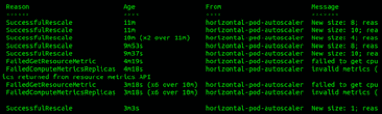
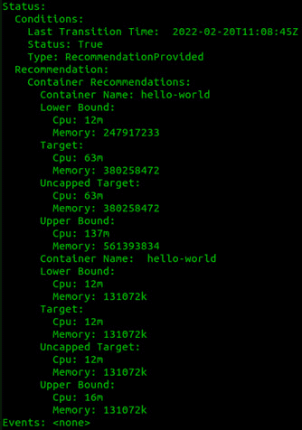

# *第十三章*：Kubernetes 中的扩展

在本章中，我们将讨论如何扩展 Kubernetes 集群。我们将介绍三种主要的扩展方式：**水平 Pod 自动扩展器**（**HPA**）、**垂直 Pod 自动扩展器**（**VPA**）和集群自动扩展器。我们将介绍每种方式的优缺点，并提供一些示例，同时深入探讨每种方法的最佳实践。

在本章中，我们将涵盖以下主要话题：

+   什么是 HPA？

+   什么是 VPA？

+   什么是 Kubernetes 集群自动扩展器？

# 什么是 HPA？

HPA 是控制器管理器中的一个控制器。HPA 根据 CPU 使用率（或自定义指标）自动扩展复制控制器、部署、副本集或有状态集中的 Pods。无法扩展的对象（例如 DaemonSets）不会受到水平 Pod 自动扩展的影响。在控制器管理器中，`horizontal-pod-autoscaler-sync-period`标志的默认值为`15`秒，决定了 HPA 运行的频率。每个周期中，控制器管理器会检查相关工作负载的资源利用率。控制器使用自定义指标端点和度量服务器来收集其统计数据。

本质上，HPA 监控当前和期望的指标值，如果它们与规范不匹配，HPA 会采取行动。HPA 遵循以下算法：

```
desiredReplicas = ceil[currentReplicas * ( currentMetricValue / desiredMetricValue )]
```

举个例子，假设你有一个应用程序需要保持 CPU 使用率在 50%。目前，这个部署的 CPU 请求为 1000m（毫核心），相当于节点上的一个核心。需要注意的是，HPA 使用的是 CPU 和内存请求的指标，而不是限制值。HPA 通过将请求值除以当前使用值来计算`currentMetricValue`对象类型，得到一个百分比。HPA 会对部署中的每个 Pod 进行此计算，然后对它们进行平均，以创建一个部署的`currentMetricValue`对象类型。然后，HPA 将`currentMetricValue`对象类型与`desiredMetricValue`对象类型进行比较，若两者都是 50%，则 HPA 不会进行任何改变。但如果比率过高（目标是 1.0），它会触发扩展事件，增加更多的 Pods。需要注意的是，*未准备好*或*正在终止*的 Pods 不会被计入。默认情况下，Pod 生命周期的前 30 秒内的度量值会被忽略，这一行为由`horizontal-pod-autoscaler-initial-readiness-delay`标志定义。此外，HPA 一次可以扩展多个 Pods，但通常这需要显著的比率差异，因此大多数情况下，工作负载仅会扩展一个 Pod。

到目前为止，我们已经了解了 HPA 的工作原理，包括 HPA 如何决定何时扩展和缩减工作负载。当然，接下来的问题是何时应该使用 HPA，何时不应该使用 HPA 来处理你的工作负载，在接下来的部分，我们将深入探讨这个话题。

## 什么时候应该使用 HPA？

现在我们已经了解了 HPA 是如何工作的，接下来我们来看看什么时候应该使用 HPA。一个使用 HPA 的典型应用程序是 Web 服务器。那么，为什么 Web 服务器是一个很好的例子呢？答案是，传统上，甚至在 Kubernetes 之前，Web 服务器的设计方式就是能够随时添加或删除，而不会影响到应用程序。

以下是适合使用 HPA 的应用程序特征列表：

+   **无状态** – 应用程序必须能够随时添加或删除。

+   **快速启动** – 通常情况下，Pod 应该在 30 秒内启动并准备好处理请求。

+   **基于 HTTP 的** – 大多数会使用 HPA 的应用程序是基于 HTTP 的，因为我们希望利用 Ingress 控制器内置的负载均衡能力。

+   **批处理作业** – 如果你有可以并行运行的批处理作业，你可以使用 HPA 根据负载动态扩展或缩减工作 Pod 的数量。例如，一个 Pod 从队列中获取任务，处理数据，然后发布输出。假设可以同时运行多个作业，你应该根据队列的长度设置 HPA，以扩展或缩减工作 Pod 的数量，也就是部署。

接下来，我们来学习一下什么情况下不应该使用 HPA。

## 什么时候不应该使用 HPA？

当然，对于所有应用程序都使用 HPA 是没有意义的，实际上使用 HPA 可能会导致应用程序出现问题，例如数据库集群，你不希望在集群中频繁添加和删除 Pod，因为这可能导致应用程序错误。需要注意的是，HPA 支持扩展 StatefulSets，但你应该小心，因为大多数需要 StatefulSets 的应用程序并不喜欢频繁的扩缩容。还有其他一些原因，可能会导致你不希望在应用程序中使用 HPA，以下是一些最常见的原因：

+   **StatefulSets** – 需要存储和有序扩展的应用程序，例如数据库，通常与 HPA 不兼容，因为 HPA 会根据需求随意添加和删除 Pod。

+   **需要存储的 Pod** – 需要**PersistentVolumeClaim**（**PVC**）的应用程序通常不建议使用 HPA，因为提供和连接存储需要一定的时间，且随着时间推移可能会导致问题。

+   **需要在规模变化时重新配置的应用程序** – 这种工作负载的一个典型例子是使用外部数据库的 Java 应用程序，它使用数据库连接池。这是因为每次创建 pod 时，Java 都需要开发多个新的连接，这可能会给数据库服务器带来较大的负载，并导致连接耗尽，当数据库连接耗尽时，pod 将失败。这反过来会导致创建一个新的 pod，同时，由于数据库运行缓慢，pods 上的负载可能会增加，导致更多的扩展。问题会变得越来越严重，产生越来越多的 pods，最终导致集群停机。

+   **突发工作负载** – 如果你有一个应用程序大多数时间处于非常低的利用率，然后在短时间内突然跳到高利用率，使用 HPA 是没有意义的，因为 HPA 会缩减部署，直到资源需要时再扩展。问题出现在短暂的突发事件中，因为当 HPA 反应过来并启动新的 pods 时，事件已经过去，使得 HPA 变得毫无价值。

    注意

    你可以设置一个极高的最小规模，但在这种情况下，需要问自己一个问题：如果 HPA 永远不会扩展或缩小，为什么还需要它？

在本节中，我们已经讨论了 HPA 的优缺点。需要注意的是，每个应用程序都是不同的，你应该与应用程序开发人员合作，决定是否添加 HPA 会有帮助。我们来看一个例子。

## 示例 – 简单的 Web 服务器与 CPU 利用率

要部署此示例，请运行以下命令：

```
kubectl apply -f https://raw.githubusercontent.com/PacktPublishing/Rancher-Deep-Dive/main/ch13/examples/simple/deploy.yaml
```

该命令将部署一个名为 `hpa-example-simple` 的命名空间，其中包含一个名为 `hello-world` 的测试应用程序和一个将在 CPU 利用率达到 50% 时触发的 HPA。我们可以通过 `load-generator` 部署来测试 HPA，默认情况下其规模为 `0`。

要给 `hello-world` 应用程序制造负载，只需运行以下命令启动负载：

```
kubectl -n hpa-example-simple scale deployment load-generator --replicas=1
```

运行以下命令将其关闭：

```
kubectl -n hpa-example-simple scale deployment load-generator --replicas=0
```

如果你运行 `kubectl -n hpa-example-simple describe hpa hello-world` 命令，你可以看到以下事件以及 HPA 执行的操作：



图 13.1 – HPA 事件

在本节中，我们介绍了水平扩展工作负载，也就是添加和移除 pods。在下一节中，我们将讨论垂直方向的扩展。

# 什么是 VPA？

如果有 HPA，那是否也有 VPA？是的，有。VPA 与 HPA 类似，但不是通过增加或减少 pod 数量来进行扩展，而是根据实际的 CPU 使用情况自动设置资源请求和限制值。VPA 的主要目标是减少管理容器资源请求和限制的维护开销，并提高集群的利用率。

即使 VPA 与 HPA 类似，但重要的是要知道 VPA 有不同的工作方式，我们将在下一节中讨论这一点。

## VPA 是如何工作的？

VPA 由三个不同的组件组成：

+   **VPA 准入钩子** – 每个提交到集群的 Pod 都会通过这个 Webhook 进行检查，看看它的父对象是否引用了该 Pod（例如副本集、部署等）。

+   **VPA 推荐器** – 通过与 metrics-server 应用程序的连接，基于每个启用 VPA 的 Pod 的历史和当前使用数据（CPU 和内存），提供有关扩展或缩减请求和限制的建议。

+   **VPA 更新器** – 每分钟运行一次 VPA 更新器，它将驱逐那些不在推荐范围内的正在运行的 Pod 版本，以便 Pod 可以重启并通过 VPA 准入 Webhook 在启动前调整 CPU 和内存设置。

这意味着，如果你运行的是像 Argo CD 这样的应用，VPA 更新器将不会检测到部署中的任何变化，两个组件也不会互相争夺调整规格。

接下来，让我们了解为什么我们需要 VPA。

## 为什么需要 VPA？

在深入了解 VPA 之前，我们需要先了解资源请求和限制。当 kube-scheduler 将 Pod 分配到一个节点时，它并不知道该 Pod 需要多少内存和 CPU。节点上只有 16 GB 的空闲内存，但 Pod 需要 64 GB。一旦 Pod 启动，就会内存不足，驱逐其他 Pods。一个具有正确内存大小的集群节点可能会支持该 Pod。此时，资源请求起作用，我们可以指定 kube-scheduler 在特定节点上为这个 Pod 分配多少 CPU 和内存。通过将这种智能加入调度过程中，kube-scheduler 可以做出更明智的决定，选择将 Pod 调度到哪里。我们还可以设置资源限制，当 Pod 超过其限制时，资源限制将作为硬限制进行限制或终止 Pod。

当然，设置资源请求和限制可能需要大量工作，因为你需要对应用程序进行负载测试、审查性能数据，并设置请求和限制。然后你必须不断监控这些设置，以便进行调整。这就是为什么我们看到许多环境中，所有设置都是无限制的，集群管理员只会把硬件投向问题的原因。这时，VPA 就发挥作用了，它为我们设置资源请求并随着时间推移进行微调。

例如，我们可以使用以下设置构建一个 Pod：

```
requests:
```

```
  cpu: 50m
```

```
  memory: 100Mi
```

```
limits:
```

```
  cpu: 200m
```

```
  memory: 250Mi
```

VPA 推荐器会判断你需要 120 MB 的 CPU 和 300 MB 的内存来使 Pod 正常运行。推荐的设置如下：

```
requests:
```

```
  cpu: 120m
```

```
  memory: 300Mi
```

```
limits:
```

```
  cpu: 480m
```

```
  memory: 750Mi
```

由于 VPA 会按比例扩展它们，限制也会随之增加。因此，务必将限制设置为实际的数字，而不是一些不切实际的值，比如 1TB 的内存，尤其是在节点只有 128GB 内存的情况下。作为起点，可以将你的限制设置为请求大小的两倍，例如，如果请求是 100MB，那么你的限制应该是 200MB。但不要忘记，限制本身没有多大意义，因为调度决策（也就是资源争用）总是基于请求来做的。限制只有在资源争用时才有帮助，或者用于避免无法控制的内存泄漏。

## 如何编写 VPA 清单

你永远不应该为同一个 Pod/ReplicaSet/Deployment/StatefulSet 定义多个 VPA——在这种情况下，行为将变得不可预测。VPA 不应该与 HPA 在同一个 Pod 上使用。

你首先需要为目标应用创建一个`updateMode: off`的 VPA 对象，这将使 VPA 进入干运行模式（即推荐模式）。

以下是具有最小所需设置的 VPA 示例：

```
apiVersion: autoscaling.k8s.io/v1beta2
```

```
kind: VerticalPodAutoscaler
```

```
metadata:
```

```
  name: hello-world
```

```
spec:
```

```
  targetRef:
```

```
    apiVersion: "apps/v1"
```

```
    kind: Deployment
```

```
    name: hello-world
```

```
  updatePolicy:
```

```
    updateMode: "Off"
```

大约 5 分钟后，你将能够查询数据并开始看到一些建议：

```
kubectl describe vpa hello-world
```

如下图所示，`status`部分为我们的目标提供了一些建议，接下来的屏幕截图将详细说明这些部分的含义：



图 13.2 – 示例 VPA 描述

你可以在[`raw.githubusercontent.com/PacktPublishing/Rancher-Deep-Dive/main/ch13/vpa/describe-vpa.yaml`](https://raw.githubusercontent.com/PacktPublishing/Rancher-Deep-Dive/main/ch13/vpa/describe-vpa.yaml)找到完整的输出。为了分解这个输出，你将看到以下几个部分：

+   `未限制的目标`：当 VPA 定义中没有配置上限时，Pod 上的资源请求将不受限制。

+   `目标`：这是在后续执行入场 Webhook 时将配置的量。如果已经有这个配置，则不会发生变化（你的 Pod 不会进入重启/驱逐循环）。否则，Pod 将被驱逐并使用这个目标设置重新启动。

+   `下限`：当你的 Pod 的使用量低于这个值时，它将被驱逐并缩减规模。

+   `上限`：当你的 Pod 的使用量高于这个值时，它将被驱逐并扩展规模。

此时，你可以使用这些信息来创建并设置你的部署请求限制。但如果你想使用自动预测，你需要将`updateMode`的值改为`Auto`。

现在，如果你想为 VPA 设置最小和最大限制，可以在 VPA 配置中添加以下部分：

```
      minAllowed:
```

```
        cpu: "300m"
```

```
        memory: "512Mi"
```

```
      maxAllowed:
```

```
        cpu: "1800m"
```

```
        memory: "3600Mi"
```

到目前为止，我们主要关注的是伸缩 Pod，但图像的另一半是伸缩节点。在下一部分中，我们将深入了解节点自动伸缩。

# 什么是 Kubernetes 节点自动伸缩？

随着新工作负载和 Pod 的部署，所有集群工作节点的资源可能会被耗尽。这将导致 Pod 无法在现有的工作节点上调度。在某些情况下，Pod 会处于等待资源分配的挂起状态，可能会导致服务中断。当然，手动添加或移除工作节点可以解决这个问题，因为集群自动扩展器会根据挂起的 Pod 和节点使用情况指标增加或减少 Kubernetes 集群的规模。

现在我们已经知道了节点自动扩展器是什么，了解它应该何时使用或不使用至关重要，我们将在下一部分详细讨论。

## 什么时候应该使用 Kubernetes 节点自动扩展器？

在 Rancher/Kubernetes 环境中，设置节点自动扩展器有两个主要原因：

+   **成本控制/效率** – 当将工作负载迁移到云端时，许多人常犯的一个大错误是将云端虚拟机（VM）当作本地虚拟机（VM）来对待。我的意思是，本地环境中，如果你配置了一个八核虚拟机，但实际上只使用了四个核心的资源，那么物理硬件的成本仅仅是实际使用的四个核心。但是在云端，例如，如果你在 AWS 中配置了一个八核虚拟机，不管你是否使用了 100% 的 CPU，账单的费用都是一样的。因此，我们希望将节点的使用率保持尽可能接近 100%，同时不影响应用程序。一般的经验法则是 CPU 使用率保持在 80%，内存使用率保持在 90%。这是因为这些是默认的节点压力限制。节点自动扩展能够在需要时，向集群中添加足够的节点以满足需求。这对全天变化的工作负载非常有帮助。例如，你的应用程序可能在周一至周五的 8 点到 17 点非常繁忙，但在非工作时间的利用率非常低。因此，自动扩展和在早晨启动节点、晚上关闭节点将有助于减少成本。

+   **节点修补/升级** – 节点重启是自动扩展节点时的副作用之一。你必须创建一个流程来轻松地将节点添加到集群或从集群中移除，而不是在原地修补或升级节点。这意味着你需要一个一个地排空并隔离节点，然后应用操作系统补丁和升级，最后重启节点。你还需要等待节点重新上线并解除隔离。接着，重复这一过程，直到集群中的每个节点都完成。这当然需要脚本和自动化，以及检查和测试。使用自动扩展时，你只需要更新基础虚拟机镜像并验证其健康状况。然后，触发节点池的滚动更新。在此时，自动扩展将接管工作。

接下来，让我们了解何时不应该使用 Kubernetes 节点自动扩展器。

## 什么时候不应该使用 Kubernetes 节点自动扩展器？

节点自动扩展器有一些实际限制和最佳实践，如果不遵循，可能会导致集群不稳定：

+   **Kubernetes 和操作系统匹配** – Kubernetes 是一个不断发展的平台，定期发布新功能和版本。为了确保最佳性能，请确保使用建议版本部署 Kubernetes 集群自动扩展器。为了使 Kubernetes 与您的操作系统保持同步，您必须定期升级它们。有关建议版本的列表，请访问 Rancher 的支持矩阵，网址为 [`www.suse.com/suse-rancher/support-matrix/all-supported-versions/`](https://www.suse.com/suse-rancher/support-matrix/all-supported-versions/)。

+   **您的节点必须是正确的大小** – 只有当节点池中的节点具有相同的容量时，集群自动扩展器才能正常运行。其中一个原因是集群自动扩展器的基本假设是节点组中的每个节点具有相同的 CPU 和内存容量。自动缩放决策是基于每个节点组的模板节点进行的。因此，最佳做法是确保自动缩放的节点组中的所有节点和实例都是相同类型的。这对于像 AWS 这样的公共云提供商可能不是最佳方法，因为多样化和可用性因素决定了需要多种实例类型。

+   `PodDisruptionBudget` 标志阻止它们被排空。您可以通过设置 `.spec.minAvailable` 和 `.spec.maxUnavailable` 字段来指定中断预算。`.spec.minAvailable` 作为绝对值或百分比值指定了驱逐后的最小可用 pod 数。同样，`.spec.maxUnavailable` 指定了驱逐后将不可用的 pod 数，可以作为绝对数或百分比。

到目前为止，我们已经介绍了什么是节点自动缩放以及为什么要使用它。在下一节中，我们将介绍如何在 Rancher 中设置节点自动缩放。

## 如何在 Rancher 管理的集群中设置自动扩展

目前，Rancher 仅支持 AWS 自动扩展组。详细信息可在 Rancher 的官方文档中找到，位于 [`rancher.com/docs/rancher/v2.5/zh/cluster-admin/cluster-autoscaler/amazon/`](https://rancher.com/docs/rancher/v2.5/zh/cluster-admin/cluster-autoscaler/amazon/)。需要注意的是，自动扩展 etcd 和控制平面节点可能存在风险，因为同时删除和添加多个管理节点可能会导致集群故障。此外，必须配置 etcd 的 S3 备份，因为默认情况下 etcd 备份存储在本地 etcd 节点上，这可能导致在回收 etcd 节点时丢失备份。有关配置 S3 备份的详细信息，请访问 [`rancher.com/docs/rancher/v2.5/zh/cluster-admin/backing-up-etcd/`](https://rancher.com/docs/rancher/v2.5/zh/cluster-admin/backing-up-etcd/)。

## 如何在托管集群中设置自动扩展

Rancher 并不专注于托管集群的自动扩展，但所有 Kubernetes 提供商都支持 Cluster Autoscaler。请访问 [`github.com/kubernetes/autoscaler/tree/master/cluster-autoscaler#deployment`](https://github.com/kubernetes/autoscaler/tree/master/cluster-autoscaler#deployment) 查看支持的提供商列表。

此时，你应该能够对你的 Rancher 管理和托管的集群进行自动扩展，从而轻松地向集群中添加和移除节点。

# 总结

本章介绍了扩展 Kubernetes 集群的三种主要方式：使用 HPA、VPA 和 Cluster Autoscaler。对于 HPA，我们深入探讨了它的工作原理以及在何时应使用它来通过添加和移除 Pods 来扩展工作负载。接着我们讲解了 VPA，它类似于 HPA，但用于向 Pods 添加和移除资源，最后通过讲解 Cluster Autoscalers 来总结本章内容，Cluster Autoscalers 用于向集群添加和移除节点，介绍了不同的自动扩展器以及何时使用它们。

在下一章，我们将讨论负载均衡器和 SSL 证书，这对于将我们的应用程序发布到外部世界非常重要。在那一章中，我们将介绍实现这一任务的不同技术细节。
