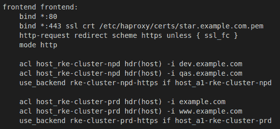
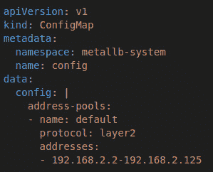

# *第十四章*：负载均衡器配置与 SSL 证书

本章我们将讨论如何使用负载均衡器和 ingress 规则将托管在 Kubernetes 内的应用程序发布到外部世界的这个非常重要的任务。我们将介绍四种主要的技术：循环 DNS、被动外部负载均衡器、主动外部负载均衡器和集成负载均衡器。我们将讨论每种技术的优缺点，并通过示例深入探讨每种方法的最佳实践。最后，我们将介绍如何为集群引入 SSL 证书。

本章中，我们将涵盖以下主要内容：

+   为什么我们需要外部负载均衡器来支持 Kubernetes 集群？

+   架构解决方案的规则

+   配置 F5 的 TCP 和 HTTP 模式

+   配置 HAProxy 的 TCP 和 HTTP 模式

+   安装和配置 MetalLB

+   什么是 Kubernetes 中的 ingress？

+   如何将 SSL 证书添加到 ingress 中

# 为什么我们需要外部负载均衡器来支持 Kubernetes 集群？

在构建 Kubernetes 集群并部署第一个应用程序之后，下一个问题就是用户如何访问我的应用程序？在传统的企业环境中，我们会将应用程序部署在一台服务器上，然后创建 DNS 记录和防火墙规则，将应用程序暴露到外部世界。当然，我们希望我们的应用程序具有**高可用性**（**HA**），因此通常会将应用程序部署在多台服务器上，然后创建一个负载均衡器，负载均衡器位于应用程序服务器前面。我们使用负载均衡器将流量分配到多个服务器，并通过允许根据需要向负载均衡器添加或移除服务器来提高应用程序的可用性。

对于 Kubernetes 集群，我们仍然面临同样的问题。我们需要将应用程序部署到多个节点上，并提供一个统一的接入点，即为我们的应用程序提供一个**虚拟 IP**（**VIP**）地址。我们的最终用户将使用这个地址来连接我们的应用程序。当然，有几种不同的方式来解决这个问题，在接下来的部分中，我们将深入探讨这些解决方案。

# 架构解决方案的规则

本节将介绍将托管在 Kubernetes 集群内的应用程序暴露到外部世界的四种主要方式。

## 循环 DNS

最直接的负载均衡技术是 `1.1.1.1`、`2.2.2.2` 和 `3.3.3.3`，然后你想发布你的应用程序 `hello-world.example.com`。你将为 `hello-world.example.com` 创建三个 `A` 记录，每个记录对应一个节点的 IP 地址。通过这样做，当客户端初次尝试连接到你的应用程序时，客户端会向其 DNS 服务器发起 DNS 查询，DNS 服务器将返回一个 IP 地址列表。大多数客户端会直接尝试连接列表中的第一个 IP 地址，如果该服务器未响应，则会尝试下一个 IP 地址，直到用完所有 IP 地址。需要注意的是，大多数 DNS 服务器/提供商只允许最多返回六个 IP 地址。

以下是使用轮询 DNS 时，不同终端用户的请求如何进入集群的示例：


图 14.1 – 三节点示例的轮询 DNS

接下来，让我们看看这个设计所带来的优缺点列表。

**优点**如下：

+   **简便性** – 轮询 DNS 是在集群中为应用程序负载均衡最简单的方式，因为你已经需要为应用程序创建 DNS 记录，因此将多个 IP 地址添加到该记录中并不需要太多工作。

+   **无需额外的服务器/硬件** – 因为我们仅使用 DNS 基础设施作为负载均衡器，所以不需要在集群前面增加额外的服务器或硬件来平衡集群的负载。

+   **成本** – 负载均衡器并非免费的。例如，AWS 中的一个简单的 **弹性负载均衡** (**ELB**) 服务的费用大约为每月 $16。大多数 DNS 解决方案（如 AWS Route53）几乎是免费的（每月 100k 次请求收费 $0.04），甚至像 CloudFlare 这样的提供商也免费；你只需支付费用如果你想要更多的功能。

**缺点**如下：

+   **缓存** – DNS 设计有多个缓存层，包括你和客户端之间的所有 DNS 服务器，甚至终端用户的机器也有内建的缓存。你只能控制 **生存时间** (**TTL**)，它告诉 DNS 服务器在请求新的查询之前需要缓存查询的时间。这可以通过将其设置为 1 秒来帮助，但这样你会给 DNS 服务器带来相当大的负担，因为你基本上关闭了该记录的缓存。

+   **没有实际的负载均衡** – 轮询 DNS 只是每次查询 DNS 服务器时轮换 IP 列表。因此，服务器负载、响应时间或服务器正常运行时间等因素在路由流量到不同节点时并没有被考虑在内。这意味着如果某个服务器崩溃或负载过重，流量仍然会被路由到该服务器，直到客户端停止尝试使用该服务器并切换到另一台服务器。对于某些客户端来说，这可能需要最多 5 分钟的时间。

+   **仅计算硬性故障** – 如果服务器出现故障，比如磁盘空间不足或与数据库连接出现问题，但服务器仍然正常运行并响应请求，DNS 对服务器的健康状况一无所知。因此，请求会以 500 错误返回给客户端。尽管列表中的下一个服务器可能完全正常，客户端仍然会继续使用该服务器。

+   **当节点变更时更新 DNS** – 每当集群中添加或移除一个节点时，你必须手动进入 DNS 并更新所有托管在该集群上的应用程序的 DNS 记录。当你开始考虑自动扩展集群时，这可能会成为一个重大问题。但你可以通过使用如 ExternalDNS 这样的服务来解决这个问题，使得 DNS 在集群随时间动态变化时得到更新。你可以通过访问[`github.com/kubernetes-sigs/external-dns`](https://github.com/kubernetes-sigs/external-dns)了解更多关于 ExternalDNS 的信息。

+   **集群外无安全性** – 因为我们只是使用 DNS 来路由流量，所以无法执行更高级的功能，如强制使用 HTTPS、阻止 SQL 注入攻击和阻止不安全的加密算法。

    注意

    大多数大规模应用使用一种名为**全球服务器负载均衡**（**GSLB**）的轮询 DNS，它通过进行健康检查，并根据服务器负载、响应时间和位置来响应请求，从而将智能引入 DNS。但是，这通常是在负载均衡服务之上进行的，以提供服务器级别的冗余，而 GSLB 提供数据中心级别的冗余。

需要注意的是，由于所有列出的缺点远远超过优点，因此不建议使用轮询 DNS。

## 被动外部负载均衡器

有时被称为**愚蠢的负载均衡器**，在这种设置中，你在集群前面创建一个**传输控制协议**（**TCP**）负载均衡器。现在，这个负载均衡器不处理你的流量的任何高级功能，即基于主机名的路由、SSL 卸载、缓存和**Web 应用防火墙**（**WAF**）。这是因为，OSI 模型中高于第 4 层的任何功能都不由负载均衡器处理，而是由 Kubernetes 集群/应用程序提供。通常，在这种设计中，你会创建一个包含所有工作节点的节点池。然后，你会在负载均衡器上创建一个 VIP，并将其映射到节点池。

注意

我们将在下一节中介绍 HAProxy 的示例。

以下是一个示例，说明最终用户流量如何通过负载均衡器路由到集群中的节点：


](img/B18053_14_02.jpg)

图 14.2 – 三节点 TCP 模式下的负载均衡器示例

接下来，让我们来看一下这个设计所提供的优缺点列表。

**优点**如下：

+   **低门槛** – 大多数本地和云环境已经有负载均衡器来支持其他非 Kubernetes 应用程序。因此，向现有负载均衡器请求额外的 VIP 地址和节点池非常容易，并且几乎不会增加项目成本。

+   `port 0`模式，它将所有 TCP/UDP 端口绑定到负载均衡器的节点上。这在暴露非 HTTP 应用程序时非常有用，使用节点端口。例如，你可以在所有节点上将 MySQL 服务器发布到端口`31001`，并通过 VIP 使用相同的端口来访问它。

+   **简单的持续维护** – 一旦 VIP 地址和节点池创建完成，在添加和移除新应用程序时，无需在负载均衡器上更新证书或站点名称。

**缺点**如下：

+   **源 IP 透明性** – 在 TCP 模式下，当负载均衡器将请求转发到服务器时，它有两个选项。第一个是保留源 IP 地址（即端用户的 IP 地址），并将其传递给服务器。服务器将处理请求和响应，因为源 IP 地址是客户端的 IP 地址。流量不会通过负载均衡器返回，而是直接发送到客户端。这对于某些应用程序可能没问题，但对于其他应用程序，如 HTTP(S)、MySQL 和 SMTP，服务器 IP 地址在请求期间发生变化时可能会出现问题。

另一个选项是所谓的 NAT 模式，它将负载均衡器转变为服务器的默认网关，这样当请求返回客户端时，负载均衡器可以抓取响应数据包并将 IP 地址恢复到原始值，然后再将其发送到客户端。当然，这也有一个缺点，就是负载均衡器需要在网络中的每个**虚拟局域网**（**VLAN**）中存在。此外，东到西流量，也就是从集群中的一个节点到另一个节点的流量（假设它们在同一子网中），不会再通过负载均衡器返回，从而导致源 IP 地址被破坏。这也意味着集群的所有网络流量都必须通过负载均衡器，包括操作系统补丁、管理软件和监控工具。

+   **每个集群需要一个负载均衡器/VIP 地址** – 在 TCP 模式下，负载均衡器无法进行基于主机的路由；每个集群都需要自己的节点池和 VIP 地址。当然，这会消耗额外的 IP 地址，而且大多数基于云的负载均衡器不支持添加 IP 地址，因此你需要为每个集群创建一个负载均衡器，这会增加你的成本。

+   **集群外的安全性有限** – 我们仅仅是在端用户和集群之间传递流量。我们无法执行更高级的功能，如强制 HTTPS、阻止 SQL 注入攻击和阻止不安全的加密方式。

+   **仅基本健康检查** – 在此模式下，负载均衡器仅检查端口是否打开并响应，但不会检查服务器是否健康。

需要记住的是，使用被动负载均衡器有一些缺点，只有在不能使用主动外部负载均衡器时，才应该使用它。我们将在下一节中介绍主动外部负载均衡器。

## 外部主动负载均衡器

在这个设计中，我们在顶部构建了一个被动外部负载均衡器，但通过将其从第 4 层移到第 7 层来增强智能，而不是盲目地在客户端和服务器之间转发流量。负载均衡器充当一个虚拟服务器，接受请求并对其进行解码，包括解密 SSL 加密，这使得负载均衡器能够根据请求的主机名做出路由决策，例如，`dev.example.com` 和 `staging.example.com` 共享相同的公共 IP 地址，但被路由到两个集群。或者，您还可以强制使用额外的安全软件，如 ModSecurity，它可以阻止各种攻击。在下图中，您可以看到一个示例设置，其中最终用户的流量通过 DNS A 记录流向负载均衡器，然后最终到达节点：


图 14.3 – HTTP 模式下的负载均衡器，包含三个节点的示例

接下来，我们来看看这个设计所提供的优缺点列表。

**优点**如下：

+   **控制** – 在 HTTP/第 7 层模式下，负载均衡器能提供更多的流量控制，因为负载均衡器充当客户端之间的*中间人攻击*。服务器允许负载均衡器根据需要检查和修改请求。

+   `www.example.com` 和 `api.example.com` 可能是两个独立的应用程序，但它们可以共享相同的 IP 地址和通配符证书，即 `*.example.com`。我们甚至可以通过使用多域名通配符 SSL 来进一步扩展，这样可以为 `*.example.com`、`*.example.net` 等域名提供证书。所有这些都可以节省费用并简化管理，因为我们现在只需一个证书即可管理所有应用程序。

+   `80` 和 `/healthz` 路径，只有在入口服务健康时才返回 `200OK`。如果服务器不健康，从负载均衡器中优雅地移除该服务器的几率要高得多。

+   `X-Forwarded-For` 头部，它向 HTTP(S) 请求添加了一组特殊头部，告诉应用程序最终用户的实际 IP 地址，而无需负载均衡器覆盖源 IP 地址，这样可以避免路由问题。

**缺点**如下：

+   `*.example.com`，我们添加了一个新的应用程序叫做`test.example.net`。我们必须确保当前的 SSL 证书和规则涵盖了这个新域名；如果没有，我们需要更新它们。如果所有应用程序都能通过诸如`*.example.com`的通配符规则来涵盖，这通常不会成为问题。但是，如果你使用了嵌套域名，如`qa1.api.example.com`和`dev.docs.example.com`，这两个嵌套域名将不会被`*.example.com`的通配符涵盖，必须使用多个证书或一个包含`*.api.example.com`和`*.docs.example.com`的多域名通配符 SSL 证书。

+   `80`，并且完成。然而，如果我们需要保持流量通过 SSL 加密，我们需要在 ingress-nginx 控制器和负载均衡器上配置 SSL 证书。我们现在可以通过使用 ingress-nginx 控制器内置的虚拟证书并配置负载均衡器忽略无效证书来轻松处理这一问题。重要的是与安全团队一起审查，以确认是否接受此方法。

+   **速度** – DNS 和第四层负载均衡速度很快，因为它们简单。大多数企业级负载均衡器可以使用专用芯片而不是软件来处理第四层，这意味着它们可以以非常高的速度运行。例如，A10 的 7655S ADC 在第四层模式下可以达到 370 Gbps 的速度，但在启用 SSL 的第七层模式下，速度降至 145 Gbps。需要注意的是，由于 CPU 的速度更快以及硬件集成的改进，这个差距正在逐步缩小。

这种方法应在更新和配置外部负载均衡器的过程是自动化的环境中使用，因为随着应用程序添加到集群中，负载均衡器需要进行更新。

## 集成负载均衡器

之前的解决方案与 Kubernetes 集群管理平面没有集成，这意味着集群及其应用的管理与负载均衡器及其配置的管理没有直接连接。当然，使用支持 Kubernetes 的负载均衡器解决了这一问题。例如，在 Amazon 的 EKS 中，您可以部署 *AWS Load Balancer Controller*，该控制器将 EKS 集群直接连接到 Amazon 的负载均衡器，并管理负载均衡器作为集群对象。例如，您可以在集群中创建一个 ingress，控制器将检测到这一更改并为您自动配置负载均衡器。需要注意的是，大多数托管的 Kubernetes 集群都提供了与自己托管的负载均衡器集成的解决方案。对于本地环境，像 F5 这样的负载均衡器已经开始提供 Kubernetes 集成解决方案，帮助弥补这个差距，包括完全替代 ingress-nginx 控制器，并让负载均衡器直接加入集群，从而能够直接访问集群内的 Pods。在下图中，您可以看到流量从最终用户流向 DNS A 记录，然后到负载均衡器，负载均衡器处理第七层会话管理，最后将流量转发到后端节点。然而，关键点在于控制器 Pod，它将更改推送回负载均衡器，以确保集群和负载均衡器保持同步。


图 14.4 – 三节点集成负载均衡器示例

接下来，让我们看看这个设计所提供的优缺点列表。

**优点**如下：

+   **简单的持续管理** – 我们添加了一个位于集群和负载均衡器之间的控制器，从管理层面进行管理。现在两者将保持同步。用户无需手动推送负载均衡器，因为应用团队在部署和更改应用时，负载均衡器会自动更新。

+   **速度** – 一些负载均衡器将 ingress-nginx 控制器替换为负载均衡器，从而直接消除了额外的开销。

**缺点**如下：

+   **控制** – 应用团队现在可以直接对生产环境的负载均衡器进行更改，这意味着他们可以推送不安全的更改，例如禁用 SSL，而网络/负载均衡团队并未看到这些更改并阻止它们。

+   **一个应用程序可能会破坏另一个** – 例如，AWS 的控制器默认允许用户为同一主机名创建两个不同的入口规则，这可能允许不良行为者通过在他们的命名空间中创建入口来从另一个应用程序中劫持流量，例如在实际应用程序上忘记更改入口的主机名并意外地将生产流量路由到应用程序的开发或 QA 实例。需要注意的是，新版本的控制器正在添加保护措施，以防止重复的入口。

如果您的环境支持，这是首选选项。需要注意的是，在大多数云环境中，这可能会增加成本，因为它们会为每个应用程序创建不同的负载均衡器。

到目前为止，我们应该对我们想要/需要的负载均衡器有了一个良好的了解。在下一节中，我们将介绍安装和配置一些最常见的负载均衡器。

# 配置 F5 在 TCP 和 HTTP 模式下

**F5 的 BIG-IP**（通常简称为 **F5**）负载均衡器在企业客户中非常流行。正因如此，Kubernetes 集群普遍使用 F5 作为它们的外部负载均衡器。本节将涵盖两种最常见的配置，即 TCP 和 HTTP 模式。

需要注意的是，本节不涵盖安装和配置 F5 硬件/设备，因为这超出了 Kubernetes/Rancher 管理员的范围。如果想了解更多信息，建议阅读 F5 的官方文档 [`www.f5.com/services/resources/deployment-guides`](https://www.f5.com/services/resources/deployment-guides)。同时建议与您的网络/负载均衡团队合作，以最好地定制以下设置以适应您的环境。

## TCP 模式

我们将首先创建服务器池，该池应包含您集群的工作节点：

1.  从 F5 Web 界面进入 **Local Traffic** | **Pools** | **Pool List**，然后点击 **Create**。

1.  给池命名。我通常以集群名称为池名称，后跟端口号。

1.  对于 **Health Monitors** 选项，选择 **http**。

1.  进入 `80`

1.  **服务**：**HTTP**

1.  完成时点击 **Finish**。

1.  您需要重复此过程来设置端口 `443`。


图 14.5 – F5 节点池配置示例

我们还需要创建前端，或者 F5 称之为虚拟服务器：

1.  从 F5 Web 界面进入 **Local Traffic** | **Virtual Servers** | **Virtual Server List** 页面，然后点击 **Create**。

1.  给虚拟服务器命名。我通常与池名称相同。

1.  对于 **类型** 选项，选择 **Performance (Layer 4)**。

1.  您需要在 **Destination Address/Mask** 字段中输入负载均衡器分配的 VIP 地址。

1.  对于带有 **HTTP** 类型的 `80`。

1.  其余设置可以保持默认值，您应点击 `443` 和 **HTTPS**。


图 14.6 – F5 虚拟服务器设置

此时，我们需要将前端（虚拟服务器）与后端（池）链接起来：

1.  转到虚拟服务器并点击 **资源** 标签。

1.  在 **负载均衡** 部分设置 `80` 池，并点击 **更新** 以应用更改。

1.  对端口 `443` 重复此过程。


图 14.7 – F5 绑定池和虚拟服务器

此时，您应该能够通过 VIP 地址访问您的 Kubernetes/Rancher 集群。需要记住的是，这仍然是 TCP 模式，因此 F5 仅仅是传递流量，这意味着入口控制器需要处理 SSL 等项目。

## HTTP 模式

我们将按照在 TCP 模式下为 HTTP 模式创建池所采取的相同步骤进行操作。我们需要进行的唯一更改是在虚拟服务器中：

+   对于 **虚拟服务器** 类型，请选择 **性能 (HTTP)**，而不是 **性能 (Layer 4)**，然后点击 **完成**。

+   对端口 `443` 重复此过程，但这次选择服务器类型为 **标准**，并将 **SSL 配置文件（客户端）** 指向您的 SSL 证书。

此时，您应该能够像在 TCP 模式下那样访问您的集群，但不同之处在于负载均衡器为您处理 SSL，您不会遇到前一部分讨论过的源 IP 地址问题。

在下一部分，我们将介绍另一款流行的负载均衡软件 HAProxy。

# 配置 HAProxy 以与 Kubernetes 配合使用

本节将涵盖为内部和外部部署安装和配置 HAProxy。需要注意的是，本节列出的示例是通用的，旨在涵盖最常见的环境。但您应理解，每个环境和工作负载都是不同的，这可能需要对本节中列出的设计进行调优和修改。此外，本节中我们将使用 HAProxy 的社区版，但对于需要支持和附加付费功能的用户，他们也提供 HAProxy 企业版。您可以在 [`www.haproxy.com/products/community-vs-enterprise-edition/`](https://www.haproxy.com/products/community-vs-enterprise-edition/) 查阅有关差异的详细信息。

首先，我们将介绍如何在独立的服务器（非 Kubernetes 集群的一部分）上安装 HAProxy。

注意

在开始此过程之前，我们假设您已经构建好了服务器，并已应用最新的补丁，同时拥有对服务器的`root/sudo`权限。此外，撰写时 v2.5 是当前的最新稳定版本。您应当在官方 HAProxy 社区网站 [`www.haproxy.org/`](https://www.haproxy.org/) 查看发布说明和版本建议。

## 在 Ubuntu/Debian 系统上安装 HAProxy

对于 Ubuntu 和基于 Debian 的系统，默认包仓库中捆绑的 HAProxy 版本通常落后当前发布版本一到两个小版本，更重要的是，可能会缺少重要的安全更新，直到下一个主要版本发布。由于我们正在处理一个可能公开访问的负载均衡器，并且它会成为攻击者的重要目标，我们需要确保运行的是最新版本并且已安装最新的安全补丁。因此，我们将使用**个人软件包档案**（**PPA**）仓库来进行此安装。

我们需要通过访问[`haproxy.debian.net/`](https://haproxy.debian.net/)并填写表单来生成安装步骤。这将生成两组命令，第一组命令用于添加 PPA 仓库，第二组命令用于安装 HAProxy。


图 14.8 – PPA 和安装向导

到此，我们应该已经在 Ubuntu 服务器上安装了 HAProxy。在接下来的部分中，我们将介绍 Red Hat/CentOS 服务器的安装步骤。

## Red Hat/CentOS

就像 Ubuntu 和基于 Debian 的系统一样，默认包仓库中捆绑的 HAProxy 版本通常落后当前发布版本一到两个小版本，更重要的是，可能会缺少重要的安全更新，直到下一个主要版本发布。因此，通常建议从源代码构建 HAProxy，相关步骤可以在这里找到：

1.  通过运行以下命令来安装编译二进制文件的必要先决条件：

    ```
    yum install gcc pcre-static pcre-devel -y`
    ```

1.  使用以下命令下载源代码：

    ```
    cd /opt; wget https://www.haproxy.org/download/2.5/src/haproxy-2.5.4.tar.gz"
    ```

    注意

    在选择版本之前，您应该查看推荐的版本。

1.  运行以下命令来构建和安装 HAProxy：

    ```
    make clean
    make -j $(nproc) TARGET=linux-glibc USE_OPENSSL=1 USE_LUA=1 USE_PCRE=1 USE_SYSTEMD=1
    make install
    mkdir -p /etc/haproxy
    mkdir -p /var/lib/haproxy 
    touch /var/lib/haproxy/stats
    ```

到此，我们应该已经安装了 HAProxy，接下来需要为其创建一个配置文件，我们将在以下部分使用列出的示例作为起始点。

## TCP 模式

在本节中，我们将介绍一些示例配置文件，这些文件可以作为您环境中 TCP 负载均衡器的起始点。需要注意的是，这是最基础的配置。

完整的配置文件可以在[`github.com/PacktPublishing/Rancher-Deep-Dive/main/ch14/example-configs/haproxy/tcp-mode.cfg`](https://github.com/PacktPublishing/Rancher-Deep-Dive/main/ch14/example-configs/haproxy/tcp-mode.cfg)找到。但是，关键部分如下所示，它绑定到`80`和`443`端口，并将流量直接传递给后端服务器节点 01/02/03：


图 14.9 – HAProxy TCP 模式

正如我们在配置文件中看到的，我们正在为`80`和`443`端口创建前端和后端配置，且两者都在 TCP 模式下运行，因为我们希望负载均衡器将流量直接从前端端口传递到后端端口。

## HTTP 模式

在这一部分中，我们将介绍一些可以作为 HTTP 负载均衡器环境起点的示例配置文件。

完整的配置文件可以在 [`github.com/PacktPublishing/Rancher-Deep-Dive/main/ch14/example-configs/haproxy/http-mode.cfg`](https://github.com/PacktPublishing/Rancher-Deep-Dive/main/ch14/example-configs/haproxy/http-mode.cfg) 找到。此配置文件的关键部分是 `80` 和 `443` 端口共用一个前端。然后，在前端中，我们定义了 SSL 证书，它存储在 `/etc/haproxy/certs/star.example.com.pem` 中。接下来，我们配置了一个 `rke-cluster-npd` 集群，生产流量会被转发到 `rke-cluster-prd`。此配置还包括一个运行 SSL 的后端配置示例。

这是配置文件的前端部分：



图 14.10 – HAProxy HTTP 模式前端

需要注意的是，由于我们使用的是 HTTP 模式，我们可以让多个集群和应用程序共享一个负载均衡器。如前面的示例所示，我们将 `dev.example.com` 指向非生产集群，将 `example.com` 指向生产集群。

这些是后端设置：


图 14.11 – HAProxy HTTP 模式后端

如你所见，我们创建了两个不同的后端，每个集群一个。我们还将所有后端流量发送到端口 `443`（SSL），因为 `http-request redirect scheme https unless { ssl_fc }` 前端规则会将所有 HTTP 流量重定向到 HTTPS。

到此为止，我们应该已经成功启动 HAProxy 并能够访问托管在 Kubernetes 集群上的应用程序。在下一部分中，我们将介绍 MetalLB，它无需外部负载均衡器。

# 安装和配置 MetalLB

当然，问题总是会出现——如果我不想使用外部负载均衡器，但仍然希望我的集群具有高可用性怎么办？这就是 MetalLB 发挥作用的地方。MetalLB 是一个为运行在裸金属上的 Kubernetes 集群提供的负载均衡器，使用标准的路由协议。该项目仍处于初期阶段，应该被视为 Beta 版本。关于这一点可以参考 *项目成熟度* 页面：[`metallb.universe.tf/concepts/maturity/`](https://metallb.universe.tf/concepts/maturity/)。

MetalLB 可以在两种模式下进行配置。我们将介绍的第一种是第二层模式，这是最简单的配置；第二种是 **边界网关协议**（**BGP**）模式，通常由更高级的用户或环境使用；这两种模式的安装步骤相同。

运行以下两个命令来创建命名空间并安装 MetalLB 控制器：

```
kubectl apply -f https://raw.githubusercontent.com/metallb/metallb/v0.12.1/manifests/namespace.yaml
```

```
kubectl apply -f https://raw.githubusercontent.com/metallb/metallb/v0.12.1/manifests/metallb.yaml
```

注意

你可以在[`metallb.universe.tf/installation/`](https://metallb.universe.tf/installation/)找到有关为非 Rancher 集群定制此安装的更多详细信息，包括如何使用 Helm 图表。

对于 Layer 2 模式，我们需要为 MetalLB 配置一个 IP 地址范围。确保该范围与其余节点位于同一子网中非常重要。

只需创建以下 configmap：



图 14.12 – MetalLB Layer 2 ConfigMap

你可以在官方文档中找到此配置的详细信息，文档位于[`metallb.universe.tf/configuration/#layer-2-configuration`](https://metallb.universe.tf/configuration/#layer-2-configuration)。

对于 BGP 模式，我们需要一台支持 BGP 的路由器，MetalLB 可以连接到该路由器，并为 MetalLB 提供一个**自治系统**（**AS**）号，以及一个集群的网络 CIDR 前缀。BGP 配置也通过 configmap 进行配置；一个示例可以在下图中找到：


图 14.13 – MetalLB BGP ConfigMap

你可以在官方文档中找到此配置的完整详情，文档位于[`metallb.universe.tf/configuration/#bgp-configuration`](https://metallb.universe.tf/configuration/#bgp-configuration)。

到此为止，我们应该已经启动并运行了 MetalLB。要使用 MetalLB 的 IP 地址，我们需要创建一个类型为`LoadBalancer`的服务记录，此时 MetalLB 会处理剩下的部分。你可以在[`metallb.universe.tf/usage/`](https://metallb.universe.tf/usage/)找到完整的细节。

# 什么是 Kubernetes 中的 Ingress？

Kubernetes ingress 是一个标准对象，定义了一组规则，用于将外部流量路由到 Kubernetes 集群。这包括设置 SSL 证书、名称或基于路径的路由到不同的 pod。Ingress 规则围绕 HTTP 和 HTTPS 流量设计。

以下是一个配置示例，其中配置的中心部分是`rules`部分，在此示例中为`foo.bar.com`。此规则将流量引导到`server1`服务。需要注意的是，`rules`部分简单且非常通用。此部分必须遵循 Kubernetes 标准，这使得你可以更换入口控制器；例如，RKE1/2 默认带有 nginx，但你可以选择将 nginx 替换为 Traefik。

但当然，如果你需要比`rules`部分允许的更多自定义入口，你可以使用注解；例如，将`nginx.ingress.kubernetes.io/ssl-redirect=true`添加到 Ingress nginx 中，将会把所有非 SSL 流量引导到该 Ingress 的 SSL 端口。你可以在官方文档中找到所有注解，网址为[`kubernetes.github.io/ingress-nginx/user-guide/nginx-configuration/annotations/`](https://kubernetes.github.io/ingress-nginx/user-guide/nginx-configuration/annotations/)。

一个示例的 ingress 配置如下：


图 14.14 – Ingress 示例 YAML

如您所见，我们为两个主机名 `foo.bar.com` 和 `*.bar.com` 定义了 ingress，每个主机名将流量路由到不同的后端服务，如部署。此时，我们应该已经设置了 ingress，并能够通过 HTTP 访问测试应用程序。但正如我们所知，公司和浏览器要求站点支持 SSL，否则会弹出关于不安全的警告消息。因此，在下一部分中，我们将讲解如何为此 ingress 添加 SSL 证书。

# 如何向 ingress 添加 SSL 证书

要在 ingress 中使用 SSL 证书，您必须创建一种特定类型的秘密，称为 `kubernetes.io/tls`，稍后将显示一个示例。需要注意的是，值必须以 `base64` 编码 PEM 格式。您可以通过运行以下命令让 kubectl 为您处理此事：

```
kubectl create secret tls test-tls --key="tls.key" --cert="tls.crt"
```

建议您在 `tls.crt` 中包含完整的证书链。此外，此秘密必须位于与 ingress 规则相同的命名空间中：


图 14.15 – TLS 示例 YAML

一旦创建了秘密（secret），只需将以下部分添加到您的 ingress 配置中，包括秘密名称和此秘密所涵盖的主机名。您可以为单个 ingress 规则定义多个证书和主机，但通常建议将 ingress 限制为单个应用程序：


图 14.16 – 将 TLS 添加到 ingress

此时，我们应该能够使用 ingress 规则将托管在集群中的应用程序发布到外部世界，并为我们的应用程序提供 SSL 支持。

# 总结

本章讨论了四种主要的负载均衡器设计：轮询 DNS、被动外部负载均衡器、主动外部负载均衡器和集成负载均衡器。我们接着讨论了每种设计的优缺点和一些示例，包括在哪些情况下最合适，然后我们深入配置了 F5 中的 TCP 和 HTTP 模式负载均衡器。接着我们讨论了创建 HAProxy 服务器的安装步骤，包括一些示例配置。我们还介绍了一款名为 MetalLB 的新软件，它完全取代了负载均衡器。最后，我们总结了本章内容，讲解了什么是 ingress 以及如何创建它。这非常重要，因为大多数托管在 Kubernetes 中的应用程序需要发布到外部世界，我们需要以高可用的方式进行发布。

在下一章中，我们将深入探讨故障排除 Rancher 和 Kubernetes 集群的问题，包括如何修复一些常见问题，以及如何设置实验环境来练习从这些问题中恢复。
