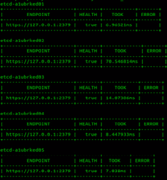
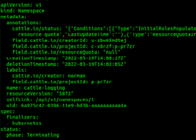
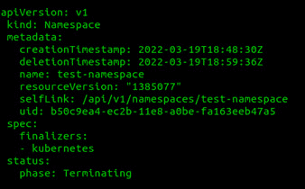
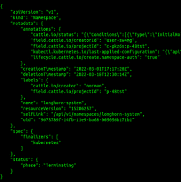

# *第十五章*：Rancher 和 Kubernetes 故障排除

在本章中，我们将探讨 Kubernetes 的主组件、它们之间的相互作用，以及如何排除最常见的问题。接下来，我们将探讨一些常见的故障场景，包括识别故障并尽快解决它们，使用 Rancher 支持团队在支持企业客户时使用的相同故障排除步骤和工具。然后，我们将讨论从一些常见的集群故障中恢复。本章包括在实验室环境中重现所有这些故障的脚本和文档（基于实际事件）。

在本章中，我们将涵盖以下主要主题：

+   从 etcd 分裂脑恢复 RKE 集群

+   从 etcd 备份中重建

+   Pod 未能与 OPA Gatekeeper 一起调度

+   一个失控的应用程序在整个集群中横冲直撞

+   轮换 kube-ca 会破坏我的集群吗？

+   命名空间处于终止状态

+   RKE 集群的常规故障排除

# 从 etcd 分裂脑恢复 RKE 集群

在本节中，我们将讨论什么是 etcd 分裂脑，如何检测它，最后，如何从中恢复。

## 什么是 etcd 分裂脑？

Etcd 是一个基于领导者的分布式系统。Etcd 确保领导者节点定期向所有跟随者发送心跳，以保持领导者租约。Etcd 要求大多数节点保持在线并健康，以便根据**(n+1)/2**成员模型接受写入。当不到一半的 etcd 成员失败时，etcd 集群仍然可以接受读/写请求。例如，如果你有一个五节点的 etcd 集群并丢失两个节点，Kubernetes 集群仍然可以运行。但是，如果再丢失一个节点，那么 etcd 集群将失去法定人数，剩余的节点将进入只读模式，直到恢复法定人数为止。

故障发生后，etcd 集群将进入恢复过程。第一步是选举一个新的领导者，验证集群中大多数成员的健康状态——也就是说，响应健康检查。领导者随后将把集群恢复到健康状态，并开始接受`写`请求。

现在，另一个常见的故障场景是我们所说的**网络分区**。这发生在 etcd 集群中的大部分或所有节点失去彼此的访问权限，这通常发生在基础设施故障期间，例如交换机故障或存储故障。但如果你有一个偶数个 etcd 节点，也可能发生这种情况——例如，如果你在数据中心*A*中有三个 etcd 节点，在数据中心*B*中也有三个 etcd 节点。

重要提示

不建议在两个数据中心运行 etcd。

然后，数据中心之间的网络连接失败。在这种情况下，这意味着所有 etcd 节点将进入只读模式，因为丧失了法定人数。

如果你在上述场景中有奇数个节点，通常不会遇到分脑集群的情况。但它仍然可能发生。当然，出现的问题是，什么是`initial-cluster-token`。当节点加入该集群时，每个节点将被分配一个唯一的成员 ID，并接收到集群 ID。此时，新节点将从集群中的其他成员同步数据。

集群 ID 发生变化的原因只有三种：

+   第一个原因是数据损坏；这是一种罕见的情况（我之前只在一次有意进行的数据损坏测试中见过），即使用`dd`命令将随机数据写入存储 etcd 数据库文件系统的驱动器。大多数情况下，etcd 内置的安全措施和一致性检查可以防止这种情况发生。

+   错误配置是第二个原因，这种情况在有人进行集群更改时更为常见。例如，当 etcd 节点失败时，一些用户会尝试添加新的 etcd 节点，但没有先移除故障节点，导致新节点无法正确加入，从而将集群置于一个奇怪的损坏状态。新节点有时会生成一个新的集群 ID，而不是加入现有的节点。

+   第三个原因是 etcd 恢复失败。在 etcd 恢复过程中，会创建一个新的 etcd 集群，第一个节点作为引导节点来创建新集群，并将原始数据注入到该新集群中。其余的 etcd 节点应加入*新的*etcd 集群，但如果 Rancher 与集群/节点之间的连接不稳定，或者`Rancher/RKE/RKE2`存在 bug，可能会导致此过程失败。另一个原因是恢复过程在途中失败，导致一些 etcd 节点仍然运行旧的数据，而另一些节点则运行*更新*的数据。

现在我们知道了 etcd 是如何进入分脑状态的。在下一节中，我们将讨论如何在实际环境中识别此问题，包括你应该查找的常见错误消息。

## 识别常见的错误消息

当 etcd 进入分脑状态时，通常会在集群被发现离线时出现——也就是说，向 kube-apiserver(s)的请求开始失败，通常会表现为集群在 Rancher UI 中显示为离线状态。

你应该运行以下命令以用于`RKE(1)`集群，并检查输出结果：

```
Error messages in etcd logs:
`docker logs --tail 100 -f etcd`
```

2021-05-04 07:50:10.140405 E | rafthttp: 请求的集群 ID 不匹配（得到 ecdd18d533c7bdc3，期望 a0b4701215acdc84）

2021-05-04 07:50:10.142212 E | rafthttp: 发送的请求被忽略（集群 ID 不匹配：peer[fa573fde1c0b9eb9]=ecdd18d533c7bdc3，本地=a0b4701215acdc84）

2021-05-04 07:50:10.155090 E | rafthttp: 发送的请求被忽略（集群 ID 不匹配：peer[fa573fde1c0b9eb9]=ecdd18d533c7bdc3，本地=a0b4701215acdc84）

```
```

请注意，输出中`fa573fde1c0b9eb9`成员响应的集群 ID 与本地副本不同。我们将进入 etcd 容器，然后使用 etcd 命令行工具连接到 etcd 服务器。最后，我们运行`member list`子命令来显示此 etcd 集群中的所有节点：

```
Unhealthy members in etcd cluster:
`docker exec -e ETCDCTL_ENDPOINTS=$(docker exec etcd /bin/sh -c "etcdctl member list | cut -d, -f5 | sed -e 's/ //g' | paste -sd ','") etcd etcdctl member list`
```

15de45eddfe271bb，已启动，etcd-a1ublabat03，https://172.27.5.33:2380，https://172.27.5.33:2379，false

1d6ed2e3fa3a12e1，已启动，etcd-a1ublabat02，https://172.27.5.32:2380，https://172.27.5.32:2379，false

68d49b1389cdfca0，已启动，etcd-a1ublabat01，https://172.27.5.31:2380，https://172.27.5.31:2379，false

```
```

请注意，输出显示所有 etcd 成员的状态都是`started`，这可能会让你认为它们都处于健康状态，但这个输出可能会误导，特别是这些成员已成功加入集群：

```
Endpoint health:
`docker exec -e ETCDCTL_ENDPOINTS=$(docker exec etcd /bin/sh -c "etcdctl member list | cut -d, -f5 | sed -e 's/ //g' | paste -sd ','") etcd etcdctl endpoint health`
```

https://172.27.5.31:2379 状态正常：提案提交成功：耗时 = 66.729472ms

https://172.27.5.32:2379 状态正常：提案提交成功：耗时 = 70.804719ms

https://172.27.5.33:2379 状态正常：提案提交成功：耗时 = 71.457556ms

```
```

请注意，输出显示所有 etcd 成员都报告健康，尽管其中一个成员的集群 ID 错误。这个输出报告了 etcd 进程正在运行，并响应其健康检查端点。

你应该运行以下命令来检查 RKE2 集群并查看输出：

```
Error messages in etcd logs:
`tail -f /var/log/pods/kube-system_etcd-*/etcd/*.log`
```

请注意，输出与 RKE1 集群的输出非常相似，唯一的区别是 etcd 作为 Pod 运行，而不是独立容器。在以下命令中，我们进行一个`for`循环，遍历每个 etcd 服务器并测试其端点。这个端点将告诉我们 etcd 服务器是否健康或存在问题：

```
Unhealthy members in etcd cluster:
`for etcdpod in $(kubectl -n kube-system get pod -l component=etcd --no-headers -o custom-columns=NAME:.metadata.name); do echo $etcdpod; kubectl -n kube-system exec $etcdpod -- sh -c "ETCDCTL_ENDPOINTS='https://127.0.0.1:2379' ETCDCTL_CACERT='/var/lib/rancher/rke2/server/tls/etcd/server-ca.crt' ETCDCTL_CERT='/var/lib/rancher/rke2/server/tls/etcd/server-client.crt' ETCDCTL_KEY='/var/lib/rancher/rke2/server/tls/etcd/server-client.key' ETCDCTL_API=3 etcdctl --write-out=table endpoint health"; echo ""; done;`
```

在以下截图中，我们可以看到我们正在测试五个 etcd 服务器，每个服务器报告的健康状态为`true`，并显示每个服务器响应健康检查请求所需的时间。最后，最后一个块将显示是否存在已知的 etcd 服务器错误：



图 15.1 – RKE2 端点健康输出表格

请注意，输出显示了每个主节点的健康状态。需要特别注意的是，该脚本使用`kubectl`连接到每个 etcd Pod，并运行`etcdctl endpoint health`命令，检查自身健康。

如果`kubectl`不可用，你可以通过 SSH 登录到每个主节点并运行以下命令：

```
```

```

```

export CRI_CONFIG_FILE=/var/lib/rancher/rke2/agent/etc/crictl.yaml

```

```

etcdcontainer=$(/var/lib/rancher/rke2/bin/crictl ps --label io.kubernetes.container.name=etcd --quiet)

```

```

/var/lib/rancher/rke2/bin/crictl exec $etcdcontainer sh -c "ETCDCTL_ENDPOINTS='https://127.0.0.1:2379' ETCDCTL_CACERT='/var/lib/rancher/rke2/server/tls/etcd/server-ca.crt' ETCDCTL_CERT='/var/lib/rancher/rke2/server/tls/etcd/server-client.crt' ETCDCTL_KEY='/var/lib/rancher/rke2/server/tls/etcd/server-client.key' ETCDCTL_API=3 etcdctl endpoint health --cluster --write-out=table"

```

```

```
```

此命令直接连接到容器进程。

要从这个问题中恢复 RKE(1)集群，您可以尝试以下步骤：

1.  通过运行`rke up --config cluster.yml`命令触发集群更新过程，或者对于 Rancher 管理的 RKE(1)集群，您需要更改集群设置。

1.  如果`rke up`命令失败，请使用`etcd-tools`，可以在[`github.com/rancherlabs/support-tools/tree/master/etcd-tools`](https://github.com/rancherlabs/support-tools/tree/master/etcd-tools)找到，手动重建 etcd 集群。

1.  如果`etcd-tools`失败，您需要从 etcd 快照恢复集群。

到此为止，我们已经知道如何解决类似的 etcd 故障。接下来，我们需要采取措施防止这些问题再次发生。在下一部分中，我们将介绍一些常见的步骤，您可以采取这些步骤来保护您的集群。

以下是需要执行的预防性任务：

+   如果托管在 VMware 中，使用**VM 反亲和性**规则确保 etcd 节点托管在不同的**ESXi**主机上。可以在[`docs.vmware.com/en/VMware-vSphere/7.0/com.vmware.vsphere.resmgmt.doc/GUID-FBE46165-065C-48C2-B775-7ADA87FF9A20.html`](https://docs.vmware.com/en/VMware-vSphere/7.0/com.vmware.vsphere.resmgmt.doc/GUID-FBE46165-065C-48C2-B775-7ADA87FF9A20.html)找到**VMware 知识库**。

+   如果托管在云服务提供商中，例如`etcd1`在`us-west-2a`和`etcd2`在`us-west-2b`。

+   仅以滚动方式应用补丁。示例脚本可以在[`github.com/mattmattox/Kubernetes-Master-Class/blob/main/disaster-recovery/etcd-split-brain/rolling_reboot.sh`](https://github.com/mattmattox/Kubernetes-Master-Class/blob/main/disaster-recovery/etcd-split-brain/rolling_reboot.sh)找到。

要在实验室环境中重现此问题，您应按照[`github.com/mattmattox/Kubernetes-Master-Class/tree/main/disaster-recovery/etcd-split-brain#reproducing-in-a-lab`](https://github.com/mattmattox/Kubernetes-Master-Class/tree/main/disaster-recovery/etcd-split-brain#reproducing-in-a-lab)中的步骤操作。请注意，此过程仅适用于 RKE(1)集群，因为 RKE2 由于内置的自愈过程，找到一个可重复的过程非常困难。

到此为止，我们已经处理了一个损坏的 etcd 集群，并需要在原地恢复集群。当然，我们需要将此过程推进到下一步，即当集群丢失并需要重建时如何恢复。在下一部分中，我们将讨论从零开始重建集群的步骤。

# 从 etcd 备份重建

集群数据，包括部署（Deployments）、密钥（Secrets）和配置映射（configmap），都存储在 etcd 中。使用 RKE1/2，我们可以进行 etcd 备份并使用备份初始化集群。此功能在发生灾难（例如大规模存储中断或集群数据意外删除）时非常有用。

对于 RKE v0.2.0 及更高版本，etcd 备份默认启用。在默认设置下，RKE 每 12 小时会备份一次，并在每个 etcd 节点本地保留 6 份备份，保存在 `/opt/rke/etcd-snapshots` 目录。你当然可以通过在 Rancher UI 的 `cluster.yaml` 文件中覆盖这些值来自定义这些设置，相关文档可以在 [`rancher.com/docs/rke/latest/en/etcd-snapshots/recurring-snapshots/#configuring-the-snapshot-service-in-yaml`](https://rancher.com/docs/rke/latest/en/etcd-snapshots/recurring-snapshots/#configuring-the-snapshot-service-in-yaml) 找到。

最重要的设置是亚马逊 **简单存储服务** (**S3**) 设置，它允许你将 etcd 快照存储在 S3 存储桶中，而不是本地存储在 etcd 节点上。这一点非常重要，因为我们希望将备份存储到备份服务器之外。请注意，RKE 使用标准的 S3 GO 库，支持任何符合 S3 标准的 S3 提供商。例如，你可以使用 **Wasabi** 替代 AWS S3，但不能使用 **Azure Blob**，因为它不完全兼容 S3。在一些不允许将数据发送到云的环境中，你可以使用一些企业存储阵列，如 **NetApp** 和 **EMC**，它们可以成为 S3 提供商。

RKE 可以将 etcd 快照恢复到同一集群或新集群中。要恢复 etcd，请运行 `rke etcd snapshot-restore --name SnapshotName` 命令，其余的由 RKE 处理。将快照恢复到新集群略有不同，因为 etcd 快照会恢复所有集群数据，包括诸如*旧*节点的节点对象等内容。此外，Kubernetes 证书会被重新生成。这导致服务账户令牌失效，从而导致多个服务（如 `canal`、`coredns` 和 `ingress-nginx-controllers`）中断。为了解决这个问题，我创建了一个脚本，删除了所有损坏的服务账户令牌，并回收了服务和节点。这个脚本可以在 [`github.com/mattmattox/Kubernetes-Master-Class/tree/main/disaster-recovery/rebuild-from-scratch#restoringrecovering`](https://github.com/mattmattox/Kubernetes-Master-Class/tree/main/disaster-recovery/rebuild-from-scratch#restoringrecovering) 找到。

你可以在 Rancher 官方文档中找到关于备份和恢复过程的更多细节，文档地址为 [`rancher.com/docs/rke/latest/en/etcd-snapshots/`](https://rancher.com/docs/rke/latest/en/etcd-snapshots/)。

在 RKE2 集群中，你可以使用内置的 `rke2` 命令在主节点上恢复 etcd 快照，步骤如下：

1.  使用 `systemctl stop rke2-server` 命令在所有主节点上停止 `rke2`。

1.  在其中一个主节点上使用`rke2 server --cluster-reset`命令重置集群。此命令会创建一个仅包含单个节点的新 etcd 集群。

1.  使用`mv /var/lib/rancher/rke2/server/db/etcd /var/lib/rancher/rke2/server/db/etcd-old-%date%`命令清理其他主节点。

1.  然后，通过运行`systemctl start rke2-server`命令重新将其他主节点加入集群。

你可以在官方 RKE2 文档中找到更多关于此过程的详细信息，地址：[`docs.rke2.io/backup_restore/`](https://docs.rke2.io/backup_restore/).

到此时，你应该能够进行 etcd 备份，并仅使用该备份重新构建集群。此过程包括 RKE1 和 RKE2 集群。

# 如何解决由于 OPA Gatekeeper 导致的 Pods 无法调度的问题

正如我们在*第十二章*《使用 OPA Gatekeeper 的安全性与合规性》一章中所述，`ValidatingWebhookConfigurations`用来筛选发送到 kube-apiserver 的更新请求，以验证它们是否通过 OPA Gatekeeper 策略。如果 OPA Gatekeeper Pod(s)宕机，这些请求将失败，从而导致 kube-scheduler 出现问题，因为所有的更新请求都会被阻止。这意味着所有新的 Pods 将无法创建。

重要说明

OPA Gatekeeper 可以设置为`fail open`——即如果 OPA Gatekeeper 宕机，假设它会被批准并继续前进。我曾在较大的集群中看到，OPA Gatekeeper 超时造成的延迟给 kube-apiserver 带来了巨大的负载，导致集群离线。

你可以通过查看以下命令的 kube-scheduler 日志来识别此问题：

1.  对于 RKE(1)集群，如果输出如下所示，请运行`docker logs --tail 10 -t kube-scheduler`命令。这表明 kube-scheduler 在连接 OPA Gatekeeper 服务端点时遇到问题：

    ```
    2021-05-08T04:44:41.406070907Z E0508 04:44:41.405968       1 leaderelection.go:361] Failed to update lock: Internal error occurred: failed calling webhook "validation.gatekeeper.sh": Post "https://gatekeeper-webhook-service.gatekeeper-system.svc:443/v1/admit?timeout=3s": dial tcp 10.43.104.236:443: connect: connection refused
    ```

    ```

2.  By running the following command, you can discover which RKE server is currently hosting the kube-scheduler leader:

    ```

    ```
    NODE="$(kubectl get leases -n kube-system kube-scheduler -o 'jsonpath={.spec.holderIdentity}' | awk -F '_' '{print $1}')"
    echo "kube-scheduler is the leader on node $NODE"
    ```

    ```

3.  For RKE2 clusters, it's a little different because kube-scheduler runs as a pod instead of a standalone container. You can use the following command to show the logs for all the kube-scheduler Pods:

    ```

    kubectl -n kube-system logs -f -l component=kube-scheduler

    ```

To recover from this issue, you need to restore the OPA Gatekeeper Pods, but this is a problem because all new Pod creations are being blocked. To work around this issue, we need to remove the webhook, allowing OPA Gatekeeper to restart successfully before restoring the webhook:

1.  First, try setting the failure policy to open using the following command:

    ```

    kubectl get ValidatingWebhookConfiguration gatekeeper-validating-webhook-configuration -o yaml | sed 's/failurePolicy.*/failurePolicy: Ignore/g' | kubectl apply -f -.

    ```

2.  If the open policy doesn't work, backup and remove all Gatekeeper admission checks, using the following commands:

    ```

    kubectl get validatingwebhookconfigurations.admissionregistration.k8s.io gatekeeper-validating-webhook-configuration -o yaml > webhook.yaml

    kubectl delete validatingwebhookconfigurations.admissionregistration.k8s.io gatekeeper-validating-webhook-configuration.

    ```

3.  Monitor the cluster and wait for the cluster to stabilize.
4.  Restore the webhook using the `kubectl apply -f webhook.yaml` command.

At this point, you should be able to recover from an OPA Gatekeeper outage. In addition, you should be able to use these steps for recovery of other software that uses webhooks in your cluster.

# A runaway app stomping all over a cluster

One question that comes up a lot is, *How can a single app bring down my cluster?*

Let's say an application was deployed without CPU and memory limits. Pods can consume so much of a node's resources that the node becomes unresponsive, causing the node to go into an unschedulable state – that is, not ready. kube-scheduler is configured to reschedule the Pods running on the node after 5 minutes (default). This will break that node, and the process will repeat until all nodes are broken.

Important Note

Most of the time, the node will crash and self-recover, meaning you'll only see nodes flipping up and down as the Pods are bouncing between nodes. But I have seen environments where the nodes become locked up but don't restart.

You can identify this issue by reviewing the cluster event using the `kubectl get events -A` command, which shows the Pod events for all namespaces. And what we are looking for is a large number of Pod evictions, which is Kubernetes moving the Pods from the dying/dead node. You can also review the current CPU and memory of the present running Pods by using the `kubectl top Pod -A` command, which breaks the usage by the Pod. It's also recommended that you review any monitoring software such as **Prometheus** to watch the node resource usage over time.

To recover from this issue, you need to disable the Pod/workload, with an example being to scale the deployment to zero using the `kubectl -n <namespace> scale deployment/<deployment name> --replicas=0` command, and then to prevent the issue from happening again, you should add resource limits and a request to all workloads by adding the following settings:

```

```
```

```
    resources:
```

```
    limits:
```

```
      cpu: "800m"
```

```
      mem: "500Mi"
```

```
    requests:
```

```
      cpu: "500m"
```

```
      mem: "250Mi"
```

```
```

```

It is important to note that in *Chapter 12*, *Security and Compliance Using OPA Gatekeeper*, we covered how to use OPA Gatekeeper to enforce these settings on all Pods in your cluster, and it is highly recommended that you use that policy, which can be found at [`docs.rafay.co/recipes/governance/limits_policy/`](https://docs.rafay.co/recipes/governance/limits_policy/).

To reproduce this issue in the lab, you can find an example application, located at [`github.com/mattmattox/Kubernetes-Master-Class/tree/main/disaster-recovery/run-away-app`](https://github.com/mattmattox/Kubernetes-Master-Class/tree/main/disaster-recovery/run-away-app).

At this point, you should be able to detect a runaway application in your cluster. Then, you should be able to apply resource requests and limits to stop the application from damaging your cluster. Finally, we covered how to use OPA Gatekeeper to prevent this issue in the future.

# Can rotating kube-ca break my cluster?

What is kube-ca, and how can it break my cluster?

Kubernetes protects all of its services using SSL certificates, and as part of this, a `kube-service-account-token` certificate signs as part of the authentication model. This means that if that chain is broken, kubectl and other Kubernetes services will choose the safest option and block the connection as that token can no longer be trusted. And of course, several services such as `canal`, `coredns`, and `ingress-nginx-controller` use `service-account-token` in order to communicate and authenticate with the cluster.

Typically, with RKE1/2, the kube-ca certificate is valid for 10 years. So typically, there is no need for this certificate ever to be rotated. But it can be for a couple of reasons, the first being because of cluster upgrade. Sometimes, during a Kubernetes upgrade, cluster services change to different versions, requiring new certificates to be created. But most of the time, this issue is accidentally caused when someone runs the `rke up` command but it is missing, or has an out-of-date `cluster.rkestate` file on their local machine. This is because the `rkestate` file stores the certificates and their private keys. When `RKE` defaults to generating these certificates, i.e., starts building a new cluster if this file is missing. This process typically fails, as some services such as `kubelet` are still using the old certificates and tokens so never go into a healthy state, causing the `rke up` process to error out. But `RKE` will leave the cluster in a broken state.

At this point, you should have a better understanding of what kube-ca is and how rotating it can affect your cluster. In addition, you should be able to fix the cluster using the `rke up` command.

# How to fix a namespace that is stuck in terminating status

*Why is my namespace stuck in termination?*

When you run `kubectl delete ns <namespace>` on a namespace, `status.phase` will be set to `Terminating`, at which point the kube-controller will wait for the finalizers to be removed. At this point, the different controllers will detect that they need to clean up their resources inside the namespace.

For example, if you delete a namespace with a PVC inside it, the volume controller unmaps and deletes the volume(s), at which point the controller will remove the finalizer. Once all the finalizers have been removed, the kube-controller will finally delete the namespace. This is because finalizers are a safety mechanism built in Kubernetes to ensure that all objects are cleaned up before deleting the namespace. This whole process can take a few minutes. The issue comes into play when a finalizer never gets removed.

We'll see some of the common finalizers and how to resolve them:

*   Rancher-created namespaces getting stuck.
*   Custom metrics causing all namespaces to be stuck.
*   The Longhorn system is stuck terminating.

## Rancher-created namespaces getting stuck

In this example, when disabling/uninstalling monitoring in Rancher, the finalizer, `controller.cattle.io/namespace-auth`, is left behind by Rancher. And because of this, the namespace will get stuck in `Terminating` and will never self-resolve. You can confirm this issue by running the `kubectl get ns NamespaceName -o yaml` command.

It is important to note that this issue has mostly stopped since `spec.finalizers` section, which tells us what finalizers are currently assigned to this namespace:



Figure 15.2 – An example of a stuck namespace YAML output

To resolve this issue, you have two options:

*   Manually remove the finalizer using the `kubectl edit namespace NamespaceName` command, delete the line containing `controller.cattle.io/namespace-auth`, and save the edit.
*   If you need to make a mass change for all namespaces in the cluster, you can run the following command:

    ```

    kubectl get ns | awk '{print $1}' | grep -v NAME | xargs -I{} kubectl patch namespace {}  -p '{"metadata":{"finalizers":[]}}' --type='merge' -n {}

    ```

## Custom metrics causing all namespaces to be stuck

A common reason for a namespace getting stuck is the custom metrics endpoint. Prometheus adds an API resource called `custom.metrics.k8s.io/v1beta1`, which exposes Prometheus metrics to the Kubernetes services such as `kubernetes` finalizer will be left behind, which is not a very helpful status. You can confirm this issue by running the following command:

```

kubectl get ns NamespaceName  -o yaml.

```

In the following screenshot, you'll see a namespace with `finalizer kubernetes`:



Figure 15.3 – A namespace stuck terminating with the Kubernetes finalizer

To resolve this issue, you have a couple of different options.

*   Fix Prometheus because as long as it is up and running, the finalizer should be removed automatically without issue.
*   If Prometheus has been disabled/removed from the cluster, you should clean up the leftover `custom.metrics` endpoint using the following commands:
    *   Run `kubectl get apiservice|grep metrics` to find the name.
    *   Delete it using the `kubectl delete apiservice v1beta1.custom.metrics.k8s.io` command.
*   You can also remove the finalizer by running the following command:

    ```

    对于 ns in $(kubectl get ns --field-selector status.phase=Terminating -o jsonpath='{.items[*].metadata.name}'); do  kubectl get ns $ns -ojson | jq '.spec.finalizers = []' | kubectl replace --raw "/api/v1/namespaces/$ns/finalize" -f -; done.

    ```

It is important to note that this command is used to *fix* all the namespaces that are stuck in `Terminating`. Also, this does not fix the root cause but is more like a workaround to recover a broken cluster.

*   You can use a tool called **knsk**, which can be found at [`github.com/thyarles/knsk`](https://github.com/thyarles/knsk). The aim of this script is to fix stuck namespaces and clean up broken API resources.

## The Longhorn system is stuck terminating

Another common issue is the `longhorn-system` namespace being stuck in `Terminating` after uninstalling Longhorn. This namespace is used by Longhorn and stores several `CustomResourceDefinition`). You can confirm this issue by running the `kubectl get ns longhorn-system -o json` command.

In the following screenshot, you'll see the JSON output for the `longhorn-system` namespace, which is the default namespace for Longhorn:



Figure 15.4 – longhorn-system stuck terminating with the Kubernetes finalizer

To resolve this issue, you have various options:

*   Run the **Longhorn cleanup script**, which can be found at [`longhorn.io/docs/1.2.4/deploy/uninstall/`](https://longhorn.io/docs/1.2.4/deploy/uninstall/). This script cleans up all the other CRD resources used by Longhorn.
*   Run the following command to cycle through all the `api-resource` types in the cluster and delete them from the namespace:

    ```

    kubectl api-resources --verbs=list --namespaced -o name   | xargs -n 1 kubectl get --show-kind --ignore-not-found -n longhorn-system,

    ```

At this point, you should be able to clean up a namespace that is stuck in `terminating` by finding what finalizer is assigned to it. Then, you should be able to resolve that finalizer or remove it.

# General troubleshooting for RKE clusters

This section will cover some common troubleshooting commands and scripts that can be used to debug issues. All these commands and scripts are designed around standard RKE clusters.

Find the current leader node by running the following listed script. This script will review the `kube-scheduler` endpoint in the `kube-system` namespace, which includes an annotation used by the leader controller.

This is the script for finding the kube-scheduler leader Pod: `curl https://raw.githubusercontent.com/mattmattox/k8s-troubleshooting/master/kube-scheduler | bash`.

Here is an output example of a healthy cluster:

```

```
kube-scheduler is the leader on node a1ubk8slabl03
```

```

Suppose that this node is unhealthy or overlay networking isn't working correctly. In that case, the kube-scheduler isn't operating correctly, and you should recycle the containers by running `rke up`. And if that doesn't resolve the issue, you should stop the container on the leader node and allow another node to take over.

In order to show the etcd cluster members list, we'll use the following command:

```

docker exec etcd etcdctl member list

```

With the preceding command, you can see the current list of members – that is, the nodes in the etcd cluster.

Here is an output example of a healthy cluster from the preceding command:

```

```
2f080bc6ec98f39b, started, etcd-a1ubrkeat03, https://172.27.5.33:2380, https://172.27.5.33:2379,https://172.27.5.33:4001, false
9d7204f89b221ba3, started, etcd-a1ubrkeat01, https://172.27.5.31:2380, https://172.27.5.31:2379,https://172.27.5.31:4001, false
bd37bc0dc2e990b6, started, etcd-a1ubrkeat02, https://172.27.5.32:2380, https://172.27.5.32:2379,https://172.27.5.32:4001, false
```

```

If this list does not match the cluster – that is, it has a node that should have been removed and a duplicate node – then you know that the etcd cluster is currently misconfigured and needs to be synced using RKE and etcd tools.

To expand the member list command, you can run the following command to show the health status of each etcd node:

```

curl https://raw.githubusercontent.com/mattmattox/etcd-troubleshooting/master/etcd-endpoints | bash

```

It is important to note that this health check only shows that etcd is up and running, as the node might be having other issues, such as a full filesystem or low memory, but may still be reporting as healthy.

From the preceding command, this is an output example of a healthy cluster:

```

```
Validating connection to https://172.27.5.33:2379/health
{"health":"true"}
Validating connection to https://172.27.5.31:2379/health
{"health":"true"}
Validating connection to https://172.27.5.32:2379/health
{"health":"true"}
```

```

Finally, we will wrap up this section and go over some common errors and what they mean:

*   The following error tells us that the etcd is failing to make a connection with the etcd node on port `2380`. So, we need to verify that the etcd container is up and running. Your first step is to review the logs of the etcd container:

    ```

    `health check for peer xxx could not connect: dial tcp IP:2380: getsockopt: connection refused`

    ```

*   This error means that the etcd cluster has lost quorum and it is trying to establish a new leader. Typically, this occurs when the majority of the nodes running etcd go down or cannot be reached – for example, if two out of three etcd nodes are down. This message usually appears following an outage, but if this message is reported multiple times without rebooting etcd nodes, it should be taken seriously. This means that the leader is switching nodes due to etcd timing out leader leases, which should be investigated. This is known by the following error:

    ```

    `xxx is starting a new election at term x`

    ```

*   The following error means that the TCP connection to an etcd node is timing out and the request that was sent by the client never received a response. This can be because the node is offline or that a firewall is dropping the traffic:

    ```

    `connection error: desc = "transport: Error while dialing dial tcp 0.0.0.0:2379: i/o timeout"; Reconnecting to {0.0.0.0:2379 0 <nil>}`

    ```

*   The etcd service stores the etcd node and cluster state in a directory (`/var/lib/etcd`). If this state is wrong for any reason, the node should be removed from the cluster and cleaned; the recommended way to run the cleanup script can be found at [`github.com/rancherlabs/support-tools/blob/master/extended-rancher-2-cleanup/extended-cleanup-rancher2.sh`](https://github.com/rancherlabs/support-tools/blob/master/extended-rancher-2-cleanup/extended-cleanup-rancher2.sh). Then, the node can to readded to the cluster. The following error shows this:

    ```

    `rafthttp: failed to find member.`

    ```

你可以在[`github.com/mattmattox/Kubernetes-Master-Class/tree/main/troubleshooting-kubernetes`](https://github.com/mattmattox/Kubernetes-Master-Class/tree/main/troubleshooting-kubernetes)找到更多的脚本和命令。

到目前为止，你应该能够检测和解决你的 RKE 集群中可能发生的最常见故障。此外，我们还介绍了如何防止这些类型的故障发生。

# 概要

本章介绍了 RKE1 和 RKE2 集群的主要部分。然后，我们深入探讨了一些常见的故障场景，包括这些场景发生的原因、如何找到它们以及最终如何解决它们。

然后，我们通过介绍了一些常见的故障排除命令和脚本来结束了本章，这些命令和脚本可用于调试其他问题。

在下一章中，我们将深入讨论 CI/CD 流水线和镜像仓库的主题，包括如何安装诸如 Drone 和 Harbor 等工具。然后，我们将介绍如何与我们的集群集成。最后，我们将介绍如何设置我们的应用程序以使用新的流水线。
