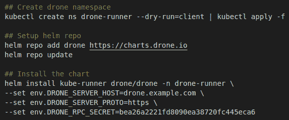

# *第十六章*：设置 CI/CD 管道和镜像注册表

本章介绍了**持续集成/持续交付**（**CI/CD**）管道，以及它们如何与 Rancher 协同工作，通过标准化和可控的流程来部署应用程序，包括如何将数据库凭证等秘密信息注入到部署中，使得应用程序能够使用这些凭证，而无需给应用团队访问原始凭证的权限。然后，本章介绍了如何设置和配置 Harbor 作为 Docker 镜像仓库，包括如何将 Harbor 配置为拉取缓存，以绕过 Docker Hub 的拉取限制。最后，我们将讨论如何将 Harbor 集成作为私有注册表，替代 Docker 默认的注册表。

本章将涵盖以下主要主题：

+   什么是 CI/CD 管道？

+   架构解决方案的规则

+   如何在 Kubernetes 中通过 Rancher 部署 Drone 及其执行器

+   将秘密注入到管道中

+   什么是镜像仓库，以及架构解决方案的规则

+   如何在 Kubernetes 中部署 Harbor

+   将私有注册表集成到 Kubernetes 中

# 什么是 CI/CD 管道？

CI 指的是一种编码哲学和实践，鼓励开发人员在软件开发中频繁地将代码提交到版本控制系统。其目标是将你的应用程序和环境定义为代码，这通常被称为**基础设施即代码**（**IaC**）或**平台即代码**（**PaC**）。随着应用程序从传统的单体架构转向更具云原生特性的微服务架构，构建、打包和测试应用程序变得更加复杂。CI 通过专注于一致性和自动化来解决这个问题。通过将这些步骤集成到像 Drone 这样的软件框架中，我们可以自动化整个过程，本章将对此进行讲解。

当然，CI 只是解决方案的前半部分，后半部分是 CD。其思想是，一旦应用程序经过编译、测试和打包，我们需要一种方式以一致且可重复的方式将应用程序及其变更发布到我们的环境中。由于 Kubernetes 使用的是期望状态驱动的技术，我们只需要修改期望配置，如果我们想改变集群中的某些内容，Kubernetes 会自动确保当前状态与期望状态相符。我们在*第二章*中介绍了这一过程，*Rancher 和 Kubernetes 高级架构*。CD 通过允许应用程序开发人员将应用定义为 YAML 文件或 Helm 图表，利用 Kubernetes 的优势。我们可以以可重复的方式将应用部署到我们的集群中。

当然，通常将 CI/CD 两个部分组合成我们所说的管道，而我发现的最佳方式是从头到尾逐步讲解管道，如下所示。

图 16.1 – 示例 CI/CD 管道

以下是大多数 CI/CD 管道的高层步骤，并对每个步骤进行了描述：

**步骤 1（开发团队）**：流程从开发者检查仓库（GitHub、GitLab、Git 服务器）的代码开始，开发者进行代码修改，即修复一个 bug、添加一个功能等。在此时，开发者可能会在本地运行应用程序来测试他们的更改。但当开发者准备好后，他们将把更改提交到仓库。

**步骤 2（Git 提交）**：在此步骤中，开发者通常会为新的功能或 bug 修复创建一个分支。根据设置，开发者可能会将仓库进行分叉，并将更改推送到分叉仓库，而不是主仓库。但理解这一步骤的关键是，Git 提交是对你的代码、应用程序、部署和基础设施进行更改的唯一方式。

**步骤 3（Git 仓库）**：一旦 Git 提交被推送到仓库，仓库接管管理。第一步是验证开发者是否有权限将更改推送到仓库。例如，他们可能有权限提交更改到功能分支，但没有权限提交到主分支（main/master）。然后，通常的下一步是创建一个**Pull Request**（**PR**），它发起将一个分支/派生库的更改合并到另一个分支的请求。例如，你可能会创建一个 PR 将你的功能合并到主分支。这时，CI/CD 软件通常会参与进来。例如，你正在使用 GitHub 和 Drone。一旦你创建了一个 PR 请求，GitHub 会发送一个 HTTP 请求，称为 webhook，发送到你的 Drone 服务器，进而启动下一步操作。

**步骤 4（构建）**：在这个步骤中，事情开始发生。我们将继续使用 Drone 的例子，在这个例子中，Drone 服务器已经从 GitHub 收到了 webhook，其中包含关于仓库更改的一些细节。例如，它包含仓库名称、分支、提交哈希和提交消息。但需要注意的是，它不包括代码内容。

注意

如果你想查看 webhook 载荷中包含的内容，请参阅 GitHub 的官方文档：[`docs.github.com/en/developers/webhooks-and-events/webhooks/webhook-events-and-payloads`](https://docs.github.com/en/developers/webhooks-and-events/webhooks/webhook-events-and-payloads)。

流程可能会根据您的管道软件而变化，但一般来说，第一步是将代码存储库克隆到临时位置。这就是为什么您的管道服务器需要访问您的代码存储库。第二步是加载 Drone 的管道配置文件，即`.drone.yml`。此文件存储了构建过程中将使用的步骤。例如，可能会拉取任何依赖项并运行一些命令来编译您的二进制文件。重要的是要注意，大多数管道软件都包含预构建的插件/模块，用于编译诸如 Go、npm、C++ 等常见语言。对于 Drone，您可以在 [`plugins.drone.io`](https://plugins.drone.io) 找到一个列表，但是像 Drone 和 GitHub Actions 这样的现代管道软件之一的好处是它们使用容器来运行这些插件/模块，因此制作自定义步骤可以是一个简单的过程。

您可能会问，此构建步骤在哪里运行？这个问题的答案取决于软件以及它的托管位置。例如，整个过程可能在使用 GitHub Actions 等云端工具时进行，或者如果您正在使用自托管的 Drone，则会在您自己的计算机上运行。这些通常被称为**运行器**，因为它们运行您的代码。例如，在本章后面我们将涵盖的示例中，我们将在 Kubernetes 集群中部署 Drone 的运行器，它将为每个构建创建临时 pod，并为每个步骤创建 sidecar。

**步骤 5（测试）**：到目前为止，我们已经构建了应用程序，但我们需要测试它并验证它是否按计划工作。这一步骤可以简单到最后的编译测试，也可以复杂到部署到测试集群，然后模拟终端用户使用应用程序，以及中间的一切。这一步骤取决于您的应用程序和编程语言。例如，Go 有内置的测试，可以直接编写到应用程序中进行测试。像 LAMP（Linux、Apache、MySQL 和 PHP）堆栈一样，应用程序可能需要几个不同的组件，包括数据库，才能启动。同时，还有一个问题，即您是否可以轻松地测试您的应用程序。例如，您是否已经有了测试登录、运行报告、进行测试销售等的脚本？如果有的话，在这一步骤中，您将希望创建一个流程来运行这些测试。总的想法是您希望验证此提交的任何更改不会影响生产环境。

**步骤 6（发布）**：一旦我们完成所有测试，并准备好在 Kubernetes 集群中启动应用程序，我们需要将刚刚创建的容器镜像提供给集群。我们通过将镜像发布到某种 Docker 注册表来实现这一点。当然，解决这个问题有多种不同的方案，其中一些将在本章后续讲解。但这里需要理解的关键是，我们需要一个发布镜像的位置，无论是 Docker Hub、简单的私有注册表，还是像 Harbor 这样的企业级解决方案。

对于 Drone 和大多数 CI/CD 软件而言，这一步是相当直接的，主要是为镜像添加版本/构建号标签，然后运行 `docker push image…` 命令将镜像推送到所选的注册表。作为将镜像发布到注册表的一部分，通常会进行安全扫描，查找已知的漏洞。例如，您可能希望阻止所有包含易受 Log4j（CVE-2021-44228）漏洞影响的软件版本的镜像，大多数 CI/CD 软件使用像 Clair 这样的工具来处理这一过程，并根据找到的 CVE 数量和严重性，发出警报或阻止镜像。

**步骤 7（部署）**：一旦一切准备就绪，应用程序部署到我们的 Kubernetes 集群的有趣部分就开始了。 这一步主要是创建/准备我们的部署文件，文件可以是简单的 YAML 文件，也可以是复杂的 Helm 图表，甚至是两者的混合。在本章中，我们不会深入讨论 Helm 图表，因为这个话题会在下一章讲解。此过程主要包括更新部署文件中的镜像标签，以适应新创建的镜像。

到此为止，我们的 CI/CD 已经开始将应用程序发布到集群的过程。 当然，这可以简单到运行 `kubectl apply -f deploy.yaml` 命令，或者复杂到为数据库部署公共 Helm 图表，即 `helm install mysql`，然后在运行 Kubernetes 作业（一个仅运行一次的单次使用 Pod）来创建数据库之前，验证数据库是否已经启动并准备好，最后从 S3 存储桶加载数据。然后，我们最终运行 `kubectl apply` 来启动我们的应用程序，并运行一些测试命令来验证一切是否按预期工作。需要理解的关键点是，这一步骤是我们如何以安全且受控的方式，给开发人员访问我们的生产 Kubernetes 集群，而不直接给他们访问集群的权限。

此时，管道完成，我们将从头开始处理下一个功能或 bug 修复。核心思想是，管道的设计使得这一过程可以重复且可控，允许开发人员快速推进，但又不会破坏我们的集群。在下一节中，我们将深入探讨创建 CI/CD 解决方案，并进行安装。

# 架构解决方案的规则

现在我们已经理解了 CI/CD 的概念，我们将讨论如何设计解决方案，包括标准设计的优缺点。需要注意的是，每个环境/应用都是独特的，可能需要进行调整以获得最佳体验。

在设计解决方案之前，你应该能够回答以下问题：

+   你的应用团队是否已经有支持 Kubernetes 的 CI/CD 解决方案？

+   是否只有一个团队使用此 CI/CD 解决方案，还是多个团队共享它？

+   你认为会创建多少个管道/构建？

+   你的开发者遵循什么样的部署计划？

+   他们是否会随时进行更改，还是会进行大规模的补丁更新，也就是说，每个星期五是*构建日*？

+   构建过程的速度有多重要？如果一个管道需要一个小时运行，可以接受吗，还是它应该在几分钟内完成？

+   你们将使用自托管的还是**软件即服务**（**SaaS**）的方案？

+   你们将部署哪种软件栈（Go、LAMP、Node.js、DotNet 等）？

+   你需要哪些工具/软件包来构建你的应用？

+   你的构建工具是否需要特殊的许可？

+   你需要在哪种 CPU 架构和操作系统平台上构建（Linux、Windows、AMD64、ARM）？

+   你的代码是私有的还是公开的？

+   构建过程和输出是否需要公开访问（大多数开源项目是这样）？

+   只有内部员工会创建提交并发布，还是这是一个公开项目，因此外部用户可能会触发构建？

+   你的软件和硬件预算是多少？

一旦我们对这些问题有了答案，我们就可以评估解决方案。

## Drone

Drone 是一个基于 Go 的应用程序，执行所有容器内的操作。因此，它非常适合像 Kubernetes 这样的平台，在这里启动容器非常简单。Drone 使用服务器进行管理和编排，运行器负责创建用于构建任务的容器。

**优点**如下：

+   对于开源项目是免费的。

+   与 GitHub、Bitbucket 和 GitLab 的集成已被验证良好。

+   Drone 服务器及其运行器是轻量级的，可以部署在像 Raspberry Pi 这样的低端硬件上。

+   将管道作为代码，这意味着你的管道成为应用开发的一部分。无需在源代码控制之外更改管道配置。

+   通过 Vault、KMS 和第三方进行内部和外部的秘密管理。

+   使用起来很简单，因为界面易于理解。

+   所有插件都是容器，这意味着如果你想编写自己的插件，只需创建一个 Docker 镜像来执行你想要的任何任务。

+   云和本地软件是相同的，因此在两者之间迁移毫不费力。

+   可扩展性是内建的，因为所有构建都作为容器运行，可以轻松地通过 Kubernetes 扩展。

+   Drone 是为了在公共互联网中运行而构建的，因为许多开源项目使用 Drone。由于这一点，以及 Drone 基于容器的架构，公开暴露 Drone 服务器是安全且正常的，这也让公众能够更好地看到透明性。

+   Drone CLI 内置了对本地构建的支持，允许你在本地机器上触发构建，而无需连接到 Drone 服务器。由于每个任务都是一个容器，Drone CLI 仅通过与运行器相同的 API 调用与 Docker 交互。

**缺点**如下：

+   Drone 不支持构建缓存。因为每次构建都是一个新的容器/Pod，前一次构建的内容无法使用，这意味着如果你需要下载一组依赖项来运行构建，你每次都会重新下载这些依赖项。像 drone-cache 这样的插件可以帮助解决这一问题，但它们并不是最可靠的解决方案，而且可能迫使你限制构建运行的方式。

+   它存在一个典型的“大空盒”问题，因为 Drone 被构建来支持几乎任何语言/应用堆栈。刚开始时，一切都是空的，几乎没有框架来指导你。可以在 Drone 文档中找到一些示例，但你大多数时候都得从零开始。

+   Drone 拥有一个相对活跃的社区，但它仍然是 CI/CD 市场的新人，创建于 2014 年，但找到具备管理员知识的人可能会很困难。

+   没有可以用于身份验证的外部身份提供者，这意味着你不能将其指向 Active Directory、LDAP 或 SAML 提供者进行身份验证。

+   拥有一个公共的 Drone 服务器实例是正常的……但安全性是相对的。可以使用一些设置来限制对特定 GitHub 组织的访问，也可以对机密的访问进行设置，以防止恶意用户通过恶意的仓库窃取这些机密。这些设置并不是开箱即用的。

+   Drone 存在代码维护问题，因为它需要大量的补丁和自定义插件来支持特定的工作负载。例如，默认的 Kubernetes 插件功能很简陋，用户需要创建自己的插件，例如 [`github.com/SupportTools/kube-builder`](https://github.com/SupportTools/kube-builder)。甚至有一个社区分支的 Drone 叫做 Woodpecker，旨在解决这些问题。

+   Drone 服务器没有 **高可用性**（**HA**），因为服务器使用的是内存队列系统。Drone 服务器将依赖于 Kubernetes 提供 HA，即重新启动和重新调度失败的 Pod。截至目前，HA 功能仍在测试版中，详细信息可以参考 [`docs.drone.io/server/ha/overview/`](https://docs.drone.io/server/ha/overview/)。

通常，我推荐将 Drone 用于那些从一开始就考虑容器的云原生和 Kubernetes 原生应用程序，以及希望实现 GitOps 工作流的团队，比如需要公开访问的开源项目。

## Jenkins

Jenkins 是一个基于 Java 的 CI/CD 工具，旨在自动化运行脚本，有时被称为支持 CI/CD 的自动化平台。

**优点**如下：

+   Jenkins 在 DevOps 和 CI/CD 市场中有着深厚的历史，它是此列表中最古老的工具。它最初由 Oracle 于 2011 年创建，2014 年分叉后成为 Jenkins。

+   由于 Jenkins 的发展历史，它已经成为 CI/CD 领域的默认工具，这意味着许多软件、插件和工作流都是围绕 Jenkins 构建的，然后才会适配到其他 CI/CD 工具。

+   Jenkins 拥有丰富的插件列表（截至撰写时超过 1000 个），涵盖从 Nagios 集成监控，到 Puppet 进行配置管理，再到与 Jira 集成进行问题跟踪等功能。

+   因为 Jenkins 是用 Java 编写的，它具有可移植性，这意味着服务器可以根据你的需求在 Windows 或 Linux 上运行。

+   Jenkins 拥有优秀的测试自动化插件，例如`TestComplete Support`，它可以模拟用户行为，如打开网页、运行桌面应用程序等。需要注意的是，这是一个第三方插件。

+   Jenkins 内置支持一些企业认证提供商，如 Active Directory、LDAP、SAML 等。

+   Jenkins 内置了高可用性（HA）支持，使用的是主动-备份设置。

+   企业/付费插件通常附带优秀的文档和支持。

**缺点**如下：

+   Jenkins 是为企业产品构建的，这意味着它假设会有管理员来照顾和维护它，也就是说，需要有人来终止卡住的作业、监控资源、在出现问题时重新启动等。

+   社区/免费插件通常缺乏文档支持，并且没有付费支持选项。

+   Jenkins 为 Kubernetes 提供了运行器，可以让你将任务作为 pods 在集群中运行，但设置和使用这种类型的运行器可能具有挑战性，并且需要使用在[`plugins.jenkins.io/kubernetes/`](https://plugins.jenkins.io/kubernetes/)上可以找到的详细信息。

+   Jenkins 确实支持本地构建，但你实际上是在运行一个本地副本的 Jenkins 服务器，这意味着你需要完成所有的设置工作，并使本地配置与真实的 Jenkins 服务器相匹配。

+   没有 SaaS/云托管选项，这意味着你需要安装和管理 Jenkins 服务器。

+   用户界面较为笨重，使用起来不太友好，界面看起来像是十年前的 Java 应用程序。

通常情况下，我推荐 Jenkins 有两个原因。第一个原因是它已经在客户的环境中部署并使用。这是因为在不同管道之间切换可能需要大量工作，过程就是需要重新开始。第二个原因是企业插件支持。编写自己的插件可能需要大量时间和资源，这些资源可以用于其他更有价值的事情。因此，企业客户通常直接购买开箱即用的商业插件。

注意

Rancher did have its own pipeline solution called Rancher Pipelines, but as of Rancher v2.5, this feature has been deprecated and replaced by Fleet. Rancher Pipelines was built on top of Jenkins but integrated into Rancher. You can still enable it using the steps at [`rancher.com/docs/rancher/v2.6/en/pipelines/example-repos/`](https://rancher.com/docs/rancher/v2.6/en/pipelines/example-repos/), but it is highly recommended not to use it.

## GitHub Actions

GitHub Actions was launched back in 2018 as a workflow automation tool that can also do CI/CD. It shares the core item of all tasks being containers like Drone does, but with the big difference that it's a cloud solution sold as an add-on to your GitHub subscription.

**优点**如下：

+   It's easy to use for GitHub users as their repositories are just built into the platform, which just needs to be enabled.

+   You can use self-hosted runners to work around costs by providing your own hardware details, which can be found at [`docs.github.com/en/actions/hosting-your-own-runners/about-self-hosted-runners`](https://docs.github.com/en/actions/hosting-your-own-runners/about-self-hosted-runners).

+   Nearly unlimited scale – as a cloud-based solution, you can run as many parallel builds as possible without needing to spin up additional servers/nodes, depending on your GitHub subscription, details of which can be found at [`docs.github.com/en/billing/managing-billing-for-github-actions/about-billing-for-github-actions`](https://docs.github.com/en/billing/managing-billing-for-github-actions/about-billing-for-github-actions).

+   Tight integration with GitHub events allows you to customize your pipelines based on the type of event. For example, you might run one workflow to create a new issue and another one to create a pull request.

+   Built-in caching for the GitHub repo means that if you have a large repository with lots of changes, you can assume that the clone will take little to no time. This is because everything is being done inside the GitHub network.

+   GitHub has a marketplace for Actions, meaning it's effortless to add plugins to your workflow. For example, if you need a K3s cluster to test, just go to [`github.com/marketplace/actions/setup-k3d-k3s`](https://github.com/marketplace/actions/setup-k3d-k3s) and click the **使用最新版本** button, then copy and paste the text into your flow.

**缺点**如下：

+   Actions are sold by the minute. For example, if your task runs for 5 mins, you are billed for 5 mins of usage. GitHub does provide some amount of free usage depending on your subscription and repository type (private versus public).

+   GitHub Actions 一直是黑客和加密货币矿工的热门目标，他们利用公共项目窃取资源。例如，如果你在每个拉取请求上都运行构建，谁能阻止某人将比特币挖矿程序作为工作流的一部分运行呢？这会导致账单暴涨，并且已经让用户损失了成千上万美元。你可以在[`www.bleepingcomputer.com/news/security/github-actions-being-actively-abused-to-mine-cryptocurrency-on-github-servers/`](https://www.bleepingcomputer.com/news/security/github-actions-being-actively-abused-to-mine-cryptocurrency-on-github-servers/)阅读更多关于这些攻击的内容。

+   在商业插件方面，GitHub 也存在与 Drone 相似的缺点，这些插件称为 Actions，因为它毕竟还没有存在很长时间。

+   GitHub Actions 主要运行在云端，因此访问内部资源（如数据库、服务器和 Kubernetes 集群）可能会变得困难，除非将它们发布到互联网上。你可以通过使用本地运行器来解决这个问题。

+   在本地笔记本电脑上运行构建仅限于使用第三方工具，如[`github.com/nektos/act`](https://github.com/nektos/act)。

+   构建环境再次受到限制，因为 GitHub 为你托管虚拟机。你只能选择他们提供的操作系统和版本。例如，ARM 需要自托管的运行器才能使用。你可以在[`github.com/actions/virtual-environments`](https://github.com/actions/virtual-environments)查看当前支持的环境列表。

通常，我推荐 GitHub Actions 用于需要简单构建脚本的小型一次性项目；只需运行 `make` 命令。进行更高级的测试，如用户模拟，会变得非常困难。

Rancher 确实有一款名为 Fleet 的产品，它在某种程度上适用于这个场景，因为它是一个仅用于持续交付（CD）的工具，不支持持续集成（CI）。你不能在 Fleet 中执行 Docker 构建、应用测试等操作。它只设计用于将更改推送到你的环境。当然，你可以将 Fleet 用于将应用程序发布到集群，但不推荐这么做，因为 Fleet 没有回滚或回退功能，这意味着如果你推送了更改并且它破坏了应用程序，你需要更新你的 Git 仓库并推送新的更改。

在本章的其余部分，我们假设你选择了 Drone 作为 CI/CD 管道工具，但大多数步骤也可以轻松迁移到其他工具。

# 如何在 Kubernetes 中通过 Rancher 部署 Drone 及其运行器

本节将过程分为三部分：部署 Drone 服务器、启动 Kubernetes 运行器以及将管道连接到外部 Rancher 集群。

## 前提条件

以下是你在开始安装 Drone 和其运行器之前需要设置的项：

+   一个具有创建集群级资源权限的 Kubernetes 集群（建议是集群管理员）

+   持久存储（更多详情请参见 *第十一章*，*使用 Longhorn 将存储带入 Kubernetes*）

+   用于发布 Drone Web UI 的主机名

+   一个公开签名的 SSL 证书（内部或自签名证书可能会导致问题）

+   在 GitHub 中创建 OAuth 应用程序的权限

+   GitHub 上的公开可访问 URL（例如，[`drone.example.com`](https://drone.example.com)）

+   可以访问集群的 kubectl 和 Helm，Drone 服务器将在此集群中安装。

## 安装步骤

在本节中，我们将介绍在安装 Drone 之前如何安装 PostgreSQL。最后，我们将安装 runner。

### PostgreSQL

Drone 服务器需要一个后端数据库来存储其设置、配置等。为此，我们将使用 PostgreSQL，因为它是自托管部署唯一支持的数据库。如果您愿意，您可以跳过此步骤，使用外部管理的数据库，如 Amazon RDS for PostgreSQL。

要安装 PostgreSQL，您需要运行以下命令：

1.  第一个命令是创建一个命名空间。

1.  然后是一个 `helm` 命令，用于添加 `bitnami` 仓库。

1.  然后，最后，我们运行 `helm install` 命令以部署 PostgreSQL 服务器，并通过附加选项设置用户名和密码。

以下是结果：

图 16.2 – PostgreSQL 安装步骤

您可以在 [`github.com/PacktPublishing/Rancher-Deep-Dive/tree/main/ch16/drone/postgresql/install_commands.md`](https://github.com/PacktPublishing/Rancher-Deep-Dive/tree/main/ch16/drone/postgresql/install_commands.md) 找到完整的命令。您还可以在 [`github.com/bitnami/charts/tree/master/bitnami/postgresql/`](https://github.com/bitnami/charts/tree/master/bitnami/postgresql/) 找到 Helm chart 选项的详细解析。

注意

我们将密码设置为 `drone`，作为示例。这应该设置为更安全的内容。

### Drone 服务器

在本节中，我们将安装 Drone 服务器。但在安装 Drone 之前，您应该按照 [`docs.drone.io/server/provider/github/`](https://docs.drone.io/server/provider/github/) 上的步骤在 GitHub 上创建 OAuth2 应用程序。要安装 Drone 服务器，您需要按照以下步骤进行：

1.  我们创建一个新的命名空间，并使用图 16.3 中列出的命令添加 Drone `helm 仓库`。

1.  然后我们为 RPC 密钥创建 SSL 秘密，Drone 及其 runner 会使用此密钥进行身份验证。

1.  接下来，我们创建一个 RPC 密钥，用于身份验证 runners。

1.  最后，我们使用带有多个设置的 `helm install` 命令。

第一部分定义了入口设置，接下来是存储，然后我们设置数据库连接字符串。最后一部分是将 GitHub 集成用于身份验证。

图 16.3 – Drone 服务器安装步骤

您可以在[`github.com/PacktPublishing/Rancher-Deep-Dive/tree/main/ch16/drone/server/install_commands.md`](https://github.com/PacktPublishing/Rancher-Deep-Dive/tree/main/ch16/drone/server/install_commands.md)找到完整的命令。您还可以在[`github.com/drone/charts/blob/master/charts/drone/`](https://github.com/drone/charts/blob/master/charts/drone/)找到 Helm 图表选项的详细分解。

此时，您应该能够通过访问 Web UI 来登录您的 Drone 服务器。

### Drone Kubernetes runner

在本节中，我们将安装 Drone Kubernetes runner。如果您愿意，可以将其安装在与 Drone 服务器相同的集群中。此外，在以下示例中，我们将使用默认命名空间来运行我们的临时 pod。如果需要，您可以进行自定义。

要安装 runner，您需要执行以下步骤：

1.  创建一个新的命名空间。

1.  添加 Drone `helm repo`。

1.  最后，安装`drone-runner`。

需要注意的是，我们将此 runner 指向我们的 Drone 服务器，并使用 RPC 密钥进行身份验证。

图 16.4 – Drone runner 安装步骤

您可以在[`github.com/PacktPublishing/Rancher-Deep-Dive/tree/main/ch16/drone/runner/install_commands.md`](https://github.com/PacktPublishing/Rancher-Deep-Dive/tree/main/ch16/drone/runner/install_commands.md)找到完整的命令。您还可以在[`github.com/drone/charts/tree/master/charts/drone-runner-kube`](https://github.com/drone/charts/tree/master/charts/drone-runner-kube)找到 Helm 图表选项的详细分解。

此时，您应该能够在您的 Drone 服务器中运行构建。在接下来的部分中，我们将连接 Drone 到我们的 Kubernetes 集群，以便部署我们的应用程序。

## 连接到 Rancher

在本节中，我们将在另一个 Kubernetes 集群中创建一个服务账号，并将其添加为 Drone 服务器的一个密钥。在这个命令中，我们创建了一个服务账号，并分配了 cluster-admin 权限，最后获取了该账号的 token。

图 16.5 – 创建一个 Drone 服务账号

您可以在[`github.com/PacktPublishing/Rancher-Deep-Dive/tree/main/ch16/drone/external-cluster/rbac.md`](https://github.com/PacktPublishing/Rancher-Deep-Dive/tree/main/ch16/drone/external-cluster/rbac.md)找到完整的命令。

接下来，我们需要登录 Rancher UI，浏览相关集群，并点击**下载 KubeConfig**按钮来获取集群服务器的 URL。你将得到一个类似以下示例的文件。我们需要的是服务器值，在这个示例中是[`rancher.example.com/k8s/clusters/c-m-abcdefgj`](https://rancher.example.com/k8s/clusters/c-m-abcdefgj)。

图 16.6 – KubeConfig 示例

现在，我们可以将凭证作为密钥添加，以便管道可以使用它，这将在下一节中讲解。

# 向管道注入密钥

在本节中，我们将介绍如何向管道中添加密钥。在这个示例中，我们将使用上一节中创建的 Kubernetes 凭证。

我们将从浏览仓库并点击**激活仓库**按钮开始。然后，我们需要进入**设置**标签页，并从侧边菜单中选择**密钥**。

图 16.7 – 创建密钥向导

我们将创建以下密钥及其值。需要注意的是，如果您使用的是公共仓库，其他人可能会访问您的密钥，特别是如果您勾选了**允许拉取请求**选项。

重要说明

一旦将密钥添加到 Drone 中，就无法再检索它。因此，建议您将副本存储在 Drone 之外的地方，例如密码管理器。

图 16.8 – 示例密钥

现在我们已经创建了密钥，可以在管道中使用它们。示例中的关键项目是`from_secret`命令，它将密钥的值与插件的设置绑定在一起，插件是容器内的一个环境变量。这个管道使用默认的 Docker 插件来运行 Docker 构建，然后使用我创建的名为`supporttools/kube-builder`的自定义插件来运行 kubectl 和 Helm 命令。您必须首先运行`bash /usr/local/bin/init-kubectl`命令，因为它负责在容器内部设置`kubeconfig`文件。

图 16.9 – 示例管道

到目前为止，我们已经启动并运行了一个管道，应该能够构建和部署我们的应用程序。在下一节中，我们将深入探讨如何设置一个私有镜像仓库，用于存储我们从 Docker Hub 之外的 Docker 镜像。

# 什么是镜像仓库以及架构解决方案的规则

容器化的一个关键概念是镜像。镜像是一个只读文件，包含构成容器的所有文件、库和可执行文件。一旦创建了容器镜像，就需要将其存储在一个地方，确保可以从 Kubernetes 节点下载。这个地方称为注册表、容器注册表或镜像仓库。在本章中，我们将其称为镜像仓库。当然，镜像仓库有三种主要类型：Docker Hub、第三方和自托管。

但在设计解决方案之前，您应该能够回答以下问题：

+   这是一个隔离环境吗？也就是说，所有镜像是否都必须来自我们控制的注册表？

+   您的所有镜像都是公开的吗，还是会使用私有仓库？

+   您在软件和硬件上的预算是多少？

+   多个数据中心/站点需要访问您的注册表吗？

+   您是否有任何安全/合规要求，比如需要将数据保存在特定地点（例如，仅限本地存储）或在您所在的国家等？

+   您是否计划扫描镜像并限制允许进入您环境的镜像？

一旦我们解答了大部分这些问题，我们就可以评估解决方案。

## Docker Hub

这是大多数 Kubernetes 发行版的官方/默认镜像仓库，包括 Rancher。因为它是默认选项，所以大多数部署、开源项目和软件供应商都会使用 Docker Hub。

**优点**如下：

+   它是默认的并且适用于公开镜像，您只需为私人镜像付费。

+   **信任**：从一个随机的第三方镜像仓库拉取镜像可能会给开源项目带来红旗，因为无法确定是谁在托管这些镜像。他们是否会在镜像中注入恶意软件？Docker Hub 通过对所有公开镜像进行安全扫描来解决这个问题，扫描内容包括标记包含病毒和其他恶意代码的镜像。需要注意的是，这个系统并不完美，并不能捕捉到所有问题。

+   **速度**：Docker Hub 当然是最大的镜像仓库，它使用 Cloudflare 作为 CDN，并与 AWS 一起提供后端的 S3 存储。从 Docker Hub 拉取镜像非常快速，限制因素几乎总是出在你这端，除非你被 Docker Hub 限制了拉取速率。你可以通过查询他们的 API 详情来了解更多信息，相关链接可以在[`www.docker.com/blog/checking-your-current-docker-pull-rate-limits-and-status/`](https://www.docker.com/blog/checking-your-current-docker-pull-rate-limits-and-status/)找到。

+   **数据冗余/可用性**：同样，这些镜像存储在 AWS S3 中，亚马逊的官方文档表明 S3 对象的耐久性为 99.999999999（11 个 9），持续一年。因此，由于数据丢失而导致镜像丢失的几率几乎为零。

**缺点**如下：

+   **安全要求**：一些组织要求所有源代码和数据必须保持在本地。Docker Hub 账户曾被攻击，私人镜像也曾被泄露。

+   Docker 镜像在 Docker Hub 中以纯文本格式存储，并未加密，这意味着任何有权限访问仓库的人都能下载镜像并从中提取数据/源代码。这也包括 Docker Hub 自身，因为它会扫描上传到其网站的镜像。例如，Log4js 问题就是 Docker Hub 触发了对其网站上所有镜像的扫描。相关细节可以在[`docs.docker.com/security/#log4j-2-cve-2021-44228`](https://docs.docker.com/security/#log4j-2-cve-2021-44228)找到。

+   **拉取限制**：Docker Hub 在 2021 年 11 月对镜像增加了拉取速率限制，详细信息可以在其官方文档中找到，[`docs.docker.com/docker-hub/download-rate-limit/`](https://docs.docker.com/docker-hub/download-rate-limit/)。当然，你可以购买 Docker Hub 订阅服务，这样你的集群就没有限制。你也可以阅读我的 Kubernetes 大师课程——*Docker Hub 限额：解决 Rancher 中的拉取请求数量问题*，该课程可以在[`github.com/mattmattox/Kubernetes-Master-Class/tree/main/docker-hub-limits`](https://github.com/mattmattox/Kubernetes-Master-Class/tree/main/docker-hub-limits)找到。

我通常建议使用 Docker Hub 来管理所有公共项目，并为托管私人镜像每月支付几美元，除非你在镜像中存储了敏感数据或你的网络连接有限。

## 第三方管理的镜像仓库

这些平台充当你自己容器镜像的访问中心，简化了存储、管理和保护镜像的过程，而无需在本地运行自己的镜像仓库。许多第三方仓库服务支持 Docker 镜像，包括 Amazon ECR、Azure Container Registry 和 Google Container Registry。

**优点**如下：

+   **控制**：这些镜像仓库通常托管在你当前的云环境中——也就是 AWS、Azure、GCP——因此，你对数据拥有控制权。

+   **托管服务**：由于云服务提供商管理所有这些镜像仓库，你不必进行升级、打补丁或备份。你只需要让他们为你处理这些工作。

+   **定价**：大多数云服务提供商对进出镜像仓库的流量收费极少或不收费。存储费用通常只是转嫁给存储数据的 S3/对象存储。

**缺点**如下：

+   **对于公共镜像来说并不具成本效益**：因为大多数云服务提供商对外部流量（传出到公共互联网的流量）收取额外费用，所以托管公共镜像可能会变得非常昂贵。

+   **认证**：大多数云服务提供商使用他们自己的认证源来控制对镜像仓库的访问。这会引发问题，因为 Docker 是基于基本认证（静态用户名和密码）构建的，而像 AWS ECR 这样的服务只会提供有效 6 小时的密码。这意味着你需要使用像[`github.com/SupportTools/ecr-helper`](https://github.com/SupportTools/ecr-helper)这样的工具来定期更新密码。

我通常只推荐在托管 Kubernetes 集群的情况下使用第三方镜像仓库，特别是当你需要存储私人镜像但不想自己管理服务时。例如，如果你在亚马逊上部署了 EKS 集群，你应该使用 ECR。

## 自托管仓库

组织可能因各种原因（包括安全性、合规性问题或低延迟要求）更倾向于在自己的本地基础设施上托管容器镜像。

**优点**如下：

+   **控制**：你完全掌控，因为你托管了镜像。你可以选择将所有内容对外开放，或者将所有镜像锁定，介于两者之间。

+   **带宽**：由于镜像托管在你的数据中心，因此你的节点不再需要访问公共互联网来拉取镜像。例如，如果你有一个 100 节点的集群，每个节点需要拉取一个 1 GB 的镜像。你需要通过互联网连接下载 100 GB 数据，而不是为本地服务器下载这些数据。

+   **安全性**：使用像 Harbor 这样的工具，我们可以将镜像扫描集成到我们的注册表中，并设置规则，如阻止上传具有过多高/关键漏洞的镜像。

+   **在空气隔离环境中的要求**：在无法拉取外部镜像仓库镜像的空气隔离环境中，必须使用私有镜像仓库。

**缺点**如下：

+   **管理**：因为你现在托管了注册表，你直接负责该软件的安全、修补和升级任务。

+   **部署变更**：大多数部署假设你会使用 Docker Hub 作为镜像仓库。因此，你需要将镜像从公共仓库复制到你的私有注册表中。

我通常只在空气隔离的环境中推荐自托管仓库，或者在通过互联网拉取大量数据可能成为问题的情况下，即低速互联网或多个节点共享连接的情况。

此时，你应该能够选择哪个镜像仓库最适合你的环境。在接下来的章节中，我们将假设你选择了自托管选项。

# 如何在 Kubernetes 中部署 Harbor

在本节中，我们将在我们的 Kubernetes 集群中安装 Harbor。需要注意的是，这将只是一个基本设置，因为 Harbor 可以通过多种方式安装。

以下是前提条件：

+   一个具有创建集群级资源权限的 Kubernetes 集群（建议是集群管理员）

+   持久化存储（更多细节请参见 *第十一章*，*使用 Longhorn 将存储带入 Kubernetes*）

+   发布主 Harbor URL 和公证服务的两个主机名

+   公共签名的 SSL 证书（内部证书或自签名证书可能会导致问题）

+   对将安装 Drone 服务器的集群具有 kubectl 和 Helm 访问权限

要安装 Harbor，我们将运行以下命令：

1.  首先，添加 Harbor 的 `helm repo`。

1.  接下来，创建 Harbor 的 `namespace`。

1.  然后，上传用于 Ingress 的 `ssl certificate` 秘密。

1.  然后，最后，我们运行`helm install`来安装 Harbor chart。

需要注意的是，这包括一些设置：第一部分是设置 ingress，第二部分是设置存储类，即 Longhorn。

](img/B18053_16_10.jpg)

图 16.10 – Harbor 安装命令

你可以在 [`github.com/PacktPublishing/Rancher-Deep-Dive/tree/main/ch16/harbor/server/install_commands.md`](https://github.com/PacktPublishing/Rancher-Deep-Dive/tree/main/ch16/harbor/server/install_commands.md) 找到完整的命令。你也可以在 [`github.com/goharbor/harbor-helm`](https://github.com/goharbor/harbor-helm) 找到 Helm chart 选项的详细解析。

此时，你应该已经让 Harbor 启动并运行，准备好开始上传镜像并在环境中使用它们。在下一部分，我们将配置 Kubernetes 使用私有注册表。

# 将私有注册表集成到 Kubernetes 集群中

既然你已经有了自己的私有注册表，现在需要将其添加到 Rancher 和 Kubernetes 集群中，以便你开始使用它。

在这一部分，我们假设你使用 Harbor 作为你的私有注册表，并且这是一个 air-gapped 配置，意味着我们的节点无法从公共互联网拉取镜像。我们需要做三件事来完成这个任务：

+   收集/发布镜像

+   设置 Rancher 全局注册表

+   更新 RKE/RKE2

## 收集/发布镜像

在这一部分，我们需要收集 Rancher 和其集群所需的所有镜像。幸运的是，Rancher 支持一种名为 air-gapped 的安装类型，并已发布一个脚本作为 Rancher 版本的一部分来处理这一过程。你可以在 Rancher 文档中找到关于此过程的详细信息，网址是 [`rancher.com/docs/rancher/v2.6/en/installation/other-installation-methods/air-gap/populate-private-registry/`](https://rancher.com/docs/rancher/v2.6/en/installation/other-installation-methods/air-gap/populate-private-registry/)。

但简而言之，Rancher 有一个名为 `rancher-images.txt` 的文件，其中包含 Rancher 可能需要的镜像列表。然后，Rancher 有一个名为 `rancher-save-images.sh` 的脚本，它会遍历该列表，使用具有互联网访问权限的工作站/服务器拉取所有镜像。它将输出一个 `tar` 文件，可以将该文件物理复制到一个 air-gapped 服务器。最后一步是运行 `rancher-load-images.sh`，它将所有镜像推送到你的私有注册表中。

该列表会在每次 Rancher 版本更新时进行更新，每次升级 Rancher 时都应运行此过程，以获取新的或更新的镜像。另外，一些客户有一台位于互联网和隔离环境之间的服务器/工作站，并选择修改此过程，在同一台服务器上同时执行这两个步骤。他们通过编辑`rancher-save-images.sh`并注释掉最后一行 `docker save` 来跳过 `tar` 文件的创建。然后，在 `rancher-load-images.sh` 中，他们删除了 `docker load`，因为镜像已经在服务器上。

注意

建议您保持相同的注册表结构，即 `docker.io/rancher/rancher` 应变为 `registry.example.com/rancher/rancher`。还建议将 Rancher 仓库设置为公开，这样任何人都可以在不进行身份验证的情况下拉取它们。这将使过程更加简单，并且能够模拟这些镜像的 Docker Hub。

## Rancher 全局注册表

现在我们已经拥有了所有镜像，我们需要将 Rancher 指向私有注册表。对于此过程，我们需要遵循位于 [`rancher.com/docs/rancher/v2.6/en/admin-settings/config-private-registry/`](https://rancher.com/docs/rancher/v2.6/en/admin-settings/config-private-registry/) 的步骤。基本思路是进入 Rancher UI 的 `system-default-registry`，并将值更新为您的私有注册表。假设您有一个需要凭证才能从 Rancher 仓库拉取镜像的私有注册表，您需要通过为每个集群添加凭证来采取额外的步骤。

## 更新 RKE/RKE2

现在您已经让 Rancher 使用新的私有注册表，接下来需要告诉 RKE 和 RKE2 也使用该注册表。对于 RKE，只需要更新 `cluster.yaml` 文件，加入 `private_registries` 部分并运行 `rke up`。您可以在 [`rancher.com/docs/rke/latest/en/config-options/private-registries/`](https://rancher.com/docs/rke/latest/en/config-options/private-registries/) 中找到该更改的详细信息。RKE2 也是一样，但如果需要，您还可以进行一些附加设置。您可以在 [`docs.rke2.io/install/containerd_registry_configuration/`](https://docs.rke2.io/install/containerd_registry_configuration/) 中找到详细信息。

注意

对于 RKE 和 RKE2 集群，这可以在集群创建后进行设置，但强烈建议您在实验室/沙箱集群中测试此过程，因为您可能会遇到防火墙规则、缺失镜像、配置错误的部署等问题，这些问题可能会破坏集群。因此，我们希望在将此过程应用到生产集群之前，先进行充分的测试，确保它非常稳定。

此时，我们应该让集群从我们的注册表拉取镜像，而不是从 Docker Hub 拉取。我们还讨论了如何在主机级别强制重定向所有镜像，以及如何在部署级别强制更改注册表。

# 概述

本章介绍了什么是 CI/CD 以及它是如何工作的。然后，我们深入探讨了设计和安装 Drone 来作为我们的 CI/CD 系统。接着，我们转向讨论镜像仓库及其不同类型。在此基础上，我们设计并安装了 Harbor 作为我们的私有注册表。最后，我们通过讲解如何配置 Rancher、RKE 和 RKE2 来使用这个新的私有注册表来结束本章内容。

在下一章中，我们将基于本章所学的内容，利用 Helm charts 将我们的部署提升到一个新水平。
