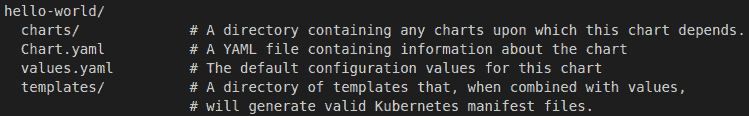
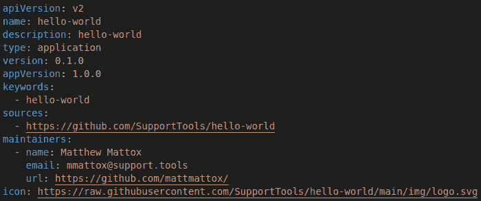
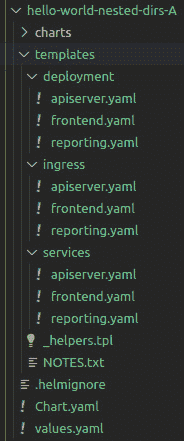
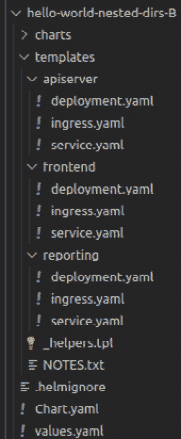
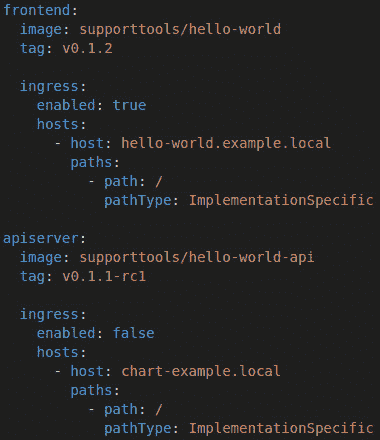
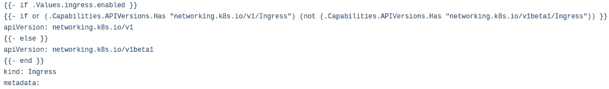
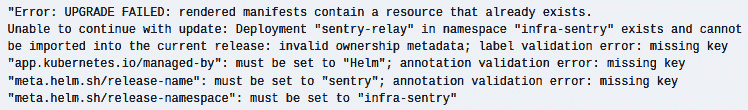
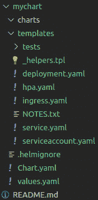
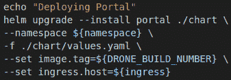
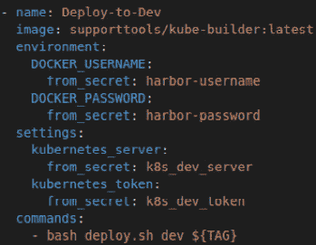

# *第十七章*：创建和使用 Helm 图表

本章涵盖了 Helm，Helm 作为 Kubernetes 集群的包管理器的使用方式，以及它的工作原理。接下来我们将深入讨论如何从零开始创建一个 Helm 图表，之后将讲解如何将新创建的图表发布到 Kubernetes 集群。最后，我们将讨论如何获取一个公开可用的图表并根据需求进行定制。

本章我们将涵盖以下主要内容：

+   什么是 Helm 图表？

+   Helm 是如何工作的？

+   如何创建 Helm 图表？

+   部署 Helm 图表

+   定制一个公开的 Helm 图表

# 什么是 Helm 图表？

Helm 是一个用于 Kubernetes 部署的包管理工具。Helm 类似于 Debian/Ubuntu 系统中的 `deb`/`dpkg` 包管理器。从这个角度来看，Helm 图表是将一组 Kubernetes 部署文件打包成一个单一模板化文件。在本节中，我们将介绍为什么需要 Helm 以及它是如何在后台工作的。

在开始使用 Kubernetes 和 Rancher 时，一个常见的问题是：*为什么我们需要 Helm？* 要回答这个问题，我们需要了解 Helm 之前是如何进行部署的。那时我们会在所有集群中使用相同的设置、镜像等来部署 `ingress-nginx`。将其作为一个简单的 YAML 文件，通过 `kubectl apply -f deployment.yaml` 来部署可能是有效的。

在这个问题中，关键是：如果你的某个集群有所不同怎么办？例如，你可能有一个 **Google Kubernetes Engine** (**GKE**) 集群和一个 **Rancher Kubernetes Engine** (**RKE**) 集群，它们可能需要不同的镜像；也就是说，GKE 将使用公共的 Docker Hub 镜像，而你的本地 RKE 集群则需要从私有注册表中获取镜像。如果没有 Helm，你就需要两个不同的 YAML 文件，并且需要确保它们保持同步。当然，在实际应用中，你可能需要更多不同的部署文件，因此管理这些文件并保持同步可能会变得非常复杂。

有些人尝试通过编写脚本，在部署之前查找并替换部署中的值来解决这个问题——例如，你的主部署文件中可能会将镜像值设置为 `ImageTagPlaceHolder`。然后，脚本会查找这个值，并使用 `sed` 命令将其替换，例如： `` sed 's/ImageTagPlaceHolder/my-private-registry/g` ``。这种方法对于只更新几个值的情况有效，但当你需要做更复杂的定制时，这个过程就会出现问题。例如，你在 `host` 部分定义了 `dev.example.com` 的 ingress，但在生产环境中，你需要根据 SSL 证书定义多个主机——也就是 `www.example.com`、`example.com` 等等。用 Bash 脚本来做这些事情变得过于混乱，更重要的是，容易出错。

Helm 通过让你将部署文件定义为 YAML 文件，并使用变量和`if`语句来解决这个问题。关键在于，你不会在部署文件中硬编码像镜像标签这样的内容；相反，你将其设定为一个变量（即`image`标签）。然后，在部署时，你为这些变量提供值，Helm 会处理构建最终的 YAML 文件并将其发布到集群中。同时，Helm 还提供了在部署文件中定义 `if` 语句的能力，使我们能够根据用户和集群的输入修改部署。我们将在下一节中讲解这一工作原理。

# Helm 是如何工作的？

我发现理解 Helm 工作原理的最佳方法是从了解目录结构开始，但首先，我们需要记住，大多数公开的 Helm 图表都是以 TGZ 文件的形式发布的，这是一种压缩的目录结构。Helm 的第一步是从仓库下载这个文件，并将其解压为图 17.1 中显示的目录结构。请注意，我们将在本章稍后的 *自定义公开 Helm 图表* 部分详细讨论公开 Helm 图表，但在本节中，我们将介绍这四个目录和文件的作用。然后，我们将把它们联系在一起，并讲解 Helm 如何使用它们来部署应用程序。

你可以在这里查看 Helm 图表目录结构的示例：

图 17.1 – Helm 图表目录结构

`Chart.yaml` 是一个定义整个图表的文件，包括图表的名称、版本、描述等内容。你可以在 *图 17.2* 和 [`github.com/PacktPublishing/Rancher-Deep-Dive/tree/main/ch17/hello-world/Chart.yaml`](https://github.com/PacktPublishing/Rancher-Deep-Dive/tree/main/ch17/hello-world/Chart.yaml) 中找到一个示例。正如我们所见，这个文件主要用于设置图表的元数据，包括图表的名称、描述、关键字、来源、维护者和图标。Rancher 使用这些数据来构建其目录页面，允许你通过关键字搜索，并查看每个仓库中图表的图标。Rancher 还通过在 `catalog.cattle.io` 路径下使用一组注解扩展这个文件，以添加如 `catalog.cattle.io/certified: rancher` 的数据，这告诉用户这是一个经过认证的图表，且涵盖在 Rancher 的 **服务水平协议** (**SLA**) 和支持范围内。你可以在 [`github.com/rancher/charts/blob/release-v2.6/charts/rancher-monitoring/100.1.2%2Bup19.0.3/Chart.yaml`](https://github.com/rancher/charts/blob/release-v2.6/charts/rancher-monitoring/100.1.2%2Bup19.0.3/Chart.yaml) 中找到 Rancher 监控图表的示例。

请查看这里展示的 `Chart.yaml` 示例：

图 17.2 – Chart.yaml 示例

`templates` 目录是 Helm chart 中最关键的部分之一，因为该目录是 Helm 存储应用程序所有模板文件的地方。需要注意的是，该目录中的所有文件应该是 YAML 文件。将其他类型的文件混入该目录已知会导致 Helm 出现奇怪的错误。默认情况下，该目录是扁平的，每种对象类型都有自己的文件——例如，您可能有一个名为 `services.yaml` 的文件，其中包含所有需要创建的服务记录，还有另一个名为 `ingress.yaml` 的文件。

需要注意的是，文件中的资源需要根据 YAML 标准用三个连字符（`---`）分隔。这对于每种类型有一个或两个资源的简单部署非常好，但将所有资源放在一个文件中，在大规模管理时可能会遇到挑战，因为 Helm/`kubectl` 的错误信息会指明行号，但该行号指的不是文件中的行号，而是该部分的行号。例如，假设您在一个文件中定义了 10 个 ingress，总文件大约有 100 行。如果您在该部分的*第 2 行*遇到第三个 ingress 的问题，错误信息只会显示 `错误位于第 2 行`，但您不知道哪一行是第 2 行。由于这个原因，通常会将模板文件拆分到嵌套目录中。

例如，您可以为每种资源类型创建一个文件夹，然后为每个资源创建一个文件（请参见*图 17.3*以了解示例）。另一个例子是按组件拆分我们的文件夹——我们可能为前端应用程序创建一个文件夹，然后将构成该组件的所有资源放在其中：部署、服务、服务帐户、**持久卷声明**（**PVC**）等（请参见*图 17.4*）。我倾向于按组件对任何多层应用程序进行排序，这样当我在处理某个组件时，该组件的所有内容都会集中在一个地方。这样做还可以轻松添加新组件，因为我只需克隆整个文件夹，然后进入文件夹并开始运行查找和替换命令，作用范围限定在该文件夹内。

在以下示例中，您可以看到在这个 Helm chart 中，我们按组件类型进行分组，这意味着所有部署都在同一个文件夹中，所有 ingress 也在同一个文件夹中，依此类推：

图 17.3 – 按资源类型组织的 Helm 文件夹结构

在以下示例中，你会看到我们并不是按*类型*来分组，而是按应用程序的不同部分来分组。例如，我们有`apiserver`文件夹，它包含了构成该组件的所有资源——即部署、入口和服务。然后，我们对应用程序的每个组件重复这个过程——在这个例子中是前端和报告服务。就个人而言，我是这样构建 Helm 图表的，因为我觉得这种方式更容易阅读，同时也使得将一个组件从一个应用程序复制到另一个应用程序变得更加容易。例如，我可能会将前端的`frontend`文件夹重用到一个新的图表中，并开始根据新的应用程序进行定制。按资源类型分组的文件夹结构则要求我进入每个文件夹，查找构成该组件的所有资源。这个过程当然容易出错，因为我可能会漏掉某些资源。

你可以在这里查看结构：

图 17.4 – 按组件分组的 Helm 文件夹结构

作为最终用户，你将最常使用的文件是`values.yaml`；因为这个文件设置了图表的默认值。当然，这些值可以包括设置全局值，如仓库和镜像拉取策略，也可以包括自定义设置，如设置将成为秘密的数据库连接字符串。在下一节中，我们将更详细地介绍这个文件，但需要理解的关键点是，这个文件是图表的配置文件，因此在这个文件中有良好的文档记录非常重要。此外，这个文件是可定制的，意味着你可以添加自己的部分和设置。例如，你可以为每个组件添加一个部分——即`frontend`、`apiserver`、`reporting`等，如以下截图所示：

图 17.5 – 每个组件的 Helm 自定义值

最后，另一个重要的目录是 `charts`。这个目录通过允许你为其他图表定义依赖关系，大大扩展了 Helm 的功能。例如，如果我们回到我们的三层应用程序，并且需要一个 MySQL 数据库作为我们部署的一部分，我们不想编写和管理 Kubernetes 中运行的数据库可能需要的所有不同资源文件，特别是当别人已经为我们完成了这项工作时。因此，在 `charts` 目录中，我们可以将官方 MySQL 图表作为子文件夹添加。这个子文件夹的处理方式与普通的 Helm 文件夹相同，这意味着它包含 `Chart.yaml`、`templates`、`values.yaml` 等。你当然可以使用 `helm dependency` 命令在 `Chart.yaml` 文件中定义依赖关系，该命令负责下载和更新 `charts` 目录中的子图表，这是推荐的方法，而不是手动将外部仓库的更改合并到你的 Helm 图表中，因为那样做容易出错且浪费时间。

需要记住的是，如果你需要在 `values.yaml` 文件之外自定义图表——即，更改模板文件以绕过一个 bug——那么 `helm dependency` 命令会覆盖你的更改，因此建议在这种情况下手动将图表下载到该文件夹中。

到这个阶段，我们已经理解了组成 Helm 图表的不同部分。现在，是时候进行部署演练，理解 Helm 的工作原理。以下是发生的过程：

1.  Helm 取 `values.yaml` 文件并将其作为变量的基础，此时，任何使用 `--set` 选项的命令行值将覆盖这些变量。这里需要理解的关键是，任何命令行设置都会覆盖 `values.yaml` 中的内容，并且仅用于没有通过命令行选项设置的配置。

1.  Helm 然后开始处理模板文件，将所有变量替换为静态值。在这个步骤中，任何 `if` 语句都会被解析。

1.  Helm 会解决所有的流程控制，包括`if`/`else`语句。这使得你可以使用`if`语句来添加或删除配置文件中的部分内容。例如，你可能会将入口配置包装在`if`语句中，从而可以通过`values.yaml`文件启用或禁用它。请注意，对于入口配置，这在大多数公共图表中非常常见。另一个最常见的`if`语句是关于 Kubernetes 版本的，例如 Kubernetes 的`if`语句，如下所示：如果 Kubernetes 版本是 v1.19 或以下，使用这个部分；否则，使用这个部分。这样可以使你的图表支持广泛的 Kubernetes 版本。你可以通过查看 Rancher 官方图表模板[`github.com/rancher/rancher/blob/release/v2.6/chart/templates/ingress.yaml`](https://github.com/rancher/rancher/blob/release/v2.6/chart/templates/ingress.yaml)来查看这一示例，或者查看以下截图。我还建议你查看 Helm 的官方文档，网址为[`helm.sh/docs/chart_template_guide/control_structures/`](https://helm.sh/docs/chart_template_guide/control_structures/)：

图 17.6 – Rancher 服务器 Helm 图表入口示例

1.  Helm 已经准备好开始对你的集群进行更改，但需要注意的是，如果你进行的是隔离环境部署，它将只是将所有 YAML 文件输出到一个目录中。你可以在 Rancher 安装文档中找到这种部署的示例，文档位于[`rancher.com/docs/rancher/v2.6/en/installation/other-installation-methods/air-gap/install-rancher/`](https://rancher.com/docs/rancher/v2.6/en/installation/other-installation-methods/air-gap/install-rancher/)。但如果你执行的是标准安装，Helm 将按照一定顺序开始对集群应用更改，这个顺序可以在[`github.com/helm/helm/blob/release-3.0/pkg/releaseutil/kind_sorter.go#L27`](https://github.com/helm/helm/blob/release-3.0/pkg/releaseutil/kind_sorter.go#L27)找到。

理解这一步骤的关键是理解 Helm 使用一组所有权标签/注解来确定哪些对象属于该 Helm 发布管理。Helm 会自动为它创建的每个资源应用`app.kubernetes.io/managed-by:`标签和`meta.helm.sh/release-name`以及`meta.helm.sh/release-namespace`注解。如果这些标签或注解缺失或与 Helm 的预期不同，Helm 会抛出错误，显示如以下截图所示的错误信息。如果你遇到此错误，说明你的图表之间存在冲突——即两个图表试图*拥有*相同的对象，这是不支持的。要解决这个问题，你需要更新标签和注解，确保它们与正确的发布版本匹配，修改你的图表以避免未来的冲突：

图 17.7 – Helm 所有权错误信息

1.  在 Helm 执行相当于 `kubectl apply` 的操作后，你的应用程序应该会启动。你可以运行一个安装后钩子，执行一个作业或创建一个 ConfigMap/Secret，大多数图表会运行一个作业，可能会循环地 ping 它们的应用程序，直到它上线为止，届时作业会成功完成。你可以在官方文档中阅读更多关于此过程的信息，链接：[`helm.sh/docs/topics/charts_hooks/`](https://helm.sh/docs/topics/charts_hooks/)。

现在我们理解了安装是如何工作的，唯一需要注意的就是 Helm 升级，它遵循相同的流程，但允许已存在的对象不会报错。然而，我通常建议使用 `helm upgrade –i` 和 `--install` 标志来运行 Helm，这样你可以使用相同的命令来安装和升级 Helm 图表。

到此，我们已经理解了 Helm 图表的工作原理。在接下来的部分，我们将创建一个 Helm 图表，在之后的部分中，我们将部署该图表。

# 我如何创建一个 Helm 图表？

Helm 通过使用 `helm create mychart` 命令使创建图表变得非常简单。

该命令将创建运行基本 Helm 图表所需的所有基础文件。你可以在此处查看示例输出：

图 17.8 – helm create mychart 命令创建一个示例图表

默认情况下，此命令将创建一个与图表同名的目录。当将 Helm 图表添加到 Git 仓库时，通常会将该目录重命名为 `chart`，或者如果该应用程序将来自同一仓库的多个图表，你可能想要创建一个 `charts` 目录，并将新图表移动到该目录中，保持名称简洁易懂。当然，这只是个人偏好，一些团队选择将他们的 Helm 图表移动到自己的仓库中。

到这一点，你的工作是将部署文件移到模板文件中。这是你需要设置所有类似 `{{ .Values.image.repository }}` 的变量的地方。这个变量意味着从根 `values` 文件开始。然后，进入 `image` 部分，获取仓库 `undertake` 部分的值。当然，你可以在模板文件中硬编码这些值，但强烈建议尽可能避免硬编码值，并将这些值定义在 `values.yaml` 文件中。这对于任何公共 Helm 图表都是必须的，因为总会有人需要根据他们的环境自定义这些值，而硬编码这些值只会让他们更加困难。这也是默认模板文件有很多设置已定义的原因之一。例如，`nodeSelector` 和 `tolerations` 设置已经配置好，尽管有相当多的人根本不会使用这些设置。

当然，默认模板文件并没有涵盖所有不同类型的资源，因此你可能需要创建自己的资源文件。我通常遵循的过程是找到一个包含所需资源类型的公共 Helm 图表，然后简单地复制粘贴并修改它以满足我的需求。当然，在你创建图表时，你还需要对其进行测试，这将在下一节中讲解。

# 部署 Helm 图表

正如我们在上一节中所讲，现在我们已经创建了 Helm 图表，需要将其部署到集群中。这可以通过两种不同的方式进行，第一种是本地图表，第二种是远程图表——我们将在本节中讨论这两种方式。

在发布之前，我们需要下载本地 Helm 图表的文件，这些文件在测试新图表时通常会用到。你会运行类似 `helm upgrade --install mychart ./chart --namespace mynamespace -f ./chart/values.yaml` 的命令。此命令的关键部分是 `./chart/`，它告诉 Helm 图表所在的位置——在此示例中，它位于 `./chart/` 目录中。这个目录应该是图表的根目录，也就是 `chart.yaml` 文件、`values.yaml` 文件等所在的地方。这种安装方式在**持续集成/持续部署**（**CI/CD**）流水线中也很常见，在这种场景下，你希望使用 Helm 来模板化部署，但不需要将它们发布给公众或最终用户使用。一个例子是在以下截图中显示的 Drone 流水线中使用的。正如你所看到的，它使用了 Drone 构建号的覆盖值来设置镜像标签，并将 Ingress 主机作为流水线级别设置的变量传递：

图 17.9 – 在 Drone 流水线中本地安装 Helm

例如，考虑使用*图 17.9*所示的 Helm 命令的 Drone 流水线。在此步骤中，我使用的是一个我自己创建的自定义镜像，名为`supporttools/kube-builder`，它处理设置 `kubeconfig` 并包括一些标准工具，如`kubectl`和`helm`。你可以在以下截图中看到它的示意图：

图 17.10 – kube-builder 示例 Drone 步骤

你可以在 [`github.com/PacktPublishing/Rancher-Deep-Dive/tree/main/ch17/drone-pipeline-example`](https://github.com/PacktPublishing/Rancher-Deep-Dive/tree/main/ch17/drone-pipeline-example) 找到完整的示例流水线。

另一种 Helm 部署类型是远程图表。主要区别在于你将指向一个存储库（Git 或 `helm repo update` 命令）。在下一节中，我们将讲解如何自定义公共 Helm 图表。

# 自定义公共 Helm 图表

在使用公共 Helm chart 时，最终每个人都必须做的一项任务就是根据需要自定义它们，添加一些功能或设置，或者——在更常见的情况下——修复一个 bug。例如，一些公共 Helm charts 并没有包含支持**Pod 安全策略**（**PSP**）所需的设置，因为企业和高安全性环境基本上是唯一使用 PSP 的地方。这是一些社区成员没有进行测试的内容。当然，有很多方法可以对公共 Helm chart 进行这些修改。

但我推荐的主要方法是：先 fork GitHub 仓库，创建一个新分支，并应用任何必要的更改。在这个例子中，你需要在部署中添加一个部分，以配置部署文件中的`securityContext`部分，并在`values.yaml`文件中添加所需的`rbac.enable=false`和/或`psp.enabled=false`，以便用户根据需要启用或禁用此功能。然后，一旦你做出了这些更改，你需要创建一个**pull request**（**PR**）将其合并到上游仓库中。在此期间，你可以使用 Helm 的本地安装选项进行部署。

这个想法是在 PR 合并后回馈给开源社区。切换回公共图表只需要通过替换本地路径和仓库名称来简单编辑 Helm 命令。当然，确保在 PR 请求中更新文档和命令示例。

# 总结

本章介绍了 Helm 是什么，它如何将模板文件与一组值结合，创建 Helm 可以发布到集群的最终部署文件。然后我们深入探讨了如何创建一个 Helm chart 以及如何为方便使用而构建 chart 的最佳实践。接着，我们讲解了如何安装我们新创建的 chart，并将这一过程集成到 Drone 管道中。最后，我们讨论了公共 Helm chart 的主题，以及如何自定义它们。

下一章将涵盖集群资源管理和容量规划；我们都知道，运行**开发运维**（**DevOps**）工作负载时，资源消耗很容易失控，下一章将介绍如何在 Kubernetes 中监控和控制成本。
