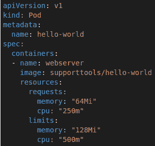
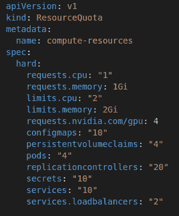
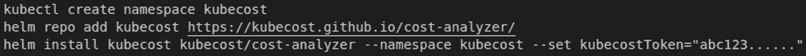

# *第十八章*：资源管理

在本书的最后一章中，我们将讨论资源管理主题，其中包括几个内容。首先是 Pod 资源限制和配额，它允许你在 Pod 层面控制资源的使用。我们将讨论这些限制如何在集群中应用和强制执行。然后，我们将逐步深入，讨论命名空间限制和配额的主题，接着再讨论 Rancher 项目限制的工作方式。最后，我们将讲解如何使用 kubecost 监控我们的 Kubernetes 成本变化。

在本章中，我们将涵盖以下主要内容：

+   如何为 Pod 应用资源限制和配额

+   如何计算命名空间的限制/配额

+   如何使用像 Kubecost 这样的工具跟踪使用情况和成本变化

让我们开始吧！

# 如何为 Pod 应用资源限制和配额

Kubernetes 集群中的物理资源是有限的。资源的衡量标准是每个工作节点分配的 **中央处理单元** (**CPU**) 核心数或 **随机存取存储器** (**RAM**) 的数量。例如，你可能有 10 个工作节点，每个节点 4 个核心，这意味着该集群可以使用 40 个核心。这个集群是可以接受的，直到你开始耗尽资源。正如我们所知，CPU 和内存是有限的，因此我们不能仅仅通过不断添加资源来扩展集群。

在 Kubernetes 中，默认情况下，所有工作负载和命名空间都没有资源限制，意味着没有任何东西可以阻止一个应用程序消耗集群中的所有 CPU 和内存。例如，一个应用程序团队可能会发布一个新工作负载，其中 **水平 Pod 自动伸缩器** (**HPA**) 被错误配置，设定了非常高的上限。需要注意的是，HPA 不允许设置无限制的最大副本数，但没有任何限制阻止你将其设置得非常高。如果 HPA 的指标设置得过低，Kubernetes 会开始扩展工作负载，直到达到最大副本数或者集群资源耗尽。当然，这可能会导致 Kubernetes 集群宕机，尤其是在多个环境之间共享集群时——即在非生产环境与生产环境之间，或在应用程序团队之间共享集群时。我们不希望一个应用程序/团队导致另一个团队的宕机。

为了保护我们的集群，我们需要为工作负载和命名空间设置资源限制和配额，以防止此类宕机事件的发生。我们在两个层级上进行设置。

第一个层级是在工作负载/Pod 层面，我们希望在此设置资源限制和请求。这适用于所有工作负载类型（部署、状态副本集、定时任务、守护进程集等）；然而，资源限制并不是应用在工作负载层面，而是应用在 Pod 层面。如果我为部署设置一个核心的限制，那么这个限制适用于该部署中的每个 Pod，意味着每个 Pod 可以使用一个核心。你不能在工作负载层面设置资源限制；例如，你不能限制一个工作负载中的所有 Pod 总共只使用一个核心。

这是一个**YAML Ain't Markup Language**（**YAML**）输出的 Pod，其中我们要关注的是资源部分。在该部分中，你会看到我们设置了请求和限制。在这个例子中，我们设置了 CPU 请求（最小值）为四分之一核心，限制（最大值）为半个核心。对于内存，我们设置了请求 64 **Mebibytes**（**Mi**）和限制 128 Mi：

图 18.1 – Pod 资源请求和限制 YAML 示例

看一下前面的示例，我们要重点关注`resources`部分。在这个部分中，我们为这个 Pod 定义了请求和限制。`request`值设置了这个 Pod 所需的资源。这个示例告诉 Kubernetes，Pod 需要 64 Mi 的内存和四分之一核心（1,000 `kube-scheduler`使用这些值来查找 Pod 调度过程中所需的可用资源节点。例如，如果我们在 Pod 内运行一个数据库，我们可能会将内存请求设置为 16 `kube-scheduler`构建其候选节点列表时，它会过滤掉没有所需资源的节点。如果一个 Pod 请求的内存超过了任何节点可用的内存，它将卡在调度中。需要注意的是，Kubernetes 不会重新平衡集群以为这个 Pod 腾出空间。一个名为`descheduler`的非官方工具，位于[`github.com/kubernetes-sigs/descheduler`](https://github.com/kubernetes-sigs/descheduler)，尝试做到这一点。一旦 Pod 被调度到节点上，kubelet 将保留该节点上的请求资源。

资源部分的另一个内容是`limits`。这里我们设置了这个 Pod 可以使用的节点资源。例如，我们可能只允许这个 Pod 使用 1 个`free -g`命令，你会看到可用的内存数量会显示在节点上。如果节点有 16 GB 的空闲内存，那么 Pod 将拥有 16 GB 的空闲内存。这就是为什么为你的应用和 Pod 设置内存限制至关重要的原因。

一个经典的例子是 Java 堆大小，因为旧版本的 Java（在 8u191 之前）并不意识到容器的内存和 CPU 限制。Java 会超出其内存和 CPU 限制，因为 Java 认为它有更多的资源可用，因此像垃圾回收这样的操作不会运行以减少内存使用。Red Hat 发布了一篇关于这个话题的精彩博客，详细探讨了这个问题，以及 Java 10 是如何通过**+UseContainerSupport**设置（默认启用）解决这个问题的。你可以在[`developers.redhat.com/blog/2017/03/14/java-inside-docker`](https://developers.redhat.com/blog/2017/03/14/java-inside-docker)找到这篇博客。

但回到内存限制，kubelet/Docker 无法回收内存——即无法从 Pod 中回收内存；只有应用程序才能释放已使用的内存。kubelet/Docker 只能在`top`等程序中记录`WAIT`时间。

Kubernetes 通过添加`BestEffort`类扩展了资源请求和限制。这个优先级类型用于批处理或报告的 Pods，或者用于其他可以随时停止而不会影响最终用户的任务。下一个类是`Burstable`，其主要区别在于它允许 Pod 使用超过定义限制的资源，但前提是节点有可用资源。这个类的典型使用场景是当 Pod 相对静态时，比如数据库，因此我们希望允许它在短时间内使用更多的资源。然而，同时我们不想使用 statefulsets，因为这样做意味着我们无法在集群中移动这个 Pod。另一个主要原因是应用程序使用内存会话的情况，如果 Pod 宕机会导致中断。如果该 Pod 被驱逐，所有会话会丢失，用户必须重新登录。接下来的部分将介绍命名空间限制和配额如何在 Pod 的请求和限制之上构建。

# 如何计算命名空间的限制/配额

设置所有 Pod 的 CPU 和内存请求/限制的一个好处是，您可以定义命名空间的限制和配额，这允许您指定在命名空间中运行的所有 Pod 总共使用的内存和 CPU 数量。这在预算集群资源时非常有用；例如，如果应用程序*A*为其生产环境购买了 16 个 CPU 和 64GB 的 RAM，您可以限制他们的命名空间，确保他们不会消耗超过他们所支付的资源。当然，这可以通过两种模式来实现，第一种是硬限制，这将阻止该命名空间中所有新 Pod 的创建事件。如果我们回到之前的例子，应用程序团队为我们的集群购买了 64GB 的 RAM。假设您有四个 Pod，每个 Pod 的限制是 16GB 的 RAM。当他们尝试启动第五个 Pod 时，它将卡在调度中，直到配额增加或该命名空间中的其他 Pod 释放空间，CPU 的限制和请求也会以相同的方式处理。

当然，命名空间可以有限制和请求，就像 Pod 一样，但理解限制和请求是如何计算的非常重要。`kube-scheduler`简单地将命名空间下所有 Pod 的限制和请求加起来，这意味着它不会使用当前的度量标准来决定 Pod 是否可以在命名空间中调度。需要注意的是，这仅适用于硬限制。软限制使用度量服务器来计算每个 Pod 当前使用的资源。

大多数人遇到的最大问题是允许没有请求和限制的 Pods 进入集群，就像硬限制的情况一样。这些 Pods 不需要参与计算，因为它们的值为零。另一方面，只要指标服务器运行，软限制适用于所有 Pods。因此，通常建议为你的命名空间设置硬限制和软限制。

另一个重要的部分是理解，限制和配额并不是作为命名空间定义的一部分（即命名空间的 YAML 文件）来定义的，而是通过 `ResourceQuota` 类型来定义的，相关示例可以在这里找到：

图 18.2 – 带有更多选项的 ResourceQuota YAML 示例

不过，其中一个很酷的地方是你可以设置的不仅仅是 CPU 和内存的配额，还可以限制诸如 **图形处理单元** (**GPUs**)、Pods、负载均衡器等资源。如果你查看 *图 18.2*，我们为这个命名空间指定了仅允许四个 Pods。对于大多数集群/环境来说，这个数目非常低，但需要注意的是没有免费的午餐。例如，一个拥有 100 个 Pods 和 64 GB 总内存的命名空间，与另一个仅有四个 Pods 却使用相同内存的命名空间，它们的工作负载是不同的。100 个 Pods 给节点和集群管理服务带来的负担要远远大于四个 Pods。同样，存储大量数据的命名空间，比如存储在 secrets 中的数据与存储在 configmaps 中的数据也是不同的，因为 secrets 通常是加密存储的，并存储在 kube-apiservers 的内存中。由于它们是加密的，因此通常无法压缩，而 configmaps 是以纯文本格式存储的，通常是可以压缩的。用户常常为命名空间设置的另一个限制是负载均衡器。在许多云环境中，当你在 Kubernetes 中部署负载均衡器时，通常是在云服务提供商中部署负载均衡器，这会产生费用。

注意

这涉及的是一个第四层负载均衡器，而不是一个入口，通常它是一个共享资源。

Rancher 的一个优点是它建立在命名空间限制和配额之上，允许你定义项目级别的限制和请求。这使你能够为一个可能拥有多个命名空间的团队定义限制。一个经典的例子是非生产集群，在这种集群中，应用程序团队可能会购买 *X* 数量的 CPU 和 RAM，然后选择如何在不同环境中分配这些资源。

例如，他们可能会将一半的资源分配给 DEV 和 QAS，但在负载测试期间，他们可能希望关闭 DEV 和 QAS 命名空间，将这些资源转移到`TEST`命名空间，测试完成后再恢复。作为集群管理员，只要他们保持在项目限制范围内，你不需要关心或进行任何更改。值得注意的是，项目是 Rancher 对象，因为下游集群并不知道什么是项目。Rancher 控制项目，并使用命名空间标签、注释和 Rancher 控制器来同步 Rancher 和下游集群之间的设置。

在下一节中，我们将介绍如何使用工具，如 Kubecost，基于资源配额来构建，允许你进行例如成本回收和费用追踪等操作，以便为集群中的开销提供支持。

# 如何使用如 Kubecost 等工具跟踪使用情况和成本随时间变化的情况

Kubernetes 的一个关键特点是它使应用团队能够快速移动，并且默认情况下几乎没有限制地消耗资源。这意味着，在 Kubernetes 的初期阶段，许多环境往往会有大量开支。一个完美的例子是在*第十三章*中介绍的内容——*Kubernetes 中的扩展*，允许你自动扩展集群和工作负载。这意味着应用团队可能会做出一些改变，导致你的成本显著增加，而你直到账单到来时才知道，而此时你需要回去查找究竟发生了什么变化，当然，随着 Kubernetes 使用一段时间后，资源的回收将变得非常困难。

我们可以通过使用 Kubecost 来解决这个问题，Kubecost 是一款开源的成本监控和报告工具。请注意，Kubecost 有免费社区版和收费的商业产品，后者在开源项目的基础上进行了扩展。Kubecost 连接你的云提供商——如**Amazon Web Services**（**AWS**）、Azure 或**Google Cloud Platform**（**GCP**）——以获取资源的当前成本，然后将该成本与集群中消耗这些资源的 Pods 关联。例如，你在一些节点上使用最新的高性能 CPU，而其他节点使用较旧的（更便宜的）CPU 版本。Kubecost 允许你将不同的成本与 Pod 相关联。因此，你可以选择切换到更新的高性能 CPU，因为你的应用程序/Pods 在它们上运行得更好，并且比慢速 CPU 使用更少的资源。

Kubecost 使用 Helm 图表或 YAML 清单在监控集群中进行部署。目前，Kubecost 不支持远程监控，这意味着它必须在您环境中的每个集群上进行部署。此外，Kubecost 使用 Prometheus 来收集集群中的度量数据，这些数据可以作为 Helm 图表的一部分进行部署；Grafana 也适用于展示仪表盘。Kubecost 有自己的网络度量收集器，用于收集不同类型流量的流量费用；例如，某些云提供商对于跨区域流量的收费高于本地流量。最高的费用是从公共互联网出口的流量，费用可能非常昂贵。俗话说，AWS 希望您将数据带入他们的环境时几乎不收费，但将数据取回时却会收取高昂费用。

这些步骤可以像执行`helm install`命令一样简单，该命令使用一个令牌将您的安装与 Kubecost 账户关联，您可以在下图中找到一个示例。Helm 图表选项的完整列表可以在[`github.com/kubecost/cost-analyzer-helm-chart/blob/master/README.md#config-options`](https://github.com/kubecost/cost-analyzer-helm-chart/blob/master/README.md#config-options)中找到。这些选项允许您自定义部署：

图 18.3 – 具有更多选项的 ResourceQuota YAML 示例

在上述示例中，我们使用默认设置安装 Kubecost，这将部署 Prometheus、Node Exporter 和 Grafana 的独立实例。强烈建议重用当前 Rancher 监控的`global.prometheus.enabled=false`、`prometheus.kube-state-metrics.disabled=true`和`prometheus.nodeExporter.enabled=true`选项。我还建议阅读 Kubecost 的文档，网址为[`guide.kubecost.com`](https://guide.kubecost.com)，该文档包括添加外部资源，如**简单存储服务**（**S3**）和**关系型数据库服务**（**RDS**）。此外，他们的指南会引导您完成允许 Kubecost 查询账单信息以获取任何自定义定价的步骤；例如，AWS 的大型客户可以在某些资源类型上获得账户的断开连接。

最后，Kubecost 有一个实验性的托管版本，可以在 [`guide.kubecost.com/hc/en-us/articles/4425132038167-Installing-Agent-for-Hosted-Kubecost-Alpha-`](https://guide.kubecost.com/hc/en-us/articles/4425132038167-Installing-Agent-for-Hosted-Kubecost-Alpha-) 找到。此外，Kubecost 不是唯一的解决方案，像 Datadog 这样的产品也可以提供成本监控和报告。关键在于，我们希望追踪成本变化，以便知道何时发生变化，当然，由于我们了解每个 Pod 的成本，我们可以为管理层生成报告，展示资金流向，让他们能够回头追究应用团队的资源费用。我们这么做是为了**信息技术**（**IT**）支出的预算规划，使我们能够主动应对，而不是被动反应。

# 总结

本章介绍了 Pod 限制和请求是什么，以及它们如何通过 Kubernetes 强制执行，包括它们是如何计算的。然后，我们介绍了如何在命名空间级别使用资源配额，限制这些配额到团队/应用级别，同时限制其他资源，如负载均衡器、密钥等。接着，我们通过介绍 Rancher 项目进一步深入，允许我们跨命名空间设置限制。最后，我们讨论了如何使用 Kubecost 监控 Kubernetes 成本变化，包括如何安装和自定义它，但更重要的是，我们探讨了为什么要追踪和监控成本。此外，我们还介绍了一些其他解决方案，如 Datadog。

我们共同走过的旅程即将结束。我想祝贺你完成这本书，同时感谢你花时间了解 Rancher 和 Kubernetes。最后一点要提醒的是，Rancher 和 Kubernetes 是一个不断发展的生态系统。最好持续不断地学习，Rancher 官方活动是了解 Rancher 和 Kubernetes 新功能的绝佳资源。你可以通过 [`rancher.com/events`](https://rancher.com/events) 了解更多内容。
